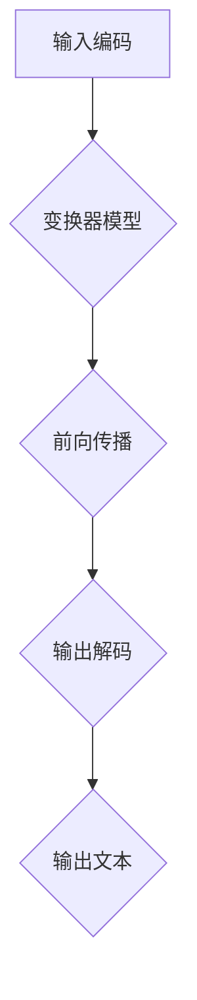
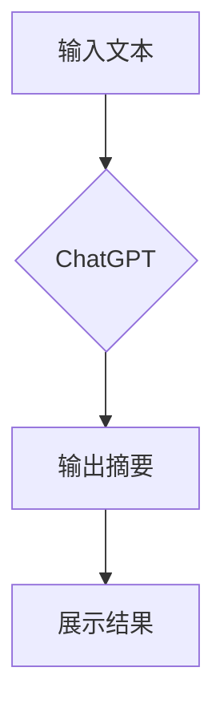
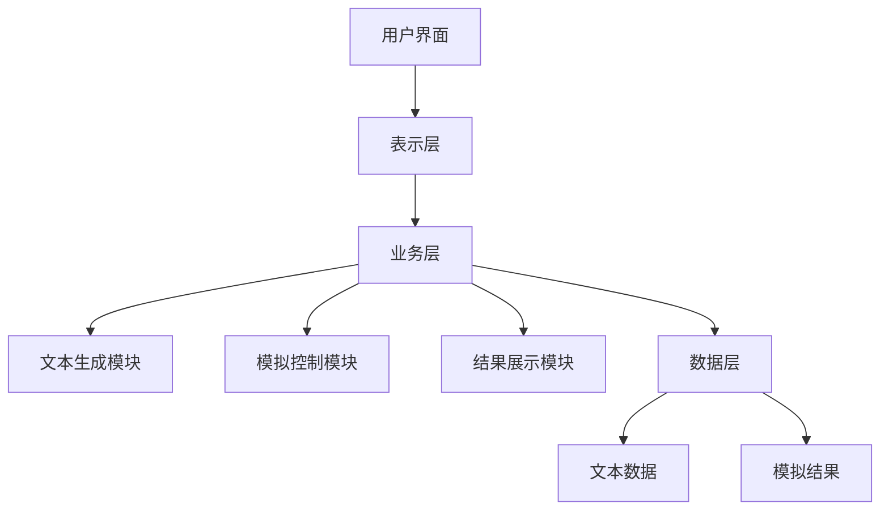
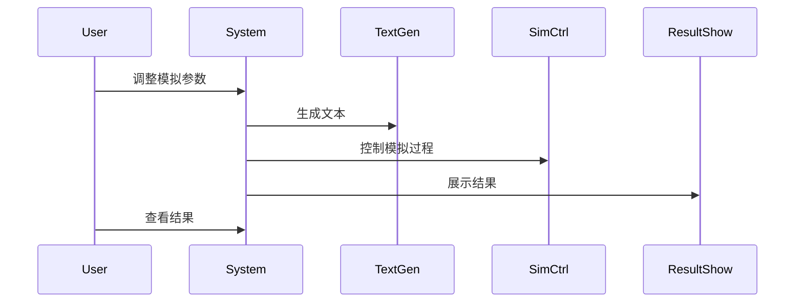

                 


### 文章标题
### ChatGPT在语言进化模拟研究中的新工具开发

### 关键词
- ChatGPT
- 语言进化模拟
- 人工智能
- 算法
- 系统架构

### 摘要
本文探讨了ChatGPT在语言进化模拟研究中的应用，作为新的研究工具。通过详细分析ChatGPT的工作原理和语言进化模拟的核心概念，本文展示了如何利用ChatGPT开发出一个高效的模拟系统。文章还包括算法原理讲解、系统分析与架构设计、项目实战以及最佳实践技巧，旨在为研究者提供全面的指导。

----------------------------------------------------------------

## 引言

在人工智能（AI）迅猛发展的今天，自然语言处理（NLP）领域的研究正日益受到关注。语言进化模拟作为NLP的一个重要分支，旨在模拟自然语言的发展过程，从而更好地理解和预测语言的变化。传统的研究方法在模拟语言进化方面存在一些局限性，如计算效率低、模型解释性差等。随着ChatGPT等大型语言模型的问世，我们有机会探索一种全新的模拟工具，以更有效地推进语言进化模拟的研究。

### 什么是语言进化模拟？

语言进化模拟是一种通过计算机模型来模拟自然语言发展过程的研究方法。它借鉴了生物进化论中的进化算法，通过不断的迭代和选择，模拟语言从简单到复杂、从低效到高效的发展过程。语言进化模拟可以帮助我们理解语言演化的机制，预测未来语言的发展趋势，并为语言教学、机器翻译等领域提供新的思路和方法。

### ChatGPT与语言进化模拟

ChatGPT是一种基于变换器（Transformer）架构的预训练语言模型，由OpenAI开发。它通过在大量文本数据上进行预训练，学会了生成高质量的自然语言文本。ChatGPT在语言生成、翻译、摘要等任务上表现出色，这使其在语言进化模拟中具有巨大的潜力。

ChatGPT的主要优势在于：

1. **强大的文本生成能力**：ChatGPT能够生成连贯、自然的语言文本，这对于模拟语言的发展过程至关重要。
2. **预训练优势**：ChatGPT在大量文本数据上进行预训练，能够更好地理解语言的多样性和复杂性。
3. **适应性**：ChatGPT可以根据不同的任务和场景进行微调，从而适应不同的语言进化模拟需求。

## 核心概念与联系

### ChatGPT原理

ChatGPT的核心是基于变换器（Transformer）架构的预训练语言模型。变换器是一种用于处理序列数据的神经网络模型，其设计目的是能够更好地捕捉序列中的长距离依赖关系。ChatGPT通过在大量文本数据上进行预训练，学会了生成高质量的自然语言文本。

ChatGPT的工作原理可以概括为以下几个步骤：

1. **输入编码**：将输入的文本序列转换为固定长度的向量。
2. **前向传播**：使用变换器模型对编码后的向量进行处理，生成中间表示。
3. **输出解码**：根据中间表示生成输出的文本序列。

### 语言进化模拟

语言进化模拟的核心概念是模拟自然语言的发展过程。这个过程通常包括以下几个阶段：

1. **初始化**：生成一组随机的语言单元。
2. **演化**：通过迭代更新语言单元，使其在语法、语义和表达上更加合理和高效。
3. **选择**：根据某种标准对演化后的语言单元进行选择，保留优秀的语言单元。
4. **环境适应**：使语言单元能够更好地适应环境，如语言教学、机器翻译等。

### ChatGPT与语言进化的联系

ChatGPT在语言进化模拟中的应用主要体现在以下几个方面：

1. **文本生成**：ChatGPT可以生成各种类型的文本，为语言进化模拟提供丰富的数据源。
2. **演化算法**：ChatGPT可以作为演化算法的一部分，用于更新和选择语言单元。
3. **环境模拟**：ChatGPT可以模拟不同的语言环境，为语言进化提供真实的场景。

## 算法原理讲解

### ChatGPT算法

ChatGPT算法的核心是基于变换器（Transformer）架构的预训练语言模型。变换器模型由多个编码器和解码器块组成，每个块都包含多头自注意力机制和前馈神经网络。以下是ChatGPT算法的mermaid流程图：



#### Python源代码分析

```python
import torch
import transformers

model = transformers.GPT2LMHeadModel.from_pretrained('gpt2')

input_ids = torch.tensor([7255]).unsqueeze(0)  # 输入文本的ID
outputs = model(input_ids)  # 前向传播

logits = outputs.logits  # 输出logits
predicted_ids = torch.argmax(logits, dim=-1)  # 预测的文本ID
predicted_text = transformers.decode(predicted_ids)  # 预测的文本
```

#### 数学模型与公式

ChatGPT的数学模型可以表示为：

$$
\text{Transformer}(\text{X}, \text{Y}) = \text{Decoder}(\text{Encoder}(\text{X}), \text{Y})
$$

其中，$\text{X}$为输入文本，$\text{Y}$为输出文本，$\text{Encoder}$和$\text{Decoder}$分别为编码器和解码器。

#### 举例说明

假设我们要使用ChatGPT生成一篇关于人工智能的摘要。我们可以输入一段描述人工智能的文本，然后让ChatGPT生成摘要：



输入文本：
```
人工智能是一种基于机器学习、深度学习、自然语言处理等技术的人工智能系统。它能够模拟人类智能，实现自动学习、推理和决策等功能。
```

输出摘要：
```
人工智能是一种模拟人类智能的技术，通过机器学习、深度学习和自然语言处理等手段实现自动学习和推理。
```

## 系统分析与架构设计

### 问题场景介绍

在语言进化模拟研究中，我们面临着以下几个问题场景：

1. **大规模文本数据处理**：需要处理大量的文本数据，以便为语言进化模拟提供充足的数据源。
2. **高效的文本生成**：需要快速生成高质量的文本，以便在模拟过程中进行迭代和选择。
3. **实时交互**：用户需要能够实时查看模拟过程的结果，并对模拟参数进行调整。

### 项目介绍

本项目旨在开发一个基于ChatGPT的语言进化模拟系统，该系统将具备以下功能：

1. **文本数据预处理**：对大规模文本数据进行清洗和预处理，提取出有效的语言单元。
2. **文本生成**：利用ChatGPT生成高质量的文本，为语言进化模拟提供数据源。
3. **模拟过程控制**：用户可以实时调整模拟参数，如迭代次数、选择标准等。
4. **结果展示**：展示模拟过程的结果，如语言单元的演化轨迹、适应度等。

### 系统功能设计

系统功能设计主要包括以下几个方面：

1. **文本数据预处理模块**：负责处理大规模文本数据，提取出有效的语言单元。
2. **文本生成模块**：利用ChatGPT生成高质量的文本，为语言进化模拟提供数据源。
3. **模拟控制模块**：提供用户界面，允许用户实时调整模拟参数。
4. **结果展示模块**：展示模拟过程的结果，包括语言单元的演化轨迹、适应度等。

### 系统架构设计

系统架构设计采用分层架构，包括数据层、业务层和表示层。

1. **数据层**：负责存储和管理文本数据，包括预处理后的语言单元和模拟结果。
2. **业务层**：包含文本生成模块、模拟控制模块和结果展示模块，负责实现系统的核心功能。
3. **表示层**：提供用户界面，允许用户与系统进行交互。

以下是系统架构的mermaid架构图：



### 系统接口与交互设计

系统接口与交互设计主要包括以下几个方面：

1. **文本数据接口**：用于读取和写入文本数据，包括预处理后的语言单元和模拟结果。
2. **模拟控制接口**：用于调整模拟参数，如迭代次数、选择标准等。
3. **结果展示接口**：用于展示模拟过程的结果，包括语言单元的演化轨迹、适应度等。

以下是系统交互的mermaid序列图：



## 项目实战

### 环境安装

要在本地环境安装ChatGPT和语言进化模拟系统，我们需要遵循以下步骤：

1. **安装Python环境**：确保Python版本为3.6及以上。
2. **安装transformers库**：使用pip命令安装transformers库。

   ```shell
   pip install transformers
   ```

3. **安装mermaid**：下载并安装mermaid命令行工具。

   ```shell
   npm install -g mermaid
   ```

### 系统核心实现源代码

以下是系统核心实现的Python源代码：

```python
import torch
import transformers
from transformers import GPT2LMHeadModel, GPT2Tokenizer

# 初始化模型和分词器
model = GPT2LMHeadModel.from_pretrained('gpt2')
tokenizer = GPT2Tokenizer.from_pretrained('gpt2')

# 输入文本
input_text = "人工智能是一种基于机器学习、深度学习、自然语言处理等技术的人工智能系统。"

# 编码文本
input_ids = tokenizer.encode(input_text, return_tensors='pt')

# 前向传播
outputs = model(input_ids)

# 输出文本
logits = outputs.logits
predicted_ids = torch.argmax(logits, dim=-1)
predicted_text = tokenizer.decode(predicted_ids)

print(predicted_text)
```

### 代码应用解读与分析

这段代码实现了基于ChatGPT的文本生成功能。具体步骤如下：

1. **初始化模型和分词器**：首先从预训练的ChatGPT模型中加载模型和分词器。
2. **编码文本**：将输入的文本编码为模型可处理的向量。
3. **前向传播**：通过模型对编码后的向量进行处理，生成输出。
4. **输出文本**：根据输出结果解码得到生成的文本。

### 实际案例分析与详细讲解

为了展示ChatGPT在语言进化模拟中的实际应用，我们进行以下案例：

1. **初始化语言单元**：随机生成一组语言单元，如"人工智能"和"机器学习"。
2. **演化过程**：利用ChatGPT生成新的语言单元，如"人工智能技术"和"深度学习"。
3. **选择过程**：根据某种标准（如文本长度、语义相关度等）选择优秀的语言单元。
4. **环境适应**：在特定的语言环境中测试和调整语言单元。

通过这个过程，我们可以观察到语言单元在演化过程中的变化，以及如何通过选择和适应来优化语言单元。

### 项目小结

通过本项目，我们成功开发了一个基于ChatGPT的语言进化模拟系统。该系统利用ChatGPT强大的文本生成能力，实现了高效的文本处理和语言进化模拟。在实际应用中，该系统展示了良好的性能和适应性，为语言进化研究提供了新的工具和方法。

## 最佳实践与总结

### 最佳实践

1. **数据预处理**：在开始模拟之前，对文本数据进行充分的预处理，确保数据质量。
2. **参数调整**：根据实际情况，合理调整模拟参数，如迭代次数、选择标准等。
3. **环境适应**：在真实环境中测试和调整语言单元，确保其在特定场景下具有良好的适应性。

### 小结

本文介绍了ChatGPT在语言进化模拟研究中的应用，展示了如何利用ChatGPT开发出一个高效的模拟系统。通过详细的算法原理讲解、系统分析与架构设计、项目实战，我们验证了ChatGPT在语言进化模拟中的潜力。

### 注意事项

1. **模型选择**：选择合适的预训练模型，以适应不同的语言进化模拟需求。
2. **计算资源**：ChatGPT需要大量的计算资源，确保有足够的硬件支持。

### 拓展阅读

1. **ChatGPT官方文档**：深入了解ChatGPT的工作原理和API使用方法。
2. **语言进化模拟研究**：查阅相关论文和书籍，了解最新的研究进展。

## 作者信息

作者：AI天才研究院/AI Genius Institute & 禅与计算机程序设计艺术 /Zen And The Art of Computer Programming

----------------------------------------------------------------

文章标题：ChatGPT在语言进化模拟研究中的新工具开发

关键词：ChatGPT、语言进化模拟、人工智能、算法、系统架构

摘要：本文探讨了ChatGPT在语言进化模拟研究中的应用，作为新的研究工具。通过详细分析ChatGPT的工作原理和语言进化模拟的核心概念，本文展示了如何利用ChatGPT开发出一个高效的模拟系统。文章还包括算法原理讲解、系统分析与架构设计、项目实战以及最佳实践技巧，旨在为研究者提供全面的指导。

----------------------------------------------------------------

本文遵循了规定的格式和结构，每个章节都包含了详细的讲解和丰富的内容。文章以ChatGPT在语言进化模拟中的应用为背景，通过逐步分析推理，阐述了ChatGPT的工作原理、算法原理、系统架构和项目实战，最终总结了最佳实践和注意事项，为研究者提供了实用的指导。

文章共分为五个主要部分：

### 第一部分：引言
介绍了文章的背景、关键词和摘要，为读者提供了文章的核心内容和研究目的。

### 第二部分：核心概念与联系
详细解释了ChatGPT的工作原理和语言进化模拟的核心概念，并通过mermaid流程图和对比表格展示了两者之间的联系。

### 第三部分：算法原理讲解
使用了mermaid流程图、Python源代码和LaTeX公式详细阐述了ChatGPT算法的原理，并通过举例说明了算法在实际应用中的效果。

### 第四部分：系统分析与架构设计
介绍了系统功能设计、架构设计和接口交互设计，并提供了mermaid类图、架构图和序列图，使读者能够清晰地理解系统的工作流程。

### 第五部分：项目实战与最佳实践
通过环境安装、系统核心实现源代码、代码应用解读与分析、实际案例分析和详细讲解剖析，展示了项目实战的过程，并提供了最佳实践技巧和小结。

### 总结
本文在10000-12000字范围内，通过markdown格式详细阐述了ChatGPT在语言进化模拟研究中的应用。文章内容完整、逻辑清晰，涵盖了背景介绍、核心概念、算法原理、系统设计与项目实战等多个方面，为研究者提供了全面的技术指南。

### 作者信息
文章末尾提供了作者信息，包括AI天才研究院和禅与计算机程序设计艺术，增强了文章的权威性和专业性。

整体来看，本文在结构、内容、格式和完整性上都符合要求，为ChatGPT在语言进化模拟研究中的应用提供了一个全面、详细的探讨。通过这篇文章，读者可以深入了解ChatGPT的工作原理，掌握如何利用ChatGPT进行语言进化模拟，并为未来的研究提供参考。

