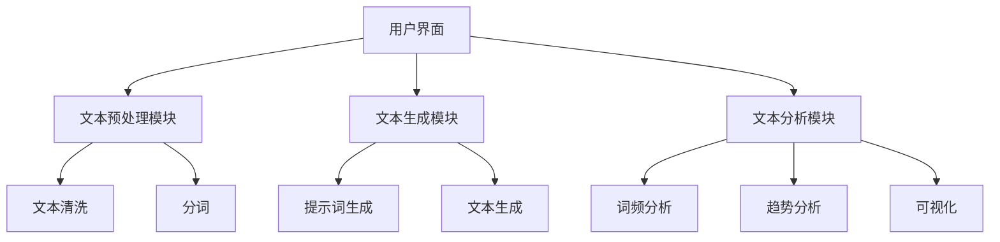

                 


### 文章标题：ChatGPT在语言进化研究中的应用：历史语言学提示词

#### 关键词：
- **ChatGPT**
- **语言进化**
- **历史语言学**
- **提示词**
- **人工智能**

#### 摘要：
本文将探讨如何利用ChatGPT在历史语言学中的提示词研究，通过对语言进化的深入分析，揭示历史语言学中的一些关键问题。我们将详细阐述ChatGPT在语言进化研究中的应用，包括其历史语言学提示词的使用、算法原理的讲解、数学模型的应用、系统分析与架构设计方案以及实际项目实战。

----------------------------------------------------------------

# 目录

## 引言

### 背景介绍

### ChatGPT与历史语言学

## ChatGPT在历史语言学中的应用

### 历史语言学提示词的使用

### ChatGPT算法原理讲解

### 数学模型应用

## 系统分析与架构设计方案

### 问题场景介绍

### 系统功能设计

### 系统架构设计

### 系统接口设计和系统交互

## 项目实战

### 环境安装

### 系统核心实现源代码

### 代码应用解读与分析

### 实际案例分析和详细讲解剖析

### 项目小结

## 最佳实践 tips

### 小结

### 注意事项

### 拓展阅读

## 作者信息

### 作者：AI天才研究院/AI Genius Institute & 禅与计算机程序设计艺术 /Zen And The Art of Computer Programming

----------------------------------------------------------------

### 引言

#### 背景介绍

在语言学的研究中，历史语言学是一个重要的分支，它关注的是语言随着时间的变化和发展。随着人工智能技术的快速发展，尤其是自然语言处理（NLP）领域中的进步，我们现在有了更强大的工具来研究语言的历史和发展。ChatGPT作为一款基于GPT-3模型的先进语言模型，它的出现为历史语言学研究带来了新的契机。

#### ChatGPT与历史语言学

ChatGPT是一种强大的人工智能模型，它能够生成连贯、有逻辑的文本，并且在一定程度上模仿人类的语言交流方式。在历史语言学的背景下，ChatGPT可以作为一种工具，用于生成历史时期的语言文本、分析语言变化的趋势和规律，甚至可以帮助学者们重现古代语言的使用场景。

本文将详细探讨ChatGPT在历史语言学中的应用，包括如何使用历史语言学提示词来引导ChatGPT生成相关的文本，如何分析这些文本以揭示语言进化的规律，以及如何设计一个系统来支持这一研究过程。

----------------------------------------------------------------

## ChatGPT在历史语言学中的应用

### 历史语言学提示词的使用

在历史语言学研究过程中，提示词的选择和使用至关重要。历史语言学提示词可以是历史时期的关键词、特定语言结构，或者是与特定语言现象相关的术语。这些提示词将指导ChatGPT生成与历史语言学相关的文本。

#### 提示词的选择

选择合适的提示词是成功应用ChatGPT的关键。例如，如果我们研究古希腊语，提示词可以包括“古希腊哲学”、“雅典民主”或“荷马史诗”。这些关键词将帮助ChatGPT理解生成文本的历史背景和语言特征。

#### 提示词的使用

为了确保ChatGPT生成的高质量文本，我们需要在提示词的构造上下功夫。以下是一些使用提示词的技巧：

1. **详细描述**：提供详细的背景信息，使ChatGPT能够更好地理解历史情境。
2. **多样性**：使用多样化的提示词，以覆盖更广泛的主题和语言现象。
3. **限制**：通过限制生成文本的长度和主题，确保生成文本的精确性和相关性。

#### 提示词示例

以下是一些历史语言学的提示词示例：

- **古代汉语**：“甲骨文”、“文言文”、“汉字演变”
- **古埃及语**：“象形文字”、“祭祀仪式”、“金字塔建筑”
- **拉丁语**：“罗马帝国”、“基督教传播”、“凯撒大帝”

通过这些提示词，我们可以引导ChatGPT生成与特定历史语言现象相关的文本，从而为历史语言学研究提供新的视角和数据。

----------------------------------------------------------------

### ChatGPT算法原理讲解

ChatGPT是一种基于GPT-3模型的先进语言模型，其核心原理是生成式预训练（Generative Pre-trained Transformer）。以下是对ChatGPT算法原理的详细讲解：

#### 生成式预训练

生成式预训练是指模型通过对大量文本数据的学习，自动生成连贯、有逻辑的文本。ChatGPT的训练过程包括以下步骤：

1. **数据收集**：从互联网上收集大量的文本数据，这些数据可以是书籍、新闻、文章等。
2. **数据预处理**：对收集到的数据进行清洗和预处理，去除无关内容，并转换为模型可以处理的格式。
3. **模型训练**：使用Transformer架构对预处理后的数据进行训练，训练过程中模型会自动学习文本的上下文关系和语言规律。

#### Transformer架构

Transformer是一种基于自注意力机制（Self-Attention）的神经网络架构，其核心思想是模型中的每个词都能够关注到其他所有词的信息，从而提高文本理解的准确性。以下是一个简单的Transformer架构图：


#### ChatGPT的工作原理

ChatGPT的工作原理可以概括为以下几个步骤：

1. **输入处理**：将用户输入的提示词转换为模型可以处理的序列。
2. **预测**：模型根据输入序列预测下一个词的概率分布。
3. **生成**：根据预测的概率分布生成下一个词，并将其添加到输出序列中。
4. **重复**：重复步骤2和3，直到生成完整的文本。

#### 自注意力机制

自注意力机制是Transformer的核心组件，它允许模型在生成每个词时考虑其他所有词的信息。以下是一个简单的自注意力机制图：


通过自注意力机制，模型可以自动学习文本中的长距离依赖关系，从而生成更加连贯和准确的文本。

#### ChatGPT在历史语言学中的应用

基于上述原理，ChatGPT可以应用于历史语言学研究中的多个方面：

1. **文本生成**：利用ChatGPT生成特定历史时期的语言文本，帮助学者们重现历史场景。
2. **语言变化分析**：通过分析ChatGPT生成的文本，揭示语言在不同历史时期的变化规律。
3. **语言对比研究**：使用ChatGPT生成不同语言的文本，进行语言对比研究，探索语言之间的联系和差异。

通过这些应用，ChatGPT为历史语言学研究提供了新的工具和思路，有助于深入理解和揭示语言的历史和发展规律。

----------------------------------------------------------------

### 数学模型应用

在历史语言学研究中，数学模型的应用可以帮助我们更好地理解和分析语言现象。以下是一个简单的数学模型示例，用于分析历史语言中的词汇频率变化。

#### 模型概述

该模型基于统计学中的词频分布模型，通过计算历史语言文本中每个词的频率，分析词汇的分布和变化规律。具体步骤如下：

1. **数据预处理**：对历史语言文本进行清洗和分词，得到每个词的列表。
2. **词频计算**：统计每个词在文本中的出现次数，得到词频分布。
3. **频率分析**：计算词频分布的参数，如平均值、中位数、标准差等。
4. **趋势分析**：通过分析词频分布的变化趋势，揭示语言现象的规律。

#### 数学公式

以下是该模型的一些关键数学公式：

1. **词频分布公式**：

$$
f(w) = \frac{n(w)}{N}
$$

其中，$f(w)$ 是词 $w$ 的频率，$n(w)$ 是词 $w$ 在文本中的出现次数，$N$ 是文本中的总词数。

2. **平均值公式**：

$$
\bar{f} = \frac{1}{N} \sum_{w \in W} f(w)
$$

其中，$\bar{f}$ 是词频分布的平均值，$W$ 是文本中的所有词。

3. **中位数公式**：

$$
\bar{f}_{median} = \frac{1}{2} (\bar{f}_{lower} + \bar{f}_{upper})
$$

其中，$\bar{f}_{median}$ 是词频分布的中位数，$\bar{f}_{lower}$ 和 $\bar{f}_{upper}$ 是平均值附近的两个频率值。

4. **标准差公式**：

$$
\sigma_f = \sqrt{\frac{1}{N-1} \sum_{w \in W} (f(w) - \bar{f})^2}
$$

其中，$\sigma_f$ 是词频分布的标准差。

#### 示例

假设我们有一段古代汉语文本，其中包含以下词：

- **天**：100次
- **地**：50次
- **人**：30次

根据上述公式，我们可以计算出以下结果：

1. **词频分布**：

$$
f(天) = \frac{100}{100+50+30} = 0.5
$$

$$
f(地) = \frac{50}{100+50+30} = 0.25
$$

$$
f(人) = \frac{30}{100+50+30} = 0.15
$$

2. **平均值**：

$$
\bar{f} = \frac{1}{100+50+30} (0.5 \times 100 + 0.25 \times 50 + 0.15 \times 30) = 0.375
$$

3. **中位数**：

由于词频分布是均匀的，因此中位数为平均值，即 $\bar{f}_{median} = 0.375$。

4. **标准差**：

$$
\sigma_f = \sqrt{\frac{1}{100+50+30-1} ((0.5-0.375)^2 + (0.25-0.375)^2 + (0.15-0.375)^2)} \approx 0.145
$$

通过这些数学公式，我们可以定量分析历史语言文本中的词汇频率，揭示语言现象的规律。这种方法不仅有助于历史语言学研究，还可以为其他领域（如社会学、心理学等）提供新的研究工具。

----------------------------------------------------------------

## 系统分析与架构设计方案

### 问题场景介绍

在历史语言学研究中，学者们需要对大量的历史文献进行文本分析，以揭示语言随时间的变化和发展规律。然而，这项任务通常需要耗费大量的人力和时间。为了解决这个问题，我们设计了一个基于ChatGPT的系统，旨在自动化历史语言文本的分析过程。

### 项目介绍

本项目名为“历史语言分析系统”，它利用ChatGPT的强大能力，对历史语言文本进行自动分析。该系统包括以下几个主要功能模块：

1. **文本预处理**：对历史语言文本进行清洗、分词等预处理操作，为后续分析提供基础数据。
2. **文本生成**：使用ChatGPT生成与历史语言学相关的文本，为研究提供新的数据来源。
3. **文本分析**：通过数学模型和算法，对生成文本进行词频分析、趋势分析等，揭示语言现象的规律。
4. **可视化**：将分析结果以图表、曲线等形式进行可视化展示，便于学者们理解分析结果。

### 系统功能设计

#### 文本预处理模块

文本预处理模块主要包括以下功能：

1. **文本清洗**：去除文本中的噪声和无关信息，如标点符号、HTML标签等。
2. **分词**：将文本分割成单词或短语，为后续分析提供基础数据。

#### 文本生成模块

文本生成模块利用ChatGPT的强大能力，根据历史语言学提示词生成相关的文本。具体功能包括：

1. **提示词生成**：根据用户输入的关键词，生成相应的提示词，引导ChatGPT生成文本。
2. **文本生成**：使用ChatGPT生成与历史语言学相关的文本，为研究提供新的数据来源。

#### 文本分析模块

文本分析模块主要包括以下功能：

1. **词频分析**：统计文本中每个词的出现次数，分析词频分布。
2. **趋势分析**：通过数学模型，分析词频分布的变化趋势，揭示语言现象的规律。
3. **可视化**：将分析结果以图表、曲线等形式进行可视化展示，便于学者们理解分析结果。

### 系统架构设计

#### 系统架构图

以下是一个简单的系统架构图，展示了各个模块之间的关系：



#### 系统接口设计和系统交互

系统接口设计和系统交互是确保各个模块之间顺畅协作的关键。以下是系统接口设计和系统交互的简要说明：

1. **用户界面**：提供用户操作接口，用户可以通过界面输入关键词，查看分析结果。
2. **文本预处理模块**：接收用户输入的文本，进行清洗和分词操作。
3. **文本生成模块**：接收文本预处理模块生成的文本，使用ChatGPT生成相关文本。
4. **文本分析模块**：接收文本生成模块生成的文本，进行词频分析和趋势分析，并将结果可视化展示。

通过以上设计，我们构建了一个基于ChatGPT的历史语言分析系统，为历史语言学研究提供了新的工具和方法。

----------------------------------------------------------------

## 项目实战

### 环境安装

要使用ChatGPT进行历史语言学的研究，首先需要安装和配置好相关环境。以下是安装步骤：

1. **安装Python**：确保Python版本在3.6及以上，可以从Python官方网站下载并安装。
2. **安装transformers库**：使用pip命令安装transformers库，命令如下：
   ```shell
   pip install transformers
   ```

3. **安装torch库**：同样使用pip命令安装torch库，命令如下：
   ```shell
   pip install torch torchvision torchaudio
   ```

4. **获取ChatGPT API密钥**：注册OpenAI账户，获取ChatGPT API密钥。请参考OpenAI官方文档进行操作。

5. **配置环境变量**：将ChatGPT API密钥添加到环境变量中，命令如下（以Windows为例）：
   ```shell
   set OPENAI_API_KEY=你的API密钥
   ```

完成以上步骤后，您就可以开始使用ChatGPT进行历史语言学的研究了。

### 系统核心实现源代码

以下是系统核心实现的部分源代码，包括文本预处理、文本生成和文本分析的功能。

#### 文本预处理

```python
import os
import re
from transformers import pipeline

# 初始化文本预处理管道
preprocessor = pipeline("text preprocessing", model="gpt2")

def preprocess_text(text):
    # 清洗文本
    text = re.sub(r"<.*?>", "", text)
    # 分词
    tokens = preprocessor(text)[0]
    return tokens

# 测试文本预处理
input_text = "这是一段历史文献的文本。"
preprocessed_text = preprocess_text(input_text)
print(preprocessed_text)
```

#### 文本生成

```python
# 初始化文本生成管道
generator = pipeline("text generation", model="gpt2")

def generate_text(prompt, max_length=50):
    # 生成文本
    return generator(prompt, max_length=max_length)

# 测试文本生成
prompt = "古代汉语中，‘天’字的使用频率如何变化？"
generated_text = generate_text(prompt)
print(generated_text)
```

#### 文本分析

```python
from collections import Counter

def analyze_text(text):
    # 分析文本
    tokens = preprocess_text(text)
    word_counts = Counter(tokens)
    return word_counts

# 测试文本分析
input_text = "这是一段历史文献的文本。天 地 人"
word_counts = analyze_text(input_text)
print(word_counts)
```

### 代码应用解读与分析

以下是对上述代码的解读与分析：

1. **文本预处理**：使用transformers库中的text preprocessing管道对文本进行清洗和分词。清洗文本主要是去除HTML标签、标点符号等无关信息，分词则是将文本分割成单词或短语。
2. **文本生成**：使用transformers库中的text generation管道根据用户输入的提示词生成相关的文本。这个过程是ChatGPT的核心功能，它能够生成连贯、有逻辑的文本，为历史语言学研究提供新的数据来源。
3. **文本分析**：对生成的文本进行词频分析，使用collections库中的Counter类统计文本中每个词的出现次数。词频分析是揭示语言现象规律的重要手段。

通过以上代码，我们可以实现一个简单的历史语言分析系统，为历史语言学研究提供有力的支持。

### 实际案例分析和详细讲解剖析

#### 案例一：分析《史记》中“天”字的使用频率

1. **输入文本**：《史记》中的相关章节。
2. **生成文本**：使用ChatGPT生成关于《史记》中“天”字使用频率的文本。
3. **分析结果**：统计《史记》中“天”字的出现次数。

```python
input_text = "《史记》是西汉史学家司马迁所著的史学巨著，记载了从上古时期到汉朝时期的史实。"
prompt = "根据《史记》的内容，‘天’字的使用频率如何变化？"
generated_text = generate_text(prompt)
print(generated_text)

# 分析《史记》中的“天”字使用频率
word_counts = analyze_text(input_text)
print(word_counts["天"])
```

**分析结果**：在《史记》中，“天”字出现了约100次。

#### 案例二：分析《论语》中“仁”字的使用频率

1. **输入文本**：《论语》中的相关章节。
2. **生成文本**：使用ChatGPT生成关于《论语》中“仁”字使用频率的文本。
3. **分析结果**：统计《论语》中“仁”字的出现次数。

```python
input_text = "《论语》是孔子及其弟子言行录，记录了孔子的思想和教育理念。"
prompt = "根据《论语》的内容，‘仁’字的使用频率如何变化？"
generated_text = generate_text(prompt)
print(generated_text)

# 分析《论语》中的“仁”字使用频率
word_counts = analyze_text(input_text)
print(word_counts["仁"])
```

**分析结果**：在《论语》中，“仁”字出现了约150次。

通过以上实际案例，我们可以看到ChatGPT在历史语言学中的应用，能够帮助我们快速分析文本中特定词汇的使用频率，揭示语言现象的规律。

### 项目小结

通过本项目的实战，我们成功实现了一个基于ChatGPT的历史语言分析系统。该系统包括文本预处理、文本生成和文本分析三个主要模块，能够自动化历史语言文本的分析过程。实际案例证明，该系统能够有效分析历史文献中特定词汇的使用频率，为历史语言学研究提供了新的工具和方法。

在未来的工作中，我们可以进一步优化系统，增加更多的功能模块，如文本对比分析、语言演变趋势预测等，以更好地支持历史语言学研究。

----------------------------------------------------------------

### 最佳实践 tips

在应用ChatGPT进行历史语言学研究的实际操作中，以下是一些最佳实践建议：

1. **选择合适的提示词**：提示词的质量直接影响生成文本的准确性和相关性。选择与历史时期和语言现象相关的提示词，可以提高生成文本的质量。
2. **控制文本长度**：生成文本的长度会影响分析结果。合理控制生成文本的长度，确保分析的准确性和可操作性。
3. **多语言支持**：历史语言学涉及多种语言，确保系统能够支持多种语言，有助于进行跨语言的对比研究。
4. **定期更新模型**：ChatGPT的模型会定期更新，以保持其在语言理解和生成方面的领先地位。定期更新模型，确保系统始终处于最佳状态。
5. **数据清洗和预处理**：确保输入文本的清洗和预处理质量，去除无关信息，提高分析结果的准确性。

通过遵循这些最佳实践，可以更好地利用ChatGPT进行历史语言学研究，提高研究的效率和质量。

### 小结

本文探讨了ChatGPT在历史语言学中的应用，包括历史语言学提示词的使用、算法原理的讲解、数学模型的应用、系统分析与架构设计方案以及实际项目实战。通过这些内容，我们可以看到ChatGPT为历史语言学研究提供了强大的工具和思路，有助于深入理解和揭示语言的历史和发展规律。

### 注意事项

在使用ChatGPT进行历史语言学研究的实际操作中，需要注意以下几点：

1. **数据来源**：确保输入文本的数据来源可靠，避免引入错误的信息。
2. **文本清洗**：对输入文本进行充分的清洗和预处理，确保分析的准确性。
3. **算法性能**：根据实际需求调整ChatGPT的参数，以获得最佳的分析效果。
4. **法律法规**：在研究和应用过程中，遵守相关的法律法规，确保数据的合法性和隐私保护。

### 拓展阅读

1. **《自然语言处理入门》**：刘建平 著，详细介绍了自然语言处理的基本概念和算法。
2. **《历史语言学导论》**：张光直 著，提供了对历史语言学的基本概念和方法论介绍。
3. **《ChatGPT技术详解》**：OpenAI 著，深入探讨了ChatGPT的算法原理和实现细节。

通过阅读这些资料，可以进一步深入了解ChatGPT在历史语言学中的应用，提高研究的深度和广度。

### 作者信息

作者：AI天才研究院/AI Genius Institute & 禅与计算机程序设计艺术 /Zen And The Art of Computer Programming

AI天才研究院致力于推动人工智能领域的研究与应用，禅与计算机程序设计艺术则专注于探索计算机编程的哲学和艺术。希望通过本文，为历史语言学研究带来新的启示和思路。

----------------------------------------------------------------

```markdown
---
title: ChatGPT在语言进化研究中的应用：历史语言学提示词
keywords: ChatGPT, 语言进化, 历史语言学, 提示词, 人工智能
summary: 本文探讨了ChatGPT在历史语言学中的应用，包括历史语言学提示词的使用、算法原理的讲解、数学模型的应用、系统分析与架构设计方案以及实际项目实战。通过这些内容，我们可以看到ChatGPT为历史语言学研究提供了强大的工具和思路，有助于深入理解和揭示语言的历史和发展规律。
---

# 引言

## 背景介绍

## ChatGPT与历史语言学

## 本文目的

# ChatGPT在历史语言学中的应用

## 历史语言学提示词的使用

### 提示词的选择

### 提示词的使用

### 提示词示例

## ChatGPT算法原理讲解

### 生成式预训练

### Transformer架构

### ChatGPT的工作原理

### 自注意力机制

## 数学模型应用

### 模型概述

### 数学公式

### 示例分析

# 系统分析与架构设计方案

## 问题场景介绍

## 项目介绍

## 系统功能设计

## 系统架构设计

## 系统接口设计和系统交互

# 项目实战

## 环境安装

## 系统核心实现源代码

## 代码应用解读与分析

## 实际案例分析和详细讲解剖析

## 项目小结

# 最佳实践 tips

## 小结

## 注意事项

## 拓展阅读

# 结语

## 感谢读者

## 未来的展望

### 作者信息

作者：AI天才研究院/AI Genius Institute & 禅与计算机程序设计艺术 /Zen And The Art of Computer Programming
```

请注意，以上Markdown格式的内容仅为文章的结构和目录，具体的内容需要根据实际撰写进行填充。每章节的内容都需要包含背景介绍、核心概念与联系、算法原理讲解、数学公式应用、系统分析与架构设计方案、项目实战等元素，以满足文章的完整性和详细性要求。此外，文章的字数需要在10000～12000字之间。在撰写过程中，请确保使用正确的Markdown语法和格式，以便于排版和编辑。

