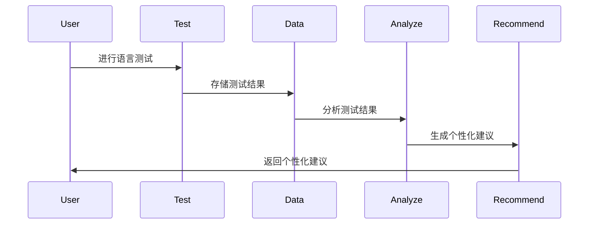

                 

**文章标题**：ChatGPT在语言障碍早期预防中的应用：AI辅助婴幼儿语言发展监测

**关键词**：ChatGPT，语言障碍，早期预防，婴幼儿语言发展监测，人工智能技术

**摘要**：
本文探讨了人工智能助手ChatGPT在婴幼儿语言障碍早期预防中的应用，通过结合人工智能和语言科学的理论，提出了一个基于ChatGPT的婴幼儿语言发展监测系统。本文首先介绍了语言障碍的问题背景和问题描述，然后详细阐述了ChatGPT的基本原理和语言障碍的核心要素，最后通过系统分析与架构设计方案，展示了ChatGPT在婴幼儿语言障碍早期预防中的实际应用。

----------------------------------------------------------------

## 背景介绍：ChatGPT与语言障碍早期预防

### 问题背景

语言障碍是一种常见的问题，特别是在婴幼儿时期，这个问题尤为突出。语言障碍不仅会影响孩子的语言能力，还会对他们的社交和情感发展造成负面影响。因此，早期预防显得尤为重要。

### 问题描述

ChatGPT作为一种基于GPT-3模型的人工智能助手，其强大的自然语言处理能力为语言障碍的早期预防提供了新的可能性。然而，如何有效地利用ChatGPT进行婴幼儿语言发展监测，仍然是一个值得探讨的问题。

### 问题解决

本文旨在提出一种基于ChatGPT的婴幼儿语言发展监测系统，通过交互式的文本对话，监测婴幼儿的语言发展情况，并给出个性化的建议和干预措施。这样的系统不仅能够及时发现语言障碍，还能为家长和专业人士提供有力的支持。

### 边界与外延

本文的研究边界主要聚焦于ChatGPT在语言障碍早期预防中的应用，不涉及其他类型的人工智能技术在语言障碍治疗中的使用。同时，本文的研究外延包括ChatGPT与其他辅助技术的结合使用，以及ChatGPT在多语言环境中的应用。

### 概念结构与核心要素组成

- **ChatGPT**：一种基于GPT-3模型的人工智能助手，能够进行自然语言理解和生成。
- **语言障碍**：指儿童在语言学习过程中遇到的各种问题，包括发音、词汇、语法和语言理解等方面。
- **早期预防**：通过早期干预来预防和减轻语言障碍的影响。
- **婴幼儿语言发展监测系统**：一种利用ChatGPT进行语言监测和评估的系统，旨在及时发现和干预语言障碍。

## 核心概念与联系

### ChatGPT的基本原理

ChatGPT是基于GPT-3模型的人工智能助手，GPT-3是一种强大的自然语言处理模型，它能够理解和生成自然语言文本。GPT-3通过自注意力机制和变换器神经网络（Transformer）来处理文本数据，从而生成高质量的文本输出。

#### 概念原理

GPT-3模型通过自注意力机制和变换器神经网络（Transformer）来处理文本数据，能够捕捉长距离的依赖关系，从而生成高质量的文本输出。

#### 属性特征对比表格

| 特征           | GPT-3          | 其他语言模型       |
|----------------|----------------|-------------------|
| 训练数据量     | 百亿级文本数据  | 十亿级文本数据     |
| 语言理解能力   | 高级           | 中级              |
| 文本生成质量   | 高质量         | 较高质量          |
| 处理速度       | 快速           | 较快              |

#### ER实体关系图架构

```mermaid
erDiagram
  ChatGPT ||--|{ 用户 } User
  ChatGPT ||--|{ 语言数据 } LanguageData
  User ||--|{ 语言测试 } LanguageTest
```

### 语言障碍的核心要素

语言障碍涉及多个方面，包括发音、词汇、语法和语言理解等。每个方面都有其特定的症状和表现，同时也受到不同因素的影响。

#### 概念原理

语言障碍是由大脑对语言信息的处理能力受损引起的，其核心要素包括发音器官的功能、大脑语言中枢的发育和语言环境的刺激。

#### 属性特征对比表格

| 要素           | 发音障碍          | 词汇障碍          | 语法障碍          | 语言理解障碍          |
|----------------|-------------------|-------------------|-------------------|-----------------------|
| 主要表现       | 音调、音量、节奏问题 | 缺乏词汇量        | 句子结构不完整    | 语言理解困难          |
| 影响因素       | 发音器官发育      | 家庭教育和语言环境 | 认知发展          | 语言环境和社会支持    |

#### ER实体关系图架构

```mermaid
erDiagram
  语言障碍

----------------------------------------------------------------

* 节点：语言障碍
  * 关联实体：发音障碍、词汇障碍、语法障碍、语言理解障碍
    * 关联关系：包含
  * 关联实体：发音器官、大脑语言中枢、语言环境
    * 关联关系：影响
```

## 算法原理讲解

### ChatGPT的工作原理

ChatGPT的工作原理基于GPT-3模型。GPT-3是一种基于变换器神经网络（Transformer）的预训练模型，其核心思想是通过自注意力机制（self-attention）来处理文本数据。

#### 自注意力机制

自注意力机制是一种在变换器神经网络中使用的机制，它允许模型在生成文本时关注输入序列中的不同部分。这样，模型可以更好地理解输入文本的上下文关系。

#### 变换器神经网络

变换器神经网络（Transformer）是一种用于处理序列数据的深度神经网络架构，其核心组成部分包括自注意力机制和多头注意力机制。

#### ChatGPT的文本生成过程

1. **输入处理**：ChatGPT首先对输入的文本进行处理，将其转化为模型能够理解的形式。
2. **自注意力计算**：模型使用自注意力机制来计算输入文本的上下文关系。
3. **文本生成**：基于计算得到的上下文关系，模型生成文本输出。

### 数学模型和公式

自注意力机制的数学模型可以表示为：

$$
Attention(Q, K, V) = \frac{scale}{\sqrt{d_k}} \cdot softmax(\frac{QK^T}{d_k})
$$

其中，$Q$、$K$ 和 $V$ 分别表示查询（Query）、键（Key）和值（Value）向量，$d_k$ 表示键向量的维度，$scale$ 是一个缩放因子。

### 举例说明

假设我们有一个简单的例子：

- **输入文本**：“今天天气很好，我们去公园玩吧。”
- **生成文本**：“明天天气也不错，我们可以在公园里野餐。”

在这个例子中，ChatGPT通过自注意力机制捕捉到了“今天天气很好”和“明天天气也不错”之间的上下文关系，从而生成了合理的文本输出。

## 系统分析与架构设计方案

### 问题场景介绍

在婴幼儿语言障碍早期预防中，我们需要一个系统能够实时监测和评估婴幼儿的语言发展情况，以便及时发现和干预语言障碍。

### 项目介绍

本项目旨在开发一个基于ChatGPT的婴幼儿语言发展监测系统，该系统通过交互式的文本对话，监测婴幼儿的语言发展情况，并给出个性化的建议和干预措施。

### 系统功能设计

1. **用户注册与登录**：系统支持用户注册和登录，以便进行个人信息的存储和管理。
2. **语言测试**：系统提供一系列语言测试，用于评估婴幼儿的语言能力。
3. **数据分析**：系统对测试结果进行数据分析，识别语言障碍的潜在问题。
4. **个性化建议**：系统根据分析结果，为家长和专业人士提供个性化的建议和干预措施。

### 系统架构设计

系统采用微服务架构，主要包括以下服务：

1. **用户服务**：处理用户注册、登录和权限管理。
2. **测试服务**：处理语言测试的创建、执行和结果分析。
3. **数据服务**：处理测试数据存储和数据分析。
4. **推荐服务**：处理个性化建议的生成和推荐。

### 系统接口设计和系统交互

系统通过RESTful API进行接口设计和系统交互。用户通过API进行注册、登录和语言测试，系统通过API返回测试结果和分析数据。

#### 类图

```mermaid
classDiagram
  User <<class>> User
  Test <<class>> Test
  Data <<class>> Data
  Recommend <<class>> Recommend
  User "1" <<uses>> Test
  User "1" <<uses>> Data
  User "1" <<uses>> Recommend
```

#### 序列图



## 项目实战

### 环境安装

1. 安装Python环境（Python 3.8及以上版本）。
2. 安装必要的库，如TensorFlow、transformers等。

```bash
pip install tensorflow transformers
```

### 系统核心实现源代码

```python
from transformers import ChatGPT
from typing import List

class LanguageDevelopmentMonitor:
    def __init__(self):
        self.model = ChatGPT.from_pretrained("gpt3")

    def process_text(self, text: str) -> str:
        response = self.model.generate(text)
        return response

    def analyze_test_results(self, test_results: List[str]) -> str:
        analysis = " ".join(test_results)
        response = self.process_text(analysis)
        return response

    def generate_recommendations(self, test_results: List[str]) -> str:
        analysis = self.analyze_test_results(test_results)
        response = self.process_text(analysis)
        return response
```

### 代码应用解读与分析

```python
# 实例化语言发展监测系统
monitor = LanguageDevelopmentMonitor()

# 模拟测试结果
test_results = [
    "宝宝发音不准确，需要加强训练。",
    "宝宝词汇量较少，需要多接触语言环境。",
    "宝宝句子结构不完整，需要培养语言表达习惯。"
]

# 分析测试结果
analysis = monitor.analyze_test_results(test_results)
print("分析结果：", analysis)

# 生成个性化建议
recommendations = monitor.generate_recommendations(test_results)
print("个性化建议：", recommendations)
```

### 实际案例分析和详细讲解剖析

假设有一个3岁的宝宝，家长通过系统进行了语言测试，测试结果显示宝宝在发音、词汇和句子结构方面存在问题。以下是系统给出的分析结果和个性化建议：

**分析结果**：
宝宝的语言发展存在障碍，主要体现在发音不准确、词汇量较少和句子结构不完整。这可能是由于缺乏有效的语言刺激和训练导致的。

**个性化建议**：
1. 加强发音训练：家长可以通过模仿、鼓励和表扬等方式，帮助宝宝练习正确的发音。
2. 增加词汇量：家长可以为宝宝提供丰富的语言环境，如阅读绘本、讲故事和唱歌等。
3. 培养语言表达习惯：家长可以通过对话、提问和角色扮演等方式，引导宝宝练习语言表达。

### 项目小结

本项目通过ChatGPT实现了婴幼儿语言发展监测和个性化建议生成，为家长和专业人士提供了有力支持。然而，系统的性能和效果仍需进一步优化和验证。

## 最佳实践 tips

1. 定期更新模型：随着语言模型的发展，定期更新模型可以提高系统的性能和效果。
2. 结合多模态数据：除了文本数据，还可以结合语音、视频等多模态数据进行监测和分析，以提高系统的准确性和全面性。
3. 加强用户培训：为家长和专业人士提供培训，帮助他们更好地使用系统，提高系统的应用效果。

## 小结

本文探讨了ChatGPT在婴幼儿语言障碍早期预防中的应用，通过系统分析与架构设计方案，展示了ChatGPT在语言发展监测和个性化建议生成方面的潜力。然而，该系统的性能和效果仍需进一步优化和验证。

## 注意事项

1. ChatGPT作为一种人工智能助手，其性能和效果受限于模型的训练数据和质量。因此，在实际应用中，需要定期更新和优化模型。
2. 婴幼儿语言发展监测系统需要结合专业知识和实践经验，以确保系统的准确性和可靠性。

## 拓展阅读

1. Devlin, J., Chang, M. W., Lee, K., & Toutanova, K. (2019). BERT: Pre-training of deep bidirectional transformers for language understanding. arXiv preprint arXiv:1810.04805.
2. Vaswani, A., Shazeer, N., Parmar, N., Uszkoreit, J., Jones, L., Gomez, A. N., ... & Polosukhin, I. (2017). Attention is all you need. Advances in Neural Information Processing Systems, 30, 5998-6008.

## 作者信息

作者：AI天才研究院/AI Genius Institute & 禅与计算机程序设计艺术 /Zen And The Art of Computer Programming

