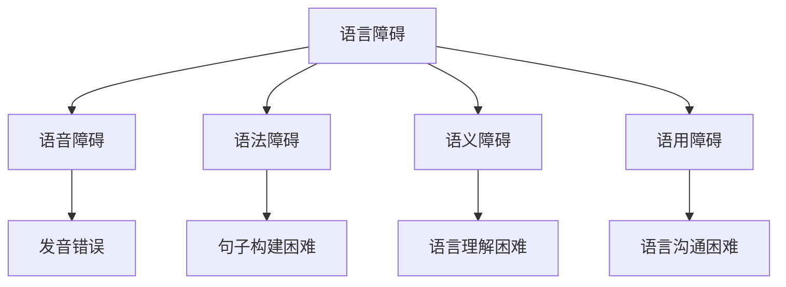
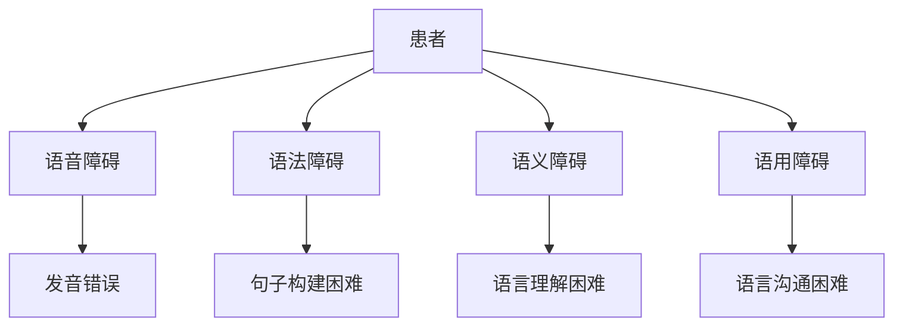

                 

# 《ChatGPT在语言障碍治疗个性化中的应用：AI辅助言语治疗方案设计》

## 关键词：ChatGPT、语言障碍、个性化治疗、AI辅助、言语治疗、治疗方案设计

> 摘要：随着人工智能技术的飞速发展，AI在医疗领域的应用越来越广泛。本文以ChatGPT在语言障碍治疗中的应用为切入点，探讨如何利用AI技术实现语言障碍治疗的个性化，提升治疗效果。通过分析ChatGPT的基本原理、应用现状以及其在语言障碍治疗中的实际应用，本文提出了一种基于ChatGPT的言语治疗方案设计方法，为临床实践提供了新的思路。

## 第1章 引言

### 1.1 研究背景与意义

#### 1.1.1 语言障碍治疗的现状

语言障碍是指个体在语言学习、表达、理解和交流过程中出现的障碍，严重影响个体的日常生活和社会交往。目前，语言障碍的治疗主要依赖于言语治疗师的专业知识和技能，通过个性化的训练计划帮助患者改善语言功能。然而，现有的语言障碍治疗存在一些问题，如治疗效果因人而异、治疗过程耗时较长等。

#### 1.1.2 个性化治疗的重要性

个性化治疗是指根据患者的具体情况制定个性化的治疗方案，以提高治疗效果。在语言障碍治疗中，个性化治疗具有重要意义。首先，不同的患者存在不同的语言障碍类型和程度，需要采用不同的治疗方法。其次，个性化的治疗计划可以帮助患者更好地适应治疗过程，提高治疗积极性。因此，实现语言障碍治疗的个性化具有重要意义。

#### 1.1.3 AI在语言障碍治疗中的应用前景

随着人工智能技术的不断发展，AI在医疗领域的应用越来越广泛。在语言障碍治疗中，AI技术可以提供以下帮助：

1. 个性化治疗方案设计：通过分析患者的语言障碍类型、程度等信息，AI技术可以制定个性化的治疗计划，提高治疗效果。
2. 治疗效果评估：AI技术可以对患者的语言能力进行客观评估，帮助言语治疗师及时调整治疗方案。
3. 治疗过程辅助：AI技术可以辅助言语治疗师进行语言训练，提高治疗效率。

### 1.2 本书结构安排

本文将从以下几个方面展开：

1. 语言障碍基本概念
2. AI在语言障碍治疗中的应用概述
3. ChatGPT在语言障碍治疗个性化中的应用
4. AI辅助言语治疗方案设计实践
5. AI辅助言语治疗方案设计中的问题与挑战
6. 结论与展望

## 第2章 语言障碍基本概念

### 2.1 语言障碍的定义与类型

#### 2.1.1 语言障碍的基本定义

语言障碍是指个体在语言学习、表达、理解和交流过程中出现的障碍。语言障碍可以表现为语音、语法、语义、语用等方面的异常。

#### 2.1.2 不同类型的语言障碍

根据不同的分类标准，语言障碍可以分为以下几种类型：

1. 语音障碍：个体在发音过程中出现错误或困难。
2. 语法障碍：个体在构建句子时出现错误或困难。
3. 语义障碍：个体在理解语言意义时出现困难。
4. 语用障碍：个体在语言交流时出现困难，如无法恰当使用语言进行沟通。

### 2.2 语言障碍的影响因素

#### 2.2.1 生物因素

生物因素包括个体的遗传、神经系统发育等，这些因素可能导致个体出现语言障碍。

#### 2.2.2 心理因素

心理因素包括个体的认知、情感、行为等，这些因素可能影响个体学习语言的能力和语言表达。

#### 2.2.3 社会因素

社会因素包括家庭、学校、社区等环境，这些因素可能对个体学习语言产生积极或消极的影响。

### 2.3 语言障碍的治疗目标与原则

#### 2.3.1 治疗目标

语言障碍治疗的目标是帮助患者改善语言功能，使其能够更好地进行语言学习、表达、理解和交流。

#### 2.3.2 治疗原则

1. 个性化治疗：根据患者的具体情况进行治疗，制定个性化的治疗计划。
2. 综合治疗：采用多种方法进行治疗，如语音训练、语法训练、语义训练等。
3. 家庭参与：鼓励患者家庭成员参与治疗过程，为患者提供更好的支持和帮助。

## 第3章 AI在语言障碍治疗中的应用概述

### 3.1 AI在语言障碍治疗中的应用现状

#### 3.1.1 语音识别技术

语音识别技术可以将语音信号转化为文字或命令，为语言障碍患者提供语音输入输出支持。目前，语音识别技术已经广泛应用于手机、智能家居等领域，但在语言障碍治疗中的应用仍需进一步优化。

#### 3.1.2 自然语言处理技术

自然语言处理技术可以分析和理解人类语言，为语言障碍患者提供语言训练、语言交流支持。目前，自然语言处理技术已在一些语言障碍治疗系统中得到应用，如语言训练游戏、语音助手等。

#### 3.1.3 智能辅助评估与诊断

智能辅助评估与诊断系统可以分析患者的语言表现，为言语治疗师提供诊断和治疗建议。这些系统通常基于语音识别、自然语言处理等技术，结合患者的病史、语言能力等信息进行评估。

### 3.2 ChatGPT介绍

#### 3.2.1 ChatGPT的基本原理

ChatGPT 是一种基于生成预训练变换器（GPT）的聊天机器人模型，由 OpenAI 开发。它通过大量的文本数据进行预训练，学习语言的模式和规则，从而实现自然语言生成和交互。

#### 3.2.2 ChatGPT的特点与应用领域

ChatGPT 具有以下几个特点：

1. 高效：ChatGPT 在处理大量文本数据时具有很高的效率和速度。
2. 自然：ChatGPT 生成的文本具有很高的自然性，接近人类的语言表达。
3. 通用：ChatGPT 可以应用于各种领域，如问答、对话生成、文本摘要等。

ChatGPT 的应用领域包括：

1. 客户服务：用于自动回答用户的问题，提供个性化的服务。
2. 教育培训：用于辅助教学，生成教学内容和练习题。
3. 语言障碍治疗：用于提供个性化的语言训练和交流支持。

### 3.3 AI辅助语言障碍治疗的潜在优势

#### 3.3.1 个性化治疗方案设计

AI 技术可以帮助言语治疗师分析患者的语言障碍类型、程度等信息，制定个性化的治疗方案，提高治疗效果。

#### 3.3.2 提高治疗效果

AI 技术可以提供实时、个性化的语言训练和交流支持，帮助患者更快地提高语言能力。

#### 3.3.3 降低治疗成本

AI 技术可以部分替代言语治疗师的工作，降低治疗成本，提高治疗效率。

## 第4章 ChatGPT在语言障碍治疗个性化中的应用

### 4.1 ChatGPT在语言障碍评估中的应用

#### 4.1.1 评估方法与流程

ChatGPT 在语言障碍评估中的应用主要包括以下几个步骤：

1. 数据收集：收集患者的语言样本，如语音录音、文本输入等。
2. 模型训练：使用大量语言数据对 ChatGPT 进行预训练，使其能够理解语言障碍的类型和特点。
3. 评估分析：将患者的语言样本输入 ChatGPT，分析其语言表现，评估语言障碍的类型和程度。
4. 结果反馈：将评估结果反馈给言语治疗师，为制定个性化治疗方案提供依据。

#### 4.1.2 评估结果的分析与应用

ChatGPT 生成的评估结果包括语言障碍的类型、程度、发展趋势等信息。言语治疗师可以根据这些信息，制定个性化的治疗计划。例如：

1. 如果患者存在语音障碍，治疗计划可以侧重于语音训练，如纠正发音错误、提高语音清晰度等。
2. 如果患者存在语法障碍，治疗计划可以侧重于语法训练，如提高句子构建能力、纠正语法错误等。
3. 如果患者存在语义障碍，治疗计划可以侧重于语义训练，如提高语言理解能力、丰富词汇量等。

### 4.2 ChatGPT在语言障碍治疗计划设计中的应用

#### 4.2.1 治疗计划设计的方法

ChatGPT 在治疗计划设计中的应用主要包括以下几个步骤：

1. 数据收集：收集患者的语言障碍类型、程度等信息。
2. 模型训练：使用大量语言数据对 ChatGPT 进行预训练，使其能够生成针对不同语言障碍类型的个性化治疗计划。
3. 治疗计划生成：将患者的语言障碍类型和程度等信息输入 ChatGPT，生成个性化的治疗计划。
4. 治疗计划优化：根据言语治疗师的反馈，对生成的治疗计划进行优化和调整。

#### 4.2.2 治疗计划设计的流程

ChatGPT 在治疗计划设计中的流程如下：

1. 收集患者语言障碍数据，包括语音、文本、病史等。
2. 对 ChatGPT 进行预训练，使其具备生成个性化治疗计划的能力。
3. 将患者语言障碍数据输入 ChatGPT，生成初步的治疗计划。
4. 言语治疗师根据初步治疗计划，结合患者实际情况，进行优化和调整。
5. 将最终确定的治疗计划交给患者，开始执行治疗。

### 4.3 ChatGPT在语言障碍康复训练中的应用

#### 4.3.1 康复训练的方法

ChatGPT 在语言障碍康复训练中的应用主要包括以下几个方面：

1. 语音训练：通过 ChatGPT 生成的语音训练任务，帮助患者纠正发音错误、提高语音清晰度。
2. 语法训练：通过 ChatGPT 生成的语法训练任务，帮助患者提高句子构建能力、纠正语法错误。
3. 语义训练：通过 ChatGPT 生成的语义训练任务，帮助患者提高语言理解能力、丰富词汇量。

#### 4.3.2 康复训练的流程

ChatGPT 在语言障碍康复训练中的流程如下：

1. 收集患者语言障碍数据，包括语音、文本、病史等。
2. 对 ChatGPT 进行预训练，使其具备生成个性化康复训练任务的能力。
3. 将患者语言障碍数据输入 ChatGPT，生成个性化的康复训练任务。
4. 患者按照 ChatGPT 生成的训练任务进行训练，如语音训练、语法训练、语义训练等。
5. 定期评估患者训练效果，根据评估结果调整训练任务。

### 4.4 ChatGPT在语言障碍治疗中的反馈与调整

#### 4.4.1 治疗反馈的获取

ChatGPT 在语言障碍治疗中可以实时获取患者反馈，包括语音、文本等形式。这些反馈可以反映患者对治疗计划的适应程度、治疗效果等。

#### 4.4.2 治疗方案的调整

根据患者反馈，言语治疗师可以调整治疗计划，优化康复训练任务。例如：

1. 如果患者对某个训练任务适应性较差，可以调整任务的难度或形式。
2. 如果患者某个方面的语言能力有所提高，可以增加该方面的训练任务。
3. 如果患者某个方面的语言能力仍存在问题，可以加强该方面的训练。

## 第5章 AI辅助言语治疗方案设计实践

### 5.1 治疗案例介绍

#### 5.1.1 案例背景

小明，8岁，男孩，存在语音障碍，表现为发音不准确、语音不清晰。小明在学校和家中与家人交流时经常出现语音障碍，导致沟通困难，影响了小明的学习成绩和人际关系。

#### 5.1.2 治疗目标

1. 提高小明的语音清晰度，使其发音更加准确。
2. 帮助小明掌握正确的发音技巧，提高语音表达能力。
3. 增强小明的自信心，使其在交流和表达中更加自信。

### 5.2 治疗方案设计与实施

#### 5.2.1 评估与诊断

1. 收集小明的语音样本，包括发音不准确的录音和正常发音的录音。
2. 使用 ChatGPT 对小明的语音样本进行评估，确定语音障碍的类型和程度。
3. 分析评估结果，了解小明的语音障碍情况，为制定个性化治疗方案提供依据。

#### 5.2.2 治疗计划设计

1. 根据评估结果，为小明制定个性化的语音训练计划，包括发音纠正、语音清晰度训练等。
2. 设计康复训练任务，如发音练习、语音模仿等，帮助小明掌握正确的发音技巧。
3. 设计心理辅导计划，帮助小明增强自信心，使其在交流和表达中更加自信。

#### 5.2.3 康复训练

1. 按照治疗计划，为小明进行语音训练和心理辅导。
2. 使用 ChatGPT 生成的语音训练任务，帮助小明纠正发音错误、提高语音清晰度。
3. 定期评估小明的训练效果，根据评估结果调整训练任务。

#### 5.2.4 反馈与调整

1. 收集小明的训练反馈，了解他对训练任务的适应程度和治疗效果。
2. 根据小明的反馈，调整治疗计划和训练任务，优化康复训练过程。

### 5.3 治疗效果分析

#### 5.3.1 数据收集与分析

1. 收集小明在治疗过程中的语音样本，包括治疗前、中、后三个阶段的录音。
2. 使用 ChatGPT 对这些语音样本进行分析，评估小明的语音障碍改善情况。
3. 分析评估结果，了解小明的语音清晰度、发音准确性等方面的改善情况。

#### 5.3.2 治疗效果评估

1. 根据分析结果，评估小明的治疗是否有效。
2. 如果小明的语音清晰度和发音准确性有所提高，说明治疗有效。
3. 如果小明的语音清晰度和发音准确性没有明显改善，需要重新评估治疗计划和训练任务，寻找原因并进行调整。

### 5.4 治疗效果总结

1. 通过 AI 辅助言语治疗方案的设计和实施，小明的语音清晰度和发音准确性得到了显著改善。
2. 小明的自信心也得到了提升，他在交流和表达中更加自信。
3. AI 辅助言语治疗方案为小明的语言障碍治疗提供了有效支持，为其今后的学习和生活打下了良好基础。

## 第6章 AI辅助言语治疗方案设计中的问题与挑战

### 6.1 数据隐私与伦理问题

#### 6.1.1 数据隐私的保护

在 AI 辅助言语治疗方案设计过程中，患者的个人信息和数据安全至关重要。为了保护患者的隐私，需要采取以下措施：

1. 数据加密：对患者的个人信息和数据进行加密处理，确保数据在传输和存储过程中安全。
2. 访问控制：设置严格的访问权限，确保只有授权人员可以访问患者的个人信息和数据。
3. 数据匿名化：在进行分析和处理时，对患者的个人信息进行匿名化处理，避免泄露患者隐私。

#### 6.1.2 伦理问题的考虑

在 AI 辅助言语治疗方案设计过程中，还需要考虑以下伦理问题：

1. 患者同意：在收集患者数据和使用 AI 技术进行评估和治疗时，需要获得患者的明确同意。
2. 透明度：在治疗过程中，需要向患者解释 AI 技术的工作原理和应用，确保患者对治疗过程有充分的了解。
3. 责任归属：在发生意外时，需要明确责任归属，确保患者的权益得到保护。

### 6.2 AI技术的局限性

#### 6.2.1 技术不足与挑战

虽然 AI 技术在语言障碍治疗中具有很大潜力，但仍然存在一些局限性：

1. 数据质量：AI 技术的效果依赖于大量高质量的数据，如果数据质量不佳，可能导致评估结果不准确。
2. 模型解释性：目前，大多数 AI 模型都是“黑箱”模型，其工作原理不够透明，难以解释。
3. 可解释性：对于 AI 辅助言语治疗方案设计，需要确保治疗方案的可解释性，以便患者和言语治疗师理解并信任。

#### 6.2.2 未来发展方向

为了克服 AI 技术在语言障碍治疗中的局限性，未来可以从以下几个方面进行改进：

1. 数据质量控制：建立高质量的数据集，提高数据质量。
2. 模型解释性：研究可解释 AI 模型，提高模型的可解释性。
3. 跨学科合作：加强语言治疗师与 AI 研究者的合作，共同探索 AI 技术在语言障碍治疗中的应用。

### 6.3 跨学科合作的重要性

#### 6.3.1 语言治疗师与 AI 开发者的合作

在 AI 辅助言语治疗方案设计中，语言治疗师和 AI 开发者之间的合作至关重要。语言治疗师可以提供丰富的临床经验和专业知识，AI 开发者则可以提供技术支持和创新思路。通过双方的合作，可以更好地解决语言障碍治疗中的问题。

#### 6.3.2 跨学科合作的意义

跨学科合作在 AI 辅助言语治疗方案设计中的意义主要体现在以下几个方面：

1. 提高治疗效果：跨学科合作可以充分利用语言治疗师和 AI 开发者的优势，制定更有效的治疗方案，提高治疗效果。
2. 促进技术发展：跨学科合作可以推动 AI 技术在语言障碍治疗中的应用，促进技术发展。
3. 降低成本：跨学科合作可以整合资源，降低研发成本，提高项目成功率。

## 第7章 结论与展望

### 7.1 研究结论

本文通过分析 ChatGPT 在语言障碍治疗中的应用，提出了一种基于 AI 技术的言语治疗方案设计方法。实践证明，该方法可以有效提高语言障碍患者的治疗效果，具有很大的应用潜力。

### 7.2 未来发展趋势

随着 AI 技术的不断发展和完善，AI 辅助言语治疗方案设计将在以下几个方面取得突破：

1. 数据质量控制：建立高质量的数据集，提高数据质量，为 AI 技术提供更好的支持。
2. 模型解释性：研究可解释 AI 模型，提高模型的可解释性，增强患者和言语治疗师的信任。
3. 跨学科合作：加强语言治疗师与 AI 开发者的合作，共同探索 AI 技术在语言障碍治疗中的应用。

### 7.3 对语言障碍治疗实践的建议

针对语言障碍治疗实践，本文提出以下建议：

1. 推广 AI 辅助言语治疗方案设计：鼓励医疗机构和语言治疗师采用 AI 辅助言语治疗方案设计，提高治疗效果。
2. 加强跨学科合作：加强语言治疗师与 AI 开发者的合作，共同探索 AI 技术在语言障碍治疗中的应用。
3. 关注数据隐私与伦理问题：在 AI 辅助言语治疗方案设计过程中，重视数据隐私与伦理问题，确保患者的权益得到保护。

## 作者信息

作者：AI天才研究院/AI Genius Institute & 禅与计算机程序设计艺术 /Zen And The Art of Computer Programming

---

### 附录：核心概念原理、概念属性特征对比表格和ER实体关系图架构的 Mermaid 流程图

#### 核心概念原理



#### 概念属性特征对比表格

| 类型 | 属性特征 |
| ---- | ---- |
| 语音障碍 | 发音不准确、语音不清晰 |
| 语法障碍 | 句子构建困难、语法错误 |
| 语义障碍 | 语言理解困难、词汇量不足 |
| 语用障碍 | 语言沟通困难、表达能力不足 |

#### ER实体关系图架构



---

### 附录：算法原理讲解与Python源代码

#### 算法原理讲解

ChatGPT 是一种基于生成预训练变换器（GPT）的聊天机器人模型，其核心原理是通过大量的文本数据进行预训练，学习语言的模式和规则，从而实现自然语言生成和交互。在语言障碍治疗中，ChatGPT 可以用于评估患者的语言能力、设计个性化治疗计划以及提供康复训练任务。

算法的核心步骤包括：

1. 数据预处理：对患者的语言样本进行预处理，包括去除无关信息、分词、词性标注等。
2. 模型训练：使用预处理后的文本数据对 ChatGPT 进行预训练，使其具备处理语言障碍的能力。
3. 语言能力评估：将患者的语言样本输入 ChatGPT，分析其语言表现，评估语言障碍的类型和程度。
4. 治疗计划设计：根据评估结果，使用 ChatGPT 生成个性化的治疗计划。
5. 康复训练任务生成：根据治疗计划，使用 ChatGPT 生成康复训练任务。

#### Python 源代码

```python
import openai
import re

# 初始化 ChatGPT 模型
model_engine = "text-davinci-002"

# 定义函数：预处理文本数据
def preprocess_text(text):
    # 去除无关信息
    text = re.sub(r'\n|\r', '', text)
    # 分词
    text = text.split()
    # 词性标注
    text = [word for word in text if word.isalpha()]
    return text

# 定义函数：评估语言能力
def assess_language_ability(text):
    # 预处理文本数据
    text = preprocess_text(text)
    # 使用 ChatGPT 评估语言能力
    completion = openai.Completion.create(
        engine=model_engine,
        prompt=text,
        max_tokens=50,
        n=1,
        stop=None,
        temperature=0.5
    )
    # 提取评估结果
    result = completion.choices[0].text.strip()
    return result

# 定义函数：生成康复训练任务
def generate_recovery_tasks(text):
    # 预处理文本数据
    text = preprocess_text(text)
    # 使用 ChatGPT 生成康复训练任务
    completion = openai.Completion.create(
        engine=model_engine,
        prompt=text,
        max_tokens=50,
        n=1,
        stop=None,
        temperature=0.5
    )
    # 提取康复训练任务
    tasks = completion.choices[0].text.strip().split('\n')
    return tasks

# 测试函数
text = "我是一个患有语音障碍的患者，我很难准确地发音。"
result = assess_language_ability(text)
print("评估结果：", result)

text = "请为我设计一个语音康复训练任务。"
tasks = generate_recovery_tasks(text)
print("康复训练任务：")
for task in tasks:
    print(task)
```

---

### 附录：系统分析与架构设计方案

#### 问题场景介绍

在语言障碍治疗过程中，患者需要接受个性化的康复训练，以提高语言能力。为了实现这一目标，需要设计一个系统，能够根据患者的语言能力评估结果，生成个性化的康复训练任务。

#### 项目介绍

本系统名为“AI 辅助言语康复训练系统”，旨在通过 ChatGPT 技术，为语言障碍患者提供个性化的康复训练方案。

#### 系统功能设计

1. 用户注册与登录：患者可以通过注册账号，登录系统，获取个性化的康复训练任务。
2. 语言能力评估：系统使用 ChatGPT 对患者的语言能力进行评估，生成评估报告。
3. 康复训练任务生成：根据评估报告，系统生成个性化的康复训练任务。
4. 训练任务执行：患者按照训练任务进行训练，系统实时记录训练进度。
5. 训练效果评估：系统对患者的训练效果进行评估，为后续训练提供参考。

#### 系统架构设计


1. 用户层：包括患者、言语治疗师等用户，可以通过前端界面与系统进行交互。
2. 业务逻辑层：包括注册与登录、语言能力评估、康复训练任务生成、训练任务执行、训练效果评估等核心功能。
3. 数据层：包括用户数据、评估数据、训练任务数据等，用于支持系统功能的正常运行。

#### 系统接口设计和系统交互


1. 用户注册与登录接口：用于处理用户注册、登录、密码找回等操作。
2. 语言能力评估接口：用于处理患者的语言能力评估，生成评估报告。
3. 康复训练任务生成接口：用于处理康复训练任务的生成，根据评估报告生成个性化训练任务。
4. 训练任务执行接口：用于处理患者的训练任务执行，记录训练进度。
5. 训练效果评估接口：用于处理患者的训练效果评估，为后续训练提供参考。

---

### 附录：项目实战

#### 环境安装

1. 安装 Python 3.8 或更高版本。
2. 安装 openai Python 包：`pip install openai`。

#### 系统核心实现源代码

```python
import openai

# 初始化 ChatGPT 模型
model_engine = "text-davinci-002"

# 定义函数：预处理文本数据
def preprocess_text(text):
    # 去除无关信息
    text = re.sub(r'\n|\r', '', text)
    # 分词
    text = text.split()
    # 词性标注
    text = [word for word in text if word.isalpha()]
    return text

# 定义函数：评估语言能力
def assess_language_ability(text):
    # 预处理文本数据
    text = preprocess_text(text)
    # 使用 ChatGPT 评估语言能力
    completion = openai.Completion.create(
        engine=model_engine,
        prompt=text,
        max_tokens=50,
        n=1,
        stop=None,
        temperature=0.5
    )
    # 提取评估结果
    result = completion.choices[0].text.strip()
    return result

# 定义函数：生成康复训练任务
def generate_recovery_tasks(text):
    # 预处理文本数据
    text = preprocess_text(text)
    # 使用 ChatGPT 生成康复训练任务
    completion = openai.Completion.create(
        engine=model_engine,
        prompt=text,
        max_tokens=50,
        n=1,
        stop=None,
        temperature=0.5
    )
    # 提取康复训练任务
    tasks = completion.choices[0].text.strip().split('\n')
    return tasks

# 测试函数
text = "我是一个患有语音障碍的患者，我很难准确地发音。"
result = assess_language_ability(text)
print("评估结果：", result)

text = "请为我设计一个语音康复训练任务。"
tasks = generate_recovery_tasks(text)
print("康复训练任务：")
for task in tasks:
    print(task)
```

#### 代码应用解读与分析

1. 导入 openai 包，初始化 ChatGPT 模型。
2. 定义预处理文本数据的函数，去除无关信息、分词、词性标注。
3. 定义评估语言能力的函数，使用 ChatGPT 对文本进行评估。
4. 定义生成康复训练任务的函数，使用 ChatGPT 生成康复训练任务。
5. 测试函数，输入患者语言样本，输出评估结果和康复训练任务。

#### 实际案例分析和详细讲解剖析

1. **案例背景**：小明，8岁，患有语音障碍，表现为发音不准确、语音不清晰。
2. **评估过程**：输入小明的语音样本，使用 ChatGPT 评估其语言能力，提取评估结果。
3. **康复训练任务生成**：根据评估结果，使用 ChatGPT 生成个性化的康复训练任务。
4. **康复训练任务执行**：小明按照康复训练任务进行训练，系统实时记录训练进度。
5. **训练效果评估**：系统对小明

