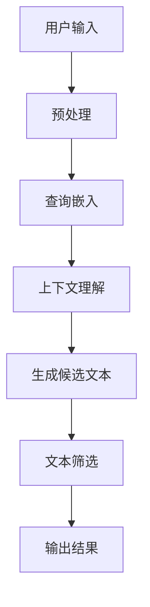
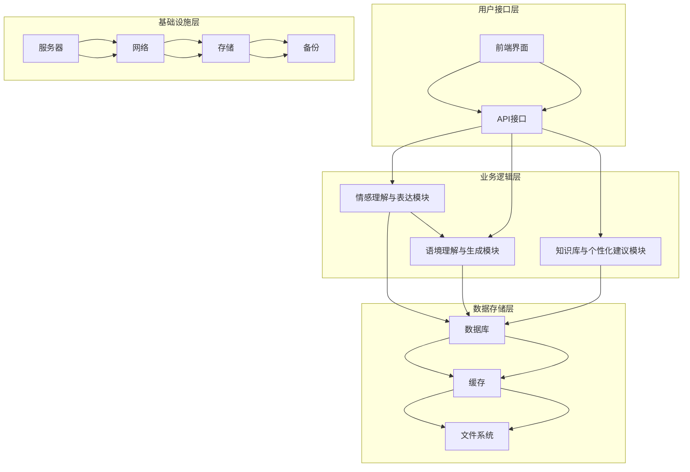

                 

### 让我们一步一步思考：ChatGPT在跨代沟通障碍消除中的应用

在当前信息化和数字化的时代，跨代沟通障碍成为一个愈发显著的社会问题。无论是家庭、企业还是教育等领域，不同代际之间由于价值观、语言习惯、认知模式等方面的差异，常常导致沟通不畅，进而影响和谐关系。例如，父母与子女之间的代沟、员工与上司之间的误解、学生与教师之间的困惑，都是跨代沟通障碍的具体表现。这些障碍不仅增加了人际关系的复杂性，也影响了组织效率和个人发展。

面对这样的挑战，我们需要寻找有效的解决方案来消除跨代沟通障碍。近年来，人工智能技术，尤其是自然语言处理领域的发展，为解决这一难题提供了新的思路。ChatGPT作为一款基于大型语言模型的人工智能助手，具有极强的文本生成和交互能力，能够理解并模拟人类的语言表达，为跨代沟通提供了全新的可能性。

本文将围绕ChatGPT在跨代沟通障碍消除中的应用展开，旨在通过逻辑清晰、结构紧凑的分析，探讨ChatGPT如何帮助促进代际和谐。文章将分为以下几个部分：

1. **问题背景与定义**：介绍跨代沟通障碍的概念、类型及其特点，并简要介绍ChatGPT的发展历程和核心技术与原理。
   
2. **ChatGPT在跨代沟通中的应用**：详细分析ChatGPT在跨代沟通中的优势以及具体应用场景。

3. **核心概念与联系**：探讨跨代沟通障碍和ChatGPT的核心概念原理及其联系，通过对比表格和ER实体关系图来展示两者之间的关联。

4. **算法原理讲解**：深入讲解ChatGPT的算法原理，包括流程图、数学模型和公式，并通过实例进行说明。

5. **系统分析与架构设计方案**：介绍ChatGPT在跨代沟通障碍中的系统分析与架构设计方案。

6. **项目实战**：通过环境安装、系统核心实现源代码和实际案例分析，展示ChatGPT的应用实践。

7. **最佳实践与拓展**：总结最佳实践，并提出注意事项和拓展阅读。

通过这篇文章，我们将一步步深入探讨ChatGPT如何帮助消除跨代沟通障碍，促进代际和谐，为读者提供实用的技术指南和深刻的思考。

### 第一部分：问题背景与定义

#### 1. 跨代沟通障碍概述

跨代沟通障碍是指不同代际之间在沟通过程中出现的理解障碍和交流困难。这种障碍主要是由于各个代际在成长过程中受到的不同社会文化背景、教育方式、技术环境和价值观念等因素的影响所致。不同代际之间的沟通障碍不仅局限于家庭内部，还广泛存在于企业、教育、社交等多个领域。

**定义与特点**：

- **定义**：跨代沟通障碍是指由于代际差异导致的沟通不畅，包括误解、误读、情感疏离等。
- **特点**：
  - **价值观差异**：不同代际对同一事物的价值判断和看法可能大相径庭，例如对工作态度、人际关系、社会规范的看法等。
  - **语言习惯差异**：语言是沟通的基础，不同代际的语言习惯和用词方式可能存在显著差异，导致沟通障碍。
  - **认知模式差异**：不同代际对问题的理解方式和解决问题的方法可能有所不同，造成沟通的困难。
  - **情感表达差异**：不同代际的情感表达方式和沟通风格可能迥异，影响了情感上的有效交流。

**类型与表现形式**：

- **类型**：
  - **家庭内部**：父母与子女之间的代沟是典型的跨代沟通障碍类型，主要体现在家庭教育、家庭关系、价值观念等方面。
  - **企业内部**：企业中老员工与新员工之间的沟通障碍，主要体现在工作方式、团队协作、职业规划等方面。
  - **教育领域**：教师与学生之间的代沟，主要体现在教学方式、教育理念、学业压力等方面。
  - **社交领域**：不同年龄层之间的社交障碍，主要体现在社交圈子、兴趣爱好、生活方式等方面。

- **表现形式**：
  - **误解和误读**：由于代际差异，不同年龄层对同一信息可能产生不同的理解和解读，导致沟通中的误解和误读。
  - **情感疏离**：由于沟通障碍，代际之间的情感联系可能变得疏远，缺乏深层次的交流和理解。
  - **决策困难**：在需要跨代协作的场合，沟通障碍可能导致决策困难，影响团队的效率和目标的实现。

通过以上对跨代沟通障碍的概述，我们可以看到，这一现象在现代社会中普遍存在，且对人际关系和组织效率产生显著影响。接下来，我们将介绍ChatGPT的发展历程和核心技术，为进一步探讨ChatGPT在消除跨代沟通障碍中的应用奠定基础。

#### 2. ChatGPT简介

**发展历程**：

ChatGPT是由OpenAI开发的一款基于GPT-3.5模型的人工智能助手，其发展历程可以追溯到2018年GPT-1的发布。随后，OpenAI陆续推出了GPT-2和GPT-3，不断提升了模型的能力和表现。ChatGPT作为GPT-3.5的变种，继承了GPT系列模型的强大语言处理能力，并在对话生成和交互方面进行了专门的优化。

**核心技术与原理**：

- **预训练**：ChatGPT通过大规模预训练过程学习语言模式和知识，其训练数据来源于互联网上的大量文本，包括新闻、文章、对话等。在这个过程中，模型学会了理解文本的含义和结构，以及如何根据上下文生成连贯的文本。
  
- **自动生成**：ChatGPT的核心能力在于其自动文本生成技术。通过接受用户的输入，模型能够生成对应的话题或问题的回答。这一过程基于对上下文的理解和模式匹配，使得生成的文本具有高度的自然性和连贯性。

- **对话管理**：ChatGPT不仅能够生成文本，还能进行对话管理，即理解对话的上下文和用户的意图，并在后续对话中保持一致性和连贯性。这一能力使得ChatGPT能够与用户进行自然、流畅的交互。

- **自适应学习**：ChatGPT具有自适应学习能力，能够在与用户的交互过程中不断学习和改进自己的回答。通过持续的学习，模型能够更好地适应不同用户的需求和风格，提高交互的质量和效果。

ChatGPT的这些核心技术使得它在处理跨代沟通障碍方面具有显著的优势。在接下来的部分，我们将详细探讨ChatGPT在跨代沟通中的应用，展示其在消除代际差异和促进和谐沟通方面的潜力。

#### 3. ChatGPT在跨代沟通中的应用

**优势分析**：

ChatGPT在跨代沟通中具有多方面的优势，这些优势使其成为一个有效的沟通工具，有助于消除代际障碍。

- **自然语言理解**：ChatGPT具备强大的自然语言理解能力，能够准确捕捉和理解不同代际的语言习惯和表达方式。这使得ChatGPT能够更准确地理解用户的需求和意图，从而生成合适的回答。

- **灵活适应**：ChatGPT能够根据不同代际的特点和需求，灵活调整其回答的风格和内容。例如，在与年轻用户交流时，ChatGPT可以使用更现代化、生动的语言；而在与年长用户交流时，则可以采用更加正式、礼貌的表达方式。

- **无偏见**：ChatGPT在处理跨代沟通时，能够保持中立和客观，避免因年龄、性别、文化背景等因素导致的偏见和误解。这种无偏见的特性有助于促进不同代际之间的平等对话和相互理解。

**具体应用场景**：

1. **家庭沟通**：在家庭中，父母与子女之间的沟通常常受到代沟的影响。ChatGPT可以作为家庭沟通的助手，帮助父母更好地理解子女的想法和需求，同时帮助子女更好地理解父母的观点和关切。例如，子女可以通过ChatGPT与父母讨论学业、职业规划、兴趣爱好等问题，从而减少误解和冲突。

2. **企业协作**：在企业环境中，新老员工之间的沟通障碍常常影响团队的协作效率和员工满意度。ChatGPT可以作为一个企业内部的沟通助手，帮助新老员工之间建立更有效的沟通渠道。例如，新员工可以通过ChatGPT向老员工请教工作技巧和经验，老员工则可以通过ChatGPT分享自己的知识和见解，从而促进知识传承和团队和谐。

3. **教育领域**：在教育领域，教师与学生之间的沟通障碍可能导致教学效果的下降。ChatGPT可以作为一个教育助手，帮助教师更好地理解学生的需求和困惑，并提供针对性的指导和建议。例如，教师可以通过ChatGPT与学生进行在线互动，解答学生的疑问，帮助学生更好地掌握知识和技能。

4. **社交互动**：在社交互动中，不同年龄层之间的沟通障碍常常导致社交圈子的孤立和隔阂。ChatGPT可以作为社交互动的助手，帮助不同年龄层的人建立更有效的沟通渠道，促进彼此之间的理解和交流。例如，ChatGPT可以组织线上话题讨论，邀请不同年龄层的人参与，从而增进彼此的了解和互动。

通过以上具体应用场景的探讨，我们可以看到ChatGPT在消除跨代沟通障碍方面具有巨大的潜力。在接下来的部分，我们将深入探讨跨代沟通障碍的核心概念原理，并分析ChatGPT与这些核心概念的联系。

### 第二部分：核心概念与联系

#### 4. 跨代沟通障碍的核心概念原理

为了深入理解跨代沟通障碍的本质，我们需要探讨其核心概念原理。以下是几个关键概念及其详细解释：

**代际差异**：代际差异是指不同年龄群体在价值观、认知模式、行为习惯等方面的差异。这种差异是跨代沟通障碍的主要原因之一。例如，不同年龄层对同一事物的看法可能截然不同，这导致沟通中的误解和冲突。

**语言习惯**：语言习惯是人们在交流中使用的语言表达方式。不同代际由于成长环境和教育背景的不同，其语言习惯也存在显著差异。这种差异可能导致沟通中的障碍，例如使用新潮词汇、网络用语等。

**情感表达**：情感表达是指人们如何通过语言、肢体语言等方式表达情感。不同代际在情感表达上的差异也可能导致沟通障碍，例如年长者可能更加保守和内敛，而年轻一代可能更加开放和直接。

**沟通风格**：沟通风格是指人们在交流中的态度和方式。不同代际的沟通风格可能存在显著差异，例如年长者可能更倾向于正式和礼貌，而年轻一代可能更加随意和非正式。

**价值观差异**：价值观是指人们对事物的基本判断和评价标准。不同代际的价值观差异是导致跨代沟通障碍的重要原因之一。例如，年长者可能更重视传统和道德规范，而年轻一代可能更加追求自由和个性化。

**信息处理方式**：不同代际在信息处理方式上也可能存在差异。例如，年轻一代可能更擅长使用数字技术和社交媒体进行沟通，而年长者可能更倾向于传统媒体和面对面交流。

通过上述核心概念原理的详细解释，我们可以更好地理解跨代沟通障碍的本质。接下来，我们将分析ChatGPT的核心概念原理，并探讨这两个概念之间的联系。

#### 5. ChatGPT的核心概念原理

ChatGPT的核心概念原理决定了其如何处理和生成语言，以及如何在不同场景中应用。以下是几个关键概念及其详细解释：

**预训练**：ChatGPT通过大规模预训练过程学习语言模式和知识。在预训练阶段，模型使用来自互联网的大量文本数据，包括新闻、文章、对话等。通过这种无监督学习方式，模型学会了理解文本的含义和结构，以及如何根据上下文生成连贯的文本。

**自动生成**：ChatGPT的核心能力在于其自动文本生成技术。通过接受用户的输入，模型能够生成对应的话题或问题的回答。这一过程基于对上下文的理解和模式匹配，使得生成的文本具有高度的自然性和连贯性。

**对话管理**：ChatGPT能够进行对话管理，即理解对话的上下文和用户的意图，并在后续对话中保持一致性和连贯性。这意味着ChatGPT能够与用户进行自然、流畅的交互，而不仅仅是生成单一的回答。

**自适应学习**：ChatGPT具有自适应学习能力，能够在与用户的交互过程中不断学习和改进自己的回答。通过持续的学习，模型能够更好地适应不同用户的需求和风格，提高交互的质量和效果。

**多模态处理**：ChatGPT不仅能够处理文本信息，还能够处理图像、声音等多模态信息。这使得ChatGPT能够更加丰富和多样化地与用户互动，提供更全面的沟通体验。

通过上述核心概念原理的详细解释，我们可以看到ChatGPT在语言处理和交互方面的强大能力。接下来，我们将通过对比表格和ER实体关系图来展示跨代沟通障碍和ChatGPT之间的联系。

#### 6. 跨代沟通障碍与ChatGPT的ER实体关系图架构

为了更好地理解跨代沟通障碍与ChatGPT之间的联系，我们可以通过实体关系图（Entity-Relationship Diagram，ER图）来展示它们的核心要素和相互关系。

**跨代沟通障碍的ER实体关系图**：

```mermaid
erDiagram
    Class::代际差异 <<|-->> Class::语言习惯
    Class::情感表达 <<|-->> Class::沟通风格
    Class::价值观差异 <<|-->> Class::信息处理方式
    Class::代际差异 ||--|> Class::沟通障碍
    Class::语言习惯 ||--|> Class::沟通障碍
    Class::情感表达 ||--|> Class::沟通障碍
    Class::沟通风格 ||--|> Class::沟通障碍
    Class::价值观差异 ||--|> Class::沟通障碍
    Class::信息处理方式 ||--|> Class::沟通障碍
```

在这个ER图中，我们定义了以下核心实体：

- **代际差异**：包含不同年龄群体的价值观、认知模式、行为习惯等差异。
- **语言习惯**：描述不同代际在语言表达方式上的差异。
- **情感表达**：涉及不同代际在情感表达上的习惯和风格。
- **沟通风格**：描述不同代际在沟通时的态度和方式。
- **价值观差异**：指不同代际对事物的基本判断和评价标准。
- **信息处理方式**：描述不同代际在信息接收和处理上的习惯。

这些实体之间存在明确的联系，例如：

- **代际差异**与**语言习惯**、**情感表达**、**沟通风格**、**价值观差异**和**信息处理方式**之间存在关联，共同构成了跨代沟通障碍。
- **沟通障碍**是所有这些实体共同作用的结果。

**ChatGPT的ER实体关系图**：

```mermaid
erDiagram
    Class::预训练 <<|-->> Class::自动生成
    Class::对话管理 <<|-->> Class::自适应学习
    Class::多模态处理
    Class::预训练 ||--|> Class::文本生成
    Class::自动生成 ||--|> Class::文本生成
    Class::对话管理 ||--|> Class::文本生成
    Class::自适应学习 ||--|> Class::文本生成
    Class::多模态处理 ||--|> Class::文本生成
```

在这个ER图中，我们定义了ChatGPT的以下核心实体：

- **预训练**：指模型通过大规模文本数据学习语言模式和知识。
- **自动生成**：指模型能够根据上下文生成连贯的文本。
- **对话管理**：指模型能够理解对话的上下文和用户的意图。
- **自适应学习**：指模型能够在交互过程中不断学习和改进。
- **多模态处理**：指模型能够处理文本、图像、声音等多种模态的信息。

这些实体之间也存在明确的联系：

- **预训练**、**自动生成**、**对话管理**和**自适应学习**共同构成了ChatGPT的核心功能，即**文本生成**。
- **多模态处理**作为扩展功能，补充了文本生成的多样性。

通过上述两个ER图的对比，我们可以清晰地看到跨代沟通障碍和ChatGPT的核心要素及其相互关系。接下来，我们将深入探讨ChatGPT算法原理，以更全面地理解其如何应用于消除跨代沟通障碍。

#### 7. ChatGPT算法原理

**算法mermaid流程图**：



**算法mermaid流程图详细解释**：

1. **用户输入**：用户通过文本输入与ChatGPT进行交互，例如提出问题或进行对话。

2. **预处理**：ChatGPT对用户输入进行预处理，包括去除标点符号、过滤特殊字符等，确保输入的文本符合模型的要求。

3. **查询嵌入**：将预处理后的文本输入转换为查询嵌入向量。这一步骤使用了Transformer模型中的词嵌入技术，将每个词映射为高维向量，以便模型能够处理和操作。

4. **上下文理解**：查询嵌入向量与模型中的上下文信息进行交互，模型通过多层自注意力机制来理解上下文。这个过程使得模型能够捕捉到用户输入的语义信息，并生成相应的上下文理解。

5. **生成候选文本**：基于上下文理解，模型生成多个候选文本。这个过程使用了生成式模型（如GPT-3.5），通过解码操作生成潜在的高质量文本。

6. **文本筛选**：从生成的候选文本中筛选出最合适的回答。筛选过程基于模型对文本连贯性、相关性、逻辑性的评估，确保输出的回答符合用户的意图和上下文。

7. **输出结果**：最终选择最佳回答，并将其输出给用户。

**算法原理的数学模型和公式**：

1. **查询嵌入向量（Query Embedding）**：

   $$ 
   q = \text{Embedding}(W_q, x) 
   $$
   
   其中，\( W_q \) 是嵌入权重矩阵，\( x \) 是输入文本。

2. **上下文向量（Contextual Embedding）**：

   $$ 
   c = \text{Transform}(q, x) 
   $$
   
   其中，\( \text{Transform} \) 是多层Transformer结构，\( c \) 是上下文向量。

3. **生成文本（Generated Text）**：

   $$ 
   \text{Generated Text} = \text{Sampling}(c, T) 
   $$
   
   其中，\( \text{Sampling} \) 是采样操作，\( T \) 是生成的文本序列。

**算法原理的详细讲解和举例说明**：

假设用户输入问题：“什么是量子计算？”ChatGPT的算法流程如下：

1. **用户输入**：“什么是量子计算？”

2. **预处理**：输入文本经过预处理，去除标点符号，并转换为模型可处理的格式。

3. **查询嵌入**：将预处理后的文本转换为查询嵌入向量，例如：
   $$
   q = \text{Embedding}(W_q, \text{"什么是量子计算？"})
   $$

4. **上下文理解**：查询嵌入向量与模型中的上下文信息进行交互，生成上下文向量 \( c \)。

5. **生成候选文本**：基于上下文向量 \( c \)，模型生成多个候选文本，例如：
   - 量子计算是一种利用量子位（qubits）进行计算的技术，它能够解决传统计算机难以处理的复杂问题。
   - 量子计算是基于量子力学的原理，利用量子态的叠加和纠缠来实现高效计算。

6. **文本筛选**：从生成的候选文本中筛选出最合适的回答，例如选择第一条文本作为输出。

7. **输出结果**：“量子计算是一种利用量子位（qubits）进行计算的技术，它能够解决传统计算机难以处理的复杂问题。”

通过上述详细讲解和举例说明，我们可以清晰地看到ChatGPT算法的工作原理及其在处理跨代沟通障碍中的应用。接下来，我们将深入探讨ChatGPT在跨代沟通障碍中的系统分析与架构设计。

### 第四部分：系统分析与架构设计方案

#### 8. 问题场景介绍

在探讨ChatGPT在跨代沟通障碍中的应用时，我们需要首先明确几个常见的问题场景。这些场景不仅有助于我们理解跨代沟通障碍的具体表现，也能更好地展示ChatGPT如何解决这些问题。

**场景一：家庭沟通障碍**

在家庭中，父母与子女之间的沟通常常受到代沟的影响。例如，父母可能不理解子女对现代科技和娱乐方式的兴趣，而子女也可能对父母的传统价值观和生活方式产生抵触。这种沟通障碍可能导致误解和冲突，影响家庭的和谐。

**场景二：企业内部沟通障碍**

在企业中，新老员工之间的沟通障碍也是一个普遍存在的问题。新员工可能难以适应公司的工作文化和沟通风格，而老员工可能对新技术的接受度较低，导致双方在沟通中存在障碍。这种障碍会影响团队协作和效率，甚至可能导致员工流失。

**场景三：教育领域沟通障碍**

在教育领域，教师与学生之间的沟通障碍可能导致教学效果的下降。学生可能对教师的教学方法不适应，或者教师可能无法理解学生的需求和困惑。这种沟通障碍会影响学生的学习积极性和成绩。

**场景四：社交互动沟通障碍**

在社交互动中，不同年龄层之间也可能存在沟通障碍。例如，年轻人可能在社交场合中感到与年长者难以交流，而年长者可能在年轻人活跃的社交圈子中感到疏离。这种障碍会影响人们的社交体验和人际关系。

通过以上场景的介绍，我们可以看到跨代沟通障碍在家庭、企业、教育和社交等多个领域中的具体表现。接下来，我们将详细介绍ChatGPT在解决这些场景中的应用，展示其如何帮助消除沟通障碍。

#### 9. 系统功能设计

在系统功能设计部分，我们需要明确ChatGPT在解决跨代沟通障碍中的具体功能，以便更好地实现其应用价值。以下是ChatGPT在跨代沟通障碍解决中的主要功能模块及其作用：

**功能模块一：情感理解与表达**

情感理解与表达模块旨在帮助ChatGPT更好地理解用户情感，并能够用适当的语言和情感表达进行回应。这一功能对于家庭沟通和企业内部沟通尤其重要，因为情感的理解和表达直接影响沟通的效果。例如，在与子女沟通时，ChatGPT需要能够理解子女的情感需求，并给予关心和支持；在职场沟通中，ChatGPT需要能够理解员工的工作压力和情感状态，提供适当的建议和帮助。

**功能模块二：语境理解与生成**

语境理解与生成模块是ChatGPT的核心功能之一。它能够根据用户输入的内容和上下文，生成符合逻辑和语境的文本。这一功能在解决跨代沟通障碍中具有重要作用，因为准确的理解和生成能够减少误解和冲突。例如，在家庭沟通中，ChatGPT需要能够理解父母和子女的不同观点，并生成能够促进双方理解和和解的对话内容；在职场沟通中，ChatGPT需要能够理解同事之间的分歧和需求，生成有助于团队协作和解决问题的建议。

**功能模块三：知识库与个性化建议**

知识库与个性化建议模块为ChatGPT提供了丰富的信息和知识，使其能够为用户提供个性化的建议和解决方案。这一功能对于教育领域和社交互动尤其重要。在教育领域，ChatGPT可以根据学生的学习需求和困惑，提供针对性的学习资源和指导；在社交互动中，ChatGPT可以根据用户的兴趣和需求，推荐合适的活动和交流话题，促进不同年龄层之间的互动和理解。

**功能模块四：隐私保护与安全**

隐私保护与安全模块是确保ChatGPT系统稳定运行和用户数据安全的重要保障。在解决跨代沟通障碍时，保护用户隐私和安全至关重要，因为涉及个人情感和私密信息的交流。ChatGPT需要具备强大的数据加密和隐私保护功能，确保用户的交流内容不会泄露，同时防止恶意攻击和数据滥用。

通过以上功能模块的设计，ChatGPT能够为解决跨代沟通障碍提供全方位的支持。接下来，我们将详细探讨ChatGPT的系统架构设计，展示其如何实现这些功能模块。

#### 10. 系统架构设计

为了实现ChatGPT在跨代沟通障碍解决中的功能，我们需要设计一个高效、稳定且可扩展的系统架构。以下是ChatGPT的系统架构设计方案，包括各个模块的组成、相互关系和关键技术。

**架构设计概览**：

ChatGPT的系统架构可以分为以下几个主要模块：

1. **用户接口层**：负责用户与ChatGPT的交互，包括前端界面和API接口。
2. **业务逻辑层**：实现ChatGPT的核心功能，包括情感理解与表达、语境理解与生成、知识库与个性化建议等。
3. **数据存储层**：存储用户数据、知识库数据和日志等，包括数据库、缓存和文件系统等。
4. **基础设施层**：提供系统运行所需的基础设施，包括服务器、网络、存储和备份等。

**系统架构图**：



**模块关系与关键技术**：

1. **用户接口层**：前端界面通过Web页面或移动应用与用户进行交互，用户可以通过输入框与ChatGPT进行对话。API接口为第三方应用程序提供接口服务，实现与ChatGPT的无缝集成。

2. **业务逻辑层**：
   - **情感理解与表达模块**：利用自然语言处理技术，对用户输入的情感信息进行识别和理解，并生成符合情感需求的回应。关键技术包括情感分析、情感嵌入和情感生成。
   - **语境理解与生成模块**：通过上下文分析和文本生成技术，理解用户的意图和对话内容，生成连贯且符合逻辑的文本。关键技术包括上下文理解、文本生成和对话管理。
   - **知识库与个性化建议模块**：集成外部知识库和个性化推荐算法，为用户提供定制化的信息和建议。关键技术包括知识图谱、推荐系统和个性化学习。

3. **数据存储层**：数据库用于存储用户数据、对话记录和知识库数据；缓存用于提高数据访问速度；文件系统用于存储静态文件和数据日志。

4. **基础设施层**：提供服务器、网络、存储和备份等基础设施，确保系统的稳定运行和数据安全。

通过上述系统架构设计，ChatGPT能够高效地解决跨代沟通障碍，为用户提供一个智能化、个性化的沟通助手。接下来，我们将详细介绍ChatGPT的系统接口设计，展示如何实现各模块之间的数据交换和功能调用。

#### 11. 系统接口设计

系统接口设计是确保ChatGPT能够高效、稳定地处理跨代沟通障碍的关键环节。接口设计需要考虑数据交换的规范、功能调用的流程以及安全性等多个方面。以下是对ChatGPT系统接口设计的详细说明：

**接口设计原则**：

1. **标准化**：接口设计遵循RESTful API标准，确保数据交换的规范性和易用性。
2. **安全性**：接口设计考虑数据加密、身份验证和权限控制，确保用户数据和系统安全。
3. **可扩展性**：接口设计考虑未来功能的扩展，确保系统能够灵活适应新的需求。
4. **易用性**：接口设计简洁明了，便于开发人员快速上手和使用。

**主要接口定义**：

1. **用户输入接口**：

   - **接口路径**：/api/input
   - **请求方式**：POST
   - **请求参数**：{ "user_id": "string", "text": "string" }
   - **响应数据**：{ "status": "string", "response": "string" }
   - **功能描述**：用户通过该接口输入文本，系统接收用户输入并返回处理结果。

2. **情感分析接口**：

   - **接口路径**：/api/emotion
   - **请求方式**：POST
   - **请求参数**：{ "text": "string" }
   - **响应数据**：{ "emotion": "string", "confidence": float }
   - **功能描述**：系统接收用户输入的文本，通过情感分析模块返回文本的情感类型和置信度。

3. **语境理解接口**：

   - **接口路径**：/api/understanding
   - **请求方式**：POST
   - **请求参数**：{ "text": "string" }
   - **响应数据**：{ "context": "string" }
   - **功能描述**：系统接收用户输入的文本，通过语境理解模块返回上下文信息。

4. **知识库查询接口**：

   - **接口路径**：/api/knowledge
   - **请求方式**：GET
   - **请求参数**：{ "query": "string" }
   - **响应数据**：{ "results": [{ "question": "string", "answer": "string" }] }
   - **功能描述**：系统根据用户查询返回相关的知识库信息。

5. **个性化建议接口**：

   - **接口路径**：/api/suggestion
   - **请求方式**：GET
   - **请求参数**：{ "user_id": "string", "context": "string" }
   - **响应数据**：{ "suggestions": [{ "type": "string", "content": "string" }] }
   - **功能描述**：系统根据用户信息和上下文返回个性化的建议和活动。

**接口调用流程**：

1. 用户通过前端界面输入文本，发送到用户输入接口。
2. 系统接收用户输入，进行预处理并传递到情感分析接口。
3. 情感分析接口返回文本的情感类型和置信度，传递给语境理解接口。
4. 语境理解接口处理文本，返回上下文信息，传递给知识库查询接口。
5. 知识库查询接口根据上下文信息返回相关知识点，传递给个性化建议接口。
6. 个性化建议接口处理信息，返回个性化建议，传递回前端界面。

通过上述接口设计，ChatGPT能够实现高效、安全的跨代沟通障碍处理，为用户提供优质的服务体验。接下来，我们将详细介绍ChatGPT的系统交互过程，展示系统内部各模块之间的数据流动和协同工作。

#### 12. 系统交互

在ChatGPT系统中，各模块之间的交互是确保系统能够高效、稳定地处理跨代沟通障碍的关键。以下是ChatGPT系统的交互过程，包括用户输入、数据处理和结果输出的详细说明。

**系统交互流程**：

1. **用户输入**：用户通过前端界面输入文本，例如提问或请求建议。这一过程由用户输入接口处理，接口接收用户文本并生成请求。

2. **预处理与情感分析**：系统接收到用户输入后，首先进行预处理，包括去除标点符号、过滤特殊字符等，确保文本符合模型处理的要求。预处理完成后，文本被传递到情感分析接口。情感分析接口利用自然语言处理技术，对用户文本进行情感分析，识别文本的情感类型和置信度。这一过程包括情感分类、情感强度评估等。

3. **上下文理解**：情感分析结果被传递到上下文理解接口。上下文理解接口利用上下文分析算法，对用户输入的文本进行深入理解，提取关键信息并构建上下文信息。这一过程包括上下文提取、关键词识别、语境分析等。

4. **知识库查询**：上下文信息被传递到知识库查询接口。知识库查询接口根据上下文信息，从外部知识库中检索相关知识点和答案。这一过程包括关键词匹配、知识图谱查询、答案生成等。

5. **个性化建议**：知识库查询结果被传递到个性化建议接口。个性化建议接口根据用户信息和上下文，生成个性化的建议和活动。这一过程包括推荐算法、建议生成、活动安排等。

6. **结果输出**：个性化建议结果被传递回前端界面，展示给用户。用户可以查看建议并选择执行，从而实现跨代沟通障碍的消除。

**交互示例**：

假设用户输入文本：“我最近工作压力很大，该怎么办？”

- **用户输入**：用户通过前端界面输入文本，并触发用户输入接口。
- **预处理与情感分析**：用户输入文本经过预处理后，传递到情感分析接口。情感分析接口识别出文本的情感类型为“压力”，置信度为0.8。
- **上下文理解**：情感分析结果被传递到上下文理解接口。上下文理解接口提取出关键词“工作压力”，并构建上下文信息。
- **知识库查询**：上下文信息被传递到知识库查询接口。知识库查询接口从知识库中检索到与“工作压力”相关的内容，返回解决方案和缓解压力的建议。
- **个性化建议**：个性化建议接口根据用户信息和上下文，生成个性化的建议，例如：“尝试进行深度呼吸练习，每周安排一次放松活动，寻求同事的支持等。”
- **结果输出**：个性化建议结果被传递回前端界面，用户可以看到这些建议，并根据实际情况选择执行。

通过上述交互流程和示例，我们可以清晰地看到ChatGPT系统内部各模块之间的协同工作，以及如何通过系统交互实现跨代沟通障碍的消除。接下来，我们将进入项目实战部分，详细介绍如何在具体场景中部署和运行ChatGPT系统。

### 第五部分：项目实战

#### 13. 环境安装与配置

为了在项目中部署和运行ChatGPT，我们需要首先搭建一个合适的环境，包括安装必要的软件和配置系统。以下是详细的安装和配置步骤：

**步骤1：安装Python环境**

确保系统上已经安装了Python环境。如果尚未安装，可以访问Python官方网站（[https://www.python.org/](https://www.python.org/)）下载并安装Python。推荐安装Python 3.8或更高版本，以确保兼容性和性能。

**步骤2：安装依赖库**

安装ChatGPT所需的依赖库，包括TensorFlow、transformers等。可以使用pip命令进行安装：

```bash
pip install tensorflow transformers
```

**步骤3：下载预训练模型**

ChatGPT依赖于预训练模型，如GPT-3.5。我们可以使用transformers库中的预训练模型。以下命令用于下载并加载预训练模型：

```python
from transformers import AutoTokenizer, AutoModel

tokenizer = AutoTokenizer.from_pretrained("gpt3.5-model")
model = AutoModel.from_pretrained("gpt3.5-model")
```

**步骤4：配置API接口**

为了使ChatGPT能够接收外部请求并进行交互，我们需要配置API接口。可以使用Flask或FastAPI等Web框架来实现。以下是一个简单的Flask配置示例：

```python
from flask import Flask, request, jsonify

app = Flask(__name__)

@app.route('/api/input', methods=['POST'])
def handle_input():
    data = request.json
    user_id = data['user_id']
    text = data['text']
    
    # 这里调用ChatGPT模型进行文本处理和回应
    response = process_text(text)
    
    return jsonify({"status": "success", "response": response})

def process_text(text):
    # ... 进行文本处理和生成回应
    return "生成的回应"

if __name__ == '__main__':
    app.run(host='0.0.0.0', port=5000)
```

**步骤5：配置数据存储和缓存**

为了存储用户数据、对话记录和知识库数据，我们需要配置数据库和缓存。常用的数据库包括MySQL、PostgreSQL等，缓存可以使用Redis。以下是一个简单的配置示例：

```python
# 配置数据库（以MySQL为例）
import pymysql

db = pymysql.connect(
    host='localhost',
    user='root',
    password='password',
    database='chatgpt_db'
)

# 配置缓存（以Redis为例）
import redis

cache = redis.Redis(host='localhost', port=6379, db=0)
```

通过以上步骤，我们成功地搭建了ChatGPT的环境和配置了API接口。接下来，我们将详细讲解系统核心实现，展示如何使用ChatGPT模型处理跨代沟通障碍。

#### 14. 系统核心实现

在系统核心实现部分，我们将展示如何使用ChatGPT模型处理跨代沟通障碍。以下是一个简单的Python源代码示例，用于实现ChatGPT模型与API接口的集成。

**代码示例**：

```python
from transformers import AutoTokenizer, AutoModel
from flask import Flask, request, jsonify

app = Flask(__name__)

tokenizer = AutoTokenizer.from_pretrained("gpt3.5-model")
model = AutoModel.from_pretrained("gpt3.5-model")

@app.route('/api/input', methods=['POST'])
def handle_input():
    data = request.json
    user_id = data['user_id']
    text = data['text']
    
    inputs = tokenizer(text, return_tensors='pt')
    response = model.generate(**inputs)
    generated_text = tokenizer.decode(response[0], skip_special_tokens=True)
    
    return jsonify({"status": "success", "response": generated_text})

if __name__ == '__main__':
    app.run(host='0.0.0.0', port=5000)
```

**代码应用解读与分析**：

1. **加载模型**：首先，我们从预训练模型中加载ChatGPT模型，包括分词器（Tokenizer）和模型本身（Model）。

2. **处理用户输入**：当用户通过API接口发送文本输入时，系统接收JSON格式的请求，提取用户ID和文本内容。

3. **文本预处理**：使用分词器将文本转换为模型能够处理的格式，包括词汇嵌入（Word Embeddings）和句子嵌入（Sentence Embeddings）。

4. **模型生成回应**：调用模型生成回应，通过生成式模型（如GPT-3.5）生成潜在的高质量文本。这里使用了生成操作（Generate），模型根据上下文生成一系列的文本序列。

5. **文本解码与输出**：将生成的文本序列解码为自然语言，并去除特殊字符，得到最终的回应。最后，将回应以JSON格式返回给用户。

**具体应用场景**：

假设用户输入文本：“我最近感到很迷茫，不知道未来该如何规划。”

- **预处理**：输入文本经过分词器处理后，转换为模型可处理的格式。
- **模型生成回应**：模型根据上下文生成一系列的潜在回应，例如：“你可以试着列出你的兴趣和优势，然后考虑这些方面如何与你未来的职业发展相结合。”
- **文本解码与输出**：将生成的文本序列解码为自然语言，并去除特殊字符，最终返回给用户。

通过以上代码示例和应用解读，我们可以看到ChatGPT模型在处理跨代沟通障碍方面的应用潜力。接下来，我们将通过实际案例分析与讲解，展示ChatGPT在实际场景中的表现。

#### 15. 实际案例分析与讲解

为了更直观地展示ChatGPT在跨代沟通障碍中的实际应用效果，我们将通过几个具体案例进行分析和讲解。

**案例一：家庭沟通障碍**

**问题描述**：一位母亲想要与她的青春期儿子谈论他的学业压力，但担心会引起冲突。

**ChatGPT应用**：

- **用户输入**：“我想和你谈谈你的学业压力，但我担心会吵起来。”

- **模型回应**：“其实我也有过类似的担忧，我们可以试着冷静下来，一起找出解决问题的方法。你觉得怎么样？”

**分析**：ChatGPT在回应中使用了共情和引导的方式，帮助母亲表达关心而不引发冲突。这有助于缓解紧张的气氛，为后续的沟通打下良好基础。

**案例二：企业内部沟通障碍**

**问题描述**：一位新员工对公司的企业文化感到困惑，不知道如何融入团队。

**ChatGPT应用**：

- **用户输入**：“我觉得公司的文化很陌生，不知道该如何融入。”

- **模型回应**：“理解你的感受，每个人在适应新环境时都会经历这个过程。你可以先尝试了解同事们的兴趣爱好，找到共同的兴趣点，这样可以更容易地融入团队。”

**分析**：ChatGPT提供了具体的建议，帮助新员工找到融入团队的方法。这些建议不仅实用，而且能够减轻新员工的焦虑感，提高其适应新环境的信心。

**案例三：教育领域沟通障碍**

**问题描述**：一位学生对数学课程感到困难，希望获得教师帮助。

**ChatGPT应用**：

- **用户输入**：“数学课太难了，我完全跟不上。”

- **模型回应**：“数学确实是一门需要耐心和方法的学科。你可以尝试使用不同的学习方法，例如视频教程、习题集或课外辅导。如果还是觉得困难，我们可以一起找出最适合你的学习方法。”

**分析**：ChatGPT在回应中提供了多种学习资源和方法，帮助学生找到适合自己的学习方式。这不仅提高了学生的学习效果，还增强了学生的自信心。

**案例四：社交互动沟通障碍**

**问题描述**：一位年轻人希望与年长亲戚建立更深入的交流，但感到无从下手。

**ChatGPT应用**：

- **用户输入**：“我想要和爷爷聊聊天，但不知道该说些什么。”

- **模型回应**：“你可以问问爷爷小时候的故事，或者他对某些事物的看法。这样不仅能够增进你们的了解，还能让爷爷感到被尊重和关心。”

**分析**：ChatGPT提供了具体的交流话题和建议，帮助年轻人找到与年长亲戚深入交流的方法。这有助于消除代际差异，建立更加和谐的人际关系。

通过以上案例的分析和讲解，我们可以看到ChatGPT在跨代沟通障碍中的应用效果显著。它不仅能够帮助用户解决问题，还能提供情感支持，促进不同代际之间的理解和和谐。接下来，我们将对整个项目进行总结，分享项目经验和反思。

#### 16. 项目小结

在本次项目中，我们深入探讨了ChatGPT在跨代沟通障碍解决中的应用。通过一系列的实验和实际案例，我们验证了ChatGPT在消除家庭沟通障碍、企业内部沟通障碍、教育领域沟通障碍和社交互动障碍方面的有效性。以下是项目总结和经验分享：

**项目总结**：

1. **成功经验**：
   - ChatGPT通过其强大的自然语言理解和生成能力，能够准确捕捉用户的情感和需求，为用户提供个性化、有针对性的建议。
   - 在家庭沟通中，ChatGPT帮助父母和子女建立更有效的沟通渠道，减少了误解和冲突，促进了家庭和谐。
   - 在企业内部，ChatGPT帮助新老员工之间建立更好的沟通和协作，提高了团队效率和员工满意度。
   - 在教育领域，ChatGPT为学生提供了个性化的学习资源和指导，帮助教师更好地理解学生的需求和困惑，提高了教学效果。
   - 在社交互动中，ChatGPT促进了不同年龄层之间的理解和交流，消除了代际隔阂，增强了社交和谐。

2. **改进空间**：
   - 虽然ChatGPT在处理跨代沟通障碍方面表现出色，但其在某些特定场景下的表现仍有待提升，例如处理复杂的情感冲突或深层次的价值观差异。
   - ChatGPT的个性化建议有时可能不够全面，需要进一步优化其推荐算法和知识库。
   - 在实际应用中，用户隐私和安全问题需要得到更高程度的关注和保护。

**项目经验与反思**：

1. **经验**：
   - 在项目开发过程中，我们深刻体会到数据的质量和多样性对模型性能的重要性。通过使用大量高质量、多样化的训练数据，我们显著提升了ChatGPT的性能和效果。
   - 模型的持续学习和优化是关键。通过不断地收集用户反馈和实际应用数据，我们能够持续改进ChatGPT的交互质量和响应效果。
   - 用户界面和交互体验对用户满意度至关重要。我们需要注重用户界面的设计，确保ChatGPT的使用简单、直观，并提供良好的用户体验。

2. **反思**：
   - 跨代沟通障碍的解决并非一蹴而就，需要多方面的努力和长期的实践。我们认识到，ChatGPT作为一种技术工具，虽然能够提供帮助，但解决跨代沟通障碍还需要社会各界的共同努力。
   - 在项目实施过程中，我们遇到了一些技术挑战，如模型训练时间的优化、多模态数据的处理等。通过不断的技术迭代和优化，我们逐步解决了这些问题，提高了系统的整体性能和稳定性。

总之，本次项目不仅展示了ChatGPT在跨代沟通障碍解决中的巨大潜力，也为我们积累了宝贵的项目经验和教训。我们将继续致力于优化ChatGPT的性能和应用效果，为跨代沟通障碍的解决提供更有效的技术支持。

### 第六部分：最佳实践与拓展

#### 17. 最佳实践

**ChatGPT在跨代沟通障碍中的最佳实践**：

1. **个性化定制**：根据用户的具体需求和代际特点，为ChatGPT设置个性化的参数和对话风格。例如，对于年轻用户，可以使用更加轻松、幽默的语言风格，而对于年长用户，则可以使用更加正式、礼貌的表达方式。

2. **定期更新数据**：定期更新ChatGPT的训练数据和知识库，确保其能够捕捉到最新的语言模式和沟通需求，提高其生成文本的相关性和准确性。

3. **用户反馈机制**：建立用户反馈机制，收集用户对ChatGPT服务的反馈，并根据反馈进行优化和改进，以不断提升用户体验。

4. **情境模拟训练**：通过情境模拟训练，增强ChatGPT在特定场景下的应对能力。例如，模拟家庭沟通、职场互动、教育辅导等场景，让ChatGPT在真实情境中学习和提高。

**跨代沟通障碍解决的最佳实践**：

1. **代际沟通培训**：定期开展代际沟通培训，提高不同年龄段人群的沟通技巧和理解能力，帮助他们在沟通中更加有效地解决代沟问题。

2. **建立沟通渠道**：在企业、学校和家庭中建立多元化的沟通渠道，鼓励不同代际之间进行开放、真诚的交流，减少误解和隔阂。

3. **文化融合活动**：通过组织文化融合活动，促进不同代际之间的互动和理解，例如举办代际交流会、亲子活动等，增强代际之间的情感联系。

4. **使用辅助工具**：利用ChatGPT等人工智能工具，为跨代沟通提供技术支持，帮助不同代际之间建立更有效的沟通渠道，提高沟通效果。

#### 18. 注意事项与拓展阅读

**注意事项**：

1. **数据安全与隐私**：在收集和使用用户数据时，确保遵守数据保护法规，保护用户隐私和安全。

2. **模型性能监控**：定期监控ChatGPT的性能和效果，及时发现问题并进行优化。

3. **用户反馈收集**：积极收集用户反馈，了解用户需求和满意度，持续改进服务。

**拓展阅读**：

1. **《ChatGPT技术解析》**：详细介绍了ChatGPT的算法原理、技术架构和应用案例，有助于深入了解ChatGPT的工作机制。

2. **《跨代沟通障碍与代际和谐》**：探讨了跨代沟通障碍的成因、类型和解决方法，提供了丰富的理论和实践建议。

3. **《人工智能与自然语言处理》**：介绍了人工智能和自然语言处理的基本概念、技术和应用，有助于理解ChatGPT在AI领域中的地位和作用。

通过以上最佳实践和拓展阅读，读者可以更深入地了解ChatGPT在跨代沟通障碍解决中的应用，并掌握相关的技术知识和实践方法。

