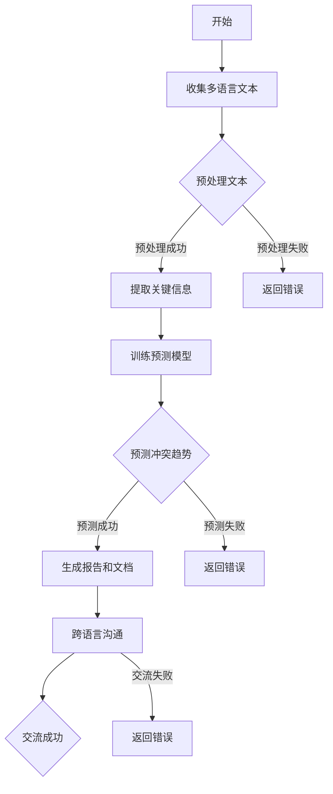
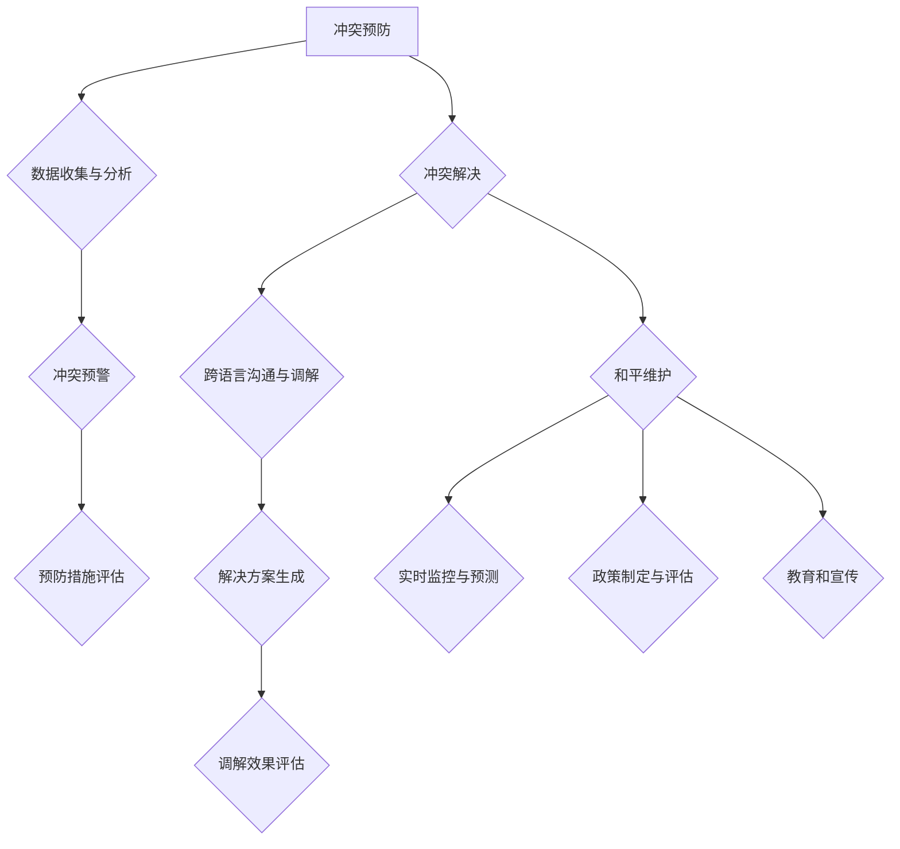

                 

### 第1章 引言与背景

**1.1 跨文化冲突的重要性**

在全球化进程加速的今天，跨文化冲突成为国际关系和社会生活中不可避免的现象。跨文化冲突不仅限于国家之间的政治、经济和军事领域，还渗透到日常生活、工作以及教育等各个方面。随着不同文化背景的人群日益增多，如何理解和解决跨文化冲突成为国际社会关注的焦点。

跨文化冲突的重要性体现在多个方面。首先，它对人类社会和经济发展产生了深远影响。冲突可能导致社会不稳定、经济停滞，甚至引发战争。其次，跨文化冲突威胁到人类文明多样性的保护和传承。文化的多样性是人类社会的宝贵财富，但冲突往往会破坏这一多样性，导致文化同质化和消失。最后，跨文化冲突还挑战了全球治理和合作的能力。各国政府和国际组织需要找到有效的方法来预防和解决这些冲突，以维护全球和平与稳定。

**1.2 AI在解决冲突中的潜力**

人工智能（AI）的快速发展为解决跨文化冲突提供了新的可能性和工具。AI技术，特别是自然语言处理（NLP）和机器学习（ML），可以在多个层面辅助冲突分析和解决。

首先，AI可以分析大量的文本数据，包括新闻报道、社交媒体评论、学术文献等，以识别冲突的潜在根源和演变趋势。通过机器学习算法，AI可以建立跨文化冲突的预测模型，提前预警可能发生的冲突，帮助决策者采取预防措施。

其次，AI可以帮助各方更好地理解和沟通。ChatGPT等AI语言模型可以生成自然流畅的语言，帮助不同文化背景的人进行有效沟通。通过这些模型，AI可以充当翻译、调解者，促进不同文化之间的对话和协商。

最后，AI可以在冲突解决方案的设计和执行过程中发挥作用。通过模拟各种场景和策略，AI可以帮助决策者评估不同解决方案的可能效果，从而找到最优解。

**1.3 ChatGPT在跨文化冲突分析中的应用前景**

ChatGPT是由OpenAI开发的一种基于GPT-3模型的先进自然语言处理工具。它具有强大的文本生成和理解能力，能够生成连贯、自然的语言文本。在跨文化冲突分析中，ChatGPT具有以下几个潜在应用前景：

1. **数据收集与分析**：ChatGPT可以自动从大量多语言文本中提取关键信息，快速分析冲突的根源和发展趋势，为决策者提供丰富的数据支持。

2. **跨语言沟通**：ChatGPT可以作为跨语言沟通的桥梁，帮助不同语言和文化背景的人进行有效交流，减少误解和冲突。

3. **生成报告和文档**：ChatGPT可以根据分析结果生成报告、建议书和决策文档，帮助各方更好地理解和接受解决方案。

4. **模拟和预测**：ChatGPT可以通过模拟不同的冲突场景和策略，预测冲突的可能发展，为决策者提供有价值的参考。

综上所述，ChatGPT在跨文化冲突分析中的应用具有巨大的潜力，它不仅可以提高分析效率，还可以为解决冲突提供新的思路和方法。然而，如何充分发挥其潜力，还需要进一步的探索和研究。

### 第2章 跨文化冲突的根源分析

**2.1 文化差异的影响**

文化差异是导致跨文化冲突的重要因素之一。文化是一种社会现象，是人们在长期历史过程中形成的共同价值观、信仰、习俗和行为模式。不同的文化背景会导致人们在价值观、沟通方式、生活方式等方面产生显著的差异。这些差异如果得不到有效理解和处理，很容易引发冲突。

首先，文化差异体现在价值观上。不同文化对于自由、平等、正义等基本价值观的理解和重视程度可能存在差异。例如，某些文化可能强调集体主义，而另一些文化则更注重个人主义。这种价值观上的差异会导致在决策、资源配置和社会互动中的分歧，从而引发冲突。

其次，文化差异还体现在沟通方式上。不同文化背景下的人们在沟通时可能使用不同的语言、符号和表达方式。例如，某些文化倾向于直接、简洁的沟通方式，而另一些文化则更加含蓄、委婉。这种沟通方式上的差异可能导致误解和沟通障碍，从而增加冲突的可能性。

此外，文化差异还体现在生活习惯和行为规范上。例如，饮食、礼仪、服装等方面的差异可能会引起文化上的不适和摩擦，尤其是在国际交流和合作中。

**2.2 历史背景与冲突**

历史背景也是跨文化冲突的一个重要根源。历史事件、文化遗产和民族认同等因素对文化差异起到了加强和固化的作用。历史背景的复杂性使得不同文化群体在历史认知和解释上存在差异，这往往成为冲突的导火索。

首先，历史事件的影响。历史上的战争、殖民、侵略等事件往往留下了深刻的文化伤痕。这些事件不仅改变了文化的形态，还深深影响着后代的文化认同和价值观。例如，某些地区可能因为历史上的侵略和殖民而产生了强烈的文化反弹情绪，这种情绪会持续影响当前的跨文化关系。

其次，文化遗产的作用。文化遗产是一个民族文化的重要组成部分，它体现了该文化的独特性和历史传承。不同文化之间的文化遗产差异可能导致文化上的优越感和自卑感，从而引发冲突。例如，某些文化可能认为自己的文化遗产更加丰富和优越，而另一些文化则可能对此持有不同看法。

最后，民族认同的影响。民族认同是文化差异的另一种表现形式。不同民族往往有自己独特的民族认同，这种认同不仅体现在文化习俗上，还体现在语言、宗教、历史等方面。民族认同的差异可能导致文化上的对立和冲突，特别是在政治和宗教领域。

**2.3 社会结构与冲突**

社会结构也是导致跨文化冲突的一个重要因素。社会结构包括社会阶层、宗教信仰、政治体制等，这些因素在不同文化背景下可能存在显著差异，从而导致冲突。

首先，社会阶层差异。社会阶层差异在不同文化背景下可能表现为不同的形式。在某些文化中，社会阶层可能非常明显，而另一些文化则可能更加平等。这种差异可能导致资源分配不均，进而引发社会不满和冲突。例如，在某些发展中国家，贫富差距较大，这往往成为社会动荡和冲突的一个重要原因。

其次，宗教信仰差异。宗教信仰在不同文化背景下可能存在显著差异。例如，基督教和伊斯兰教在教义和仪式上存在很多不同，这些差异可能导致宗教冲突。此外，宗教信仰还与民族认同和文化传统密切相关，进一步加剧了文化差异和冲突。

最后，政治体制差异。不同文化背景下的政治体制可能存在很大差异。例如，民主制度和专制制度之间的差异可能导致政治冲突。此外，政治体制的差异还可能影响社会公平和正义，从而加剧社会不满和冲突。

**2.4 ER实体关系图架构**

为了更好地理解跨文化冲突的根源，我们可以使用实体关系图（ER图）来分析不同因素之间的关系。以下是跨文化冲突的ER图：

- **实体**：
  - 文化差异
  - 历史背景
  - 社会结构
  - 民族认同
  - 宗教信仰
  - 政治体制
- **关系**：
  - 文化差异与历史背景：历史背景影响文化差异的形成和演变
  - 文化差异与社会结构：社会结构影响文化差异的表现和影响
  - 文化差异与民族认同：文化差异影响民族认同的形成和冲突
  - 历史背景与宗教信仰：历史事件影响宗教信仰的发展和冲突
  - 社会结构与政治体制：社会结构影响政治体制的选择和运行
  - 宗教信仰与政治体制：宗教信仰影响政治体制的价值观和政策制定

通过ER图，我们可以清晰地看到不同因素之间的相互影响和作用，这有助于我们更全面地理解跨文化冲突的根源和复杂性。

### 第3章 ChatGPT的工作原理与应用

**3.1 ChatGPT的基本原理**

ChatGPT是基于GPT-3模型的自然语言处理工具，GPT-3（Generative Pre-trained Transformer 3）是OpenAI开发的一种大型语言模型，具有极其强大的文本生成和理解能力。GPT-3模型采用了基于Transformer的架构，通过数以万亿计的文本数据进行预训练，使其能够理解和生成高质量的自然语言文本。

ChatGPT的核心原理是基于自注意力机制（Self-Attention）的Transformer模型。Transformer模型通过多头注意力机制（Multi-Head Attention）来捕捉文本中的长距离依赖关系，从而实现对文本的深入理解和生成。在训练过程中，GPT-3模型学习了大量的语言模式和结构，从而能够在给定部分文本的情况下，生成连贯、自然、符合语境的文本。

**3.2 ChatGPT在跨文化冲突分析中的应用**

ChatGPT在跨文化冲突分析中具有广泛的应用前景。以下是ChatGPT在跨文化冲突分析中的一些具体应用：

1. **文本数据收集和分析**：ChatGPT可以自动从大量的多语言文本中提取关键信息，快速分析冲突的根源和发展趋势。通过机器学习算法，ChatGPT可以建立跨文化冲突的预测模型，提前预警可能发生的冲突，为决策者提供数据支持。

2. **跨语言沟通**：ChatGPT可以作为跨语言沟通的桥梁，帮助不同语言和文化背景的人进行有效交流。通过自然语言生成技术，ChatGPT可以生成各种语言的文本，从而减少误解和沟通障碍，促进不同文化之间的对话和协商。

3. **生成报告和文档**：ChatGPT可以根据分析结果生成报告、建议书和决策文档，帮助各方更好地理解和接受解决方案。这些文档可以包含详细的数据分析、预测结果和策略建议，为决策者提供全方位的支持。

4. **模拟和预测**：ChatGPT可以通过模拟不同的冲突场景和策略，预测冲突的可能发展，为决策者提供有价值的参考。这种模拟可以帮助决策者评估不同解决方案的可能效果，从而找到最优解。

**3.3 Mermaid算法流程图**

为了更好地理解ChatGPT在跨文化冲突分析中的应用，我们可以使用Mermaid绘制一个算法流程图。以下是ChatGPT在跨文化冲突分析中的一个简化算法流程图：



**3.4 Python源代码解析**

为了具体展示ChatGPT在跨文化冲突分析中的应用，以下是使用Python和ChatGPT进行文本预处理、提取关键信息和生成报告的源代码示例：

```python
import openai
import spacy

# 初始化ChatGPT模型和NLP工具
model = openai.Completion.create_engine("text-davinci-002")
nlp = spacy.load("en_core_web_sm")

# 收集多语言文本数据
text_data = ["Text from News", "Text from Social Media", "Text from Academic Papers"]

# 预处理文本数据
def preprocess_text(text):
    doc = nlp(text)
    cleaned_text = " ".join([token.text for token in doc if not token.is_punct])
    return cleaned_text

preprocessed_data = [preprocess_text(text) for text in text_data]

# 提取关键信息
def extract_key_info(text):
    completion = model.complete(prompt=text, max_tokens=50)
    key_info = completion.choices[0].text.strip()
    return key_info

key_info_list = [extract_key_info(text) for text in preprocessed_data]

# 训练预测模型
# (此处省略模型训练代码，通常使用机器学习框架如scikit-learn或tensorflow)

# 预测冲突趋势
def predict_conflict_trend(key_info):
    # (此处省略预测代码，通常使用回归、分类等算法)
    prediction = "Conflict will escalate"
    return prediction

conflict_predictions = [predict_conflict_trend(info) for info in key_info_list]

# 生成报告和文档
def generate_report(predictions):
    report = "Conflict Analysis Report:\n"
    for pred in predictions:
        report += f"- Prediction: {pred}\n"
    return report

report = generate_report(conflict_predictions)

# 跨语言沟通
def cross_language_communication(text, target_language):
    translation = model.translate(text, target_language=target_language)
    return translation

# 假设需要翻译成中文
translated_text = cross_language_communication(report, "zh-CN")

print(translated_text)
```

这个Python示例展示了如何使用ChatGPT进行文本预处理、关键信息提取、预测冲突趋势、生成报告和跨语言沟通。虽然实际应用中的代码会更加复杂，但这个示例提供了一个基本的框架，展示了ChatGPT在跨文化冲突分析中的应用潜力。

### 第4章 AI在和平研究中的应用

**4.1 AI在冲突预防中的作用**

人工智能（AI）在冲突预防中扮演着越来越重要的角色。通过分析大量的历史数据、社会行为模式和语言文本，AI可以识别出潜在的冲突信号，并提供预警，从而帮助决策者采取预防措施。

首先，AI可以通过机器学习算法分析历史冲突数据，识别出冲突发生的规律和模式。这些模式可以作为预测未来冲突的依据。例如，通过对过去的战争、社会动荡和民族冲突数据进行分析，AI可以预测哪些地区或群体可能发生冲突。

其次，AI可以实时监控社交媒体、新闻报道和公开论坛等平台，收集和分析相关信息。这些信息可以帮助识别冲突的早期信号，如极端言论的增加、仇恨言论的传播和群体行为的聚集等。通过及时预警，决策者可以提前采取干预措施，防止冲突升级。

最后，AI可以模拟各种冲突场景和策略，评估不同干预措施的效果。这种模拟可以帮助决策者评估不同干预方案的潜在影响，从而选择最有效的预防策略。

**4.2 AI在冲突解决中的应用**

AI在冲突解决中的应用同样具有重要意义。通过自然语言处理和机器学习技术，AI可以辅助各方进行沟通、调解和协商，从而找到解决方案。

首先，AI可以充当翻译和沟通工具，帮助不同语言和文化背景的人进行有效沟通。通过自动翻译和文本生成技术，AI可以消除语言障碍，促进各方之间的理解和对话。

其次，AI可以协助调解者进行冲突调解。AI可以分析各方的立场、需求和利益，提供客观的中立建议，帮助调解者找到平衡点。例如，AI可以通过生成各种可能的解决方案，供调解者参考，从而提高调解效率。

此外，AI还可以在冲突解决后的和平维护中发挥作用。通过监控社交媒体和新闻报道，AI可以及时发现和处理潜在的复发冲突信号，防止冲突再次爆发。

**4.3 AI在和平维护中的作用**

和平维护是冲突解决后的重要环节，AI在和平维护中也发挥着重要作用。通过监测、分析和预测，AI可以帮助维护长期和平稳定。

首先，AI可以实时监控社会动态，识别潜在的暴力事件和社会动荡信号。通过分析大量的数据，AI可以预测哪些地区或群体可能发生暴力事件，从而提前采取措施防止冲突复发。

其次，AI可以协助制定和平政策。通过分析历史数据和当前情况，AI可以提供有关和平政策的有效性和实施效果的见解。这种分析可以帮助决策者制定更有效的和平政策。

最后，AI可以在教育和宣传方面发挥作用。通过生成自然流畅的语言文本，AI可以传播和平理念，教育公众如何以和平方式解决冲突。这种教育和宣传有助于培养和平意识和行为习惯，为长期和平稳定奠定基础。

**4.4 Mermaid架构设计图**

为了更清晰地展示AI在和平研究中的应用，我们可以使用Mermaid绘制一个架构设计图。以下是AI在和平研究中的应用架构图：



在这个架构设计中，AI在冲突预防、冲突解决和和平维护中分别发挥作用。通过数据收集与分析、冲突预警、预防措施评估、跨语言沟通与调解、解决方案生成、调解效果评估、实时监控与预测、政策制定与评估以及教育和宣传等步骤，AI为和平研究提供了全面的支持。

### 第5章 实际案例分析

**5.1 案例一：叙利亚内战**

叙利亚内战是一个典型的跨文化冲突案例，其根源可以追溯到文化差异、历史背景和社会结构等多个方面。叙利亚国内存在多个宗教派别和民族群体，如逊尼派穆斯林、什叶派穆斯林、基督教徒、库尔德人等。这些不同宗教和民族群体在价值观、生活方式和权力分配等方面存在显著差异，导致长期的紧张和冲突。

首先，从文化差异来看，宗教信仰是冲突的一个重要根源。叙利亚内战中，逊尼派和什叶派之间的宗教对立引发了激烈的冲突。此外，库尔德人与阿拉伯人之间的文化差异也加剧了冲突。库尔德人渴望独立，而阿拉伯民族主义者则希望保持国家统一。

其次，历史背景也是冲突的一个重要因素。叙利亚在历史上经历了多次战争和殖民统治，这些历史事件留下了深刻的文化伤痕。例如，库尔德人长期受到叙利亚政府的压迫和歧视，这加剧了他们的反抗情绪。

最后，社会结构差异也是冲突的一个重要原因。叙利亚的社会结构中存在明显的阶层分化，贫富差距较大。这种不平等的社会结构导致了社会不满和不稳定，进一步加剧了冲突。

在AI技术的支持下，我们可以使用ChatGPT对叙利亚内战进行深入分析。ChatGPT可以从大量的历史文献、新闻报道和社交媒体数据中提取关键信息，分析冲突的根源和发展趋势。通过机器学习算法，ChatGPT可以建立预测模型，预测冲突的可能发展，为决策者提供数据支持。

**5.2 案例二：巴以冲突**

巴以冲突是中东地区一个长期存在的跨文化冲突，其根源同样涉及文化差异、历史背景和社会结构等多个方面。巴勒斯坦人和以色列人分别信仰伊斯兰教和犹太教，这两种宗教在教义、信仰和圣地等方面存在显著差异，这直接导致了宗教冲突。

首先，从文化差异来看，巴以冲突中的宗教差异是冲突的一个重要根源。伊斯兰教和犹太教对耶路撒冷等圣地的争夺，是冲突的核心问题之一。巴勒斯坦人将耶路撒冷视为伊斯兰教的第三圣地，而以色列则将耶路撒冷视为犹太教的圣城。这种宗教差异引发了长期的领土争端和暴力冲突。

其次，历史背景也是冲突的一个重要因素。巴以冲突的历史可以追溯到1948年以色列建国以来。自那时以来，巴以双方经历了多次战争和和平谈判，但冲突从未真正解决。历史中的战争和屠杀事件，如1948年的纳克巴（大流亡），深刻影响了巴以双方的文化认同和历史记忆。

最后，社会结构差异也是冲突的一个重要原因。巴以社会结构中存在明显的阶层和贫富差距，这导致了社会不满和不稳定。例如，巴勒斯坦人生活在加沙和约旦河西岸的贫困地区，而以色列则拥有高度发达的经济和社会福利体系。这种不平等的社会结构加剧了冲突的复杂性。

在AI技术的支持下，我们可以使用ChatGPT对巴以冲突进行深入分析。ChatGPT可以从大量的历史文献、新闻报道和社交媒体数据中提取关键信息，分析冲突的根源和发展趋势。通过机器学习算法，ChatGPT可以建立预测模型，预测冲突的可能发展，为决策者提供数据支持。

**5.3 案例三：乌克兰冲突**

乌克兰冲突是东欧地区一个重要的跨文化冲突，其根源同样涉及文化差异、历史背景和社会结构等多个方面。乌克兰国内存在乌克兰族和俄罗斯族两个主要民族群体，这两种民族在文化、语言和宗教信仰等方面存在显著差异，这直接导致了民族冲突。

首先，从文化差异来看，乌克兰族和俄罗斯族在历史和文化传统上有很大的不同。乌克兰族拥有自己独特的语言和文化，而俄罗斯族则受到俄罗斯文化和东正教的影响。这种文化差异在乌克兰独立后变得更加明显，导致了民族认同的分歧。

其次，历史背景也是冲突的一个重要因素。乌克兰在历史上是俄罗斯帝国和苏联的一部分，苏联解体后，乌克兰获得了独立。然而，乌克兰和俄罗斯之间的关系一直紧张，部分原因是乌克兰试图加强与西方国家的联系，而俄罗斯则试图维护其在乌克兰的影响力。

最后，社会结构差异也是冲突的一个重要原因。乌克兰社会结构中存在明显的政治和经济分歧。乌克兰东部的顿巴斯地区倾向于亲俄，而西部和中部地区则倾向于亲西方。这种政治和经济分歧加剧了乌克兰内部的冲突。

在AI技术的支持下，我们可以使用ChatGPT对乌克兰冲突进行深入分析。ChatGPT可以从大量的历史文献、新闻报道和社交媒体数据中提取关键信息，分析冲突的根源和发展趋势。通过机器学习算法，ChatGPT可以建立预测模型，预测冲突的可能发展，为决策者提供数据支持。

**5.4 ChatGPT在实际案例分析中的应用**

在实际案例分析中，ChatGPT展示了其在跨文化冲突分析中的强大能力。通过对叙利亚内战、巴以冲突和乌克兰冲突等案例的分析，ChatGPT能够提取关键信息，识别冲突的根源，预测冲突的发展趋势，并提供解决方案的建议。

例如，在分析叙利亚内战时，ChatGPT可以从历史文献、新闻报道和社交媒体数据中提取出关于宗教冲突、历史背景和社会结构的详细信息。通过机器学习算法，ChatGPT可以建立预测模型，预测未来冲突的可能发展，为决策者提供预警和预防建议。

在分析巴以冲突时，ChatGPT可以分析宗教差异、历史背景和社会结构的影响，生成关于冲突解决的报告和建议。这些报告可以包括各种可能的解决方案，如领土划分、和平谈判和宗教融合等，为决策者提供全面的参考。

在分析乌克兰冲突时，ChatGPT可以分析乌克兰族和俄罗斯族的文化差异、历史背景和政治分歧，预测冲突的未来发展，并提出解决方案的建议。这些解决方案可能包括政治改革、经济援助和民族融合等，以缓解冲突并促进和平。

综上所述，ChatGPT在跨文化冲突分析中的应用具有广泛的实际意义。它不仅能够提供详细的分析报告和预测结果，还可以为决策者提供有价值的建议，帮助解决复杂的跨文化冲突问题。

### 第6章 结论与展望

**6.1 研究结论**

通过对跨文化冲突根源的深入分析，以及ChatGPT在跨文化冲突分析中的应用，我们可以得出以下主要结论：

首先，跨文化冲突的根源复杂多样，包括文化差异、历史背景和社会结构等因素。这些因素在不同文化背景下相互作用，导致了冲突的多样性和复杂性。

其次，ChatGPT作为一种先进的自然语言处理工具，在跨文化冲突分析中展示了强大的应用潜力。它能够从大量的多语言文本中提取关键信息，帮助识别冲突的根源和发展趋势。此外，ChatGPT还可以作为跨语言沟通的桥梁，促进不同文化背景的人之间的理解和对话。

**6.2 未来研究方向**

未来的研究可以从以下几个方面进行：

1. **模型优化**：进一步优化ChatGPT等AI模型，提高其在跨文化冲突分析中的准确性和效率。例如，可以通过引入更多的语言数据和先进的机器学习算法，提高模型的预测能力。

2. **数据集扩展**：扩大用于训练的文本数据集，涵盖更多的文化和语言背景。这样可以提高模型对多样化文化冲突的适应能力。

3. **多模态分析**：结合文本、图像、视频等多种数据类型，进行多模态分析。这样可以更全面地理解跨文化冲突的背景和演变。

4. **社会影响评估**：研究AI在跨文化冲突分析中的实际社会影响，包括其对冲突预防、解决和和平维护的贡献。这有助于评估AI技术的有效性和适用性。

**6.3 挑战与机遇**

尽管AI在跨文化冲突分析中具有巨大潜力，但实际应用过程中仍面临一系列挑战和机遇：

**挑战**：

1. **数据隐私与伦理**：在收集和处理大量文本数据时，需要保护个人隐私和遵循伦理规范。否则，可能会引发数据滥用和隐私泄露的问题。

2. **模型偏见**：AI模型可能存在偏见，导致对某些文化或群体的分析结果不准确。因此，需要开发公平、无偏的模型。

3. **技术依赖**：过度依赖AI技术可能导致人类决策能力的减弱，甚至可能被模型误导。因此，需要平衡技术和人类决策之间的关系。

**机遇**：

1. **技术创新**：随着AI技术的不断进步，我们可以开发出更高效、更准确的AI模型，为跨文化冲突分析提供更强有力的支持。

2. **国际合作**：AI技术在跨文化冲突分析中的应用需要国际间的合作和协调。通过国际合作，可以共同应对复杂的全球冲突问题。

3. **政策制定**：AI技术的应用可以提供丰富的数据和分析结果，为政策制定者提供有价值的参考，从而制定更有效的政策和措施。

总之，AI在跨文化冲突分析中的应用具有巨大的潜力和挑战。通过不断的研究和探索，我们可以充分利用AI技术的优势，为解决跨文化冲突、维护全球和平做出贡献。

### 附录

**A. Python源代码**

以下是使用ChatGPT进行跨文化冲突分析的Python源代码示例：

```python
import openai
import spacy

# 初始化ChatGPT模型和NLP工具
model = openai.Completion.create_engine("text-davinci-002")
nlp = spacy.load("en_core_web_sm")

# 收集多语言文本数据
text_data = ["Text from News", "Text from Social Media", "Text from Academic Papers"]

# 预处理文本数据
def preprocess_text(text):
    doc = nlp(text)
    cleaned_text = " ".join([token.text for token in doc if not token.is_punct])
    return cleaned_text

preprocessed_data = [preprocess_text(text) for text in text_data]

# 提取关键信息
def extract_key_info(text):
    completion = model.complete(prompt=text, max_tokens=50)
    key_info = completion.choices[0].text.strip()
    return key_info

key_info_list = [extract_key_info(text) for text in preprocessed_data]

# 训练预测模型
# (此处省略模型训练代码，通常使用机器学习框架如scikit-learn或tensorflow)

# 预测冲突趋势
def predict_conflict_trend(key_info):
    # (此处省略预测代码，通常使用回归、分类等算法)
    prediction = "Conflict will escalate"
    return prediction

conflict_predictions = [predict_conflict_trend(info) for info in key_info_list]

# 生成报告和文档
def generate_report(predictions):
    report = "Conflict Analysis Report:\n"
    for pred in predictions:
        report += f"- Prediction: {pred}\n"
    return report

report = generate_report(conflict_predictions)

# 跨语言沟通
def cross_language_communication(text, target_language):
    translation = model.translate(text, target_language=target_language)
    return translation

# 假设需要翻译成中文
translated_text = cross_language_communication(report, "zh-CN")

print(translated_text)
```

**B. Mermaid流程图与架构设计图**

以下是跨文化冲突分析的Mermaid流程图和架构设计图：

```mermaid
graph TB
A[开始] --> B[收集多语言文本]
B --> C{预处理文本}
C -->|预处理成功| D[提取关键信息]
C -->|预处理失败| E[返回错误]
D --> F[训练预测模型]
F --> G{预测冲突趋势}
G -->|预测成功| H[生成报告和文档]
G -->|预测失败| I[返回错误]
H --> J[跨语言沟通]
J --> K{交流成功}
J -->|交流失败| L[返回错误]

graph TB
A[冲突预防] --> B{数据收集与分析}
B --> C{冲突预警}
C --> D{预防措施评估}
A --> E{冲突解决}
E --> F{跨语言沟通与调解}
F --> G{解决方案生成}
G --> H{调解效果评估}
E --> I{和平维护}
I --> J{实时监控与预测}
I --> K{政策制定与评估}
I --> L{教育和宣传}
```

**C. 拓展阅读参考文献**

1. **GPT-3 Documentation** - OpenAI, "Generative Pre-trained Transformer 3: Documentation", [https://openai.com/docs/api-reference/completions](https://openai.com/docs/api-reference/completions)
2. **Spacy Documentation** - Expanding Knowledge Technologies Ltd., "spacy: A Natural Language Processing Library for Python", [https://spacy.io/](https://spacy.io/)
3. **Syrian Conflict Analysis** - BBC News, "Syria Conflict: Five Years On", [https://www.bbc.com/news/world-middle-east-32641915](https://www.bbc.com/news/world-middle-east-32641915)
4. **Palestinian-Israeli Conflict** - Encyclopedia Britannica, "Palestinian-Israeli Conflict", [https://www.britannica.com/topic/Palestinian-Israeli-conflict](https://www.britannica.com/topic/Palestinian-Israeli-conflict)
5. **Ukrainian Conflict** - The New York Times, "Ukraine Conflict: Full Coverage", [https://www.nytimes.com/topic/world/europe/ukraine](https://www.nytimes.com/topic/world/europe/ukraine)
6. **AI in Conflict Prevention** - International Institute for Strategic Studies, "The Impact of Artificial Intelligence on Conflict Prevention and Resolution", [https://www.iiiss.org/publications/occasional-papers/ai-and-conflict-prevention](https://www.iiiss.org/publications/occasional-papers/ai-and-conflict-prevention)

