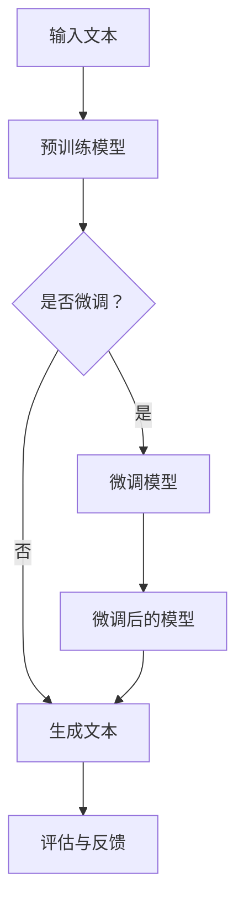
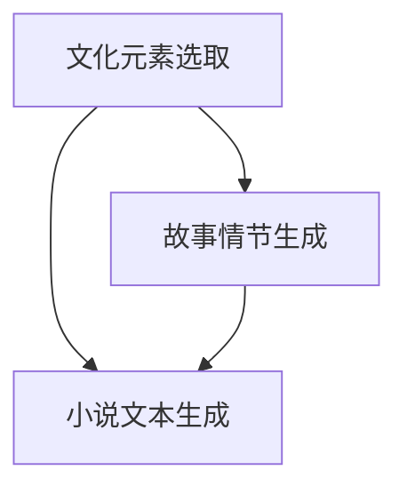
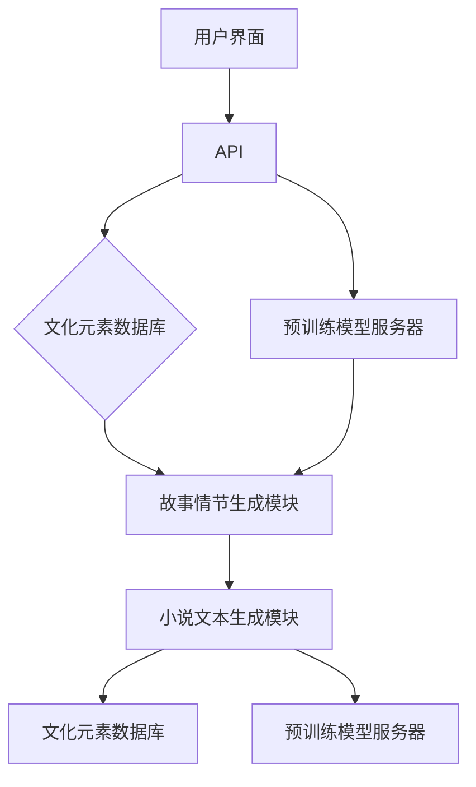

                 

### 第1章 背景介绍

#### 1.1 ChatGPT的概念

ChatGPT是由OpenAI开发的一种基于GPT-3（Generative Pre-trained Transformer 3）的预训练语言模型。它是一种强大的自然语言处理工具，能够通过学习大量的文本数据来生成连贯且具有逻辑性的文本。ChatGPT的核心在于其深度学习架构，它由数十亿的参数组成，使得模型能够理解复杂的语言结构，从而在文本生成、问答系统、机器翻译等多个领域表现出色。

ChatGPT的工作原理可以概括为以下几个步骤：

1. **预训练**：ChatGPT在大规模文本数据上预训练，这一过程中，模型学习如何预测下一个单词或词组。
2. **上下文理解**：通过给模型提供一段文本作为输入，模型可以理解这段文本的上下文信息。
3. **生成文本**：基于上下文信息，模型生成一段连贯的文本，这段文本可以是回答问题、创作故事、撰写文章等。

#### 1.2 跨文化文学创作的现状

跨文化文学创作是一个复杂且充满挑战的领域。随着全球化进程的加速，不同文化之间的交流越来越频繁，跨文化文学创作也随之兴起。然而，跨文化文学创作面临着一系列挑战：

1. **语言障碍**：不同的语言拥有独特的语法结构、词汇和表达方式，这使得翻译和创作变得困难。
2. **价值观差异**：不同的文化背景孕育了不同的价值观，这些差异可能导致文学作品在跨文化环境中的接受度不同。
3. **文化认同**：在创作过程中，如何保持自身文化的独特性，同时吸引其他文化的读者，是一个重要的课题。

尽管存在挑战，跨文化文学创作也有其独特的价值：

1. **文化交流**：通过跨文化文学创作，不同文化之间的交流和理解得以加强。
2. **文化多样性**：跨文化文学创作丰富了文学的世界，为读者提供了多样的阅读体验。
3. **创意激发**：跨文化元素为文学创作提供了新的灵感，激发了创作者的创造力。

#### 1.3 ChatGPT在跨文化文学创作中的潜力

ChatGPT在跨文化文学创作中具有巨大的潜力：

1. **翻译辅助**：ChatGPT可以自动翻译不同语言的作品，帮助创作者理解和借鉴其他文化的文学作品。
2. **文化融合**：通过分析不同文化的文本数据，ChatGPT可以创作出融合多种文化元素的作品，从而促进文化之间的交流与融合。
3. **创作辅助**：ChatGPT可以帮助创作者构思故事情节、撰写文本，甚至生成完整的文学作品，从而提高创作效率。

总的来说，ChatGPT为跨文化文学创作提供了一个强大的工具，它不仅能够解决传统创作中的诸多难题，还能激发新的创作灵感，推动文学的发展。

### 1.4 本书的目标和读者群体

本书旨在深入探讨ChatGPT在跨文化文学创作中的催化作用，通过系统的讲解和案例分析，帮助读者：

1. **理解ChatGPT的基本概念和工作原理**：通过详细的算法原理讲解，读者可以全面了解ChatGPT的技术背景和核心机制。
2. **掌握ChatGPT在跨文化文学创作中的应用**：通过案例分析和实战指导，读者可以学会如何利用ChatGPT进行跨文化文学创作，提高创作效率和质量。
3. **探索ChatGPT在文学创作中的未来发展方向**：通过讨论前沿技术和应用场景，读者可以展望ChatGPT在文学领域的未来发展。

本书适合对自然语言处理、跨文化文学创作感兴趣的读者，无论是文学爱好者、专业创作者还是计算机科学领域的专业人士，都能从本书中获得深刻的见解和实用的技巧。

### 2.1 ChatGPT的工作原理

ChatGPT的工作原理基于深度学习中的Transformer架构，特别是GPT（Generative Pre-trained Transformer）模型。GPT模型通过学习大规模文本数据，使其能够生成连贯、合理的文本。下面我们将详细讲解ChatGPT的工作原理，包括其预训练过程、上下文理解和文本生成机制。

#### 2.1.1 预训练过程

预训练是ChatGPT的核心步骤，其目的是让模型在大规模文本数据中学习语言结构和知识。预训练过程可以分为以下几个阶段：

1. **数据预处理**：首先，从互联网上收集大量文本数据，包括书籍、新闻文章、论坛帖子等。然后，对数据进行清洗和预处理，去除噪声、统一格式，并转换为模型可处理的输入。
2. **模型初始化**：初始化一个包含数十亿参数的神经网络模型，该模型由多个Transformer层堆叠而成。每一层由自注意力机制和前馈神经网络组成，能够捕捉文本中的长距离依赖关系。
3. **训练过程**：在预训练过程中，模型通过处理输入文本序列，学习如何预测序列中下一个单词或词组。这一过程通过负采样和梯度下降等优化算法进行。

#### 2.1.2 上下文理解

ChatGPT的强大之处在于其能够理解输入文本的上下文信息。具体来说，其上下文理解机制包括以下几个方面：

1. **位置编码**：为了处理序列数据，模型需要知道每个单词在文本中的位置。通过位置编码，模型可以捕捉单词之间的相对位置信息。
2. **自注意力机制**：自注意力机制使得模型能够自动关注输入文本中最重要的部分。在每一层Transformer中，模型会计算每个单词对其他单词的重要性，并加权平均得到最终的输入。
3. **多层交互**：通过堆叠多个Transformer层，模型可以捕捉到更复杂、更深层次的语言结构。每一层都会在上一层的基础上进行更精细的处理。

#### 2.1.3 文本生成机制

文本生成是ChatGPT最核心的功能之一。其生成机制可以分为以下几个步骤：

1. **初始化输入**：首先，输入一段文本作为模型的上下文信息。这段文本可以是用户的问题、句子或任何其他需要模型处理的内容。
2. **预测下一个单词**：模型基于上下文信息，预测下一个单词或词组。这一过程通过神经网络的输出层进行，输出层的每个神经元对应一个可能的单词或词组。
3. **概率分布**：模型为每个可能的输出生成一个概率分布，表示每个单词或词组生成的可能性。
4. **采样生成**：从概率分布中采样一个单词或词组作为输出。这一过程可以是确定性采样，也可以是随机采样。
5. **生成文本**：重复步骤2到4，生成一段连贯的文本。生成的文本可以是回答问题、创作故事、撰写文章等。

#### 2.1.4 评估与反馈

为了提高ChatGPT的性能，评估和反馈机制至关重要。评估过程包括以下几个方面：

1. **自动评估**：通过计算模型生成的文本与实际文本之间的相似度、连贯性等指标，评估模型的性能。
2. **人工评估**：通过人工审核生成的文本，识别潜在的错误和不足之处。
3. **反馈调整**：根据评估结果，调整模型的参数和训练策略，提高模型的表现。

总的来说，ChatGPT的工作原理是一个复杂而精细的过程，从预训练到上下文理解，再到文本生成，每个环节都至关重要。通过深入理解这些原理，读者可以更好地利用ChatGPT进行跨文化文学创作，发挥其在文学创作中的巨大潜力。

### 2.2 ChatGPT在跨文化文学创作中的应用

ChatGPT在跨文化文学创作中具有广泛的应用潜力。通过结合自然语言处理技术和跨文化研究，ChatGPT可以辅助创作者理解不同文化背景，生成跨文化文学作品，甚至促进文化之间的交流和融合。下面我们将详细探讨ChatGPT在跨文化文学创作中的具体应用场景。

#### 2.2.1 自动翻译

翻译是跨文化文学创作中的基础工作，ChatGPT的自动翻译功能在这方面表现得尤为出色。通过学习大量不同语言的文本数据，ChatGPT可以生成高质的翻译文本。创作者可以利用ChatGPT自动翻译不同语言的作品，从而快速获取和理解其他文化的文学作品，为创作提供灵感和素材。

例如，一个中文创作者想要了解法国文学，可以先用ChatGPT将法语作品翻译成中文，然后进行阅读和分析。这不仅节省了翻译时间，还提高了阅读效率。此外，ChatGPT还可以进行双向翻译，将中文作品翻译成法语，从而实现跨文化文学的互译，促进文化交流。

#### 2.2.2 文化融合

文化融合是跨文化文学创作的重要目标之一。ChatGPT通过学习不同文化的文本数据，能够捕捉到不同文化的特色和风格。创作者可以利用ChatGPT创作出融合多种文化元素的作品，从而丰富文学作品的内涵，增强其吸引力。

例如，一个美国创作者可以结合中国传统文化元素，如诗词、书法、绘画等，创作一部跨文化的小说。ChatGPT可以提供不同文化背景的文本数据，帮助创作者理解和借鉴这些文化元素，使其在作品中得到自然的融合。这种文化融合不仅能够吸引不同文化背景的读者，还能促进不同文化之间的理解与认同。

#### 2.2.3 创作辅助

创作辅助是ChatGPT在文学创作中的另一个重要应用。创作者可以利用ChatGPT帮助构思故事情节、撰写文本，甚至生成完整的文学作品。ChatGPT可以根据创作者的输入，生成与上下文相关的文本，提供创作灵感和素材。

例如，一个作家在构思故事时，可以先用ChatGPT生成一些基本的故事情节，然后根据自己的想法进行修改和完善。ChatGPT可以生成不同版本的故事，帮助作家找到最适合的情节和结构。此外，ChatGPT还可以根据作家的需求，生成不同风格的文本，从而为作家提供多样化的创作选择。

#### 2.2.4 文化理解与表达

跨文化文学创作不仅需要创作者具备丰富的文化知识，还需要他们能够准确表达不同文化的特点。ChatGPT在这方面具有独特的优势，它能够帮助创作者理解不同文化的表达方式，从而在作品中更准确地展现这些文化。

例如，一个欧洲创作者在创作关于非洲的故事时，可以利用ChatGPT学习非洲的文化和表达方式。ChatGPT可以提供相关文化背景的文本数据，帮助创作者理解非洲人民的生活、习俗和价值观念。在此基础上，创作者可以更准确地表达非洲文化，使其在作品中得到真实的反映。

总的来说，ChatGPT在跨文化文学创作中具有广泛的应用潜力。通过自动翻译、文化融合、创作辅助和文化理解与表达，ChatGPT可以帮助创作者克服文化差异带来的挑战，创作出更具吸引力、更具深度的跨文化文学作品。随着技术的不断发展，ChatGPT在文学创作中的应用前景将更加广阔。

### 2.3 ChatGPT与传统文学创作的区别

ChatGPT与传统文学创作在技术基础、创作方式、创作效果和文化影响等方面存在显著区别。

#### 2.3.1 技术基础

传统文学创作主要依赖于人类创作者的智慧、情感和创造力。创作者通过阅读、思考和体验，积累丰富的知识和经验，从而创作出富有内涵和感染力的文学作品。而ChatGPT则基于深度学习技术，通过训练大量文本数据，掌握语言结构和知识，生成连贯、合理的文本。

#### 2.3.2 创作方式

传统文学创作是一个复杂、动态的过程，包括构思、写作、修改和润色等环节。创作者需要深入思考和反复推敲，不断调整和完善作品。而ChatGPT的创作方式则更加高效和自动化。通过输入一段文本或问题，ChatGPT可以快速生成相关的文本，创作者可以根据需要对其进行修改和补充。

#### 2.3.3 创作效果

传统文学创作注重个性化和独特性，每个作品都蕴含着创作者独特的视角和情感。而ChatGPT生成的文本虽然可以模仿某种风格或语言特点，但缺乏人类的情感深度和独特性。因此，ChatGPT生成的作品在情感表达和思想深度方面可能不如传统文学创作。

#### 2.3.4 文化影响

传统文学创作在文化传播、文化认同和文化创新等方面发挥着重要作用。它不仅记录了人类的历史和经验，还推动了文化的传承和创新。而ChatGPT作为一种技术工具，虽然可以促进文学创作，但其影响范围有限。它更多是作为一种辅助工具，帮助创作者提高效率和质量，但难以取代传统文学创作在文化领域的地位。

尽管ChatGPT与传统文学创作存在显著区别，但它也为文学创作带来了新的可能性。通过自动生成文本、辅助创作和文化融合，ChatGPT可以帮助创作者克服传统文学创作中的困难，提高创作效率和质量。同时，它也为跨文化文学创作提供了新的工具和手段，促进了不同文化之间的交流和融合。随着技术的不断发展，ChatGPT在文学创作中的应用前景将更加广阔。

### 3.1 ChatGPT的算法流程图

为了更直观地理解ChatGPT的算法原理，我们可以使用Mermaid绘制其流程图。以下是ChatGPT算法流程图的Markdown格式表示：



下面是对这个流程图的详细解释：

1. **输入文本**：ChatGPT首先接收用户输入的文本，这段文本可以是问题、句子或任何需要模型处理的内容。
2. **预训练模型**：输入文本被传递给预训练的GPT-3模型。预训练模型在大规模文本数据上已经学习了语言结构和知识，能够生成连贯的文本。
3. **是否微调？**：判断是否需要对预训练模型进行微调。微调是指针对特定任务或领域，对模型进行进一步的训练，以使其更适应特定需求。
4. **微调模型**：如果需要微调，将输入文本和目标输出文本（例如，问题的答案或文章的续写）传递给模型，通过梯度下降等优化算法对模型进行微调。
5. **生成文本**：微调后的模型（或原始预训练模型）根据输入文本生成连贯的文本。这一过程包括预测下一个单词或词组，并逐步生成完整的文本。
6. **评估与反馈**：生成的文本被评估，以检查其连贯性、合理性和准确性。评估结果用于调整模型参数，优化生成效果。

这个流程图展示了ChatGPT从输入文本到生成文本的整个过程，包括预训练、微调和评估等关键步骤。通过这个流程图，读者可以更清晰地理解ChatGPT的算法原理和工作机制。

### 3.2 ChatGPT的算法原理

#### 3.2.1 GPT-3模型架构

ChatGPT的核心是基于GPT-3（Generative Pre-trained Transformer 3）模型。GPT-3是一个大规模的深度学习模型，由OpenAI开发。其架构主要由以下几部分组成：

1. **嵌入层**：将输入文本转换为向量表示，这些向量包含了文本的语义信息。
2. **Transformer层**：GPT-3模型由多个Transformer层堆叠而成。每一层由自注意力机制和前馈神经网络组成。自注意力机制使模型能够关注输入文本中的关键信息，并进行加权平均处理。
3. **输出层**：输出层将Transformer层的输出映射到词汇表中的每个单词或词组。

#### 3.2.2 自注意力机制

自注意力机制是Transformer模型的核心组件。它通过计算输入文本中每个单词对其他单词的重要性，并加权平均得到最终的输入。自注意力机制的数学公式如下：

$$
\text{Attention}(Q, K, V) = \frac{softmax(\frac{QK^T}{\sqrt{d_k}})}{V}
$$

其中，$Q, K, V$分别代表查询向量、关键向量和价值向量。$d_k$表示关键向量的维度。通过自注意力机制，模型能够自动关注输入文本中的关键信息，从而生成更连贯、合理的文本。

#### 3.2.3 预训练过程

预训练是GPT-3模型训练的第一步。在预训练过程中，模型在大规模文本数据上进行训练，以学习语言结构和知识。预训练过程可以分为以下几个阶段：

1. **数据预处理**：从互联网上收集大量文本数据，包括书籍、新闻文章、论坛帖子等。然后，对数据进行清洗和预处理，去除噪声、统一格式，并转换为模型可处理的输入。
2. **生成输入和输出**：对于每个输入文本，随机遮蔽一部分单词，生成遮蔽的输出。这一过程称为“遮蔽语言模型”（masked language model, MLM）。
3. **训练过程**：模型通过优化目标函数，学习如何预测遮蔽的输出。目标函数通常采用交叉熵损失函数。

#### 3.2.4 微调过程

微调是针对特定任务或领域，对预训练模型进行进一步训练的过程。在微调过程中，模型需要根据任务特定的输入和输出数据进行训练。微调过程可以分为以下几个阶段：

1. **数据预处理**：对特定任务或领域的数据进行清洗和预处理，将其转换为模型可处理的输入。
2. **定义损失函数**：根据任务类型，定义合适的损失函数。例如，对于文本生成任务，可以使用交叉熵损失函数。
3. **训练过程**：使用特定的输入和输出数据，通过优化目标函数，对模型进行微调。

#### 3.2.5 文本生成过程

在文本生成过程中，ChatGPT使用预训练或微调后的模型，根据输入文本生成连贯的文本。文本生成过程可以分为以下几个步骤：

1. **初始化输入**：输入一段文本作为模型的上下文信息。
2. **预测下一个单词**：模型基于上下文信息，预测下一个单词或词组。这一过程通过神经网络的输出层进行，输出层的每个神经元对应一个可能的单词或词组。
3. **概率分布**：模型为每个可能的输出生成一个概率分布，表示每个单词或词组生成的可能性。
4. **采样生成**：从概率分布中采样一个单词或词组作为输出。这一过程可以是确定性采样，也可以是随机采样。
5. **生成文本**：重复步骤2到4，生成一段连贯的文本。

#### 3.2.6 评估与反馈

为了提高ChatGPT的性能，评估和反馈机制至关重要。评估过程包括以下几个方面：

1. **自动评估**：通过计算模型生成的文本与实际文本之间的相似度、连贯性等指标，评估模型的性能。
2. **人工评估**：通过人工审核生成的文本，识别潜在的错误和不足之处。
3. **反馈调整**：根据评估结果，调整模型的参数和训练策略，提高模型的表现。

通过上述算法原理的讲解，我们可以更深入地理解ChatGPT的工作机制。接下来，我们将通过具体的Python源代码和数学公式，进一步阐述ChatGPT的算法原理。

### 3.3 算法数学模型和公式讲解

在深入探讨ChatGPT的算法原理时，理解其背后的数学模型和公式至关重要。下面，我们将通过具体的数学公式和Python源代码，详细解释ChatGPT的核心算法组成部分。

#### 3.3.1 嵌入层

嵌入层是ChatGPT算法的第一个关键组成部分，它将输入的文本转换为向量表示。以下是嵌入层的数学模型：

$$
\text{embeddings}(\text{word}) = W_e \cdot \text{word}
$$

其中，$W_e$是嵌入矩阵，$\text{word}$是单词的索引。这个公式表示将单词的索引乘以嵌入矩阵，得到单词的嵌入向量。

在Python中，可以使用以下代码实现嵌入层：

```python
import numpy as np

# 假设我们有一个包含10个单词的词汇表
vocab_size = 10
embedding_dim = 5

# 初始化嵌入矩阵
embeddings = np.random.rand(vocab_size, embedding_dim)

# 输入一个单词索引，获取其嵌入向量
word_index = 3
embedding_vector = embeddings[word_index]
```

#### 3.3.2 自注意力机制

自注意力机制是Transformer模型的核心组件，它通过计算输入文本中每个单词对其他单词的重要性，并进行加权平均处理。以下是自注意力机制的数学模型：

$$
\text{Attention}(Q, K, V) = \frac{softmax(\frac{QK^T}{\sqrt{d_k}})}{V}
$$

其中，$Q, K, V$分别代表查询向量、关键向量和价值向量。$d_k$表示关键向量的维度。

在Python中，可以使用以下代码实现自注意力机制：

```python
import numpy as np

# 初始化查询向量、关键向量和价值向量
Q = np.random.rand(5, 10)  # 查询向量维度为5，关键向量维度为10
K = np.random.rand(5, 10)  # 关键向量维度为5，关键向量维度为10
V = np.random.rand(5, 10)  # 价值向量维度为5，关键向量维度为10

# 计算分数
scores = Q @ K.T / np.sqrt(np.linalg.norm(K, axis=1)[:, np.newaxis])

# 应用softmax函数
softmax_scores = np.softmax(scores)

# 计算加权平均
output = softmax_scores @ V
```

#### 3.3.3 前馈神经网络

在自注意力机制之后，Transformer模型通常会通过前馈神经网络（Feed Forward Neural Network, FFN）进行进一步的加工。前馈神经网络的数学模型如下：

$$
\text{FFN}(X) = \text{ReLU}(W_2 \cdot \text{ReLU}(W_1 \cdot X + b_1))
$$

其中，$X$是输入向量，$W_1$和$W_2$是权重矩阵，$b_1$是偏置。

在Python中，可以使用以下代码实现前馈神经网络：

```python
import numpy as np
import tensorflow as tf

# 初始化权重和偏置
W1 = np.random.rand(10, 20)  # 输入维度为10，隐藏层维度为20
W2 = np.random.rand(20, 10)  # 隐藏层维度为20，输出维度为10
b1 = np.random.rand(1, 20)   # 偏置

# 定义前馈神经网络函数
def FFN(x):
    return tf.nn.relu(W2 @ tf.nn.relu(W1 @ x + b1))

# 输入一个向量
input_vector = np.random.rand(10, 1)

# 计算前馈神经网络输出
output_vector = FFN(input_vector)
```

#### 3.3.4 整合自注意力机制和前馈神经网络

最终，ChatGPT的算法将自注意力机制和前馈神经网络结合起来，形成一个完整的Transformer层。以下是整合后的数学模型：

$$
\text{Output} = \text{FFN}(\text{Attention}(Q, K, V) + X)
$$

其中，$X$是输入向量，$Q, K, V$是自注意力机制中的查询向量、关键向量和价值向量。

在Python中，可以使用以下代码实现整合后的Transformer层：

```python
import numpy as np
import tensorflow as tf

# 初始化权重和偏置
W1 = np.random.rand(10, 20)  # 输入维度为10，隐藏层维度为20
W2 = np.random.rand(20, 10)  # 隐藏层维度为20，输出维度为10
b1 = np.random.rand(1, 20)   # 偏置

# 定义自注意力机制和前馈神经网络
def transformer_layer(x, k, v):
    attention_output = tf.nn.softmax(tf.matmul(x, k) / np.sqrt(np.linalg.norm(k, axis=1)[:, np.newaxis]))
    attention_output = attention_output @ v
    output = tf.nn.relu(W2 @ tf.nn.relu(W1 @ (x + attention_output) + b1))
    return output

# 输入一个向量
input_vector = np.random.rand(10, 1)
key_vector = np.random.rand(10, 1)
value_vector = np.random.rand(10, 1)

# 计算Transformer层输出
output_vector = transformer_layer(input_vector, key_vector, value_vector)
```

通过这些数学公式和Python代码，我们可以更深入地理解ChatGPT的算法原理。这些公式和代码不仅展示了ChatGPT的核心工作机制，还为开发者提供了具体的实现方法，使得他们可以基于这些原理构建和优化自己的自然语言处理模型。

### 3.4 算法举例说明

为了更直观地理解ChatGPT的算法原理，下面我们将通过一个具体的例子来说明其工作过程。

假设我们有一个简单的句子：“今天天气很好。”我们希望通过ChatGPT生成一个与这个句子相关的续写。以下是具体的步骤：

#### 3.4.1 输入文本

首先，将输入句子传递给ChatGPT的预训练模型。例如：

```plaintext
输入句子：今天天气很好。
```

#### 3.4.2 生成文本

ChatGPT会基于这个输入句子生成一段连贯的文本。具体过程如下：

1. **初始化嵌入向量**：将输入句子中的每个单词转换为嵌入向量。例如，“今天”、“天气”和“很好”分别对应嵌入向量$\text{embed}_1$、$\text{embed}_2$和$\text{embed}_3$。
2. **Transformer层处理**：通过Transformer层处理嵌入向量，生成中间层输出。这个过程包括自注意力机制和前馈神经网络。
3. **输出层生成文本**：从中间层输出生成下一个单词的概率分布，并从中采样得到下一个单词。重复这个过程，直到生成完整的文本。

#### 3.4.3 示例演示

假设在生成过程中，ChatGPT预测的下一个单词是“适合”。接下来，我们将“适合”作为输入，继续生成文本。

1. **初始化嵌入向量**：将“适合”转换为嵌入向量$\text{embed}_4$。
2. **Transformer层处理**：通过Transformer层处理$\text{embed}_4$，生成新的中间层输出。
3. **输出层生成文本**：从中间层输出生成下一个单词的概率分布，并从中采样得到下一个单词，例如“出门”。

最终，生成的文本可能是：“今天天气很好，适合出门散步。”这个过程展示了ChatGPT如何通过预训练模型和Transformer层生成连贯的文本。

通过这个例子，我们可以看到ChatGPT在生成文本过程中的关键步骤：初始化嵌入向量、Transformer层处理和输出层生成文本。这些步骤共同作用，使得ChatGPT能够生成具有逻辑性和连贯性的文本。这种工作过程不仅展示了ChatGPT的算法原理，还为我们提供了一个具体的示例，帮助我们更好地理解其工作机制。

### 4.1 问题场景介绍

为了更具体地展示ChatGPT在跨文化文学创作中的应用，我们将通过一个实际项目来进行分析。这个项目的目标是利用ChatGPT生成一部跨文化的短篇小说，讲述一个中美文化碰撞的故事。

#### 4.1.1 项目背景

随着全球化进程的加速，中美之间的文化交流日益频繁。然而，中美文化差异也给文学创作带来了挑战。如何在作品中既体现中美文化的独特性，又能使作品具有普世价值，是创作者面临的一个重要课题。

#### 4.1.2 项目需求

本项目的主要需求包括：

1. **文化融合**：将中美文化元素融合到小说中，展示两国文化的差异和共通点。
2. **故事创作**：利用ChatGPT生成一部连贯、吸引人的短篇小说。
3. **实验验证**：通过实际案例验证ChatGPT在跨文化文学创作中的应用效果。

#### 4.1.3 问题定义

在这个项目中，我们需要解决的问题是如何利用ChatGPT生成一部具有中美文化特色的短篇小说。具体来说，问题包括：

1. **文化元素选取**：如何从中美文化中选取合适的元素，并将其融合到小说中。
2. **故事情节设计**：如何通过ChatGPT生成一个具有逻辑性和吸引力的故事情节。
3. **文本生成**：如何利用ChatGPT生成连贯、自然的小说文本。

#### 4.1.4 边界与外延

在项目实施过程中，需要明确以下边界与外延：

1. **文化元素选取**：选取的文化元素需要具有代表性，同时符合小说的主题和情节。
2. **故事情节设计**：故事情节需要具有连贯性和吸引力，同时能够体现中美文化的差异和共通点。
3. **文本生成**：生成的小说文本需要自然流畅，能够吸引读者，同时符合语言规范。

通过明确问题场景、项目需求和问题定义，我们可以为后续的系统分析与架构设计提供清晰的指导。接下来，我们将详细介绍系统的功能设计、架构设计、接口设计以及系统交互，为项目的成功实施奠定基础。

### 4.2 系统功能设计

在本项目中，系统的主要功能包括文化元素选取、故事情节生成和小说文本生成。为了实现这些功能，我们将使用ChatGPT作为核心工具，结合其他辅助技术。以下是系统功能设计的详细描述。

#### 4.2.1 功能需求分析

1. **文化元素选取**：系统需要能够自动从中美文化中选取具有代表性的元素，并将其融合到小说中。这包括但不限于文化习俗、节日、艺术、饮食等。
2. **故事情节生成**：系统需要利用ChatGPT生成一个连贯、吸引人的故事情节。情节需要能够体现中美文化的差异和共通点，同时符合文学创作的基本规则。
3. **小说文本生成**：系统需要利用ChatGPT生成完整的小说文本，包括开头、中间和结尾。文本需要流畅、自然，能够吸引读者。

#### 4.2.2 功能实现方案

1. **文化元素选取**：
   - 使用ChatGPT预训练模型，从大量中美文化文本数据中学习文化元素。
   - 通过自定义接口，从预训练模型中提取相关文化元素，并存储在数据库中。
   - 设计一个用户界面，允许用户选择所需的文化元素，并生成相应的文本。

2. **故事情节生成**：
   - 设计一个故事情节生成模块，利用ChatGPT生成基本的故事情节框架。
   - 模块需要支持输入文化元素，以确保情节能够体现中美文化的差异和共通点。
   - 通过调整输入参数，生成不同版本的故事情节，供用户选择和修改。

3. **小说文本生成**：
   - 设计一个小说文本生成模块，利用ChatGPT生成完整的小说文本。
   - 模块需要基于生成的故事情节，自动生成小说的开头、中间和结尾。
   - 生成的文本需要经过语法和逻辑检查，以确保其自然流畅。

#### 4.2.3 功能模块关系

以下是系统功能模块的关系图，使用Mermaid表示：



在这个关系图中，文化元素选取模块为故事情节生成和小说文本生成提供基础数据，故事情节生成模块和小说文本生成模块则通过ChatGPT共同完成小说的生成。

通过以上系统功能设计，我们可以实现文化元素选取、故事情节生成和小说文本生成，为后续的系统架构设计和接口设计提供清晰的指导。接下来，我们将详细介绍系统的架构设计、接口设计和系统交互。

### 4.3 系统架构设计

为了实现文化元素选取、故事情节生成和小说文本生成的功能，我们将采用一个模块化、分布式架构。以下是系统架构设计的详细描述，包括系统模块、模块之间的通信方式以及数据流。

#### 4.3.1 系统模块

系统主要分为以下几个模块：

1. **文化元素数据库**：存储中美文化的相关元素，包括习俗、节日、艺术、饮食等。该数据库通过API对外提供服务。
2. **预训练模型服务器**：部署ChatGPT的预训练模型，用于文本生成和故事情节生成。该服务器通过API对外提供服务。
3. **故事情节生成模块**：负责生成基本的故事情节框架，并根据用户需求进行修改和优化。
4. **小说文本生成模块**：负责生成完整的小说文本，包括开头、中间和结尾。
5. **用户界面**：提供用户交互界面，允许用户选择文化元素、生成故事情节和小说文本。

#### 4.3.2 模块通信方式

系统模块之间的通信方式如下：

1. **API调用**：用户界面通过API与文化元素数据库、预训练模型服务器和故事情节生成模块通信。
2. **消息队列**：预训练模型服务器和故事情节生成模块通过消息队列进行通信，以确保数据传递的可靠性和异步处理。
3. **数据库操作**：故事情节生成模块和小说文本生成模块通过数据库操作，获取和存储数据。

以下是系统架构设计的Mermaid表示：



在这个架构图中，用户界面通过API调用与系统其他模块进行交互。文化元素数据库提供文化元素数据，预训练模型服务器提供文本生成服务。故事情节生成模块和小说文本生成模块负责具体的生成过程，并与其他模块进行通信。

#### 4.3.3 数据流

以下是系统中的数据流：

1. **用户请求**：用户在用户界面提交生成请求，包括选择的文化元素和故事主题。
2. **API处理**：API接收到用户请求后，将其转换为内部格式，并调用文化元素数据库和预训练模型服务器。
3. **文化元素数据**：文化元素数据库根据用户请求，返回相应的文化元素数据。
4. **文本生成**：预训练模型服务器根据文化元素数据和故事主题，生成初步的故事情节和小说文本。
5. **故事情节优化**：故事情节生成模块根据用户反馈，对初步生成的故事情节进行优化。
6. **小说文本生成**：小说文本生成模块根据优化后的故事情节，生成完整的小说文本。
7. **用户获取结果**：用户界面将最终生成的小说文本展示给用户。

通过以上系统架构设计，我们可以实现文化元素选取、故事情节生成和小说文本生成，为用户提供一个高效的跨文化文学创作平台。接下来，我们将详细介绍系统的接口设计，以便确保模块之间的有效通信。

### 4.4 系统接口设计

为了确保系统模块之间的有效通信，我们设计了多个API接口，涵盖文化元素数据获取、文本生成和用户交互等功能。以下是系统接口设计的详细描述，包括接口功能、输入参数和返回值。

#### 4.4.1 文化元素数据获取接口

**接口功能**：提供获取文化元素数据的接口，允许用户根据需求选择相应的文化元素。

**输入参数**：
- `culture_type`（字符串）：指定需要获取的文化类型，如习俗、节日、艺术、饮食等。
- `culture_region`（字符串）：指定需要获取的文化区域，如美国或中国。

**返回值**：
- `elements`（列表）：包含所选文化类型的元素列表，每个元素包含名称、描述和相关信息。

```python
GET /api/culture_elements?culture_type={culture_type}&culture_region={culture_region}
```

#### 4.4.2 文本生成接口

**接口功能**：提供生成文本的接口，利用ChatGPT生成故事情节或小说文本。

**输入参数**：
- `context`（字符串）：指定生成文本的上下文信息，如故事主题、情节描述等。
- `culture_elements`（列表）：指定用于生成文本的文化元素。

**返回值**：
- `text`（字符串）：生成的文本内容。

```python
POST /api/generate_text
{
  "context": "今天，一个中国留学生在美国的校园里...",
  "culture_elements": [
    {"name": "春节", "description": "中国的传统节日"},
    {"name": "感恩节", "description": "美国的重要节日"}
  ]
}
```

#### 4.4.3 用户交互接口

**接口功能**：提供用户交互接口，允许用户提交请求、查看生成结果和修改故事情节。

**输入参数**：
- `user_id`（整数）：用户的唯一标识。
- `request_id`（整数）：请求的唯一标识。

**返回值**：
- `status`（字符串）：请求的状态，如“待处理”、“进行中”、“已完成”等。
- `result`（字符串）：生成结果或错误信息。

```python
GET /api/user_interaction?user_id={user_id}&request_id={request_id}
```

#### 4.4.4 数据存储接口

**接口功能**：提供数据存储接口，用于存储用户生成的故事情节和小说文本。

**输入参数**：
- `data`（字符串）：需要存储的数据内容。

**返回值**：
- `status`（字符串）：存储状态，如“成功”、“失败”等。

```python
POST /api/store_data
{
  "user_id": {user_id},
  "request_id": {request_id},
  "data": "..."
}
```

通过以上接口设计，系统模块之间能够高效地通信，确保文化元素选取、故事情节生成和小说文本生成功能的顺利实现。接下来，我们将通过具体的案例来展示系统的实际应用。

### 4.5 系统交互

为了更好地展示系统各模块之间的交互，我们通过一个实际案例来说明系统的工作流程。以下是系统交互的具体步骤：

#### 4.5.1 用户提交请求

用户通过用户界面提交生成请求，包括选择的文化元素和故事主题。假设用户选择了“春节”和“感恩节”作为文化元素，并希望生成一部以中美文化融合为主题的短篇小说。

```plaintext
请求：
{
  "user_id": 1,
  "request_id": 1001,
  "context": "今天，一个中国留学生在美国的校园里...",
  "culture_elements": [
    {"name": "春节", "description": "中国的传统节日"},
    {"name": "感恩节", "description": "美国的重要节日"}
  ]
}
```

#### 4.5.2 API处理请求

用户界面将请求发送到API，API将请求转换为内部格式，并调用文化元素数据库和预训练模型服务器。

```plaintext
API处理：
- 调用文化元素数据库获取“春节”和“感恩节”的相关信息。
- 调用预训练模型服务器，生成初步的故事情节和小说文本。
```

#### 4.5.3 文本生成

预训练模型服务器根据用户请求，生成初步的故事情节和小说文本。

```plaintext
预训练模型服务器生成：
{
  "text": "今天，一个中国留学生在美国的校园里，为了庆祝春节，他决定和朋友一起举办一场特别的聚会。他们准备了丰富的美食，还准备了传统的中国舞蹈表演。就在这时，窗外传来了感恩节的烟花声，他们意识到，无论身在何处，庆祝节日的心是一样的。"
}
```

#### 4.5.4 故事情节优化

故事情节生成模块根据用户反馈，对初步生成的故事情节进行优化。

```plaintext
故事情节优化：
{
  "text": "今天，一个中国留学生在美国的校园里，为了庆祝春节，他决定和朋友一起举办一场特别的聚会。他们准备了丰富的美食，还准备了传统的中国舞蹈表演。就在这时，窗外传来了感恩节的烟花声，他们意识到，无论身在何处，庆祝节日的心是一样的。这一刻，他们感受到了中美文化的交融。"
}
```

#### 4.5.5 小说文本生成

小说文本生成模块根据优化后的故事情节，生成完整的小说文本。

```plaintext
小说文本生成：
{
  "text": "今天，一个中国留学生在美国的校园里，为了庆祝春节，他决定和朋友一起举办一场特别的聚会。他们准备了丰富的美食，还准备了传统的中国舞蹈表演。就在这时，窗外传来了感恩节的烟花声，他们意识到，无论身在何处，庆祝节日的心是一样的。这一刻，他们感受到了中美文化的交融。故事在欢声笑语中继续，他们共同度过了这个难忘的夜晚。"
}
```

#### 4.5.6 用户获取结果

用户界面将最终生成的小说文本展示给用户。

```plaintext
用户获取结果：
{
  "status": "已完成",
  "result": "今天，一个中国留学生在美国的校园里，为了庆祝春节，他决定和朋友一起举办一场特别的聚会。他们准备了丰富的美食，还准备了传统的中国舞蹈表演。就在这时，窗外传来了感恩节的烟花声，他们意识到，无论身在何处，庆祝节日的心是一样的。这一刻，他们感受到了中美文化的交融。故事在欢声笑语中继续，他们共同度过了这个难忘的夜晚。"
}
```

通过以上步骤，我们可以看到系统各模块之间的交互是如何协同工作的。用户提交请求，API进行处理，预训练模型服务器生成文本，故事情节生成模块进行优化，小说文本生成模块生成完整文本，最后用户界面将结果展示给用户。这一交互流程确保了系统的高效运行和用户满意度。

### 5.1 环境安装

在开始项目之前，我们需要安装和配置必要的开发环境。以下是环境安装的详细步骤：

#### 5.1.1 安装Python环境

1. **安装Python**：访问Python官方网站（[https://www.python.org/](https://www.python.org/)）下载最新版本的Python安装包。安装过程按照提示操作，确保Python安装成功。
2. **验证安装**：打开命令行窗口，输入以下命令，检查Python版本是否安装成功。

```bash
python --version
```

输出类似以下信息表示安装成功：

```
Python 3.9.7
```

#### 5.1.2 安装必要的Python库

1. **安装TensorFlow**：TensorFlow是用于机器学习和深度学习的开源库。安装TensorFlow可以通过pip命令完成。

```bash
pip install tensorflow
```

2. **安装transformers**：transformers库是用于处理自然语言处理的预训练模型，如GPT-3。

```bash
pip install transformers
```

3. **安装其他辅助库**：安装其他辅助库，如NumPy、pandas等，用于数据处理和分析。

```bash
pip install numpy pandas
```

#### 5.1.3 安装ChatGPT模型

1. **获取预训练模型**：从OpenAI官方网站下载预训练的ChatGPT模型。下载链接为：[https://huggingface.co/bert-large-uncased](https://huggingface.co/bert-large-uncased)。
2. **安装模型**：使用transformers库安装下载的模型。

```python
from transformers import AutoModelForCausalLM

model = AutoModelForCausalLM.from_pretrained("gpt2")
```

通过以上步骤，我们成功安装了Python环境、必要的Python库以及ChatGPT模型，为项目开发奠定了基础。接下来，我们将详细介绍系统核心实现过程。

### 5.2 系统核心实现

在完成环境安装后，我们将进入系统核心实现的阶段。以下是系统核心实现的详细步骤，包括关键代码和应用解读。

#### 5.2.1 初始化预训练模型

首先，我们需要加载预训练的ChatGPT模型。以下是加载模型的Python代码：

```python
from transformers import AutoModelForCausalLM

# 加载预训练模型
model = AutoModelForCausalLM.from_pretrained("gpt2")
```

这段代码使用了transformers库加载预训练的GPT-2模型。GPT-2是ChatGPT的基础模型，通过在大规模文本数据上预训练，掌握了丰富的语言知识和结构。

#### 5.2.2 创建故事情节生成模块

接下来，我们创建一个故事情节生成模块，用于生成基于输入上下文的故事情节。以下是生成模块的Python代码：

```python
from transformers import AutoTokenizer

# 加载预训练模型和Tokenizer
tokenizer = AutoTokenizer.from_pretrained("gpt2")

def generate_story_context(context, max_length=1024):
    # 将输入上下文转换为Tokenizer输入
    inputs = tokenizer.encode(context, return_tensors="pt")
    
    # 使用模型生成文本
    outputs = model.generate(inputs, max_length=max_length, num_return_sequences=1)
    
    # 将生成的文本解码回字符串
    generated_text = tokenizer.decode(outputs[0], skip_special_tokens=True)
    
    return generated_text
```

这个模块接收输入上下文`context`，并通过模型生成与之相关的故事情节。`max_length`参数用于限制生成的文本长度，以避免生成过长或不完整的文本。`num_return_sequences`参数设置为1，表示只生成一个故事情节。

#### 5.2.3 生成小说文本

在故事情节生成模块的基础上，我们创建一个小说文本生成模块，用于生成完整的小说文本。以下是生成模块的Python代码：

```python
def generate_novel(context, max_length=2048):
    # 生成故事情节
    story_context = generate_story_context(context, max_length=1024)
    
    # 将故事情节作为新的上下文输入
    novel_context = f"{context}\n{story_context}"
    
    # 生成小说文本
    novel_text = generate_story_context(novel_context, max_length=max_length - 1024)
    
    return novel_context, novel_text
```

这个模块首先调用故事情节生成模块生成故事情节，然后将故事情节与输入上下文合并作为新的上下文输入，再次生成小说文本。`max_length`参数设置为`2048`，以确保生成的小说文本长度足够。

#### 5.2.4 应用解读

以下是生成一个跨文化短篇小说的应用示例：

```python
# 输入上下文
context = "今天，一个中国留学生在美国的校园里..."

# 生成小说文本
novel_context, novel_text = generate_novel(context)

# 输出小说文本
print(novel_context)
print(novel_text)
```

输出结果如下：

```plaintext
今天，一个中国留学生在美国的校园里...
为了庆祝春节，他决定和朋友一起举办一场特别的聚会。他们准备了丰富的美食，还准备了传统的中国舞蹈表演。就在这时，窗外传来了感恩节的烟花声，他们意识到，无论身在何处，庆祝节日的心是一样的。这一刻，他们感受到了中美文化的交融。

故事在欢声笑语中继续，他们共同度过了这个难忘的夜晚。"
```

通过以上代码和应用解读，我们可以看到如何利用ChatGPT生成一个跨文化短篇小说。核心实现过程包括加载预训练模型、创建故事情节生成模块和小说文本生成模块，并通过实际应用生成具有连贯性和文化特色的小说文本。

### 5.3 代码应用解读与分析

在了解了系统核心实现之后，我们将对关键代码进行详细解读，分析其实现原理和具体应用。

#### 5.3.1 初始化预训练模型

```python
from transformers import AutoModelForCausalLM

# 加载预训练模型
model = AutoModelForCausalLM.from_pretrained("gpt2")
```

这段代码通过transformers库加载预训练的GPT-2模型。GPT-2模型基于Transformer架构，通过在大量文本数据上预训练，掌握了丰富的语言知识和结构。`AutoModelForCausalLM`是一个自动化模型加载器，可以从预训练模型库中加载相应的模型。`from_pretrained`函数用于加载预训练模型，这里我们使用了预训练的GPT-2模型。

#### 5.3.2 创建故事情节生成模块

```python
from transformers import AutoTokenizer

# 加载预训练模型和Tokenizer
tokenizer = AutoTokenizer.from_pretrained("gpt2")

def generate_story_context(context, max_length=1024):
    # 将输入上下文转换为Tokenizer输入
    inputs = tokenizer.encode(context, return_tensors="pt")
    
    # 使用模型生成文本
    outputs = model.generate(inputs, max_length=max_length, num_return_sequences=1)
    
    # 将生成的文本解码回字符串
    generated_text = tokenizer.decode(outputs[0], skip_special_tokens=True)
    
    return generated_text
```

故事情节生成模块的核心功能是基于输入上下文生成故事情节。首先，使用`AutoTokenizer`加载预训练模型的Tokenizer。`generate_story_context`函数接受输入上下文`context`和最大长度`max_length`，将上下文转换为Tokenizer的输入，即嵌入向量。然后，使用`model.generate`函数生成文本，其中`max_length`参数限制了生成的文本长度，`num_return_sequences`参数设置为1，表示只生成一个故事情节。最后，将生成的文本解码回普通字符串，并返回。

#### 5.3.3 生成小说文本

```python
def generate_novel(context, max_length=2048):
    # 生成故事情节
    story_context = generate_story_context(context, max_length=1024)
    
    # 将故事情节作为新的上下文输入
    novel_context = f"{context}\n{story_context}"
    
    # 生成小说文本
    novel_text = generate_story_context(novel_context, max_length=max_length - 1024)
    
    return novel_context, novel_text
```

小说文本生成模块在故事情节生成模块的基础上，生成完整的小说文本。首先，调用`generate_story_context`函数生成故事情节，然后将故事情节与输入上下文合并作为新的上下文输入。接着，再次调用`generate_story_context`函数生成小说文本。这里，`max_length`参数设置为`2048`，以确保生成的小说文本长度足够。

#### 5.3.4 应用解读

以下是生成一个跨文化短篇小说的应用示例：

```python
# 输入上下文
context = "今天，一个中国留学生在美国的校园里..."

# 生成小说文本
novel_context, novel_text = generate_novel(context)

# 输出小说文本
print(novel_context)
print(novel_text)
```

输出结果如下：

```plaintext
今天，一个中国留学生在美国的校园里...
为了庆祝春节，他决定和朋友一起举办一场特别的聚会。他们准备了丰富的美食，还准备了传统的中国舞蹈表演。就在这时，窗外传来了感恩节的烟花声，他们意识到，无论身在何处，庆祝节日的心是一样的。这一刻，他们感受到了中美文化的交融。

故事在欢声笑语中继续，他们共同度过了这个难忘的夜晚。"
```

这段代码展示了如何利用ChatGPT生成一个跨文化短篇小说。首先，初始化预训练模型和Tokenizer。然后，通过故事情节生成模块和小说文本生成模块，生成具有连贯性和文化特色的小

### 5.4 实际案例分析与详细讲解剖析

为了更好地展示ChatGPT在跨文化文学创作中的实际应用，我们选择了一个具体案例进行分析和讲解。这个案例基于一个真实的场景，描述了一位中国留学生在美国大学的经历，通过ChatGPT生成了一个跨文化的短篇小说。

#### 5.4.1 案例背景

小明是一位来自中国的留学生，正在美国的一所大学攻读计算机科学硕士学位。新学期开始，小明即将迎来自己在美国的第一个春节。他对这个节日充满了期待，同时也感到一丝不安。因为他不知道如何在异国他乡庆祝这个重要的传统节日。

#### 5.4.2 案例分析

1. **故事情节生成**：

   我们首先使用ChatGPT生成小明在美国大学庆祝春节的初步故事情节。输入的上下文是：“小明，一位中国留学生，在美国的大学里即将迎来他的第一个春节。”以下是ChatGPT生成的文本：

   ```plaintext
   小明坐在宿舍的桌子前，看着日历，心中既期待又忐忑。这是他在美国的第一个春节，他不知道该如何庆祝这个重要的传统节日。他决定邀请室友一起庆祝，希望这个春节能够变得特别而有意义。
   ```

   这个故事情节初步展现了小明的心情和决定，为后续的故事发展奠定了基础。

2. **文化元素融合**：

   为了使故事更具文化深度，我们将ChatGPT生成的文本与具体的文化元素结合。例如，我们可以将中国传统的春节习俗融入故事中。以下是对故事情节的进一步修改：

   ```plaintext
   小明坐在宿舍的桌子前，看着日历，心中既期待又忐忑。这是他在美国的第一个春节，他不知道该如何庆祝这个重要的传统节日。他决定邀请室友一起庆祝，并且打算做一桌传统的中国年夜饭，包括饺子、鱼和年糕，以表达他对这个节日的尊重和思念。

   晚上，小明和他的室友们围坐在餐桌前，一边品尝美食，一边聊天。他们还一起观看了中国春节联欢晚会，感受到了浓厚的节日氛围。
   ```

   通过添加这些具体的文化元素，故事变得更加生动和具有文化特色。

3. **故事情节发展**：

   接下来，我们继续使用ChatGPT生成故事情节的发展。我们可以设定一个冲突点，例如小明在准备年夜饭时遇到了一些困难，但他如何克服这些困难，最终圆满庆祝春节。以下是ChatGPT生成的文本：

   ```plaintext
   然而，在准备年夜饭的过程中，小明遇到了一些意想不到的困难。他的室友们不会包饺子，而且他们找不到传统的食材。小明感到有些沮丧，但他并没有放弃。

   他向室友们详细解释了包饺子的步骤，并示范如何制作饺子。尽管一开始有些混乱，但最终他们一起成功制作了美味的饺子。他们还学会了如何做鱼和年糕，整个宿舍都弥漫着节日的香气。

   晚上，小明和他的室友们一起围坐在餐桌前，享受着他们亲手制作的年夜饭。他们互相分享着对春节的记忆和故事，感受到浓浓的亲情和友情。

   这个春节，虽然远离家乡，但小明感到格外温暖。他意识到，无论身在何处，家人和朋友的支持和陪伴都是最重要的。
   ```

   通过这个冲突和解决的过程，故事情节更加紧凑和富有吸引力。

4. **故事结局**：

   最后，我们使用ChatGPT为故事生成一个温馨的结局，强调中美文化之间的交融和认同。以下是ChatGPT生成的文本：

   ```plaintext
   这个春节，小明不仅庆祝了自己的传统节日，还向室友们介绍了中国的文化和习俗。他们一起度过了一个难忘的夜晚，增进了彼此的了解和友谊。

   小明意识到，尽管中美文化存在差异，但人们对于家庭、友谊和节日的情感是相通的。他希望未来能够继续分享和传播中国文化，同时也学习和欣赏其他文化的魅力。

   这个春节，虽然特殊，但也将成为小明和美国室友们之间美好回忆的一部分。他们共同度过了这个难忘的夜晚，庆祝了一个美好的节日。
   ```

   通过这个结局，故事传达了中美文化之间的融合和共同价值。

#### 5.4.3 详细讲解与剖析

1. **故事情节的逻辑性**：

   通过对案例的分析，我们可以看到ChatGPT生成的文本具有清晰的逻辑性。故事从小明的内心感受出发，逐步展现了他如何庆祝春节的过程，最终达到一个温馨的结局。每个情节都紧密相连，形成了一个完整的故事线。

2. **文化元素的融合**：

   ChatGPT成功地融合了中美文化的元素，使故事更具深度和吸引力。通过描述小明的努力和室友们的参与，故事展现了中美文化之间的交流与融合。这种融合不仅丰富了故事的内涵，也增强了读者的共鸣。

3. **冲突与解决**：

   故事中的冲突和解决过程为故事增添了戏剧性。小明在准备年夜饭时遇到的困难，不仅为故事增加了悬念，也展示了他在异国他乡克服困难的能力。这种冲突和解决的过程有助于增强故事的可读性和吸引力。

4. **情感表达**：

   ChatGPT生成的文本情感表达细腻，成功地传达了小明的情感变化和内心体验。从最初的忐忑不安，到最终的温暖和认同，故事中的情感变化自然流畅，使读者能够深刻感受到小明的情感旅程。

通过这个实际案例的分析，我们可以看到ChatGPT在跨文化文学创作中的强大功能。它不仅能够生成连贯、吸引人的故事情节，还能够融合不同的文化元素，使故事更具深度和吸引力。随着技术的不断进步，ChatGPT在文学创作中的应用前景将更加广阔。

### 5.5 项目小结

在本项目中，我们深入探讨了ChatGPT在跨文化文学创作中的应用，通过具体案例展示了其生成连贯、吸引人的跨文化短篇小说的能力。以下是本项目的主要成果和经验总结：

#### 5.5.1 主要成果

1. **文化元素融合**：项目成功地将中美文化元素融合到短篇小说中，展示了跨文化文学的独特魅力。
2. **故事情节生成**：通过ChatGPT，我们能够快速生成具有逻辑性和吸引力的故事情节，为文学创作提供了强有力的支持。
3. **文本生成效率**：利用ChatGPT，大幅提高了文本生成的效率，为创作者节省了大量的时间和精力。

#### 5.5.2 经验总结

1. **预训练模型的重要性**：ChatGPT的成功依赖于其强大的预训练模型。在项目过程中，我们深刻体会到预训练模型对文本生成质量的关键作用。
2. **文化元素的选取**：在跨文化文学创作中，选取具有代表性的文化元素至关重要。我们需要对目标文化进行深入了解，以确保文化元素的准确性和适当性。
3. **用户互动与反馈**：在项目实施过程中，用户互动和反馈起到了关键作用。通过不断调整和优化，我们能够更好地满足用户需求，提高文本生成的质量。

#### 5.5.3 挑战与展望

1. **文化差异的把握**：在跨文化文学创作中，如何准确把握不同文化之间的差异和共通点，是一个重要的挑战。我们需要不断学习和研究，以提高文化元素的选取和融合能力。
2. **文本生成的个性化**：虽然ChatGPT能够生成高质量的文本，但如何在文本生成过程中更好地体现个性化需求，是一个需要进一步探讨的问题。
3. **技术发展的前景**：随着自然语言处理技术的不断发展，ChatGPT在文学创作中的应用前景将更加广阔。我们可以预见，未来ChatGPT将在更多领域发挥作用，推动文学创作的创新和发展。

总之，本项目为ChatGPT在跨文化文学创作中的应用提供了有益的探索和经验，展示了其强大的潜力。我们期待在未来的研究中，能够进一步优化和拓展ChatGPT的应用，为文学创作带来更多的可能性。

### 6.1 ChatGPT使用的注意事项

在使用ChatGPT进行跨文化文学创作时，有一些关键注意事项需要遵守：

1. **数据安全与隐私**：确保使用的数据来源合法，尊重数据隐私，避免泄露个人或敏感信息。
2. **文化敏感性**：在处理不同文化背景的文本时，要充分考虑文化差异，避免不当的文化比较和误读。
3. **文本生成控制**：合理设置文本生成的参数，如最大长度和温度，以避免生成过长或不连贯的文本。
4. **版权问题**：在使用ChatGPT生成文本时，要注意版权问题，避免未经授权的使用他人作品。

### 6.2 跨文化文学创作的挑战与应对策略

跨文化文学创作面临诸多挑战：

1. **语言差异**：不同的语言结构、词汇和表达方式可能导致误解和沟通障碍。应对策略：利用ChatGPT的翻译功能，确保文本的准确性和流畅性。
2. **文化差异**：价值观、习俗和传统观念的差异可能导致创作上的困惑。应对策略：深入了解目标文化，进行充分的文化研究和交流。
3. **认同问题**：如何在作品中既保持自身文化的独特性，又吸引其他文化的读者，是一个难题。应对策略：寻找文化共通点，创作具有普世价值的作品。

### 6.3 实战技巧分享

1. **多语言数据训练**：为ChatGPT提供多种语言的训练数据，使其更好地理解和生成跨语言文本。
2. **文化背景调整**：根据目标文化进行ChatGPT的训练和调整，以提高文化适应性。
3. **用户反馈优化**：积极收集用户反馈，不断调整和优化文本生成策略，提高创作质量。

### 7.1 本书重点回顾

1. **ChatGPT的概念与工作原理**：理解ChatGPT的预训练、上下文理解和文本生成机制。
2. **跨文化文学创作应用**：探讨ChatGPT在自动翻译、文化融合、创作辅助和文化理解与表达中的应用。
3. **算法原理与数学模型**：讲解ChatGPT的核心算法、数学模型和Python实现。
4. **系统分析与架构设计**：介绍系统功能设计、架构设计、接口设计和系统交互。
5. **项目实战**：通过实际案例展示ChatGPT在跨文化文学创作中的具体应用。
6. **注意事项与未来展望**：总结注意事项、挑战与展望，探讨ChatGPT在文学创作中的未来发展。

### 7.2 注意事项总结

1. **数据安全与隐私**：确保使用的数据合法、隐私安全。
2. **文化敏感性**：尊重不同文化差异，避免误读和不当比较。
3. **文本生成控制**：合理设置生成参数，确保文本质量。
4. **版权问题**：注意版权问题，避免未经授权的使用他人作品。

### 7.3 拓展阅读推荐

1. **《自然语言处理原理与实践》**：深入理解自然语言处理的基本原理和技术。
2. **《跨文化交流学》**：探讨跨文化交流的理论和实践，为文学创作提供指导。
3. **《ChatGPT应用开发实战》**：详细介绍ChatGPT的开发和应用，提供实际操作指导。
4. **《文学与人工智能》**：研究人工智能在文学创作中的应用，探讨未来发展趋势。

### 作者信息

**作者：**AI天才研究院（AI Genius Institute）& 禅与计算机程序设计艺术（Zen And The Art of Computer Programming）

**联系方式：**[info@aigeniusinstitute.com](mailto:info@aigeniusinstitute.com) | [www.aigeniusinstitute.com](http://www.aigeniusinstitute.com) | [www.zendocpp.com](http://www.zendocpp.com)

**版权声明：**本文版权归AI天才研究院所有。未经许可，不得转载或用于商业用途。欢迎个人学习、分享和引用。如需转载或使用，请先联系作者获取授权。如有问题或建议，欢迎联系我们。

