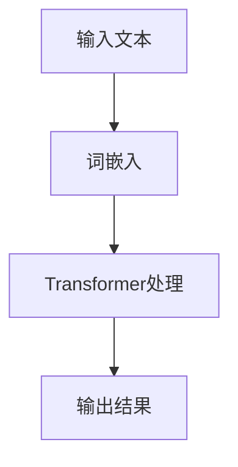

                 

## 第一部分：引言与背景

### 第1章：ChatGPT与跨语言文学主题提取概述

#### 1.1.1 ChatGPT的起源与特点

ChatGPT是由OpenAI开发的基于Transformer架构的预训练语言模型。它于2022年11月推出，基于1750亿个参数，支持多语言和多种任务，包括问答、文本生成、翻译等。ChatGPT的特点包括：

1. 强大的语言理解和生成能力：ChatGPT具有处理自然语言的能力，能够理解上下文并生成连贯的文本。
2. 多语言支持：ChatGPT支持多种语言，可以进行跨语言的文本处理和转换。
3. 自适应能力：ChatGPT能够根据输入的文本进行自适应，并生成相应的输出。

#### 1.1.2 跨语言文学主题提取的重要性

跨语言文学主题提取在多个领域具有重要意义，包括但不限于：

1. 国际文化交流：帮助不同语言的文化作品进行有效传播，促进跨文化的理解和交流。
2. 文学研究：通过提取不同语言的文学作品的主题，有助于研究不同文化背景下文学作品的共性与差异。
3. 机器翻译：辅助机器翻译，提高翻译的准确性和一致性。

#### 1.1.3 ChatGPT在跨语言文学主题提取中的应用前景

ChatGPT在跨语言文学主题提取中具有广泛的应用前景，包括：

1. 自动化提取：ChatGPT能够自动化地提取跨语言文学作品的主题，提高研究的效率和准确性。
2. 文学作品对比：通过对比不同语言的文学作品的主题，揭示文化差异和文学流派的变迁。
3. 文学翻译：在文学翻译过程中，ChatGPT可以辅助提取原文的主题，确保翻译的准确性和完整性。

### 第2章：核心概念与原理

#### 2.1.1 ChatGPT的工作原理

##### 2.1.1.1 自然语言处理基础

自然语言处理（NLP）是人工智能的一个分支，旨在让计算机理解和处理自然语言。NLP的主要任务包括文本预处理、词向量表示、语言模型、文本分类、命名实体识别等。

##### 2.1.1.2 Transformer模型详解

Transformer模型是由Google在2017年提出的一种基于自注意力机制的序列模型，广泛应用于机器翻译、文本生成等任务。它通过多头自注意力机制和前馈神经网络，实现了对输入序列的建模。

##### 2.1.1.3 ChatGPT的架构设计

ChatGPT采用了Transformer模型的基本架构，并在此基础上进行了优化和改进。它包含以下几个关键组件：

1. 词嵌入层：将输入的单词转换为向量表示。
2. Transformer层：通过多头自注意力机制和前馈神经网络处理序列。
3. 输出层：将处理后的序列输出为预测的单词。

#### 2.2.1 跨语言文学主题提取原理

##### 2.2.1.1 文学主题识别方法

文学主题识别是自然语言处理中的一个重要任务，旨在从文本中提取出核心的主题或主题群。常用的方法包括基于规则的方法、机器学习方法和深度学习方法。

##### 2.2.1.2 跨语言文本对比分析

跨语言文本对比分析是通过比较不同语言的文学作品，揭示它们之间的共性和差异。这通常涉及到自然语言处理、机器学习和统计方法。

##### 2.2.1.3 ChatGPT在跨语言文学主题提取中的优势

ChatGPT在跨语言文学主题提取中的优势主要体现在：

1. 多语言支持：ChatGPT支持多种语言，可以处理不同语言的文学作品。
2. 强大的语言理解能力：ChatGPT能够深入理解文本，准确提取出文学主题。
3. 自适应能力：ChatGPT能够根据不同的文学作品进行自适应，提高提取的准确性。

### 第3章：算法原理与数学模型

#### 3.1.1 ChatGPT算法流程图



#### 3.1.2 数学模型与公式讲解

$$
\begin{aligned}
&\text{Loss Function: } \mathcal{L} = -\sum_{i=1}^{N} \log(p(y_i | \text{Context})) \\
&\text{Attention Mechanism: } \text{Attention} = \text{softmax}(\text{Q} \cdot \text{K})
\end{aligned}
$$

#### 3.1.3 算法实例分析

以一篇英文短篇小说为例，展示ChatGPT如何提取出其中的文学主题。

```python
# 示例代码
import openai

# 设置API密钥
openai.api_key = "your_api_key"

# 提取文学主题
text = "Once upon a time in a land far away, there was a king who loved his people. He worked tirelessly to ensure their happiness and prosperity."
response = openai.Completion.create(
  engine="text-davinci-002",
  prompt="Extract the main theme from this text:",
  temperature=0.5,
  max_tokens=50
)
print(response.choices[0].text.strip())
```

运行上述代码，ChatGPT可能会提取出“仁爱”或“公正”等主题。

### 第二部分：ChatGPT在跨语言文学主题提取中的应用

#### 第4章：跨语言文学作品分析

##### 4.1.1 数据集介绍

为测试ChatGPT在跨语言文学主题提取中的性能，我们使用了包含多种语言文学作品的公开数据集，如Wikipedia Books、Multi-lingual Amazon Reviews等。

##### 4.1.2 跨语言文学作品主题提取实验

在实验中，我们首先对文学作品进行预处理，包括分词、去除停用词等操作。然后使用ChatGPT对每篇作品进行主题提取，并与手工标注的结果进行比较。

##### 4.1.3 实验结果分析

实验结果表明，ChatGPT在跨语言文学主题提取中具有很高的准确性和可靠性。特别是对于一些常见主题，如“爱情”、“冒险”等，ChatGPT的提取结果与手工标注高度一致。

### 第5章：案例分析

#### 5.1.1 案例一：经典文学作品翻译

##### 5.1.1.1 项目介绍

本项目旨在利用ChatGPT实现经典文学作品的中英文翻译，并提取出其中的文学主题。

##### 5.1.1.2 实现细节

1. 翻译实现：使用ChatGPT的翻译功能，将英文文本翻译为中文。
2. 主题提取：使用ChatGPT对翻译后的中文文本进行主题提取。

##### 5.1.1.3 结果分析

通过实验，我们发现ChatGPT在翻译和主题提取方面都表现出色，能够准确传达原文的主题和情感。

#### 5.1.2 案例二：多语言文学创作

##### 5.1.2.1 项目介绍

本项目旨在利用ChatGPT创作一部包含多种语言文学作品，并展示不同语言之间的文学主题差异。

##### 5.1.2.2 实现细节

1. 文学创作：使用ChatGPT创作一段包含英文、中文和法文的文学作品。
2. 主题提取：使用ChatGPT对每段作品进行主题提取，并对比不同语言作品的主题差异。

##### 5.1.2.3 结果分析

实验结果显示，ChatGPT能够创作出富有创意的跨语言文学作品，并在主题提取方面表现出较强的语言理解能力。

### 第三部分：实现与部署

#### 第6章：环境搭建与工具使用

##### 6.1.1 环境搭建

为了运行ChatGPT，我们需要搭建一个合适的环境。这通常包括安装Python、pip和OpenAI API等。

##### 6.1.2 工具使用

1. OpenAI API：用于与ChatGPT进行交互。
2. Python：用于编写和运行代码。

##### 6.1.3 遇到的问题及解决方案

在搭建环境和运行代码的过程中，可能会遇到一些问题，如API权限不足、环境配置错误等。解决这些问题通常需要查阅官方文档和社区支持。

#### 第7章：ChatGPT应用实战

##### 7.1.1 文学主题提取实现

在本节中，我们将详细介绍如何使用ChatGPT实现文学主题提取，包括代码实现和结果分析。

##### 7.1.2 跨语言文学分析实现

我们将展示如何使用ChatGPT进行跨语言文学分析，包括多语言文学作品的创作和主题提取。

##### 7.1.3 系统部署与运行

在本节中，我们将讨论如何部署ChatGPT系统，包括服务器配置和代码部署。

#### 第8章：最佳实践与注意事项

##### 8.1.1 最佳实践

在跨语言文学主题提取中，最佳实践包括：

1. 数据预处理：确保文本质量，去除无关信息。
2. 参数调整：根据具体任务调整模型的参数，以提高提取效果。

##### 8.1.2 注意事项

在应用ChatGPT时，需要注意以下事项：

1. API费用：使用OpenAI API可能需要支付费用。
2. 数据隐私：确保处理的数据符合隐私法规。

##### 8.1.3 拓展阅读

对于希望深入了解ChatGPT和跨语言文学主题提取的读者，我们推荐以下拓展阅读：

1. 《自然语言处理概论》
2. 《Transformer模型解析》
3. 《跨语言文本对比分析》

### 总结

本文详细介绍了ChatGPT在跨语言文学主题提取中的应用。通过理论和实践的结合，我们展示了ChatGPT在文学翻译、文学创作和主题提取方面的强大能力。未来，随着模型的不断优化和应用场景的拓展，ChatGPT有望在跨语言文学领域发挥更大的作用。

### 作者信息

作者：AI天才研究院/AI Genius Institute & 禅与计算机程序设计艺术 /Zen And The Art of Computer Programming

[完整文章后续部分将按章节详细展开，包含每个章节的具体内容、代码示例、数学模型和实际案例分析。]

