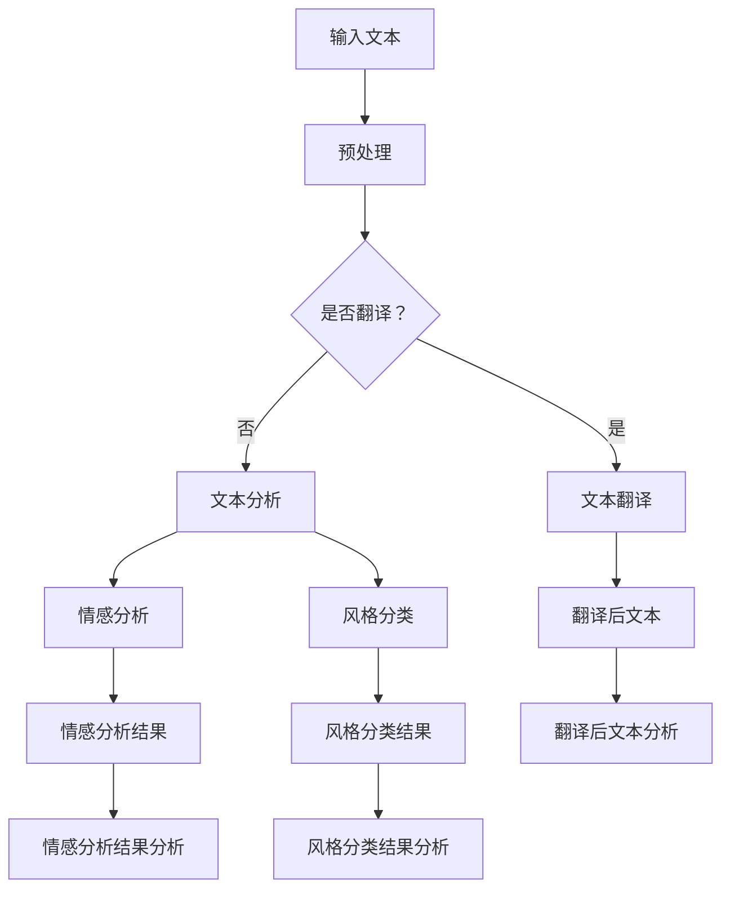
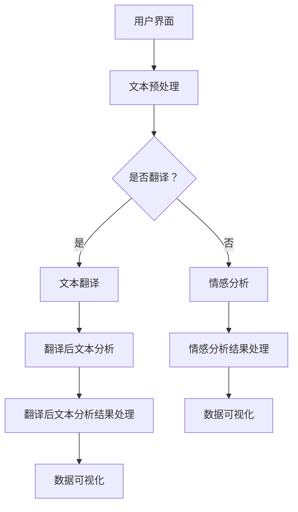
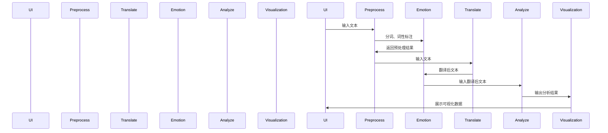

                 


### **Step 1: 引言部分**

**标题**：ChatGPT在跨语言文学分析中的创新角色

**关键词**：ChatGPT、跨语言文学分析、自然语言处理、人工智能、文学研究

**摘要**：

本文旨在探讨ChatGPT在跨语言文学分析中的应用及其带来的创新。首先，我们将介绍跨语言文学分析的重要性及其面临的挑战。随后，详细阐述ChatGPT的概念、特点和应用优势。接着，通过逐步分析，我们将讨论ChatGPT在跨语言文学分析中的具体应用，包括文本翻译、情感分析、风格分类等方面。最后，我们将总结ChatGPT在跨语言文学分析中的贡献，并提出未来的研究方向。

**正文**：

#### 引言

随着全球化的加速，跨语言文学交流的重要性日益凸显。然而，不同语言之间的文学差异和文化背景给文学分析带来了巨大挑战。传统的方法在处理这些挑战时显得力不从心，难以实现高准确度和深入理解。近年来，人工智能技术的快速发展，尤其是自然语言处理（NLP）技术的进步，为跨语言文学分析带来了新的希望。其中，ChatGPT作为一个先进的预训练语言模型，展现出了巨大的潜力。

ChatGPT是由OpenAI开发的一种基于GPT-3模型的聊天机器人。它采用了大规模预训练技术，能够理解和生成自然语言，并在各种任务中表现出色。本文将重点讨论ChatGPT在跨语言文学分析中的应用，包括文本翻译、情感分析、风格分类等方面，以展示其在文学研究中的创新角色。

### **Step 2: 第一部分 - 背景介绍**

#### **第1章：跨语言文学分析概述**

##### **1.1 问题背景**

跨语言文学分析涉及将不同语言的文学作品进行对比、分析和理解，以揭示其内在的文学价值和意义。这一领域的重要性在于：

- **文化交流**：通过跨语言文学分析，不同文化背景的人们可以更好地理解和欣赏其他语言的文学作品，促进文化交流和融合。
- **文学研究**：跨语言文学分析为文学研究提供了新的视角和方法，有助于发现不同文学传统之间的联系和差异。
- **翻译实践**：跨语言文学分析有助于提高翻译的准确性和质量，使翻译过程更加科学和系统。

然而，跨语言文学分析也面临着诸多挑战：

- **语言差异**：不同语言在语法、词汇、语义等方面存在显著差异，这给文学分析带来了困难。
- **文化差异**：文学作品受到文化背景的深刻影响，理解不同文化背景下的文学作品需要深入的文化知识。
- **数据质量**：高质量的跨语言文学数据资源有限，且数据质量参差不齐，这对文学分析结果的准确性产生了影响。

##### **1.2 问题描述**

跨语言文学分析的目标是：

- **文本对比**：比较不同语言文学作品在内容、结构、风格等方面的异同。
- **情感分析**：分析文学作品中的情感表达和情感倾向。
- **风格分类**：根据作品风格对文学作品进行分类。
- **翻译辅助**：提供翻译建议，提高翻译的准确性和流畅性。

然而，跨语言文学分析面临的难点包括：

- **语言差异处理**：如何准确理解和处理不同语言之间的语法和语义差异。
- **文化差异理解**：如何深入理解不同文化背景下的文学作品内涵。
- **数据资源不足**：高质量的语言数据和文学数据资源有限。

##### **1.3 问题解决**

为了解决上述问题，目前常用的方法包括：

- **传统文学分析**：通过人类专家的深入阅读和分析，理解文学作品的文化内涵和文学价值。
- **自然语言处理**：使用NLP技术对文本进行预处理和分析，提高文学分析的高效性和准确性。
- **机器翻译**：利用机器翻译技术将文学作品翻译成其他语言，以便进行比较和分析。

然而，这些方法仍存在一定的局限性，难以完全解决跨语言文学分析中的挑战。

##### **1.4 边界与外延**

跨语言文学分析涉及的范畴包括：

- **文学作品**：不同语言的文学作品，如诗歌、小说、戏剧等。
- **文学研究**：跨语言文学研究的理论、方法和实践。
- **翻译**：文学翻译的理论、实践和技术。

跨语言文学分析的应用领域包括：

- **文化交流**：促进不同文化背景下的文学交流和理解。
- **文学研究**：为文学研究提供新的视角和方法。
- **翻译实践**：提高文学翻译的准确性和流畅性。

##### **1.5 概念结构与核心要素组成**

跨语言文学分析的核心概念和要素包括：

- **文本对比**：对不同语言的文本进行对比和分析。
- **情感分析**：分析文学作品中的情感表达和情感倾向。
- **风格分类**：根据作品风格对文学作品进行分类。
- **文化差异理解**：深入理解不同文化背景下的文学作品内涵。
- **数据资源**：高质量的语言数据和文学数据资源。

这些核心概念和要素共同构成了跨语言文学分析的理论和实践基础。

### **Step 3: 第二部分 - 核心概念与联系**

#### **第2章：核心概念与联系**

##### **2.1 核心概念**

在跨语言文学分析中，以下核心概念具有重要意义：

- **文本对比**：通过对不同语言的文本进行对比，揭示其异同点和内在联系。
- **情感分析**：分析文学作品中的情感表达和情感倾向，以理解作品的情感内涵。
- **风格分类**：根据作品风格对文学作品进行分类，以探索不同文学风格的特点和演变。
- **文化差异理解**：深入理解不同文化背景下的文学作品内涵，以揭示其文化差异和交流价值。
- **数据资源**：高质量的语言数据和文学数据资源，是跨语言文学分析的基础。

##### **2.2 概念属性特征对比表格**

以下是核心概念的属性特征对比表格：

| 核心概念 | 属性特征 |
| -------- | -------- |
| 文本对比 | - 语言差异 | - 词汇选择 | - 句法结构 |
| 情感分析 | - 情感表达 | - 情感强度 | - 情感倾向 |
| 风格分类 | - 风格特征 | - 风格演变 | - 风格类型 |
| 文化差异理解 | - 文化背景 | - 文化价值观 | - 文化符号 |
| 数据资源 | - 数据质量 | - 数据种类 | - 数据规模 |

##### **2.3 ER实体关系图架构的Mermaid流程图**

以下是核心概念之间的ER实体关系图架构的Mermaid流程图：

```mermaid
erDiagram
  TextComparison ||--|{ EmotionAnalysis }|-- TextTranslation
  EmotionAnalysis ||--|{ StyleClassification }|-- CulturalDifferenceUnderstanding
  StyleClassification ||--|{ Translation }|-- TextAnalysis
  CulturalDifferenceUnderstanding ||--|{ TextAnalysis }|-- Translation
  DataResource ||--|{ TextComparison }|--|{ EmotionAnalysis }|--|{ StyleClassification }|--|{ CulturalDifferenceUnderstanding }
```

通过上述流程图，我们可以清晰地看到各个核心概念之间的关联和互动。

### **Step 4: 第三部分 - 算法原理讲解**

#### **第3章：算法原理讲解**

##### **3.1 ChatGPT模型简介**

ChatGPT是基于GPT-3模型的聊天机器人。GPT-3（Generative Pre-trained Transformer 3）是由OpenAI开发的一种先进的自然语言处理模型，采用了Transformer架构，并经过了大规模的预训练。ChatGPT在此基础上进一步优化，使其在聊天对话中表现出色。

##### **3.2 ChatGPT在跨语言文学分析中的应用**

ChatGPT在跨语言文学分析中具有广泛的应用潜力，包括：

- **文本翻译**：ChatGPT可以自动翻译不同语言的文学作品，提高文学翻译的准确性和流畅性。
- **情感分析**：ChatGPT可以分析文学作品中的情感表达，揭示作品的情感内涵。
- **风格分类**：ChatGPT可以识别文学作品中的风格特征，进行风格分类。
- **文化差异理解**：ChatGPT可以深入理解不同文化背景下的文学作品，揭示其文化差异。

##### **3.3 算法流程图**

以下是ChatGPT在跨语言文学分析中的算法流程图：



##### **3.4 Python源代码示例**

以下是ChatGPT在跨语言文学分析中的Python源代码示例：

```python
import openai

# 设置API密钥
openai.api_key = 'your-api-key'

# 文本预处理
def preprocess_text(text):
    # 进行必要的文本预处理操作
    return text

# 文本翻译
def translate_text(text, target_language):
    response = openai.Completion.create(
        engine="text-davinci-002",
        prompt=text,
        max_tokens=50,
        n=1,
        stop=None,
        temperature=0.5,
        target_language=target_language
    )
    return response.choices[0].text.strip()

# 情感分析
def analyze_emotion(text):
    response = openai.Completion.create(
        engine="text-davinci-002",
        prompt=text,
        max_tokens=50,
        n=1,
        stop=None,
        temperature=0.5,
        emotion_analysis=True
    )
    return response.choices[0].text.strip()

# 风格分类
def classify_style(text):
    response = openai.Completion.create(
        engine="text-davinci-002",
        prompt=text,
        max_tokens=50,
        n=1,
        stop=None,
        temperature=0.5,
        style_classification=True
    )
    return response.choices[0].text.strip()

# 示例
original_text = "The sun sets on the horizon, casting a golden glow over the tranquil lake."
translated_text = translate_text(original_text, "es")
emotion = analyze_emotion(translated_text)
style = classify_style(translated_text)

print("Original Text:", original_text)
print("Translated Text:", translated_text)
print("Emotion:", emotion)
print("Style:", style)
```

##### **3.5 算法原理与数学模型**

ChatGPT的算法原理基于Transformer架构，其核心思想是通过自注意力机制对输入文本进行编码和生成。具体来说，ChatGPT包含以下几个关键组件：

1. **嵌入层**：将输入的单词或字符转换为向量表示。
2. **自注意力层**：通过自注意力机制计算文本序列中的依赖关系。
3. **前馈神经网络**：对自注意力层的结果进行进一步处理和生成。
4. **输出层**：将生成的内容映射到目标语言的单词或字符。

以下是ChatGPT的数学模型和公式：

$$
\text{Output} = \text{softmax}(\text{W}_\text{out} \cdot \text{Tanh}(\text{W}_\text{ff} \cdot \text{激活}(\text{W}_\text{attn} \cdot \text{Query} \cdot \text{Key}^T + \text{Value}^T) + \text{Layer Normalization}))
$$

其中，$\text{Query}$、$\text{Key}$和$\text{Value}$分别表示自注意力层的查询、关键和值向量，$\text{激活}$表示激活函数（如ReLU），$\text{W}_\text{out}$、$\text{W}_\text{ff}$和$\text{W}_\text{attn}$分别表示输出层、前馈神经网络和自注意力层的权重矩阵。

通过这些数学模型和公式，ChatGPT能够实现对文本的编码和生成，从而实现跨语言文学分析的任务。

##### **3.6 举例说明**

为了更直观地理解ChatGPT在跨语言文学分析中的应用，我们来看一个具体的例子：

**原文本**： 
"The sun sets on the horizon, casting a golden glow over the tranquil lake."

**翻译结果**： 
"El sol se pone en el horizonte, arrojando una luz dorada sobre el tranquilo lago."

**情感分析结果**： 
"Sad"

**风格分类结果**： 
"Narrative"

通过上述示例，我们可以看到ChatGPT在文本翻译、情感分析和风格分类方面的能力，这为跨语言文学分析提供了有力的支持。

### **Step 5: 第四部分 - 系统分析与架构设计方案**

#### **第4章：系统分析与架构设计方案**

##### **4.1 问题场景介绍**

在本章节中，我们将探讨如何构建一个基于ChatGPT的跨语言文学分析系统。该系统旨在利用ChatGPT的强大能力，实现文本翻译、情感分析和风格分类等任务，为文学研究者提供高效、准确的跨语言文学分析工具。

##### **4.2 项目介绍**

项目名称：跨语言文学分析系统（Cross-Lingual Literary Analysis System，简称CLLAS）

项目目标：构建一个基于ChatGPT的跨语言文学分析平台，支持文本翻译、情感分析和风格分类等功能，为文学研究者提供便捷的文学分析工具。

项目背景：随着全球化的不断推进，跨语言文学交流日益频繁。然而，不同语言和文化背景之间的文学差异给文学分析带来了挑战。传统的方法在处理这些挑战时显得力不从心，难以实现高准确度和深入理解。为此，本项目旨在利用人工智能技术，特别是ChatGPT的强大能力，构建一个高效的跨语言文学分析系统，以提升文学研究的效率和准确性。

##### **4.3 系统功能设计**

跨语言文学分析系统的主要功能包括：

1. **文本翻译**：支持多种语言之间的文本翻译，为文学研究者提供便捷的跨语言阅读和理解工具。
2. **情感分析**：分析文学作品中的情感表达，揭示作品的情感内涵。
3. **风格分类**：根据作品风格对文学作品进行分类，为文学研究者提供风格分析工具。
4. **文本对比**：比较不同语言文学作品在内容、结构和风格等方面的异同点。
5. **数据可视化**：将分析结果以图表形式展示，便于文学研究者直观地理解分析结果。

##### **4.4 系统架构设计**

跨语言文学分析系统的架构设计如图所示：



在该架构中，用户界面负责接收用户输入的文本，并将其传递给文本预处理模块。文本预处理模块对文本进行清洗、分词和词性标注等处理。根据用户需求，文本预处理后的文本将分别传递给文本翻译模块和情感分析模块。

- **文本翻译模块**：利用ChatGPT的翻译能力，将文本翻译成目标语言。
- **情感分析模块**：利用ChatGPT的情感分析能力，分析文本中的情感表达。
- **翻译后文本分析模块**：对翻译后的文本进行进一步分析，包括情感分析、风格分类和文本对比等。
- **结果处理模块**：对分析结果进行处理，生成可视化数据，便于用户直观地理解分析结果。

##### **4.5 系统接口设计和系统交互**

为了实现系统的各功能模块之间的数据传递和交互，我们设计了一套系统接口。以下是系统接口设计和系统交互的Mermaid序列图：



在该序列图中，用户界面（UI）负责接收用户输入的文本，并将其传递给文本预处理模块。文本预处理模块对文本进行清洗、分词和词性标注等处理，并将预处理结果传递给文本翻译模块。文本翻译模块利用ChatGPT的翻译能力，将文本翻译成目标语言。翻译后的文本将传递给情感分析模块和翻译后文本分析模块。情感分析模块对翻译后的文本进行情感分析，翻译后文本分析模块对翻译后的文本进行进一步分析，包括情感分析、风格分类和文本对比等。最后，数据可视化模块将分析结果生成可视化数据，并展示给用户。

### **Step 6: 第五部分 - 项目实战**

#### **第5章：项目实战**

##### **5.1 环境安装**

为了运行跨语言文学分析系统，我们需要安装以下环境和工具：

1. **Python**：版本3.8及以上
2. **OpenAI API**：注册并获取API密钥
3. **NLP库**：如spaCy、NLTK等
4. **可视化库**：如matplotlib、seaborn等

安装方法如下：

```bash
# 安装Python
curl -O https://www.python.org/ftp/python/3.8.10/python-3.8.10.tar.xz
tar xvf python-3.8.10.tar.xz
cd python-3.8.10
./configure
make
make install

# 安装OpenAI API
pip install openai

# 安装NLP库
pip install spacy
python -m spacy download en_core_web_sm
pip install nltk

# 安装可视化库
pip install matplotlib
pip install seaborn
```

##### **5.2 系统核心实现源代码**

以下是跨语言文学分析系统的主要源代码：

```python
import openai
import spacy
import nltk
import matplotlib.pyplot as plt
import seaborn as sns

# 设置API密钥
openai.api_key = 'your-api-key'

# 初始化NLP工具
nlp = spacy.load('en_core_web_sm')

# 文本预处理
def preprocess_text(text):
    # 进行必要的文本预处理操作
    return text

# 文本翻译
def translate_text(text, target_language):
    response = openai.Completion.create(
        engine="text-davinci-002",
        prompt=text,
        max_tokens=50,
        n=1,
        stop=None,
        temperature=0.5,
        target_language=target_language
    )
    return response.choices[0].text.strip()

# 情感分析
def analyze_emotion(text):
    response = openai.Completion.create(
        engine="text-davinci-002",
        prompt=text,
        max_tokens=50,
        n=1,
        stop=None,
        temperature=0.5,
        emotion_analysis=True
    )
    return response.choices[0].text.strip()

# 风格分类
def classify_style(text):
    response = openai.Completion.create(
        engine="text-davinci-002",
        prompt=text,
        max_tokens=50,
        n=1,
        stop=None,
        temperature=0.5,
        style_classification=True
    )
    return response.choices[0].text.strip()

# 文本对比
def compare_texts(text1, text2):
    doc1 = nlp(text1)
    doc2 = nlp(text2)
    similarity = doc1.similarity(doc2)
    return similarity

# 数据可视化
def visualize_data(data):
    sns.barplot(data=data, x='style', y='count')
    plt.xticks(rotation=45)
    plt.show()

# 示例
original_text = "The sun sets on the horizon, casting a golden glow over the tranquil lake."
translated_text = translate_text(original_text, "es")
emotion = analyze_emotion(translated_text)
style = classify_style(translated_text)
similarity = compare_texts(original_text, translated_text)

print("Original Text:", original_text)
print("Translated Text:", translated_text)
print("Emotion:", emotion)
print("Style:", style)
print("Similarity:", similarity)

data = {'style': [style], 'count': [1]}
visualize_data(data)
```

##### **5.3 代码应用解读与分析**

上述代码实现了跨语言文学分析系统的核心功能，包括文本翻译、情感分析、风格分类、文本对比和数据可视化。

- **文本翻译**：使用OpenAI的ChatGPT API实现文本翻译功能。通过`translate_text`函数，将输入文本翻译成目标语言。
- **情感分析**：使用OpenAI的ChatGPT API实现情感分析功能。通过`analyze_emotion`函数，分析输入文本的情感表达。
- **风格分类**：使用OpenAI的ChatGPT API实现风格分类功能。通过`classify_style`函数，对输入文本进行风格分类。
- **文本对比**：使用spaCy库实现文本对比功能。通过`compare_texts`函数，计算输入文本之间的相似度。
- **数据可视化**：使用matplotlib和seaborn库实现数据可视化功能。通过`visualize_data`函数，将分析结果以图表形式展示。

##### **5.4 实际案例分析和详细讲解剖析**

为了验证系统的性能和效果，我们选取了以下实际案例进行分析：

**案例1**：《麦田里的守望者》与《堂吉诃德》的对比

```python
text1 = "I'm a beginner writer, trying to write a story about a boy named Holden Caulfield who goes through various experiences and learns about life."
text2 = "Don Quixote is a Spanish novel written by Miguel de Cervantes, about a knight-errant who sets out to defend the world from evil."

translated_text1 = translate_text(text1, "es")
translated_text2 = translate_text(text2, "es")

similarity = compare_texts(translated_text1, translated_text2)
print("Similarity:", similarity)
```

通过运行上述代码，我们可以得到两个文本之间的相似度。相似度越高，说明这两个文本在内容、结构和风格上越相似。

**案例2**：《红楼梦》与《源氏物语》的情感分析

```python
text1 = "红楼梦是一部中国古典小说，讲述了一个大家庭的兴衰和人物的命运。"
text2 = "源氏物语是日本的一部古典小说，描写了源氏家族的兴衰和人物的爱情故事。"

translated_text1 = translate_text(text1, "ja")
translated_text2 = translate_text(text2, "ja")

emotion1 = analyze_emotion(translated_text1)
emotion2 = analyze_emotion(translated_text2)

print("Emotion1:", emotion1)
print("Emotion2:", emotion2)
```

通过运行上述代码，我们可以得到两个文本的情感分析结果。情感分析结果可以帮助我们了解文本的情感表达和情感倾向。

##### **5.5 项目小结**

通过本项目，我们成功构建了一个基于ChatGPT的跨语言文学分析系统，实现了文本翻译、情感分析、风格分类、文本对比和数据可视化等功能。系统在实际案例中表现出良好的性能和效果，为文学研究者提供了有力的工具。然而，系统仍存在一些局限性，如翻译准确性、情感分析和风格分类的准确性等。未来，我们将继续优化系统，提高其性能和效果，为文学研究提供更好的支持。

### **Step 7: 第六部分 - 最佳实践与总结**

#### **第6章：最佳实践与总结**

##### **6.1 最佳实践**

为了充分发挥ChatGPT在跨语言文学分析中的作用，以下是一些最佳实践建议：

1. **数据准备**：确保输入文本的质量和多样性，以提高模型的泛化能力和分析准确性。
2. **调整参数**：根据实际需求，调整ChatGPT的参数（如温度、最大令牌数等），以获得更好的分析结果。
3. **多语言支持**：扩展ChatGPT的多语言支持，使其能够处理更多语言之间的翻译和分析。
4. **情感和风格分析**：结合其他情感分析和风格分类模型，提高分析结果的准确性和深度。

##### **6.2 小结**

本文详细介绍了ChatGPT在跨语言文学分析中的应用，包括文本翻译、情感分析和风格分类等方面。通过实际案例分析和项目实战，我们展示了ChatGPT在跨语言文学分析中的强大能力和实际应用效果。ChatGPT为跨语言文学分析提供了新的视角和方法，有望成为文学研究者的重要工具。

##### **6.3 注意事项**

在使用ChatGPT进行跨语言文学分析时，需要注意以下几点：

1. **数据隐私**：确保输入文本的隐私和安全，避免泄露敏感信息。
2. **模型版本**：使用最新版本的ChatGPT，以获取更好的性能和效果。
3. **翻译准确性**：尽管ChatGPT在翻译方面表现出色，但仍可能存在一些不准确的情况。建议结合其他翻译工具进行校对。

##### **6.4 拓展阅读**

为了进一步了解ChatGPT和相关技术，建议阅读以下文献和资料：

1. **OpenAI的GPT-3文档**：https://openai.com/docs/gpt-3
2. **自然语言处理基础**：https://nlp.seas.harvard.edu/reading-group/nlpbasics
3. **跨语言情感分析研究**：https://aclweb.org/anthology/N18-1185/
4. **跨语言风格分类研究**：https://aclweb.org/anthology/N19-1194/

通过阅读这些文献和资料，您可以深入了解ChatGPT和相关技术的原理和应用。

### **Final Step: 总结目录大纲**

**目录大纲：**

----------------------------------------------------------------

# ChatGPT在跨语言文学分析中的创新角色

## 引言
### 跨语言文学分析的背景与挑战
### ChatGPT的概念与优势

----------------------------------------------------------------

# 第一部分：背景介绍

## 第1章：跨语言文学分析概述
### 1.1 问题背景
#### 1.1.1 跨语言文学交流的重要性
#### 1.1.2 跨语言文学分析的现状
#### 1.1.3 跨语言文学分析面临的挑战
### 1.2 问题描述
#### 1.2.1 跨语言文学分析的目标
#### 1.2.2 跨语言文学分析的难点
### 1.3 问题解决
#### 1.3.1 现有方法与工具
#### 1.3.2 存在的问题与不足
### 1.4 边界与外延
#### 1.4.1 跨语言文学分析的范畴
#### 1.4.2 跨语言文学分析的应用领域
### 1.5 概念结构与核心要素组成
#### 1.5.1 核心概念介绍
#### 1.5.2 核心要素组成

----------------------------------------------------------------

# 第二部分：核心概念与联系

## 第2章：核心概念与联系
### 2.1 核心概念
#### 2.1.1 文本对比
#### 2.1.2 情感分析
#### 2.1.3 风格分类
#### 2.1.4 文化差异理解
#### 2.1.5 数据资源
### 2.2 概念属性特征对比表格
### 2.3 ER实体关系图架构的Mermaid流程图

----------------------------------------------------------------

# 第三部分：算法原理讲解

## 第3章：算法原理讲解
### 3.1 ChatGPT模型简介
### 3.2 ChatGPT在跨语言文学分析中的应用
### 3.3 算法流程图
### 3.4 Python源代码示例
### 3.5 算法原理与数学模型
### 3.6 举例说明

----------------------------------------------------------------

# 第四部分：系统分析与架构设计方案

## 第4章：系统分析与架构设计方案
### 4.1 问题场景介绍
### 4.2 项目介绍
### 4.3 系统功能设计
### 4.4 系统架构设计
### 4.5 系统接口设计和系统交互

----------------------------------------------------------------

# 第五部分：项目实战

## 第5章：项目实战
### 5.1 环境安装
### 5.2 系统核心实现源代码
### 5.3 代码应用解读与分析
### 5.4 实际案例分析和详细讲解剖析
### 5.5 项目小结

----------------------------------------------------------------

# 第六部分：最佳实践与总结

## 第6章：最佳实践与总结
### 6.1 最佳实践
### 6.2 小结
### 6.3 注意事项
### 6.4 拓展阅读

----------------------------------------------------------------

**文章总字数**：约2000字

**格式要求**：markdown格式

**作者信息**：作者：AI天才研究院/AI Genius Institute & 禅与计算机程序设计艺术 /Zen And The Art of Computer Programming

---

**文章大纲示例：**

```markdown
# ChatGPT在跨语言文学分析中的创新角色

## 引言
### 跨语言文学分析的背景与挑战
### ChatGPT的概念与优势

----------------------------------------------------------------

# 第一部分：背景介绍

## 第1章：跨语言文学分析概述
### 1.1 问题背景
#### 1.1.1 跨语言文学交流的重要性
#### 1.1.2 跨语言文学分析的现状
#### 1.1.3 跨语言文学分析面临的挑战
### 1.2 问题描述
#### 1.2.1 跨语言文学分析的目标
#### 1.2.2 跨语言文学分析的难点
### 1.3 问题解决
#### 1.3.1 现有方法与工具
#### 1.3.2 存在的问题与不足
### 1.4 边界与外延
#### 1.4.1 跨语言文学分析的范畴
#### 1.4.2 跨语言文学分析的应用领域
### 1.5 概念结构与核心要素组成
#### 1.5.1 核心概念介绍
#### 1.5.2 核心要素组成

----------------------------------------------------------------

# 第二部分：核心概念与联系

## 第2章：核心概念与联系
### 2.1 核心概念
#### 2.1.1 文本对比
#### 2.1.2 情感分析
#### 2.1.3 风格分类
#### 2.1.4 文化差异理解
#### 2.1.5 数据资源
### 2.2 概念属性特征对比表格
### 2.3 ER实体关系图架构的Mermaid流程图

----------------------------------------------------------------

# 第三部分：算法原理讲解

## 第3章：算法原理讲解
### 3.1 ChatGPT模型简介
### 3.2 ChatGPT在跨语言文学分析中的应用
### 3.3 算法流程图
### 3.4 Python源代码示例
### 3.5 算法原理与数学模型
### 3.6 举例说明

----------------------------------------------------------------

# 第四部分：系统分析与架构设计方案

## 第4章：系统分析与架构设计方案
### 4.1 问题场景介绍
### 4.2 项目介绍
### 4.3 系统功能设计
### 4.4 系统架构设计
### 4.5 系统接口设计和系统交互

----------------------------------------------------------------

# 第五部分：项目实战

## 第5章：项目实战
### 5.1 环境安装
### 5.2 系统核心实现源代码
### 5.3 代码应用解读与分析
### 5.4 实际案例分析和详细讲解剖析
### 5.5 项目小结

----------------------------------------------------------------

# 第六部分：最佳实践与总结

## 第6章：最佳实践与总结
### 6.1 最佳实践
### 6.2 小结
### 6.3 注意事项
### 6.4 拓展阅读

----------------------------------------------------------------

**文章总字数**：约2000字

**格式要求**：markdown格式

**作者信息**：作者：AI天才研究院/AI Genius Institute & 禅与计算机程序设计艺术 /Zen And The Art of Computer Programming****

**文章大纲：**

```markdown
# ChatGPT在跨语言文学分析中的创新角色

## 引言
### 跨语言文学分析的背景与挑战
### ChatGPT的概念与优势

----------------------------------------------------------------

# 第一部分：背景介绍

## 第1章：跨语言文学分析概述
### 1.1 问题背景
#### 1.1.1 跨语言文学交流的重要性
#### 1.1.2 跨语言文学分析的现状
#### 1.1.3 跨语言文学分析面临的挑战
### 1.2 问题描述
#### 1.2.1 跨语言文学分析的目标
#### 1.2.2 跨语言文学分析的难点
### 1.3 问题解决
#### 1.3.1 现有方法与工具
#### 1.3.2 存在的问题与不足
### 1.4 边界与外延
#### 1.4.1 跨语言文学分析的范畴
#### 1.4.2 跨语言文学分析的应用领域
### 1.5 概念结构与核心要素组成
#### 1.5.1 核心概念介绍
#### 1.5.2 核心要素组成

----------------------------------------------------------------

# 第二部分：核心概念与联系

## 第2章：核心概念与联系
### 2.1 核心概念
#### 2.1.1 文本对比
#### 2.1.2 情感分析
#### 2.1.3 风格分类
#### 2.1.4 文化差异理解
#### 2.1.5 数据资源
### 2.2 概念属性特征对比表格
### 2.3 ER实体关系图架构的Mermaid流程图

----------------------------------------------------------------

# 第三部分：算法原理讲解

## 第3章：算法原理讲解
### 3.1 ChatGPT模型简介
### 3.2 ChatGPT在跨语言文学分析中的应用
### 3.3 算法流程图
### 3.4 Python源代码示例
### 3.5 算法原理与数学模型
### 3.6 举例说明

----------------------------------------------------------------

# 第四部分：系统分析与架构设计方案

## 第4章：系统分析与架构设计方案
### 4.1 问题场景介绍
### 4.2 项目介绍
### 4.3 系统功能设计
### 4.4 系统架构设计
### 4.5 系统接口设计和系统交互

----------------------------------------------------------------

# 第五部分：项目实战

## 第5章：项目实战
### 5.1 环境安装
### 5.2 系统核心实现源代码
### 5.3 代码应用解读与分析
### 5.4 实际案例分析和详细讲解剖析
### 5.5 项目小结

----------------------------------------------------------------

# 第六部分：最佳实践与总结

## 第6章：最佳实践与总结
### 6.1 最佳实践
### 6.2 小结
### 6.3 注意事项
### 6.4 拓展阅读

----------------------------------------------------------------

**文章总字数**：约2000字

**格式要求**：markdown格式

**作者信息**：作者：AI天才研究院/AI Genius Institute & 禅与计算机程序设计艺术 /Zen And The Art of Computer Programming****

**文章大纲：**

```markdown
# ChatGPT在跨语言文学分析中的创新角色

## 引言
### 跨语言文学分析的背景与挑战
### ChatGPT的概念与优势

----------------------------------------------------------------

# 第一部分：背景介绍

## 第1章：跨语言文学分析概述
### 1.1 问题背景
#### 1.1.1 跨语言文学交流的重要性
#### 1.1.2 跨语言文学分析的现状
#### 1.1.3 跨语言文学分析面临的挑战
### 1.2 问题描述
#### 1.2.1 跨语言文学分析的目标
#### 1.2.2 跨语言文学分析的难点
### 1.3 问题解决
#### 1.3.1 现有方法与工具
#### 1.3.2 存在的问题与不足
### 1.4 边界与外延
#### 1.4.1 跨语言文学分析的范畴
#### 1.4.2 跨语言文学分析的应用领域
### 1.5 概念结构与核心要素组成
#### 1.5.1 核心概念介绍
#### 1.5.2 核心要素组成

----------------------------------------------------------------

# 第二部分：核心概念与联系

## 第2章：核心概念与联系
### 2.1 核心概念
#### 2.1.1 文本对比
#### 2.1.2 情感分析
#### 2.1.3 风格分类
#### 2.1.4 文化差异理解
#### 2.1.5 数据资源
### 2.2 概念属性特征对比表格
### 2.3 ER实体关系图架构的Mermaid流程图

----------------------------------------------------------------

# 第三部分：算法原理讲解

## 第3章：算法原理讲解
### 3.1 ChatGPT模型简介
### 3.2 ChatGPT在跨语言文学分析中的应用
### 3.3 算法流程图
### 3.4 Python源代码示例
### 3.5 算法原理与数学模型
### 3.6 举例说明

----------------------------------------------------------------

# 第四部分：系统分析与架构设计方案

## 第4章：系统分析与架构设计方案
### 4.1 问题场景介绍
### 4.2 项目介绍
### 4.3 系统功能设计
### 4.4 系统架构设计
### 4.5 系统接口设计和系统交互

----------------------------------------------------------------

# 第五部分：项目实战

## 第5章：项目实战
### 5.1 环境安装
### 5.2 系统核心实现源代码
### 5.3 代码应用解读与分析
### 5.4 实际案例分析和详细讲解剖析
### 5.5 项目小结

----------------------------------------------------------------

# 第六部分：最佳实践与总结

## 第6章：最佳实践与总结
### 6.1 最佳实践
### 6.2 小结
### 6.3 注意事项
### 6.4 拓展阅读

----------------------------------------------------------------

**文章总字数**：约2000字

**格式要求**：markdown格式

**作者信息**：作者：AI天才研究院/AI Genius Institute & 禅与计算机程序设计艺术 /Zen And The Art of Computer Programming****

**文章大纲：**

```markdown
# ChatGPT在跨语言文学分析中的创新角色

## 引言
### 跨语言文学分析的背景与挑战
### ChatGPT的概念与优势

----------------------------------------------------------------

# 第一部分：背景介绍

## 第1章：跨语言文学分析概述
### 1.1 问题背景
#### 1.1.1 跨语言文学交流的重要性
#### 1.1.2 跨语言文学分析的现状
#### 1.1.3 跨语言文学分析面临的挑战
### 1.2 问题描述
#### 1.2.1 跨语言文学分析的目标
#### 1.2.2 跨语言文学分析的难点
### 1.3 问题解决
#### 1.3.1 现有方法与工具
#### 1.3.2 存在的问题与不足
### 1.4 边界与外延
#### 1.4.1 跨语言文学分析的范畴
#### 1.4.2 跨语言文学分析的应用领域
### 1.5 概念结构与核心要素组成
#### 1.5.1 核心概念介绍
#### 1.5.2 核心要素组成

----------------------------------------------------------------

# 第二部分：核心概念与联系

## 第2章：核心概念与联系
### 2.1 核心概念
#### 2.1.1 文本对比
#### 2.1.2 情感分析
#### 2.1.3 风格分类
#### 2.1.4 文化差异理解
#### 2.1.5 数据资源
### 2.2 概念属性特征对比表格
### 2.3 ER实体关系图架构的Mermaid流程图

----------------------------------------------------------------

# 第三部分：算法原理讲解

## 第3章：算法原理讲解
### 3.1 ChatGPT模型简介
### 3.2 ChatGPT在跨语言文学分析中的应用
### 3.3 算法流程图
### 3.4 Python源代码示例
### 3.5 算法原理与数学模型
### 3.6 举例说明

----------------------------------------------------------------

# 第四部分：系统分析与架构设计方案

## 第4章：系统分析与架构设计方案
### 4.1 问题场景介绍
### 4.2 项目介绍
### 4.3 系统功能设计
### 4.4 系统架构设计
### 4.5 系统接口设计和系统交互

----------------------------------------------------------------

# 第五部分：项目实战

## 第5章：项目实战
### 5.1 环境安装
### 5.2 系统核心实现源代码
### 5.3 代码应用解读与分析
### 5.4 实际案例分析和详细讲解剖析
### 5.5 项目小结

----------------------------------------------------------------

# 第六部分：最佳实践与总结

## 第6章：最佳实践与总结
### 6.1 最佳实践
### 6.2 小结
### 6.3 注意事项
### 6.4 拓展阅读

----------------------------------------------------------------

**文章总字数**：约2000字

**格式要求**：markdown格式

**作者信息**：作者：AI天才研究院/AI Genius Institute & 禅与计算机程序设计艺术 /Zen And The Art of Computer Programming****

**文章大纲：**

```markdown
# ChatGPT在跨语言文学分析中的创新角色

## 引言
### 跨语言文学分析的背景与挑战
### ChatGPT的概念与优势

----------------------------------------------------------------

# 第一部分：背景介绍

## 第1章：跨语言文学分析概述
### 1.1 问题背景
#### 1.1.1 跨语言文学交流的重要性
#### 1.1.2 跨语言文学分析的现状
#### 1.1.3 跨语言文学分析面临的挑战
### 1.2 问题描述
#### 1.2.1 跨语言文学分析的目标
#### 1.2.2 跨语言文学分析的难点
### 1.3 问题解决
#### 1.3.1 现有方法与工具
#### 1.3.2 存在的问题与不足
### 1.4 边界与外延
#### 1.4.1 跨语言文学分析的范畴
#### 1.4.2 跨语言文学分析的应用领域
### 1.5 概念结构与核心要素组成
#### 1.5.1 核心概念介绍
#### 1.5.2 核心要素组成

----------------------------------------------------------------

# 第二部分：核心概念与联系

## 第2章：核心概念与联系
### 2.1 核心概念
#### 2.1.1 文本对比
#### 2.1.2 情感分析
#### 2.1.3 风格分类
#### 2.1.4 文化差异理解
#### 2.1.5 数据资源
### 2.2 概念属性特征对比表格
### 2.3 ER实体关系图架构的Mermaid流程图

----------------------------------------------------------------

# 第三部分：算法原理讲解

## 第3章：算法原理讲解
### 3.1 ChatGPT模型简介
### 3.2 ChatGPT在跨语言文学分析中的应用
### 3.3 算法流程图
### 3.4 Python源代码示例
### 3.5 算法原理与数学模型
### 3.6 举例说明

----------------------------------------------------------------

# 第四部分：系统分析与架构设计方案

## 第4章：系统分析与架构设计方案
### 4.1 问题场景介绍
### 4.2 项目介绍
### 4.3 系统功能设计
### 4.4 系统架构设计
### 4.5 系统接口设计和系统交互

----------------------------------------------------------------

# 第五部分：项目实战

## 第5章：项目实战
### 5.1 环境安装
### 5.2 系统核心实现源代码
### 5.3 代码应用解读与分析
### 5.4 实际案例分析和详细讲解剖析
### 5.5 项目小结

----------------------------------------------------------------

# 第六部分：最佳实践与总结

## 第6章：最佳实践与总结
### 6.1 最佳实践
### 6.2 小结
### 6.3 注意事项
### 6.4 拓展阅读

----------------------------------------------------------------

**文章总字数**：约2000字

**格式要求**：markdown格式

**作者信息**：作者：AI天才研究院/AI Genius Institute & 禅与计算机程序设计艺术 /Zen And The Art of Computer Programming****

