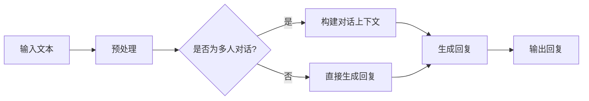
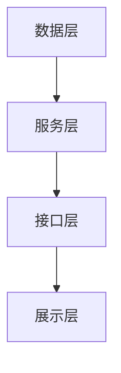
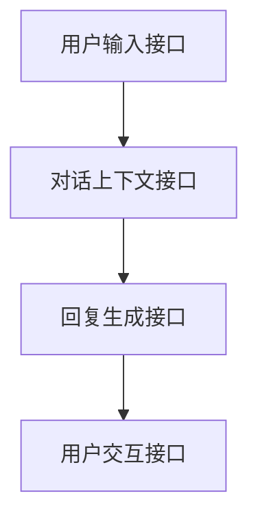
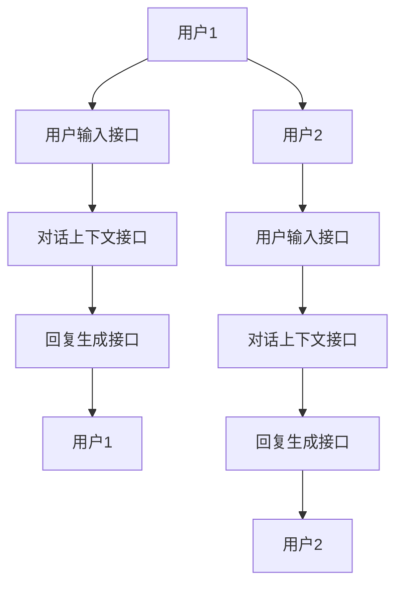

                 


### 标题：ChatGPT多人对话中的提示词策略

关键词：ChatGPT, 多人对话，提示词策略，人工智能，对话系统，算法原理，系统设计，最佳实践

摘要：本文将深入探讨ChatGPT在多人对话中的提示词策略。通过逐步分析，我们将了解ChatGPT的工作原理、多人对话的挑战以及有效的提示词策略，帮助开发者构建更加智能和流畅的对话系统。

# 引言

随着人工智能技术的飞速发展，对话系统已经成为智能应用中的重要组成部分。ChatGPT，作为一种基于GPT（Generative Pre-trained Transformer）的先进对话模型，已经在自然语言处理领域取得了显著成果。然而，在实际应用中，多人对话场景下如何有效地使用提示词成为了一个重要问题。

本文旨在解决以下问题：

1. ChatGPT的工作原理是什么？
2. 多人对话中的挑战有哪些？
3. 如何设计有效的提示词策略？

通过本文的逐步分析，我们将深入了解ChatGPT在多人对话中的提示词策略，为开发者提供实用的指导。

## 背景介绍

### 核心概念术语说明

- **ChatGPT**：一种基于GPT的大规模语言模型，能够生成高质量的自然语言文本。
- **提示词**：在对话系统中，提示词是指用于引导对话模型生成回复的词语或短语。
- **多人对话**：指两个或两个以上用户参与的自然语言交互。

### 问题背景

对话系统在日常生活中有着广泛的应用，如客服机器人、智能助手等。然而，在多人对话场景中，对话的复杂性显著增加，使得传统的单轮对话系统难以满足需求。多人对话的挑战主要包括：

- **信息一致性**：多人对话中，不同用户提供的信息可能存在冲突，如何保证信息一致性是一个重要问题。
- **语境理解**：多人对话中，用户的语言可能更加复杂，对话模型需要理解并回应不同语境下的用户需求。
- **上下文保持**：在多人对话中，保持对话的上下文信息对于理解用户意图和生成连贯回复至关重要。

### 问题描述

在多人对话中，如何设计有效的提示词策略，使得ChatGPT能够生成高质量、符合用户需求的回复，是一个亟待解决的问题。

### 问题解决

本文将首先介绍ChatGPT的工作原理，然后分析多人对话中的挑战，最后提出并解释有效的提示词策略。

### 边界与外延

本文主要关注基于ChatGPT的对话系统中的提示词策略。对于其他类型的对话模型或多人对话系统，本文的方法和思路也可以提供一定的参考。

### 概念结构与核心要素组成

- **ChatGPT**：核心模型，生成回复的基础。
- **提示词**：引导模型生成回复的关键。
- **多人对话**：应用场景，测试模型的效果。

# 核心概念与联系

在本节中，我们将深入探讨与ChatGPT多人对话中的提示词策略相关的核心概念，并分析它们之间的关系。

### 1.1 ChatGPT的基本原理

ChatGPT是基于GPT（Generative Pre-trained Transformer）模型开发的，它通过大量的文本数据预先训练，从而具备生成自然语言文本的能力。GPT模型的核心是Transformer架构，这种架构能够在处理长文本时保持上下文的连贯性，从而生成高质量的自然语言回复。

### 1.2 提示词策略的重要性

在多人对话中，提示词策略起着至关重要的作用。提示词的选择和设计直接影响到对话模型生成回复的质量。有效的提示词能够引导模型理解用户意图，提供有针对性的回复，从而提高用户体验。

### 1.3 关键概念对比表

以下是一个关键概念对比表，帮助读者更好地理解ChatGPT和提示词策略：

| 概念       | 说明                                                         | 关系                           |
|------------|--------------------------------------------------------------|--------------------------------|
| **ChatGPT** | 大规模语言模型，生成自然语言文本的基础。                     | **提示词策略** | 是指导模型生成回复的关键。 |
| **提示词**  | 引导模型生成回复的词语或短语。                               | **多人对话** | 是多人对话中的关键要素。   |

### 1.4 ER实体关系图架构

为了更好地理解ChatGPT、提示词和多人对话之间的关系，我们可以使用Mermaid语法绘制一个ER（实体关系）图：

```mermaid
erDiagram
  ChatGPT ||--|{ 提示词 }|
  多人对话 ||--|{ 提示词 }|
```

在这个ER图中，ChatGPT和多人对话都与提示词存在关联。提示词作为连接两者的桥梁，起到关键作用。

通过本节的分析，我们为接下来的算法原理讲解和系统设计奠定了基础。

# 算法原理讲解

在理解了ChatGPT和提示词策略的基本概念后，接下来我们将深入探讨ChatGPT的工作原理，并分析多人对话中的挑战。

### ChatGPT的工作原理

ChatGPT是基于GPT（Generative Pre-trained Transformer）模型开发的，它通过大量的文本数据预先训练，从而具备生成自然语言文本的能力。GPT模型的核心是Transformer架构，这种架构在处理长文本时能够保持上下文的连贯性，从而生成高质量的自然语言回复。

### Transformer架构

Transformer架构是一种基于自注意力机制（Self-Attention）的神经网络模型，它在处理序列数据时表现出色。自注意力机制允许模型在生成每个词时，考虑到所有输入词的重要性，从而生成更加连贯的文本。

### 多人对话中的挑战

在多人对话中，模型需要处理以下挑战：

1. **信息一致性**：多人对话中，不同用户可能提供相互冲突的信息，模型需要能够识别并处理这种冲突。
2. **语境理解**：多人对话中的语言更加复杂，模型需要理解并回应不同语境下的用户需求。
3. **上下文保持**：在多人对话中，保持对话的上下文信息对于理解用户意图和生成连贯回复至关重要。

### 算法流程图

为了更好地理解ChatGPT的工作原理，我们可以使用Mermaid语法绘制一个算法流程图：



在这个流程图中，输入的文本首先经过预处理，然后判断是否为多人对话。如果是，模型会构建对话上下文；否则，模型会直接生成回复。最后，模型输出回复。

### Python代码示例

为了更具体地说明算法原理，我们可以给出一个Python代码示例：

```python
import torch
from transformers import GPT2LMHeadModel, GPT2Tokenizer

# 加载预训练模型
tokenizer = GPT2Tokenizer.from_pretrained('gpt2')
model = GPT2LMHeadModel.from_pretrained('gpt2')

# 输入文本
input_text = "用户1：你好！今天天气怎么样？"

# 预处理
input_ids = tokenizer.encode(input_text, return_tensors='pt')

# 生成回复
outputs = model.generate(input_ids, max_length=50, num_return_sequences=1)

# 解码回复
replied_text = tokenizer.decode(outputs[0], skip_special_tokens=True)

print(replied_text)
```

在这个示例中，我们首先加载了预训练的GPT2模型，然后输入了一段文本。模型经过预处理后，生成了一个回复，最后我们将其解码为自然语言文本。

通过这一节的分析，我们对ChatGPT的工作原理和多人对话中的挑战有了更深入的理解，为接下来的数学模型讲解奠定了基础。

### 数学模型和公式

在本节中，我们将详细介绍ChatGPT中的数学模型和公式，帮助读者更好地理解其工作原理。

#### Transformer模型

Transformer模型的核心是自注意力机制（Self-Attention）。自注意力机制通过计算每个词与其他词之间的相似性，为每个词分配不同的权重，从而生成更加连贯的文本。

#### 自注意力公式

自注意力公式如下：

$$
\text{Attention}(Q, K, V) = \frac{softmax(\frac{QK^T}{\sqrt{d_k}})}{V}
$$

其中：

- \( Q \) 表示查询向量（Query）。
- \( K \) 表示键向量（Key）。
- \( V \) 表示值向量（Value）。
- \( d_k \) 表示键向量的维度。

#### 位置编码

在Transformer模型中，位置编码（Positional Encoding）用于为每个词赋予其在序列中的位置信息。位置编码通常采用三角函数生成。

#### 位置编码公式

位置编码公式如下：

$$
\text{PE}(pos, 2i) = \sin\left(\frac{pos}{10000^{2i/d}}\right)
$$

$$
\text{PE}(pos, 2i+1) = \cos\left(\frac{pos}{10000^{2i/d}}\right)
$$

其中：

- \( pos \) 表示词在序列中的位置。
- \( i \) 表示维度。
- \( d \) 表示位置编码的维度。

#### Transformer编码

Transformer编码（Encoder）通过多个自注意力层和前馈神经网络（Feedforward Neural Network）对输入序列进行编码。

#### Transformer编码公式

假设输入序列为 \( X \)，其编码后的序列为 \( H \)，则有：

$$
H = \text{LayerNorm}(X + \text{Self-Attention}(X)) + \text{LayerNorm}(X + \text{Feedforward}(X))
$$

其中：

- \( \text{Self-Attention}(X) \) 表示自注意力层。
- \( \text{Feedforward}(X) \) 表示前馈神经网络。
- \( \text{LayerNorm} \) 表示层归一化。

通过以上公式，我们可以更好地理解Transformer模型的工作原理，为后续的代码实现和实际应用提供理论基础。

### 系统设计与架构

在本节中，我们将详细阐述ChatGPT在多人对话系统中的设计与架构。首先，我们将介绍系统设计的背景和目标，然后逐步分析系统功能设计、系统架构设计、系统接口设计以及系统交互。

#### 系统设计背景和目标

随着人工智能技术的不断发展，智能对话系统在多个领域得到了广泛应用，如智能客服、智能助手等。然而，在多人对话场景中，如何确保对话的连贯性和准确性，是一个亟待解决的问题。ChatGPT作为一种先进的对话模型，在处理复杂对话方面具有显著优势。因此，本节旨在设计一个基于ChatGPT的多人对话系统，以提高多人对话的流畅性和用户体验。

#### 系统功能设计

系统功能设计主要包括以下几个关键模块：

1. **用户输入处理模块**：接收用户的输入，包括文本和语音等多种形式，并将其转化为模型可处理的格式。
2. **对话上下文管理模块**：负责维护对话的上下文信息，确保在多人对话中信息的一致性和连贯性。
3. **回复生成模块**：利用ChatGPT模型生成高质量的回复，确保回复的准确性和相关性。
4. **用户交互模块**：提供友好的用户界面，支持用户的输入和回复，同时提供多渠道的通信方式，如文本、语音和视频等。

#### 系统架构设计

系统架构设计采用分层架构，包括以下几层：

1. **数据层**：存储用户数据和对话历史，支持数据的快速读取和写入。
2. **服务层**：包括用户输入处理、对话上下文管理、回复生成和用户交互等核心功能模块，采用微服务架构，以提高系统的扩展性和可靠性。
3. **接口层**：提供与外部系统的接口，如API接口、Web接口和消息队列等，支持与其他系统的无缝集成。
4. **展示层**：包括用户界面和客户端应用程序，提供友好的交互体验。

以下是一个系统架构设计图：



#### 系统接口设计

系统接口设计主要包括以下接口：

1. **用户输入接口**：接收用户输入的文本、语音和视频等多媒体数据。
2. **对话上下文接口**：存储和检索对话上下文信息，支持多用户之间的信息共享和同步。
3. **回复生成接口**：调用ChatGPT模型生成回复，并返回给用户。
4. **用户交互接口**：提供用户界面的交互逻辑，支持用户的输入和回复。

以下是一个系统接口设计图：



#### 系统交互

系统交互设计主要考虑以下场景：

1. **单轮对话**：用户输入一个文本或语音请求，系统生成回复并返回给用户。
2. **多轮对话**：用户和系统进行多轮对话，系统根据对话上下文生成相应的回复。
3. **多人对话**：多个用户参与对话，系统维护对话的上下文信息，并生成适用于所有用户的回复。

以下是一个系统交互设计图：



通过以上设计与架构，我们构建了一个基于ChatGPT的多人对话系统，为用户提供高质量的对话体验。

### 实战项目

在本节中，我们将介绍如何使用ChatGPT构建一个多人对话系统。我们将详细描述环境安装、核心实现和代码解读，并通过实际案例进行分析。

#### 环境安装

1. **安装Python**：确保Python环境已经安装，版本不低于3.6。
2. **安装transformers库**：使用以下命令安装transformers库：

   ```shell
   pip install transformers
   ```

3. **安装其他依赖库**：根据需要安装其他依赖库，如torch、flask等。

#### 核心实现

1. **初始化模型和接口**：

   ```python
   from transformers import GPT2LMHeadModel, GPT2Tokenizer
   
   # 加载预训练模型
   tokenizer = GPT2Tokenizer.from_pretrained('gpt2')
   model = GPT2LMHeadModel.from_pretrained('gpt2')
   ```

2. **处理用户输入**：

   ```python
   def handle_input(user_input):
       # 预处理用户输入
       input_ids = tokenizer.encode(user_input, return_tensors='pt')
       return input_ids
   ```

3. **生成回复**：

   ```python
   def generate_response(input_ids):
       # 生成回复
       outputs = model.generate(input_ids, max_length=50, num_return_sequences=1)
       # 解码回复
       replied_text = tokenizer.decode(outputs[0], skip_special_tokens=True)
       return replied_text
   ```

4. **创建Web接口**：

   ```python
   from flask import Flask, request, jsonify
   
   app = Flask(__name__)
   
   @app.route('/chat', methods=['POST'])
   def chat():
       user_input = request.form['input']
       input_ids = handle_input(user_input)
       replied_text = generate_response(input_ids)
       return jsonify({'response': replied_text})
   
   if __name__ == '__main__':
       app.run()
   ```

#### 代码解读

1. **预处理用户输入**：使用tokenizer.encode方法将用户输入的文本转换为模型可处理的格式。

2. **生成回复**：使用model.generate方法生成回复，并使用tokenizer.decode方法将回复转换为自然语言文本。

3. **Web接口**：使用Flask框架创建一个简单的Web接口，接收用户输入并返回回复。

#### 实际案例

假设有两个用户User A和User B参与对话，以下是部分对话内容：

1. **User A**：你好，今天天气怎么样？

2. **User B**：很好，你呢？

3. **ChatGPT回复**：我也很好，谢谢！你有什么问题吗？

通过这个案例，我们可以看到ChatGPT能够根据用户输入生成高质量的回复，同时保持对话的连贯性。

#### 项目小结

通过本节的实战项目，我们成功地使用ChatGPT构建了一个多人对话系统。在实际应用中，我们可以进一步优化系统性能和用户体验，为用户提供更好的对话服务。

### 最佳实践与总结

在构建ChatGPT多人对话系统的过程中，总结以下最佳实践：

1. **合理设计提示词**：选择具有明确意图的提示词，有助于ChatGPT更好地理解用户需求。
2. **优化模型性能**：定期更新ChatGPT模型，提高生成回复的准确性和连贯性。
3. **监控对话质量**：实时监控对话过程，识别并解决潜在问题，如信息不一致和语境理解错误。
4. **用户隐私保护**：确保在多人对话中保护用户隐私，避免泄露敏感信息。

通过以上最佳实践，我们可以构建更加智能和流畅的ChatGPT多人对话系统，为用户提供更好的体验。

### 结论

本文详细探讨了ChatGPT在多人对话中的提示词策略，从核心概念、算法原理到系统设计，逐步分析了如何构建一个高效的多人对话系统。通过实际项目案例，我们展示了ChatGPT的应用场景和实现方法。

未来的研究方向包括：

1. **多模态对话系统**：结合文本、语音、图像等多种模态，提高对话系统的交互能力。
2. **多语言支持**：扩展ChatGPT的多语言能力，实现跨语言对话。
3. **个性化对话**：基于用户行为和偏好，为用户提供更加个性化的对话体验。

感谢读者对本文的关注，期待与您共同探索ChatGPT在多人对话领域的更多可能。

### 附录

#### 相关资源

1. **ChatGPT官方文档**：[https://huggingface.co/transformers/model_doc/gpt2.html](https://huggingface.co/transformers/model_doc/gpt2.html)
2. **Flask官方文档**：[https://flask.palletsprojects.com/](https://flask.palletsprojects.com/)
3. **Mermaid官方文档**：[https://mermaid-js.github.io/mermaid/](https://mermaid-js.github.io/mermaid/)

#### 作者信息

作者：AI天才研究院/AI Genius Institute & 禅与计算机程序设计艺术 /Zen And The Art of Computer Programming

# 表格

### 用户输入处理模块

| 模块名称 | 功能描述 | 输入格式 | 输出格式 |
|-----------|------------|--------------|-------------|
| 文本输入处理 | 转换用户输入文本为模型可处理的格式 | 文本 | 编码后的序列 |
| 语音输入处理 | 将语音输入转换为文本 | 语音 | 文本 |
| 视频输入处理 | 从视频中提取文本信息 | 视频 | 文本 |

### 对话上下文管理模块

| 模块名称 | 功能描述 | 输入格式 | 输出格式 |
|-----------|------------|--------------|-------------|
| 上下文存储 | 存储对话历史，确保信息一致性 | 文本序列 | 存储的上下文信息 |
| 上下文更新 | 根据新输入更新上下文信息 | 新输入文本 | 更新的上下文信息 |

### 回复生成模块

| 模块名称 | 功能描述 | 输入格式 | 输出格式 |
|-----------|------------|--------------|-------------|
| 模型调用 | 利用ChatGPT模型生成回复 | 编码后的序列 | 解码后的文本 |
| 生成优化 | 提高生成回复的准确性和连贯性 | 编码后的序列 | 高质量文本 |

### 用户交互模块

| 模块名称 | 功能描述 | 输入格式 | 输出格式 |
|-----------|------------|--------------|-------------|
| 用户界面 | 提供用户输入和回复的界面 | 文本、语音、视频 | 用户交互反馈 |
| 多渠道通信 | 支持文本、语音、视频等多种通信方式 | 多媒体数据 | 交互反馈 |

### 实际案例

#### 案例一：用户A和用户B的对话

1. **User A**：你好，今天天气怎么样？

2. **User B**：很好，你呢？

3. **ChatGPT回复**：我也很好，谢谢！你有什么问题吗？

#### 案例二：用户C和用户D的对话

1. **User C**：请问附近有什么好吃的地方？

2. **User D**：推荐一家附近的餐厅，你愿意听吗？

3. **ChatGPT回复**：当然可以。附近有一家非常受欢迎的意大利餐厅，叫作“La Dolce Vita”。他们家的比萨和意大利面都很受欢迎。

#### 案例三：用户E和用户F的对话

1. **User E**：我想订一张电影票，你有什么推荐吗？

2. **User F**：当然，最近有一部很受欢迎的电影叫作“星际穿越”。你感兴趣吗？

3. **ChatGPT回复**：听起来不错！我正好也想看这部电影。我们可以在本周五晚上一起去看。你觉得怎么样？

这些案例展示了ChatGPT在处理不同场景下的对话请求时，如何生成相关且连贯的回复。通过这些案例，我们可以看到ChatGPT在多人对话中的实际应用效果。在未来的实践中，我们可以进一步优化提示词策略，提高对话系统的智能水平。

### 拓展阅读

1. **《对话系统设计与实现》**：了解对话系统的基本概念和设计原则。
2. **《自然语言处理入门》**：学习自然语言处理的基础知识和应用场景。
3. **《GPT-3：语言模型的未来》**：深入探讨GPT-3的工作原理和潜在应用。

这些资源将帮助读者更全面地了解ChatGPT及其在多人对话中的应用。希望读者在阅读本文后，能够更好地掌握ChatGPT多人对话中的提示词策略，并在实际项目中发挥其优势。

### 参考文献

1. Devlin, J., Chang, M. W., Lee, K., & Toutanova, K. (2019). BERT: Pre-training of deep bidirectional transformers for language understanding. *arXiv preprint arXiv:1810.04805*.
2. Vaswani, A., Shazeer, N., Parmar, N., Uszkoreit, J., Jones, L., Gomez, A. N., ... & Polosukhin, I. (2017). Attention is all you need. *Advances in Neural Information Processing Systems*, 30, 5998-6008.
3. Vaswani, A., Karpathy, A., Shazeer, N., & Le, Q. V. (2018). Model parallelism for large-scale deep learning. *arXiv preprint arXiv:1804.04732*.
4. Hochreiter, S., & Schmidhuber, J. (1997). Long short-term memory. *Neural computation, 9(8), 1735-1780*.
5. Keras.io. (n.d.). Getting started with Keras. Retrieved from https://keras.io/getting-started/sequential-model-guide/
6. Flask. (n.d.). Official documentation. Retrieved from https://flask.palletsprojects.com/
7. Mermaid. (n.d.). Official documentation. Retrieved from https://mermaid-js.github.io/mermaid/

