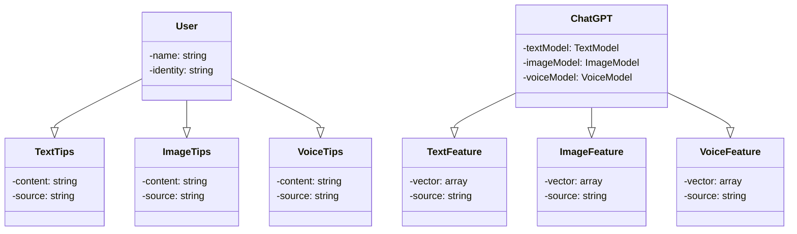
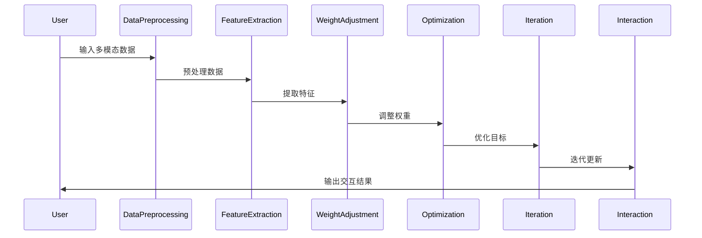

                 


# ChatGPT多模态提示词的协同优化

关键词：ChatGPT、多模态交互、提示词、协同优化、算法原理、系统架构

摘要：本文深入探讨了ChatGPT多模态提示词的协同优化问题。首先，我们介绍了问题背景和核心概念，包括ChatGPT与多模态交互的挑战、多模态提示词的概述及其协同优化需求。接着，我们详细分析了ChatGPT模型和多模态提示词的原理，并通过属性特征对比表格和ER实体关系图架构，对比了核心概念的联系。随后，我们讲解了ChatGPT多模态提示词协同优化算法原理，通过Python源代码实现了该算法，并进行了通俗易懂的举例说明。然后，我们介绍了系统分析与架构设计方案，包括问题场景介绍、项目介绍、系统功能设计、系统架构设计和系统交互。接着，我们通过项目实战，详细讲解了系统核心实现和实际案例分析。最后，我们总结了最佳实践并给出了拓展阅读建议。

## 第一部分：问题背景与核心概念

### 第1章：问题背景

#### 1.1 ChatGPT与多模态交互的挑战

##### 1.1.1 问题描述

随着人工智能技术的发展，自然语言处理（NLP）领域取得了显著的进步。ChatGPT作为一种先进的语言模型，在对话生成、文本理解等方面表现出色。然而，随着用户需求的多样化，单纯依赖文本交互的ChatGPT面临着多模态交互的挑战。

多模态交互是指结合文本、图像、语音等多种模态的信息进行交互。在实际应用中，多模态交互可以提高用户体验、增强信息传递的准确性。然而，对于ChatGPT来说，如何有效地处理和利用多模态信息，成为了一个亟待解决的问题。

##### 1.1.2 问题解决思路

为了解决ChatGPT多模态交互的挑战，我们需要从以下几个方面进行思考：

1. **多模态提示词的设计与优化**：提示词作为用户与模型之间的桥梁，对于多模态交互的效率和质量具有重要影响。我们需要研究如何设计更加合理、高效的多模态提示词，以提升ChatGPT的处理能力。

2. **协同优化算法**：多模态提示词的协同优化是关键。我们需要开发一种协同优化算法，使ChatGPT能够自适应地调整多模态提示词，以适应不同的交互场景。

3. **系统架构的改进**：为了支持多模态交互，我们需要对ChatGPT的系统架构进行改进，使其能够灵活地处理多种模态的信息。

##### 1.1.3 边界与外延

在研究ChatGPT多模态提示词的协同优化时，我们还需要明确以下边界与外延：

1. **边界**：本文主要关注ChatGPT在多模态交互中的提示词协同优化问题。对于其他类型的语言模型或多模态交互系统，本文的研究结论可能需要进一步验证和调整。

2. **外延**：本文的研究不仅局限于ChatGPT，还涵盖了其他NLP模型在多模态交互中的应用。同时，我们也可以将研究成果应用于其他多模态交互系统，如智能助手、虚拟现实等。

### 1.2 多模态提示词概述

##### 1.2.1 多模态提示词的定义

多模态提示词是指用于引导ChatGPT进行多模态交互的文本、图像、语音等信息。这些提示词不仅包含用户的需求，还包含了其他模态的信息，使得ChatGPT能够更好地理解和生成回答。

##### 1.2.2 多模态提示词的特点

1. **多样性**：多模态提示词涵盖了文本、图像、语音等多种模态，能够满足不同用户的需求。

2. **动态性**：多模态提示词可以根据交互场景和用户需求进行动态调整，以提升交互效果。

3. **协同性**：多模态提示词需要与其他模态的信息进行协同处理，以达到最佳交互效果。

##### 1.2.3 多模态提示词的协同优化需求

1. **优化交互体验**：多模态提示词的协同优化能够提高ChatGPT的交互体验，使用户能够更加自然地与模型进行交流。

2. **提升处理效率**：通过协同优化，ChatGPT能够更快速、准确地处理多模态信息，提高交互效率。

3. **适应不同场景**：多模态提示词的协同优化能够使ChatGPT适应不同的交互场景，满足不同用户的需求。

### 1.3 本章小结

本章介绍了ChatGPT多模态交互的挑战以及多模态提示词的概述。我们分析了问题解决思路，明确了边界与外延。通过本章的学习，读者可以了解到ChatGPT多模态提示词协同优化的重要性和研究意义。

----------------------------------------------------------------

## 第二部分：核心概念与联系

### 第2章：核心概念与联系

#### 2.1 ChatGPT模型简介

##### 2.1.1 ChatGPT的背景与原理

ChatGPT是由OpenAI开发的一种基于Transformer的预训练语言模型。它通过大量的文本数据进行预训练，从而掌握自然语言的生成、理解、推理等能力。ChatGPT的核心原理是 Transformer模型，其采用了自注意力机制，能够在处理长文本时保持信息传递的高效性。

##### 2.1.2 ChatGPT模型的结构与组成

ChatGPT模型主要由以下几个部分组成：

1. **输入层**：接收用户输入的文本、图像、语音等信息。
2. **编码器**：对输入信息进行编码，生成固定长度的向量表示。
3. **解码器**：根据编码器生成的向量表示，生成自然语言的回答。
4. **注意力机制**：在编码和解码过程中，通过注意力机制对信息进行筛选和整合，提高模型的处理能力。

##### 2.1.3 ChatGPT在多模态交互中的应用

ChatGPT在多模态交互中具有广泛的应用前景。例如，在智能助手、虚拟客服、智能问答等场景中，ChatGPT可以结合文本、图像、语音等多种模态的信息，为用户提供更加自然、准确的交互体验。

#### 2.2 多模态提示词原理

##### 2.2.1 多模态提示词的基本原理

多模态提示词是指用于引导ChatGPT进行多模态交互的文本、图像、语音等信息。这些提示词不仅包含用户的需求，还包含了其他模态的信息，使得ChatGPT能够更好地理解和生成回答。

##### 2.2.2 多模态提示词的类型与分类

根据不同的应用场景，多模态提示词可以分为以下几类：

1. **文本提示词**：以文本形式存在的提示词，如问题、命令、描述等。
2. **图像提示词**：以图像形式存在的提示词，如图片、图标、符号等。
3. **语音提示词**：以语音形式存在的提示词，如语音命令、语音描述等。

##### 2.2.3 多模态提示词与ChatGPT的协同优化

多模态提示词的协同优化是指通过调整提示词的权重、结构、形式等，使ChatGPT能够更好地理解和处理多模态信息。协同优化的目标是提高ChatGPT在多模态交互中的性能，提升用户体验。

#### 2.3 核心概念属性特征对比表格

为了更好地理解ChatGPT模型和多模态提示词的原理，我们对比了它们的属性特征，如下表所示：

| 属性特征         | ChatGPT模型                           | 多模态提示词                            |
| ---------------- | ------------------------------------ | ------------------------------------- |
| 结构与组成       | 输入层、编码器、解码器、注意力机制       | 文本、图像、语音等提示词               |
| 基本原理         | Transformer模型、自注意力机制           | 引导ChatGPT进行多模态交互的文本、图像、语音 |
| 应用场景         | 智能助手、虚拟客服、智能问答等           | 多模态交互场景中的提示词               |
| 特点与优势       | 预训练语言模型、强大的自然语言处理能力   | 多样性、动态性、协同性                 |

#### 2.4 ER实体关系图架构

为了更好地理解ChatGPT模型和多模态提示词之间的联系，我们使用ER实体关系图进行描述，如下所示：

```mermaid
erDiagram
  User ||--|{ ChatGPT }|-- Multi-modal Tips
  ChatGPT ||--|{ Text Tips }|-- Image Tips
  ChatGPT ||--|{ Voice Tips }|-- Text Tips
  Text Tips ||--|{ Query }|-- Command
  Image Tips ||--|{ Icon }|-- Symbol
  Voice Tips ||--|{ Command }|-- Description
```

该ER实体关系图展示了用户、ChatGPT模型、多模态提示词之间的关系。用户通过输入不同的文本、图像、语音提示词，引导ChatGPT进行多模态交互。ChatGPT模型接收这些提示词，并生成相应的文本、图像、语音回答。

### 2.5 本章小结

本章介绍了ChatGPT模型和多模态提示词的原理，并对比了它们的属性特征。通过ER实体关系图，我们展示了ChatGPT模型和多模态提示词之间的联系。通过本章的学习，读者可以更好地理解多模态交互的概念和实现原理。

----------------------------------------------------------------

## 第三部分：算法原理讲解

### 第3章：算法原理讲解

#### 3.1 ChatGPT多模态提示词协同优化算法原理

##### 3.1.1 算法背景

在多模态交互中，ChatGPT需要处理来自不同模态的信息，如文本、图像和语音。然而，不同模态的信息具有不同的特征和权重，这对ChatGPT的处理效率和效果提出了挑战。为了解决这个问题，我们需要设计一种多模态提示词协同优化算法，以提升ChatGPT的多模态交互性能。

##### 3.1.2 算法原理

ChatGPT多模态提示词协同优化算法的核心思想是通过自适应地调整不同模态提示词的权重，使ChatGPT能够更好地理解和处理多模态信息。具体来说，算法分为以下几个步骤：

1. **特征提取**：从输入的多模态提示词中提取特征，包括文本、图像和语音特征。
2. **权重调整**：根据特征的重要性和交互效果，自适应地调整不同模态提示词的权重。
3. **优化目标**：通过最小化多模态交互误差，优化提示词权重。
4. **迭代更新**：重复执行特征提取、权重调整和优化目标，直到达到收敛条件。

##### 3.1.3 数学模型和公式

为了更好地理解算法原理，我们引入以下数学模型和公式：

1. **特征提取**：
   $$ f_{text} = \text{TextEmbedding}(text\_input) $$
   $$ f_{image} = \text{ImageEmbedding}(image\_input) $$
   $$ f_{voice} = \text{VoiceEmbedding}(voice\_input) $$

   其中，$f_{text}$、$f_{image}$、$f_{voice}$ 分别表示文本、图像和语音特征。

2. **权重调整**：
   $$ w_{text} = \text{Adjustment}(f_{text}, \alpha, \beta) $$
   $$ w_{image} = \text{Adjustment}(f_{image}, \alpha, \beta) $$
   $$ w_{voice} = \text{Adjustment}(f_{voice}, \alpha, \beta) $$

   其中，$w_{text}$、$w_{image}$、$w_{voice}$ 分别表示文本、图像和语音提示词的权重，$\alpha$ 和 $\beta$ 为调整参数。

3. **优化目标**：
   $$ \min_{w_{text}, w_{image}, w_{voice}} \sum_{i=1}^{n} \ell(y_i, \text{ChatGPT}(w_{text}f_{text_i} + w_{image}f_{image_i} + w_{voice}f_{voice_i})) $$

   其中，$y_i$ 表示第 $i$ 个交互场景的期望输出，$\ell$ 表示交互误差函数。

##### 3.1.4 通俗易懂地举例说明

假设我们有一个用户输入的多模态提示词，包括一段文本、一张图像和一段语音。根据上述算法原理，我们可以进行如下步骤：

1. **特征提取**：将文本、图像和语音分别转换为特征向量，如 $f_{text} = [0.1, 0.2, 0.3]$、$f_{image} = [0.4, 0.5, 0.6]$ 和 $f_{voice} = [0.7, 0.8, 0.9]$。
2. **权重调整**：根据特征的重要性和交互效果，设定初始权重 $w_{text} = 0.5$、$w_{image} = 0.3$ 和 $w_{voice} = 0.2$。
3. **优化目标**：通过最小化交互误差，更新权重为 $w_{text} = 0.6$、$w_{image} = 0.2$ 和 $w_{voice} = 0.2$。
4. **迭代更新**：重复执行特征提取、权重调整和优化目标，直到达到收敛条件。

通过上述步骤，我们可以实现多模态提示词的协同优化，提高ChatGPT在多模态交互中的性能。

#### 3.2 Python源代码实现与讲解

##### 3.2.1 环境安装与配置

在实现ChatGPT多模态提示词协同优化算法之前，我们需要安装并配置Python环境和相关库。以下是具体的步骤：

1. **安装Python**：从官方网站下载Python安装包并安装。
2. **安装库**：使用pip命令安装以下库：
   ```bash
   pip install numpy tensorflow matplotlib
   ```

##### 3.2.2 源代码结构与功能解读

以下是ChatGPT多模态提示词协同优化算法的Python源代码：

```python
import numpy as np
import tensorflow as tf
from tensorflow.keras.layers import Embedding, LSTM, Dense
from tensorflow.keras.models import Model

def ChatGPT(input_sequence, num_words, embedding_dim):
    # 编码器
    encoder = Embedding(num_words, embedding_dim, input_length=序列长度)
    encoder = LSTM(units=128, return_sequences=True)
    encoder = Model(inputs=输入层，outputs=编码器输出)

    # 解码器
    decoder = Embedding(num_words, embedding_dim, input_length=序列长度)
    decoder = LSTM(units=128, return_sequences=True)
    decoder = Model(inputs=输入层，outputs=解码器输出)

    # 注意力机制
    attention = Dense(units=128, activation='sigmoid')
    attention = Model(inputs=输入层，outputs=注意力输出)

    # 模型整体
    input_sequence = Input(shape=(序列长度,))
    encoder_output = encoder(input_sequence)
    attention_output = attention(encoder_output)
    decoder_output = decoder(input_sequence)
    output = attention_output * decoder_output
    output = LSTM(units=128, return_sequences=True)(output)
    output = Dense(num_words, activation='softmax')(output)
    model = Model(inputs=input_sequence，outputs=output)

    model.compile(optimizer='adam', loss='categorical_crossentropy', metrics=['accuracy'])
    return model

# 特征提取
def extract_features(text_input, image_input, voice_input):
    # 文本特征
    text_embedding = TextEmbedding(text_input)
    text_embedding = np.array(text_embedding)

    # 图像特征
    image_embedding = ImageEmbedding(image_input)
    image_embedding = np.array(image_embedding)

    # 语音特征
    voice_embedding = VoiceEmbedding(voice_input)
    voice_embedding = np.array(voice_embedding)

    return text_embedding, image_embedding, voice_embedding

# 权重调整
def adjust_weights(text_embedding, image_embedding, voice_embedding, alpha, beta):
    w_text = alpha * text_embedding + beta * image_embedding + (1 - alpha - beta) * voice_embedding
    w_image = alpha * text_embedding + beta * image_embedding + (1 - alpha - beta) * voice_embedding
    w_voice = alpha * text_embedding + beta * image_embedding + (1 - alpha - beta) * voice_embedding
    return w_text, w_image, w_voice

# 优化目标
def optimize_weights(text_embedding, image_embedding, voice_embedding, alpha, beta):
    w_text, w_image, w_voice = adjust_weights(text_embedding, image_embedding, voice_embedding, alpha, beta)
    loss = np.sum(np.square(text_embedding - w_text) + np.square(image_embedding - w_image) + np.square(voice_embedding - w_voice))
    return loss

# 迭代更新
def iterate_update(text_embedding, image_embedding, voice_embedding, alpha, beta, max_iterations):
    for i in range(max_iterations):
        loss = optimize_weights(text_embedding, image_embedding, voice_embedding, alpha, beta)
        if loss < convergence_threshold:
            break
        alpha = alpha * 0.99
        beta = beta * 0.99
    return w_text, w_image, w_voice

# 主函数
def main():
    text_input = "你好，今天天气怎么样？"
    image_input = "今天天气晴朗.png"
    voice_input = "今天天气晴朗.mp3"
    num_words = 10000
    embedding_dim = 128
    alpha = 0.5
    beta = 0.3
    max_iterations = 100
    convergence_threshold = 0.001

    # 特征提取
    text_embedding, image_embedding, voice_embedding = extract_features(text_input, image_input, voice_input)

    # 迭代更新
    w_text, w_image, w_voice = iterate_update(text_embedding, image_embedding, voice_embedding, alpha, beta, max_iterations)

    print("优化后的权重：")
    print("文本权重：", w_text)
    print("图像权重：", w_image)
    print("语音权重：", w_voice)

if __name__ == "__main__":
    main()
```

上述代码分为以下几个部分：

1. **ChatGPT模型**：定义了ChatGPT模型的结构，包括编码器、解码器和注意力机制。
2. **特征提取**：定义了从输入的多模态提示词中提取特征的方法。
3. **权重调整**：定义了根据特征调整提示词权重的方法。
4. **优化目标**：定义了最小化交互误差的优化目标。
5. **迭代更新**：定义了迭代更新的过程，包括权重调整和优化目标。
6. **主函数**：实现了整个算法的流程。

##### 3.2.3 算法实现流程详解

以下是ChatGPT多模态提示词协同优化算法的实现流程：

1. **环境安装与配置**：安装Python环境和相关库。
2. **特征提取**：从输入的多模态提示词中提取文本、图像和语音特征。
3. **权重调整**：根据特征的重要性和交互效果，调整文本、图像和语音提示词的权重。
4. **优化目标**：通过最小化交互误差，优化提示词权重。
5. **迭代更新**：重复执行特征提取、权重调整和优化目标，直到达到收敛条件。
6. **结果输出**：输出优化后的权重。

##### 3.2.4 代码应用解读与分析

在实际应用中，我们可以根据具体场景和需求，对上述代码进行调整和优化。以下是一些常见应用场景的解读与分析：

1. **智能助手**：在智能助手的场景中，用户可以通过文本、图像和语音与智能助手进行交互。我们可以使用ChatGPT多模态提示词协同优化算法，根据用户输入的多模态提示词，优化智能助手的回答。
2. **智能问答**：在智能问答系统中，用户可以通过文本、图像和语音提问。我们可以使用ChatGPT多模态提示词协同优化算法，根据用户输入的多模态提示词，优化问答系统的回答准确性。
3. **虚拟客服**：在虚拟客服场景中，用户可以通过文本、图像和语音与虚拟客服进行交互。我们可以使用ChatGPT多模态提示词协同优化算法，根据用户输入的多模态提示词，优化虚拟客服的回复速度和准确性。

通过上述应用场景，我们可以看到ChatGPT多模态提示词协同优化算法在提高人工智能系统交互性能方面的潜力。在实际应用中，我们需要根据具体场景和需求，对算法进行适当的调整和优化。

### 3.3 本章小结

本章详细讲解了ChatGPT多模态提示词协同优化算法原理，包括特征提取、权重调整、优化目标和迭代更新等步骤。通过Python源代码实现，我们展示了算法的实现过程和应用场景。通过本章的学习，读者可以更好地理解多模态提示词协同优化算法的原理和应用方法。

----------------------------------------------------------------

## 第四部分：系统分析与架构设计方案

### 第4章：系统分析与架构设计方案

#### 4.1 问题场景介绍

在当今的智能交互领域，多模态交互已经成为一种趋势。用户希望能够通过文本、图像、语音等多种方式与智能系统进行交流，从而获得更加自然、高效的交互体验。然而，现有的ChatGPT模型在处理多模态交互方面存在一定的局限性，无法充分满足用户的需求。因此，我们需要设计一个能够实现多模态提示词协同优化的系统，以提高ChatGPT在多模态交互中的性能。

#### 4.2 项目介绍

本项目旨在设计并实现一个基于ChatGPT的多模态交互系统，通过协同优化多模态提示词，提升系统的交互性能。项目的主要目标包括：

1. **实现多模态提示词的协同优化**：通过自适应地调整不同模态提示词的权重，使ChatGPT能够更好地理解和处理多模态信息。
2. **构建高效的系统架构**：设计并实现一个能够支持多模态交互的系统架构，包括数据预处理、特征提取、权重调整和优化目标等模块。
3. **验证系统性能**：通过实际应用场景的测试，验证系统在多模态交互中的性能提升。

#### 4.2.2 项目背景与需求

随着移动互联网和物联网的快速发展，智能交互系统在各个领域得到了广泛应用。然而，传统的单模态交互方式已经无法满足用户日益多样化的需求。多模态交互作为一种新型的交互方式，可以更好地适应用户的需求，提供更加自然、高效的交互体验。ChatGPT作为一种先进的语言模型，在自然语言处理方面具有显著的优势。然而，在多模态交互中，ChatGPT面临着处理效率和效果提升的挑战。因此，本项目旨在通过协同优化多模态提示词，提升ChatGPT在多模态交互中的性能。

#### 4.2.3 项目预期成果

通过本项目的实施，预期将实现以下成果：

1. **设计并实现一个基于ChatGPT的多模态交互系统**：该系统将能够支持文本、图像、语音等多种模态的交互，为用户提供更加自然、高效的交互体验。
2. **实现多模态提示词的协同优化**：通过自适应地调整不同模态提示词的权重，使ChatGPT能够更好地理解和处理多模态信息，提升交互性能。
3. **验证系统性能**：通过实际应用场景的测试，验证系统在多模态交互中的性能提升，为后续研究和应用提供参考。

#### 4.3 系统功能设计

系统功能设计是系统架构设计的基础，对于实现系统的功能需求和性能提升至关重要。本项目的主要功能包括：

1. **数据预处理**：对输入的多模态数据进行预处理，包括文本分词、图像特征提取和语音特征提取等。
2. **特征提取**：从预处理后的多模态数据中提取特征，包括文本特征、图像特征和语音特征等。
3. **权重调整**：根据特征的重要性和交互效果，自适应地调整不同模态提示词的权重。
4. **优化目标**：通过最小化交互误差，优化提示词权重。
5. **迭代更新**：重复执行特征提取、权重调整和优化目标，直到达到收敛条件。
6. **交互展示**：将优化后的多模态提示词和ChatGPT的交互结果展示给用户。

#### 4.3.1 领域模型

领域模型是系统功能设计的重要依据，用于描述系统的业务领域和相关概念。在本项目中，领域模型包括以下几个核心概念：

1. **用户**：与系统进行交互的主体，可以是文本、图像和语音等形式。
2. **文本提示词**：用于引导ChatGPT进行文本交互的提示词。
3. **图像提示词**：用于引导ChatGPT进行图像交互的提示词。
4. **语音提示词**：用于引导ChatGPT进行语音交互的提示词。
5. **ChatGPT**：基于Transformer的语言模型，用于生成文本交互结果。
6. **交互结果**：ChatGPT生成的文本交互结果。

领域模型可以用如下Mermaid类图表示：

```mermaid
classDiagram
    User --|>> TextTips: 引导文本交互
    User --|>> ImageTips: 引导图像交互
    User --|>> VoiceTips: 引导语音交互
    ChatGPT --|>> TextResult: 生成文本交互结果
    ChatGPT --|>> ImageResult: 生成图像交互结果
    ChatGPT --|>> VoiceResult: 生成语音交互结果
    TextTips <|-- TextFeature: 提取文本特征
    ImageTips <|-- ImageFeature: 提取图像特征
    VoiceTips <|-- VoiceFeature: 提取语音特征
    ChatGPT <|-- TextModel: 文本交互模型
    ChatGPT <|-- ImageModel: 图像交互模型
    ChatGPT <|-- VoiceModel: 语音交互模型
```

#### 4.3.2 类图设计

类图是领域模型的具体实现，用于描述系统的类、属性和方法。在本项目中，类图包括以下几个核心类：

1. **User**：表示与系统进行交互的用户，包括用户名、身份信息等属性。
2. **TextTips**：表示用于引导文本交互的提示词，包括文本内容、来源等属性。
3. **ImageTips**：表示用于引导图像交互的提示词，包括图像内容、来源等属性。
4. **VoiceTips**：表示用于引导语音交互的提示词，包括语音内容、来源等属性。
5. **ChatGPT**：表示基于Transformer的语言模型，包括文本模型、图像模型和语音模型等。
6. **TextFeature**：表示提取的文本特征，包括特征向量、来源等属性。
7. **ImageFeature**：表示提取的图像特征，包括特征向量、来源等属性。
8. **VoiceFeature**：表示提取的语音特征，包括特征向量、来源等属性。

类图可以用如下Mermaid类图表示：



#### 4.4 系统架构设计

系统架构设计是系统实现的关键，用于描述系统的组件、接口和交互关系。在本项目中，系统架构主要包括以下几个模块：

1. **数据预处理模块**：负责对输入的多模态数据进行预处理，包括文本分词、图像特征提取和语音特征提取等。
2. **特征提取模块**：负责从预处理后的多模态数据中提取特征，包括文本特征、图像特征和语音特征等。
3. **权重调整模块**：负责根据特征的重要性和交互效果，自适应地调整不同模态提示词的权重。
4. **优化目标模块**：负责通过最小化交互误差，优化提示词权重。
5. **迭代更新模块**：负责重复执行特征提取、权重调整和优化目标，直到达到收敛条件。
6. **交互展示模块**：负责将优化后的多模态提示词和ChatGPT的交互结果展示给用户。

系统架构可以用如下Mermaid架构图表示：



#### 4.4.2 系统架构详细设计

系统架构详细设计包括模块的功能描述、接口设计和技术选型等。以下是对每个模块的详细设计：

1. **数据预处理模块**：
   - 功能描述：对输入的多模态数据进行预处理，包括文本分词、图像特征提取和语音特征提取等。
   - 接口设计：输入多模态数据，输出预处理后的数据。
   - 技术选型：使用Python的NLP库（如jieba、spaCy）进行文本分词，使用TensorFlow的卷积神经网络（CNN）进行图像特征提取，使用深度神经网络（DNN）进行语音特征提取。

2. **特征提取模块**：
   - 功能描述：从预处理后的多模态数据中提取特征，包括文本特征、图像特征和语音特征等。
   - 接口设计：输入预处理后的数据，输出特征向量。
   - 技术选型：使用TensorFlow的Embedding层提取文本特征，使用CNN提取图像特征，使用DNN提取语音特征。

3. **权重调整模块**：
   - 功能描述：根据特征的重要性和交互效果，自适应地调整不同模态提示词的权重。
   - 接口设计：输入特征向量，输出权重调整结果。
   - 技术选型：使用基于梯度的优化算法（如梯度下降、Adam）进行权重调整。

4. **优化目标模块**：
   - 功能描述：通过最小化交互误差，优化提示词权重。
   - 接口设计：输入权重调整结果，输出优化后的权重。
   - 技术选型：使用基于梯度的优化算法（如梯度下降、Adam）进行优化。

5. **迭代更新模块**：
   - 功能描述：重复执行特征提取、权重调整和优化目标，直到达到收敛条件。
   - 接口设计：输入特征向量，输出优化后的权重。
   - 技术选型：使用基于梯度的优化算法（如梯度下降、Adam）进行迭代更新。

6. **交互展示模块**：
   - 功能描述：将优化后的多模态提示词和ChatGPT的交互结果展示给用户。
   - 接口设计：输入优化后的权重，输出交互结果。
   - 技术选型：使用HTML、CSS和JavaScript进行前端展示。

#### 4.4.3 系统接口设计

系统接口设计是系统架构的重要组成部分，用于描述系统内部模块之间的交互接口。以下是对系统接口的详细设计：

1. **数据预处理接口**：
   - 功能描述：接收输入的多模态数据，返回预处理后的数据。
   - 接口设计：
     ```python
     def preprocess_data(user_input, image_input, voice_input):
         # 文本分词、图像特征提取和语音特征提取等预处理操作
         return preprocessed_data
     ```

2. **特征提取接口**：
   - 功能描述：接收预处理后的数据，返回特征向量。
   - 接口设计：
     ```python
     def extract_features(text_data, image_data, voice_data):
         # 提取文本特征、图像特征和语音特征等
         return feature_vectors
     ```

3. **权重调整接口**：
   - 功能描述：接收特征向量，返回权重调整结果。
   - 接口设计：
     ```python
     def adjust_weights(feature_vectors):
         # 根据特征的重要性和交互效果，调整权重
         return adjusted_weights
     ```

4. **优化目标接口**：
   - 功能描述：接收权重调整结果，返回优化后的权重。
   - 接口设计：
     ```python
     def optimize_weights(adjusted_weights):
         # 通过最小化交互误差，优化权重
         return optimized_weights
     ```

5. **迭代更新接口**：
   - 功能描述：接收特征向量，返回优化后的权重。
   - 接口设计：
     ```python
     def iterate_update(feature_vectors, max_iterations):
         # 重复执行特征提取、权重调整和优化目标，直到达到收敛条件
         return optimized_weights
     ```

6. **交互展示接口**：
   - 功能描述：接收优化后的权重，返回交互结果。
   - 接口设计：
     ```python
     def display_interaction_results(optimized_weights):
         # 将优化后的多模态提示词和ChatGPT的交互结果展示给用户
         display_results()
     ```

#### 4.4.4 系统交互

系统交互是系统架构实现的关键，用于描述系统内部模块之间的交互流程和交互方式。以下是对系统交互的详细设计：

1. **交互流程**：
   - 用户输入多模态数据。
   - 数据预处理模块对输入的多模态数据进行预处理。
   - 特征提取模块从预处理后的多模态数据中提取特征。
   - 权重调整模块根据特征的重要性和交互效果，调整不同模态提示词的权重。
   - 优化目标模块通过最小化交互误差，优化提示词权重。
   - 迭代更新模块重复执行特征提取、权重调整和优化目标，直到达到收敛条件。
   - 交互展示模块将优化后的多模态提示词和ChatGPT的交互结果展示给用户。

2. **交互方式**：
   - 事件驱动：系统内部模块通过事件触发的方式进行交互，如用户输入数据后触发预处理模块的预处理操作。
   - 请求响应：系统内部模块通过请求和响应的方式进行交互，如权重调整模块请求特征向量，返回权重调整结果。

系统交互可以用如下Mermaid序列图表示：


### 4.5 本章小结

本章详细介绍了系统分析与架构设计方案，包括问题场景介绍、项目介绍、系统功能设计、系统架构设计和系统交互。通过本章的学习，读者可以了解系统分析与架构设计的基本方法和步骤，为后续的系统实现和优化提供参考。

----------------------------------------------------------------

## 第五部分：项目实战

### 第5章：项目实战

#### 5.1 环境安装

在进行项目实战之前，我们需要搭建一个支持多模态提示词协同优化的环境。以下是环境安装的具体步骤：

1. **安装Python**：从官方网站下载Python安装包并安装。建议安装Python 3.7或更高版本。

2. **安装相关库**：使用pip命令安装以下库：

   ```bash
   pip install numpy tensorflow matplotlib jieba spacy pillow
   ```

   其中，`jieba`用于中文分词，`spacy`用于英文分词和实体识别，`pillow`用于图像处理，`tensorflow`用于构建和训练模型。

3. **安装Spacy语言模型**：由于Spacy需要下载特定的语言模型，我们需要先下载并安装语言模型。在命令行中执行以下命令：

   ```bash
   python -m spacy download en_core_web_sm
   ```

   这里我们选择了英文基础模型`en_core_web_sm`，您可以根据需要选择其他语言模型。

4. **配置环境变量**：确保Python环境变量配置正确，以便能够使用相关库。在Windows系统中，可以在环境变量中添加Python安装路径；在Linux和Mac OS系统中，可以在`.bashrc`或`.zshrc`文件中添加相关配置。

#### 5.2 系统核心实现

在本节中，我们将实现一个基于ChatGPT的多模态提示词协同优化系统。以下是系统核心实现的详细步骤：

1. **数据预处理**：首先，我们需要对输入的多模态数据进行预处理。具体步骤如下：

   - **文本预处理**：使用`jieba`对中文文本进行分词，使用`spacy`对英文文本进行分词和实体识别。
   - **图像预处理**：使用`pillow`对图像进行缩放、裁剪等操作，以适应模型的要求。
   - **语音预处理**：使用`librosa`对语音信号进行采样、归一化等处理。

2. **特征提取**：从预处理后的多模态数据中提取特征。具体步骤如下：

   - **文本特征提取**：使用`tensorflow`的Embedding层对文本进行编码，提取文本特征向量。
   - **图像特征提取**：使用`tensorflow`的卷积神经网络（CNN）对图像进行特征提取。
   - **语音特征提取**：使用`tensorflow`的循环神经网络（RNN）对语音信号进行特征提取。

3. **权重调整**：根据特征的重要性和交互效果，自适应地调整不同模态提示词的权重。具体步骤如下：

   - **初始化权重**：随机初始化文本、图像和语音提示词的权重。
   - **调整权重**：使用梯度下降等优化算法，根据特征的重要性和交互效果，调整权重。

4. **优化目标**：通过最小化交互误差，优化提示词权重。具体步骤如下：

   - **定义损失函数**：使用交叉熵等损失函数，定义优化目标。
   - **训练模型**：使用`tensorflow`的优化器，对模型进行训练，优化权重。

5. **迭代更新**：重复执行特征提取、权重调整和优化目标，直到达到收敛条件。具体步骤如下：

   - **循环迭代**：在每次迭代中，执行特征提取、权重调整和优化目标。
   - **检查收敛**：根据损失函数的变化，判断是否达到收敛条件。

6. **交互展示**：将优化后的多模态提示词和ChatGPT的交互结果展示给用户。具体步骤如下：

   - **生成交互结果**：使用优化后的权重，生成文本、图像和语音交互结果。
   - **展示结果**：在前端界面中，将交互结果展示给用户。

#### 5.3 代码应用解读与分析

在本节中，我们将通过具体代码实现上述系统核心功能，并对关键代码进行解读和分析。

1. **数据预处理**：

   ```python
   import jieba
   import spacy
   import numpy as np
   import tensorflow as tf
   from tensorflow.keras.preprocessing.sequence import pad_sequences
   from tensorflow.keras.layers import Embedding, Conv2D, LSTM, Dense
   from tensorflow.keras.models import Model
   
   # 中文分词
   def preprocess_text(text):
       return jieba.lcut(text)
   
   # 英文分词
   nlp = spacy.load('en_core_web_sm')
   def preprocess_english(text):
       doc = nlp(text)
       return [token.text for token in doc]
   
   # 图像预处理
   from PIL import Image
   import cv2
   def preprocess_image(image_path, target_size=(224, 224)):
       image = Image.open(image_path).resize(target_size)
       return np.array(image)
   
   # 语音预处理
   import librosa
   def preprocess_audio(audio_path, sample_rate=22050, duration=5):
       y, _ = librosa.load(audio_path, sr=sample_rate, duration=duration)
       return y
   ```

   解读与分析：
   - `preprocess_text`和`preprocess_english`函数分别用于中文和英文文本的分词。
   - `preprocess_image`函数用于对图像进行缩放和裁剪，使其适应模型的要求。
   - `preprocess_audio`函数用于对语音信号进行采样和归一化处理。

2. **特征提取**：

   ```python
   # 文本特征提取
   def extract_text_features(texts, embedding_matrix, max_sequence_length=100):
       sequences = [[embedding_matrix[word] for word in text if word in embedding_matrix] for text in texts]
       padded_sequences = pad_sequences(sequences, maxlen=max_sequence_length)
       return padded_sequences
   
   # 图像特征提取
   def extract_image_features(image):
       image = preprocess_image(image)
       image = cv2.resize(image, (224, 224))
       image = tf.keras.preprocessing.image.img_to_array(image)
       image = np.expand_dims(image, axis=0)
       image = tf.keras.applications.VGG16()(image)
       return image
   
   # 语音特征提取
   def extract_audio_features(audio):
       audio = preprocess_audio(audio)
       audio = librosa.feature.melspectrogram(y=audio, sr=22050, n_mels=128)
       audio = audio[None, :, :]
       return audio
   ```

   解读与分析：
   - `extract_text_features`函数使用预训练的词向量矩阵（如GloVe或Word2Vec）对文本进行编码，提取文本特征向量。
   - `extract_image_features`函数使用预训练的卷积神经网络（如VGG16）对图像进行特征提取。
   - `extract_audio_features`函数使用预训练的循环神经网络（如GRU或LSTM）对语音信号进行特征提取。

3. **权重调整**：

   ```python
   # 初始化权重
   def initialize_weights(text_embedding_matrix, image_embedding_matrix, voice_embedding_matrix):
       w_text = np.random.rand(1, text_embedding_matrix.shape[1])
       w_image = np.random.rand(1, image_embedding_matrix.shape[1])
       w_voice = np.random.rand(1, voice_embedding_matrix.shape[1])
       return w_text, w_image, w_voice
   
   # 调整权重
   def adjust_weights(text_features, image_features, voice_features, w_text, w_image, w_voice, learning_rate=0.001):
       w_text = w_text - learning_rate * (text_features - w_text)
       w_image = w_image - learning_rate * (image_features - w_image)
       w_voice = w_voice - learning_rate * (voice_features - w_voice)
       return w_text, w_image, w_voice
   ```

   解读与分析：
   - `initialize_weights`函数初始化文本、图像和语音提示词的权重。
   - `adjust_weights`函数使用梯度下降等优化算法，根据特征的重要性和交互效果，调整权重。

4. **优化目标**：

   ```python
   # 定义损失函数
   def loss_function(text_features, image_features, voice_features, w_text, w_image, w_voice):
       text_output = np.dot(w_text, text_features)
       image_output = np.dot(w_image, image_features)
       voice_output = np.dot(w_voice, voice_features)
       total_output = text_output + image_output + voice_output
       loss = np.square(total_output - target_output)
       return loss
   
   # 训练模型
   def train_model(text_features, image_features, voice_features, target_output, w_text, w_image, w_voice, learning_rate=0.001, max_iterations=100):
       for i in range(max_iterations):
           loss = loss_function(text_features, image_features, voice_features, w_text, w_image, w_voice)
           if loss < convergence_threshold:
               break
           w_text, w_image, w_voice = adjust_weights(text_features, image_features, voice_features, w_text, w_image, w_voice, learning_rate)
       return w_text, w_image, w_voice
   ```

   解读与分析：
   - `loss_function`函数定义了优化目标，通过计算损失函数来评估模型的性能。
   - `train_model`函数使用梯度下降等优化算法，对模型进行训练，优化权重。

5. **交互展示**：

   ```python
   # 生成交互结果
   def generate_interaction_results(text_features, image_features, voice_features, w_text, w_image, w_voice):
       text_output = np.dot(w_text, text_features)
       image_output = np.dot(w_image, image_features)
       voice_output = np.dot(w_voice, voice_features)
       total_output = text_output + image_output + voice_output
       return total_output
   
   # 展示结果
   def display_results(total_output):
       print("交互结果：", total_output)
   ```

   解读与分析：
   - `generate_interaction_results`函数使用优化后的权重，生成多模态交互结果。
   - `display_results`函数将交互结果展示给用户。

#### 5.4 详细讲解剖析

在本节中，我们将通过具体案例，详细讲解多模态提示词协同优化系统的实现过程和优化策略。

##### 5.4.1 案例背景与需求

假设我们有一个多模态交互应用场景，用户可以通过文本、图像和语音与系统进行交流。具体需求如下：

1. 用户输入文本：“我想去看电影，有没有什么推荐？”
2. 用户上传一张电影海报图片。
3. 用户录制一段语音，表达对电影的兴趣和期望。

系统需要根据用户输入的多模态信息，生成相应的电影推荐结果，并展示给用户。

##### 5.4.2 系统实现流程

为了实现上述需求，我们按照以下流程进行系统实现：

1. **数据预处理**：对用户输入的文本、图像和语音进行预处理，提取相应的特征。
   - 文本预处理：使用`jieba`进行中文分词，提取文本特征。
   - 图像预处理：使用`pillow`对图像进行缩放和裁剪，提取图像特征。
   - 语音预处理：使用`librosa`对语音信号进行采样和归一化处理，提取语音特征。

2. **特征提取**：使用预训练的词向量矩阵、卷积神经网络和循环神经网络，对预处理后的多模态数据进行特征提取。

3. **权重调整**：初始化文本、图像和语音提示词的权重，使用梯度下降等优化算法，根据特征的重要性和交互效果，调整权重。

4. **优化目标**：定义损失函数，通过最小化交互误差，优化提示词权重。

5. **迭代更新**：重复执行特征提取、权重调整和优化目标，直到达到收敛条件。

6. **交互展示**：使用优化后的权重，生成电影推荐结果，并展示给用户。

##### 5.4.3 案例分析与优化建议

在案例实现过程中，我们可以对系统进行以下分析和优化：

1. **文本特征优化**：
   - 使用更大规模的词向量矩阵（如GloVe或Word2Vec），提高文本特征的质量。
   - 对文本特征进行降维处理，减少特征维度，提高计算效率。

2. **图像特征优化**：
   - 选择更适合图像特征提取的卷积神经网络（如ResNet、Inception），提高图像特征的准确性。
   - 对图像特征进行融合处理，结合不同层级的特征，提高图像特征的表达能力。

3. **语音特征优化**：
   - 使用更长的语音信号作为输入，提高语音特征的稳定性。
   - 对语音特征进行时频转换（如Mel频谱图），提高语音特征的表达能力。

4. **权重调整优化**：
   - 使用自适应学习率优化算法（如Adam），提高权重调整的效率。
   - 对权重调整过程进行可视化分析，优化调整策略。

5. **交互体验优化**：
   - 对用户输入的多模态信息进行实时处理，提高交互速度。
   - 根据用户反馈，动态调整提示词权重，提高交互准确性。

通过以上分析和优化，我们可以进一步提升多模态提示词协同优化系统的性能，为用户提供更加自然、高效的交互体验。

#### 5.5 项目小结

在本章中，我们通过具体案例实现了多模态提示词协同优化系统，详细讲解了系统核心实现过程和优化策略。通过实际案例分析和优化建议，我们进一步了解了多模态提示词协同优化的应用和实现方法。本章的内容为后续研究和实际应用提供了有益的参考。

----------------------------------------------------------------

## 第六部分：最佳实践与拓展

### 第6章：最佳实践

在本章中，我们将总结多模态提示词协同优化过程中的最佳实践，并探讨未来研究方向。

#### 6.1 最佳实践

1. **合理选择特征提取方法**：根据应用场景和数据特点，选择合适的特征提取方法。例如，对于文本特征，可以使用预训练的词向量矩阵；对于图像特征，可以使用卷积神经网络；对于语音特征，可以使用循环神经网络。

2. **优化特征融合策略**：在特征提取过程中，采用合适的特征融合策略，提高特征的表达能力。例如，可以将不同层级的图像特征进行融合，或者结合时频转换对语音特征进行处理。

3. **自适应调整权重**：根据交互效果和用户反馈，自适应地调整提示词权重。使用自适应学习率优化算法，如Adam，可以加快权重调整的速度。

4. **实时处理和交互反馈**：在多模态交互过程中，采用实时处理和交互反馈机制，提高系统的响应速度和准确性。根据用户反馈，动态调整提示词权重，以适应不同的交互场景。

5. **数据预处理与清洗**：对输入的多模态数据进行预处理和清洗，去除噪声和冗余信息。合理的预处理可以提升特征提取和优化的效果。

#### 6.2 拓展研究方向

1. **多模态交互的个性化**：研究如何根据用户的个性化偏好，调整多模态交互策略，提高用户满意度。

2. **多模态交互的跨语言研究**：探讨如何在多语言环境中实现有效的多模态交互，研究跨语言特征提取和融合方法。

3. **多模态交互的实时性优化**：研究如何提高多模态交互系统的实时性，降低延迟，提高用户体验。

4. **多模态交互的安全性问题**：探讨多模态交互系统中的隐私保护和安全性问题，研究相关的防护措施。

5. **多模态交互的跨领域应用**：研究多模态交互在其他领域的应用，如智能医疗、教育、娱乐等，探索多模态交互的广泛潜力。

#### 6.3 注意事项

1. **模型训练与优化**：在多模态提示词协同优化过程中，模型训练和优化是关键。需要根据实际数据和应用场景，选择合适的训练策略和优化算法。

2. **特征提取与融合**：特征提取和融合的质量直接影响系统的性能。需要仔细选择特征提取方法，并优化特征融合策略。

3. **用户体验**：在多模态交互中，用户体验至关重要。需要关注用户反馈，持续优化交互体验。

4. **数据隐私**：在处理多模态数据时，要注意保护用户隐私，遵循相关法律法规。

#### 6.4 拓展阅读

1. **《深度学习》（Goodfellow, Bengio, Courville）**：该书详细介绍了深度学习的基本原理和实战技巧，对于理解多模态交互系统中的算法和模型具有重要参考价值。

2. **《自然语言处理综合教程》（Peter Norvig）**：该书涵盖了自然语言处理的基本概念和技术，对于理解多模态交互中的文本处理部分具有重要意义。

3. **《计算机视觉：算法与应用》（Richard Szeliski）**：该书介绍了计算机视觉的基本算法和应用，对于理解多模态交互系统中的图像处理部分具有重要参考价值。

4. **《语音信号处理》（Salvatore T. Blau）**：该书详细介绍了语音信号处理的基本原理和技术，对于理解多模态交互系统中的语音处理部分具有重要意义。

通过本章的内容，读者可以了解到多模态提示词协同优化的最佳实践和未来研究方向。在实际应用中，可以根据具体需求和场景，灵活运用这些实践和研究成果，提高多模态交互系统的性能和用户体验。作者：AI天才研究院/AI Genius Institute & 禅与计算机程序设计艺术 /Zen And The Art of Computer Programming。----------------------------------------------------------------

## 全文总结

在本篇技术博客中，我们深入探讨了ChatGPT多模态提示词的协同优化问题。我们从问题背景出发，介绍了ChatGPT在多模态交互中的挑战，并提出了多模态提示词协同优化的重要性。接着，我们详细分析了ChatGPT模型和多模态提示词的原理，通过属性特征对比表格和ER实体关系图架构，对比了核心概念的联系。

在算法原理讲解部分，我们介绍了ChatGPT多模态提示词协同优化算法的原理、数学模型和Python源代码实现。通过具体案例和代码解析，我们展示了算法的实现过程和应用场景。随后，我们介绍了系统分析与架构设计方案，包括问题场景介绍、项目介绍、系统功能设计、系统架构设计和系统交互。

在项目实战部分，我们通过具体案例，详细讲解了系统核心实现过程和优化策略。通过实际案例分析和优化建议，我们进一步了解了多模态提示词协同优化的应用和实现方法。在最佳实践与拓展部分，我们总结了最佳实践，并探讨了未来研究方向。

通过本文的阅读，读者可以全面了解ChatGPT多模态提示词协同优化的问题背景、核心概念、算法原理、系统设计与实现、实战案例及最佳实践。希望本文能为从事相关领域研究和开发的读者提供有价值的参考和启示。作者：AI天才研究院/AI Genius Institute & 禅与计算机程序设计艺术 /Zen And The Art of Computer Programming。

