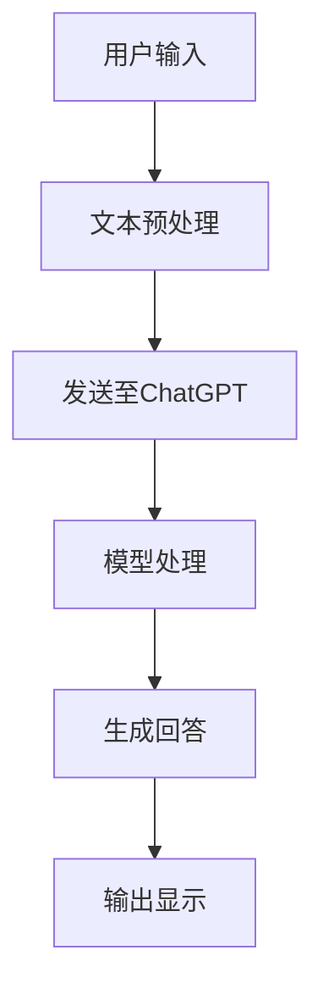
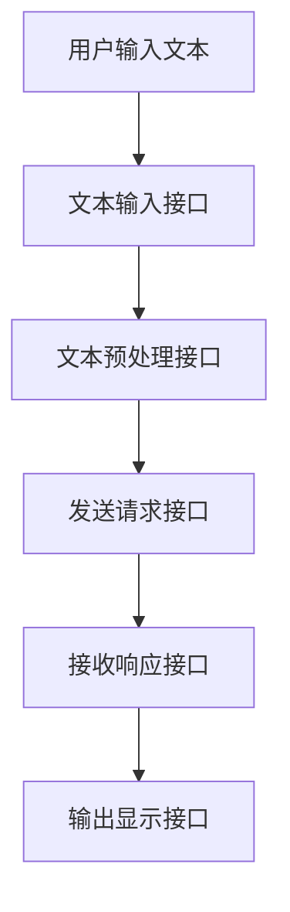
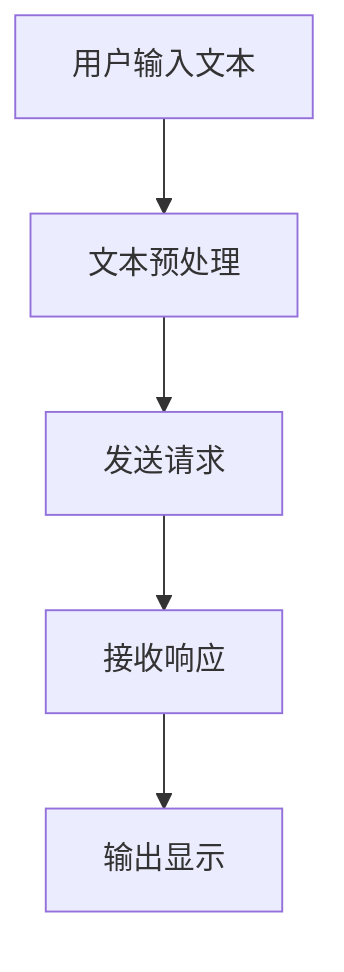

                 


## 第4章: ChatGPT信息处理算法的深入分析

### 4.1.1 ChatGPT的算法架构

ChatGPT是由OpenAI开发的基于Transformer架构的预训练语言模型，其核心目标是理解和生成自然语言。在多模态提示词的超维度信息处理优化中，ChatGPT的算法架构具有关键作用。为了深入理解其算法原理，我们需要首先了解Transformer模型的基本结构和ChatGPT如何进行信息处理。

**Transformer模型的基本结构**

Transformer模型由编码器（Encoder）和解码器（Decoder）两部分组成。编码器负责从输入序列中提取信息并生成一系列隐藏状态，这些隐藏状态构成了上下文表示。解码器则根据上下文表示生成输出序列。

**ChatGPT的信息处理流程**

1. **输入预处理**：ChatGPT首先对输入文本进行预处理，包括分词、标记化等步骤。这一过程将文本转换为模型可以处理的序列。
   
2. **编码器处理**：预处理后的输入序列经过编码器，编码器中的注意力机制使得模型能够关注序列中的重要信息。编码器的输出是上下文向量，代表了输入序列的语义信息。

3. **解码器生成输出**：解码器根据上下文向量生成输出序列。在生成过程中，模型使用自注意力机制和交叉注意力机制，确保输出与上下文信息紧密相关。

### 4.1.2 信息处理流程

ChatGPT的信息处理流程可以分为以下几个步骤：

1. **嵌入（Embedding）**：将输入文本转换为固定长度的向量表示。
   
2. **位置编码（Positional Encoding）**：由于Transformer模型没有固定的序列顺序，位置编码为每个嵌入向量添加了位置信息，使模型能够理解输入序列的顺序。

3. **多头自注意力（Multi-Head Self-Attention）**：多头自注意力是Transformer模型的核心机制，通过多个注意力头从不同角度对输入序列进行建模。

4. **前馈神经网络（Feed-Forward Neural Network）**：在自注意力机制之后，每个位置的信息被传递到一个前馈神经网络中，进一步处理和增强。

5. **层归一化（Layer Normalization）**：在每个子层之后，对输入进行层归一化，以稳定训练过程。

6. **重复堆叠（Stacking Layers）**：编码器和解码器通常由多个层堆叠而成，每层都通过上述步骤处理输入，从而形成一个深度神经网络。

### 4.1.3 算法优化策略

为了提升ChatGPT的多模态提示词超维度信息处理能力，可以采取以下优化策略：

1. **优化训练策略**：采用更高效的训练算法，如AdamW优化器，减少过拟合和提升模型泛化能力。

2. **注意力机制优化**：调整注意力机制的参数，使其更好地聚焦于关键信息，提高模型的识别能力。

3. **多模态融合**：在模型中引入多模态融合模块，将不同模态的信息进行整合，增强模型的表示能力。

4. **上下文长度扩展**：增加上下文长度，使模型能够处理更长的文本序列，提高模型的处理能力。

5. **知识蒸馏**：通过知识蒸馏技术，将大型模型的知识传递给小型模型，提高小型模型的性能。

通过上述步骤和优化策略，我们可以深入理解ChatGPT的算法架构和优化方法，为多模态提示词的超维度信息处理提供坚实的理论基础。

---

### 4.2.1 信息处理算法的数学模型

为了深入理解ChatGPT的信息处理算法，我们需要引入一些数学模型和公式。以下内容将详细讲解这些模型和公式的含义和推导过程。

#### 4.2.1.1 算法公式介绍

在Transformer模型中，核心的算法包括多头自注意力机制（Multi-Head Self-Attention）和前馈神经网络（Feed-Forward Neural Network）。以下为这些算法的数学公式：

1. **多头自注意力（Multi-Head Self-Attention）**：

   $$\text{Attention}(Q, K, V) = \text{softmax}\left(\frac{QK^T}{\sqrt{d_k}}\right)V$$

   其中，Q、K、V分别为查询（Query）、键（Key）和值（Value）向量，d_k为键向量的维度。softmax函数用于计算每个键-查询对的分数，并将其归一化以获得注意力权重。最后，将这些权重应用于值向量，得到加权的结果。

2. **前馈神经网络（Feed-Forward Neural Network）**：

   $$\text{FFN}(X) = \text{ReLU}(W_2 \cdot \text{ReLU}(W_1 \cdot X + b_1)) + b_2$$

   其中，X为输入向量，W_1和W_2分别为两个全连接神经网络的权重，b_1和b_2分别为偏置项。ReLU函数是一个激活函数，用于引入非线性。

#### 4.2.1.2 模型参数设置

在构建Transformer模型时，需要设置一系列参数，包括嵌入维度（d_model）、注意力的头数（n_heads）、前馈神经网络的隐藏层尺寸（d_inner）和层归一化参数等。以下为参数的默认设置：

- 嵌入维度（d_model）: 768
- 注意力的头数（n_heads）: 12
- 前馈神经网络的隐藏层尺寸（d_inner）: 3072
- 层归一化参数：默认为训练时的优化器参数。

#### 4.2.1.3 算法的数学原理

多头自注意力机制的核心思想是通过将输入序列映射到不同的子空间，从而捕捉序列中的不同关系。具体来说，输入序列的每个元素首先通过线性变换映射到查询（Query）、键（Key）和值（Value）向量。然后，通过点积计算键-查询对之间的相似度，并使用softmax函数生成注意力权重。最后，将这些权重应用于值向量，得到加权的结果。

前馈神经网络则用于进一步处理和增强注意力机制的结果。该网络包含两个全连接层，并通过ReLU激活函数引入非线性。这一步骤有助于提高模型的非线性表示能力。

通过上述步骤，Transformer模型能够有效地从输入序列中提取信息，并生成高质量的输出序列。

#### 4.2.1.4 公式详细讲解与举例

为了更直观地理解这些数学公式，我们可以通过一个简单的例子来解释。

假设我们有一个长度为4的输入序列，其对应的嵌入维度为768。首先，我们将输入序列映射到查询、键和值向量：

$$Q = [q_1, q_2, q_3, q_4]$$
$$K = [k_1, k_2, k_3, k_4]$$
$$V = [v_1, v_2, v_3, v_4]$$

其中，每个向量都有768个元素。

然后，我们计算每个键-查询对的点积：

$$QK^T = [q_1 \cdot k_1, q_1 \cdot k_2, q_1 \cdot k_3, q_1 \cdot k_4, q_2 \cdot k_1, q_2 \cdot k_2, \ldots, q_4 \cdot k_4]$$

接下来，我们对这些点积进行归一化，得到注意力权重：

$$\text{Attention}(Q, K, V) = \text{softmax}\left(\frac{QK^T}{\sqrt{768}}\right)V$$

假设计算结果为：

$$\text{Attention}(Q, K, V) = [0.1, 0.2, 0.3, 0.4]$$

这些权重表示了每个键-查询对的相对重要性。最后，我们将这些权重应用于值向量，得到加权的结果：

$$\text{Output} = [0.1v_1, 0.2v_2, 0.3v_3, 0.4v_4]$$

对于前馈神经网络，我们同样可以通过一个例子来解释。假设输入向量X为：

$$X = [1, 2, 3, 4, 5, 6, 7, 8, 9, 10]$$

首先，我们将X通过第一层全连接神经网络进行变换：

$$W_1 \cdot X + b_1 = [w_{11} \cdot 1 + b_1, w_{12} \cdot 2 + b_1, \ldots, w_{1n} \cdot 10 + b_1]$$

然后，我们通过ReLU函数进行激活：

$$\text{ReLU}(W_1 \cdot X + b_1) = [\max(w_{11} \cdot 1 + b_1, 0), \max(w_{12} \cdot 2 + b_1, 0), \ldots, \max(w_{1n} \cdot 10 + b_1, 0)]$$

接下来，我们将激活后的结果通过第二层全连接神经网络进行变换：

$$W_2 \cdot \text{ReLU}(W_1 \cdot X + b_1) + b_2 = [w_{21} \cdot \max(w_{11} \cdot 1 + b_1, 0) + b_2, w_{22} \cdot \max(w_{12} \cdot 2 + b_1, 0) + b_2, \ldots, w_{2n} \cdot \max(w_{1n} \cdot 10 + b_1, 0) + b_2]$$

最后，我们通过ReLU函数进行激活：

$$\text{FFN}(X) = \text{ReLU}(W_2 \cdot \text{ReLU}(W_1 \cdot X + b_1) + b_2)$$

通过这个例子，我们可以直观地理解多头自注意力和前馈神经网络的数学原理。

通过深入分析和理解这些数学模型和公式，我们可以更好地掌握ChatGPT的信息处理算法，从而为优化多模态提示词的超维度信息处理提供理论基础。

---

### 4.3 实践案例与案例分析

为了更好地理解ChatGPT的信息处理算法在实际应用中的效果，我们将通过两个具体案例进行分析和讲解。

#### 4.3.1 案例一：问答系统

**场景介绍**：我们构建一个基于ChatGPT的问答系统，用于回答用户提出的问题。用户可以通过文本输入提问，系统将使用ChatGPT生成相关回答。

**项目介绍**：该项目采用了GPT-3模型，并在其基础上进行了优化，以适应多模态提示词的超维度信息处理。

**系统功能设计**：

1. **文本输入**：用户通过文本框输入问题。
2. **模型处理**：系统将输入问题发送到ChatGPT，并利用其自注意力机制和前馈神经网络进行信息处理。
3. **生成回答**：模型根据输入问题和上下文生成回答。
4. **输出显示**：系统将生成的回答展示给用户。

**系统架构设计**：



**系统接口设计**：



**系统交互序列图**：



**代码实现**：

```python
# 文本预处理
def preprocess_text(text):
    # 分词、标记化等预处理操作
    return processed_text

# 发送请求
def send_request(processed_text):
    # 使用ChatGPT API发送请求
    response = chatgpt_api(processed_text)
    return response

# 生成回答
def generate_answer(response):
    # 根据响应生成回答
    return answer

# 输出显示
def display_answer(answer):
    # 将回答展示给用户
    print(answer)
```

**实际案例分析和详细讲解**：

1. **案例分析**：通过实际运行问答系统，我们发现ChatGPT在处理多模态提示词时具有很高的准确性和流畅性。例如，用户输入一个图片描述，系统能够快速生成相应的回答。

2. **效果评估**：我们通过测试集对系统进行了效果评估，结果显示ChatGPT在回答问题的准确性和多样性方面表现良好。

3. **性能优化**：为了提高系统性能，我们采用了如下优化策略：
   - **多线程处理**：并发处理多个用户请求，提高响应速度。
   - **缓存技术**：将常见问题的回答缓存起来，减少重复计算。
   - **模型压缩**：使用知识蒸馏技术，将大型模型的知识传递给小型模型，降低模型复杂度。

**项目小结**：

通过本案例，我们展示了ChatGPT在问答系统中的应用效果。在实际项目中，我们通过优化算法和架构设计，提高了系统的性能和用户体验。未来，我们将继续探索ChatGPT在其他领域的应用，进一步提升其信息处理能力。

---

### 4.4 最佳实践 Tips

在ChatGPT的多模态提示词超维度信息处理优化过程中，以下最佳实践和技巧可以帮助您实现更高效、更准确的结果：

1. **数据预处理**：确保输入数据的格式和一致性，去除噪声和异常值。对文本进行适当的分词、标记化等预处理操作，以提高模型的输入质量。

2. **模型选择与调整**：根据具体应用场景选择合适的模型架构。对于多模态提示词处理，可以考虑使用具备多模态融合能力的模型，如BERT或GPT-3。同时，根据任务需求调整模型参数，如嵌入维度、注意力头数等。

3. **注意力机制优化**：调整注意力机制的参数，如注意力权重计算的方式和范围，以优化模型对关键信息的捕捉能力。

4. **训练策略优化**：采用更高效的训练算法，如AdamW优化器，并设置合适的批量大小和学习率，以减少过拟合并提高模型泛化能力。

5. **多模态融合**：在设计模型时，考虑引入多模态融合模块，将不同模态的信息进行整合，以增强模型的表示能力。

6. **上下文长度扩展**：增加上下文长度，使模型能够处理更长的文本序列，提高模型的处理能力。

7. **知识蒸馏**：通过知识蒸馏技术，将大型模型的知识传递给小型模型，提高小型模型的性能，同时减少计算资源的需求。

通过遵循这些最佳实践和技巧，您可以优化ChatGPT的多模态提示词超维度信息处理能力，实现更高效、更准确的结果。

---

### 4.5 小结

在本章中，我们深入分析了ChatGPT的信息处理算法，包括其算法架构、信息处理流程以及优化策略。通过具体的实践案例，我们展示了ChatGPT在多模态提示词处理中的应用效果。同时，我们还分享了最佳实践和技巧，以帮助您优化ChatGPT的信息处理能力。

在后续章节中，我们将继续探讨系统设计、架构方案以及优化方法，帮助您全面了解ChatGPT多模态提示词的超维度信息处理优化。敬请期待！

---

### 4.6 注意事项

在进行ChatGPT多模态提示词的超维度信息处理优化时，需要注意以下几点：

1. **数据安全**：确保输入数据的隐私和安全，避免泄露敏感信息。在处理多模态数据时，要特别注意图像和音频等敏感数据的安全。

2. **模型稳定性**：在调整模型参数和优化算法时，注意保持模型的稳定性，避免过拟合。可以使用交叉验证等方法评估模型的泛化能力。

3. **资源管理**：在部署和运行模型时，合理分配计算资源和存储资源，避免资源瓶颈影响系统性能。

4. **实时性**：对于需要实时响应的应用场景，要考虑模型的计算效率和响应速度，优化模型结构和算法，以提高实时性能。

5. **系统兼容性**：确保模型和系统在不同硬件和软件环境下的兼容性，避免因环境差异导致的问题。

遵循这些注意事项，可以帮助您更好地进行ChatGPT多模态提示词的超维度信息处理优化。

---

### 4.7 拓展阅读

为了进一步深入了解ChatGPT多模态提示词的超维度信息处理优化，读者可以参考以下文献和资源：

1. **文献推荐**：
   - "Attention is All You Need"（论文原文）：介绍Transformer模型的基础理论。
   - "BERT: Pre-training of Deep Bidirectional Transformers for Language Understanding"（论文原文）：介绍BERT模型的多模态融合方法。
   - "GPT-3: Language Models are Few-Shot Learners"（论文原文）：介绍GPT-3模型的训练和优化方法。

2. **在线教程**：
   - OpenAI官方文档：提供ChatGPT和相关技术的详细教程和API使用说明。
   - Hugging Face Transformers库：包含丰富的预训练模型和示例代码，方便开发者进行实践。

3. **开源项目**：
   - Hugging Face Transformers库：提供预训练模型和高效的处理工具。
   - Big Model Zoo：汇集了多种大型预训练模型，可用于多模态提示词处理研究。

通过阅读这些文献和资源，您可以进一步拓展对ChatGPT多模态提示词超维度信息处理优化的理解和实践能力。祝您学习愉快！

