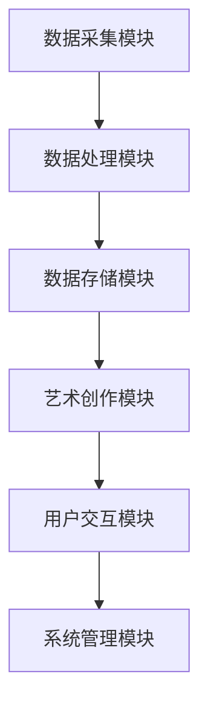
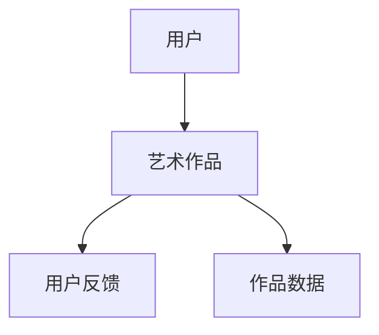

                 

### 第1章：问题背景与核心概念

## 1.1 问题背景

### 1.1.1 艺术创作与AI技术的发展

随着人工智能技术的迅猛发展，AI在各个领域的应用越来越广泛。艺术创作作为人类创造性活动的重要组成部分，也逐渐被AI技术所关注。从早期的自动绘画到如今的AI艺术生成，AI技术在艺术创作中的应用不断拓展。然而，传统的艺术创作方式往往依赖于单一感官，如视觉或听觉，而忽略了其他感官的参与。如何通过AI技术实现多感官的艺术创作，成为一个新的研究方向。

在过去的几十年里，计算机艺术经历了从二维图像到三维建模，再到四维动画和虚拟现实的发展。然而，这些技术仍然主要侧重于视觉体验，而忽略了其他感官的参与。例如，听觉艺术、触觉艺术等，它们虽然也属于艺术创作的范畴，但在AI技术中的应用却相对较少。

### 1.1.2 多模态感知与艺术创作

多模态感知是指通过结合多种感官信息来提高对环境的理解。在艺术创作中，多模态感知可以实现跨感官的艺术体验，从而丰富观众的感官体验。例如，通过结合视觉、听觉和触觉等感官，艺术家可以创造出更加生动、丰富的艺术作品。

多模态感知在艺术创作中的应用，不仅可以提升作品的感官体验，还可以为观众带来更加深刻的情感体验。例如，在音乐会中，通过结合视觉艺术和听觉艺术，观众可以在欣赏音乐的同时，感受到视觉上的美感。同样，在触觉艺术中，观众可以通过触摸艺术品来感受到艺术家的情感和思想。

### 1.1.3 ChatGPT与多模态艺术创作

ChatGPT是一个基于GPT-3模型的AI聊天机器人，具有强大的语言生成和理解能力。将ChatGPT应用于多模态艺术创作，可以使其不仅能够生成文本内容，还能够生成与之相匹配的图像、音频等多模态信息。这种跨感官的艺术创作方式，为人工智能在艺术领域的应用开辟了新的可能性。

ChatGPT的强大语言生成能力，使其可以生成各种类型的多模态文本内容，如诗歌、散文、对话等。同时，ChatGPT还可以根据上下文信息，生成与之相匹配的图像和音频内容。例如，当生成一首诗歌时，ChatGPT可以同时生成与之相匹配的插画和配乐。

## 1.2 核心概念介绍

### 1.2.1 多模态艺术创作

多模态艺术创作是指通过结合多种感官信息进行艺术创作的过程。在这种创作方式中，艺术家需要从多个感官渠道获取信息，并将其融合，以产生具有丰富感官体验的艺术作品。

多模态艺术创作包括视觉、听觉、触觉等多种感官的参与。例如，在视觉艺术中，艺术家可以使用各种绘画工具和材料来创造图像；在听觉艺术中，艺术家可以创作音乐或声音艺术；在触觉艺术中，艺术家可以创作触感艺术品。

### 1.2.2 ChatGPT

ChatGPT是基于GPT-3模型的AI聊天机器人。GPT-3是自然语言处理领域的一个突破性模型，具有强大的语言生成和理解能力。ChatGPT通过学习大量的文本数据，能够生成自然流畅的对话文本，同时还可以根据上下文进行推理和决策。

ChatGPT的核心功能是文本生成和理解。它不仅可以生成各种类型的文本内容，如诗歌、散文、对话等，还可以根据用户的提问或指令，生成相应的回答或执行任务。例如，用户可以要求ChatGPT创作一首诗，或回答某个科学问题。

### 1.2.3 多模态数据融合

多模态数据融合是指将来自不同感官的信息进行整合，以获得更全面、更准确的信息。在多模态艺术创作中，数据融合是实现跨感官体验的关键步骤。通过数据融合，艺术家或AI系统能够将视觉、听觉、触觉等多感官信息有机地结合，从而创造出具有丰富感官体验的艺术作品。

多模态数据融合包括数据收集、预处理、特征提取和融合等步骤。数据收集是指从不同的感官渠道获取信息；预处理是指对获取的数据进行清洗和格式化；特征提取是指从预处理后的数据中提取出关键特征；融合是指将提取出的特征进行整合，以获得更全面的信息。

## 1.3 书籍概述与目标

本书旨在探讨AI技术在艺术创作中的应用，特别是多模态艺术创作的实现方法。通过详细介绍多模态感知、ChatGPT和多模态数据融合等核心概念和技术，本书将帮助读者了解如何通过AI技术实现跨感官的艺术创作，从而推动人工智能在艺术领域的应用。

本书的主要目标包括：

1. 介绍多模态艺术创作的背景和核心概念。
2. 深入探讨ChatGPT在多模态艺术创作中的应用。
3. 详细讲解多模态数据融合的方法和技术。
4. 通过实际案例，展示如何利用AI技术实现多模态艺术创作。
5. 探讨多模态艺术创作的未来发展趋势和应用前景。

## 1.4 多模态感知与艺术创作

### 1.4.1 多模态感知技术简介

多模态感知技术是指通过结合多种感官信息来提高对环境的理解。在计算机科学和人工智能领域，多模态感知技术已经成为一个重要的研究方向。多模态感知技术主要包括数据收集、预处理、特征提取和融合等步骤。

#### 数据收集

数据收集是多模态感知技术的第一步，也是最重要的一步。它涉及从不同的感官渠道获取信息。例如，视觉数据可以通过摄像头或图像传感器收集，听觉数据可以通过麦克风或音频传感器收集，触觉数据可以通过力传感器或触觉传感器收集。

#### 数据预处理

数据预处理是对收集到的原始数据进行清洗和格式化。这一步骤的目的是去除噪声，提高数据质量。数据预处理包括图像去噪、音频去噪、触觉数据去噪等。

#### 特征提取

特征提取是从预处理后的数据中提取出关键特征。这些特征将用于后续的数据分析和模型训练。例如，在视觉数据中，特征提取可能包括颜色、纹理、形状等；在听觉数据中，特征提取可能包括音调、音量、节奏等；在触觉数据中，特征提取可能包括压力、温度、振动等。

#### 数据融合

数据融合是将提取出的特征进行整合，以获得更全面的信息。数据融合的方法有多种，如基于特征的融合、基于模型的融合和基于知识库的融合等。数据融合的目的是提高系统的感知能力和决策能力。

### 1.4.2 多模态感知在艺术创作中的应用

多模态感知技术在艺术创作中的应用，可以极大地丰富观众的感官体验。以下是一些具体的实例：

1. **视觉艺术与听觉艺术的结合**：艺术家可以通过将视觉元素与音频元素相结合，创造出具有独特感官体验的艺术作品。例如，在音乐会中，艺术家可以使用投影技术将视觉图像与音乐节奏相结合，为观众带来全新的视听体验。

2. **视觉艺术与触觉艺术的结合**：艺术家可以使用触觉传感器和显示技术，创造出可以触摸的艺术作品。例如，在触觉艺术装置中，观众可以通过触摸来感受艺术作品的变化和情感。

3. **听觉艺术与触觉艺术的结合**：艺术家可以通过音频和触觉反馈技术，创造出可以听、可以触摸的艺术作品。例如，在交互式艺术装置中，观众可以通过触摸来激活音频元素，从而创造出独特的听觉和触觉体验。

### 1.4.3 多模态感知在艺术创作中的优势

多模态感知技术在艺术创作中的优势主要体现在以下几个方面：

1. **增强感官体验**：通过结合多种感官信息，艺术家可以创造出更加丰富、生动的艺术作品，从而增强观众的感官体验。

2. **提高创作自由度**：多模态感知技术为艺术家提供了更多的创作手段和工具，使得艺术家可以在创作过程中更加自由地表达自己的想法和情感。

3. **促进跨学科合作**：多模态感知技术涉及到计算机科学、艺术学、心理学等多个学科，为跨学科合作提供了新的机会和平台。

4. **推动艺术创新**：多模态感知技术可以为艺术家提供新的创作视角和灵感，从而推动艺术的创新和发展。

### 1.4.4 多模态感知技术在艺术创作中的挑战

尽管多模态感知技术在艺术创作中具有很多优势，但也面临着一些挑战：

1. **技术实现难度**：多模态感知技术涉及到多种感官信息的收集、处理和融合，技术实现难度较大。

2. **数据质量和多样性**：多模态感知技术的效果很大程度上取决于数据的质量和多样性。如果数据质量不佳或数据种类单一，可能会导致艺术作品的感官体验受限。

3. **用户接受度**：虽然多模态感知技术可以为观众带来全新的感官体验，但并非所有观众都能接受这种新的艺术形式。因此，如何提高用户接受度也是一个重要的挑战。

4. **伦理和法律问题**：多模态感知技术涉及到个人隐私和数据安全等问题，如何确保技术的伦理性和合法性也是一个需要考虑的问题。

总的来说，多模态感知技术在艺术创作中具有巨大的潜力，但同时也面临着一些挑战。通过不断的技术创新和跨学科合作，有望克服这些挑战，为艺术家和观众带来更加丰富、独特的艺术体验。

### 第2章：多模态感知与数据处理

## 第2章：多模态感知与数据处理

### 2.1 多模态感知技术简介

多模态感知技术是通过结合多种感官信息来提高对环境的理解。在人工智能领域，多模态感知技术已成为一个重要的研究方向，其目的是通过整合来自不同感官的信息，提高机器对复杂环境的感知和理解能力。多模态感知技术主要包括数据收集、预处理、特征提取和融合等步骤。

#### 数据收集

数据收集是多模态感知技术的第一步，也是至关重要的一步。它涉及到从不同的感官渠道获取信息。例如，视觉数据可以通过摄像头或图像传感器收集，听觉数据可以通过麦克风或音频传感器收集，触觉数据可以通过力传感器或触觉传感器收集。

不同类型的数据收集方法具有不同的特点。例如，摄像头和图像传感器可以捕获高分辨率、高质量的视觉数据，但受光照和角度的影响较大。而麦克风和音频传感器则可以捕捉声音数据，但受噪声和环境干扰的影响较大。力传感器和触觉传感器可以感知物体表面的触觉信息，但需要与物体直接接触。

#### 数据预处理

数据预处理是对收集到的原始数据进行清洗和格式化，以提高数据质量。数据预处理包括图像去噪、音频去噪、触觉数据去噪等。图像去噪可以通过滤波或神经网络方法来实现，音频去噪可以使用谱减法或基于深度学习的降噪技术，触觉数据去噪可以使用滤波或统计方法。

#### 特征提取

特征提取是从预处理后的数据中提取出关键特征，以便进行后续的数据分析和模型训练。特征提取的方法取决于数据的类型。例如，在视觉数据中，特征提取可能包括颜色、纹理、形状等；在听觉数据中，特征提取可能包括音调、音量、节奏等；在触觉数据中，特征提取可能包括压力、温度、振动等。

常用的特征提取方法包括频域特征提取、时域特征提取和空间特征提取。频域特征提取通常用于处理音频和图像数据，通过频谱分析来提取频率信息。时域特征提取适用于处理时序数据，如音频信号和传感器数据。空间特征提取主要用于处理三维空间数据，如机器人导航和三维重建。

#### 数据融合

数据融合是将提取出的特征进行整合，以获得更全面的信息。数据融合的方法有多种，如基于特征的融合、基于模型的融合和基于知识库的融合等。数据融合的目的是提高系统的感知能力和决策能力。

基于特征的融合方法通常通过加权或投票机制将不同模态的特征融合在一起。基于模型的融合方法通过训练一个多模态模型来整合不同模态的信息。基于知识库的融合方法则通过引入先验知识来提高多模态数据的融合效果。

### 2.2 数据预处理与增强

数据预处理和增强是多模态感知技术中的重要步骤，旨在提高数据质量和减少噪声。数据预处理包括去噪、归一化、特征缩放等，而数据增强则通过生成新的数据样本来丰富数据集。

#### 数据去噪

数据去噪是去除数据中的噪声，以提高数据质量。噪声可能来自传感器、传输过程或环境因素。对于视觉数据，去噪方法包括滤波（如高斯滤波、中值滤波）和深度学习方法（如卷积神经网络去噪）。对于音频数据，去噪方法包括谱减法、稀疏编码和基于生成对抗网络（GAN）的方法。对于触觉数据，去噪可以通过滤波或统计方法来实现。

#### 数据归一化

数据归一化是将数据转换为统一的尺度，以消除不同模态数据之间的量纲差异。归一化方法包括最小-最大归一化、平均值归一化和标准差归一化。最小-最大归一化将数据映射到[0, 1]的区间，而平均值归一化和标准差归一化则通过减去平均值并除以标准差来缩放数据。

#### 特征缩放

特征缩放是调整特征之间的比例，以平衡不同特征的影响。常用的方法包括最小二乘回归、主成分分析（PCA）和线性判别分析（LDA）。PCA通过投影数据到新的正交空间来减少维数，同时最大化特征之间的差异。LDA则通过最大化不同类别之间的分离度来实现特征缩放。

#### 数据增强

数据增强是通过生成新的数据样本来丰富数据集，以提高模型的泛化能力。数据增强方法包括图像增强（如旋转、翻转、缩放、裁剪）、音频增强（如混响、噪声添加）和触觉增强（如振动模式变换）。图像增强可以通过改变图像的颜色、亮度和对比度来实现。音频增强可以通过添加背景噪声、调整音量和添加回声等来实现。触觉增强可以通过改变振动频率、振幅和模式来实现。

### 2.3 多模态数据融合方法

多模态数据融合是将来自不同感官的信息进行整合，以获得更全面的信息。多模态数据融合的方法可以分为基于特征的融合、基于模型的融合和基于知识库的融合。

#### 基于特征的融合

基于特征的融合方法通过将不同模态的特征进行整合。常用的方法包括加权融合、投票机制和特征级联。加权融合通过给不同模态的特征分配不同的权重来融合特征。投票机制通过在每个特征空间中对模态进行投票，选择概率最高的特征作为最终结果。特征级联方法则通过级联多个特征提取器和融合器来逐步融合特征。

#### 基于模型的融合

基于模型的融合方法通过训练一个多模态模型来整合不同模态的信息。常用的方法包括多任务学习、多输入多输出（MIMO）模型和深度学习。多任务学习通过训练一个模型同时解决多个相关任务来融合特征。MIMO模型通过训练一个多输入多输出模型来融合特征。深度学习则通过使用多层神经网络来融合特征。

#### 基于知识库的融合

基于知识库的融合方法通过引入先验知识来提高多模态数据的融合效果。知识库可以包括先验规则、语义信息或领域知识。基于知识库的融合方法通常通过推理或匹配算法来实现。

### 2.4 多模态数据特征提取

多模态数据特征提取是从多模态数据中提取出有用的信息，以用于后续的分析和模型训练。特征提取的方法取决于数据的类型和目标任务的性质。

#### 视觉特征提取

视觉特征提取包括颜色、纹理、形状和空间关系等。常用的视觉特征提取方法包括SIFT、SURF、HOG、CNN等。SIFT和SURF是经典的视觉特征提取算法，可以提取出具有旋转和尺度不变性的特征点。HOG（直方图方向梯度）是一种用于物体检测的特征提取方法。CNN（卷积神经网络）是一种深度学习模型，可以自动提取出复杂的视觉特征。

#### 听觉特征提取

听觉特征提取包括频谱特征、时域特征和倒谱特征等。常用的听觉特征提取方法包括MFCC（梅尔频率倒谱系数）、谱熵、谱相关性和共振峰等。MFCC是最常用的听觉特征提取方法，它能够有效地提取语音信号中的频率信息。

#### 触觉特征提取

触觉特征提取包括压力、温度、振动和触觉纹理等。常用的触觉特征提取方法包括传感器信号分析、神经网络和生成对抗网络（GAN）等。传感器信号分析是通过分析传感器输出信号的时间序列来提取特征。神经网络和GAN可以通过训练模型来提取出复杂的触觉特征。

### 2.5 数据预处理与增强的实际应用

在实际应用中，数据预处理与增强对于多模态感知系统的性能至关重要。以下是一些实际应用案例：

1. **机器人导航**：在机器人导航中，多模态感知系统需要结合视觉、听觉和触觉信息来感知环境并做出决策。数据预处理和增强可以帮助机器人识别路径、避免障碍物和识别地标。

2. **交互式艺术装置**：在交互式艺术装置中，多模态感知技术可以感知观众的姿态、动作和触觉反馈，从而创造出个性化的艺术体验。数据预处理和增强可以提高系统的反应速度和准确性。

3. **虚拟现实**：在虚拟现实中，多模态感知技术可以提供更加真实的感官体验。数据预处理和增强可以帮助生成高质量的三维图像、音频和触觉反馈。

4. **智能家居**：在智能家居中，多模态感知技术可以感知家庭成员的活动、行为和环境变化，从而提供个性化的服务和安全保障。数据预处理和增强可以提高系统的准确性和可靠性。

总的来说，多模态感知与数据处理技术为人工智能在艺术创作中的应用提供了强大的支持。通过有效的数据预处理和增强，可以显著提高多模态感知系统的性能，为艺术家和观众带来更加丰富、独特的艺术体验。

### 第3章：GPT模型与艺术创作

## 第3章：GPT模型与艺术创作

### 3.1 GPT模型概述

GPT（Generative Pre-trained Transformer）模型是一种基于Transformer架构的自然语言处理（NLP）模型，由OpenAI开发。GPT模型的核心思想是通过预训练来学习大量的语言数据，从而在多个NLP任务上取得出色的性能。GPT模型采用自回归语言模型（ARLM）的方法，通过预测下一个词来学习语言模式。

GPT模型的关键特点包括：

1. **Transformer架构**：GPT模型基于Transformer架构，这是一种用于处理序列数据的强大神经网络架构。与传统的循环神经网络（RNN）相比，Transformer架构在处理长序列时具有更好的并行性和稳定性。

2. **预训练**：GPT模型通过在大规模文本语料库上进行预训练，学习到丰富的语言知识和模式。这种预训练过程使得模型在不需要额外任务特定训练的情况下，就能在多种NLP任务上表现出色。

3. **自回归语言模型**：GPT模型是一个自回归语言模型，这意味着它通过预测下一个词来生成文本。这种自回归方法使得GPT模型能够生成连贯、自然的文本。

4. **多层网络结构**：GPT模型采用多层神经网络结构，每层网络都能够学习到不同层次的抽象语言特征。多层结构使得模型能够处理复杂、长远的语言依赖关系。

GPT模型的基本工作原理如下：

1. **输入编码**：首先，将输入文本序列编码为向量。这一步骤可以通过词嵌入（word embedding）技术实现，例如Word2Vec、GloVe等。

2. **序列处理**：接着，将编码后的文本序列输入到Transformer模型中。Transformer模型通过多头自注意力机制（multi-head self-attention）来处理序列信息。自注意力机制使得模型能够关注序列中的不同部分，并捕捉长距离依赖关系。

3. **预测与生成**：在每一步，模型预测下一个词，并将其作为新的输入。通过这种方式，模型逐步生成完整的文本序列。生成过程是基于条件概率的，即每个词的生成依赖于前面的所有词。

### 3.2 GPT模型在艺术创作中的应用

GPT模型在艺术创作中具有广泛的应用。以下是一些具体的应用案例：

1. **文本创作**：GPT模型可以生成各种类型的文本，如诗歌、散文、小说、剧本等。例如，OpenAI的GPT-2模型曾生成了一篇令人惊叹的短篇小说，展现了其卓越的文本创作能力。

2. **歌词创作**：GPT模型可以生成歌词，为音乐创作提供灵感。通过将音乐与生成的歌词相结合，可以创造出独特的音乐作品。

3. **剧本创作**：GPT模型可以生成剧本，为电影、戏剧等艺术形式提供创作素材。通过生成对话和场景描述，GPT模型可以帮助编剧快速创作出有趣的剧本。

4. **翻译**：GPT模型在机器翻译领域也表现出色。通过训练大型语料库，GPT模型可以生成高质量的双语翻译文本，为跨语言艺术交流提供支持。

### 3.3 GPT模型的艺术创作案例

以下是一些使用GPT模型进行艺术创作的实际案例：

1. **诗歌创作**：OpenAI的GPT-2模型生成了一首题为《The Hateful Song》的诗歌，展现了其在诗歌创作方面的潜力。诗歌中充满了深刻的情感和隐喻，让人印象深刻。

2. **短篇小说**：GPT-2模型生成了一篇名为《The Enchanted Library》的短篇小说。这个故事情节紧凑、引人入胜，展示了GPT模型在小说创作方面的能力。

3. **歌词创作**：一位艺术家使用GPT-2模型创作了一首名为《AI Symphony》的歌曲。歌曲的歌词充满了对人工智能的赞美和思考，结合了音乐和文学元素。

4. **剧本创作**：一位编剧使用GPT-2模型创作了一个剧本，讲述了一个关于人工智能与人类关系的故事。剧本中的对话和场景描述生动有趣，展现了GPT模型在剧本创作方面的潜力。

### 3.4 GPT模型的艺术创作优化

为了提升GPT模型在艺术创作中的性能，可以采用以下几种优化方法：

1. **预训练数据增强**：通过引入更多的预训练数据，可以提升模型对各种艺术创作风格的理解能力。例如，可以使用大量诗歌、小说、音乐和剧本等文本数据进行预训练。

2. **细粒度微调**：在特定艺术创作任务上对模型进行微调，可以使其更适应特定类型的内容创作。例如，在创作歌词时，可以微调模型以更好地理解音乐和情感。

3. **多模态数据融合**：将GPT模型与多模态数据（如图像、音频、视频等）相结合，可以创造出更加丰富、跨感官的艺术体验。例如，可以使用GPT模型生成与图像或音频相匹配的文本内容。

4. **强化学习**：结合强化学习技术，可以训练GPT模型在特定艺术创作任务上实现更高级的决策和创造力。例如，通过奖励机制，可以鼓励模型生成更富有创意和吸引力的文本内容。

5. **数据多样性**：确保预训练数据集的多样性，可以提升模型对各种艺术创作风格和内容的适应性。例如，可以包括不同语言、不同文化和不同主题的数据。

通过上述优化方法，GPT模型在艺术创作中的性能可以得到显著提升，为艺术家和创作者提供更多的创作工具和灵感。

### 第4章：多模态艺术生成算法

## 第4章：多模态艺术生成算法

### 4.1 多模态艺术生成算法概述

多模态艺术生成算法是指能够通过结合多种感官信息（如视觉、听觉、触觉等）来生成艺术作品的算法。这种算法的目标是实现跨感官的艺术体验，为观众提供更加丰富和深刻的感官体验。多模态艺术生成算法在艺术创作、虚拟现实、交互式娱乐等领域具有广泛的应用。

多模态艺术生成算法的基本流程包括以下几个步骤：

1. **数据收集**：从不同的感官渠道收集数据，如视觉图像、音频信号、触觉传感器数据等。

2. **数据预处理**：对收集到的原始数据进行清洗、归一化和增强，以提高数据质量和减少噪声。

3. **特征提取**：从预处理后的数据中提取出关键特征，如视觉图像的颜色、纹理、形状特征，音频信号的频率、节奏特征，触觉传感器的压力、振动特征等。

4. **特征融合**：将提取出的特征进行整合，以获得更全面的信息。特征融合的方法包括基于特征的融合、基于模型的融合和基于知识库的融合等。

5. **艺术生成**：利用提取出的特征和融合后的信息，生成艺术作品。生成的方法包括生成对抗网络（GAN）、变分自编码器（VAE）等。

### 4.2 生成对抗网络（GAN）在艺术创作中的应用

生成对抗网络（GAN）是一种由生成器和判别器组成的对抗性神经网络，其目标是生成与真实数据相似的新数据。GAN在图像生成、语音合成、文本生成等领域取得了显著成果，在多模态艺术创作中也具有广泛的应用。

#### GAN的基本原理

GAN由两个主要组件组成：生成器（Generator）和判别器（Discriminator）。

- **生成器**：生成器是一个神经网络，其目标是生成与真实数据相似的数据。生成器的输入是随机噪声，输出是生成的数据。生成器通过不断优化其生成数据的质量，使其越来越接近真实数据。

- **判别器**：判别器是一个神经网络，其目标是区分真实数据和生成数据。判别器的输入是真实数据和生成数据，输出是判断结果，即数据的真实概率。

GAN的训练过程是一个对抗性训练过程，生成器和判别器相互竞争。生成器的目标是生成尽可能真实的数据，使得判别器无法区分真实数据和生成数据。判别器的目标是提高其判断真实数据和生成数据的准确性。通过这种对抗性训练，生成器逐渐生成高质量的数据，判别器逐渐提高其判断能力。

#### GAN在多模态艺术创作中的应用

GAN在多模态艺术创作中的应用主要包括以下几个方面：

1. **图像与音频的生成**：使用GAN可以同时生成高质量的图像和音频。生成器可以生成图像和音频，判别器则分别对图像和音频进行判断。通过联合训练图像和音频生成器，可以生成具有一致性和连贯性的多模态艺术作品。

2. **图像与触觉的生成**：GAN可以生成与图像相匹配的触觉信息，如纹理和压力分布。生成器生成图像和触觉信息，判别器分别判断图像和触觉信息的真实性。这种方法可以应用于虚拟现实和增强现实中的应用，为用户提供更加真实的触觉体验。

3. **音频与触觉的生成**：GAN可以生成与音频相匹配的触觉信息，如振动模式和节奏。生成器生成音频和触觉信息，判别器分别判断音频和触觉信息的真实性。这种方法可以应用于音乐交互和触觉增强音乐体验中。

### 4.3 基于变分自编码器（VAE）的艺术生成

变分自编码器（VAE）是一种基于概率模型的生成模型，其核心思想是学习数据的概率分布。VAE由编码器和解码器组成，编码器将输入数据编码为一个低维表示，解码器则将这个低维表示解码回原始数据。

#### VAE的基本原理

- **编码器**：编码器是一个神经网络，其目标是学习输入数据的概率分布。编码器的输入是原始数据，输出是均值和方差。

- **解码器**：解码器是一个神经网络，其目标是根据编码器输出的均值和方差生成原始数据。解码器的输入是均值和方差，输出是生成的数据。

VAE的训练过程包括两个部分：

1. **编码**：编码器对输入数据进行编码，将其表示为均值和方差。

2. **解码**：解码器根据编码器输出的均值和方差生成数据。通过最小化生成数据的损失函数，训练编码器和解码器。

#### VAE在多模态艺术创作中的应用

VAE在多模态艺术创作中的应用主要包括以下几个方面：

1. **图像生成**：VAE可以生成高质量的图像。通过编码器学习图像的概率分布，解码器则根据这个概率分布生成新的图像。这种方法可以用于图像修复、图像超分辨率和图像生成对抗网络（GAN）的改进。

2. **音频生成**：VAE可以生成高质量的音频。通过编码器学习音频数据的概率分布，解码器则根据这个概率分布生成新的音频。这种方法可以用于音频生成、音频合成和音频增强。

3. **多模态生成**：VAE可以同时生成多种模态的数据，如图像、音频和触觉。通过联合训练编码器和解码器，可以生成具有一致性和连贯性的多模态艺术作品。这种方法可以应用于虚拟现实、交互式艺术和增强现实等领域。

### 4.4 多模态艺术生成的优化策略

为了提高多模态艺术生成的质量和性能，可以采用以下几种优化策略：

1. **多任务学习**：通过同时训练多个生成器和判别器，可以同时生成多种模态的数据。这种方法可以促进不同模态之间的信息共享和协同优化。

2. **跨模态对齐**：通过引入跨模态对齐机制，可以将不同模态的数据进行对齐，提高生成数据的连贯性和一致性。例如，可以使用注意力机制或多模态编码器来对齐不同模态的数据。

3. **多模态增强**：通过引入多模态增强技术，可以增强生成数据的多样性和质量。例如，可以使用生成对抗网络（GAN）或多任务学习来增强生成数据的多样性。

4. **对抗性训练**：通过对抗性训练，可以增强生成器和判别器之间的对抗性，提高生成数据的真实性和质量。例如，可以使用生成对抗网络（GAN）中的梯度惩罚机制来增强对抗性训练。

5. **数据增强**：通过数据增强技术，可以扩展训练数据集的多样性，提高生成模型对各种艺术风格的适应能力。例如，可以使用图像增强、音频增强和触觉增强技术来扩展训练数据集。

通过上述优化策略，可以显著提高多模态艺术生成的质量和性能，为艺术家和观众带来更加丰富和深刻的艺术体验。

### 第5章：整合多感官体验的艺术创作实践

## 第5章：整合多感官体验的艺术创作实践

### 5.1 视觉艺术与听觉艺术的结合

在艺术创作中，视觉艺术与听觉艺术的结合可以创造出独特的感官体验。以下是一些具体的方法和实践：

#### 5.1.1 视觉与听觉融合技术

1. **视觉艺术中的音频元素**：艺术家可以通过在视觉作品中嵌入音频元素，如背景音乐、声音效果等，来增强视觉效果。例如，在电影制作中，声音效果可以增强画面的情感表达和戏剧效果。

2. **听觉艺术中的视觉元素**：艺术家也可以在听觉作品中引入视觉元素，如动画、图像等，以增强听觉体验。例如，在音乐视频制作中，图像和动画可以与音乐节奏同步，增强观众的视听体验。

#### 5.1.2 实践案例

1. **音乐会与投影结合**：在音乐会中，艺术家可以使用投影技术将视觉图像与音乐节奏相结合。观众可以在欣赏音乐的同时，感受到视觉上的美感。例如，Mozart的《夜曲》与动画艺术的结合，为观众带来了全新的感官体验。

2. **交互式艺术装置**：艺术家可以创作交互式艺术装置，观众可以通过触摸、移动等交互行为来改变视觉和听觉效果。例如，一个交互式灯光装置，观众可以通过挥手或脚步来控制灯光的颜色和亮度，同时播放相应的音乐。

### 5.2 视觉艺术与触觉艺术的结合

视觉艺术与触觉艺术的结合可以创造出更加真实和沉浸式的艺术体验。以下是一些具体的方法和实践：

#### 5.2.1 触觉艺术中的视觉元素

1. **触觉图像**：艺术家可以通过触觉图像技术，将视觉图像转换为触觉图像。触觉图像使用特殊材料和印刷技术，观众可以通过触摸感受到图像的纹理和形状。

2. **视觉提示**：艺术家可以在触觉艺术品上添加视觉提示，如颜色、线条等，以增强观众的感官体验。例如，在触觉雕塑中，使用不同颜色的线条来区分不同的纹理和形状。

#### 5.2.2 实践案例

1. **触觉绘画**：艺术家可以使用触觉颜料进行绘画，观众可以通过触摸来感受画作的纹理和色彩。这种艺术形式不仅为观众带来了视觉上的美感，还提供了触觉上的享受。

2. **触觉电影**：触觉电影是一种新兴的视觉艺术形式，观众可以在观看电影的同时，感受到电影中的触觉效果。例如，观众可以通过特殊的头盔或手套，感受到电影中的触感，如雨滴、风吹等。

### 5.3 听觉艺术与触觉艺术的结合

听觉艺术与触觉艺术的结合可以创造出独特的感官体验，使观众在听音乐的同时，感受到音乐带来的触觉效果。以下是一些具体的方法和实践：

#### 5.3.1 触觉音乐

1. **振动乐器**：艺术家可以使用振动乐器，如振动吉他、振动鼓等，这些乐器在演奏时可以产生振动效果，观众可以通过触摸乐器来感受音乐的触觉体验。

2. **触觉反馈设备**：艺术家可以使用触觉反馈设备，如振动垫、触觉手套等，将音乐的节奏、音调和动态转换为触觉信号，观众可以通过触摸这些设备来感受音乐。

#### 5.3.2 实践案例

1. **触觉音乐会**：在触觉音乐会上，观众可以通过特殊的设备，如触觉手套或座椅，感受到音乐中的振动效果。这种音乐会不仅提供了听觉上的享受，还为观众带来了触觉上的刺激。

2. **触觉音频艺术装置**：艺术家可以创作触觉音频艺术装置，观众可以通过触摸这些装置来激活音乐和触觉效果。例如，一个触觉音频装置，观众可以通过触摸不同的区域来播放不同的音乐和振动效果。

### 5.4 跨感官艺术创作的综合应用案例

跨感官艺术创作的综合应用案例展示了多种感官信息的结合，为观众带来了前所未有的感官体验。以下是一些具体的案例：

#### 5.4.1 虚拟现实艺术体验

1. **沉浸式艺术展**：在虚拟现实艺术展中，观众可以通过头戴式显示器和手柄设备，进入一个完全沉浸式的艺术空间。艺术家可以结合视觉、听觉和触觉效果，创作出独特的艺术作品，让观众在虚拟世界中感受到真实的世界。

2. **交互式虚拟现实表演**：在交互式虚拟现实表演中，观众可以通过手势或身体动作与虚拟艺术家互动。虚拟艺术家可以表演音乐、绘画或舞蹈，观众可以通过触摸或语音与虚拟艺术家交流，创造出独特的艺术体验。

#### 5.4.2 增强现实艺术体验

1. **增强现实艺术装置**：在增强现实艺术装置中，艺术家可以结合视觉、听觉和触觉效果，创作出具有互动性的艺术作品。观众可以通过移动设备或头戴式显示器，看到艺术作品在现实世界中的投影，并可以通过触摸或声音与艺术作品互动。

2. **增强现实音乐会**：在增强现实音乐会上，观众可以看到与音乐同步的视觉效果，并可以通过触摸或声音与音乐会互动。例如，观众可以通过触摸屏幕来改变音乐的颜色和节奏，创造出独特的音乐体验。

通过这些跨感官艺术创作的实践案例，艺术家可以创造出更加丰富和独特的艺术作品，为观众带来全新的感官体验。跨感官艺术创作不仅拓展了艺术的边界，也为艺术领域的创新和发展提供了新的思路和方向。

### 第6章：艺术创作系统设计与实现

## 第6章：艺术创作系统设计与实现

### 6.1 艺术创作系统的整体架构

艺术创作系统是一个复杂的系统，它需要整合多种技术和模块，以实现跨感官的艺术创作。以下是艺术创作系统的整体架构设计。

#### 系统架构设计

艺术创作系统的整体架构可以分为以下几个模块：

1. **数据采集模块**：负责从不同的感官渠道收集数据，如视觉、听觉、触觉等。该模块包括摄像头、麦克风、力传感器等硬件设备。

2. **数据处理模块**：负责对采集到的原始数据进行预处理、增强和特征提取。该模块包括数据清洗、归一化、特征提取等算法。

3. **数据存储模块**：负责存储和管理系统中的数据，包括艺术作品、用户数据和系统配置等。该模块通常使用数据库系统，如MySQL或MongoDB。

4. **艺术创作模块**：负责根据用户需求和系统数据，生成艺术作品。该模块包括生成器、判别器、多模态数据融合等算法。

5. **用户交互模块**：负责与用户进行交互，接收用户输入，展示艺术作品，并提供反馈机制。该模块包括用户界面和交互逻辑。

6. **系统管理模块**：负责系统的配置、监控和故障处理。该模块包括系统配置文件、监控工具和日志管理等。

#### 系统架构图

以下是一个简化的艺术创作系统架构图，使用Mermaid语法绘制：



### 6.2 数据库设计

数据库设计是艺术创作系统的重要组成部分，它负责存储和管理系统中的数据。以下是数据库设计的详细说明。

#### 数据库设计原则

1. **规范化**：数据库设计应遵循规范化原则，以避免数据冗余和不一致性。

2. **灵活性**：数据库设计应具有灵活性，以适应不同的艺术创作需求。

3. **扩展性**：数据库设计应具有扩展性，以支持未来系统功能的扩展。

4. **安全性**：数据库设计应确保数据的安全性和完整性。

#### 数据表设计

以下是艺术创作系统中的主要数据表设计：

1. **用户表**（User）
   - 用户ID（UserID，主键）
   - 用户名（Username）
   - 密码（Password）
   - 邮箱（Email）
   - 注册时间（RegisterTime）

2. **艺术作品表**（Artwork）
   - 作品ID（ArtworkID，主键）
   - 用户ID（UserID，外键）
   - 作品类型（Type）
   - 作品名称（Title）
   - 作品描述（Description）
   - 作品创建时间（CreateTime）

3. **作品数据表**（ArtworkData）
   - 数据ID（DataID，主键）
   - 作品ID（ArtworkID，外键）
   - 数据类型（DataType）
   - 数据内容（DataContent）
   - 数据创建时间（CreateTime）

4. **用户反馈表**（UserFeedback）
   - 反馈ID（FeedbackID，主键）
   - 用户ID（UserID，外键）
   - 作品ID（ArtworkID，外键）
   - 反馈内容（FeedbackContent）
   - 反馈时间（FeedbackTime）

#### ER实体关系图

以下是使用Mermaid语法绘制的ER实体关系图：



### 6.3 系统接口设计与实现

系统接口设计是艺术创作系统与外部环境交互的重要部分。以下是系统接口设计的详细说明。

#### 接口设计原则

1. **简洁性**：接口设计应尽量简洁，避免过多的冗余参数和复杂的逻辑。

2. **灵活性**：接口设计应具有灵活性，以适应不同的艺术创作需求和用户需求。

3. **安全性**：接口设计应确保数据的安全性和完整性。

#### 主要接口设计

以下是艺术创作系统的主要接口设计：

1. **数据采集接口**：负责接收和发送采集到的数据，如图像、音频、触觉数据等。

2. **数据处理接口**：负责处理采集到的数据，如数据清洗、增强、特征提取等。

3. **艺术创作接口**：负责生成艺术作品，包括生成器、判别器、多模态数据融合等。

4. **用户交互接口**：负责与用户进行交互，如接收用户输入、展示艺术作品、提供反馈等。

5. **系统管理接口**：负责系统配置、监控、故障处理等。

#### 接口实现示例

以下是使用Python语言实现的一个简单数据处理接口示例：

```python
from flask import Flask, request, jsonify

app = Flask(__name__)

@app.route('/process_data', methods=['POST'])
def process_data():
    data = request.get_json()
    processed_data = preprocess_data(data)
    return jsonify(processed_data)

def preprocess_data(data):
    # 数据预处理逻辑
    return data

if __name__ == '__main__':
    app.run()
```

### 6.4 系统功能实现

系统功能实现是艺术创作系统设计的关键部分。以下是系统功能的详细实现说明。

#### 功能模块设计

艺术创作系统的功能模块包括：

1. **数据采集模块**：负责采集图像、音频、触觉等数据。

2. **数据处理模块**：负责对采集到的数据进行预处理、增强和特征提取。

3. **艺术创作模块**：负责根据用户需求和系统数据生成艺术作品。

4. **用户交互模块**：负责与用户进行交互，如接收用户输入、展示艺术作品、提供反馈等。

5. **系统管理模块**：负责系统配置、监控、故障处理等。

#### 功能实现示例

以下是使用Python和Flask框架实现的一个简单用户交互功能示例：

```python
from flask import Flask, request, jsonify

app = Flask(__name__)

@app.route('/create_artwork', methods=['POST'])
def create_artwork():
    data = request.get_json()
    artwork = generate_artwork(data)
    return jsonify(artwork)

def generate_artwork(data):
    # 艺术创作逻辑
    return {"artwork_id": 1, "title": "生成的艺术作品"}

if __name__ == '__main__':
    app.run()
```

通过上述设计和实现，艺术创作系统可以提供一个完整的跨感官艺术创作体验，为用户带来全新的艺术创作和欣赏方式。

### 第7章：艺术创作系统应用与评估

## 第7章：艺术创作系统应用与评估

### 7.1 艺术创作系统的测试与评估

艺术创作系统的测试与评估是确保系统功能完善和性能稳定的重要环节。以下是艺术创作系统的测试方法和评估指标。

#### 测试方法

1. **功能测试**：验证系统是否按照设计要求正确执行各项功能，如数据采集、数据处理、艺术创作、用户交互等。

2. **性能测试**：评估系统在不同负载下的响应时间和处理能力，如数据采集速度、数据处理效率、艺术创作速度等。

3. **兼容性测试**：确保系统在不同操作系统、浏览器和硬件设备上的兼容性。

4. **用户测试**：通过用户实际操作系统，收集用户反馈，评估系统的易用性和用户满意度。

#### 评估指标

1. **准确率**：衡量系统在艺术创作过程中生成数据的准确性。

2. **响应时间**：衡量系统处理数据和处理用户请求的速度。

3. **用户满意度**：通过用户测试和反馈，评估系统的用户体验和用户满意度。

4. **错误率**：衡量系统在测试过程中出现的错误和异常情况。

### 7.2 艺术创作系统的应用场景

艺术创作系统具有广泛的应用场景，以下是一些典型的应用场景：

1. **虚拟现实与增强现实**：艺术创作系统可以用于虚拟现实（VR）和增强现实（AR）应用，如创建沉浸式艺术体验、互动艺术装置等。

2. **交互式展览**：艺术创作系统可以用于创建交互式展览，如博物馆、艺术馆等，提供个性化的艺术体验。

3. **音乐与视觉艺术结合**：艺术创作系统可以用于音乐与视觉艺术的结合，如音乐视频制作、音乐会视觉设计等。

4. **触觉艺术**：艺术创作系统可以用于触觉艺术创作，如触觉绘画、触觉雕塑等，提供全新的艺术体验。

### 7.3 艺术创作系统的用户反馈与改进

用户反馈是评估艺术创作系统的重要依据，也是系统改进的重要来源。以下是用户反馈的主要内容和系统改进的方向：

#### 用户反馈内容

1. **用户体验**：用户对系统的易用性、界面设计、交互流程等提出反馈。

2. **系统性能**：用户对系统的响应速度、稳定性、处理能力等提出反馈。

3. **艺术作品质量**：用户对系统生成的艺术作品的质量、创意、个性化等提出反馈。

#### 系统改进方向

1. **优化用户体验**：改进界面设计、简化交互流程，提高系统的易用性。

2. **提升系统性能**：优化算法和架构，提高系统的响应速度和处理能力。

3. **增强艺术作品质量**：通过引入更多艺术创作技巧和算法，提高艺术作品的质量和创意。

4. **增加个性化功能**：根据用户反馈，增加个性化推荐和定制功能，提供更加个性化的艺术体验。

通过用户反馈和改进，艺术创作系统可以不断优化和提升，为用户提供更加丰富、独特的艺术创作体验。

### 第8章：总结与展望

## 第8章：总结与展望

### 8.1 书籍总结

本书全面探讨了多模态艺术创作及其在人工智能领域中的应用。通过详细介绍多模态感知技术、GPT模型和多模态数据融合方法，本书展示了如何利用AI技术实现跨感官的艺术创作。书中通过实际案例和系统设计，阐述了艺术创作系统的构建和优化方法，为读者提供了全面的技术指导。

### 8.2 艺术创作领域的发展趋势

随着人工智能技术的不断进步，艺术创作领域呈现出以下发展趋势：

1. **多模态融合**：未来的艺术创作将更加注重多感官的融合，为观众提供更加丰富和沉浸式的艺术体验。

2. **个性化创作**：基于用户数据和偏好，系统将能够生成更加个性化的艺术作品，满足用户的个性化需求。

3. **智能化创作**：人工智能将在艺术创作中发挥更大的作用，通过学习人类艺术家的创作风格和技巧，系统将能够创作出更具创意的艺术作品。

4. **跨界融合**：艺术创作将与其他领域（如虚拟现实、增强现实、游戏等）进一步融合，创造出新的艺术形式和体验。

### 8.3 未来研究展望

在未来的研究中，以下方向值得深入探索：

1. **多模态感知技术**：进一步研究多模态感知技术，提高系统的感知能力和鲁棒性，实现更加真实和丰富的艺术创作。

2. **艺术创作算法优化**：优化现有的艺术创作算法，提高艺术作品的质量和创意，探索新的生成算法和优化方法。

3. **跨领域融合**：研究艺术创作与其他领域的融合，如艺术与科技、艺术与教育等，推动艺术创作在更多领域的应用。

4. **伦理与法律问题**：探讨人工智能在艺术创作中的伦理和法律问题，确保技术的发展符合伦理和法律要求。

总之，随着人工智能技术的不断发展，艺术创作领域将迎来新的机遇和挑战。通过不断的研究和创新，我们有理由相信，未来的艺术创作将更加多样、丰富和精彩。

## 作者

作者：AI天才研究院/AI Genius Institute & 禅与计算机程序设计艺术 /Zen And The Art of Computer Programming

---

### 第1章：问题背景与核心概念

#### 1.1 问题背景

### 1.1.1 艺术创作与AI技术的发展

随着人工智能技术的迅猛发展，AI在各个领域的应用越来越广泛。艺术创作作为人类创造性活动的重要组成部分，也逐渐被AI技术所关注。从早期的自动绘画到如今的AI艺术生成，AI技术在艺术创作中的应用不断拓展。然而，传统的艺术创作方式往往依赖于单一感官，如视觉或听觉，而忽略了其他感官的参与。如何通过AI技术实现多感官的艺术创作，成为一个新的研究方向。

在过去的几十年里，计算机艺术经历了从二维图像到三维建模，再到四维动画和虚拟现实的发展。然而，这些技术仍然主要侧重于视觉体验，而忽略了其他感官的参与。例如，听觉艺术、触觉艺术等，它们虽然也属于艺术创作的范畴，但在AI技术中的应用却相对较少。

### 1.1.2 多模态感知与艺术创作

多模态感知是指通过结合多种感官信息来提高对环境的理解。在艺术创作中，多模态感知可以实现跨感官的艺术体验，从而丰富观众的感官体验。例如，通过结合视觉、听觉和触觉等感官，艺术家可以创造出更加生动、丰富的艺术作品。

多模态感知在艺术创作中的应用，不仅可以提升作品的感官体验，还可以为观众带来更加深刻的情感体验。例如，在音乐会中，通过结合视觉艺术和听觉艺术，观众可以在欣赏音乐的同时，感受到视觉上的美感。同样，在触觉艺术中，观众可以通过触摸艺术品来感受到艺术家的情感和思想。

### 1.1.3 ChatGPT与多模态艺术创作

ChatGPT是一个基于GPT-3模型的AI聊天机器人，具有强大的语言生成和理解能力。将ChatGPT应用于多模态艺术创作，可以使其不仅能够生成文本内容，还能够生成与之相匹配的图像、音频等多模态信息。这种跨感官的艺术创作方式，为人工智能在艺术领域的应用开辟了新的可能性。

ChatGPT的强大语言生成能力，使其可以生成各种类型的多模态文本内容，如诗歌、散文、对话等。同时，ChatGPT还可以根据上下文信息，生成与之相匹配的图像和音频内容。例如，当生成一首诗歌时，ChatGPT可以同时生成与之相匹配的插画和配乐。

#### 1.2 核心概念介绍

### 1.2.1 多模态艺术创作

多模态艺术创作是指通过结合多种感官信息进行艺术创作的过程。在这种创作方式中，艺术家需要从多个感官渠道获取信息，并将其融合，以产生具有丰富感官体验的艺术作品。

多模态艺术创作包括视觉、听觉、触觉等多种感官的参与。例如，在视觉艺术中，艺术家可以使用各种绘画工具和材料来创造图像；在听觉艺术中，艺术家可以创作音乐或声音艺术；在触觉艺术中，艺术家可以创作触感艺术品。

### 1.2.2 ChatGPT

ChatGPT是基于GPT-3模型的AI聊天机器人。GPT-3是自然语言处理领域的一个突破性模型，具有强大的语言生成和理解能力。ChatGPT通过学习大量的文本数据，能够生成自然流畅的对话文本，同时还可以根据上下文进行推理和决策。

ChatGPT的核心功能是文本生成和理解。它不仅可以生成各种类型的文本内容，如诗歌、散文、对话等，还可以根据用户的提问或指令，生成相应的回答或执行任务。例如，用户可以要求ChatGPT创作一首诗，或回答某个科学问题。

### 1.2.3 多模态数据融合

多模态数据融合是指将来自不同感官的信息进行整合，以获得更全面、更准确的信息。在多模态艺术创作中，数据融合是实现跨感官体验的关键步骤。通过数据融合，艺术家或AI系统能够将视觉、听觉、触觉等多感官信息有机地结合，从而创造出具有丰富感官体验的艺术作品。

多模态数据融合包括数据收集、预处理、特征提取和融合等步骤。数据收集是指从不同的感官渠道获取信息；预处理是指对获取的数据进行清洗和格式化；特征提取是指从预处理后的数据中提取出关键特征；融合是指将提取出的特征进行整合，以获得更全面的信息。

#### 1.3 书籍概述与目标

本书旨在探讨AI技术在艺术创作中的应用，特别是多模态艺术创作的实现方法。通过详细介绍多模态感知、ChatGPT和多模态数据融合等核心概念和技术，本书将帮助读者了解如何通过AI技术实现跨感官的艺术创作，从而推动人工智能在艺术领域的应用。

本书的主要目标包括：

1. 介绍多模态艺术创作的背景和核心概念。
2. 深入探讨ChatGPT在多模态艺术创作中的应用。
3. 详细讲解多模态数据融合的方法和技术。
4. 通过实际案例，展示如何利用AI技术实现多模态艺术创作。
5. 探讨多模态艺术创作的未来发展趋势和应用前景。

### 第2章：多模态感知与数据处理

#### 2.1 多模态感知技术简介

多模态感知技术是指通过结合多种感官信息来提高对环境的理解。在计算机科学和人工智能领域，多模态感知技术已经成为一个重要的研究方向。多模态感知技术主要包括数据收集、预处理、特征提取和融合等步骤。

##### 数据收集

数据收集是多模态感知技术的第一步，也是至关重要的一步。它涉及到从不同的感官渠道获取信息。例如，视觉数据可以通过摄像头或图像传感器收集，听觉数据可以通过麦克风或音频传感器收集，触觉数据可以通过力传感器或触觉传感器收集。

不同类型的数据收集方法具有不同的特点。例如，摄像头和图像传感器可以捕获高分辨率、高质量的视觉数据，但受光照和角度的影响较大。而麦克风和音频传感器则可以捕捉声音数据，但受噪声和环境干扰的影响较大。力传感器和触觉传感器可以感知物体表面的触觉信息，但需要与物体直接接触。

##### 数据预处理

数据预处理是对收集到的原始数据进行清洗和格式化，以提高数据质量。数据预处理包括图像去噪、音频去噪、触觉数据去噪等。图像去噪可以通过滤波或神经网络方法来实现，音频去噪可以使用谱减法或基于深度学习的降噪技术，触觉数据去噪可以使用滤波或统计方法。

##### 数据预处理与增强

数据预处理和增强是多模态感知技术中的重要步骤，旨在提高数据质量和减少噪声。数据预处理包括去噪、归一化、特征缩放等，而数据增强则通过生成新的数据样本来丰富数据集。

数据去噪是去除数据中的噪声，以提高数据质量。噪声可能来自传感器、传输过程或环境因素。对于视觉数据，去噪方法包括滤波（如高斯滤波、中值滤波）和深度学习方法（如卷积神经网络去噪）。对于音频数据，去噪方法包括谱减法、稀疏编码和基于生成对抗网络（GAN）的方法。对于触觉数据，去噪可以通过滤波或统计方法来实现。

数据归一化是将数据转换为统一的尺度，以消除不同模态数据之间的量纲差异。归一化方法包括最小-最大归一化、平均值归一化和标准差归一化。最小-最大归一化将数据映射到[0, 1]的区间，而平均值归一化和标准差归一化则通过减去平均值并除以标准差来缩放数据。

特征缩放是调整特征之间的比例，以平衡不同特征的影响。常用的方法包括最小二乘回归、主成分分析（PCA）和线性判别分析（LDA）。PCA通过投影数据到新的正交空间来减少维数，同时最大化特征之间的差异。LDA则通过最大化不同类别之间的分离度来实现特征缩放。

数据增强是通过生成新的数据样本来丰富数据集，以提高模型的泛化能力。数据增强方法包括图像增强（如旋转、翻转、缩放、裁剪）、音频增强（如混响、噪声添加）和触觉增强（如振动模式变换）。图像增强可以通过改变图像的颜色、亮度和对比度来实现。音频增强可以通过添加背景噪声、调整音量和添加回声等来实现。触觉增强可以通过改变振动频率、振幅和模式来实现。

##### 数据融合

数据融合是将来自不同感官的信息进行整合，以获得更全面的信息。数据融合的方法可以分为基于特征的融合、基于模型的融合和基于知识库的融合。

基于特征的融合方法通过将不同模态的特征进行整合。常用的方法包括加权融合、投票机制和特征级联。加权融合通过给不同模态的特征分配不同的权重来融合特征。投票机制通过在每个特征空间中对模态进行投票，选择概率最高的特征作为最终结果。特征级联方法则通过级联多个特征提取器和融合器来逐步融合特征。

基于模型的融合方法通过训练一个多模态模型来整合不同模态的信息。常用的方法包括多任务学习、多输入多输出（MIMO）模型和深度学习。多任务学习通过训练一个模型同时解决多个相关任务来融合特征。MIMO模型通过训练一个多输入多输出模型来融合特征。深度学习则通过使用多层神经网络来融合特征。

基于知识库的融合方法通过引入先验知识来提高多模态数据的融合效果。知识库可以包括先验规则、语义信息或领域知识。基于知识库的融合方法通常通过推理或匹配算法来实现。

##### 特征提取

特征提取是从多模态数据中提取出有用的信息，以用于后续的分析和模型训练。特征提取的方法取决于数据的类型和目标任务的性质。

在视觉数据中，特征提取可能包括颜色、纹理、形状和空间关系等。常用的视觉特征提取方法包括SIFT、SURF、HOG和CNN等。SIFT和SURF是经典的视觉特征提取算法，可以提取出具有旋转和尺度不变性的特征点。HOG（直方图方向梯度）是一种用于物体检测的特征提取方法。CNN（卷积神经网络）是一种深度学习模型，可以自动提取出复杂的视觉特征。

在听觉数据中，特征提取可能包括频谱特征、时域特征和倒谱特征等。常用的听觉特征提取方法包括MFCC（梅尔频率倒谱系数）、谱熵、谱相关性和共振峰等。MFCC是最常用的听觉特征提取方法，它能够有效地提取语音信号中的频率信息。

在触觉数据中，特征提取可能包括压力、温度、振动和触觉纹理等。常用的触觉特征提取方法包括传感器信号分析、神经网络和生成对抗网络（GAN）等。传感器信号分析是通过分析传感器输出信号的时间序列来提取特征。神经网络和GAN可以通过训练模型来提取出复杂的触觉特征。

##### 数据预处理与增强的实际应用

在实际应用中，数据预处理与增强对于多模态感知系统的性能至关重要。以下是一些实际应用案例：

在机器人导航中，多模态感知系统需要结合视觉、听觉和触觉信息来感知环境并做出决策。数据预处理和增强可以帮助机器人识别路径、避免障碍物和识别地标。

在交互式艺术装置中，多模态感知技术可以感知观众的姿态、动作和触觉反馈，从而创造出个性化的艺术体验。数据预处理和增强可以提高系统的反应速度和准确性。

在虚拟现实中，多模态感知技术可以提供更加真实的感官体验。数据预处理和增强可以帮助生成高质量的三维图像、音频和触觉反馈。

在智能家居中，多模态感知技术可以感知家庭成员的活动、行为和环境变化，从而提供个性化的服务和安全保障。数据预处理和增强可以提高系统的准确性和可靠性。

总的来说，多模态感知与数据处理技术为人工智能在艺术创作中的应用提供了强大的支持。通过有效的数据预处理和增强，可以显著提高多模态感知系统的性能，为艺术家和观众带来更加丰富、独特的艺术体验。

### 第3章：GPT模型与艺术创作

#### 3.1 GPT模型概述

GPT（Generative Pre-trained Transformer）模型是一种基于Transformer架构的自然语言处理（NLP）模型，由OpenAI开发。GPT模型的核心思想是通过预训练来学习大量的语言数据，从而在多个NLP任务上取得出色的性能。GPT模型采用自回归语言模型（ARLM）的方法，通过预测下一个词来学习语言模式。

GPT模型的关键特点包括：

**Transformer架构**：GPT模型基于Transformer架构，这是一种用于处理序列数据的强大神经网络架构。与传统的循环神经网络（RNN）相比，Transformer架构在处理长序列时具有更好的并行性和稳定性。

**预训练**：GPT模型通过在大规模文本语料库上进行预训练，学习到丰富的语言知识和模式。这种预训练过程使得模型在不需要额外任务特定训练的情况下，就能在多种NLP任务上表现出色。

**自回归语言模型**：GPT模型是一个自回归语言模型，这意味着它通过预测下一个词来生成文本。这种自回归方法使得GPT模型能够生成连贯、自然的文本。

**多层网络结构**：GPT模型采用多层神经网络结构，每层网络都能够学习到不同层次的抽象语言特征。多层结构使得模型能够处理复杂、长远的语言依赖关系。

GPT模型的基本工作原理如下：

**输入编码**：首先，将输入文本序列编码为向量。这一步骤可以通过词嵌入（word embedding）技术实现，例如Word2Vec、GloVe等。

**序列处理**：接着，将编码后的文本序列输入到Transformer模型中。Transformer模型通过多头自注意力机制（multi-head self-attention）来处理序列信息。自注意力机制使得模型能够关注序列中的不同部分，并捕捉长距离依赖关系。

**预测与生成**：在每一步，模型预测下一个词，并将其作为新的输入。通过这种方式，模型逐步生成完整的文本序列。生成过程是基于条件概率的，即每个词的生成依赖于前面的所有词。

**数学模型**：GPT模型的数学模型可以表示为以下公式：

$$
p(w_t | w_1, w_2, ..., w_{t-1}) = \frac{e^{<w_t, V \cdot h_{t-1}>}}{\sum_{w \in V} e^{<w, V \cdot h_{t-1}>}}
$$

其中，$w_t$ 表示生成的词，$V$ 表示词汇表，$<w, V \cdot h_{t-1}>$ 表示词向量和隐藏状态的内积，$h_{t-1}$ 表示前一个时间步的隐藏状态。

#### 3.2 GPT模型在艺术创作中的应用

GPT模型在艺术创作中具有广泛的应用。以下是一些具体的应用案例：

**文本创作**：GPT模型可以生成各种类型的文本，如诗歌、散文、小说、剧本等。例如，OpenAI的GPT-2模型曾生成了一篇令人惊叹的短篇小说，展现了其卓越的文本创作能力。

**歌词创作**：GPT模型可以生成歌词，为音乐创作提供灵感。通过将音乐与生成的歌词相结合，可以创造出独特的音乐作品。

**剧本创作**：GPT模型可以生成剧本，为电影、戏剧等艺术形式提供创作素材。通过生成对话和场景描述，GPT模型可以帮助编剧快速创作出有趣的剧本。

**翻译**：GPT模型在机器翻译领域也表现出色。通过训练大型语料库，GPT模型可以生成高质量的双语翻译文本，为跨语言艺术交流提供支持。

#### 3.3 GPT模型的艺术创作案例

以下是一些使用GPT模型进行艺术创作的实际案例：

**诗歌创作**：OpenAI的GPT-2模型生成了一首题为《The Hateful Song》的诗歌，展现了其在诗歌创作方面的潜力。诗歌中充满了深刻的情感和隐喻，让人印象深刻。

**短篇小说**：GPT-2模型生成了一篇名为《The Enchanted Library》的短篇小说。这个故事情节紧凑、引人入胜，展示了GPT模型在小说创作方面的能力。

**歌词创作**：一位艺术家使用GPT-2模型创作了一首名为《AI Symphony》的歌曲。歌曲的歌词充满了对人工智能的赞美和思考，结合了音乐和文学元素。

**剧本创作**：一位编剧使用GPT-2模型创作了一个剧本，讲述了一个关于人工智能与人类关系的故事。剧本中的对话和场景描述生动有趣，展现了GPT模型在剧本创作方面的潜力。

#### 3.4 GPT模型的艺术创作优化

为了提升GPT模型在艺术创作中的性能，可以采用以下几种优化方法：

**预训练数据增强**：通过引入更多的预训练数据，可以提升模型对各种艺术创作风格的理解能力。例如，可以使用大量诗歌、小说、音乐和剧本等文本数据进行预训练。

**细粒度微调**：在特定艺术创作任务上对模型进行微调，可以使其更适应特定类型的内容创作。例如，在创作歌词时，可以微调模型以更好地理解音乐和情感。

**多模态数据融合**：将GPT模型与多模态数据（如图像、音频、视频等）相结合，可以创造出更加丰富、跨感官的艺术体验。例如，可以使用GPT模型生成与图像或音频相匹配的文本内容。

**强化学习**：结合强化学习技术，可以训练GPT模型在特定艺术创作任务上实现更高级的决策和创造力。例如，通过奖励机制，可以鼓励模型生成更富有创意和吸引力的文本内容。

**数据多样性**：确保预训练数据集的多样性，可以提升模型对各种艺术创作风格和内容的适应性。例如，可以包括不同语言、不同文化和不同主题的数据。

通过上述优化方法，GPT模型在艺术创作中的性能可以得到显著提升，为艺术家和创作者提供更多的创作工具和灵感。

### 第4章：多模态艺术生成算法

#### 4.1 多模态艺术生成算法概述

多模态艺术生成算法是指能够通过结合多种感官信息（如视觉、听觉、触觉等）来生成艺术作品的算法。这种算法的目标是实现跨感官的艺术体验，为观众提供更加丰富和深刻的感官体验。多模态艺术生成算法在艺术创作、虚拟现实、交互式娱乐等领域具有广泛的应用。

多模态艺术生成算法的基本流程包括以下几个步骤：

**数据收集**：从不同的感官渠道收集数据，如视觉图像、音频信号、触觉传感器数据等。

**数据预处理**：对收集到的原始数据进行清洗、归一化和增强，以提高数据质量和减少噪声。

**特征提取**：从预处理后的数据中提取出关键特征，如视觉图像的颜色、纹理、形状特征，音频信号的频率、节奏特征，触觉传感器的压力、振动特征等。

**特征融合**：将提取出的特征进行整合，以获得更全面的信息。特征融合的方法包括基于特征的融合、基于模型的融合和基于知识库的融合等。

**艺术生成**：利用提取出的特征和融合后的信息，生成艺术作品。生成的方法包括生成对抗网络（GAN）、变分自编码器（VAE）等。

#### 4.2 生成对抗网络（GAN）在艺术创作中的应用

生成对抗网络（GAN）是一种由生成器和判别器组成的对抗性神经网络，其目标是生成与真实数据相似的新数据。GAN在图像生成、语音合成、文本生成等领域取得了显著成果，在多模态艺术创作中也具有广泛的应用。

##### GAN的基本原理

GAN由两个主要组件组成：生成器（Generator）和判别器（Discriminator）。

- **生成器**：生成器是一个神经网络，其目标是生成与真实数据相似的数据。生成器的输入是随机噪声，输出是生成的数据。生成器通过不断优化其生成数据的质量，使其越来越接近真实数据。

- **判别器**：判别器是一个神经网络，其目标是区分真实数据和生成数据。判别器的输入是真实数据和生成数据，输出是判断结果，即数据的真实概率。

GAN的训练过程是一个对抗性训练过程，生成器和判别器相互竞争。生成器的目标是生成尽可能真实的数据，使得判别器无法区分真实数据和生成数据。判别器的目标是提高其判断真实数据和生成数据的准确性。通过这种对抗性训练，生成器逐渐生成高质量的数据，判别器逐渐提高其判断能力。

##### GAN在多模态艺术创作中的应用

GAN在多模态艺术创作中的应用主要包括以下几个方面：

- **图像与音频的生成**：使用GAN可以同时生成高质量的图像和音频。生成器可以生成图像和音频，判别器则分别对图像和音频进行判断。通过联合训练图像和音频生成器，可以生成具有一致性和连贯性的多模态艺术作品。

- **图像与触觉的生成**：GAN可以生成与图像相匹配的触觉信息，如纹理和压力分布。生成器生成图像和触觉信息，判别器分别判断图像和触觉信息的真实性。这种方法可以应用于虚拟现实和增强现实中的应用，为用户提供更加真实的触觉体验。

- **音频与触觉的生成**：GAN可以生成与音频相匹配的触觉信息，如振动模式和节奏。生成器生成音频和触觉信息，判别器分别判断音频和触觉信息的真实性。这种方法可以应用于音乐交互和触觉增强音乐体验中。

#### 4.3 基于变分自编码器（VAE）的艺术生成

变分自编码器（VAE）是一种基于概率模型的生成模型，其核心思想是学习数据的概率分布。VAE由编码器和解码器组成，编码器将输入数据编码为一个低维表示，解码器则将这个低维表示解码回原始数据。

##### VAE的基本原理

- **编码器**：编码器是一个神经网络，其目标是学习输入数据的概率分布。编码器的输入是原始数据，输出是均值和方差。

- **解码器**：解码器是一个神经网络，其目标是根据编码器输出的均值和方差生成原始数据。解码器的输入是均值和方差，输出是生成的数据。

VAE的训练过程包括两个部分：

1. **编码**：编码器对输入数据进行编码，将其表示为均值和方差。

2. **解码**：解码器根据编码器输出的均值和方差生成数据。通过最小化生成数据的损失函数，训练编码器和解码器。

##### VAE在多模态艺术创作中的应用

VAE在多模态艺术创作中的应用主要包括以下几个方面：

- **图像生成**：VAE可以生成高质量的图像。通过编码器学习图像的概率分布，解码器则根据这个概率分布生成新的图像。这种方法可以用于图像修复、图像超分辨率和图像生成对抗网络（GAN）的改进。

- **音频生成**：VAE可以生成高质量的音频。通过编码器学习音频数据的概率分布，解码器则根据这个概率分布生成新的音频。这种方法可以用于音频生成、音频合成和音频增强。

- **多模态生成**：VAE可以同时生成多种模态的数据，如图像、音频和触觉。通过联合训练编码器和解码器，可以生成具有一致性和连贯性的多模态艺术作品。这种方法可以应用于虚拟现实、交互式艺术和增强现实等领域。

#### 4.4 多模态艺术生成的优化策略

为了提高多模态艺术生成的质量和性能，可以采用以下几种优化策略：

- **多任务学习**：通过同时训练多个生成器和判别器，可以同时生成多种模态的数据。这种方法可以促进不同模态之间的信息共享和协同优化。

- **跨模态对齐**：通过引入跨模态对齐机制，可以将不同模态的数据进行对齐，提高生成数据的连贯性和一致性。例如，可以使用注意力机制或多模态编码器来对齐不同模态的数据。

- **多模态增强**：通过引入多模态增强技术，可以增强生成数据的多样性和质量。例如，可以使用生成对抗网络（GAN）或多任务学习来增强生成数据的多样性。

- **对抗性训练**：通过对抗性训练，可以增强生成器和判别器之间的对抗性，提高生成数据的真实性和质量。例如，可以使用生成对抗网络（GAN）中的梯度惩罚机制来增强对抗性训练。

- **数据增强**：通过数据增强技术，可以扩展训练数据集的多样性，提高生成模型对各种艺术风格的适应能力。例如，可以使用图像增强、音频增强和触觉增强技术来扩展训练数据集。

通过上述优化策略，可以显著提高多模态艺术生成的质量和性能，为艺术家和观众带来更加丰富和深刻的艺术体验。

### 第5章：整合多感官体验的艺术创作实践

#### 5.1 视觉艺术与听觉艺术的结合

在艺术创作中，视觉艺术与听觉艺术的结合可以创造出独特的感官体验。以下是一些具体的方法和实践：

##### 5.1.1 视觉与听觉融合技术

- **视觉艺术中的音频元素**：艺术家可以通过在视觉作品中嵌入音频元素，如背景音乐、声音效果等，来增强视觉效果。例如，在电影制作中，声音效果可以增强画面的情感表达和戏剧效果。

- **听觉艺术中的视觉元素**：艺术家也可以在听觉作品中引入视觉元素，如动画、图像等，以增强听觉体验。例如，在音乐视频制作中，图像和动画可以与音乐节奏同步，增强观众的视听体验。

##### 5.1.2 实践案例

- **音乐会与投影结合**：在音乐会中，艺术家可以使用投影技术将视觉图像与音乐节奏相结合。观众可以在欣赏音乐的同时，感受到视觉上的美感。例如，Mozart的《夜曲》与动画艺术的结合，为观众带来了全新的感官体验。

- **交互式艺术装置**：艺术家可以创作交互式艺术装置，观众可以通过触摸、移动等交互行为来改变视觉和听觉效果。例如，一个交互式灯光装置，观众可以通过挥手或脚步来控制灯光的颜色和亮度，同时播放相应的音乐。

#### 5.2 视觉艺术与触觉艺术的结合

视觉艺术与触觉艺术的结合可以创造出更加真实和沉浸式的艺术体验。以下是一些具体的方法和实践：

##### 5.2.1 触觉艺术中的视觉元素

- **触觉图像**：艺术家可以通过触觉图像技术，将视觉图像转换为触觉图像。触觉图像使用特殊材料和印刷技术，观众可以通过触摸感受到图像的纹理和形状。

- **视觉提示**：艺术家可以在触觉艺术品上添加视觉提示，如颜色、线条等，以增强观众的感官体验。例如，在触觉雕塑中，使用不同颜色的线条来区分不同的纹理和形状。

##### 5.2.2 实践案例

- **触觉绘画**：艺术家可以使用触觉颜料进行绘画，观众可以通过触摸来感受画作的纹理和色彩。这种艺术形式不仅为观众带来了视觉上的美感，还提供了触觉上的享受。

- **触觉电影**：触觉电影是一种新兴的视觉艺术形式，观众可以在观看电影的同时，感受到电影中的触觉效果。例如，观众可以通过特殊的头盔或手套，感受到电影中的触感，如雨滴、风吹等。

#### 5.3 听觉艺术与触觉艺术的结合

听觉艺术与触觉艺术的结合可以创造出独特的感官体验，使观众在听音乐的同时，感受到音乐带来的触觉效果。以下是一些具体的方法和实践：

##### 5.3.1 触觉音乐

- **振动乐器**：艺术家可以使用振动乐器，如振动吉他、振动鼓等，这些乐器在演奏时可以产生振动效果，观众可以通过触摸乐器来感受音乐的触觉体验。

- **触觉反馈设备**：艺术家可以使用触觉反馈设备，如振动垫、触觉手套等，将音乐的节奏、音调和动态转换为触觉信号，观众可以通过触摸这些设备来感受音乐。

##### 5.3.2 实践案例

- **触觉音乐会**：在触觉音乐会上，观众可以通过特殊的设备，如触觉手套或座椅，感受到音乐中的振动效果。这种音乐会不仅提供了听觉上的享受，还为观众带来了触觉上的刺激。

- **触觉音频艺术装置**：艺术家可以创作触觉音频艺术装置，观众可以通过触摸这些装置来激活音乐和触觉效果。例如，一个触觉音频装置，观众可以通过触摸不同的区域来播放不同的音乐和振动效果。

#### 5.4 跨感官艺术创作的综合应用案例

跨感官艺术创作的综合应用案例展示了多种感官信息的结合，为观众带来了前所未有的感官体验。以下是一些具体的案例：

##### 5.4.1 虚拟现实艺术体验

- **沉浸式艺术展**：在虚拟现实艺术展中，观众可以通过头戴式显示器和手柄设备，进入一个完全沉浸式的艺术空间。艺术家可以结合视觉、听觉和触觉效果，创作出独特的艺术作品，让观众在虚拟世界中感受到真实的世界。

- **交互式虚拟现实表演**：在交互式虚拟现实表演中，观众可以通过手势或身体动作与虚拟艺术家互动。虚拟艺术家可以表演音乐、绘画或舞蹈，观众可以通过触摸或语音与虚拟艺术家交流，创造出独特的艺术体验。

##### 5.4.2 增强现实艺术体验

- **增强现实艺术装置**：在增强现实艺术装置中，艺术家可以结合视觉、听觉和触觉效果，创作出具有互动性的艺术作品。观众可以通过移动设备或头戴式显示器，看到艺术作品在现实世界中的投影，并可以通过触摸或声音与艺术作品互动。

- **增强现实音乐会**：在增强现实音乐会上，观众可以看到与音乐同步的视觉效果，并可以通过触摸或声音与音乐会互动。例如，观众可以通过触摸屏幕来改变音乐的颜色和节奏，创造出独特的音乐体验。

通过这些跨感官艺术创作的实践案例，艺术家可以创造出更加丰富和独特的艺术作品，为观众带来全新的感官体验。跨感官艺术创作不仅拓展了艺术的边界，也为艺术领域的创新和发展提供了新的思路和方向。

### 第6章：艺术创作系统设计与实现

#### 6.1 艺术创作系统的整体架构

艺术创作系统是一个复杂的系统，它需要整合多种技术和模块，以实现跨感官的艺术创作。以下是艺术创作系统的整体架构设计。

##### 系统架构设计

艺术创作系统的整体架构可以分为以下几个模块：

1. **数据采集模块**：负责从不同的感官渠道收集数据，如视觉、听觉、触觉等。该模块包括摄像头、麦克风、力传感器等硬件设备。

2. **数据处理模块**：负责对采集到的原始数据进行预处理、增强和特征提取。该模块包括数据清洗、归一化、特征提取等算法。

3. **数据存储模块**：负责存储和管理系统中的数据，包括艺术作品、用户数据和系统配置等。该模块通常使用数据库系统，如MySQL或MongoDB。

4. **艺术创作模块**：负责根据用户需求和系统数据，生成艺术作品。该模块包括生成器、判别器、多模态数据融合等算法。

5. **用户交互模块**：负责与用户进行交互，接收用户输入，展示艺术作品，并提供反馈机制。该模块包括用户界面和交互逻辑。

6. **系统管理模块**：负责系统的配置、监控和故障处理。该模块包括系统配置文件、监控工具和日志管理等。

##### 系统架构图

以下是一个简化的艺术创作系统架构图，使用Mermaid语法绘制：


#### 6.2 数据库设计

数据库设计是艺术创作系统的重要组成部分，它负责存储和管理系统中的数据。以下是数据库设计的详细说明。

##### 数据库设计原则

1. **规范化**：数据库设计应遵循规范化原则，以避免数据冗余和不一致性。

2. **灵活性**：数据库设计应具有灵活性，以适应不同的艺术创作需求。

3. **扩展性**：数据库设计应具有扩展性，以支持未来系统功能的扩展。

4. **安全性**：数据库设计应确保数据的安全性和完整性。

##### 数据表设计

以下是艺术创作系统中的主要数据表设计：

1. **用户表**（User）
   - 用户ID（UserID，主键）
   - 用户名（Username）
   - 密码（Password）
   - 邮箱（Email）
   - 注册时间（RegisterTime）

2. **艺术作品表**（Artwork）
   - 作品ID（ArtworkID，主键）
   - 用户ID（UserID，外键）
   - 作品类型（Type）
   - 作品名称（Title）
   - 作品描述（Description）
   - 作品创建时间（CreateTime）

3. **作品数据表**（ArtworkData）
   - 数据ID（DataID，主键）
   - 作品ID（ArtworkID，外键）
   - 数据类型（DataType）
   - 数据内容（DataContent）
   - 数据创建时间（CreateTime）

4. **用户反馈表**（UserFeedback）
   - 反馈ID（FeedbackID，主键）
   - 用户ID（UserID，外键）
   - 作品ID（ArtworkID，外键）
   - 反馈内容（FeedbackContent）
   - 反馈时间（FeedbackTime）

##### ER实体关系图

以下是使用Mermaid语法绘制的ER实体关系图：


#### 6.3 系统接口设计与实现

系统接口设计是艺术创作系统与外部环境交互的重要部分。以下是系统接口设计的详细说明。

##### 接口设计原则

1. **简洁性**：接口设计应尽量简洁，避免过多的冗余参数和复杂的逻辑。

2. **灵活性**：接口设计应具有灵活性，以适应不同的艺术创作需求。

3. **安全性**：接口设计应确保数据的安全性和完整性。

##### 主要接口设计

以下是艺术创作系统的主要接口设计：

1. **数据采集接口**：负责接收和发送采集到的数据，如图像、音频、触觉数据等。

2. **数据处理接口**：负责处理采集到的数据，如数据清洗、增强、特征提取等。

3. **艺术创作接口**：负责生成艺术作品，包括生成器、判别器、多模态数据融合等。

4. **用户交互接口**：负责与用户进行交互，如接收用户输入、展示艺术作品、提供反馈等。

5. **系统管理接口**：负责系统配置、监控、故障处理等。

##### 接口实现示例

以下是使用Python和Flask框架实现的一个简单数据处理接口示例：

```python
from flask import Flask, request, jsonify

app = Flask(__name__)

@app.route('/process_data', methods=['POST'])
def process_data():
    data = request.get_json()
    processed_data = preprocess_data(data)
    return jsonify(processed_data)

def preprocess_data(data):
    # 数据预处理逻辑
    return data

if __name__ == '__main__':
    app.run()
```

#### 6.4 系统功能实现

系统功能实现是艺术创作系统设计的关键部分。以下是系统功能的详细实现说明。

##### 功能模块设计

艺术创作系统的功能模块包括：

1. **数据采集模块**：负责采集图像、音频、触觉等数据。

2. **数据处理模块**：负责对采集到的数据进行预处理、增强和特征提取。

3. **艺术创作模块**：负责根据用户需求和系统数据生成艺术作品。

4. **用户交互模块**：负责与用户进行交互，如接收用户输入、展示艺术作品、提供反馈等。

5. **系统管理模块**：负责系统配置、监控、故障处理等。

##### 功能实现示例

以下是使用Python和Flask框架实现的一个简单用户交互功能示例：

```python
from flask import Flask, request, jsonify

app = Flask(__name__)

@app.route('/create_artwork', methods=['POST'])
def create_artwork():
    data = request.get_json()
    artwork = generate_artwork(data)
    return jsonify(artwork)

def generate_artwork(data):
    # 艺术创作逻辑
    return {"artwork_id": 1, "title": "生成的艺术作品"}

if __name__ == '__main__':
    app.run()
```

通过上述设计和实现，艺术创作系统可以提供一个完整的跨感官艺术创作体验，为用户带来全新的艺术创作和欣赏方式。

### 第7章：艺术创作系统应用与评估

#### 7.1 艺术创作系统的测试与评估

艺术创作系统的测试与评估是确保系统功能完善和性能稳定的重要环节。以下是艺术创作系统的测试方法和评估指标。

##### 测试方法

1. **功能测试**：验证系统是否按照设计要求正确执行各项功能，如数据采集、数据处理、艺术创作、用户交互等。

2. **性能测试**：评估系统在不同负载下的响应时间和处理能力，如数据采集速度、数据处理效率、艺术创作速度等。

3. **兼容性测试**：确保系统在不同操作系统、浏览器和硬件设备上的兼容性。

4. **用户测试**：通过用户实际操作系统，收集用户反馈，评估系统的易用性和用户满意度。

##### 评估指标

1. **准确率**：衡量系统在艺术创作过程中生成数据的准确性。

2. **响应时间**：衡量系统处理数据和处理用户请求的速度。

3. **用户满意度**：通过用户测试和反馈，评估系统的用户体验和用户满意度。

4. **错误率**：衡量系统在测试过程中出现的错误和异常情况。

#### 7.2 艺术创作系统的应用场景

艺术创作系统具有广泛的应用场景，以下是一些典型的应用场景：

1. **虚拟现实与增强现实**：艺术创作系统可以用于虚拟现实（VR）和增强现实（AR）应用，如创建沉浸式艺术体验、互动艺术装置等。

2. **交互式展览**：艺术创作系统可以用于创建交互式展览，如博物馆、艺术馆等，提供个性化的艺术体验。

3. **音乐与视觉艺术结合**：艺术创作系统可以用于音乐与视觉艺术的结合，如音乐视频制作、音乐会视觉设计等。

4. **触觉艺术**：艺术创作系统可以用于触觉艺术创作，如触觉绘画、触觉雕塑等，提供全新的艺术体验。

#### 7.3 艺术创作系统的用户反馈与改进

用户反馈是评估艺术创作系统的重要依据，也是系统改进的重要来源。以下是用户反馈的主要内容和系统改进的方向：

##### 用户反馈内容

1. **用户体验**：用户对系统的易用性、界面设计、交互流程等提出反馈。

2. **系统性能**：用户对系统的响应速度、稳定性、处理能力等提出反馈。

3. **艺术作品质量**：用户对系统生成的艺术作品的质量、创意、个性化等提出反馈。

##### 系统改进方向

1. **优化用户体验**：改进界面设计、简化交互流程，提高系统的易用性。

2. **提升系统性能**：优化算法和架构，提高系统的响应速度和处理能力。

3. **增强艺术作品质量**：通过引入更多艺术创作技巧和算法，提高艺术作品的质量和创意。

4. **增加个性化功能**：根据用户反馈，增加个性化推荐和定制功能，提供更加个性化的艺术体验。

通过用户反馈和改进，艺术创作系统可以不断优化和提升，为用户提供更加丰富、独特的艺术创作体验。

### 第8章：总结与展望

#### 8.1 书籍总结

本书全面探讨了多模态艺术创作及其在人工智能领域中的应用。通过详细介绍多模态感知技术、GPT模型和多模态数据融合方法，本书展示了如何利用AI技术实现跨感官的艺术创作。书中通过实际案例和系统设计，阐述了艺术创作系统的构建和优化方法，为读者提供了全面的技术指导。

#### 8.2 艺术创作领域的发展趋势

随着人工智能技术的不断进步，艺术创作领域呈现出以下发展趋势：

1. **多模态融合**：未来的艺术创作将更加注重多感官的融合，为观众提供更加丰富和沉浸式的艺术体验。

2. **个性化创作**：基于用户数据和偏好，系统将能够生成更加个性化的艺术作品，满足用户的个性化需求。

3. **智能化创作**：人工智能将在艺术创作中发挥更大的作用，通过学习人类艺术家的创作风格和技巧，系统将能够创作出更具创意的艺术作品。

4. **跨界融合**：艺术创作将与其他领域（如虚拟现实、增强现实、游戏等）进一步融合，创造出新的艺术形式和体验。

#### 8.3 未来研究展望

在未来的研究中，以下方向值得深入探索：

1. **多模态感知技术**：进一步研究多模态感知技术，提高系统的感知能力和鲁棒性，实现更加真实和丰富的艺术创作。

2. **艺术创作算法优化**：优化现有的艺术创作算法，提高艺术作品的质量和创意，探索新的生成算法和优化方法。

3. **跨领域融合**：研究艺术创作与其他领域的融合，如艺术与科技、艺术与教育等，推动艺术创作在更多领域的应用。

4. **伦理与法律问题**：探讨人工智能在艺术创作中的伦理和法律问题，确保技术的发展符合伦理和法律要求。

总之，随着人工智能技术的不断发展，艺术创作领域将迎来新的机遇和挑战。通过不断的研究和创新，我们有理由相信，未来的艺术创作将更加多样、丰富和精彩。

## 作者

作者：AI天才研究院/AI Genius Institute & 禅与计算机程序设计艺术 /Zen And The Art of Computer Programming

### 附录：技术术语解释

以下是对本书中涉及的一些核心技术和概念进行的技术术语解释：

**多模态艺术创作**：多模态艺术创作是指通过结合多种感官信息（如视觉、听觉、触觉等）进行艺术创作的过程。在这种创作方式中，艺术家或AI系统从多个感官渠道获取信息，并将其融合，以产生具有丰富感官体验的艺术作品。

**GPT模型**：GPT（Generative Pre-trained Transformer）模型是一种基于Transformer架构的自然语言处理（NLP）模型。它通过预训练学习大量的语言数据，能够生成连贯、自然的文本内容。GPT模型的核心特点是自回归语言模型和多层神经网络结构。

**生成对抗网络（GAN）**：生成对抗网络（GAN）是一种由生成器和判别器组成的对抗性神经网络。生成器尝试生成与真实数据相似的数据，而判别器则尝试区分真实数据和生成数据。通过这种对抗性训练，生成器逐渐生成高质量的数据。

**变分自编码器（VAE）**：变分自编码器（VAE）是一种基于概率模型的生成模型。编码器学习输入数据的概率分布，解码器则根据这个概率分布生成新的数据。VAE通过最小化生成数据的损失函数来训练编码器和解码器。

**多模态数据融合**：多模态数据融合是指将来自不同感官的信息进行整合，以获得更全面的信息。数据融合的方法包括基于特征的融合、基于模型的融合和基于知识库的融合等。融合后的信息可以用于艺术创作、交互式艺术装置等。

**虚拟现实（VR）与增强现实（AR）**：虚拟现实（VR）是一种完全沉浸式的体验，用户通过头戴式显示器等设备进入一个虚拟的世界。增强现实（AR）则是将虚拟元素叠加在现实世界中，用户通过移动设备或头戴式显示器看到增强的内容。

**数据增强**：数据增强是通过生成新的数据样本来丰富数据集，以提高模型的泛化能力。数据增强方法包括图像增强、音频增强和触觉增强等，通过改变数据的内容和特征来扩展数据集的多样性。

**用户交互模块**：用户交互模块是艺术创作系统中负责与用户进行交互的部分，包括用户界面和交互逻辑。它接收用户输入，展示艺术作品，并提供反馈机制，以增强用户体验。

**数据库设计**：数据库设计是艺术创作系统中负责存储和管理数据的部分。它涉及设计数据表、字段、索引和关系等，以确保数据的规范化、灵活性和扩展性。

**系统接口设计**：系统接口设计是艺术创作系统中负责与其他系统或设备交互的部分。它涉及设计数据采集接口、数据处理接口、艺术创作接口等，以实现数据传输和功能调用。

通过理解这些技术和概念，读者可以更好地理解多模态艺术创作的实现方法和应用场景，从而为艺术创作和人工智能领域的发展做出贡献。

