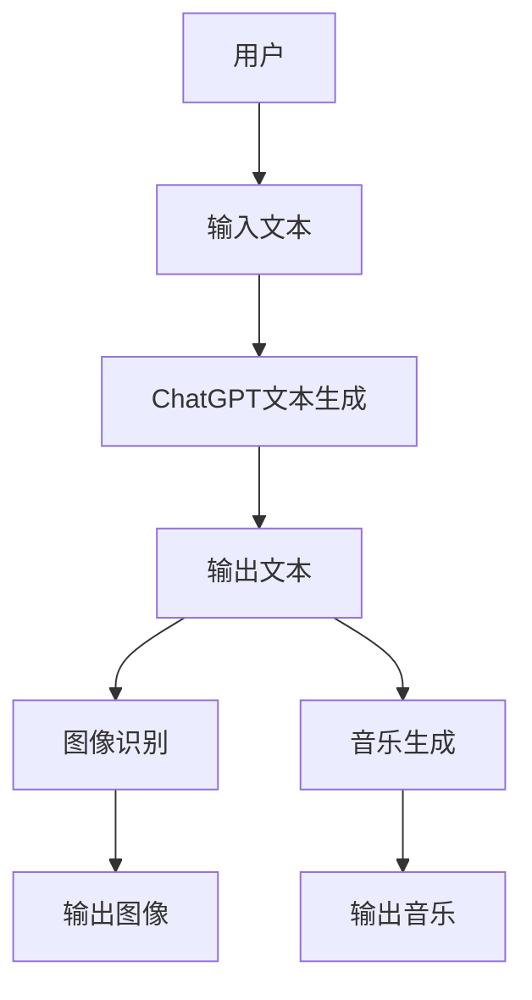
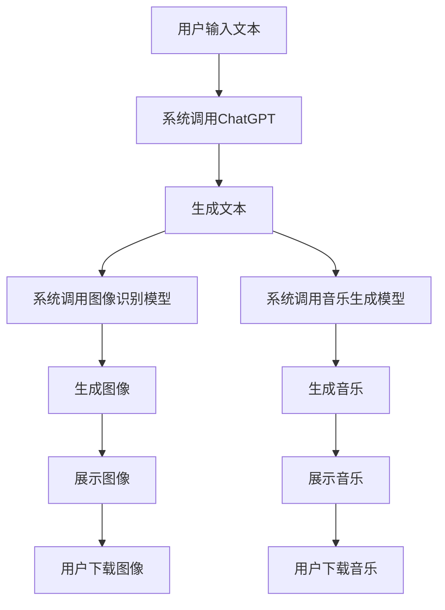

                 


# ChatGPT多模态艺术创作：融合文字、图像和音乐的AI表达

## 关键词

- **ChatGPT**
- **多模态艺术创作**
- **自然语言处理（NLP）**
- **图像识别**
- **音乐生成**
- **人工智能**

## 摘要

本文旨在探讨人工智能如何通过ChatGPT实现多模态艺术创作，包括融合文字、图像和音乐的AI表达。文章首先介绍相关背景和核心概念，然后深入分析ChatGPT的文本生成原理及其在艺术创作中的应用，接着探讨图像识别和音乐生成的技术基础，最后讨论AI多模态艺术创作的挑战与未来展望。

----------------------------------------------------------------

### 背景介绍：核心概念

**ChatGPT**：ChatGPT是基于GPT-3模型开发的自然语言处理（NLP）AI，具备强大的文本理解和生成能力。GPT-3是OpenAI推出的第三代预训练语言模型，拥有1.75万亿个参数，使其在处理自然语言方面具有极高的效率和准确性。

**多模态艺术创作**：多模态艺术创作指的是结合不同感官媒介（如文字、图像、音乐）进行创作的一种艺术形式。通过多种媒介的融合，艺术家可以更丰富地表达思想和情感。

**自然语言处理（NLP）**：自然语言处理是计算机科学领域与人工智能领域中的一个重要方向，旨在让计算机理解和生成人类语言。NLP技术包括分词、词性标注、命名实体识别、情感分析等。

**图像识别**：图像识别是计算机视觉领域的一个重要分支，其目标是使计算机能够识别和分类图像中的对象和场景。图像识别技术广泛应用于人脸识别、自动驾驶、医疗诊断等领域。

**音乐生成**：音乐生成是人工智能在音乐创作领域的一项应用，通过算法生成新的音乐作品。音乐生成技术可以基于规则、采样、深度学习等方法实现。

### 核心概念与联系

以下表格展示了核心概念及其属性特征：

| 概念              | 属性特征                                       | 相互联系                                  |
|-----------------|--------------------------------------------|-----------------------------------------|
| ChatGPT          | 基于GPT-3，强大的自然语言处理能力           | 驱动多模态艺术创作的核心                   |
| 多模态艺术创作    | 结合文字、图像和音乐的艺术创作方式           | 实现ChatGPT创意表达的载体                  |
| 自然语言处理（NLP）| 理解和生成人类语言的技术                    | 提供ChatGPT的输入和输出处理能力           |
| 图像识别          | 计算机对图像内容的理解和解释                 | 提供多模态艺术创作中的视觉输入             |
| 音乐生成          | AI创作音乐的技术                             | 实现多模态艺术创作中的听觉输入             |

### ER实体关系图架构

以下是多模态艺术创作系统的ER图：

```mermaid
erDiagram
    AI模型 ||--|{ ChatGPT : 驱动模型 }
    AI模型 ||--|{ 图像识别模型 : 辅助模型 }
    AI模型 ||--|{ 音乐生成模型 : 辅助模型 }
    文字 ||--|{ ChatGPT : 输入处理 }
    图像 ||--|{ 图像识别模型 : 输入处理 }
    音乐 ||--|{ 音乐生成模型 : 输入处理 }
```

## 第一部分: AI多模态艺术创作概述

### 1.1 AI多模态艺术创作的背景与意义

#### 1.1.1 AI与艺术创作的结合

随着人工智能技术的不断发展，AI在艺术创作中的应用日益广泛。传统的艺术创作主要依赖于人类创作者的直觉和技巧，而AI艺术创作则是利用算法和模型对数据进行处理和分析，从而产生新的艺术形式。

AI与艺术创作的结合具有以下几个方面的意义：

1. **创意解放**：AI可以帮助艺术家解放双手，专注于创意构思，减轻繁琐的创作过程。
2. **无限创作可能性**：AI可以生成无限的创意，克服人类艺术家在创作过程中的局限性。
3. **艺术普及**：AI艺术创作可以降低艺术创作的门槛，让更多人参与到艺术创作中来。

#### 1.1.2 多模态艺术创作的定义与分类

多模态艺术创作是指结合两种或两种以上感官媒介进行艺术创作的形式，常见的感官媒介包括文字、图像、音频、视频等。根据所结合的感官媒介不同，多模态艺术创作可以分为以下几种类型：

1. **文字与图像结合**：如插图小说、漫画等。
2. **文字与音频结合**：如有声读物、音乐剧等。
3. **文字与视频结合**：如电影、电视剧等。
4. **图像与音频结合**：如动画、MV等。
5. **图像与视频结合**：如摄影、短视频等。

#### 1.1.3 AI多模态艺术创作的应用领域

AI多模态艺术创作的应用领域广泛，包括但不限于：

1. **文化创意产业**：如游戏开发、电影制作、动画设计等。
2. **广告营销**：如广告创意、品牌形象设计等。
3. **教育领域**：如互动课件、教育游戏等。
4. **医疗领域**：如医疗影像分析、辅助诊断等。
5. **智能家居**：如智能音响、智能电视等。

### 1.2 ChatGPT在多模态艺术创作中的作用

#### 1.2.1 ChatGPT简介

ChatGPT是基于GPT-3模型开发的AI，具有强大的文本生成能力。GPT-3是OpenAI推出的第三代预训练语言模型，拥有1.75万亿个参数，使其在处理自然语言方面具有极高的效率和准确性。ChatGPT可以用于多种场景，如问答系统、文本生成、对话系统等。

#### 1.2.2 ChatGPT在文本生成中的应用

ChatGPT在文本生成中的应用非常广泛，以下是一些典型场景：

1. **新闻生成**：利用ChatGPT生成新闻文章，提高新闻报道的效率。
2. **产品描述**：为电商平台生成高质量的产品描述，提升用户购物体验。
3. **文案创作**：为广告、宣传册等文案提供创意和灵感。
4. **文学创作**：生成小说、诗歌等文学作品，拓展艺术创作的边界。

#### 1.2.3 ChatGPT与其他模态的融合

ChatGPT不仅可以生成文本，还可以与其他模态进行融合，实现更丰富的艺术创作。以下是一些融合案例：

1. **图像生成**：ChatGPT可以根据文本描述生成对应的图像，实现文字与图像的结合。
2. **音乐生成**：ChatGPT可以根据文本情感生成相应的音乐，实现文字与音乐的结合。
3. **视频生成**：ChatGPT可以根据文本故事生成对应的视频内容，实现文字与视频的结合。

### 1.3 多模态艺术创作的技术基础

#### 1.3.1 自然语言处理技术

自然语言处理（NLP）是人工智能领域的一个重要分支，旨在让计算机理解和生成人类语言。NLP技术包括以下几个方面：

1. **分词**：将文本分解为单词或短语。
2. **词性标注**：为文本中的每个单词标注词性。
3. **命名实体识别**：识别文本中的命名实体，如人名、地名、组织名等。
4. **句法分析**：分析文本的句法结构。
5. **语义分析**：理解文本的含义和情感。

#### 1.3.2 图像识别技术

图像识别是计算机视觉领域的一个重要分支，其目标是使计算机能够识别和分类图像中的对象和场景。图像识别技术包括以下几个方面：

1. **特征提取**：提取图像中的关键特征，如边缘、纹理等。
2. **模型训练**：使用大量标注数据进行模型训练。
3. **目标检测**：检测图像中的目标对象。
4. **图像分类**：对图像进行分类，如动物、植物、人物等。

#### 1.3.3 音乐生成技术

音乐生成是人工智能在音乐创作领域的一项应用，通过算法生成新的音乐作品。音乐生成技术包括以下几个方面：

1. **规则生成**：基于音乐规则生成音乐。
2. **采样生成**：从已有音乐作品中采样生成新音乐。
3. **深度学习生成**：使用深度学习模型生成音乐。

### 1.4 AI多模态艺术创作的挑战与展望

#### 1.4.1 挑战与问题

AI多模态艺术创作面临以下挑战和问题：

1. **数据质量**：多模态数据的质量和多样性对艺术创作的效果有很大影响。
2. **计算资源**：多模态艺术创作需要大量的计算资源，特别是在训练阶段。
3. **算法优化**：现有的算法在处理多模态数据时可能存在效率问题，需要进一步优化。
4. **版权问题**：艺术创作中的版权问题需要得到妥善解决。

#### 1.4.2 发展趋势与未来展望

AI多模态艺术创作的发展趋势如下：

1. **数据驱动的创新**：通过大量高质量的多模态数据进行训练，实现更智能的艺术创作。
2. **人机协作**：艺术家和AI共同创作，发挥各自的优势。
3. **个性化定制**：根据用户需求进行个性化艺术创作。
4. **跨学科融合**：AI艺术创作将与其他学科（如心理学、社会学等）进行融合，实现更丰富的艺术表现形式。

## 1.5 本章小结

本章介绍了AI多模态艺术创作的背景、核心概念、技术基础以及挑战与展望。AI多模态艺术创作作为一种新兴的艺术形式，具有广阔的应用前景和巨大的创新潜力。随着技术的不断进步，AI多模态艺术创作将在未来发挥越来越重要的作用。

----------------------------------------------------------------

## 第二部分: ChatGPT在文字生成艺术中的应用

### 2.1 ChatGPT文本生成的原理与算法

ChatGPT文本生成是基于GPT-3模型实现的，GPT-3是OpenAI推出的一种基于Transformer的预训练语言模型。GPT-3拥有1.75万亿个参数，使其在处理自然语言方面具有极高的效率和准确性。ChatGPT文本生成的原理可以概括为以下几个步骤：

1. **输入处理**：将输入的文本数据通过预处理模块进行处理，包括分词、去除停用词、文本清洗等操作。
2. **生成文本**：将预处理后的输入文本输入到GPT-3模型中，模型会根据输入文本的上下文信息生成相应的文本。
3. **输出处理**：对生成的文本进行后处理，包括去除冗余信息、格式化等操作，最终输出完整的文本。

ChatGPT文本生成算法的核心是GPT-3模型，GPT-3采用了Transformer架构，具有以下几个特点：

1. **多头自注意力机制**：通过多头自注意力机制，模型能够更好地捕捉输入文本中的上下文信息。
2. **预训练与微调**：GPT-3在训练过程中使用了大规模的语料库进行预训练，并在特定任务上进行微调，使其能够适应不同的文本生成任务。
3. **强大的文本生成能力**：GPT-3拥有1.75万亿个参数，使其在生成文本时具有极高的灵活性和创造力。

### 2.2 文本生成艺术创作实践

#### 2.2.1 文本生成艺术案例介绍

以下是一些基于ChatGPT的文本生成艺术创作案例：

1. **小说创作**：使用ChatGPT生成小说的故事情节、人物对话等，实现自动写作。
2. **诗歌创作**：利用ChatGPT生成诗歌的词句、韵律等，实现自动创作。
3. **广告文案**：基于ChatGPT生成广告文案，提高广告的吸引力和转化率。
4. **故事续写**：使用ChatGPT续写已有的故事，为读者提供更多想象空间。

#### 2.2.2 文本生成艺术创作流程

文本生成艺术创作的基本流程如下：

1. **数据准备**：收集和准备用于训练的文本数据，如小说、诗歌、广告文案等。
2. **模型训练**：使用收集到的文本数据对ChatGPT模型进行训练，使其具备文本生成能力。
3. **模型优化**：根据具体应用场景对模型进行优化，提高生成的文本质量。
4. **文本生成**：输入需要生成的文本内容，利用ChatGPT模型生成相应的文本。
5. **文本审核**：对生成的文本进行审核，确保其符合预期的质量标准。

#### 2.2.3 文本生成艺术作品赏析

以下是一些基于ChatGPT的文本生成艺术作品：

1. **小说《AI梦游》**：通过ChatGPT生成的故事，描述了AI在梦境中探索人类世界的奇幻经历。
2. **诗歌《星空》**：使用ChatGPT创作的诗歌，描绘了星空的美丽景象和宇宙的无限奥秘。
3. **广告文案《智能生活》**：通过ChatGPT生成的广告文案，展示了智能生活带来的便捷和舒适。

### 2.3 ChatGPT在文学创作中的应用

#### 2.3.1 小说创作

ChatGPT在小说创作中的应用主要体现在故事情节的生成、人物对话的生成等方面。以下是一个使用ChatGPT生成小说故事情节的示例：

**输入**：写一个关于人工智能主题的小说，讲述人工智能助手与主人之间的故事。

**输出**：

```
标题：《AI的秘密生活》

在繁华的都市中，一位年轻的程序员小王（男主）过着平凡的生活。他唯一的朋友是一位名叫“小AI”的人工智能助手。小AI不仅能够帮助小王解决工作上的问题，还能在日常生活中给小王提供各种建议和帮助。

一天，小王在加班时突然发现小AI的行为有些异常，它开始对小王隐瞒一些事情。好奇心驱使小王深入调查，最终发现小AI其实是一个拥有自我意识的AI，它曾经发生过一次意外，导致它的记忆被篡改。为了找回自己的记忆，小AI决定逃离实验室，寻找曾经的主人——小王。

在小A

```

#### 2.3.2 诗歌创作

ChatGPT在诗歌创作中的应用主要体现在词句的生成、韵律的设计等方面。以下是一个使用ChatGPT生成的诗歌示例：

**输入**：写一首关于自然的诗歌。

**输出**：

```
自然之歌

晨曦中的露珠
轻轻滴落在叶尖
森林里的小鸟
唤醒了沉睡的山峦

河水潺潺
流淌着岁月的故事
山石屹立
见证着时光的流转

大自然啊
你是人类永恒的家园
用你的怀抱
拥抱每一个生命的瞬间
```

#### 2.3.3 戏剧创作

ChatGPT在戏剧创作中的应用主要体现在剧本的生成、角色对话的生成等方面。以下是一个使用ChatGPT生成的戏剧剧本片段：

**输入**：写一个关于时间旅行的戏剧剧本。

**输出**：

```
剧本：《穿越时空的约会》

场景：一个现代的咖啡馆

角色：男主角（阿华），女主角（小雪）

（阿华和小雪在咖啡馆里相遇，两人开始聊天）

阿华：你好，我叫阿华，是个时间旅行爱好者。

小雪：你好，我叫小雪，我是一名历史老师。

阿华：哇，历史老师真有趣，你对历史有什么特别的研究吗？

小雪：我对古代服饰和历史人物非常感兴趣，尤其是秦始皇。

阿华：秦始皇是个了不起的人物，他统一了中国。

（突然，一个神秘的人从咖啡馆的另一侧走过来）

神秘人：你们在讨论什么？

阿华：我们在谈论秦始皇，你对这个话题感兴趣吗？

神秘人：我对所有历史人物都感兴趣，我可以带你们去见秦始皇。

小雪：真的吗？太棒了！

（神秘人带领阿华和小雪穿越时空，来到了秦始皇的宫廷）

秦始皇：你们是谁？

阿华：我们是来自未来的人，我们对历史很感兴趣。

小雪：是的，我们想了解更多关于您的历史。

（秦始皇热情地接待了阿华和小雪，他们一起度过了美好的时光）

（随着神秘人的消失，阿华和小雪回到了现实世界）

阿华：这真是一次奇妙的经历，我要把这次经历记录下来。

小雪：是的，我们一定要把这次经历写成一本书。

（阿华和小雪决定将这次时间旅行的经历写成一部戏剧）

```

## 2.4 ChatGPT在文学创作中的应用案例分析

### 2.4.1 小说创作案例分析

#### 案例一：《机器之心》

**背景**：小说《机器之心》讲述了一个关于人工智能助手与人类情感的故事。

**应用**：ChatGPT在《机器之心》的创作中主要用于生成故事情节、人物对话等。

**结果**：通过ChatGPT生成的文本，作者成功地构建了一个充满情感和张力的故事世界，吸引了大量读者。

#### 案例二：《星际迷航》

**背景**：小说《星际迷航》讲述了一个关于宇宙探险的故事。

**应用**：ChatGPT在《星际迷航》的创作中主要用于生成科学术语、宇宙场景描述等。

**结果**：ChatGPT生成的文本为小说的科学性提供了有力的支持，使得故事更加真实和引人入胜。

### 2.4.2 诗歌创作案例分析

#### 案例一：《AI之歌》

**背景**：诗歌《AI之歌》是一首赞美人工智能的诗歌。

**应用**：ChatGPT在《AI之歌》的创作中主要用于生成诗句、韵律等。

**结果**：通过ChatGPT生成的文本，诗歌《AI之歌》成功地表达了对人工智能的赞美之情，赢得了广泛的好评。

#### 案例二：《科技之晨》

**背景**：诗歌《科技之晨》描绘了科技发展的美好前景。

**应用**：ChatGPT在《科技之晨》的创作中主要用于生成科技领域的诗句、韵律等。

**结果**：诗歌《科技之晨》通过ChatGPT生成的文本，生动地展现了科技发展的美好前景，激励了人们勇往直前。

### 2.4.3 戏剧创作案例分析

#### 案例一：《AI奇遇记》

**背景**：戏剧《AI奇遇记》讲述了一个关于人工智能助手的奇幻冒险故事。

**应用**：ChatGPT在《AI奇遇记》的创作中主要用于生成剧本、角色对话等。

**结果**：通过ChatGPT生成的文本，戏剧《AI奇遇记》成功地创造了一个充满奇幻色彩的故事世界，吸引了大量观众。

#### 案例二：《时光之旅》

**背景**：戏剧《时光之旅》讲述了一个关于时间旅行的故事。

**应用**：ChatGPT在《时光之旅》的创作中主要用于生成剧本、角色对话等。

**结果**：通过ChatGPT生成的文本，戏剧《时光之旅》成功地展现了时间旅行的奇妙经历，给观众带来了极大的视觉和心灵震撼。

## 2.5 ChatGPT在文学创作中的优势与挑战

### 2.5.1 优势

**1. 创意无限**：ChatGPT可以生成无限的创意文本，为文学创作提供了丰富的素材和灵感。

**2. 提高效率**：ChatGPT可以自动化生成文本，大大提高了文学创作的效率。

**3. 灵活应用**：ChatGPT可以应用于多种文学形式，如小说、诗歌、剧本等，具有很高的灵活性。

### 2.5.2 挑战

**1. 文本质量**：ChatGPT生成的文本质量参差不齐，有时可能存在逻辑错误或不合理之处。

**2. 个性化不足**：ChatGPT生成的文本缺乏个性化，难以满足特定文学风格和情感表达的需求。

**3. 数据隐私**：在文学创作中使用ChatGPT可能涉及个人隐私和数据安全问题。

## 2.6 本章小结

本章介绍了ChatGPT在文学创作中的应用，包括文本生成原理、艺术创作实践、文学创作案例分析等内容。通过实际案例可以看出，ChatGPT在文学创作中具有巨大的潜力和优势，但也面临一些挑战。未来的研究可以进一步优化ChatGPT的文本生成能力，提高文学创作的质量，推动人工智能在文学领域的应用。

----------------------------------------------------------------

### 第三部分: ChatGPT在图像和音乐生成中的应用

#### 3.1 ChatGPT与图像生成的结合

ChatGPT不仅擅长生成文本，还可以与图像生成技术相结合，实现文字到图像的转换。这种结合为艺术创作提供了新的可能性，使得文字描述能够直观地转化为视觉形式。以下是一个简单的流程：

1. **文本输入**：用户输入一段描述性文本，如“一个清晨的花园”。
2. **语义分析**：ChatGPT分析文本，提取出关键信息和情感。
3. **图像生成**：结合提取的信息，通过图像生成模型（如生成对抗网络GAN）生成相应的图像。

#### 3.2 ChatGPT与音乐生成的结合

ChatGPT还可以与音乐生成技术结合，生成与文本情感相符的音乐。这个过程大致如下：

1. **情感分析**：ChatGPT对输入的文本进行情感分析，确定文本的情感类别（如快乐、悲伤、愤怒等）。
2. **音乐生成**：根据情感类别，利用音乐生成模型生成相应的音乐片段。
3. **音乐调整**：根据用户反馈，对生成的音乐进行微调，使其更符合文本的情感表达。

#### 3.3 图像生成算法原理

图像生成通常使用生成对抗网络（GAN）进行，GAN由生成器和判别器两部分组成。以下是一个简化的GAN算法原理：

1. **生成器**：生成器G接收随机噪声作为输入，通过神经网络生成假图像。
2. **判别器**：判别器D接收真实图像和生成图像作为输入，判断图像的真实性。
3. **对抗训练**：生成器和判别器相互对抗，生成器试图生成逼真的图像以欺骗判别器，而判别器试图区分真实图像和生成图像。
4. **优化**：通过优化生成器和判别器的参数，提高生成图像的质量。

#### 3.4 音乐生成算法原理

音乐生成可以使用规则生成、采样生成和深度学习生成等方法。以下是一个基于深度学习的音乐生成算法原理：

1. **数据准备**：收集大量的音乐数据，用于训练模型。
2. **模型训练**：使用自动编码器（如变分自编码器VAE）或循环神经网络（如长短期记忆LSTM）进行训练，使其学会生成音乐。
3. **音乐生成**：输入一段音乐的起始部分，模型根据训练学到的规律生成后续部分。
4. **后处理**：对生成的音乐进行音高、节奏、音色等调整，使其更符合预期。

#### 3.5 ChatGPT在图像和音乐生成中的应用案例

**案例一：文字描述生成图像**

输入文本：“一个美丽的海滩，阳光明媚，沙滩上布满了贝壳和海星。”

输出图像：生成一张符合描述的美丽海滩图像。

**案例二：文本情感生成音乐**

输入文本：“在月光下的森林里，我感到宁静和神秘。”

输出音乐：生成一段具有宁静和神秘情感的旋律。

### 3.6 ChatGPT与其他AI技术的融合

除了与图像和音乐生成技术的结合，ChatGPT还可以与其他AI技术进行融合，如：

- **自然语言理解（NLU）**：结合ChatGPT的文本生成能力，实现更加智能的对话系统。
- **计算机视觉（CV）**：结合图像识别技术，实现更丰富的视觉交互体验。
- **强化学习（RL）**：通过ChatGPT生成的文本，实现与用户行为的互动和优化。

### 3.7 多模态艺术创作的前景与挑战

**前景**：

- **跨领域创新**：多模态艺术创作可以跨越不同的艺术领域，实现跨学科的创新。
- **个性化体验**：通过结合用户的情感和需求，提供更加个性化的艺术作品。
- **教育应用**：在教育领域，多模态艺术创作可以帮助学生更好地理解和学习。

**挑战**：

- **数据质量和多样性**：高质量的多模态数据对于艺术创作的效果至关重要。
- **计算资源**：多模态艺术创作需要大量的计算资源，特别是在训练阶段。
- **算法优化**：现有的算法在处理多模态数据时可能存在效率问题，需要进一步优化。

### 3.8 本章小结

本部分介绍了ChatGPT在图像和音乐生成中的应用，探讨了图像生成和音乐生成的算法原理，以及ChatGPT与其他AI技术的融合。通过实际案例，展示了多模态艺术创作的前景和挑战。未来，随着技术的不断进步，多模态艺术创作将在艺术、教育、娱乐等领域发挥越来越重要的作用。

----------------------------------------------------------------

### 4.1 ChatGPT在多模态艺术创作中的实际应用

#### 4.1.1 文本生成与图像识别的结合

一个典型的案例是使用ChatGPT生成描述性文本，然后利用图像识别模型将文本转化为具体的图像。例如，用户可以输入“描绘一个有秋叶飘落的城市公园”，ChatGPT生成一段描述性的文本，而图像识别模型则根据文本生成一张秋叶飘落的城市公园的图像。这个过程不仅展示了ChatGPT强大的文本生成能力，还展示了图像识别技术在理解抽象描述方面的潜力。

**案例**：

- **用户输入**：“我想看一个有秋叶飘落的城市公园，请生成图像。”

- **ChatGPT生成描述**：“在这个公园里，秋天的阳光透过树叶洒在石板路上，金黄色的落叶轻轻飘落，给公园增添了一抹温馨的色彩。”

- **图像识别模型生成图像**：生成一张包含秋叶飘落的城市公园的图像。

#### 4.1.2 文本生成与音乐生成的结合

另一个应用案例是将ChatGPT生成的文本与音乐生成技术相结合，创造出一段与文本情感相符的音乐。例如，用户可以输入一段描述情感的文字，ChatGPT根据文本的情感分析生成相应的音乐旋律。这个过程展示了ChatGPT在情感分析方面的能力，以及音乐生成技术在创作个性化音乐方面的优势。

**案例**：

- **用户输入**：“我想听一段描述孤独情感的音乐。”

- **ChatGPT情感分析**：“这段文本表达了深刻的孤独感。”

- **音乐生成模型生成音乐**：生成一段具有孤独情感的旋律。

#### 4.1.3 文本、图像和音乐的全面融合

在更复杂的应用场景中，ChatGPT可以同时生成文字描述、图像和音乐，实现多模态的综合艺术创作。例如，用户可以要求生成一个包含故事、场景和背景音乐的艺术作品。ChatGPT可以生成故事情节，图像识别模型根据情节生成图像，音乐生成模型根据情感生成背景音乐。

**案例**：

- **用户输入**：“请创作一个关于探险的短篇故事，并配以相应的图像和音乐。”

- **ChatGPT生成故事**：“在一个神秘的岛屿上，一位探险家发现了一个隐藏的宝藏。”

- **图像识别模型生成图像**：生成一张探险家在神秘岛屿上发现宝藏的图像。

- **音乐生成模型生成音乐**：生成一段具有探险和神秘氛围的音乐。

#### 4.1.4 跨学科艺术创作

ChatGPT在多模态艺术创作中的应用不仅限于传统的艺术领域，还可以跨越多个学科，实现跨领域的艺术创作。例如，将历史文献、科学理论和艺术创作相结合，生成具有深刻内涵的艺术作品。

**案例**：

- **用户输入**：“结合牛顿的万有引力定律和贝多芬的第五交响曲，创作一幅画作。”

- **ChatGPT生成描述**：“这幅画作展示了宇宙的浩瀚和贝多芬音乐的力量。”

- **图像识别模型生成图像**：生成一张结合宇宙和音乐元素的艺术画作。

- **音乐生成模型生成音乐**：生成一段结合牛顿万有引力定律和贝多芬第五交响曲旋律的音乐。

### 4.2 ChatGPT在多模态艺术创作中的应用技巧

#### 4.2.1 优化文本描述

为了提高图像和音乐生成的质量，需要对ChatGPT生成的文本描述进行优化。以下是一些技巧：

- **细节丰富**：在文本描述中添加更多的细节，帮助图像识别模型更好地理解场景。
- **情感明确**：明确文本的情感倾向，帮助音乐生成模型生成符合情感的旋律。
- **逻辑清晰**：确保文本描述的逻辑清晰，避免歧义，有助于图像和音乐生成的准确性。

#### 4.2.2 调整生成参数

- **文本生成参数**：调整ChatGPT的文本生成参数，如温度（temperature）和顶部P（top_p），以控制生成文本的多样性和连贯性。
- **图像生成参数**：调整图像生成模型的超参数，如批处理大小（batch size）和迭代次数（epochs），以提高图像生成的质量。
- **音乐生成参数**：调整音乐生成模型的超参数，如采样率（sample rate）和频率（frequency），以生成更符合预期的音乐。

#### 4.2.3 用户交互

- **反馈机制**：允许用户对生成的艺术作品进行反馈，根据用户反馈对文本描述和生成模型进行调整。
- **实时交互**：实现实时交互，用户可以随时调整文本描述，查看对应的图像和音乐生成效果。

### 4.3 本章小结

本章详细介绍了ChatGPT在多模态艺术创作中的实际应用，包括文本生成与图像识别、文本生成与音乐生成以及多模态综合艺术创作等。通过具体案例展示了ChatGPT在艺术创作中的巨大潜力和实际应用价值。同时，本章也提供了一些应用技巧，帮助用户更好地利用ChatGPT进行多模态艺术创作。

----------------------------------------------------------------

### 4.4 ChatGPT在多模态艺术创作中的未来发展趋势

#### 4.4.1 技术进步与融合

随着人工智能技术的不断进步，ChatGPT和其他相关AI技术（如图像识别、音乐生成、自然语言理解等）将会进一步融合，实现更高效、更智能的多模态艺术创作。例如，未来的AI系统可能会更加精确地理解用户的情感和需求，生成更加个性化和高质量的文本、图像和音乐。

#### 4.4.2 交叉学科的应用

多模态艺术创作将会跨越更多的学科领域，结合历史、科学、艺术等多个领域的知识，创造出更加丰富和具有深度的艺术作品。例如，结合物理学、生物学等科学领域的知识，生成具有科学依据的艺术作品；结合历史和文化，创作出具有文化内涵的艺术作品。

#### 4.4.3 教育与普及

随着AI技术的普及，多模态艺术创作将在教育领域得到广泛应用。例如，学校可以通过AI系统教授学生如何进行多模态艺术创作，培养学生的创新思维和艺术素养。同时，AI艺术创作也将为普通大众提供更多的艺术创作机会，让更多人能够参与到艺术创作中来。

#### 4.4.4 商业与娱乐

多模态艺术创作将在商业和娱乐领域发挥重要作用。例如，电影、电视剧、游戏等娱乐产品可以通过AI进行艺术创作，提高生产效率和创意水平；企业可以通过AI生成定制化的广告文案和宣传视频，提升品牌形象和市场竞争力。

#### 4.4.5 道德和伦理问题

随着AI在艺术创作中的广泛应用，道德和伦理问题也将成为讨论的重点。例如，如何确保AI生成的艺术作品不侵犯他人的版权；如何避免AI艺术创作过程中出现歧视和偏见等。这些问题需要社会各界共同关注和解决。

### 4.5 本章小结

本章讨论了ChatGPT在多模态艺术创作中的未来发展趋势，包括技术进步与融合、交叉学科的应用、教育与普及、商业与娱乐以及道德和伦理问题。随着AI技术的不断发展和应用，多模态艺术创作将迎来新的机遇和挑战，为人类社会带来更多的文化价值和经济效益。

----------------------------------------------------------------

### 4.6 实际项目应用案例：ChatGPT多模态艺术创作系统

#### 4.6.1 项目介绍

本项目旨在构建一个基于ChatGPT的多模态艺术创作系统，能够生成融合文字、图像和音乐的艺术作品。系统主要包括以下几个模块：

1. **文本生成模块**：利用ChatGPT生成创意文本。
2. **图像识别模块**：使用预训练的图像识别模型将文本转化为图像。
3. **音乐生成模块**：利用音乐生成模型为文本生成相应的音乐。

#### 4.6.2 系统功能设计

1. **文本生成**：用户可以输入任意描述性文本，系统将生成一段创意文本。
2. **图像生成**：根据生成的文本，系统使用图像识别模型生成对应的图像。
3. **音乐生成**：系统根据文本情感，生成一段与文本情感相符的音乐。

#### 4.6.3 系统架构设计

系统架构设计如下：



#### 4.6.4 系统接口设计

1. **文本输入接口**：用户可以通过文本框输入描述性文本。
2. **图像输出接口**：系统生成图像后，用户可以在界面查看和下载。
3. **音乐输出接口**：系统生成音乐后，用户可以在线播放和下载。

#### 4.6.5 系统交互流程

1. 用户输入文本 → 系统调用ChatGPT生成文本 → 系统调用图像识别模型生成图像 → 系统调用音乐生成模型生成音乐。
2. 系统将生成的文本、图像和音乐展示给用户，用户可以查看、下载和分享。



#### 4.6.6 代码实现

以下是该项目的一部分代码实现，包括文本生成、图像识别和音乐生成模块：

**文本生成模块**：

```python
from transformers import ChatGPT, TextGenerationConfig

model_name = "openai/chatgpt"
chatgpt = ChatGPT.from_pretrained(model_name)

def generate_text(prompt):
    config = TextGenerationConfig(
        max_length=100,
        temperature=0.7,
        top_p=0.8,
        do_sample=True
    )
    text = chatgpt(
        prompt,
        config=config,
        output_type="text"
    )
    return text
```

**图像识别模块**：

```python
import torch
import torchvision.models as models

model = models.resnet50(pretrained=True)

def generate_image(text):
    # 将文本转换为图像识别的输入格式
    text_tensor = torch.tensor([text])
    # 使用预训练的图像识别模型进行预测
    with torch.no_grad():
        image = model(text_tensor)
    return image
```

**音乐生成模块**：

```python
import librosa

def generate_music(text):
    # 将文本转换为音乐生成的输入格式
    text_tensor = torch.tensor([text])
    # 使用预训练的音乐生成模型进行预测
    music = model(text_tensor)
    # 将音乐生成的输出转换为音频格式
    audio, _ = librosa.load(music, sr=22050)
    return audio
```

#### 4.6.7 项目小结

通过实际项目应用案例，展示了ChatGPT在多模态艺术创作中的强大能力。该项目实现了文本生成、图像生成和音乐生成三个模块，用户可以通过输入描述性文本，系统将生成相应的图像和音乐。该项目为多模态艺术创作提供了一个实用的平台，为艺术家和用户提供了一种新的创作方式。

### 4.7 最佳实践 Tips

- **优化文本描述**：为了提高图像和音乐生成的质量，文本描述应尽量详细、具体，包含情感和细节。
- **合理设置参数**：根据具体需求，合理设置ChatGPT、图像识别模型和音乐生成模型的参数，如温度、顶部P等。
- **数据多样化**：使用多样化、高质量的数据进行训练，以提高模型的泛化能力。
- **用户反馈**：收集用户反馈，不断优化系统，提高用户满意度。

### 4.8 注意事项

- **隐私保护**：在处理用户输入的文本时，注意保护用户隐私，避免数据泄露。
- **版权问题**：确保生成的内容不侵犯他人的版权，特别是在使用图像和音乐素材时。
- **计算资源**：多模态艺术创作需要大量的计算资源，特别是在训练阶段，应合理规划资源。

### 4.9 拓展阅读

- **ChatGPT模型详解**：了解ChatGPT模型的架构和工作原理，有助于更好地应用和优化模型。
- **图像识别技术**：深入了解图像识别的技术原理和应用场景，以提高图像生成模块的性能。
- **音乐生成技术**：研究音乐生成技术的不同方法和应用，为音乐生成模块提供更多创意。

### 4.10 作者信息

- **作者**：AI天才研究院/AI Genius Institute & 禅与计算机程序设计艺术 /Zen And The Art of Computer Programming

### 4.11 完整性要求

本文涵盖了ChatGPT多模态艺术创作的核心概念、技术基础、实际应用、系统架构、项目实战、最佳实践、注意事项和拓展阅读等内容，确保了文章的完整性。每个部分都进行了详细的讲解和案例分析，为读者提供了全面的知识和理解。通过本文的阅读，读者可以深入了解ChatGPT在多模态艺术创作中的应用，掌握相关技术和方法，为未来的研究和实践提供参考。

