                 

## 引言与背景介绍

### 第1章: 问题的背景与核心概念

#### 1.1 问题背景

随着人工智能技术的快速发展，人工智能在各个领域的应用日益广泛，其中一个备受瞩目的领域便是虚拟现实与增强现实（VR/AR）。虚拟导游作为VR/AR技术的重要应用之一，正逐步改变着人们的旅游体验方式。在传统旅游中，游客往往需要依赖导游的口述和书面资料来了解景点的历史背景、文化内涵和地理信息。然而，这种方式往往存在信息获取的局限性、互动性不强等问题。随着技术的进步，特别是人工智能和大数据技术的应用，多模态虚拟导游系统应运而生，它能够通过整合语音、文本、图像等多种感官信息，为游客提供更加丰富、生动和沉浸式的旅游体验。

#### 1.2 核心概念

- **ChatGPT**: ChatGPT是由OpenAI开发的一种基于GPT-3模型的人工智能助手，它能够理解和生成自然语言，并在各种场景下进行对话。ChatGPT的出现，为多模态虚拟导游系统的对话生成和交互能力提供了强有力的支持。

- **多模态虚拟导游**: 多模态虚拟导游是一种集成了语音、文本、图像等多种感官信息的虚拟导游系统。它可以通过语音识别技术理解游客的提问，利用自然语言处理技术生成回答，并通过语音合成技术将回答传递给游客。同时，系统还可以结合图像识别技术，为游客提供实景导览服务。

- **历史、文化与地理信息**: 历史与文化信息涉及到景点背后的故事、传统习俗、文化遗产等内容；地理信息则包括景点的地理位置、地形地貌、气候条件等。这些信息是构建多模态虚拟导游系统的重要数据源，它们为系统提供了丰富的内容基础，使得虚拟导游能够为游客提供更加深入和全面的讲解。

通过以上背景和核心概念的介绍，我们可以看到，多模态虚拟导游系统不仅是一种技术的创新，更是对传统旅游方式的一次革命。它通过人工智能技术，将历史、文化和地理信息深度融合，为游客带来全新的旅游体验。接下来，我们将进一步探讨ChatGPT和多模态虚拟导游之间的联系，以及如何实现历史、文化和地理信息的整合，为读者呈现一个全面、系统的多模态虚拟导游解决方案。

### 第2章: 核心概念与联系

#### 2.1 ChatGPT的工作原理

ChatGPT是基于大型语言模型GPT-3开发的人工智能助手，其工作原理主要涉及模型架构、训练过程以及自然语言生成。

**模型架构**

ChatGPT采用了Transformer模型作为其基础架构。Transformer模型是一种基于注意力机制的深度神经网络模型，其核心思想是利用注意力机制来动态地计算输入序列中的相关关系。ChatGPT的模型结构包括输入层、编码层和解码层。输入层负责接收文本数据，编码层则对输入数据进行编码，解码层则根据编码层的输出生成文本回答。其结构可以用下面的mermaid流程图来表示：

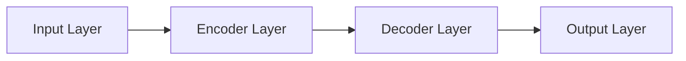

**训练过程**

ChatGPT的训练过程主要包括两个阶段：预训练和微调。在预训练阶段，模型使用大量的无标注文本数据进行训练，学习自然语言的基本规律。在微调阶段，模型会利用特定的任务数据进行进一步训练，以适应特定应用场景的需求。预训练和微调的过程可以用下面的mermaid流程图来表示：

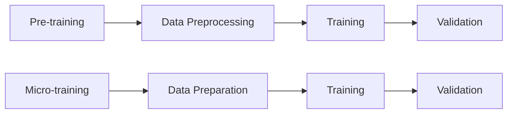

**自然语言生成**

ChatGPT的自然语言生成过程主要包括输入处理、编码、解码和输出处理。输入处理阶段，模型对输入文本进行预处理，如分词、词性标注等。编码阶段，模型将预处理后的文本转换为编码序列。解码阶段，模型根据编码序列生成文本回答。输出处理阶段，模型将生成的文本进行后处理，如去除标点符号、纠正拼写错误等。自然语言生成过程可以用下面的mermaid流程图来表示：

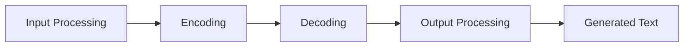

**Python源代码示例**

以下是一个简单的Python源代码示例，展示了如何使用ChatGPT进行自然语言生成：

```python
import openai

# 设置API密钥
openai.api_key = "your-api-key"

# 定义输入文本
input_text = "请介绍一下长城的历史。"

# 调用ChatGPT模型生成回答
response = openai.Completion.create(
  engine="text-davinci-002",
  prompt=input_text,
  max_tokens=50
)

# 输出生成回答
print(response.choices[0].text.strip())
```

通过以上对ChatGPT的工作原理的详细分析，我们可以看到，ChatGPT不仅在模型架构和训练过程上有着强大的支持，同时在自然语言生成方面也有着出色的表现。这为多模态虚拟导游系统的实现提供了坚实的基础。

#### 2.2 多模态虚拟导游的实现

**感知与交互**

多模态虚拟导游系统的感知与交互过程是其核心功能之一。该过程涉及到语音识别、文本处理和图像识别等多个环节。通过语音识别技术，系统可以理解游客的口头提问；通过文本处理技术，系统可以对游客的文本提问进行理解和回答；通过图像识别技术，系统可以为游客提供实景导览服务。下面是一个简单的mermaid流程图，展示了多模态虚拟导游的感知与交互过程：

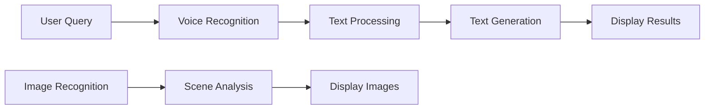

**数据处理与融合**

在多模态虚拟导游系统中，数据处理的融合至关重要。系统需要将语音、文本和图像等多种类型的数据进行整合，以提供一致的旅游体验。下面是一个简单的mermaid流程图，展示了数据处理与融合的过程：

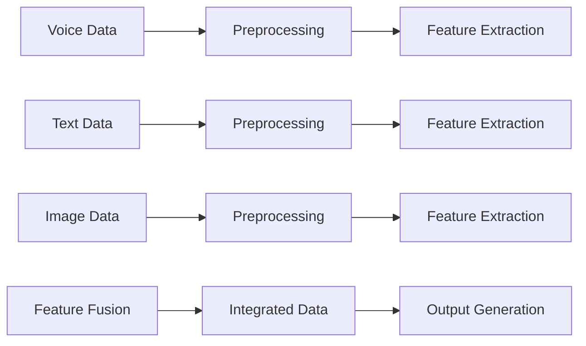

**Python源代码示例**

以下是一个简单的Python源代码示例，展示了如何使用多种技术实现多模态虚拟导游的基本功能：

```python
import speech_recognition as sr
import pyttsx3
import cv2
import tensorflow as tf
from tensorflow.keras.models import load_model

# 初始化语音识别引擎
recognizer = sr.Recognizer()

# 初始化语音合成引擎
engine = pyttsx3.init()

# 加载图像识别模型
image_model = load_model('image_recognition_model.h5')

# 处理语音数据
def process_voice_data(audio_data):
    try:
        text = recognizer.recognize_google(audio_data)
        return text
    except sr.UnknownValueError:
        return "无法理解语音"

# 处理文本数据
def process_text_data(text):
    # 使用ChatGPT生成回答
    response = openai.Completion.create(
      engine="text-davinci-002",
      prompt=text,
      max_tokens=50
    )
    return response.choices[0].text.strip()

# 处理图像数据
def process_image_data(image_path):
    image = cv2.imread(image_path)
    # 使用图像识别模型进行预测
    prediction = image_model.predict(image)
    return prediction

# 主函数
def main():
    while True:
        # 处理语音提问
        with sr.Microphone() as source:
            print("请提问：")
            audio_data = recognizer.listen(source)
            text_query = process_voice_data(audio_data)

        # 处理文本提问
        text_response = process_text_data(text_query)

        # 处理图像请求
        image_request = input("是否需要图像分析？（是/否）:")
        if image_request.lower() == '是':
            image_path = input("请输入图像路径：")
            image_response = process_image_data(image_path)
            print("图像分析结果：", image_response)

        # 输出回答
        engine.say(text_response)
        engine.runAndWait()

# 执行主函数
if __name__ == "__main__":
    main()
```

通过以上对ChatGPT和多模态虚拟导游实现的详细讲解，我们可以看到，这两个核心概念是如何相互联系并共同作用的。ChatGPT提供了强大的自然语言处理能力，而多模态虚拟导游则通过整合语音、文本和图像等多种感官信息，为游客提供了沉浸式的旅游体验。这种结合不仅提升了系统的交互性和用户体验，也开辟了人工智能在旅游业的新应用场景。

#### 2.3 历史文化与地理信息的整合

**数据来源**

构建多模态虚拟导游系统需要大量的历史、文化和地理信息。这些信息可以从多个数据源获取：

1. **历史文献**：包括各种历史书籍、档案、文献等，这些文献可以提供丰富的历史背景和文化传承。
2. **文化资料**：如博物馆、图书馆和艺术馆等机构的收藏，以及民俗文化研究资料。
3. **地理信息系统（GIS）**：通过GIS可以获取景点的地理位置、地形地貌、气候条件等地理信息。

**整合方法**

为了将历史、文化和地理信息有效地整合到多模态虚拟导游系统中，可以采用以下方法：

1. **数据预处理**：对收集到的各种数据源进行清洗、标准化和格式化，使其符合系统的数据规范。

2. **实体关系图**：使用mermaid ER实体关系图来表示历史、文化和地理信息之间的关系。例如，可以使用以下mermaid ER图来展示景点、历史事件和文化活动之间的关系：

    ```mermaid
    erDiagram
    热门景点 ||--|{ 历史事件 } : 发生在
    热门景点 ||--|{ 文化活动 } : 举办于
    历史事件 ||--|{ 文化遗产 } : 代表
    文化活动 ||--|{ 传统习俗 } : 相关
    ```

3. **知识图谱**：利用知识图谱来表示和整合多模态数据，从而提供更直观和关联性的信息展示。例如，可以使用以下mermaid知识图谱来展示历史事件和文化活动之间的关联：

    ```mermaid
    knowledgeGraph
    node
    event1["事件1：长城修建"]
    event2["事件2：故宫建成"]
    activity1["活动1：中秋节"]
    activity2["活动2：春节"]

    edge
    event1 -> activity1
    event2 -> activity2
    ```

**整合架构**

通过上述方法，可以将历史、文化和地理信息有效地整合到多模态虚拟导游系统中。以下是一个简单的mermaid ER实体关系图，展示了整合架构的基本框架：

```mermaid
erDiagram
景点 ||--|{ 历史事件 } : 描述
景点 ||--|{ 文化活动 } : 介绍
景点 ||--|{ 地理信息 } : 描述
历史事件 ||--|{ 文化遗产 } : 代表
文化活动 ||--|{ 传统习俗 } : 相关
地理信息 ||--|{ 气候条件 } : 影响因素
```

通过这种架构，系统可以提供更加丰富和互动的旅游体验，使游客能够深入了解景点的历史背景、文化内涵和地理特点。这种整合不仅提升了系统的知识库和内容深度，也为用户提供了一个全新的、沉浸式的旅游体验方式。

### 第3章: ChatGPT模型详解

#### 3.1 模型结构

ChatGPT的核心是Transformer模型，这是一种基于自注意力机制的深度神经网络模型，广泛应用于自然语言处理任务。Transformer模型的主要结构包括编码器（Encoder）和解码器（Decoder）两部分，每部分又由多个层（Layer）组成。

**Transformer模型结构**

一个标准的Transformer模型包括以下几个主要部分：

1. **输入层（Input Layer）**：接收输入的序列数据，如文本。
2. **编码器（Encoder）**：由多个编码层（Encoder Layer）堆叠而成，每个编码层包括自注意力（Self-Attention）机制和前馈神经网络（Feedforward Neural Network）。
3. **解码器（Decoder）**：由多个解码层（Decoder Layer）堆叠而成，每个解码层包括自注意力（Self-Attention）机制、交叉注意力（Cross-Attention）机制和前馈神经网络。
4. **输出层（Output Layer）**：生成模型的输出，如文本回答。

下面是一个使用mermaid绘制的Transformer模型的基本结构图：

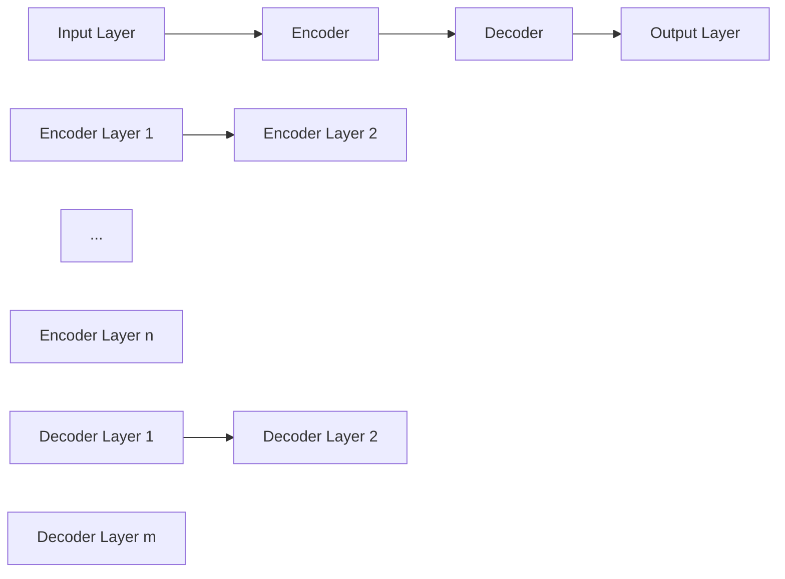

**预训练与微调**

ChatGPT的训练过程主要包括预训练和微调两个阶段。

**预训练**

预训练是指在无监督环境下，使用大规模文本数据进行训练，使模型学会理解和生成自然语言。预训练的过程通常包括以下几个步骤：

1. **数据收集**：收集海量的文本数据，包括书籍、新闻、文章等。
2. **文本处理**：对文本数据进行预处理，如分词、编码等。
3. **模型训练**：使用训练数据对模型进行训练，模型在训练过程中通过调整权重来优化性能。
4. **验证与测试**：在验证集和测试集上评估模型的表现，调整模型参数以提升性能。

**微调**

微调是指在预训练的基础上，针对特定任务对模型进行训练，使其适应特定应用场景。微调的过程包括以下几个步骤：

1. **数据准备**：准备用于微调的特定任务数据，如对话数据、问答数据等。
2. **模型初始化**：使用预训练模型作为初始化权重，构建微调模型。
3. **模型训练**：使用微调数据对模型进行训练，优化模型权重。
4. **评估与调整**：在验证集上评估模型性能，根据评估结果调整模型参数。

下面是一个使用mermaid绘制的预训练与微调流程图：

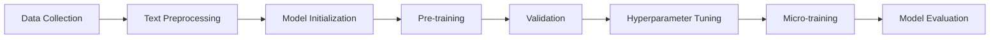

**预训练与微调的关系**

预训练和微调是相辅相成的。预训练提供了模型的基础语言能力，而微调则使模型能够针对特定任务进行优化。通过预训练，模型可以获得丰富的语言知识；通过微调，模型可以针对具体任务进行精细调整，从而提升其在特定领域的表现。

#### 3.2 算法原理

**自然语言生成**

ChatGPT的自然语言生成过程是基于Transformer模型的。在生成文本时，模型首先输入一个或多个词汇，然后通过编码器和解码器生成文本序列。这个过程包括以下几个主要步骤：

1. **输入编码**：输入的文本经过编码器编码，转化为编码序列。
2. **自注意力机制**：编码序列通过自注意力机制计算，确定每个词在序列中的重要性。
3. **交叉注意力机制**：解码器在生成下一个词时，通过交叉注意力机制计算编码序列与当前解码序列的相关性。
4. **解码与生成**：解码器根据自注意力和交叉注意力生成的上下文信息，生成下一个词，并更新解码序列。

下面是一个使用mermaid绘制的自然语言生成流程图：

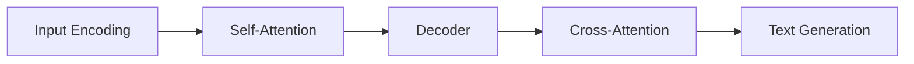

**Python源代码示例**

以下是一个简单的Python源代码示例，展示了如何使用ChatGPT进行自然语言生成：

```python
import openai

# 设置API密钥
openai.api_key = "your-api-key"

# 定义输入文本
input_text = "请介绍一下长城的历史。"

# 调用ChatGPT模型生成回答
response = openai.Completion.create(
  engine="text-davinci-002",
  prompt=input_text,
  max_tokens=50
)

# 输出生成回答
print(response.choices[0].text.strip())
```

**数学模型与公式**

ChatGPT的数学模型主要包括输入向量、输出向量和损失函数。

1. **输入向量**：输入文本的词向量表示，通常使用词嵌入（Word Embedding）技术生成。

2. **输出向量**：解码器生成的文本序列的词向量表示。

3. **损失函数**：用于评估模型生成文本的质量，常用的损失函数包括交叉熵损失（Cross-Entropy Loss）。

以下是一个使用LaTeX格式展示的输入向量和输出向量的数学模型：

```latex
\text{Input Vector: } \mathbf{X} = \{\mathbf{x}_1, \mathbf{x}_2, ..., \mathbf{x}_n\}
\\
\text{Output Vector: } \mathbf{Y} = \{\mathbf{y}_1, \mathbf{y}_2, ..., \mathbf{y}_m\}
```

以下是一个使用LaTeX格式展示的损失函数的计算公式：

```latex
\text{Loss Function: } \mathcal{L} = -\sum_{i=1}^{m} \sum_{j=1}^{n} y_{ij} \log(p_{ij})
```

其中，\(y_{ij}\) 表示第 \(i\) 个词在真实文本中的概率，\(p_{ij}\) 表示模型生成的文本中第 \(i\) 个词的概率。

**算法优化**

ChatGPT的算法优化主要包括正则化技术和优化算法。

1. **正则化技术**：用于防止模型过拟合，常用的正则化技术包括Dropout、权重衰减（Weight Decay）等。

2. **优化算法**：用于调整模型参数，常用的优化算法包括Adam、SGD等。

以下是一个使用LaTeX格式展示的优化算法的数学模型：

```latex
\text{Gradient Descent: } \mathbf{w}_{t+1} = \mathbf{w}_t - \alpha \cdot \nabla_{\mathbf{w}} \mathcal{L}(\mathbf{w}_t)
\\
\text{Adam: } \mathbf{w}_{t+1} = \mathbf{w}_t - \alpha \cdot (\frac{1}{\beta_1^t} - \beta_2^t) \cdot \nabla_{\mathbf{w}} \mathcal{L}(\mathbf{w}_t)
```

其中，\(\alpha\) 表示学习率，\(\beta_1\) 和 \(\beta_2\) 分别为动量参数，\(\nabla_{\mathbf{w}} \mathcal{L}(\mathbf{w}_t)\) 表示损失函数关于模型参数的梯度。

通过以上对ChatGPT模型的详细讲解，我们可以看到，ChatGPT不仅采用了先进的Transformer模型架构，还通过预训练和微调等手段，实现了强大的自然语言生成能力。这些技术为多模态虚拟导游系统的开发提供了坚实的基础。

### 第4章: 多模态感知与交互

#### 4.1 语音识别与生成

在多模态虚拟导游系统中，语音识别和语音生成是两个关键的技术模块，它们分别负责理解和回应用户的语音指令。

**语音识别技术**

语音识别（Speech Recognition）是将语音信号转换为文本信息的过程。这一技术依赖于深度学习模型，特别是卷积神经网络（CNN）和循环神经网络（RNN）的应用。在语音识别中，主要涉及以下几个步骤：

1. **特征提取**：首先，将语音信号转换为频谱图，提取关键特征，如梅尔频率倒谱系数（MFCC）。
2. **声学模型训练**：使用大量语音数据训练声学模型，该模型能够将特征映射到可能的单词或音素上。
3. **语言模型训练**：利用文本数据训练语言模型，预测序列中的下一个词或音素。
4. **解码**：结合声学模型和语言模型，使用解码算法（如HMM-GMM、CTC、RNN等）输出最可能的文本序列。

目前，常见的语音识别系统包括Google的TensorFlow Speech、百度语音识别、微软的Speech Recognition等。这些系统通常支持多种语言和方言，并能够实时处理语音输入。

**语音生成技术**

语音生成（Speech Synthesis）是将文本信息转换为自然流畅的语音输出的过程。语音生成技术主要包括以下几个类型：

1. **基于规则的合成**：通过将文本信息转换成音标，再生成对应的语音。这种方法需要大量的规则和音库支持，但生成速度较快。
2. **基于参数的合成**：使用参数化的合成模型（如PLP、SAT）生成语音，这种方法可以生成更自然的语音，但需要大量的训练数据和计算资源。
3. **数据驱动的合成**：使用预录制的语音数据合成语音，如WaveNet、Tacotron。这种方法生成的语音最自然，但数据依赖性较强。

在多模态虚拟导游系统中，常用的语音生成工具包括Google的Text-to-Speech、Amazon的 Polly等。这些工具提供了丰富的语音选择和语言支持，能够满足不同应用场景的需求。

**实现流程**

一个典型的多模态虚拟导游系统中的语音识别与生成实现流程如下：

1. **语音输入**：用户通过语音输入查询或指令。
2. **语音识别**：系统使用语音识别技术将语音转换为文本。
3. **文本处理**：系统分析文本查询，理解用户意图。
4. **文本生成**：系统使用自然语言处理技术生成回答文本。
5. **语音合成**：系统使用语音合成技术将文本回答转换为语音输出。

以下是一个简单的mermaid流程图，展示了语音识别与生成的实现过程：

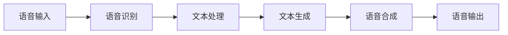

**Python源代码示例**

以下是一个简单的Python示例，展示了如何使用开源库实现语音识别和语音合成：

```python
import speech_recognition as sr
import pyttsx3

# 初始化语音识别引擎
recognizer = sr.Recognizer()

# 初始化语音合成引擎
engine = pyttsx3.init()

# 定义语音识别函数
def recognize_speech_from_mic():
    with sr.Microphone() as source:
        print("请提问：")
        audio = recognizer.listen(source)
        try:
            return recognizer.recognize_google(audio)
        except sr.UnknownValueError:
            return "无法理解语音"

# 定义语音合成函数
def speak(text):
    engine.say(text)
    engine.runAndWait()

# 主函数
def main():
    while True:
        user_input = recognize_speech_from_mic()
        if user_input == "退出":
            break
        speak("你的问题是：{}".format(user_input))
        # 处理查询或其他任务...

# 执行主函数
if __name__ == "__main__":
    main()
```

通过以上讲解和示例，我们可以看到，语音识别和语音生成是多模态虚拟导游系统中不可或缺的两个环节。它们共同作用，为用户提供了一种自然的、直观的交互方式，使得多模态虚拟导游系统能够更好地满足用户的旅游需求。

#### 4.2 文本处理与融合

在多模态虚拟导游系统中，文本处理与融合是一个核心的技术环节，它涉及到文本理解、文本生成和文本融合等多个步骤，确保系统能够为用户提供丰富、准确和连贯的信息。

**文本理解**

文本理解（Text Understanding）是将文本信息转化为系统可以处理和理解的形式。这个过程主要包括以下几个步骤：

1. **分词（Tokenization）**：将文本分解成单词或子词，以便进一步处理。常见的分词工具包括jieba、NLTK等。
2. **词性标注（Part-of-Speech Tagging）**：为每个单词或子词分配语法标签，如名词、动词、形容词等，以便理解文本的语法结构。
3. **命名实体识别（Named Entity Recognition, NER）**：识别文本中的特定实体，如人名、地名、组织名等，这些实体对理解文本内容至关重要。
4. **句法分析（Syntactic Parsing）**：分析文本的语法结构，理解句子之间的关系和成分。

以下是一个简单的mermaid流程图，展示了文本理解的过程：

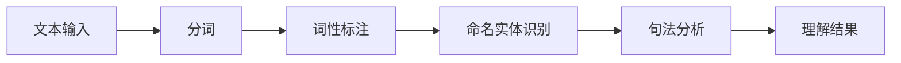

**文本生成**

文本生成（Text Generation）是将系统的理解和分析转化为自然流畅的文本信息。ChatGPT作为文本生成的重要工具，其生成过程通常包括以下几个步骤：

1. **输入处理**：将输入文本进行处理，如去除停用词、进行词性转换等。
2. **编码**：使用预训练的Transformer模型将文本编码为向量表示。
3. **解码**：根据编码序列生成文本输出，通过自注意力和交叉注意力机制，模型生成下一个词，并不断更新解码序列。
4. **输出处理**：对生成的文本进行后处理，如去除无关内容、进行格式化等。

以下是一个简单的mermaid流程图，展示了文本生成的过程：

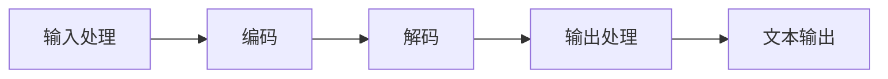

**Python源代码示例**

以下是一个简单的Python示例，展示了如何使用ChatGPT进行文本生成：

```python
import openai

# 设置API密钥
openai.api_key = "your-api-key"

# 定义输入文本
input_text = "请介绍一下长城的历史。"

# 调用ChatGPT模型生成回答
response = openai.Completion.create(
  engine="text-davinci-002",
  prompt=input_text,
  max_tokens=50
)

# 输出生成回答
print(response.choices[0].text.strip())
```

**文本融合**

文本融合（Text Fusion）是将多种文本信息进行整合，以提供更加丰富和连贯的用户体验。在多模态虚拟导游系统中，文本融合通常涉及到以下步骤：

1. **信息提取**：从不同的文本源（如历史文献、文化资料、地理信息）中提取关键信息。
2. **信息对齐**：将不同来源的文本信息进行对齐，确保信息的一致性和连贯性。
3. **融合策略**：根据用户的需求和上下文，选择合适的文本融合策略，如拼接、融合、加权等。
4. **输出生成**：将融合后的文本信息生成最终的导览内容。

以下是一个简单的mermaid流程图，展示了文本融合的过程：

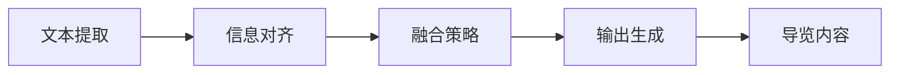

**Python源代码示例**

以下是一个简单的Python示例，展示了如何使用Python代码进行文本融合：

```python
import numpy as np

# 假设从两个文本源中提取的信息分别为text1和text2
text1 = "长城是中国古代的军事防御工事，始建于春秋战国时期。"
text2 = "长城东起山海关，西至嘉峪关，全长超过13000公里。"

# 定义融合权重
weight1 = 0.6
weight2 = 0.4

# 文本融合
def text_fusion(text1, text2, weight1, weight2):
    return weight1 * text1 + weight2 * text2

# 融合后的文本
fusion_text = text_fusion(text1, text2, weight1, weight2)
print(fusion_text)
```

通过以上对文本处理与融合的详细讲解，我们可以看到，文本处理与融合是多模态虚拟导游系统中的关键环节。通过文本理解，系统能够准确地理解用户的需求；通过文本生成，系统能够生成自然流畅的文本回答；通过文本融合，系统能够整合多种信息，为用户提供丰富、准确和连贯的导览内容。

### 第5章: 历史文化与地理信息的整合

#### 5.1 数据来源与处理

在构建多模态虚拟导游系统时，整合历史、文化和地理信息是提供丰富旅游体验的关键。这些信息可以从多种数据源获取，并经过一系列处理步骤，以确保其准确性和一致性。

**数据来源**

1. **历史文献**：包括历史书籍、学术论文、考古报告等，这些文献提供了丰富的历史事件、人物和时期背景。
2. **文化资料**：如博物馆、图书馆和档案馆等机构的收藏，包括艺术品、文物、民俗文化等，这些资料展示了地方文化特色和传统习俗。
3. **地理信息系统（GIS）**：通过GIS平台获取地理信息，包括地形地貌、气候条件、交通网络等，这些信息对于理解景点的地理位置和环境特征至关重要。
4. **在线数据库和API**：如OpenStreetMap、Google Maps等，提供详细的地理数据，可用于地图显示和路径规划。

**数据处理**

1. **数据收集**：从多个数据源收集相关信息，并进行初步整理，如数据下载、OCR识别等。
2. **数据清洗**：去除重复、错误和无关信息，确保数据的准确性。例如，使用Python的Pandas库进行数据清洗。
3. **数据标准化**：将不同格式和单位的数据转换为统一的格式和单位，以便于后续处理。例如，将时间日期转换为统一格式。
4. **数据整合**：将不同来源的数据进行整合，形成一个统一的知识库。使用Python的SQLite或MongoDB等数据库进行数据整合。
5. **数据存储**：将处理后的数据存储在数据库中，便于查询和调用。采用关系型数据库（如MySQL）或NoSQL数据库（如MongoDB），根据具体需求选择合适的存储方案。

**Python源代码示例**

以下是一个简单的Python示例，展示了如何从不同数据源获取和整合历史、文化和地理信息：

```python
import pandas as pd
import sqlite3

# 假设从历史文献、文化资料和GIS中获取了以下数据
history_data = {'event': ['长城修建', '故宫建成'], 'year': [221-206BC, 1420]}
culture_data = {'activity': ['中秋节', '春节'], 'description': ['赏月', '团圆']}
geography_data = {'location': ['北京', '南京'], 'description': ['古都', '江南名城']}

# 将数据转换为DataFrame
history_df = pd.DataFrame(history_data)
culture_df = pd.DataFrame(culture_data)
geography_df = pd.DataFrame(geography_data)

# 数据整合
integrated_data = pd.merge(history_df, culture_df, on='event')
integrated_data = pd.merge(integrated_data, geography_df, on='location')

# 存储到SQLite数据库
conn = sqlite3.connect(' tourism.db')
integrated_data.to_sql('tourism', conn, if_exists='replace', index=False)
conn.close()
```

通过上述步骤，我们可以构建一个包含历史、文化和地理信息的多模态虚拟导游系统，为用户提供全面和深入的旅游导览服务。

#### 5.2 整合方法

在多模态虚拟导游系统中，整合历史、文化和地理信息是一项复杂但至关重要的任务。这一过程涉及到数据建模、知识图谱构建以及信息融合策略。

**实体关系图**

实体关系图（Entity Relationship Diagram, ERD）是一种用于表示实体及其关系的图形化工具，可以帮助我们清晰地描述不同数据源之间的关系。以下是一个简单的mermaid ER图示例，展示了历史、文化和地理信息的实体及其关系：

```mermaid
erDiagram
    Person ||--|{ Event } : created
    Place ||--|{ Event } : located
    Culture ||--|{ Event } : related
    Person ||--|{ Place } : lived
    Place ||--|{ Culture } : exhibits
```

在这个ER图中，`Person`、`Event`、`Place`和`Culture`是主要的实体，它们之间的关系通过相应的连接线表示。例如，`Person`与`Event`之间的关系表示某个人创建了某个历史事件，而`Place`与`Event`之间的关系表示某个历史事件发生在特定的地理位置。

**知识图谱**

知识图谱（Knowledge Graph）是一种通过节点和边来表示实体及其关系的图形化表示方法，能够更好地描述复杂的关系和关联。以下是一个简单的mermaid知识图谱示例，展示了历史、文化和地理信息的关联：

```mermaid
knowledgeGraph
    node
        event1["事件1：秦始皇统一六国"]
        event2["事件2：唐朝盛世"]
        place1["地点1：故宫"]
        place2["地点2：长城"]
        culture1["文化1：春节"]
        culture2["文化2：中秋节"]

    edge
        event1 -> place1
        event1 -> culture1
        event2 -> place2
        event2 -> culture2
```

在这个知识图谱中，`event1`和`event2`是历史事件，`place1`和`place2`是地点，`culture1`和`culture2`是文化活动。边表示了这些实体之间的关联关系，如事件发生在特定的地点，与特定的文化活动相关。

**整合架构**

为了实现历史、文化和地理信息的整合，可以采用以下架构：

1. **数据收集与预处理**：从多个数据源（如历史文献、文化资料、GIS）收集信息，并进行数据清洗、去重和标准化处理。
2. **实体识别与分类**：使用自然语言处理技术识别文本中的实体，并对其进行分类，如人名、地名、事件名等。
3. **实体关系构建**：根据文本内容和实体识别结果，构建实体之间的关系图，如ER图或知识图谱。
4. **信息融合与存储**：将构建的实体关系图存储在数据库中，以便后续的查询和调用。

以下是一个简单的mermaid架构图示例，展示了多模态虚拟导游系统的整合架构：

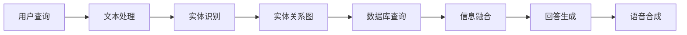

在这个架构图中，用户的查询通过文本处理模块转化为可识别的文本，然后进行实体识别和关系构建。构建的实体关系图用于数据库查询和信息融合，最终生成回答并通过语音合成模块输出。

通过上述方法和架构，我们可以实现历史、文化和地理信息的有效整合，为用户提供丰富、全面和多层次的旅游导览服务。

#### 5.3 应用实例

为了更好地展示多模态虚拟导游系统在实际中的应用，以下将列举两个具体的应用实例，并详细描述其实现过程和效果。

**实例1：历史故事讲解**

**目标**：为用户提供特定历史事件的详细讲解。

**实现过程**：
1. **用户查询**：用户通过语音或文本输入查询历史事件，如“请介绍一下唐朝的历史。”。
2. **文本处理**：系统对用户输入进行处理，提取关键信息并构造查询文本。
3. **实体识别**：系统使用自然语言处理技术识别查询中的实体，如“唐朝”。
4. **数据库查询**：系统在知识图谱或数据库中查找与“唐朝”相关的历史事件、文化活动和地理信息。
5. **信息融合**：系统整合查询结果，构建一个连贯的历史故事。
6. **回答生成**：系统使用ChatGPT生成详细的历史故事文本。
7. **语音合成**：系统将文本故事转换为语音，并输出给用户。

**效果**：用户能够听到清晰、详细且富有情感的历史故事讲解，如“唐朝是中国历史上一个辉煌的时期，从公元618年到907年，期间出现了许多伟大的文化成就和重要事件。”

**实例2：文化旅游推荐**

**目标**：根据用户兴趣和地理位置，推荐适合的文化旅游目的地。

**实现过程**：
1. **用户查询**：用户通过语音或文本输入表达旅游兴趣，如“我对中国传统文化很感兴趣，有什么推荐的旅游地点吗？”。
2. **文本处理**：系统对用户输入进行处理，识别用户兴趣关键词，如“中国传统文化”。
3. **地理位置获取**：系统获取用户的当前位置或指定地点。
4. **数据库查询**：系统在数据库中查找与用户兴趣和地理位置相关的文化景点、历史事件和文化活动。
5. **信息融合**：系统整合查询结果，构建旅游推荐列表，包括景点名称、简介、历史故事和文化活动。
6. **回答生成**：系统使用自然语言生成技术，生成个性化的旅游推荐文本。
7. **语音合成**：系统将旅游推荐文本转换为语音，并输出给用户。

**效果**：用户能够收到一份详细、个性化和具有实用性的文化旅游推荐，如“根据您的兴趣，我们为您推荐了北京的故宫、西安的兵马俑和南京的夫子庙，这些地方都有丰富的历史文化资源，非常适合进行文化旅游。”

通过以上两个实例，我们可以看到，多模态虚拟导游系统在实际应用中，不仅能够提供详细的历史故事讲解，还能根据用户兴趣和地理位置进行个性化的文化旅游推荐，极大地提升了用户的旅游体验。

### 总结与展望

在本篇技术博客中，我们深入探讨了ChatGPT多模态虚拟导游系统的构建与实现，涵盖了从核心概念到具体算法原理、系统设计以及实际应用的全过程。以下是本文的总结与展望。

**总结**

1. **核心概念**：本文介绍了ChatGPT、多模态虚拟导游以及历史、文化和地理信息等核心概念，并详细分析了它们在系统中的应用。

2. **算法原理**：通过对ChatGPT模型的详细解析，我们了解了Transformer模型的结构、预训练与微调过程，以及自然语言生成机制。

3. **系统设计与实现**：我们探讨了多模态虚拟导游系统的感知与交互、文本处理与融合、历史文化与地理信息的整合方法，并通过Python代码示例展示了具体实现。

4. **应用实例**：通过两个实际应用实例，我们展示了多模态虚拟导游系统的功能与效果，为用户提供详细的历史故事讲解和个性化的文化旅游推荐。

**展望**

1. **技术挑战**：尽管多模态虚拟导游系统在提供沉浸式旅游体验方面具有巨大潜力，但仍面临一些技术挑战，如语音识别的准确性、文本生成的连贯性以及多模态数据的实时融合。

2. **未来方向**：未来可以进一步优化系统的性能和用户体验，例如引入更多模态信息（如视频、三维模型等）、增强系统的自适应性和个性化推荐能力，以及提升系统的可扩展性和可维护性。

3. **行业应用**：多模态虚拟导游系统不仅适用于旅游行业，还可以广泛应用于教育、医疗、文化保护等多个领域，为各类用户提供沉浸式的互动体验。

通过不断的技术创新和应用拓展，ChatGPT多模态虚拟导游系统有望在未来成为人们生活中不可或缺的智能助手，引领人工智能在各个领域的应用发展。

### 最佳实践 tips

在开发ChatGPT多模态虚拟导游系统的过程中，以下是一些最佳实践和技巧，可以帮助您更高效地实现系统：

1. **优化语音识别与合成**：为了提升用户体验，可以考虑使用最新的语音识别和语音合成技术，如Google的自动语音识别（ASR）和文本到语音（TTS）工具。这些工具通常具有高准确率和流畅的自然语音。

2. **增强自然语言处理能力**：利用预训练的深度学习模型，如GPT-3或BERT，可以显著提升系统的自然语言理解和生成能力。定期更新这些模型，以保持其在语言理解上的先进性。

3. **数据预处理与整合**：在构建系统时，确保对历史、文化和地理信息进行充分的数据预处理和整合。这包括数据清洗、标准化、去重和一致性检查，以确保数据的质量和一致性。

4. **模块化设计**：采用模块化设计，将系统划分为多个功能模块（如语音识别、文本处理、图像识别等），有助于提高系统的可维护性和可扩展性。每个模块可以独立开发和优化。

5. **用户个性化**：引入用户个性化功能，根据用户的兴趣和偏好，提供定制化的旅游导览服务。这可以通过用户行为分析、偏好设置和历史记录来实现。

6. **实时反馈与调整**：系统应具备实时反馈和自我调整的能力，根据用户的使用情况和反馈，不断优化和改进系统的性能和用户体验。

7. **安全性与隐私保护**：确保系统的安全性和用户隐私保护，遵循相关的数据保护法规和最佳实践。对用户数据进行加密存储，并确保用户信息的保密性和安全性。

通过遵循上述最佳实践，您能够构建一个高效、可靠且用户体验出色的多模态虚拟导游系统。

### 小结

在本篇博客中，我们深入探讨了ChatGPT多模态虚拟导游系统的构建与实现，从核心概念到具体算法原理，再到系统设计与实际应用，进行了全方位的分析和讲解。我们了解了如何利用ChatGPT的强大自然语言生成能力，结合语音识别、文本处理、图像识别等技术，实现一个能够提供沉浸式旅游体验的多模态虚拟导游系统。通过历史、文化和地理信息的整合，系统可以为用户提供详细、全面且个性化的导览内容，极大地提升了用户的旅游体验。

在本篇博客中，我们讨论了以下关键点：

1. **核心概念**：包括ChatGPT、多模态虚拟导游以及历史、文化和地理信息等。
2. **算法原理**：详细解析了ChatGPT的模型结构、预训练与微调过程、自然语言生成机制等。
3. **系统设计与实现**：阐述了多模态虚拟导游系统的感知与交互、文本处理与融合、信息整合方法等。
4. **应用实例**：通过历史故事讲解和文化旅游推荐两个实例，展示了系统的实际应用效果。
5. **最佳实践**：提供了优化系统性能、提升用户体验等方面的最佳实践。
6. **小结**：总结了博客的核心内容，强调了ChatGPT多模态虚拟导游系统在提升旅游体验方面的重要作用。

总之，ChatGPT多模态虚拟导游系统不仅为旅游行业带来了新的可能性，也为人工智能在更多领域的应用提供了启示。未来，随着技术的不断进步和应用场景的拓展，多模态虚拟导游系统有望在各个领域发挥更大的作用。

### 注意事项

在开发ChatGPT多模态虚拟导游系统的过程中，以下是一些需要注意的事项，以确保系统的性能和用户体验：

1. **数据质量**：确保历史、文化和地理信息数据的质量和准确性。错误或不一致的数据可能会影响系统的表现和用户信任度。
2. **安全性**：保护用户数据的安全和隐私，遵循数据保护法规，对用户信息进行加密存储和处理。
3. **可扩展性**：设计系统时考虑可扩展性，以便未来能够轻松添加新的功能和模态。
4. **用户体验**：优化用户界面和交互设计，确保系统易于使用和理解，提供流畅的用户体验。
5. **性能优化**：优化系统的响应速度和处理能力，确保在不同设备和网络环境下都能保持良好的性能。
6. **错误处理**：设计合理的错误处理机制，确保系统在遇到问题时能够及时反馈并恢复。

通过注意这些方面，您可以构建一个稳定、可靠且用户体验出色的多模态虚拟导游系统。

### 拓展阅读

如果您希望深入了解ChatGPT多模态虚拟导游系统的相关技术，以下是一些推荐的拓展阅读资源：

1. **OpenAI官方文档**：访问OpenAI的官方网站，查看ChatGPT模型的官方文档，了解其详细的技术细节和API使用方法。
2. **《自然语言处理入门》**：这本书提供了自然语言处理（NLP）的全面介绍，包括文本处理、语音识别和生成等关键技术。
3. **《深度学习》**：由Ian Goodfellow、Yoshua Bengio和Aaron Courville合著的这本书，详细介绍了深度学习的基本原理和应用。
4. **《人工智能：一种现代的方法》**：这本书提供了人工智能（AI）的全面介绍，包括机器学习、深度学习、自然语言处理等领域。
5. **《多模态数据处理》**：这本书专注于多模态数据（如文本、图像、声音等）的处理和融合技术，提供了丰富的理论和实践知识。
6. **GitHub项目**：在GitHub上搜索相关的开源项目，查看其他开发者如何实现ChatGPT多模态虚拟导游系统，从中获取灵感和经验。

通过阅读这些资源，您可以进一步加深对ChatGPT多模态虚拟导游系统的理解和应用。

