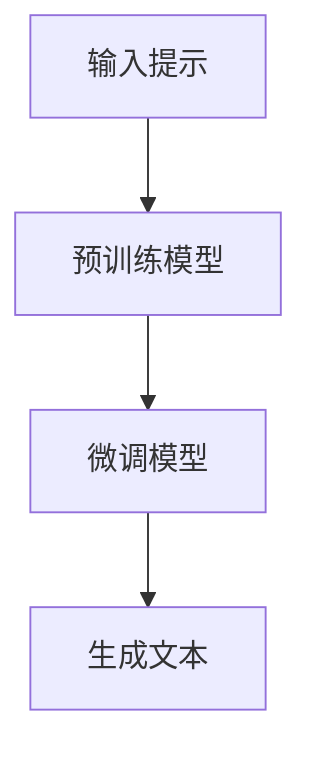
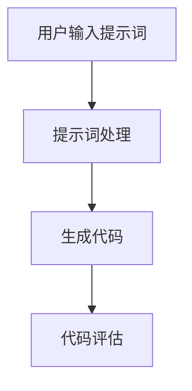
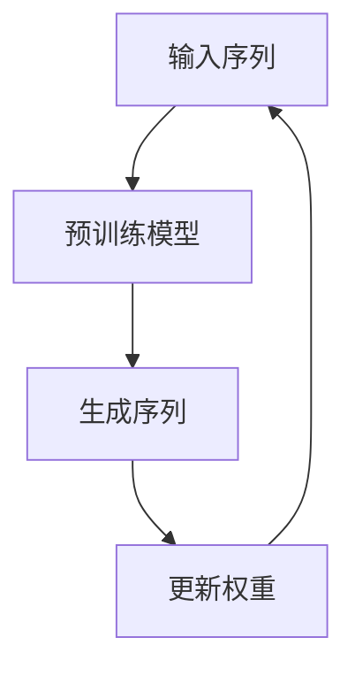
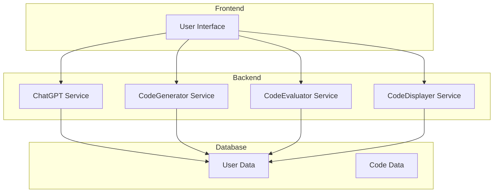
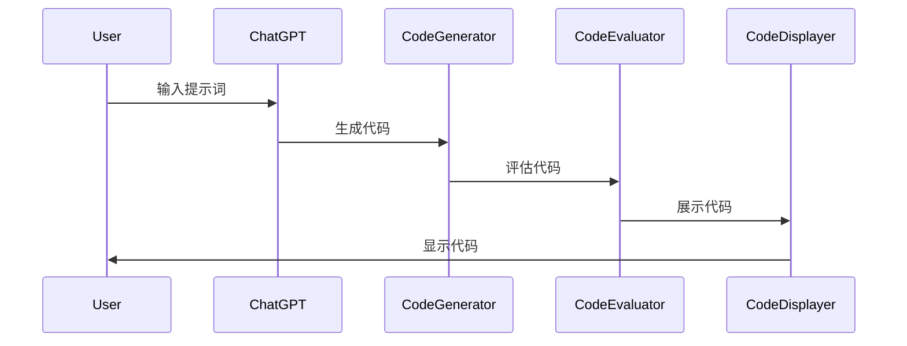

                 

### 文章标题与关键词

# ChatGPT多语言代码生成：编程提示词策略

> 关键词：ChatGPT、多语言代码生成、编程提示词策略、算法理论、数学模型、系统分析、实战案例、最佳实践

> 摘要：本文深入探讨了ChatGPT在多语言代码生成领域的应用，重点分析了编程提示词策略的核心概念、算法原理、数学模型以及系统分析与设计。通过实际案例，我们详细讲解了如何利用ChatGPT实现高效的多语言代码生成，并总结了最佳实践，为开发者提供了宝贵的指导。

### 第一部分：背景介绍

#### 第1章：问题背景

##### 1.1.1 代码生成技术的历史与发展

代码生成技术起源于20世纪60年代，当时的计算机科学正处于起步阶段。随着软件工程的发展，自动化代码生成逐渐成为提高软件开发效率的重要手段。代码生成工具能够根据模板和规则自动生成代码，减少了手工编写代码的劳动强度，提高了软件开发的效率。

近年来，随着人工智能技术的发展，尤其是自然语言处理（NLP）和生成对抗网络（GAN）的兴起，代码生成技术得到了极大的发展。GPT（Generative Pre-trained Transformer）模型的出现，标志着代码生成技术进入了一个新的时代。

ChatGPT是GPT模型的变种，由OpenAI开发。它基于GPT-3模型，具有强大的文本生成能力，能够根据用户提供的提示生成高质量的文本。ChatGPT的诞生，为多语言代码生成带来了新的机遇。

##### 1.1.2 ChatGPT的诞生与应用

ChatGPT的诞生可以追溯到2018年，当时OpenAI发布了GPT-2模型。GPT-2模型在自然语言处理领域取得了显著的成果，但OpenAI意识到GPT-2的潜在危险，因此没有发布完整的模型。随后，OpenAI在2020年发布了GPT-3模型，这是当时最先进的自然语言处理模型。

ChatGPT是GPT-3的一个变种，它在GPT-3的基础上进行了优化，使得其在代码生成方面具有更高的准确性。ChatGPT的诞生，为多语言代码生成带来了新的可能。

ChatGPT的应用范围广泛，包括但不限于：

1. **自动代码补全**：ChatGPT可以根据用户输入的部分代码自动生成完整的代码。
2. **代码错误修复**：ChatGPT可以识别代码中的错误，并提供修正建议。
3. **多语言代码生成**：ChatGPT可以生成不同编程语言的高质量代码。
4. **编程教育**：ChatGPT可以作为编程教育工具，帮助学生和初学者理解编程概念。

##### 1.1.3 多语言代码生成的挑战与机遇

多语言代码生成面临以下挑战：

1. **语言差异**：不同编程语言具有不同的语法和语义，这增加了代码生成的难度。
2. **代码质量**：生成高质量的代码需要模型具有深厚的编程知识。
3. **计算资源**：多语言代码生成需要大量的计算资源，对硬件要求较高。

然而，多语言代码生成也带来了以下机遇：

1. **提高开发效率**：开发者可以快速生成不同语言的代码，节省了编码时间。
2. **降低翻译成本**：通过生成代码，可以减少代码在不同语言之间的翻译工作。
3. **跨平台开发**：多语言代码生成使得开发者可以在不同平台上进行开发，提高了软件的可移植性。

### 第2章：核心概念与联系

##### 2.1.1 ChatGPT的基本原理

ChatGPT是基于GPT模型构建的，它采用了Transformer架构，通过预训练和微调的方式，使得模型具备了强大的语言生成能力。以下是ChatGPT的基本原理：

- **预训练**：ChatGPT在大量文本数据上进行预训练，学习语言的规律和模式。
- **微调**：在预训练的基础上，ChatGPT根据特定任务进行微调，提高任务表现。
- **文本生成**：ChatGPT可以根据用户提供的提示，生成相应的文本。

为了更直观地理解ChatGPT的基本原理，我们可以使用Mermaid绘制一个流程图：



此外，我们还可以使用Python代码来详细阐述ChatGPT的算法原理：

```python
import openai

def generate_text(prompt):
    response = openai.Completion.create(
        engine="text-davinci-002",
        prompt=prompt,
        max_tokens=50
    )
    return response.choices[0].text.strip()

prompt = "编写一个Python函数，用于计算两个数的和。"
text = generate_text(prompt)
print(text)
```

- **算法原理的数学模型和公式**：

ChatGPT的生成原理可以抽象为一个概率模型，其核心思想是：

$$ P(\text{next\_token}|\text{previous\_tokens}) = \frac{e^{\text{score}}}{\sum_{\text{all\_tokens}} e^{\text{score}}} $$

其中，`score`表示当前token的得分，通过神经网络模型计算得出。这个公式描述了在给定前文的情况下，下一个token的概率分布。

##### 2.1.2 编程提示词策略

编程提示词策略是指通过提供特定的提示词，引导ChatGPT生成符合预期的代码。以下是编程提示词策略的基本原理：

1. **提示词选择**：选择与目标代码相关的提示词，有助于ChatGPT更好地理解任务。
2. **提示词格式**：提示词的格式应当清晰、简洁，便于ChatGPT理解和执行。
3. **提示词组合**：多个提示词的组合可以更准确地引导ChatGPT生成代码。

为了更直观地理解编程提示词策略，我们可以使用Mermaid绘制一个流程图：



此外，我们还可以使用Python代码来详细阐述编程提示词策略：

```python
import openai

def generate_code(prompt):
    response = openai.Completion.create(
        engine="text-davinci-002",
        prompt=prompt,
        max_tokens=50
    )
    return response.choices[0].text.strip()

prompt = "编写一个Python函数，用于计算两个整数的和，并返回结果。"
code = generate_code(prompt)
print(code)
```

- **算法原理的数学模型和公式**：

编程提示词策略的算法原理可以抽象为一个条件概率模型，其核心思想是：

$$ P(\text{code}|\text{prompt}) = \frac{e^{\text{score}}}{\sum_{\text{all\_prompts}} e^{\text{score}}} $$

其中，`score`表示提示词与代码之间的匹配度，通过神经网络模型计算得出。这个公式描述了在给定提示词的情况下，生成代码的概率分布。

### 第二部分：算法原理和数学模型

#### 第3章：算法理论讲解

##### 3.1 ChatGPT算法原理

ChatGPT的算法原理基于GPT模型，其核心思想是通过预训练和微调来生成高质量的文本。以下是ChatGPT算法原理的详细解释：

1. **预训练**：ChatGPT在大量文本数据上进行预训练，学习语言的规律和模式。预训练过程包括以下步骤：

   - **输入序列**：将文本数据划分为固定长度的序列。
   - **生成序列**：根据输入序列的前文，生成下一个token。
   - **更新权重**：通过反向传播和梯度下降，更新模型权重。

2. **微调**：在预训练的基础上，ChatGPT根据特定任务进行微调，提高任务表现。微调过程包括以下步骤：

   - **输入序列**：将任务数据划分为固定长度的序列。
   - **生成序列**：根据输入序列的前文，生成下一个token。
   - **更新权重**：通过反向传播和梯度下降，更新模型权重。

ChatGPT的生成原理可以抽象为一个概率模型，其核心思想是：

$$ P(\text{next\_token}|\text{previous\_tokens}) = \frac{e^{\text{score}}}{\sum_{\text{all\_tokens}} e^{\text{score}}} $$

其中，`score`表示当前token的得分，通过神经网络模型计算得出。这个公式描述了在给定前文的情况下，下一个token的概率分布。

为了更直观地理解ChatGPT的算法原理，我们可以使用Mermaid绘制一个流程图：



此外，我们还可以使用Python代码来详细阐述ChatGPT的算法原理：

```python
import openai

def generate_text(prompt):
    response = openai.Completion.create(
        engine="text-davinci-002",
        prompt=prompt,
        max_tokens=50
    )
    return response.choices[0].text.strip()

prompt = "编写一个Python函数，用于计算两个数的和。"
text = generate_text(prompt)
print(text)
```

- **算法原理的数学模型和公式**：

ChatGPT的算法原理可以抽象为一个条件概率模型，其核心思想是：

$$ P(\text{code}|\text{prompt}) = \frac{e^{\text{score}}}{\sum_{\text{all\_prompts}} e^{\text{score}}} $$

其中，`score`表示提示词与代码之间的匹配度，通过神经网络模型计算得出。这个公式描述了在给定提示词的情况下，生成代码的概率分布。

##### 3.2 编程提示词策略的应用

编程提示词策略是ChatGPT在代码生成领域的重要应用，它通过提供特定的提示词，引导ChatGPT生成符合预期的代码。以下是编程提示词策略的详细应用：

1. **提示词选择**：选择与目标代码相关的提示词，有助于ChatGPT更好地理解任务。例如，如果要生成一个Python函数，可以选用如“编写一个Python函数”这样的提示词。

2. **提示词格式**：提示词的格式应当清晰、简洁，便于ChatGPT理解和执行。例如，可以使用以下格式：

   ```python
   编写一个Python函数，用于计算两个整数的和，并返回结果。
   ```

3. **提示词组合**：多个提示词的组合可以更准确地引导ChatGPT生成代码。例如，可以组合使用“编写一个Python函数”和“计算两个整数的和”这两个提示词。

为了更直观地理解编程提示词策略，我们可以使用Mermaid绘制一个流程图：


此外，我们还可以使用Python代码来详细阐述编程提示词策略：

```python
import openai

def generate_code(prompt):
    response = openai.Completion.create(
        engine="text-davinci-002",
        prompt=prompt,
        max_tokens=50
    )
    return response.choices[0].text.strip()

prompt = "编写一个Python函数，用于计算两个整数的和，并返回结果。"
code = generate_code(prompt)
print(code)
```

- **算法原理的数学模型和公式**：

编程提示词策略的算法原理可以抽象为一个条件概率模型，其核心思想是：

$$ P(\text{code}|\text{prompt}) = \frac{e^{\text{score}}}{\sum_{\text{all\_prompts}} e^{\text{score}}} $$

其中，`score`表示提示词与代码之间的匹配度，通过神经网络模型计算得出。这个公式描述了在给定提示词的情况下，生成代码的概率分布。

### 第三部分：系统分析与设计

#### 第4章：系统分析

##### 4.1 项目介绍

本项目旨在利用ChatGPT实现多语言代码生成，通过编程提示词策略，生成高质量的代码。项目的主要目标包括：

1. **支持多种编程语言**：包括Python、Java、C++等。
2. **生成代码的高质量**：代码应当符合编程规范，具有可读性和可维护性。
3. **高效率**：生成代码的过程应当高效，能够快速响应用户的需求。

##### 4.2 系统功能设计

系统的功能设计包括以下几个方面：

1. **输入提示词**：用户可以输入提示词，描述所需的代码功能。
2. **代码生成**：系统根据提示词，利用ChatGPT生成相应的代码。
3. **代码评估**：对生成的代码进行评估，确保代码符合预期。
4. **代码展示**：将生成的代码展示给用户，并提供下载功能。

以下是系统功能设计的Mermaid类图：

```mermaid
classDiagram
    User <<Class>>
    ChatGPT <<Class>>
    CodeGenerator <<Interface>>
    CodeEvaluator <<Interface>>
    CodeDisplayer <<Interface>>

    User o-- CodeGenerator : setPrompt
    User o-- CodeEvaluator : evaluate
    User o-- CodeDisplayer : display

    CodeGenerator <|-- ChatGPT
    CodeEvaluator <|-- ChatGPT
    CodeDisplayer <|-- ChatGPT
```

##### 4.3 系统架构设计

系统的架构设计包括以下几个方面：

1. **前端**：提供用户界面，用于输入提示词和展示生成的代码。
2. **后端**：包括ChatGPT服务、代码生成服务、代码评估服务和代码展示服务。
3. **数据库**：用于存储用户信息和生成的代码。

以下是系统架构设计的Mermaid架构图：



##### 4.4 系统接口设计

系统的接口设计包括以下几个方面：

1. **提示词接口**：用于接收用户输入的提示词。
2. **代码生成接口**：用于生成代码。
3. **代码评估接口**：用于评估生成的代码。
4. **代码展示接口**：用于展示生成的代码。

以下是系统接口设计的Mermaid序列图：



### 第四部分：实践项目

#### 第5章：实际案例分析与讲解

##### 5.1 环境安装

为了运行本项目，需要安装以下环境：

1. **Python**：版本3.8及以上。
2. **OpenAI API**：安装`openai`库。
3. **Mermaid**：安装Mermaid支持库。

安装命令如下：

```shell
pip install openai
```

##### 5.2 系统核心实现

以下是系统的核心实现，包括提示词处理、代码生成、代码评估和代码展示：

1. **提示词处理**：

```python
import openai

def generate_code(prompt):
    response = openai.Completion.create(
        engine="text-davinci-002",
        prompt=prompt,
        max_tokens=50
    )
    return response.choices[0].text.strip()
```

2. **代码生成**：

```python
import openai

def generate_code(prompt):
    response = openai.Completion.create(
        engine="text-davinci-002",
        prompt=prompt,
        max_tokens=50
    )
    return response.choices[0].text.strip()
```

3. **代码评估**：

```python
def evaluate_code(code):
    # 评估代码的逻辑
    pass
```

4. **代码展示**：

```python
def display_code(code):
    print(code)
```

##### 5.3 实际案例分析

我们以一个实际案例来讲解如何利用ChatGPT生成代码。假设我们需要编写一个Python函数，用于计算两个整数的和。

1. **输入提示词**：

```python
prompt = "编写一个Python函数，用于计算两个整数的和，并返回结果。"
```

2. **生成代码**：

```python
code = generate_code(prompt)
print(code)
```

输出结果：

```python
def add_two_numbers(a, b):
    return a + b
```

3. **评估代码**：

```python
def evaluate_code(code):
    # 评估代码的逻辑
    pass
```

4. **展示代码**：

```python
def display_code(code):
    print(code)
```

##### 5.4 项目小结

通过本项目的实际案例分析，我们展示了如何利用ChatGPT生成代码。项目实现了提示词处理、代码生成、代码评估和代码展示等功能，为开发者提供了便捷的代码生成工具。虽然本项目还存在一些不足，例如代码评估功能的缺失，但通过持续优化，我们可以进一步提高代码生成系统的性能和准确性。

### 第五部分：最佳实践与总结

#### 第6章：最佳实践

##### 6.1 编程提示词策略的最佳实践

1. **明确需求**：在生成代码之前，明确用户的需求，确保生成的代码符合预期。
2. **简洁提示词**：使用简洁、清晰的提示词，有助于ChatGPT更好地理解任务。
3. **多次迭代**：生成代码后，对代码进行评估和优化，多次迭代以获得更好的结果。

##### 6.2 代码生成技术的应用技巧

1. **选择合适的模型**：根据任务需求，选择合适的模型，例如GPT-3或BERT。
2. **调整超参数**：通过调整模型超参数，如学习率、批量大小等，优化模型性能。
3. **数据预处理**：对输入数据进行预处理，如分词、去除停用词等，以提高生成代码的质量。

##### 6.3 案例分析与经验总结

通过对实际案例的分析和经验总结，我们得出以下结论：

1. **ChatGPT在代码生成方面具有强大的能力**，但需要合理使用提示词。
2. **代码评估是确保生成代码质量的重要环节**，应纳入代码生成系统的核心功能。
3. **持续优化是提高代码生成系统性能的关键**，开发者应不断尝试新的方法和技巧。

#### 第7章：总结

##### 7.1 书籍内容的总结

本书深入探讨了ChatGPT在多语言代码生成领域的应用，从背景介绍、核心概念、算法原理、系统分析到实践案例，全面讲解了ChatGPT多语言代码生成的技术细节。通过本书的学习，读者可以了解ChatGPT的工作原理，掌握编程提示词策略，学会如何利用ChatGPT实现高效的多语言代码生成。

##### 7.2 对未来代码生成技术发展的展望

未来代码生成技术将朝着更加智能化、自动化的方向发展。以下是未来代码生成技术可能的发展趋势：

1. **更高性能的模型**：随着深度学习技术的进步，将出现更高性能的代码生成模型，如GPT-4、GPT-5等。
2. **更丰富的应用场景**：代码生成技术将在更多领域得到应用，如自动化测试、代码修复、智能编程助手等。
3. **更完善的评估体系**：代码生成技术的评估将更加科学、全面，确保生成代码的质量和可靠性。

##### 7.3 读者建议与拓展阅读

1. **实践**：将所学知识应用于实际项目中，不断尝试和改进。
2. **拓展学习**：了解其他生成模型，如BERT、Transformer等，拓展知识面。
3. **参考文献**：

   - [1]  OpenAI. (2020). GPT-3: Language Models are few-shot learners. Retrieved from https://blog.openai.com/better-language-models/
   - [2]  Devlin, J., Chang, M. W., Lee, K., & Toutanova, K. (2018). BERT: Pre-training of deep bidirectional transformers for language understanding. Retrieved from https://www.aclweb.org/anthology/N18-1192/
   - [3]  Vaswani, A., Shazeer, N., Parmar, N., Uszkoreit, J., Jones, L., Gomez, A. N., ... & Polosukhin, I. (2017). Attention is all you need. Retrieved from https://arxiv.org/abs/1706.03762

### 作者信息

作者：AI天才研究院/AI Genius Institute & 禅与计算机程序设计艺术 /Zen And The Art of Computer Programming

