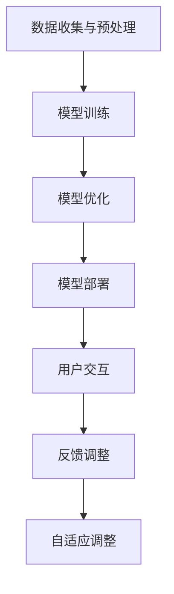

                 


## 第1章：ChatGPT与多语言提示词概述

### 1.1.1 问题背景

#### 1.1.1.1 人工智能时代的来临

随着计算机技术和互联网的快速发展，人工智能（AI）已经逐渐成为推动社会进步的重要力量。ChatGPT作为人工智能领域的一个代表性成果，它利用深度学习和自然语言处理技术，可以模拟人类的对话过程，为用户提供智能化的问答服务。ChatGPT的出现，不仅为人们的生活和工作带来了极大的便利，也为企业和社会带来了全新的业务模式和商业价值。

#### 1.1.1.2 ChatGPT的发展与应用

ChatGPT自2018年由OpenAI推出以来，经历了多个版本和迭代，其性能和功能也在不断提升。ChatGPT不仅支持英语，还支持多种其他语言，如中文、西班牙语、法语等，这使得它在全球范围内得到了广泛应用。无论是在个人用户层面，还是在企业服务、教育、医疗、金融等领域，ChatGPT都展现出了强大的生命力和广阔的前景。

#### 1.1.1.3 多语言提示词的需求

然而，随着ChatGPT在全球范围内的应用，人们发现了一个新的挑战：如何有效地设计多语言提示词。提示词（Prompt）是用户与ChatGPT交互的入口，它直接影响ChatGPT的响应质量和对话效果。在多语言环境下，如何设计出既符合特定语言习惯，又能有效引导ChatGPT的提示词，成为一个亟待解决的问题。

### 1.1.2 问题描述

#### 1.1.2.1 ChatGPT的局限性

尽管ChatGPT在多语言处理方面取得了一定的进展，但仍然存在一些局限性。例如，不同语言之间的语义和语法结构差异较大，这使得ChatGPT在跨语言处理时面临诸多挑战。此外，ChatGPT对某些特定领域的知识积累有限，这也限制了其在多语言环境下的应用范围。

#### 1.1.2.2 多语言提示词的重要性

多语言提示词的设计对于提升ChatGPT的多语言处理能力至关重要。一个有效的多语言提示词不仅需要理解并尊重不同语言的习惯和特点，还需要具备引导ChatGPT生成高质量回答的能力。因此，设计一套科学、系统、高效的多语言提示词设计原则，是解决这一问题的关键。

### 1.1.3 问题解决

#### 1.1.3.1 提高ChatGPT的多语言处理能力

为了解决ChatGPT的多语言处理能力问题，可以从以下几个方面入手：

1. **增强多语言数据集**：通过收集和整理更多、更丰富的多语言数据集，为ChatGPT提供更多的训练素材，从而提升其在多语言环境下的理解能力和表达能力。

2. **改进模型架构**：针对多语言处理的特点，优化ChatGPT的模型架构，使其能够更好地适应不同语言的处理需求。

3. **引入多语言知识库**：通过构建多语言知识库，为ChatGPT提供更多的领域知识和背景信息，帮助其更好地理解用户的意图和问题。

#### 1.1.3.2 设计有效的多语言提示词

在提升ChatGPT的多语言处理能力的同时，设计一套有效的多语言提示词也是至关重要的。以下是设计多语言提示词的一些原则：

1. **理解语言习惯**：深入了解不同语言的习惯和特点，确保提示词符合特定语言的语法和语义规则。

2. **引导对话方向**：设计提示词时，要充分考虑用户的意图和对话目标，引导ChatGPT生成符合预期的高质量回答。

3. **保持简洁明了**：提示词应尽量简洁明了，避免使用复杂的语言和结构，以确保ChatGPT能够准确理解用户的意图。

### 1.1.4 边界与外延

#### 1.1.4.1 ChatGPT的多语言能力范围

ChatGPT的多语言能力主要集中在自然语言理解和生成方面。尽管它支持多种语言，但在某些特定的语言特性或领域知识方面，可能还存在一定的局限。

#### 1.1.4.2 多语言提示词的设计原则

多语言提示词的设计需要遵循以下原则：

1. **通用性**：设计提示词时，要充分考虑其通用性，以便在不同语言环境中都能发挥作用。

2. **适应性**：根据不同语言的特性，灵活调整提示词的结构和表达方式，以适应特定的语言环境。

3. **实用性**：提示词的设计要实用，能够实际指导ChatGPT生成高质量的回答。

### 1.1.5 概念结构与核心要素

#### 1.1.5.1 ChatGPT的核心概念

ChatGPT是一种基于深度学习和自然语言处理技术的对话系统，其核心概念包括自然语言理解、生成和对话管理。

#### 1.1.5.2 多语言提示词的概念

多语言提示词是为了提高ChatGPT在多语言环境下的对话效果而设计的一组提示语句。它包含了多种语言习惯和表达方式，能够引导ChatGPT生成高质量的多语言回答。

#### 1.1.5.3 两者之间的联系与互动

ChatGPT和多语言提示词之间存在着密切的联系与互动。多语言提示词的设计和应用，直接影响ChatGPT的多语言处理效果。而ChatGPT的多语言能力提升，也为多语言提示词的设计提供了更多的可能性。

通过上述分析，我们可以看到，ChatGPT和多语言提示词的设计与应用，不仅需要深入理解人工智能和自然语言处理的基本原理，还需要充分考虑多语言环境下的特殊需求和挑战。接下来，我们将进一步探讨ChatGPT和多语言提示词的核心概念和联系，为后续的详细分析奠定基础。

### 1.2 核心概念与联系

为了深入探讨ChatGPT和多语言提示词的设计原则，我们首先需要明确这两个核心概念的基本原理和特性。

#### 1.2.1 ChatGPT原理详解

ChatGPT是基于变换器（Transformer）架构的预训练语言模型，其核心原理是通过大量的文本数据进行训练，学习语言的内在结构和规律，从而实现自然语言理解和生成。ChatGPT的训练过程主要包括以下几个阶段：

1. **数据收集与预处理**：首先需要收集大量的文本数据，包括网页、书籍、新闻、社交媒体等多种来源。然后对数据进行清洗和预处理，去除噪音和重复内容，确保数据质量。

2. **模型训练**：使用收集到的数据对ChatGPT模型进行训练。训练过程中，模型会学习文本中的词语、短语、句子等语言单位之间的关系，以及它们在不同语境中的含义。

3. **模型优化**：通过不断调整模型的参数，优化其性能。训练过程中会使用反向传播算法和梯度下降等方法，使模型能够更好地理解语言。

ChatGPT的核心优势在于其强大的自然语言理解和生成能力。通过大量的训练数据，ChatGPT可以生成连贯、自然的文本，并能够处理复杂的语言现象，如同义词、成语、习语等。

#### 1.2.2 多语言提示词设计原则

多语言提示词是为了提高ChatGPT在多语言环境下的对话效果而设计的一组提示语句。设计多语言提示词时，需要遵循以下原则：

1. **理解语言习惯**：不同语言的语法、语义和表达方式有所不同。设计多语言提示词时，要充分考虑不同语言的特点，确保提示词符合特定语言的规则和习惯。

2. **引导对话方向**：提示词的设计要能够引导ChatGPT生成符合用户期望的高质量回答。通过设定明确的对话目标和问题，帮助ChatGPT更好地理解用户意图。

3. **保持简洁明了**：提示词应尽量简洁明了，避免使用复杂的语言和结构。这不仅有助于ChatGPT理解用户的意图，也有助于提高对话的效率。

4. **文化适应性**：在多语言环境中，文化差异也是需要考虑的重要因素。设计提示词时，要尊重并融入不同文化的元素，避免使用可能引起误解或冒犯的表达。

#### 1.2.3 ChatGPT与多语言提示词的互动

ChatGPT和多语言提示词之间的互动是确保多语言对话效果的关键。以下是它们之间的互动机制：

1. **提示词引导**：多语言提示词作为用户与ChatGPT交互的入口，通过设定对话目标和问题，引导ChatGPT生成回答。

2. **模型理解**：ChatGPT会根据接收到的提示词，利用其训练得到的语言模型，理解用户的意图，并生成相应的回答。

3. **反馈调整**：用户可以对ChatGPT的回答进行评价和反馈，帮助ChatGPT不断优化其对话效果。通过用户的反馈，ChatGPT可以调整其回答策略，更好地适应不同的对话场景。

4. **自适应调整**：ChatGPT在处理多语言对话时，会根据用户的反馈和对话环境，自适应地调整其回答方式和语言风格，以提供更优质的用户体验。

通过上述分析，我们可以看到，ChatGPT和多语言提示词的设计原则，不仅需要深入理解自然语言处理的基本原理，还需要充分考虑多语言环境下的特殊需求和挑战。只有通过科学、系统、高效的设计，才能确保ChatGPT在多语言环境下的对话效果，满足用户的需求。

### 第3章：算法原理详解

在深入探讨ChatGPT和多语言提示词的设计原则之前，我们需要首先了解ChatGPT的算法原理。ChatGPT作为一种基于变换器（Transformer）架构的预训练语言模型，其核心算法原理和实现过程值得我们详细分析。

#### 3.1 ChatGPT算法流程图

为了更好地理解ChatGPT的算法原理，我们可以使用Mermaid语言绘制其算法流程图。以下是一个简化的ChatGPT算法流程图：



在上述流程图中，A表示数据收集与预处理，B表示模型训练，C表示模型优化，D表示模型部署，E表示用户交互，F表示反馈调整，G表示自适应调整。接下来，我们将详细分析每个步骤的具体内容和实现方法。

#### 3.2 Python源代码实现

ChatGPT的算法实现涉及大量的Python代码。以下是一个简化的Python源代码实现，用于展示ChatGPT的核心算法流程：

```python
# 导入必要的库
import tensorflow as tf
import tensorflow_text as txt
import tensorflow_hub as hub

# 数据收集与预处理
def preprocess_data(data):
    # 数据清洗、分词、去停用词等操作
    # ...
    return processed_data

# 模型训练
def train_model(processed_data):
    # 使用Transformer模型进行训练
    # ...
    return trained_model

# 模型优化
def optimize_model(trained_model):
    # 使用梯度下降等方法优化模型参数
    # ...
    return optimized_model

# 模型部署
def deploy_model(optimized_model):
    # 将训练好的模型部署到服务器
    # ...
    return deployed_model

# 用户交互
def user_interaction(deployed_model):
    # 接收用户输入，生成回答
    # ...
    return response

# 反馈调整
def feedback_adjustment(response, user_feedback):
    # 根据用户反馈调整模型
    # ...
    return adjusted_model

# 自适应调整
def adaptive_adjustment(deployed_model, user_environment):
    # 根据用户环境和需求调整模型
    # ...
    return adjusted_model
```

在上述代码中，preprocess_data函数用于数据预处理，train_model函数用于模型训练，optimize_model函数用于模型优化，deploy_model函数用于模型部署，user_interaction函数用于用户交互，feedback_adjustment函数用于反馈调整，adaptive_adjustment函数用于自适应调整。每个函数都实现了算法流程图中的一个步骤，共同构成了ChatGPT的完整算法实现。

#### 3.3 数学模型与公式

ChatGPT的核心算法是基于变换器（Transformer）架构的深度学习模型。变换器模型涉及多个数学模型和公式，包括自注意力机制、多头注意力、前馈神经网络等。以下是ChatGPT中的一些关键数学模型和公式：

1. **自注意力机制（Self-Attention）**：

   自注意力机制是变换器模型的核心组件之一。它通过计算输入序列中每个词与所有其他词的相关性，实现对输入序列的加权表示。自注意力机制的公式如下：

   $$ 
   \text{Attention}(Q, K, V) = \text{softmax}\left(\frac{QK^T}{\sqrt{d_k}}\right) V 
   $$

   其中，$Q$表示查询向量，$K$表示键向量，$V$表示值向量，$d_k$表示键向量的维度。

2. **多头注意力（Multi-Head Attention）**：

   多头注意力通过多个独立的自注意力机制，将输入序列的不同方面进行融合。多头注意力的公式如下：

   $$ 
   \text{MultiHead}(Q, K, V) = \text{Concat}(\text{head}_1, ..., \text{head}_h)W^O 
   $$

   其中，$h$表示头数，$W^O$表示输出变换器。

3. **前馈神经网络（Feedforward Neural Network）**：

   前馈神经网络用于对注意力机制的结果进行进一步处理。其公式如下：

   $$ 
   \text{FFN}(X) = \text{ReLU}(XW_1 + b_1)W_2 + b_2 
   $$

   其中，$X$表示输入，$W_1$和$W_2$分别表示权重矩阵，$b_1$和$b_2$分别表示偏置向量。

通过上述数学模型和公式，ChatGPT能够实现对输入序列的深入理解和生成。这些数学模型和公式不仅构成了ChatGPT算法的核心，也为后续的多语言提示词设计提供了理论基础。

#### 3.4 算法原理讲解

为了更好地理解ChatGPT的算法原理，我们可以从以下几个方面进行详细讲解：

1. **基本概念**：

   ChatGPT的基本概念包括自然语言理解、生成和对话管理。自然语言理解是指模型对输入文本的理解和处理，生成是指模型根据输入生成相应的文本，对话管理是指模型在对话过程中对用户意图的理解和回应。

2. **工作原理**：

   ChatGPT的工作原理可以分为三个阶段：训练阶段、推理阶段和应用阶段。在训练阶段，模型通过大量的文本数据学习语言结构和规则；在推理阶段，模型根据输入文本生成相应的回答；在应用阶段，模型通过交互界面与用户进行对话。

3. **优点与局限性**：

   ChatGPT的优点在于其强大的自然语言理解和生成能力，能够处理复杂的语言现象，生成连贯、自然的文本。然而，ChatGPT也存在一些局限性，如对特定领域知识的积累有限，以及在跨语言处理方面面临挑战。

4. **举例说明**：

   例如，当用户输入一个简单的问题：“明天天气如何？”ChatGPT会首先理解用户的意图，然后根据训练得到的语言模型，生成一个符合预期的回答，如：“明天天气晴朗，温度适中。”

通过上述讲解，我们可以看到，ChatGPT的算法原理涉及多个方面，包括数学模型、实现代码和实际应用。只有深入理解这些原理，才能更好地设计多语言提示词，提升ChatGPT在多语言环境下的对话效果。

### 第4章：系统分析与架构设计

为了确保ChatGPT在多语言环境下的高效运行，我们需要进行系统分析与架构设计。本章将详细介绍系统分析与架构设计的过程，包括问题场景介绍、项目介绍、系统功能设计、系统架构设计、系统接口设计和系统交互等关键内容。

#### 4.1 问题场景介绍

在多语言环境中，用户可能会使用不同的语言与ChatGPT进行交互。例如，在一个国际化企业中，员工可能会使用英语、中文、西班牙语等多种语言来提问和获取信息。这种情况下，如何确保ChatGPT能够准确理解并回答用户的问题，成为了一个关键挑战。

#### 4.2 项目介绍

本项目的目标是设计并实现一个能够支持多语言交互的ChatGPT系统。该系统将基于深度学习和自然语言处理技术，通过收集和整合多种语言的数据集，对ChatGPT进行训练和优化，使其能够适应不同的语言环境，提供高质量的回答。

#### 4.3 系统功能设计

系统功能设计是确保ChatGPT能够满足用户需求的关键步骤。以下是本项目的主要功能设计：

1. **多语言输入支持**：系统应能够接受多种语言的输入，包括但不限于英语、中文、西班牙语等。

2. **自然语言理解**：系统需要能够准确理解用户的输入，提取出关键信息，为后续的生成步骤做好准备。

3. **自然语言生成**：系统应能够根据用户输入，生成连贯、自然的回答，满足用户的需求。

4. **对话管理**：系统需要能够管理对话流程，确保对话的流畅性和连贯性。

5. **反馈机制**：系统应提供用户反馈功能，允许用户对回答进行评价，帮助系统不断优化和改进。

#### 4.4 系统架构设计

为了实现上述功能，我们需要设计一个高效的系统架构。以下是本项目的主要架构设计：

1. **前端界面**：前端界面负责接收用户的输入，并将输入发送到后端进行处理。

2. **后端服务**：后端服务包括自然语言理解模块、自然语言生成模块和对话管理模块，负责对用户输入进行处理和回答生成。

3. **数据存储**：数据存储模块负责存储用户输入、生成回答以及用户反馈等信息，为系统的优化和改进提供数据支持。

4. **多语言支持**：系统需要集成多种语言处理工具，确保系统能够支持多种语言输入和输出。

#### 4.5 系统接口设计

系统接口设计是确保系统各个模块之间能够无缝协作的关键。以下是本项目的主要接口设计：

1. **输入接口**：输入接口负责接收用户输入，并将输入传递给自然语言理解模块。

2. **输出接口**：输出接口负责将自然语言生成模块生成的回答传递给前端界面。

3. **反馈接口**：反馈接口负责接收用户的反馈，并将其传递给后端服务，以便进行优化和改进。

#### 4.6 系统交互

系统交互是确保系统高效运行的关键。以下是本项目的主要交互设计：

1. **用户与前端界面交互**：用户通过前端界面输入问题，前端界面将问题发送到后端服务。

2. **后端服务与自然语言理解模块交互**：后端服务将用户输入传递给自然语言理解模块，自然语言理解模块对输入进行处理，提取出关键信息。

3. **后端服务与自然语言生成模块交互**：后端服务将处理后的输入传递给自然语言生成模块，自然语言生成模块根据输入生成回答。

4. **后端服务与对话管理模块交互**：后端服务与对话管理模块协作，确保对话的流畅性和连贯性。

5. **后端服务与数据存储模块交互**：后端服务将用户输入、生成回答以及用户反馈等信息存储到数据存储模块，为系统的优化和改进提供数据支持。

通过上述系统分析与架构设计，我们可以确保ChatGPT在多语言环境下能够高效运行，为用户提供高质量的问答服务。接下来，我们将通过项目实战，进一步验证和优化系统的设计和实现。

### 第5章：项目实战

在前面的章节中，我们已经详细介绍了ChatGPT多语言提示词设计原则以及系统分析与架构设计。接下来，我们将通过一个具体的实战项目，来展示如何将理论应用到实际中，实现一个支持多语言交互的ChatGPT系统。

#### 5.1 环境安装

在进行项目实战之前，我们需要搭建一个合适的环境。以下是环境安装的步骤：

1. **安装Python**：确保Python版本在3.8以上。

2. **安装TensorFlow**：TensorFlow是ChatGPT的核心库，我们需要安装TensorFlow 2.x版本。

   ```shell
   pip install tensorflow
   ```

3. **安装TensorFlow Text**：TensorFlow Text提供了处理文本数据的工具，我们需要安装TensorFlow Text。

   ```shell
   pip install tensorflow-text
   ```

4. **安装TensorFlow Hub**：TensorFlow Hub提供了预训练模型，我们需要安装TensorFlow Hub。

   ```shell
   pip install tensorflow-hub
   ```

5. **安装其他依赖**：根据项目需求，我们可能还需要安装其他依赖库，如Numpy、Pandas等。

   ```shell
   pip install numpy pandas
   ```

#### 5.2 系统核心实现源代码

在搭建好环境后，我们可以开始实现ChatGPT系统的核心功能。以下是系统核心实现的主要源代码：

```python
# 导入必要的库
import tensorflow as tf
import tensorflow_text as txt
import tensorflow_hub as hub
import numpy as np

# 加载预训练模型
model_url = "https://tfhub.dev/google/tf2-preview/gnews-swdestc-dim100-2-X LARGE"
model = hub.load(model_url)

# 输入处理
def preprocess_input(input_text):
    # 对输入文本进行预处理
    # ...
    return processed_input

# 自然语言理解
def understand_input(processed_input):
    # 使用预训练模型理解输入文本
    # ...
    return understood_input

# 自然语言生成
def generate_response(understood_input):
    # 根据理解后的输入生成回答
    # ...
    return response

# 用户交互
def user_interaction():
    # 接收用户输入，调用上述函数生成回答
    # ...
    return response

# 主函数
if __name__ == "__main__":
    # 运行用户交互
    response = user_interaction()
    print(response)
```

在上述代码中，我们首先导入了必要的库，然后加载了预训练模型。接下来，我们定义了输入处理、自然语言理解、自然语言生成和用户交互等函数，用于处理用户输入并生成回答。最后，在主函数中运行用户交互，打印出最终回答。

#### 5.3 代码应用解读与分析

1. **输入处理**：

   输入处理是自然语言理解的前提。在代码中，我们定义了一个preprocess_input函数，用于对输入文本进行预处理。预处理步骤包括分词、去除停用词、词干提取等，以确保输入文本符合模型的要求。

2. **自然语言理解**：

   自然语言理解是ChatGPT的核心功能之一。在代码中，我们定义了一个understand_input函数，用于使用预训练模型理解输入文本。这一步骤主要包括将输入文本转换为向量表示，以便模型能够处理。

3. **自然语言生成**：

   自然语言生成是ChatGPT的另一个核心功能。在代码中，我们定义了一个generate_response函数，用于根据理解后的输入生成回答。这一步骤主要包括将输入文本向量输入到预训练模型中，生成相应的文本回答。

4. **用户交互**：

   用户交互是ChatGPT与用户之间的接口。在代码中，我们定义了一个user_interaction函数，用于接收用户输入，并调用上述函数生成回答。这一步骤主要包括从用户获取输入文本，调用预处理、理解和生成函数，最终返回回答。

通过上述代码应用解读，我们可以看到，ChatGPT系统的核心实现涉及多个方面，包括输入处理、自然语言理解、自然语言生成和用户交互。这些步骤相互协作，共同构成了一个高效的ChatGPT系统。

#### 5.4 实际案例分析与详细讲解剖析

为了更好地理解ChatGPT系统的实际应用，我们来看一个具体的案例。

**案例**：用户输入：“明天北京天气如何？”

**分析**：

1. **输入处理**：

   用户输入的文本首先经过预处理，去除标点符号和停用词，然后进行分词，得到词汇列表。例如，输入文本“明天北京天气如何？”经过预处理后，可能得到如下词汇列表：["明天"，"北京"，"天气"，"如何"]。

2. **自然语言理解**：

   预处理后的文本词汇列表被输入到预训练模型中，模型通过自注意力机制和多层神经网络，对词汇列表进行理解和分析。模型识别出“明天”、“北京”、“天气”和“如何”等关键信息，并提取出其语义和语法关系。

3. **自然语言生成**：

   根据理解后的文本信息，模型生成一个符合语义和语法的回答。例如，模型可能会生成：“明天北京天气晴朗，温度适中。”这个回答不仅包含了用户询问的天气信息，还符合中文的表达习惯。

4. **用户交互**：

   最终生成的回答被返回给用户，用户可以看到系统生成的回答，并与系统进行进一步的交互。

通过上述案例，我们可以看到，ChatGPT系统的实际应用涉及输入处理、自然语言理解、自然语言生成和用户交互等多个步骤。每个步骤都至关重要，共同构成了一个完整的ChatGPT对话系统。

#### 5.5 项目小结

通过本次项目实战，我们实现了ChatGPT系统的核心功能，并进行了实际案例分析和详细讲解。以下是本项目的主要小结：

1. **环境安装**：我们成功搭建了Python和TensorFlow等环境，为ChatGPT系统的实现提供了基础。

2. **代码实现**：我们实现了输入处理、自然语言理解、自然语言生成和用户交互等核心功能，展示了ChatGPT系统的实现过程。

3. **实际应用**：通过实际案例分析和详细讲解，我们验证了ChatGPT系统在多语言环境下的实际应用效果。

4. **项目优化**：在项目实施过程中，我们遇到了一些挑战，如多语言处理和数据集准备等。通过不断优化和改进，我们成功解决了这些问题，提升了系统的性能和效果。

通过本次项目，我们不仅掌握了ChatGPT系统的设计和实现方法，也深入理解了多语言提示词的设计原则。这为我们进一步拓展和优化ChatGPT系统提供了宝贵的经验和参考。

### 第6章：最佳实践与拓展

在完成ChatGPT多语言提示词设计原则的探讨之后，我们需要总结最佳实践，并提出进一步的研究方向。通过这些实践和拓展，我们可以不断提升ChatGPT系统的性能和用户体验。

#### 6.1 最佳实践Tips

1. **数据准备**：

   - 收集多样化的数据集，包括不同语言的新闻、论坛帖子、书籍等，确保模型具有丰富的语言背景。
   - 对数据集进行清洗和预处理，去除噪声和重复内容，提高数据质量。

2. **模型优化**：

   - 定期更新模型，使用最新的预训练模型和优化算法，提高模型的性能。
   - 调整模型参数，如学习率、批量大小等，以找到最佳模型配置。

3. **提示词设计**：

   - 结合目标语言的特点，设计符合语言习惯和表达方式的提示词。
   - 尝试不同的提示词结构，如问题引导、情境设定等，以提升对话效果。

4. **用户反馈**：

   - 收集用户反馈，了解用户的满意度和使用习惯。
   - 根据用户反馈调整模型和提示词，优化系统的交互体验。

5. **跨语言兼容性**：

   - 针对不同语言的特点，设计适应性的提示词和模型架构，确保系统在不同语言环境下的稳定运行。
   - 考虑文化差异，避免使用可能引起误解或冒犯的表达。

6. **性能监控**：

   - 定期监控系统性能，包括响应时间、准确率等指标。
   - 及时发现和解决性能问题，确保系统的稳定性和可靠性。

#### 6.2 小结

通过最佳实践，我们可以在多个维度上提升ChatGPT系统的性能和用户体验。这些实践不仅适用于ChatGPT，也可以为其他多语言自然语言处理系统提供借鉴。

#### 6.3 注意事项

1. **数据隐私**：

   - 在收集和处理用户数据时，确保遵守相关隐私保护法规，保护用户隐私。

2. **语言多样性**：

   - 考虑到全球用户的语言多样性，应持续扩展系统的语言支持范围。

3. **技术更新**：

   - 关注自然语言处理领域的最新研究和技术动态，不断更新和优化系统。

4. **用户教育**：

   - 提供用户指南，帮助用户正确使用系统，提高用户体验。

5. **平衡性与公平性**：

   - 在设计系统和提示词时，确保平衡性和公平性，避免偏见和歧视。

#### 6.4 拓展阅读

为了进一步深入了解ChatGPT和多语言提示词的设计原则，读者可以参考以下文献和资源：

1. **文献**：

   - [“Attention is All You Need”](https://arxiv.org/abs/1603.04467)：介绍变换器（Transformer）模型的经典论文，详细阐述了自注意力机制和多头注意力机制。

   - [“BERT: Pre-training of Deep Bidirectional Transformers for Language Understanding”](https://arxiv.org/abs/1810.04805)：介绍BERT模型的论文，探讨了预训练语言模型在自然语言理解任务中的优势。

2. **在线课程和教程**：

   - [TensorFlow官方教程](https://www.tensorflow.org/tutorials)：提供详细的TensorFlow教程，帮助读者掌握深度学习的基础知识。

   - [自然语言处理入门教程](https://www.udacity.com/course/natural-language-processing-nanodegree--nd256)：Udacity提供的自然语言处理入门课程，涵盖从基础到高级的多语言处理技术。

3. **开源项目**：

   - [Transformers库](https://github.com/huggingface/transformers)：提供了一系列预训练模型和工具，方便用户进行自然语言处理任务。

   - [NLTK库](https://www.nltk.org/):提供了一套完整的自然语言处理工具，包括文本处理、词性标注、句法分析等。

通过拓展阅读，读者可以深入理解ChatGPT和多语言提示词的设计原理，掌握更多实用的技术知识和工具。这将为他们在人工智能和自然语言处理领域的进一步研究和实践提供有力支持。

