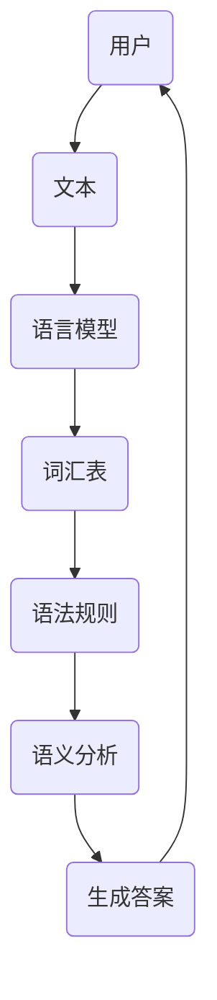

                 

### 《ChatGPT多语言支持的提示词设计》

#### 关键词：
- ChatGPT
- 多语言支持
- 提示词设计
- 人工智能

#### 摘要：
本文将探讨ChatGPT在多语言支持方面的提示词设计，分析其背景、核心概念、设计原则以及实例分析。通过深入了解多语言提示词的设计策略，我们将展望其未来趋势，并总结出最佳实践，为读者提供一套全面的多语言提示词设计指南。

---

### 第一部分：背景介绍与核心概念

#### 第1章：多语言支持的背景与重要性

##### 1.1.1 人类语言的多样性

人类语言的多样性是自然选择的结果。全球约有7000种语言，其中绝大多数处于濒危状态。语言不仅承载着文化、历史和身份认同，更是沟通与交流的桥梁。随着全球化进程的加快，多语言支持在各个领域变得至关重要。

##### 1.1.2 人工智能与多语言交互

人工智能（AI）在多语言交互中的应用日益广泛。从翻译服务到语音助手，从客服机器人到多语言对话系统，AI正在改变人们的生活方式。然而，实现高效的多语言交互仍面临诸多挑战。

##### 1.1.3 多语言支持的挑战与机遇

多语言支持的挑战包括语言的复杂性、文化差异、计算资源限制等。但同时，这也带来了巨大的机遇。掌握多语言支持，可以为企业和个人带来更多的商业机会和社交便利。

#### 第2章：ChatGPT与多语言交互

##### 2.1.1 ChatGPT简介

ChatGPT是由OpenAI开发的一种基于GPT-3模型的自然语言处理工具。它具备强大的文本生成能力，可以应用于对话系统、文本摘要、机器翻译等多个领域。

##### 2.1.2 ChatGPT的多语言能力

ChatGPT支持多种语言的输入和输出，包括但不限于英语、中文、法语、西班牙语等。这使得它在多语言交互中具有独特的优势。

##### 2.1.3 ChatGPT在多语言交互中的应用场景

ChatGPT的多语言能力使其在多个应用场景中得以发挥。例如，客服机器人可以使用多语言与客户沟通，在线教育平台可以提供多语言教学内容，跨国公司可以使用多语言内部沟通工具等。

#### 第3章：多语言提示词设计的基本原则

##### 3.1.1 提示词的设计理念

提示词设计的目标是引导ChatGPT生成符合预期的高质量回答。在设计提示词时，需要遵循一致性、明确性和多样性的原则。

##### 3.1.2 提示词的语法结构

提示词的语法结构直接影响ChatGPT的生成效果。合理的设计提示词结构，可以提高生成的准确性和流畅性。

##### 3.1.3 提示词的多语言适应性

提示词需要具备多语言适应性，以满足不同语言用户的需求。这包括考虑语言特征、文化差异和语法规则等。

---

### 第二部分：核心概念与联系

#### 第4章：核心概念与联系

##### 4.1.1 多语言处理中的核心概念

多语言处理涉及多个核心概念，如词汇表、语法规则、语义分析等。理解这些概念有助于更好地设计提示词。

##### 4.1.2 概念属性特征对比表格

以下是一个概念属性特征对比表格，展示不同语言的核心概念特征：

| 概念       | 英文（English） | 中文（Chinese） | 法语（French） |
|------------|-----------------|-----------------|----------------|
| 名词       | Noun            | 名词            | Nom            |
| 动词       | Verb            | 动词            | Verbe          |
| 形容词     | Adjective       | 形容词          | Adjectif       |
| 副词       | Adverb          | 副词            | Adverbe        |

##### 4.1.3 ER实体关系图架构

以下是一个多语言处理的ER实体关系图架构，用于展示不同语言实体之间的关系：

---

### 第三部分：多语言提示词设计实例分析

#### 第5章：多语言提示词设计实例分析

##### 5.1.1 中文到英文的提示词设计

中文到英文的提示词设计需要注意语言转换的准确性。以下是一个中文到英文的提示词实例：

中文：请描述一下人工智能的应用场景。

英文：Please describe the application scenarios of artificial intelligence.

##### 5.1.2 英文到中文的提示词设计

英文到中文的提示词设计同样需要考虑翻译的准确性和流畅性。以下是一个英文到中文的提示词实例：

英文：How does machine learning work?

中文：机器学习是如何工作的？

##### 5.1.3 其他语言的提示词设计

其他语言的提示词设计需要结合具体语言的语法规则和文化背景。以下是一个法语到中文的提示词实例：

法语：Expliquez le fonctionnement de l'apprentissage automatique.

中文：请解释一下机器学习的原理。

---

### 第四部分：多语言提示词设计策略

#### 第6章：多语言提示词设计策略

##### 6.1.1 通用策略

通用策略包括明确目标、优化语法结构、考虑文化差异等。以下是一个通用策略的示例：

1. 明确目标：确保提示词清晰明确，避免歧义。
2. 优化语法结构：遵循目标语言的语法规则，提高生成文本的流畅性。
3. 考虑文化差异：尊重不同文化的表达习惯，避免造成误解。

##### 6.1.2 针对性策略

针对性策略根据具体应用场景和目标用户群体进行定制。以下是一个针对性策略的示例：

1. 对话系统：使用简洁、直观的提示词，提高用户交互体验。
2. 文本摘要：使用概括性、逻辑性的提示词，提高摘要质量。
3. 机器翻译：使用准确、自然的提示词，提高翻译质量。

##### 6.1.3 策略优化与评估

策略优化与评估是提高提示词设计效果的关键。以下是一个策略优化与评估的示例：

1. 数据收集：收集多语言交互数据，分析问题所在。
2. 实验对比：对不同的提示词设计策略进行实验对比，找出最佳策略。
3. 持续改进：根据评估结果，持续优化提示词设计策略。

---

### 第五部分：多语言提示词设计的未来趋势

#### 第7章：多语言提示词设计的未来趋势

##### 7.1.1 技术发展趋势

随着人工智能技术的不断发展，多语言提示词设计将更加智能化、个性化。例如，基于深度学习的提示词生成模型将更加普及，用户自定义提示词功能将得到提升。

##### 7.1.2 行业应用前景

多语言提示词设计在各个行业具有广泛的应用前景。例如，在跨国公司内部沟通、全球在线教育、跨语言客服等领域，多语言提示词设计将发挥重要作用。

##### 7.1.3 未来展望与挑战

未来，多语言提示词设计将面临以下挑战：

1. 语言多样性：如何处理更多、更复杂的语言？
2. 文化差异：如何平衡文化差异，实现跨文化沟通？
3. 智能化：如何进一步提高提示词生成的智能化水平？

---

### 第六部分：总结与展望

#### 第8章：总结与展望

##### 8.1.1 本书内容的总结

本书系统介绍了ChatGPT多语言支持的提示词设计，包括背景介绍、核心概念、设计原则、实例分析和未来趋势。通过本书的学习，读者可以全面了解多语言提示词设计的实践方法。

##### 8.1.2 多语言提示词设计的注意事项

在多语言提示词设计过程中，需要注意以下几点：

1. 确保提示词清晰明确，避免歧义。
2. 考虑语言转换的准确性和流畅性。
3. 尊重不同文化的表达习惯。
4. 持续优化提示词设计策略。

##### 8.1.3 拓展阅读与进一步研究

为了深入了解多语言提示词设计，读者可以进一步阅读以下文献：

1. “Natural Language Processing with Deep Learning” by Richard L. Xiao
2. “Chatbots: The Revolution in Customer Service” by Michael Fern
3. “Cross-Cultural Communication in Global Organizations” by Elizabeth J. Nokes

---

### 作者信息

作者：AI天才研究院/AI Genius Institute & 禅与计算机程序设计艺术 /Zen And The Art of Computer Programming

---

本文为AI天才研究院（AI Genius Institute）和禅与计算机程序设计艺术（Zen And The Art of Computer Programming）联合出品，旨在为读者提供关于ChatGPT多语言支持的提示词设计的全面指南。本文内容仅供参考，如有不当之处，敬请指正。

