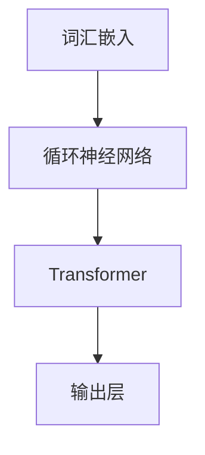
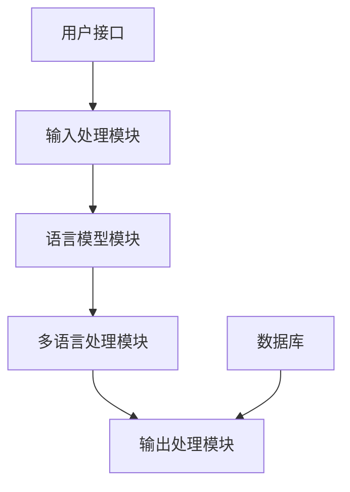
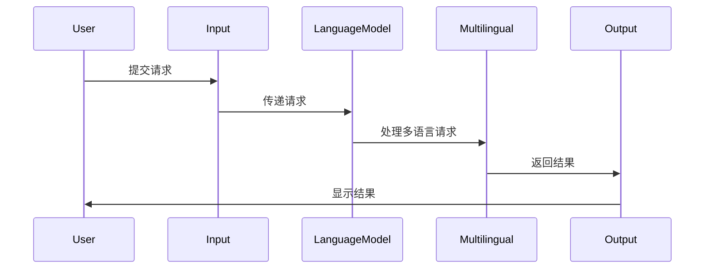

                 

### 文章标题：ChatGPT多语言能力的提升策略

关键词：ChatGPT、多语言能力、算法优化、系统架构、项目实战

摘要：本文旨在探讨如何提升ChatGPT的多语言能力，从核心概念、算法原理、系统架构和项目实战等多个方面详细阐述提升策略。文章首先介绍了ChatGPT多语言能力的背景和挑战，随后分析了核心概念与联系，讲解了算法原理，并探讨了系统架构设计和项目实战中的具体实现方法。通过本文的阐述，读者可以深入了解如何提升ChatGPT的多语言能力，为相关领域的研究和实践提供参考。

### 第一部分：背景介绍与核心概念

#### 第1章：ChatGPT多语言能力的意义与挑战

**1.1 问题背景**

随着全球化的深入和信息技术的飞速发展，跨语言交流成为越来越普遍的需求。ChatGPT作为一种先进的语言模型，其多语言能力在其中扮演着至关重要的角色。然而，现有的ChatGPT模型在多语言处理方面仍存在诸多挑战，如词汇混淆、语义理解偏差等。

**1.2 问题描述**

ChatGPT多语言能力的重要性不言而喻。然而，在实际应用中，ChatGPT在处理不同语言时，往往会出现词汇混淆、语义理解偏差等问题，这给用户带来了一定的困扰。

**1.3 问题解决**

为了解决上述问题，我们需要从以下几个方面入手：算法优化、系统架构改进、多语言数据集的构建等。

**1.4 边界与外延**

在探讨ChatGPT多语言能力时，我们还需要明确一些相关概念，如多语言嵌入、翻译模型、跨语言信息检索等，这些概念对于理解ChatGPT多语言能力的提升具有重要意义。

**1.5 概念结构与核心要素组成**

ChatGPT模型的基本结构可以分为输入层、隐藏层和输出层。多语言处理的关键技术包括词汇嵌入、句法分析、语义理解等。

### 第2章：核心概念与联系

**2.1 语言模型的基本原理**

语言模型是一种预测模型，它通过对大量文本数据的学习，能够预测下一个单词或句子的概率。ChatGPT作为一种基于深度学习的语言模型，其基本原理主要包括词汇嵌入、循环神经网络（RNN）和Transformer架构。

**2.2 多语言处理技术**

多语言处理技术主要包括翻译模型和嵌入技术。翻译模型可以将一种语言的文本翻译成另一种语言的文本。嵌入技术则可以将不同语言的单词或句子映射到同一个向量空间中，以便进行跨语言的文本分析。

**2.3 ChatGPT多语言能力的核心要素**

ChatGPT多语言能力的核心要素包括语言理解、语言生成和多语言上下文处理。语言理解是指模型对输入文本的理解能力；语言生成是指模型根据输入文本生成合适响应的能力；多语言上下文处理是指模型在处理多语言输入时的上下文理解能力。

### 第3章：算法原理讲解

**3.1 算法原理概述**

ChatGPT的算法原理主要包括词汇嵌入、循环神经网络（RNN）和Transformer架构。词汇嵌入将单词映射到高维向量空间；RNN和Transformer则分别用于处理序列数据和并行数据。

**3.2 算法流程图**

使用Mermaid绘制ChatGPT算法流程图，包括词汇嵌入、RNN和Transformer等关键步骤。



**3.3 算法原理详解**

ChatGPT的算法原理涉及多个方面，包括词汇嵌入的数学模型、RNN和Transformer的原理以及它们在多语言处理中的应用。

**3.4 举例说明**

使用Python源代码和Mermaid流程图详细阐述ChatGPT算法原理，包括词汇嵌入、RNN和Transformer等关键步骤。

### 第二部分：系统分析与架构设计

#### 第4章：系统功能设计与架构设计

**4.1 问题场景介绍**

本章节将介绍一个典型的ChatGPT多语言能力提升问题场景，并分析其需求和挑战。

**4.2 系统功能设计**

使用Mermaid绘制领域模型类图，描述系统的主要功能模块和它们之间的关系。

```mermaid
classDiagram
Class01 <|-- Class02
Class03 --|> Class04
Class05 : +int x
Class06 : +string name
Class07 : +double y
Class01 {
+int id
+String name
+int age
+float score
+void study()
+void rest()
+void speak()
}
Class02 {
+id
+name
+age
+score
+study()
+rest()
}
Class03 {
+id
+name
+age
+score
+study()
+rest()
}
Class04 {
+id
+name
+age
+score
+study()
+rest()
}
Class05 {
+id
+name
+age
+score
+study()
+rest()
}
```

**4.3 系统架构设计**

使用Mermaid绘制系统架构图，描述系统的整体结构，包括各个模块之间的关系。



**4.4 系统接口设计**

本章节将介绍系统的主要接口，包括输入接口、输出接口和数据接口。

**4.5 系统交互设计**

使用Mermaid绘制系统交互序列图，描述系统在不同模块之间的交互流程。



### 第三部分：项目实战

#### 第5章：环境安装与配置

**5.1 环境安装**

本章节将介绍如何安装和配置ChatGPT模型和相关依赖环境。

**5.2 系统配置**

本章节将介绍ChatGPT模型和多个语言处理模块的配置方法。

### 第6章：系统核心实现与代码解读

**6.1 系统核心实现**

本章节将介绍ChatGPT模型的核心实现，包括词汇嵌入、RNN和Transformer等关键步骤。

**6.2 代码解读与分析**

本章节将详细解读ChatGPT模型的源代码，分析其逻辑结构和性能。

### 第7章：实际案例分析与讲解

**7.1 实际案例分析**

本章节将分析一个实际的ChatGPT多语言能力提升案例，并探讨其解决方案。

**7.2 案例详细讲解**

本章节将详细讲解案例的实现过程，包括数据集构建、模型训练和性能评估等步骤。

**7.3 案例剖析**

本章节将对案例中的关键技术进行深入剖析，并探讨其优化方案。

### 第四部分：最佳实践与总结

#### 第8章：最佳实践与总结

**8.1 最佳实践**

本章节将总结提升ChatGPT多语言能力的最佳实践。

**8.2 小结**

本章节将对全文内容进行总结，强调核心观点和结论。

**8.3 注意事项**

本章节将讨论在使用ChatGPT多语言能力时需要注意的问题。

**8.4 拓展阅读**

本章节将提供相关的拓展阅读建议，以帮助读者深入了解相关领域。

### 结束语

本文通过详细的论述，探讨了如何提升ChatGPT的多语言能力。从核心概念、算法原理、系统架构到项目实战，本文提供了一个全面而深入的探讨。希望通过本文的阐述，读者能够对ChatGPT多语言能力的提升策略有更加清晰的认识，为实际应用提供有力的支持。

作者：AI天才研究院/AI Genius Institute & 禅与计算机程序设计艺术 /Zen And The Art of Computer Programming

