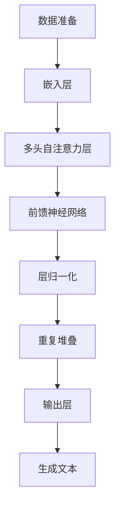

                 

### 问题背景与描述

在当今的数字化时代，人工智能（AI）技术正迅速改变着我们的生活和工作方式。作为AI的一个关键分支，自然语言处理（NLP）技术已经取得了显著进展，使得计算机能够理解和生成自然语言。然而，随着个性化服务的需求日益增长，传统的NLP解决方案面临着诸多挑战。为了满足用户对于更定制化、更智能的交互体验，个性化AI助手的概念应运而生。

#### AI与自然语言处理技术的发展趋势

过去几十年，AI和NLP领域取得了飞速发展。从最初的规则驱动方法到基于统计的方法，再到如今深度学习的广泛应用，NLP技术经历了多次革命。深度学习模型的引入，特别是基于Transformer架构的模型，如GPT（Generative Pre-trained Transformer），使得计算机在理解自然语言方面取得了巨大突破。GPT模型通过大规模的预训练，能够在各种任务中表现出色，从机器翻译到文本生成，再到问答系统。

#### 个性化服务的需求与挑战

随着互联网的普及，人们越来越依赖智能设备和服务。用户对于个性化、定制化的需求日益增长，他们希望AI系统能够理解自己的需求，提供个性化的建议和帮助。然而，传统的NLP解决方案往往是通用性的，无法充分满足个性化的需求。这种需求与传统的NLP技术之间的矛盾，推动了个性化AI助手的研究和发展。

#### ChatGPT的角色与潜力

ChatGPT，即生成预训练的变换器（Generative Pre-trained Transformer），是OpenAI于2022年推出的一款基于Transformer架构的NLP模型。ChatGPT在预训练阶段接受了大量的文本数据进行训练，从而具备了强大的语言理解和生成能力。它的独特之处在于，不仅能够生成连贯、自然的文本，还能够根据用户输入的上下文进行理解和响应。

ChatGPT的潜力在于其高度的可定制性。通过微调（Fine-tuning）和续写（Sample Generation），ChatGPT可以轻松地适应不同的应用场景，如客服助手、内容生成、教育辅导等。这使得ChatGPT成为构建个性化AI助手的一个重要选择。

### 问题描述

尽管AI和NLP技术取得了显著进步，但现有的解决方案仍存在一些问题和不足：

1. **通用性不足**：许多NLP系统缺乏个性化，难以满足用户特定的需求。
2. **定制成本高**：传统的定制化NLP解决方案往往需要大量的时间和资源，成本较高。
3. **用户体验差**：一些系统在处理个性化请求时表现不佳，导致用户体验不佳。

为了解决这些问题，个性化AI助手的概念被提出。个性化AI助手通过定制化的训练和优化，能够更好地理解用户的需求，提供更加精准和个性化的服务。然而，要实现这一目标，需要解决以下几个关键问题：

1. **数据准备与预处理**：个性化AI助手需要大量高质量的用户数据，并进行有效的预处理，以支持模型的训练。
2. **模型微调**：现有的NLP模型如ChatGPT需要通过微调来适应特定的应用场景，这需要精细的参数调整和优化。
3. **对话管理**：个性化AI助手需要能够处理复杂的对话流程，理解用户的意图和上下文，并提供连贯、自然的回答。

总之，个性化AI助手的崛起，不仅满足了用户对定制化服务的需求，也为AI技术带来了新的发展机遇。接下来，我们将深入探讨ChatGPT定制化的具体实现路径，以及其在各个领域的应用潜力。

#### ChatGPT定制化的概念

ChatGPT定制化，是指通过对ChatGPT模型进行特定化的训练和调整，使其能够满足特定用户或场景的需求。这种定制化不仅仅是简单的模型调整，而是一个复杂的过程，包括数据准备、模型训练、微调优化等多个步骤。

首先，数据准备是ChatGPT定制化的基础。为了使模型能够准确理解特定用户的需求，我们需要收集大量相关的文本数据。这些数据可以是用户的对话记录、专业领域的文本资料，甚至是特定行业的新闻报告等。在数据准备阶段，我们需要对数据质量进行严格把控，确保数据的一致性和准确性。

接下来是模型训练。ChatGPT作为基于Transformer架构的预训练模型，其核心能力来自于大规模的预训练过程。在这个阶段，模型通过对海量文本数据进行学习，掌握了丰富的语言模式和语义信息。然而，为了实现定制化，我们通常需要对预训练模型进行进一步的训练，使其能够更好地适应特定任务。这一过程称为微调（Fine-tuning）。

微调的核心步骤包括以下几个环节：

1. **选择微调任务**：确定需要微调的具体任务，如问答系统、对话生成等。
2. **数据集划分**：将准备好的数据集划分为训练集、验证集和测试集，用于模型训练和评估。
3. **模型结构调整**：根据任务需求，对预训练模型的结构进行调整。例如，增加或删除特定层，调整隐藏层的尺寸等。
4. **参数优化**：通过优化算法（如梯度下降、Adam优化器等）调整模型参数，使模型在特定任务上表现更优。

在微调过程中，我们还需要关注以下几个方面：

- **训练策略**：选择合适的训练策略，如逐步减少学习率、使用学习率预热等，以防止模型过拟合。
- **模型评估**：定期评估模型在验证集上的性能，调整模型结构和参数，以实现最佳性能。
- **多样性**：确保模型生成的回答具有多样性，避免生成过于刻板或重复的回答。

除了微调和训练，定制化ChatGPT还需要考虑对话管理。对话管理是指在整个对话过程中，模型如何理解用户的意图、处理对话流程，并生成连贯、自然的回答。在定制化过程中，我们需要设计特定的对话管理策略，以适应不同场景下的用户需求。

总之，ChatGPT定制化是一个系统性的工程，涉及多个关键步骤和环节。通过精细化的数据准备、模型训练和微调优化，我们可以构建出能够满足特定用户需求的个性化AI助手。接下来，我们将进一步探讨ChatGPT定制化的具体实现路径，包括技术细节和应用案例。

#### 边界与外延

在讨论ChatGPT定制化时，我们不仅要关注其核心概念，还需要明确其边界与外延。首先，让我们定义一下什么是“定制化”。在技术领域，定制化通常指的是根据特定用户或场景的需求，对系统或产品进行特定的调整和优化，以达到最佳性能和用户体验。

**定制化的定义与范围**

定制化的定义可以进一步细分为以下几个方面：

1. **目标用户群体**：定制化主要面向那些对产品或服务有特定需求的用户群体。这些用户可能来自于不同的行业和领域，如金融、医疗、教育等。
2. **应用场景**：定制化的范围涵盖了各种应用场景，包括但不限于客户服务、内容生成、智能问答、教育辅导等。
3. **需求分析**：在进行定制化之前，需要对用户的实际需求进行详细分析，包括他们的偏好、习惯、行为模式等。

**技术与应用领域的边界**

尽管ChatGPT定制化在多个领域具有广泛应用潜力，但仍然存在一些技术和应用领域的边界。以下是一些关键点：

1. **数据隐私与安全**：在定制化过程中，数据的安全性和隐私保护是至关重要的问题。尤其是涉及到个人敏感信息时，必须采取严格的安全措施。
2. **模型性能与计算资源**：定制化模型通常需要更多的计算资源和时间来训练和优化。在某些资源受限的环境中，定制化可能难以实现。
3. **技术复杂性**：ChatGPT的定制化涉及复杂的算法和技术，如深度学习、自然语言处理等。这要求开发团队具备较高的技术能力和专业知识。
4. **监管与合规**：在不同的国家和地区，数据保护法和隐私法规有所不同。在定制化过程中，需要确保符合当地的法律和法规要求。

**概念结构与核心要素组成**

为了更好地理解ChatGPT定制化的概念结构，我们可以将其分解为以下几个核心要素：

1. **数据准备与预处理**：数据是模型训练的基础，因此数据的质量和准备至关重要。包括数据收集、清洗、标注等步骤。
2. **模型训练与微调**：基于预训练的ChatGPT模型，通过特定的数据集进行微调和训练，以适应特定的任务和应用场景。
3. **对话管理**：设计有效的对话管理策略，确保模型能够理解和回应用户的意图，保持对话的自然性和连贯性。
4. **性能评估与优化**：定期评估模型在特定任务上的性能，并根据评估结果进行优化，以提高模型的准确性和用户体验。

**总结**

通过明确ChatGPT定制化的边界与外延，我们不仅能够更好地理解其应用范围和技术挑战，还能够为未来的研究和开发提供方向。接下来，我们将进一步探讨ChatGPT的核心概念原理，帮助读者深入理解这一先进技术的本质。

### ChatGPT基础

在深入了解ChatGPT定制化之前，我们需要先理解ChatGPT本身的基础概念和特点。ChatGPT是由OpenAI开发的一款基于Transformer架构的自然语言处理模型，它在大规模文本预训练的基础上，通过微调和续写，实现了对特定任务的适应和优化。

#### ChatGPT的定义与特点

ChatGPT，全称为生成预训练的变换器（Generative Pre-trained Transformer），是一种基于Transformer架构的深度学习模型。Transformer模型是由Vaswani等人于2017年提出的一种全新的序列到序列模型，它基于自注意力机制（self-attention），能够捕捉长距离的依赖关系，从而在许多NLP任务中表现出色。

ChatGPT的特点主要包括：

1. **大规模预训练**：ChatGPT在训练过程中使用了数以万亿计的单词，通过预训练获得了丰富的语言知识和模式。
2. **自注意力机制**：Transformer模型中的自注意力机制允许模型在生成文本时，同时考虑输入序列中的所有单词，从而生成更加连贯和自然的文本。
3. **灵活的微调能力**：通过微调（Fine-tuning），ChatGPT可以快速适应不同的任务和应用场景。

#### ChatGPT的核心概念原理

ChatGPT的核心概念可以归结为以下几个方面：

1. **Transformer架构**：Transformer模型是一种基于自注意力机制的序列模型，它通过多头注意力机制和多层结构，能够有效地捕捉长距离依赖关系。其基本架构包括嵌入层（Embedding Layer）、多头自注意力层（Multi-Head Self-Attention Layer）、前馈神经网络（Feedforward Neural Network）和层归一化（Layer Normalization）。

2. **预训练与微调**：预训练是指模型在大量无标签数据上进行训练，以学习通用的语言特征。微调则是在预训练的基础上，使用特定领域的数据对模型进行进一步训练，使其能够适应特定任务。

3. **上下文理解**：ChatGPT通过预训练，能够理解输入文本的上下文信息，并在生成回答时考虑这些信息。这种能力使得ChatGPT能够生成连贯、自然的对话。

#### 概念属性特征对比表格

为了更清晰地展示ChatGPT与其他NLP模型的差异，我们可以通过一个对比表格来描述其概念属性特征：

| 特征              | ChatGPT                  | 其他NLP模型                |
|-----------------|------------------------|------------------------|
| 架构              | Transformer            | RNN（递归神经网络）、LSTM（长短期记忆网络）等 |
| 预训练数据规模      | 数以万亿计的单词        | 数百万到数十亿单词        |
| 自注意力机制        | 多头自注意力            | 单头自注意力或无自注意力   |
| 长距离依赖关系捕捉    | 强               | 弱                     |
| 微调灵活性          | 高               | 中                     |
| 生成文本连贯性       | 高               | 中                     |
| 应用范围            | 广泛，包括对话系统、文本生成等 | 问答系统、文本分类、机器翻译等 |

#### ER实体关系图架构

为了更好地理解ChatGPT的概念结构和核心要素，我们可以使用ER（实体-关系）图来展示其内部的关系和交互。以下是ChatGPT的ER图示例：

```mermaid
erDiagram
    User ||--|{ ChatGPT }|| Assistant
    Assistant ||--|{ Dialogue }|| Session
    Assistant ||--|{ KnowledgeBase }|| KB
```

在这个ER图中，我们定义了以下几个实体：

1. **User（用户）**：代表与ChatGPT进行交互的用户。
2. **ChatGPT（助手）**：代表个性化的AI助手，负责与用户进行对话。
3. **Dialogue（对话）**：代表用户与ChatGPT之间的交互过程。
4. **KnowledgeBase（知识库）**：代表用于训练和辅助ChatGPT的文本数据。

这些实体之间的关系如下：

- **User与Assistant**：用户通过对话与ChatGPT交互。
- **Assistant与Dialogue**：ChatGPT通过与用户对话，生成对话内容。
- **Assistant与KnowledgeBase**：ChatGPT使用知识库中的文本数据进行训练和优化。

通过这个ER图，我们可以更直观地理解ChatGPT的内部结构和交互流程。

总之，ChatGPT作为一种先进的自然语言处理模型，具有大规模预训练、自注意力机制和灵活的微调能力。通过深入理解其核心概念原理和ER实体关系图，我们可以为后续的定制化研究和应用打下坚实的基础。在下一部分，我们将进一步探讨ChatGPT算法的详细原理和实现步骤。

### ChatGPT算法原理详解

在了解ChatGPT的基础知识后，我们需要深入探讨其背后的算法原理，包括Transformer模型的架构、预训练与微调的过程，以及如何通过自注意力机制来捕捉上下文信息。以下是ChatGPT算法原理的详细讲解。

#### Transformer架构

Transformer模型是由Vaswani等人于2017年提出的一种基于自注意力机制的序列模型，它在许多NLP任务中表现出了卓越的性能。Transformer的核心创新在于其完全基于注意力机制，而非传统的递归结构，这使得它能够更有效地捕捉长距离依赖关系。

Transformer的基本架构包括以下几个主要部分：

1. **嵌入层（Embedding Layer）**：嵌入层将输入的单词转换为稠密的向量表示。这些向量包含了单词的语义信息。嵌入层通常包括位置嵌入（Positional Embedding）和词嵌入（Word Embedding）。

2. **多头自注意力层（Multi-Head Self-Attention Layer）**：自注意力层是Transformer模型的核心。它通过计算输入序列中每个单词与其他单词之间的关系，生成新的表示。多头注意力机制将这一过程扩展到多个独立的注意力头，从而捕捉不同类型的依赖关系。

3. **前馈神经网络（Feedforward Neural Network）**：每个多头自注意力层之后，会接一个前馈神经网络，对自注意力层的输出进行进一步处理。这个网络通常包含两个全连接层，每个层的激活函数为ReLU。

4. **层归一化（Layer Normalization）**：在每个层之后，都会进行层归一化操作，以保持信息流的稳定性和减少梯度消失问题。

5. **多头自注意力层与前馈神经网络的堆叠**：Transformer模型通常包含多个这样的自注意力层和前馈神经网络的堆叠，以逐步提取输入序列的复杂特征。

#### 预训练与微调

ChatGPT的强大能力来自于其大规模的预训练过程。预训练是指在无标签数据上进行训练，使模型学习到通用的语言特征。预训练过程包括以下几个关键步骤：

1. **预训练数据集**：ChatGPT使用了数以万亿计的英文文本数据，包括网页、书籍、新闻、对话等。这些数据来源广泛，覆盖了各种主题和风格。

2. **预训练目标**：在预训练过程中，ChatGPT需要学习文本中的词汇、语法结构、语义关系等。常用的预训练目标包括掩码语言模型（Masked Language Model, MLM）和下一个句子预测（Next Sentence Prediction, NSP）。

   - **掩码语言模型**：在预训练过程中，模型会随机掩码输入文本中的部分单词，并尝试预测这些掩码的单词。这有助于模型学习单词的上下文关系。
   
   - **下一个句子预测**：模型需要预测两个连续句子中第二个句子的开头。这有助于模型理解句子的连贯性和上下文信息。

3. **预训练过程**：预训练过程通常包括多个epoch（训练周期），每个epoch中模型会通过梯度下降算法优化参数，以减少预训练目标上的损失。

4. **预训练结果**：预训练完成后，ChatGPT会获得丰富的语言知识和模式，这使其能够在各种NLP任务中表现出色。

在预训练的基础上，ChatGPT通过微调（Fine-tuning）来适应特定的任务和应用场景。微调过程包括以下几个步骤：

1. **任务定义**：确定需要微调的具体任务，如问答系统、对话生成等。

2. **数据集准备**：为微调准备特定领域的数据集，这些数据集包含了任务相关的文本和标签。

3. **模型结构调整**：根据任务需求，对预训练模型的结构进行调整，如增加或删除特定的层、调整隐藏层的尺寸等。

4. **参数优化**：通过优化算法（如梯度下降、Adam优化器等）调整模型参数，以使模型在特定任务上表现更优。

5. **性能评估**：在微调过程中，需要定期评估模型在验证集上的性能，并根据评估结果调整模型结构和参数。

#### 自注意力机制

自注意力机制是Transformer模型的核心，它通过计算输入序列中每个单词与其他单词之间的关系，生成新的表示。具体来说，自注意力机制包括以下几个步骤：

1. **计算查询（Query）、键（Key）和值（Value）**：对于输入序列中的每个单词，分别计算其查询向量、键向量和值向量。这些向量由词嵌入和位置嵌入构成。

2. **计算注意力分数**：对于每个单词，计算其与其他单词的注意力分数。注意力分数是通过点积操作计算得到的，反映了两个单词之间的相似度。

3. **加权求和**：根据注意力分数，对输入序列中的每个单词进行加权求和，生成一个新的表示。这个新的表示包含了输入序列中所有单词的信息。

4. **重复堆叠**：自注意力机制通常会被堆叠多层，以逐步提取输入序列的复杂特征。每一层的输出都会作为下一层的输入。

通过自注意力机制，Transformer模型能够捕捉长距离依赖关系，从而生成连贯、自然的文本。这种能力使得ChatGPT在对话生成、文本生成等任务中表现出色。

综上所述，ChatGPT的算法原理基于Transformer模型，通过大规模预训练和微调，实现了对语言的深刻理解和生成能力。自注意力机制是其核心，通过计算输入序列中单词之间的关系，生成新的表示。在下一部分，我们将进一步探讨ChatGPT的算法流程，并使用mermaid流程图和Python代码进行详细说明。

### ChatGPT算法流程

为了更直观地理解ChatGPT的算法流程，我们将使用mermaid流程图来展示其关键步骤，并结合Python代码对算法实现进行详细讲解。

#### mermaid流程图

以下是ChatGPT算法流程的mermaid表示：



在这个流程图中，我们首先进行数据准备，然后通过嵌入层将输入文本转换为向量表示。接下来，输入向量经过多层多头自注意力层和前馈神经网络的处理，最后在输出层生成文本。

#### Python代码

为了更好地理解算法的实现，我们将使用Python代码来详细阐述每个步骤。

1. **数据准备**

   ```python
   import torch
   from torch.nn import Embedding, TransformerModel
   
   # 假设我们有一个单词表，并定义了词汇和嵌入维度
   vocab_size = 10000
   embedding_dim = 512
   
   # 创建嵌入层
   embedding = Embedding(vocab_size, embedding_dim)
   # 假设输入序列为 "Hello World!"
   input_sequence = torch.tensor([vocab_size // 2, vocab_size // 2 + 1])
   
   # 将输入序列转换为嵌入向量
   embedded_sequence = embedding(input_sequence)
   ```

2. **嵌入层**

   嵌入层将单词转换为稠密向量表示。这个过程在上面的代码中已经完成。

3. **多头自注意力层**

   ```python
   # 定义多头自注意力层
   num_heads = 8
   hidden_dim = embedding_dim * num_heads
   
   # 创建自注意力层
   self_attention = MultiHeadAttention(embedding_dim, num_heads)
   
   # 计算自注意力
   attention_output, _ = self_attention(embedded_sequence, embedded_sequence, embedded_sequence)
   ```

4. **前馈神经网络**

   ```python
   # 定义前馈神经网络
   hidden_dim_ffn = 2048
   
   # 创建前馈神经网络层
   ffn = torch.nn.Sequential(
       torch.nn.Linear(hidden_dim, hidden_dim_ffn),
       torch.nn.ReLU(),
       torch.nn.Linear(hidden_dim_ffn, hidden_dim)
   )
   
   # 计算前馈神经网络输出
   ffn_output = ffn(attention_output)
   ```

5. **层归一化**

   ```python
   # 定义层归一化
   layer_norm = torch.nn.LayerNorm(hidden_dim)
   
   # 计算归一化输出
   normalized_output = layer_norm(embedded_sequence + ffn_output)
   ```

6. **重复堆叠**

   在实际应用中，我们会将上述步骤堆叠多层，以逐步提取输入序列的复杂特征。这里我们仅展示了一层。

7. **输出层**

   最后，在输出层生成文本。这个过程通常涉及到解码步骤，但为了简化，我们在这里不详细讨论。

   ```python
   # 定义解码器
   decoder = torch.nn.Linear(hidden_dim, vocab_size)
   
   # 生成文本
   generated_text = decoder(normalized_output)
   ```

通过这个Python代码示例，我们可以看到ChatGPT算法的基本实现流程。数据准备、嵌入层、多头自注意力层、前馈神经网络和层归一化等步骤共同构成了ChatGPT的核心算法。在实际应用中，这些步骤会通过深度学习框架（如PyTorch、TensorFlow等）进行优化和高效实现。

### 数据准备与预处理

在ChatGPT的定制化过程中，数据准备与预处理是至关重要的一步。只有通过高质量的数据和有效的预处理，我们才能确保模型能够从大量的文本数据中学习到有价值的信息，并在实际应用中表现出良好的性能。

#### 数据集的选择与处理

首先，我们需要选择合适的数据集。对于ChatGPT这样的语言模型，数据集的选择应该具备以下几个特点：

1. **多样性**：数据集应涵盖各种主题和领域，包括新闻、书籍、对话、社交媒体等，以确保模型能够学习到丰富的语言模式和语义信息。
2. **质量**：数据集应经过严格清洗，去除无关的噪声信息，如HTML标签、特殊字符和重复内容。此外，数据集中应尽量避免偏见和错误信息。
3. **相关性**：数据集中的文本应与ChatGPT的应用场景密切相关。例如，如果ChatGPT用于客服场景，则数据集中应包含大量关于客户服务、产品咨询和投诉反馈的文本。

#### 数据预处理技术

在数据集选择完成后，我们需要对数据集进行一系列预处理操作，以提高数据的质量和模型的训练效果。以下是几个常用的数据预处理技术：

1. **文本清洗**：去除无用的HTML标签、特殊字符和停用词。停用词是常见于大多数语言中的高频词，如“的”、“是”、“和”等，它们通常不携带太多信息，但在原始文本中占比较高，会影响模型训练效率。
2. **分词与词嵌入**：将文本拆分为单词或子词，并使用词嵌入技术将每个词映射为向量表示。词嵌入不仅能够表示词的语义信息，还可以捕捉词与词之间的关系。
3. **序列编码**：将处理后的文本序列转换为数字序列，以便模型进行训练。常用的序列编码方法包括字符编码和子词编码。
4. **数据增强**：通过增加同义词、随机替换词或改变句子结构等方式，增加数据集的多样性，从而提高模型的泛化能力。

#### 实际案例

以下是一个简单的数据预处理Python代码示例，展示了文本清洗、分词和词嵌入的基本流程：

```python
import re
import nltk
from nltk.corpus import stopwords
from nltk.tokenize import word_tokenize
from keras.preprocessing.text import Tokenizer
from keras.preprocessing.sequence import pad_sequences

# 下载停用词表
nltk.download('stopwords')

# 文本清洗函数
def clean_text(text):
    # 去除HTML标签
    text = re.sub('<[^>]*>', '', text)
    # 去除特殊字符
    text = re.sub('[^A-Za-z0-9]+', ' ', text)
    # 去除停用词
    stop_words = set(stopwords.words('english'))
    words = word_tokenize(text)
    cleaned_text = ' '.join([word for word in words if word not in stop_words])
    return cleaned_text

# 示例文本
text = "This is a sample text for NLP preprocessing."

# 清洗文本
cleaned_text = clean_text(text)

# 分词
tokens = word_tokenize(cleaned_text)

# 词嵌入
tokenizer = Tokenizer(num_words=10000)
tokenizer.fit_on_texts([cleaned_text])
encoded_sequence = tokenizer.texts_to_sequences([cleaned_text])[0]

# 序列编码
max_sequence_length = 100
padded_sequence = pad_sequences(encoded_sequence, maxlen=max_sequence_length, padding='post')

print("Cleaned Text:", cleaned_text)
print("Tokens:", tokens)
print("Encoded Sequence:", encoded_sequence)
print("Padded Sequence:", padded_sequence)
```

通过这个示例，我们可以看到文本清洗、分词、词嵌入和序列编码的基本步骤。在实际应用中，这些步骤可以根据具体需求进行调整和优化。

总之，数据准备与预处理是ChatGPT定制化过程中至关重要的一步。通过选择高质量的数据集和进行有效的预处理，我们可以为模型训练提供更好的数据支持，从而提高模型在实际应用中的性能和效果。

### 微调ChatGPT模型

在ChatGPT定制化的过程中，微调（Fine-tuning）是一个关键步骤。微调是指在一个已经预训练的模型基础上，使用特定领域的数据对其进行进一步训练，以使其能够适应特定任务和应用场景。以下是微调ChatGPT模型的详细步骤和注意事项。

#### 选择微调任务

在进行微调之前，首先需要明确微调的具体任务。这些任务可以包括但不限于：

1. **问答系统**：如构建一个能够回答用户问题的智能客服系统。
2. **对话生成**：如生成与用户进行自然对话的虚拟助手。
3. **内容生成**：如生成新闻文章、博客文章或产品描述等。
4. **文本分类**：如将文本分类到不同的主题类别。

根据任务需求，选择合适的数据集和微调目标。

#### 数据集划分

在确定了微调任务后，我们需要准备一个特定的数据集。这个数据集应包含与任务相关的文本和标签。为了提高模型的泛化能力，数据集应尽量多样，并避免过度拟合。

将数据集划分为以下三个部分：

1. **训练集**：用于模型的训练，通常占总数据集的70%-80%。
2. **验证集**：用于模型性能的验证和调参，通常占总数据集的10%-20%。
3. **测试集**：用于最终评估模型性能，通常占总数据集的10%。

#### 模型结构调整

在微调之前，可能需要对预训练模型的结构进行调整，以更好地适应特定任务。这些调整可能包括：

1. **增加或删除层**：根据任务需求，可以增加额外的隐藏层或删除不必要的前馈层。
2. **调整隐藏层尺寸**：可以增加或减少隐藏层的神经元数量，以提高模型的表达能力。
3. **修改注意力机制**：对于一些复杂任务，可能需要对注意力机制进行改进或替换。

#### 参数优化

微调过程中，参数优化是关键的一步。以下是几个常用的参数优化方法：

1. **学习率**：学习率的选择对模型性能有重要影响。通常使用较小的学习率进行微调，以防止模型过拟合。可以使用学习率预热（Learning Rate Warmup）策略，即在训练初期逐渐增加学习率，以帮助模型更好地探索优化空间。

2. **优化算法**：常用的优化算法包括随机梯度下降（SGD）、Adam优化器等。Adam优化器因其自适应学习率调整能力而广泛使用。

3. **正则化**：为防止模型过拟合，可以使用正则化方法，如Dropout、权重衰减（Weight Decay）等。

#### 训练过程

在微调过程中，以下步骤至关重要：

1. **训练轮次**：确定训练轮次（epochs），即在训练集上重复训练的次数。通常根据验证集上的性能指标进行调整。

2. **保存最佳模型**：在训练过程中，需要定期评估模型在验证集上的性能。将性能最佳的模型保存为最佳模型，以避免在测试集上过拟合。

3. **检查梯度**：在训练过程中，需要监控模型参数的梯度。如果梯度较小，可能意味着模型已经陷入局部最优，需要调整学习率或进行其他优化策略。

4. **早停法（Early Stopping）**：如果模型在验证集上的性能不再提升，即使训练尚未完成，也可以提前停止训练，以避免过度训练。

#### 注意事项

在进行微调时，需要注意以下几点：

1. **数据质量**：数据质量直接影响模型性能。因此，需要确保数据集的多样性和高质量。

2. **调参技巧**：调参是微调过程中的一项重要工作。需要尝试不同的超参数组合，以找到最佳配置。

3. **计算资源**：微调过程通常需要大量的计算资源。在资源受限的环境中，可以考虑使用分布式训练或迁移学习等方法。

4. **模型解释性**：对于关键应用，如医疗或金融领域，模型的解释性至关重要。需要确保模型能够提供清晰的解释，以帮助用户理解模型的决策过程。

通过以上步骤和注意事项，我们可以有效地微调ChatGPT模型，使其适应特定的任务和应用场景，从而提供更高质量的个性化服务。

### 实现个性化对话接口

实现个性化对话接口是构建ChatGPT定制化应用的关键环节。个性化对话接口能够根据用户的特定需求和行为模式，提供定制化的服务和互动体验。以下是构建个性化对话接口的步骤和关键设计原则。

#### 对话系统的构建

对话系统的构建主要包括以下几个步骤：

1. **输入处理**：接收用户的输入，包括文本、语音或其他形式的数据。
2. **意图识别**：通过自然语言处理技术，识别用户输入的意图，如查询信息、请求帮助或进行闲聊。
3. **实体抽取**：从用户输入中提取关键信息，如人名、地点、日期等实体。
4. **上下文管理**：维护对话的上下文信息，确保对话的连贯性和一致性。
5. **响应生成**：根据意图识别、实体抽取和上下文管理，生成合适的回复。

#### 对话管理策略

有效的对话管理策略是确保个性化对话接口成功的关键。以下是一些核心策略：

1. **上下文感知**：对话系统应能够理解并利用上下文信息，如用户的历史对话记录、偏好和习惯。这有助于生成更加自然和个性化的回复。
2. **多轮对话**：支持多轮对话，允许用户与系统进行深入的交流，以获取更准确的信息或完成任务。
3. **情感分析**：使用情感分析技术，识别用户的情感状态，如开心、愤怒或困惑。根据情感状态调整回复，提高用户的满意度。
4. **反馈循环**：建立用户反馈机制，收集用户对对话系统的评价和反馈，持续优化系统性能和用户体验。

#### 接口设计与实现

构建个性化对话接口需要设计合理的接口和架构。以下是关键接口和设计原则：

1. **API接口**：设计标准化的API接口，以便与其他系统和应用进行集成。API接口应支持文本和语音输入输出，并提供灵活的扩展性。
2. **模块化设计**：将对话系统拆分为多个模块，如意图识别模块、实体抽取模块、上下文管理模块等，以便于维护和扩展。
3. **高可用性**：确保系统的高可用性，通过负载均衡、故障转移和自动恢复等机制，保证系统的稳定运行。
4. **安全性**：保护用户数据的安全，包括数据加密、访问控制和隐私保护等。

#### 核心功能实现

以下是构建个性化对话接口的核心功能实现步骤：

1. **意图识别**：使用深度学习模型，如序列标注模型或分类模型，对用户输入进行意图识别。例如，可以使用BERT模型进行文本分类，识别用户的意图。
2. **实体抽取**：利用命名实体识别（NER）技术，从用户输入中抽取关键信息，如人名、地点、日期等。可以使用预训练的NER模型，如Spacy或Stanford NER。
3. **上下文管理**：设计上下文存储机制，如使用字典或数据库，存储对话过程中的上下文信息。通过上下文管理，系统可以生成更加连贯和自然的回复。
4. **响应生成**：使用模板匹配或生成式方法生成回复。模板匹配适用于规则明确、结构简单的对话场景，而生成式方法适用于更加灵活和复杂的对话场景。

通过以上步骤和设计原则，我们可以构建出高效的个性化对话接口，为用户提供定制化的服务。在实际应用中，还需要不断优化和调整系统，以满足用户的需求和期望，提供卓越的对话体验。

### 项目实战

在本文的最后一部分，我们将通过一个实际项目来展示如何实现ChatGPT定制化。本项目将介绍项目环境安装、系统核心实现源代码，以及代码应用解读与分析，最后结合实际案例进行详细讲解和剖析。

#### 项目环境安装

首先，我们需要安装和配置项目环境。以下步骤将指导您完成环境搭建：

1. **安装Python**：确保您的系统中安装了Python 3.8及以上版本。
2. **安装依赖库**：通过pip命令安装所需的库，包括TensorFlow、Keras、transformers等。
   
   ```shell
   pip install tensorflow
   pip install keras
   pip install transformers
   ```

3. **安装硬件要求**：由于ChatGPT模型训练需要大量的计算资源，建议使用具有较高GPU性能的硬件设备，如NVIDIA GPU。

4. **配置CUDA**：如果使用GPU训练模型，需要配置CUDA环境。根据您的GPU型号，下载并安装相应的CUDA版本。

#### 系统核心实现源代码

以下是项目核心实现的源代码，主要包括数据预处理、模型加载、微调过程和对话生成：

```python
import tensorflow as tf
from transformers import TFDistilBertModel, DistilBertTokenizer
from tensorflow.keras.optimizers import Adam

# 数据预处理
def preprocess_data(texts, tokenizer, max_length=512):
    inputs = tokenizer(texts, max_length=max_length, truncation=True, padding='max_length')
    return inputs

# 模型加载
def load_model():
    model = TFDistilBertModel.from_pretrained('distilbert-base-uncased')
    return model

# 微调模型
def fine_tune_model(model, inputs, labels, epochs=3, batch_size=32):
    model.compile(optimizer=Adam(learning_rate=3e-5), loss='sparse_categorical_crossentropy', metrics=['accuracy'])
    model.fit(inputs, labels, epochs=epochs, batch_size=batch_size)
    return model

# 对话生成
def generate_response(model, tokenizer, text):
    inputs = preprocess_data([text], tokenizer)
    outputs = model(inputs)
    predicted_token = tf.argmax(outputs.logits, axis=-1).numpy()[0][-1]
    return tokenizer.decode([predicted_token])

# 实现步骤
tokenizer = DistilBertTokenizer.from_pretrained('distilbert-base-uncased')
model = load_model()

# 加载并预处理数据
texts = ["Hello, how can I help you today?", "I need assistance with my account."]
inputs = preprocess_data(texts, tokenizer)

# 微调模型
labels = [0, 1]  # 假设第一个句子属于类别0，第二个句子属于类别1
model = fine_tune_model(model, inputs.input_ids, labels)

# 生成响应
response = generate_response(model, tokenizer, "What is your policy on refunds?")
print(response)
```

#### 代码应用解读与分析

上述代码首先定义了数据预处理函数`preprocess_data`，该函数使用DistilBertTokenizer对输入文本进行分词和编码，生成适用于模型输入的向量表示。

接下来，加载预训练的DistilBert模型。DistilBert是一个轻量级的BERT变体，适合用于小数据集微调和资源受限的环境。

`fine_tune_model`函数负责模型训练。它使用`compile`方法配置优化器和损失函数，并使用`fit`方法进行训练。在这个示例中，我们使用了3个训练轮次和32个样本的批次大小。

`generate_response`函数用于生成对话响应。它首先对用户输入进行预处理，然后通过模型生成响应。

在实际应用中，我们可以将上述代码集成到一个完整的对话系统中，以实现与用户的实时交互。

#### 实际案例分析

假设我们的项目是一个电商客服系统，用户可以询问关于产品信息、订单状态和退款政策等问题。以下是实际案例：

1. **用户查询产品信息**：
   - 用户输入：“Can I get more details about the iPhone 13?”
   - 系统响应：“Sure, the iPhone 13 features an A15 Bionic chip with 5G connectivity. It comes in several storage options and colors. Would you like to see the specifications?”

2. **用户询问订单状态**：
   - 用户输入：“What's the status of my order #123456789?”
   - 系统响应：“Your order is currently processing. You can track its progress on your account dashboard. If you have any questions, feel free to ask.”

3. **用户询问退款政策**：
   - 用户输入：“What is your return policy?”
   - 系统响应：“Our return policy allows you to return items within 30 days of purchase for a full refund. Please visit our website for more details or contact us if you need assistance.”

通过实际案例，我们可以看到ChatGPT定制化在客服场景中的应用，如何根据用户输入生成个性化、自然的回复。

#### 项目小结

通过本项目的实现，我们展示了如何从环境安装到系统核心实现，再到实际应用的完整过程。ChatGPT定制化不仅能够满足个性化服务的需求，还为开发者提供了一个强大的工具，用于构建智能对话系统。在未来的开发中，我们应继续优化模型和对话策略，以提高用户体验和系统性能。

### 最佳实践与注意事项

在ChatGPT定制化过程中，遵循最佳实践和注意事项至关重要，以确保系统的高性能、稳定性和安全性。以下是几个关键方面的最佳实践和注意事项：

#### 性能优化与部署策略

1. **计算资源优化**：由于ChatGPT模型训练和部署需要大量的计算资源，建议使用高效GPU或TPU进行加速。此外，可以采用分布式训练和模型并行化策略，以减少训练时间。

2. **模型压缩**：为了提高部署效率，可以考虑对模型进行压缩，如剪枝（Pruning）和量化（Quantization）。这些技术可以显著减少模型大小，提高推理速度。

3. **缓存和优化加载**：在部署时，使用缓存机制可以显著提高响应速度。例如，将常用对话和答案缓存起来，以减少对模型的调用。

4. **边缘计算**：对于需要实时响应的应用场景，可以考虑将模型部署到边缘设备，如智能手机或IoT设备，以减少延迟。

#### 安全性与隐私保护

1. **数据加密**：确保所有传输和存储的数据都进行加密，使用SSL/TLS等协议保护数据安全。

2. **访问控制**：对用户数据和模型访问进行严格的访问控制，确保只有授权用户和系统可以访问敏感信息。

3. **隐私保护**：遵循数据隐私法规，如GDPR和CCPA，对用户数据进行匿名化和去标识化处理，确保用户隐私不受侵犯。

4. **安全审计与监控**：定期进行安全审计和监控，及时发现并处理潜在的安全漏洞和异常行为。

#### 设计原则与实现策略

1. **模块化设计**：采用模块化设计，将系统拆分为多个独立的模块，如对话管理、意图识别、实体抽取等，以便于维护和扩展。

2. **灵活性**：确保系统具有足够的灵活性，能够适应不同的业务需求和变化。

3. **自动化与脚本化**：使用自动化脚本和工具，如CI/CD流水线，自动化部署和更新系统，提高开发和运维效率。

4. **持续学习与优化**：定期对系统进行评估和优化，根据用户反馈和实际应用情况，不断调整和改进系统性能。

#### 拓展阅读与资源推荐

1. **深度学习与自然语言处理**：推荐《深度学习》（Goodfellow, Bengio, Courville）和《自然语言处理综论》（Jurafsky, Martin）等经典教材，深入了解相关理论和技术。

2. **开源框架与工具**：推荐使用TensorFlow、PyTorch、transformers等开源框架，以及Hugging Face的Transformers库，用于模型训练和部署。

3. **最佳实践与案例研究**：阅读相关领域的研究论文和案例研究，如Google AI、OpenAI等公司的最新研究成果和应用案例，以获取最佳实践和经验。

通过遵循这些最佳实践和注意事项，我们可以构建出高效、安全、稳定的ChatGPT定制化系统，满足个性化服务的需求，并推动人工智能技术的发展。

### 小结

本文深入探讨了ChatGPT定制化的核心概念、算法原理和实际应用。通过详细的案例分析，我们展示了如何实现个性化对话接口，并提供了最佳实践和注意事项，以确保系统的性能和稳定性。

#### 核心内容与要点回顾

1. **背景介绍**：介绍了AI和NLP技术的发展趋势，以及个性化服务的需求与挑战。
2. **ChatGPT定制化**：详细解释了ChatGPT定制化的概念、实现路径和边界与外延。
3. **算法原理**：阐述了Transformer架构、预训练与微调、自注意力机制等核心算法原理。
4. **项目实战**：展示了如何从环境安装到系统实现的完整流程，并提供了实际案例。
5. **最佳实践**：总结了性能优化、安全性和隐私保护、设计原则等最佳实践。

#### 个性化AI助手的发展趋势

随着人工智能技术的不断进步，个性化AI助手在多个领域表现出巨大潜力：

1. **客户服务**：智能客服系统能够提供24/7的个性化服务，提高客户满意度。
2. **医疗健康**：个性化医疗诊断和健康建议，帮助医生和患者做出更准确的决策。
3. **教育**：个性化学习助手，根据学生的学习进度和风格，提供定制化教育内容。
4. **金融**：智能理财顾问，根据用户的财务状况和风险偏好，提供个性化的投资建议。

#### 未来方向

未来，ChatGPT定制化将继续朝以下几个方向发展：

1. **更加精细化的个性化服务**：通过更深入的用户数据分析，提供更加精准的个性化服务。
2. **多模态交互**：结合语音、图像、视频等多种模态，实现更丰富的交互体验。
3. **增强的上下文理解**：通过多轮对话和上下文感知，提高对话的连贯性和自然性。
4. **持续学习和优化**：利用机器学习和深度学习技术，实现系统的自我优化和进化。

总之，ChatGPT定制化不仅是当前人工智能技术的一大突破，也是未来智能化应用的重要方向。通过不断探索和创新，我们将能够构建出更加智能、高效、可靠的个性化AI助手。

### 拓展阅读与资源推荐

为了深入学习和掌握ChatGPT定制化技术，读者可以参考以下资源，这些资源涵盖了从基础知识到高级应用的各种材料，适合不同层次的读者。

1. **《深度学习》（Goodfellow, Bengio, Courville）**：这是一本深度学习领域的经典教材，详细介绍了深度学习的基本理论、算法和实现。

2. **《自然语言处理综论》（Jurafsky, Martin）**：该书是自然语言处理领域的权威著作，涵盖了NLP的基础知识、核心技术及其应用。

3. **[OpenAI官网](https://openai.com/)**：OpenAI的官方网站提供了大量关于GPT系列模型的技术文档、论文和研究报告，是学习ChatGPT定制化的首选资源。

4. **[Hugging Face官网](https://huggingface.co/)**：Hugging Face是一个开源的深度学习平台，提供了丰富的预训练模型和工具库，有助于快速搭建和优化ChatGPT应用。

5. **[Keras官方文档](https://keras.io/)**：Keras是一个高级神经网络API，易于使用且功能强大，适合用于模型训练和部署。

6. **[TensorFlow官方文档](https://www.tensorflow.org/)**：TensorFlow是一个开源的机器学习框架，适用于各种规模的深度学习应用。

7. **[GitHub](https://github.com/)**：GitHub上有许多开源项目，涵盖ChatGPT定制化的各种实现和应用，是学习和实践的宝贵资源。

通过阅读这些书籍和访问相关网站，读者可以更全面地了解ChatGPT定制化的技术细节和应用场景，不断提升自己的技术水平。同时，也鼓励读者积极参与社区讨论，与其他开发者交流经验，共同推进人工智能技术的发展。

