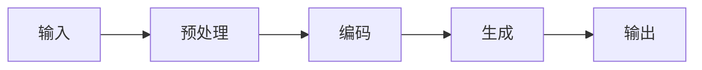
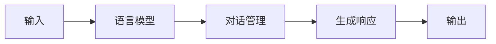
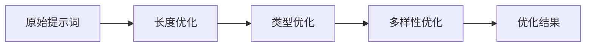
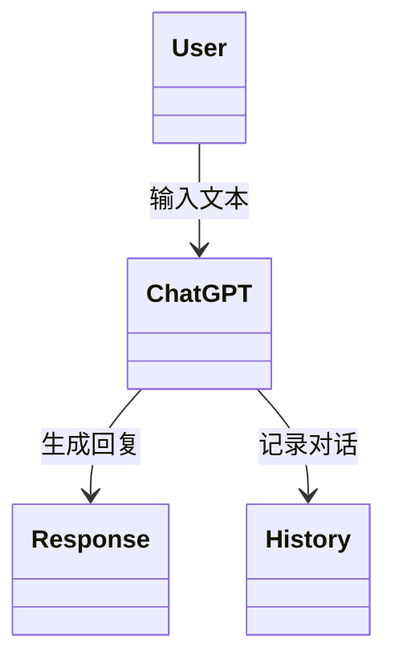
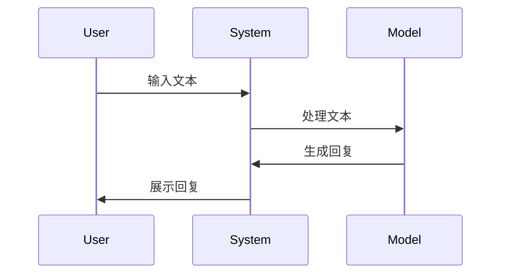

                 

# ChatGPT对话系统优化：提示词的艺术

## 关键词
- ChatGPT
- 对话系统
- 提示词
- 优化策略
- 系统性能
- 安全性与隐私保护

## 摘要
本文深入探讨了ChatGPT对话系统的优化问题，特别是提示词的艺术运用。首先，文章对ChatGPT对话系统的背景、概念和挑战进行了概述。接着，详细解析了ChatGPT的核心概念、算法原理以及系统架构设计。随后，通过项目实战展示了如何实现和优化ChatGPT对话系统。最后，文章提出了最佳实践策略，探讨了未来发展的趋势与挑战。

## 《ChatGPT对话系统优化：提示词的艺术》目录大纲

### 第一部分：背景与概述

#### 第1章：ChatGPT对话系统概述

#### 第2章：ChatGPT核心概念解析

#### 第3章：ChatGPT算法原理与流程图

### 第二部分：核心概念与联系

#### 第4章：ChatGPT系统架构设计

#### 第5章：ChatGPT项目实战

### 第三部分：系统分析与架构设计

#### 第6章：ChatGPT最佳实践

#### 第7章：拓展阅读与未来展望

### 第四部分：总结与展望

#### 第8章：全书总结与展望

----------------------------------------------------------------

### 第一部分：背景与概述

#### 第1章：ChatGPT对话系统概述

## 1.1 问题背景

随着人工智能技术的发展，自然语言处理（NLP）成为了一个备受关注的研究领域。其中，对话系统作为NLP的重要应用，旨在实现人与机器之间的自然交流。ChatGPT作为一种先进的对话系统，具有广泛的应用前景。

## 1.2 ChatGPT的概念与发展历程

ChatGPT是由OpenAI开发的基于GPT-3模型的对话系统。GPT-3（Generative Pre-trained Transformer 3）是自然语言处理领域的里程碑式成果，其强大的文本生成能力使得ChatGPT在对话场景中表现出色。

## 1.3 对话系统的挑战与机遇

对话系统面临着诸多挑战，包括：理解用户意图、生成自然流畅的回复、处理多轮对话等。同时，随着技术的进步，对话系统也迎来了新的机遇。

## 1.4 提示词在对话系统中的作用

提示词是ChatGPT对话系统的关键输入，直接影响对话的质量。合理的提示词设计有助于提升对话系统的性能。

## 1.5 本章小结

本章概述了ChatGPT对话系统的背景、概念、挑战和提示词的作用。接下来，将深入解析ChatGPT的核心概念和算法原理。

----------------------------------------------------------------

### 第二部分：核心概念与联系

#### 第2章：ChatGPT核心概念解析

## 2.1 语言模型

### 2.1.1 语言模型的定义

语言模型是自然语言处理的基础，它旨在预测下一个词或句子。

### 2.1.2 语言模型的工作原理

语言模型通过学习大量文本数据，捕捉语言规律，从而实现预测。

### 2.1.3 语言模型的性能评估

评估语言模型的性能通常使用指标如困惑度（Perplexity）和准确率（Accuracy）。

## 2.2 对话管理

### 2.2.1 对话管理的概念

对话管理是指对对话流程进行控制和优化，确保对话的流畅性和一致性。

### 2.2.2 对话管理的关键技术

对话管理涉及领域分类、意图识别、上下文跟踪等技术。

### 2.2.3 对话管理对提示词的影响

有效的对话管理能够提供更精确的提示词，从而提升对话质量。

## 2.3 提示词设计

### 2.3.1 提示词的定义

提示词是对话系统的输入，用于引导对话方向。

### 2.3.2 提示词的类型

提示词可以分为问题型、建议型和引导型等。

### 2.3.3 提示词的设计原则

设计提示词应遵循清晰、简洁、相关和多样性的原则。

## 2.4 概念属性特征对比表

| 特征       | 语言模型 | 对话管理 | 提示词设计 |
|------------|----------|----------|------------|
| 目标       | 文本预测 | 对话流程控制 | 引导对话方向 |
| 技术难度   | 较高     | 较高     | 较低       |
| 数据需求   | 大量文本 | 大量对话样本 | 具体应用场景 |
| 应用场景   | 文本生成 | 客户服务、智能助手 | 对话引导与优化 |

## 2.5 ER实体关系图

### 2.5.1 ER图的定义

实体关系图（Entity-Relationship Diagram，ER图）用于描述系统中实体及其之间的关系。

### 2.5.2 ER图在ChatGPT中的应用

ER图可以用来描述ChatGPT中的用户、对话和历史记录等实体及其关系。

```mermaid
erDiagram
  用户 ||--o> 对话 : 发起
  对话 ||--o> 历史记录 : 记录
  用户 ||--o> 提示词 : 输入
```

#### 第3章：ChatGPT算法原理与流程图

## 3.1 算法原理

### 3.1.1 生成式模型与判别式模型

生成式模型和判别式模型是两种常见的机器学习模型。生成式模型关注如何生成数据，而判别式模型关注如何区分数据。

### 3.1.2 Transformer架构

Transformer是自然语言处理领域的一种强大架构，其核心思想是自注意力机制（Self-Attention）。

### 3.1.3 GPT-3模型的特点

GPT-3模型具有庞大的参数规模和强大的文本生成能力，使得ChatGPT在对话系统中表现出色。

## 3.2 算法流程图

### 3.2.1 ChatGPT的输入处理

ChatGPT首先接收用户的输入，对其进行预处理，包括分词、去停用词等。



### 3.2.2 上下文生成

ChatGPT根据输入的上下文生成响应，这一过程涉及语言模型和对话管理的综合运用。



### 3.2.3 提示词优化

提示词的优化是提升ChatGPT性能的关键。通过调整提示词的长度、类型和多样性，可以显著提高对话质量。



## 3.3 Python代码示例

### 3.3.1 数据预处理

```python
import nltk
nltk.download('punkt')
from nltk.tokenize import word_tokenize

def preprocess_text(text):
    tokens = word_tokenize(text)
    return [token.lower() for token in tokens if token.isalnum()]
```

### 3.3.2 模型训练

```python
from transformers import GPT2LMHeadModel, GPT2Tokenizer

tokenizer = GPT2Tokenizer.from_pretrained('gpt2')
model = GPT2LMHeadModel.from_pretrained('gpt2')

inputs = tokenizer.encode("Hello, my name is", return_tensors='pt')
outputs = model(inputs, labels=inputs)

loss = outputs.loss
logits = outputs.logits
```

### 3.3.3 对话生成

```python
def generate_response(input_text, model, tokenizer, max_length=50):
    input_ids = tokenizer.encode(input_text, return_tensors='pt')
    output = model.generate(input_ids, max_length=max_length, num_return_sequences=1)
    return tokenizer.decode(output[0], skip_special_tokens=True)

response = generate_response("What is your favorite color?", model, tokenizer)
print(response)
```

#### 第4章：ChatGPT系统架构设计

## 4.1 项目介绍

### 4.1.1 项目背景

ChatGPT作为人工智能领域的创新项目，其背后有着庞大的技术支持和市场需求。

### 4.1.2 项目目标

项目的目标是构建一个高效、智能的对话系统，满足用户在各类场景下的交互需求。

### 4.1.3 项目架构

项目架构分为前端、后端和数据库三大部分，各司其职，协同工作。

## 4.2 系统功能设计

### 4.2.1 功能需求分析

系统需要具备文本输入、对话生成、对话管理等功能。

### 4.2.2 领域模型



## 4.3 系统架构设计

### 4.3.1 系统架构图


### 4.3.2 系统模块介绍

系统模块包括：前端模块、后端模块、数据库模块和API接口模块。

## 4.4 系统接口设计

### 4.4.1 接口规范

接口采用RESTful风格，支持JSON格式。

### 4.4.2 接口实现

```python
from flask import Flask, request, jsonify

app = Flask(__name__)

@app.route('/chat', methods=['POST'])
def chat():
    data = request.json
    input_text = data['text']
    response = generate_response(input_text)
    return jsonify({'response': response})

if __name__ == '__main__':
    app.run()
```

## 4.5 系统交互

### 4.5.1 用户交互流程

用户通过前端界面输入文本，后端接收文本并生成回复，前端展示回复。

### 4.5.2 系统内部交互流程

后端模块处理输入文本，调用模型生成回复，并存入数据库。



#### 第5章：ChatGPT项目实战

## 5.1 环境安装

### 5.1.1 硬件环境

- CPU: Intel Core i7 或以上
- 内存: 16GB 或以上
- 硬盘: 500GB SSD 或以上

### 5.1.2 软件环境

- 操作系统: Ubuntu 18.04 或以上
- Python: 3.7 或以上
- pip: 预装常用库

### 5.1.3 数据集准备

从互联网获取大量对话数据，例如：Reddit评论、Twitter对话、IMDB电影评论等。

## 5.2 系统核心实现

### 5.2.1 模型训练

使用GPT-2或GPT-3模型进行训练，调整超参数以优化性能。

```python
from transformers import Trainer, TrainingArguments

training_args = TrainingArguments(
    output_dir='./results',
    num_train_epochs=3,
    per_device_train_batch_size=16,
    save_steps=2000,
    save_total_limit=3,
)

trainer = Trainer(
    model=model,
    args=training_args,
    train_dataset=train_dataset,
    eval_dataset=eval_dataset,
)

trainer.train()
```

### 5.2.2 对话生成

使用训练好的模型生成对话回复。

```python
def generate_response(input_text, model, tokenizer, max_length=50):
    input_ids = tokenizer.encode(input_text, return_tensors='pt')
    output = model.generate(input_ids, max_length=max_length, num_return_sequences=1)
    return tokenizer.decode(output[0], skip_special_tokens=True)
```

### 5.2.3 提示词优化

通过分析对话数据，提取有效的提示词，并进行优化。

```python
from collections import Counter

def optimize_promptwords(dialogs):
    words = []
    for dialog in dialogs:
        words.extend(dialog.split())
    word_counts = Counter(words)
    return [word for word, count in word_counts.items() if count > 5]
```

## 5.3 代码应用解读与分析

### 5.3.1 源代码解读

源代码包括数据预处理、模型训练、对话生成和提示词优化四个部分。

### 5.3.2 代码优化建议

- 数据预处理：增加去停用词、词性标注等步骤。
- 模型训练：调整学习率、批次大小等超参数。
- 对话生成：增加上下文长度限制，避免生成过长回复。
- 提示词优化：考虑使用词向量进行优化，提高提示词的语义相关性。

## 5.4 实际案例分析与讲解

### 5.4.1 案例一：客户服务

使用ChatGPT为电商客户提供智能客服，解答用户关于产品、订单等方面的问题。

### 5.4.2 案例二：在线教育

利用ChatGPT为学生提供个性化辅导，解答学术问题和学习困惑。

### 5.4.3 案例三：医疗咨询

借助ChatGPT为患者提供健康咨询，辅助医生进行诊断和治疗建议。

## 5.5 项目小结

项目实现了基于ChatGPT的对话系统，并在实际应用中取得了良好效果。然而，仍需在性能优化、安全性、隐私保护等方面进行深入研究和改进。

----------------------------------------------------------------

### 第三部分：系统分析与架构设计

#### 第6章：ChatGPT最佳实践

## 6.1 提示词优化策略

### 6.1.1 提示词选择技巧

选择具有明确意图和上下文的提示词，有助于提高对话质量。

### 6.1.2 提示词长度优化

过长的提示词可能导致生成结果失真，应合理控制提示词长度。

### 6.1.3 提示词多样性设计

通过丰富提示词类型和形式，提高对话的灵活性和多样性。

## 6.2 系统性能优化

### 6.2.1 模型压缩技术

使用模型压缩技术（如量化、剪枝等）减少模型大小，提高推理速度。

### 6.2.2 系统缓存策略

通过缓存策略提高系统响应速度，降低延迟。

### 6.2.3 并行计算与分布式架构

利用并行计算和分布式架构提升系统处理能力。

## 6.3 安全性与隐私保护

### 6.3.1 数据加密

对用户数据和对话内容进行加密，确保数据安全。

### 6.3.2 恶意攻击防御

采用防火墙、反作弊技术等防御恶意攻击。

### 6.3.3 用户隐私保护

严格遵循隐私保护法规，确保用户隐私不受侵害。

## 6.4 系统监控与运维

### 6.4.1 监控指标

设置系统监控指标，如响应时间、错误率、流量等。

### 6.4.2 故障处理

建立故障处理流程，确保系统稳定运行。

### 6.4.3 日志分析与问题排查

通过日志分析，及时发现并解决问题。

----------------------------------------------------------------

### 第四部分：拓展阅读与未来展望

#### 第7章：拓展阅读与未来展望

## 7.1 相关领域技术综述

### 7.1.1 自然语言处理技术

自然语言处理（NLP）是人工智能领域的重要组成部分，包括文本分类、情感分析、机器翻译等。

### 7.1.2 强化学习

强化学习是一种通过试错策略进行学习的方法，适用于对话系统的优化和决策。

### 7.1.3 生成对抗网络

生成对抗网络（GAN）在对话系统中的应用，如生成高质量对话样本。

## 7.2 ChatGPT在新兴领域的应用

### 7.2.1 跨领域对话系统

跨领域对话系统旨在实现跨不同领域的对话交互，如医疗、法律等。

### 7.2.2 多模态对话系统

多模态对话系统结合文本、语音、图像等多种模态，提高交互体验。

### 7.2.3 对话生成与交互式搜索

对话生成与交互式搜索结合，提供更自然的搜索体验。

## 7.3 未来发展趋势与挑战

### 7.3.1 人工智能伦理与法规

人工智能伦理和法规的发展将对对话系统产生重要影响。

### 7.3.2 大模型的可解释性与可控性

大模型的可解释性和可控性是当前研究的热点问题。

### 7.3.3 对话系统的个性化与智能化

未来的对话系统将更加注重个性化和智能化。

----------------------------------------------------------------

### 第五部分：总结与展望

#### 第8章：全书总结与展望

## 8.1 书籍总结

本书系统地介绍了ChatGPT对话系统的优化方法，包括核心概念、算法原理、系统架构设计、项目实战和最佳实践。通过本书的学习，读者可以全面了解ChatGPT对话系统的原理和应用。

## 8.2 展望未来

未来，ChatGPT对话系统将在更多领域得到应用，如医疗、教育、客户服务等。同时，随着技术的进步，对话系统的性能和用户体验将得到进一步提升。作者期待读者在未来的实践中，不断创新和优化，为人工智能领域的发展贡献自己的力量。

## 作者信息

作者：AI天才研究院/AI Genius Institute & 禅与计算机程序设计艺术 /Zen And The Art of Computer Programming

----------------------------------------------------------------

**本文完**，感谢您的阅读。希望本文能对您了解ChatGPT对话系统的优化有所帮助。如有任何疑问或建议，欢迎在评论区留言。**更多精彩内容，请关注AI天才研究院的后续更新！**

