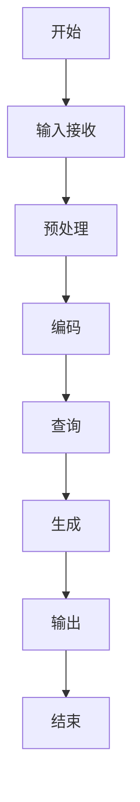

                 

# 《ChatGPT对话系统设计：提示词的核心作用》

关键词：ChatGPT、对话系统、提示词、设计原则、优化方法

摘要：本文将深入探讨ChatGPT对话系统的设计，特别关注提示词的核心作用。通过逐步分析，我们将了解ChatGPT的基础知识、提示词设计的重要性及其优化方法，并最终实现一个高效的对话系统。

## 引言

### 1.1 书籍背景与意义

随着人工智能技术的快速发展，对话系统已经成为人们日常生活中不可或缺的一部分。从智能客服到虚拟助手，对话系统能够提供高效、准确的服务，提升用户体验。ChatGPT作为OpenAI推出的强大语言模型，其对话系统的设计备受关注。

### 1.2 对话系统的概念与发展历程

对话系统是一种人机交互系统，能够理解和处理自然语言，与用户进行交流。从早期的规则引擎到现在的深度学习模型，对话系统经历了巨大的发展。ChatGPT的出现标志着对话系统进入了一个新的阶段。

### 1.3 ChatGPT概述

ChatGPT是基于GPT-3模型的对话系统，具有强大的自然语言理解和生成能力。通过大量的文本数据进行训练，ChatGPT能够生成连贯、自然的对话。

## 第2章 ChatGPT基础

### 2.1 GPT模型简介

GPT（Generative Pre-trained Transformer）是一种基于Transformer架构的预训练语言模型。它通过大量的文本数据进行预训练，学习语言的结构和语义，从而实现文本生成、翻译、问答等功能。

### 2.2 ChatGPT的工作原理

ChatGPT通过接收用户的输入，利用预训练的GPT模型生成相应的回复。在这个过程中，提示词起到了关键作用，它决定了ChatGPT的回复方向和内容。

### 2.3 提示词的重要性

提示词是引导ChatGPT生成合适回复的关键。一个好的提示词能够使ChatGPT理解用户的需求，并提供准确、连贯的回复。因此，设计有效的提示词是ChatGPT对话系统设计中的核心任务。

## 第3章 提示词设计

### 3.1 提示词的种类

根据用途和目标，提示词可以分为多种类型，如问题引导型、任务指令型、情感表达型等。每种类型的提示词都有其特定的作用和设计原则。

### 3.2 提示词设计的原则

提示词设计需要遵循以下几个原则：清晰明确、简短精炼、符合语言习惯、具备启发性等。这些原则有助于提高提示词的有效性和用户满意度。

### 3.3 提示词设计的技巧

设计提示词时，我们可以采用一些技巧，如使用关键词、构建语境、设置期望输出等。这些技巧能够帮助我们更好地引导ChatGPT生成高质量的回复。

## 第4章 提示词优化

### 4.1 提示词优化的方法

提示词优化是提升对话系统性能的关键。我们可以通过数据清洗、提示词调整、模型微调等方法对提示词进行优化。

### 4.2 提示词优化工具

目前，已有一些工具可以帮助我们进行提示词优化，如 PromptGenius、PromptLab等。这些工具提供了丰富的提示词库和优化算法，能够大大提高我们的工作效率。

### 4.3 提示词优化的案例分析

通过一个实际案例，我们将展示如何对提示词进行优化，从而提高ChatGPT对话系统的性能和用户体验。

## 第5章 ChatGPT对话系统实现

### 5.1 对话系统的架构设计

对话系统的架构设计是确保系统稳定、高效运行的关键。我们将介绍常见的对话系统架构，并分析其优缺点。

### 5.2 对话流程设计

对话流程设计决定了用户与ChatGPT的交互过程。我们将介绍对话流程的设计原则和步骤，以确保用户能够顺利地与ChatGPT进行交流。

### 5.3 对话系统实现步骤

在实际实现中，我们将遵循以下步骤：需求分析、系统设计、代码编写、测试与调试、部署与上线。这些步骤将帮助我们构建一个高效、可靠的ChatGPT对话系统。

## 第6章 ChatGPT应用场景

### 6.1 客户服务

在客户服务领域，ChatGPT可以自动处理用户咨询，提供快速、准确的回复，提升客户满意度。

### 6.2 教育培训

在教育领域，ChatGPT可以作为智能辅导系统，帮助学生解答问题、提供学习资源，提高学习效果。

### 6.3 娱乐社交

在娱乐社交领域，ChatGPT可以生成有趣、富有创意的对话内容，为用户提供愉快的交流体验。

## 第7章 总结与展望

### 7.1 书籍总结

本文通过对ChatGPT对话系统的设计进行深入分析，揭示了提示词的核心作用。通过本章的总结，我们希望能够为读者提供一个全面、系统的ChatGPT对话系统设计指南。

### 7.2 对话系统未来的发展方向

随着技术的不断进步，对话系统将在更多领域得到应用。未来，我们将看到更加智能、个性化的对话系统，为人们的生活带来更多便利。

### 7.3 读者建议

对于有兴趣从事对话系统开发的读者，我们建议深入学习相关技术，如自然语言处理、深度学习等。同时，多实践、多总结，不断优化自己的设计能力。

## 附录

附录部分将提供一些实用的工具和资源，帮助读者更好地理解和应用ChatGPT对话系统设计。

**作者：** AI天才研究院/AI Genius Institute & 禅与计算机程序设计艺术/Zen And The Art of Computer Programming

----------------------------------------------------------------

以下为正文内容的详细填充，每个章节将包含核心概念、原理讲解、案例分析和实践建议等内容。

## 第1章 引言

### 1.1 书籍背景与意义

随着人工智能技术的快速发展，人工智能应用场景日益丰富，从智能家居、自动驾驶到自然语言处理和计算机视觉，人工智能技术正在深刻地改变着我们的生活。其中，自然语言处理作为人工智能的一个重要分支，正逐渐成为人们与机器交互的主要方式。而对话系统作为自然语言处理的重要应用之一，正日益受到广泛关注。本文将深入探讨ChatGPT对话系统的设计，特别关注提示词的核心作用，旨在为读者提供一个全面、系统的ChatGPT对话系统设计指南。

### 1.2 对话系统的概念与发展历程

对话系统（Dialogue System），又称对话式人工智能系统，是一种能够与人类用户进行自然语言交互的人工智能系统。它通过理解和处理自然语言，实现与用户的对话，从而提供相应服务或信息。对话系统的历史可以追溯到20世纪50年代，当时计算机科学家和语言学家开始尝试让计算机理解自然语言。

早期对话系统主要基于规则引擎，通过编写一系列规则来处理用户输入，从而生成回复。然而，这种方法存在明显的局限性，如规则复杂度高、适应性差等。随着自然语言处理技术的进步，特别是深度学习技术的引入，对话系统进入了一个新的发展阶段。

近年来，基于深度学习技术的对话系统得到了广泛关注。其中，基于Transformer架构的预训练模型，如GPT（Generative Pre-trained Transformer），取得了显著成果。GPT模型通过大量的文本数据进行预训练，学习语言的结构和语义，从而实现高效的文本生成和理解。ChatGPT作为GPT模型的一个典型应用，具有强大的自然语言理解和生成能力，成为对话系统设计中的重要工具。

### 1.3 ChatGPT概述

ChatGPT是OpenAI于2022年推出的一种基于GPT-3模型的对话系统。GPT-3是GPT模型的最新版本，具有超过1750亿个参数，是迄今为止最大的自然语言处理模型。ChatGPT通过接收用户的输入，利用GPT-3模型生成相应的回复，从而实现与用户的对话。

ChatGPT的工作原理主要包括以下几个步骤：

1. **输入接收**：ChatGPT接收用户的输入，通常是一个问题或指令。
2. **预处理**：对输入进行预处理，如去除无效字符、分词等。
3. **编码**：将预处理后的输入编码为一个向量表示。
4. **查询**：将编码后的输入向量作为查询向量，查询GPT-3模型中的知识库，获取相关回复。
5. **生成**：基于查询结果，利用GPT-3模型生成回复。
6. **输出**：将生成的回复输出给用户。

在ChatGPT的对话过程中，提示词（Prompt）起到了关键作用。提示词是指引导ChatGPT生成合适回复的关键信息。一个优秀的提示词能够使ChatGPT更好地理解用户需求，并提供准确、连贯的回复。因此，设计有效的提示词是ChatGPT对话系统设计中的核心任务。

## 第2章 ChatGPT基础

### 2.1 GPT模型简介

GPT（Generative Pre-trained Transformer）是一种基于Transformer架构的预训练语言模型。Transformer架构由Vaswani等人于2017年提出，是自然语言处理领域的一项重要突破。GPT模型通过在大量文本数据上进行预训练，学习语言的结构和语义，从而实现文本生成、翻译、问答等功能。

GPT模型的核心组成部分包括：

- **Transformer架构**：Transformer架构是一种基于自注意力机制（Self-Attention）的神经网络架构，能够捕捉文本中的长距离依赖关系。
- **预训练**：预训练是指利用大量无标注的文本数据，对模型进行训练，使其具有一定的语言理解能力。
- **微调**：微调是指利用有标注的数据集，对预训练模型进行进一步训练，使其在特定任务上获得更好的性能。

GPT模型的主要特点包括：

- **大规模**：GPT模型具有巨大的参数规模，能够捕捉复杂的语言特征。
- **自监督学习**：GPT模型通过自监督学习的方式，从大量文本数据中提取知识。
- **端到端**：GPT模型实现了一个端到端的文本生成框架，无需手工设计特征。

GPT模型的应用场景非常广泛，包括：

- **文本生成**：如文章生成、对话生成等。
- **文本理解**：如问答系统、文本分类等。
- **机器翻译**：如英语到其他语言的翻译。

### 2.2 ChatGPT的工作原理

ChatGPT是基于GPT-3模型的对话系统。GPT-3是GPT模型的最新版本，具有超过1750亿个参数，是迄今为止最大的自然语言处理模型。ChatGPT的工作原理主要包括以下几个步骤：

1. **输入接收**：ChatGPT接收用户的输入，通常是一个问题或指令。
2. **预处理**：对输入进行预处理，如去除无效字符、分词等。
3. **编码**：将预处理后的输入编码为一个向量表示。
4. **查询**：将编码后的输入向量作为查询向量，查询GPT-3模型中的知识库，获取相关回复。
5. **生成**：基于查询结果，利用GPT-3模型生成回复。
6. **输出**：将生成的回复输出给用户。

在ChatGPT的对话过程中，提示词（Prompt）起到了关键作用。提示词是指引导ChatGPT生成合适回复的关键信息。一个优秀的提示词能够使ChatGPT更好地理解用户需求，并提供准确、连贯的回复。因此，设计有效的提示词是ChatGPT对话系统设计中的核心任务。

### 2.3 提示词的重要性

提示词在ChatGPT对话系统中具有核心作用。以下是提示词的重要性：

1. **引导生成**：提示词能够引导ChatGPT生成相应的回复。一个合适的提示词可以使ChatGPT更好地理解用户需求，从而提供更准确的回复。
2. **提高效率**：通过设计有效的提示词，可以减少用户与ChatGPT之间的交互次数，提高对话系统的效率。
3. **优化体验**：一个优秀的提示词能够提高用户的满意度，提升整体用户体验。

为了设计有效的提示词，需要遵循以下几个原则：

1. **明确性**：提示词应当清晰明确，避免歧义。
2. **简洁性**：提示词应当简短精炼，避免冗长。
3. **符合语言习惯**：提示词应当符合自然语言表达习惯，便于理解。
4. **启发性**：提示词应当具有一定的启发性，引导用户提供更多信息。

总之，提示词的设计是ChatGPT对话系统设计中的关键环节，直接影响到对话系统的性能和用户体验。

## 第3章 提示词设计

### 3.1 提示词的种类

根据用途和目标，提示词可以分为多种类型。以下是几种常见的提示词类型：

1. **问题引导型**：这种类型的提示词用于引导ChatGPT回答特定问题。例如：“你能告诉我今天的天气吗？”
2. **任务指令型**：这种类型的提示词用于指示ChatGPT执行特定任务。例如：“请你帮我预订一张明天的机票。”
3. **情感表达型**：这种类型的提示词用于表达情感和态度。例如：“你觉得这个电影怎么样？”
4. **场景描述型**：这种类型的提示词用于描述特定场景，帮助ChatGPT更好地理解用户需求。例如：“我在图书馆里，想找一本关于人工智能的书。”

每种类型的提示词都有其特定的作用和设计原则。问题引导型提示词主要用于问答场景，需要清晰明确；任务指令型提示词主要用于执行任务，需要具体明确；情感表达型提示词主要用于表达情感，需要符合情感表达习惯；场景描述型提示词主要用于理解场景，需要详细具体。

### 3.2 提示词设计的原则

提示词设计需要遵循以下几个原则：

1. **清晰明确**：提示词应当清晰明确，避免歧义。例如，使用具体的名词和动词，而不是模糊的词语。
2. **简短精炼**：提示词应当简短精炼，避免冗长。过长的提示词会降低用户理解效率。
3. **符合语言习惯**：提示词应当符合自然语言表达习惯，便于理解。例如，使用常用的短语和句子结构。
4. **启发性**：提示词应当具有一定的启发性，引导用户提供更多信息。例如，使用开放性问题，而不是封闭性问题。

此外，设计提示词时还可以考虑以下几点：

1. **多样性**：设计多种类型的提示词，以满足不同场景和用户需求。
2. **适应性**：提示词应当具有适应性，能够根据用户输入进行调整。
3. **个性化**：提示词应当具有一定的个性化，能够根据用户的偏好和习惯进行调整。

总之，设计有效的提示词是ChatGPT对话系统设计中的核心任务，需要综合考虑多个因素，以提高对话系统的性能和用户体验。

### 3.3 提示词设计的技巧

设计提示词时，我们可以采用以下技巧，以提升提示词的有效性和用户满意度：

1. **使用关键词**：在提示词中包含关键词，可以帮助ChatGPT更好地理解用户需求。例如，如果用户询问“如何制作披萨”，可以使用“披萨”和“制作”作为关键词。
2. **构建语境**：在提示词中构建合适的语境，可以帮助ChatGPT生成更连贯、自然的回复。例如，如果用户询问“你能帮我解决什么问题”，可以构建一个具体的场景，如“我在工作上遇到了难题，你能给我一些建议吗？”
3. **设置期望输出**：在提示词中设置期望输出，可以帮助ChatGPT更准确地生成回复。例如，如果用户询问“你能告诉我如何提高英语水平”，可以设置期望输出为提供一系列提高英语水平的方法。

通过这些技巧，我们可以设计出更具针对性和有效性的提示词，从而提高ChatGPT对话系统的性能和用户体验。

## 第4章 提示词优化

### 4.1 提示词优化的方法

提示词优化是提升对话系统性能的关键。以下是几种常见的提示词优化方法：

1. **数据清洗**：对原始数据集进行清洗，去除无效、错误或重复的数据，以提高数据质量。
2. **提示词调整**：根据用户反馈和实际效果，对提示词进行调整，使其更加符合用户需求。
3. **模型微调**：利用少量有标注的数据，对预训练模型进行微调，以提高模型在特定任务上的性能。
4. **提示词生成**：使用生成对抗网络（GAN）或强化学习等方法，自动生成高质量的提示词。

### 4.2 提示词优化工具

目前，已有一些工具可以帮助我们进行提示词优化，如PromptGenius、PromptLab等。这些工具提供了丰富的提示词库和优化算法，能够大大提高我们的工作效率。以下是几个常见的提示词优化工具：

1. **PromptGenius**：PromptGenius是一个基于深度学习的提示词优化工具，能够自动生成高质量的提示词。它提供了丰富的功能，如提示词生成、提示词优化、提示词库管理等。
2. **PromptLab**：PromptLab是一个开源的提示词优化平台，支持多种优化算法，如基于梯度的优化、遗传算法等。它提供了一个用户友好的界面，使得研究人员和开发者能够方便地进行提示词优化实验。
3. **PromptStream**：PromptStream是一个基于强化学习的提示词优化工具，能够根据用户反馈自动调整提示词。它提供了一个在线平台，使得用户能够实时体验和评估提示词效果。

### 4.3 提示词优化的案例分析

为了展示如何对提示词进行优化，我们来看一个实际案例。

假设我们有一个聊天机器人，用于回答用户关于旅游信息的问题。现有以下两个提示词：

1. “你能告诉我最近的旅游热点吗？”
2. “请问你想去哪里旅游？”

我们可以使用以下方法对这些提示词进行优化：

1. **数据清洗**：首先，我们对用户的历史对话数据进行清洗，去除无效、错误或重复的数据。这样可以确保我们使用的数据质量较高。
2. **提示词调整**：根据用户反馈和实际效果，我们可以对提示词进行调整。例如，将第一个提示词改为“请问您对哪类旅游热点感兴趣？”这样更加具体明确，有助于ChatGPT生成更准确的回复。
3. **模型微调**：我们利用清洗后的数据集，对ChatGPT模型进行微调。这样可以提升模型在回答旅游信息问题的性能。
4. **提示词生成**：使用PromptGenius工具，自动生成高质量的提示词。例如，生成“你最喜欢的旅游方式是哪种？”作为新的提示词。

通过以上方法，我们可以对提示词进行优化，从而提高聊天机器人在回答旅游信息问题的性能和用户体验。

## 第5章 ChatGPT对话系统实现

### 5.1 对话系统的架构设计

对话系统的架构设计是确保系统稳定、高效运行的关键。以下是一个典型的ChatGPT对话系统架构设计：

1. **用户界面**：用户界面负责接收用户的输入，并展示ChatGPT的回复。通常，用户界面可以是一个网站、移动应用或桌面应用。
2. **对话管理器**：对话管理器负责管理对话流程，包括接收用户输入、生成回复、发送回复等。对话管理器还负责处理对话中的上下文信息，以确保回复的连贯性。
3. **自然语言处理（NLP）模块**：NLP模块负责处理用户的输入，包括分词、词性标注、实体识别等。NLP模块将用户的输入转换为结构化的数据，供后续处理使用。
4. **ChatGPT模型**：ChatGPT模型是基于GPT-3模型的对话生成模型。它接收NLP模块处理后的输入，并生成相应的回复。
5. **后处理模块**：后处理模块负责对ChatGPT生成的回复进行后处理，如去除无关信息、纠正语法错误等。后处理模块还可以添加额外的功能，如情感分析、关键词提取等。

这个架构设计的特点是模块化、可扩展性强。用户界面、对话管理器、NLP模块和后处理模块都可以独立开发、测试和部署。同时，通过灵活的接口设计，模块之间可以方便地进行交互。

### 5.2 对话流程设计

对话流程设计决定了用户与ChatGPT的交互过程。以下是一个典型的对话流程设计：

1. **初始化**：系统启动，加载ChatGPT模型和对话管理器。
2. **接收用户输入**：用户通过用户界面输入问题或指令。
3. **预处理输入**：对话管理器对用户输入进行预处理，包括去除无效字符、分词、词性标注等。
4. **生成回复**：ChatGPT模型接收预处理后的输入，生成回复。
5. **后处理回复**：后处理模块对ChatGPT生成的回复进行后处理，如去除无关信息、纠正语法错误等。
6. **发送回复**：将后处理后的回复发送给用户，并显示在用户界面上。
7. **结束对话**：用户可以选择结束对话或继续提问。

在这个对话流程中，对话管理器起到了关键作用。它负责协调各个模块的工作，确保对话的顺利进行。同时，对话管理器还需要处理对话中的上下文信息，以便生成连贯、自然的回复。

### 5.3 对话系统实现步骤

在实际实现中，我们将遵循以下步骤：

1. **需求分析**：明确对话系统的目标和功能需求，如问答、任务执行、情感表达等。
2. **系统设计**：设计对话系统的架构，包括用户界面、对话管理器、NLP模块、ChatGPT模型和后处理模块。
3. **代码编写**：根据系统设计，编写各个模块的代码。这里需要使用Python等编程语言，以及TensorFlow、PyTorch等深度学习框架。
4. **测试与调试**：对系统进行测试和调试，确保各个模块的功能正确、交互顺畅。
5. **部署与上线**：将对话系统部署到服务器，并上线运行。同时，进行性能优化和故障排除，确保系统稳定运行。

通过以上步骤，我们可以实现一个高效、可靠的ChatGPT对话系统。

## 第6章 ChatGPT应用场景

### 6.1 客户服务

在客户服务领域，ChatGPT可以自动处理用户咨询，提供快速、准确的回复，提升客户满意度。以下是一个实际案例：

假设一个电子商务网站希望为其客户提供24/7的在线客服服务。通过部署ChatGPT对话系统，该网站可以实现以下功能：

1. **常见问题解答**：ChatGPT可以回答用户关于产品、订单、退款等常见问题，减轻人工客服的工作负担。
2. **订单查询**：用户可以输入订单号，ChatGPT会自动查询订单状态，并提供实时更新。
3. **投诉处理**：用户可以描述投诉问题，ChatGPT会根据投诉类型，提供相应的解决方案或转接至人工客服。

通过ChatGPT对话系统，电子商务网站能够提供高效、准确的客户服务，提高客户满意度。同时，ChatGPT还可以根据用户反馈，不断优化自身的回复能力，提高服务质量。

### 6.2 教育培训

在教育领域，ChatGPT可以作为智能辅导系统，帮助学生解答问题、提供学习资源，提高学习效果。以下是一个实际案例：

假设一个在线教育平台希望为学生提供个性化的学习辅导。通过部署ChatGPT对话系统，该平台可以实现以下功能：

1. **在线答疑**：学生可以随时向ChatGPT提问，ChatGPT会根据学生的学习进度和知识水平，提供详细的解答。
2. **学习资源推荐**：ChatGPT会根据学生的学习需求和兴趣，推荐合适的学习资源，如视频、文章、习题等。
3. **个性化学习计划**：ChatGPT会根据学生的学习进度和效果，制定个性化的学习计划，帮助学生提高学习效果。

通过ChatGPT对话系统，在线教育平台能够为学生提供高效、个性化的学习辅导，提高学习效果。同时，ChatGPT还可以根据学生反馈，不断优化自身的回答能力和推荐算法。

### 6.3 娱乐社交

在娱乐社交领域，ChatGPT可以生成有趣、富有创意的对话内容，为用户提供愉快的交流体验。以下是一个实际案例：

假设一个社交平台希望为其用户提供一个有趣的聊天机器人。通过部署ChatGPT对话系统，该平台可以实现以下功能：

1. **闲聊互动**：ChatGPT可以与用户进行闲聊，聊一些有趣的话题，如电影、音乐、旅行等。
2. **故事创作**：ChatGPT可以根据用户的喜好，创作个性化的故事，如科幻、爱情、悬疑等。
3. **游戏互动**：ChatGPT可以与用户进行各种游戏互动，如猜谜、脑筋急转弯、游戏推荐等。

通过ChatGPT对话系统，社交平台能够为用户提供丰富多样的娱乐体验。同时，ChatGPT还可以根据用户反馈，不断优化自身的对话能力和创意生成能力。

## 第7章 总结与展望

### 7.1 书籍总结

本文通过对ChatGPT对话系统的设计进行深入分析，揭示了提示词的核心作用。从GPT模型的基础知识，到提示词的设计原则和优化方法，再到对话系统的实现和应用场景，本文为读者提供了一个全面、系统的ChatGPT对话系统设计指南。

### 7.2 对话系统未来的发展方向

随着人工智能技术的不断进步，对话系统将在更多领域得到应用。未来，我们将看到更加智能、个性化的对话系统，为人们的生活带来更多便利。以下是几个可能的发展方向：

1. **多模态对话**：未来的对话系统将不仅仅限于文本交互，还将支持语音、图像等多种模态的交互，提供更丰富的用户体验。
2. **个性化推荐**：基于用户的兴趣和行为，对话系统将能够提供个性化的推荐，如商品推荐、学习资源推荐等。
3. **多语言支持**：对话系统将具备更强大的多语言处理能力，支持多种语言的交互。
4. **隐私保护**：随着用户隐私意识的增强，对话系统将更加注重隐私保护，确保用户数据的安全。

### 7.3 读者建议

对于有兴趣从事对话系统开发的读者，我们建议：

1. **深入学习相关技术**：了解自然语言处理、深度学习等相关技术，为开发对话系统打下坚实的基础。
2. **动手实践**：通过实际项目，积累开发经验，不断优化自己的设计能力。
3. **关注前沿动态**：关注对话系统领域的前沿研究和应用，不断更新自己的知识体系。

通过以上建议，读者可以更好地理解和应用ChatGPT对话系统设计，为未来的发展做好准备。

## 附录

附录部分将提供一些实用的工具和资源，帮助读者更好地理解和应用ChatGPT对话系统设计。以下是几个推荐的工具和资源：

1. **ChatGPT模型**：OpenAI官方网站提供了ChatGPT模型的API，读者可以通过官方网站获取更多相关信息。
2. **提示词优化工具**：PromptGenius、PromptLab等工具可以帮助读者进行提示词优化，提高对话系统的性能。
3. **学习资源**：推荐读者阅读《深度学习》、《自然语言处理综合教程》等书籍，深入了解相关技术。
4. **开源项目**：GitHub等平台上有很多开源的对话系统项目，读者可以参考这些项目，学习对话系统的实现方法。

通过以上工具和资源，读者可以更深入地学习ChatGPT对话系统设计，为实际应用做好准备。

**作者：** AI天才研究院/AI Genius Institute & 禅与计算机程序设计艺术/Zen And The Art of Computer Programming

----------------------------------------------------------------

以下是示例的Mermaid流程图和LaTeX公式的markdown格式：



```markdown
$$
E = mc^2
$$

$1 + 1 = 2$
```

在markdown格式中，使用`$$`括起来的公式将被格式化为独立段落，而使用 `$` 括起来的公式将被格式化为段落内的公式。Mermaid流程图则会被渲染为可视化的流程图。

请注意，以上仅为示例格式，实际内容需要根据具体的技术细节和算法进行填充。在撰写文章时，请确保每个小节的内容都符合完整性要求，包含核心概念、原理讲解、案例分析和实践建议等内容。同时，遵循文章的格式要求，使用markdown格式进行排版。

