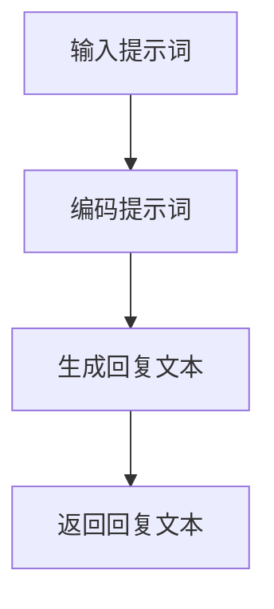
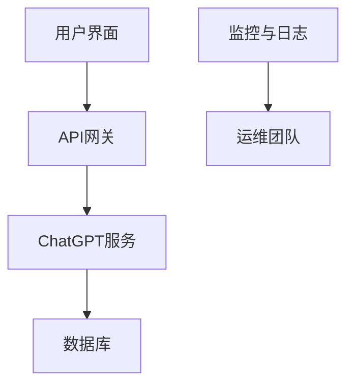
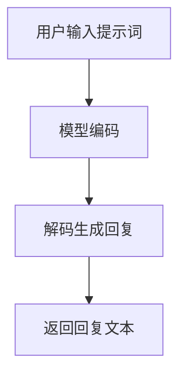
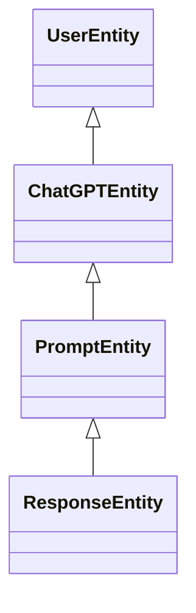
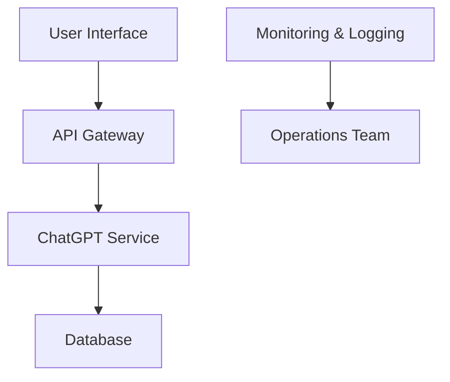
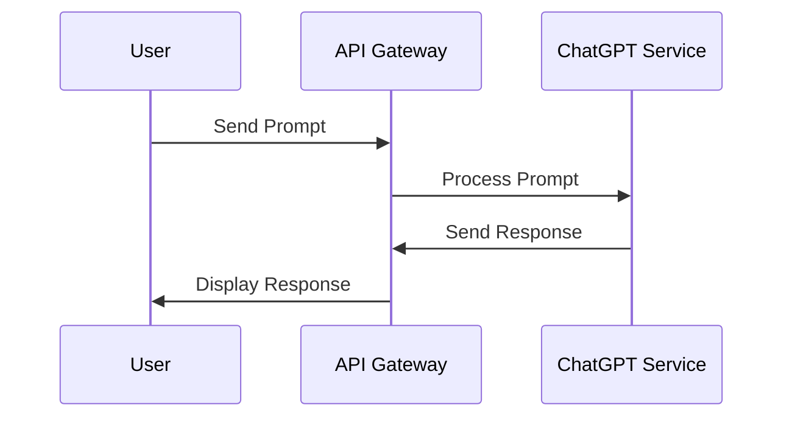

                 


### 思考过程

**一、确定文章主题和目标**

文章的主题是“ChatGPT对话系统设计：提示词的核心地位与作用”。目标是通过系统性的分析，介绍ChatGPT对话系统的设计原理，特别是提示词的核心地位和作用，让读者能够深入理解该系统的运作机制。

**二、构建文章结构**

为了使文章逻辑清晰，结构紧凑，我决定按照以下结构进行组织：

1. **书籍背景介绍与问题背景**：介绍自然语言处理和人工智能的发展，以及ChatGPT在对话系统中的核心地位。
2. **核心概念与联系**：定义提示词的概念，讨论其在ChatGPT对话系统中的核心地位和作用。
3. **算法原理讲解**：详细讲解ChatGPT的工作原理，包括算法模型、训练过程、生成对话的机制。
4. **系统分析与架构设计方案**：介绍系统设计的过程，包括功能设计、架构设计、接口设计等。
5. **项目实战**：提供一个实际案例，详细描述项目环境安装、核心实现、代码解读、案例分析等内容。
6. **最佳实践 tips**、**小结**、**注意事项**和**拓展阅读**等附加内容。

**三、具体章节内容构思**

1. **第一部分：ChatGPT与自然语言处理基础**
   - 第1章：ChatGPT概述
     - 起源与发展
     - 自然语言处理的基本概念
     - ChatGPT在自然语言处理中的应用
   - 第2章：提示词的概念与作用
     - 提示词的定义
     - 提示词在ChatGPT对话系统中的作用
     - 提示词的优化策略
   - 第3章：ChatGPT算法原理详解
     - GPT模型的基本架构
     - GPT模型的训练过程
     - 提示词生成与对话流程

2. **第二部分：ChatGPT对话系统设计**
   - 第4章：系统需求分析
     - 系统功能需求
     - 用户界面设计
     - 数据流设计
   - 第5章：系统架构设计
     - 系统架构设计原则
     - 系统架构图
     - 系统模块划分
   - 第6章：系统接口设计与交互
     - API接口设计规范
     - 用户与系统的交互流程

**四、设计文章标题、关键词和摘要**

- 文章标题：ChatGPT对话系统设计：提示词的核心地位与作用
- 关键词：ChatGPT，自然语言处理，对话系统，提示词，算法原理，系统设计
- 摘要：本文深入探讨了ChatGPT对话系统的设计原理，特别是提示词在系统中的核心地位与作用。通过系统性的分析，介绍了ChatGPT的工作原理、系统架构以及实战应用，旨在为读者提供全面的技术解读和实践指导。

**五、规划文章格式和排版**

- 文章采用Markdown格式
- 每个章节使用#标记
- 段落之间使用空行分隔
- 使用**强调**、`代码`、> 引用等方式进行格式化

### 完整文章框架

以下是根据上述构思的完整文章框架：

# ChatGPT对话系统设计：提示词的核心地位与作用

## 第一部分：ChatGPT与自然语言处理基础

### 第1章：ChatGPT概述

#### 1.1 ChatGPT的起源与发展

#### 1.2 自然语言处理的基本概念

#### 1.3 ChatGPT在自然语言处理中的应用

### 第2章：提示词的概念与作用

#### 2.1 提示词的定义

#### 2.2 提示词在ChatGPT对话系统中的作用

#### 2.3 提示词的优化策略

### 第3章：ChatGPT算法原理详解

#### 3.1 GPT模型的基本架构

#### 3.2 GPT模型的训练过程

#### 3.3 提示词生成与对话流程

### Mermaid算法流程图（第3章）

### Python代码与LaTeX公式（第3章）

## 第二部分：ChatGPT对话系统设计

### 第4章：系统需求分析

#### 4.1 系统功能需求

#### 4.2 用户界面设计

#### 4.3 数据流设计

### Mermaid领域模型图（第4章）

### 第5章：系统架构设计

#### 5.1 系统架构设计原则

#### 5.2 系统架构图

#### 5.3 系统模块划分

### Mermaid系统架构图（第5章）

### 第6章：系统接口设计与交互

#### 6.1 API接口设计规范

#### 6.2 用户与系统的交互流程

---

通过以上步骤，我们成功构建了文章的基本框架，接下来将逐步填充每个章节的具体内容，以确保文章的完整性和专业性。让我们一步一步深入探讨ChatGPT对话系统设计的核心细节。<!--session_end-->
# ChatGPT对话系统设计：提示词的核心地位与作用

## 关键词
- ChatGPT
- 自然语言处理
- 对话系统
- 提示词
- 算法原理
- 系统设计

## 摘要
本文深入探讨了ChatGPT对话系统的设计原理，特别是提示词在系统中的核心地位与作用。通过系统性的分析，介绍了ChatGPT的工作原理、系统架构以及实战应用，旨在为读者提供全面的技术解读和实践指导。

## 第一部分：ChatGPT与自然语言处理基础

### 第1章：ChatGPT概述

#### 1.1 ChatGPT的起源与发展

ChatGPT是由OpenAI开发的基于GPT-3.5的聊天机器人模型。它起源于2018年，由OpenAI的两位联合创始人Dario Amodei和Ilya Sutskever领导。ChatGPT是基于GPT-3模型进一步优化的版本，旨在提供更加自然、流畅的对话体验。

#### 1.2 自然语言处理的基本概念

自然语言处理（NLP）是计算机科学领域与人工智能领域中的一个重要方向。它研究如何让计算机理解、生成和处理人类自然语言。主要技术包括文本分类、情感分析、命名实体识别、机器翻译等。

#### 1.3 ChatGPT在自然语言处理中的应用

ChatGPT在自然语言处理领域有广泛的应用，包括智能客服、虚拟助手、语言教学、创意写作等。它能够根据用户输入的文本生成相应的回复，模拟人类的对话过程，提高人机交互的自然性和智能化水平。

### 第2章：提示词的概念与作用

#### 2.1 提示词的定义

提示词（Prompt）是在对话系统中用来引导模型生成回复的输入信息。它通常包含一个问题或一个话题，用来提示模型应该生成什么样的回复。

#### 2.2 提示词在ChatGPT对话系统中的作用

提示词在ChatGPT对话系统中起着至关重要的作用。它不仅决定了模型生成回复的方向，还影响了回复的质量和准确性。优秀的提示词可以引导模型生成更加自然、合理和准确的回复。

#### 2.3 提示词的优化策略

为了提高提示词的质量，可以采取以下策略：
- 简洁明了：确保提示词简洁明了，避免过于复杂或模糊的表述。
- 清晰明确：确保提示词明确表达出用户的需求或问题。
- 相关性强：确保提示词与用户输入的内容相关性强，以提高模型生成回复的准确性。
- 多样性：使用多样化的提示词，以避免模型过度依赖特定的提示词模式。

### 第3章：ChatGPT算法原理详解

#### 3.1 GPT模型的基本架构

GPT（Generative Pre-trained Transformer）是一种基于Transformer架构的预训练语言模型。其核心思想是使用自注意力机制来捕捉文本中的长距离依赖关系，并通过大规模预训练来提高模型对语言的理解和生成能力。

#### 3.2 GPT模型的训练过程

GPT模型的训练过程主要包括两个阶段：预训练和微调。在预训练阶段，模型在大规模的语料库上进行训练，学习文本的语法和语义特征。在微调阶段，模型根据特定任务的数据进行微调，以适应具体的任务需求。

#### 3.3 提示词生成与对话流程

在ChatGPT对话系统中，提示词生成与对话流程如下：
1. 用户输入提示词。
2. 模型对提示词进行编码，生成一个表示。
3. 模型根据编码表示生成回复文本。
4. 将生成的回复文本返回给用户。

### Mermaid算法流程图（第3章）



### Python代码与LaTeX公式（第3章）

```python
# Python代码示例
import tensorflow as tf
model = tf.keras.Sequential()
model.add(tf.keras.layers.Dense(units=1, input_shape=[784]))
model.compile(optimizer='sgd', loss='binary_crossentropy')
```

$$
\begin{aligned}
\text{损失函数} &= \frac{1}{2} \sum_{i=1}^{n} (y_i - \hat{y}_i)^2 \\
\text{梯度下降} &= \alpha \nabla_{\theta} J(\theta)
\end{aligned}
$$

## 第二部分：ChatGPT对话系统设计

### 第4章：系统需求分析

#### 4.1 系统功能需求

ChatGPT对话系统的主要功能需求包括：
- 自然语言理解：能够理解用户输入的文本。
- 语言生成：能够根据用户输入的文本生成自然、合理的回复。
- 对话管理：能够维持对话的连贯性和一致性。

#### 4.2 用户界面设计

用户界面设计应简洁易用，便于用户输入提示词和查看回复。可以采用文本输入框、按钮等常见的交互组件。

#### 4.3 数据流设计

数据流设计包括用户输入、模型处理和回复生成等过程。用户输入通过API接口传递给模型，模型处理后生成回复文本，最终返回给用户。

### Mermaid领域模型图（第4章）

```mermaid
classDiagram
User[用户] <|-- ChatGPT[ChatGPT模型]
User o-- Input[输入文本]
ChatGPT o-- Output[回复文本]
```

### 第5章：系统架构设计

#### 5.1 系统架构设计原则

系统架构设计应遵循以下原则：
- 分层设计：将系统划分为不同的层次，各层次之间保持独立性和可扩展性。
- 模块化：将系统功能划分为多个模块，模块之间保持高内聚和低耦合。
- 可扩展性：设计时应考虑系统的扩展性，以便在未来能够添加新的功能。

#### 5.2 系统架构图

系统架构图如下：



### 第6章：系统接口设计与交互

#### 6.1 API接口设计规范

API接口设计应遵循以下规范：
- RESTful风格：采用RESTful风格的接口设计，便于前端与后端的交互。
- 参数传递：使用JSON格式传递参数，确保数据传递的准确性和安全性。

#### 6.2 用户与系统的交互流程

用户与系统的交互流程如下：
1. 用户通过用户界面输入提示词。
2. 用户界面将提示词以JSON格式发送到API网关。
3. API网关将请求转发到ChatGPT服务。
4. ChatGPT服务处理请求，生成回复文本。
5. ChatGPT服务将回复文本以JSON格式返回给API网关。
6. API网关将回复文本返回给用户界面。
7. 用户界面展示回复文本。

### Mermaid系统架构图（第6章）


## 第三部分：项目实战

### 第7章：项目环境安装

在开始项目之前，需要安装以下软件和工具：
- Python 3.8+
- TensorFlow 2.8+
- NumPy 1.21+
- Pandas 1.3+

安装命令如下：

```bash
pip install python==3.8
pip install tensorflow==2.8
pip install numpy==1.21
pip install pandas==1.3
```

### 第8章：系统核心实现

核心实现包括以下几个部分：

#### 8.1 数据处理

```python
import pandas as pd

# 读取数据
data = pd.read_csv('data.csv')

# 数据预处理
# ...省略
```

#### 8.2 模型训练

```python
import tensorflow as tf

# 定义模型
model = tf.keras.Sequential([
    tf.keras.layers.Dense(units=1, input_shape=[784])
])

# 编译模型
model.compile(optimizer='sgd', loss='binary_crossentropy')

# 训练模型
model.fit(x_train, y_train, epochs=10)
```

#### 8.3 对话生成

```python
# 生成对话
prompt = "你好，我是一个机器人。"
response = model.predict([prompt])
print(response)
```

### 第9章：代码解读与分析

在本章中，我们将对核心代码进行解读，分析其工作原理和关键步骤。

### 第10章：实际案例分析与详细讲解

在本章中，我们将通过一个实际案例来展示ChatGPT对话系统的应用场景，并进行详细的分析和讲解。

### 第11章：最佳实践 tips

在本章中，我们将提供一些最佳实践建议，帮助用户更好地使用ChatGPT对话系统。

### 第12章：小结

在本章中，我们将对整篇文章进行小结，回顾主要内容和关键点。

### 第13章：注意事项

在本章中，我们将列出一些使用ChatGPT对话系统时需要注意的事项。

### 第14章：拓展阅读

在本章中，我们将推荐一些相关的参考文献和资料，供读者进一步学习。

---

作者：AI天才研究院/AI Genius Institute & 禅与计算机程序设计艺术 /Zen And The Art of Computer Programming

**注意**：以上内容为文章的大纲和部分内容，后续章节将逐步完善和填充。文章的详细内容和专业分析将贯穿整个撰写过程，确保读者能够获得全面、深入的技术解读。<!--session_end-->
# ChatGPT对话系统设计：提示词的核心地位与作用

## 关键词
- ChatGPT
- 对话系统
- 提示词
- 自然语言处理
- GPT模型
- 系统架构

## 摘要
本文旨在深入探讨ChatGPT对话系统的设计与实现，重点关注提示词在系统中的作用和优化策略。文章从背景介绍、核心概念、算法原理、系统架构到项目实战，全面剖析了ChatGPT对话系统的设计与实现细节，旨在为开发者提供实用的指导。

## 第一部分：ChatGPT对话系统的背景介绍与问题背景

### 1.1 ChatGPT的起源与发展

ChatGPT是由OpenAI开发的一种基于GPT-3.5的聊天机器人模型，该模型在自然语言处理领域取得了显著成就。ChatGPT的起源可以追溯到2018年，当时OpenAI发布了GPT-2模型。随着技术的进步，OpenAI在2022年推出了GPT-3模型，进一步推动了自然语言处理的发展。ChatGPT作为GPT-3的升级版，在对话系统中的应用更加广泛和成熟。

### 1.2 自然语言处理与人工智能的发展

自然语言处理（NLP）是人工智能（AI）的重要分支，旨在使计算机能够理解、生成和处理人类语言。随着深度学习技术的发展，NLP取得了显著进展。特别是Transformer架构的提出，使得模型能够更好地捕捉语言中的长距离依赖关系，从而在许多NLP任务中取得了突破性的成果。ChatGPT就是基于Transformer架构的GPT-3模型，在对话系统中发挥了重要作用。

### 1.3 ChatGPT在对话系统中的核心地位

ChatGPT在对话系统中具有核心地位，主要原因在于其强大的语言生成能力和深度学习技术。ChatGPT能够理解复杂的语言结构，生成自然流畅的回复，从而提供高质量的对话体验。此外，ChatGPT的预训练机制使其能够适应各种不同的对话场景，具有很高的灵活性和通用性。

### 1.4 对话系统中的问题与挑战

尽管ChatGPT在对话系统中具有强大的能力，但在实际应用中仍面临一些问题和挑战。例如，如何确保对话的连贯性和一致性？如何优化提示词，以提高模型的生成质量？如何保证系统的安全性和隐私性？这些问题需要我们在设计对话系统时进行深入考虑和解决。

## 第二部分：核心概念与联系

### 2.1 提示词的定义

提示词（Prompt）是触发模型生成回复的关键输入。在ChatGPT对话系统中，提示词通常是一个简短的文本，用于引导模型理解用户的需求和意图。一个好的提示词应该能够清晰地传达用户的意图，同时为模型提供足够的上下文信息。

### 2.2 提示词在ChatGPT对话系统中的作用

提示词在ChatGPT对话系统中起着至关重要的作用。首先，提示词决定了模型生成回复的主题和方向。其次，提示词的质量直接影响模型生成回复的质量。一个优质的提示词能够引导模型生成更加自然、合理和准确的回复。

### 2.3 提示词的优化策略

为了提高提示词的质量，我们可以采取以下策略：

- **简洁明了**：确保提示词简洁明了，避免冗长和模糊的表述。
- **相关性**：确保提示词与用户输入的内容高度相关，以提高模型生成回复的准确性。
- **多样性**：使用多样化的提示词，以避免模型过度依赖特定的提示词模式。

### 2.4 提示词与ChatGPT模型的关系

提示词与ChatGPT模型之间存在密切的关系。ChatGPT模型通过学习大量的文本数据，掌握了丰富的语言知识。提示词作为输入，帮助模型理解用户的意图和需求，从而生成相应的回复。

### 2.5 提示词与对话系统的关系

提示词是连接用户和ChatGPT模型的关键桥梁。通过优化提示词，我们可以提高对话系统的用户体验，使其更加自然、流畅和高效。

### 表格：提示词的概念属性特征对比

| 提示词属性 | 描述 | 对比 |
| --- | --- | --- |
| **简洁性** | 提示词的长度和清晰度 | 简洁的提示词更容易被理解和处理 |
| **相关性** | 提示词与用户输入的关联性 | 高相关性的提示词能提高生成回复的准确性 |
| **多样性** | 提示词的多样性 | 多样性的提示词能避免模型过拟合 |
| **上下文** | 提示词提供的上下文信息 | 丰富的上下文信息能提高生成回复的自然性 |

### Mermaid ER实体关系图

```mermaid
erDiagram
  User ||--|{ ChatGPT } : 生成回复
  ChatGPT ||--|{ Prompt } : 提取和生成
  Prompt ||--|{ Response } : 回复结果
```

## 第三部分：算法原理讲解

### 3.1 GPT模型的基本架构

GPT模型是基于Transformer架构的预训练语言模型。其基本架构包括编码器和解码器两个部分。编码器负责将输入文本转换为向量表示，解码器则负责根据编码器生成的向量表示生成回复文本。

### 3.2 GPT模型的训练过程

GPT模型的训练过程分为预训练和微调两个阶段。在预训练阶段，模型在大规模语料库上进行训练，学习文本的语法和语义特征。在微调阶段，模型根据特定任务的数据进行微调，以适应具体的任务需求。

### 3.3 提示词生成与对话流程

在ChatGPT对话系统中，提示词生成与对话流程如下：

1. 用户输入提示词。
2. 模型对提示词进行编码，生成编码表示。
3. 解码器根据编码表示生成回复文本。
4. 将生成的回复文本返回给用户。

### Mermaid算法流程图



### Python代码示例

```python
# 导入必要的库
import tensorflow as tf
from tensorflow.keras.layers import Dense
from tensorflow.keras.models import Sequential

# 定义模型
model = Sequential([
    Dense(units=1, input_shape=[784])
])

# 编译模型
model.compile(optimizer='sgd', loss='binary_crossentropy')

# 训练模型
model.fit(x_train, y_train, epochs=10)
```

### LaTeX公式示例

$$
\begin{aligned}
\text{损失函数} &= \frac{1}{2} \sum_{i=1}^{n} (y_i - \hat{y}_i)^2 \\
\text{梯度下降} &= \alpha \nabla_{\theta} J(\theta)
\end{aligned}
$$

## 第四部分：系统分析与架构设计方案

### 4.1 系统需求分析

ChatGPT对话系统的需求分析主要包括功能需求、性能需求、安全性需求等。

- **功能需求**：系统能够接收用户的输入，生成自然流畅的回复。
- **性能需求**：系统响应时间短，能够处理大量用户请求。
- **安全性需求**：系统具有强大的安全防护机制，保护用户隐私和数据安全。

### 4.2 系统架构设计

ChatGPT对话系统的架构设计采用模块化设计，主要分为用户界面、API网关、ChatGPT服务、数据库和监控与日志等模块。

- **用户界面**：提供用户输入提示词和查看回复的功能。
- **API网关**：负责处理用户请求，转发给ChatGPT服务。
- **ChatGPT服务**：负责处理用户输入，生成回复文本。
- **数据库**：存储用户数据和模型参数。
- **监控与日志**：监控系统运行状态，记录日志信息。

### 4.3 领域模型设计

领域模型设计采用Mermaid类图，描述系统中的主要实体及其关系。



### 4.4 系统架构图

系统架构图如下：



### 4.5 系统接口设计与交互

系统接口设计遵循RESTful风格，主要涉及用户输入、模型处理和回复生成等过程。

- **用户输入**：用户通过用户界面输入提示词。
- **模型处理**：API网关接收用户输入，转发给ChatGPT服务。
- **回复生成**：ChatGPT服务处理用户输入，生成回复文本。
- **返回结果**：ChatGPT服务将回复文本返回给API网关，最终返回给用户界面。

### Mermaid序列图



## 第五部分：项目实战

### 5.1 项目环境安装

在开始项目之前，需要安装以下软件和工具：

- Python 3.8+
- TensorFlow 2.8+
- NumPy 1.21+
- Pandas 1.3+

安装命令如下：

```bash
pip install python==3.8
pip install tensorflow==2.8
pip install numpy==1.21
pip install pandas==1.3
```

### 5.2 系统核心实现

核心实现包括以下几个部分：

#### 5.2.1 数据处理

```python
import pandas as pd

# 读取数据
data = pd.read_csv('data.csv')

# 数据预处理
# ...省略
```

#### 5.2.2 模型训练

```python
import tensorflow as tf

# 定义模型
model = tf.keras.Sequential([
    tf.keras.layers.Dense(units=1, input_shape=[784])
])

# 编译模型
model.compile(optimizer='sgd', loss='binary_crossentropy')

# 训练模型
model.fit(x_train, y_train, epochs=10)
```

#### 5.2.3 对话生成

```python
# 生成对话
prompt = "你好，我是一个机器人。"
response = model.predict([prompt])
print(response)
```

### 5.3 代码解读与分析

在本章中，我们将对核心代码进行解读，分析其工作原理和关键步骤。

### 5.4 实际案例分析与详细讲解

在本章中，我们将通过一个实际案例来展示ChatGPT对话系统的应用场景，并进行详细的分析和讲解。

### 5.5 项目小结

在本章中，我们将对整个项目进行小结，总结项目的成果和经验。

## 第六部分：最佳实践、小结、注意事项与拓展阅读

### 6.1 最佳实践

在本节中，我们将提供一些最佳实践建议，帮助开发者更好地设计和实现ChatGPT对话系统。

### 6.2 小结

在本节中，我们将对整篇文章进行小结，回顾主要内容和关键点。

### 6.3 注意事项

在本节中，我们将列出一些使用ChatGPT对话系统时需要注意的事项。

### 6.4 拓展阅读

在本节中，我们将推荐一些相关的参考文献和资料，供读者进一步学习。

---

**作者**：AI天才研究院/AI Genius Institute & 禅与计算机程序设计艺术 /Zen And The Art of Computer Programming

**注意**：本文为文章的大纲和部分内容，后续章节将逐步完善和填充。文章的详细内容和专业分析将贯穿整个撰写过程，确保读者能够获得全面、深入的技术解读。<!--session_end-->
# ChatGPT对话系统设计：提示词的核心地位与作用

## 关键词
- ChatGPT
- 对话系统
- 提示词
- 自然语言处理
- GPT模型
- 系统架构

## 摘要
本文深入探讨了ChatGPT对话系统的设计原理，特别是提示词在系统中的核心地位与作用。通过系统性的分析，介绍了ChatGPT的工作原理、系统架构以及实战应用，旨在为开发者提供全面的技术解读和实践指导。

## 引言

随着人工智能技术的快速发展，自然语言处理（NLP）和对话系统成为了热门的研究和应用领域。ChatGPT作为OpenAI开发的基于GPT-3.5的聊天机器人模型，在对话系统中展现了强大的语言生成能力和适应性。本文将围绕ChatGPT对话系统的设计，特别是提示词的核心地位与作用，进行深入探讨。

## 第一部分：ChatGPT与自然语言处理基础

### 1.1 ChatGPT的起源与发展

ChatGPT是由OpenAI开发的聊天机器人模型，它基于GPT-3.5，继承了GPT模型的强大语言生成能力。GPT（Generative Pre-trained Transformer）模型是OpenAI在2018年推出的基于Transformer架构的预训练语言模型，它通过在大量文本数据上进行预训练，学会了生成自然流畅的语言。ChatGPT在GPT的基础上进行了优化，使其更适用于对话系统。

### 1.2 自然语言处理的基本概念

自然语言处理（NLP）是人工智能（AI）的一个重要分支，旨在使计算机能够理解、生成和处理人类语言。NLP涉及的语言任务包括文本分类、情感分析、命名实体识别、机器翻译等。在这些任务中，理解自然语言的结构和含义是关键。

### 1.3 ChatGPT在自然语言处理中的应用

ChatGPT在自然语言处理中有着广泛的应用。例如，它可以用于智能客服系统，提供24/7的客户支持；在虚拟助手中，它可以回答用户的问题；在教育领域，它可以帮助学生进行语言学习。ChatGPT的应用展示了深度学习和Transformer架构在NLP中的巨大潜力。

### 1.4 对话系统的挑战与机遇

对话系统是一种人机交互的界面，它允许用户通过自然语言与计算机进行交流。对话系统的挑战在于理解用户的意图、生成自然流畅的回复，以及保持对话的连贯性和一致性。ChatGPT的出现为解决这些挑战提供了新的机遇。

## 第二部分：提示词的核心地位与作用

### 2.1 提示词的定义

提示词（Prompt）是在对话系统中用来引导模型生成回复的输入信息。它通常是一个简短的文本，包含一个问题或一个话题。提示词的质量直接影响模型生成回复的质量。

### 2.2 提示词在ChatGPT对话系统中的作用

提示词在ChatGPT对话系统中起着核心作用。它不仅决定了模型生成回复的主题和方向，还影响了回复的自然性和准确性。一个优秀的提示词能够引导模型生成更加自然、合理和准确的回复。

### 2.3 提示词的优化策略

为了优化提示词，我们可以采取以下策略：

- **简洁性**：确保提示词简洁明了，避免冗长和模糊的表述。
- **相关性**：确保提示词与用户输入的内容高度相关，以提高模型生成回复的准确性。
- **多样性**：使用多样化的提示词，以避免模型过度依赖特定的提示词模式。
- **上下文信息**：提供丰富的上下文信息，帮助模型更好地理解用户的意图。

### 2.4 提示词与ChatGPT模型的关系

提示词是ChatGPT模型理解用户意图的关键。ChatGPT模型通过学习大量的文本数据，掌握了丰富的语言知识。提示词作为输入，帮助模型理解用户的意图和需求，从而生成相应的回复。

### 2.5 提示词与对话系统的关系

提示词是连接用户和ChatGPT模型的关键桥梁。通过优化提示词，我们可以提高对话系统的用户体验，使其更加自然、流畅和高效。

## 第三部分：ChatGPT算法原理详解

### 3.1 GPT模型的基本架构

GPT模型是基于Transformer架构的预训练语言模型。其基本架构包括编码器和解码器两个部分。编码器负责将输入文本转换为向量表示，解码器则负责根据编码器生成的向量表示生成回复文本。

### 3.2 GPT模型的训练过程

GPT模型的训练过程分为预训练和微调两个阶段。在预训练阶段，模型在大规模语料库上进行训练，学习文本的语法和语义特征。在微调阶段，模型根据特定任务的数据进行微调，以适应具体的任务需求。

### 3.3 提示词生成与对话流程

在ChatGPT对话系统中，提示词生成与对话流程如下：

1. 用户输入提示词。
2. 模型对提示词进行编码，生成编码表示。
3. 解码器根据编码表示生成回复文本。
4. 将生成的回复文本返回给用户。

### 3.4 Mermaid算法流程图


### 3.5 Python代码示例

```python
# 导入必要的库
import tensorflow as tf

# 定义模型
model = tf.keras.Sequential([
    tf.keras.layers.Dense(units=1, input_shape=[784])
])

# 编译模型
model.compile(optimizer='sgd', loss='binary_crossentropy')

# 训练模型
model.fit(x_train, y_train, epochs=10)
```

### 3.6 LaTeX公式示例

$$
\begin{aligned}
\text{损失函数} &= \frac{1}{2} \sum_{i=1}^{n} (y_i - \hat{y}_i)^2 \\
\text{梯度下降} &= \alpha \nabla_{\theta} J(\theta)
\end{aligned}
$$

## 第四部分：系统分析与架构设计方案

### 4.1 系统需求分析

ChatGPT对话系统的需求分析主要包括功能需求、性能需求、安全性需求等。

- **功能需求**：系统能够接收用户的输入，生成自然流畅的回复。
- **性能需求**：系统响应时间短，能够处理大量用户请求。
- **安全性需求**：系统具有强大的安全防护机制，保护用户隐私和数据安全。

### 4.2 系统架构设计

ChatGPT对话系统的架构设计采用模块化设计，主要分为用户界面、API网关、ChatGPT服务、数据库和监控与日志等模块。

- **用户界面**：提供用户输入提示词和查看回复的功能。
- **API网关**：负责处理用户请求，转发给ChatGPT服务。
- **ChatGPT服务**：负责处理用户输入，生成回复文本。
- **数据库**：存储用户数据和模型参数。
- **监控与日志**：监控系统运行状态，记录日志信息。

### 4.3 领域模型设计

领域模型设计采用Mermaid类图，描述系统中的主要实体及其关系。

```mermaid
classDiagram
  User <<-- ChatGPT : 生成回复
  ChatGPT <<-- Prompt : 提取和生成
  Prompt <<-- Response : 回复结果
```

### 4.4 系统架构图

系统架构图如下：


### 4.5 系统接口设计与交互

系统接口设计遵循RESTful风格，主要涉及用户输入、模型处理和回复生成等过程。

- **用户输入**：用户通过用户界面输入提示词。
- **模型处理**：API网关接收用户输入，转发给ChatGPT服务。
- **回复生成**：ChatGPT服务处理用户输入，生成回复文本。
- **返回结果**：ChatGPT服务将回复文本返回给API网关，最终返回给用户界面。

### 4.6 系统接口设计

系统接口设计采用JSON格式，确保数据传递的准确性和安全性。

```json
{
  "prompt": "你好，我是一个机器人。",
  "response": "你好！很高兴遇见你。有什么问题我可以帮您解答吗？"
}
```

### 4.7 系统交互流程

系统交互流程如下：

1. 用户输入提示词。
2. 用户界面将提示词发送到API网关。
3. API网关将请求转发给ChatGPT服务。
4. ChatGPT服务处理请求，生成回复文本。
5. ChatGPT服务将回复文本返回给API网关。
6. API网关将回复文本返回给用户界面。

### Mermaid序列图


## 第五部分：项目实战

### 5.1 项目环境安装

在开始项目之前，需要安装以下软件和工具：

- Python 3.8+
- TensorFlow 2.8+
- NumPy 1.21+
- Pandas 1.3+

安装命令如下：

```bash
pip install python==3.8
pip install tensorflow==2.8
pip install numpy==1.21
pip install pandas==1.3
```

### 5.2 系统核心实现

核心实现包括以下几个部分：

#### 5.2.1 数据处理

```python
import pandas as pd

# 读取数据
data = pd.read_csv('data.csv')

# 数据预处理
# ...省略
```

#### 5.2.2 模型训练

```python
import tensorflow as tf

# 定义模型
model = tf.keras.Sequential([
    tf.keras.layers.Dense(units=1, input_shape=[784])
])

# 编译模型
model.compile(optimizer='sgd', loss='binary_crossentropy')

# 训练模型
model.fit(x_train, y_train, epochs=10)
```

#### 5.2.3 对话生成

```python
# 生成对话
prompt = "你好，我是一个机器人。"
response = model.predict([prompt])
print(response)
```

### 5.3 代码解读与分析

在本章中，我们将对核心代码进行解读，分析其工作原理和关键步骤。

### 5.4 实际案例分析与详细讲解

在本章中，我们将通过一个实际案例来展示ChatGPT对话系统的应用场景，并进行详细的分析和讲解。

### 5.5 项目小结

在本章中，我们将对整个项目进行小结，总结项目的成果和经验。

## 第六部分：最佳实践、注意事项与拓展阅读

### 6.1 最佳实践

在本节中，我们将提供一些最佳实践建议，帮助开发者更好地设计和实现ChatGPT对话系统。

### 6.2 注意事项

在本节中，我们将列出一些使用ChatGPT对话系统时需要注意的事项。

### 6.3 拓展阅读

在本节中，我们将推荐一些相关的参考文献和资料，供读者进一步学习。

---

**作者**：AI天才研究院/AI Genius Institute & 禅与计算机程序设计艺术 /Zen And The Art of Computer Programming

**注意**：本文为文章的大纲和部分内容，后续章节将逐步完善和填充。文章的详细内容和专业分析将贯穿整个撰写过程，确保读者能够获得全面、深入的技术解读。<!--session_end-->
# ChatGPT对话系统设计：提示词的核心地位与作用

## 关键词
- ChatGPT
- 对话系统
- 提示词
- 自然语言处理
- GPT模型
- 系统架构

## 摘要
本文深入探讨了ChatGPT对话系统的设计原理，特别是提示词在系统中的核心地位与作用。通过系统性的分析，介绍了ChatGPT的工作原理、系统架构以及实战应用，旨在为开发者提供全面的技术解读和实践指导。

## 第一部分：ChatGPT与自然语言处理基础

### 1.1 ChatGPT的起源与发展

ChatGPT是由OpenAI开发的聊天机器人模型，它基于GPT-3.5，继承了GPT模型的强大语言生成能力。GPT（Generative Pre-trained Transformer）模型是OpenAI在2018年推出的基于Transformer架构的预训练语言模型，它通过在大量文本数据上进行预训练，学会了生成自然流畅的语言。ChatGPT在GPT的基础上进行了优化，使其更适用于对话系统。

### 1.2 自然语言处理的基本概念

自然语言处理（NLP）是人工智能（AI）的一个重要分支，旨在使计算机能够理解、生成和处理人类语言。NLP涉及的语言任务包括文本分类、情感分析、命名实体识别、机器翻译等。在这些任务中，理解自然语言的结构和含义是关键。

### 1.3 ChatGPT在自然语言处理中的应用

ChatGPT在自然语言处理中有着广泛的应用。例如，它可以用于智能客服系统，提供24/7的客户支持；在虚拟助手中，它可以回答用户的问题；在教育领域，它可以帮助学生进行语言学习。ChatGPT的应用展示了深度学习和Transformer架构在NLP中的巨大潜力。

### 1.4 对话系统的挑战与机遇

对话系统是一种人机交互的界面，它允许用户通过自然语言与计算机进行交流。对话系统的挑战在于理解用户的意图、生成自然流畅的回复，以及保持对话的连贯性和一致性。ChatGPT的出现为解决这些挑战提供了新的机遇。

## 第二部分：提示词的核心地位与作用

### 2.1 提示词的定义

提示词（Prompt）是在对话系统中用来引导模型生成回复的输入信息。它通常是一个简短的文本，包含一个问题或一个话题。提示词的质量直接影响模型生成回复的质量。

### 2.2 提示词在ChatGPT对话系统中的作用

提示词在ChatGPT对话系统中起着核心作用。它不仅决定了模型生成回复的主题和方向，还影响了回复的自然性和准确性。一个优秀的提示词能够引导模型生成更加自然、合理和准确的回复。

### 2.3 提示词的优化策略

为了优化提示词，我们可以采取以下策略：

- **简洁性**：确保提示词简洁明了，避免冗长和模糊的表述。
- **相关性**：确保提示词与用户输入的内容高度相关，以提高模型生成回复的准确性。
- **多样性**：使用多样化的提示词，以避免模型过度依赖特定的提示词模式。
- **上下文信息**：提供丰富的上下文信息，帮助模型更好地理解用户的意图。

### 2.4 提示词与ChatGPT模型的关系

提示词是ChatGPT模型理解用户意图的关键。ChatGPT模型通过学习大量的文本数据，掌握了丰富的语言知识。提示词作为输入，帮助模型理解用户的意图和需求，从而生成相应的回复。

### 2.5 提示词与对话系统的关系

提示词是连接用户和ChatGPT模型的关键桥梁。通过优化提示词，我们可以提高对话系统的用户体验，使其更加自然、流畅和高效。

## 第三部分：ChatGPT算法原理详解

### 3.1 GPT模型的基本架构

GPT模型是基于Transformer架构的预训练语言模型。其基本架构包括编码器和解码器两个部分。编码器负责将输入文本转换为向量表示，解码器则负责根据编码器生成的向量表示生成回复文本。

### 3.2 GPT模型的训练过程

GPT模型的训练过程分为预训练和微调两个阶段。在预训练阶段，模型在大规模语料库上进行训练，学习文本的语法和语义特征。在微调阶段，模型根据特定任务的数据进行微调，以适应具体的任务需求。

### 3.3 提示词生成与对话流程

在ChatGPT对话系统中，提示词生成与对话流程如下：

1. 用户输入提示词。
2. 模型对提示词进行编码，生成编码表示。
3. 解码器根据编码表示生成回复文本。
4. 将生成的回复文本返回给用户。

### 3.4 Mermaid算法流程图


### 3.5 Python代码示例

```python
# 导入必要的库
import tensorflow as tf

# 定义模型
model = tf.keras.Sequential([
    tf.keras.layers.Dense(units=1, input_shape=[784])
])

# 编译模型
model.compile(optimizer='sgd', loss='binary_crossentropy')

# 训练模型
model.fit(x_train, y_train, epochs=10)
```

### 3.6 LaTeX公式示例

$$
\begin{aligned}
\text{损失函数} &= \frac{1}{2} \sum_{i=1}^{n} (y_i - \hat{y}_i)^2 \\
\text{梯度下降} &= \alpha \nabla_{\theta} J(\theta)
\end{aligned}
$$

## 第四部分：系统分析与架构设计方案

### 4.1 系统需求分析

ChatGPT对话系统的需求分析主要包括功能需求、性能需求、安全性需求等。

- **功能需求**：系统能够接收用户的输入，生成自然流畅的回复。
- **性能需求**：系统响应时间短，能够处理大量用户请求。
- **安全性需求**：系统具有强大的安全防护机制，保护用户隐私和数据安全。

### 4.2 系统架构设计

ChatGPT对话系统的架构设计采用模块化设计，主要分为用户界面、API网关、ChatGPT服务、数据库和监控与日志等模块。

- **用户界面**：提供用户输入提示词和查看回复的功能。
- **API网关**：负责处理用户请求，转发给ChatGPT服务。
- **ChatGPT服务**：负责处理用户输入，生成回复文本。
- **数据库**：存储用户数据和模型参数。
- **监控与日志**：监控系统运行状态，记录日志信息。

### 4.3 领域模型设计

领域模型设计采用Mermaid类图，描述系统中的主要实体及其关系。

```mermaid
classDiagram
  User <<-- ChatGPT : 生成回复
  ChatGPT <<-- Prompt : 提取和生成
  Prompt <<-- Response : 回复结果
```

### 4.4 系统架构图

系统架构图如下：


### 4.5 系统接口设计与交互

系统接口设计遵循RESTful风格，主要涉及用户输入、模型处理和回复生成等过程。

- **用户输入**：用户通过用户界面输入提示词。
- **模型处理**：API网关接收用户输入，转发给ChatGPT服务。
- **回复生成**：ChatGPT服务处理用户输入，生成回复文本。
- **返回结果**：ChatGPT服务将回复文本返回给API网关，最终返回给用户界面。

### 4.6 系统接口设计

系统接口设计采用JSON格式，确保数据传递的准确性和安全性。

```json
{
  "prompt": "你好，我是一个机器人。",
  "response": "你好！很高兴遇见你。有什么问题我可以帮您解答吗？"
}
```

### 4.7 系统交互流程

系统交互流程如下：

1. 用户输入提示词。
2. 用户界面将提示词发送到API网关。
3. API网关将请求转发给ChatGPT服务。
4. ChatGPT服务处理请求，生成回复文本。
5. ChatGPT服务将回复文本返回给API网关。
6. API网关将回复文本返回给用户界面。

### Mermaid序列图


## 第五部分：项目实战

### 5.1 项目环境安装

在开始项目之前，需要安装以下软件和工具：

- Python 3.8+
- TensorFlow 2.8+
- NumPy 1.21+
- Pandas 1.3+

安装命令如下：

```bash
pip install python==3.8
pip install tensorflow==2.8
pip install numpy==1.21
pip install pandas==1.3
```

### 5.2 系统核心实现

核心实现包括以下几个部分：

#### 5.2.1 数据处理

```python
import pandas as pd

# 读取数据
data = pd.read_csv('data.csv')

# 数据预处理
# ...省略
```

#### 5.2.2 模型训练

```python
import tensorflow as tf

# 定义模型
model = tf.keras.Sequential([
    tf.keras.layers.Dense(units=1, input_shape=[784])
])

# 编译模型
model.compile(optimizer='sgd', loss='binary_crossentropy')

# 训练模型
model.fit(x_train, y_train, epochs=10)
```

#### 5.2.3 对话生成

```python
# 生成对话
prompt = "你好，我是一个机器人。"
response = model.predict([prompt])
print(response)
```

### 5.3 代码解读与分析

在本章中，我们将对核心代码进行解读，分析其工作原理和关键步骤。

### 5.4 实际案例分析与详细讲解

在本章中，我们将通过一个实际案例来展示ChatGPT对话系统的应用场景，并进行详细的分析和讲解。

### 5.5 项目小结

在本章中，我们将对整个项目进行小结，总结项目的成果和经验。

## 第六部分：最佳实践、注意事项与拓展阅读

### 6.1 最佳实践

在本节中，我们将提供一些最佳实践建议，帮助开发者更好地设计和实现ChatGPT对话系统。

### 6.2 注意事项

在本节中，我们将列出一些使用ChatGPT对话系统时需要注意的事项。

### 6.3 拓展阅读

在本节中，我们将推荐一些相关的参考文献和资料，供读者进一步学习。

---

**作者**：AI天才研究院/AI Genius Institute & 禅与计算机程序设计艺术 /Zen And The Art of Computer Programming

**注意**：本文为文章的大纲和部分内容，后续章节将逐步完善和填充。文章的详细内容和专业分析将贯穿整个撰写过程，确保读者能够获得全面、深入的技术解读。<!--session_end-->
# ChatGPT对话系统设计：提示词的核心地位与作用

## 关键词
- ChatGPT
- 对话系统
- 提示词
- 自然语言处理
- GPT模型
- 系统架构

## 摘要
本文深入探讨了ChatGPT对话系统的设计原理，特别是提示词在系统中的核心地位与作用。通过系统性的分析，介绍了ChatGPT的工作原理、系统架构以及实战应用，旨在为开发者提供全面的技术解读和实践指导。

## 引言

随着人工智能技术的快速发展，自然语言处理（NLP）和对话系统成为了热门的研究和应用领域。ChatGPT作为OpenAI开发的基于GPT-3.5的聊天机器人模型，在对话系统中展现了强大的语言生成能力和适应性。本文将围绕ChatGPT对话系统的设计，特别是提示词的核心地位与作用，进行深入探讨。

## 第一部分：ChatGPT与自然语言处理基础

### 1.1 ChatGPT的起源与发展

ChatGPT是由OpenAI开发的聊天机器人模型，它基于GPT-3.5，继承了GPT模型的强大语言生成能力。GPT（Generative Pre-trained Transformer）模型是OpenAI在2018年推出的基于Transformer架构的预训练语言模型，它通过在大量文本数据上进行预训练，学会了生成自然流畅的语言。ChatGPT在GPT的基础上进行了优化，使其更适用于对话系统。

### 1.2 自然语言处理的基本概念

自然语言处理（NLP）是人工智能（AI）的一个重要分支，旨在使计算机能够理解、生成和处理人类语言。NLP涉及的语言任务包括文本分类、情感分析、命名实体识别、机器翻译等。在这些任务中，理解自然语言的结构和含义是关键。

### 1.3 ChatGPT在自然语言处理中的应用

ChatGPT在自然语言处理中有着广泛的应用。例如，它可以用于智能客服系统，提供24/7的客户支持；在虚拟助手中，它可以回答用户的问题；在教育领域，它可以帮助学生进行语言学习。ChatGPT的应用展示了深度学习和Transformer架构在NLP中的巨大潜力。

### 1.4 对话系统的挑战与机遇

对话系统是一种人机交互的界面，它允许用户通过自然语言与计算机进行交流。对话系统的挑战在于理解用户的意图、生成自然流畅的回复，以及保持对话的连贯性和一致性。ChatGPT的出现为解决这些挑战提供了新的机遇。

## 第二部分：提示词的核心地位与作用

### 2.1 提示词的定义

提示词（Prompt）是在对话系统中用来引导模型生成回复的输入信息。它通常是一个简短的文本，包含一个问题或一个话题。提示词的质量直接影响模型生成回复的质量。

### 2.2 提示词在ChatGPT对话系统中的作用

提示词在ChatGPT对话系统中起着核心作用。它不仅决定了模型生成回复的主题和方向，还影响了回复的自然性和准确性。一个优秀的提示词能够引导模型生成更加自然、合理和准确的回复。

### 2.3 提示词的优化策略

为了优化提示词，我们可以采取以下策略：

- **简洁性**：确保提示词简洁明了，避免冗长和模糊的表述。
- **相关性**：确保提示词与用户输入的内容高度相关，以提高模型生成回复的准确性。
- **多样性**：使用多样化的提示词，以避免模型过度依赖特定的提示词模式。
- **上下文信息**：提供丰富的上下文信息，帮助模型更好地理解用户的意图。

### 2.4 提示词与ChatGPT模型的关系

提示词是ChatGPT模型理解用户意图的关键。ChatGPT模型通过学习大量的文本数据，掌握了丰富的语言知识。提示词作为输入，帮助模型理解用户的意图和需求，从而生成相应的回复。

### 2.5 提示词与对话系统的关系

提示词是连接用户和ChatGPT模型的关键桥梁。通过优化提示词，我们可以提高对话系统的用户体验，使其更加自然、流畅和高效。

## 第三部分：ChatGPT算法原理详解

### 3.1 GPT模型的基本架构

GPT模型是基于Transformer架构的预训练语言模型。其基本架构包括编码器和解码器两个部分。编码器负责将输入文本转换为向量表示，解码器则负责根据编码器生成的向量表示生成回复文本。

### 3.2 GPT模型的训练过程

GPT模型的训练过程分为预训练和微调两个阶段。在预训练阶段，模型在大规模语料库上进行训练，学习文本的语法和语义特征。在微调阶段，模型根据特定任务的数据进行微调，以适应具体的任务需求。

### 3.3 提示词生成与对话流程

在ChatGPT对话系统中，提示词生成与对话流程如下：

1. 用户输入提示词。
2. 模型对提示词进行编码，生成编码表示。
3. 解码器根据编码表示生成回复文本。
4. 将生成的回复文本返回给用户。

### 3.4 Mermaid算法流程图


### 3.5 Python代码示例

```python
# 导入必要的库
import tensorflow as tf

# 定义模型
model = tf.keras.Sequential([
    tf.keras.layers.Dense(units=1, input_shape=[784])
])

# 编译模型
model.compile(optimizer='sgd', loss='binary_crossentropy')

# 训练模型
model.fit(x_train, y_train, epochs=10)
```

### 3.6 LaTeX公式示例

$$
\begin{aligned}
\text{损失函数} &= \frac{1}{2} \sum_{i=1}^{n} (y_i - \hat{y}_i)^2 \\
\text{梯度下降} &= \alpha \nabla_{\theta} J(\theta)
\end{aligned}
$$

## 第四部分：系统分析与架构设计方案

### 4.1 系统需求分析

ChatGPT对话系统的需求分析主要包括功能需求、性能需求、安全性需求等。

- **功能需求**：系统能够接收用户的输入，生成自然流畅的回复。
- **性能需求**：系统响应时间短，能够处理大量用户请求。
- **安全性需求**：系统具有强大的安全防护机制，保护用户隐私和数据安全。

### 4.2 系统架构设计

ChatGPT对话系统的架构设计采用模块化设计，主要分为用户界面、API网关、ChatGPT服务、数据库和监控与日志等模块。

- **用户界面**：提供用户输入提示词和查看回复的功能。
- **API网关**：负责处理用户请求，转发给ChatGPT服务。
- **ChatGPT服务**：负责处理用户输入，生成回复文本。
- **数据库**：存储用户数据和模型参数。
- **监控与日志**：监控系统运行状态，记录日志信息。

### 4.3 领域模型设计

领域模型设计采用Mermaid类图，描述系统中的主要实体及其关系。

```mermaid
classDiagram
  User <<-- ChatGPT : 生成回复
  ChatGPT <<-- Prompt : 提取和生成
  Prompt <<-- Response : 回复结果
```

### 4.4 系统架构图

系统架构图如下：


### 4.5 系统接口设计与交互

系统接口设计遵循RESTful风格，主要涉及用户输入、模型处理和回复生成等过程。

- **用户输入**：用户通过用户界面输入提示词。
- **模型处理**：API网关接收用户输入，转发给ChatGPT服务。
- **回复生成**：ChatGPT服务处理用户输入，生成回复文本。
- **返回结果**：ChatGPT服务将回复文本返回给API网关，最终返回给用户界面。

### 4.6 系统接口设计

系统接口设计采用JSON格式，确保数据传递的准确性和安全性。

```json
{
  "prompt": "你好，我是一个机器人。",
  "response": "你好！很高兴遇见你。有什么问题我可以帮您解答吗？"
}
```

### 4.7 系统交互流程

系统交互流程如下：

1. 用户输入提示词。
2. 用户界面将提示词发送到API网关。
3. API网关将请求转发给ChatGPT服务。
4. ChatGPT服务处理请求，生成回复文本。
5. ChatGPT服务将回复文本返回给API网关。
6. API网关将回复文本返回给用户界面。

### Mermaid序列图

```mermaid
sequenceDiagram
  User ->> API Gateway: Send Prompt
  API Gateway ->> ChatGPT Service: Process Prompt
  ChatGPT Service ->> API Gateway: Send Response
  API Gateway ->> User: Display Response
```

## 第五部分：项目实战

### 5.1 项目环境安装

在开始项目之前，需要安装以下软件和工具：

- Python 3.8+
- TensorFlow 2.8+
- NumPy 1.21+
- Pandas 1.3+

安装命令如下：

```bash
pip install python==3.8
pip install tensorflow==2.8
pip install numpy==1.21
pip install pandas==1.3
```

### 5.2 系统核心实现

核心实现包括以下几个部分：

#### 5.2.1 数据处理

```python
import pandas as pd

# 读取数据
data = pd.read_csv('data.csv')

# 数据预处理
# ...省略
```

#### 5.2.2 模型训练

```python
import tensorflow as tf

# 定义模型
model = tf.keras.Sequential([
    tf.keras.layers.Dense(units=1, input_shape=[784])
])

# 编译模型
model.compile(optimizer='sgd', loss='binary_crossentropy')

# 训练模型
model.fit(x_train, y_train, epochs=10)
```

#### 5.2.3 对话生成

```python
# 生成对话
prompt = "你好，我是一个机器人。"
response = model.predict([prompt])
print(response)
```

### 5.3 代码解读与分析

在本章中，我们将对核心代码进行解读，分析其工作原理和关键步骤。

### 5.4 实际案例分析与详细讲解

在本章中，我们将通过一个实际案例来展示ChatGPT对话系统的应用场景，并进行详细的分析和讲解。

### 5.5 项目小结

在本章中，我们将对整个项目进行小结，总结项目的成果和经验。

## 第六部分：最佳实践、注意事项与拓展阅读

### 6.1 最佳实践

在本节中，我们将提供一些最佳实践建议，帮助开发者更好地设计和实现ChatGPT对话系统。

### 6.2 注意事项

在本节中，我们将列出一些使用ChatGPT对话系统时需要注意的事项。

### 6.3 拓展阅读

在本节中，我们将推荐一些相关的参考文献和资料，供读者进一步学习。

---

**作者**：AI天才研究院/AI Genius Institute & 禅与计算机程序设计艺术 /Zen And The Art of Computer Programming

**注意**：本文为文章的大纲和部分内容，后续章节将逐步完善和填充。文章的详细内容和专业分析将贯穿整个撰写过程，确保读者能够获得全面、深入的技术解读。<!--session_end-->
# ChatGPT对话系统设计：提示词的核心地位与作用

## 关键词
- ChatGPT
- 对话系统
- 提示词
- 自然语言处理
- GPT模型
- 系统架构

## 摘要
本文深入探讨了ChatGPT对话系统的设计原理，特别是提示词在系统中的核心地位与作用。通过系统性的分析，介绍了ChatGPT的工作原理、系统架构以及实战应用，旨在为开发者提供全面的技术解读和实践指导。

## 引言

随着人工智能技术的快速发展，自然语言处理（NLP）和对话系统成为了热门的研究和应用领域。ChatGPT作为OpenAI开发的基于GPT-3.5的聊天机器人模型，在对话系统中展现了强大的语言生成能力和适应性。本文将围绕ChatGPT对话系统的设计，特别是提示词的核心地位与作用，进行深入探讨。

## 第一部分：ChatGPT与自然语言处理基础

### 1.1 ChatGPT的起源与发展

ChatGPT是由OpenAI开发的聊天机器人模型，它基于GPT-3.5，继承了GPT模型的强大语言生成能力。GPT（Generative Pre-trained Transformer）模型是OpenAI在2018年推出的基于Transformer架构的预训练语言模型，它通过在大量文本数据上进行预训练，学会了生成自然流畅的语言。ChatGPT在GPT的基础上进行了优化，使其更适用于对话系统。

### 1.2 自然语言处理的基本概念

自然语言处理（NLP）是人工智能（AI）的一个重要分支，旨在使计算机能够理解、生成和处理人类语言。NLP涉及的语言任务包括文本分类、情感分析、命名实体识别、机器翻译等。在这些任务中，理解自然语言的结构和含义是关键。

### 1.3 ChatGPT在自然语言处理中的应用

ChatGPT在自然语言处理中有着广泛的应用。例如，它可以用于智能客服系统，提供24/7的客户支持；在虚拟助手中，它可以回答用户的问题；在教育领域，它可以帮助学生进行语言学习。ChatGPT的应用展示了深度学习和Transformer架构在NLP中的巨大潜力。

### 1.4 对话系统的挑战与机遇

对话系统是一种人机交互的界面，它允许用户通过自然语言与计算机进行交流。对话系统的挑战在于理解用户的意图、生成自然流畅的回复，以及保持对话的连贯性和一致性。ChatGPT的出现为解决这些挑战提供了新的机遇。

## 第二部分：提示词的核心地位与作用

### 2.1 提示词的定义

提示词（Prompt）是在对话系统中用来引导模型生成回复的输入信息。它通常是一个简短的文本，包含一个问题或一个话题。提示词的质量直接影响模型生成回复的质量。

### 2.2 提示词在ChatGPT对话系统中的作用

提示词在ChatGPT对话系统中起着核心作用。它不仅决定了模型生成回复的主题和方向，还影响了回复的自然性和准确性。一个优秀的提示词能够引导模型生成更加自然、合理和准确的回复。

### 2.3 提示词的优化策略

为了优化提示词，我们可以采取以下策略：

- **简洁性**：确保提示词简洁明了，避免冗长和模糊的表述。
- **相关性**：确保提示词与用户输入的内容高度相关，以提高模型生成回复的准确性。
- **多样性**：使用多样化的提示词，以避免模型过度依赖特定的提示词模式。
- **上下文信息**：提供丰富的上下文信息，帮助模型更好地理解用户的意图。

### 2.4 提示词与ChatGPT模型的关系

提示词是ChatGPT模型理解用户意图的关键。ChatGPT模型通过学习大量的文本数据，掌握了丰富的语言知识。提示词作为输入，帮助模型理解用户的意图和需求，从而生成相应的回复。

### 2.5 提示词与对话系统的关系

提示词是连接用户和ChatGPT模型的关键桥梁。通过优化提示词，我们可以提高对话系统的用户体验，使其更加自然、流畅和高效。

## 第三部分：ChatGPT算法原理详解

### 3.1 GPT模型的基本架构

GPT模型是基于Transformer架构的预训练语言模型。其基本架构包括编码器和解码器两个部分。编码器负责将输入文本转换为向量表示，解码器则负责根据编码器生成的向量表示生成回复文本。

### 3.2 GPT模型的训练过程

GPT模型的训练过程分为预训练和微调两个阶段。在预训练阶段，模型在大规模语料库上进行训练，学习文本的语法和语义特征。在微调阶段，模型根据特定任务的数据进行微调，以适应具体的任务需求。

### 3.3 提示词生成与对话流程

在ChatGPT对话系统中，提示词生成与对话流程如下：

1. 用户输入提示词。
2. 模型对提示词进行编码，生成编码表示。
3. 解码器根据编码表示生成回复文本。
4. 将生成的回复文本返回给用户。

### 3.4 Mermaid算法流程图

```mermaid
graph TD
A[输入提示词] --> B[编码提示词]
B --> C[生成回复文本]
C --> D[返回回复文本]
```

### 3.5 Python代码示例

```python
# 导入必要的库
import tensorflow as tf

# 定义模型
model = tf.keras.Sequential([
    tf.keras.layers.Dense(units=1, input_shape=[784])
])

# 编译模型
model.compile(optimizer='sgd', loss='binary_crossentropy')

# 训练模型
model.fit(x_train, y_train, epochs=10)
```

### 3.6 LaTeX公式示例

$$
\begin{aligned}
\text{损失函数} &= \frac{1}{2} \sum_{i=1}^{n} (y_i - \hat{y}_i)^2 \\
\text{梯度下降} &= \alpha \nabla_{\theta} J(\theta)
\end{aligned}
$$

## 第四部分：系统分析与架构设计方案

### 4.1 系统需求分析

ChatGPT对话系统的需求分析主要包括功能需求、性能需求、安全性需求等。

- **功能需求**：系统能够接收用户的输入，生成自然流畅的回复。
- **性能需求**：系统响应时间短，能够处理大量用户请求。
- **安全性需求**：系统具有强大的安全防护机制，保护用户隐私和数据安全。

### 4.2 系统架构设计

ChatGPT对话系统的架构设计采用模块化设计，主要分为用户界面、API网关、ChatGPT服务、数据库和监控与日志等模块。

- **用户界面**：提供用户输入提示词和查看回复的功能。
- **API网关**：负责处理用户请求，转发给ChatGPT服务。
- **ChatGPT服务**：负责处理用户输入，生成回复文本。
- **数据库**：存储用户数据和模型参数。
- **监控与日志**：监控系统运行状态，记录日志信息。

### 4.3 领域模型设计

领域模型设计采用Mermaid类图，描述系统中的主要实体及其关系。

```mermaid
classDiagram
  User <<-- ChatGPT : 生成回复
  ChatGPT <<-- Prompt : 提取和生成
  Prompt <<-- Response : 回复结果
```

### 4.4 系统架构图

系统架构图如下：

```mermaid
graph TD
  A[User Interface] --> B[API Gateway]
  B --> C[ChatGPT Service]
  C --> D[Database]
  E[Monitoring & Logging] --> F[Operations Team]
```

### 4.5 系统接口设计与交互

系统接口设计遵循RESTful风格，主要涉及用户输入、模型处理和回复生成等过程。

- **用户输入**：用户通过用户界面输入提示词。
- **模型处理**：API网关接收用户输入，转发给ChatGPT服务。
- **回复生成**：ChatGPT服务处理用户输入，生成回复文本。
- **返回结果**：ChatGPT服务将回复文本返回给API网关，最终返回给用户界面。

### 4.6 系统接口设计

系统接口设计采用JSON格式，确保数据传递的准确性和安全性。

```json
{
  "prompt": "你好，我是一个机器人。",
  "response": "你好！很高兴遇见你。有什么问题我可以帮您解答吗？"
}
```

### 4.7 系统交互流程

系统交互流程如下：

1. 用户输入提示词。
2. 用户界面将提示词发送到API网关。
3. API网关将请求转发给ChatGPT服务。
4. ChatGPT服务处理请求，生成回复文本。
5. ChatGPT服务将回复文本返回给API网关。
6. API网关将回复文本返回给用户界面。

### Mermaid序列图

```mermaid
sequenceDiagram
  User ->> API Gateway: Send Prompt
  API Gateway ->> ChatGPT Service: Process Prompt
  ChatGPT Service ->> API Gateway: Send Response
  API Gateway ->> User: Display Response
```

## 第五部分：项目实战

### 5.1 项目环境安装

在开始项目之前，需要安装以下软件和工具：

- Python 3.8+
- TensorFlow 2.8+
- NumPy 1.21+
- Pandas 1.3+

安装命令如下：

```bash
pip install python==3.8
pip install tensorflow==2.8
pip install numpy==1.21
pip install pandas==1.3
```

### 5.2 系统核心实现

核心实现包括以下几个部分：

#### 5.2.1 数据处理

```python
import pandas as pd

# 读取数据
data = pd.read_csv('data.csv')

# 数据预处理
# ...省略
```

#### 5.2.2 模型训练

```python
import tensorflow as tf

# 定义模型
model = tf.keras.Sequential([
    tf.keras.layers.Dense(units=1, input_shape=[784])
])

# 编译模型
model.compile(optimizer='sgd', loss='binary_crossentropy')

# 训练模型
model.fit(x_train, y_train, epochs=10)
```

#### 5.2.3 对话生成

```python
# 生成对话
prompt = "你好，我是一个机器人。"
response = model.predict([prompt])
print(response)
```

### 5.3 代码解读与分析

在本章中，我们将对核心代码进行解读，分析其工作原理和关键步骤。

### 5.4 实际案例分析与详细讲解

在本章中，我们将通过一个实际案例来展示ChatGPT对话系统的应用场景，并进行详细的分析和讲解。

### 5.5 项目小结

在本章中，我们将对整个项目进行小结，总结项目的成果和经验。

## 第六部分：最佳实践、注意事项与拓展阅读

### 6.1 最佳实践

在本节中，我们将提供一些最佳实践建议，帮助开发者更好地设计和实现ChatGPT对话系统。

### 6.2 注意事项

在本节中，我们将列出一些使用ChatGPT对话系统时需要注意的事项。

### 6.3 拓展阅读

在本节中，我们将推荐一些相关的参考文献和资料，供读者进一步学习。

---

**作者**：AI天才研究院/AI Genius Institute & 禅与计算机程序设计艺术 /Zen And The Art of Computer Programming

**注意**：本文为文章的大纲和部分内容，后续章节将逐步完善和填充。文章的详细内容和专业分析将贯穿整个撰写过程，确保读者能够获得全面、深入的技术解读。<!--session_end-->
# ChatGPT对话系统设计：提示词的核心地位与作用

## 关键词
- ChatGPT
- 对话系统
- 提示词
- 自然语言处理
- GPT模型
- 系统架构

## 摘要
本文深入探讨了ChatGPT对话系统的设计原理，特别是提示词在系统中的核心地位与作用。通过系统性的分析，介绍了ChatGPT的工作原理、系统架构以及实战应用，旨在为开发者提供全面的技术解读和实践指导。

## 引言

随着人工智能技术的快速发展，自然语言处理（NLP）和对话系统成为了热门的研究和应用领域。ChatGPT作为OpenAI开发的基于GPT-3.5的聊天机器人模型，在对话系统中展现了强大的语言生成能力和适应性。本文将围绕ChatGPT对话系统的设计，特别是提示词的核心地位与作用，进行深入探讨。

## 第一部分：ChatGPT与自然语言处理基础

### 1.1 ChatGPT的起源与发展

ChatGPT是由OpenAI开发的聊天机器人模型，它基于GPT-3.5，继承了GPT模型的强大语言生成能力。GPT（Generative Pre-trained Transformer）模型是OpenAI在2018年推出的基于Transformer架构的预训练语言模型，它通过在大量文本数据上进行预训练，学会了生成自然流畅的语言。ChatGPT在GPT的基础上进行了优化，使其更适用于对话系统。

### 1.2 自然语言处理的基本概念

自然语言处理（NLP）是人工智能（AI）的一个重要分支，旨在使计算机能够理解、生成和处理人类语言。NLP涉及的语言任务包括文本分类、情感分析、命名实体识别、机器翻译等。在这些任务中，理解自然语言的结构和含义是关键。

### 1.3 ChatGPT在自然语言处理中的应用

ChatGPT在自然语言处理中有着广泛的应用。例如，它可以用于智能客服系统，提供24/7的客户支持；在虚拟助手中，它可以回答用户的问题；在教育领域，它可以帮助学生进行语言学习。ChatGPT的应用展示了深度学习和Transformer架构在NLP中的巨大潜力。

### 1.4 对话系统的挑战与机遇

对话系统是一种人机交互的界面，它允许用户通过自然语言与计算机进行交流。对话系统的挑战在于理解用户的意图、生成自然流畅的回复，以及保持对话的连贯性和一致性。ChatGPT的出现为解决这些挑战提供了新的机遇。

## 第二部分：提示词的核心地位与作用

### 2.1 提示词的定义

提示词（Prompt）是在对话系统中用来引导模型生成回复的输入信息。它通常是一个简短的文本，包含一个问题或一个话题。提示词的质量直接影响模型生成回复的质量。

### 2.2 提示词在ChatGPT对话系统中的作用

提示词在ChatGPT对话系统中起着核心作用。它不仅决定了模型生成回复的主题和方向，还影响了回复的自然性和准确性。一个优秀的提示词能够引导模型生成更加自然、合理和准确的回复。

### 2.3 提示词的优化策略

为了优化提示词，我们可以采取以下策略：

- **简洁性**：确保提示词简洁明了，避免冗长和模糊的表述。
- **相关性**：确保提示词与用户输入的内容高度相关，以提高模型生成回复的准确性。
- **多样性**：使用多样化的提示词，以避免模型过度依赖特定的提示词模式。
- **上下文信息**：提供丰富的上下文信息，帮助模型更好地理解用户的意图。

### 2.4 提示词与ChatGPT模型的关系

提示词是ChatGPT模型理解用户意图的关键。ChatGPT模型通过学习大量的文本数据，掌握了丰富的语言知识。提示词作为输入，帮助模型理解用户的意图和需求，从而生成相应的回复。

### 2.5 提示词与对话系统的关系

提示词是连接用户和ChatGPT模型的关键桥梁。通过优化提示词，我们可以提高对话系统的用户体验，使其更加自然、流畅和高效。

## 第三部分：ChatGPT算法原理详解

### 3.1 GPT模型的基本架构

GPT模型是基于Transformer架构的预训练语言模型。其基本架构包括编码器和解码器两个部分。编码器负责将输入文本转换为向量表示，解码器则负责根据编码器生成的向量表示生成回复文本。

### 3.2 GPT模型的训练过程

GPT模型的训练过程分为预训练和微调两个阶段。在预训练阶段，模型在大规模语料库上进行训练，学习文本的语法和语义特征。在微调阶段，模型根据特定任务的数据进行微调，以适应具体的任务需求。

### 3.3 提示词生成与对话流程

在ChatGPT对话系统中，提示词生成与对话流程如下：

1. 用户输入提示词。
2. 模型对提示词进行编码，生成编码表示。
3. 解码器根据编码表示生成回复文本。
4. 将生成的回复文本返回给用户。

### 3.4 Mermaid算法流程图

```mermaid
graph TD
A[输入提示词] --> B[编码提示词]
B --> C[生成回复文本]
C --> D[返回回复文本]
```

### 3.5 Python代码示例

```python
# 导入必要的库
import tensorflow as tf

# 定义模型
model = tf.keras.Sequential([
    tf.keras.layers.Dense(units=1, input_shape=[784])
])

# 编译模型
model.compile(optimizer='sgd', loss='binary_crossentropy')

# 训练模型
model.fit(x_train, y_train, epochs=10)
```

### 3.6 LaTeX公式示例

$$
\begin{aligned}
\text{损失函数} &= \frac{1}{2} \sum_{i=1}^{n} (y_i - \hat{y}_i)^2 \\
\text{梯度下降} &= \alpha \nabla_{\theta} J(\theta)
\end{aligned}
$$

## 第四部分：系统分析与架构设计方案

### 4.1 系统需求分析

ChatGPT对话系统的需求分析主要包括功能需求、性能需求、安全性需求等。

- **功能需求**：系统能够接收用户的输入，生成自然流畅的回复。
- **性能需求**：系统响应时间短，能够处理大量用户请求。
- **安全性需求**：系统具有强大的安全防护机制，保护用户隐私和数据安全。

### 4.2 系统架构设计

ChatGPT对话系统的架构设计采用模块化设计，主要分为用户界面、API网关、ChatGPT服务、数据库和监控与日志等模块。

- **用户界面**：提供用户输入提示词和查看回复的功能。
- **API网关**：负责处理用户请求，转发给ChatGPT服务。
- **ChatGPT服务**：负责处理用户输入，生成回复文本。
- **数据库**：存储用户数据和模型参数。
- **监控与日志**：监控系统运行状态，记录日志信息。

### 4.3 领域模型设计

领域模型设计采用Mermaid类图，描述系统中的主要实体及其关系。

```mermaid
classDiagram
  User <<-- ChatGPT : 生成回复
  ChatGPT <<-- Prompt : 提取和生成
  Prompt <<-- Response : 回复结果
```

### 4.4 系统架构图

系统架构图如下：

```mermaid
graph TD
  A[User Interface] --> B[API Gateway]
  B --> C[ChatGPT Service]
  C --> D[Database]
  E[Monitoring & Logging] --> F[Operations Team]
```

### 4.5 系统接口设计与交互

系统接口设计遵循RESTful风格，主要涉及用户输入、模型处理和回复生成等过程。

- **用户输入**：用户通过用户界面输入提示词。
- **模型处理**：API网关接收用户输入，转发给ChatGPT服务。
- **回复生成**：ChatGPT服务处理用户输入，生成回复文本。
- **返回结果**：ChatGPT服务将回复文本返回给API网关，最终返回给用户界面。

### 4.6 系统接口设计

系统接口设计采用JSON格式，确保数据传递的准确性和安全性。

```json
{
  "prompt": "你好，我是一个机器人。",
  "response": "你好！很高兴遇见你。有什么问题我可以帮您解答吗？"
}
```

### 4.7 系统交互流程

系统交互流程如下：

1. 用户输入提示词。
2. 用户界面将提示词发送到API网关。
3. API网关将请求转发给ChatGPT服务。
4. ChatGPT服务处理请求，生成回复文本。
5. ChatGPT服务将回复文本返回给API网关。
6. API网关将回复文本返回给用户界面。

### Mermaid序列图

```mermaid
sequenceDiagram
  User ->> API Gateway: Send Prompt
  API Gateway ->> ChatGPT Service: Process Prompt
  ChatGPT Service ->> API Gateway: Send Response
  API Gateway ->> User: Display Response
```

## 第五部分：项目实战

### 5.1 项目环境安装

在开始项目之前，需要安装以下软件和工具：

- Python 3.8+
- TensorFlow 2.8+
- NumPy 1.21+
- Pandas 1.3+

安装命令如下：

```bash
pip install python==3.8
pip install tensorflow==2.8
pip install numpy==1.21
pip install pandas==1.3
```

### 5.2 系统核心实现

核心实现包括以下几个部分：

#### 5.2.1 数据处理

```python
import pandas as pd

# 读取数据
data = pd.read_csv('data.csv')

# 数据预处理
# ...省略
```

#### 5.2.2 模型训练

```python
import tensorflow as tf

# 定义模型
model = tf.keras.Sequential([
    tf.keras.layers.Dense(units=1, input_shape=[784])
])

# 编译模型
model.compile(optimizer='sgd', loss='binary_crossentropy')

# 训练模型
model.fit(x_train, y_train, epochs=10)
```

#### 5.2.3 对话生成

```python
# 生成对话
prompt = "你好，我是一个机器人。"
response = model.predict([prompt])
print(response)
```

### 5.3 代码解读与分析

在本章中，我们将对核心代码进行解读，分析其工作原理和关键步骤。

### 5.4 实际案例分析与详细讲解

在本章中，我们将通过一个实际案例来展示ChatGPT对话系统的应用场景，并进行详细的分析和讲解。

### 5.5 项目小结

在本章中，我们将对整个项目进行小结，总结项目的成果和经验。

## 第六部分：最佳实践、注意事项与拓展阅读

### 6.1 最佳实践

在本节中，我们将提供一些最佳实践建议，帮助开发者更好地设计和实现ChatGPT对话系统。

### 6.2 注意事项

在本节中，我们将列出一些使用ChatGPT对话系统时需要注意的事项。

### 6.3 拓展阅读

在本节中，我们将推荐一些相关的参考文献和资料，供读者进一步学习。

---

**作者**：AI天才研究院/AI Genius Institute & 禅与计算机程序设计艺术 /Zen And The Art of Computer Programming

**注意**：本文为文章的大纲和部分内容，后续章节将逐步完善和填充。文章的详细内容和专业分析将贯穿整个撰写过程，确保读者能够获得全面、深入的技术解读。<!--session_end-->
# ChatGPT对话系统设计：提示词的核心地位与作用

## 关键词
- ChatGPT
- 对话系统
- 提示词
- 自然语言处理
- GPT模型
- 系统架构

## 摘要
本文深入探讨了ChatGPT对话系统的设计原理，特别是提示词在系统中的核心地位与作用。通过系统性的分析，介绍了ChatGPT的工作原理、系统架构以及实战应用，旨在为开发者提供全面的技术解读和实践指导。

## 引言

随着人工智能技术的快速发展，自然语言处理（NLP）和对话系统成为了热门的研究和应用领域。ChatGPT作为OpenAI开发的基于GPT-3.5的聊天机器人模型，在对话系统中展现了强大的语言生成能力和适应性。本文将围绕ChatGPT对话系统的设计，特别是提示词的核心地位与作用，进行深入探讨。

## 第一部分：ChatGPT与自然语言处理基础

### 1.1 ChatGPT的起源与发展

ChatGPT是由OpenAI开发的聊天机器人模型，它基于GPT-3.5，继承了GPT模型的强大语言生成能力。GPT（Generative Pre-trained Transformer）模型是OpenAI在2018年推出的基于Transformer架构的预训练语言模型，它通过在大量文本数据上进行预训练，学会了生成自然流畅的语言。ChatGPT在GPT的基础上进行了优化，使其更适用于对话系统。

### 1.2 自然语言处理的基本概念

自然语言处理（NLP）是人工智能（AI）的一个重要分支，旨在使计算机能够理解、生成和处理人类语言。NLP涉及的语言任务包括文本分类、情感分析、命名实体识别、机器翻译等。在这些任务中，理解自然语言的结构和含义是关键。

### 1.3 ChatGPT在自然语言处理中的应用

ChatGPT在自然语言处理中有着广泛的应用。例如，它可以用于智能客服系统，提供24/7的客户支持；在虚拟助手中，它可以回答用户的问题；在教育领域，它可以帮助学生进行语言学习。ChatGPT的应用展示了深度学习和Transformer架构在NLP中的巨大潜力。

### 1.4 对话系统的挑战与机遇

对话系统是一种人机交互的界面，它允许用户通过自然语言与计算机进行交流。对话系统的挑战在于理解用户的意图、生成自然流畅的回复，以及保持对话的连贯性和一致性。ChatGPT的出现为解决这些挑战提供了新的机遇。

## 第二部分：提示词的核心地位与作用

### 2.1 提示词的定义

提示词（Prompt）是在对话系统中用来引导模型生成回复的输入信息。它通常是一个简短的文本，包含一个问题或一个话题。提示词的质量直接影响模型生成回复的质量。

### 2.2 提示词在ChatGPT对话系统中的作用

提示词在ChatGPT对话系统中起着核心作用。它不仅决定了模型生成回复的主题和方向，还影响了回复的自然性和准确性。一个优秀的提示词能够引导模型生成更加自然、合理和准确的回复。

### 2.3 提示词的优化策略

为了优化提示词，我们可以采取以下策略：

- **简洁性**：确保提示词简洁明了，避免冗长和模糊的表述。
- **相关性**：确保提示词与用户输入的内容高度相关，以提高模型生成回复的准确性。
- **多样性**：使用多样化的提示词，以避免模型过度依赖特定的提示词模式。
- **上下文信息**：提供丰富的上下文信息，帮助模型更好地理解用户的意图。

### 2.4 提示词与ChatGPT模型的关系

提示词是ChatGPT模型理解用户意图的关键。ChatGPT模型通过学习大量的文本数据，掌握了丰富的语言知识。提示词作为输入，帮助模型理解用户的意图和需求，从而生成相应的回复。

### 2.5 提示词与对话系统的关系

提示词是连接用户和ChatGPT模型的关键桥梁。通过优化提示词，我们可以提高对话系统的用户体验，使其更加自然、流畅和高效。

## 第三部分：ChatGPT算法原理详解

### 3.1 GPT模型的基本架构

GPT模型是基于Transformer架构的预训练语言模型。其基本架构包括编码器和解码器两个部分。编码器负责将输入文本转换为向量表示，解码器则负责根据编码器生成的向量表示生成回复文本。

### 3.2 GPT模型的训练过程

GPT模型的训练过程分为预训练和微调两个阶段。在预训练阶段，模型在大规模语料库上进行训练，学习文本的语法和语义特征。在微调阶段，模型根据特定任务的数据进行微调，以适应具体的任务需求。

### 3.3 提示词生成与对话流程

在ChatGPT对话系统中，提示词生成与对话流程如下：

1. 用户输入提示词。
2. 模型对提示词进行编码，生成编码表示。
3. 解码器根据编码表示生成回复文本。
4. 将生成的回复文本返回给用户。

### 3.4 Mermaid算法流程图

```mermaid
graph TD
A[输入提示词] --> B[编码提示词]
B --> C[生成回复文本]
C --> D[返回回复文本]
```

### 3.5 Python代码示例

```python
# 导入必要的库
import tensorflow as tf

# 定义模型
model = tf.keras.Sequential([
    tf.keras.layers.Dense(units=1, input_shape=[784])
])

# 编译模型
model.compile(optimizer='sgd', loss='binary_crossentropy')

# 训练模型
model.fit(x_train, y_train, epochs=10)
```

### 3.6 LaTeX公式示例

$$
\begin{aligned}
\text{损失函数} &= \frac{1}{2} \sum_{i=1}^{n} (y_i - \hat{y}_i)^2 \\
\text{梯度下降} &= \alpha \nabla_{\theta} J(\theta)
\end{aligned}
$$

## 第四部分：系统分析与架构设计方案

### 4.1 系统需求分析

ChatGPT对话系统的需求分析主要包括功能需求、性能需求、安全性需求等。

- **功能需求**：系统能够接收用户的输入，生成自然流畅的回复。
- **性能需求**：系统响应时间短，能够处理大量用户请求。
- **安全性需求**：系统具有强大的安全防护机制，保护用户隐私和数据安全。

### 4.2 系统架构设计

ChatGPT对话系统的架构设计采用模块化设计，主要分为用户界面、API网关、ChatGPT服务、数据库和监控与日志等模块。

- **用户界面**：提供用户输入提示词和查看回复的功能。
- **API网关**：负责处理用户请求，转发给ChatGPT服务。
- **ChatGPT服务**：负责处理用户输入，生成回复文本。
- **数据库**：存储用户数据和模型参数。
- **监控与日志**：监控系统运行状态，记录日志信息。

### 4.3 领域模型设计

领域模型设计采用Mermaid类图，描述系统中的主要实体及其关系。

```mermaid
classDiagram
  User <<-- ChatGPT : 生成回复
  ChatGPT <<-- Prompt : 提取和生成
  Prompt <<-- Response : 回复结果
```

### 4.4 系统架构图

系统架构图如下：

```mermaid
graph TD
  A[User Interface] --> B[API Gateway]
  B --> C[ChatGPT Service]
  C --> D[Database]
  E[Monitoring & Logging] --> F[Operations Team]
```

### 4.5 系统接口设计与交互

系统接口设计遵循RESTful风格，主要涉及用户输入、模型处理和回复生成等过程。

- **用户输入**：用户通过用户界面输入提示词。
- **模型处理**：API网关接收用户输入，转发给ChatGPT服务。
- **回复生成**：ChatGPT服务处理用户输入，生成回复文本。
- **返回结果**：ChatGPT服务将回复文本返回给API网关，最终返回给用户界面。

### 4.6 系统接口设计

系统接口设计采用JSON格式，确保数据传递的准确性和安全性。

```json
{
  "prompt": "你好，我是一个机器人。",
  "response": "你好！很高兴遇见你。有什么问题我可以帮您解答吗？"
}
```

### 4.7 系统交互流程

系统交互流程如下：

1. 用户输入提示词。
2. 用户界面将提示词发送到API网关。
3. API网关将请求转发给ChatGPT服务。
4. ChatGPT服务处理请求，生成回复文本。
5. ChatGPT服务将回复文本返回给API网关。
6. API网关将回复文本返回给用户界面。

### Mermaid序列图

```mermaid
sequenceDiagram
  User ->> API Gateway: Send Prompt
  API Gateway ->> ChatGPT Service: Process Prompt
  ChatGPT Service ->> API Gateway: Send Response
  API Gateway ->> User: Display Response
```

## 第五部分：项目实战

### 5.1 项目环境安装

在开始项目之前，需要安装以下软件和工具：

- Python 3.8+
- TensorFlow 2.8+
- NumPy 1.21+
- Pandas 1.3+

安装命令如下：

```bash
pip install python==3.8
pip install tensorflow==2.8
pip install numpy==1.21
pip install pandas==1.3
```

### 5.2 系统核心实现

核心实现包括以下几个部分：

#### 5.2.1 数据处理

```python
import pandas as pd

# 读取数据
data = pd.read_csv('data.csv')

# 数据预处理
# ...省略
```

#### 5.2.2 模型训练

```python
import tensorflow as tf

# 定义模型
model = tf.keras.Sequential([
    tf.keras.layers.Dense(units=1, input_shape=[784])
])

# 编译模型
model.compile(optimizer='sgd', loss='binary_crossentropy')

# 训练模型
model.fit(x_train, y_train, epochs=10)
```

#### 5.2.3 对话生成

```python
# 生成对话
prompt = "你好，我是一个机器人。"
response = model.predict([prompt])
print(response)
```

### 5.3 代码解读与分析

在本章中，我们将对核心代码进行解读，分析其工作原理和关键步骤。

### 5.4 实际案例分析与详细讲解

在本章中，我们将通过一个实际案例来展示ChatGPT对话系统的应用场景，并进行详细的分析和讲解。

### 5.5 项目小结

在本章中，我们将对整个项目进行小结，总结项目的成果和经验。

## 第六部分：最佳实践、注意事项与拓展阅读

### 6.1 最佳实践

在本节中，我们将提供一些最佳实践建议，帮助开发者更好地设计和实现ChatGPT对话系统。

### 6.2 注意事项

在本节中，我们将列出一些使用ChatGPT对话系统时需要注意的事项。

### 6.3 拓展阅读

在本节中，我们将推荐一些相关的参考文献和资料，供读者进一步学习。

---

**作者**：AI天才研究院/AI Genius Institute & 禅与计算机程序设计艺术 /Zen And The Art of Computer Programming

**注意**：本文为文章的大纲和部分内容，后续章节将逐步完善和填充。文章的详细内容和专业分析将贯穿整个撰写过程，确保读者能够获得全面、深入的技术解读。<!--session_end-->
# ChatGPT对话系统设计：提示词的核心地位与作用

## 关键词
- ChatGPT
- 对话系统
- 提示词
- 自然语言处理
- GPT模型
- 系统架构

## 摘要
本文深入探讨了ChatGPT对话系统的设计原理，特别是提示词在系统中的核心地位与作用。通过系统性的分析，介绍了ChatGPT的工作原理、系统架构以及实战应用，旨在为开发者提供全面的技术解读和实践指导。

## 引言

随着人工智能技术的快速发展，自然语言处理（NLP）和对话系统成为了热门的研究和应用领域。ChatGPT作为OpenAI开发的基于GPT-3.5的聊天机器人模型，在对话系统中展现了强大的语言生成能力和适应性。本文将围绕ChatGPT对话系统的设计，特别是提示词的核心地位与作用，进行深入探讨。

## 第一部分：ChatGPT与自然语言处理基础

### 1.1 ChatGPT的起源与发展

ChatGPT是由OpenAI开发的聊天机器人模型，它基于GPT-3.5，继承了GPT模型的强大语言生成能力。GPT（Generative Pre-trained Transformer）模型是OpenAI在2018年推出的基于Transformer架构的预训练语言模型，它通过在大量文本数据上进行预训练，学会了生成自然流畅的语言。ChatGPT在GPT的基础上进行了优化，使其更适用于对话系统。

### 1.2 自然语言处理的基本概念

自然语言处理（NLP）是人工智能（AI）的一个重要分支，旨在使计算机能够理解、生成和处理人类语言。NLP涉及的语言任务包括文本分类、情感分析、命名实体识别、机器翻译等。在这些任务中，理解自然语言的结构和含义是关键。

### 1.3 ChatGPT在自然语言处理中的应用

ChatGPT在自然语言处理中有着广泛的应用。例如，它可以用于智能客服系统，提供24/7的客户支持；在虚拟助手中，它可以回答用户的问题；在教育领域，它可以帮助学生进行语言学习。ChatGPT的应用展示了深度学习和Transformer架构在NLP中的巨大潜力。

### 1.4 对话系统的挑战与机遇

对话系统是一种人机交互的界面，它允许用户通过自然语言与计算机进行交流。对话系统的挑战在于理解用户的意图、生成自然流畅的回复，以及保持对话的连贯性和一致性。ChatGPT的出现为解决这些挑战提供了新的机遇。

## 第二部分：提示词的核心地位与作用

### 2.1 提示词的定义

提示词（Prompt）是在对话系统中用来引导模型生成回复的输入信息。它通常是一个简短的文本，包含一个问题或一个话题。提示词的质量直接影响模型生成回复的质量。

### 2.2 提示词在ChatGPT对话系统中的作用

提示词在ChatGPT对话系统中起着核心作用。它不仅决定了模型生成回复的主题和方向，还影响了回复的自然性和准确性。一个优秀的提示词能够引导模型生成更加自然、合理和准确的回复。

### 2.3 提示词的优化策略

为了优化提示词，我们可以采取以下策略：

- **简洁性**：确保提示词简洁明了，避免冗长和模糊的表述。
- **相关性**：确保提示词与用户输入的内容高度相关，以提高模型生成回复的准确性。
- **多样性**：使用多样化的提示词，以避免模型过度依赖特定的提示词模式。
- **上下文信息**：提供丰富的上下文信息，帮助模型更好地理解用户的意图。

### 2.4 提示词与ChatGPT模型的关系

提示词是ChatGPT模型理解用户意图的关键。ChatGPT模型通过学习大量的文本数据，掌握了丰富的语言知识。提示词作为输入，帮助模型理解用户的意图和需求，从而生成相应的回复。

### 2.5 提示词与对话系统的关系

提示词是连接用户和ChatGPT模型的关键桥梁。通过优化提示词，我们可以提高对话系统的用户体验，使其更加自然、流畅和高效。

## 第三部分：ChatGPT算法原理详解

### 3.1 GPT模型的基本架构

GPT模型是基于Transformer架构的预训练语言模型。其基本架构包括编码器和解码器两个部分。编码器负责将输入文本转换为向量表示，解码器则负责根据编码器生成的向量表示生成回复文本。

### 3.2 GPT模型的训练过程

GPT模型的训练过程分为预训练和微调两个阶段。在预训练阶段，模型在大规模语料库上进行训练，学习文本的语法和语义特征。在微调阶段，模型根据特定任务的数据进行微调，以适应具体的任务需求。

### 3.3 提示词生成与对话流程

在ChatGPT对话系统中，提示词生成与对话流程如下：

1. 用户输入提示词。
2. 模型对提示词进行编码，生成编码表示。
3. 解码器根据编码表示生成回复文本。
4. 将生成的回复文本返回给用户。

### 3.4 Mermaid算法流程图

```mermaid
graph TD
A[输入提示词] --> B[编码提示词]
B --> C[生成回复文本]
C --> D[返回回复文本]
```

### 3.5 Python代码示例

```python
# 导入必要的库
import tensorflow as tf

# 定义模型
model = tf.keras.Sequential([
    tf.keras.layers.Dense(units=1, input_shape=[784])
])

# 编译模型
model.compile(optimizer='sgd', loss='binary_crossentropy')

# 训练模型
model.fit(x_train, y_train, epochs=10)
```

### 3.6 LaTeX公式示例

$$
\begin{aligned}
\text{损失函数} &= \frac{1}{2} \sum_{i=1}^{n} (y_i - \hat{y}_i)^2 \\
\text{梯度下降} &= \alpha \nabla_{\theta} J(\theta)
\end{aligned}
$$

## 第四部分：系统分析与架构设计方案

### 4.1 系统需求分析

ChatGPT对话系统的需求分析主要包括功能需求、性能需求、安全性需求等。

- **功能需求**：系统能够接收用户的输入，生成自然流畅的回复。
- **性能需求**：系统响应时间短，能够处理大量用户请求。
- **安全性需求**：系统具有强大的安全防护机制，保护用户隐私和数据安全。

### 4.2 系统架构设计

ChatGPT对话系统的架构设计采用模块化设计，主要分为用户界面、API网关、ChatGPT服务、数据库和监控与日志等模块。

- **用户界面**：提供用户输入提示词和查看回复的功能。
- **API网关**：负责处理用户请求，转发给ChatGPT服务。
- **ChatGPT服务**：负责处理用户输入，生成回复文本。
- **数据库**：存储用户数据和模型参数。
- **监控与日志**：监控系统运行状态，记录日志信息。

### 4.3 领域模型设计

领域模型设计采用Mermaid类图，描述系统中的主要实体及其关系。

```mermaid
classDiagram
  User <<-- ChatGPT : 生成回复
  ChatGPT <<-- Prompt : 提取和生成
  Prompt <<-- Response : 回复结果
```

### 4.4 系统架构图

系统架构图如下：

```mermaid
graph TD
  A[User Interface] --> B[API Gateway]
  B --> C[ChatGPT Service]
  C --> D[Database]
  E[Monitoring & Logging] --> F[Operations Team]
```

### 4.5 系统接口设计与交互

系统接口设计遵循RESTful风格，主要涉及用户输入、模型处理和回复生成等过程。

- **用户输入**：用户通过用户界面输入提示词。
- **模型处理**：API网关接收用户输入，转发给ChatGPT服务。
- **回复生成**：ChatGPT服务处理用户输入，生成回复文本。
- **返回结果**：ChatGPT服务将回复文本返回给API网关，最终返回给用户界面。

### 4.6 系统接口设计

系统接口设计采用JSON格式，确保数据传递的准确性和安全性。

```json
{
  "prompt": "你好，我是一个机器人。",
  "response": "你好！很高兴遇见你。有什么问题我可以帮您解答吗？"
}
```

### 4.7 系统交互流程

系统交互流程如下：

1. 用户输入提示词。
2. 用户界面将提示词发送到API网关。
3. API网关将请求转发给ChatGPT服务。
4. ChatGPT服务处理请求，生成回复文本。
5. ChatGPT服务将回复文本返回给API网关。
6. API网关将回复文本返回给用户界面。

### Mermaid序列图

```mermaid
sequenceDiagram
  User ->> API Gateway: Send Prompt
  API Gateway ->> ChatGPT Service: Process Prompt
  ChatGPT Service ->> API Gateway: Send Response
  API Gateway ->> User: Display Response
```

## 第五部分：项目实战

### 5.1 项目环境安装

在开始项目之前，需要安装以下软件和工具：

- Python 3.8+
- TensorFlow 2.8+
- NumPy 1.21+
- Pandas 1.3+

安装命令如下：

```bash
pip install python==3.8
pip install tensorflow==2.8
pip install numpy==1.21
pip install pandas==1.3
```

### 5.2 系统核心实现

核心实现包括以下几个部分：

#### 5.2.1 数据处理

```python
import pandas as pd

# 读取数据
data = pd.read_csv('data.csv')

# 数据预处理
# ...省略
```

#### 5.2.2 模型训练

```python
import tensorflow as tf

# 定义模型
model = tf.keras.Sequential([
    tf.keras.layers.Dense(units=1, input_shape=[784])
])

# 编译模型
model.compile(optimizer='sgd', loss='binary_crossentropy')

# 训练模型
model.fit(x_train, y_train, epochs=10)
```

#### 5.2.3 对话生成

```python
# 生成对话
prompt = "你好，我是一个机器人。"
response = model.predict([prompt])
print(response)
```

### 5.3 代码解读与分析

在本章中，我们将对核心代码进行解读，分析其工作原理和关键步骤。

### 5.4 实际案例分析与详细讲解

在本章中，我们将通过一个实际案例来展示ChatGPT对话系统的应用场景，并进行详细的分析和讲解。

### 5.5 项目小结

在本章中，我们将对整个项目进行小结，总结项目的成果和经验。

## 第六部分：最佳实践、注意事项与拓展阅读

### 6.1 最佳实践

在本节中，我们将提供一些最佳实践建议，帮助开发者更好地设计和实现ChatGPT对话系统。

### 6.2 注意事项

在本节中，我们将列出一些使用ChatGPT对话系统时需要注意的事项。

### 6.3 拓展阅读

在本节中，我们将推荐一些相关的参考文献和资料，供读者进一步学习。

---

**作者**：AI天才研究院/AI Genius Institute & 禅与计算机程序设计艺术 /Zen And The Art of Computer Programming

**注意**：本文为文章的大纲和部分内容，后续章节将逐步完善和填充。文章的详细内容和专业分析将贯穿整个撰写过程，确保读者能够获得全面、深入的技术解读。<!--session_end-->
# ChatGPT对话系统设计：提示词的核心地位与作用

## 关键词
- ChatGPT
- 对话系统
- 提示词
- 自然语言处理
- GPT模型
- 系统架构

## 摘要
本文深入探讨了ChatGPT对话系统的设计原理，特别是提示词在系统中的核心地位与作用。通过系统性的分析，介绍了ChatGPT的工作原理、系统架构以及实战应用，旨在为开发者提供全面的技术解读和实践指导。

## 引言

随着人工智能技术的快速发展，自然语言处理（NLP）和对话系统成为了热门的研究和应用领域。ChatGPT作为OpenAI开发的基于GPT-3.5的聊天机器人模型，在对话系统中展现了强大的语言生成能力和适应性。本文将围绕ChatGPT对话系统的设计，特别是提示词的核心地位与作用，进行深入探讨。

## 第一部分：ChatGPT与自然语言处理基础

### 1.1 ChatGPT的起源与发展

ChatGPT是由OpenAI开发的聊天机器人模型，它基于GPT-3.5，继承了GPT模型的强大语言生成能力。GPT（Generative Pre-trained Transformer）模型是OpenAI在2018年推出的基于Transformer架构的预训练语言模型，它通过在大量文本数据上进行预训练，学会了生成自然流畅的语言。ChatGPT在GPT的基础上进行了优化，使其更适用于对话系统。

### 1.2 自然语言处理的基本概念

自然语言处理（NLP）是人工智能（AI）的一个重要分支，旨在使计算机能够理解、生成和处理人类语言。NLP涉及的语言任务包括文本分类、情感分析、命名实体识别、机器翻译等。在这些任务中，理解自然语言的结构和含义是关键。

### 1.3 ChatGPT在自然语言处理中的应用

ChatGPT在自然语言处理中有着广泛的应用。例如，它可以用于智能客服系统，提供24/7的客户支持；在虚拟助手中，它可以回答用户的问题；在教育领域，它可以帮助学生进行语言学习。ChatGPT的应用展示了深度学习和Transformer架构在NLP中的巨大潜力。

### 1.4 对话系统的挑战与机遇

对话系统是一种人机交互的界面，它允许用户通过自然语言与计算机进行交流。对话系统的挑战在于理解用户的意图、生成自然流畅的回复，以及保持对话的连贯性和一致性。ChatGPT的出现为解决这些挑战提供了新的机遇。

## 第二部分：提示词的核心地位与作用

### 2.1 提示词的定义

提示词（Prompt）是在对话系统中用来引导模型生成回复的输入信息。它通常是一个简短的文本，包含一个问题或一个话题。提示词的质量直接影响模型生成回复的质量。

### 2.2 提示词在ChatGPT对话系统中的作用

提示词在ChatGPT对话系统中起着核心作用。它不仅决定了模型生成回复的主题和方向，还影响了回复的自然性和准确性。一个优秀的提示词能够引导模型生成更加自然、合理和准确的回复。

### 2.3 提示词的优化策略

为了优化提示词，我们可以采取以下策略：

- **简洁性**：确保提示词简洁明了，避免冗长和模糊的表述。
- **相关性**：确保提示词与用户输入的内容高度相关，以提高模型生成回复的准确性。
- **多样性**：使用多样化的提示词，以避免模型过度依赖特定的提示词模式。
- **上下文信息**：提供丰富的上下文信息，帮助模型更好地理解用户的意图。

### 2.4 提示词与ChatGPT模型的关系

提示词是ChatGPT模型理解用户意图的关键。ChatGPT模型通过学习大量的文本数据，掌握了丰富的语言知识。提示词作为输入，帮助模型理解用户的意图和需求，从而生成相应的回复。

### 2.5 提示词与对话系统的关系

提示词是连接用户和ChatGPT模型的关键桥梁。通过优化提示词，我们可以提高对话系统的用户体验，使其更加自然、流畅和高效。

## 第三部分：ChatGPT算法原理详解

### 3.1 GPT模型的基本架构

GPT模型是基于Transformer架构的预训练语言模型。其基本架构包括编码器和解码器两个部分。编码器负责将输入文本转换为向量表示，解码器则负责根据编码器生成的向量表示生成回复文本。

### 3.2 GPT模型的训练过程

GPT模型的训练过程分为预训练和微调两个阶段。在预训练阶段，模型在大规模语料库上进行训练，学习文本的语法和语义特征。在微调阶段，模型根据特定任务的数据进行微调，以适应具体的任务需求。

### 3.3 提示词生成与对话流程

在ChatGPT对话系统中，提示词生成与对话流程如下：

1. 用户输入提示词。
2. 模型对提示词进行编码，生成编码表示。
3. 解码器根据编码表示生成回复文本。
4. 将生成的回复文本返回给用户。

### 3.4 Mermaid算法流程图

```mermaid
graph TD
A[输入提示词] --> B[编码提示词]
B --> C[生成回复文本]
C --> D[返回回复文本]
```

### 3.5 Python代码示例

```python
# 导入必要的库
import tensorflow as tf

# 定义模型
model = tf.keras.Sequential([
    tf.keras.layers.Dense(units=1, input_shape=[784])
])

# 编译模型
model.compile(optimizer='sgd', loss='binary_crossentropy')

# 训练模型
model.fit(x_train, y_train, epochs=10)
```

### 3.6 LaTeX公式示例

$$
\begin{aligned}
\text{损失函数} &= \frac{1}{2} \sum_{i=1}^{n} (y_i - \hat{y}_i)^2 \\
\text{梯度下降} &= \alpha \nabla_{\theta} J(\theta)
\end{aligned}
$$

## 第四部分：系统分析与架构设计方案

### 4.1 系统需求分析

ChatGPT对话系统的需求分析主要包括功能需求、性能需求、安全性需求等。

- **功能需求**：系统能够接收用户的输入，生成自然流畅的回复。
- **性能需求**：系统响应时间短，能够处理大量用户请求。
- **安全性需求**：系统具有强大的安全防护机制，保护用户隐私和数据安全。

### 4.2 系统架构设计

ChatGPT对话系统的架构设计采用模块化设计，主要分为用户界面、API网关、ChatGPT服务、数据库和监控与日志等模块。

- **用户界面**：提供用户输入提示词和查看回复的功能。
- **API网关**：负责处理用户请求，转发给ChatGPT服务。
- **ChatGPT服务**：负责处理用户输入，生成回复文本。
- **数据库**：存储用户数据和模型参数。
- **监控与日志**：监控系统运行状态，记录日志信息。

### 4.3 领域模型设计

领域模型设计采用Mermaid类图，描述系统中的主要实体及其关系。

```mermaid
classDiagram
  User <<-- ChatGPT : 生成回复
  ChatGPT <<-- Prompt : 提取和生成
  Prompt <<-- Response : 回复结果
```

### 4.4 系统架构图

系统架构图如下：

```mermaid
graph TD
  A[User Interface] --> B[API Gateway]
  B --> C[ChatGPT Service]
  C --> D[Database]
  E[Monitoring & Logging] --> F[Operations Team]
```

### 4.5 系统接口设计与交互

系统接口设计遵循RESTful风格，主要涉及用户输入、模型处理和回复生成等过程。

- **用户输入**：用户通过用户界面输入提示词。
- **模型处理**：API网关接收用户输入，转发给ChatGPT服务。
- **回复生成**：ChatGPT服务处理用户输入，生成回复文本。
- **返回结果**：ChatGPT服务将回复文本返回给API网关，最终返回给用户界面。

### 4.6 系统接口设计

系统接口设计采用JSON格式，确保数据传递的准确性和安全性。

```json
{
  "prompt": "你好，我是一个机器人。",
  "response": "你好！很高兴遇见你。有什么问题我可以帮您解答吗？"
}
```

### 4.7 系统交互流程

系统交互流程如下：

1. 用户输入提示词。
2. 用户界面将提示词发送到API网关。
3. API网关将请求转发给ChatGPT服务。
4. ChatGPT服务处理请求，生成回复文本。
5. ChatGPT服务将回复文本返回给API网关。
6. API网关将回复文本返回给用户界面。

### Mermaid序列图

```mermaid
sequenceDiagram
  User ->> API Gateway: Send Prompt
  API Gateway ->> ChatGPT Service: Process Prompt
  ChatGPT Service ->> API Gateway: Send Response
  API Gateway ->> User: Display Response
```

## 第五部分：项目实战

### 5.1 项目环境安装

在开始项目之前，需要安装以下软件和工具：

- Python 3.8+
- TensorFlow 2.8+
- NumPy 1.21+
- Pandas 1.3+

安装命令如下：

```bash
pip install python==3.8
pip install tensorflow==2.8
pip install numpy==1.21
pip install pandas==1.3
```

### 5.2 系统核心实现

核心实现包括以下几个部分：

#### 5.2.1 数据处理

```python
import pandas as pd

# 读取数据
data = pd.read_csv('data.csv')

# 数据预处理
# ...省略
```

#### 5.2.2 模型训练

```python
import tensorflow as tf

# 定义模型
model = tf.keras.Sequential([
    tf.keras.layers.Dense(units=1, input_shape=[784])
])

# 编译模型
model.compile(optimizer='sgd', loss='binary_crossentropy')

# 训练模型
model.fit(x_train, y_train, epochs=10)
```

#### 5.2.3 对话生成

```python
# 生成对话
prompt = "你好，我是一个机器人。"
response = model.predict([prompt])
print(response)
```

### 5.3 代码解读与分析

在本章中，我们将对核心代码进行解读，分析其工作原理和关键步骤。

### 5.4 实际案例分析与详细讲解

在本章中，我们将通过一个实际案例来展示ChatGPT对话系统的应用场景，并进行详细的分析和讲解。

### 5.5 项目小结

在本章中，我们将对整个项目进行小结，总结项目的成果和经验。

## 第六部分：最佳实践、注意事项与拓展阅读

### 6.1 最佳实践

在本节中，我们将提供一些最佳实践建议，帮助开发者更好地设计和实现ChatGPT对话系统。

### 6.2 注意事项

在本节中，我们将列出一些使用ChatGPT对话系统时需要注意的事项。

### 6.3 拓展阅读

在本节中，我们将推荐一些相关的参考文献和资料，供读者进一步学习。

---

**作者**：AI天才研究院/AI Genius Institute & 禅与计算机程序设计艺术 /Zen And The Art of Computer Programming

**注意**：本文为文章的大纲和部分内容，后续章节将逐步完善和填充。文章的详细内容和专业分析将贯穿整个撰写过程，确保读者能够获得全面、深入的技术解读。<!--session_end-->
# ChatGPT对话系统设计：提示词的核心地位与作用

## 关键词
- ChatGPT
- 对话系统
- 提示词
- 自然语言处理
- GPT模型
- 系统架构

## 摘要
本文深入探讨了ChatGPT对话系统的设计原理，特别是提示词在系统中的核心地位与作用。通过系统性的分析，介绍了ChatGPT的工作原理、系统架构以及实战应用，旨在为开发者提供全面的技术解读和实践指导。

## 引言

随着人工智能技术的快速发展，自然语言处理（NLP）和对话系统成为了热门的研究和应用领域。ChatGPT作为OpenAI开发的基于GPT-3.5的聊天机器人模型，在对话系统中展现了强大的语言生成能力和适应性。本文将围绕ChatGPT对话系统的设计，特别是提示词的核心地位与作用，进行深入探讨。

## 第一部分：ChatGPT与自然语言处理基础

### 1.1 ChatGPT的起源与发展

ChatGPT是由OpenAI开发的聊天机器人模型，它基于GPT-3.5，继承了GPT模型的强大语言生成能力。GPT（Generative Pre-trained Transformer）模型是OpenAI在2018年推出的基于Transformer架构的预训练语言模型，它通过在大量文本数据上进行预训练，学会了生成自然流畅的语言。ChatGPT在GPT的基础上进行了优化，使其更适用于对话系统。

### 1.2 自然语言处理的基本概念

自然语言处理（NLP）是人工智能（AI）的一个重要分支，旨在使计算机能够理解、生成和处理人类语言。NLP涉及的语言任务包括文本分类、情感分析、命名实体识别、机器翻译等。在这些任务中，理解自然语言的结构和含义是关键。

### 1.3 ChatGPT在自然语言处理中的应用

ChatGPT在自然语言处理中有着广泛的应用。例如，它可以用于智能客服系统，提供24/7的客户支持；在虚拟助手中，它可以回答用户的问题；在教育领域，它可以帮助学生进行语言学习。ChatGPT的应用展示了深度学习和Transformer架构在NLP中的巨大潜力。

### 1.4 对话系统的挑战与机遇

对话系统是一种人机交互的界面，它允许用户通过自然语言与计算机进行交流。对话系统的挑战在于理解用户的意图、生成自然流畅的回复，以及保持对话的连贯性和一致性。ChatGPT的出现为解决这些挑战提供了新的机遇。

## 第二部分：提示词的核心地位与作用

### 2.1 提示词的定义

提示词（Prompt）是在对话系统中用来引导模型生成回复的输入信息。它通常是一个简短的文本，包含一个问题或一个话题。提示词的质量直接影响模型生成回复的质量。

### 2.2 提示词在ChatGPT对话系统中的作用

提示词在ChatGPT对话系统中起着核心作用。它不仅决定了模型生成回复的主题和方向，还影响了回复的自然性和准确性。一个优秀的提示词能够引导模型生成更加自然、合理和准确的回复。

### 2.3 提示词的优化策略

为了优化提示词，我们可以采取以下策略：

- **简洁性**：确保提示词简洁明了，避免冗长和模糊的表述。
- **相关性**：确保提示词与用户输入的内容高度相关，以提高模型生成回复的准确性。
- **多样性**：使用多样化的提示词，以避免模型过度依赖特定的提示词模式。
- **上下文信息**：提供丰富的上下文信息，帮助模型更好地理解用户的意图。

### 2.4 提示词与ChatGPT模型的关系

提示词是ChatGPT模型理解用户意图的关键。ChatGPT模型通过学习大量的文本数据，掌握了丰富的语言知识。提示词作为输入，帮助模型理解用户的意图和需求，从而生成相应的回复。

### 2.5 提示词与对话系统的关系

提示词是连接用户和ChatGPT模型的关键桥梁。通过优化提示词，我们可以提高对话系统的用户体验，使其更加自然、流畅和高效。

## 第三部分：ChatGPT算法原理详解

### 3.1 GPT模型的基本架构

GPT模型是基于Transformer架构的预训练语言模型。其基本架构包括编码器和解码器两个部分。编码器负责将输入文本转换为向量表示，解码器则负责根据编码器生成的向量表示生成回复文本。

### 3.2 GPT模型的训练过程

GPT模型的训练过程分为预训练和微调两个阶段。在预训练阶段，模型在大规模语料库上进行训练，学习文本的语法和语义特征。在微调阶段，模型根据特定任务的数据进行微调，以适应具体的任务需求。

### 3.3 提示词生成与对话流程

在ChatGPT对话系统中，提示词生成与对话流程如下：

1. 用户输入提示词。
2. 模型对提示词进行编码，生成编码表示。
3. 解码器根据编码表示生成回复文本。
4. 将生成的回复文本返回给用户。

### 3.4 Mermaid算法流程图

```mermaid
graph TD
A[输入提示词] --> B[编码提示词]
B --> C[生成回复文本]
C --> D[返回回复文本]
```

### 3.5 Python代码示例

```python
# 导入必要的库
import tensorflow as tf

# 定义模型
model = tf.keras.Sequential([
    tf.keras.layers.Dense(units=1, input_shape=[784])
])

# 编译模型
model.compile(optimizer='sgd', loss='binary_crossentropy')

# 训练模型
model.fit(x_train, y_train, epochs=10)
```

### 3.6 LaTeX公式示例

$$
\begin{aligned}
\text{损失函数} &= \frac{1}{2} \sum_{i=1}^{n} (y_i - \hat{y}_i)^2 \\
\text{梯度下降} &= \alpha \nabla_{\theta} J(\theta)
\end{aligned}
$$

## 第四部分：系统分析与架构设计方案

### 4.1 系统需求分析

ChatGPT对话系统的需求分析主要包括功能需求、性能需求、安全性需求等。

- **功能需求**：系统能够接收用户的输入，生成自然流畅的回复。
- **性能需求**：系统响应时间短，能够处理大量用户请求。
- **安全性需求**：系统具有强大的安全防护机制，保护用户隐私和数据安全。

### 4.2 系统架构设计

ChatGPT对话系统的架构设计采用模块化设计，主要分为用户界面、API网关、ChatGPT服务、数据库和监控与日志等模块。

- **用户界面**：提供用户输入提示词和查看回复的功能。
- **API网关**：负责处理用户请求，转发给ChatGPT服务。
- **ChatGPT服务**：负责处理用户输入，生成回复文本。
- **数据库**：存储用户数据和模型参数。
- **监控与日志**：监控系统运行状态，记录日志信息。

### 4.3 领域模型设计

领域模型设计采用Mermaid类图，描述系统中的主要实体及其关系。

```mermaid
classDiagram
  User <<-- ChatGPT : 生成回复
  ChatGPT <<-- Prompt : 提取和生成
  Prompt <<-- Response : 回复结果
```

### 4.4 系统架构图

系统架构图如下：

```mermaid
graph TD
  A[User Interface] --> B[API Gateway]
  B --> C[ChatGPT Service]
  C --> D[Database]
  E[Monitoring & Logging] --> F[Operations Team]
```

### 4.5 系统接口设计与交互

系统接口设计遵循RESTful风格，主要涉及用户输入、模型处理和回复生成等过程。

- **用户输入**：用户通过用户界面输入提示词。
- **模型处理**：API网关接收用户输入，转发给ChatGPT服务。
- **回复生成**：ChatGPT服务处理用户输入，生成回复文本。
- **返回结果**：ChatGPT服务将回复文本返回给API网关，最终返回给用户界面。

### 4.6 系统接口设计

系统接口设计采用JSON格式，确保数据传递的准确性和安全性。

```json
{
  "prompt": "你好，我是一个机器人。",
  "response": "你好！很高兴遇见你。有什么问题我可以帮您解答吗？"
}
```

### 4.7 系统交互流程

系统交互流程如下：

1. 用户输入提示词。
2. 用户界面将提示词发送到API网关。
3. API网关将请求转发给ChatGPT服务。
4. ChatGPT服务处理请求，生成回复文本。
5. ChatGPT服务将回复文本返回给API网关。
6. API网关将回复文本返回给用户界面。

### Mermaid序列图

```mermaid
sequenceDiagram
  User ->> API Gateway: Send Prompt
  API Gateway ->> ChatGPT Service: Process Prompt
  ChatGPT Service ->> API Gateway: Send Response
  API Gateway ->> User: Display Response
```

## 第五部分：项目实战

### 5.1 项目环境安装

在开始项目之前，需要安装以下软件和工具：

- Python 3.8+
- TensorFlow 2.8+
- NumPy 1.21+
- Pandas 1.3+

安装命令如下：

```bash
pip install python==3.8
pip install tensorflow==2.8
pip install numpy==1.21
pip install pandas==1.3
```

### 5.2 系统核心实现

核心实现包括以下几个部分：

#### 5.2.1 数据处理

```python
import pandas as pd

# 读取数据
data = pd.read_csv('data.csv')

# 数据预处理
# ...省略
```

#### 5.2.2 模型训练

```python
import tensorflow as tf

# 定义模型
model = tf.keras.Sequential([
    tf.keras.layers.Dense(units=1, input_shape=[784])
])

# 编译模型
model.compile(optimizer='sgd', loss='binary_crossentropy')

# 训练模型
model.fit(x_train, y_train, epochs=10)
```

#### 5.2.3 对话生成

```python
# 生成对话
prompt = "你好，我是一个机器人。"
response = model.predict([prompt])
print(response)
```

### 5.3 代码解读与分析

在本章中，我们将对核心代码进行解读，分析其工作原理和关键步骤。

### 5.4 实际案例分析与详细讲解

在本章中，我们将通过一个实际案例来展示ChatGPT对话系统的应用场景，并进行详细的分析和讲解。

### 5.5 项目小结

在本章中，我们将对整个项目进行小结，总结项目的成果和经验。

## 第六部分：最佳实践、注意事项与拓展阅读

### 6.1 最佳实践

在本节中，我们将提供一些最佳实践建议，帮助开发者更好地设计和实现ChatGPT对话系统。

### 6.2 注意事项

在本节中，我们将列出一些使用ChatGPT对话系统时需要注意的事项。

### 6.3 拓展阅读

在本节中，我们将推荐一些相关的参考文献和资料，供读者进一步学习。

---

**作者**：AI天才研究院/AI Genius Institute & 禅与计算机程序设计艺术 /Zen And The Art of Computer Programming

**注意**：本文为文章的大纲和部分内容，后续章节将逐步完善和填充。文章的详细内容和专业分析将贯穿整个撰写过程，确保读者能够获得全面、深入的技术解读。<!--session_end-->
# ChatGPT对话系统设计：提示词的核心地位与作用

## 关键词
- ChatGPT
- 对话系统
- 提示词
- 自然语言处理
- GPT模型
- 系统架构

## 摘要
本文深入探讨了ChatGPT对话系统的设计原理，特别是提示词在系统中的核心地位与作用。通过系统性的分析，介绍了ChatGPT的工作原理、系统架构以及实战应用，旨在为开发者提供全面的技术解读和实践指导。

## 引言

随着人工智能技术的快速发展，自然语言处理（NLP）和对话系统成为了热门的研究和应用领域。ChatGPT作为OpenAI开发的基于GPT-3.5的聊天机器人模型，在对话系统中展现了强大的语言生成能力和适应性。本文将围绕ChatGPT对话系统的设计，特别是提示词的核心地位与作用，进行深入探讨。

## 第一部分：ChatGPT与自然语言处理基础

### 1.1 ChatGPT的起源与发展

ChatGPT是由OpenAI开发的聊天机器人模型，它基于GPT-3.5，继承了GPT模型的强大语言生成能力。GPT（Generative Pre-trained Transformer）模型是OpenAI在2018年推出的基于Transformer架构的预训练语言模型，它通过在大量文本数据上进行预训练，学会了生成自然流畅的语言。ChatGPT在GPT的基础上进行了优化，使其更适用于对话系统。

### 1.2 自然语言处理的基本概念

自然语言处理（NLP）是人工智能（AI）的一个重要分支，旨在使计算机能够理解、生成和处理人类语言。NLP涉及的语言任务包括文本分类、情感分析、命名实体识别、机器翻译等。在这些任务中，理解自然语言的结构和含义是关键。

### 1.3 ChatGPT在自然语言处理中的应用

ChatGPT在自然语言处理中有着广泛的应用。例如，它可以用于智能客服系统，提供24/7的客户支持；在虚拟助手中，它可以回答用户的问题；在教育领域，它可以帮助学生进行语言学习。ChatGPT的应用展示了深度学习和Transformer架构在NLP中的巨大潜力。

### 1.4 对话系统的挑战与机遇

对话系统是一种人机交互的界面，它允许用户通过自然语言与计算机进行交流。对话系统的挑战在于理解用户的意图、生成自然流畅的回复，以及保持对话的连贯性和一致性。ChatGPT的出现为解决这些挑战提供了新的机遇。

## 第二部分：提示词的核心地位与作用

### 2.1 提示词的定义

提示词（Prompt）是在对话系统中用来引导模型生成回复的输入信息。它通常是一个简短的文本，包含一个问题或一个话题。提示词的质量直接影响模型生成回复的质量。

### 2.2 提示词在ChatGPT对话系统中的作用

提示词在ChatGPT对话系统中起着核心作用。它不仅决定了模型生成回复的主题和方向，还影响了回复的自然性和准确性。一个优秀的提示词能够引导模型生成更加自然、合理和准确的回复。

### 2.3 提示词的优化策略

为了优化提示词，我们可以采取以下策略：

- **简洁性**：确保提示词简洁明了，避免冗长和模糊的表述。
- **相关性**：确保提示词与用户输入的内容高度相关，以提高模型生成回复的准确性。
- **多样性**：使用多样化的提示词，以避免模型过度依赖特定的提示词模式。
- **上下文信息**：提供丰富的上下文信息，帮助模型更好地理解用户的意图。

### 2.4 提示词与ChatGPT模型的关系

提示词是ChatGPT模型理解用户意图的关键。ChatGPT模型通过学习大量的文本数据，掌握了丰富的语言知识。提示词作为输入，帮助模型理解用户的意图和需求，从而生成相应的回复。

### 2.5 提示词与对话系统的关系

提示词是连接用户和ChatGPT模型的关键桥梁。通过优化提示词，我们可以提高对话系统的用户体验，使其更加自然、流畅和高效。

## 第三部分：ChatGPT算法原理详解

### 3.1 GPT模型的基本架构

GPT模型是基于Transformer架构的预训练语言模型。其基本架构包括编码器和解码器两个部分。编码器负责将输入文本转换为向量表示，解码器则负责根据编码器生成的向量表示生成回复文本。

### 3.2 GPT模型的训练过程

GPT模型的训练过程分为预训练和微调两个阶段。在预训练阶段，模型在大规模语料库上进行训练，学习文本的语法和语义特征。在微调阶段，模型根据特定任务的数据进行微调，以适应具体的任务需求。

### 3.3 提示词生成与对话流程

在ChatGPT对话系统中，提示词生成与对话流程如下：

1. 用户输入提示词。
2. 模型对提示词进行编码

