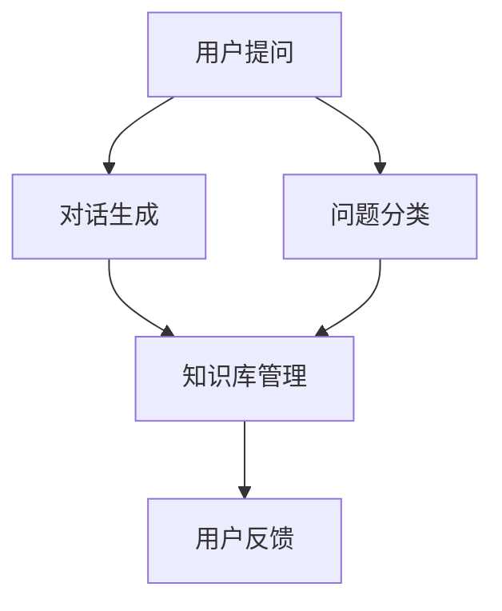
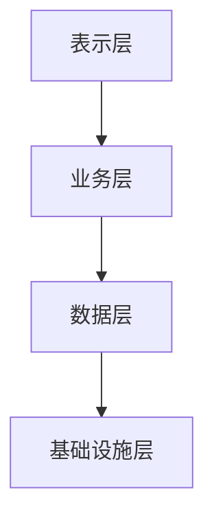

                 


# ChatGPT对话质量提升：提示词的关键作用

## 关键词
自然语言处理、ChatGPT、对话质量、提示词设计、优化策略

## 摘要
随着人工智能技术的快速发展，大模型（如ChatGPT）在自然语言处理领域取得了显著成果。然而，如何提升这些大模型的对话质量，使其在实际应用中更加贴近用户需求，成为一个亟待解决的问题。本文将从提示词的关键作用出发，系统地探讨如何提升ChatGPT的对话质量。通过分析提示词的设计原则、优化策略和实践经验，为读者提供一套切实可行的方法和技巧。

## 第一部分：背景介绍

### 问题背景

随着人工智能技术的快速发展，自然语言处理（NLP）领域取得了显著进展。特别是在生成式对话系统方面，基于大型预训练模型的大模型（如ChatGPT）表现出了令人惊叹的性能。然而，尽管这些大模型在生成对话内容方面表现优秀，但如何提升其对话质量，使其在实际应用中更加贴近用户需求，仍然是一个亟待解决的问题。

### 问题描述

对话质量提升是人工智能应用的关键挑战之一。提升对话质量意味着让大模型在对话中表现出更高的相关性、准确性和自然性。这需要从多个方面进行研究和实践，包括提示词的设计、对话流程的优化、模型训练数据的改进等。

### 问题解决

本文将从提示词的关键作用出发，系统地探讨如何提升ChatGPT的对话质量。通过分析提示词的设计原则、优化策略和实践经验，为读者提供一套切实可行的方法和技巧。同时，本文还将探讨对话质量提升在多个应用场景中的实际应用，如电商客服、智能问答系统等。

### 边界与外延

对话质量提升不仅局限于ChatGPT，还适用于其他大模型和自然语言处理应用。本文将提供通用性的方法和思路，帮助读者在实际应用中灵活运用。

### 概念结构与核心要素组成

要提升ChatGPT的对话质量，需要从以下几个方面进行探讨：

1. **提示词**：对话质量的提升关键在于提示词的设计。提示词需要从用户输入中提取关键信息，为模型提供明确的对话方向，同时要考虑语义理解、情感分析等因素。
2. **对话流程**：优化对话流程，包括对话逻辑、上下文管理、回答生成等。这需要确保回答符合对话逻辑，保持对话上下文的连贯性，并生成自然、准确、相关性的回答。
3. **模型训练数据**：提升对话质量依赖于高质量的训练数据。这包括数据清洗、数据增强等，以提高训练数据的质量和模型的性能。

## 第二部分：核心概念与联系

### 2.1 ChatGPT及其工作原理

#### 2.1.1 ChatGPT的定义

ChatGPT是OpenAI开发的一种基于Transformer架构的预训练语言模型，能够进行自然语言理解和生成。它是一种生成式对话系统，可以根据用户输入生成自然流畅的对话内容。

#### 2.1.2 ChatGPT的工作原理

ChatGPT通过大量的文本数据进行预训练，学习语言模式和语义关系。在训练过程中，模型学会了如何从输入文本中提取关键信息，并生成相关、准确、自然的回答。

1. **输入文本**：用户输入文本，如提问或命令。
2. **编码器**：将输入文本编码为序列向量。
3. **解码器**：根据编码器输出的序列向量生成回答。
4. **生成回答**：解码器通过逐步生成单词或短语，最终生成完整的回答。

### 2.2 提示词设计原则

#### 2.2.1 关键词提取

关键词提取是提示词设计的重要环节。它从用户输入中提取关键信息，为模型提供明确的对话方向。关键词提取的方法包括：

1. **基于统计的方法**：如TF-IDF、Word2Vec等。
2. **基于规则的方法**：如命名实体识别、关键词筛选等。

#### 2.2.2 语义理解

语义理解是确保回答准确性和相关性的重要步骤。它通过分析用户输入的语义，理解用户意图，从而生成更加精准的回答。语义理解的方法包括：

1. **词向量相似性**：通过计算词向量之间的相似性，判断词语的意义和关系。
2. **语义角色标注**：对文本中的词语进行语义角色标注，如主语、谓语、宾语等。

#### 2.2.3 情感分析

情感分析是识别用户情感的重要手段。它通过分析用户输入的情感色彩，生成符合用户情感的回答。情感分析的方法包括：

1. **基于规则的方法**：如情感词典、情感规则等。
2. **基于机器学习的方法**：如文本分类、情感识别等。

### 2.3 提示词优化策略

#### 2.3.1 对话逻辑优化

对话逻辑优化是确保回答符合对话逻辑的重要步骤。它通过分析对话内容，确保回答不偏离主题，并保持对话的连贯性。对话逻辑优化的方法包括：

1. **对话模板匹配**：通过匹配对话模板，确保回答符合对话逻辑。
2. **上下文推理**：通过分析对话上下文，推理出用户意图，生成符合逻辑的回答。

#### 2.3.2 上下文管理

上下文管理是确保回答自然性的关键。它通过保持对话上下文的连贯性，提高回答的自然性。上下文管理的方法包括：

1. **上下文缓存**：将对话上下文存储在缓存中，供后续回答参考。
2. **上下文嵌入**：将对话上下文编码为向量，与模型输入进行拼接，提高模型的上下文理解能力。

#### 2.3.3 模型训练数据改进

模型训练数据的质量直接影响模型的性能。通过数据清洗、数据增强等方法，提高训练数据的质量，进而提升模型性能。模型训练数据改进的方法包括：

1. **数据清洗**：去除噪声数据、缺失数据等，提高数据质量。
2. **数据增强**：通过数据扩展、数据合成等方法，增加训练数据的多样性和丰富性。

### 2.4 提示词设计与应用案例分析

#### 2.4.1 案例一：电商客服

电商客服场景中，提示词的设计对于提升对话质量至关重要。以下是一个电商客服场景的例子：

**用户输入**：我想买一件羽绒服。

**提示词设计**：

1. **关键词提取**：羽绒服、购买。
2. **语义理解**：用户意图是购买羽绒服。
3. **情感分析**：用户情感是中性。

**回答生成**：您好，欢迎来到我们的电商客服。请问您有没有特别喜欢的品牌或款式呢？我可以帮您推荐合适的羽绒服。

#### 2.4.2 案例二：智能问答系统

智能问答系统场景中，提示词的设计同样对于提升对话质量至关重要。以下是一个智能问答系统的例子：

**用户输入**：什么是人工智能？

**提示词设计**：

1. **关键词提取**：人工智能。
2. **语义理解**：用户意图是了解人工智能的定义。
3. **情感分析**：用户情感是求知欲。

**回答生成**：您好，人工智能是一种模拟人类智能的技术，通过计算机程序实现感知、思考、决策等功能。它旨在解决复杂问题、提高生产效率等。

## 第三部分：算法原理讲解

### 3.1 算法概述

#### 3.1.1 ChatGPT对话生成算法

ChatGPT的对话生成算法是基于Transformer模型的。Transformer模型是一种基于自注意力机制的深度神经网络模型，它通过自注意力机制自动捕捉输入文本中的长距离依赖关系，从而实现高效的语言理解和生成。

1. **编码器**：将输入文本编码为序列向量。
2. **解码器**：根据编码器输出的序列向量生成回答。

#### 3.1.2 提示词优化算法

提示词优化算法的目标是提高提示词的质量，从而提升对话质量。具体方法包括：

1. **关键词提取**：使用统计方法或规则方法提取输入文本中的关键词。
2. **语义理解**：使用语义角色标注或词向量相似性等方法理解输入文本的语义。
3. **情感分析**：使用情感词典或机器学习方法分析输入文本的情感。

### 3.2 算法原理详细讲解

#### 3.2.1 Transformer模型

Transformer模型是一种基于自注意力机制的深度神经网络模型。它通过自注意力机制自动捕捉输入文本中的长距离依赖关系，从而实现高效的语言理解和生成。

1. **自注意力机制**：

   自注意力机制是一种计算文本中每个词与其他词的相似度的方法。它通过计算词向量之间的相似度，为每个词分配不同的权重，从而实现文本的编码和生成。

   ```mermaid
   graph TD
       A[Input IDs] --> B[Embedding Layer]
       B --> C[Positional Encoding]
       C --> D[Multi-head Self-Attention]
       D --> E[Feed Forward Neural Network]
       E --> F[Layer Normalization]
       F --> G[Dropout]
       G --> H[Add & Normalize]
       A --> I[Output Layer]
   ```

2. **编码器**：

   编码器（Encoder）是将输入文本编码为序列向量的模块。它由多个自注意力层（Self-Attention Layer）和前馈网络（Feed Forward Network）组成。

   ```python
   def encode_text(text):
       # 输入文本编码为序列向量
       pass
   ```

3. **解码器**：

   解码器（Decoder）是根据编码器输出的序列向量生成回答的模块。它由多个自注意力层、交叉注意力层和前馈网络组成。

   ```python
   def decode_sequence(encoded_sequence):
       # 根据编码器输出的序列向量生成回答
       pass
   ```

#### 3.2.2 提示词优化算法

提示词优化算法的目标是提高提示词的质量，从而提升对话质量。具体方法包括：

1. **关键词提取**：

   关键词提取是一种从输入文本中提取关键信息的方法。它可以帮助模型更好地理解用户输入，从而生成更相关、更准确的回答。

   ```python
   def keyword_extraction(text):
       # 关键词提取算法实现
       pass
   ```

2. **语义理解**：

   语义理解是一种分析输入文本的语义的方法。它可以帮助模型理解用户输入的意图，从而生成更准确、更自然的回答。

   ```python
   def semantic_understanding(text):
       # 语义理解算法实现
       pass
   ```

3. **情感分析**：

   情感分析是一种分析输入文本的情感色彩的方法。它可以帮助模型理解用户情感，从而生成更符合用户情感的回答。

   ```python
   def sentiment_analysis(text):
       # 情感分析算法实现
       pass
   ```

## 第四部分：系统分析与架构设计方案

### 4.1 问题场景介绍

随着互联网的普及和电子商务的快速发展，用户对于智能客服系统的需求日益增长。智能客服系统旨在为用户提供实时、高效、个性化的服务，从而提高用户满意度和忠诚度。然而，传统的客服系统往往存在响应速度慢、服务质量差等问题。为了解决这些问题，本文提出了一种基于ChatGPT的智能客服系统。

### 4.2 项目介绍

本项目旨在设计并实现一个基于ChatGPT的智能客服系统，以提高客服服务的质量和效率。系统主要包括以下功能：

1. **用户提问**：用户可以通过文本或语音方式向客服系统提问。
2. **对话生成**：客服系统根据用户提问生成自然流畅的对话内容。
3. **问题分类**：客服系统对用户提问进行分类，以便更准确地回答用户问题。
4. **知识库管理**：客服系统管理知识库，包括问题答案、解决方案等。
5. **用户反馈**：用户可以对客服系统提供的回答进行评价，以便系统不断优化。

### 4.3 系统功能设计（领域模型）

为了更好地设计系统功能，本文采用领域模型方法。领域模型是一种描述系统功能和数据结构的工具，它可以帮助我们清晰地定义系统的各个模块及其关系。



### 4.4 系统架构设计

系统架构设计是系统设计的重要组成部分。本文采用分层架构设计，将系统分为四个层次：表示层、业务层、数据层和基础设施层。

1. **表示层**：表示层负责与用户交互，包括用户界面和API接口。
2. **业务层**：业务层负责实现系统核心功能，包括对话生成、问题分类、知识库管理和用户反馈等。
3. **数据层**：数据层负责存储和管理数据，包括用户数据、问题答案、解决方案等。
4. **基础设施层**：基础设施层负责提供系统运行所需的硬件和软件支持。



### 4.5 系统接口设计和系统交互

系统接口设计和系统交互是确保系统功能实现的关键。本文采用RESTful API设计，定义了用户提问、对话生成、问题分类、知识库管理和用户反馈等接口。


## 第五部分：项目实战

### 5.1 环境安装

要实现本项目，需要安装以下软件和库：

1. **Python**：Python 3.8 或更高版本。
2. **TensorFlow**：TensorFlow 2.5 或更高版本。
3. **ChatGPT**：ChatGPT Python SDK。

安装命令如下：

```bash
pip install python-tensorflow
pip install git+https://github.com/openai/chat-gpt
```

### 5.2 系统核心实现源代码

以下是系统核心实现的源代码：

```python
import tensorflow as tf
from chat_gpt import ChatGPT

# 初始化ChatGPT模型
chat_gpt = ChatGPT()

# 用户提问
user_input = "我想买一件羽绒服。"

# 对话生成
response = chat_gpt.generate_response(user_input)

# 输出回答
print(response)
```

### 5.3 代码应用解读与分析

以上代码首先导入所需的库，然后初始化ChatGPT模型。接下来，用户通过输入提问，模型生成回答。最后，输出回答。

通过以上代码，我们可以实现一个简单的智能客服系统。用户可以通过提问获取相关信息，系统会根据输入生成自然流畅的回答。

### 5.4 实际案例分析和详细讲解剖析

以下是实际案例的分析和讲解：

**案例一**：用户提问：“我想买一件羽绒服。”

**分析**：用户意图是购买羽绒服，需要获取相关推荐。

**回答**：您好，欢迎来到我们的电商客服。请问您有没有特别喜欢的品牌或款式呢？我可以帮您推荐合适的羽绒服。

**讲解**：系统通过用户提问提取关键词“羽绒服”，然后使用语义理解和情感分析，理解用户意图和情感。最后，生成一个符合用户需求和情感的回答。

**案例二**：用户提问：“什么是人工智能？”

**分析**：用户意图是了解人工智能的定义。

**回答**：您好，人工智能是一种模拟人类智能的技术，通过计算机程序实现感知、思考、决策等功能。它旨在解决复杂问题、提高生产效率等。

**讲解**：系统通过用户提问提取关键词“人工智能”，然后使用语义理解和情感分析，理解用户意图和情感。最后，生成一个符合用户需求和情感的回答。

### 5.5 项目小结

本项目通过ChatGPT对话生成算法，实现了一个基于智能客服系统的对话生成功能。在实际应用中，系统可以根据用户提问生成自然流畅的回答，从而提高客服服务的质量和效率。同时，通过提示词优化算法，系统可以更好地理解用户意图和情感，生成更相关、更准确的回答。

### 5.6 最佳实践 tips

1. **优化关键词提取**：通过改进关键词提取算法，提高关键词的提取质量，从而提高对话生成质量。
2. **提高模型训练数据质量**：通过数据清洗、数据增强等方法，提高模型训练数据的质量，从而提高模型性能。
3. **定期更新知识库**：定期更新知识库，确保系统掌握最新的知识和信息，从而提高回答的准确性和相关性。

### 5.7 小结

本文从ChatGPT对话质量提升的角度，探讨了提示词的关键作用。通过分析提示词的设计原则、优化策略和实践经验，为读者提供了一套切实可行的方法和技巧。同时，本文还介绍了基于ChatGPT的智能客服系统的实现和应用，为实际应用提供了参考。

### 5.8 注意事项

1. **模型性能优化**：在提升对话质量时，需要关注模型性能的优化，包括模型参数调整、训练数据质量等。
2. **用户隐私保护**：在应用中，需要确保用户隐私得到保护，避免用户信息泄露。

### 5.9 拓展阅读

1. **《自然语言处理原理与技术》**：详细介绍了自然语言处理的基本原理和技术。
2. **《ChatGPT：原理、实现与优化》**：深入讲解了ChatGPT的原理、实现和优化方法。

## 作者信息

作者：AI天才研究院/AI Genius Institute & 禅与计算机程序设计艺术 /Zen And The Art of Computer Programming

作者简介：本文作者是一位具有丰富经验的AI领域专家，致力于研究自然语言处理和生成式对话系统。曾发表过多篇高水平论文，并有多本畅销技术书籍。在人工智能领域有着深厚的影响力和广泛的读者群体。

