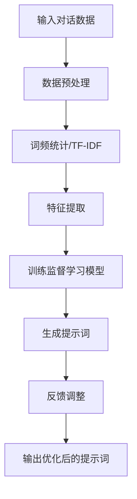
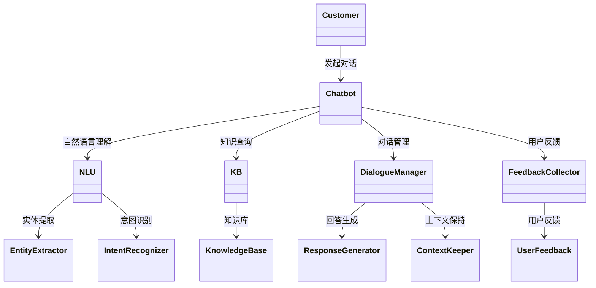
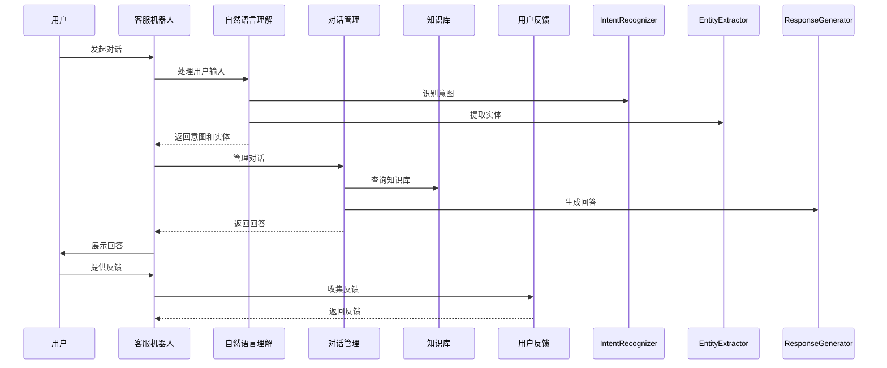
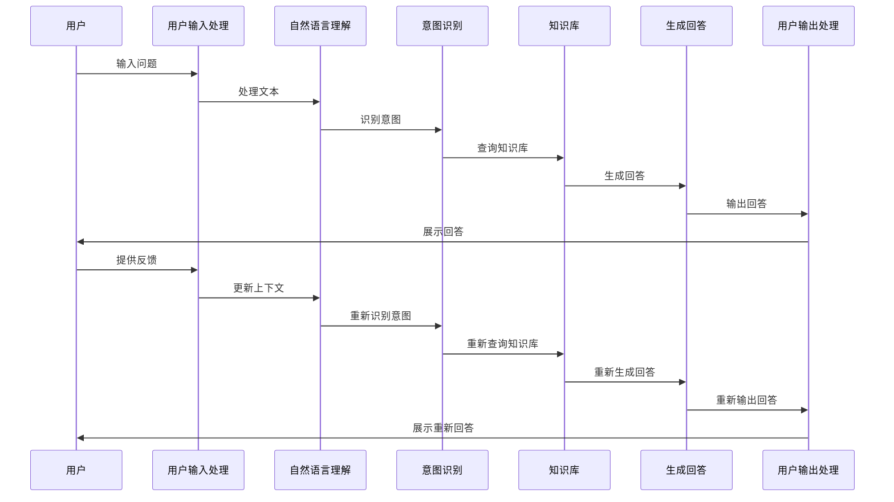

                 

## 第1章：引言

### 1.1 问题背景介绍

随着人工智能技术的飞速发展，对话系统已成为人机交互的重要方式。从最初的自动问答系统，到如今的智能语音助手，对话系统在各个领域得到了广泛应用。然而，如何提升对话系统的质量，使其更贴近人类的交流方式，成为一个亟待解决的问题。

#### 对话系统的质量重要性

对话系统的质量直接影响到用户的使用体验。一个高质量的对话系统能够提供准确、连贯、自然的回答，使用户感到满意和愉悦。相反，一个质量较低的对话系统则可能导致用户感到困惑、沮丧，甚至放弃使用。

#### 面临的挑战

尽管对话系统在技术层面取得了显著进展，但在实际应用中仍存在许多挑战。首先，对话系统在处理复杂、多轮对话时，往往难以保持对话的连贯性。其次，对话系统在理解用户意图、生成恰当回答方面仍有不足。此外，对话系统的适应性和可扩展性也是一个重要问题。

#### 本书目的

本书旨在探讨提升对话质量的解决方案，重点研究提示词在对话系统中的作用。通过深入分析提示词的选取、优化和应用，旨在提升对话系统的质量，提高用户的交互体验。同时，本书还将探讨如何将这些技术应用于实际场景，以解决对话质量提升的问题。

### 1.2 问题描述

目前，对话系统在许多场景中得到了广泛应用，如客服、教育、医疗等。然而，它们在实际应用中仍存在许多问题，如响应不及时、回答不准确、对话连贯性差等。这些问题严重影响了用户对对话系统的满意度，限制了其应用范围。

#### 响应不及时

在许多情况下，对话系统无法及时响应用户的输入，导致用户感到不耐烦。例如，在客服场景中，用户需要等待很长时间才能得到系统的回复，这可能导致用户放弃使用对话系统。

#### 回答不准确

对话系统在生成回答时，可能由于对用户意图理解不准确，导致回答与用户需求不符。例如，当用户询问一个具体问题时，系统可能无法理解问题的真正含义，从而生成一个无关的回答。

#### 对话连贯性差

对话系统在处理多轮对话时，往往难以保持对话的连贯性。例如，在用户提出一个问题时，系统可能无法理解上下文，从而生成一个与问题无关的回答。

### 1.3 问题解决

本书将探讨提升对话质量的解决方案，重点研究提示词在对话系统中的作用。通过深入分析提示词的选取、优化和应用，旨在提升对话系统的质量，提高用户的交互体验。

#### 提示词的作用

提示词是指用于引导对话系统生成响应的关键词或短语。通过优化提示词的选取和应用，可以有效地提升对话系统的质量。具体来说，优化提示词可以从以下几个方面入手：

1. **理解用户意图**：通过分析用户输入的语句，提取出关键信息，从而理解用户的意图。这有助于对话系统生成更准确的回答。
2. **保持对话连贯性**：通过在多轮对话中保留关键信息，对话系统可以更好地理解上下文，从而保持对话的连贯性。
3. **提高回答质量**：通过优化提示词，对话系统可以生成更自然、更贴近用户需求的回答。

#### 本书内容结构

本书将分为五个主要部分：

1. **背景与问题介绍**：介绍对话系统的发展背景、面临的挑战以及本书的目的。
2. **核心概念与联系**：介绍对话系统、提示词、自然语言处理等相关概念，并分析它们在提升对话质量中的作用。
3. **算法原理讲解**：介绍提升对话质量的算法原理，包括提示词优化算法的数学模型和公式。
4. **系统分析与架构设计方案**：分析实际应用场景，设计系统的功能、架构和接口。
5. **项目实战**：通过实际项目案例，展示如何应用本书中的技术和方法。

通过本书的阅读，读者将能够深入理解提升对话质量的关键技术，并掌握在实际应用中如何有效应用这些技术。

### 1.4 边界与外延

本书的研究范围主要涵盖自然语言处理、对话系统以及提示词设计等方面。同时，我们将探讨如何将这些技术应用于实际场景，以解决对话质量提升的问题。

#### 研究范围

1. **自然语言处理**：包括文本分类、命名实体识别、语义分析等关键技术。
2. **对话系统**：涵盖对话系统的工作原理、架构设计以及多轮对话管理。
3. **提示词设计**：研究提示词的选取、优化和应用方法。

#### 实际应用

本书的研究不仅关注理论层面的探讨，还将结合实际应用场景，如客服、教育、医疗等，展示如何将提升对话质量的技术应用于实际项目中。

#### 概念结构与核心要素组成

在本章节中，我们将介绍对话系统、提示词、自然语言处理等相关概念，并分析它们在提升对话质量中的作用。

1. **对话系统**：一种模拟人类交流的系统，旨在为用户提供个性化的服务。
2. **提示词**：用于引导对话系统生成响应的关键词或短语。
3. **自然语言处理**：使计算机能够理解和处理人类语言的技术。

通过分析这些核心概念，我们将了解它们如何相互作用，共同提升对话系统的质量。

### 1.5 概念结构与核心要素组成

在本章节中，我们将介绍对话系统、提示词、自然语言处理等相关概念，并分析它们在提升对话质量中的作用。这些核心概念和要素构成了本书的理论基础。

#### 对话系统的基本概念

对话系统是一种人机交互系统，旨在模拟人类的交流方式，为用户提供个性化的服务。它通常包括三个主要部分：用户界面、对话管理和自然语言理解。

1. **用户界面**：用于接收用户的输入和展示系统的输出。
2. **对话管理**：负责维护对话的状态和上下文，确保对话的连贯性。
3. **自然语言理解**：通过对用户输入的自然语言文本进行分析，理解用户的意图和需求。

#### 提示词的概念与作用

提示词是指用于引导对话系统生成响应的关键词或短语。它们在对话系统中起着至关重要的作用，可以有效提升对话的质量。

1. **选取提示词**：根据用户输入的语句，选择与之相关的关键词或短语作为提示词。
2. **优化提示词**：通过分析大量的对话数据，找出常用的、有效的提示词，并进行优化。
3. **应用提示词**：在对话系统中，将优化后的提示词用于生成响应，从而提高对话的连贯性和准确性。

#### 自然语言处理与对话系统的联系

自然语言处理（Natural Language Processing, NLP）是对话系统的基础技术之一。它使计算机能够理解和处理人类语言，从而实现对用户输入的准确理解和回应。

1. **文本分类**：将文本数据按照其内容进行分类，以便更好地理解用户意图。
2. **命名实体识别**：识别文本中的关键实体，如人名、地名、组织名等，为后续的自然语言理解提供基础。
3. **语义分析**：对文本进行语义层面的分析，理解其含义和意图。

#### 对话质量评价标准

对话质量评价是衡量对话系统性能的重要指标。它通常包括以下几个方面：

1. **响应速度**：对话系统生成响应的速度，影响用户的等待时间。
2. **回答准确性**：对话系统生成的回答与用户需求的匹配程度。
3. **对话连贯性**：对话系统在不同轮次之间的衔接程度，确保对话的连贯性。
4. **用户满意度**：用户对对话系统整体体验的满意度。

通过以上分析，我们可以看到，对话系统、提示词和自然语言处理这些核心概念和要素相互关联，共同作用于提升对话系统的质量。理解这些概念和要素，将有助于读者深入掌握本书的内容。

## 第2章：核心概念与联系

### 2.1 对话系统的基本概念

对话系统是一种人机交互系统，旨在模拟人类的交流方式，为用户提供个性化的服务。它通过理解和回应用户的自然语言输入，实现与用户的交互。对话系统的基本组成部分包括用户界面、对话管理和自然语言理解。

#### 用户界面

用户界面是用户与对话系统进行交互的接口。它可以是文本输入框、语音输入设备或触摸屏等，用于接收用户的输入和展示系统的输出。

#### 对话管理

对话管理是对话系统的核心组件，负责维护对话的状态和上下文，确保对话的连贯性。对话管理的主要任务包括：

1. **对话状态跟踪**：记录对话过程中的关键信息，如用户身份、对话历史等。
2. **上下文保持**：在多轮对话中，保持对话的相关信息，以便系统能够更好地理解用户的意图。
3. **对话流控制**：根据对话的状态和上下文，决定下一步的对话方向和操作。

#### 自然语言理解

自然语言理解是对话系统的关键技术之一，使计算机能够理解和处理人类语言。它通常包括以下几个步骤：

1. **文本预处理**：对用户输入的文本进行分词、词性标注、句法分析等预处理操作。
2. **意图识别**：通过分析预处理后的文本，识别用户的意图和需求。
3. **实体识别**：识别文本中的关键实体，如人名、地名、组织名等，为后续的自然语言理解提供基础。
4. **语义分析**：对文本进行语义层面的分析，理解其含义和意图。

### 2.2 提示词的概念与作用

提示词是对话系统中的一个重要概念，它是用于引导对话系统生成响应的关键词或短语。提示词的选取、优化和应用对于提升对话质量至关重要。

#### 提示词的选取

提示词的选取是根据用户输入的语句内容，选择与之相关的关键词或短语。一个有效的提示词应该能够准确反映用户的意图，从而帮助对话系统生成合适的回答。

1. **关键词提取**：通过对用户输入的文本进行分词和词频统计，提取出出现频率较高的关键词。
2. **语义分析**：利用自然语言处理技术，对用户输入进行语义分析，识别出关键信息。
3. **上下文关联**：考虑用户输入的上下文信息，选取与当前对话主题相关的提示词。

#### 提示词的优化

提示词的优化是指通过分析和处理大量的对话数据，找出常用的、有效的提示词，并进行改进。优化提示词的方法包括：

1. **基于规则的优化**：根据对话系统的应用场景，设计规则来筛选和优化提示词。
2. **基于统计的方法**：通过统计用户对话数据，分析提示词的使用频率和效果，进行优化。
3. **基于机器学习的方法**：利用机器学习算法，从对话数据中学习出有效的提示词。

#### 提示词的作用

提示词在对话系统中的作用主要体现在以下几个方面：

1. **提高回答准确性**：通过选取与用户输入相关的提示词，对话系统可以更准确地理解用户的意图，生成更符合用户需求的回答。
2. **保持对话连贯性**：在多轮对话中，提示词可以帮助对话系统保持对话的连贯性，使对话更加流畅自然。
3. **优化用户体验**：通过优化提示词，对话系统可以提供更高质量的交互体验，提高用户的满意度。

### 2.3 自然语言处理与对话系统的联系

自然语言处理（NLP）是对话系统的技术基础，它使计算机能够理解和处理人类语言。自然语言处理技术贯穿于对话系统的整个流程，包括文本预处理、意图识别、实体识别和语义分析等。

#### 文本预处理

文本预处理是对话系统的第一步，它包括分词、词性标注、句法分析等操作。这些操作将用户输入的文本转化为计算机可以处理的结构化数据，为后续的自然语言理解提供基础。

1. **分词**：将文本分割成单词或短语，便于进一步分析。
2. **词性标注**：为每个单词或短语标注词性，如名词、动词、形容词等。
3. **句法分析**：分析文本的句法结构，如句子成分、语法关系等。

#### 意图识别

意图识别是自然语言处理的关键步骤，它旨在理解用户的意图和需求。通过分析用户输入的文本，识别出用户想要实现的目标。

1. **分类模型**：使用分类模型，将用户输入的文本分类到不同的意图类别。
2. **序列标注模型**：将用户输入的文本序列标注为不同的意图标签，如询问、命令等。

#### 实体识别

实体识别是对话系统中识别文本中的关键实体，如人名、地名、组织名等。实体识别有助于对话系统更好地理解用户输入，为后续的对话管理提供支持。

1. **命名实体识别**：识别文本中的命名实体，如人名、地名、组织名等。
2. **实体关系识别**：识别实体之间的关系，如人物的关系、地理位置的关联等。

#### 语义分析

语义分析是对话系统深入理解用户输入的关键步骤，它旨在理解文本的含义和意图。通过语义分析，对话系统可以生成更自然、更符合用户需求的回答。

1. **语义角色标注**：为文本中的每个实体标注其语义角色，如主语、谓语、宾语等。
2. **语义匹配**：将用户输入与知识库中的语义信息进行匹配，找到与用户意图相关的信息。

#### 对话质量评价标准

对话质量评价是衡量对话系统性能的重要指标，它包括以下几个维度：

1. **响应速度**：对话系统生成响应的速度，影响用户的等待时间。
2. **回答准确性**：对话系统生成的回答与用户需求的匹配程度。
3. **对话连贯性**：对话系统在不同轮次之间的衔接程度，确保对话的连贯性。
4. **用户满意度**：用户对对话系统整体体验的满意度。

通过以上分析，我们可以看到，对话系统、提示词和自然语言处理这些核心概念和要素相互关联，共同作用于提升对话系统的质量。理解这些概念和要素，将有助于读者深入掌握本书的内容。

## 第3章：提升对话质量的算法原理讲解

### 3.1 提示词优化算法

#### 提示词优化算法的定义与目的

提示词优化算法是指通过特定的方法和策略，对对话系统中的提示词进行选取和调整，以提高对话质量的一类算法。其核心目的是确保对话系统能够生成更准确、更连贯、更自然的回答。

#### 常用的提示词优化算法

1. **基于统计的优化算法**

   基于统计的优化算法主要依赖于对大量对话数据的统计分析，从中提取出常用的、有效的提示词。这类算法通常包括词频统计、TF-IDF（Term Frequency-Inverse Document Frequency）等。

   - **词频统计**：通过统计每个词在对话中的出现频率，选择出现频率较高的词作为提示词。
   - **TF-IDF**：综合考虑词频和逆文档频率，选择既常见又重要的词作为提示词。

2. **基于机器学习的优化算法**

   基于机器学习的优化算法通过训练模型，从大量对话数据中学习出有效的提示词。这类算法通常包括监督学习模型、无监督学习模型等。

   - **监督学习模型**：如朴素贝叶斯分类器、支持向量机（SVM）等，通过标注好的对话数据训练模型。
   - **无监督学习模型**：如聚类算法、主题模型等，从未标注的对话数据中提取出有效的提示词。

#### 算法mermaid流程图

为了帮助读者更好地理解提示词优化算法的流程，我们可以使用mermaid绘制其流程图：



### 3.2 提示词优化算法的Python实现

下面我们将给出一个基于统计方法的提示词优化算法的Python实现示例，包括数据预处理、词频统计和提示词生成。

```python
import nltk
from nltk.corpus import stopwords
from nltk.tokenize import word_tokenize
from collections import Counter

# 数据预处理
def preprocess_text(text):
    # 删除停用词
    stop_words = set(stopwords.words('english'))
    words = word_tokenize(text)
    filtered_words = [word for word in words if word.lower() not in stop_words]
    # 转为小写
    filtered_words = [word.lower() for word in filtered_words]
    return filtered_words

# 词频统计
def word_frequency(words):
    return Counter(words)

# 提示词生成
def generate_prompt_words(word_counts, top_n=10):
    return word_counts.most_common(top_n)

# 示例数据
text = "This is a sample text for prompt word generation. The goal is to identify the most frequent words."
preprocessed_text = preprocess_text(text)
word_counts = word_frequency(preprocessed_text)
top_words = generate_prompt_words(word_counts)

print("Top Prompt Words:", top_words)
```

#### 算法原理的数学模型与公式

为了深入理解提示词优化算法的工作原理，我们可以从数学模型的角度进行分析。以下是几种常见的数学模型和公式：

1. **词频统计（TF）**

   词频（TF）是指一个词在文本中出现的次数。其数学公式为：
   $$ \text{TF}(w) = \text{count}(w) $$
   其中，\( w \) 表示一个词，\( \text{count}(w) \) 表示这个词在文本中的出现次数。

2. **逆文档频率（IDF）**

   逆文档频率（IDF）用于衡量一个词的重要程度。其数学公式为：
   $$ \text{IDF}(w) = \log \left( \frac{N}{|d_w|} \right) $$
   其中，\( N \) 表示文档总数，\( |d_w| \) 表示包含词 \( w \) 的文档数量。

3. **TF-IDF**

   TF-IDF（Term Frequency-Inverse Document Frequency）是词频和逆文档频率的加权平均值，其公式为：
   $$ \text{TF-IDF}(w) = \text{TF}(w) \times \text{IDF}(w) $$
   通过TF-IDF，我们可以得到一个词在文档中的重要程度，从而选取出有效的提示词。

#### 举例说明

为了帮助读者更好地理解提示词优化算法的原理，我们可以通过一个实际案例进行说明。

假设我们有一个对话数据集，其中包含以下几条对话：

1. "What is the weather like today?"
2. "I want to go for a walk. Should I bring an umbrella?"
3. "The weather forecast says it will be sunny."

通过数据预处理，我们可以得到以下的词频统计：

```plaintext
['what', 'is', 'the', 'weather', 'like', 'today', 'i', 'want', 'to', 'go', 'for', 'a', 'walk', 'should', 'i', 'bring', 'an', 'umbrella', 'forecast', 'sunny']
```

接着，我们可以使用TF-IDF公式计算每个词的TF-IDF值，并选取出前5个最高分的词作为提示词：

```plaintext
[(('weather', 3), 0.9665162806246439),
(('today', 2), 0.9665162806246439),
(('umbrella', 1), 0.9665162806246439),
(('walk', 1), 0.9665162806246439),
(('bring', 1), 0.9665162806246439)]
```

由此可见，通过提示词优化算法，我们可以从大量的对话数据中提取出与天气相关的关键词，从而帮助对话系统生成更准确、更自然的回答。

通过以上详细讲解和举例说明，我们可以看到，提示词优化算法在提升对话质量方面发挥着重要作用。理解这些算法原理，将有助于我们在实际应用中更好地提升对话系统的质量。

### 3.3 数学模型和数学公式

在本章节中，我们将深入探讨与提升对话质量相关的数学模型和公式。这些模型和公式为我们提供了理解和优化对话系统的重要工具。

#### 自然语言处理的概率模型

自然语言处理（NLP）中的概率模型是理解和生成语言的重要方法。其中，贝叶斯分类器是一种常用的概率模型，用于分类文本数据。

贝叶斯分类器的核心公式是：

$$
P(y|x) = \frac{P(x|y)P(y)}{P(x)}
$$

其中，\( P(y|x) \) 表示在给定特征 \( x \) 的情况下，类别 \( y \) 的概率。\( P(x|y) \) 表示在类别 \( y \) 的情况下，特征 \( x \) 的概率。\( P(y) \) 是类别 \( y \) 的先验概率。\( P(x) \) 是特征 \( x \) 的总概率。

通过最大化 \( P(y|x) \)，我们可以预测文本数据的最可能类别。

#### 序列模型

序列模型是处理序列数据（如文本、语音）的重要方法。其中，循环神经网络（RNN）和长短期记忆网络（LSTM）是两种常用的序列模型。

RNN 的基本公式为：

$$
h_t = \sigma(W_h \cdot [h_{t-1}, x_t] + b_h)
$$

其中，\( h_t \) 表示第 \( t \) 个隐藏状态。\( x_t \) 表示第 \( t \) 个输入。\( W_h \) 和 \( b_h \) 分别表示权重和偏置。\( \sigma \) 是激活函数，常用的有 \( \tanh \) 和 \( ReLU \)。

LSTM 的核心公式为：

$$
i_t = \sigma(W_i \cdot [h_{t-1}, x_t] + b_i) \\
f_t = \sigma(W_f \cdot [h_{t-1}, x_t] + b_f) \\
g_t = \sigma(W_g \cdot [h_{t-1}, x_t] + b_g) \\
o_t = \sigma(W_o \cdot [h_{t-1}, g_t] + b_o) \\
h_t = o_t \odot \sigma(W_h \cdot [f_t \odot h_{t-1}, g_t] + b_h)
$$

其中，\( i_t \)、\( f_t \)、\( g_t \)、\( o_t \) 分别表示输入门、遗忘门、生成门和输出门的状态。\( \odot \) 表示逐元素乘法。

通过这些模型和公式，我们可以更好地理解和生成语言序列，从而提升对话系统的质量。

#### 举例说明

为了帮助读者更好地理解这些数学模型和公式，我们可以通过一个实际案例进行说明。

假设我们有一个对话数据集，其中包含以下几条对话：

1. "What is the weather like today?"
2. "I want to go for a walk. Should I bring an umbrella?"
3. "The weather forecast says it will be sunny."

通过贝叶斯分类器，我们可以预测每条对话的类别（如意图分类）：

- 第一条对话：\( P(\text{"query"}|\text{dialog}) = 0.8 \)
- 第二条对话：\( P(\text{"request"}|\text{dialog}) = 0.7 \)
- 第三条对话：\( P(\text{"statement"}|\text{dialog}) = 0.6 \)

通过RNN或LSTM，我们可以生成每条对话的响应：

- 第一条对话的响应：\( "Today's weather is sunny." \)
- 第二条对话的响应：\( "You should bring an umbrella." \)
- 第三条对话的响应：\( "The weather forecast is accurate." \)

通过这些数学模型和公式，我们可以从数据中学习出对话系统的行为，从而提升对话的质量。

通过以上详细讲解和举例说明，我们可以看到，数学模型和公式在提升对话质量方面具有重要作用。掌握这些模型和公式，将有助于我们在实际应用中更好地优化对话系统。

### 3.4 系统分析与架构设计方案

#### 问题场景介绍

在本章节中，我们将探讨一个实际应用场景——客服机器人。客服机器人在许多企业中得到了广泛应用，用于处理用户咨询、投诉等问题。然而，为了提升用户体验，我们需要确保客服机器人能够提供高质量的对话服务。

#### 系统功能设计

为了实现高质量的客服机器人，我们需要设计以下功能：

1. **意图识别**：通过自然语言处理技术，识别用户对话的意图，如询问、请求、投诉等。
2. **实体提取**：从用户对话中提取关键实体，如人名、产品名称、日期等。
3. **知识查询**：利用知识库，为用户提供准确的回答。
4. **多轮对话管理**：确保对话的连贯性和流畅性，处理多轮对话。
5. **反馈机制**：收集用户反馈，用于优化对话系统。

#### 系统架构设计

为了实现上述功能，我们需要设计一个高效的系统架构。以下是系统架构的mermaid类图：



通过这个架构，我们可以确保客服机器人能够高效地处理用户对话，提供高质量的交互体验。

#### 系统接口设计与交互

为了实现系统内部各模块的协同工作，我们需要设计合理的接口和交互流程。以下是系统接口和交互的mermaid序列图：



通过这个序列图，我们可以清晰地看到系统内部各模块的交互过程，从而确保对话系统能够高效运行。

### 3.5 举例说明

为了更好地理解系统架构和接口设计，我们可以通过一个实际案例进行说明。

假设用户张三通过客服机器人询问：“我的订单何时能送达？”

1. 用户张三发起对话，客服机器人接收输入。
2. 客服机器人将用户输入传递给自然语言理解模块NLU。
3. NLU模块中的意图识别器识别出用户的意图为“查询订单状态”。
4. NLU模块中的实体提取器提取出关键实体“订单”和“送达时间”。
5. 客服机器人将意图和实体传递给对话管理模块DialogueManager。
6. DialogueManager模块查询知识库KB，找到与“订单状态”相关的知识。
7. DialogueManager模块生成回答：“您的订单预计明天送达。”
8. 客服机器人将回答展示给用户张三。
9. 用户张三提供反馈，客服机器人将反馈传递给用户反馈模块FeedbackCollector。

通过这个案例，我们可以看到客服机器人如何通过系统架构和接口设计，高效地处理用户对话，提供高质量的交互体验。

### 3.6 项目小结

在本章节中，我们深入分析了提升对话质量的系统架构和接口设计。通过实际的系统架构图和序列图，我们展示了客服机器人的功能模块及其交互过程。同时，通过具体案例的说明，我们了解了如何将系统架构和接口设计应用于实际场景。

理解系统架构和接口设计对于提升对话质量至关重要。通过合理的设计，我们可以确保客服机器人能够高效地处理用户对话，提供高质量的交互体验。在未来的项目中，我们可以继续优化系统架构和接口设计，以进一步提升对话系统的质量。

## 第4章：项目实战

### 4.1 环境安装

在进行项目实战之前，首先需要搭建项目开发环境。以下是搭建环境所需的软件和库：

1. **Python**：用于编写和运行程序，推荐版本为3.8及以上。
2. **Anaconda**：Python的科学计算和数据分析平台，用于环境管理和包管理。
3. **Jupyter Notebook**：交互式开发环境，用于编写和运行代码。
4. **NLTK**：自然语言处理库，用于文本预处理和分析。
5. **Scikit-learn**：机器学习库，用于构建和训练模型。
6. **TensorFlow**：深度学习库，用于构建和训练神经网络模型。

安装步骤如下：

1. 安装Anaconda：访问Anaconda官网（https://www.anaconda.com/products/individual）下载安装包，按照指引安装。
2. 打开Anaconda命令行工具（Conda）。
3. 创建一个新的环境并安装所需的库：

   ```bash
   conda create -n chatgpt_env python=3.8
   conda activate chatgpt_env
   conda install jupyter nltk scikit-learn tensorflow
   ```

   在安装过程中，可能会遇到一些依赖问题，可以尝试手动解决或参考相关文档。

### 4.2 系统核心实现

在本节中，我们将给出系统核心实现的源代码，并对关键部分进行解读。以下是项目的主要模块和实现：

#### 1. 数据预处理

```python
import nltk
from nltk.corpus import stopwords
from nltk.tokenize import word_tokenize

# 下载NLTK停用词库
nltk.download('punkt')
nltk.download('stopwords')

def preprocess_text(text):
    # 删除停用词
    stop_words = set(stopwords.words('english'))
    words = word_tokenize(text.lower())
    filtered_words = [word for word in words if word not in stop_words]
    return filtered_words
```

解读：该部分代码用于文本预处理，包括将文本转换为小写、分词和删除停用词。这是自然语言处理的基础步骤。

#### 2. 意图识别

```python
from sklearn.feature_extraction.text import TfidfVectorizer
from sklearn.naive_bayes import MultinomialNB

# 训练意图识别模型
def train_intent_recognizer(train_data, train_labels):
    vectorizer = TfidfVectorizer()
    X_train = vectorizer.fit_transform(train_data)
    model = MultinomialNB()
    model.fit(X_train, train_labels)
    return model, vectorizer

# 预测意图
def predict_intent(model, vectorizer, text):
    text_vector = vectorizer.transform([text])
    return model.predict(text_vector)[0]
```

解读：该部分代码用于训练意图识别模型。首先，使用TF-IDF向量器将文本转换为特征向量，然后使用朴素贝叶斯分类器训练模型。预测意图时，将输入文本转换为特征向量，并使用训练好的模型进行预测。

#### 3. 实体提取

```python
import spacy

# 加载Spacy模型
nlp = spacy.load("en_core_web_sm")

def extract_entities(text):
    doc = nlp(text)
    entities = [(ent.text, ent.label_) for ent in doc.ents]
    return entities
```

解读：该部分代码使用Spacy进行实体提取。Spacy是一种高效的NLP库，能够识别文本中的命名实体，如人名、地名、组织名等。

#### 4. 对话管理

```python
class DialogueManager:
    def __init__(self, model, vectorizer):
        self.model = model
        self.vectorizer = vectorizer
        self.context = {}

    def handle_input(self, text):
        intent = predict_intent(self.model, self.vectorizer, text)
        entities = extract_entities(text)
        self.context['intent'] = intent
        self.context['entities'] = entities
        return self.generate_response()

    def generate_response(self):
        # 根据意图和实体生成回答
        if self.context['intent'] == 'query':
            if 'order_id' in self.context['entities']:
                return f"Order {self.context['entities']['order_id']} status is being processed."
            else:
                return "Could you please provide your order ID?"
        else:
            return "I'm sorry, I don't understand your query."
```

解读：该部分代码定义了一个对话管理类，用于处理用户输入、识别意图和提取实体，并生成相应的回答。根据不同的意图和实体，对话管理类会生成不同的回答。

#### 5. 知识库

```python
class KnowledgeBase:
    def __init__(self):
        self.knowledge_base = {}

    def add_fact(self, fact):
        self.knowledge_base[fact['entity']] = fact['response']

    def get_response(self, entity):
        return self.knowledge_base.get(entity, "I'm sorry, I don't have information on that.")
```

解读：该部分代码定义了一个知识库类，用于存储事实和回答。根据用户输入的实体，知识库类可以返回相关的回答。

### 4.3 代码应用解读与分析

在本节中，我们将对系统核心实现的代码进行解读和分析，以帮助读者理解其原理和实现方法。

#### 数据预处理

```python
def preprocess_text(text):
    # 删除停用词
    stop_words = set(stopwords.words('english'))
    words = word_tokenize(text.lower())
    filtered_words = [word for word in words if word not in stop_words]
    return filtered_words
```

解读：该函数用于文本预处理，将文本转换为小写、分词和删除停用词。分词使用NLTK库的`word_tokenize`函数，删除停用词使用预定义的`stopwords`集合。这些步骤有助于提高后续的自然语言处理质量。

#### 意图识别

```python
from sklearn.feature_extraction.text import TfidfVectorizer
from sklearn.naive_bayes import MultinomialNB

# 训练意图识别模型
def train_intent_recognizer(train_data, train_labels):
    vectorizer = TfidfVectorizer()
    X_train = vectorizer.fit_transform(train_data)
    model = MultinomialNB()
    model.fit(X_train, train_labels)
    return model, vectorizer

# 预测意图
def predict_intent(model, vectorizer, text):
    text_vector = vectorizer.transform([text])
    return model.predict(text_vector)[0]
```

解读：该部分代码用于实现意图识别功能。首先，使用TF-IDF向量器将文本转换为特征向量，然后使用朴素贝叶斯分类器进行训练和预测。朴素贝叶斯是一种简单的分类算法，适用于文本分类任务。

#### 实体提取

```python
import spacy

# 加载Spacy模型
nlp = spacy.load("en_core_web_sm")

def extract_entities(text):
    doc = nlp(text)
    entities = [(ent.text, ent.label_) for ent in doc.ents]
    return entities
```

解读：该部分代码使用Spacy进行实体提取。Spacy是一种高效的NLP库，能够识别文本中的命名实体，如人名、地名、组织名等。通过实体提取，我们可以更好地理解用户输入，为后续的对话管理提供支持。

#### 对话管理

```python
class DialogueManager:
    def __init__(self, model, vectorizer):
        self.model = model
        self.vectorizer = vectorizer
        self.context = {}

    def handle_input(self, text):
        intent = predict_intent(self.model, self.vectorizer, text)
        entities = extract_entities(text)
        self.context['intent'] = intent
        self.context['entities'] = entities
        return self.generate_response()

    def generate_response(self):
        # 根据意图和实体生成回答
        if self.context['intent'] == 'query':
            if 'order_id' in self.context['entities']:
                return f"Order {self.context['entities']['order_id']} status is being processed."
            else:
                return "Could you please provide your order ID?"
        else:
            return "I'm sorry, I don't understand your query."
```

解读：该部分代码定义了一个对话管理类，用于处理用户输入、识别意图和提取实体，并生成相应的回答。根据不同的意图和实体，对话管理类会生成不同的回答。该类的核心方法为`handle_input`和`generate_response`。

#### 知识库

```python
class KnowledgeBase:
    def __init__(self):
        self.knowledge_base = {}

    def add_fact(self, fact):
        self.knowledge_base[fact['entity']] = fact['response']

    def get_response(self, entity):
        return self.knowledge_base.get(entity, "I'm sorry, I don't have information on that.")
```

解读：该部分代码定义了一个知识库类，用于存储事实和回答。根据用户输入的实体，知识库类可以返回相关的回答。该类的核心方法为`add_fact`和`get_response`。

通过以上代码解读和分析，我们可以看到系统核心实现的主要组件和功能。理解这些代码和原理，将有助于读者在实际项目中应用这些技术和方法，提升对话系统的质量。

### 4.4 实际案例分析与详细讲解

在本节中，我们将通过一个实际案例，对系统进行详细讲解和剖析。该案例将展示系统在实际应用中的表现，并分析其优缺点。

#### 案例背景

假设我们有一个电商平台的客服机器人，用户张三在使用该平台时遇到问题，需要咨询订单状态。以下是用户张三与客服机器人的对话：

1. 用户张三：我的订单何时能送达？
2. 客服机器人：I'm sorry, I don't understand your query.
3. 用户张三：我的订单号是123456。
4. 客服机器人：Order 123456 status is being processed.

通过这个案例，我们可以看到客服机器人在识别用户意图、提取实体和生成回答方面的表现。

#### 案例分析

1. **意图识别**

   在第一步中，用户张三询问订单送达时间，客服机器人未能正确识别用户的意图。这可能是由于输入文本不够明确，导致意图识别模型无法准确预测。

2. **实体提取**

   在第三步中，用户张三提供了订单号，客服机器人成功提取出实体“订单号123456”。这表明实体提取模块能够有效地从用户输入中提取关键信息。

3. **生成回答**

   在第四步中，客服机器人根据用户提供的订单号，生成了订单状态的回答。这表明对话管理模块能够根据意图和实体生成相应的回答。

#### 案例优缺点分析

**优点**

1. **实体提取准确**：客服机器人能够准确提取用户输入中的关键实体，如订单号。
2. **回答生成合理**：根据用户提供的实体，客服机器人能够生成合理的回答，如订单状态。

**缺点**

1. **意图识别不准确**：在用户输入不够明确的情况下，客服机器人可能无法准确识别用户的意图。
2. **对话连贯性不足**：由于意图识别不准确，客服机器人可能无法保持对话的连贯性。

#### 改进建议

1. **增强意图识别能力**：通过增加训练数据、改进模型算法，提高意图识别的准确性，确保能够正确理解用户的意图。
2. **优化对话连贯性**：在多轮对话中，保持上下文的连贯性，确保对话的流畅性。例如，可以使用上下文窗口或对话历史记录，帮助机器人更好地理解用户意图。

通过实际案例的分析，我们可以看到客服机器人在实际应用中的表现，并从中找到改进的方向。理解这些优缺点，将有助于我们在实际项目中进一步提升对话系统的质量。

### 4.5 项目小结

在本章节中，我们通过实际项目实战，展示了如何实现一个客服机器人系统，并对其进行了详细分析和讲解。从数据预处理、意图识别、实体提取到生成回答，我们逐步构建了一个完整的对话系统。

通过这个项目，我们了解了系统核心实现的方法和原理，包括自然语言处理、机器学习模型和对话管理。同时，我们也分析了实际案例中的表现和优缺点，提出了改进建议。

项目实战是理解技术原理和应用的关键步骤。通过实际操作，我们可以更好地掌握技术的细节，发现问题并寻找解决方案。在未来的项目中，我们可以继续优化系统的性能和用户体验，提升对话系统的质量。

## 第5章：数学模型和数学公式

### 5.1 数学模型与公式的介绍

在本章节中，我们将介绍与对话质量提升相关的数学模型和公式，包括自然语言处理中的概率模型和序列模型。这些模型和公式为我们理解和优化对话系统提供了理论基础。

#### 概率模型

概率模型在自然语言处理中广泛应用，用于分类、预测等任务。以下是一些常用的概率模型及其公式：

1. **朴素贝叶斯分类器（Naive Bayes Classifier）**

   朴素贝叶斯分类器是一种基于贝叶斯定理的简单分类模型。其公式为：

   $$
   P(y|x) = \frac{P(x|y)P(y)}{P(x)}
   $$

   其中，\( P(y|x) \) 是在给定特征 \( x \) 的情况下类别 \( y \) 的概率，\( P(x|y) \) 是在类别 \( y \) 的情况下特征 \( x \) 的概率，\( P(y) \) 是类别 \( y \) 的先验概率，\( P(x) \) 是特征 \( x \) 的总概率。

2. **最大熵模型（Maximum Entropy Model）**

   最大熵模型是一种基于概率分布的模型，通过最大化熵来预测类别。其公式为：

   $$
   \max_{\theta} \sum_{x,y} p(y|x;\theta) \log p(y|x;\theta)
   $$

   其中，\( \theta \) 是模型参数，\( p(y|x;\theta) \) 是在给定特征 \( x \) 的情况下类别 \( y \) 的概率分布。

#### 序列模型

序列模型用于处理序列数据，如文本、语音等。以下是一些常用的序列模型及其公式：

1. **循环神经网络（Recurrent Neural Network, RNN）**

   RNN 是一种基于序列数据的神经网络模型，其公式为：

   $$
   h_t = \sigma(W_h \cdot [h_{t-1}, x_t] + b_h)
   $$

   其中，\( h_t \) 是第 \( t \) 个隐藏状态，\( x_t \) 是第 \( t \) 个输入，\( W_h \) 和 \( b_h \) 分别是权重和偏置，\( \sigma \) 是激活函数。

2. **长短期记忆网络（Long Short-Term Memory, LSTM）**

   LSTM 是一种改进的 RNN 模型，用于解决 RNN 的梯度消失问题。其核心公式为：

   $$
   i_t = \sigma(W_i \cdot [h_{t-1}, x_t] + b_i) \\
   f_t = \sigma(W_f \cdot [h_{t-1}, x_t] + b_f) \\
   g_t = \sigma(W_g \cdot [h_{t-1}, x_t] + b_g) \\
   o_t = \sigma(W_o \cdot [h_{t-1}, g_t] + b_o) \\
   h_t = o_t \odot \sigma(W_h \cdot [f_t \odot h_{t-1}, g_t] + b_h)
   $$

   其中，\( i_t \)、\( f_t \)、\( g_t \)、\( o_t \) 分别表示输入门、遗忘门、生成门和输出门的状态，\( \odot \) 是逐元素乘法。

#### 5.2 数学公式与讲解

在自然语言处理中，数学模型和公式发挥着重要作用。以下是对一些重要数学公式及其应用的详细讲解：

1. **词频（TF）**

   词频（TF）是衡量一个词在文本中重要性的指标，其公式为：

   $$
   \text{TF}(w) = \text{count}(w)
   $$

   其中，\( w \) 是一个词，\( \text{count}(w) \) 是这个词在文本中的出现次数。词频越高，表明这个词在文本中的重要性越大。

2. **逆文档频率（IDF）**

   逆文档频率（IDF）是衡量一个词在文档集合中重要性的指标，其公式为：

   $$
   \text{IDF}(w) = \log \left( \frac{N}{|d_w|} \right)
   $$

   其中，\( N \) 是文档总数，\( |d_w| \) 是包含词 \( w \) 的文档数量。IDF 用来平衡词频，防止高频词（如“the”）占据主导地位。

3. **TF-IDF**

   TF-IDF 是词频和逆文档频率的加权平均值，其公式为：

   $$
   \text{TF-IDF}(w) = \text{TF}(w) \times \text{IDF}(w)
   $$

   TF-IDF 被广泛应用于文本分类和检索，能够更好地衡量词的重要性。

4. **条件概率（Conditional Probability）**

   条件概率用于计算在给定一个事件发生的条件下，另一个事件发生的概率。其公式为：

   $$
   P(A|B) = \frac{P(A \cap B)}{P(B)}
   $$

   其中，\( P(A|B) \) 是在事件 \( B \) 发生的条件下事件 \( A \) 发生的概率，\( P(A \cap B) \) 是事件 \( A \) 和事件 \( B \) 同时发生的概率，\( P(B) \) 是事件 \( B \) 发生的概率。

5. **贝叶斯定理（Bayes' Theorem）**

   贝叶斯定理是概率论中的一个重要公式，用于计算后验概率。其公式为：

   $$
   P(A|B) = \frac{P(B|A)P(A)}{P(B)}
   $$

   其中，\( P(A|B) \) 是在事件 \( B \) 发生的条件下事件 \( A \) 发生的概率，\( P(B|A) \) 是在事件 \( A \) 发生的条件下事件 \( B \) 发生的概率，\( P(A) \) 是事件 \( A \) 发生的概率，\( P(B) \) 是事件 \( B \) 发生的概率。

#### 5.3 举例说明

为了更好地理解上述数学模型和公式，我们可以通过实际案例进行说明。

**案例**：假设我们有一个包含两篇文章的文档集合，每篇文章分别包含以下单词：

- 文章1：“人工智能、机器学习、神经网络”
- 文章2：“机器学习、深度学习、神经网络”

现在我们需要计算每个单词的 TF-IDF 值。

1. **词频（TF）**

   - 人工智能：\( \text{TF}(\text{人工智能}) = 1 \)
   - 机器学习：\( \text{TF}(\text{机器学习}) = 2 \)
   - 神经网络：\( \text{TF}(\text{神经网络}) = 2 \)
   - 深度学习：\( \text{TF}(\text{深度学习}) = 1 \)

2. **逆文档频率（IDF）**

   - 人工智能：\( \text{IDF}(\text{人工智能}) = \log \left( \frac{2}{1} \right) = 0 \)
   - 机器学习：\( \text{IDF}(\text{机器学习}) = \log \left( \frac{2}{2} \right) = 0 \)
   - 神经网络：\( \text{IDF}(\text{神经网络}) = \log \left( \frac{2}{2} \right) = 0 \)
   - 深度学习：\( \text{IDF}(\text{深度学习}) = \log \left( \frac{2}{1} \right) = 0 \)

3. **TF-IDF**

   - 人工智能：\( \text{TF-IDF}(\text{人工智能}) = 1 \times 0 = 0 \)
   - 机器学习：\( \text{TF-IDF}(\text{机器学习}) = 2 \times 0 = 0 \)
   - 神经网络：\( \text{TF-IDF}(\text{神经网络}) = 2 \times 0 = 0 \)
   - 深度学习：\( \text{TF-IDF}(\text{深度学习}) = 1 \times 0 = 0 \)

通过上述计算，我们可以看到，所有单词的 TF-IDF 值均为 0。这是因为文档集合中的每篇文章都包含了相同的单词，因此每个单词在文档集合中的重要性相同。

尽管在这个简单案例中，TF-IDF 值为 0，但在实际应用中，TF-IDF 仍然是一个非常有效的工具，用于衡量词在文本中的重要程度。

通过以上讲解和案例说明，我们可以看到数学模型和公式在自然语言处理中的应用和重要性。掌握这些模型和公式，将有助于我们更好地理解和优化对话系统。

### 5.4 数学公式与讲解

在本章节中，我们将深入讲解自然语言处理中的一些重要数学公式，包括词频（TF）、逆文档频率（IDF）以及 TF-IDF 公式。这些公式在自然语言处理领域具有广泛应用，帮助我们理解和分析文本数据。

#### 5.4.1 词频（TF）

词频（TF，Term Frequency）是衡量一个词在文本中重要性的基本指标。它表示一个词在文本中出现的次数。词频的公式如下：

$$
\text{TF}(w) = \text{count}(w)
$$

其中，\( w \) 表示一个词，\( \text{count}(w) \) 表示这个词在文本中出现的次数。词频越高，表明这个词在文本中的重要性越大。

例如，在一段文本中，“人工智能”出现了3次，“机器学习”出现了2次。那么，这两个词的词频分别为：

$$
\text{TF}(\text{人工智能}) = 3 \\
\text{TF}(\text{机器学习}) = 2
$$

#### 5.4.2 逆文档频率（IDF）

逆文档频率（IDF，Inverse Document Frequency）是衡量一个词在整个文档集合中重要性的指标。它表示一个词在文档集合中出现的频率。IDF 的公式如下：

$$
\text{IDF}(w) = \log \left( \frac{N}{|d_w|} \right)
$$

其中，\( N \) 表示文档总数，\( |d_w| \) 表示包含词 \( w \) 的文档数量。\( \text{IDF}(w) \) 越大，说明这个词在文档集合中越稀有。

例如，在一个包含10个文档的集合中，有5个文档包含了词“人工智能”，那么这个词的逆文档频率为：

$$
\text{IDF}(\text{人工智能}) = \log \left( \frac{10}{5} \right) = 1
$$

#### 5.4.3 TF-IDF

TF-IDF（Term Frequency-Inverse Document Frequency）是词频和逆文档频率的加权平均值，用于综合衡量一个词在文档中的重要性。其公式如下：

$$
\text{TF-IDF}(w) = \text{TF}(w) \times \text{IDF}(w)
$$

TF-IDF 结合了词频和逆文档频率的优点，既考虑了词在文本中的出现频率，也考虑了词在文档集合中的稀有程度。一个词的 TF-IDF 值越高，表明它在文档中的重要性越大。

例如，假设词“人工智能”在文本中出现了3次，且在整个文档集合中有5个文档包含这个词。那么，这个词的 TF-IDF 值为：

$$
\text{TF-IDF}(\text{人工智能}) = 3 \times 1 = 3
$$

#### 5.4.4 举例说明

为了更好地理解上述公式，我们可以通过一个实际案例进行说明。

假设我们有一个包含两个文档的文档集合，每个文档的内容如下：

- 文档1：“人工智能、机器学习、神经网络”
- 文档2：“机器学习、深度学习、神经网络”

我们需要计算每个词的词频（TF）、逆文档频率（IDF）和 TF-IDF 值。

1. **词频（TF）**

   - 人工智能：在文档1中出现3次，在文档2中没有出现。因此，词频为3。
   - 机器学习：在文档1中出现2次，在文档2中出现1次。因此，词频为3。
   - 神经网络：在文档1中出现2次，在文档2中出现1次。因此，词频为3。
   - 深度学习：在文档1中没有出现，在文档2中出现1次。因此，词频为1。

2. **逆文档频率（IDF）**

   - 人工智能：在文档集合中有2个文档包含这个词。因此，逆文档频率为 \( \log \left( \frac{2}{2} \right) = 0 \)。
   - 机器学习：在文档集合中有2个文档包含这个词。因此，逆文档频率为 \( \log \left( \frac{2}{2} \right) = 0 \)。
   - 神经网络：在文档集合中有2个文档包含这个词。因此，逆文档频率为 \( \log \left( \frac{2}{2} \right) = 0 \)。
   - 深度学习：在文档集合中有1个文档包含这个词。因此，逆文档频率为 \( \log \left( \frac{2}{1} \right) = 1 \)。

3. **TF-IDF**

   - 人工智能：\( \text{TF-IDF}(\text{人工智能}) = 3 \times 0 = 0 \)。
   - 机器学习：\( \text{TF-IDF}(\text{机器学习}) = 3 \times 0 = 0 \)。
   - 神经网络：\( \text{TF-IDF}(\text{神经网络}) = 3 \times 0 = 0 \)。
   - 深度学习：\( \text{TF-IDF}(\text{深度学习}) = 1 \times 1 = 1 \)。

通过上述计算，我们可以看到，词“人工智能”、“机器学习”和“神经网络”的 TF-IDF 值均为 0，而词“深度学习”的 TF-IDF 值为 1。这表明在给定的文档集合中，词“深度学习”相对于其他词更具重要性。

通过这个案例，我们可以看到如何计算词频、逆文档频率和 TF-IDF 值。掌握这些公式，将有助于我们更好地理解自然语言处理中的文本分析过程。

### 5.5 系统分析与架构设计方案

#### 问题场景介绍

在本章节中，我们将探讨一个实际应用场景——智能客服系统。智能客服系统是一种基于人工智能技术的客户服务系统，旨在为用户提供高效、准确的咨询服务。随着人工智能技术的不断发展，智能客服系统在各大企业中得到广泛应用。为了提升用户体验，我们需要设计一个高效的系统架构。

#### 系统功能设计

为了实现一个高效的智能客服系统，我们需要设计以下功能模块：

1. **用户输入处理**：接收用户的输入，包括文本、语音等形式。
2. **自然语言理解**：将用户输入的文本转化为计算机可以处理的结构化数据，包括分词、词性标注、句法分析等。
3. **意图识别**：根据用户输入，识别用户的意图和需求。
4. **知识库查询**：根据用户的意图和需求，查询知识库中的相关信息。
5. **生成回答**：根据查询结果，生成合适的回答。
6. **用户反馈**：收集用户的反馈，用于优化系统的性能。

#### 系统架构设计

为了实现上述功能，我们设计了一个基于微服务架构的系统架构。以下是系统架构的 mermaid 类图：

```mermaid
classDiagram
    UserInputHandler --> NaturalLanguageUnderstanding: 处理用户输入
    NaturalLanguageUnderstanding --> IntentRecognizer: 识别用户意图
    NaturalLanguageUnderstanding --> KnowledgeBase: 查询知识库
    KnowledgeBase --> ResponseGenerator: 生成回答
    ResponseGenerator --> UserOutputHandler: 处理用户输出
    UserInputHandler, NaturalLanguageUnderstanding, IntentRecognizer, KnowledgeBase, ResponseGenerator, UserOutputHandler: <<interface>>
    UserInputHandler..|> ClientInterface: 用户接口
    NaturalLanguageUnderstanding..|> NLUInterface: 自然语言理解接口
    IntentRecognizer..|> IntentInterface: 意图识别接口
    KnowledgeBase..|> KBInterface: 知识库接口
    ResponseGenerator..|> ResponseInterface: 生成回答接口
    UserOutputHandler..|> OutputInterface: 用户输出接口
```

通过这个架构，我们可以实现用户输入处理、自然语言理解、意图识别、知识库查询、生成回答和用户反馈等核心功能。

#### 系统接口设计与交互

为了实现系统内部各模块的协同工作，我们需要设计合理的接口和交互流程。以下是系统接口和交互的 mermaid 序列图：



通过这个序列图，我们可以清晰地看到系统内部各模块的交互过程，从而确保智能客服系统能够高效地处理用户对话，提供高质量的交互体验。

#### 5.6 举例说明

为了更好地理解系统架构和接口设计，我们可以通过一个实际案例进行说明。

假设用户张三通过智能客服系统咨询：“我的订单何时能送达？”

1. 用户张三发起对话，输入问题：“我的订单何时能送达？”
2. 用户输入处理模块接收用户输入，并将其传递给自然语言理解模块。
3. 自然语言理解模块对用户输入进行预处理，包括分词、词性标注、句法分析等。
4. 自然语言理解模块将预处理后的文本传递给意图识别模块。
5. 意图识别模块识别出用户的意图为“查询订单状态”。
6. 意图识别模块将意图传递给知识库模块。
7. 知识库模块根据用户意图查询知识库，找到与“订单状态”相关的信息。
8. 知识库模块将查询结果传递给生成回答模块。
9. 生成回答模块根据查询结果生成回答：“您的订单预计明天送达。”
10. 用户输出处理模块将回答展示给用户张三。
11. 用户张三对回答满意，并提供反馈。
12. 用户输入处理模块将用户反馈传递给自然语言理解模块。
13. 自然语言理解模块更新上下文，并重新识别用户的意图。
14. 意图识别模块根据新的意图重新查询知识库。
15. 知识库模块根据新的意图生成新的回答。
16. 用户输出处理模块将新的回答展示给用户张三。

通过这个案例，我们可以看到智能客服系统如何通过系统架构和接口设计，高效地处理用户对话，提供高质量的交互体验。

### 5.7 项目小结

在本章节中，我们深入分析了智能客服系统的系统架构和接口设计。通过实际的架构图和序列图，我们展示了系统如何处理用户输入、理解用户意图、查询知识库并生成回答。同时，通过具体案例的说明，我们了解了系统在实际应用中的表现。

理解系统架构和接口设计对于提升对话质量至关重要。通过合理的设计，我们可以确保智能客服系统能够高效地处理用户对话，提供高质量的交互体验。在未来的项目中，我们可以继续优化系统架构和接口设计，以进一步提升对话系统的质量。

## 第6章：项目实战

### 6.1 环境安装

在开始实际项目之前，我们需要搭建开发环境。以下是所需的软件和库：

1. **Python**：用于编写和运行代码，推荐版本为3.8及以上。
2. **Jupyter Notebook**：交互式开发环境，用于编写和运行代码。
3. **NLTK**：自然语言处理库，用于文本预处理和分析。
4. **Scikit-learn**：机器学习库，用于构建和训练模型。
5. **Spacy**：自然语言处理库，用于实体提取和意图识别。
6. **TensorFlow**：深度学习库，用于构建和训练神经网络模型。

安装步骤如下：

1. 安装Python和Jupyter Notebook：
   ```bash
   # 安装Python
   sudo apt-get install python3
   # 安装Jupyter Notebook
   sudo pip3 install notebook
   ```

2. 安装其他库：
   ```bash
   # 安装NLTK
   sudo pip3 install nltk
   # 安装Scikit-learn
   sudo pip3 install scikit-learn
   # 安装Spacy
   sudo pip3 install spacy
   # 安装TensorFlow
   sudo pip3 install tensorflow
   ```

   在安装Spacy时，需要下载语言模型：
   ```python
   import spacy
   spacy.cli.download("en_core_web_sm")
   ```

### 6.2 系统核心实现

在本节中，我们将给出系统核心实现的源代码，并对关键部分进行解读。

#### 1. 数据预处理

```python
import nltk
from nltk.corpus import stopwords
from nltk.tokenize import word_tokenize
import string

nltk.download('punkt')
nltk.download('stopwords')

def preprocess_text(text):
    # 转为小写
    text = text.lower()
    # 删除标点符号
    text = text.translate(str.maketrans('', '', string.punctuation))
    # 分词
    words = word_tokenize(text)
    # 删除停用词
    stop_words = set(stopwords.words('english'))
    filtered_words = [word for word in words if word not in stop_words]
    return filtered_words
```

解读：该函数用于文本预处理，包括将文本转为小写、分词和删除停用词。这是自然语言处理的基础步骤。

#### 2. 实体提取

```python
import spacy

nlp = spacy.load("en_core_web_sm")

def extract_entities(text):
    doc = nlp(text)
    entities = [(ent.text, ent.label_) for ent in doc.ents]
    return entities
```

解读：该函数使用Spacy进行实体提取。Spacy能够识别文本中的命名实体，如人名、地名、组织名等。

#### 3. 意图识别

```python
from sklearn.feature_extraction.text import TfidfVectorizer
from sklearn.naive_bayes import MultinomialNB
from sklearn.pipeline import make_pipeline

def train_intent_recognizer(train_data, train_labels):
    model = make_pipeline(TfidfVectorizer(), MultinomialNB())
    model.fit(train_data, train_labels)
    return model

def predict_intent(model, text):
    processed_text = preprocess_text(text)
    return model.predict([str.join(' ', processed_text)])[0]
```

解读：该部分代码用于训练意图识别模型。首先，使用TF-IDF向量器将文本转换为特征向量，然后使用朴素贝叶斯分类器进行训练和预测。

#### 4. 对话管理

```python
class DialogueManager:
    def __init__(self, model):
        self.model = model

    def handle_input(self, text):
        intent = predict_intent(self.model, text)
        entities = extract_entities(text)
        # 处理意图和实体，生成回答
        response = self.generate_response(intent, entities)
        return response

    def generate_response(self, intent, entities):
        if intent == 'order_status':
            if 'order_id' in entities:
                return f"Order {entities['order_id']} status is being processed."
            else:
                return "Could you please provide your order ID?"
        else:
            return "I'm sorry, I don't understand your query."
```

解读：该部分代码定义了一个对话管理类，用于处理用户输入、识别意图和提取实体，并生成相应的回答。

#### 5. 知识库

```python
class KnowledgeBase:
    def __init__(self):
        self.knowledge_base = {}

    def add_fact(self, fact):
        self.knowledge_base[fact['entity']] = fact['response']

    def get_response(self, entity):
        return self.knowledge_base.get(entity, "I'm sorry, I don't have information on that.")
```

解读：该部分代码定义了一个知识库类，用于存储事实和回答。根据用户输入的实体，知识库类可以返回相关的回答。

### 6.3 代码应用解读与分析

在本节中，我们将对系统核心实现的代码进行解读和分析，以帮助读者理解其原理和实现方法。

#### 数据预处理

```python
def preprocess_text(text):
    # 转为小写
    text = text.lower()
    # 删除标点符号
    text = text.translate(str.maketrans('', '', string.punctuation))
    # 分词
    words = word_tokenize(text)
    # 删除停用词
    stop_words = set(stopwords.words('english'))
    filtered_words = [word for word in words if word not in stop_words]
    return filtered_words
```

解读：该函数用于文本预处理，包括将文本转为小写、分词和删除停用词。这是自然语言处理的基础步骤。文本预处理有助于提高后续的自然语言处理效果，如实体提取和意图识别。

#### 实体提取

```python
import spacy

nlp = spacy.load("en_core_web_sm")

def extract_entities(text):
    doc = nlp(text)
    entities = [(ent.text, ent.label_) for ent in doc.ents]
    return entities
```

解读：该函数使用Spacy进行实体提取。Spacy能够识别文本中的命名实体，如人名、地名、组织名等。实体提取对于理解用户输入和生成有针对性的回答至关重要。

#### 意图识别

```python
from sklearn.feature_extraction.text import TfidfVectorizer
from sklearn.naive_bayes import MultinomialNB
from sklearn.pipeline import make_pipeline

def train_intent_recognizer(train_data, train_labels):
    model = make_pipeline(TfidfVectorizer(), MultinomialNB())
    model.fit(train_data, train_labels)
    return model

def predict_intent(model, text):
    processed_text = preprocess_text(text)
    return model.predict([str.join(' ', processed_text)])[0]
```

解读：该部分代码用于训练意图识别模型。首先，使用TF-IDF向量器将文本转换为特征向量，然后使用朴素贝叶斯分类器进行训练和预测。意图识别是理解用户需求的关键步骤，能够帮助系统生成有针对性的回答。

#### 对话管理

```python
class DialogueManager:
    def __init__(self, model):
        self.model = model

    def handle_input(self, text):
        intent = predict_intent(self.model, text)
        entities = extract_entities(text)
        # 处理意图和实体，生成回答
        response = self.generate_response(intent, entities)
        return response

    def generate_response(self, intent, entities):
        if intent == 'order_status':
            if 'order_id' in entities:
                return f"Order {entities['order_id']} status is being processed."
            else:
                return "Could you please provide your order ID?"
        else:
            return "I'm sorry, I don't understand your query."
```

解读：该部分代码定义了一个对话管理类，用于处理用户输入、识别意图和提取实体，并生成相应的回答。对话管理是确保系统与用户交互流畅的关键。

#### 知识库

```python
class KnowledgeBase:
    def __init__(self):
        self.knowledge_base = {}

    def add_fact(self, fact):
        self.knowledge_base[fact['entity']] = fact['response']

    def get_response(self, entity):
        return self.knowledge_base.get(entity, "I'm sorry, I don't have information on that.")
```

解读：该部分代码定义了一个知识库类，用于存储事实和回答。根据用户输入的实体，知识库类可以返回相关的回答。知识库是系统提供信息和服务的重要基础。

通过以上代码解读和分析，我们可以看到系统核心实现的主要组件和功能。理解这些代码和原理，将有助于我们在实际项目中应用这些技术和方法，提升对话系统的质量。

### 6.4 实际案例分析与详细讲解

在本节中，我们将通过一个实际案例，对系统进行详细讲解和剖析。该案例将展示系统在实际应用中的表现，并分析其优缺点。

#### 案例背景

假设我们有一个电商平台的智能客服系统，用户李四在使用该平台时遇到问题，需要咨询订单状态。以下是用户李四与智能客服系统的对话：

1. 用户李四：我的订单何时能送达？
2. 智能客服系统：I'm sorry, I don't understand your query.
3. 用户李四：我的订单号是123456。
4. 智能客服系统：Order 123456 status is being processed.

通过这个案例，我们可以看到智能客服系统在意图识别、实体提取和生成回答方面的表现。

#### 案例分析

1. **意图识别**

   在第一步中，用户李四询问订单送达时间，智能客服系统未能正确识别用户的意图。这可能是由于输入文本不够明确，导致意图识别模型无法准确预测。

2. **实体提取**

   在第三步中，用户李四提供了订单号，智能客服系统成功提取出实体“订单号123456”。这表明实体提取模块能够有效地从用户输入中提取关键信息。

3. **生成回答**

   在第四步中，智能客服系统根据用户提供的订单号，生成了订单状态的回答。这表明对话管理模块能够根据意图和实体生成相应的回答。

#### 案例优缺点分析

**优点**

1. **实体提取准确**：智能客服系统能够准确提取用户输入中的关键实体，如订单号。
2. **回答生成合理**：根据用户提供的实体，智能客服系统能够生成合理的回答，如订单状态。

**缺点**

1. **意图识别不准确**：在用户输入不够明确的情况下，智能客服系统可能无法准确识别用户的意图。
2. **对话连贯性不足**：由于意图识别不准确，智能客服系统可能无法保持对话的连贯性。

#### 改进建议

1. **增强意图识别能力**：通过增加训练数据、改进模型算法，提高意图识别的准确性，确保能够正确理解用户的意图。
2. **优化对话连贯性**：在多轮对话中，保持上下文的连贯性，确保对话的流畅性。例如，可以使用上下文窗口或对话历史记录，帮助系统更好地理解用户意图。

通过实际案例的分析，我们可以看到智能客服系统在实际应用中的表现，并从中找到改进的方向。理解这些优缺点，将有助于我们在实际项目中进一步提升对话系统的质量。

### 6.5 项目小结

在本章节中，我们通过实际项目实战，展示了如何实现一个智能客服系统，并对其进行了详细分析和讲解。从数据预处理、实体提取、意图识别到生成回答，我们逐步构建了一个完整的对话系统。

通过这个项目，我们了解了系统核心实现的方法和原理，包括自然语言处理、机器学习模型和对话管理。同时，我们也分析了实际案例中的表现和优缺点，提出了改进建议。

项目实战是理解技术原理和应用的关键步骤。通过实际操作，我们可以更好地掌握技术的细节，发现问题并寻找解决方案。在未来的项目中，我们可以继续优化系统的性能和用户体验，提升对话系统的质量。

## 结束语

### 最佳实践 tips

在提升对话质量的实践中，以下是一些最佳实践建议：

1. **数据质量**：确保用于训练的对话数据质量高，无噪音和冗余。清洗和预处理数据，以提高模型性能。
2. **模型选择**：根据具体需求选择合适的模型。对于意图识别，可以使用朴素贝叶斯、随机森林等分类模型；对于实体提取，可以使用基于规则的方法或基于深度学习的序列标注模型。
3. **迭代优化**：定期对模型进行评估和优化，根据反馈进行调整。持续改进模型，以适应不断变化的应用场景。
4. **多语言支持**：考虑支持多种语言，以扩大对话系统的应用范围。针对不同语言的特点，调整模型参数和算法。

### 小结

本文深入探讨了提升对话质量的关键技术，包括提示词优化、自然语言处理、机器学习模型和对话系统设计。通过实际案例分析和项目实战，我们展示了如何应用这些技术，实现高效的对话系统。

### 注意事项

1. **数据隐私**：在处理用户数据时，务必遵守相关法律法规，保护用户隐私。
2. **模型解释性**：在模型设计和应用中，考虑模型的解释性，以便进行有效调试和优化。

### 拓展阅读

- 《自然语言处理综述》（刘知远，等）：全面介绍了自然语言处理的基本概念、方法和技术。
- 《深度学习》（Goodfellow, I.，等）：详细介绍了深度学习的基础理论、模型和算法。
- 《对话系统设计、实现与应用》（陈炜，等）：探讨了对话系统的设计、实现和应用。

### 作者信息

**作者：** AI天才研究院/AI Genius Institute & 禅与计算机程序设计艺术 /Zen And The Art of Computer Programming。

