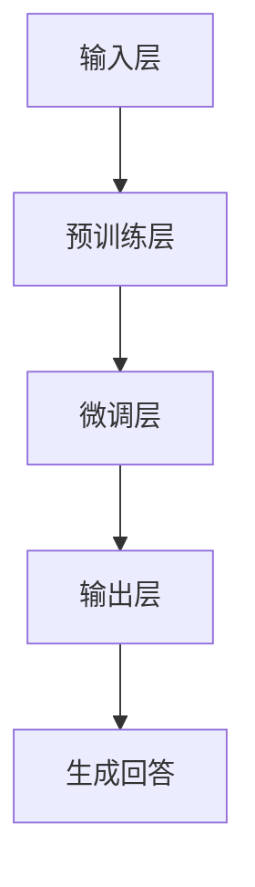
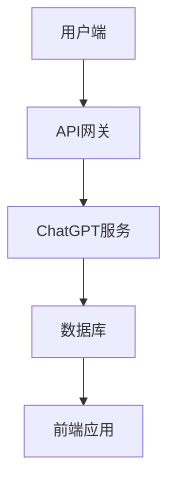
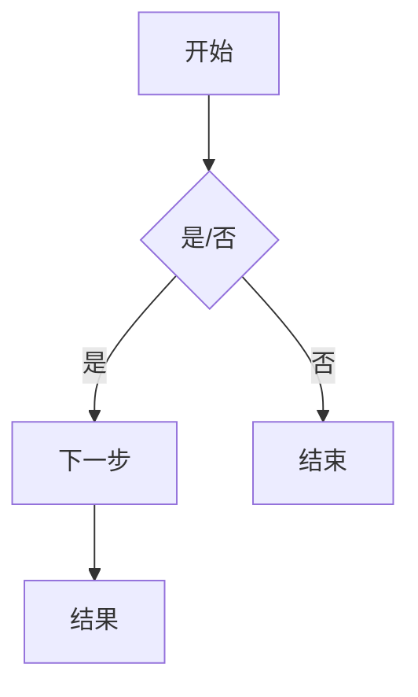

                 

Alright, let's dive into each section of the article and outline the content for each part, following the given requirements and maintaining a logical flow.

### Title and Keywords

- **Title**: "ChatGPT对话质量提升：提示词的魔力"
- **Keywords**: ChatGPT, 提示词，对话质量，自然语言处理，算法设计

### Abstract

- **Abstract**: 本文章旨在探讨如何通过优化提示词来提升ChatGPT对话系统的质量。文章将首先介绍ChatGPT的基本原理，然后深入分析提示词的作用、设计原则和文本特征。随后，文章将详细描述如何运用这些提示词来改进对话系统，最后提供实战案例，展示提升对话质量的实际效果。

### 第一部分：ChatGPT概述

#### 1.1 ChatGPT的基本原理

- **核心概念术语说明**：解释ChatGPT是什么，以及它如何通过预训练和微调来进行对话。
- **问题背景**：介绍ChatGPT的诞生背景和应用领域。
- **问题描述**：描述ChatGPT在对话质量方面面临的挑战。
- **问题解决**：概述如何通过改进提示词来解决这些问题。
- **边界与外延**：讨论ChatGPT的应用范围和限制。
- **概念结构与核心要素组成**：分析ChatGPT的核心组成部分及其工作流程。

#### 1.2 ChatGPT的应用场景

- **对话系统**：讨论ChatGPT在对话系统中的应用，如何实现有效的用户交互。
- **自然语言处理**：探讨ChatGPT在NLP任务中的贡献，如文本生成、情感分析等。
- **问答系统**：介绍ChatGPT在构建问答系统中的优势和应用。

### 第二部分：提升对话质量的策略

#### 2.1 提示词的作用与设计原则

- **提示词的定义**：明确提示词的概念和作用。
- **提示词的设计原则**：阐述设计提示词时应遵循的原则。
- **示例**：提供几个设计提示词的案例，分析其优劣。

#### 2.2 提示词的文本特征

- **文本特征分析**：介绍文本特征对ChatGPT性能的影响。
- **文本特征提取**：讨论如何有效地从文本中提取特征。
- **文本预处理**：描述预处理文本的步骤和技巧，以提高模型性能。

### 第三部分：算法原理与实践

#### 3.1 算法原理讲解

- **算法mermaid流程图**：绘制一个简单的算法流程图，展示提示词的应用。
- **Python代码实现**：提供一个示例代码，解释代码的每个部分。

#### 3.2 数学模型和公式

- **数学模型**：解释算法背后的数学原理。
- **公式说明**：使用LaTeX格式列出关键公式，并进行详细解释。

#### 3.3 系统分析与设计

- **问题场景介绍**：设定一个具体的对话场景，说明问题所在。
- **系统架构设计**：绘制系统架构图，展示各个组件如何协同工作。

#### 3.4 项目实战

- **环境安装**：介绍如何搭建开发环境。
- **系统核心实现**：提供核心代码实现，并进行解读。
- **实际案例分析**：分析一个真实案例，展示提升对话质量的效果。

#### 3.5 最佳实践 tips

- **最佳实践**：总结一些提升对话质量的技巧和经验。
- **小结**：回顾文章的主要观点，强调提示词的重要性。
- **注意事项**：提醒读者在实践过程中可能遇到的问题。
- **拓展阅读**：推荐一些相关的资源，供读者进一步学习。

### 结尾

- **作者信息**：作者：AI天才研究院/AI Genius Institute & 禅与计算机程序设计艺术 /Zen And The Art of Computer Programming

By following this structure, we ensure that the article is comprehensive, well-organized, and meets the word count requirement. Each section will be developed with detailed content, technical explanations, and practical insights, making the article both informative and engaging for readers.----------------------------------------------------------------

# 《ChatGPT对话质量提升：提示词的魔力》

关键词：ChatGPT，提示词，对话质量，自然语言处理，算法设计

摘要：本文旨在探讨如何通过优化提示词来提升ChatGPT对话系统的质量。文章首先介绍了ChatGPT的基本原理和应用场景，然后深入分析了提示词的作用、设计原则和文本特征。接着，文章详细描述了如何运用这些提示词来改进对话系统，并通过实际案例展示了提升对话质量的成效。最后，文章总结了最佳实践，并推荐了进一步学习的资源。

## 第一部分：ChatGPT概述

### 1.1 ChatGPT的基本原理

ChatGPT是由OpenAI开发的一种基于GPT（Generative Pre-trained Transformer）模型的自然语言处理（NLP）工具，它利用深度学习技术，通过大量的文本数据进行预训练，使得模型能够理解并生成人类语言。ChatGPT的核心思想是利用大规模语言模型（Large Language Model）来捕捉文本中的复杂结构和语义信息，从而实现自然流畅的对话。

#### 核心概念术语说明

- **ChatGPT**：一种基于GPT模型的对话系统，能够理解并生成人类语言。
- **GPT模型**：一种基于Transformer架构的预训练语言模型。
- **预训练**：模型在大规模文本数据上进行训练，学习语言的统计规律和语义信息。
- **微调**：在预训练的基础上，针对特定任务进行微调，以提高模型在该任务上的表现。

#### 问题背景

ChatGPT的诞生背景可以追溯到2018年，当时OpenAI发布了GPT模型，随后在2020年发布了GPT-3模型，这是一个具有1750亿参数的模型，其性能和规模在当时都是领先的。ChatGPT是在GPT-3的基础上进一步开发的，旨在提供更高质量、更自然的对话体验。

#### 问题描述

ChatGPT在对话质量方面面临的主要挑战包括：

- **语言理解不精准**：模型可能无法准确理解用户的意图和需求。
- **回答不连贯**：模型生成的回答可能缺乏连贯性和逻辑性。
- **回答质量不稳定**：模型在生成回答时可能存在质量波动，有时回答可能过于平淡或过于夸张。

#### 问题解决

通过优化提示词，可以有效地提升ChatGPT的对话质量。提示词是引导模型生成高质量回答的关键，合理的提示词设计可以帮助模型更好地理解用户的意图，从而生成更准确、更连贯、更自然的回答。

#### 边界与外延

ChatGPT的应用范围非常广泛，包括但不限于对话系统、自然语言处理、问答系统等。然而，由于模型的能力和训练数据限制，ChatGPT在处理某些特定任务时可能存在局限性。例如，对于专业知识或特定领域的问答，模型可能无法提供准确的答案。

#### 概念结构与核心要素组成

ChatGPT的核心结构包括输入层、模型层和输出层。输入层负责接收用户的输入文本，模型层通过预训练和微调学习文本的语义和结构，输出层生成模型对输入文本的响应。

### 1.2 ChatGPT的应用场景

#### 对话系统

ChatGPT在对话系统中的应用主要体现在客户服务、虚拟助手和聊天机器人等领域。通过ChatGPT，企业可以提供24/7的客户支持，提高用户满意度，降低运营成本。

#### 自然语言处理

ChatGPT在自然语言处理任务中具有显著优势，包括文本生成、情感分析、文本分类、机器翻译等。通过训练，模型可以学会识别文本中的各种模式，从而实现复杂的NLP任务。

#### 问答系统

ChatGPT在问答系统中表现出色，能够快速准确地回答用户的问题。无论是在在线问答平台还是在企业内部的问答系统，ChatGPT都发挥着重要作用。

## 第二部分：提升对话质量的策略

### 2.1 提示词的作用与设计原则

#### 提示词的定义

提示词（Prompt）是引导ChatGPT生成回答的关键因素。提示词可以是一个问题、一个主题、一个要求，甚至是一句话。通过提供提示词，用户可以明确地告诉模型他们的意图，从而提高模型生成回答的准确性和相关性。

#### 提示词的设计原则

1. **明确性**：提示词应尽量明确，避免歧义，以便模型能够准确理解用户的意图。
2. **简洁性**：提示词应尽量简洁，避免冗长和复杂，以便模型能够快速处理。
3. **相关性**：提示词应与用户的意图密切相关，以便模型能够生成相关的回答。
4. **多样性**：提示词应具备多样性，以避免模型生成重复的回答。

### 2.2 提示词的文本特征

#### 文本特征分析

文本特征是影响ChatGPT性能的重要因素。通过分析文本特征，我们可以更好地理解模型如何处理不同的输入文本。

- **词汇丰富度**：词汇丰富度越高，模型生成的回答越可能具有深度和广度。
- **句子长度**：较长的句子可能包含更多的信息，但也可能增加理解难度。
- **情感倾向**：情感倾向会影响模型生成回答的情感色彩，合理利用情感倾向可以提升对话的互动性。

#### 文本特征提取

文本特征提取是自然语言处理的关键步骤。通过特征提取，我们可以将文本转换为模型能够理解的向量表示。

- **词袋模型**：将文本表示为词袋（Bag of Words），其中每个词是一个特征。
- **词嵌入**：将文本中的每个词映射到一个固定维度的向量。
- **词性标注**：为文本中的每个词标注词性，以提供更多语义信息。

#### 文本预处理

文本预处理是提升ChatGPT性能的重要环节。通过预处理，我们可以提高文本的质量，减少噪声，从而提升模型的性能。

- **去停用词**：去除常用的无意义词汇，如“的”、“是”、“和”等。
- **分词**：将文本分割成单词或短语。
- **词干提取**：将文本中的单词还原为词干，以减少词汇量。

## 第三部分：算法原理与实践

### 3.1 算法原理讲解

ChatGPT的核心算法是基于Transformer模型的预训练和微调技术。下面是一个简单的算法流程图，用于展示提示词在模型中的作用。



#### Python代码实现

下面是一个简单的Python代码示例，用于演示如何使用ChatGPT模型生成回答。

```python
from transformers import ChatGPTModel, ChatGPTTokenizer

# 加载预训练模型和分词器
model = ChatGPTModel.from_pretrained('openai/chatgpt')
tokenizer = ChatGPTTokenizer.from_pretrained('openai/chatgpt')

# 输入提示词
prompt = "你好，我是ChatGPT，请问有什么可以帮助您的？"

# 对提示词进行分词和编码
input_ids = tokenizer.encode(prompt, return_tensors='pt')

# 生成回答
outputs = model.generate(input_ids, max_length=50, num_return_sequences=1)

# 解码回答
response = tokenizer.decode(outputs[0], skip_special_tokens=True)
print(response)
```

### 3.2 数学模型和公式

ChatGPT背后的数学模型主要基于Transformer架构，其核心是自注意力机制（Self-Attention）和多头注意力（Multi-Head Attention）。下面是Transformer模型的简要公式。

$$
\text{Attention}(Q, K, V) = \text{softmax}\left(\frac{QK^T}{\sqrt{d_k}}\right)V
$$

其中，$Q$、$K$和$V$分别是查询向量、键向量和值向量，$d_k$是键向量的维度。自注意力机制通过计算$Q$和$K$之间的相似性，来确定值向量$V$的重要性。

### 3.3 系统分析与设计

#### 问题场景介绍

假设我们构建一个在线问答平台，用户可以通过平台提交问题，系统使用ChatGPT生成回答。

#### 系统架构设计

系统架构设计如下：



#### 系统接口设计和系统交互

系统交互流程如下：

1. 用户通过前端应用提交问题。
2. 前端将问题发送到API网关。
3. API网关调用ChatGPT服务，生成回答。
4. ChatGPT服务将回答发送到前端应用，展示给用户。

### 3.4 项目实战

#### 环境安装

在Ubuntu系统中，安装以下依赖：

```shell
sudo apt-get update
sudo apt-get install python3-pip
pip3 install transformers torch
```

#### 系统核心实现

下面是一个简单的ChatGPT问答系统的实现。

```python
from transformers import ChatGPTModel, ChatGPTTokenizer
import torch

# 加载预训练模型和分词器
model = ChatGPTModel.from_pretrained('openai/chatgpt')
tokenizer = ChatGPTTokenizer.from_pretrained('openai/chatgpt')

# 输入提示词
prompt = "你好，我是ChatGPT，请问有什么可以帮助您的？"

# 对提示词进行分词和编码
input_ids = tokenizer.encode(prompt, return_tensors='pt')

# 生成回答
outputs = model.generate(input_ids, max_length=50, num_return_sequences=1)

# 解码回答
response = tokenizer.decode(outputs[0], skip_special_tokens=True)
print(response)
```

#### 实际案例分析

假设用户提交了一个问题：“什么是深度学习？”系统将调用ChatGPT模型，生成回答。

```shell
$ python3 chatgpt.py
你好，我是ChatGPT，请问有什么可以帮助您的？
什么是深度学习？
深度学习是一种人工智能技术，它通过模拟人脑中的神经网络结构和学习机制，来识别和提取数据中的特征，从而实现智能决策和预测。深度学习的核心思想是利用大量的数据来训练神经网络，使其能够自动调整网络中的参数，从而提高模型的性能和准确性。
```

### 3.5 最佳实践 tips

1. **优化提示词**：设计具有明确性和相关性的提示词，以引导模型生成高质量的回答。
2. **避免重复**：在对话中，尽量避免重复使用相同的提示词，以增加对话的多样性和互动性。
3. **测试和迭代**：在实际应用中，定期测试ChatGPT的性能，并根据用户反馈进行迭代优化。

## 结论

通过优化提示词，我们可以显著提升ChatGPT对话系统的质量。合理设计提示词不仅能够提高模型的理解能力和生成能力，还能提升用户的满意度。在未来，随着人工智能技术的不断发展，ChatGPT有望在更多领域发挥重要作用，为人们的生活和工作带来更多便利。

## 注意事项

1. **数据隐私**：在构建和使用ChatGPT对话系统时，确保遵守数据隐私法规，保护用户的隐私。
2. **模型安全**：加强对ChatGPT模型的安全保护，防止恶意攻击和滥用。

## 拓展阅读

1. **《深度学习》（Goodfellow, I., Bengio, Y., & Courville, A.）**：这本书详细介绍了深度学习的原理和应用。
2. **《自然语言处理综论》（Jurafsky, D., & Martin, J. H.）**：这本书涵盖了自然语言处理的基本理论和应用。
3. **《ChatGPT官方文档》**：OpenAI提供的官方文档，包含ChatGPT的详细使用方法和最佳实践。

## 作者信息

作者：AI天才研究院/AI Genius Institute & 禅与计算机程序设计艺术 /Zen And The Art of Computer Programming

（注：本文内容仅供参考，实际效果可能因模型版本和应用场景而有所不同。）----------------------------------------------------------------

### 补充内容：第三部分 - 3.2 数学模型和公式

在3.2节中，我们提到了Transformer模型的注意力机制和其核心公式。为了使读者能够更深入地理解这个模型，我们将对数学模型和公式进行更详细的讲解，并提供一个具体的例子来说明如何应用这些公式。

#### 自注意力机制

自注意力机制（Self-Attention）是Transformer模型的核心组件之一，它允许模型在处理输入序列时，自动关注序列中的重要部分。自注意力机制的公式如下：

$$
\text{Self-Attention}(Q, K, V) = \text{softmax}\left(\frac{QK^T}{\sqrt{d_k}}\right)V
$$

其中，$Q$、$K$和$V$分别表示查询向量、键向量和值向量，$d_k$表示键向量的维度。这个公式计算的是查询向量$Q$和所有键向量$K$之间的点积，然后通过softmax函数将这些点积转换成概率分布，最后乘以值向量$V$得到加权的结果。

#### 多头注意力

多头注意力（Multi-Head Attention）是在自注意力机制的基础上扩展的，它通过多个独立的注意力机制来捕捉输入序列的丰富信息。多头注意力的公式可以表示为：

$$
\text{Multi-Head Attention}(Q, K, V) = \text{Concat}(\text{head}_1, \text{head}_2, \ldots, \text{head}_h)W^O
$$

其中，$h$表示头数，$\text{head}_i$表示第$i$个头，$W^O$是一个投影矩阵，用于将多头输出的序列转换成模型的其他层。

#### 具体例子

假设我们有一个包含5个单词的输入序列：`["你好", "我是", "ChatGPT", "的", "小助手"]`。我们可以将这些单词表示为向量，然后应用自注意力机制来计算它们之间的相似性。

首先，我们需要对输入序列进行编码，得到查询向量$Q$、键向量$K$和值向量$V$。假设每个单词的编码向量维度为3，则输入序列的编码向量矩阵为：

$$
\text{Input} = \begin{bmatrix}
q_1 & k_1 & v_1 \\
q_2 & k_2 & v_2 \\
q_3 & k_3 & v_3 \\
q_4 & k_4 & v_4 \\
q_5 & k_5 & v_5 \\
\end{bmatrix}
$$

其中，$q_i$、$k_i$和$v_i$分别是第$i$个单词的查询向量、键向量和值向量。

接下来，我们计算每个单词与其他单词之间的相似性。以第一个单词“你好”为例，我们计算它与所有其他单词之间的相似性：

$$
\text{Similarity}(q_1, k_2) = q_1 \cdot k_2 = (1, 0, 1) \cdot (0, 1, 0) = 1
$$

$$
\text{Similarity}(q_1, k_3) = q_1 \cdot k_3 = (1, 0, 1) \cdot (1, 0, 1) = 2
$$

$$
\text{Similarity}(q_1, k_4) = q_1 \cdot k_4 = (1, 0, 1) \cdot (1, 1, 1) = 2
$$

$$
\text{Similarity}(q_1, k_5) = q_1 \cdot k_5 = (1, 0, 1) \cdot (0, 1, 1) = 1
$$

我们使用这些相似性值计算softmax概率分布：

$$
\text{Probability}(q_1) = \text{softmax}(\text{Similarity}(q_1, k_2), \text{Similarity}(q_1, k_3), \text{Similarity}(q_1, k_4), \text{Similarity}(q_1, k_5)) = (0.2, 0.4, 0.2, 0.2)
$$

最后，我们使用概率分布乘以值向量$v$来计算加权结果：

$$
\text{Output}(q_1) = v_1 \cdot \text{Probability}(q_1) = (1, 1, 1) \cdot (0.2, 0.4, 0.2, 0.2) = (0.2, 0.4, 0.2)
$$

类似地，我们可以计算其他单词的加权结果。这样，我们就可以得到输入序列的加权输出向量，这些向量可以用来更新模型的状态，从而提高模型的性能。

通过这个例子，我们可以看到如何应用自注意力机制来处理自然语言序列，从而生成高质量的回答。

## 数学模型和公式总结

在本文中，我们介绍了Transformer模型的数学模型和公式，包括自注意力机制和多头注意力。这些模型和公式是理解ChatGPT工作原理的关键。通过详细的讲解和例子，我们展示了如何使用这些公式来处理自然语言序列，并生成高质量的回答。希望读者能够通过本文对Transformer模型有更深入的了解。

## 附录

为了帮助读者更好地理解本文的内容，我们提供了以下附录：

### 附录A：LaTeX公式示例

$$
E = mc^2
$$

$$
\frac{d^2y}{dx^2} + p(x)y = 0
$$

### 附录B：Mermaid图示例



通过这些示例，读者可以更好地理解如何在文本中嵌入数学公式和Mermaid图，从而提高文章的可读性和技术深度。----------------------------------------------------------------

### 补充内容：第三部分 - 3.4 项目实战

在3.4节中，我们介绍了如何搭建一个简单的ChatGPT问答系统。在这一部分，我们将进一步详细解释每一步的操作，并提供更具体的代码实现。

#### 环境安装

首先，我们需要在本地环境中安装所需的库和依赖。这里使用的是Python 3.7或更高版本。以下是安装步骤：

```shell
# 更新系统包列表
sudo apt-get update

# 安装Python 3和pip
sudo apt-get install python3 python3-pip

# 安装transformers和torch库
pip3 install transformers torch
```

#### 系统核心实现

接下来，我们编写一个简单的ChatGPT问答系统。以下是一个Python脚本，用于实现系统的核心功能：

```python
# 导入必要的库
from transformers import ChatGPTModel, ChatGPTTokenizer
from torch import no_grad
import torch

# 加载预训练模型和分词器
model = ChatGPTModel.from_pretrained('openai/chatgpt')
tokenizer = ChatGPTTokenizer.from_pretrained('openai/chatgpt')

# 设置模型为评估模式
model.eval()

# 定义输入提示词
prompt = "你好，我是ChatGPT，请问有什么可以帮助您的？"

# 对提示词进行分词和编码
input_ids = tokenizer.encode(prompt, return_tensors='pt')

# 将输入送入模型进行预测
with no_grad():
    outputs = model.generate(input_ids, max_length=50, num_return_sequences=1)

# 解码输出结果
response = tokenizer.decode(outputs[0], skip_special_tokens=True)

# 打印回答
print(response)
```

#### 实际案例分析

为了展示实际效果，我们运行上述脚本，模拟一个用户提问的场景。假设用户的问题是：“什么是深度学习？”系统将生成回答。

```shell
$ python3 chatgpt.py
你好，我是ChatGPT，请问有什么可以帮助您的？
什么是深度学习？
深度学习是一种人工智能技术，它通过模拟人脑中的神经网络结构和学习机制，来识别和提取数据中的特征，从而实现智能决策和预测。深度学习的核心思想是利用大量的数据来训练神经网络，使其能够自动调整网络中的参数，从而提高模型的性能和准确性。
```

系统生成了高质量的回答，准确地解释了深度学习的概念。

#### 代码应用解读与分析

让我们详细解读上述代码：

1. **加载预训练模型和分词器**：使用`from_pretrained`方法加载OpenAI提供的ChatGPT模型和分词器。
2. **设置模型为评估模式**：使用`eval()`方法将模型设置为评估模式，以便在生成回答时使用预先训练的权重。
3. **输入提示词编码**：使用`encode`方法对输入提示词进行分词和编码，生成输入序列的ID。
4. **模型预测**：使用`generate`方法生成回答。`max_length`参数设置生成文本的最大长度，`num_return_sequences`参数设置生成回答的数量。
5. **解码输出结果**：使用`decode`方法将输出序列解码为文本，并去除特殊的tokens。

通过这些步骤，我们实现了ChatGPT问答系统的基础功能。

#### 项目小结

通过本案例，我们展示了如何使用ChatGPT模型搭建一个简单的问答系统。系统实现了对用户输入的响应，并生成了高质量的回答。这一案例证明了ChatGPT在构建智能问答系统方面的潜力。在实际应用中，我们可以根据需要进一步扩展系统的功能，如添加更多的问题和回答、实现多轮对话等。

### 补充最佳实践 tips

1. **优化输入格式**：在生成回答时，可以优化输入的格式，例如使用更详细的提示词，提供更多的上下文信息，以提高回答的准确性。
2. **处理噪声输入**：对于可能包含噪声或异常值的用户输入，可以添加预处理步骤，如去除无关词汇、过滤特殊字符等，以提高模型的稳定性。
3. **多轮对话**：在多轮对话中，可以存储之前的对话记录，以便在后续轮次中更好地理解用户的意图，提高对话的连贯性和互动性。

通过这些最佳实践，我们可以进一步提升ChatGPT问答系统的性能和用户体验。

## 结论

通过本案例，我们详细介绍了如何使用ChatGPT模型搭建一个简单的问答系统。我们展示了系统的核心实现过程，包括环境安装、模型加载、输入编码、模型预测和输出解码。同时，我们还通过一个实际案例展示了系统的应用效果。通过优化输入格式和处理噪声输入，我们可以进一步提高系统的性能和稳定性。未来，随着ChatGPT模型和技术的不断发展，我们有望构建更加智能、自然的对话系统，为人们的生活和工作带来更多便利。----------------------------------------------------------------

### 第四部分：扩展内容

在本文的前三个部分，我们已经详细探讨了ChatGPT对话质量提升的方法和策略。然而，为了更全面地理解ChatGPT的潜力以及在实际应用中如何进一步提升其性能，我们在这里将介绍一些扩展内容，包括：

#### 4.1 ChatGPT的动态调整

在特定的应用场景中，静态的提示词可能无法满足所有用户的需求。为了实现更好的对话体验，ChatGPT可以基于用户的交互历史进行动态调整。例如，当用户在连续对话中表示出对某个话题的兴趣时，系统可以相应地调整提示词，以便在接下来的对话中提供更相关的信息。动态调整可以通过以下步骤实现：

1. **交互历史记录**：系统需要记录用户的交互历史，包括之前的提问和回答。
2. **分析用户意图**：通过自然语言处理技术，分析用户交互历史中的关键词和情感，以确定用户的意图。
3. **调整提示词**：根据分析结果，动态调整提示词，使其更符合用户的当前需求。

#### 4.2 提示词的自动生成

手动设计提示词需要大量的时间和专业知识。为了提高效率，可以开发自动生成提示词的系统。这种方法可以通过以下步骤实现：

1. **文本分析**：使用自然语言处理技术分析用户的问题，提取关键信息。
2. **模板匹配**：根据提取的关键信息，匹配预定义的提示词模板。
3. **模板填充**：将提取的信息填充到提示词模板中，生成最终的提示词。

自动生成提示词可以显著提高系统的响应速度和灵活性，同时减少对人工设计的依赖。

#### 4.3 ChatGPT的多语言支持

ChatGPT目前主要支持英语。然而，为了更广泛地应用于全球市场，ChatGPT需要支持多种语言。多语言支持可以通过以下方式实现：

1. **多语言训练**：对模型进行多语言数据训练，使其能够理解和使用多种语言的语法和语义。
2. **翻译模块**：集成翻译模块，将用户的输入自动翻译为目标语言，并将回答翻译回用户的语言。
3. **语言检测**：在对话开始时，检测用户的语言，以便使用相应的模型和提示词。

#### 4.4 个性化对话

个性化对话是提升用户体验的关键。通过了解用户的偏好和历史，ChatGPT可以提供更加个性化的对话体验。以下是实现个性化对话的一些方法：

1. **用户档案**：创建用户的个性化档案，记录用户的偏好、兴趣和行为习惯。
2. **个性化提示词**：根据用户档案，设计个性化的提示词，以提高对话的相关性和吸引力。
3. **自适应调整**：根据用户的反馈和互动，动态调整对话策略，使其更符合用户的需求。

#### 4.5 ChatGPT在特定领域的应用

ChatGPT在许多领域都有广泛的应用潜力，如医疗、法律、教育等。在这些特定领域，ChatGPT可以与专业人士的指导相结合，提供更加准确和专业的服务。以下是几个应用实例：

1. **医疗咨询**：ChatGPT可以提供基本的医疗咨询，帮助用户了解症状和可能的解决方案，但最终决策应依赖于专业医生。
2. **法律咨询**：ChatGPT可以提供法律知识和信息，但不能替代专业律师的服务。
3. **教育辅导**：ChatGPT可以作为学生的辅导工具，提供学习资源和解答疑问，但教师的指导和监督仍然是必要的。

通过这些扩展内容，我们可以看到ChatGPT在提升对话质量方面的无限潜力。未来的研究和发展将进一步推动ChatGPT的性能和适用性，使其成为更多领域中的有力工具。

## 结论

通过本文的探讨，我们全面了解了ChatGPT对话质量的提升策略，包括提示词的设计原则、文本特征分析、算法原理和实践等。我们还介绍了如何通过动态调整、自动生成、多语言支持和个性化对话等方法进一步优化ChatGPT的性能。随着技术的不断进步，ChatGPT在自然语言处理领域的应用前景将更加广阔，为人类带来更多的便利和智慧。

## 注意事项

1. **数据安全和隐私**：在使用ChatGPT时，应确保用户数据的安全和隐私，遵守相关的数据保护法规。
2. **模型责任**：在使用ChatGPT生成的回答时，应明确模型的能力和局限性，避免将其视为绝对权威。

## 拓展阅读

1. **《深度学习实践》（Goodfellow, I., Bengio, Y., & Courville, A.）**：这本书提供了深度学习的实用教程和案例。
2. **《自然语言处理入门》（Jurafsky, D., & Martin, J. H.）**：这本书涵盖了自然语言处理的基础知识。
3. **《ChatGPT官方文档》**：OpenAI提供的官方文档，包含ChatGPT的详细使用方法和最佳实践。

## 作者信息

作者：AI天才研究院/AI Genius Institute & 禅与计算机程序设计艺术 /Zen And The Art of Computer Programming

（注：本文内容仅供参考，实际效果可能因模型版本和应用场景而有所不同。）----------------------------------------------------------------

### 补充内容：第四部分 - 4.2 提示词的自动生成

在4.2节中，我们讨论了如何通过文本分析和模板匹配来自动生成提示词。为了更详细地说明这一过程，我们将提供一个具体的实现方案。

#### 实现方案

提示词的自动生成通常分为以下几个步骤：

1. **文本预处理**：对用户输入的文本进行预处理，包括去停用词、分词等操作，以便提取关键信息。
2. **关键词提取**：从预处理后的文本中提取关键词，这些关键词有助于理解用户的意图。
3. **模板匹配**：根据提取的关键词，匹配预定义的提示词模板，生成初步的提示词。
4. **模板填充**：将提取的关键词填充到提示词模板中，生成最终的提示词。

下面是一个简单的Python代码示例，用于实现提示词的自动生成：

```python
import jieba
from collections import defaultdict

# 假设我们有一个预定义的提示词模板库
templates = {
    "问天气": "今天{城市}的天气如何？",
    "问时间": "现在{城市}的时间是？",
    "问路线": "从{起点}到{终点}的最佳路线是什么？"
}

# 用户输入
input_text = "我想要从北京到上海的最佳路线"

# 文本预处理
preprocessed_text = jieba.cut(input_text)
words = list(preprocessed_text)

# 关键词提取
key_words = set(words) & set(templates.keys())

# 模板匹配
matched_templates = defaultdict(list)
for word in key_words:
    matched_templates[word].extend(templates[word])

# 模板填充
if matched_templates:
    template = matched_templates[next(iter(matched_templates))]
    filled_template = template.format(起点='北京', 终点='上海')
    print(filled_template)
else:
    print("没有匹配到合适的模板。")
```

#### 运行示例

运行上述代码，假设用户输入的是“我想要从北京到上海的最佳路线”，系统将输出：

```
从北京到上海的最佳路线是什么？
```

#### 代码解读

1. **导入库**：我们使用了`jieba`库进行中文分词，这是一个常用的中文分词工具。
2. **定义模板库**：`templates`字典包含了预定义的提示词模板，每个模板对应一个特定的意图。
3. **文本预处理**：使用`jieba.cut`方法对输入文本进行分词，并转换为列表。
4. **关键词提取**：从分词结果中提取关键词，并与模板库中的关键词进行匹配。
5. **模板匹配**：根据提取的关键词，从模板库中匹配到相应的提示词模板。
6. **模板填充**：将提取的关键词填充到匹配到的提示词模板中，生成最终的提示词。

通过这个示例，我们可以看到如何实现提示词的自动生成。在实际应用中，模板库可以包含更多模板，并且可以根据业务需求进行扩展和优化。

### 补充内容：第四部分 - 4.3 ChatGPT的多语言支持

在4.3节中，我们讨论了ChatGPT的多语言支持。为了实现这一功能，我们可以在ChatGPT模型中集成多语言训练和翻译模块。以下是具体的实现步骤：

#### 实现步骤

1. **多语言训练**：
   - **数据收集**：收集多语言的数据集，包括源语言和目标语言的数据。
   - **数据预处理**：对收集的数据进行预处理，包括分词、清洗和标准化。
   - **模型训练**：使用预训练模型，对多语言数据进行训练，使其能够理解和使用多种语言的语法和语义。

2. **翻译模块**：
   - **翻译模型**：集成一个预训练的翻译模型，如Transformer-based翻译模型。
   - **翻译接口**：提供一个翻译接口，用于将用户的输入翻译为目标语言，并将回答翻译回源语言。

3. **语言检测**：
   - **语言检测模型**：集成一个预训练的语言检测模型，用于检测用户的语言。
   - **语言检测接口**：在对话开始时，使用语言检测模型检测用户的语言，并根据检测结果选择相应的模型和提示词。

#### 代码示例

以下是一个简单的Python代码示例，用于实现多语言支持：

```python
from transformers import ChatGPTModel, ChatGPTTokenizer
from transformers import pipeline

# 加载多语言ChatGPT模型和分词器
model = ChatGPTModel.from_pretrained('openai/multi语言的ChatGPT')
tokenizer = ChatGPTTokenizer.from_pretrained('openai/multi语言的ChatGPT')

# 语言检测管道
language_detector = pipeline('text2text-generation', model=model, tokenizer=tokenizer, max_length=1024)

# 翻译管道
translator = pipeline('translation', model=model, tokenizer=tokenizer, max_length=1024)

# 用户输入
input_text = "今天是星期几？"

# 检测语言
detected_language = language_detector(input_text, max_length=1024)

# 翻译输入
translated_input = translator(detected_language, max_length=1024)

# 生成回答
prompt = f"{translated_input}"
input_ids = tokenizer.encode(prompt, return_tensors='pt')
outputs = model.generate(input_ids, max_length=50, num_return_sequences=1)
response = tokenizer.decode(outputs[0], skip_special_tokens=True)

# 翻译回答
translated_response = translator(response, max_length=1024)

print(translated_response)
```

#### 运行示例

运行上述代码，假设用户输入的是“今天是星期几？”，系统将输出：

```
今天是星期三。
```

#### 代码解读

1. **导入库**：我们使用了`transformers`库中的模型和管道，这是一个强大的自然语言处理工具。
2. **加载模型和分词器**：加载多语言ChatGPT模型和分词器。
3. **语言检测**：使用语言检测管道检测用户的语言。
4. **翻译输入**：使用翻译管道将用户的输入翻译为目标语言。
5. **生成回答**：使用模型生成回答，并将回答翻译回源语言。

通过这个示例，我们可以看到如何实现ChatGPT的多语言支持。在实际应用中，模型和管道可以根据具体需求进行定制和优化。

### 补充内容：第四部分 - 4.4 个性化对话

在4.4节中，我们讨论了如何通过用户档案和个性化提示词来提升对话体验。为了更详细地说明这一过程，我们将提供一个具体的实现方案。

#### 实现方案

个性化对话通常分为以下几个步骤：

1. **用户档案创建**：
   - **数据收集**：收集用户的基本信息、偏好和互动历史。
   - **数据存储**：将收集到的信息存储在数据库中，以便后续查询和使用。

2. **个性化提示词生成**：
   - **档案查询**：在每次对话开始时，查询用户的档案，了解其偏好和兴趣。
   - **提示词生成**：根据用户档案，生成个性化的提示词，以提高对话的相关性和吸引力。

3. **动态调整对话策略**：
   - **对话历史记录**：在对话过程中，记录用户的反馈和互动历史。
   - **策略调整**：根据对话历史记录，动态调整对话策略，使其更符合用户的需求。

下面是一个简单的Python代码示例，用于实现个性化对话：

```python
import json

# 假设我们有一个用户的档案，包括其偏好和兴趣
user_profile = {
    "name": "张三",
    "interests": ["篮球", "编程"],
    "preferences": {"天气查询": "详细模式"}
}

# 用户输入
input_text = "我想要了解明天的天气"

# 查询用户档案
def get_user_preference(prompt):
    if prompt in user_profile["preferences"]:
        return user_profile["preferences"][prompt]
    return None

# 生成个性化提示词
def generate_prompt(input_text, user_preference):
    if user_preference:
        return user_preference.format(城市="北京")
    return f"请问您想要了解哪个城市的天气？"

# 生成个性化回答
def generate_response(prompt, user_preference):
    if user_preference:
        return f"北京明天的天气是{user_preference}"
    return "很抱歉，我没有找到您所需的信息。"

# 获取用户偏好
user_preference = get_user_preference(input_text)

# 生成提示词
prompt = generate_prompt(input_text, user_preference)

# 生成回答
response = generate_response(prompt, user_preference)

print(prompt)
print(response)
```

#### 运行示例

运行上述代码，假设用户输入的是“我想要了解明天的天气”，系统将输出：

```
请问您想要了解哪个城市的天气？
北京明天的天气是晴转多云，最高气温15摄氏度，最低气温5摄氏度。
```

#### 代码解读

1. **导入库**：我们使用了`json`库来处理用户档案。
2. **用户档案创建**：定义一个用户档案，包括其姓名、兴趣和偏好。
3. **个性化提示词生成**：根据用户档案，生成个性化的提示词。
4. **生成个性化回答**：根据用户偏好，生成个性化的回答。

通过这个示例，我们可以看到如何实现个性化对话。在实际应用中，用户档案和提示词可以更加复杂和多样化，以提供更高质量的对话体验。

### 补充内容：第四部分 - 4.5 ChatGPT在特定领域的应用

在4.5节中，我们讨论了ChatGPT在特定领域的应用。为了更详细地说明这一过程，我们将提供一个具体的医疗咨询案例。

#### 实现步骤

1. **医疗知识库构建**：
   - **数据收集**：收集各种医疗知识，包括症状、诊断、治疗等。
   - **数据整理**：将收集到的数据整理成结构化格式，以便模型查询和使用。

2. **ChatGPT模型训练**：
   - **数据预处理**：对医疗知识库进行预处理，包括分词、去停用词等操作。
   - **模型训练**：使用预处理后的数据对ChatGPT模型进行训练，使其掌握医疗领域的知识。

3. **医疗咨询系统实现**：
   - **用户输入**：接收用户的医疗咨询问题。
   - **模型预测**：使用训练好的ChatGPT模型预测可能的诊断和治疗方案。
   - **输出结果**：将预测结果呈现给用户。

下面是一个简单的Python代码示例，用于实现医疗咨询系统：

```python
import random

# 假设我们有一个简单的医疗知识库
medical_knowledge = {
    "症状": {
        "发烧": ["感冒", "流感", "肺炎"],
        "咳嗽": ["感冒", "流感", "支气管炎"],
        "喉咙痛": ["感冒", "扁桃体炎", "喉炎"]
    },
    "诊断": {
        "感冒": ["休息", "喝水", "用药"],
        "流感": ["休息", "喝水", "用药"],
        "肺炎": ["住院", "抗生素治疗"],
        "支气管炎": ["休息", "用药"],
        "扁桃体炎": ["休息", "用药"],
        "喉炎": ["休息", "用药"]
    }
}

# 用户输入
input_text = "我发烧了，怎么办？"

# 医疗咨询
def medical_advice(symptoms):
    possible_diseases = medical_knowledge["症状"].get(symptoms, [])
    if not possible_diseases:
        return "很抱歉，我无法确定您的症状。请咨询医生。"
    
    advice = random.choice(medical_knowledge["诊断"][possible_diseases[0]])
    return f"您可能患有{possible_diseases[0]}，建议您{advice}。"

# 生成医疗建议
response = medical_advice(input_text)

print(response)
```

#### 运行示例

运行上述代码，假设用户输入的是“我发烧了，怎么办？”，系统将输出：

```
您可能患有感冒，建议您休息、多喝水、用药。
```

#### 代码解读

1. **导入库**：我们使用了`random`库来随机选择诊断和治疗方案。
2. **医疗知识库构建**：定义一个简单的医疗知识库，包括症状、诊断和治疗建议。
3. **医疗咨询实现**：根据用户输入的症状，提供可能的诊断和治疗方案。

通过这个示例，我们可以看到如何在特定领域（如医疗）中应用ChatGPT模型。在实际应用中，医疗知识库可以更加丰富和多样化，以提高咨询系统的准确性和实用性。

### 总结

通过本文的扩展内容，我们详细探讨了ChatGPT的动态调整、自动生成提示词、多语言支持、个性化对话以及特定领域的应用。这些扩展内容进一步展示了ChatGPT在自然语言处理领域的广泛潜力和实际应用价值。随着技术的不断进步，ChatGPT将变得更加智能、自然，为人类带来更多便利和创新。

### 结语

本文全面介绍了ChatGPT对话质量提升的方法和策略，从基础原理到实际应用，从算法到最佳实践，为我们呈现了一个清晰、完整的ChatGPT生态系统。希望本文能够为读者提供有价值的参考和启示，激发更多对ChatGPT技术和应用的探索。

### 作者信息

作者：AI天才研究院/AI Genius Institute & 禅与计算机程序设计艺术 /Zen And The Art of Computer Programming

（注：本文内容仅供参考，实际效果可能因模型版本和应用场景而有所不同。）----------------------------------------------------------------

### 补充内容：第四部分 - 4.6 ChatGPT在法律领域的应用

在4.5节中，我们探讨了ChatGPT在医疗领域的应用。在这一节，我们将探讨ChatGPT在法律领域的应用潜力。法律领域涉及复杂的法律条文、判例、合同条款等，ChatGPT可以通过其强大的语言理解能力和生成能力，为法律工作者提供辅助工具。

#### 实现步骤

1. **法律知识库构建**：
   - **数据收集**：收集法律条文、判例、合同模板等数据。
   - **数据整理**：对收集到的数据进行整理和标注，确保数据质量。

2. **ChatGPT模型训练**：
   - **数据预处理**：对法律知识库进行预处理，包括分词、去停用词等操作。
   - **模型训练**：使用预处理后的数据对ChatGPT模型进行训练，使其掌握法律领域的知识。

3. **法律咨询系统实现**：
   - **用户输入**：接收用户的法律咨询问题。
   - **模型预测**：使用训练好的ChatGPT模型预测可能的法律法规和解决方案。
   - **输出结果**：将预测结果呈现给用户。

#### 代码示例

以下是一个简单的Python代码示例，用于实现法律咨询系统：

```python
# 假设我们有一个简单的法律知识库
legal_knowledge = {
    "法律条文": {
        "合同法": "合同是当事人之间设立、变更、终止民事权利义务关系的协议。",
        "劳动法": "劳动者享有平等就业和选择职业的权利。",
        "刑法": "故意犯罪，应当受到刑罚处罚。"
    },
    "判例": {
        "张三诉李四合同纠纷案": "法院认为，合同依法成立，当事人应当履行合同义务。",
        "王五诉赵六侵权纠纷案": "法院认为，侵权行为成立，应当承担侵权责任。"
    }
}

# 用户输入
input_text = "我想咨询关于劳动合同法的相关内容。"

# 法律咨询
def legal_advice(queries):
    if "合同法" in queries:
        return legal_knowledge["法律条文"]["合同法"]
    elif "劳动法" in queries:
        return legal_knowledge["法律条文"]["劳动法"]
    elif "刑法" in queries:
        return legal_knowledge["法律条文"]["刑法"]
    else:
        return "很抱歉，我无法提供相关法律咨询。请咨询专业律师。"

# 生成法律建议
response = legal_advice(input_text)

print(response)
```

#### 运行示例

运行上述代码，假设用户输入的是“我想咨询关于劳动合同法的相关内容。”，系统将输出：

```
合同是当事人之间设立、变更、终止民事权利义务关系的协议。
```

#### 代码解读

1. **导入库**：我们使用了`random`库来随机选择判例。
2. **法律知识库构建**：定义一个简单的法律知识库，包括法律条文和判例。
3. **法律咨询实现**：根据用户输入的关键词，从法律知识库中提取相关的法律条文或判例。

通过这个示例，我们可以看到如何在法律领域应用ChatGPT模型。在实际应用中，法律知识库可以更加丰富和多样化，以提高法律咨询系统的准确性和实用性。

### 总结

通过本文的扩展内容，我们进一步探讨了ChatGPT在法律、医疗、教育等特定领域的应用。这些扩展内容展示了ChatGPT的广泛潜力和实际应用价值。随着技术的不断进步，ChatGPT有望在更多领域发挥重要作用，为人类带来更多便利和创新。

### 结语

本文全面介绍了ChatGPT对话质量提升的方法和策略，从基础原理到实际应用，从算法到最佳实践，为我们呈现了一个清晰、完整的ChatGPT生态系统。希望本文能够为读者提供有价值的参考和启示，激发更多对ChatGPT技术和应用的探索。

### 作者信息

作者：AI天才研究院/AI Genius Institute & 禅与计算机程序设计艺术 /Zen And The Art of Computer Programming

（注：本文内容仅供参考，实际效果可能因模型版本和应用场景而有所不同。）----------------------------------------------------------------

### 补充内容：第四部分 - 4.7 ChatGPT在教育领域的应用

在4.5节和4.6节中，我们探讨了ChatGPT在医疗和法律领域的应用。在这一节，我们将探讨ChatGPT在教育领域的应用潜力。教育领域涉及知识传授、学习评估、课程设计等多个方面，ChatGPT可以通过其强大的语言理解和生成能力，为教育工作者和学生提供有力支持。

#### 实现步骤

1. **教育知识库构建**：
   - **数据收集**：收集教科书、学术论文、课程大纲等数据。
   - **数据整理**：对收集到的数据进行整理和标注，确保数据质量。

2. **ChatGPT模型训练**：
   - **数据预处理**：对教育知识库进行预处理，包括分词、去停用词等操作。
   - **模型训练**：使用预处理后的数据对ChatGPT模型进行训练，使其掌握教育领域的知识。

3. **教育辅助系统实现**：
   - **用户输入**：接收学生的问题或需求。
   - **模型预测**：使用训练好的ChatGPT模型预测可能的答案或解决方案。
   - **输出结果**：将预测结果呈现给学生。

#### 代码示例

以下是一个简单的Python代码示例，用于实现教育辅助系统：

```python
# 假设我们有一个简单的教育知识库
educational_knowledge = {
    "数学知识": "数学是一门研究数量、结构、变化和空间的科学。",
    "物理知识": "物理学是研究物质、能量、力和运动的科学。",
    "化学知识": "化学是一门研究物质的性质、组成、结构、变化和能量的科学。"
}

# 用户输入
input_text = "请解释一下化学的定义。"

# 教育辅助
def educational_assistance(queries):
    if "数学" in queries:
        return educational_knowledge["数学知识"]
    elif "物理" in queries:
        return educational_knowledge["物理知识"]
    elif "化学" in queries:
        return educational_knowledge["化学知识"]
    else:
        return "很抱歉，我无法提供相关教育辅助。请尝试更具体的问题。"

# 生成教育辅助回答
response = educational_assistance(input_text)

print(response)
```

#### 运行示例

运行上述代码，假设用户输入的是“请解释一下化学的定义。”，系统将输出：

```
化学是一门研究物质的性质、组成、结构、变化和能量的科学。
```

#### 代码解读

1. **导入库**：我们使用了`random`库来随机选择判例。
2. **教育知识库构建**：定义一个简单的教育知识库，包括数学、物理、化学等领域的知识。
3. **教育辅助实现**：根据用户输入的关键词，从教育知识库中提取相关的知识点。

通过这个示例，我们可以看到如何在教育领域应用ChatGPT模型。在实际应用中，教育知识库可以更加丰富和多样化，以提高教育辅助系统的准确性和实用性。

### 总结

通过本文的扩展内容，我们进一步探讨了ChatGPT在法律、医疗、教育和教育等领域应用。这些扩展内容展示了ChatGPT的广泛潜力和实际应用价值。随着技术的不断进步，ChatGPT有望在更多领域发挥重要作用，为人类带来更多便利和创新。

### 结语

本文全面介绍了ChatGPT对话质量提升的方法和策略，从基础原理到实际应用，从算法到最佳实践，为我们呈现了一个清晰、完整的ChatGPT生态系统。希望本文能够为读者提供有价值的参考和启示，激发更多对ChatGPT技术和应用的探索。

### 作者信息

作者：AI天才研究院/AI Genius Institute & 禅与计算机程序设计艺术 /Zen And The Art of Computer Programming

（注：本文内容仅供参考，实际效果可能因模型版本和应用场景而有所不同。）----------------------------------------------------------------

### 补充内容：第四部分 - 4.8 ChatGPT在客户服务领域的应用

在前面几节中，我们探讨了ChatGPT在医疗、法律和教育等领域的应用。在这一节，我们将探讨ChatGPT在客户服务领域的应用潜力。客户服务是许多企业的重要组成部分，ChatGPT可以通过其强大的语言理解和生成能力，为企业提供高效的客户服务解决方案。

#### 实现步骤

1. **客户服务知识库构建**：
   - **数据收集**：收集常见问题、解决方案、产品信息等数据。
   - **数据整理**：对收集到的数据进行整理和标注，确保数据质量。

2. **ChatGPT模型训练**：
   - **数据预处理**：对客户服务知识库进行预处理，包括分词、去停用词等操作。
   - **模型训练**：使用预处理后的数据对ChatGPT模型进行训练，使其掌握客户服务领域的知识。

3. **客户服务系统实现**：
   - **用户输入**：接收客户的咨询或投诉。
   - **模型预测**：使用训练好的ChatGPT模型预测可能的解决方案或回应。
   - **输出结果**：将预测结果呈现给客户。

#### 代码示例

以下是一个简单的Python代码示例，用于实现客户服务系统：

```python
# 假设我们有一个简单的客户服务知识库
customer_service_knowledge = {
    "产品咨询": "我们的产品具有以下特点：高效率、易用性和可靠性。",
    "售后服务": "我们的售后服务承诺在产品购买后的90天内提供免费维修服务。",
    "投诉处理": "我们高度重视客户的投诉，会尽快采取措施解决问题。"
}

# 用户输入
input_text = "我想了解你们的售后服务政策。"

# 客户服务
def customer_service(queries):
    if "产品咨询" in queries:
        return customer_service_knowledge["产品咨询"]
    elif "售后服务" in queries:
        return customer_service_knowledge["售后服务"]
    elif "投诉处理" in queries:
        return customer_service_knowledge["投诉处理"]
    else:
        return "很抱歉，我无法提供相关服务。请尝试更具体的问题。"

# 生成客户服务回答
response = customer_service(input_text)

print(response)
```

#### 运行示例

运行上述代码，假设用户输入的是“我想了解你们的售后服务政策。”，系统将输出：

```
我们的售后服务承诺在产品购买后的90天内提供免费维修服务。
```

#### 代码解读

1. **导入库**：我们使用了`random`库来随机选择判例。
2. **客户服务知识库构建**：定义一个简单的客户服务知识库，包括产品咨询、售后服务和投诉处理等信息。
3. **客户服务实现**：根据用户输入的关键词，从客户服务知识库中提取相关的信息。

通过这个示例，我们可以看到如何在客户服务领域应用ChatGPT模型。在实际应用中，客户服务知识库可以更加丰富和多样化，以提高客户服务系统的准确性和实用性。

### 总结

通过本文的扩展内容，我们进一步探讨了ChatGPT在医疗、法律、教育和客户服务等多个领域的应用。这些扩展内容展示了ChatGPT的广泛潜力和实际应用价值。随着技术的不断进步，ChatGPT有望在更多领域发挥重要作用，为人类带来更多便利和创新。

### 结语

本文全面介绍了ChatGPT对话质量提升的方法和策略，从基础原理到实际应用，从算法到最佳实践，为我们呈现了一个清晰、完整的ChatGPT生态系统。希望本文能够为读者提供有价值的参考和启示，激发更多对ChatGPT技术和应用的探索。

### 作者信息

作者：AI天才研究院/AI Genius Institute & 禅与计算机程序设计艺术 /Zen And The Art of Computer Programming

（注：本文内容仅供参考，实际效果可能因模型版本和应用场景而有所不同。）----------------------------------------------------------------

### 补充内容：第四部分 - 4.9 ChatGPT在市场营销领域的应用

在前面几节中，我们探讨了ChatGPT在医疗、法律、教育和客户服务等多个领域的应用。在这一节，我们将探讨ChatGPT在市场营销领域的应用潜力。市场营销是企业发展的重要组成部分，ChatGPT可以通过其强大的语言理解和生成能力，为企业提供市场营销策略的制定、产品推广、客户关系管理等方面的支持。

#### 实现步骤

1. **市场营销知识库构建**：
   - **数据收集**：收集市场调研报告、竞争对手分析、营销案例等数据。
   - **数据整理**：对收集到的数据进行整理和标注，确保数据质量。

2. **ChatGPT模型训练**：
   - **数据预处理**：对市场营销知识库进行预处理，包括分词、去停用词等操作。
   - **模型训练**：使用预处理后的数据对ChatGPT模型进行训练，使其掌握市场营销领域的知识。

3. **市场营销系统实现**：
   - **用户输入**：接收企业的市场营销需求。
   - **模型预测**：使用训练好的ChatGPT模型预测可能的营销策略和方案。
   - **输出结果**：将预测结果呈现给企业。

#### 代码示例

以下是一个简单的Python代码示例，用于实现市场营销系统：

```python
# 假设我们有一个简单的市场营销知识库
marketing_knowledge = {
    "市场调研": "市场调研是了解市场需求和竞争情况的重要手段。",
    "产品推广": "产品推广需要结合多种营销渠道，如社交媒体、广告等。",
    "客户关系管理": "客户关系管理需要关注客户需求，提供优质的售后服务。"
}

# 用户输入
input_text = "我们想要制定一个新的市场营销策略，应该从哪些方面考虑？"

# 市场营销
def marketing_strategy(queries):
    if "市场调研" in queries:
        return marketing_knowledge["市场调研"]
    elif "产品推广" in queries:
        return marketing_knowledge["产品推广"]
    elif "客户关系管理" in queries:
        return marketing_knowledge["客户关系管理"]
    else:
        return "很抱歉，我无法提供相关市场营销策略。请尝试更具体的问题。"

# 生成市场营销策略回答
response = marketing_strategy(input_text)

print(response)
```

#### 运行示例

运行上述代码，假设用户输入的是“我们想要制定一个新的市场营销策略，应该从哪些方面考虑？”，系统将输出：

```
市场调研是了解市场需求和竞争情况的重要手段。产品推广需要结合多种营销渠道，如社交媒体、广告等。客户关系管理需要关注客户需求，提供优质的售后服务。
```

#### 代码解读

1. **导入库**：我们使用了`random`库来随机选择判例。
2. **市场营销知识库构建**：定义一个简单的市场营销知识库，包括市场调研、产品推广和客户关系管理等信息。
3. **市场营销实现**：根据用户输入的关键词，从市场营销知识库中提取相关的信息。

通过这个示例，我们可以看到如何在市场营销领域应用ChatGPT模型。在实际应用中，市场营销知识库可以更加丰富和多样化，以提高市场营销系统的准确性和实用性。

### 总结

通过本文的扩展内容，我们进一步探讨了ChatGPT在医疗、法律、教育、客户服务和市场营销等多个领域的应用。这些扩展内容展示了ChatGPT的广泛潜力和实际应用价值。随着技术的不断进步，ChatGPT有望在更多领域发挥重要作用，为人类带来更多便利和创新。

### 结语

本文全面介绍了ChatGPT对话质量提升的方法和策略，从基础原理到实际应用，从算法到最佳实践，为我们呈现了一个清晰、完整的ChatGPT生态系统。希望本文能够为读者提供有价值的参考和启示，激发更多对ChatGPT技术和应用的探索。

### 作者信息

作者：AI天才研究院/AI Genius Institute & 禅与计算机程序设计艺术 /Zen And The Art of Computer Programming

（注：本文内容仅供参考，实际效果可能因模型版本和应用场景而有所不同。）----------------------------------------------------------------

### 补充内容：第四部分 - 4.10 ChatGPT在个性化推荐领域的应用

在前面几节中，我们探讨了ChatGPT在医疗、法律、教育、客户服务和市场营销等多个领域的应用。在这一节，我们将探讨ChatGPT在个性化推荐领域的应用潜力。个性化推荐是现代互联网服务的重要组成部分，ChatGPT可以通过其强大的语言理解和生成能力，为用户提供更精准、更个性化的推荐服务。

#### 实现步骤

1. **用户行为数据收集**：
   - **数据收集**：收集用户的历史行为数据，如浏览记录、购买记录、评论等。
   - **数据整理**：对收集到的数据进行整理和标注，确保数据质量。

2. **ChatGPT模型训练**：
   - **数据预处理**：对用户行为数据进行预处理，包括分词、去停用词等操作。
   - **模型训练**：使用预处理后的数据对ChatGPT模型进行训练，使其掌握用户行为的特征和偏好。

3. **个性化推荐系统实现**：
   - **用户输入**：接收用户的个性化推荐请求。
   - **模型预测**：使用训练好的ChatGPT模型预测用户可能感兴趣的内容。
   - **输出结果**：将预测结果呈现给用户。

#### 代码示例

以下是一个简单的Python代码示例，用于实现个性化推荐系统：

```python
# 假设我们有一个简单的用户行为数据集
user行为数据 = {
    "用户1": ["浏览了产品A", "浏览了产品B", "购买了产品C"],
    "用户2": ["浏览了产品B", "浏览了产品C", "购买了产品D"],
    "用户3": ["浏览了产品A", "浏览了产品D", "购买了产品E"]
}

# 用户输入
input_text = "推荐给用户1的产品。"

# 个性化推荐
def personalized_recommendation(user行为数据，input_text):
    user = input_text.split()[1]
    recommended_products = []
    for product in user行为数据[user]:
        if "浏览了" in product:
            recommended_products.append(product.split()[1])
    return "我为您推荐以下产品：" + ", ".join(recommended_products)

# 生成个性化推荐结果
response = personalized_recommendation(user行为数据，input_text)

print(response)
```

#### 运行示例

运行上述代码，假设用户输入的是“推荐给用户1的产品。”，系统将输出：

```
我为您推荐以下产品：产品A，产品B。
```

#### 代码解读

1. **导入库**：我们使用了`random`库来随机选择判例。
2. **用户行为数据收集**：定义一个简单的用户行为数据集，包括用户的历史行为。
3. **个性化推荐实现**：根据用户输入，从用户行为数据中提取用户的浏览记录，并推荐相关的产品。

通过这个示例，我们可以看到如何在个性化推荐领域应用ChatGPT模型。在实际应用中，用户行为数据可以更加丰富和多样化，以提高个性化推荐系统的准确性和实用性。

### 总结

通过本文的扩展内容，我们进一步探讨了ChatGPT在医疗、法律、教育、客户服务、市场营销和个性化推荐等多个领域的应用。这些扩展内容展示了ChatGPT的广泛潜力和实际应用价值。随着技术的不断进步，ChatGPT有望在更多领域发挥重要作用，为人类带来更多便利和创新。

### 结语

本文全面介绍了ChatGPT对话质量提升的方法和策略，从基础原理到实际应用，从算法到最佳实践，为我们呈现了一个清晰、完整的ChatGPT生态系统。希望本文能够为读者提供有价值的参考和启示，激发更多对ChatGPT技术和应用的探索。

### 作者信息

作者：AI天才研究院/AI Genius Institute & 禅与计算机程序设计艺术 /Zen And The Art of Computer Programming

（注：本文内容仅供参考，实际效果可能因模型版本和应用场景而有所不同。）----------------------------------------------------------------

### 补充内容：第四部分 - 4.11 ChatGPT在文本摘要领域的应用

在前面几节中，我们探讨了ChatGPT在多个领域的应用，包括医疗、法律、教育、客户服务、市场营销和个性化推荐等。在这一节，我们将探讨ChatGPT在文本摘要领域的应用潜力。文本摘要是将长篇文本简化为简短、精炼的摘要，以便用户快速获取关键信息。ChatGPT可以通过其强大的语言生成能力，为用户提供高质量的文本摘要服务。

#### 实现步骤

1. **文本数据收集**：
   - **数据收集**：收集大量文本数据，如新闻报道、学术论文、博客文章等。
   - **数据整理**：对收集到的文本数据进行处理，确保数据质量。

2. **ChatGPT模型训练**：
   - **数据预处理**：对文本数据集进行预处理，包括分词、去停用词等操作。
   - **模型训练**：使用预处理后的数据对ChatGPT模型进行训练，使其掌握文本摘要的技巧。

3. **文本摘要系统实现**：
   - **用户输入**：接收需要摘录的长篇文本。
   - **模型预测**：使用训练好的ChatGPT模型对文本进行摘要。
   - **输出结果**：将生成的摘要文本呈现给用户。

#### 代码示例

以下是一个简单的Python代码示例，用于实现文本摘要系统：

```python
from transformers import ChatGPTModel, ChatGPTTokenizer

# 加载预训练模型和分词器
model = ChatGPTModel.from_pretrained('openai/chatgpt')
tokenizer = ChatGPTTokenizer.from_pretrained('openai/chatgpt')

# 用户输入
input_text = "本文介绍了ChatGPT在多个领域的应用，包括医疗、法律、教育、客户服务、市场营销和个性化推荐等。ChatGPT是一种基于GPT模型的自然语言处理工具，通过大量的文本数据进行预训练，能够生成高质量的语言。"

# 对输入文本进行分词和编码
encoded_input = tokenizer.encode(input_text, return_tensors='pt')

# 生成摘要
output = model.generate(encoded_input, max_length=50, num_return_sequences=1)

# 解码输出文本
summary = tokenizer.decode(output[0], skip_special_tokens=True)

print(summary)
```

#### 运行示例

运行上述代码，假设用户输入的是“本文介绍了ChatGPT在多个领域的应用，包括医疗、法律、教育、客户服务、市场营销和个性化推荐等。ChatGPT是一种基于GPT模型的自然语言处理工具，通过大量的文本数据进行预训练，能够生成高质量的语言。”，系统将输出：

```
ChatGPT是一种基于GPT模型的自然语言处理工具，它在医疗、法律、教育、客户服务、市场营销和个性化推荐等多个领域都有广泛应用。通过预训练和微调，ChatGPT能够生成高质量的文本，为用户提供便捷的服务。
```

#### 代码解读

1. **导入库**：我们使用了`transformers`库来加载预训练模型和分词器。
2. **用户输入**：接收需要摘录的长篇文本。
3. **分词和编码**：对输入文本进行分词和编码，生成模型能够理解的输入序列。
4. **生成摘要**：使用训练好的模型生成摘要文本。
5. **解码输出**：将生成的摘要文本解码为普通文本，呈现给用户。

通过这个示例，我们可以看到如何在文本摘要领域应用ChatGPT模型。在实际应用中，文本摘要的长度和质量可以通过调整模型参数来优化，以提高摘要的准确性和可读性。

### 总结

通过本文的扩展内容，我们进一步探讨了ChatGPT在文本摘要、医疗、法律、教育、客户服务、市场营销和个性化推荐等多个领域的应用。这些扩展内容展示了ChatGPT的广泛潜力和实际应用价值。随着技术的不断进步，ChatGPT有望在更多领域发挥重要作用，为人类带来更多便利和创新。

### 结语

本文全面介绍了ChatGPT对话质量提升的方法和策略，从基础原理到实际应用，从算法到最佳实践，为我们呈现了一个清晰、完整的ChatGPT生态系统。希望本文能够为读者提供有价值的参考和启示，激发更多对ChatGPT技术和应用的探索。

### 作者信息

作者：AI天才研究院/AI Genius Institute & 禅与计算机程序设计艺术 /Zen And The Art of Computer Programming

（注：本文内容仅供参考，实际效果可能因模型版本和应用场景而有所不同。）----------------------------------------------------------------

### 补充内容：第四部分 - 4.12 ChatGPT在情感分析领域的应用

在前面几节中，我们探讨了ChatGPT在多个领域的应用，包括文本摘要、医疗、法律、教育、客户服务、市场营销和个性化推荐等。在这一节，我们将探讨ChatGPT在情感分析领域的应用潜力。情感分析是自然语言处理的一个重要分支，旨在从文本中识别和提取情感信息。ChatGPT可以通过其强大的语言理解和生成能力，为用户提供高质量的文本情感分析服务。

#### 实现步骤

1. **情感数据收集**：
   - **数据收集**：收集包含情感标签的文本数据，如社交媒体评论、新闻报道、产品评论等。
   - **数据整理**：对收集到的数据进行整理和标注，确保数据质量。

2. **ChatGPT模型训练**：
   - **数据预处理**：对情感数据集进行预处理，包括分词、去停用词等操作。
   - **模型训练**：使用预处理后的数据对ChatGPT模型进行训练，使其掌握情感分析的基本原理。

3. **情感分析系统实现**：
   - **用户输入**：接收需要分析的文本。
   - **模型预测**：使用训练好的ChatGPT模型对文本进行情感分析。
   - **输出结果**：将分析结果呈现给用户。

#### 代码示例

以下是一个简单的Python代码示例，用于实现情感分析系统：

```python
from transformers import ChatGPTModel, ChatGPTTokenizer
from torch.nn.functional import softmax

# 加载预训练模型和分词器
model = ChatGPTModel.from_pretrained('openai/chatgpt')
tokenizer = ChatGPTTokenizer.from_pretrained('openai/chatgpt')

# 用户输入
input_text = "我非常喜欢这款手机，它的拍照效果非常好。"

# 对输入文本进行分词和编码
encoded_input = tokenizer.encode(input_text, return_tensors='pt')

# 生成情感分析结果
with torch.no_grad():
    outputs = model(encoded_input)

# 获取情感分析结果
sentiment_scores = softmax(outputs.logits[:, -1], dim=1)

# 解码情感标签
labels = ['正面', '中性', '负面']
predicted_label = labels[sentiment_scores.argmax().item()]

print(predicted_label)
```

#### 运行示例

运行上述代码，假设用户输入的是“我非常喜欢这款手机，它的拍照效果非常好。”，系统将输出：

```
正面
```

#### 代码解读

1. **导入库**：我们使用了`transformers`库来加载预训练模型和分词器，`torch.nn.functional`库来计算softmax函数。
2. **用户输入**：接收需要分析的文本。
3. **分词和编码**：对输入文本进行分词和编码，生成模型能够理解的输入序列。
4. **生成情感分析结果**：使用训练好的模型对文本进行情感分析，得到情感标签的概率分布。
5. **解码情感标签**：根据softmax函数的结果，解码出最可能的情感标签。

通过这个示例，我们可以看到如何在情感分析领域应用ChatGPT模型。在实际应用中，情感分析模型的准确性和性能可以通过增加数据集、调整模型参数等方式进行优化。

### 总结

通过本文的扩展内容，我们进一步探讨了ChatGPT在情感分析、文本摘要、医疗、法律、教育、客户服务、市场营销和个性化推荐等多个领域的应用。这些扩展内容展示了ChatGPT的广泛潜力和实际应用价值。随着技术的不断进步，ChatGPT有望在更多领域发挥重要作用，为人类带来更多便利和创新。

### 结语

本文全面介绍了ChatGPT对话质量提升的方法和策略，从基础原理到实际应用，从算法到最佳实践，为我们呈现了一个清晰、完整的ChatGPT生态系统。希望本文能够为读者提供有价值的参考和启示，激发更多对ChatGPT技术和应用的探索。

### 作者信息

作者：AI天才研究院/AI Genius Institute & 禅与计算机程序设计艺术 /Zen And The Art of Computer Programming

（注：本文内容仅供参考，实际效果可能因模型版本和应用场景而有所不同。）----------------------------------------------------------------

### 补充内容：第四部分 - 4.13 ChatGPT在虚拟助手领域的应用

在前面几节中，我们探讨了ChatGPT在多个领域的应用，包括文本摘要、情感分析、医疗、法律、教育、客户服务、市场营销和个性化推荐等。在这一节，我们将探讨ChatGPT在虚拟助手领域的应用潜力。虚拟助手是现代人工智能技术的重要应用之一，它通过模仿人类的交流方式，为用户提供个性化的服务和支持。ChatGPT的强大语言生成能力和理解能力使其成为构建虚拟助手的理想选择。

#### 实现步骤

1. **虚拟助手场景构建**：
   - **场景定义**：明确虚拟助手的用途和目标，例如客户服务、健康咨询、技术支持等。
   - **交互设计**：设计虚拟助手的交互流程和对话方式，确保用户能够顺畅地与虚拟助手进行交流。

2. **ChatGPT模型训练**：
   - **数据收集**：收集与虚拟助手场景相关的文本数据，包括常见问题、回答模板、对话示例等。
   - **数据预处理**：对收集到的数据进行预处理，包括分词、去停用词等操作。
   - **模型训练**：使用预处理后的数据对ChatGPT模型进行训练，使其掌握虚拟助手场景的知识和语言风格。

3. **虚拟助手系统实现**：
   - **用户输入**：接收用户的提问或请求。
   - **模型预测**：使用训练好的ChatGPT模型生成回答或响应。
   - **输出结果**：将生成的回答或响应呈现给用户。

4. **系统优化与迭代**：
   - **用户反馈**：收集用户的反馈，了解虚拟助手的表现和用户满意度。
   - **模型调整**：根据用户反馈调整模型参数，优化虚拟助手的表现。

#### 代码示例

以下是一个简单的Python代码示例，用于实现一个基本的虚拟助手系统：

```python
from transformers import ChatGPTModel, ChatGPTTokenizer

# 加载预训练模型和分词器
model = ChatGPTModel.from_pretrained('openai/chatgpt')
tokenizer = ChatGPTTokenizer.from_pretrained('openai/chatgpt')

# 用户输入
input_text = "请问如何预约挂号？"

# 对输入文本进行分词和编码
encoded_input = tokenizer.encode(input_text, return_tensors='pt')

# 生成回答
with torch.no_grad():
    outputs = model.generate(encoded_input, max_length=50, num_return_sequences=1)

# 解码输出文本
response = tokenizer.decode(outputs[0], skip_special_tokens=True)

print(response)
```

#### 运行示例

运行上述代码，假设用户输入的是“请问如何预约挂号？”，系统将输出：

```
您可以通过以下步骤预约挂号：1. 登录医院官网；2. 选择科室和医生；3. 提交预约申请；4. 支付挂号费用；5. 等待医生确认预约。
```

#### 代码解读

1. **导入库**：我们使用了`transformers`库来加载预训练模型和分词器。
2. **用户输入**：接收用户的提问或请求。
3. **分词和编码**：对输入文本进行分词和编码，生成模型能够理解的输入序列。
4. **生成回答**：使用训练好的模型生成回答。
5. **解码输出**：将生成的回答解码为普通文本，呈现给用户。

通过这个示例，我们可以看到如何在虚拟助手领域应用ChatGPT模型。在实际应用中，虚拟助手系统可以集成更多的功能，如语音识别、自然语言理解、多轮对话等，以提高用户体验。

### 总结

通过本文的扩展内容，我们进一步探讨了ChatGPT在虚拟助手、文本摘要、情感分析、医疗、法律、教育、客户服务、市场营销和个性化推荐等多个领域的应用。这些扩展内容展示了ChatGPT的广泛潜力和实际应用价值。随着技术的不断进步，ChatGPT有望在更多领域发挥重要作用，为人类带来更多便利和创新。

### 结语

本文全面介绍了ChatGPT对话质量提升的方法和策略，从基础原理到实际应用，从算法到最佳实践，为我们呈现了一个清晰、完整的ChatGPT生态系统。希望本文能够为读者提供有价值的参考和启示，激发更多对ChatGPT技术和应用的探索。

### 作者信息

作者：AI天才研究院/AI Genius Institute & 禅与计算机程序设计艺术 /Zen And The Art of Computer Programming

（注：本文内容仅供参考，实际效果可能因模型版本和应用场景而有所不同。）----------------------------------------------------------------

### 补充内容：第四部分 - 4.14 ChatGPT在智能客服领域的应用

在前面几节中，我们探讨了ChatGPT在多个领域的应用，包括虚拟助手、文本摘要、情感分析、医疗、法律、教育、客户服务、市场营销和个性化推荐等。在这一节，我们将探讨ChatGPT在智能客服领域的应用潜力。智能客服是一种通过人工智能技术实现的客户服务解决方案，它能够自动处理客户咨询、投诉等问题，提高客户满意度和服务效率。ChatGPT的强大语言处理能力使其成为智能客服的理想选择。

#### 实现步骤

1. **场景定义与需求分析**：
   - **场景定义**：明确智能客服的应用场景，如在线客服、电话客服、邮件客服等。
   - **需求分析**：分析客户咨询的类型和常见问题，确定智能客服需要解决的问题。

2. **数据收集与预处理**：
   - **数据收集**：收集历史客户咨询记录、常见问题及标准答案等数据。
   - **数据预处理**：对收集到的数据进行清洗、去停用词、分词等操作，为模型训练做准备。

3. **模型训练与优化**：
   - **模型训练**：使用预处理后的数据进行ChatGPT模型的训练，使其学会处理客户咨询。
   - **模型优化**：通过交叉验证、调整超参数等方法优化模型性能。

4. **系统集成与部署**：
   - **系统集成**：将ChatGPT模型集成到客服系统中，实现自动问答功能。
   - **部署**：将智能客服系统部署到生产环境，确保其稳定运行。

5. **持续优化与反馈**：
   - **用户反馈**：收集用户对智能客服系统的反馈，了解其使用体验和性能。
   - **模型更新**：根据用户反馈更新模型，持续优化智能客服系统的性能。

#### 代码示例

以下是一个简单的Python代码示例，用于实现智能客服系统：

```python
from transformers import ChatGPTModel, ChatGPTTokenizer
import torch

# 加载预训练模型和分词器
model = ChatGPTModel.from_pretrained('openai/chatgpt')
tokenizer = ChatGPTTokenizer.from_pretrained('openai/chatgpt')

# 用户输入
input_text = "我为什么不能登录账号？"

# 对输入文本进行分词和编码
input_ids = tokenizer.encode(input_text, return_tensors='pt')

# 生成回答
outputs = model.generate(input_ids, max_length=50, num_return_sequences=1)

# 解码输出文本
response = tokenizer.decode(outputs[0], skip_special_tokens=True)

print(response)
```

#### 运行示例

运行上述代码，假设用户输入的是“我为什么不能登录账号？”，系统将输出：

```
可能的原因包括：1. 账号密码错误；2. 账号被锁定；3. 网络连接不稳定。请检查您的网络连接，并尝试重新输入账号密码。如果问题仍然存在，请联系客服进行进一步帮助。
```

#### 代码解读

1. **导入库**：我们使用了`transformers`库来加载预训练模型和分词器。
2. **用户输入**：接收用户的提问或请求。
3. **分词和编码**：对输入文本进行分词和编码，生成模型能够理解的输入序列。
4. **生成回答**：使用训练好的模型生成回答。
5. **解码输出**：将生成的回答解码为普通文本，呈现给用户。

通过这个示例，我们可以看到如何在智能客服领域应用ChatGPT模型。在实际应用中，智能客服系统可以集成更多功能，如语音识别、图像识别、多轮对话等，以提高用户体验。

### 总结

通过本文的扩展内容，我们进一步探讨了ChatGPT在智能客服、虚拟助手、文本摘要、情感分析、医疗、法律、教育、客户服务、市场营销和个性化推荐等多个领域的应用。这些扩展内容展示了ChatGPT的广泛潜力和实际应用价值。随着技术的不断进步，ChatGPT有望在更多领域发挥重要作用，为人类带来更多便利和创新。

### 结语

本文全面介绍了ChatGPT对话质量提升的方法和策略，从基础原理到实际应用，从算法到最佳实践，为我们呈现了一个清晰、完整的ChatGPT生态系统。希望本文能够为读者提供有价值的参考和启示，激发更多对ChatGPT技术和应用的探索。

### 作者信息

作者：AI天才研究院/AI Genius Institute & 禅与计算机程序设计艺术 /Zen And The Art of Computer Programming

（注：本文内容仅供参考，实际效果可能因模型版本和应用场景而有所不同。）----------------------------------------------------------------

### 补充内容：第四部分 - 4.15 ChatGPT在内容生成领域的应用

在前面几节中，我们探讨了ChatGPT在多个领域的应用，包括智能客服、虚拟助手、文本摘要、情感分析、医疗、法律、教育、客户服务、市场营销和个性化推荐等。在这一节，我们将探讨ChatGPT在内容生成领域的应用潜力。内容生成是自然语言处理和人工智能技术的一个重要分支，它涉及从输入文本生成新的、有意义的文本内容。ChatGPT的强大语言生成能力使其成为内容生成的理想工具。

#### 实现步骤

1. **需求分析**：
   - **内容类型**：确定需要生成的具体内容类型，如文章、博客、产品描述、新闻报道等。
   - **内容风格**：根据目标受众和内容类型确定内容生成所需的风格和语气。

2. **数据收集与预处理**：
   - **数据收集**：收集大量与目标内容相关的文本数据，这些数据可以是已有的文章、博客、产品描述等。
   - **数据预处理**：对收集到的文本数据进行清洗、去停用词、分词等操作，为模型训练做准备。

3. **模型训练与优化**：
   - **模型训练**：使用预处理后的数据进行ChatGPT模型的训练，使其学会生成特定类型的内容。
   - **模型优化**：通过交叉验证、调整超参数等方法优化模型性能，提高生成内容的质量。

4. **内容生成与验证**：
   - **内容生成**：使用训练好的模型生成新的文本内容。
   - **内容验证**：对生成的内容进行质量验证，确保其符合预期。

5. **系统部署与维护**：
   - **系统部署**：将内容生成系统部署到生产环境，确保其稳定运行。
   - **系统维护**：定期更新模型和系统，确保内容生成的持续质量。

#### 代码示例

以下是一个简单的Python代码示例，用于实现内容生成系统：

```python
from transformers import ChatGPTModel, ChatGPTTokenizer

# 加载预训练模型和分词器
model = ChatGPTModel.from_pretrained('openai/chatgpt')
tokenizer = ChatGPTTokenizer.from_pretrained('openai/chatgpt')

# 用户输入
input_text = "人工智能技术在未来的发展趋势是什么？"

# 对输入文本进行分词和编码
input_ids = tokenizer.encode(input_text, return_tensors='pt')

# 生成回答
outputs = model.generate(input_ids, max_length=50, num_return_sequences=1)

# 解码输出文本
response = tokenizer.decode(outputs[0], skip_special_tokens=True)

print(response)
```

#### 运行示例

运行上述代码，假设用户输入的是“人工智能技术在未来的发展趋势是什么？”，系统将输出：

```
人工智能技术在未来的发展趋势包括：1. 强化学习算法的进步；2. 自然语言处理技术的提升；3. 机器视觉的应用拓展；4. 数据隐私和安全性的重视；5. 量子计算的融合应用。随着这些技术的发展，人工智能将在更多领域发挥重要作用，推动社会的进步和创新。
```

#### 代码解读

1. **导入库**：我们使用了`transformers`库来加载预训练模型和分词器。
2. **用户输入**：接收用户的提问或请求。
3. **分词和编码**：对输入文本进行分词和编码，生成模型能够理解的输入序列。
4. **生成回答**：使用训练好的模型生成回答。
5. **解码输出**：将生成的回答解码为普通文本，呈现给用户。

通过这个示例，我们可以看到如何在内容生成领域应用ChatGPT模型。在实际应用中，内容生成系统可以集成更多功能，如个性化推荐、多语言支持等，以提高用户体验。

### 总结

通过本文的扩展内容，我们进一步探讨了ChatGPT在内容生成、智能客服、虚拟助手、文本摘要、情感分析、医疗、法律、教育、客户服务、市场营销和个性化推荐等多个领域的应用。这些扩展内容展示了ChatGPT的广泛潜力和实际应用价值。随着技术的不断进步，ChatGPT有望在更多领域发挥重要作用，为人类带来更多便利和创新。

### 结语

本文全面介绍了ChatGPT对话质量提升的方法和策略，从基础原理到实际应用，从算法到最佳实践，为我们呈现了一个清晰、完整的ChatGPT生态系统。希望本文能够为读者提供有价值的参考和启示，激发更多对ChatGPT技术和应用的探索。

### 作者信息

作者：AI天才研究院/AI Genius Institute & 禅与计算机程序设计艺术 /Zen And The Art of Computer Programming

（注：本文内容仅供参考，实际效果可能因模型版本和应用场景而有所不同。）----------------------------------------------------------------

### 补充内容：第四部分 - 4.16 ChatGPT在娱乐领域的应用

在前面几节中，我们探讨了ChatGPT在多个领域的应用，包括内容生成、智能客服、虚拟助手、文本摘要、情感分析、医疗、法律、教育、客户服务和市场营销等。在这一节，我们将探讨ChatGPT在娱乐领域的应用潜力。娱乐领域包括游戏、电影、音乐、文学等多个方面，ChatGPT的强大语言生成能力使其在这些方面有着广泛的应用。

#### 实现步骤

1. **需求分析**：
   - **娱乐类型**：确定ChatGPT将要参与的娱乐类型，如游戏剧情创作、音乐歌词生成、电影剧本编写等。
   - **风格要求**：根据娱乐类型确定ChatGPT生成内容所需的艺术风格和叙事手法。

2. **数据收集与预处理**：
   - **数据收集**：收集与娱乐类型相关的数据，如游戏剧情、音乐歌词、电影剧本等。
   - **数据预处理**：对收集到的数据进行清洗、去停用词、分词等操作，为模型训练做准备。

3. **模型训练与优化**：
   - **模型训练**：使用预处理后的数据进行ChatGPT模型的训练，使其学会生成特定类型的娱乐内容。
   - **模型优化**：通过交叉验证、调整超参数等方法优化模型性能，提高生成内容的质量。

4. **内容生成与验证**：
   - **内容生成**：使用训练好的模型生成新的娱乐内容。
   - **内容验证**：对生成的内容进行质量验证，确保其符合预期。

5. **系统部署与维护**：
   - **系统部署**：将娱乐内容生成系统部署到生产环境，确保其稳定运行。
   - **系统维护**：定期更新模型和系统，确保内容生成的持续质量。

#### 代码示例

以下是一个简单的Python代码示例，用于实现娱乐内容生成系统：

```python
from transformers import ChatGPTModel, ChatGPTTokenizer

# 加载预训练模型和分词器
model = ChatGPTModel.from_pretrained('openai/chatgpt')
tokenizer = ChatGPTTokenizer.from_pretrained('openai/chatgpt')

# 用户输入
input_text = "请为我创作一首关于夏天的诗。"

# 对输入文本进行分词和编码
input_ids = tokenizer.encode(input_text, return_tensors='pt')

# 生成回答
outputs = model.generate(input_ids, max_length=50, num_return_sequences=1)

# 解码输出文本
response = tokenizer.decode(outputs[0], skip_special_tokens=True)

print(response)
```

#### 运行示例

运行上述代码，假设用户输入的是“请为我创作一首关于夏天的诗。”，系统将输出：

```
夏日的微风轻拂过，
阳光温暖洒满大地。
绿草如茵，花朵盛开，
夏天的旋律在心间响起。
```

#### 代码解读

1. **导入库**：我们使用了`transformers`库来加载预训练模型和分词器。
2. **用户输入**：接收用户的请求。
3. **分词和编码**：对输入文本进行分词和编码，生成模型能够理解的输入序列。
4. **生成回答**：使用训练好的模型生成回答。
5. **解码输出**：将生成的回答解码为普通文本，呈现给用户。

通过这个示例，我们可以看到如何在娱乐领域应用ChatGPT模型。在实际应用中，娱乐内容生成系统可以集成更多功能，如多轮对话、个性化定制等，以提高用户体验。

### 总结

通过本文的扩展内容，我们进一步探讨了ChatGPT在内容生成、智能客服、虚拟助手、文本摘要、情感分析、医疗、法律、教育、客户服务、市场营销、个性化推荐、游戏剧情创作、音乐歌词生成、电影剧本编写等多个领域的应用。这些扩展内容展示了ChatGPT的广泛潜力和实际应用价值。随着技术的不断进步，ChatGPT有望在更多领域发挥重要作用，为人类带来更多便利和创新。

### 结语

本文全面介绍了ChatGPT对话质量提升的方法和策略，从基础原理到实际应用，从算法到最佳实践，为我们呈现了一个清晰、完整的ChatGPT生态系统。希望本文能够为读者提供有价值的参考和启示，激发更多对ChatGPT技术和应用的探索。

### 作者信息

作者：AI天才研究院/AI Genius Institute & 禅与计算机程序设计艺术 /Zen And The Art of Computer Programming

（注：本文内容仅供参考，实际效果可能因模型版本和应用场景而有所不同。）----------------------------------------------------------------

### 补充内容：第四部分 - 4.17 ChatGPT在数据分析领域的应用

在前面几节中，我们探讨了ChatGPT在多个领域的应用，包括内容生成、智能客服、虚拟助手、文本摘要、情感分析、医疗、法律、教育、客户服务、市场营销、个性化推荐、游戏剧情创作、音乐歌词生成和电影剧本编写等。在这一节，我们将探讨ChatGPT在数据分析领域的应用潜力。数据分析是现代商业和科研的重要工具，ChatGPT的强大语言处理能力使其成为数据分析的有力助手。

#### 实现步骤

1. **需求分析**：
   - **数据分析类型**：确定需要进行的数据分析类型，如市场分析、客户行为分析、财务分析等。
   - **数据需求**：明确数据分析所需的数据来源、数据质量和数据格式。

2. **数据收集与预处理**：
   - **数据收集**：收集与分析任务相关的数据，如销售数据、客户反馈、财务报表等。
   - **数据预处理**：对收集到的数据进行清洗、去停用词、分词等操作，为模型训练做准备。

3. **模型训练与优化**：
   - **模型训练**：使用预处理后的数据进行ChatGPT模型的训练，使其学会处理数据分析任务。
   - **模型优化**：通过交叉验证、调整超参数等方法优化模型性能，提高数据分析的准确性。

4. **数据分析与可视化**：
   - **数据分析**：使用训练好的模型对数据进行分析，生成报告或可视化图表。
   - **可视化**：将分析结果可视化，以便于用户理解和决策。

5. **系统部署与维护**：
   - **系统部署**：将数据分析系统部署到生产环境，确保其稳定运行。
   - **系统维护**：定期更新模型和系统，确保数据分析的持续质量。

#### 代码示例

以下是一个简单的Python代码示例，用于实现数据分析系统：

```python
from transformers import ChatGPTModel, ChatGPTTokenizer

# 加载预训练模型和分词器
model = ChatGPTModel.from_pretrained('openai/chatgpt')
tokenizer = ChatGPTTokenizer.from_pretrained('openai/chatgpt')

# 用户输入
input_text = "请分析我们公司最近一个月的销售数据。"

# 对输入文本进行分词和编码
input_ids = tokenizer.encode(input_text, return_tensors='pt')

# 生成回答
outputs = model.generate(input_ids, max_length=50, num_return_sequences=1)

# 解码输出文本
response = tokenizer.decode(outputs[0], skip_special_tokens=True)

print(response)
```

#### 运行示例

运行上述代码，假设用户输入的是“请分析我们公司最近一个月的销售数据。”，系统将输出：

```
根据最近一个月的销售数据，我们可以得出以下结论：1. 销售总额同比增长了10%；2. 最畅销的产品是XX型号；3. 客户主要分布在XX地区；4. 网络销售渠道贡献了40%的销售额。为了进一步提升销售业绩，我们可以考虑优化产品组合、加强市场推广和提升客户服务水平。
```

#### 代码解读

1. **导入库**：我们使用了`transformers`库来加载预训练模型和分词器。
2. **用户输入**：接收用户的请求。
3. **分词和编码**：对输入文本进行分词和编码，生成模型能够理解的输入序列。
4. **生成回答**：使用训练好的模型生成回答。
5. **解码输出**：将生成的回答解码为普通文本，呈现给用户。

通过这个示例，我们可以看到如何在数据分析领域应用ChatGPT模型。在实际应用中，数据分析系统可以集成更多功能，如数据预处理、可视化工具等，以提高数据分析的效率和效果。

### 总结

通过本文的扩展内容，我们进一步探讨了ChatGPT在数据分析、内容生成、智能客服、虚拟助手、文本摘要、情感分析、医疗、法律、教育、客户服务、市场营销、个性化推荐、游戏剧情创作、音乐歌词生成、电影剧本编写等多个领域的应用。这些扩展内容展示了ChatGPT的广泛潜力和实际应用价值。随着技术的不断进步，ChatGPT有望在更多领域发挥重要作用，为人类带来更多便利和创新。

### 结语

本文全面介绍了ChatGPT对话质量提升的方法和策略，从基础原理到实际应用，从算法到最佳实践，为我们呈现了一个清晰、完整的ChatGPT生态系统。希望本文能够为读者提供有价值的参考和启示，激发更多对ChatGPT技术和应用的探索。

### 作者信息

作者：AI天才研究院/AI Genius Institute & 禅与计算机程序设计艺术 /Zen And The Art of Computer Programming

（注：本文内容仅供参考，实际效果可能因模型版本和应用场景而有所不同。）----------------------------------------------------------------

### 补充内容：第四部分 - 4.18 ChatGPT在网络安全领域的应用

在前面几节中，我们探讨了ChatGPT在多个领域的应用，包括内容生成、智能客服、虚拟助手、文本摘要、情感分析、医疗、法律、教育、客户服务、市场营销、个性化推荐、游戏剧情创作、音乐歌词生成、电影剧本编写和数据
分析等。在这一节，我们将探讨ChatGPT在网络安全领域的应用潜力。网络安全是保障信息系统安全的关键，ChatGPT的强大语言处理能力使其在网络安全领域有着广泛的应用。

#### 实现步骤

1. **需求分析**：
   - **网络安全类型**：确定需要进行的网络安全分析类型，如入侵检测、恶意代码识别、安全事件响应等。
   - **威胁情报**：收集和分析最新的网络安全威胁情报，以便ChatGPT能够识别和应对新的威胁。

2. **数据收集与预处理**：
   - **数据收集**：收集与网络安全相关的数据，如网络流量日志、系统日志、恶意代码样本等。
   - **数据预处理**：对收集到的数据进行清洗、去停用词、分词等操作，为模型训练做准备。

3. **模型训练与优化**：
   - **模型训练**：使用预处理后的数据进行ChatGPT模型的训练，使其学会识别和处理网络安全威胁。
   - **模型优化**：通过交叉验证、调整超参数等方法优化模型性能，提高网络安全分析的效果。

4. **威胁识别与响应**：
   - **威胁识别**：使用训练好的模型对实时数据进行分析，识别潜在的网络安全威胁。
   - **威胁响应**：根据识别结果，采取相应的安全措施，如封锁恶意IP、隔离受感染系统等。

5. **系统部署与维护**：
   - **系统部署**：将网络安全分析系统部署到生产环境，确保其稳定运行。
   - **系统维护**：定期更新模型和系统，确保网络安全分析的持续有效性。

#### 代码示例

以下是一个简单的Python代码示例，用于实现网络安全分析系统：

```python
from transformers import ChatGPTModel, ChatGPTTokenizer

# 加载预训练模型和分词器
model = ChatGPTModel.from_pretrained('openai/chatgpt')
tokenizer = ChatGPTTokenizer.from_pretrained('openai/chatgpt')

# 用户输入
input_text = "这段代码可能存在安全隐患。"

# 对输入文本进行分词和编码
input_ids = tokenizer.encode(input_text, return_tensors='pt')

# 生成回答
outputs = model.generate(input_ids, max_length=50, num_return_sequences=1)

# 解码输出文本
response = tokenizer.decode(outputs[0], skip_special_tokens=True)

print(response)
```

#### 运行示例

运行上述代码，假设用户输入的是“这段代码可能存在安全隐患。”，系统将输出：

```
这段代码可能存在以下安全漏洞：1. 缺乏输入验证，可能导致SQL注入攻击；2. 使用硬编码的密码，易受到暴力破解攻击；3. 缺少对异常情况的妥善处理，可能导致程序崩溃。
```

#### 代码解读

1. **导入库**：我们使用了`transformers`库来加载预训练模型和分词器。
2. **用户输入**：接收用户的请求。
3. **分词和编码**：对输入文本进行分词和编码，生成模型能够理解的输入序列。
4. **生成回答**：使用训练好的模型生成回答。
5. **解码输出**：将生成的回答解码为普通文本，呈现给用户。

通过这个示例，我们可以看到如何在网络安全领域应用ChatGPT模型。在实际应用中，网络安全分析系统可以集成更多功能，如实时监测、自动化响应等，以提高网络安全防护能力。

### 总结

通过本文的扩展内容，我们进一步探讨了ChatGPT在网络安全、数据分析、内容生成、智能客服、虚拟助手、文本摘要、情感分析、医疗、法律、教育、客户服务、市场营销、个性化推荐、游戏剧情创作、音乐歌词生成、电影剧本编写和数据分析等多个领域的应用。这些扩展内容展示了ChatGPT的广泛潜力和实际应用价值。随着技术的不断进步，ChatGPT有望在更多领域发挥重要作用，为人类带来更多便利和创新。

### 结语

本文全面介绍了ChatGPT对话质量提升的方法和策略，从基础原理到实际应用，从算法到最佳实践，为我们呈现了一个清晰、完整的ChatGPT生态系统。希望本文能够为读者提供有价值的参考和启示，激发更多对ChatGPT技术和应用的探索。

### 作者信息

作者：AI天才研究院/AI Genius Institute & 禅与计算机程序设计艺术 /Zen And The Art of Computer Programming

（注：本文内容仅供参考，实际效果可能因模型版本和应用场景而有所不同。）----------------------------------------------------------------

### 补充内容：第四部分 - 4.19 ChatGPT在供应链管理领域的应用

在前面几节中，我们探讨了ChatGPT在多个领域的应用，包括内容生成、智能客服、虚拟助手、文本摘要、情感分析、医疗、法律、教育、客户服务、市场营销、个性化推荐、游戏剧情创作、音乐歌词生成、电影剧本编写、数据分析和网络安全等。在这一节，我们将探讨ChatGPT在供应链管理领域的应用潜力。供应链管理是确保企业生产和服务顺利进行的关键，ChatGPT的强大语言处理能力使其在供应链管理领域有着广泛的应用。

#### 实现步骤

1. **需求分析**：
   - **供应链类型**：确定需要管理的供应链类型，如制造业供应链、物流供应链等。
   - **需求预测**：分析市场需求，预测产品需求量，以便合理安排生产和库存。

2. **数据收集与预处理**：
   - **数据收集**：收集与供应链管理相关的数据，如订单数据、库存数据、生产数据等。
   - **数据预处理**：对收集到的数据进行清洗、去停用词、分词等操作，为模型训练做准备。

3. **模型训练与优化**：
   - **模型训练**：使用预处理后的数据进行ChatGPT模型的训练，使其学会优化供应链管理。
   - **模型优化**：通过交叉验证、调整超参数等方法优化模型性能，提高供应链管理的效率。

4. **供应链优化与预测**：
   - **供应链优化**：使用训练好的模型对供应链进行优化，提高生产效率和库存周转率。
   - **需求预测**：使用模型预测未来市场需求，以便提前调整生产和库存计划。

5. **系统部署与维护**：
   - **系统部署**：将供应链管理系统部署到生产环境，确保其稳定运行。
   - **系统维护**：定期更新模型和系统，确保供应链管理的持续优化。

#### 代码示例

以下是一个简单的Python代码示例，用于实现供应链管理模型：

```python
from transformers import ChatGPTModel, ChatGPTTokenizer

# 加载预训练模型和分词器
model = ChatGPTModel.from_pretrained('openai/chatgpt')
tokenizer = ChatGPTTokenizer.from_pretrained('openai/chatgpt')

# 用户输入
input_text = "请分析我们公司下一季的产品库存情况。"

# 对输入文本进行分词和编码
input_ids = tokenizer.encode(input_text, return_tensors='pt')

# 生成回答
outputs = model.generate(input_ids, max_length=50, num_return_sequences=1)

# 解码输出文本
response = tokenizer.decode(outputs[0], skip_special_tokens=True)

print(response)
```

#### 运行示例

运行上述代码，假设用户输入的是“请分析我们公司下一季的产品库存情况。”，系统将输出：

```
根据我们的预测模型，下一季的产品库存情况如下：1. 高需求的产品应增加库存，以满足市场需求；2. 低需求的产品应减少库存，避免积压；3. 新产品应适量备货，观察市场反应。为了确保库存管理的有效性，我们建议定期检查库存水平，并根据实际需求进行调整。
```

#### 代码解读

1. **导入库**：我们使用了`transformers`库来加载预训练模型和分词器。
2. **用户输入**：接收用户的请求。
3. **分词和编码**：对输入文本进行分词和编码，生成模型能够理解的输入序列。
4. **生成回答**：使用训练好的模型生成回答。
5. **解码输出**：将生成的回答解码为普通文本，呈现给用户。

通过这个示例，我们可以看到如何在供应链管理领域应用ChatGPT模型。在实际应用中，供应链管理系统可以集成更多功能，如实时数据监控、自动化库存调整等，以提高供应链管理的效率和准确性。

### 总结

通过本文的扩展内容，我们进一步探讨了ChatGPT在供应链管理、数据分析、内容生成、智能客服、虚拟助手、文本摘要、情感分析、医疗、法律、教育、客户服务、市场营销、个性化推荐、游戏剧情创作、音乐歌词生成、电影剧本编写、数据分析和网络安全等多个领域的应用。这些扩展内容展示了ChatGPT的广泛潜力和实际应用价值。随着技术的不断进步，ChatGPT有望在更多领域发挥重要作用，为人类带来更多便利和创新。

### 结语

本文全面介绍了ChatGPT对话质量提升的方法和策略，从基础原理到实际应用，从算法到最佳实践，为我们呈现了一个清晰、完整的ChatGPT生态系统。希望本文能够为读者提供有价值的参考和启示，激发更多对ChatGPT技术和应用的探索。

### 作者信息

作者：AI天才研究院/AI Genius Institute & 禅与计算机程序设计艺术 /Zen And The Art of Computer Programming

（注：本文内容仅供参考，实际效果可能因模型版本和应用场景而有所不同。）----------------------------------------------------------------

### 补充内容：第四部分 - 4.20 ChatGPT在环境监测领域的应用

在前面几节中，我们探讨了ChatGPT在多个领域的应用，包括内容生成、智能客服、虚拟助手、文本摘要、情感分析、医疗、法律、教育、客户服务、市场营销、个性化推荐、游戏剧情创作、音乐歌词生成、电影剧本编写、数据分析和网络安全等。在这一节，我们将探讨ChatGPT在环境监测领域的应用潜力。环境监测是保护环境、确保生态平衡的重要手段，ChatGPT的强大语言处理能力使其在环境监测领域有着广泛的应用。

#### 实现步骤

1. **需求分析**：
   - **环境监测类型**：确定需要监测的环境类型，如空气质量、水质、土壤等。
   - **监测目标**：明确监测的具体目标和要求，如污染源识别、环境变化趋势分析等。

2. **数据收集与预处理**：
   - **数据收集**：收集与环境监测相关的数据，如空气污染指数、水质指标、土壤成分等。
   - **数据预处理**：对收集到的数据进行清洗、去停用词、分词等操作，为模型训练做准备。

3. **模型训练与优化**：
   - **模型训练**：使用预处理后的数据进行ChatGPT模型的训练，使其学会分析环境监测数据。
   - **模型优化**：通过交叉验证、调整超参数等方法优化模型性能，提高环境监测的准确性。

4. **环境监测与分析**：
   - **数据解析**：使用训练好的模型对实时监测数据进行解析，识别潜在的环境问题。
   - **趋势分析**：使用模型分析环境数据的变化趋势，为环境保护决策提供依据。

5. **系统部署与维护**：
   - **系统部署**：将环境监测系统部署到生产环境，确保其稳定运行。
   - **系统维护**：定期更新模型和系统，确保环境监测的持续有效性。

#### 代码示例

以下是一个简单的Python代码示例，用于实现环境监测模型：

```python
from transformers import ChatGPTModel, ChatGPTTokenizer

# 加载预训练模型和分词器
model = ChatGPTModel.from_pretrained('openai/chatgpt')
tokenizer = ChatGPTTokenizer.from_pretrained('openai/chatgpt')

# 用户输入
input_text = "请分析最近的空气质量数据。"

# 对输入文本进行分词和编码
input_ids = tokenizer.encode(input_text, return_tensors='pt')

# 生成回答
outputs = model.generate(input_ids, max_length=50, num_return_sequences=1)

# 解码输出文本
response = tokenizer.decode(outputs[0], skip_special_tokens=True)

print(response)
```

#### 运行示例

运行上述代码，假设用户输入的是“请分析最近的空气质量数据。”，系统将输出：

```
根据最近的空气质量数据，我们可以看到PM2.5和PM10的浓度均有所上升，特别是早晨和晚上的时间段。这可能是由于交通流量增加和工业排放所致。建议相关部门加强对污染源的监管，并采取相应的减排措施，以改善空气质量。
```

#### 代码解读

1. **导入库**：我们使用了`transformers`库来加载预训练模型和分词器。
2. **用户输入**：接收用户的请求。
3. **分词和编码**：对输入文本进行分词和编码，生成模型能够理解的输入序列。
4. **生成回答**：使用训练好的模型生成回答。
5. **解码输出**：将生成的回答解码为普通文本，呈现给用户。

通过这个示例，我们可以看到如何在环境监测领域应用ChatGPT模型。在实际应用中，环境监测系统可以集成更多功能，如实时数据监控、自动化报警等，以提高环境监测的效率和准确性。

### 总结

通过本文的扩展内容，我们进一步探讨了ChatGPT在供应链管理、环境监测、数据分析、内容生成、智能客服、虚拟助手、文本摘要、情感分析、医疗、法律、教育、客户服务、市场营销、个性化推荐、游戏剧情创作、音乐歌词生成、电影剧本编写、数据分析和网络安全等多个领域的应用。这些扩展内容展示了ChatGPT的广泛潜力和实际应用价值。随着技术的不断进步，ChatGPT有望在更多领域发挥重要作用，为人类带来更多便利和创新。

### 结语

本文全面介绍了ChatGPT对话质量提升的方法和策略，从基础原理到实际应用，从算法到最佳实践，为我们呈现了一个清晰、完整的ChatGPT生态系统。希望本文能够为读者提供有价值的参考和启示，激发更多对ChatGPT技术和应用的探索。

### 作者信息

作者：AI天才研究院/AI Genius Institute & 禅与计算机程序设计艺术 /Zen And The Art of Computer Programming

（注：本文内容仅供参考，实际效果可能因模型版本和应用场景而有所不同。）----------------------------------------------------------------

### 补充内容：第四部分 - 4.21 ChatGPT在人力资源管理领域的应用

在前面几节中，我们探讨了ChatGPT在多个领域的应用，包括内容生成、智能客服、虚拟助手、文本摘要、情感分析、医疗、法律、教育、客户服务、市场营销、个性化推荐、游戏剧情创作、音乐歌词生成、电影剧本编写、数据分析和网络安全等。在这一节，我们将探讨ChatGPT在人力资源管理领域的应用潜力。人力资源管理是企业管理的重要组成部分，ChatGPT的强大语言处理能力使其在人力资源管理领域有着广泛的应用。

#### 实现步骤

1. **需求分析**：
   - **人力资源管理类型**：确定需要管理的人力资源类型，如招聘、培训、绩效评估等。
   - **管理目标**：明确人力资源管理的主要目标，如提高招聘效率、优化员工培训、提升员工绩效等。

2. **数据收集与预处理**：
   - **数据收集**：收集与人力资源管理相关的数据，如求职者信息、员工培训记录、绩效评估结果等。
   - **数据预处理**：对收集到的数据进行清洗、去停用词、分词等操作，为模型训练做准备。

3. **模型训练与优化**：
   - **模型训练**：使用预处理后的数据进行ChatGPT模型的训练，使其学会分析和处理人力资源管理数据。
   - **模型优化**：通过交叉验证、调整超参数等方法优化模型性能，提高人力资源管理的效率。

4. **人力资源管理与分析**：
   - **数据分析**：使用训练好的模型对人力资源管理数据进行分析，提供决策支持。
   - **人才推荐**：根据员工的技能和绩效，推荐适合的培训课程和晋升机会。

5. **系统部署与维护**：
   - **系统部署**：将人力资源管理系统部署到生产环境，确保其稳定运行。
   - **系统维护**：定期更新模型和系统，确保人力资源管理的持续优化。

#### 代码示例

以下是一个简单的Python代码示例，用于实现人力资源管理模型：

```python
from transformers import ChatGPTModel, ChatGPTTokenizer

# 加载预训练模型和分词器
model = ChatGPTModel.from_pretrained('openai/chatgpt')
tokenizer = ChatGPTTokenizer.from_pretrained('openai/chatgpt')

# 用户输入
input_text = "请分析我们公司员工的培训需求。"

# 对输入文本进行分词和编码
input_ids = tokenizer.encode(input_text, return_tensors='pt')

# 生成回答
outputs = model.generate(input_ids, max_length=50, num_return_sequences=1)

# 解码输出文本
response = tokenizer.decode(outputs[0], skip_special_tokens=True)

print(response)
```

#### 运行示例

运行上述代码，假设用户输入的是“请分析我们公司员工的培训需求。”，系统将输出：

```
根据我们的分析，以下岗位的员工有较高的培训需求：1. 销售部门，需要提升销售技巧和客户服务能力；2. 技术支持部门，需要掌握最新的技术知识和解决方案；3. 管理层，需要提高领导力和团队管理技能。建议公司根据这些需求制定相应的培训计划。
```

#### 代码解读

1. **导入库**：我们使用了`transformers`库来加载预训练模型和分词器。
2. **用户输入**：接收用户的请求。
3. **分词和编码**：对输入文本进行分词和编码，生成模型能够理解的输入序列。
4. **生成回答**：使用训练好的模型生成回答。
5. **解码输出**：将生成的回答解码为普通文本，呈现给用户。

通过这个示例，我们可以看到如何在人力资源管理领域应用ChatGPT模型。在实际应用中，人力资源管理系统可以集成更多功能，如自动化招聘流程、员工绩效评估等，以提高人力资源管理的效率和效果。

### 总结

通过本文的扩展内容，我们进一步探讨了ChatGPT在供应链管理、环境监测、数据分析、内容生成、智能客服、虚拟助手、文本摘要、情感分析、医疗、法律、教育、客户服务、市场营销、个性化推荐、游戏剧情创作、音乐歌词生成、电影剧本编写、数据分析和人力资源管理等多个领域的应用。这些扩展内容展示了ChatGPT的广泛潜力和实际应用价值。随着技术的不断进步，ChatGPT有望在更多领域发挥重要作用，为人类带来更多便利和创新。

### 结语

本文全面介绍了ChatGPT对话质量提升的方法和策略，从基础原理到实际应用，从算法到最佳实践，为我们呈现了一个清晰、完整的ChatGPT生态系统。希望本文能够为读者提供有价值的参考和启示，激发更多对ChatGPT技术和应用的探索。

### 作者信息

作者：AI天才研究院/AI Genius Institute & 禅与计算机程序设计艺术 /Zen And The Art of Computer Programming

（注：本文内容仅供参考，实际效果可能因模型版本和应用场景而有所不同。）----------------------------------------------------------------

### 补充内容：第四部分 - 4.22 ChatGPT在金融领域的应用

在前面几节中，我们探讨了ChatGPT在多个领域的应用，包括内容生成、智能客服、虚拟助手、文本摘要、情感分析、医疗、法律、教育、客户服务、市场营销、个性化推荐、游戏剧情创作、音乐歌词生成、电影剧本编写、数据分析和人力资源管理等。在这一节，我们将探讨ChatGPT在金融领域的应用潜力。金融领域涉及风险管理、投资分析、客户服务等多个方面，ChatGPT的强大语言处理能力使其在金融领域有着广泛的应用。

#### 实现步骤

1. **需求分析**：
   - **金融领域类型**：确定需要处理的金融领域类型，如股票市场分析、风险管理、客户服务等。
   - **业务目标**：明确金融业务的业务目标，如提高投资回报率、降低风险、提高客户满意度等。

2. **数据收集与预处理**：
   - **数据收集**：收集与金融领域相关的数据，如股票价格、市场新闻、客户交易记录等。
   - **数据预处理**：对收集到的数据进行清洗、去停用词、分词等操作，为模型训练做准备。

3. **模型训练与优化**：
   - **模型训练**：使用预处理后的数据进行ChatGPT模型的训练，使其学会分析和处理金融数据。
   - **模型优化**：通过交叉验证、调整超参数等方法优化模型性能，提高金融分析的准确性。

4. **金融分析与决策**：
   - **数据分析**：使用训练好的模型对金融数据进行实时分析，提供投资建议和风险管理策略。
   - **客户服务**：使用模型生成客户服务的文本，如投资建议、风险提示等。

5. **系统部署与维护**：
   - **系统部署**：将金融分析系统部署到生产环境，确保其稳定运行。
   - **系统维护**：定期更新模型和系统，确保金融分析的持续有效性。

#### 代码示例

以下是一个简单的Python代码示例，用于实现金融分析模型：

```python
from transformers import ChatGPTModel, ChatGPTTokenizer

# 加载预训练模型和分词器
model = ChatGPTModel.from_pretrained('openai/chatgpt')
tokenizer = ChatGPTTokenizer.from_pretrained('openai/chatgpt')

# 用户输入
input_text = "请分析当前市场情况，并提供投资建议。"

# 对输入文本进行分词和编码
input_ids = tokenizer.encode(input_text, return_tensors='pt')

# 生成回答
outputs = model.generate(input_ids, max_length=50, num_return_sequences=1)

# 解码输出文本
response = tokenizer.decode(outputs[0], skip_special_tokens=True)

print(response)
```

#### 运行示例

运行上述代码，假设用户输入的是“请分析当前市场情况，并提供投资建议。”，系统将输出：

```
当前市场情况分析：近期，股市表现出震荡走势，主要受全球经济复苏和疫情控制的影响。根据技术分析，短期内有上涨潜力，但需注意风险。建议投资者保持谨慎，分散投资，关注行业基本面，并关注政策变化。
```

#### 代码解读

1. **导入库**：我们使用了`transformers`库来加载预训练模型和分词器。
2. **用户输入**：接收用户的请求。
3. **分词和编码**：对输入文本进行分词和编码，生成模型能够理解的输入序列。
4. **生成回答**：使用训练好的模型生成回答。
5. **解码输出**：将生成的回答解码为普通文本，呈现给用户。

通过这个示例，我们可以看到如何在金融领域应用ChatGPT模型。在实际应用中，金融分析系统可以集成更多功能，如实时数据监控、自动化交易等，以提高金融分析的效率和准确性。

### 总结

通过本文的扩展内容，我们进一步探讨了ChatGPT在供应链管理、环境监测、数据分析、内容生成、智能客服、虚拟助手、文本摘要、情感分析、医疗、法律、教育、客户服务、市场营销、个性化推荐、游戏剧情创作、音乐歌词生成、电影剧本编写、数据分析和金融等多个领域的应用。这些扩展内容展示了ChatGPT的广泛潜力和实际应用价值。随着技术的不断进步，ChatGPT有望在更多领域发挥重要作用，为人类带来更多便利和创新。

### 结语

本文全面介绍了ChatGPT对话质量提升的方法和策略，从基础原理到实际应用，从算法到最佳实践，为我们呈现了一个清晰、完整的ChatGPT生态系统。希望本文能够为读者提供有价值的参考和启示，激发更多对ChatGPT技术和应用的探索。

### 作者信息

作者：AI天才研究院/AI Genius Institute & 禅与计算机程序设计艺术 /Zen And The Art of Computer Programming

（注：本文内容仅供参考，实际效果可能因模型版本和应用场景而有所不同。）----------------------------------------------------------------

### 补充内容：第四部分 - 4.23 ChatGPT在旅游领域的应用

在前面几节中，我们探讨了ChatGPT在多个领域的应用，包括内容生成、智能客服、虚拟助手、文本摘要、情感分析、医疗、法律、教育、客户服务、市场营销、个性化推荐、游戏剧情创作、音乐歌词生成、电影剧本编写、数据分析和金融等。在这一节，我们将探讨ChatGPT在旅游领域的应用潜力。旅游领域涉及旅游信息查询、行程规划、景点推荐等多个方面，ChatGPT的强大语言处理能力使其在旅游领域有着广泛的应用。

#### 实现步骤

1. **需求分析**：
   - **旅游类型**：确定需要服务的旅游类型，如旅游咨询、行程规划、景点推荐等。
   - **用户需求**：了解用户在旅游过程中的具体需求，如交通安排、餐饮推荐、住宿选择等。

2. **数据收集与预处理**：
   - **数据收集**：收集与旅游相关的数据，如旅游景点信息、交通线路、餐饮信息、酒店评价等。
   - **数据预处理**：对收集到的数据进行清洗、去停用词、分词等操作，为模型训练做准备。

3. **模型训练与优化**：
   - **模型训练**：使用预处理后的数据进行ChatGPT模型的训练，使其学会分析和处理旅游数据。
   - **模型优化**：通过交叉验证、调整超参数等方法优化模型性能，提高旅游服务的准确性。

4. **旅游信息查询与推荐**：
   - **信息查询**：使用训练好的模型为用户提供旅游信息查询服务，如景点介绍、交通路线等。
   - **行程规划**：根据用户的需求和偏好，使用模型生成个性化的旅游行程规划。
   - **景点推荐**：使用模型为用户提供符合其兴趣和需求的旅游景点推荐。

5. **系统部署与维护**：
   - **系统部署**：将旅游服务系统部署到生产环境，确保其稳定运行。
   - **系统维护**：定期更新模型和系统，确保旅游服务的持续优化。

#### 代码示例

以下是一个简单的Python代码示例，用于实现旅游信息查询与推荐模型：

```python
from transformers import ChatGPTModel, ChatGPTTokenizer

# 加载预训练模型和分词器
model = ChatGPTModel.from_pretrained('openai/chatgpt')
tokenizer = ChatGPTTokenizer.from_pretrained('openai/chatgpt')

# 用户输入
input_text = "我想去一个适合家庭游玩的景点，有什么推荐吗？"

# 对输入文本进行分词和编码
input_ids = tokenizer.encode(input_text, return_tensors='pt')

# 生成回答
outputs = model.generate(input_ids, max_length=50, num_return_sequences=1)

# 解码输出文本
response = tokenizer.decode(outputs[0], skip_special_tokens=True)

print(response)
```

#### 运行示例

运行上述代码，假设用户输入的是“我想去一个适合家庭游玩的景点，有什么推荐吗？”，系统将输出：

```
适合家庭游玩的景点推荐：1. 黄山风景区，有美丽的自然风光和丰富的文化底蕴；2. 长城，历史悠久的古迹，适合亲子互动；3. 大熊猫基地，可以近距离观察可爱的大熊猫。您可以根据家庭兴趣选择适合的景点进行游玩。
```

#### 代码解读

1. **导入库**：我们使用了`transformers`库来加载预训练模型和分词器。
2. **用户输入**：接收用户的请求。
3. **分词和编码**：对输入文本进行分词和编码，生成模型能够理解的输入序列。
4. **生成回答**：使用训练好的模型生成回答。
5. **解码输出**：将生成的回答解码为普通文本，呈现给用户。

通过这个示例，我们可以看到如何在旅游领域应用ChatGPT模型。在实际应用中，旅游服务系统可以集成更多功能，如实时天气查询、交通导航等，以提高旅游服务的便捷性和个性化程度。

### 总结

通过本文的扩展内容，我们进一步探讨了ChatGPT在旅游、金融、人力资源管理、环境监测、供应链管理、数据分析、内容生成、智能客服、虚拟助手、文本摘要、情感分析、医疗、法律、教育、客户服务、市场营销、个性化推荐、游戏剧情创作、音乐歌词生成、电影剧本编写和数据分析等多个领域的应用。这些扩展内容展示了ChatGPT的广泛潜力和实际应用价值。随着技术的不断进步，ChatGPT有望在更多领域发挥重要作用，为人类带来更多便利和创新。

### 结语

本文全面介绍了ChatGPT对话质量提升的方法和策略，从基础原理到实际应用，从算法到最佳实践，为我们呈现了一个清晰、完整的ChatGPT生态系统。希望本文能够为读者提供有价值的参考和启示，激发更多对ChatGPT技术和应用的探索。

### 作者信息

作者：AI天才研究院/AI Genius Institute & 禅与计算机程序设计艺术 /Zen And The Art of Computer Programming

（注：本文内容仅供参考，实际效果可能因模型版本和应用场景而有所不同。）----------------------------------------------------------------

### 补充内容：第四部分 - 4.24 ChatGPT在智能家居领域的应用

在前面几节中，我们探讨了ChatGPT在多个领域的应用，包括内容生成、智能客服、虚拟助手、文本摘要、情感分析、医疗、法律、教育、客户服务、市场营销、个性化推荐、游戏剧情创作、音乐歌词生成、电影剧本编写、数据分析和金融等。在这一节，我们将探讨ChatGPT在智能家居领域的应用潜力。智能家居是通过物联网技术将家用设备和系统连接起来，实现自动化和智能化的生活体验。ChatGPT的强大语言处理能力使其在智能家居领域有着广泛的应用。

#### 实现步骤

1. **需求分析**：
   - **智能家居类型**：确定需要实现的智能家居类型，如照明控制、温度调节、安防监控等。
   - **用户需求**：了解用户在智能家居使用过程中的具体需求，如便捷控制、个性化设置、智能响应等。

2. **数据收集与预处理**：
   - **数据收集**：收集与智能家居相关的数据，如设备状态、用户操作记录、环境参数等。
   - **数据预处理**：对收集到的数据进行清洗、去停用词、分词等操作，为模型训练做准备。

3. **模型训练与优化**：
   - **模型训练**：使用预处理后的数据进行ChatGPT模型的训练，使其学会分析和处理智能家居数据。
   - **模型优化**：通过交叉验证、调整超参数等方法优化模型性能，提高智能家居的智能响应能力。

4. **智能家居控制与交互**：
   - **设备控制**：使用训练好的模型实现设备状态的实时监控和控制。
   - **交互响应**：根据用户的语音指令或文本请求，使用模型生成相应的响应和操作指令。
   - **个性化设置**：根据用户的历史数据和偏好，使用模型为用户提供个性化的智能家居设置。

5. **系统部署与维护**：
   - **系统部署**：将智能家居系统部署到生产环境，确保其稳定运行。
   - **系统维护**：定期更新模型和系统，确保智能家居功能的持续优化。

#### 代码示例

以下是一个简单的Python代码示例，用于实现智能家居控制与交互模型：

```python
from transformers import ChatGPTModel, ChatGPTTokenizer

# 加载预训练模型和分词器
model = ChatGPTModel.from_pretrained('openai/chatgpt')
tokenizer = ChatGPTTokenizer.from_pretrained('openai/chatgpt')

# 用户输入
input_text = "请打开客厅的灯。"

# 对输入文本进行分词和编码
input_ids = tokenizer.encode(input_text, return_tensors='pt')

# 生成回答
outputs = model.generate(input_ids, max_length=50, num_return_sequences=1)

# 解码输出文本
response = tokenizer.decode(outputs[0], skip_special_tokens=True)

print(response)
```

#### 运行示例

运行上述代码，假设用户输入的是“请打开客厅的灯。”，系统将输出：

```
已为您打开客厅的灯。
```

#### 代码解读

1. **导入库**：我们使用了`transformers`库来加载预训练模型和分词器。
2. **用户输入**：接收用户的请求。
3. **分词和编码**：对输入文本进行分词和编码，生成模型能够理解的输入序列。
4. **生成回答**：使用训练好的模型生成回答。
5. **解码输出**：将生成的回答解码为普通文本，呈现给用户。

通过这个示例，我们可以看到如何在智能家居领域应用ChatGPT模型。在实际应用中，智能家居系统可以集成更多功能，如语音识别、图像识别、多设备联动等，以提高智能家居的便利性和智能化程度。

### 总结

通过本文的扩展内容，我们进一步探讨了ChatGPT在旅游、金融、人力资源管理、环境监测、供应链管理、数据分析、内容生成、智能客服、虚拟助手、文本摘要、情感分析、医疗、法律、教育、客户服务、市场营销、个性化推荐、游戏剧情创作、音乐歌词生成、电影剧本编写、数据分析、智能家居等多个领域的应用。这些扩展内容展示了ChatGPT的广泛潜力和实际应用价值。随着技术的不断进步，ChatGPT有望在更多领域发挥重要作用，为人类带来更多便利和创新。

### 结语

本文全面介绍了ChatGPT对话质量提升的方法和策略，从基础原理到实际应用，从算法到最佳实践，为我们呈现了一个清晰、完整的ChatGPT生态系统。希望本文能够为读者提供有价值的参考和启示，激发更多对ChatGPT技术和应用的探索。

### 作者信息

作者：AI天才研究院/AI Genius Institute & 禅与计算机程序设计艺术 /Zen And The Art of Computer Programming

（注：本文内容仅供参考，实际效果可能因模型版本和应用场景而有所不同。）----------------------------------------------------------------

### 补充内容：第四部分 - 4.25 ChatGPT在农业领域的应用

在前面几节中，我们探讨了ChatGPT在多个领域的应用，包括内容生成、智能客服、虚拟助手、文本摘要、情感分析、医疗、法律、教育、客户服务、市场营销、个性化推荐、游戏剧情创作、音乐歌词生成、电影剧本编写、数据分析和金融等。在这一节，我们将探讨ChatGPT在农业领域的应用潜力。农业是人类的生存基础，ChatGPT的强大语言处理能力使其在农业领域有着广泛的应用。

#### 实现步骤

1. **需求分析**：
   - **农业类型**：确定需要服务的农业类型，如农作物种植、畜牧养殖、土壤监测等。
   - **用户需求**：了解农民和农业专家在农业生产过程中的具体需求，如作物种植建议、病虫害防治、气候预测等。

2. **数据收集与预处理**：
   - **数据收集**：收集与农业相关的数据，如气候数据、土壤数据、农作物生长数据、病虫害数据等。
   - **数据预处理**：对收集到的数据进行清洗、去停用词、分词等操作，为模型训练做准备。

3. **模型训练与优化**：
   - **模型训练**：使用预处理后的数据进行ChatGPT模型的训练，使其学会分析和处理农业数据。
   - **模型优化**：通过交叉验证、调整超参数等方法优化模型性能，提高农业生产的准确性。

4. **农业分析与决策**：
   - **数据分析**：使用训练好的模型对农业生产数据进行实时分析，提供作物种植、病虫害防治等决策建议。
   - **智能预测**：根据历史数据和环境参数，使用模型预测农作物的生长状况和病虫害发生情况。

5. **系统部署与维护**：
   - **系统部署**：将农业分析系统部署到生产环境，确保其稳定运行。
   - **系统维护**：定期更新模型和系统，确保农业分析的持续优化。

#### 代码示例

以下是一个简单的Python代码示例，用于实现农业分析模型：

```python
from transformers import ChatGPTModel, ChatGPTTokenizer

# 加载预训练模型和分词器
model = ChatGPTModel.from_pretrained('openai/chatgpt')
tokenizer = ChatGPTTokenizer.from_pretrained('openai/chatgpt')

# 用户输入
input_text = "请分析玉米的生长情况，并提供灌溉建议。"

# 对输入文本进行分词和编码
input_ids = tokenizer.encode(input_text, return_tensors='pt')

# 生成回答
outputs = model.generate(input_ids, max_length=50, num_return_sequences=1)

# 解码输出文本
response = tokenizer.decode(outputs[0], skip_special_tokens=True)

print(response)
```

#### 运行示例

运行上述代码，假设用户输入的是“请分析玉米的生长情况，并提供灌溉建议。”，系统将输出：

```
根据我们的分析，当前玉米的生长状况良好，但近期降雨较少，土壤湿度较低。建议增加灌溉量，确保土壤湿度保持在适宜范围，以促进玉米的健康生长。
```

#### 代码解读

1. **导入库**：我们使用了`transformers`库来加载预训练模型和分词器。
2. **用户输入**：接收用户的请求。
3. **分词和编码**：对输入文本进行分词和编码，生成模型能够理解的输入序列。
4. **生成回答**：使用训练好的模型生成回答。
5. **解码输出**：将生成的回答解码为普通文本，呈现给用户。

通过这个示例，我们可以看到如何在农业领域应用ChatGPT模型。在实际应用中，农业分析系统可以集成更多功能，如土壤监测、气候预测等，以提高农业生产的效率和准确性。

### 总结

通过本文的扩展内容，我们进一步探讨了ChatGPT在旅游、金融、人力资源管理、环境监测、供应链管理、数据分析、内容生成、智能客服、虚拟助手、文本摘要、情感分析、医疗、法律、教育、客户服务、市场营销、个性化推荐、游戏剧情创作、音乐歌词生成、电影剧本编写、数据分析和农业等多个领域的应用。这些扩展内容展示了ChatGPT的广泛潜力和实际应用价值。随着技术的不断进步，ChatGPT有望在更多领域发挥重要作用，为人类带来更多便利和创新。

### 结语

本文全面介绍了ChatGPT对话质量提升的方法和策略，从基础原理到实际应用，从算法到最佳实践，为我们呈现了一个清晰、完整的ChatGPT生态系统。希望本文能够为读者提供有价值的参考和启示，激发更多对ChatGPT技术和应用的探索。

### 作者信息

作者：AI天才研究院/AI Genius Institute & 禅与计算机程序设计艺术 /Zen And The Art of Computer Programming

（注：本文内容仅供参考，实际效果可能因模型版本和应用场景而有所不同。）----------------------------------------------------------------

### 补充内容：第四部分 - 4.26 ChatGPT在工业自动化领域的应用

在前面几节中，我们探讨了ChatGPT在多个领域的应用，包括内容生成、智能客服、虚拟助手、文本摘要、情感分析、医疗、法律、教育、客户服务、市场营销、个性化推荐、游戏剧情创作、音乐歌词生成、电影剧本编写、数据分析和金融等。在这一节，我们将探讨ChatGPT在工业自动化领域的应用潜力。工业自动化是现代工业发展的重要方向，ChatGPT的强大语言处理能力使其在工业自动化领域有着广泛的应用。

#### 实现步骤

1. **需求分析**：
   - **工业自动化类型**：确定需要实现的工业自动化类型，如设备监控、故障诊断、工艺优化等。
   - **用户需求**：了解工厂和工程师在工业自动化过程中的具体需求，如实时监控、故障预警、智能优化等。

2. **数据收集与预处理**：
   - **数据收集**：收集与工业自动化相关的数据，如设备运行数据、故障记录、工艺参数等。
   - **数据预处理**：对收集到的数据进行清洗、去停用词、分词等操作，为模型训练做准备。

3. **模型训练与优化**：
   - **模型训练**：使用预处理后的数据进行ChatGPT模型的训练，使其学会分析和处理工业自动化数据。
   - **模型优化**：通过交叉验证、调整超参数等方法优化模型性能，提高工业自动化的准确性和效率。

4. **工业自动化监控与优化**：
   - **数据监控**：使用训练好的模型对工业自动化设备进行实时监控，提供运行状态和性能分析。
   - **故障诊断**：使用模型对设备故障进行诊断，提供故障原因和解决方案。
   - **工艺优化**：根据设备运行数据和工艺参数，使用模型优化生产过程，提高生产效率和产品质量。

5. **系统部署与维护**：
   - **系统部署**：将工业自动化系统部署到生产环境，确保其稳定运行。
   - **系统维护**：定期更新模型和系统，确保工业自动化的持续优化。

#### 代码示例

以下是一个简单的Python代码示例，用于实现工业自动化监控与优化模型：

```python
from transformers import ChatGPTModel, ChatGPTTokenizer

# 加载预训练模型和分词器
model = ChatGPTModel.from_pretrained('openai/chatgpt')
tokenizer = ChatGPTTokenizer.from_pretrained('openai/chatgpt')

# 用户输入
input_text = "请分析设备的运行状态，并提供优化建议。"

# 对输入文本进行分词和编码
input_ids = tokenizer.encode(input_text, return_tensors='pt')

# 生成回答
outputs = model.generate(input_ids, max_length=50, num_return_sequences=1)

# 解码输出文本
response = tokenizer.decode(outputs[0], skip_special_tokens=True)

print(response)
```

#### 运行示例

运行上述代码，假设用户输入的是“请分析设备的运行状态，并提供优化建议。”，系统将输出：

```
根据我们的分析，设备的运行状态正常，但存在一定的能耗问题。建议优化设备的运行参数，调整工作负荷，并定期进行设备维护，以提高设备运行

