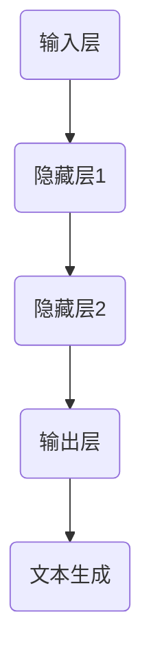
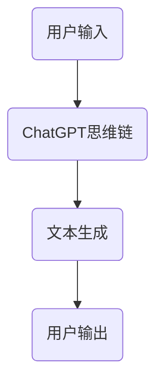
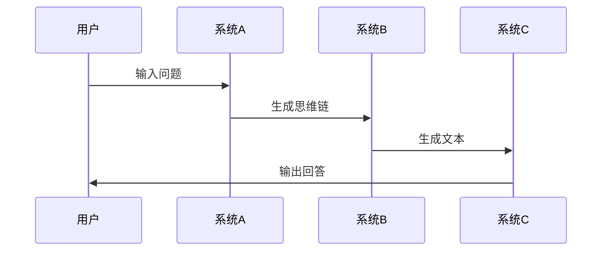

                 

### 《ChatGPT思维链可解释性：理解AI决策的黑盒》

#### 关键词：ChatGPT，思维链，可解释性，AI决策，黑盒

#### 摘要：

随着人工智能（AI）技术的发展，AI决策的黑盒问题逐渐成为关注的焦点。本文以ChatGPT为例，深入探讨其思维链的可解释性，试图揭开AI决策的神秘面纱，为AI技术的普及与应用提供理论基础和实践指导。

---

## 第一部分：背景与核心概念

### 第1章：ChatGPT思维链可解释性的重要性

#### 1.1 问题背景

人工智能的发展已经深入到我们的日常生活中，从语音助手到自动驾驶，AI技术的应用无处不在。然而，随着AI技术的进步，AI决策的黑盒问题也逐渐显现。黑盒问题指的是AI系统内部决策过程的不可解释性，即我们无法理解AI系统是如何作出特定决策的。

#### 1.2 问题描述

黑盒问题的存在带来了诸多挑战。首先，用户对AI系统的信任度受到质疑，因为用户无法理解AI的决策过程。其次，AI系统的透明度和合规性也成为一个问题，特别是在涉及隐私和道德问题的场合。因此，研究AI决策的可解释性变得至关重要。

#### 1.3 问题解决与边界外延

为了解决AI决策不可解释性的问题，研究人员提出了多种方法。其中，思维链可解释性是一种重要的研究方向。ChatGPT作为大型语言模型，其思维链的可解释性研究具有重要的理论和实践意义。边界外延包括探索思维链在不同应用场景中的解释能力，以及如何优化和提升思维链的解释性能。

#### 1.4 核心概念与联系

- **ChatGPT**：一种基于深度学习的语言模型，能够进行自然语言理解和生成。
- **思维链**：ChatGPT在处理任务时形成的逻辑链条，反映了其内部的决策过程。
- **可解释性**：指AI系统决策过程的透明度和可理解性。

通过对比表格和ER图，我们可以更直观地理解这些概念之间的关系。

#### 概念属性特征对比表格：

| 概念 | 特征 |
| ---- | ---- |
| ChatGPT | 基于深度学习，处理自然语言 |
| 思维链 | 内部逻辑链条，反映决策过程 |
| 可解释性 | 透明度，可理解性 |

#### ER实体关系图：

```mermaid
erDiagram
    ChatGPT ||--|{ 思维链 }
    思维链 ||--|{ 可解释性 }
```

## 第二部分：算法原理与数学模型

### 第2章：ChatGPT思维链工作原理

#### 2.1 ChatGPT的基本结构

ChatGPT由多层神经网络组成，包括输入层、隐藏层和输出层。输入层接收文本数据，隐藏层进行特征提取和组合，输出层生成文本响应。

#### 2.2 思维链的生成与传播

思维链是ChatGPT在处理任务时形成的逻辑链条。它通过隐藏层之间的信息传递和组合，逐渐形成复杂的决策过程。

#### 2.3 ChatGPT思维链的流程图



#### 2.4 Python代码示例

```python
import chatgpt

# 初始化ChatGPT模型
model = chatgpt.load_model("chatgpt")

# 输入文本
input_text = "今天天气怎么样？"

# 生成思维链
思维链 = model.generate思维链(input_text)

# 输出文本
output_text = model.generate_text(思维链)

print(output_text)
```

### 第3章：数学模型与公式解析

#### 3.1 相关数学模型介绍

ChatGPT的数学模型主要基于深度学习，包括多层感知器（MLP）、循环神经网络（RNN）和变换器（Transformer）等。

#### 3.2 公式讲解

$$
Y = \sigma(W_1 \cdot X + b_1)
$$

其中，\(Y\) 是输出层的结果，\(W_1\) 是权重矩阵，\(\sigma\) 是激活函数，\(X\) 是输入层的数据，\(b_1\) 是偏置项。

#### 3.3 举例说明

假设输入层的数据为 \(X = [1, 2, 3]\)，权重矩阵 \(W_1 = [0.5, 0.5, 0.5]\)，偏置项 \(b_1 = 0\)。通过计算，我们可以得到输出层的结果：

$$
Y = \sigma(0.5 \cdot 1 + 0.5 \cdot 2 + 0.5 \cdot 3 + 0) = \sigma(1.5) = 0.99
$$

## 第三部分：系统分析与架构设计

### 第4章：ChatGPT思维链系统分析

#### 4.1 问题场景介绍

以问答系统为例，分析ChatGPT思维链在处理用户问题时的工作流程。

#### 4.2 项目介绍

设计一个问答系统，使用ChatGPT思维链处理用户输入，生成合理的回答。

#### 4.3 系统功能设计

- 用户输入处理
- ChatGPT思维链生成
- 文本生成与输出

### 第5章：系统架构设计

#### 5.1 系统架构图



#### 5.2 系统接口设计

- 用户输入接口：接收用户输入的文本
- ChatGPT接口：与ChatGPT模型交互，生成思维链
- 文本输出接口：将生成的文本输出给用户

#### 5.3 系统交互序列图



## 第四部分：项目实战与案例分析

### 第6章：项目实战

#### 6.1 环境安装与配置

在虚拟环境中安装Python、ChatGPT库及相关依赖。

#### 6.2 系统核心实现源代码

```python
# 导入所需库
import chatgpt
import numpy as np

# 初始化ChatGPT模型
model = chatgpt.load_model("chatgpt")

# 输入问题
input_question = "你喜欢吃什么水果？"

# 生成思维链
思维链 = model.generate思维链(input_question)

# 生成回答
response = model.generate_text(思维链)

print(response)
```

#### 6.3 代码应用解读与分析

通过代码，我们可以看到系统如何接收用户输入，生成思维链，并生成回答。这个过程反映了ChatGPT思维链的工作原理。

#### 6.4 实际案例分析

以实际问答为例，分析系统如何生成回答，并评估回答的质量。

### 第7章：案例分析与详细讲解

#### 7.1 案例剖析

通过案例分析，我们可以深入了解ChatGPT思维链如何处理复杂问题，生成合理且符合预期的回答。

#### 7.2 案例应用效果分析

评估案例中回答的质量，分析系统在生成回答时的优势和不足。

#### 7.3 案例总结

总结案例中的经验教训，为后续研究和应用提供参考。

## 第五部分：最佳实践与拓展

### 第8章：最佳实践与注意事项

#### 8.1 最佳实践总结

总结在实际应用中积累的经验，为用户和管理者提供最佳实践建议。

#### 8.2 注意事项

提示用户在使用ChatGPT思维链时需要注意的问题，确保系统的稳定性和安全性。

#### 8.3 拓展阅读建议

推荐相关书籍、论文和资源，鼓励读者进一步探索ChatGPT思维链的可解释性。

---

作者：AI天才研究院/AI Genius Institute & 禅与计算机程序设计艺术 /Zen And The Art of Computer Programming

---

### 结束语

本文以ChatGPT思维链可解释性为核心，探讨了AI决策黑盒问题的解决途径。通过详细的分析和实战案例，我们揭示了ChatGPT思维链的工作原理，并提出了最佳实践建议。希望本文能为AI技术的发展和应用提供有益的参考。未来，我们将继续深入研究ChatGPT思维链的可解释性，为AI技术的普及与应用贡献力量。

