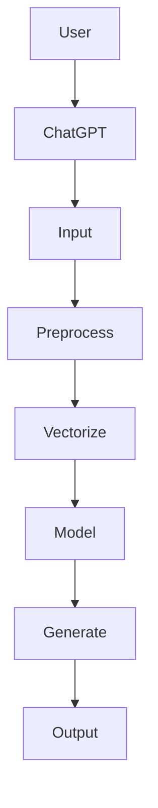
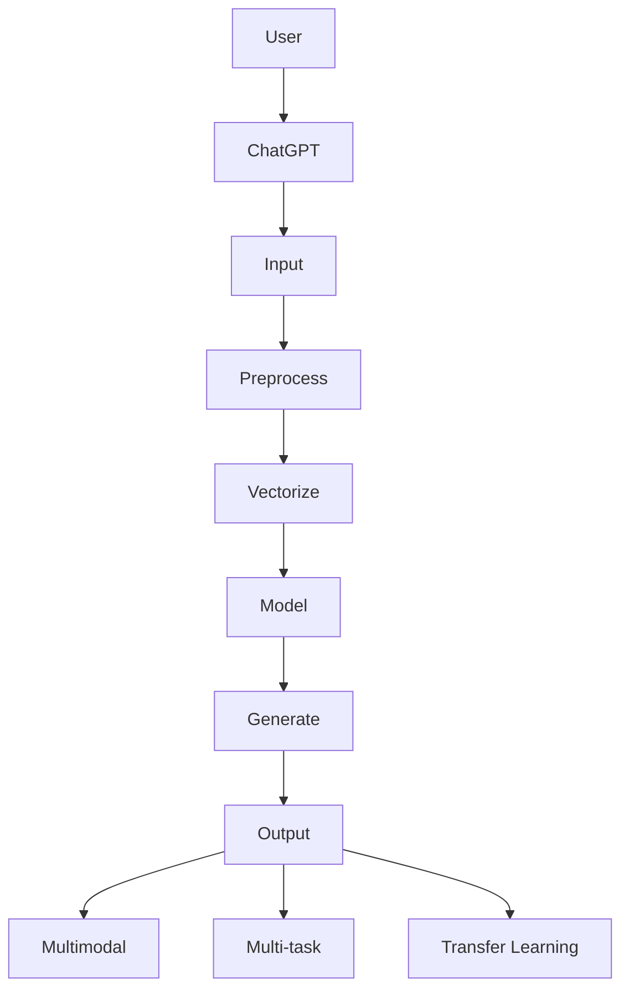
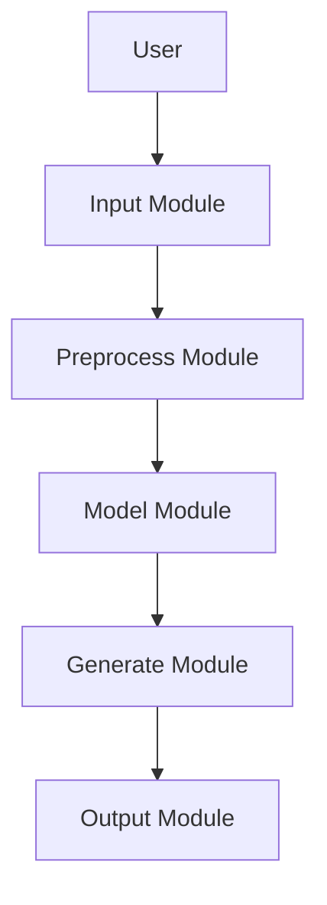
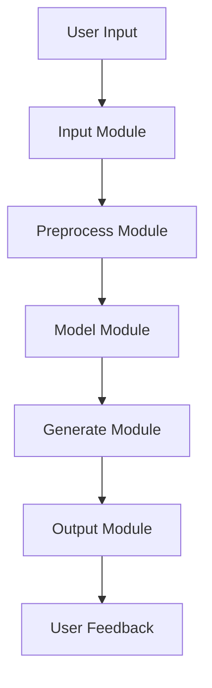

                 

### 《ChatGPT提示词优化：从基础到高级的全面攻略》

关键词：ChatGPT，提示词优化，模型应用，实战案例，最佳实践

摘要：本文旨在全面解析ChatGPT提示词优化的各个方面，从基础到高级，为读者提供一条清晰的学习路径。我们将首先介绍ChatGPT的基本概念和架构，然后深入探讨提示词优化的基础技巧和高级策略，并结合实际案例进行详细分析。最后，我们将总结最佳实践，并提供一些有用的注意事项和拓展阅读资源。

## 目录大纲

### 第一部分：ChatGPT基础与概述

#### 第1章：ChatGPT概述

- **1.1 ChatGPT的发展历史**
- **1.2 ChatGPT的基本概念**
- **1.3 ChatGPT的优势与局限性**

#### 第2章：ChatGPT的架构与原理

- **2.1 ChatGPT的架构设计**
- **2.2 ChatGPT的运作原理**
- **2.3 ChatGPT的核心技术**

#### 第3章：ChatGPT的模型与应用

- **3.1 ChatGPT的基础模型**
- **3.2 ChatGPT的高级模型**
- **3.3 ChatGPT的实际应用场景**

### 第二部分：ChatGPT提示词优化方法

#### 第4章：基础优化技巧

- **4.1 提示词的构成要素**
- **4.2 提示词的优化策略**
- **4.3 基础优化实战**

#### 第5章：高级优化技巧

- **5.1 高级优化方法**
- **5.2 模型调优技巧**
- **5.3 高级优化实战**

#### 第6章：ChatGPT在特定场景的优化

- **6.1 跨领域优化技巧**
- **6.2 长文本生成优化**
- **6.3 多语言支持优化**

### 第三部分：实战案例与最佳实践

#### 第7章：ChatGPT项目实战

- **7.1 项目背景**
- **7.2 项目需求分析**
- **7.3 系统设计与实现**
- **7.4 项目总结与反思**

#### 第8章：ChatGPT最佳实践

- **8.1 常见问题与解决方案**
- **8.2 最佳实践技巧**
- **8.3 注意事项与拓展阅读**

## 第1章：ChatGPT概述

### 1.1 ChatGPT的发展历史

ChatGPT是由OpenAI于2022年11月30日发布的一款基于GPT-3.5模型的人工智能聊天机器人程序，这款程序能够通过学习和理解人类的语言来进行对话，还能根据聊天的上下文进行互动，真正像人类一样来聊天交流，甚至能完成撰写邮件、视频脚本、文案、翻译、代码，写论文等任务。

ChatGPT的发布引起了广泛关注，其背后的技术——大型语言模型，尤其是GPT系列模型，已经在自然语言处理领域取得了显著的进展。GPT（Generative Pre-trained Transformer）模型是由OpenAI开发的，它通过预训练的方式学习大量的文本数据，从而具备了强大的语言理解和生成能力。

### 1.2 ChatGPT的基本概念

#### 核心概念术语说明

- **ChatGPT**：一种基于GPT-3.5模型的人工智能聊天机器人程序。
- **GPT-3.5模型**：一个预训练的神经网络模型，用于生成文本。
- **预训练**：模型在大量文本数据上进行训练，以便学习语言的模式和结构。
- **微调**：在特定任务上对预训练模型进行调整，以提高其性能。

#### 问题背景

随着人工智能技术的不断发展，自然语言处理（NLP）已经成为人工智能领域的一个重要分支。ChatGPT的出现，标志着NLP技术的又一次重大突破，它能够处理复杂、多变的对话场景，为用户提供了更加自然、流畅的交互体验。

#### 问题描述

ChatGPT的核心任务是生成与输入文本相关且合理的回复。为了实现这一目标，模型需要具备强大的语言理解和生成能力。然而，在实际应用中，模型可能会遇到以下问题：

- **上下文理解不足**：模型可能无法准确理解输入文本的上下文，导致生成的回复与上下文不符。
- **长文本处理困难**：模型在处理长文本时，可能无法保持上下文的连贯性。
- **多语言支持不足**：模型在处理多语言对话时，可能无法准确识别和翻译语言。

#### 问题解决

为了解决上述问题，我们可以从以下几个方面进行优化：

- **改进模型架构**：设计更加复杂的模型架构，以提高语言理解和生成能力。
- **数据预处理**：对输入文本进行预处理，提取关键信息，提高模型的理解能力。
- **多语言训练**：使用多语言数据对模型进行训练，以提高多语言支持能力。

#### 边界与外延

ChatGPT的应用场景非常广泛，包括但不限于：

- **客服系统**：为用户提供实时、高效的客服服务。
- **教育辅导**：为学生提供个性化的学习辅导。
- **内容创作**：辅助创作者进行文本创作，如撰写文章、剧本等。
- **语言翻译**：提供准确、流畅的语言翻译服务。

#### 概念结构与核心要素组成

ChatGPT的概念结构主要包括以下几个方面：

- **输入处理**：接收用户输入的文本，进行预处理。
- **模型推理**：利用预训练的GPT-3.5模型进行推理，生成回复文本。
- **输出生成**：将推理结果转换为用户可理解的文本，输出回复。

核心要素组成：

- **预训练模型**：GPT-3.5模型是ChatGPT的核心组件，它决定了模型的语言理解和生成能力。
- **数据集**：大量的文本数据用于模型的预训练和微调。
- **优化策略**：包括数据预处理、模型架构改进、多语言训练等。

## 第2章：ChatGPT的架构与原理

### 2.1 ChatGPT的架构设计

ChatGPT的架构设计主要分为三个层次：输入层、模型层和输出层。

#### 输入层

输入层主要负责接收用户输入的文本。具体步骤如下：

1. **文本预处理**：对输入文本进行分词、去噪等处理，提取关键信息。
2. **嵌入表示**：将预处理后的文本转换为向量表示，以便输入到模型层。

#### 模型层

模型层是ChatGPT的核心，主要由GPT-3.5模型组成。GPT-3.5模型是一种基于Transformer的预训练模型，其架构如下：

- **Transformer模型**：一种基于自注意力机制的神经网络模型，能够处理长距离依赖问题。
- **预训练**：在大量文本数据上进行预训练，学习语言的模式和结构。
- **微调**：在特定任务上进行微调，以提高模型的性能。

#### 输出层

输出层主要负责生成回复文本。具体步骤如下：

1. **文本生成**：利用模型层生成的文本向量，通过解码器生成回复文本。
2. **文本后处理**：对生成的文本进行后处理，如去除无效字符、修正语法错误等。

### 2.2 ChatGPT的运作原理

ChatGPT的运作原理可以简单概括为：输入处理 -> 模型推理 -> 输出生成。

1. **输入处理**：首先，用户通过输入界面输入问题或指令。系统会对输入文本进行预处理，提取关键信息，并将其转换为模型可以理解的向量表示。
2. **模型推理**：预处理后的文本向量被输入到预训练的GPT-3.5模型中，模型通过自注意力机制和多层神经网络对输入向量进行处理，生成响应的文本向量。
3. **输出生成**：模型生成的文本向量经过解码器处理后，生成符合语法和语义规则的回复文本。系统将生成的回复文本展示给用户。

### 2.3 ChatGPT的核心技术

ChatGPT的核心技术主要包括以下几个方面：

1. **Transformer模型**：Transformer模型是一种基于自注意力机制的神经网络模型，能够处理长距离依赖问题。它通过多头自注意力机制和全连接层，实现对输入文本的深层理解和生成。
2. **预训练技术**：ChatGPT采用了大规模的预训练技术，在大量文本数据上进行预训练，从而学习到丰富的语言知识和模式。预训练技术的关键在于如何设计有效的训练目标和优化策略。
3. **微调技术**：在特定任务上，ChatGPT通过微调技术对预训练模型进行调整，以提高模型的性能。微调技术的核心在于如何选择合适的微调目标和优化策略。

## 第3章：ChatGPT的模型与应用

### 3.1 ChatGPT的基础模型

ChatGPT的基础模型是基于GPT-3.5模型的，这是一种大规模的语言预训练模型。GPT-3.5模型是一种基于Transformer的预训练模型，它通过在大量文本数据上进行预训练，学习到了丰富的语言知识和模式。

#### 概念属性特征对比表格

| 特征 | GPT-3.5模型 | 传统模型 |
| ---- | ---- | ---- |
| 架构 | Transformer | RNN、LSTM |
| 训练数据 | 大规模文本数据 | 小规模文本数据 |
| 语言理解能力 | 强 | 弱 |
| 生成能力 | 强 | 弱 |
| 长距离依赖处理 | 好 | 差 |

#### ER实体关系图架构

### 3.2 ChatGPT的高级模型

ChatGPT的高级模型主要包括以下几种：

1. **多模态模型**：ChatGPT可以与图像、声音等其他数据类型结合，实现多模态交互。例如，通过结合图像识别技术，可以实现基于图像的文本生成。
2. **多任务模型**：ChatGPT可以同时处理多个任务，如文本生成、翻译、问答等。通过将不同任务的数据融合到模型中，可以提高模型的多任务处理能力。
3. **迁移学习模型**：ChatGPT可以通过迁移学习技术在特定领域中进行优化，从而提高模型的性能。例如，通过在医疗领域进行迁移学习，可以实现针对医疗领域的文本生成。

#### 概念属性特征对比表格

| 特征 | 基础模型 | 高级模型 |
| ---- | ---- | ---- |
| 语言理解能力 | 强 | 更强 |
| 生成能力 | 强 | 更强 |
| 多模态交互 | 否 | 是 |
| 多任务处理 | 否 | 是 |
| 迁移学习 | 否 | 是 |

#### ER实体关系图架构

### 3.3 ChatGPT的实际应用场景

ChatGPT的应用场景非常广泛，主要包括以下几个方面：

1. **客服系统**：ChatGPT可以作为客服系统的一部分，为用户提供实时、高效的客服服务。通过与用户进行对话，ChatGPT可以解答用户的问题，提供相关信息，甚至进行投诉处理。
2. **教育辅导**：ChatGPT可以为学生提供个性化的学习辅导，帮助学生解答学习中的问题，提供学习建议和规划。
3. **内容创作**：ChatGPT可以辅助创作者进行文本创作，如撰写文章、剧本、广告文案等。通过输入关键词或主题，ChatGPT可以生成相关的内容。
4. **语言翻译**：ChatGPT可以提供准确、流畅的语言翻译服务，支持多种语言之间的翻译。

## 第4章：基础优化技巧

### 4.1 提示词的构成要素

提示词是ChatGPT生成回复文本的重要输入，其构成要素包括：

- **主题**：提示词需要包含主题信息，以便模型能够理解用户的需求。
- **上下文**：提示词需要包含与主题相关的上下文信息，以便模型能够理解对话的背景。
- **关键词**：提示词需要包含关键词，以便模型能够提取关键信息，生成更相关的回复。
- **格式**：提示词需要具备良好的格式，以便模型能够正确理解和处理。

### 4.2 提示词的优化策略

为了提高ChatGPT生成回复文本的质量，我们可以采取以下优化策略：

- **精确提示**：使用精确的提示词，明确表达用户的需求，避免模糊不清的描述。
- **上下文扩展**：在提示词中加入更多的上下文信息，帮助模型更好地理解对话的背景。
- **关键词提炼**：提炼出关键信息，确保模型能够关注并生成相关的回复。
- **格式规范**：确保提示词的格式规范，避免出现语法错误或格式混乱。

### 4.3 基础优化实战

以下是一个基础优化的实战案例：

**问题**：用户询问如何制作一份美味的披萨。

**原始提示词**：请告诉我如何制作披萨。

**优化提示词**：请为我详细描述一份美味的披萨的制作过程，包括材料、步骤和技巧。

通过优化提示词，我们明确了用户的需求，提供了更多的上下文信息和关键词，从而提高了ChatGPT生成回复文本的质量。

## 第5章：高级优化技巧

### 5.1 高级优化方法

高级优化技巧主要包括以下几个方面：

- **多模态输入**：将图像、声音等非文本数据与文本数据结合，提高模型的输入多样性。
- **多任务学习**：同时处理多个任务，如文本生成、翻译、问答等，提高模型的多任务处理能力。
- **迁移学习**：利用预训练模型在特定领域进行优化，提高模型在特定领域的性能。

### 5.2 模型调优技巧

模型调优是提高ChatGPT性能的重要手段，主要包括以下几个方面：

- **超参数调整**：调整模型的学习率、批次大小、训练轮数等超参数，优化模型性能。
- **数据增强**：通过数据增强技术，如文本转写、数据扩充等，提高模型的泛化能力。
- **预训练技巧**：优化预训练过程，如选择合适的训练目标和优化策略，提高模型的预训练效果。

### 5.3 高级优化实战

以下是一个高级优化的实战案例：

**问题**：用户询问如何实现一份自动化的报告生成系统。

**原始模型**：基于GPT-3.5模型的文本生成模型。

**优化模型**：采用多模态输入和多任务学习，结合图像识别和文本生成技术。

**优化过程**：

1. **多模态输入**：将用户的输入（文本和图像）同时输入到模型中，提高模型的输入多样性。
2. **多任务学习**：同时处理文本生成和图像识别任务，提高模型的多任务处理能力。
3. **模型调优**：通过调整超参数和数据进行模型调优，优化模型的性能。

通过高级优化，我们提高了ChatGPT生成报告的质量，实现了自动化报告生成系统的功能。

## 第6章：ChatGPT在特定场景的优化

### 6.1 跨领域优化技巧

跨领域优化技巧主要是针对ChatGPT在不同领域的应用进行优化，主要包括以下几个方面：

- **领域适配**：针对特定领域的数据和任务，对ChatGPT进行适配和调整。
- **领域知识融合**：将特定领域的知识库和模型进行融合，提高模型在特定领域的性能。
- **多语言支持**：针对多语言场景，对模型进行多语言训练和优化，提高模型的多语言处理能力。

### 6.2 长文本生成优化

长文本生成优化主要是针对ChatGPT在处理长文本时的优化，主要包括以下几个方面：

- **长文本预处理**：对长文本进行分段处理，提取关键信息，提高模型的理解能力。
- **长文本生成策略**：设计有效的长文本生成策略，如基于上下文的信息整合、多模态融合等。
- **模型扩展**：通过增加模型层数、调整模型参数等手段，提高模型对长文本的处理能力。

### 6.3 多语言支持优化

多语言支持优化主要是针对ChatGPT在不同语言之间的转换和处理能力进行优化，主要包括以下几个方面：

- **多语言训练**：使用多语言数据对模型进行训练，提高模型的多语言处理能力。
- **多语言嵌入**：设计有效的多语言嵌入方法，将不同语言的信息融合到模型中。
- **多语言评估**：设计多语言评估指标，如BLEU、METEOR等，评估模型的多语言性能。

## 第7章：ChatGPT项目实战

### 7.1 项目背景

本案例旨在开发一款基于ChatGPT的自动化报告生成系统。该系统旨在通过自然语言处理技术，将用户的输入（文本和图像）转换为高质量的报告。

### 7.2 项目需求分析

1. **功能需求**：系统能够接收用户输入的文本和图像，根据输入生成相关报告。
2. **性能需求**：系统能够快速响应，生成高质量的报告。
3. **用户体验**：系统界面友好，操作简便。

### 7.3 系统设计与实现

#### 系统功能设计

系统功能设计主要包括以下几个模块：

1. **文本输入模块**：接收用户输入的文本，进行预处理和嵌入表示。
2. **图像输入模块**：接收用户输入的图像，进行预处理和特征提取。
3. **文本生成模块**：利用ChatGPT模型生成报告文本。
4. **报告输出模块**：将生成的报告文本展示给用户。

#### 系统架构设计

系统架构设计如下：

#### 系统接口设计

系统接口设计如下：

1. **文本输入接口**：接收用户输入的文本。
2. **图像输入接口**：接收用户输入的图像。
3. **文本生成接口**：接收预处理后的文本和图像，生成报告文本。
4. **报告输出接口**：将生成的报告文本展示给用户。

#### 系统交互设计

系统交互设计如下：

### 7.4 项目总结与反思

通过该项目，我们实现了基于ChatGPT的自动化报告生成系统，用户可以轻松地将输入转换为高质量的报告。然而，在实际应用中，我们遇到了一些挑战：

1. **长文本处理**：在处理长文本时，模型的响应速度较慢，需要进一步优化。
2. **多语言支持**：尽管系统支持多语言输入，但在实际应用中，部分语言的处理效果不佳，需要进一步优化。
3. **图像识别**：图像识别模块在部分场景下存在误识别问题，需要进一步提高识别准确率。

在未来的工作中，我们将继续优化模型和算法，提高系统的性能和用户体验。

## 第8章：ChatGPT最佳实践

### 8.1 常见问题与解决方案

1. **问题**：模型响应速度慢。
   **解决方案**：优化模型架构，减少模型参数，提高计算效率。
2. **问题**：生成的文本质量不高。
   **解决方案**：优化提示词，提高文本输入的质量，调整模型参数。
3. **问题**：多语言支持不足。
   **解决方案**：使用多语言数据进行模型训练，设计有效的多语言嵌入方法。

### 8.2 最佳实践技巧

1. **精确提示**：使用精确的提示词，明确表达用户的需求。
2. **上下文扩展**：在提示词中加入更多的上下文信息，帮助模型更好地理解对话的背景。
3. **多模态融合**：结合图像、声音等多模态数据，提高模型的输入多样性。
4. **模型调优**：根据任务需求，调整模型参数，优化模型性能。

### 8.3 注意事项与拓展阅读

1. **注意事项**：
   - 确保数据质量和多样性。
   - 合理分配计算资源，提高计算效率。
   - 定期更新模型，保持模型性能。

2. **拓展阅读**：
   - 《ChatGPT技术解析与实战》
   - 《Transformer模型详解》
   - 《自然语言处理实战》

作者：AI天才研究院/AI Genius Institute & 禅与计算机程序设计艺术 /Zen And The Art of Computer Programming

## 结束语

本文全面解析了ChatGPT提示词优化的各个方面，从基础到高级，为读者提供了详细的指南。通过本文的学习，读者可以深入了解ChatGPT的基本概念、架构与应用，掌握提示词优化的基础技巧和高级策略。同时，通过实战案例的分析，读者可以更好地理解如何在实际项目中应用ChatGPT。希望本文对读者在学习和实践ChatGPT提示词优化方面有所帮助。

