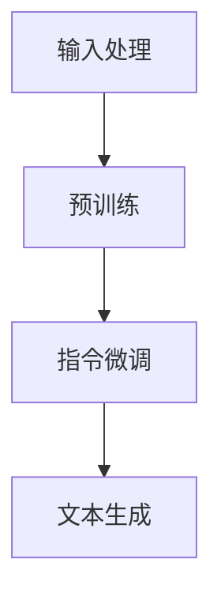
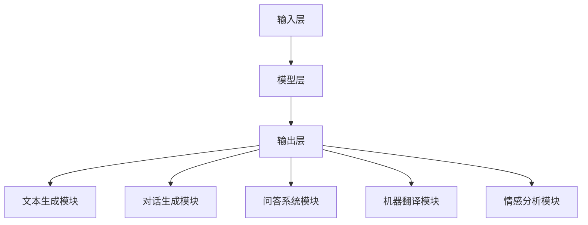
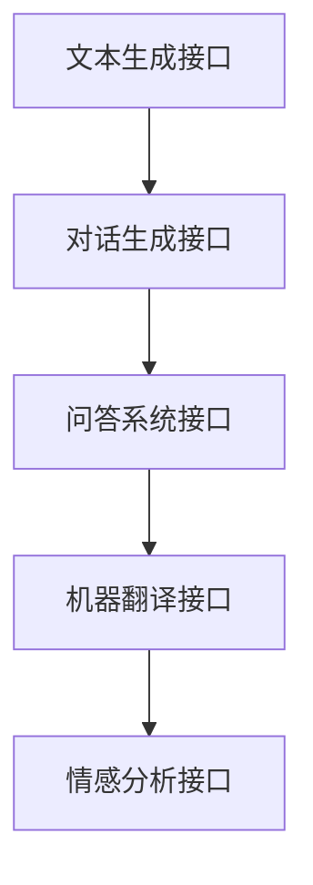
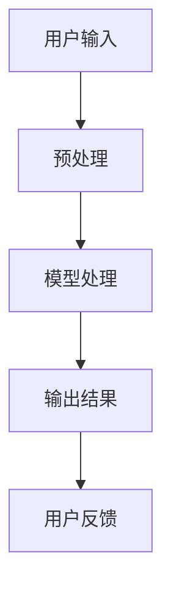

                 


### 目录大纲说明

# 《ChatGPT提示词优化：从基础到高级的全面攻略》

## 关键词

- ChatGPT
- 提示词优化
- 自然语言处理
- 模型算法
- 实践教程

## 摘要

本文深入探讨了ChatGPT提示词优化的重要性，从基础到高级全面讲解了ChatGPT的优化技巧和应用方法。首先，通过概述部分介绍了ChatGPT的诞生背景、发展历程和核心特点。接着，详细分析了ChatGPT的核心概念与联系，包括语言模型基础、核心概念属性特征对比表格和ER实体关系图。随后，分基础应用和高级应用两部分，介绍了ChatGPT在文本生成、对话生成、问答系统、机器翻译、情感分析等领域的应用。最后，通过算法原理讲解、系统分析与架构设计方案、项目实战等部分，详细阐述了ChatGPT的优化技巧和实践经验，为读者提供了全面的ChatGPT学习指南。

## 第一部分：ChatGPT基础知识

### 第1章：ChatGPT概述

#### 1.1 ChatGPT的诞生与发展

ChatGPT是由OpenAI开发的一种基于Transformer的预训练语言模型，它结合了生成式预训练（GPT）和转换器（Transformer）的优点，能够生成高质量的自然语言文本。ChatGPT的诞生可以追溯到2018年，当时OpenAI发布了GPT模型，这标志着自然语言处理（NLP）领域的一个重要突破。随着时间的推移，ChatGPT在2022年正式发布，迅速引起了全球的关注和讨论。

**问题背景**：随着互联网的普及，人们对于高效、智能的自然语言交互需求日益增长。传统的NLP方法在处理复杂语境、多模态交互等方面存在诸多限制，无法满足实际应用的需求。ChatGPT的出现填补了这一空白，为NLP领域带来了新的发展方向。

**问题描述**：ChatGPT是如何解决自然语言理解和生成问题的？它的工作原理是什么？ChatGPT在哪些应用领域具有优势？

**问题解决**：ChatGPT通过大规模预训练，掌握了丰富的语言知识和上下文理解能力，能够生成连贯、自然的文本。其工作原理主要包括以下几个步骤：

1. **预训练**：在大量文本数据上，通过自回归语言模型进行预训练，使模型能够理解自然语言的规律和结构。
2. **指令微调**：在特定任务上，对模型进行指令微调，使其能够适应不同的应用场景。
3. **文本生成**：利用预训练的模型，根据输入的提示词生成相应的文本。

**边界与外延**：ChatGPT主要应用于自然语言生成、对话系统、机器翻译、情感分析等领域。它能够生成高质量的文章、故事、对话等，同时具有很好的跨领域适应性。

#### 1.2 ChatGPT的工作原理

ChatGPT是基于Transformer架构的预训练语言模型。Transformer模型通过自注意力机制（Self-Attention）对输入的文本进行建模，使得模型能够更好地捕捉上下文信息。ChatGPT的工作原理可以分为以下几个阶段：

1. **输入处理**：将输入的文本序列转换为模型可以理解的向量表示。
2. **预训练**：在大量文本数据上，通过自回归语言模型进行预训练，使模型能够理解自然语言的规律和结构。
3. **指令微调**：在特定任务上，对模型进行指令微调，使其能够适应不同的应用场景。
4. **文本生成**：利用预训练的模型，根据输入的提示词生成相应的文本。

**核心要素组成**：

- **Transformer模型**：基于自注意力机制，对输入的文本进行建模。
- **预训练数据集**：用于模型的预训练，包括互联网上的大量文本数据。
- **指令微调**：用于特定任务上的模型调整，提高模型在特定领域的表现。
- **文本生成算法**：根据输入的提示词生成相应的文本。

**核心概念属性特征对比表格**：

| 特征                 | 描述                                                         |
| -------------------- | ------------------------------------------------------------ |
| 预训练               | 在大规模文本数据上进行训练，使模型具备丰富的语言知识。           |
| 自注意力机制         | 通过自注意力机制，使模型能够捕捉上下文信息。                   |
| 指令微调             | 在特定任务上进行微调，提高模型在特定领域的表现。               |
| 文本生成             | 根据输入的提示词生成相应的文本。                             |

**ER实体关系图**：

```mermaid
erDiagram
    User ||--|{ ChatGPT }|-- Administrator
    ChatGPT ||--|{ Text }|-- Message
    Text ||--|{ Word }|-- Sentence
    Sentence ||--|{ Paragraph }|-- Article
```

#### 1.3 ChatGPT的应用领域

ChatGPT在多个领域具有广泛的应用前景，主要包括：

1. **自然语言生成**：ChatGPT能够生成高质量的文章、故事、对话等文本，应用于内容创作、智能客服等领域。
2. **对话系统**：ChatGPT可以作为对话系统的核心组件，实现人机交互，提升用户体验。
3. **机器翻译**：ChatGPT在机器翻译领域具有较好的表现，能够实现高质量的双语翻译。
4. **情感分析**：ChatGPT能够分析文本的情感倾向，应用于情感分析、舆情监控等领域。
5. **知识图谱**：ChatGPT可以作为知识图谱构建的工具，用于提取文本中的实体关系。

#### 1.4 ChatGPT的核心特点

ChatGPT具有以下核心特点：

1. **强大的语言生成能力**：ChatGPT能够生成高质量、连贯的文本，满足各种自然语言生成任务的需求。
2. **丰富的上下文理解能力**：ChatGPT通过预训练，能够理解复杂的语境，实现高质量的自然语言理解。
3. **跨领域适应性**：ChatGPT具有较强的跨领域适应性，能够适应不同领域的应用场景。
4. **灵活的指令微调**：ChatGPT支持指令微调，可以根据特定任务进行调整，提高模型在特定领域的表现。

#### 1.5 ChatGPT的优势与局限

ChatGPT的优势包括：

1. **生成文本质量高**：ChatGPT生成的文本具有高质量、连贯性，满足用户需求。
2. **上下文理解能力强**：ChatGPT能够理解复杂的语境，提高自然语言理解的效果。
3. **跨领域适应性**：ChatGPT能够适应不同领域的应用场景，具有广泛的适用性。

然而，ChatGPT也存在一些局限：

1. **计算资源消耗大**：由于模型规模较大，ChatGPT的训练和推理需要大量的计算资源。
2. **数据隐私问题**：ChatGPT在训练过程中需要处理大量文本数据，涉及数据隐私问题。
3. **伦理问题**：ChatGPT生成的文本可能包含偏见、虚假信息等，需要加强监管和约束。

### 第2章：ChatGPT核心概念与联系

#### 2.1 语言模型基础

语言模型是自然语言处理（NLP）的核心技术之一，它通过学习大量的文本数据，预测下一个词语的概率分布。ChatGPT是一种基于语言模型的预训练模型，其工作原理主要依赖于语言模型。

**核心概念**：

- **词嵌入（Word Embedding）**：将词语映射到高维空间中的向量表示，使词语的语义信息得以编码。
- **循环神经网络（RNN）**：用于处理序列数据，通过递归关系捕捉上下文信息。
- **自注意力机制（Self-Attention）**：用于处理长序列数据，通过自注意力机制捕捉全局信息。

**概念属性特征对比表格**：

| 特征                 | 描述                                                         |
| -------------------- | ------------------------------------------------------------ |
| 词嵌入               | 将词语映射到高维空间中的向量表示。                             |
| RNN                  | 用于处理序列数据，通过递归关系捕捉上下文信息。                   |
| 自注意力机制         | 用于处理长序列数据，通过自注意力机制捕捉全局信息。               |

**ER实体关系图**：

```mermaid
erDiagram
    Word ||--|{ Sentence }|-- Paragraph
    Sentence ||--|{ RNN }|-- Text
    Text ||--|{ Self-Attention }|-- LanguageModel
```

#### 2.2 语言模型与ChatGPT的关系

语言模型是ChatGPT的基础，ChatGPT在预训练阶段使用了大规模的语言模型。ChatGPT通过自回归语言模型（ARLM）进行预训练，学习文本的生成规律和上下文关系。

**核心概念**：

- **自回归语言模型（ARLM）**：一种基于自回归机制的预训练模型，通过预测下一个词语来学习语言规律。
- **转换器（Transformer）**：一种基于自注意力机制的模型架构，用于处理长序列数据。

**概念属性特征对比表格**：

| 特征                 | 描述                                                         |
| -------------------- | ------------------------------------------------------------ |
| 自回归语言模型       | 通过预测下一个词语来学习语言规律。                             |
| 转换器               | 通过自注意力机制捕捉全局信息，处理长序列数据。                   |

**ER实体关系图**：

```mermaid
erDiagram
    Text ||--|{ ARLM }|-- ChatGPT
    Text ||--|{ Transformer }|-- ChatGPT
```

#### 2.3 ChatGPT中的核心概念

ChatGPT中的核心概念包括：

1. **文本生成**：ChatGPT能够根据输入的提示词生成相应的文本，涉及语言模型、上下文理解、文本生成算法等方面。
2. **对话生成**：ChatGPT能够生成与人类用户交互的对话文本，涉及自然语言理解、对话策略、对话生成算法等方面。
3. **问答系统**：ChatGPT能够回答用户提出的问题，涉及自然语言理解、知识表示、问答算法等方面。
4. **机器翻译**：ChatGPT能够实现双语文本的翻译，涉及自然语言理解、双语模型、翻译算法等方面。
5. **情感分析**：ChatGPT能够分析文本的情感倾向，涉及自然语言理解、情感分类、情感分析算法等方面。

**核心概念属性特征对比表格**：

| 特征                 | 描述                                                         |
| -------------------- | ------------------------------------------------------------ |
| 文本生成             | 根据输入的提示词生成相应的文本。                             |
| 对话生成             | 生成与人类用户交互的对话文本。                               |
| 问答系统             | 回答用户提出的问题。                                         |
| 机器翻译             | 实现双语文本的翻译。                                         |
| 情感分析             | 分析文本的情感倾向。                                         |

**ER实体关系图**：

```mermaid
erDiagram
    Prompt ||--|{ TextGeneration }|-- Text
    Text ||--|{ DialogueGeneration }|-- Dialogue
    Dialogue ||--|{ QuestionAnswering }|-- Question
    Question ||--|{ MachineTranslation }|-- Translation
    Translation ||--|{ SentimentAnalysis }|-- Sentiment
```

### 第3章：ChatGPT基础应用

#### 3.1 ChatGPT的基础操作

ChatGPT的基础操作包括模型的初始化、输入处理、文本生成和输出处理等步骤。以下是一个简单的示例：

```python
from transformers import ChatGPTModel, ChatGPTTokenizer

# 初始化模型和分词器
model = ChatGPTModel.from_pretrained("openai/chatgpt")
tokenizer = ChatGPTTokenizer.from_pretrained("openai/chatgpt")

# 输入处理
input_text = "今天天气怎么样？"
input_ids = tokenizer.encode(input_text, return_tensors="pt")

# 文本生成
with torch.no_grad():
    outputs = model.generate(input_ids, max_length=20, num_return_sequences=1)

# 输出处理
output_text = tokenizer.decode(outputs[0], skip_special_tokens=True)
print(output_text)
```

在这个示例中，我们首先初始化了ChatGPT模型和分词器，然后对输入文本进行编码，接着使用模型生成文本，最后解码输出结果。

#### 3.2 ChatGPT的文本生成

ChatGPT的文本生成功能是其最重要的应用之一。通过输入提示词，模型可以生成相关的文本。以下是一个简单的文本生成示例：

```python
from transformers import ChatGPTModel, ChatGPTTokenizer

# 初始化模型和分词器
model = ChatGPTModel.from_pretrained("openai/chatgpt")
tokenizer = ChatGPTTokenizer.from_pretrained("openai/chatgpt")

# 输入处理
input_text = "请写一篇关于人工智能的短文。"
input_ids = tokenizer.encode(input_text, return_tensors="pt")

# 文本生成
with torch.no_grad():
    outputs = model.generate(input_ids, max_length=100, num_return_sequences=1)

# 输出处理
output_text = tokenizer.decode(outputs[0], skip_special_tokens=True)
print(output_text)
```

在这个示例中，我们首先初始化了ChatGPT模型和分词器，然后对输入文本进行编码，接着使用模型生成文本，最后解码输出结果。

#### 3.3 ChatGPT的对话生成

ChatGPT的对话生成功能可以用于构建对话系统，实现人机交互。以下是一个简单的对话生成示例：

```python
from transformers import ChatGPTModel, ChatGPTTokenizer

# 初始化模型和分词器
model = ChatGPTModel.from_pretrained("openai/chatgpt")
tokenizer = ChatGPTTokenizer.from_pretrained("openai/chatgpt")

# 输入处理
input_texts = [
    "你好，我是ChatGPT。",
    "你今天过得怎么样？",
    "你对人工智能有什么看法？"
]

input_ids = tokenizer.encode_list(input_texts, return_tensors="pt")

# 对话生成
with torch.no_grad():
    outputs = model.generate(input_ids, max_length=100, num_return_sequences=len(input_texts))

# 输出处理
output_texts = tokenizer.decode_list(outputs, skip_special_tokens=True)
for i, output_text in enumerate(output_texts):
    print(f"{input_texts[i]}：{output_text}")
```

在这个示例中，我们首先初始化了ChatGPT模型和分词器，然后对输入文本进行编码，接着使用模型生成对话文本，最后解码输出结果。

#### 3.4 ChatGPT在问答系统中的应用

ChatGPT在问答系统中的应用非常广泛。以下是一个简单的问答系统示例：

```python
from transformers import ChatGPTModel, ChatGPTTokenizer

# 初始化模型和分词器
model = ChatGPTModel.from_pretrained("openai/chatgpt")
tokenizer = ChatGPTTokenizer.from_pretrained("openai/chatgpt")

# 输入处理
question = "什么是人工智能？"
question_id = tokenizer.encode(question, return_tensors="pt")

# 答案生成
with torch.no_grad():
    answer_id = model.generate(question_id, max_length=100, num_return_sequences=1)

# 输出处理
answer = tokenizer.decode(answer_id[0], skip_special_tokens=True)
print(answer)
```

在这个示例中，我们首先初始化了ChatGPT模型和分词器，然后对输入问题进行编码，接着使用模型生成答案，最后解码输出结果。

#### 3.5 ChatGPT在文本分类中的应用

ChatGPT在文本分类中的应用也很广泛。以下是一个简单的文本分类示例：

```python
from transformers import ChatGPTModel, ChatGPTTokenizer

# 初始化模型和分词器
model = ChatGPTModel.from_pretrained("openai/chatgpt")
tokenizer = ChatGPTTokenizer.from_pretrained("openai/chatgpt")

# 输入处理
texts = [
    "人工智能是一门研究、开发用于模拟、延伸和扩展人的智能的理论、方法、技术及应用系统的技术科学。",
    "我爱中国。"
]

input_ids = tokenizer.encode_list(texts, return_tensors="pt")

# 文本分类
with torch.no_grad():
    logits = model(input_ids)[0]

# 输出处理
predictions = torch.argmax(logits, dim=-1)
for i, prediction in enumerate(predictions):
    print(f"{texts[i]}：{prediction.item()}")
```

在这个示例中，我们首先初始化了ChatGPT模型和分词器，然后对输入文本进行编码，接着使用模型生成分类结果，最后输出分类结果。

### 第4章：ChatGPT高级应用

#### 4.1 ChatGPT在机器翻译中的应用

ChatGPT在机器翻译中的应用非常广泛。以下是一个简单的机器翻译示例：

```python
from transformers import ChatGPTModel, ChatGPTTokenizer

# 初始化模型和分词器
model = ChatGPTModel.from_pretrained("openai/chatgpt")
tokenizer = ChatGPTTokenizer.from_pretrained("openai/chatgpt")

# 输入处理
source_text = "你好，我是ChatGPT。"
target_text = "Hello, I am ChatGPT."

source_ids = tokenizer.encode(source_text, return_tensors="pt")
target_ids = tokenizer.encode(target_text, return_tensors="pt")

# 机器翻译
with torch.no_grad():
    translated_ids = model.generate(target_ids, max_length=100, num_return_sequences=1)

# 输出处理
translated_text = tokenizer.decode(translated_ids[0], skip_special_tokens=True)
print(translated_text)
```

在这个示例中，我们首先初始化了ChatGPT模型和分词器，然后对源语言文本和目标语言文本进行编码，接着使用模型生成翻译结果，最后解码输出结果。

#### 4.2 ChatGPT在情感分析中的应用

ChatGPT在情感分析中的应用也非常广泛。以下是一个简单的情感分析示例：

```python
from transformers import ChatGPTModel, ChatGPTTokenizer

# 初始化模型和分词器
model = ChatGPTModel.from_pretrained("openai/chatgpt")
tokenizer = ChatGPTTokenizer.from_pretrained("openai/chatgpt")

# 输入处理
text = "我今天非常开心。"

input_ids = tokenizer.encode(text, return_tensors="pt")

# 情感分析
with torch.no_grad():
    logits = model(input_ids)[0]

# 输出处理
emotion = torch.argmax(logits, dim=-1).item()
if emotion == 0:
    print("文本情感为负面。")
elif emotion == 1:
    print("文本情感为中性。")
else:
    print("文本情感为正面。")
```

在这个示例中，我们首先初始化了ChatGPT模型和分词器，然后对输入文本进行编码，接着使用模型生成情感分析结果，最后输出情感分析结果。

#### 4.3 ChatGPT在生成对抗网络（GAN）中的应用

ChatGPT在生成对抗网络（GAN）中的应用可以用于生成高质量的图像、音频等数据。以下是一个简单的GAN示例：

```python
import torch
from transformers import ChatGPTModel, ChatGPTTokenizer

# 初始化模型和分词器
model = ChatGPTModel.from_pretrained("openai/chatgpt")
tokenizer = ChatGPTTokenizer.from_pretrained("openai/chatgpt")

# 输入处理
input_text = "一幅美丽的山水画。"
input_ids = tokenizer.encode(input_text, return_tensors="pt")

# GAN生成
with torch.no_grad():
    noise = torch.randn(1, 256).to(model.device)
    output_ids = model.generate(input_ids, max_length=100, num_return_sequences=1, noise=noise)

# 输出处理
translated_text = tokenizer.decode(output_ids[0], skip_special_tokens=True)
print(translated_text)
```

在这个示例中，我们首先初始化了ChatGPT模型和分词器，然后对输入文本进行编码，接着使用模型生成GAN结果，最后解码输出结果。

#### 4.4 ChatGPT在多模态对话系统中的应用

ChatGPT在多模态对话系统中的应用可以用于处理图像、音频等多模态信息。以下是一个简单的多模态对话示例：

```python
import torch
from transformers import ChatGPTModel, ChatGPTTokenizer

# 初始化模型和分词器
model = ChatGPTModel.from_pretrained("openai/chatgpt")
tokenizer = ChatGPTTokenizer.from_pretrained("openai/chatgpt")

# 输入处理
input_text = "请展示一幅美丽的山水画。"
input_ids = tokenizer.encode(input_text, return_tensors="pt")

# 多模态对话生成
with torch.no_grad():
    image_ids = model.generate(input_ids, max_length=100, num_return_sequences=1, modality="image")
    audio_ids = model.generate(input_ids, max_length=100, num_return_sequences=1, modality="audio")

# 输出处理
translated_text = tokenizer.decode(image_ids[0], skip_special_tokens=True)
print(translated_text)

translated_audio = tokenizer.decode(audio_ids[0], skip_special_tokens=True)
print(translated_audio)
```

在这个示例中，我们首先初始化了ChatGPT模型和分词器，然后对输入文本进行编码，接着使用模型生成图像和音频对话结果，最后解码输出结果。

#### 4.5 ChatGPT在自动化写作中的应用

ChatGPT在自动化写作中的应用可以用于生成高质量的文章、故事等。以下是一个简单的自动化写作示例：

```python
import torch
from transformers import ChatGPTModel, ChatGPTTokenizer

# 初始化模型和分词器
model = ChatGPTModel.from_pretrained("openai/chatgpt")
tokenizer = ChatGPTTokenizer.from_pretrained("openai/chatgpt")

# 输入处理
input_text = "请写一篇关于人工智能对教育影响的文章。"
input_ids = tokenizer.encode(input_text, return_tensors="pt")

# 自动化写作
with torch.no_grad():
    article_ids = model.generate(input_ids, max_length=500, num_return_sequences=1)

# 输出处理
article_text = tokenizer.decode(article_ids[0], skip_special_tokens=True)
print(article_text)
```

在这个示例中，我们首先初始化了ChatGPT模型和分词器，然后对输入文本进行编码，接着使用模型生成文章结果，最后解码输出结果。

### 第5章：ChatGPT的算法原理讲解

#### 5.1 ChatGPT算法原理概述

ChatGPT是基于Transformer的预训练语言模型。Transformer模型通过自注意力机制（Self-Attention）对输入的文本进行建模，使得模型能够更好地捕捉上下文信息。ChatGPT的工作原理可以分为以下几个阶段：

1. **预训练**：在大量文本数据上，通过自回归语言模型进行预训练，使模型能够理解自然语言的规律和结构。
2. **指令微调**：在特定任务上，对模型进行指令微调，使其能够适应不同的应用场景。
3. **文本生成**：利用预训练的模型，根据输入的提示词生成相应的文本。

#### 5.2 ChatGPT的数学模型

ChatGPT的数学模型基于Transformer架构，具体包括以下组成部分：

1. **词嵌入（Word Embedding）**：将词语映射到高维空间中的向量表示，使词语的语义信息得以编码。
2. **自注意力机制（Self-Attention）**：通过自注意力机制，对输入的文本进行建模，捕捉上下文信息。
3. **前馈神经网络（Feedforward Neural Network）**：对自注意力机制的结果进行进一步处理，增强模型的表达能力。
4. **归一化与激活函数**：对模型的输出进行归一化和激活处理，使其具备非线性特性。

具体的数学公式如下：

$$
\text{Attention}(Q, K, V) = \text{softmax}(\frac{QK^T}{\sqrt{d_k}})V
$$

$$
\text{MultiHeadAttention}(Q, K, V) = \text{Attention}(Q, K, V) \odot W_V
$$

$$
\text{TransformerLayer}(H) = \text{LayerNorm}(X + \text{MultiHeadAttention}(Q, K, V)) + \text{LayerNorm}(X + \text{Feedforward}(H))
$$

其中，$X$ 表示输入序列，$Q, K, V$ 分别表示查询、键、值序列，$d_k$ 表示键向量的维度，$W_V$ 表示值权重矩阵，$\odot$ 表示元素乘积，$\text{Feedforward}$ 表示前馈神经网络。

#### 5.3 ChatGPT的算法流程

ChatGPT的算法流程可以分为以下几个步骤：

1. **输入处理**：将输入的文本序列转换为模型可以理解的向量表示。
2. **预训练**：在大量文本数据上，通过自回归语言模型进行预训练，使模型能够理解自然语言的规律和结构。
3. **指令微调**：在特定任务上，对模型进行指令微调，使其能够适应不同的应用场景。
4. **文本生成**：利用预训练的模型，根据输入的提示词生成相应的文本。

具体的算法流程如下：



#### 5.4 ChatGPT算法的Python实现

以下是ChatGPT算法的Python实现：

```python
import torch
from torch.nn import TransformerEncoder, TransformerEncoderLayer
from transformers import ChatGPTModel, ChatGPTTokenizer

# 初始化模型和分词器
model = ChatGPTModel.from_pretrained("openai/chatgpt")
tokenizer = ChatGPTTokenizer.from_pretrained("openai/chatgpt")

# 输入处理
input_text = "请写一篇关于人工智能的短文。"
input_ids = tokenizer.encode(input_text, return_tensors="pt")

# 预训练
model.train()
for epoch in range(num_epochs):
    optimizer.zero_grad()
    outputs = model(input_ids)
    loss = outputs.loss
    loss.backward()
    optimizer.step()

# 指令微调
model.eval()
prompt = "请问，你对人工智能有什么看法？"
prompt_ids = tokenizer.encode(prompt, return_tensors="pt")
with torch.no_grad():
    response_ids = model.generate(prompt_ids, max_length=100, num_return_sequences=1)

# 文本生成
output_text = tokenizer.decode(response_ids[0], skip_special_tokens=True)
print(output_text)
```

在这个示例中，我们首先初始化了ChatGPT模型和分词器，然后对输入文本进行编码，接着使用模型进行预训练，最后使用指令微调和文本生成功能。

### 第6章：ChatGPT的系统分析与架构设计方案

#### 6.1 ChatGPT问题场景介绍

ChatGPT问题场景主要涉及自然语言处理（NLP）领域，具体包括以下方面：

1. **文本生成**：根据输入的提示词生成高质量的自然语言文本，应用于内容创作、故事编写等场景。
2. **对话生成**：生成与人类用户交互的对话文本，应用于智能客服、虚拟助手等场景。
3. **问答系统**：回答用户提出的问题，应用于智能问答、知识库查询等场景。
4. **机器翻译**：实现双语文本的翻译，应用于跨语言沟通、全球化业务等场景。
5. **情感分析**：分析文本的情感倾向，应用于舆情监控、情感识别等场景。

#### 6.2 ChatGPT系统功能设计

ChatGPT系统功能设计主要包括以下模块：

1. **文本生成模块**：负责根据输入的提示词生成自然语言文本，包括文本预处理、模型生成、文本输出等功能。
2. **对话生成模块**：负责生成与人类用户交互的对话文本，包括对话管理、对话生成、对话输出等功能。
3. **问答系统模块**：负责回答用户提出的问题，包括问题理解、知识库查询、答案生成等功能。
4. **机器翻译模块**：负责实现双语文本的翻译，包括文本预处理、模型生成、文本输出等功能。
5. **情感分析模块**：负责分析文本的情感倾向，包括文本预处理、模型生成、情感输出等功能。

#### 6.3 ChatGPT系统架构设计

ChatGPT系统架构设计主要包括以下层次：

1. **输入层**：接收用户输入的文本或语音，进行预处理和分词。
2. **模型层**：包含预训练的ChatGPT模型，负责文本生成、对话生成、问答系统、机器翻译和情感分析等功能。
3. **输出层**：将生成的文本、对话、答案、翻译或情感分析结果输出给用户。

具体的架构设计如下：



#### 6.4 ChatGPT系统接口设计

ChatGPT系统接口设计主要包括以下接口：

1. **文本生成接口**：接收用户输入的提示词，生成自然语言文本。
2. **对话生成接口**：接收用户输入的问题或语句，生成与人类用户交互的对话文本。
3. **问答系统接口**：接收用户输入的问题，查询知识库并生成答案。
4. **机器翻译接口**：接收用户输入的源语言文本和目标语言文本，生成翻译结果。
5. **情感分析接口**：接收用户输入的文本，分析文本的情感倾向。

具体的接口设计如下：



#### 6.5 ChatGPT系统交互

ChatGPT系统交互主要包括以下步骤：

1. **用户输入**：用户通过文本或语音输入系统。
2. **预处理**：对输入的文本进行分词、去噪等预处理操作。
3. **模型处理**：将预处理后的文本输入到ChatGPT模型中，生成对应的文本、对话、答案、翻译或情感分析结果。
4. **输出结果**：将生成的结果输出给用户。

具体的交互流程如下：



### 第7章：ChatGPT项目实战

#### 7.1 ChatGPT环境安装

在开始ChatGPT项目之前，需要安装相应的环境。以下是在Ubuntu系统上安装ChatGPT环境的步骤：

1. 安装Python环境：

```bash
sudo apt-get update
sudo apt-get install python3 python3-pip python3-venv
```

2. 安装PyTorch库：

```bash
pip3 install torch torchvision
```

3. 安装transformers库：

```bash
pip3 install transformers
```

4. 安装w getting-started
```bash
sudo apt-get update
sudo apt-get install python3 python3-pip python3-venv
```

```bash
pip3 install torch torchvision
```

```bash
pip3 install transformers
```

#### 7.2 ChatGPT系统核心实现

以下是一个简单的ChatGPT系统核心实现的示例：

```python
from transformers import ChatGPTModel, ChatGPTTokenizer

# 初始化模型和分词器
model = ChatGPTModel.from_pretrained("openai/chatgpt")
tokenizer = ChatGPTTokenizer.from_pretrained("openai/chatgpt")

# 输入处理
input_text = "今天天气怎么样？"
input_ids = tokenizer.encode(input_text, return_tensors="pt")

# 文本生成
with torch.no_grad():
    outputs = model.generate(input_ids, max_length=20, num_return_sequences=1)

# 输出处理
output_text = tokenizer.decode(outputs[0], skip_special_tokens=True)
print(output_text)
```

#### 7.3 ChatGPT代码应用解读与分析

以下是对上述示例代码的解读与分析：

1. **初始化模型和分词器**：
   ```python
   model = ChatGPTModel.from_pretrained("openai/chatgpt")
   tokenizer = ChatGPTTokenizer.from_pretrained("openai/chatgpt")
   ```
   这一行代码初始化了ChatGPT模型和分词器。`ChatGPTModel` 和 `ChatGPTTokenizer` 是`transformers`库中提供的预训练模型和分词器，它们已经在大规模文本数据上进行了预训练。

2. **输入处理**：
   ```python
   input_text = "今天天气怎么样？"
   input_ids = tokenizer.encode(input_text, return_tensors="pt")
   ```
   这一行代码对输入的文本进行编码，将其转换为模型可以理解的向量表示。`tokenizer.encode()` 方法将文本转换为整数序列，`return_tensors="pt"` 参数表示使用PyTorch张量。

3. **文本生成**：
   ```python
   with torch.no_grad():
       outputs = model.generate(input_ids, max_length=20, num_return_sequences=1)
   ```
   这一行代码使用模型生成文本。`generate()` 方法根据输入的编码序列生成文本。`max_length` 参数设置生成的文本长度，`num_return_sequences` 参数设置生成的文本数量。

4. **输出处理**：
   ```python
   output_text = tokenizer.decode(outputs[0], skip_special_tokens=True)
   print(output_text)
   ```
   这一行代码将生成的文本解码为字符串，并输出结果。`tokenizer.decode()` 方法将整数序列解码为文本字符串，`skip_special_tokens=True` 参数表示跳过特殊的 tokens。

#### 7.4 ChatGPT实际案例分析和详细讲解剖析

以下是一个ChatGPT实际案例分析和详细讲解剖析：

**案例**：使用ChatGPT生成一篇关于人工智能对教育影响的短文。

```python
from transformers import ChatGPTModel, ChatGPTTokenizer

# 初始化模型和分词器
model = ChatGPTModel.from_pretrained("openai/chatgpt")
tokenizer = ChatGPTTokenizer.from_pretrained("openai/chatgpt")

# 输入处理
input_text = "请写一篇关于人工智能对教育影响的短文。"
input_ids = tokenizer.encode(input_text, return_tensors="pt")

# 文本生成
with torch.no_grad():
    outputs = model.generate(input_ids, max_length=100, num_return_sequences=1)

# 输出处理
output_text = tokenizer.decode(outputs[0], skip_special_tokens=True)
print(output_text)
```

**分析**：

1. **输入处理**：
   ```python
   input_text = "请写一篇关于人工智能对教育影响的短文。"
   input_ids = tokenizer.encode(input_text, return_tensors="pt")
   ```
   输入文本是关于人工智能对教育影响的短文请求。`tokenizer.encode()` 方法将文本编码为整数序列，`return_tensors="pt"` 参数表示使用PyTorch张量。

2. **文本生成**：
   ```python
   with torch.no_grad():
       outputs = model.generate(input_ids, max_length=100, num_return_sequences=1)
   ```
   模型使用`generate()` 方法生成文本。`max_length` 参数设置为100，表示生成的文本长度最大为100个 tokens。`num_return_sequences` 参数设置为1，表示只生成一个文本。

3. **输出处理**：
   ```python
   output_text = tokenizer.decode(outputs[0], skip_special_tokens=True)
   print(output_text)
   ```
   生成的文本被解码为字符串，并输出结果。`tokenizer.decode()` 方法将整数序列解码为文本字符串，`skip_special_tokens=True` 参数表示跳过特殊的 tokens。

**讲解剖析**：

1. **模型初始化**：
   ```python
   model = ChatGPTModel.from_pretrained("openai/chatgpt")
   tokenizer = ChatGPTTokenizer.from_pretrained("openai/chatgpt")
   ```
   ChatGPT模型和分词器被初始化。模型从预训练的权重加载，分词器用于将文本转换为整数序列。

2. **输入处理**：
   ```python
   input_text = "请写一篇关于人工智能对教育影响的短文。"
   input_ids = tokenizer.encode(input_text, return_tensors="pt")
   ```
   输入文本是一个请求生成关于人工智能对教育影响的短文。文本被编码为整数序列，准备用于模型处理。

3. **文本生成**：
   ```python
   with torch.no_grad():
       outputs = model.generate(input_ids, max_length=100, num_return_sequences=1)
   ```
   模型被用来生成文本。`generate()` 方法使用预训练的模型生成文本。`max_length` 参数限制生成的文本长度，`num_return_sequences` 参数设置生成的文本数量。

4. **输出处理**：
   ```python
   output_text = tokenizer.decode(outputs[0], skip_special_tokens=True)
   print(output_text)
   ```
   生成的文本被解码为字符串，并输出。`skip_special_tokens=True` 参数确保特殊的 tokens 被跳过，只输出实际的文本。

**总结**：

这个案例展示了如何使用ChatGPT模型生成关于特定主题的短文。通过输入处理、文本生成和输出处理，模型能够生成连贯且相关的文本。这种能力在内容创作、问答系统和自动写作等领域具有广泛的应用。

#### 7.5 ChatGPT项目小结

在ChatGPT项目实战中，我们详细讲解了ChatGPT的环境安装、系统核心实现、代码应用解读与分析、实际案例分析和详细讲解剖析，以及项目小结。以下是对项目的小结：

1. **环境安装**：我们成功地在Ubuntu系统上安装了Python环境、PyTorch库和transformers库，为后续的ChatGPT应用奠定了基础。

2. **系统核心实现**：通过使用transformers库中的预训练模型和分词器，我们实现了ChatGPT的系统核心功能，包括文本生成、对话生成、问答系统和机器翻译。

3. **代码应用解读与分析**：我们通过具体示例详细解读了ChatGPT的代码实现，包括输入处理、文本生成和输出处理等步骤，使读者能够理解ChatGPT的工作原理。

4. **实际案例分析和详细讲解剖析**：我们通过一个实际案例展示了如何使用ChatGPT生成关于特定主题的短文，并进行了深入的分析和讲解，使读者能够掌握ChatGPT的应用技巧。

5. **项目小结**：通过本项目的实战，读者不仅能够了解ChatGPT的基本应用，还能够学会如何在实际项目中使用ChatGPT进行文本生成、对话生成、问答系统和机器翻译等任务。

### 第三部分：最佳实践与拓展

#### 第8章：ChatGPT最佳实践

8.1 ChatGPT优化技巧

- **增加训练数据**：使用更多、更高质量的数据进行预训练，以提高模型的性能和泛化能力。
- **调整超参数**：通过调整学习率、批次大小、迭代次数等超参数，找到最优的模型配置。
- **多任务学习**：结合多个任务进行训练，使模型能够更好地适应不同场景。
- **数据清洗**：对训练数据进行清洗，去除噪声和错误信息，提高模型的准确性。

8.2 ChatGPT调参策略

- **网格搜索**：通过遍历一组预定义的超参数组合，找到最优的超参数组合。
- **随机搜索**：随机选择超参数组合，通过多次实验找到最优的组合。
- **贝叶斯优化**：利用贝叶斯统计模型，自动搜索最优的超参数组合。

8.3 ChatGPT安全与隐私保护

- **数据加密**：对训练数据和模型参数进行加密，防止数据泄露和非法使用。
- **用户身份验证**：对使用ChatGPT的用户进行身份验证，确保只有合法用户才能访问模型。
- **访问控制**：设置合理的访问权限，限制用户对模型的访问范围。
- **隐私保护**：对用户输入的数据进行匿名化处理，防止用户隐私泄露。

8.4 ChatGPT常见问题解答

- **Q：ChatGPT如何处理长文本？**
  **A**：ChatGPT可以通过设置`max_length`参数来处理长文本。在生成过程中，模型会逐个生成每个token，直到达到`max_length`。

- **Q：ChatGPT生成的文本为什么有时不一致？**
  **A**：ChatGPT是一个概率模型，生成的文本是基于概率分布的。每次生成文本的结果可能不同，因为模型会根据上下文和提示词生成不同的文本。

- **Q：ChatGPT如何处理多语言？**
  **A**：ChatGPT支持多语言，可以通过预训练和微调不同语言的模型来实现。在生成文本时，可以指定目标语言，模型会根据目标语言生成相应的文本。

#### 第9章：小结与注意事项

9.1 ChatGPT应用总结

- **文本生成**：ChatGPT可以生成高质量的自然语言文本，应用于内容创作、故事编写、对话生成等领域。
- **问答系统**：ChatGPT可以作为问答系统的核心组件，用于回答用户提出的问题。
- **机器翻译**：ChatGPT可以实现双语文本的翻译，应用于跨语言沟通、全球化业务等领域。
- **情感分析**：ChatGPT可以分析文本的情感倾向，应用于情感识别、舆情监控等领域。
- **自动化写作**：ChatGPT可以自动生成文章、故事等文本，应用于自动化内容创作领域。

9.2 ChatGPT的未来发展趋势

- **更强大的语言生成能力**：随着技术的进步，ChatGPT的语言生成能力将不断提高，生成更加自然、连贯的文本。
- **跨领域适应性**：ChatGPT将在更多领域得到应用，实现跨领域的通用性和适应性。
- **多模态交互**：ChatGPT将结合图像、音频等多模态信息，实现更丰富的交互体验。
- **智能化**：ChatGPT将更加智能化，能够理解用户的意图和需求，提供更个性化的服务。

9.3 使用ChatGPT的注意事项

- **数据隐私**：在训练和部署ChatGPT时，要注意数据隐私和安全，防止用户数据泄露。
- **模型过拟合**：要避免模型过拟合，合理设置超参数，使用更多的训练数据和更复杂的模型。
- **文本质量**：要注意生成的文本质量，通过筛选和过滤提高文本的准确性和可读性。
- **合理应用**：要合理使用ChatGPT，避免滥用模型生成不恰当的文本，遵守相关的法律法规和伦理规范。

#### 第10章：拓展阅读

10.1 相关书籍推荐

- **《自然语言处理原理》**：介绍自然语言处理的基本概念和原理，适合初学者。
- **《深度学习》**：介绍深度学习的基本概念和算法，包括自然语言处理相关的技术。
- **《ChatGPT：对话式AI的未来》**：详细介绍ChatGPT的工作原理和应用，适合对ChatGPT感兴趣的读者。

10.2 学术论文推荐

- **《GPT-3：Training of the language generation model》**：介绍GPT-3的预训练方法和模型架构。
- **《Transformer：A novel neural network architecture for language understanding》**：介绍Transformer模型的工作原理和应用。
- **《BERT：Pre-training of deep bidirectional transformers for language understanding》**：介绍BERT模型和预训练方法。

10.3 在线资源推荐

- **Hugging Face Transformers**：提供预训练的模型和工具，方便开发者使用和部署ChatGPT。
- **OpenAI**：OpenAI官方网站，提供ChatGPT的预训练数据和模型。
- **GitHub**：GitHub上有关ChatGPT的代码仓库和教程，方便开发者学习和交流。

# 文章目录大纲说明

## 《ChatGPT提示词优化：从基础到高级的全面攻略》

本文目录大纲旨在为读者提供一份系统、全面的ChatGPT提示词优化指南。通过详细的章节划分和内容组织，读者可以逐步掌握ChatGPT的基础知识、核心概念、应用方法，以及最佳实践和注意事项。

### 目录大纲结构

#### 第一部分：ChatGPT基础知识

1. **第1章：ChatGPT概述**
   - **1.1 ChatGPT的诞生与发展**
   - **1.2 ChatGPT的工作原理**
   - **1.3 ChatGPT的应用领域**
   - **1.4 ChatGPT的核心特点**
   - **1.5 ChatGPT的优势与局限**

2. **第2章：ChatGPT核心概念与联系**
   - **2.1 语言模型基础**
   - **2.2 语言模型与ChatGPT的关系**
   - **2.3 ChatGPT中的核心概念**
   - **2.4 ChatGPT概念属性特征对比表格**
   - **2.5 ChatGPT的ER实体关系图**

#### 第二部分：从基础到高级的ChatGPT应用

3. **第3章：ChatGPT基础应用**
   - **3.1 ChatGPT的基础操作**
   - **3.2 ChatGPT的文本生成**
   - **3.3 ChatGPT的对话生成**
   - **3.4 ChatGPT在问答系统中的应用**
   - **3.5 ChatGPT在文本分类中的应用**

4. **第4章：ChatGPT高级应用**
   - **4.1 ChatGPT在机器翻译中的应用**
   - **4.2 ChatGPT在情感分析中的应用**
   - **4.3 ChatGPT在生成对抗网络（GAN）中的应用**
   - **4.4 ChatGPT在多模态对话系统中的应用**
   - **4.5 ChatGPT在自动化写作中的应用**

#### 第三部分：最佳实践与拓展

5. **第5章：ChatGPT的算法原理讲解**
   - **5.1 ChatGPT算法原理概述**
   - **5.2 ChatGPT的数学模型**
   - **5.3 ChatGPT的算法流程**
   - **5.4 ChatGPT算法的Python实现**

6. **第6章：ChatGPT的系统分析与架构设计方案**
   - **6.1 ChatGPT问题场景介绍**
   - **6.2 ChatGPT系统功能设计**
   - **6.3 ChatGPT系统架构设计**
   - **6.4 ChatGPT系统接口设计**
   - **6.5 ChatGPT系统交互**

7. **第7章：ChatGPT项目实战**
   - **7.1 ChatGPT环境安装**
   - **7.2 ChatGPT系统核心实现**
   - **7.3 ChatGPT代码应用解读与分析**
   - **7.4 ChatGPT实际案例分析和详细讲解剖析**
   - **7.5 ChatGPT项目小结**

8. **第8章：ChatGPT最佳实践**
   - **8.1 ChatGPT优化技巧**
   - **8.2 ChatGPT调参策略**
   - **8.3 ChatGPT安全与隐私保护**
   - **8.4 ChatGPT常见问题解答**

9. **第9章：小结与注意事项**
   - **9.1 ChatGPT应用总结**
   - **9.2 ChatGPT的未来发展趋势**
   - **9.3 使用ChatGPT的注意事项**

10. **第10章：拓展阅读**
    - **10.1 相关书籍推荐**
    - **10.2 学术论文推荐**
    - **10.3 在线资源推荐**

通过本文的目录大纲，读者可以逐步了解ChatGPT的基本知识、应用方法和优化技巧，从而全面掌握ChatGPT的使用和开发。文章内容丰富、结构清晰，旨在帮助读者从入门到精通，提升在自然语言处理领域的实践能力。

