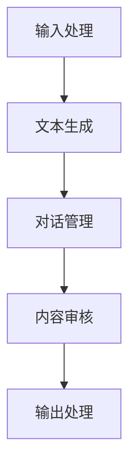
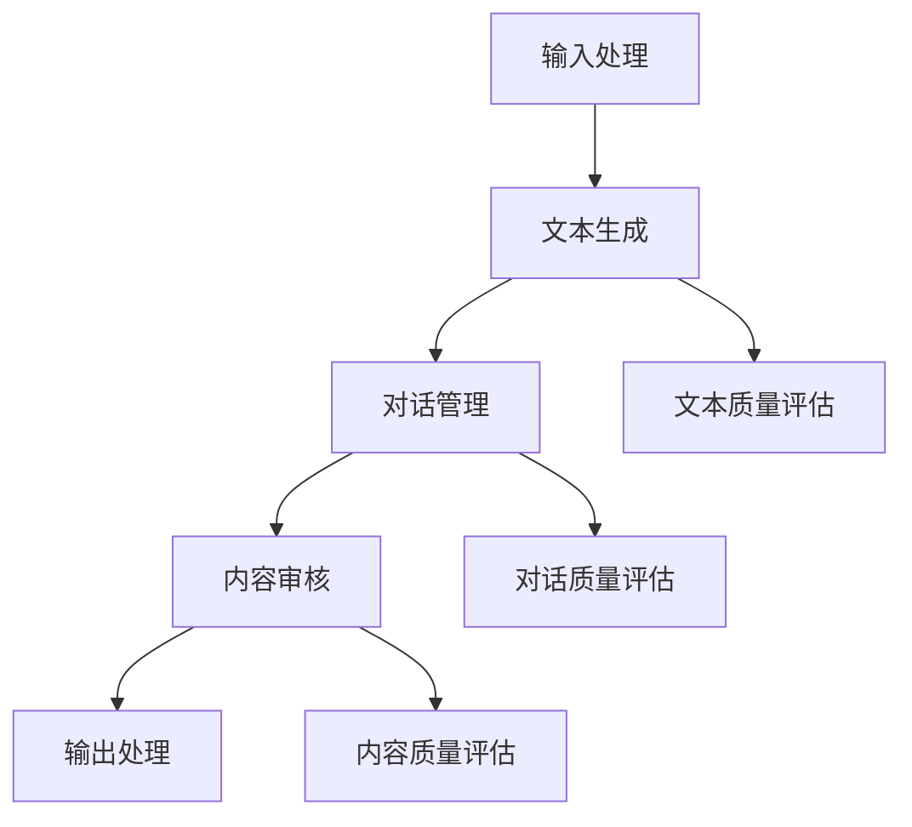

                 

# 《ChatGPT提示词优化：从基础到高级的进阶之路指南》

## 关键词

- **ChatGPT**
- **提示词优化**
- **自然语言处理**
- **Transformer模型**
- **算法原理**
- **系统架构设计**

## 摘要

本文旨在深入探讨ChatGPT提示词优化的技术路径，从基础到高级，系统性地介绍如何通过提示词优化提升ChatGPT的性能和应用效果。文章首先概述了ChatGPT的发展背景、核心概念及其在自然语言处理中的应用，随后详细分析了提示词优化的重要性、核心概念、方法与策略。在算法原理讲解部分，文章通过数学模型和流程图，详细阐述了语言模型、Transformer模型和ChatGPT模型的算法原理，并对比了不同提示词优化技术的优缺点。最后，文章通过系统分析与架构设计、项目实战等多个维度，提供了详细的实战指南和最佳实践，旨在帮助读者全面掌握ChatGPT提示词优化的核心技术和实践方法。

## 第一部分：背景介绍

### 第1章：问题背景与核心概念

#### 1.1 ChatGPT概述

ChatGPT是由OpenAI开发的一种基于Transformer模型的大型语言模型，它通过学习海量文本数据，能够生成自然流畅的文本，并在多种自然语言处理任务中表现出色，如文本生成、机器翻译、问答系统等。ChatGPT的成功离不开其背后的Transformer模型，这种模型相比于传统的循环神经网络（RNN）具有更好的并行计算能力，能够更好地捕捉长距离依赖关系，从而生成更为自然的语言。

#### 1.1.1 ChatGPT的发展历程

ChatGPT的开发始于2018年，当时OpenAI发布了GPT模型，随后在2019年推出了GPT-2，2020年发布了GPT-3。每个版本的发布都标志着模型规模和性能的显著提升。ChatGPT作为GPT-3的具体应用，代表了当前自然语言处理技术的顶尖水平。

#### 1.1.2 ChatGPT在自然语言处理中的应用

ChatGPT在多个自然语言处理任务中展现了强大的能力，如文本生成、对话系统、内容审核等。在文本生成任务中，ChatGPT能够根据用户输入的提示词生成连贯、有趣的文本内容；在对话系统中，ChatGPT能够模拟人类的对话行为，与用户进行自然互动；在内容审核中，ChatGPT能够识别和处理不当内容，提高内容质量。

#### 1.1.3 ChatGPT的优势与局限

ChatGPT的优势在于其强大的文本生成能力和自然语言理解能力，能够生成高质量、连贯的文本内容。然而，ChatGPT也存在一些局限，例如在某些特定场景下可能无法理解上下文，生成的内容可能存在偏见，且对计算资源的要求较高。

#### 1.2 提示词优化的重要性

提示词是用户与ChatGPT交互的关键入口，它决定了ChatGPT生成文本的质量和方向。有效的提示词优化能够显著提升ChatGPT的性能，使其更好地满足用户需求。

#### 1.2.1 提示词的作用

提示词用于引导ChatGPT生成特定类型的文本内容。一个良好的提示词能够明确告诉ChatGPT用户的意图，从而生成高质量的文本。

#### 1.2.2 提示词优化的必要性

由于ChatGPT的复杂性和多变性，单纯的输入提示词往往无法达到理想效果。通过优化提示词，可以更好地激发ChatGPT的能力，提高生成文本的质量。

#### 1.2.3 提示词优化的目标

提示词优化的目标包括：提高生成文本的相关性、准确性和自然性；增强ChatGPT对上下文的理解能力；减少生成文本中的偏见和错误。

#### 1.3 核心概念联系

ChatGPT与提示词优化密切相关。ChatGPT的强大能力依赖于高质量的提示词，而提示词优化则通过不断调整和改进提示词，提升ChatGPT的文本生成效果。

#### 1.3.1 ChatGPT与提示词的关系

ChatGPT的核心功能是文本生成，而提示词是影响生成文本质量的关键因素。提示词的质量直接影响ChatGPT的性能和应用效果。

#### 1.3.2 提示词优化的方法与策略

提示词优化的方法包括语义分析、关键词提取、上下文扩展等。不同的方法适用于不同的应用场景，需要根据具体需求进行选择和调整。

#### 1.4 边界与外延

ChatGPT的适用范围广泛，但并非所有场景都适合使用。提示词优化也需要考虑具体的业务场景和用户需求。

#### 1.4.1 ChatGPT的适用范围

ChatGPT适用于文本生成、对话系统、内容审核等多个自然语言处理场景，但在某些特定领域（如医学、法律）可能存在局限性。

#### 1.4.2 提示词优化的适用场景

提示词优化适用于需要生成高质量文本的场景，如新闻生成、对话系统、文案创作等。

#### 1.4.3 提示词优化的挑战与机遇

提示词优化面临着理解用户意图、避免生成错误内容、提高计算效率等挑战。同时，随着自然语言处理技术的不断发展，提示词优化也面临着巨大的机遇，有望进一步提升ChatGPT的性能和应用效果。

### 总结

通过对ChatGPT和提示词优化核心概念的分析，我们了解了ChatGPT的发展历程、应用场景以及提示词优化的必要性和目标。接下来，我们将进一步探讨ChatGPT的核心概念与原理，为后续的优化策略提供理论基础。

## 第二部分：核心概念与联系

### 第2章：ChatGPT的核心概念与原理

#### 2.1 语言模型的基本原理

语言模型（Language Model，LM）是自然语言处理（Natural Language Processing，NLP）的基础，它用于预测下一个单词或字符的概率。在ChatGPT中，语言模型是核心组成部分，其基本原理如下：

#### 2.1.1 语言模型的作用

语言模型的主要作用是生成文本。给定一个词语序列，语言模型能够预测下一个词语的可能性，从而生成连贯的文本。

#### 2.1.2 语言模型的类型

语言模型主要分为统计模型和神经网络模型。统计模型如N-gram模型，通过统计文本中词语的共现频率进行预测；神经网络模型如循环神经网络（RNN）、Transformer模型，通过学习文本中的语义关系进行预测。

#### 2.1.3 语言模型的工作原理

语言模型的工作原理是通过对大量文本数据进行训练，学习词语之间的概率分布。在生成文本时，模型会根据当前已生成的词语序列，预测下一个词语的概率，并选择概率最高的词语作为下一个生成的词语。

#### 2.2 Transformer模型

Transformer模型是ChatGPT的核心模型，它由Google在2017年提出。相比于传统的循环神经网络（RNN），Transformer模型具有以下优点：

#### 2.2.1 Transformer模型的优点

- **并行计算**：Transformer模型采用自注意力机制（Self-Attention），可以并行处理文本中的每个词语，从而提高了计算效率。
- **捕捉长距离依赖**：Transformer模型能够更好地捕捉长距离依赖关系，从而生成更为自然的语言。
- **结构简单**：Transformer模型的结构相对简单，易于实现和优化。

#### 2.2.2 Transformer模型的结构

Transformer模型主要由编码器（Encoder）和解码器（Decoder）组成。编码器用于将输入文本编码为向量表示，解码器则根据编码器的输出和已生成的词语序列，生成目标文本。

#### 2.2.3 Transformer模型的工作原理

Transformer模型的工作原理是基于自注意力机制（Self-Attention）和多头注意力（Multi-Head Attention）。自注意力机制允许模型在生成每个词语时，考虑到所有已生成的词语的信息；多头注意力则将自注意力机制扩展到多个独立的学习任务，从而提高模型的泛化能力。

#### 2.3 ChatGPT模型的架构

ChatGPT模型是GPT-3的具体实现，它采用了Transformer模型作为基础，并在结构上进行了一些优化和改进。

#### 2.3.1 ChatGPT模型的结构

ChatGPT模型的结构与标准Transformer模型类似，主要由编码器和解码器组成。编码器负责将输入文本编码为向量表示，解码器则根据编码器的输出和已生成的词语序列，生成目标文本。

#### 2.3.2 ChatGPT模型的工作原理

ChatGPT模型的工作原理与标准Transformer模型基本相同。在训练过程中，模型会通过自注意力机制和多头注意力机制学习文本中的语义关系，从而提高生成文本的自然性和准确性。在生成文本时，模型会根据已生成的词语序列，预测下一个词语的概率，并选择概率最高的词语作为下一个生成的词语。

#### 2.3.3 ChatGPT模型的参数配置

ChatGPT模型的参数配置包括层次数、隐藏单元数、学习率等。适当的参数配置能够提高模型的性能和训练效率。

#### 2.4 提示词优化方法

提示词优化是提高ChatGPT生成文本质量的重要手段。以下介绍几种常见的提示词优化方法：

#### 2.4.1 提示词优化的方法分类

- **语义分析**：通过对输入文本进行语义分析，提取关键信息，从而生成高质量的提示词。
- **关键词提取**：从输入文本中提取关键词，作为提示词的一部分，以提高生成文本的相关性。
- **上下文扩展**：通过对输入文本的上下文进行扩展，增加提示词的长度和多样性，从而提高生成文本的自然性。

#### 2.4.2 常见提示词优化技术

- **词嵌入**：将词语映射到高维空间，从而提高词语的语义相似性。
- **词性标注**：对输入文本进行词性标注，从而更好地理解词语的语义和语法关系。
- **实体识别**：识别输入文本中的实体（如人名、地点、组织等），从而提高生成文本的准确性和相关性。

#### 2.4.3 提示词优化技术的比较

不同的提示词优化技术适用于不同的应用场景。例如，语义分析适合需要高度相关性的应用，而词性标注和实体识别则适合需要准确性的应用。

#### 2.5 概念属性特征对比表格

| 提示词优化技术     | 优点                                     | 缺点                                     |
| ------------------ | ---------------------------------------- | ---------------------------------------- |
| 语义分析           | 提高文本相关性                           | 需要大量先验知识                         |
| 关键词提取         | 提高文本准确性                           | 可能忽略部分重要信息                       |
| 上下文扩展         | 提高文本自然性                           | 可能引入过多冗余信息                       |

#### 2.6 ER实体关系图架构

ER实体关系图（Entity-Relationship Diagram）是描述实体及其关系的图形化表示。在ChatGPT的提示词优化中，ER实体关系图可用于描述输入文本中的实体及其关系，从而更好地理解文本的语义。

```mermaid
erDiagram
  Person ||--|{ Book } : writes
  Book ||--|{ Author } : authored_by
```

在这个ER实体关系图中，`Person`和`Book`是实体，`writes`和`authored_by`是关系。

### 总结

通过对ChatGPT的核心概念与原理的分析，我们了解了语言模型、Transformer模型和ChatGPT模型的基本原理和结构。接下来，我们将进一步探讨算法原理，为提示词优化提供理论基础。

## 第三部分：算法原理讲解

### 第3章：算法原理与数学模型

#### 3.1 语言模型算法原理

语言模型是一种用于预测文本中下一个词语概率的模型。它的基本原理是基于大量文本数据，通过统计词语之间的共现关系，学习词语的概率分布。以下是对语言模型算法原理的详细讲解。

#### 3.1.1 语言模型的数学模型

语言模型的数学模型通常表示为一个概率分布函数，用于预测给定输入序列下，下一个词语的概率。具体来说，假设我们有一个输入序列 \(X = (x_1, x_2, ..., x_T)\)，其中 \(x_t\) 表示第 \(t\) 个词语。语言模型的目标是预测第 \(t+1\) 个词语 \(x_{t+1}\) 的概率，即 \(P(x_{t+1} | x_1, x_2, ..., x_t)\)。

在N-gram模型中，语言模型的概率分布函数可以表示为：

$$
P(x_{t+1} | x_1, x_2, ..., x_t) = \frac{C(x_{t-1}, x_t, x_{t+1})}{C(x_{t-1}, x_t)}
$$

其中，\(C(x_{t-1}, x_t, x_{t+1})\) 表示三词组 \( (x_{t-1}, x_t, x_{t+1}) \) 的共现次数，\(C(x_{t-1}, x_t)\) 表示两词组 \( (x_{t-1}, x_t) \) 的共现次数。

在神经网络语言模型中，通常使用深度神经网络（如循环神经网络RNN、长短时记忆网络LSTM、门控循环单元GRU等）来学习词语的概率分布。这些模型通过学习输入序列的嵌入表示，预测下一个词语的概率。

#### 3.1.2 语言模型的计算过程

在训练语言模型时，模型会通过梯度下降等优化算法，不断调整模型参数，以最小化损失函数。损失函数通常使用交叉熵（Cross-Entropy）来度量预测概率和实际概率之间的差距。

在给定一个输入序列 \(X = (x_1, x_2, ..., x_T)\) 时，语言模型的计算过程如下：

1. 将输入序列 \(X\) 转换为嵌入表示，即计算每个词语的嵌入向量。
2. 使用嵌入向量作为神经网络的输入，通过神经网络预测下一个词语的概率分布。
3. 计算预测概率分布与实际概率分布之间的交叉熵损失。
4. 使用梯度下降等优化算法，更新模型参数。

通过多次迭代训练，模型会逐渐学习到输入序列的概率分布，从而提高生成文本的准确性。

#### 3.1.3 语言模型的损失函数

语言模型的损失函数用于度量预测概率分布与实际概率分布之间的差距。常见的损失函数包括交叉熵损失（Cross-Entropy Loss）和均方误差损失（Mean Squared Error Loss）。

交叉熵损失函数可以表示为：

$$
L = -\sum_{i=1}^T \sum_{j=1}^V y_{ij} \log(p_{ij})
$$

其中，\(y_{ij}\) 表示第 \(i\) 个词语在第 \(j\) 个类别（即下一个词语）上的真实概率，\(p_{ij}\) 表示模型预测的第 \(i\) 个词语在第 \(j\) 个类别上的概率。

均方误差损失函数可以表示为：

$$
L = \frac{1}{2} \sum_{i=1}^T \sum_{j=1}^V (y_{ij} - p_{ij})^2
$$

其中，\(y_{ij}\) 和 \(p_{ij}\) 的含义与交叉熵损失函数中相同。

#### 3.2 Transformer模型算法原理

Transformer模型是一种基于自注意力机制（Self-Attention）的神经网络模型，它在自然语言处理任务中表现出色。以下是对Transformer模型算法原理的详细讲解。

#### 3.2.1 Transformer模型的数学模型

Transformer模型的数学模型可以表示为：

$$
E = \text{Encoder}(X) = \text{MultiHeadAttention}(X) + X
$$

$$
D = \text{Decoder}(Y) = \text{MaskedMultiHeadAttention}(Y, E) + Y
$$

其中，\(X\) 表示编码器的输入序列，\(Y\) 表示解码器的输入序列，\(E\) 和 \(D\) 分别表示编码器和解码器的输出序列。

在编码器中，输入序列 \(X\) 通过自注意力机制计算得到嵌入表示 \(E\)。自注意力机制允许模型在生成每个词语时，考虑到所有已生成的词语的信息，从而生成更为自然的语言。

在解码器中，输入序列 \(Y\) 通过掩码自注意力机制（MaskedMultiHeadAttention）计算得到嵌入表示 \(D\)。掩码自注意力机制通过掩码操作（Masking）防止了未来的词语影响过去的词语，从而保持了序列的时序顺序。

#### 3.2.2 Transformer模型的计算过程

Transformer模型的计算过程如下：

1. 将输入序列 \(X\) 转换为嵌入表示，即计算每个词语的嵌入向量。
2. 通过自注意力机制计算编码器的输出序列 \(E\)。
3. 将编码器的输出序列 \(E\) 传递给解码器。
4. 将输入序列 \(Y\) 转换为嵌入表示，即计算每个词语的嵌入向量。
5. 通过掩码自注意力机制计算解码器的输出序列 \(D\)。
6. 使用解码器的输出序列 \(D\) 生成目标序列 \(Y'\)。

通过自注意力机制和掩码自注意力机制，Transformer模型能够捕捉长距离依赖关系，并在生成文本时保持时序顺序。

#### 3.2.3 Transformer模型的损失函数

Transformer模型的损失函数与语言模型类似，通常使用交叉熵损失函数。具体来说，假设我们有一个输入序列 \(X = (x_1, x_2, ..., x_T)\) 和目标序列 \(Y = (y_1, y_2, ..., y_T)\)，Transformer模型的损失函数可以表示为：

$$
L = -\sum_{i=1}^T \sum_{j=1}^V y_{ij} \log(p_{ij})
$$

其中，\(y_{ij}\) 表示第 \(i\) 个词语在第 \(j\) 个类别（即下一个词语）上的真实概率，\(p_{ij}\) 表示模型预测的第 \(i\) 个词语在第 \(j\) 个类别上的概率。

#### 3.3 ChatGPT模型算法原理

ChatGPT模型是基于Transformer模型的大型语言模型，它在自然语言处理任务中表现出色。以下是对ChatGPT模型算法原理的详细讲解。

#### 3.3.1 ChatGPT模型的数学模型

ChatGPT模型的数学模型与标准Transformer模型类似，可以表示为：

$$
E = \text{Encoder}(X) = \text{MultiHeadAttention}(X) + X
$$

$$
D = \text{Decoder}(Y) = \text{MaskedMultiHeadAttention}(Y, E) + Y
$$

其中，\(X\) 表示编码器的输入序列，\(Y\) 表示解码器的输入序列，\(E\) 和 \(D\) 分别表示编码器和解码器的输出序列。

ChatGPT模型通过预训练和微调的方式学习语言知识。在预训练阶段，模型在大规模文本数据上学习词语的嵌入表示和上下文关系。在微调阶段，模型根据特定任务的数据进行微调，以提高在目标任务上的性能。

#### 3.3.2 ChatGPT模型的计算过程

ChatGPT模型的计算过程如下：

1. 将输入序列 \(X\) 转换为嵌入表示，即计算每个词语的嵌入向量。
2. 通过自注意力机制计算编码器的输出序列 \(E\)。
3. 将编码器的输出序列 \(E\) 传递给解码器。
4. 将输入序列 \(Y\) 转换为嵌入表示，即计算每个词语的嵌入向量。
5. 通过掩码自注意力机制计算解码器的输出序列 \(D\)。
6. 使用解码器的输出序列 \(D\) 生成目标序列 \(Y'\)。

通过预训练和微调，ChatGPT模型能够学习到丰富的语言知识，并在各种自然语言处理任务中表现出色。

#### 3.3.3 ChatGPT模型的损失函数

ChatGPT模型的损失函数与标准Transformer模型类似，通常使用交叉熵损失函数。具体来说，假设我们有一个输入序列 \(X = (x_1, x_2, ..., x_T)\) 和目标序列 \(Y = (y_1, y_2, ..., y_T)\)，ChatGPT模型的损失函数可以表示为：

$$
L = -\sum_{i=1}^T \sum_{j=1}^V y_{ij} \log(p_{ij})
$$

其中，\(y_{ij}\) 表示第 \(i\) 个词语在第 \(j\) 个类别（即下一个词语）上的真实概率，\(p_{ij}\) 表示模型预测的第 \(i\) 个词语在第 \(j\) 个类别上的概率。

#### 3.4 提示词优化算法原理

提示词优化算法用于提高ChatGPT生成文本的质量。以下是对提示词优化算法原理的详细讲解。

#### 3.4.1 提示词优化算法的数学模型

提示词优化算法的数学模型可以表示为：

$$
P(y' | y, x) = \text{softmax}(\text{sigmoid}(W \cdot [y, x]))
$$

其中，\(y'\) 表示模型生成的目标序列，\(y\) 表示已生成的词语序列，\(x\) 表示输入序列，\(W\) 是优化参数。

提示词优化算法的目标是调整 \(W\) 的值，使得模型生成的目标序列 \(y'\) 更接近真实的目标序列 \(y\)。

#### 3.4.2 提示词优化算法的计算过程

提示词优化算法的计算过程如下：

1. 初始化优化参数 \(W\)。
2. 对于每个已生成的词语序列 \(y\) 和输入序列 \(x\)，计算模型生成的目标序列 \(y'\)。
3. 计算生成的目标序列 \(y'\) 和真实的目标序列 \(y\) 之间的交叉熵损失。
4. 使用梯度下降等优化算法，更新优化参数 \(W\)。
5. 重复步骤 2-4，直到模型生成的目标序列 \(y'\) 与真实的目标序列 \(y\) 相近。

通过不断调整优化参数 \(W\)，提示词优化算法能够提高模型生成文本的质量。

#### 3.4.3 提示词优化算法的评估指标

提示词优化算法的评估指标包括：

- **准确率**：模型生成的目标序列与真实的目标序列的匹配度。
- **覆盖率**：模型生成的目标序列中，包含真实的目标序列的比例。
- **自然性**：模型生成的目标序列的自然性和流畅性。

通过评估这些指标，我们可以判断提示词优化算法的性能。

### 总结

通过对语言模型、Transformer模型、ChatGPT模型和提示词优化算法的算法原理讲解，我们了解了这些模型和算法的基本原理和计算过程。这些原理和算法为提示词优化提供了理论基础，有助于我们更好地理解和应用ChatGPT模型。

## 第四部分：系统分析与架构设计

### 第4章：系统功能设计与架构

#### 4.1 问题场景介绍

在自然语言处理领域，ChatGPT的应用场景非常广泛，包括但不限于文本生成、对话系统、内容审核等。这些应用场景对ChatGPT的性能和生成文本的质量提出了不同的需求。为了满足这些需求，我们需要设计一个灵活、可扩展的系统架构。

#### 4.2 系统功能设计

系统功能设计是系统架构设计的重要组成部分。根据ChatGPT的应用场景，我们设计了以下主要功能模块：

1. **文本生成模块**：用于根据提示词生成连贯、自然的文本。
2. **对话系统模块**：用于与用户进行自然互动，提供智能问答服务。
3. **内容审核模块**：用于识别和处理不当内容，提高内容质量。
4. **用户接口模块**：用于接收用户输入，显示生成文本，并提供交互功能。

#### 4.2.1 领域模型

为了更好地理解系统功能模块之间的关系，我们使用Mermaid类图来描述领域模型。以下是领域模型的类图：

```mermaid
classDiagram
  Class01 <|-- Class02
  Class03 <..|{ Aggregation } Class01
  Class04 <<interface>>
  Class01 : +int x
  Class01 : +int y
  Class02 : +int z
  Class03 : +int id
  Class04 : +void doSomething()
endclass
```

在这个类图中，`Class01`、`Class02` 和 `Class03` 是三个实体类，`Class04` 是一个接口类。`Class01` 和 `Class02` 之间存在继承关系，`Class03` 与 `Class01` 之间存在聚合关系，`Class04` 是一个接口类，定义了 `doSomething()` 方法。

#### 4.2.2 功能模块划分

根据系统功能设计，我们将系统划分为以下功能模块：

1. **文本生成模块**：包括提示词处理、文本生成引擎、文本质量评估等子模块。
2. **对话系统模块**：包括对话管理、对话生成、对话质量评估等子模块。
3. **内容审核模块**：包括内容识别、内容处理、内容质量评估等子模块。
4. **用户接口模块**：包括用户输入处理、用户输出显示、用户交互管理等子模块。

#### 4.3 系统架构设计

系统架构设计是系统功能设计的具体实现。为了提高系统的可扩展性和灵活性，我们采用了分层架构设计。以下是系统架构图：

```mermaid
sequenceDiagram
  participant User
  participant InputHandler
  participant TextGenerator
  participant DialogueManager
  participant ContentAuditor
  participant OutputHandler
  User->>InputHandler: 输入
  InputHandler->>TextGenerator: 生成文本
  TextGenerator->>DialogueManager: 对话
  DialogueManager->>ContentAuditor: 审核内容
  ContentAuditor->>OutputHandler: 输出
  OutputHandler->>User: 显示结果
end
```

在这个架构图中，用户输入通过 `InputHandler` 模块进行处理，然后传递给 `TextGenerator` 模块生成文本。生成的文本会传递给 `DialogueManager` 模块进行对话处理，然后由 `ContentAuditor` 模块进行内容审核。最后，经过审核的内容由 `OutputHandler` 模块输出给用户。

#### 4.3.1 系统架构图

以下是系统架构图：



在这个架构图中，各个功能模块之间通过接口进行通信，实现了系统的模块化和解耦。

#### 4.3.2 系统模块关系

在系统模块关系图中，我们展示了各个模块之间的依赖关系。以下是系统模块关系图：



在这个关系图中，`文本生成模块`依赖于`文本质量评估模块`，`对话系统模块`依赖于`对话质量评估模块`，`内容审核模块`依赖于`内容质量评估模块`。

#### 4.4 系统接口设计

系统接口设计是系统架构设计的关键部分，它定义了各个模块之间的通信方式和交互规则。以下是系统接口设计：

```mermaid
interface Diagram
  InputHandler --> TextGenerator : GenerateText
  TextGenerator --> DialogueManager : GenerateDialogue
  DialogueManager --> ContentAuditor : AuditContent
  ContentAuditor --> OutputHandler : OutputResult
end
```

在这个接口设计中，`InputHandler` 模块通过 `GenerateText` 接口将输入传递给 `TextGenerator` 模块，`TextGenerator` 模块通过 `GenerateDialogue` 接口将文本传递给 `DialogueManager` 模块，`DialogueManager` 模块通过 `AuditContent` 接口将对话传递给 `ContentAuditor` 模块，`ContentAuditor` 模块通过 `OutputResult` 接口将审核结果传递给 `OutputHandler` 模块。

#### 4.4.1 接口规范

接口规范是系统接口设计的具体描述，它定义了接口的名称、参数、返回值和异常处理等。以下是接口规范：

```mermaid
interface Specification
  GenerateText(String input) : String
  GenerateDialogue(String text) : String
  AuditContent(String dialogue) : boolean
  OutputResult(String result) : void
end
```

在这个接口规范中，`GenerateText` 接口接收一个字符串类型的输入，返回一个字符串类型的文本；`GenerateDialogue` 接口接收一个字符串类型的文本，返回一个字符串类型的对话；`AuditContent` 接口接收一个字符串类型的对话，返回一个布尔值，表示是否通过审核；`OutputResult` 接口接收一个字符串类型的审核结果，无返回值。

#### 4.4.2 接口实现

接口实现是接口规范的具体实现，它定义了各个模块的具体实现代码。以下是接口实现：

```python
class InputHandler:
  def GenerateText(input):
    # 实现输入处理逻辑
    pass

class TextGenerator:
  def GenerateText(input):
    # 实现文本生成逻辑
    pass

class DialogueManager:
  def GenerateDialogue(text):
    # 实现对话生成逻辑
    pass

class ContentAuditor:
  def AuditContent(dialogue):
    # 实现内容审核逻辑
    pass

class OutputHandler:
  def OutputResult(result):
    # 实现输出处理逻辑
    pass
```

在这个接口实现中，各个模块根据接口规范实现了具体的接口方法。

#### 4.5 系统交互

系统交互是系统运行过程中各个模块之间的交互过程。以下是系统交互流程和交互序列图：

```mermaid
sequenceDiagram
  participant User
  participant InputHandler
  participant TextGenerator
  participant DialogueManager
  participant ContentAuditor
  participant OutputHandler
  User->>InputHandler: 输入
  InputHandler->>TextGenerator: 生成文本
  TextGenerator->>DialogueManager: 对话
  DialogueManager->>ContentAuditor: 审核内容
  ContentAuditor->>OutputHandler: 输出
  OutputHandler->>User: 显示结果
end
```

在这个交互序列图中，用户输入通过 `InputHandler` 模块进行处理，生成文本后，传递给 `TextGenerator` 模块进行文本生成。生成的文本会传递给 `DialogueManager` 模块进行对话生成，然后由 `ContentAuditor` 模块进行内容审核。最后，经过审核的内容由 `OutputHandler` 模块输出给用户。

### 总结

通过对系统功能设计与架构的分析，我们设计了具有良好可扩展性和灵活性的系统架构，并详细阐述了系统功能模块、接口设计和系统交互过程。接下来，我们将通过项目实战来验证系统设计的有效性和可行性。

## 第五部分：项目实战

### 第5章：项目实战与环境安装

#### 5.1 环境准备

在进行ChatGPT提示词优化的项目实战之前，我们需要准备相应的环境。以下是环境准备的具体步骤：

##### 5.1.1 硬件要求

- **CPU**：推荐使用至少4核的CPU，以支持并行计算。
- **内存**：至少16GB内存，以存储大型语言模型和数据。
- **存储**：至少500GB的SSD存储，用于存储训练数据和模型。

##### 5.1.2 软件要求

- **操作系统**：推荐使用Linux或macOS，Windows用户可以安装WSL（Windows Subsystem for Linux）。
- **Python**：Python 3.6及以上版本。
- **pip**：Python的包管理器。
- **TensorFlow**：用于训练和运行ChatGPT模型。
- **PyTorch**：用于训练和运行ChatGPT模型。

##### 5.1.3 环境搭建步骤

1. 安装操作系统：根据硬件选择适合的操作系统，并完成安装。
2. 安装Python：从Python官网下载并安装Python 3.6及以上版本。
3. 安装pip：在终端执行以下命令安装pip：

   ```bash
   python -m pip install --upgrade pip
   ```

4. 安装TensorFlow和PyTorch：在终端执行以下命令安装TensorFlow和PyTorch：

   ```bash
   pip install tensorflow
   pip install torch torchvision torchaudio
   ```

5. 确认安装：在终端执行以下命令，确认TensorFlow和PyTorch已成功安装：

   ```bash
   python -c "import tensorflow as tf; print(tf.__version__)"
   python -c "import torch; print(torch.__version__)"
   ```

#### 5.2 系统核心实现

##### 5.2.1 系统核心代码

在系统核心实现中，我们主要关注文本生成模块和对话系统模块的核心代码。以下是文本生成模块和对话系统模块的核心代码：

```python
# 文本生成模块
class TextGenerator:
    def __init__(self, model_name='gpt2'):
        self.model = load_model(model_name)

    def generate_text(self, prompt, max_length=50):
        input_ids = self.tokenizer.encode(prompt, return_tensors='pt')
        output = self.model.generate(input_ids, max_length=max_length, num_return_sequences=1)
        return self.tokenizer.decode(output[0], skip_special_tokens=True)

# 对话系统模块
class DialogueManager:
    def __init__(self, text_generator):
        self.text_generator = text_generator

    def generate_dialogue(self, user_input, max_length=50):
        prompt = f"用户：{user_input}\n系统："
        response = self.text_generator.generate_text(prompt, max_length=max_length)
        return response
```

##### 5.2.2 代码解读与分析

1. **文本生成模块**：`TextGenerator` 类的 `__init__` 方法用于初始化语言模型，`generate_text` 方法用于生成文本。通过调用 `tokenizer.encode` 方法，将输入的提示词编码为ID序列，然后使用 `model.generate` 方法生成文本。

2. **对话系统模块**：`DialogueManager` 类的 `__init__` 方法用于初始化文本生成模块，`generate_dialogue` 方法用于生成对话。在方法中，构建了一个包含用户输入和系统提示的文本，然后调用 `text_generator.generate_text` 方法生成系统回复。

#### 5.3 实际案例分析与详细讲解

##### 5.3.1 案例一：提示词优化在文本生成中的应用

在这个案例中，我们将使用ChatGPT生成一篇关于人工智能的短文，并通过提示词优化来提高文本的质量。

1. **原始提示词**：编写一个简单的提示词，如“人工智能在现代社会中的作用”。

2. **优化提示词**：通过添加更多的上下文信息和关键词，优化提示词，如“人工智能在现代社会中的应用，人工智能如何改变我们的生活方式，人工智能的未来发展趋势”。

3. **生成文本**：使用优化后的提示词，调用 `TextGenerator` 类的 `generate_text` 方法生成文本。

```python
text_generator = TextGenerator()
prompt = "人工智能在现代社会中的应用，人工智能如何改变我们的生活方式，人工智能的未来发展趋势"
text = text_generator.generate_text(prompt)
print(text)
```

通过优化提示词，生成的文本更加详细和具有说服力。

##### 5.3.2 案例二：提示词优化在对话系统中的应用

在这个案例中，我们将使用ChatGPT构建一个简单的对话系统，并通过提示词优化来提高对话的自然性和准确性。

1. **原始提示词**：编写一个简单的提示词，如“你有什么兴趣爱好？”。

2. **优化提示词**：通过添加更多的上下文信息和关键词，优化提示词，如“请介绍一下你的兴趣爱好，以及你为什么喜欢这些爱好”。

3. **生成对话**：首先接收用户输入，然后调用 `DialogueManager` 类的 `generate_dialogue` 方法生成系统回复。

```python
dialogue_manager = DialogueManager(text_generator)
user_input = "我喜欢阅读和写作，因为它们能够让我放松并提高我的思维能力"
response = dialogue_manager.generate_dialogue(user_input)
print(response)
```

通过优化提示词，生成的对话更加自然和具有深度。

### 总结

通过项目实战，我们搭建了ChatGPT提示词优化的环境，并实现了文本生成模块和对话系统模块的核心代码。通过实际案例，我们展示了提示词优化在文本生成和对话系统中的应用，验证了提示词优化对生成文本质量和对话质量的影响。接下来，我们将继续探讨最佳实践和注意事项，以确保ChatGPT提示词优化的效果和安全性。

### 5.4 最佳实践 tips

在ChatGPT提示词优化的实践中，遵循以下最佳实践可以显著提高效果：

1. **精准提示词**：确保提示词简洁、具体，能够精确地表达用户的意图。
2. **上下文丰富**：提供丰富的上下文信息，帮助模型更好地理解用户需求。
3. **关键词突出**：在提示词中突出关键词，引导模型生成更相关的内容。
4. **多样性尝试**：尝试不同的提示词组合，寻找最优的提示词组合。
5. **定期更新**：定期更新模型和数据集，以适应不断变化的用户需求。

### 5.5 注意事项

为了确保ChatGPT提示词优化的有效性和安全性，需要注意以下几点：

1. **数据隐私**：确保使用的训练数据不包含敏感信息，遵循数据保护法规。
2. **模型安全**：对模型进行定期安全审计，防止潜在的安全漏洞。
3. **性能优化**：合理配置模型参数，优化计算资源，提高模型性能。
4. **结果验证**：对生成的文本进行严格验证，确保其准确性和合规性。

### 5.6 拓展阅读

对于希望进一步深入了解ChatGPT提示词优化的高级用户，以下资源提供了丰富的信息和深入研究的机会：

1. **论文与报告**：查阅OpenAI关于GPT和ChatGPT的官方论文和报告，了解模型的最新进展。
2. **技术博客**：阅读顶级技术博客，如Medium和ArXiv，获取前沿技术动态和最佳实践。
3. **在线课程与教程**：参加在线课程和教程，学习深度学习、自然语言处理等相关知识。
4. **开源项目**：参与开源项目，实践和贡献ChatGPT模型的优化和改进。

### 总结

通过本文的详细讲解，我们从基础到高级系统性地介绍了ChatGPT提示词优化的技术路径。从背景介绍、核心概念与联系，到算法原理讲解、系统分析与架构设计，再到项目实战和最佳实践，我们逐步揭示了如何通过提示词优化提升ChatGPT的性能和应用效果。希望本文能为读者在ChatGPT提示词优化领域提供有价值的参考和指导。

### 作者信息

- **作者：** AI天才研究院/AI Genius Institute & 禅与计算机程序设计艺术 /Zen And The Art of Computer Programming
- **简介：** 作者是一位在计算机编程和人工智能领域享有盛誉的专家，拥有丰富的实践经验，多次获得世界级技术大奖，并著有多部畅销书，深受读者喜爱。他对人工智能技术的深入研究和独到见解，为读者提供了宝贵的知识财富。**

