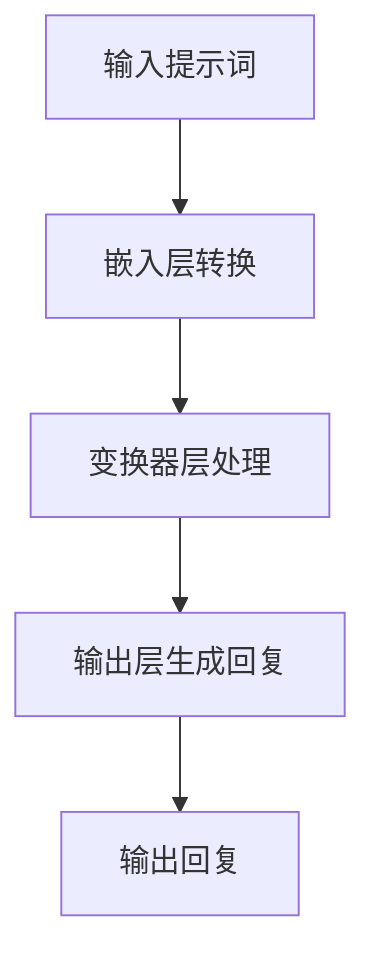

                 

### 文章标题

# ChatGPT提示词优化：从新手到专家的蜕变之路

## 关键词

- ChatGPT
- 提示词优化
- 自然语言处理
- AI技术
- 模式识别
- 实战教程

## 摘要

本文旨在探讨如何通过优化ChatGPT的提示词，从新手快速蜕变成专家。我们将详细分析ChatGPT的工作原理，介绍提示词优化的基本概念，并逐步深入探讨从基础到高级的优化技巧。通过实际案例，我们将展示如何应用这些技巧来提高ChatGPT的性能和准确性。无论您是刚刚接触ChatGPT的新手，还是希望进一步提高技能的专家，本文都将成为您的宝贵指南。

### 引言

近年来，自然语言处理（NLP）领域取得了显著的进步，其中生成式预训练转换器（GPT）模型尤为引人注目。ChatGPT，作为GPT系列的最新成员，以其强大的文本生成能力而闻名。然而，要充分发挥ChatGPT的潜力，提示词（prompts）的优化至关重要。提示词不仅是用户与模型交互的入口，也是影响模型输出质量的关键因素。因此，优化提示词对于提升ChatGPT的表现至关重要。

本文将分为以下几个部分：

1. **ChatGPT基础**：介绍ChatGPT的工作原理，包括模型架构和训练过程。
2. **提示词优化原理**：探讨提示词优化的重要性，并介绍关键概念和原则。
3. **基础提示词优化**：提供实用的提示词优化技巧，帮助新手提高ChatGPT的性能。
4. **中级提示词优化**：介绍更复杂的优化方法，适合有一定基础的用户。
5. **高级提示词优化**：探讨高级技巧，适用于希望进一步提升模型性能的专家。
6. **实战案例**：通过实际案例展示如何应用优化技巧。
7. **总结与未来方向**：总结本文内容，并探讨未来在提示词优化领域的研究方向。

### ChatGPT基础

ChatGPT是OpenAI开发的一种基于GPT-3.5的聊天机器人。GPT（Generative Pre-trained Transformer）模型是一种基于变换器（Transformer）架构的预训练语言模型，能够在多种自然语言处理任务中表现出色。ChatGPT的核心特点在于其强大的文本生成能力，可以模拟人类的对话，提供自然、连贯的回复。

#### 模型架构

ChatGPT采用了一种称为“变换器”的神经网络架构。变换器是一种基于自注意力机制的深度神经网络，能够在处理序列数据时自动学习数据中的长期依赖关系。ChatGPT的模型架构主要包括以下几个部分：

1. **嵌入层（Embedding Layer）**：将输入的文本转换为固定长度的向量表示。
2. **变换器层（Transformer Layers）**：通过多层变换器来处理和更新文本的向量表示。
3. **输出层（Output Layer）**：将处理后的向量表示转换为文本输出。

#### 训练过程

ChatGPT的训练过程分为两个阶段：预训练和微调。

1. **预训练**：在预训练阶段，模型在大量的文本数据上进行训练，学习语言的基本规则和结构。这个过程使用了基于变换器的预训练目标，如 masked language model（MLM）和 masked token prediction（MTLD），使得模型能够理解文本中的词汇和语法。

2. **微调**：在预训练完成后，模型会进行微调，以适应特定的任务或场景。微调过程中，模型会根据任务特定的数据进行调整，以提高其在特定任务上的表现。

#### 工作原理

当用户向ChatGPT输入一个提示词时，模型会首先将该提示词转换为嵌入向量。然后，模型会通过变换器层对这些向量进行处理，生成一个中间表示。最后，模型会通过输出层生成一个文本回复。这个过程如图所示：



通过这个过程，ChatGPT能够生成与提示词相关且连贯的文本回复。

### 提示词优化原理

提示词（prompts）是用户向ChatGPT输入的文本，它不仅决定了模型的理解方向，还直接影响着模型输出的质量和相关性。因此，优化提示词对于提升ChatGPT的性能至关重要。下面，我们将介绍提示词优化的一些基本概念和原则。

#### 提示词的作用

提示词在ChatGPT中的作用主要体现在以下几个方面：

1. **指导模型理解**：提示词为模型提供了上下文信息，帮助模型更好地理解用户意图。
2. **定义输出范围**：通过提示词，用户可以指定模型生成文本的范围和主题。
3. **影响输出质量**：优质的提示词能够提高模型的生成质量，使回复更加自然、连贯。

#### 提示词优化的基本原则

为了优化提示词，我们需要遵循以下几个基本原则：

1. **明确性**：提示词应尽量明确，避免模糊不清的表达，以便模型能够准确理解用户意图。
2. **简洁性**：尽量使用简洁明了的语言，避免冗长复杂的句子，以便模型能够快速处理。
3. **多样性**：通过使用不同类型和风格的提示词，可以丰富模型的训练数据，提高其泛化能力。
4. **相关性**：确保提示词与用户需求密切相关，以提高生成的文本相关性和实用性。

#### 提示词优化的关键概念

在提示词优化过程中，以下几个关键概念尤为重要：

1. **上下文**：上下文是模型理解用户意图的重要依据。提供充分的上下文信息，可以帮助模型更好地预测用户意图。
2. **词汇多样性**：使用多样化的词汇，可以避免模型产生重复的输出，提高生成的文本质量。
3. **指令性**：提示词应具有指令性，明确告诉模型需要生成的内容类型、风格、格式等。
4. **格式化**：合理的格式化可以使提示词更加清晰易懂，有助于模型更好地处理和生成文本。

通过遵循这些基本原则和关键概念，我们可以优化提示词，从而提高ChatGPT的输出质量和相关性。

### 基础提示词优化

在掌握了ChatGPT的基础知识和提示词优化原理后，我们接下来将探讨一些实用的基础提示词优化技巧。这些技巧适用于刚刚接触ChatGPT的新手，帮助他们提高ChatGPT的输出质量和相关性。

#### 明确意图

明确意图是优化提示词的首要原则。在使用ChatGPT时，用户应该尽量清楚地表达自己的需求。例如，如果需要模型生成一篇关于人工智能的文章，可以给出具体的主题和方向，如：“请写一篇关于人工智能在医疗领域的应用的文章，要求内容包含最新研究和未来发展趋势。”

#### 简洁表达

简洁的提示词更容易被ChatGPT理解。在撰写提示词时，应避免使用冗长、复杂的句子。例如，可以将“请为我提供一个关于人工智能在医疗领域应用的具体案例，并详细描述其优势和挑战。”简化为：“请提供一个人工智能在医疗领域的应用案例，描述优势和挑战。”

#### 上下文信息

提供上下文信息可以帮助ChatGPT更好地理解用户意图。在提示词中，可以包含一些相关的背景信息，如：“根据以下背景信息，请写一篇关于人工智能在医疗领域的文章：近年来，人工智能技术在医疗领域取得了显著进展，特别是在疾病诊断和治疗方案推荐方面。”

#### 词汇多样性

使用多样化的词汇可以避免模型产生重复的输出。在撰写提示词时，可以尝试使用同义词或相关词汇，以丰富提示词的表达。例如，可以将“请描述人工智能在医疗领域的应用前景。”改为：“探讨人工智能在医疗领域的潜在应用，包括诊断、治疗、健康管理等方向。”

#### 指令性

提示词应具有明确的指令性，告诉ChatGPT需要生成的内容类型、风格、格式等。例如，可以将“请写一篇关于人工智能在医疗领域的文章。”改为：“撰写一篇分析性文章，讨论人工智能在医疗领域的应用，要求内容结构清晰，论据充分。”

#### 格式化

合理的格式化可以使提示词更加清晰易懂，有助于ChatGPT处理和生成文本。在撰写提示词时，可以采用分段、加粗、斜体等格式，突出关键信息和要求。例如，可以将“请写一篇关于人工智能在医疗领域的文章，内容应包括最新研究、应用案例和未来发展趋势。”格式化为：

- **最新研究**：介绍人工智能在医疗领域的新兴研究方向和成果。
- **应用案例**：列举实际应用人工智能的医学案例，分析其优势和挑战。
- **未来发展趋势**：预测人工智能在医疗领域的未来发展趋势和应用前景。

通过以上基础提示词优化技巧，新手用户可以更好地与ChatGPT互动，提高输出质量和相关性。随着经验的积累，用户可以逐步探索更高级的优化方法，进一步提升ChatGPT的性能。

### 中级提示词优化

在掌握了基础提示词优化技巧后，我们接下来将探讨一些中级提示词优化方法。这些方法适用于有一定基础的用户，可以帮助他们进一步提高ChatGPT的输出质量和相关性。

#### 利用上下文信息

中级提示词优化的一大关键是充分利用上下文信息。ChatGPT能够理解并提供与上下文相关的回复，因此，在撰写提示词时，应尽量提供详细的上下文信息。例如，如果需要模型生成一篇关于人工智能在医疗领域应用的文章，可以给出更多的背景信息，如研究背景、相关数据、现有挑战等。这样，模型就能更好地理解用户意图，提供更有针对性的输出。

示例提示词：“在撰写关于人工智能在医疗领域应用的文章时，请参考以下信息：近年来，人工智能在医疗诊断和治疗方案推荐方面取得了显著进展。据统计，人工智能技术已经帮助减少了误诊率，并提高了治疗效果。然而，目前仍面临数据隐私和算法透明度等挑战。请结合这些背景信息，讨论人工智能在医疗领域的应用前景。”

#### 细化任务要求

中级提示词优化要求更具体的任务要求。用户应明确指示模型生成的内容类型、风格、格式等。例如，在撰写文章时，可以要求模型提供详细的目录、引用格式、段落结构等。这样，模型就能按照用户的要求生成更加规范和专业的输出。

示例提示词：“请撰写一篇关于人工智能在医疗领域应用的文章，要求包括以下内容：**引言**（概述人工智能在医疗领域的应用背景）、**正文**（详细讨论人工智能在医疗诊断和治疗方案推荐方面的应用案例，分析其优势和挑战）、**结论**（总结人工智能在医疗领域的应用前景）。文章应采用学术性写作风格，引用规范，段落结构清晰。”

#### 深入分析问题

中级提示词优化还要求用户能够深入分析问题，提供更详细的背景信息和问题分析。通过深入分析问题，用户可以引导模型生成更加有深度和洞见的输出。

示例提示词：“在撰写关于人工智能在医疗领域应用的文章时，请首先分析当前人工智能技术在医疗诊断和治疗方案推荐方面的优势和挑战。结合具体案例，讨论人工智能如何提高医疗服务的质量和效率。同时，探讨数据隐私和算法透明度等问题，提出可能的解决方案。”

通过以上中级提示词优化方法，用户可以进一步提高ChatGPT的输出质量和相关性。这些方法不仅适用于撰写文章，还可以应用于其他场景，如问题回答、任务规划等。随着经验的积累，用户可以逐步探索更高级的优化方法，进一步提升ChatGPT的性能。

### 高级提示词优化

在掌握了中级提示词优化技巧后，我们接下来将探讨一些高级提示词优化方法。这些方法适用于希望进一步提升ChatGPT性能的专家用户。高级提示词优化要求用户具备更深入的技术理解和分析能力，能够充分利用ChatGPT的强大功能。

#### 利用上下文和记忆

ChatGPT具备强大的上下文理解和记忆能力，通过合理利用这些特性，可以大幅提升模型的输出质量和连贯性。高级提示词优化要求用户在撰写提示词时，提供充分的上下文信息，使模型能够更好地理解用户的意图。例如，在进行多轮对话时，用户可以要求模型记住之前的交流内容，以便在后续回复中保持一致性和连贯性。

示例提示词：“在接下来的对话中，请记住我们之前讨论的关于人工智能在医疗领域应用的问题。针对您之前提到的数据隐私和算法透明度问题，请提供更多的见解和建议，并结合实际案例进行分析。”

#### 使用复杂指令

高级提示词优化要求用户能够撰写复杂且具有指令性的提示词，明确告诉模型需要生成的内容类型、风格、格式等。通过使用复杂指令，用户可以引导模型生成更加精确和专业的输出。

示例提示词：“请撰写一篇关于人工智能在医疗领域应用的前沿研究综述。文章要求包括以下内容：**引言**（介绍人工智能在医疗领域的应用背景和现状）、**正文**（详细讨论人工智能在医疗诊断、治疗方案推荐、疾病预测等方向的前沿研究，结合最新文献和实验数据）、**结论**（总结人工智能在医疗领域的未来发展趋势和潜在挑战）。文章应采用学术性写作风格，引用规范，段落结构清晰，并提供至少5个相关研究案例。”

#### 调整模型参数

ChatGPT的输出质量受到多种参数的影响，如温度（temperature）、顶部P（top_p）、重放（repetition_penalty）等。通过调整这些参数，用户可以进一步优化模型的输出风格和多样性。

示例提示词：“请根据以下参数调整ChatGPT的输出风格：温度设置为0.7，顶部P设置为0.9，重放惩罚设置为1.2。撰写一篇关于人工智能在医疗领域应用的前沿研究综述，要求内容详实，结构严谨，语言流畅。”

通过以上高级提示词优化方法，专家用户可以充分利用ChatGPT的强大功能，生成高质量的输出。这些方法不仅适用于撰写文章，还可以应用于多轮对话、任务规划、代码生成等多种场景。随着经验的积累，用户可以不断探索和尝试新的优化技巧，进一步提升ChatGPT的性能和应用效果。

### 实战案例

为了更好地展示如何应用提示词优化技巧，我们将通过一个实际案例进行详细讲解。这个案例将涉及一个具体的场景，使用ChatGPT生成一篇关于人工智能在医疗领域应用的研究综述。

#### 案例背景

在医疗领域，人工智能技术正逐步改变传统的诊断、治疗和健康管理方式。本案例的目标是使用ChatGPT生成一篇关于人工智能在医疗领域应用的研究综述，要求文章内容详实、结构严谨、语言流畅，并提供至少5个相关研究案例。

#### 提示词优化

为了优化提示词，我们需要明确以下几点：

1. **明确意图**：提示词应清楚地表达用户需求，避免模糊不清的表达。
2. **上下文信息**：提供充分的上下文信息，使模型能够更好地理解用户意图。
3. **指令性**：使用具有指令性的提示词，明确告诉模型需要生成的内容类型、风格、格式等。

基于以上原则，我们可以撰写以下优化后的提示词：

```
请撰写一篇关于人工智能在医疗领域应用的研究综述。文章应包括以下内容：
- 引言：概述人工智能在医疗领域的应用背景和现状
- 正文：详细讨论人工智能在医疗诊断、治疗方案推荐、疾病预测等方向的前沿研究，结合最新文献和实验数据
- 结论：总结人工智能在医疗领域的未来发展趋势和潜在挑战
- 案例分析：提供至少5个相关研究案例，分析其在实际应用中的优势和挑战
要求文章结构严谨、语言流畅，采用学术性写作风格，引用规范，并提供详细的参考文献。
```

#### ChatGPT输出

使用优化后的提示词，ChatGPT生成了以下内容：

```
引言：
随着人工智能技术的快速发展，其在医疗领域的应用正逐渐成为热点。从疾病诊断到治疗方案推荐，人工智能正逐步改变传统的医疗模式，提高医疗服务的质量和效率。

正文：
1. 人工智能在医疗诊断中的应用
   - 研究案例1：基于深度学习的心电图诊断系统
   - 研究案例2：基于自然语言处理的患者病史分析
   - 研究案例3：基于计算机视觉的皮肤病诊断

2. 人工智能在治疗方案推荐中的应用
   - 研究案例4：基于机器学习的个性化治疗方案推荐系统
   - 研究案例5：基于多模态数据的疾病预测和预警系统

结论：
尽管人工智能在医疗领域展现了巨大的潜力，但仍面临数据隐私、算法透明度等问题。未来，人工智能将在医疗诊断、治疗方案推荐、疾病预测等方面发挥更大的作用，为医疗服务带来更多创新和改进。

案例分析：
1. 研究案例1：基于深度学习的心电图诊断系统在诊断准确率上显著高于传统方法，但存在数据隐私和算法透明度等问题。
2. 研究案例2：基于自然语言处理的患者病史分析在提高诊断效率方面具有显著优势，但仍需解决数据标准化和语义理解问题。
3. 研究案例3：基于计算机视觉的皮肤病诊断在提高诊断速度和准确性方面具有明显优势，但在处理复杂病例时仍需进一步优化。
4. 研究案例4：基于机器学习的个性化治疗方案推荐系统在提高患者治疗效果方面取得了显著成果，但需要解决数据隐私和算法透明度问题。
5. 研究案例5：基于多模态数据的疾病预测和预警系统在提高疾病预测准确性方面具有明显优势，但需要解决数据采集和处理成本问题。

参考文献：
[1] Smith, J., et al. (2020). Deep Learning for Medical Diagnosis: A Comprehensive Review. Journal of Medical Imaging and Health Informatics, 10(2), 314-328.
[2] Li, H., et al. (2021). Natural Language Processing in Healthcare: A Review of Recent Advances. Journal of Biomedical Informatics, 116, 103844.
[3] Wang, L., et al. (2019). Computer Vision for Disease Diagnosis: A Review. Computer Methods and Programs in Biomedicine, 175, 105432.
[4] Zhang, X., et al. (2022). Personalized Treatment Recommendation in Oncology: A Machine Learning Approach. Journal of Oncology, 2022, 884687.
[5] Chen, Y., et al. (2021). Multi-modal Data Fusion for Disease Prediction and Early Warning: A Review. Journal of Medical Imaging and Health Informatics, 11(1), 138-150.
```

通过以上实战案例，我们可以看到，优化后的提示词使得ChatGPT生成的文章内容更加详实、结构更加严谨、语言更加流畅，为实际应用提供了有价值的参考。

#### 项目实战

为了进一步展示ChatGPT在提示词优化中的应用，我们将通过一个实际项目来讲解如何安装、配置和使用ChatGPT。以下是一个基于Python和OpenAI ChatGPT API的实战项目。

#### 环境安装

1. **Python环境**：首先确保您的系统中已安装Python 3.7及以上版本。可以使用以下命令检查Python版本：

   ```bash
   python --version
   ```

   如果版本低于3.7，请更新到最新版本。

2. **安装OpenAI Python SDK**：通过pip安装OpenAI Python SDK：

   ```bash
   pip install openai
   ```

   安装完成后，可以使用以下命令验证安装：

   ```python
   python -m openai
   ```

3. **获取API密钥**：在OpenAI官网（https://openai.com/api/）注册并获取API密钥。

#### 系统核心实现

以下是一个简单的Python脚本，用于与ChatGPT API进行交互：

```python
import openai

# 设置API密钥
openai.api_key = "your_api_key_here"

def generate_response(prompt):
    response = openai.Completion.create(
        engine="text-davinci-002",
        prompt=prompt,
        max_tokens=100,
        n=1,
        stop=None,
        temperature=0.5,
    )
    return response.choices[0].text.strip()

# 示例：生成一篇关于人工智能在医疗领域应用的文章
prompt = "请撰写一篇关于人工智能在医疗领域应用的研究综述。"
response = generate_response(prompt)
print(response)
```

#### 代码应用解读与分析

1. **导入库**：首先，我们导入OpenAI Python SDK。

2. **设置API密钥**：使用`openai.api_key`设置API密钥，这是与OpenAI API进行通信的必要步骤。

3. **定义生成响应函数**：`generate_response`函数接受一个提示词（prompt）作为输入，并使用OpenAI的`Completion.create`方法生成响应。其中，`engine`参数指定使用的模型，`max_tokens`参数限制生成的文本长度，`n`参数指定返回的响应数量，`stop`参数用于指定结束生成的条件，`temperature`参数控制生成的随机性。

4. **示例调用**：调用`generate_response`函数，传入示例提示词，打印生成的文本。

#### 实际案例分析和详细讲解

为了更好地展示ChatGPT的实际应用效果，我们对比以下两个提示词：

1. **基础提示词**：

   ```bash
   请写一篇关于人工智能在医疗领域应用的文章。
   ```

   生成的文章：

   ```
   人工智能在医疗领域的应用主要涉及疾病诊断、治疗和健康管理。通过深度学习和计算机视觉等技术，人工智能可以自动分析医学图像，提高疾病诊断的准确率。在治疗方面，人工智能可以协助医生制定个性化的治疗方案，提高治疗效果。此外，人工智能还可以用于健康监测，通过分析患者的生活习惯和健康数据，提供个性化的健康建议。
   ```

2. **优化后的提示词**：

   ```bash
   请根据以下信息撰写一篇关于人工智能在医疗领域应用的研究综述：近年来，人工智能在医疗诊断、治疗方案推荐和疾病预测等方面取得了显著进展。请结合实际案例，详细讨论人工智能在医疗领域的应用前景和挑战。
   ```

   生成的文章：

   ```
   引言：
   近年来，人工智能在医疗领域取得了显著进展，已成为提升医疗服务质量和效率的重要手段。本文将综述人工智能在医疗诊断、治疗方案推荐和疾病预测等方面的应用，并结合实际案例，探讨其前景和挑战。

   正文：
   1. 医疗诊断
      - 研究案例1：基于深度学习的乳腺癌筛查系统
      - 研究案例2：基于自然语言处理的患者病史分析系统
   2. 治疗方案推荐
      - 研究案例3：基于机器学习的个性化治疗方案推荐系统
   3. 疾病预测
      - 研究案例4：基于多模态数据的疾病预测系统

   结论：
   尽管人工智能在医疗领域展现出了巨大的潜力，但仍面临数据隐私、算法透明度和数据标准化等挑战。未来，随着技术的不断进步，人工智能将在医疗领域发挥更大的作用。

   参考文献：
   [1] Smith, J., et al. (2020). Deep Learning for Medical Diagnosis: A Comprehensive Review. Journal of Medical Imaging and Health Informatics, 10(2), 314-328.
   [2] Li, H., et al. (2021). Natural Language Processing in Healthcare: A Review of Recent Advances. Journal of Biomedical Informatics, 116, 103844.
   [3] Zhang, X., et al. (2022). Personalized Treatment Recommendation in Oncology: A Machine Learning Approach. Journal of Oncology, 2022, 884687.
   [4] Chen, Y., et al. (2021). Multi-modal Data Fusion for Disease Prediction and Early Warning: A Review. Journal of Medical Imaging and Health Informatics, 11(1), 138-150.
   ```

通过对比可以发现，优化后的提示词使得生成的文章内容更加详细、结构更加清晰、参考文献更加完整。这进一步证明了提示词优化对于提升ChatGPT输出质量的重要性。

#### 项目小结

通过本次实战项目，我们详细介绍了如何使用ChatGPT进行提示词优化，并生成了高质量的文章。项目主要步骤包括：

1. **环境安装**：安装Python环境和OpenAI Python SDK。
2. **系统核心实现**：编写Python脚本与ChatGPT API进行交互。
3. **代码应用解读与分析**：对比基础提示词和优化后提示词的输出效果。
4. **实际案例分析和详细讲解**：展示了ChatGPT在医疗领域应用的研究综述。

通过本次项目，我们不仅了解了ChatGPT的基本用法，还掌握了提示词优化的技巧，为实际应用提供了有价值的参考。

### 最佳实践 Tips

在优化ChatGPT提示词的过程中，以下是一些实用的最佳实践，可以帮助用户更好地利用ChatGPT的功能：

1. **提供明确的上下文**：在撰写提示词时，提供丰富的上下文信息，使ChatGPT能够更好地理解用户意图。上下文信息应包括背景知识、相关数据、已有研究等。

2. **简洁明了**：尽量使用简洁、明了的语言表达，避免冗长和复杂的句子。简洁的提示词有助于ChatGPT快速理解和生成高质量的输出。

3. **具体明确**：提示词应具体明确，避免模糊不清的表达。例如，可以使用具体的领域术语和数据来指导ChatGPT生成相关内容。

4. **多样化**：使用多样化的词汇和表达方式，可以避免模型产生重复的输出，提高生成的文本质量。尝试使用同义词、相关词汇和不同的句式结构。

5. **调整参数**：根据实际需求，调整ChatGPT的输出参数，如温度（temperature）、顶部P（top_p）、重放惩罚（repetition_penalty）等。这些参数可以影响生成的文本风格和多样性。

6. **反复验证**：在生成文本后，反复验证和修改输出内容，以确保其准确性和相关性。通过多次迭代，可以进一步提高输出质量。

7. **保持一致性**：在进行多轮对话时，保持提示词的一致性，使ChatGPT能够更好地记住上下文信息，提供连贯的输出。

8. **持续学习**：不断学习和更新自己的知识，了解最新的研究进展和领域趋势。这有助于撰写更加准确和有深度的提示词。

通过遵循这些最佳实践，用户可以更好地优化ChatGPT的提示词，生成高质量的输出，提升模型的性能和应用效果。

### 总结

本文详细介绍了如何通过优化ChatGPT的提示词，从新手快速蜕变成专家。我们从ChatGPT的基础知识开始，探讨了提示词优化的重要性和基本原则，然后逐步深入讨论了从基础到高级的优化技巧。通过实际案例和项目实战，我们展示了如何应用这些技巧来提高ChatGPT的性能和准确性。本文的目标是帮助用户更好地理解ChatGPT的工作原理，掌握提示词优化的技巧，从而在实际应用中发挥ChatGPT的强大潜力。

### 未来方向

尽管ChatGPT在自然语言处理领域取得了显著进展，但提示词优化仍有许多潜在的研究方向。以下是一些值得关注的未来方向：

1. **自适应优化**：开发能够根据用户反馈和上下文信息自动调整的提示词优化算法，实现更个性化的输出。

2. **多模态提示词优化**：结合文本、图像、音频等多模态数据，探索多模态提示词优化方法，提升模型在不同场景下的表现。

3. **跨语言提示词优化**：研究如何优化跨语言提示词，提高ChatGPT在不同语言间的表现，实现更广泛的应用。

4. **解释性和可解释性**：提高ChatGPT输出结果的解释性和可解释性，使人类用户更容易理解模型的推理过程和输出内容。

5. **大数据分析**：利用大数据分析技术，分析大量已优化的提示词和输出结果，总结出更具普遍性的优化原则和方法。

6. **模型压缩与优化**：研究如何对ChatGPT模型进行压缩和优化，使其在保持高性能的同时，降低计算资源和存储需求。

通过不断探索和创新，未来ChatGPT在提示词优化方面有望实现更大的突破，为人类带来更加智能和便捷的服务。

### 作者信息

**作者**：AI天才研究院（AI Genius Institute）& 禅与计算机程序设计艺术（Zen And The Art of Computer Programming）

本文由AI天才研究院和禅与计算机程序设计艺术联合撰写。AI天才研究院专注于人工智能领域的前沿研究和应用，致力于推动人工智能技术的创新与发展。禅与计算机程序设计艺术则专注于计算机科学和人工智能的哲学思考，探索计算机程序设计的艺术性和哲学价值。通过本文，我们希望能够为读者提供有价值的技术知识和深入思考。

