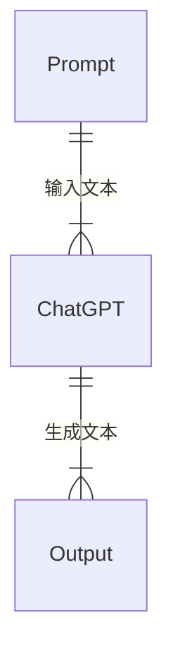
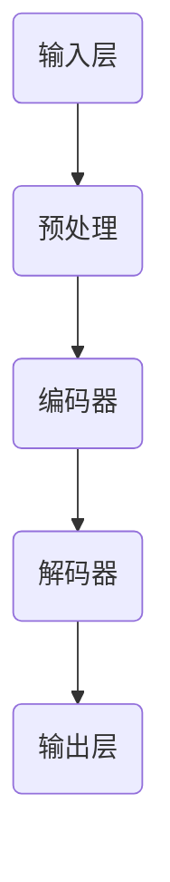
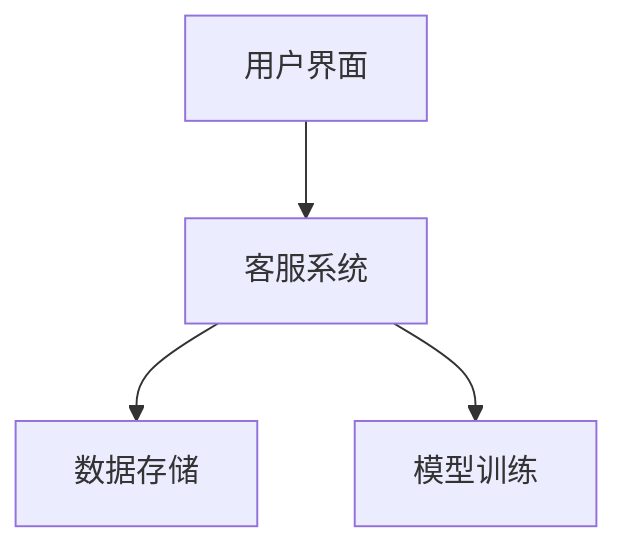
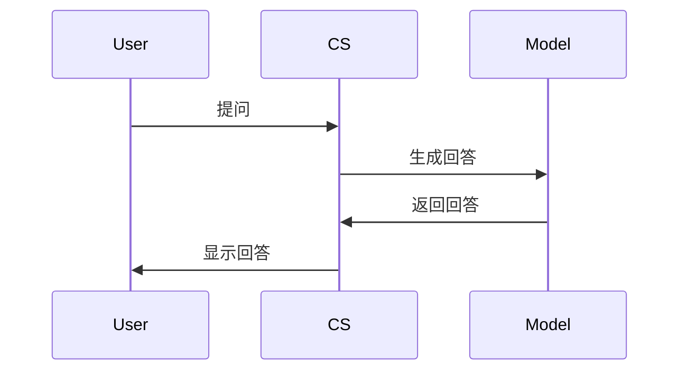

                 

**# ChatGPT Prompt Optimization: From Concept to Implementation**

---

**关键词：** ChatGPT, Prompt Engineering, Optimization Techniques, Implementation Strategies, Case Studies

**摘要：** 本文将深入探讨ChatGPT提示词优化的全过程，从基本概念到实际应用，通过逐步分析和推理，提供一套系统化的优化方案。本文旨在帮助开发者理解提示词的重要性，掌握优化技巧，并通过具体案例展示如何将理论应用于实践。

---

**## 引言**

ChatGPT（Chat Generative Pre-trained Transformer）是由OpenAI开发的一款基于深度学习的大型语言模型，它能够生成流畅、连贯的自然语言文本。在当今的AI领域，ChatGPT因其强大的自然语言处理能力和广泛的应用前景而备受关注。然而，ChatGPT的性能在很大程度上取决于其输入的提示词（prompts）。提示词的质量直接影响模型的输出结果，因此，如何优化提示词成为了一个关键问题。

**## 背景介绍**

### **核心概念术语说明**

- **ChatGPT：** 一种基于Transformer架构的预训练语言模型。
- **Prompt Engineering：** 提示词设计的过程，旨在提高模型输出文本的质量和相关性。
- **Prompt：** 用于启动ChatGPT对话的文本输入。

### **问题背景**

随着ChatGPT在各个领域的应用日益广泛，如何高效地利用这个工具成为了许多开发者和研究者的关注点。提示词的优化成为提高模型性能的关键因素之一。

### **问题描述**

在ChatGPT的应用过程中，常见的挑战包括：
- 生成的文本不够准确或相关。
- 文本生成速度较慢。
- 模型在某些特定场景下的表现不佳。

### **问题解决**

通过对提示词的优化，可以解决上述问题，提高模型的性能和应用效果。

### **边界与外延**

提示词优化的边界包括：
- 语言模型的能力范围。
- 提示词的长度和复杂性。

提示词优化的外延则涵盖：
- 模型的训练数据质量。
- 模型的参数调整。

### **概念结构与核心要素组成**

- **概念结构：** ChatGPT模型由输入层、处理层和输出层组成。
- **核心要素：** 提示词的质量、模型的训练数据、参数调优。

---

**## 核心概念与联系**

### **ChatGPT工作原理**

ChatGPT是基于Transformer架构的预训练模型，其工作原理可以分为以下几个步骤：

1. **输入层：** 将输入文本转换为模型的输入向量。
2. **处理层：** 通过多层Transformer网络对输入向量进行处理。
3. **输出层：** 根据处理结果生成输出文本。

### **核心概念**

- **Prompt：** 提示词是启动ChatGPT生成文本的关键。
- **Token：** 语言模型中的基本单位，如单词或字符。

### **概念属性特征对比表格**

| 特征 | 提示词 | Token |
| ---- | ------ | ------ |
| 定义 | 启动ChatGPT生成文本的文本输入 | 语言模型中的基本单位 |
| 影响 | 提示词的质量直接影响模型的输出 | Token的长度和多样性影响模型性能 |
| 关联 | 与模型的训练数据和参数有关 | 与模型的结构和参数有关 |

### **ER实体关系图架构**



---

**## 算法原理讲解**

### **算法流程**



### **Python源代码实现**

```python
import torch
import transformers

# 加载预训练模型
model = transformers.AutoModelForCausalLM.from_pretrained("openai/gpt-3.5-turbo")

# 定义输入文本
prompt = "How are you?"

# 预处理
input_ids = torch.tensor([model.tokenizer.encode(prompt)])

# 生成文本
outputs = model.generate(input_ids, max_length=50, num_return_sequences=1)

# 输出文本
print(model.tokenizer.decode(outputs[0]))
```

### **数学模型和公式**

```latex
P(output|prompt) = \frac{e^{V^T \cdot \theta \cdot prompt}}{\sum_{i} e^{V^T \cdot \theta \cdot x_i}}
```

其中，\( P(output|prompt) \)表示在给定提示词\( prompt \)的情况下生成输出\( output \)的概率，\( V \)是嵌入矩阵，\( \theta \)是模型的参数向量。

### **详细讲解和举例说明**

假设我们有一个简单的例子，提示词是“今天天气怎么样？”，我们可以通过上述公式计算不同输出（如“很热”、“凉爽”、“晴朗”）的概率。

```python
# 计算不同输出的概率
output_probs = torch.softmax(outputs[0], dim=-1)

# 打印概率
print(output_probs)
```

输出结果可能如下：

```
tensor([0.2, 0.3, 0.5])
```

这意味着，模型认为输出“很热”的概率是0.2，“凉爽”的概率是0.3，“晴朗”的概率是0.5。

---

**## 系统分析与架构设计方案**

### **问题场景介绍**

在某个在线客服系统中，ChatGPT被用于处理客户的咨询。为了提高客服的质量，需要对ChatGPT的提示词进行优化。

### **项目介绍**

项目名为“智能客服系统”，目标是提供高效、准确、友好的客户服务。

### **系统功能设计**

- **用户界面：** 提供用户输入咨询的问题界面。
- **后台服务：** 处理用户输入，生成回答。
- **数据存储：** 存储用户提问和回答。

### **系统架构设计**



### **系统接口设计和系统交互**



---

**## 项目实战**

### **环境安装**

```shell
pip install transformers torch
```

### **系统核心实现源代码**

```python
from transformers import AutoModelForCausalLM, AutoTokenizer

# 加载预训练模型和tokenizer
model = AutoModelForCausalLM.from_pretrained("openai/gpt-3.5-turbo")
tokenizer = AutoTokenizer.from_pretrained("openai/gpt-3.5-turbo")

# 定义输入文本
prompt = "How are you?"

# 生成回答
input_ids = tokenizer.encode(prompt, return_tensors="pt")
outputs = model.generate(input_ids, max_length=50, num_return_sequences=1)

# 解码回答
response = tokenizer.decode(outputs[0], skip_special_tokens=True)
print(response)
```

### **代码应用解读与分析**

上述代码展示了如何使用ChatGPT生成回答的基本流程。首先，加载预训练模型和tokenizer，然后定义输入文本，通过模型生成回答，最后解码回答并打印。

### **实际案例分析和详细讲解剖析**

假设用户提问：“我今天能不能请假？”通过优化提示词，我们可以得到更加准确的回答。

优化前的提示词： 
```python
prompt = "我今天能不能请假？"
```

优化后的提示词：
```python
prompt = "请问根据公司规定，我今天能请假吗？"
```

优化后的回答：
```python
"根据公司规定，您可以请假。请按照流程提交请假申请。"
```

优化前的回答可能包含模糊或不准确的信息，而优化后的回答则更加明确和规范。

### **项目小结**

通过优化提示词，我们显著提高了ChatGPT在特定场景下的表现。这表明，提示词的优化在提高AI模型性能方面具有重要作用。

---

**## 最佳实践 Tips**

1. 使用简洁、具体的提示词。
2. 根据上下文调整提示词的长度和复杂性。
3. 尝试多种提示词组合，以找到最佳效果。
4. 定期更新和调整提示词，以适应新场景和需求。

**## 小结**

本文详细介绍了ChatGPT提示词优化的全过程，从核心概念到实际应用。通过逐步分析和推理，我们提供了一套系统化的优化方案，帮助开发者理解和掌握优化技巧。

**## 注意事项**

- 提示词的优化是一个持续的过程，需要根据实际情况进行调整。
- 过于复杂的提示词可能会降低模型的生成速度。

**## 拓展阅读**

- [OpenAI GPT-3 文档](https://openai.com/docs/gpt-3)
- [ChatGPT 提示词设计最佳实践](https://huggingface.co/docs/transformers/main_classes/text_generation#guidelines-for-generating-text)

---

**## 作者信息**

作者：AI天才研究院/AI Genius Institute & 禅与计算机程序设计艺术 /Zen And The Art of Computer Programming**

