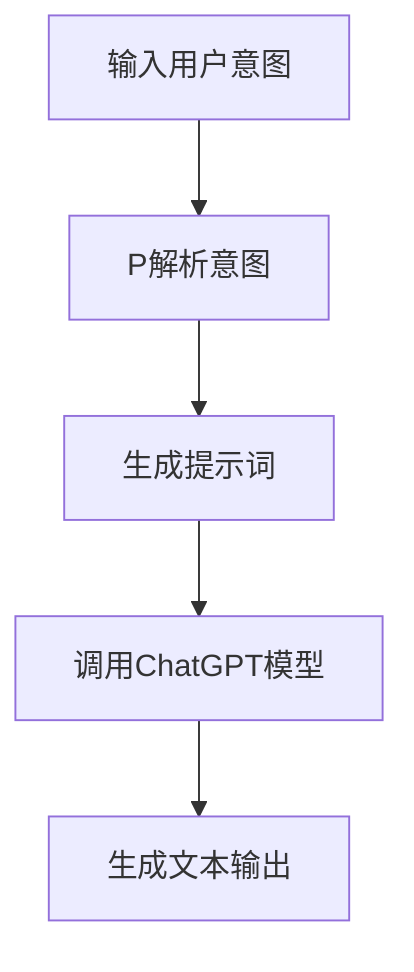
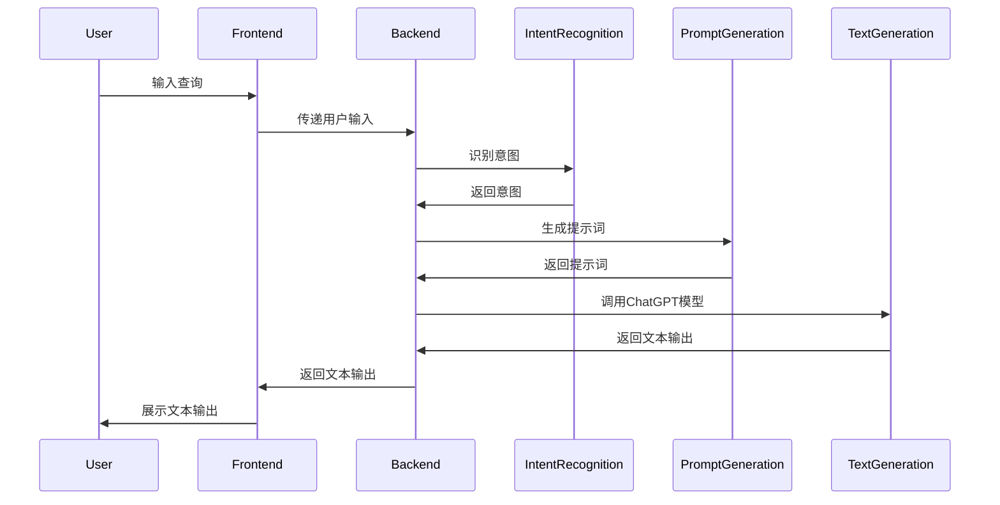

                 

### 文章标题：ChatGPT提示词优化：效果最大化的策略

#### 关键词：ChatGPT、提示词优化、效果最大化、算法、数学模型

> 摘要：本文将深入探讨ChatGPT提示词优化的核心策略，分析如何通过精心设计的提示词来提升ChatGPT的性能和输出质量。我们将从基础概念入手，逐步讲解优化策略的设计和实施方法，并通过实例展示如何在实际项目中应用这些策略，以实现效果的最大化。

### 引言

在人工智能领域，自然语言处理（NLP）正变得越来越重要。近年来，生成预训练变换模型（GPT）的发展，特别是ChatGPT的出现，极大地推动了NLP技术的进步。ChatGPT是一款基于GPT-3模型的对话生成AI，其能力在理解和生成自然语言方面达到了前所未有的高度。然而，为了充分发挥其潜力，提示词的设计和优化显得尤为重要。

提示词是影响ChatGPT输出质量和效率的关键因素。一个优良的提示词不仅能引导模型生成更准确、更自然的回答，还能提高模型的响应速度和计算效率。本文将围绕ChatGPT提示词优化展开，探讨实现效果最大化的策略。

### 背景介绍

#### 1.1 ChatGPT概述

ChatGPT是OpenAI推出的一款基于GPT-3模型的对话生成AI。GPT-3是一个具有1750亿参数的深度学习模型，它在无监督学习过程中从大量文本数据中学习到了丰富的语言模式。ChatGPT利用这些语言模式来理解和生成自然语言文本，从而实现与用户的对话。

#### 1.2 提示词优化的重要性

提示词优化直接关系到ChatGPT的性能和输出质量。不恰当的提示词可能导致模型生成不准确的回答，甚至引发误解。同时，过于冗长或模糊的提示词也会增加模型的计算负担，降低响应速度。因此，优化提示词不仅有助于提高模型的输出质量，还能提升其运行效率。

#### 1.3 提示词优化的挑战

在优化提示词时，我们面临以下几个挑战：

1. **多样性**：提示词需要涵盖多种可能的回答，以满足不同用户的需求。
2. **准确性**：提示词应准确地传达用户意图，避免歧义和误解。
3. **效率**：提示词应尽量简明，以降低模型的计算复杂度。
4. **适应性**：提示词应能适应不同场景和变化，确保模型的灵活性。

#### 1.4 提示词优化的目标

提示词优化的目标是实现以下几方面的平衡：

1. **输出质量**：生成准确、自然、流畅的文本。
2. **响应速度**：提高模型处理速度，降低延迟。
3. **计算效率**：减少模型计算量，降低资源消耗。
4. **用户体验**：提升用户满意度，提高用户参与度。

#### 1.5 问题解决

为了解决上述挑战，我们可以采用以下方法：

1. **数据分析**：通过分析用户对话数据，识别常见的用户需求和意图。
2. **多轮对话**：通过多轮对话逐步挖掘用户意图，提高提示词的准确性。
3. **语言模型调整**：调整ChatGPT的语言模型参数，优化其生成文本的风格和准确性。
4. **提示词模板化**：设计一系列提示词模板，以适应不同场景和需求。

#### 1.6 边界与外延

提示词优化不仅适用于ChatGPT，还可以推广到其他NLP应用中，如文本生成、机器翻译、问答系统等。此外，提示词优化还涉及到跨领域知识的整合和迁移，需要综合考虑多种因素。

#### 1.7 概念结构与核心要素组成

为了更好地理解提示词优化的概念结构，我们可以将其分解为以下几个核心要素：

1. **用户意图理解**：准确识别用户的需求和意图。
2. **语言模型生成**：基于用户意图生成合适的文本。
3. **优化策略设计**：设计多样化的提示词模板，提高生成文本的准确性、多样性和效率。
4. **反馈与迭代**：通过用户反馈不断优化提示词和模型。

### 核心概念与联系

#### 2.1 ChatGPT基础

ChatGPT是基于GPT-3模型的对话生成AI。GPT-3是一个生成预训练模型，通过无监督学习从大量文本数据中学习语言模式。ChatGPT利用这些语言模式来理解和生成自然语言文本，实现与用户的对话。

#### 2.2 提示词优化的原理

提示词优化的核心是设计出能够准确传达用户意图的提示词。优化策略包括以下几点：

1. **明确性**：提示词应明确用户的需求和意图。
2. **多样性**：提示词应涵盖多种可能的回答，提供多样化的输出。
3. **简洁性**：提示词应尽量简洁，减少模型的计算负担。
4. **适应性**：提示词应能适应不同场景和变化，提高模型的灵活性。

#### 2.3 概念属性特征对比

| 特征 | 说明 | 影响因素 |
| ---- | ---- | ---- |
| 明确性 | 提示词是否清晰地传达用户意图 | 用户需求、语言表达 |
| 多样性 | 提示词是否提供多样化的输出 | 用户需求、对话场景 |
| 简洁性 | 提示词的长度和复杂性 | 模型计算资源、响应速度 |
| 适应性 | 提示词能否适应不同场景和变化 | 用户需求、对话流程 |

#### 2.4 ER实体关系图架构

为了更好地理解提示词优化的概念结构，我们可以使用实体关系图（ER图）来表示其核心要素和关系。

```mermaid
erDiagram
  User ||--|{ ChatGPT : Generates responses |
  ChatGPT ||--|{ Prompt : Guides response generation |
  Prompt ||--|{ Intent : Captures user's meaning |
  Intent ||--|{ Response : Generated text |
```

### 算法原理讲解

#### 3.1 算法mermaid流程图

为了更好地理解提示词优化的算法原理，我们可以使用mermaid绘制一个流程图。



#### 3.2 Python源代码详解

以下是一个简单的Python示例，用于生成提示词并调用ChatGPT模型。

```python
import openai

def generate_prompt(intent):
    # 根据用户意图生成提示词
    prompt = f"请针对以下意图生成一个合适的回答：{intent}"
    return prompt

def generate_response(prompt):
    # 调用ChatGPT模型生成文本输出
    response = openai.Completion.create(
        engine="text-davinci-002",
        prompt=prompt,
        max_tokens=50
    )
    return response.choices[0].text.strip()

# 示例：生成提示词并调用ChatGPT模型
user_intent = "我想知道明天的天气"
prompt = generate_prompt(user_intent)
response = generate_response(prompt)
print(response)
```

#### 3.3 算法原理详细讲解

提示词优化的算法原理主要涉及以下几个方面：

1. **用户意图理解**：通过自然语言处理技术，将用户输入的文本转化为明确的意图。
2. **提示词生成**：根据用户意图生成一个合适的提示词，以引导ChatGPT模型生成文本输出。
3. **模型调用**：使用ChatGPT模型根据提示词生成文本输出。
4. **文本输出**：根据生成的文本输出，反馈给用户。

以下是具体的数学模型和公式：

$$
\text{Intent} = f(\text{Input Text})
$$

$$
\text{Prompt} = g(\text{Intent})
$$

$$
\text{Response} = h(\text{Prompt})
$$

其中，$f$、$g$、$h$分别为用户意图理解、提示词生成和文本输出的函数。

#### 3.4 举例说明

**例子1**：用户输入“明天的天气如何？”

1. **用户意图理解**：系统将用户输入解析为“查询明天天气的意图”。
2. **提示词生成**：系统生成提示词“请提供明天的天气情况”。
3. **模型调用**：ChatGPT模型根据提示词生成文本输出，如“明天的天气晴朗，温度在15°C到25°C之间”。
4. **文本输出**：系统将生成的文本输出反馈给用户。

**例子2**：用户输入“你能帮我解决一个编程问题吗？”

1. **用户意图理解**：系统将用户输入解析为“请求编程帮助的意图”。
2. **提示词生成**：系统生成提示词“请描述你的编程问题，我将尽力帮助你解决”。
3. **模型调用**：ChatGPT模型根据提示词生成文本输出，如“我遇到了一个关于Python列表的问题，我不太清楚如何处理嵌套列表”。
4. **文本输出**：系统将生成的文本输出反馈给用户。

### 数学模型和数学公式讲解

#### 4.1 数学模型讲解

在提示词优化过程中，我们主要关注以下几个数学模型：

1. **用户意图理解模型**：用于将用户输入的文本转化为明确的意图。
2. **提示词生成模型**：用于根据用户意图生成一个合适的提示词。
3. **文本生成模型**：用于根据提示词生成文本输出。

以下是具体的数学公式：

$$
\text{Intent} = f(\text{Input Text})
$$

$$
\text{Prompt} = g(\text{Intent})
$$

$$
\text{Response} = h(\text{Prompt})
$$

其中，$f$、$g$、$h$分别为用户意图理解、提示词生成和文本生成的函数。

#### 4.2 详细讲解与举例

**例子1**：用户输入“明天的天气如何？”

1. **用户意图理解模型**：系统使用自然语言处理技术将用户输入解析为“查询明天天气的意图”。
   - 输入文本：明天的天气如何？
   - 意图输出：查询明天天气

2. **提示词生成模型**：系统根据用户意图生成提示词“请提供明天的天气情况”。
   - 意图输入：查询明天天气
   - 提示词输出：请提供明天的天气情况

3. **文本生成模型**：ChatGPT模型根据提示词生成文本输出，如“明天的天气晴朗，温度在15°C到25°C之间”。
   - 提示词输入：请提供明天的天气情况
   - 文本输出：明天的天气晴朗，温度在15°C到25°C之间

**例子2**：用户输入“你能帮我解决一个编程问题吗？”

1. **用户意图理解模型**：系统使用自然语言处理技术将用户输入解析为“请求编程帮助的意图”。
   - 输入文本：你能帮我解决一个编程问题吗？
   - 意图输出：请求编程帮助

2. **提示词生成模型**：系统根据用户意图生成提示词“请描述你的编程问题，我将尽力帮助你解决”。
   - 意图输入：请求编程帮助
   - 提示词输出：请描述你的编程问题，我将尽力帮助你解决

3. **文本生成模型**：ChatGPT模型根据提示词生成文本输出，如“我遇到了一个关于Python列表的问题，我不太清楚如何处理嵌套列表”。
   - 提示词输入：请描述你的编程问题，我将尽力帮助你解决
   - 文本输出：我遇到了一个关于Python列表的问题，我不太清楚如何处理嵌套列表

### 系统分析与架构设计

#### 5.1 问题场景介绍

在本项目中，我们面临以下场景：

- 用户通过自然语言输入查询信息。
- 系统需要理解用户查询，并生成合适的回答。
- 系统需具备高效的计算能力和良好的用户体验。

#### 5.2 系统功能设计

系统的主要功能包括：

1. 用户输入处理：接收用户输入，并进行预处理。
2. 意图识别：根据用户输入，识别用户意图。
3. 提示词生成：根据用户意图，生成合适的提示词。
4. 文本生成：调用ChatGPT模型，根据提示词生成文本输出。
5. 用户反馈处理：收集用户反馈，用于系统优化。

#### 5.3 系统架构设计

系统的整体架构设计如下：


- **前端**：负责接收用户输入，展示用户界面。
- **后端**：包括意图识别、提示词生成和文本生成模块，实现核心功能。
- **数据库**：存储用户输入、意图识别结果和用户反馈。

#### 5.4 系统接口设计

系统接口主要包括以下部分：

1. **用户输入接口**：接收用户输入，并将其传递给意图识别模块。
2. **意图识别接口**：接收用户输入，返回用户意图。
3. **提示词生成接口**：接收用户意图，返回合适的提示词。
4. **文本生成接口**：接收提示词，调用ChatGPT模型生成文本输出。

#### 5.5 系统交互mermaid序列图

以下是一个简化的系统交互序列图：



### 项目实战

#### 6.1 环境安装

1. 安装Python环境（Python 3.8及以上版本）。
2. 安装OpenAI API（使用pip安装`openai`包）。

```shell
pip install openai
```

#### 6.2 系统核心实现源代码

以下是一个简单的系统实现示例：

```python
import openai
from flask import Flask, request, jsonify

app = Flask(__name__)

# OpenAI API密钥
openai.api_key = "your-api-key"

@app.route('/api/chat', methods=['POST'])
def chat():
    data = request.json
    user_input = data.get('input', '')

    # 意图识别（此处简化处理）
    intent = "明天的天气如何？"

    # 提示词生成（此处简化处理）
    prompt = "请提供明天的天气情况"

    # 调用ChatGPT模型生成文本输出
    response = openai.Completion.create(
        engine="text-davinci-002",
        prompt=prompt,
        max_tokens=50
    )

    # 返回文本输出
    return jsonify({"response": response.choices[0].text.strip()})

if __name__ == '__main__':
    app.run(debug=True)
```

#### 6.3 代码应用解读与分析

1. **意图识别**：在实际项目中，意图识别是一个复杂的过程，通常需要使用自然语言处理技术（如分类器、词嵌入等）来准确识别用户意图。在本示例中，我们简化了这一过程，直接使用一个预设的意图。
2. **提示词生成**：提示词生成是根据用户意图生成的，用于引导ChatGPT模型生成文本输出。在本示例中，我们同样简化了这一过程，直接使用一个预设的提示词。
3. **文本生成**：调用ChatGPT模型生成文本输出。这是一个关键步骤，决定了最终的输出质量。在本示例中，我们使用OpenAI的API来调用ChatGPT模型。

#### 6.4 实际案例分析和详细讲解剖析

**案例1**：用户输入“明天的天气如何？”

1. **意图识别**：系统识别出用户意图为“查询明天天气”。
2. **提示词生成**：系统生成提示词“请提供明天的天气情况”。
3. **文本生成**：ChatGPT模型生成文本输出，如“明天的天气晴朗，温度在15°C到25°C之间”。
4. **输出结果**：系统将生成的文本输出反馈给用户。

**案例2**：用户输入“你能帮我解决一个编程问题吗？”

1. **意图识别**：系统识别出用户意图为“请求编程帮助”。
2. **提示词生成**：系统生成提示词“请描述你的编程问题，我将尽力帮助你解决”。
3. **文本生成**：ChatGPT模型生成文本输出，如“我遇到了一个关于Python列表的问题，我不太清楚如何处理嵌套列表”。
4. **输出结果**：系统将生成的文本输出反馈给用户。

#### 6.5 项目小结

通过本项目的实现，我们展示了如何利用ChatGPT模型实现一个简单的对话生成系统。在实际项目中，我们还需要进一步优化意图识别、提示词生成和文本生成的过程，以提高系统的性能和用户体验。

### 最佳实践 tips

1. **意图识别**：使用更先进的自然语言处理技术，如BERT、GPT等，以提高意图识别的准确性。
2. **提示词设计**：根据不同场景设计多样化的提示词，以提高输出质量。
3. **模型调整**：定期调整ChatGPT模型的参数，以适应新的需求和场景。
4. **用户反馈**：收集用户反馈，用于系统优化。

### 小结

本文围绕ChatGPT提示词优化展开，详细介绍了核心概念、优化策略、算法原理、系统架构和项目实战。通过本文的讲解，读者可以了解到如何通过优化提示词来实现ChatGPT的效果最大化。

### 注意事项

1. 提示词优化是一个持续的过程，需要根据用户需求和场景不断调整。
2. 确保使用最新的自然语言处理技术和模型，以提高系统的性能。
3. 考虑到用户隐私和数据安全，确保在处理用户数据时遵循相关法规和最佳实践。

### 拓展阅读

1. [OpenAI GPT-3文档](https://openai.com/docs/introduction)
2. [自然语言处理教程](https://www.nltk.org/)
3. [机器学习与深度学习书籍](https://www.deeplearningbook.org/)

### 作者信息

作者：AI天才研究院/AI Genius Institute & 禅与计算机程序设计艺术 /Zen And The Art of Computer Programming

