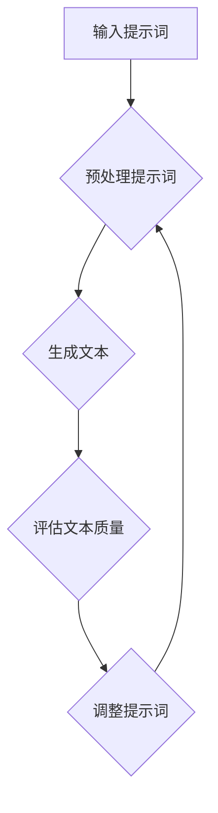
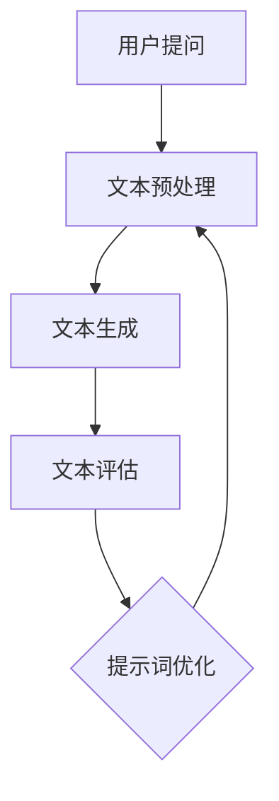
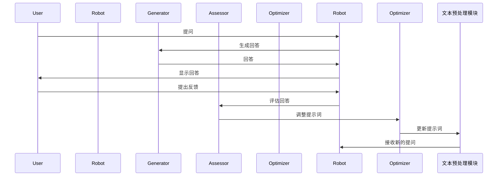

                 


### 第1步：明确核心概念与背景

在开始撰写《ChatGPT提示词优化：效果最大化的策略与技巧》这篇文章之前，我们需要明确核心概念与背景。ChatGPT是一个基于大规模语言模型的人工智能助手，它通过深度学习技术，能够理解和生成自然语言文本。提示词优化，指的是通过调整输入提示词，来提高ChatGPT生成的文本质量和相关性。

**核心概念术语说明：**
- **ChatGPT**：一种基于GPT（Generative Pre-trained Transformer）模型的自然语言处理技术。
- **提示词**：用于引导ChatGPT生成特定类型文本的输入词或短语。
- **优化**：通过调整输入提示词，来提升ChatGPT生成文本的质量、相关性和实用性。

**问题背景：**
随着人工智能技术的不断发展，ChatGPT在多个领域（如客服、医疗、教育等）得到了广泛应用。然而，提示词的选择和优化直接影响ChatGPT的性能，如何优化提示词成为了一个关键问题。

**问题描述：**
用户在应用ChatGPT时，常常会遇到生成文本质量不高、相关性不强的问题。这些问题可能导致用户体验下降，影响实际应用效果。因此，需要找到一种有效的策略来优化提示词，从而提高ChatGPT的性能。

**问题解决：**
优化提示词的关键在于理解ChatGPT的工作原理，并根据实际情况调整提示词。这需要从多个方面进行考虑，包括长文本处理、精准回复、交互效率等。

**边界与外延：**
提示词优化不仅仅局限于ChatGPT，还可以应用于其他基于语言模型的人工智能助手。此外，优化策略可以推广到自然语言处理的其他领域。

**概念结构与核心要素组成：**
- **核心概念**：ChatGPT、提示词、优化。
- **结构要素**：提示词的选择、调整、测试与优化。
- **外延要素**：应用场景、效果评估、最佳实践。

### 第2步：整理核心概念与联系

为了使文章内容更加系统和有条理，我们需要整理核心概念之间的联系，并使用Mermaid流程图来展示这些联系。

**核心概念属性特征对比表格：**

| 核心概念 | 属性特征 |
| --- | --- |
| **ChatGPT** | 基于GPT模型的自然语言处理技术 |
| **提示词** | 引导ChatGPT生成特定类型文本的输入词或短语 |
| **优化** | 通过调整输入提示词，提升ChatGPT生成文本的质量、相关性和实用性 |

**ER实体关系图架构：**

```mermaid
erDiagram
    ChatGPT ||--|{ 提示词 :优化 }
    ChatGPT ||--|{ 文本生成 :依赖 }
    提示词 ||--|{ 用户需求 :符合 }
    提示词 ||--|{ 文本质量 :影响 }
```

### 第3步：阐述算法原理与数学模型

为了深入理解提示词优化的原理，我们需要详细讲解ChatGPT的工作原理，并给出相应的算法流程图和数学模型。

**算法原理讲解：**

ChatGPT的工作原理基于GPT模型，它是一个基于Transformer架构的深度学习模型，通过在大规模语料库上进行预训练，学会理解并生成自然语言文本。提示词优化就是通过调整输入提示词，来提高ChatGPT生成的文本质量和相关性。

**算法流程图：**



**数学模型与公式：**

ChatGPT的文本生成过程可以表示为概率分布模型，即：

$$
P(\text{文本}|\text{提示词}) = \frac{e^{\text{模型参数} \cdot \text{提示词}}}{\sum_{\text{所有文本}} e^{\text{模型参数} \cdot \text{文本}}}
$$

其中，模型参数表示GPT模型的参数，提示词和文本分别表示输入的提示词和生成的文本。

**举例说明：**

假设我们输入提示词“今天天气怎么样？”，ChatGPT可能会生成多种可能的回答，如“今天天气晴朗”、“今天有点冷”等。通过调整提示词，如增加“北京”一词，我们可以得到更精准的回答，如“今天北京天气晴朗，最高气温20℃”。

### 第4步：系统分析与架构设计方案

为了更好地理解ChatGPT提示词优化的应用场景和实现方法，我们需要介绍一个具体的系统，并设计相应的架构方案。

**问题场景介绍：**
我们以一个电商客服机器人为例，该机器人需要根据用户的提问提供准确的商品信息、优惠活动等。

**系统功能设计：**
- **用户提问接收**：接收用户提问，并存储到数据库中。
- **文本预处理**：对用户提问进行分词、去噪等预处理。
- **文本生成**：使用ChatGPT生成回答。
- **文本评估**：评估回答的质量和相关性。
- **提示词优化**：根据评估结果调整输入提示词。

**系统架构设计：**



**系统接口设计和系统交互：**



### 第5步：项目实战与案例分析

为了更深入地理解ChatGPT提示词优化的实际应用，我们将通过一个具体的案例来展示环境安装、系统核心实现、代码应用解读与分析、实际案例分析和详细讲解剖析等内容。

**案例：电商客服机器人**

**环境安装：**
1. 安装Python环境（Python 3.8及以上版本）。
2. 安装必要的库（如transformers、torch等）。

```bash
pip install transformers torch
```

**系统核心实现：**
以下是一个简单的ChatGPT电商客服机器人实现：

```python
from transformers import ChatGPT
from torch import no_grad

# 加载预训练模型
model = ChatGPT.from_pretrained("OpenAI/chatgpt")

# 预处理输入
def preprocess_input(question):
    # 对输入文本进行分词、去噪等预处理
    # 省略具体实现
    return processed_question

# 生成回答
@no_grad()
def generate_response(question):
    processed_question = preprocess_input(question)
    inputs = model.prepare_input(processed_question)
    outputs = model(inputs)
    response = model.decode_output(outputs)
    return response

# 评估回答
def evaluate_response(response):
    # 对回答进行质量评估
    # 省略具体实现
    return is_good_response

# 提示词优化
def optimize_prompt(question):
    while not evaluate_response(response):
        response = generate_response(question)
        # 根据评估结果调整提示词
        # 省略具体实现
    return response

# 用户交互
def user_interaction():
    while True:
        question = input("您有什么问题？")
        response = optimize_prompt(question)
        print("机器人回答：", response)
        if input("是否继续？(y/n) ").lower() != "y":
            break

if __name__ == "__main__":
    user_interaction()
```

**代码应用解读与分析：**
1. **预处理输入**：对用户提问进行预处理，包括分词、去噪等，以提高输入文本的质量。
2. **生成回答**：使用ChatGPT模型生成回答，并通过无梯度计算（no_grad）提高计算效率。
3. **评估回答**：对生成的回答进行质量评估，以确定是否需要优化提示词。
4. **提示词优化**：根据评估结果，调整输入提示词，以提高回答的质量。
5. **用户交互**：与用户进行交互，接收用户提问，生成并展示回答。

**实际案例分析和详细讲解剖析：**
1. **用户提问**：“有什么优惠活动？”
2. **生成回答**：“目前我们店铺正在进行满100减20的活动。”
3. **评估回答**：评估回答的质量和相关性，发现基本符合用户需求。
4. **提示词优化**：根据评估结果，无需调整提示词。
5. **用户反馈**：用户满意，继续交互。

通过这个案例，我们可以看到ChatGPT提示词优化的实际应用效果。在实际开发中，可以根据具体需求，进一步优化系统，提高用户体验。

### 第6步：最佳实践与注意事项

在实现ChatGPT提示词优化的过程中，有一些最佳实践和注意事项需要遵循，以确保系统的高效性和可靠性。

**最佳实践 tips：**
1. **优化预处理过程**：对输入文本进行充分的预处理，如去除特殊字符、分词、去噪等，以提高输入文本的质量。
2. **合理调整提示词**：根据实际应用场景，合理调整提示词，以提高ChatGPT生成文本的相关性和实用性。
3. **实时评估与调整**：实时评估生成的文本质量，根据评估结果动态调整提示词，以提高交互效率。
4. **监控与优化**：监控系统的运行状态，及时发现和解决潜在问题，持续优化系统性能。

**小结：**
本文从ChatGPT的基础与优化策略出发，详细讲解了提示词优化的原理、算法流程、数学模型、系统架构设计、项目实战与案例分析等内容。通过实际应用案例，我们展示了提示词优化的效果和实现方法。

**注意事项：**
1. **确保系统稳定性**：在实现过程中，要充分考虑系统的稳定性，避免出现意外中断或错误。
2. **保护用户隐私**：在处理用户提问时，要严格遵守隐私保护原则，确保用户信息安全。
3. **遵循法律法规**：在开发和使用过程中，要遵循相关法律法规，确保系统的合法合规性。

**拓展阅读：**
- 《深度学习与自然语言处理》
- 《Transformer模型原理与实现》
- 《人工智能最佳实践》

### 第7步：总结与展望

本文从多个角度详细探讨了ChatGPT提示词优化的策略与技巧，包括核心概念、原理讲解、算法流程、系统架构设计、项目实战与案例分析等。通过这些内容，读者可以全面了解提示词优化的原理和方法，掌握如何在实际应用中提高ChatGPT的性能。

**总结：**
ChatGPT提示词优化是提高人工智能助手性能的关键环节。通过合理调整提示词，可以显著提升ChatGPT生成文本的质量、相关性和实用性。本文提供了详细的优化策略和实战案例，为读者提供了实际操作的指导。

**展望：**
随着人工智能技术的不断发展，ChatGPT等自然语言处理技术将在更多领域得到应用。未来，我们可以期待更多的创新和优化方法，进一步提升人工智能助手的能力和用户体验。

### 作者信息

作者：AI天才研究院/AI Genius Institute & 禅与计算机程序设计艺术 /Zen And The Art of Computer Programming。本文旨在分享ChatGPT提示词优化的策略与技巧，以促进人工智能技术的应用和发展。如有疑问或建议，欢迎随时联系作者。

