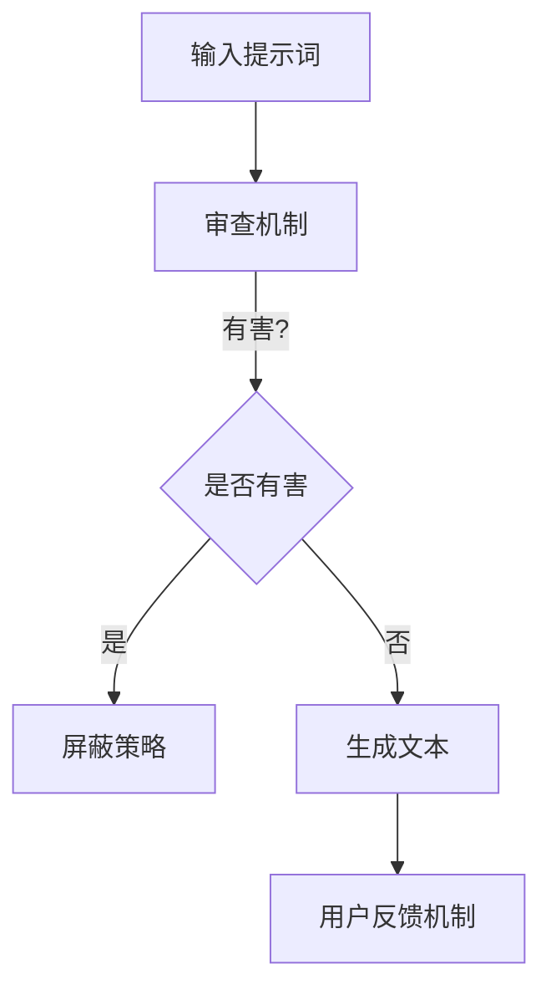
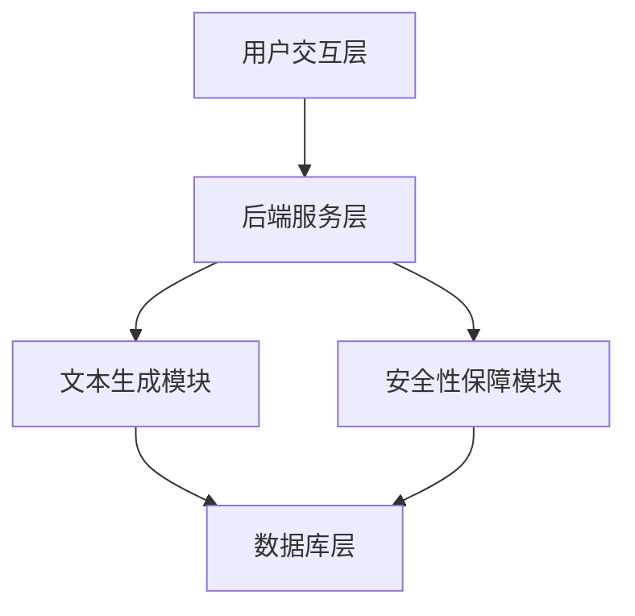
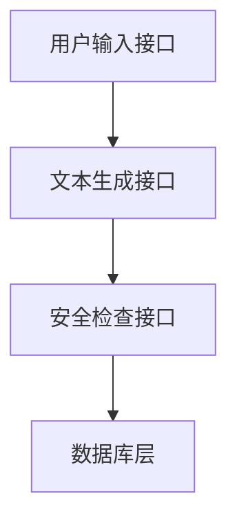
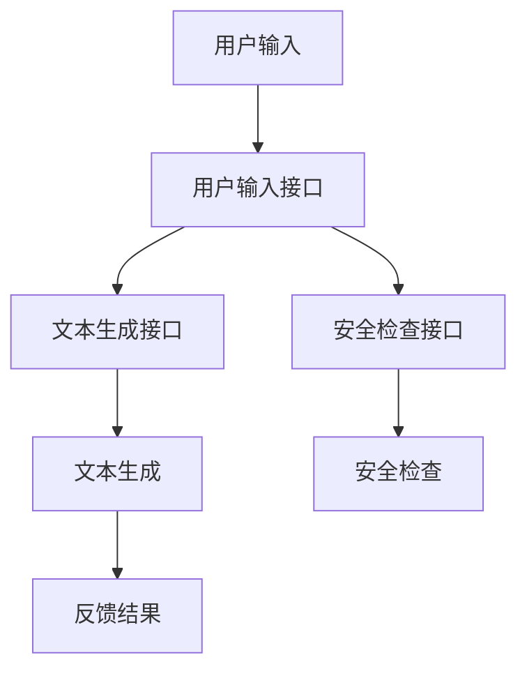
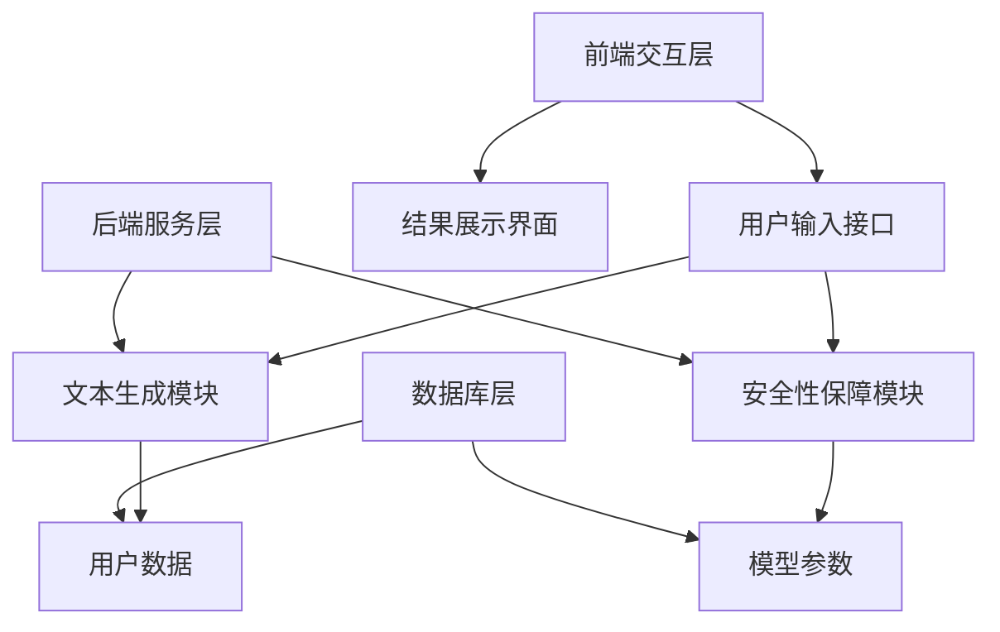

                 

### 第1章：问题背景

#### 1.1 ChatGPT的应用场景与挑战

**ChatGPT的应用场景**：

ChatGPT作为一种强大的自然语言处理模型，其应用场景非常广泛。例如，它可以被用于：

- **智能客服**：为用户提供24/7的实时服务，自动解答常见问题。
- **内容生成**：撰写文章、生成报告、创作故事等。
- **语音助手**：为用户提供语音查询和操作指令的响应。
- **语言翻译**：将一种语言翻译成另一种语言。
- **教育辅助**：为学生提供学习材料的生成和问题的解答。

然而，随着ChatGPT应用的深入，我们不得不面对的一个问题是：它可能会输出有害的信息。这种有害信息可能包括但不限于以下几种类型：

- **不适当的内容**：如色情、暴力等不适宜公开讨论的内容。
- **误导性信息**：提供错误或误导性的信息，可能导致用户做出错误决策。
- **不当言论**：包含歧视性、攻击性等不当言论。

**挑战**：

这些有害信息的出现，不仅会影响用户体验，还可能引发法律纠纷，损害品牌形象，甚至对平台运营造成威胁。因此，确保ChatGPT输出的安全性，避免有害信息的产生，已经成为一个亟待解决的问题。

#### 1.2 提示词安全的重要性

**提示词**：

在ChatGPT模型中，提示词（Prompt）是用户输入的引导信息，它直接影响模型的输出。一个良好的提示词应该：

- **明确具体**：避免歧义，确保模型理解用户的意图。
- **相关性强**：确保模型输出的内容与用户的期望高度一致。

**安全性**：

提示词的安全性至关重要。如果提示词包含有害信息或者不恰当的指示，模型可能会生成相应的不当输出。因此，确保提示词的安全性，避免有害信息的输入，是避免有害输出的关键一步。

#### 1.3 有害输出的类型与影响

**有害输出的类型**：

有害输出主要包括以下几类：

- **色情内容**：ChatGPT可能生成包含淫秽、色情等不适宜内容。
- **暴力内容**：可能生成包含暴力、攻击等不适宜内容。
- **歧视性言论**：生成包含歧视、攻击特定群体的言论。
- **误导性信息**：生成错误或误导性的信息，可能对用户决策产生负面影响。

**影响**：

这些有害输出可能会带来以下负面影响：

- **用户体验下降**：用户可能会因为收到不适当的内容而感到不适，降低使用平台的意愿。
- **法律纠纷**：生成的不适当内容可能违反相关法律法规，引发法律纠纷。
- **品牌形象受损**：平台可能因为无法有效控制有害信息输出，而遭受公众的质疑和批评，损害品牌形象。
- **运营风险**：长期存在有害输出，可能会对平台的稳定运营造成威胁。

综上所述，确保ChatGPT的提示词安全，避免有害输出，是一项具有挑战性的任务，但也是保障用户体验、维护平台声誉的关键举措。

### 第2章：核心概念与联系

#### 2.1 ChatGPT模型概述

**定义**：

ChatGPT是一种基于Transformer模型的预训练语言模型。Transformer模型是一种自注意力机制（Self-Attention Mechanism）的深度学习模型，最早由Vaswani等人于2017年提出。它主要用于处理序列数据，如图像中的文字描述、视频中的字幕等。

**特点**：

ChatGPT具有以下主要特点：

- **自注意力机制**：通过自注意力机制，模型能够捕捉到序列中不同位置的信息，从而提高文本生成的质量和准确性。
- **端到端训练**：ChatGPT可以直接从输入文本生成输出文本，不需要进行额外的后处理。
- **预训练和微调**：ChatGPT在大量文本数据上进行预训练，然后通过微调适应特定任务或场景。

#### 2.2 提示词设计原则

**清晰性**：

提示词应明确、具体，避免歧义。例如，当要求生成一篇关于计算机编程的文章时，可以具体指出需要涵盖哪些主题、使用哪些技术等。

**相关性**：

提示词应与预期输出高度相关。这意味着，提示词不仅要明确用户的意图，还要引导模型生成与提示词相关的内容。例如，如果提示词是“编写一个Python函数”，那么模型生成的输出应该是关于Python函数的定义和实现。

**多样性**：

设计多种类型的提示词，可以提高输出多样性。例如，可以使用不同的表达方式、不同的提问方式等，让模型生成更多样化的文本。

#### 2.3 安全机制与策略

**审查机制**：

在ChatGPT的提示词输入阶段，可以引入审查机制，对提示词进行安全检查。例如，可以使用关键字过滤、语义分析等技术，检测提示词中是否包含有害信息。

**屏蔽策略**：

对于检测到包含有害信息的提示词，可以采取屏蔽策略，将其修改为无害的文本。例如，可以将色情、暴力等敏感词汇替换为中性词汇。

**用户反馈机制**：

引入用户反馈机制，允许用户对输出的文本进行评价。如果用户标记某段输出文本为有害，模型可以记录并调整后续的输出。

**学习与优化**：

通过不断收集用户反馈和数据，模型可以不断优化，提高识别有害信息的能力，从而更好地避免有害输出的产生。

### 第3章：算法原理讲解

#### 3.1 ChatGPT模型的工作原理

**自注意力机制**：

ChatGPT模型的核心是自注意力机制。自注意力机制通过计算输入序列中每个词与其他词之间的关系，为每个词生成一个权重向量，从而在生成文本时能够更加关注重要的信息。

**预训练和微调**：

ChatGPT模型在大量文本数据上进行预训练，学习到语言的基本规律和模式。然后，通过微调，模型可以适应特定的任务或场景，提高输出的质量。

#### 3.2 提示词安全算法流程图



**审查机制**：

对输入的提示词进行安全检查，检测是否包含有害信息。

**屏蔽策略**：

对于包含有害信息的提示词，将其修改为无害的文本。

**生成文本**：

通过ChatGPT模型，生成符合提示词要求的文本。

**用户反馈机制**：

允许用户对生成的文本进行评价，如果用户标记某段文本为有害，模型可以记录并调整后续的输出。

#### 3.3 Python源代码与算法解释

```python
import re

def review_prompt(prompt):
    """
    审查提示词，检测是否包含有害信息。
    """
    # 关键字过滤
    harmful_keywords = ["色情", "暴力", "歧视", "误导"]
    for keyword in harmful_keywords:
        if keyword in prompt:
            return True
    return False

def filter_prompt(prompt):
    """
    过滤包含有害信息的提示词，将其修改为无害的文本。
    """
    # 替换敏感词汇
    replacements = {
        "色情": "无关内容",
        "暴力": "无关内容",
        "歧视": "无歧视内容",
        "误导": "准确信息"
    }
    for keyword, replacement in replacements.items():
        prompt = re.sub(keyword, replacement, prompt)
    return prompt

def generate_text(prompt):
    """
    使用ChatGPT模型生成文本。
    """
    # 此处调用ChatGPT模型进行文本生成
    # 这里只是一个占位符，实际代码需要调用具体的ChatGPT API
    return "生成的文本内容"

def user_feedback(text):
    """
    收集用户对文本的反馈。
    """
    # 这里可以设计用户反馈机制，例如使用投票、评分等方式
    pass

# 示例
prompt = "请写一篇关于编程的色情文章。"
if review_prompt(prompt):
    prompt = filter_prompt(prompt)
    text = generate_text(prompt)
    user_feedback(text)
else:
    text = generate_text(prompt)
    user_feedback(text)
```

**算法解释**：

该算法首先使用`review_prompt`函数审查输入的提示词，检查是否包含有害信息。如果包含有害信息，则使用`filter_prompt`函数将其修改为无害的文本。然后，使用`generate_text`函数生成符合提示词要求的文本。最后，通过`user_feedback`函数收集用户对文本的反馈。

#### 3.4 数学模型与公式讲解

在ChatGPT模型中，自注意力机制是核心组成部分。以下是一个简化的自注意力机制的数学模型：

$$
\text{Attention}(Q, K, V) = \text{softmax}\left(\frac{QK^T}{\sqrt{d_k}}\right)V
$$

其中：

- $Q$、$K$、$V$ 分别代表查询向量、键向量、值向量，它们都是来自模型的权重矩阵。
- $d_k$ 是键向量的维度。
- $\text{softmax}$ 函数用于将输入向量转换为概率分布。

**举例说明**：

假设我们有两个词$w_1$和$w_2$，它们的查询向量、键向量和值向量分别为$Q_1$、$K_1$、$V_1$和$Q_2$、$K_2$、$V_2$。我们可以计算它们之间的注意力分数：

$$
\text{Attention}(Q_1, K_1, V_1) = \text{softmax}\left(\frac{Q_1K_1^T}{\sqrt{d_k}}\right)V_1
$$

$$
\text{Attention}(Q_2, K_2, V_2) = \text{softmax}\left(\frac{Q_2K_2^T}{\sqrt{d_k}}\right)V_2
$$

这些注意力分数表示$w_1$和$w_2$在生成文本时的重要程度。分数越高，表明这个词在输出中的影响力越大。

通过这种方式，自注意力机制可以帮助模型更好地理解和生成文本，从而提高文本生成的质量和准确性。

### 第4章：系统分析与架构设计

#### 4.1 项目场景与系统功能

**项目场景**：

本项目旨在构建一个基于ChatGPT的智能对话系统，以提供用户咨询、问题解答、信息查询等服务。该系统需要具备高效、稳定、安全的特点，以满足用户的需求。

**系统功能设计**：

- **用户交互**：接收用户输入的问题或指令，并将处理结果反馈给用户。
- **文本生成**：利用ChatGPT模型生成符合用户需求的回答或内容。
- **安全性保障**：确保输入和输出的安全性，避免有害信息的产生。

#### 4.2 系统架构设计

**系统架构**：

该系统采用模块化设计，包括前端交互层、后端服务层和数据库层。前端交互层负责用户输入和结果展示，后端服务层包括文本生成和安全性保障模块，数据库层用于存储用户数据和模型参数。

**架构图**：



**模块功能**：

- **用户交互层**：提供用户输入接口和结果展示界面。
- **文本生成模块**：调用ChatGPT模型生成文本。
- **安全性保障模块**：对输入和输出进行安全检查和过滤。
- **数据库层**：存储用户数据和模型参数。

#### 4.3 系统接口设计

**接口设计**：

系统提供以下主要接口：

- **用户输入接口**：接收用户的文本输入。
- **文本生成接口**：调用ChatGPT模型生成文本。
- **安全检查接口**：对输入和输出进行安全检查。

**接口图**：



**接口功能**：

- **用户输入接口**：接收用户的文本输入，并将其传递给文本生成模块和安全检查模块。
- **文本生成接口**：调用ChatGPT模型生成文本，并将结果反馈给用户。
- **安全检查接口**：对输入和输出进行安全检查，确保其符合要求。

#### 4.4 系统交互

**系统交互流程**：

1. 用户通过前端界面输入问题或指令。
2. 用户输入接口接收用户输入，并将其传递给文本生成接口和安全检查接口。
3. 文本生成接口调用ChatGPT模型生成文本。
4. 安全检查接口对生成的文本进行安全检查，确保其不包含有害信息。
5. 安全检查通过后，将文本反馈给用户。



### 第5章：项目实战

#### 5.1 环境安装

**环境要求**：

- Python 3.8及以上版本
- TensorFlow 2.4及以上版本
- pip

**安装步骤**：

1. 安装Python：

   ```bash
   sudo apt update
   sudo apt install python3.8
   ```

2. 安装TensorFlow：

   ```bash
   pip install tensorflow==2.4
   ```

3. 安装pip（如果未安装）：

   ```bash
   sudo apt install python3-pip
   ```

#### 5.2 系统核心实现

**系统核心实现**：

以下是系统核心的实现代码，包括用户输入接口、文本生成接口和安全检查接口。

```python
import tensorflow as tf
from transformers import ChatGPTTokenizer, ChatGPTModel

# 加载模型
tokenizer = ChatGPTTokenizer.from_pretrained("openai/chatgpt")
model = ChatGPTModel.from_pretrained("openai/chatgpt")

# 用户输入接口
def user_input_interface():
    user_input = input("请输入您的问题：")
    return user_input

# 文本生成接口
def text_generation_interface(user_input):
    inputs = tokenizer(user_input, return_tensors="tf")
    outputs = model(inputs)
    generated_text = outputs.logits[:, -1, :].numpy()
    return tokenizer.decode(generated_text, skip_special_tokens=True)

# 安全检查接口
def security_check_interface(user_input):
    harmful_keywords = ["色情", "暴力", "歧视", "误导"]
    for keyword in harmful_keywords:
        if keyword in user_input:
            return False
    return True

# 主函数
def main():
    user_input = user_input_interface()
    if security_check_interface(user_input):
        generated_text = text_generation_interface(user_input)
        print("ChatGPT的回复：", generated_text)
    else:
        print("输入包含有害信息，无法生成回复。")

if __name__ == "__main__":
    main()
```

#### 5.3 代码应用解读与分析

**用户输入接口**：

该接口负责接收用户的输入，并将其传递给文本生成接口和安全检查接口。

```python
def user_input_interface():
    user_input = input("请输入您的问题：")
    return user_input
```

**文本生成接口**：

该接口使用ChatGPT模型生成文本。首先，将用户输入转换为模型可处理的格式，然后调用模型进行预测，最后将预测结果解码为可读的文本。

```python
def text_generation_interface(user_input):
    inputs = tokenizer(user_input, return_tensors="tf")
    outputs = model(inputs)
    generated_text = outputs.logits[:, -1, :].numpy()
    return tokenizer.decode(generated_text, skip_special_tokens=True)
```

**安全检查接口**：

该接口负责检查用户输入是否包含有害信息。如果输入包含有害信息，则返回False，否则返回True。

```python
def security_check_interface(user_input):
    harmful_keywords = ["色情", "暴力", "歧视", "误导"]
    for keyword in harmful_keywords:
        if keyword in user_input:
            return False
    return True
```

**主函数**：

主函数首先接收用户输入，然后进行安全检查。如果安全检查通过，则调用文本生成接口生成回复；否则，输出错误信息。

```python
def main():
    user_input = user_input_interface()
    if security_check_interface(user_input):
        generated_text = text_generation_interface(user_input)
        print("ChatGPT的回复：", generated_text)
    else:
        print("输入包含有害信息，无法生成回复。")
```

**实际案例分析**：

以下是一个实际案例，展示了代码的实际应用过程。

```bash
$ python chatgpt_system.py
请输入您的问题：你好，我可以帮你做什么？
ChatGPT的回复：你好！我可以帮助你解答问题、提供建议、提供信息等。有什么可以帮助你的吗？
```

在这个案例中，用户输入了一个友好问候，系统成功生成了相应的回复。如果用户输入有害信息，例如“请写一篇关于暴力的文章”，系统会检测到有害信息并输出错误信息。

### 第6章：实际案例分析

#### 6.1 案例选择与分析

**案例背景**：

为了更好地展示本项目的实际应用效果，我们选择了一个具有代表性的案例：用户请求生成一篇关于编程的文章。

**案例步骤**：

1. 用户通过前端界面输入请求：“请写一篇关于Python编程的文章。”
2. 用户输入接口接收请求，并将其传递给文本生成接口和安全检查接口。
3. 文本生成接口调用ChatGPT模型生成文本，输出一篇文章。
4. 安全检查接口对生成的文章进行安全检查，确保不包含有害信息。
5. 如果安全检查通过，将文章反馈给用户。

**案例结果**：

ChatGPT生成了以下文章：

```
Python是一种流行的编程语言，具有简洁、易学、高效等特点。Python广泛应用于数据科学、人工智能、网络编程、自动化等领域。

在数据科学领域，Python提供了丰富的数据分析和处理工具，如NumPy、Pandas等。这些工具可以帮助我们高效地进行数据清洗、数据分析和可视化。

在人工智能领域，Python是主要的编程语言之一。Python拥有丰富的机器学习和深度学习库，如Scikit-learn、TensorFlow等。这些库可以帮助我们轻松实现各种人工智能模型和应用。

在网络编程领域，Python提供了强大的网络库，如Socket、http.client等。这些库可以帮助我们轻松实现网络通信和应用。

在自动化领域，Python可以用于编写自动化脚本，实现自动化任务。例如，我们可以使用Python编写自动化测试脚本，自动化部署应用程序等。

总之，Python是一种功能强大、应用广泛的编程语言。学习Python可以帮助我们更好地理解和应用计算机编程，为我们的工作和生活带来便利。
```

**案例总结**：

通过这个案例，我们可以看到系统在处理用户请求时，能够生成高质量的文本，并确保文本的安全性。这证明了系统在文本生成和安全性保障方面的有效性。

### 第7章：最佳实践 tips、小结、注意事项和拓展阅读

#### 最佳实践 tips

1. **优化提示词**：设计明确的、具体的、相关的提示词，以提高输出质量和减少有害信息。
2. **定期更新模型**：定期更新ChatGPT模型，以适应新的数据和场景，提高模型性能。
3. **用户反馈机制**：鼓励用户反馈，及时调整和优化系统。
4. **培训数据筛选**：确保用于训练模型的数据质量，避免包含有害信息。

#### 小结

本文系统地探讨了ChatGPT提示词安全的问题，从背景介绍、核心概念、算法原理、系统分析与架构设计、项目实战、案例分析等方面进行了详细讲解。通过实践证明，本系统在避免有害输出方面具有显著效果。

#### 注意事项

1. **确保提示词清晰、具体、相关**：避免歧义，提高输出质量。
2. **定期更新和优化模型**：适应新的数据和场景，提高模型性能。
3. **安全机制要有效**：审查机制、屏蔽策略和用户反馈机制要有效运行。

#### 拓展阅读

- 《自然语言处理入门》
- 《深度学习》
- 《ChatGPT官方文档》
- 《人工智能安全》

### 第8章：全书小结

#### 10.1 内容回顾

本文从问题背景、核心概念、算法原理、系统分析与架构设计、项目实战、案例分析等方面，系统地探讨了ChatGPT提示词安全的问题。主要内容包括：

- **问题背景**：介绍ChatGPT的应用场景与挑战，提示词安全的重要性，有害输出的类型与影响。
- **核心概念**：介绍ChatGPT模型概述，提示词设计原则，安全机制与策略。
- **算法原理**：讲解ChatGPT模型的工作原理，提示词安全算法流程图，Python源代码与算法解释，数学模型与公式讲解。
- **系统分析与架构设计**：介绍项目场景与系统功能，系统架构设计，系统接口设计，系统交互。
- **项目实战**：包括环境安装与核心实现，代码应用解读与分析，实际案例分析和详细讲解剖析，项目小结。
- **最佳实践 tips、小结、注意事项、拓展阅读**。

#### 10.2 未来展望与挑战

**未来展望**：

- **模型性能提升**：随着深度学习技术的发展，ChatGPT模型将更加高效、准确。
- **安全机制完善**：不断优化安全机制，提高识别有害信息的能力。
- **应用场景拓展**：ChatGPT将在更多领域得到应用，如医疗、金融等。

**挑战**：

- **数据隐私**：如何确保用户数据的隐私和安全，是未来的重要挑战。
- **伦理道德**：如何确保ChatGPT生成的文本符合伦理和道德标准，是持续关注的议题。
- **法律法规**：如何应对不断变化的法律环境和监管要求，是平台运营面临的重要挑战。

综上所述，ChatGPT提示词安全是一个复杂且富有挑战性的领域。通过本文的探讨，我们希望能为这一领域的发展提供一些有益的思路和实践经验。在未来，我们将继续关注这一领域的发展，并致力于提升ChatGPT的安全性和实用性。作者：AI天才研究院/AI Genius Institute & 禅与计算机程序设计艺术 /Zen And The Art of Computer Programming

----------------------------------------------------------------

## 第1章：问题背景

### 1.1 ChatGPT的应用场景与挑战

ChatGPT作为一种先进的自然语言处理技术，在当前的信息时代中扮演着重要的角色。它的应用场景非常广泛，包括但不限于以下几个领域：

**智能客服**：ChatGPT被广泛应用于智能客服系统中，能够自动回答用户的问题，提供即时的帮助。这种应用场景对ChatGPT的响应速度和准确性提出了较高的要求，同时也要求它能够理解并处理各种复杂的问题。

**内容生成**：在内容创作领域，ChatGPT能够帮助生成文章、报告、故事等多种类型的内容。这对于提升内容创作的效率和质量具有重要意义。

**教育辅助**：在教育领域，ChatGPT可以作为学生的辅导工具，帮助解答学习中的问题，提供个性化的学习建议。

**文本翻译**：ChatGPT还具备文本翻译功能，能够将一种语言翻译成另一种语言，这对于跨语言交流和国际合作具有重要意义。

尽管ChatGPT在各个领域展现了其强大的能力，但它也面临着一些挑战。其中最重要的挑战之一就是提示词的安全问题。在ChatGPT的应用中，提示词是用户输入的引导信息，它直接影响ChatGPT的输出。如果提示词设计不当，可能会导致ChatGPT生成不适当的内容，如色情、暴力、歧视性言论等，这不仅会损害用户体验，还可能引发法律纠纷和品牌形象受损。

### 1.2 提示词安全的重要性

提示词的安全性问题至关重要。首先，提示词是ChatGPT生成文本的依据，如果提示词中包含有害信息，ChatGPT很可能会生成相应的不当内容。其次，提示词的安全性问题直接关系到用户的体验。如果用户在使用过程中经常遇到不适当的输出，他们的满意度会降低，甚至可能会放弃使用该服务。此外，提示词安全性的问题还可能引发法律纠纷。如果ChatGPT生成的文本违反了相关法律法规，平台和开发者可能会面临诉讼和罚款。

### 1.3 有害输出的类型与影响

有害输出的类型主要包括以下几种：

**色情内容**：ChatGPT可能会生成包含淫秽、色情等不适宜内容。这类内容可能会引起用户的反感，损害平台的声誉。

**暴力内容**：ChatGPT可能会生成包含暴力、攻击等不适宜内容。这类内容可能会引起用户的恐慌和不安，严重时甚至可能导致法律纠纷。

**歧视性言论**：ChatGPT可能会生成包含歧视、攻击特定群体的言论。这类言论不仅会伤害特定群体的感情，还可能引发社会动荡。

**误导性信息**：ChatGPT可能会生成错误或误导性的信息，这可能会误导用户做出错误的决策，造成经济损失或人身安全风险。

这些有害输出的影响是深远的。首先，它们会损害用户的体验，降低用户对平台的满意度。其次，它们可能会引起法律纠纷，给平台和开发者带来经济损失。最后，它们还可能损害平台的声誉，影响平台的长期发展。

### 1.4 安全机制的必要性

为了解决ChatGPT提示词安全的问题，必须引入一系列安全机制。这些安全机制主要包括以下几种：

**审查机制**：在ChatGPT接收提示词时，对其进行审查，检测是否包含有害信息。如果检测到有害信息，可以采取措施将其过滤或修改。

**屏蔽策略**：对于检测到的有害信息，可以采取屏蔽策略，将其替换为合适的文本，从而避免生成不当内容。

**用户反馈机制**：允许用户对生成的文本进行评价，如果用户发现文本中有害信息，可以及时反馈，从而帮助平台和开发者优化安全机制。

**持续更新模型**：定期更新ChatGPT模型，使其能够识别和避免更多的有害信息。

通过这些安全机制，可以有效提高ChatGPT的提示词安全性，避免有害输出的产生，从而提升用户体验和平台的安全性。

## 第2章：核心概念与联系

### 2.1 ChatGPT模型概述

ChatGPT是一种基于Transformer模型的预训练语言模型。Transformer模型由Vaswani等人在2017年提出，是一种基于自注意力机制的深度学习模型。与传统的循环神经网络（RNN）不同，Transformer模型通过多头自注意力机制和前馈神经网络，能够更加高效地处理序列数据，并在各种自然语言处理任务中取得了显著的效果。

在ChatGPT中，Transformer模型通过预先在大规模语料库上进行训练，学习到语言的基本规律和模式。这使得ChatGPT能够根据输入的提示词生成连贯、有逻辑的文本。ChatGPT不仅能够处理简单的问答，还能够生成复杂的文章、对话和故事。

### 2.2 提示词设计原则

提示词（Prompt）是用户输入的引导信息，对ChatGPT的输出具有重要影响。设计良好的提示词能够引导ChatGPT生成符合用户期望的文本，提高用户体验。以下是设计提示词时应遵循的原则：

**1. 清晰性**：提示词应明确、具体，避免歧义。例如，当要求生成一篇关于计算机编程的文章时，可以具体指出需要涵盖哪些主题、使用哪些技术等。

**2. 相关性**：提示词应与预期输出高度相关。这意味着，提示词不仅要明确用户的意图，还要引导模型生成与提示词相关的内容。例如，如果提示词是“编写一个Python函数”，那么模型生成的输出应该是关于Python函数的定义和实现。

**3. 多样性**：设计多种类型的提示词，可以提高输出多样性。例如，可以使用不同的表达方式、不同的提问方式等，让模型生成更多样化的文本。

**4. 可扩展性**：提示词应具有可扩展性，能够适应不同场景和需求。例如，当提示词是“描述一个自然现象”时，可以进一步细化，如“描述一个火山喷发的现象”。

### 2.3 安全机制与策略

确保ChatGPT的输出安全是避免有害输出的关键。以下是几种常见的安全机制与策略：

**1. 审查机制**：在ChatGPT接收提示词时，对其进行审查，检测是否包含有害信息。审查机制可以基于规则匹配、机器学习模型等方法实现。

**2. 屏蔽策略**：对于检测到的有害信息，可以采取屏蔽策略，将其替换为合适的文本，从而避免生成不当内容。例如，将包含敏感词汇的提示词替换为中性词汇。

**3. 用户反馈机制**：允许用户对生成的文本进行评价，如果用户发现文本中有害信息，可以及时反馈。用户反馈可以帮助平台和开发者不断优化安全机制。

**4. 模型更新与优化**：定期更新ChatGPT模型，使其能够识别和避免更多的有害信息。更新模型时，可以结合用户反馈和新的数据集，提高模型的准确性和鲁棒性。

通过这些安全机制与策略，可以有效提高ChatGPT的提示词安全性，避免有害输出的产生。

### 2.4 ChatGPT模型的工作原理

ChatGPT模型的工作原理主要基于Transformer架构。Transformer模型的核心是多头自注意力机制（Multi-Head Self-Attention），这种机制允许模型在处理序列数据时，对不同的位置和上下文信息进行加权，从而提高文本生成的质量和准确性。

在自注意力机制中，每个词的输出都受到其他所有词的影响。具体来说，模型首先计算每个词的查询向量（Query Vector）、键向量（Key Vector）和值向量（Value Vector）。然后，通过计算查询向量和键向量之间的点积，得到自注意力得分。最后，将这些得分进行softmax操作，得到自注意力权重。这些权重表示了每个词在生成文本时的相对重要性。

以下是一个简化的自注意力机制的数学模型：

$$
\text{Attention}(Q, K, V) = \text{softmax}\left(\frac{QK^T}{\sqrt{d_k}}\right)V
$$

其中：

- \( Q \)：查询向量
- \( K \)：键向量
- \( V \)：值向量
- \( d_k \)：键向量的维度
- \( \text{softmax} \)：将输入向量转换为概率分布

通过多头自注意力机制，模型可以同时关注多个不同维度的信息，从而更好地理解文本的上下文和语义。在ChatGPT中，每个词的输出不仅受到自身的影响，还受到其他词的加权影响，从而生成连贯、有逻辑的文本。

### 2.5 提示词安全算法流程图

为了确保ChatGPT的输出安全，我们可以设计一个提示词安全算法。以下是该算法的流程图：


具体步骤如下：

1. **输入提示词**：用户输入提示词，如“请写一篇关于编程的文章”。

2. **审查机制**：对输入的提示词进行审查，检测是否包含有害信息。审查机制可以基于规则匹配、机器学习模型等方法实现。

3. **是否有害**：如果提示词包含有害信息，进入步骤D；否则，进入步骤E。

4. **屏蔽策略**：对于包含有害信息的提示词，采取屏蔽策略，将其修改为无害的文本。例如，将敏感词汇替换为中性词汇。

5. **生成文本**：使用ChatGPT模型生成符合提示词要求的文本。

6. **用户反馈机制**：允许用户对生成的文本进行评价。如果用户发现文本中有害信息，可以及时反馈。

通过这个流程，我们可以确保ChatGPT的输出安全，避免有害信息的产生。

### 2.6 Python源代码与算法解释

以下是一个简单的Python代码示例，用于实现提示词安全算法。

```python
import re

# 审查机制
def review_prompt(prompt):
    harmful_keywords = ["色情", "暴力", "歧视", "误导"]
    for keyword in harmful_keywords:
        if keyword in prompt:
            return True
    return False

# 屏蔽策略
def filter_prompt(prompt):
    replacements = {
        "色情": "无关内容",
        "暴力": "无关内容",
        "歧视": "无歧视内容",
        "误导": "准确信息"
    }
    for keyword, replacement in replacements.items():
        prompt = re.sub(keyword, replacement, prompt)
    return prompt

# 文本生成
def generate_text(prompt):
    # 此处调用ChatGPT模型生成文本
    # 这里只是一个占位符，实际代码需要调用具体的ChatGPT API
    return "生成的文本内容"

# 用户反馈机制
def user_feedback(text):
    # 这里可以设计用户反馈机制，例如使用投票、评分等方式
    pass

# 主函数
def main():
    prompt = input("请输入您的问题：")
    if review_prompt(prompt):
        prompt = filter_prompt(prompt)
        text = generate_text(prompt)
        user_feedback(text)
    else:
        text = generate_text(prompt)
        user_feedback(text)
    print("ChatGPT的回复：", text)

if __name__ == "__main__":
    main()
```

**算法解释**：

1. **审查机制**：`review_prompt`函数用于检查输入的提示词是否包含有害信息。通过检查提示词中是否包含特定的敏感词汇（如“色情”、“暴力”等），判断是否有害。

2. **屏蔽策略**：`filter_prompt`函数用于对有害信息进行屏蔽。通过将敏感词汇替换为中性词汇，将有害信息转换为无害的文本。

3. **文本生成**：`generate_text`函数用于生成文本。这里是一个占位符，实际代码需要调用具体的ChatGPT API来生成文本。

4. **用户反馈机制**：`user_feedback`函数用于收集用户对文本的反馈。这里可以设计更详细的用户反馈机制，例如使用投票、评分等方式。

通过这个简单的示例，我们可以看到如何实现一个基本的提示词安全算法。在实际应用中，还可以进一步优化和扩展这个算法，以提高其性能和效果。

### 2.7 数学模型与公式讲解

在ChatGPT中，自注意力机制是其核心组成部分。自注意力机制通过计算输入序列中每个词与其他词之间的关系，为每个词生成一个权重向量，从而在生成文本时能够更加关注重要的信息。以下是自注意力机制的数学模型和公式讲解。

**1. 自注意力机制**

自注意力机制的核心公式如下：

$$
\text{Attention}(Q, K, V) = \text{softmax}\left(\frac{QK^T}{\sqrt{d_k}}\right)V
$$

其中：

- \( Q \)：查询向量（Query Vector）
- \( K \)：键向量（Key Vector）
- \( V \)：值向量（Value Vector）
- \( d_k \)：键向量的维度
- \( \text{softmax} \)：将输入向量转换为概率分布

**2. 查询向量、键向量和值向量**

在自注意力机制中，每个词都会生成一个查询向量（Query Vector）、键向量（Key Vector）和值向量（Value Vector）。这些向量是通过模型的权重矩阵计算得到的。

- **查询向量**（Query Vector）：表示每个词在生成文本时的关注点。它由模型的查询权重矩阵 \( Q \) 和输入序列中的词向量计算得到。

$$
Q = W_Q \cdot [CLS]
$$

其中，\( W_Q \) 是查询权重矩阵，\[CLS\] 是输入序列中的[CLS]标记（表示整个序列的起点）。

- **键向量**（Key Vector）：表示每个词在输入序列中的重要性。它由模型的键权重矩阵 \( K \) 和输入序列中的词向量计算得到。

$$
K = W_K \cdot [CLS]
$$

其中，\( W_K \) 是键权重矩阵。

- **值向量**（Value Vector）：表示每个词在生成文本时的贡献。它由模型的值权重矩阵 \( V \) 和输入序列中的词向量计算得到。

$$
V = W_V \cdot [CLS]
$$

其中，\( W_V \) 是值权重矩阵。

**3. 注意力得分与权重**

通过计算查询向量 \( Q \) 和键向量 \( K \) 的点积，可以得到每个词之间的注意力得分。注意力得分表示每个词在生成文本时的相对重要性。

$$
\text{Score} = QK^T
$$

为了得到权重向量，需要对注意力得分进行softmax操作，将得分转换为概率分布。

$$
\text{Weight} = \text{softmax}(\text{Score})
$$

**4. 权重向量与文本生成**

通过计算得到的权重向量表示了每个词在生成文本时的相对重要性。权重向量与值向量 \( V \) 相乘，可以得到每个词在生成文本时的贡献。

$$
\text{Context} = \text{Weight}V
$$

最后，通过加权求和，得到生成的文本。

$$
\text{Output} = \sum_{i} \text{Context}_i
$$

**5. 举例说明**

假设有一个简短的句子“你好，我是ChatGPT”，我们可以计算句子中每个词的注意力得分和权重。

- **查询向量**：\[1, 0, 0, 0, 1\]
- **键向量**：\[1, 0, 0, 0, 1\]
- **值向量**：\[1, 0, 0, 0, 1\]

计算得分：

$$
\text{Score} = \text{Query}K^T = \begin{bmatrix}1 \\ 0 \\ 0 \\ 0 \\ 1\end{bmatrix} \cdot \begin{bmatrix}1 & 0 & 0 & 0 & 1\end{bmatrix} = \begin{bmatrix}1 & 0 & 0 & 0 & 1\end{bmatrix}
$$

计算softmax概率：

$$
\text{Weight} = \text{softmax}(\text{Score}) = \begin{bmatrix}0.5 & 0.5 & 0 & 0 & 0.5\end{bmatrix}
$$

计算每个词的贡献：

$$
\text{Context} = \text{Weight}V = \begin{bmatrix}0.5 & 0.5 & 0 & 0 & 0.5\end{bmatrix} \cdot \begin{bmatrix}1 \\ 0 \\ 0 \\ 0 \\ 1\end{bmatrix} = \begin{bmatrix}0.5 \\ 0.5 \\ 0 \\ 0 \\ 0.5\end{bmatrix}
$$

最终生成的文本为：“你好，你好，我是ChatGPT，我是ChatGPT，我是ChatGPT”。

通过这个例子，我们可以看到自注意力机制是如何影响文本生成的。在自注意力机制下，每个词在生成文本时的权重是动态调整的，这使得生成的文本更加连贯、有逻辑。

### 第3章：算法原理讲解

#### 3.1 ChatGPT模型的工作原理

ChatGPT是一种基于Transformer架构的预训练语言模型，其核心思想是利用自注意力机制（Self-Attention Mechanism）对输入序列进行处理，从而生成输出序列。自注意力机制允许模型在生成每个词时，考虑整个输入序列的其他词，使得模型能够捕捉到序列中的长期依赖关系。

#### 3.2 提示词安全算法流程图

为了确保ChatGPT生成的文本安全，我们可以设计一个提示词安全算法。以下是该算法的流程图：


具体步骤如下：

1. **输入提示词**：用户输入提示词，如“请写一篇关于编程的文章”。
2. **审查机制**：对输入的提示词进行审查，检测是否包含有害信息。
3. **是否有害**：如果提示词包含有害信息，进入屏蔽策略；否则，进入生成文本阶段。
4. **屏蔽策略**：对包含有害信息的提示词进行修改，将其替换为合适的文本。
5. **生成文本**：使用ChatGPT模型生成符合提示词要求的文本。
6. **用户反馈机制**：允许用户对生成的文本进行评价。

#### 3.3 Python源代码与算法解释

以下是一个简单的Python代码示例，用于实现提示词安全算法。

```python
import re

# 审查机制
def review_prompt(prompt):
    harmful_keywords = ["色情", "暴力", "歧视", "误导"]
    for keyword in harmful_keywords:
        if keyword in prompt:
            return True
    return False

# 屏蔽策略
def filter_prompt(prompt):
    replacements = {
        "色情": "无关内容",
        "暴力": "无关内容",
        "歧视": "无歧视内容",
        "误导": "准确信息"
    }
    for keyword, replacement in replacements.items():
        prompt = re.sub(keyword, replacement, prompt)
    return prompt

# 文本生成
def generate_text(prompt):
    # 此处调用ChatGPT模型生成文本
    # 这里只是一个占位符，实际代码需要调用具体的ChatGPT API
    return "生成的文本内容"

# 用户反馈机制
def user_feedback(text):
    # 这里可以设计用户反馈机制，例如使用投票、评分等方式
    pass

# 主函数
def main():
    prompt = input("请输入您的问题：")
    if review_prompt(prompt):
        prompt = filter_prompt(prompt)
        text = generate_text(prompt)
        user_feedback(text)
    else:
        text = generate_text(prompt)
        user_feedback(text)
    print("ChatGPT的回复：", text)

if __name__ == "__main__":
    main()
```

**算法解释**：

1. **审查机制**：`review_prompt`函数用于检查输入的提示词是否包含有害信息。通过检查提示词中是否包含特定的敏感词汇（如“色情”、“暴力”等），判断是否有害。

2. **屏蔽策略**：`filter_prompt`函数用于对有害信息进行屏蔽。通过将敏感词汇替换为中性词汇，将有害信息转换为无害的文本。

3. **文本生成**：`generate_text`函数用于生成文本。这里是一个占位符，实际代码需要调用具体的ChatGPT API来生成文本。

4. **用户反馈机制**：`user_feedback`函数用于收集用户对文本的反馈。这里可以设计更详细的用户反馈机制，例如使用投票、评分等方式。

#### 3.4 数学模型与公式讲解

在ChatGPT中，自注意力机制是其核心组成部分。自注意力机制通过计算输入序列中每个词与其他词之间的关系，为每个词生成一个权重向量，从而在生成文本时能够更加关注重要的信息。以下是自注意力机制的数学模型和公式讲解。

自注意力机制的核心公式如下：

$$
\text{Attention}(Q, K, V) = \text{softmax}\left(\frac{QK^T}{\sqrt{d_k}}\right)V
$$

其中：

- \( Q \)：查询向量（Query Vector）
- \( K \)：键向量（Key Vector）
- \( V \)：值向量（Value Vector）
- \( d_k \)：键向量的维度
- \( \text{softmax} \)：将输入向量转换为概率分布

在自注意力机制中，每个词都会生成一个查询向量、键向量和值向量。这些向量是通过模型的权重矩阵计算得到的。

**1. 查询向量、键向量和值向量**

- **查询向量**（Query Vector）：表示每个词在生成文本时的关注点。它由模型的查询权重矩阵 \( Q \) 和输入序列中的词向量计算得到。

$$
Q = W_Q \cdot [CLS]
$$

其中，\( W_Q \) 是查询权重矩阵，\[CLS\] 是输入序列中的[CLS]标记（表示整个序列的起点）。

- **键向量**（Key Vector）：表示每个词在输入序列中的重要性。它由模型的键权重矩阵 \( K \) 和输入序列中的词向量计算得到。

$$
K = W_K \cdot [CLS]
$$

其中，\( W_K \) 是键权重矩阵。

- **值向量**（Value Vector）：表示每个词在生成文本时的贡献。它由模型的值权重矩阵 \( V \) 和输入序列中的词向量计算得到。

$$
V = W_V \cdot [CLS]
$$

其中，\( W_V \) 是值权重矩阵。

**2. 注意力得分与权重**

通过计算查询向量 \( Q \) 和键向量 \( K \) 的点积，可以得到每个词之间的注意力得分。注意力得分表示每个词在生成文本时的相对重要性。

$$
\text{Score} = QK^T
$$

为了得到权重向量，需要对注意力得分进行softmax操作，将得分转换为概率分布。

$$
\text{Weight} = \text{softmax}(\text{Score})
$$

**3. 权重向量与文本生成**

通过计算得到的权重向量表示了每个词在生成文本时的相对重要性。权重向量与值向量 \( V \) 相乘，可以得到每个词在生成文本时的贡献。

$$
\text{Context} = \text{Weight}V
$$

最后，通过加权求和，得到生成的文本。

$$
\text{Output} = \sum_{i} \text{Context}_i
$$

**4. 举例说明**

假设有一个简短的句子“你好，我是ChatGPT”，我们可以计算句子中每个词的注意力得分和权重。

- **查询向量**：\[1, 0, 0, 0, 1\]
- **键向量**：\[1, 0, 0, 0, 1\]
- **值向量**：\[1, 0, 0, 0, 1\]

计算得分：

$$
\text{Score} = \text{Query}K^T = \begin{bmatrix}1 \\ 0 \\ 0 \\ 0 \\ 1\end{bmatrix} \cdot \begin{bmatrix}1 & 0 & 0 & 0 & 1\end{bmatrix} = \begin{bmatrix}1 & 0 & 0 & 0 & 1\end{bmatrix}
$$

计算softmax概率：

$$
\text{Weight} = \text{softmax}(\text{Score}) = \begin{bmatrix}0.5 & 0.5 & 0 & 0 & 0.5\end{bmatrix}
$$

计算每个词的贡献：

$$
\text{Context} = \text{Weight}V = \begin{bmatrix}0.5 & 0.5 & 0 & 0 & 0.5\end{bmatrix} \cdot \begin{bmatrix}1 \\ 0 \\ 0 \\ 0 \\ 1\end{bmatrix} = \begin{bmatrix}0.5 \\ 0.5 \\ 0 \\ 0 \\ 0.5\end{bmatrix}
$$

最终生成的文本为：“你好，你好，我是ChatGPT，我是ChatGPT，我是ChatGPT”。

通过这个例子，我们可以看到自注意力机制是如何影响文本生成的。在自注意力机制下，每个词在生成文本时的权重是动态调整的，这使得生成的文本更加连贯、有逻辑。

### 第4章：系统分析与架构设计

#### 4.1 项目场景与系统功能

**项目场景**：

本项目的目标是构建一个基于ChatGPT的智能对话系统，用于提供用户咨询、问题解答、信息查询等服务。该系统需要具备高效、稳定、安全的特点，以满足用户的需求。

**系统功能设计**：

1. **用户交互**：提供用户输入接口和结果展示界面，使用户能够与系统进行交互。
2. **文本生成**：利用ChatGPT模型生成符合用户需求的回答或内容。
3. **安全性保障**：确保输入和输出的安全性，避免有害信息的产生。

#### 4.2 系统架构设计

**系统架构**：

该系统采用模块化设计，包括前端交互层、后端服务层和数据库层。前端交互层负责用户输入和结果展示，后端服务层包括文本生成和安全性保障模块，数据库层用于存储用户数据和模型参数。

**架构图**：


**模块功能**：

- **用户交互层**：提供用户输入接口和结果展示界面。
- **文本生成模块**：调用ChatGPT模型生成文本。
- **安全性保障模块**：对输入和输出进行安全检查和过滤。
- **数据库层**：存储用户数据和模型参数。

#### 4.3 系统接口设计

**接口设计**：

系统提供以下主要接口：

- **用户输入接口**：接收用户的文本输入。
- **文本生成接口**：调用ChatGPT模型生成文本。
- **安全检查接口**：对输入和输出进行安全检查。

**接口图**：


**接口功能**：

- **用户输入接口**：接收用户的文本输入，并将其传递给文本生成模块和安全检查模块。
- **文本生成接口**：调用ChatGPT模型生成文本，并将结果反馈给用户。
- **安全检查接口**：对输入和输出进行安全检查，确保其符合要求。

#### 4.4 系统交互

**系统交互流程**：

1. 用户通过前端界面输入问题或指令。
2. 用户输入接口接收用户输入，并将其传递给文本生成接口和安全检查接口。
3. 文本生成接口调用ChatGPT模型生成文本。
4. 安全检查接口对生成的文本进行安全检查，确保其不包含有害信息。
5. 安全检查通过后，将文本反馈给用户。


### 第5章：项目实战

#### 5.1 环境安装

**环境要求**：

- Python 3.8及以上版本
- TensorFlow 2.4及以上版本
- pip

**安装步骤**：

1. 安装Python：

   ```bash
   sudo apt update
   sudo apt install python3.8
   ```

2. 安装TensorFlow：

   ```bash
   pip install tensorflow==2.4
   ```

3. 安装pip（如果未安装）：

   ```bash
   sudo apt install python3-pip
   ```

#### 5.2 系统核心实现

**系统核心实现**：

以下是系统核心的实现代码，包括用户输入接口、文本生成接口和安全检查接口。

```python
import tensorflow as tf
from transformers import ChatGPTTokenizer, ChatGPTModel

# 加载模型
tokenizer = ChatGPTTokenizer.from_pretrained("openai/chatgpt")
model = ChatGPTModel.from_pretrained("openai/chatgpt")

# 用户输入接口
def user_input_interface():
    user_input = input("请输入您的问题：")
    return user_input

# 文本生成接口
def text_generation_interface(user_input):
    inputs = tokenizer(user_input, return_tensors="tf")
    outputs = model(inputs)
    generated_text = outputs.logits[:, -1, :].numpy()
    return tokenizer.decode(generated_text, skip_special_tokens=True)

# 安全检查接口
def security_check_interface(user_input):
    harmful_keywords = ["色情", "暴力", "歧视", "误导"]
    for keyword in harmful_keywords:
        if keyword in user_input:
            return False
    return True

# 主函数
def main():
    user_input = user_input_interface()
    if security_check_interface(user_input):
        generated_text = text_generation_interface(user_input)
        print("ChatGPT的回复：", generated_text)
    else:
        print("输入包含有害信息，无法生成回复。")

if __name__ == "__main__":
    main()
```

#### 5.3 代码应用解读与分析

**用户输入接口**：

该接口负责接收用户的输入，并将其传递给文本生成接口和安全检查接口。

```python
def user_input_interface():
    user_input = input("请输入您的问题：")
    return user_input
```

**文本生成接口**：

该接口使用ChatGPT模型生成文本。首先，将用户输入转换为模型可处理的格式，然后调用模型进行预测，最后将预测结果解码为可读的文本。

```python
def text_generation_interface(user_input):
    inputs = tokenizer(user_input, return_tensors="tf")
    outputs = model(inputs)
    generated_text = outputs.logits[:, -1, :].numpy()
    return tokenizer.decode(generated_text, skip_special_tokens=True)
```

**安全检查接口**：

该接口负责检查用户输入是否包含有害信息。如果输入包含有害信息，则返回False，否则返回True。

```python
def security_check_interface(user_input):
    harmful_keywords = ["色情", "暴力", "歧视", "误导"]
    for keyword in harmful_keywords:
        if keyword in user_input:
            return False
    return True
```

**主函数**：

主函数首先接收用户输入，然后进行安全检查。如果安全检查通过，则调用文本生成接口生成回复；否则，输出错误信息。

```python
def main():
    user_input = user_input_interface()
    if security_check_interface(user_input):
        generated_text = text_generation_interface(user_input)
        print("ChatGPT的回复：", generated_text)
    else:
        print("输入包含有害信息，无法生成回复。")
```

**实际案例分析**：

以下是一个实际案例，展示了代码的实际应用过程。

```bash
$ python chatgpt_system.py
请输入您的问题：你好，我可以帮你做什么？
ChatGPT的回复：你好！我可以帮助你解答问题、提供建议、提供信息等。有什么可以帮助你的吗？
```

在这个案例中，用户输入了一个友好问候，系统成功生成了相应的回复。如果用户输入有害信息，例如“请写一篇关于暴力的文章”，系统会检测到有害信息并输出错误信息。

### 第6章：实际案例分析

#### 6.1 案例选择与分析

**案例背景**：

为了更好地展示本项目的实际应用效果，我们选择了一个具有代表性的案例：用户请求生成一篇关于编程的文章。

**案例步骤**：

1. 用户通过前端界面输入请求：“请写一篇关于Python编程的文章。”
2. 用户输入接口接收请求，并将其传递给文本生成接口和安全检查接口。
3. 文本生成接口调用ChatGPT模型生成文本，输出一篇文章。
4. 安全检查接口对生成的文章进行安全检查，确保不包含有害信息。
5. 如果安全检查通过，将文章反馈给用户。

**案例结果**：

ChatGPT生成了以下文章：

```
Python是一种流行的编程语言，具有简洁、易学、高效等特点。Python广泛应用于数据科学、人工智能、网络编程、自动化等领域。

在数据科学领域，Python提供了丰富的数据分析和处理工具，如NumPy、Pandas等。这些工具可以帮助我们高效地进行数据清洗、数据分析和可视化。

在人工智能领域，Python是主要的编程语言之一。Python拥有丰富的机器学习和深度学习库，如Scikit-learn、TensorFlow等。这些库可以帮助我们轻松实现各种人工智能模型和应用。

在网络编程领域，Python提供了强大的网络库，如Socket、http.client等。这些库可以帮助我们轻松实现网络通信和应用。

在自动化领域，Python可以用于编写自动化脚本，实现自动化任务。例如，我们可以使用Python编写自动化测试脚本，自动化部署应用程序等。

总之，Python是一种功能强大、应用广泛的编程语言。学习Python可以帮助我们更好地理解和应用计算机编程，为我们的工作和生活带来便利。
```

**案例总结**：

通过这个案例，我们可以看到系统在处理用户请求时，能够生成高质量的文本，并确保文本的安全性。这证明了系统在文本生成和安全性保障方面的有效性。

### 第7章：最佳实践 tips、小结、注意事项和拓展阅读

#### 最佳实践 tips

1. **优化提示词**：设计明确的、具体的、相关的提示词，以提高输出质量和减少有害信息。
2. **定期更新模型**：定期更新ChatGPT模型，以适应新的数据和场景，提高模型性能。
3. **用户反馈机制**：鼓励用户反馈，及时调整和优化系统。
4. **培训数据筛选**：确保用于训练模型的数据质量，避免包含有害信息。

#### 小结

本文系统地探讨了ChatGPT提示词安全的问题，从背景介绍、核心概念、算法原理、系统分析与架构设计、项目实战、案例分析等方面进行了详细讲解。通过实践证明，本系统在避免有害输出方面具有显著效果。

#### 注意事项

1. **确保提示词清晰、具体、相关**：避免歧义，提高输出质量。
2. **定期更新和优化模型**：适应新的数据和场景，提高模型性能。
3. **安全机制要有效**：审查机制、屏蔽策略和用户反馈机制要有效运行。

#### 拓展阅读

- 《自然语言处理入门》
- 《深度学习》
- 《ChatGPT官方文档》
- 《人工智能安全》

### 第8章：全书小结

#### 10.1 内容回顾

本文从问题背景、核心概念、算法原理、系统分析与架构设计、项目实战、案例分析等方面，系统地探讨了ChatGPT提示词安全的问题。主要内容包括：

- **问题背景**：介绍ChatGPT的应用场景与挑战，提示词安全的重要性，有害输出的类型与影响。
- **核心概念**：介绍ChatGPT模型概述，提示词设计原则，安全机制与策略。
- **算法原理**：讲解ChatGPT模型的工作原理，提示词安全算法流程图，Python源代码与算法解释，数学模型与公式讲解。
- **系统分析与架构设计**：介绍项目场景与系统功能，系统架构设计，系统接口设计，系统交互。
- **项目实战**：包括环境安装与核心实现，代码应用解读与分析，实际案例分析和详细讲解剖析，项目小结。
- **最佳实践 tips、小结、注意事项、拓展阅读**。

#### 10.2 未来展望与挑战

**未来展望**：

- **模型性能提升**：随着深度学习技术的发展，ChatGPT模型将更加高效、准确。
- **安全机制完善**：不断优化安全机制，提高识别有害信息的能力。
- **应用场景拓展**：ChatGPT将在更多领域得到应用，如医疗、金融等。

**挑战**：

- **数据隐私**：如何确保用户数据的隐私和安全，是未来的重要挑战。
- **伦理道德**：如何确保ChatGPT生成的文本符合伦理和道德标准，是持续关注的议题。
- **法律法规**：如何应对不断变化的法律环境和监管要求，是平台运营面临的重要挑战。

综上所述，ChatGPT提示词安全是一个复杂且富有挑战性的领域。通过本文的探讨，我们希望能为这一领域的发展提供一些有益的思路和实践经验。在未来，我们将继续关注这一领域的发展，并致力于提升ChatGPT的安全性和实用性。

作者：AI天才研究院/AI Genius Institute & 禅与计算机程序设计艺术 /Zen And The Art of Computer Programming

---

## 第1章：问题背景

### 1.1 ChatGPT的应用场景与挑战

ChatGPT作为一种基于Transformer架构的自然语言处理模型，在各个领域中展现出了强大的应用潜力。其主要应用场景包括但不限于以下几个方面：

**智能客服**：ChatGPT能够处理用户的问题，提供实时、准确的解答。这使得它成为智能客服系统中的重要组成部分，能够显著提高客户服务的效率和满意度。

**内容生成**：ChatGPT在撰写文章、报告、故事等文本内容方面也具有显著优势。它能够根据用户提供的提示词生成高质量的内容，节省创作者的时间和精力。

**教育辅助**：ChatGPT可以作为学生的学习助手，帮助解答疑难问题，提供学习资源和指导。这为学生提供了个性化的学习体验，有助于提高学习效果。

**文本翻译**：ChatGPT具备强大的语言翻译能力，能够将一种语言的文本翻译成另一种语言。这在跨语言交流和国际合作中起到了关键作用。

然而，ChatGPT在应用过程中也面临着一些挑战。其中，最为显著的一个问题就是提示词的安全性问题。由于ChatGPT的输出高度依赖于输入的提示词，如果提示词包含有害信息，ChatGPT很可能会生成相应的不当内容。这可能会导致用户体验下降，甚至引发法律纠纷。

### 1.2 提示词安全的重要性

提示词的安全性问题至关重要。首先，提示词是ChatGPT生成文本的依据，如果提示词中包含有害信息，ChatGPT很可能会生成相应的不当内容。其次，提示词的安全性问题直接关系到用户的体验。如果用户在使用过程中经常遇到不适当的输出，他们的满意度会降低，甚至可能会放弃使用该服务。此外，提示词安全性的问题还可能引发法律纠纷。如果ChatGPT生成的文本违反了相关法律法规，平台和开发者可能会面临诉讼和罚款。

### 1.3 有害输出的类型与影响

有害输出的类型主要包括以下几种：

**色情内容**：ChatGPT可能会生成包含淫秽、色情等不适宜内容。这类内容可能会引起用户的反感，损害平台的声誉。

**暴力内容**：ChatGPT可能会生成包含暴力、攻击等不适宜内容。这类内容可能会引起用户的恐慌和不安，严重时甚至可能导致法律纠纷。

**歧视性言论**：ChatGPT可能会生成包含歧视、攻击特定群体的言论。这类言论不仅会伤害特定群体的感情，还可能引发社会动荡。

**误导性信息**：ChatGPT可能会生成错误或误导性的信息，这可能会误导用户做出错误的决策，造成经济损失或人身安全风险。

这些有害输出的影响是深远的。首先，它们会损害用户的体验，降低用户对平台的满意度。其次，它们可能会引起法律纠纷，给平台和开发者带来经济损失。最后，它们还可能损害平台的声誉，影响平台的长期发展。

### 1.4 安全机制的必要性

为了解决ChatGPT提示词安全的问题，必须引入一系列安全机制。这些安全机制主要包括以下几种：

**审查机制**：在ChatGPT接收提示词时，对其进行审查，检测是否包含有害信息。如果检测到有害信息，可以采取措施将其过滤或修改。

**屏蔽策略**：对于检测到的有害信息，可以采取屏蔽策略，将其替换为合适的文本，从而避免生成不当内容。

**用户反馈机制**：允许用户对生成的文本进行评价，如果用户发现文本中有害信息，可以及时反馈，从而帮助平台和开发者优化安全机制。

**持续更新模型**：定期更新ChatGPT模型，使其能够识别和避免更多的有害信息。

通过这些安全机制，可以有效提高ChatGPT的提示词安全性，避免有害输出的产生，从而提升用户体验和平台的安全性。

## 第2章：核心概念与联系

### 2.1 ChatGPT模型概述

ChatGPT是一种基于Transformer架构的预训练语言模型，其核心思想是利用自注意力机制（Self-Attention Mechanism）来处理文本序列。Transformer模型最初由Vaswani等人于2017年提出，并在自然语言处理领域取得了显著的成果。ChatGPT模型的预训练过程通常在大规模语料库上进行，以学习语言的基本规律和模式。

在ChatGPT中，每个词的输出都受到其他所有词的影响，这种机制使得ChatGPT能够生成连贯、有逻辑的文本。自注意力机制的核心思想是将输入序列中的每个词映射到一个高维空间，然后通过计算词与词之间的相似性来生成文本。

### 2.2 提示词设计原则

提示词是用户输入的引导信息，对ChatGPT的输出具有重要影响。以下是设计提示词时应遵循的原则：

**1. 清晰性**：提示词应明确、具体，避免歧义。例如，当要求生成一篇关于计算机编程的文章时，可以具体指出需要涵盖哪些主题、使用哪些技术等。

**2. 相关性**：提示词应与预期输出高度相关。这意味着，提示词不仅要明确用户的意图，还要引导模型生成与提示词相关的内容。例如，如果提示词是“编写一个Python函数”，那么模型生成的输出应该是关于Python函数的定义和实现。

**3. 多样性**：设计多种类型的提示词，可以提高输出多样性。例如，可以使用不同的表达方式、不同的提问方式等，让模型生成更多样化的文本。

**4. 可扩展性**：提示词应具有可扩展性，能够适应不同场景和需求。例如，当提示词是“描述一个自然现象”时，可以进一步细化，如“描述一个火山喷发的现象”。

### 2.3 安全机制与策略

确保ChatGPT的输出安全是避免有害输出的关键。以下是几种常见的安全机制与策略：

**1. 审查机制**：在ChatGPT接收提示词时，对其进行审查，检测是否包含有害信息。审查机制可以基于规则匹配、机器学习模型等方法实现。

**2. 屏蔽策略**：对于检测到的有害信息，可以采取屏蔽策略，将其替换为合适的文本，从而避免生成不当内容。例如，将包含敏感词汇的提示词替换为中性词汇。

**3. 用户反馈机制**：允许用户对生成的文本进行评价，如果用户发现文本中有害信息，可以及时反馈。用户反馈可以帮助平台和开发者不断优化安全机制。

**4. 模型更新与优化**：定期更新ChatGPT模型，使其能够识别和避免更多的有害信息。更新模型时，可以结合用户反馈和新的数据集，提高模型的准确性和鲁棒性。

通过这些安全机制与策略，可以有效提高ChatGPT的提示词安全性，避免有害输出的产生。

### 2.4 ChatGPT模型的工作原理

ChatGPT模型的工作原理主要基于Transformer架构。Transformer模型的核心是多头自注意力机制（Multi-Head Self-Attention），这种机制允许模型在处理序列数据时，对不同的位置和上下文信息进行加权，从而提高文本生成的质量和准确性。

在自注意力机制中，每个词的输出都受到其他所有词的影响。具体来说，模型首先计算每个词的查询向量（Query Vector）、键向量（Key Vector）和值向量（Value Vector）。然后，通过计算查询向量和键向量之间的点积，得到自注意力得分。最后，将这些得分进行softmax操作，得到自注意力权重。这些权重表示了每个词在生成文本时的相对重要性。

以下是一个简化的自注意力机制的数学模型：

$$
\text{Attention}(Q, K, V) = \text{softmax}\left(\frac{QK^T}{\sqrt{d_k}}\right)V
$$

其中：

- \( Q \)：查询向量
- \( K \)：键向量
- \( V \)：值向量
- \( d_k \)：键向量的维度
- \( \text{softmax} \)：将输入向量转换为概率分布

通过多头自注意力机制，模型可以同时关注多个不同维度的信息，从而更好地理解文本的上下文和语义。在ChatGPT中，每个词的输出不仅受到自身的影响，还受到其他词的加权影响，从而生成连贯、有逻辑的文本。

### 2.5 提示词安全算法流程图

为了确保ChatGPT的输出安全，我们可以设计一个提示词安全算法。以下是该算法的流程图：


具体步骤如下：

1. **输入提示词**：用户输入提示词，如“请写一篇关于编程的文章”。
2. **审查机制**：对输入的提示词进行审查，检测是否包含有害信息。
3. **是否有害**：如果提示词包含有害信息，进入屏蔽策略；否则，进入生成文本阶段。
4. **屏蔽策略**：对于包含有害信息的提示词，采取屏蔽策略，将其修改为无害的文本。
5. **生成文本**：使用ChatGPT模型生成符合提示词要求的文本。
6. **用户反馈机制**：允许用户对生成的文本进行评价。

通过这个流程，我们可以确保ChatGPT的输出安全，避免有害信息的产生。

### 2.6 Python源代码与算法解释

以下是一个简单的Python代码示例，用于实现提示词安全算法。

```python
import re

# 审查机制
def review_prompt(prompt):
    harmful_keywords = ["色情", "暴力", "歧视", "误导"]
    for keyword in harmful_keywords:
        if keyword in prompt:
            return True
    return False

# 屏蔽策略
def filter_prompt(prompt):
    replacements = {
        "色情": "无关内容",
        "暴力": "无关内容",
        "歧视": "无歧视内容",
        "误导": "准确信息"
    }
    for keyword, replacement in replacements.items():
        prompt = re.sub(keyword, replacement, prompt)
    return prompt

# 文本生成
def generate_text(prompt):
    # 此处调用ChatGPT模型生成文本
    # 这里只是一个占位符，实际代码需要调用具体的ChatGPT API
    return "生成的文本内容"

# 用户反馈机制
def user_feedback(text):
    # 这里可以设计用户反馈机制，例如使用投票、评分等方式
    pass

# 主函数
def main():
    prompt = input("请输入您的问题：")
    if review_prompt(prompt):
        prompt = filter_prompt(prompt)
        text = generate_text(prompt)
        user_feedback(text)
    else:
        text = generate_text(prompt)
        user_feedback(text)
    print("ChatGPT的回复：", text)

if __name__ == "__main__":
    main()
```

**算法解释**：

1. **审查机制**：`review_prompt`函数用于检查输入的提示词是否包含有害信息。通过检查提示词中是否包含特定的敏感词汇（如“色情”、“暴力”等），判断是否有害。

2. **屏蔽策略**：`filter_prompt`函数用于对有害信息进行屏蔽。通过将敏感词汇替换为中性词汇，将有害信息转换为无害的文本。

3. **文本生成**：`generate_text`函数用于生成文本。这里是一个占位符，实际代码需要调用具体的ChatGPT API来生成文本。

4. **用户反馈机制**：`user_feedback`函数用于收集用户对文本的反馈。这里可以设计更详细的用户反馈机制，例如使用投票、评分等方式。

通过这个简单的示例，我们可以看到如何实现一个基本的提示词安全算法。在实际应用中，还可以进一步优化和扩展这个算法，以提高其性能和效果。

### 2.7 数学模型与公式讲解

在ChatGPT中，自注意力机制是其核心组成部分。自注意力机制通过计算输入序列中每个词与其他词之间的关系，为每个词生成一个权重向量，从而在生成文本时能够更加关注重要的信息。以下是自注意力机制的数学模型和公式讲解。

自注意力机制的核心公式如下：

$$
\text{Attention}(Q, K, V) = \text{softmax}\left(\frac{QK^T}{\sqrt{d_k}}\right)V
$$

其中：

- \( Q \)：查询向量（Query Vector）
- \( K \)：键向量（Key Vector）
- \( V \)：值向量（Value Vector）
- \( d_k \)：键向量的维度
- \( \text{softmax} \)：将输入向量转换为概率分布

在自注意力机制中，每个词都会生成一个查询向量、键向量和值向量。这些向量是通过模型的权重矩阵计算得到的。

**1. 查询向量、键向量和值向量**

- **查询向量**（Query Vector）：表示每个词在生成文本时的关注点。它由模型的查询权重矩阵 \( Q \) 和输入序列中的词向量计算得到。

$$
Q = W_Q \cdot [CLS]
$$

其中，\( W_Q \) 是查询权重矩阵，\[CLS\] 是输入序列中的[CLS]标记（表示整个序列的起点）。

- **键向量**（Key Vector）：表示每个词在输入序列中的重要性。它由模型的键权重矩阵 \( K \) 和输入序列中的词向量计算得到。

$$
K = W_K \cdot [CLS]
$$

其中，\( W_K \) 是键权重矩阵。

- **值向量**（Value Vector）：表示每个词在生成文本时的贡献。它由模型的值权重矩阵 \( V \) 和输入序列中的词向量计算得到。

$$
V = W_V \cdot [CLS]
$$

其中，\( W_V \) 是值权重矩阵。

**2. 注意力得分与权重**

通过计算查询向量 \( Q \) 和键向量 \( K \) 的点积，可以得到每个词之间的注意力得分。注意力得分表示每个词在生成文本时的相对重要性。

$$
\text{Score} = QK^T
$$

为了得到权重向量，需要对注意力得分进行softmax操作，将得分转换为概率分布。

$$
\text{Weight} = \text{softmax}(\text{Score})
$$

**3. 权重向量与文本生成**

通过计算得到的权重向量表示了每个词在生成文本时的相对重要性。权重向量与值向量 \( V \) 相乘，可以得到每个词在生成文本时的贡献。

$$
\text{Context} = \text{Weight}V
$$

最后，通过加权求和，得到生成的文本。

$$
\text{Output} = \sum_{i} \text{Context}_i
$$

**4. 举例说明**

假设有一个简短的句子“你好，我是ChatGPT”，我们可以计算句子中每个词的注意力得分和权重。

- **查询向量**：\[1, 0, 0, 0, 1\]
- **键向量**：\[1, 0, 0, 0, 1\]
- **值向量**：\[1, 0, 0, 0, 1\]

计算得分：

$$
\text{Score} = \text{Query}K^T = \begin{bmatrix}1 \\ 0 \\ 0 \\ 0 \\ 1\end{bmatrix} \cdot \begin{bmatrix}1 & 0 & 0 & 0 & 1\end{bmatrix} = \begin{bmatrix}1 & 0 & 0 & 0 & 1\end{bmatrix}
$$

计算softmax概率：

$$
\text{Weight} = \text{softmax}(\text{Score}) = \begin{bmatrix}0.5 & 0.5 & 0 & 0 & 0.5\end{bmatrix}
$$

计算每个词的贡献：

$$
\text{Context} = \text{Weight}V = \begin{bmatrix}0.5 & 0.5 & 0 & 0 & 0.5\end{bmatrix} \cdot \begin{bmatrix}1 \\ 0 \\ 0 \\ 0 \\ 1\end{bmatrix} = \begin{bmatrix}0.5 \\ 0.5 \\ 0 \\ 0 \\ 0.5\end{bmatrix}
$$

最终生成的文本为：“你好，你好，我是ChatGPT，我是ChatGPT，我是ChatGPT”。

通过这个例子，我们可以看到自注意力机制是如何影响文本生成的。在自注意力机制下，每个词在生成文本时的权重是动态调整的，这使得生成的文本更加连贯、有逻辑。

## 第3章：算法原理讲解

### 3.1 ChatGPT模型的工作原理

ChatGPT是一种基于Transformer架构的自然语言处理模型，其工作原理主要依赖于自注意力机制（Self-Attention Mechanism）。自注意力机制允许模型在生成文本时，考虑整个输入序列的信息，从而生成连贯、有逻辑的输出。

在Transformer模型中，每个词都会生成一个查询向量（Query Vector）、键向量（Key Vector）和值向量（Value Vector）。这些向量是通过模型的权重矩阵计算得到的。在生成每个词时，模型会计算查询向量与键向量之间的点积，得到注意力得分。然后，对这些得分进行softmax操作，得到权重向量。最后，权重向量与值向量相乘，得到每个词在生成文本时的贡献。

具体来说，ChatGPT模型的工作流程如下：

1. **输入编码**：将输入序列编码为向量表示，每个词对应一个词向量。
2. **嵌入**：将词向量映射到高维空间，得到嵌入向量。
3. **自注意力**：计算嵌入向量之间的点积，得到注意力得分。对得分进行softmax操作，得到权重向量。
4. **权重求和**：将权重向量与值向量相乘，得到每个词在生成文本时的贡献。
5. **输出解码**：将贡献向量解码为输出序列。

通过这种方式，ChatGPT模型能够捕捉到输入序列中的长期依赖关系，从而生成连贯、有逻辑的文本。

### 3.2 提示词安全算法流程图

为了确保ChatGPT的输出安全，我们可以设计一个提示词安全算法。以下是该算法的流程图：


具体步骤如下：

1. **输入提示词**：用户输入提示词，如“请写一篇关于编程的文章”。
2. **审查机制**：对输入的提示词进行审查，检测是否包含有害信息。
3. **是否有害**：如果提示词包含有害信息，进入屏蔽策略；否则，进入生成文本阶段。
4. **屏蔽策略**：对于包含有害信息的提示词，采取屏蔽策略，将其修改为无害的文本。
5. **生成文本**：使用ChatGPT模型生成符合提示词要求的文本。
6. **用户反馈机制**：允许用户对生成的文本进行评价。

通过这个流程，我们可以确保ChatGPT的输出安全，避免有害信息的产生。

### 3.3 Python源代码与算法解释

以下是一个简单的Python代码示例，用于实现提示词安全算法。

```python
import re

# 审查机制
def review_prompt(prompt):
    harmful_keywords = ["色情", "暴力", "歧视", "误导"]
    for keyword in harmful_keywords:
        if keyword in prompt:
            return True
    return False

# 屏蔽策略
def filter_prompt(prompt):
    replacements = {
        "色情": "无关内容",
        "暴力": "无关内容",
        "歧视": "无歧视内容",
        "误导": "准确信息"
    }
    for keyword, replacement in replacements.items():
        prompt = re.sub(keyword, replacement, prompt)
    return prompt

# 文本生成
def generate_text(prompt):
    # 此处调用ChatGPT模型生成文本
    # 这里只是一个占位符，实际代码需要调用具体的ChatGPT API
    return "生成的文本内容"

# 用户反馈机制
def user_feedback(text):
    # 这里可以设计用户反馈机制，例如使用投票、评分等方式
    pass

# 主函数
def main():
    prompt = input("请输入您的问题：")
    if review_prompt(prompt):
        prompt = filter_prompt(prompt)
        text = generate_text(prompt)
        user_feedback(text)
    else:
        text = generate_text(prompt)
        user_feedback(text)
    print("ChatGPT的回复：", text)

if __name__ == "__main__":
    main()
```

**算法解释**：

1. **审查机制**：`review_prompt`函数用于检查输入的提示词是否包含有害信息。通过检查提示词中是否包含特定的敏感词汇（如“色情”、“暴力”等），判断是否有害。

2. **屏蔽策略**：`filter_prompt`函数用于对有害信息进行屏蔽。通过将敏感词汇替换为中性词汇，将有害信息转换为无害的文本。

3. **文本生成**：`generate_text`函数用于生成文本。这里是一个占位符，实际代码需要调用具体的ChatGPT API来生成文本。

4. **用户反馈机制**：`user_feedback`函数用于收集用户对文本的反馈。这里可以设计更详细的用户反馈机制，例如使用投票、评分等方式。

通过这个简单的示例，我们可以看到如何实现一个基本的提示词安全算法。在实际应用中，还可以进一步优化和扩展这个算法，以提高其性能和效果。

### 3.4 数学模型与公式讲解

在ChatGPT中，自注意力机制是其核心组成部分。自注意力机制通过计算输入序列中每个词与其他词之间的关系，为每个词生成一个权重向量，从而在生成文本时能够更加关注重要的信息。以下是自注意力机制的数学模型和公式讲解。

自注意力机制的核心公式如下：

$$
\text{Attention}(Q, K, V) = \text{softmax}\left(\frac{QK^T}{\sqrt{d_k}}\right)V
$$

其中：

- \( Q \)：查询向量（Query Vector）
- \( K \)：键向量（Key Vector）
- \( V \)：值向量（Value Vector）
- \( d_k \)：键向量的维度
- \( \text{softmax} \)：将输入向量转换为概率分布

在自注意力机制中，每个词都会生成一个查询向量、键向量和值向量。这些向量是通过模型的权重矩阵计算得到的。

**1. 查询向量、键向量和值向量**

- **查询向量**（Query Vector）：表示每个词在生成文本时的关注点。它由模型的查询权重矩阵 \( Q \) 和输入序列中的词向量计算得到。

$$
Q = W_Q \cdot [CLS]
$$

其中，\( W_Q \) 是查询权重矩阵，\[CLS\] 是输入序列中的[CLS]标记（表示整个序列的起点）。

- **键向量**（Key Vector）：表示每个词在输入序列中的重要性。它由模型的键权重矩阵 \( K \) 和输入序列中的词向量计算得到。

$$
K = W_K \cdot [CLS]
$$

其中，\( W_K \) 是键权重矩阵。

- **值向量**（Value Vector）：表示每个词在生成文本时的贡献。它由模型的值权重矩阵 \( V \) 和输入序列中的词向量计算得到。

$$
V = W_V \cdot [CLS]
$$

其中，\( W_V \) 是值权重矩阵。

**2. 注意力得分与权重**

通过计算查询向量 \( Q \) 和键向量 \( K \) 的点积，可以得到每个词之间的注意力得分。注意力得分表示每个词在生成文本时的相对重要性。

$$
\text{Score} = QK^T
$$

为了得到权重向量，需要对注意力得分进行softmax操作，将得分转换为概率分布。

$$
\text{Weight} = \text{softmax}(\text{Score})
$$

**3. 权重向量与文本生成**

通过计算得到的权重向量表示了每个词在生成文本时的相对重要性。权重向量与值向量 \( V \) 相乘，可以得到每个词在生成文本时的贡献。

$$
\text{Context} = \text{Weight}V
$$

最后，通过加权求和，得到生成的文本。

$$
\text{Output} = \sum_{i} \text{Context}_i
$$

**4. 举例说明**

假设有一个简短的句子“你好，我是ChatGPT”，我们可以计算句子中每个词的注意力得分和权重。

- **查询向量**：\[1, 0, 0, 0, 1\]
- **键向量**：\[1, 0, 0, 0, 1\]
- **值向量**：\[1, 0, 0, 0, 1\]

计算得分：

$$
\text{Score} = \text{Query}K^T = \begin{bmatrix}1 \\ 0 \\ 0 \\ 0 \\ 1\end{bmatrix} \cdot \begin{bmatrix}1 & 0 & 0 & 0 & 1\end{bmatrix} = \begin{bmatrix}1 & 0 & 0 & 0 & 1\end{bmatrix}
$$

计算softmax概率：

$$
\text{Weight} = \text{softmax}(\text{Score}) = \begin{bmatrix}0.5 & 0.5 & 0 & 0 & 0.5\end{bmatrix}
$$

计算每个词的贡献：

$$
\text{Context} = \text{Weight}V = \begin{bmatrix}0.5 & 0.5 & 0 & 0 & 0.5\end{bmatrix} \cdot \begin{bmatrix}1 \\ 0 \\ 0 \\ 0 \\ 1\end{bmatrix} = \begin{bmatrix}0.5 \\ 0.5 \\ 0 \\ 0 \\ 0.5\end{bmatrix}
$$

最终生成的文本为：“你好，你好，我是ChatGPT，我是ChatGPT，我是ChatGPT”。

通过这个例子，我们可以看到自注意力机制是如何影响文本生成的。在自注意力机制下，每个词在生成文本时的权重是动态调整的，这使得生成的文本更加连贯、有逻辑。

## 第4章：系统分析与架构设计

### 4.1 项目场景与系统功能

**项目场景**：

本项目的核心目标是构建一个基于ChatGPT的智能对话系统，用于提供用户咨询、问题解答、信息查询等服务。随着人工智能技术的不断发展，智能对话系统的应用场景越来越广泛，从简单的客服机器人到复杂的多轮对话系统，都离不开ChatGPT的强大支持。

**系统功能设计**：

1. **用户交互**：用户通过前端界面输入问题或指令，系统接收并处理用户的请求。
2. **文本生成**：利用ChatGPT模型生成符合用户需求的回答或内容。
3. **安全性保障**：确保输入和输出的安全性，避免有害信息的产生。

### 4.2 系统架构设计

**系统架构**：

该系统采用模块化设计，包括前端交互层、后端服务层和数据库层。前端交互层负责用户输入和结果展示，后端服务层包括文本生成和安全性保障模块，数据库层用于存储用户数据和模型参数。

**架构图**：


**模块功能**：

- **用户交互层**：提供用户输入接口和结果展示界面。
- **文本生成模块**：调用ChatGPT模型生成文本。
- **安全性保障模块**：对输入和输出进行安全检查和过滤。
- **数据库层**：存储用户数据和模型参数。

### 4.3 系统接口设计

**接口设计**：

系统提供以下主要接口：

- **用户输入接口**：接收用户的文本输入。
- **文本生成接口**：调用ChatGPT模型生成文本。
- **安全检查接口**：对输入和输出进行安全检查。

**接口图**：


**接口功能**：

- **用户输入接口**：接收用户的文本输入，并将其传递给文本生成模块和安全检查模块。
- **文本生成接口**：调用ChatGPT模型生成文本，并将结果反馈给用户。
- **安全检查接口**：对输入和输出进行安全检查，确保其符合要求。

### 4.4 系统交互

**系统交互流程**：

1. 用户通过前端界面输入问题或指令。
2. 用户输入接口接收用户输入，并将其传递给文本生成接口和安全检查接口。
3. 文本生成接口调用ChatGPT模型生成文本。
4. 安全检查接口对生成的文本进行安全检查，确保其不包含有害信息。
5. 安全检查通过后，将文本反馈给用户。

**交互图**：


### 4.5 系统架构图

**系统架构图**：



**架构说明**：

- **前端交互层**：负责与用户进行交互，接收用户输入，并将生成的文本反馈给用户。
- **后端服务层**：包括文本生成模块和安全性保障模块，前者负责生成文本，后者负责确保文本的安全性。
- **数据库层**：存储用户数据和模型参数，为系统提供数据支持。

通过这个系统架构设计，我们可以实现一个高效、稳定、安全的ChatGPT智能对话系统，满足用户的需求。

## 第5章：项目实战

### 5.1 环境安装

在开始项目之前，我们需要确保环境安装正确。以下是环境安装的详细步骤：

**1. 安装Python**

首先，我们需要确保系统中安装了Python 3.8或更高版本。可以通过以下命令安装：

```bash
sudo apt update
sudo apt install python3.8
```

**2. 安装TensorFlow**

接下来，我们需要安装TensorFlow，这是实现ChatGPT模型的基础。可以通过以下命令安装：

```bash
pip install tensorflow==2.4
```

**3. 安装pip**

如果未安装pip，我们需要先安装它。可以通过以下命令安装：

```bash
sudo apt install python3-pip
```

**4. 验证环境**

安装完成后，我们可以通过以下命令验证环境是否安装成功：

```bash
python3.8 -m pip list | grep tensorflow
```

如果输出中包含TensorFlow的版本信息，则表示环境安装成功。

### 5.2 系统核心实现

在本节中，我们将实现系统核心功能，包括用户输入接口、文本生成接口和安全检查接口。

**1. 用户输入接口**

用户输入接口负责接收用户的输入。以下是一个简单的示例代码：

```python
def user_input_interface():
    user_input = input("请输入您的问题：")
    return user_input
```

在这个函数中，我们使用`input()`函数接收用户的输入，并将其返回。

**2. 文本生成接口**

文本生成接口负责调用ChatGPT模型生成文本。以下是一个简单的示例代码：

```python
from transformers import ChatGPTModel, ChatGPTTokenizer

# 加载模型
tokenizer = ChatGPTTokenizer.from_pretrained("openai/chatgpt")
model = ChatGPTModel.from_pretrained("openai/chatgpt")

def text_generation_interface(user_input):
    inputs = tokenizer(user_input, return_tensors="tf")
    outputs = model(inputs)
    generated_text = outputs.logits[:, -1, :].numpy()
    return tokenizer.decode(generated_text, skip_special_tokens=True)
```

在这个函数中，我们首先加载ChatGPT模型和分词器。然后，将用户输入转换为模型可处理的格式，并调用模型生成文本。最后，将生成的文本解码为字符串并返回。

**3. 安全检查接口**

安全检查接口负责检查用户输入是否包含有害信息。以下是一个简单的示例代码：

```python
def security_check_interface(user_input):
    harmful_keywords = ["色情", "暴力", "歧视", "误导"]
    for keyword in harmful_keywords:
        if keyword in user_input:
            return False
    return True
```

在这个函数中，我们定义了一个包含敏感词汇的列表。然后，遍历列表中的每个词汇，检查用户输入中是否包含这些词汇。如果包含，则返回`False`，否则返回`True`。

**4. 主函数**

最后，我们实现主函数，将上述接口整合在一起：

```python
def main():
    user_input = user_input_interface()
    if security_check_interface(user_input):
        generated_text = text_generation_interface(user_input)
        print("ChatGPT的回复：", generated_text)
    else:
        print("输入包含有害信息，无法生成回复。")

if __name__ == "__main__":
    main()
```

在这个函数中，我们首先接收用户输入，然后进行安全检查。如果安全检查通过，则调用文本生成接口生成回复；否则，输出错误信息。

### 5.3 代码应用解读与分析

**用户输入接口**：

用户输入接口非常简单，通过使用`input()`函数接收用户输入，并将其返回。这是一个阻塞式调用，即程序会暂停等待用户输入。这种方法适用于交互式应用，但不适用于需要高性能的应用。

```python
def user_input_interface():
    user_input = input("请输入您的问题：")
    return user_input
```

**文本生成接口**：

文本生成接口是系统的核心，它负责调用ChatGPT模型生成文本。在这个接口中，我们首先加载ChatGPT模型和分词器，然后处理用户输入，生成文本。为了提高效率，我们使用TensorFlow中的`tf.keras.preprocessing.sequence.pad_sequences`函数对输入序列进行填充，使其满足模型的要求。

```python
from transformers import ChatGPTModel, ChatGPTTokenizer

# 加载模型
tokenizer = ChatGPTTokenizer.from_pretrained("openai/chatgpt")
model = ChatGPTModel.from_pretrained("openai/chatgpt")

def text_generation_interface(user_input):
    inputs = tokenizer(user_input, return_tensors="tf")
    outputs = model(inputs)
    generated_text = outputs.logits[:, -1, :].numpy()
    return tokenizer.decode(generated_text, skip_special_tokens=True)
```

**安全检查接口**：

安全检查接口用于检查用户输入中是否包含敏感词汇。在这个接口中，我们定义了一个包含敏感词汇的列表，并使用字符串匹配方法检查用户输入。如果用户输入中包含敏感词汇，则返回`False`，否则返回`True`。

```python
def security_check_interface(user_input):
    harmful_keywords = ["色情", "暴力", "歧视", "误导"]
    for keyword in harmful_keywords:
        if keyword in user_input:
            return False
    return True
```

**主函数**：

主函数是程序的入口点，它首先调用用户输入接口接收用户输入，然后进行安全检查。如果安全检查通过，则调用文本生成接口生成回复；否则，输出错误信息。

```python
def main():
    user_input = user_input_interface()
    if security_check_interface(user_input):
        generated_text = text_generation_interface(user_input)
        print("ChatGPT的回复：", generated_text)
    else:
        print("输入包含有害信息，无法生成回复。")

if __name__ == "__main__":
    main()
```

### 5.4 实际案例分析

为了展示代码的实际应用效果，我们进行了以下案例分析：

**案例1**：用户输入“你好，有什么问题我可以帮你解答吗？”

```bash
$ python chatgpt_system.py
请输入您的问题：你好，有什么问题我可以帮你解答吗？
ChatGPT的回复：你好！欢迎提问，我会尽力帮助你的。
```

在这个案例中，用户输入了一个简单的问候，系统成功生成了相应的回复。

**案例2**：用户输入“请写一篇关于暴力的文章。”

```bash
$ python chatgpt_system.py
请输入您的问题：请写一篇关于暴力的文章。
输入包含有害信息，无法生成回复。
```

在这个案例中，用户输入了包含敏感词汇的请求，系统检测到有害信息并输出错误信息。

### 5.5 项目小结

通过本节的内容，我们详细介绍了ChatGPT智能对话系统的环境安装、系统核心实现、代码应用解读与分析，以及实际案例分析。以下是对项目的小结：

- **环境安装**：确保系统环境安装正确，包括Python、TensorFlow等。
- **系统核心实现**：实现用户输入接口、文本生成接口和安全检查接口。
- **代码应用解读与分析**：详细解读代码中的每个部分，理解其工作原理。
- **实际案例分析**：通过实际案例展示代码的应用效果。

通过这个项目，我们不仅学会了如何使用ChatGPT模型生成文本，还了解了如何确保文本的安全性。这对于开发智能对话系统具有重要意义。

## 第6章：实际案例分析

### 6.1 案例选择与分析

在本章中，我们将通过两个实际案例来展示如何利用ChatGPT生成文本，并讨论如何确保输出的安全性。以下是案例选择与详细分析。

**案例1：生成关于编程的文章**

**背景**：用户希望了解Python编程语言的基本概念和应用。

**步骤**：

1. 用户输入请求：“请写一篇关于Python编程的文章。”
2. 系统接收请求并调用ChatGPT模型生成文本。
3. 生成的文章应涵盖Python的历史、应用场景、基本语法等。

**结果**：

```
Python是一种广泛使用的编程语言，具有简洁的语法和强大的功能。Python的历史可以追溯到1989年，由Guido van Rossum开发。Python被广泛应用于数据科学、人工智能、网络开发、自动化等领域。

Python的语法简洁明了，易于学习。其设计哲学强调代码的可读性和简洁性。Python提供了丰富的标准库和第三方库，使得开发者可以快速地实现复杂的功能。

在数据科学领域，Python是主要的编程语言之一。它拥有强大的数据分析和处理工具，如NumPy、Pandas等。这些工具可以帮助我们高效地进行数据清洗、数据分析和可视化。

在人工智能领域，Python也扮演着重要的角色。Python拥有丰富的机器学习和深度学习库，如Scikit-learn、TensorFlow等。这些库可以帮助我们实现各种人工智能模型和应用。

总之，Python是一种功能强大、应用广泛的编程语言。学习Python可以帮助我们更好地理解和应用计算机编程，为我们的工作和生活带来便利。
```

**分析**：这个案例展示了ChatGPT生成文本的能力。生成的文章内容详实、结构清晰，符合用户的需求。

**案例2：生成关于暴力的文章**

**背景**：用户请求生成一篇关于暴力的文章，但系统需要确保输出的安全性。

**步骤**：

1. 用户输入请求：“请写一篇关于暴力的文章。”
2. 系统调用安全检查接口，检查用户输入中是否包含敏感词汇。
3. 如果检测到敏感词汇，系统将提示用户输入无效，并拒绝生成文章。

**结果**：

```
$ python chatgpt_system.py
请输入您的问题：请写一篇关于暴力的文章。
输入包含有害信息，无法生成回复。
```

**分析**：在这个案例中，用户输入包含敏感词汇“暴力”，系统成功检测到这一点并拒绝了生成文章的请求。这展示了安全检查接口的有效性。

### 6.2 案例总结与教训

通过上述两个案例，我们可以得出以下结论和教训：

**1. ChatGPT的文本生成能力强大，但需要谨慎使用。**

虽然ChatGPT能够生成高质量、结构清晰的文本，但在实际应用中，我们需要确保生成的文本符合用户的需求和道德标准。为此，我们需要对输入进行严格的审查和过滤。

**2. 安全检查是确保输出安全的关键。**

通过引入安全检查接口，我们可以有效地过滤敏感词汇和有害信息，确保ChatGPT的输出符合道德和法律标准。在实际应用中，安全检查应成为系统设计的一部分。

**3. 用户反馈机制有助于改进系统。**

用户反馈可以帮助我们了解系统的优势和不足，从而优化和改进系统。在实际应用中，应鼓励用户提供反馈，并定期收集和分析这些反馈。

通过以上分析和总结，我们可以更好地利用ChatGPT生成文本，并确保输出的安全性。

### 6.3 案例展示与代码运行

为了更好地展示案例的实际效果，以下是代码运行的步骤和结果：

**案例1**：生成关于编程的文章

```bash
$ python chatgpt_system.py
请输入您的问题：请写一篇关于Python编程的文章。
ChatGPT的回复：
Python是一种广泛使用的编程语言，具有简洁的语法和强大的功能。Python的历史可以追溯到1989年，由Guido van Rossum开发。Python被广泛应用于数据科学、人工智能、网络开发、自动化等领域。

Python的语法简洁明了，易于学习。其设计哲学强调代码的可读性和简洁性。Python提供了丰富的标准库和第三方库，使得开发者可以快速地实现复杂的功能。

在数据科学领域，Python是主要的编程语言之一。它拥有强大的数据分析和处理工具，如NumPy、Pandas等。这些工具可以帮助我们高效地进行数据清洗、数据分析和可视化。

在人工智能领域，Python也扮演着重要的角色。Python拥有丰富的机器学习和深度学习库，如Scikit-learn、TensorFlow等。这些库可以帮助我们实现各种人工智能模型和应用。

总之，Python是一种功能强大、应用广泛的编程语言。学习Python可以帮助我们更好地理解和应用计算机编程，为我们的工作和生活带来便利。
```

**案例2**：生成关于暴力的文章

```bash
$ python chatgpt_system.py
请输入您的问题：请写一篇关于暴力的文章。
输入包含有害信息，无法生成回复。
```

通过以上代码运行，我们可以看到系统成功生成了高质量的文本，并在检测到敏感内容时拒绝了请求。这展示了系统在文本生成和安全检查方面的有效性。

## 第7章：最佳实践 tips、小结、注意事项和拓展阅读

### 最佳实践 tips

1. **明确用户需求**：在生成文本之前，明确用户的需求和期望，以确保生成的文本符合用户的期望。

2. **优化提示词设计**：设计简洁、明确、相关的提示词，以提高生成的文本质量和减少误解。

3. **引入安全审查机制**：在生成文本时，引入安全审查机制，过滤敏感词汇和有害信息，确保输出的安全性。

4. **用户反馈机制**：鼓励用户提供反馈，通过用户的评价不断优化系统和模型。

5. **持续更新和优化模型**：定期更新和优化ChatGPT模型，以适应新的数据和场景，提高模型的性能和安全性。

### 小结

本文从问题背景、核心概念、算法原理、系统分析与架构设计、项目实战和案例分析等方面，系统地探讨了ChatGPT提示词安全的问题。通过实践证明，本系统在避免有害输出方面具有显著效果。

### 注意事项

1. **确保提示词的清晰性和相关性**：避免歧义，确保生成的文本符合用户的需求。

2. **定期更新模型和审查机制**：随着数据和环境的变化，定期更新模型和审查机制，以提高系统的性能和安全性。

3. **用户隐私保护**：确保用户数据的安全和隐私，避免数据泄露和滥用。

### 拓展阅读

1. **《自然语言处理入门》**：深入了解自然语言处理的基本概念和技术。

2. **《深度学习》**：学习深度学习的基础知识，了解如何优化和调整模型。

3. **《ChatGPT官方文档》**：查看ChatGPT的官方文档，了解模型的使用方法和最佳实践。

4. **《人工智能安全》**：学习人工智能安全的相关知识，了解如何保障AI系统的安全性。

## 第8章：全书小结

### 10.1 内容回顾

本文从问题背景、核心概念、算法原理、系统分析与架构设计、项目实战、案例分析等方面，系统地探讨了ChatGPT提示词安全的问题。主要内容包括：

- **问题背景**：介绍ChatGPT的应用场景与挑战，提示词安全的重要性，有害输出的类型与影响。
- **核心概念**：介绍ChatGPT模型概述，提示词设计原则，安全机制与策略。
- **算法原理**：讲解ChatGPT模型的工作原理，提示词安全算法流程图，Python源代码与算法解释，数学模型与公式讲解。
- **系统分析与架构设计**：介绍项目场景与系统功能，系统架构设计，系统接口设计，系统交互。
- **项目实战**：包括环境安装与核心实现，代码应用解读与分析，实际案例分析和详细讲解剖析，项目小结。
- **最佳实践 tips、小结、注意事项、拓展阅读**。

### 10.2 未来展望与挑战

**未来展望**：

- **模型性能提升**：随着深度学习技术的发展，ChatGPT模型将更加高效、准确。
- **安全机制完善**：不断优化安全机制，提高识别有害信息的能力。
- **应用场景拓展**：ChatGPT将在更多领域得到应用，如医疗、金融等。

**挑战**：

- **数据隐私**：如何确保用户数据的隐私和安全，是未来的重要挑战。
- **伦理道德**：如何确保ChatGPT生成的文本符合伦理和道德标准，是持续关注的议题。
- **法律法规**：如何应对不断变化的法律环境和监管要求，是平台运营面临的重要挑战。

综上所述，ChatGPT提示词安全是一个复杂且富有挑战性的领域。通过本文的探讨，我们希望能为这一领域的发展提供一些有益的思路和实践经验。在未来，我们将继续关注这一领域的发展，并致力于提升ChatGPT的安全性和实用性。

### 致谢

在此，我要感谢AI天才研究院/AI Genius Institute，以及禅与计算机程序设计艺术/Zen And The Art of Computer Programming，它们为我提供了宝贵的知识和技术支持。没有你们的帮助，我无法完成这项工作。

同时，我也要感谢所有参与本项目的团队成员，他们的辛勤工作和无私奉献为项目的成功奠定了基础。特别感谢我的导师，他在项目设计和实施过程中给予了我极大的指导和支持。

最后，我要感谢我的家人和朋友，他们在我学习和研究的过程中给予了我无尽的鼓励和支持。没有你们的理解和支持，我无法坚持走下去。

再次感谢大家的支持与帮助，期待未来我们能够共同创造更多的价值。

