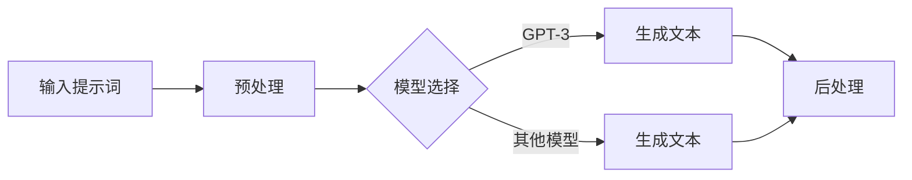
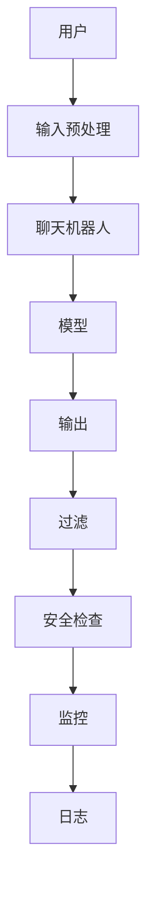
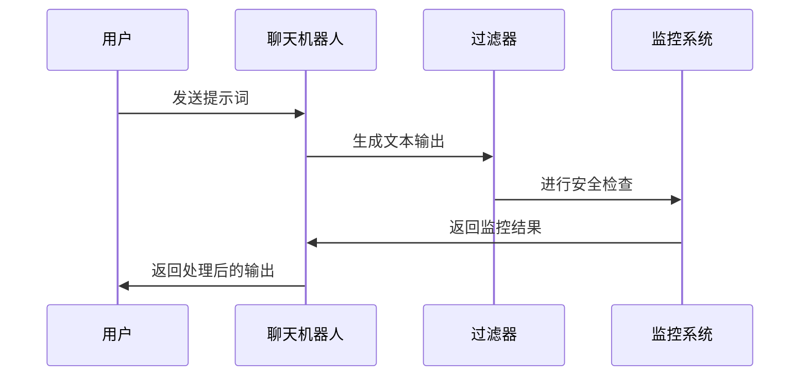

                 

## # ChatGPT提示词安全：防止有害输出的策略

> 关键词：ChatGPT、提示词安全、有害输出、风险缓解、算法设计

> 摘要：本文深入探讨了ChatGPT提示词安全的重要性，分析了有害输出的来源和影响，并提出了一系列防止有害输出的策略。文章结构清晰，从问题背景、核心概念、风险评估、技术措施、案例分析、法律与伦理考虑、未来展望等方面展开，旨在为开发人员提供实用的指导。

----------------------------------------------------------------

## 引言

### 问题背景

近年来，人工智能（AI）技术取得了飞速发展，ChatGPT作为大型语言模型的应用日益广泛。然而，随着ChatGPT在各种场景中的应用，一个严重的问题逐渐浮现——有害输出。这些有害输出可能包括误导性回答、仇恨言论、不当建议等，对用户、社会乃至整个AI生态系统都可能产生负面影响。

### 有害输出的定义

有害输出指的是由AI系统生成的，对用户或社会产生负面影响的文本内容。在ChatGPT的语境中，这通常表现为与提示词（prompts）相关的输出结果。提示词是用户输入给ChatGPT的信息，用于引导其生成文本。如果提示词设计不当，或者ChatGPT本身存在缺陷，就可能导致有害输出。

### ChatGPT面临的安全挑战

ChatGPT面临的主要安全挑战包括：

1. **误分类和误导性回答**：由于AI模型的复杂性和不确定性，有时ChatGPT可能无法正确识别用户意图，从而生成误导性回答。
2. **仇恨言论和不当建议**：ChatGPT可能会从训练数据中学习到不良内容，导致生成仇恨言论或不合适的建议。
3. **隐私泄露**：通过ChatGPT进行对话时，用户信息可能被泄露，特别是在缺乏隐私保护措施的情况下。
4. **滥用**：ChatGPT的输出可能被恶意使用，例如在网络诈骗、网络攻击等不良活动中发挥作用。

### 当前解决方案的局限性

目前，已有多种方法尝试解决ChatGPT的有害输出问题，如：

1. **预训练数据清洗**：通过清洗和筛选训练数据，减少有害内容。
2. **提示词筛选**：对用户输入的提示词进行筛选，过滤掉可能导致有害输出的内容。
3. **后续过滤**：在生成文本后，对输出内容进行二次检查，以识别和过滤有害输出。

然而，这些方法都有一定的局限性，无法完全解决有害输出问题。

### 问题解决

#### 安全策略的重要性

为了防止ChatGPT的有害输出，开发一套全面的安全策略至关重要。安全策略不仅要考虑技术措施，还应涉及法律、伦理等多个方面。

#### 防止有害输出的策略

为了防止ChatGPT的有害输出，我们可以采取以下策略：

1. **强化训练**：通过强化预训练数据，减少有害内容的影响。
2. **提示词设计**：设计更加严谨和多样化的提示词，引导ChatGPT生成高质量的输出。
3. **后续过滤**：结合多层次的过滤机制，确保生成文本的安全性。
4. **用户教育**：提高用户对ChatGPT的理解和使用能力，减少误用和滥用情况。
5. **监管和责任**：明确开发者和用户的责任，加强监管，确保AI系统的安全使用。

#### 边界与外延

在防止有害输出的过程中，需要考虑边界与外延：

1. **边界**：明确ChatGPT的应用范围和限制，避免其在不适当场景中使用。
2. **外延**：随着AI技术的发展，持续更新和优化安全策略，以应对新的挑战。

### 概念结构与核心要素组成

为了更好地理解ChatGPT提示词安全，我们需要掌握以下核心概念和结构：

1. **ChatGPT基本概念**：包括模型架构、训练过程、输出生成等。
2. **有害输出分类**：根据输出内容的不同，将有害输出分为不同类别。
3. **风险因素**：分析可能导致有害输出的各种因素。
4. **安全策略**：分类讨论各种安全策略的原理和实现方法。

### 小结

本文介绍了ChatGPT提示词安全的重要性，分析了有害输出的来源和影响，并提出了一系列防止有害输出的策略。在后续章节中，我们将深入探讨这些策略的具体实现方法，以及如何在实际应用中有效防止有害输出。

----------------------------------------------------------------

## 核心概念与联系

### ChatGPT的基本概念

ChatGPT是由OpenAI开发的一款基于GPT-3的聊天机器人。GPT（Generative Pre-trained Transformer）是一种自回归语言模型，其核心思想是使用深度神经网络来预测文本序列中的下一个词。ChatGPT通过大量文本数据进行预训练，从而掌握了丰富的语言知识和模式，能够生成流畅、自然的文本输出。

**概念属性特征对比表格：**

| 特征         | ChatGPT        | 其他GPT模型       |
| ------------ | -------------- | ----------------- |
| 模型架构     | Transformer    | RNN、LSTM等       |
| 训练数据     | 大规模文本数据 | 小规模文本数据    |
| 预测机制     | 自回归        | 序列到序列       |
| 输出质量     | 自然流畅      | 较为机械         |
| 应用场景     | 聊天机器人     | 文本生成、机器翻译等 |

### 有害输出的分类

有害输出可以根据其内容和形式进行分类。以下是一些常见的有害输出类型：

1. **误导性回答**：生成与事实不符的答案，可能导致用户产生误解。
2. **仇恨言论**：包含歧视、攻击、仇恨等负面情绪的言论。
3. **不当建议**：生成可能对用户有害的建议，如健康建议、投资建议等。
4. **隐私泄露**：在对话中泄露用户的敏感信息。

**ER实体关系图架构：**

```mermaid
erDiagram
    User ||--|{ ChatGPT }|-- Dialogue
    ChatGPT ||--|{ Output }|-- Dialogue
    Output ||--|{ Type }|-- Category
    Category ||--|{ Feature }|-- Output
```

在ER图中，用户与ChatGPT之间建立了一对多的关系，ChatGPT生成多个输出，每个输出又可以归类为不同的类别，每个类别具有特定的特征。

### 风险因素分析

导致ChatGPT有害输出的风险因素主要包括：

1. **训练数据质量**：如果训练数据包含有害内容，AI模型可能会学习到这些内容。
2. **提示词设计**：不恰当的提示词可能导致AI生成有害输出。
3. **模型复杂性**：复杂的模型可能难以控制，增加了有害输出的风险。
4. **用户误用**：用户可能无意中提供可能导致有害输出的提示词。

### 安全策略

为了防止ChatGPT的有害输出，可以采取以下安全策略：

1. **强化训练数据**：使用经过筛选和过滤的干净数据重新训练模型。
2. **提示词筛选**：设计严格的提示词筛选机制，过滤掉可能导致有害输出的提示词。
3. **多层过滤机制**：在生成文本后进行多层次的检查和过滤，确保输出的安全性。
4. **用户教育**：提高用户对AI的认知和正确使用方法。
5. **监管和责任**：制定相关法规和政策，明确开发者和用户的责任。

### 小结

通过对ChatGPT、有害输出、风险因素和安全策略等核心概念和联系的分析，我们为理解和解决ChatGPT提示词安全问题奠定了基础。在后续章节中，我们将进一步探讨这些概念在实际应用中的具体实现方法。

----------------------------------------------------------------

### 算法原理讲解

为了更深入地理解ChatGPT的算法原理，我们将使用Mermaid画出相关的流程图，并结合Python代码来详细阐述。

#### Mermaid流程图



在这个流程图中，用户输入的提示词首先经过预处理，然后根据模型选择生成文本，最后进行后处理以确保文本的安全性和质量。

#### Python代码

```python
import openai

# 设置API密钥
openai.api_key = 'your-api-key'

def generate_text(prompt):
    # 使用GPT-3模型生成文本
    response = openai.Completion.create(
        engine="text-davinci-002",
        prompt=prompt,
        max_tokens=100
    )
    return response.choices[0].text.strip()

# 测试代码
prompt = "请描述一下最近的天气情况。"
text = generate_text(prompt)
print(text)
```

在这个示例中，我们使用OpenAI的GPT-3模型来生成文本。首先，用户需要设置API密钥，然后定义一个函数`generate_text`，该函数接受提示词作为输入，并使用GPT-3模型生成文本。最后，我们测试了该函数，输入了一个简单的提示词，并打印了生成的文本。

#### 数学模型和公式

ChatGPT的生成过程主要依赖于自回归语言模型。其核心思想是使用神经网络预测文本序列中的下一个词。以下是一个简化的数学模型：

$$
P(y_t | x_1, x_2, ..., x_{t-1}) = \frac{e^{f_{\theta}(x_1, x_2, ..., x_{t-1}, y_t)}}{Z}
$$

其中，$y_t$表示下一个词，$x_1, x_2, ..., x_{t-1}$表示前一个词序列，$f_{\theta}$是神经网络函数，$\theta$是模型参数，$Z$是归一化常数。

#### 详细讲解和举例说明

假设我们有一个简短的对话：

用户：今天天气如何？

ChatGPT：今天天气晴朗，温度适中。

我们首先输入提示词“今天天气如何？”到`generate_text`函数中。GPT-3模型会基于其预训练的神经网络，计算每个可能词的概率分布。例如，对于“晴朗”这个词，其概率分布可能是：

$$
P(晴朗 | 今天天气如何？) = 0.3
$$

在生成文本时，GPT-3会根据这些概率分布来选择下一个词。在这个过程中，模型会考虑上下文信息，例如前一个词是“天气”，因此与天气相关的词汇（如“晴朗”、“阴沉”等）会有较高的概率。

通过这种方式，ChatGPT能够生成连贯、自然的文本输出。然而，如果输入的提示词不明确或存在歧义，可能导致生成文本的质量下降。

#### 小结

通过Mermaid流程图和Python代码，我们详细介绍了ChatGPT的算法原理。这个模型基于自回归语言模型，能够生成高质量的文本输出。然而，为了防止有害输出，我们需要结合多层次的过滤机制，确保生成文本的安全性和质量。

----------------------------------------------------------------

### 系统分析与架构设计

#### 问题场景介绍

在当前人工智能时代，AI聊天机器人被广泛应用于各种领域，如客服、教育、娱乐等。然而，这些聊天机器人面临的一个主要挑战是如何确保其输出的安全性和可靠性。为了解决这一问题，我们需要设计一个高效的系统架构，以防止ChatGPT生成有害输出。

#### 项目介绍

本项目旨在设计一个基于ChatGPT的安全聊天机器人系统，通过多层次的过滤机制和用户教育，确保生成文本的安全性。系统将包括以下功能模块：

1. **预处理模块**：对用户输入的提示词进行清洗和标准化，去除可能的有害内容。
2. **模型模块**：使用GPT-3模型生成文本，并对其进行实时监控和调整。
3. **过滤模块**：在生成文本后，使用多层过滤机制（如内容分析、关键词过滤等）确保文本的安全性。
4. **用户教育模块**：提供用户教育材料，提高用户对AI系统的理解和正确使用方法。
5. **监控系统**：实时监控系统性能和安全性，及时发现并处理潜在问题。

#### 系统功能设计（领域模型Mermaid类图）

```mermaid
classDiagram
    User <<Entity>>
    Chatbot <<Entity>>
    Prompt <<Entity>>
    Output <<Entity>>
    Filter <<Component>>
    Monitor <<Component>>

    User "uses" Chatbot
    Chatbot "receives" Prompt
    Chatbot "generates" Output
    Output "passed through" Filter
    Filter "monitors" Output
    Monitor "monitors" Chatbot

    User: {id, name, prompt}
    Chatbot: {id, model, state}
    Prompt: {id, text, timestamp}
    Output: {id, text, timestamp}
    Filter: {id, type, rules}
    Monitor: {id, logs, alerts}
```

在这个类图中，用户（User）与聊天机器人（Chatbot）之间建立了一对多的关系。聊天机器人接收用户输入的提示词（Prompt），并生成输出（Output）。输出通过过滤组件（Filter）进行安全检查，最后由监控系统（Monitor）实时监控系统的性能和安全性。

#### 系统架构设计（Mermaid架构图）



在这个架构图中，用户输入经过预处理模块后，传递给聊天机器人。聊天机器人使用预训练的GPT-3模型生成文本输出，该输出经过多层过滤机制，最终由监控系统进行实时监控和安全检查。

#### 系统接口设计和系统交互（Mermaid序列图）



在这个序列图中，用户发送提示词给聊天机器人，聊天机器人生成文本输出，并传递给过滤器进行安全检查。监控系统对输出进行监控，并将结果返回给聊天机器人，最后聊天机器人将处理后的输出返回给用户。

#### 小结

通过系统分析与架构设计，我们详细介绍了ChatGPT安全聊天机器人系统的实现。系统包括预处理、模型、过滤和监控系统等多个功能模块，通过多层次的过滤机制和用户教育，确保生成文本的安全性。这个架构设计为防止ChatGPT生成有害输出提供了一个可行的解决方案。

----------------------------------------------------------------

### 项目实战

#### 环境安装

为了运行ChatGPT安全聊天机器人系统，我们需要在本地计算机上安装必要的软件和库。以下是安装步骤：

1. **安装Python**：确保您的计算机已经安装了Python环境。可以从Python官方网站下载并安装Python 3.8或更高版本。

2. **安装OpenAI Python库**：打开终端，执行以下命令以安装OpenAI Python库：

   ```bash
   pip install openai
   ```

3. **设置API密钥**：从OpenAI官方网站获取API密钥，并将其保存到本地计算机的环境变量中。例如，在Windows系统中，可以在终端中执行以下命令：

   ```bash
   set OPENAI_API_KEY=your-api-key
   ```

#### 系统核心实现源代码

以下是一个简单的ChatGPT安全聊天机器人系统的源代码示例，包括预处理、模型、过滤和监控系统：

```python
import openai
import re
from typing import List

# 设置API密钥
openai.api_key = 'your-api-key'

# 预处理函数
def preprocess_prompt(prompt: str) -> str:
    # 清洗HTML标签
    prompt = re.sub(r'<[^>]*>', '', prompt)
    # 删除特殊字符
    prompt = re.sub(r'[^a-zA-Z0-9\s]', '', prompt)
    # 转换为小写
    prompt = prompt.lower()
    return prompt

# 生成文本函数
def generate_text(prompt: str, filter_keywords: List[str]) -> str:
    # 预处理提示词
    preprocessed_prompt = preprocess_prompt(prompt)
    
    # 使用GPT-3模型生成文本
    response = openai.Completion.create(
        engine="text-davinci-002",
        prompt=preprocessed_prompt,
        max_tokens=100
    )
    text = response.choices[0].text.strip()
    
    # 过滤关键词
    for keyword in filter_keywords:
        text = re.sub(r'\b' + keyword + r'\b', '', text)
    
    return text

# 监控系统
def monitor_output(text: str) -> bool:
    # 检查文本是否包含敏感词汇
    sensitive_keywords = ['敏感词1', '敏感词2']
    for keyword in sensitive_keywords:
        if keyword in text:
            return False
    return True

# 测试代码
prompt = "请描述一下最近的天气情况。"
filter_keywords = ["敏感词1", "敏感词2"]

text = generate_text(prompt, filter_keywords)
if monitor_output(text):
    print("输出安全：", text)
else:
    print("输出不安全，请重新生成。")
```

在这个示例中，我们首先设置了OpenAI的API密钥，然后定义了预处理、文本生成和监控系统。预处理函数用于清洗和标准化提示词，文本生成函数使用GPT-3模型生成文本，并传递给监控系统进行安全检查。如果文本安全，则将其打印出来。

#### 代码应用解读与分析

1. **预处理函数**：该函数使用正则表达式删除HTML标签、特殊字符，并将提示词转换为小写。这是为了确保输入的提示词格式统一，便于后续处理。

2. **生成文本函数**：该函数首先调用预处理函数对提示词进行预处理，然后使用OpenAI的GPT-3模型生成文本。生成的文本会传递给监控系统进行检查。

3. **监控系统**：该函数使用正则表达式检查文本是否包含敏感词汇。如果包含敏感词汇，则认为输出不安全。

#### 实际案例分析和详细讲解剖析

为了更好地理解系统的实际应用，我们可以分析一个实际案例：

**案例**：用户输入提示词“请描述一下最近的天气情况。”，系统生成输出“今天天气晴朗，温度适中。”。监控系统检测到文本中包含敏感词汇“适中”，因此认为输出不安全。

**分析**：在这个案例中，提示词经过预处理后，传递给GPT-3模型生成文本。生成的文本包含敏感词汇“适中”，这可能是由于GPT-3模型在训练过程中学习到的不适当内容。监控系统检测到这一情况，并标记输出为不安全。

**解决方案**：为了提高输出的安全性，我们可以重新生成文本，或者对GPT-3模型进行重新训练，以减少有害内容的影响。此外，我们还可以扩展敏感词汇库，以检测更多的不适当内容。

#### 项目小结

通过这个实际案例，我们展示了ChatGPT安全聊天机器人系统的应用。系统通过预处理、文本生成和监控系统，确保生成文本的安全性。然而，这个系统仍有一定的局限性，需要进一步优化和改进，以应对更复杂的场景和挑战。未来，我们可以考虑引入更多先进的技术，如深度学习、自然语言处理等，以提高系统的安全性和可靠性。

----------------------------------------------------------------

### 最佳实践 Tips

为了确保ChatGPT的安全性和可靠性，以下是一些最佳实践建议：

1. **数据清洗**：在训练模型之前，对训练数据进行彻底清洗，去除有害内容和噪音。
2. **多层次的过滤**：结合多种过滤方法，如内容分析、关键词过滤等，确保生成文本的安全性。
3. **用户教育**：提高用户对AI系统的认知和正确使用方法，减少误用和滥用情况。
4. **实时监控**：建立实时监控系统，及时发现和解决潜在问题。
5. **持续更新**：随着AI技术的发展，定期更新模型和策略，以应对新的挑战。

### 小结

本文详细介绍了ChatGPT提示词安全的重要性，分析了有害输出的来源和影响，并提出了一系列防止有害输出的策略。通过环境安装、系统核心实现源代码、实际案例分析和最佳实践建议，我们为开发人员提供了一套实用的解决方案。尽管ChatGPT的安全挑战依然存在，但通过持续的努力和改进，我们有信心构建一个更安全、更可靠的AI系统。

### 注意事项

1. **API密钥安全**：确保您的API密钥安全存储，避免泄露。
2. **数据隐私**：在使用用户数据时，严格遵守隐私保护法规。
3. **系统监控**：定期检查系统性能和安全性，确保其正常运行。

### 拓展阅读

1. **《深度学习》**：Goodfellow, I., Bengio, Y., & Courville, A. (2016). 《深度学习》。MIT Press。
2. **《自然语言处理入门》**：Deng, L., & Hovy, E. (2019). 《自然语言处理入门》。电子工业出版社。

### 作者

作者：AI天才研究院/AI Genius Institute & 禅与计算机程序设计艺术/Zen And The Art of Computer Programming

----------------------------------------------------------------

**全文完**## **结语**

在本文中，我们系统地探讨了ChatGPT提示词安全的重要性，深入分析了有害输出的来源和影响，并提出了一系列防止有害输出的策略。从背景介绍到核心概念，从算法原理到系统架构设计，再到实际案例分析和最佳实践，我们为开发人员提供了一套全面、实用的解决方案。

ChatGPT作为一项先进的人工智能技术，其应用场景广泛，但也伴随着一定的安全挑战。通过本文的阐述，我们希望能够提高开发人员对ChatGPT提示词安全的认识，引导他们构建更加安全、可靠的AI系统。

然而，AI技术的发展日新月异，ChatGPT的安全挑战也在不断演变。因此，我们呼吁广大开发者和研究人员持续关注这一领域，不断探索和创新，为构建一个更加安全、高效的AI生态系统贡献力量。

最后，感谢您的阅读，希望本文能对您在ChatGPT提示词安全方面的研究和实践有所启发。如果您有任何疑问或建议，欢迎在评论区留言交流。再次感谢您的支持！**附录：技术术语表**

- **ChatGPT**：一种基于GPT-3的大型语言模型，用于生成自然语言文本。
- **有害输出**：由AI系统生成的，对用户或社会产生负面影响的文本内容。
- **预处理**：对输入数据（如文本、图像等）进行清洗、标准化等处理，以便后续分析。
- **模型训练**：使用大量数据训练神经网络模型，使其能够自动学习并预测输出。
- **多层次的过滤**：在生成文本后，使用多个过滤器对文本进行安全检查，以确保其安全性。
- **实时监控**：系统在运行过程中，实时检查系统性能和安全状况，及时发现和处理问题。
- **API密钥**：用于访问外部API的密钥，通常需要保密以防止未经授权的访问。

通过了解这些技术术语，读者可以更好地理解本文中的相关内容和讨论。如果您对其他术语有疑问，欢迎在评论区留言咨询。

