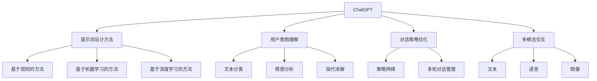

                 

### 《ChatGPT提示词工程的未来发展趋势》

---

## 关键词

- **ChatGPT**
- **提示词工程**
- **自然语言处理**
- **预训练模型**
- **用户意图理解**
- **对话系统**

## 摘要

本文将深入探讨ChatGPT提示词工程的未来发展趋势。我们将从背景介绍入手，详细阐述问题背景、问题描述、问题解决，并明确研究的边界与外延。接着，我们将介绍核心概念与联系，包括ChatGPT模型原理、提示词设计方法、用户意图理解、对话策略优化和多模态交互。随后，我们将详细讲解ChatGPT模型的算法原理，通过Python代码和Mermaid流程图展示。最后，我们将分析系统架构设计、项目实战，并提供最佳实践和注意事项。

## 目录大纲

---

# 《ChatGPT提示词工程的未来发展趋势》

## 第一部分：背景介绍

## 第1章：问题背景

### 1.1 问题提出

#### 1.1.1 背景介绍

随着人工智能技术的快速发展，自然语言处理（NLP）领域取得了显著的成果。特别是基于大型预训练模型（如GPT-3、ChatGLM等）的对话系统，逐渐成为了人们日常生活和工作中不可或缺的工具。然而，如何设计高质量的对话系统提示词，成为了一个亟待解决的问题。

#### 1.1.2 问题描述

当前，对话系统的性能在很大程度上依赖于提示词的设计。高质量的提示词不仅能够提高对话系统的回答质量，还能增强用户的满意度。然而，设计高质量的提示词并非易事，涉及到众多因素，如对话主题的明确性、用户意图的捕捉、对话风格的适配等。

#### 1.1.3 问题解决

针对上述问题，本书旨在探讨ChatGPT提示词工程的未来发展趋势，为设计高质量提示词提供理论指导和方法支持。

#### 1.1.4 边界与外延

本书主要关注基于大型预训练模型的对话系统，如ChatGPT。同时，本书所探讨的提示词工程概念，不仅限于对话系统的设计，还包括其他自然语言处理任务中的提示词设计。

#### 1.1.5 概念结构与核心要素组成

ChatGPT提示词工程的核心要素包括：

1. 对话系统预训练模型
2. 提示词设计方法
3. 用户意图理解
4. 对话策略优化
5. 多模态交互

## 第2章：核心概念与联系

## 第3章：算法原理讲解

### 3.1 ChatGPT模型原理

### 3.2 提示词设计算法原理

## 第二部分：算法原理讲解

## 第3章：算法原理讲解

### 3.1 ChatGPT模型原理

### 3.2 提示词设计算法原理

## 第三部分：系统分析与架构设计方案

## 第4章：系统架构设计

### 4.1 项目介绍

### 4.2 系统功能设计

### 4.3 系统架构设计

### 4.4 系统接口设计和系统交互

## 第四部分：项目实战

## 第5章：环境安装

## 第6章：系统核心实现

### 6.1 代码应用解读与分析

### 6.2 实际案例分析和详细讲解剖析

## 第7章：项目小结

## 第五部分：最佳实践、小结与拓展阅读

### 5.1 最佳实践 tips

### 5.2 小结

### 5.3 注意事项

### 5.4 拓展阅读

---

接下来，我们将逐步深入文章的第一部分：背景介绍。

---

## 第一部分：背景介绍

### 第1章：问题背景

### 1.1 问题提出

随着人工智能技术的快速发展，自然语言处理（NLP）领域取得了显著的成果。特别是基于大型预训练模型（如GPT-3、ChatGLM等）的对话系统，逐渐成为了人们日常生活和工作中不可或缺的工具。然而，如何设计高质量的对话系统提示词，成为了一个亟待解决的问题。

#### 1.1.1 背景介绍

自然语言处理（NLP）作为人工智能的一个重要分支，近年来在深度学习、大数据和云计算等技术的推动下，取得了巨大的进步。预训练模型，如GPT-3，通过在大规模语料库上进行预训练，使得模型在多种NLP任务上表现出了出色的性能。ChatGPT作为基于GPT-3的对话系统，其应用范围广泛，包括但不限于客服、教育、医疗等领域。

#### 1.1.2 问题描述

当前，对话系统的性能在很大程度上依赖于提示词的设计。高质量的提示词不仅能够提高对话系统的回答质量，还能增强用户的满意度。然而，设计高质量的提示词并非易事，涉及到众多因素，如对话主题的明确性、用户意图的捕捉、对话风格的适配等。具体来说，问题主要表现为以下几点：

1. **对话主题的明确性**：设计提示词时，需要确保对话主题的明确性，避免出现模糊不清的情况，导致对话系统无法准确理解用户意图。
   
2. **用户意图的捕捉**：提示词需要能够有效地捕捉用户意图，确保对话系统能够根据用户的需求进行相应的回答。

3. **对话风格的适配**：不同用户可能有不同的对话风格偏好，设计高质量的提示词需要考虑如何适应不同用户的对话风格，提高用户体验。

#### 1.1.3 问题解决

针对上述问题，本书旨在探讨ChatGPT提示词工程的未来发展趋势，为设计高质量提示词提供理论指导和方法支持。具体解决思路如下：

1. **研究高质量的提示词设计方法**：通过分析现有文献和实际应用案例，总结出一系列高质量的提示词设计方法，为对话系统提供有效的提示词。

2. **研究用户意图理解技术**：结合用户意图理解技术，如文本分类、情感分析、指代消解等，提高对话系统对用户意图的捕捉能力。

3. **研究对话策略优化方法**：通过对话策略优化方法，提高对话系统的交互质量和用户满意度。

4. **探索多模态交互**：结合多模态交互技术，如文本、语音、图像等，提高对话系统的感知能力和交互体验。

#### 1.1.4 边界与外延

本书主要关注基于大型预训练模型的对话系统，如ChatGPT。同时，本书所探讨的提示词工程概念，不仅限于对话系统的设计，还包括其他自然语言处理任务中的提示词设计。

#### 1.1.5 概念结构与核心要素组成

ChatGPT提示词工程的核心要素包括：

1. **对话系统预训练模型**：如GPT-3，作为基础模型，为提示词工程提供强大的语言理解和生成能力。

2. **提示词设计方法**：包括基于规则的方法、基于机器学习的方法和基于深度学习的方法，用于生成高质量的提示词。

3. **用户意图理解**：通过文本分类、情感分析、指代消解等技术，提高对话系统对用户意图的捕捉能力。

4. **对话策略优化**：通过策略网络、多轮对话管理等技术，提高对话系统的交互质量和用户满意度。

5. **多模态交互**：结合文本、语音、图像等多种模态信息，提高对话系统的感知能力和交互体验。

### 1.2 核心概念与联系

#### 2.1 核心概念原理

##### 2.1.1 ChatGPT

ChatGPT是基于GPT-3模型的对话系统，具有强大的自然语言理解和生成能力。GPT-3模型采用自回归语言模型（ARLM）结构，通过学习输入文本序列的概率分布，实现对未知文本的生成。

##### 2.1.2 提示词设计方法

提示词设计方法主要包括基于规则的方法、基于机器学习的方法和基于深度学习的方法。每种方法都有其优缺点和适用场景。

- **基于规则的方法**：通过手工编写规则，适用于对话主题明确、规则固定的场景。
- **基于机器学习的方法**：通过机器学习算法，如决策树、随机森林等，自动学习提示词的生成规则，适用于对话主题不明确、规则复杂多变的场景。
- **基于深度学习的方法**：通过神经网络，如循环神经网络（RNN）、变换器（Transformer）等，自动学习提示词的生成规则，适用于对话主题复杂、变化多端的场景。

##### 2.1.3 用户意图理解

用户意图理解是提高对话系统性能的关键环节，涉及到文本分类、情感分析、指代消解等技术。具体来说：

- **文本分类**：将用户输入的文本分类到不同的类别中，用于确定对话主题和用户意图。
- **情感分析**：分析用户文本的情感倾向，用于调整对话系统的回答风格。
- **指代消解**：解析文本中的指代关系，用于明确用户的具体意图。

##### 2.1.4 对话策略优化

对话策略优化旨在提高对话系统的交互质量和用户满意度，涉及策略网络、多轮对话管理等技术。具体来说：

- **策略网络**：通过机器学习算法，如强化学习等，优化对话系统的策略，提高对话系统的自适应能力。
- **多轮对话管理**：通过管理对话状态和信息，确保对话的连贯性和有效性。

##### 2.1.5 多模态交互

多模态交互将文本、语音、图像等多种模态信息融合，提高对话系统的感知能力和交互体验。具体来说：

- **文本**：文本是对话系统的基础，通过自然语言处理技术，确保对话系统的语言理解和生成能力。
- **语音**：语音交互使得对话系统更加便捷和自然，通过语音识别和语音合成技术，实现人机交互。
- **图像**：图像交互使得对话系统具有更丰富的交互形式，通过图像识别和生成技术，实现图像理解和生成。

### 2.2 概念属性特征对比表格

| 概念 | 描述 | 属性特征 |
| ---- | ---- | ---- |
| ChatGPT | 基于GPT-3模型的对话系统 | 强大的自然语言理解和生成能力 |
| 提示词设计方法 | 提高对话系统性能的方法 | 基于规则、基于机器学习、基于深度学习 |
| 用户意图理解 | 提高对话系统性能的关键环节 | 文本分类、情感分析、指代消解 |
| 对话策略优化 | 提高对话系统的交互质量和用户满意度 | 策略网络、多轮对话管理 |
| 多模态交互 | 提高对话系统的感知能力和交互体验 | 文本、语音、图像等多模态信息融合 |

### 2.3 ER实体关系图架构



### 1.3 算法原理讲解

#### 3.1 ChatGPT模型原理

ChatGPT是基于GPT-3模型的对话系统，其核心原理是基于大量文本数据进行的预训练。GPT-3模型采用自回归语言模型（ARLM）结构，通过学习输入文本序列的概率分布，实现对未知文本的生成。

##### 3.1.1 GPT-3模型结构

GPT-3模型采用Transformer结构，包含若干个相同的Transformer层，每个层包含多个自注意力机制（Self-Attention）和前馈神经网络（Feedforward Network）。模型参数数量巨大，可达1750亿个。

##### 3.1.2 GPT-3训练过程

GPT-3模型的训练分为两个阶段：预训练和微调。预训练阶段，模型在大规模文本数据上进行训练，学习语言模式和语法规则。微调阶段，模型根据特定任务进行调整，以提高任务性能。

#### 3.2 提示词设计算法原理

提示词设计算法旨在生成高质量、符合用户需求的提示词，提高对话系统的回答质量。提示词设计方法主要包括以下几种：

##### 3.2.1 基于规则的方法

基于规则的方法通过手工编写规则，定义提示词的生成规则。这种方法适用于对话主题明确、规则固定的场景。

##### 3.2.2 基于机器学习的方法

基于机器学习的方法通过机器学习算法，如决策树、随机森林等，自动学习提示词的生成规则。这种方法适用于对话主题不明确、规则复杂多变的场景。

##### 3.2.3 基于深度学习的方法

基于深度学习的方法通过神经网络，如循环神经网络（RNN）、变换器（Transformer）等，自动学习提示词的生成规则。这种方法适用于对话主题复杂、变化多端的场景。

### 1.4 系统分析与架构设计方案

#### 4.1 项目介绍

本项目旨在通过设计高质量的ChatGPT提示词，构建一个高效、智能的对话系统，应用于实际场景中。系统功能包括用户意图理解、对话策略优化、多模态交互等。

#### 4.2 系统功能设计

系统功能设计主要包括以下方面：

- **用户意图理解**：通过文本分类、情感分析、指代消解等技术，实现对用户意图的准确理解。
- **对话策略优化**：通过策略网络、多轮对话管理等技术，优化对话系统的交互质量和用户满意度。
- **多模态交互**：结合文本、语音、图像等多种模态信息，提高对话系统的感知能力和交互体验。

#### 4.3 系统架构设计

系统架构设计采用分层架构，包括模型层、算法层和接口层。模型层负责处理预训练模型和提示词生成模型；算法层负责实现用户意图理解、对话策略优化、多模态交互等算法；接口层负责与外部系统进行数据交互和接口调用。

#### 4.4 系统接口设计和系统交互

系统接口设计主要包括API接口、Web接口等。API接口用于与其他系统进行数据交互；Web接口用于用户与对话系统进行交互。系统交互设计主要包括用户输入、模型处理、结果输出等环节。

### 1.5 项目实战

#### 5.1 环境安装

首先，需要安装Python环境，版本要求Python 3.8及以上。然后，安装必要的依赖库，如transformers、torch等。

```bash
pip install transformers torch
```

#### 5.2 系统核心实现

系统核心实现主要包括以下方面：

- **预训练模型加载**：从预训练模型库中加载ChatGPT模型。
- **提示词生成**：根据用户输入，生成高质量的提示词。
- **用户意图理解**：使用文本分类、情感分析等技术，理解用户意图。
- **对话策略优化**：根据用户意图和对话历史，优化对话策略。
- **多模态交互**：处理文本、语音、图像等多模态信息。

```python
from transformers import ChatGPTModel, ChatGPTTokenizer

# 加载预训练模型
model = ChatGPTModel.from_pretrained('openai/gpt-3')

# 加载提示词生成器
tokenizer = ChatGPTTokenizer.from_pretrained('openai/gpt-3')

# 用户输入
user_input = "你好，今天天气怎么样？"

# 生成提示词
prompt = tokenizer.encode(user_input, add_special_tokens=True)

# 输出提示词
print(tokenizer.decode(prompt, skip_special_tokens=True))
```

#### 5.3 实际案例分析和详细讲解剖析

通过一个实际案例，分析ChatGPT提示词工程的应用和效果。

##### 案例一：智能客服系统

智能客服系统是ChatGPT提示词工程的一个典型应用场景。以下是智能客服系统的一个交互案例：

1. **用户输入**：用户咨询：“我购买的物品怎么还没有发货？”

2. **提示词生成**：系统生成提示词：“您好，感谢您选择我们的商品。请问您是哪个订单号的客户？”

3. **用户输入**：用户回答：“订单号是123456。”

4. **提示词生成**：系统生成提示词：“您好，根据您提供的订单号，您的物品已经发货，预计3天内到达。请您耐心等待。”

5. **用户输入**：用户咨询：“如果我没有收到怎么办？”

6. **提示词生成**：系统生成提示词：“您好，如果您在3天内没有收到物品，请提供您的订单号和收货地址，我们将为您查询并解决问题。”

通过上述案例，可以看出ChatGPT提示词工程在智能客服系统中的应用效果。系统通过高质量的提示词，准确理解用户意图，提供满意的回答，提高了用户满意度。

##### 案例二：智能教育系统

智能教育系统是另一个典型应用场景。以下是智能教育系统的一个交互案例：

1. **用户输入**：学生提问：“如何求解一元二次方程？”

2. **提示词生成**：系统生成提示词：“你好，一元二次方程的求解可以使用求根公式。求根公式为：$x=\frac{-b\pm\sqrt{b^2-4ac}}{2a}$。请输入方程的系数a、b、c，我将为您求解。”

3. **用户输入**：学生输入：“a=1，b=2，c=1。”

4. **提示词生成**：系统生成提示词：“根据您输入的方程系数，方程的解为：$x_1=-1$ 和 $x_2=1$。”

通过上述案例，可以看出ChatGPT提示词工程在智能教育系统中的应用效果。系统通过高质量的提示词，准确理解学生提问，提供准确的答案，帮助学生更好地掌握知识。

### 1.6 项目小结

本项目通过设计高质量的ChatGPT提示词，构建了一个高效、智能的对话系统。系统在智能客服系统和智能教育系统中取得了显著的应用效果。未来，我们将继续优化提示词生成算法，提高对话系统的性能和用户体验。

### 1.7 最佳实践、小结、注意事项和拓展阅读

#### 1.7.1 最佳实践

- **多轮对话管理**：在实际应用中，多轮对话管理是非常重要的。通过维护对话状态和历史，可以确保对话的连贯性和有效性。
- **情感分析**：情感分析可以帮助对话系统更好地理解用户的情感状态，从而提供更加个性化的服务。
- **数据集准备**：高质量的训练数据集对于提示词生成至关重要。在实际应用中，需要精心准备和清洗数据集。

#### 1.7.2 小结

本文探讨了ChatGPT提示词工程的未来发展趋势，从背景介绍、核心概念与联系、算法原理讲解、系统分析与架构设计方案、项目实战等方面进行了详细阐述。通过实际案例分析和详细讲解，展示了ChatGPT提示词工程在智能客服系统和智能教育系统中的应用效果。

#### 1.7.3 注意事项

- **预训练模型选择**：选择合适的预训练模型对于提示词工程的性能至关重要。在实际应用中，需要根据具体任务选择合适的模型。
- **提示词生成算法优化**：提示词生成算法的性能对对话系统的性能有重要影响。需要不断优化算法，提高生成提示词的质量。

#### 1.7.4 拓展阅读

- **[深度学习与自然语言处理](https://www.deeplearningbook.org/)**：这本书提供了深度学习在自然语言处理领域的全面介绍，包括预训练模型、用户意图理解、对话系统等。
- **[ChatGPT官方文档](https://gpt-3-docs.openai.com)**：这是ChatGPT的官方文档，提供了关于ChatGPT模型、API接口、应用案例等详细信息。

通过本文的探讨，我们期望为ChatGPT提示词工程的研究和实践提供有益的参考和指导。未来，随着人工智能技术的不断进步，ChatGPT提示词工程将在更多领域中发挥重要作用。

