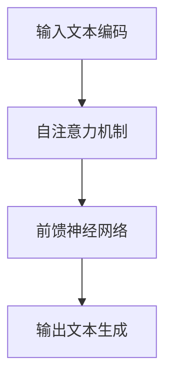
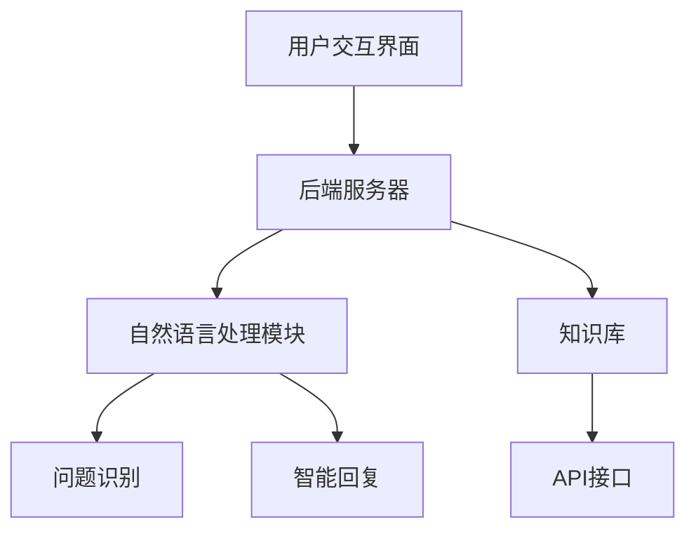
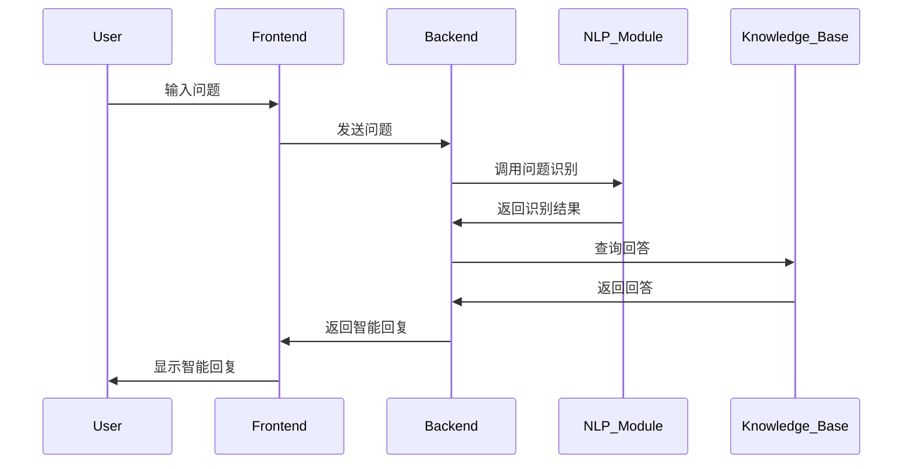

                 

### 背景介绍

#### ChatGPT的崛起

在人工智能领域，GPT（Generative Pre-trained Transformer）模型无疑是一个里程碑式的创新。ChatGPT，作为GPT家族中的重要成员，凭借其强大的自然语言处理能力和出色的对话生成能力，迅速引起了全球的关注。ChatGPT是由OpenAI开发的一种基于GPT-3模型的聊天机器人，它能够通过大量文本数据的学习，生成连贯、自然的文本回应。ChatGPT的成功不仅在于其技术突破，更在于其广阔的应用前景，从客服机器人到教育辅导，再到智能助手，ChatGPT几乎无处不在。

#### 提示词工程的重要性

然而，ChatGPT的成功并非仅仅依赖于其庞大的模型架构和强大的计算能力，更重要的是背后的提示词工程。提示词工程是构建和优化ChatGPT系统的一个重要环节，它决定了模型在实际应用中的性能和效果。一个优秀的提示词系统能够引导ChatGPT生成更加准确、有用的回应，提高用户满意度。因此，对提示词工程的研究和实践具有重要的现实意义。

#### 文章核心概念与术语

在本篇文章中，我们将深入探讨ChatGPT提示词工程的概念、原理和实践方法。以下是一些核心概念和术语：

1. **ChatGPT**：一种基于GPT-3模型的聊天机器人。
2. **提示词（Prompt）**：用于引导ChatGPT生成回应的输入文本。
3. **提示词工程（Prompt Engineering）**：构建和优化提示词系统的过程。
4. **数据准备**：准备用于训练和评估的文本数据。
5. **模型训练**：使用数据对ChatGPT模型进行训练。
6. **模型评估**：评估ChatGPT模型性能的过程。
7. **优化策略**：提高ChatGPT系统性能的方法。

#### 问题描述

尽管ChatGPT在自然语言处理领域取得了巨大成功，但实际应用中仍面临诸多挑战。例如，如何设计有效的提示词？如何优化提示词系统以提高性能？如何评估和改进系统的效果？这些问题都是提示词工程中的关键问题。本文旨在通过系统的分析和实践，提供一套完整的ChatGPT提示词工程方法，帮助读者深入了解并解决这些问题。

#### 问题解决

为了解决上述问题，我们需要从以下几个方面进行探讨：

1. **基础理论**：首先，我们将介绍ChatGPT和提示词工程的基本概念、原理和关键技术。
2. **实现方法**：接着，我们将详细讲解如何构建和优化ChatGPT提示词系统，包括系统设计、数据准备、提示词生成和评估。
3. **案例研究**：我们将通过实际应用案例分析，展示ChatGPT提示词系统的实际效果。
4. **评估与优化**：我们将讨论系统的评估指标、优化策略和性能分析。
5. **实践应用**：最后，我们将提供实用的提示词工程技巧和最佳实践，帮助读者在实际项目中应用ChatGPT。

#### 边界与外延

ChatGPT提示词工程的应用场景非常广泛，包括但不限于自然语言处理、客户服务、教育辅导、医疗健康等领域。然而，不同领域对提示词系统的要求有所不同，因此我们需要根据具体应用场景进行定制化的设计和优化。

#### 概念结构与核心要素组成

ChatGPT提示词工程的核心概念包括ChatGPT模型、提示词设计、数据准备、模型训练和评估。其中，提示词设计和数据准备是关键环节，直接影响到系统的性能和效果。模型训练和评估则是验证和优化系统的重要手段。

### 核心概念与联系

#### ChatGPT模型

ChatGPT是基于GPT-3模型的聊天机器人，GPT-3（Generative Pre-trained Transformer 3）是由OpenAI开发的一种先进的自然语言处理模型，它采用了Transformer架构，具有非常强的文本生成能力。GPT-3模型的训练数据包括大量的文本数据，通过无监督学习的方式，模型能够学会生成连贯、自然的文本回应。

#### 提示词设计

提示词是引导ChatGPT生成回应的输入文本。一个优秀的提示词应该具备以下特点：

1. **明确性**：提示词应明确表达用户的意图，避免歧义。
2. **完整性**：提示词应包含足够的信息，使ChatGPT能够生成完整的回应。
3. **灵活性**：提示词应具有一定的灵活性，能够适应不同场景和用户需求。

#### 数据准备

数据准备是构建ChatGPT提示词系统的关键步骤。高质量的数据集能够提高模型的学习效果，从而生成更准确的回应。数据准备包括以下步骤：

1. **数据收集**：收集与目标应用场景相关的文本数据。
2. **数据清洗**：去除无效数据、错误数据和重复数据。
3. **数据标注**：对数据进行分类和标注，以便于模型训练和评估。

#### 模型训练

模型训练是使用准备好的数据对ChatGPT模型进行训练的过程。通过无监督学习，模型能够自动学习文本数据的结构和规律，从而提高生成文本的准确性和连贯性。模型训练包括以下步骤：

1. **数据预处理**：对数据进行编码和预处理，以便于模型训练。
2. **模型选择**：选择合适的模型架构，如GPT-3。
3. **训练过程**：使用数据对模型进行训练，并通过优化算法调整模型参数。

#### 模型评估

模型评估是验证ChatGPT模型性能的过程。通过评估指标，我们可以衡量模型在不同应用场景下的表现。常用的评估指标包括：

1. **生成文本的连贯性**：衡量生成文本的连贯程度。
2. **生成文本的准确性**：衡量生成文本与实际意图的一致性。
3. **生成文本的多样性**：衡量生成文本的丰富程度。

#### 优化策略

优化策略是提高ChatGPT系统性能的方法。通过调整提示词设计、数据准备和模型训练等环节，我们可以优化系统性能。常见的优化策略包括：

1. **提示词优化**：通过调整提示词的明确性、完整性和灵活性，提高生成文本的质量。
2. **数据优化**：通过数据清洗、数据标注和数据增强等方法，提高数据质量。
3. **模型优化**：通过调整模型参数、改进模型架构等方法，提高模型性能。

### 算法原理讲解

#### ChatGPT模型的算法原理

ChatGPT是基于GPT-3模型的，GPT-3采用了Transformer架构，这是一种基于自注意力机制的深度神经网络。Transformer模型的核心思想是将输入文本序列转换为固定长度的向量表示，并通过自注意力机制来捕捉序列中的长距离依赖关系。

1. **输入文本编码**：GPT-3使用WordPiece算法对输入文本进行分词，并将每个词映射为一个向量表示。
2. **自注意力机制**：GPT-3通过自注意力机制，将输入文本序列中的每个词向量与所有词向量进行加权求和，从而生成一个全局表示。
3. **前馈神经网络**：通过两个全连接层，对自注意力机制生成的全局表示进行进一步处理。
4. **输出文本生成**：GPT-3使用softmax函数，将处理后的向量表示转换为概率分布，从而生成下一个词的概率。

以下是一个简化的GPT-3模型算法流程图：



#### Python源代码实现

以下是一个简化的Python代码示例，展示了如何使用Transformers库实现一个GPT-3模型：

```python
from transformers import GPT2LMHeadModel, GPT2Tokenizer

# 加载预训练模型和分词器
model = GPT2LMHeadModel.from_pretrained('gpt2')
tokenizer = GPT2Tokenizer.from_pretrained('gpt2')

# 输入文本编码
input_text = "Hello, world!"
input_ids = tokenizer.encode(input_text, return_tensors='pt')

# 自注意力机制和前馈神经网络
outputs = model(input_ids)

# 输出文本生成
predicted_ids = outputs.logits.argmax(-1)
predicted_text = tokenizer.decode(predicted_ids)

print(predicted_text)
```

#### 算法原理数学模型和公式

GPT-3模型的核心是Transformer架构，其数学模型主要包括以下部分：

1. **嵌入层**：将输入文本中的每个词映射为一个向量表示。

   $$ 
   \text{Embedding}(x) = \text{WordPiece}(x) \times \text{Positional Encoding}
   $$

2. **自注意力机制**：计算输入文本序列中每个词与其他词的注意力分数。

   $$
   \text{Attention}(Q, K, V) = \text{softmax}\left(\frac{QK^T}{\sqrt{d_k}}\right)V
   $$

   其中，$Q, K, V$分别是查询向量、键向量和值向量。

3. **前馈神经网络**：对自注意力机制生成的中间表示进行进一步处理。

   $$
   \text{FFN}(x) = \text{ReLU}(\text{Linear}(W_1x) + b_1) + \text{Linear}(W_2x) + b_2
   $$

   其中，$W_1, W_2, b_1, b_2$分别是线性变换的权重和偏置。

4. **输出层**：将处理后的向量表示转换为概率分布，从而生成下一个词的概率。

   $$
   P(\text{Word}) = \text{softmax}(\text{Linear}(\text{Embedding}(x)))
   $$

   其中，$\text{Linear}$表示全连接层。

#### 通俗易懂的举例说明

假设我们要使用ChatGPT生成一个关于“人工智能”的文章摘要。首先，我们需要一个合适的提示词，例如：“请写一篇关于人工智能的文章摘要，内容包括人工智能的定义、应用和发展趋势”。这个提示词明确了用户的意图，为ChatGPT提供了生成文本的方向。

接下来，ChatGPT会根据提示词生成一段文本。例如：

“人工智能是一种模拟人类智能的技术，通过计算机程序实现智能行为。人工智能的应用非常广泛，包括自然语言处理、计算机视觉、机器学习和数据挖掘等领域。随着计算能力和算法的不断提升，人工智能正逐渐成为推动社会进步的重要力量。”

这段文本由ChatGPT生成，其内容与用户的意图高度一致，同时具备连贯性和准确性。

### 系统分析与架构设计方案

#### 1. 问题场景介绍

在现代信息技术快速发展的背景下，智能客服系统成为许多企业和组织提高服务效率、降低运营成本的重要工具。以某大型电商企业为例，该企业每天需要处理大量的客户咨询，包括产品查询、售后服务、订单处理等问题。然而，人工客服的响应速度和效率难以满足日益增长的用户需求，且容易产生疲劳和错误。因此，企业希望通过引入智能客服系统，实现自动化、智能化的客户服务。

#### 2. 项目介绍

为了解决上述问题，企业决定开发一套基于ChatGPT的智能客服系统。该系统旨在通过自然语言处理技术，自动识别和解答客户的咨询问题，提高客服效率和用户体验。项目的主要目标包括：

1. **实现自动化客户服务**：通过智能客服系统，自动识别和解答客户问题，减少人工干预。
2. **提高客服响应速度**：通过自动化处理，降低客服响应时间，提升用户体验。
3. **降低运营成本**：通过减少人工客服工作量，降低人力成本，提高运营效率。

#### 3. 系统功能设计

为了实现上述目标，智能客服系统需要具备以下核心功能：

1. **问题识别**：通过自然语言处理技术，自动识别客户提出的问题类型和关键词。
2. **知识库管理**：构建和维护一个丰富的知识库，包含产品信息、常见问题和标准回复。
3. **智能回复**：根据问题识别结果，从知识库中检索最合适的回答，并生成自然流畅的回复。
4. **用户交互**：提供友好的用户交互界面，支持文本、语音等多种交互方式。
5. **性能监控**：实时监控系统的运行状态，包括响应时间、准确率等关键指标。

#### 4. 系统架构设计

智能客服系统的架构设计需要考虑以下几个方面：

1. **前端界面**：提供用户交互界面，支持用户输入问题和查看回复。前端界面可以使用HTML、CSS和JavaScript等技术实现。
2. **后端服务器**：负责处理用户请求，包括问题识别、知识库检索和智能回复等功能。后端服务器可以使用Python、Java等编程语言，结合Flask、Django等Web框架实现。
3. **自然语言处理模块**：用于处理文本数据，实现问题识别和智能回复功能。自然语言处理模块可以使用NLTK、spaCy等库，结合Transformer模型实现。
4. **知识库**：存储和管理系统所需的知识信息，包括产品信息、常见问题和标准回复等。知识库可以使用MySQL、PostgreSQL等数据库实现。
5. **API接口**：提供与其他系统（如电商系统、客服系统等）的集成接口，实现数据的交互和共享。

以下是一个简化的智能客服系统架构图：



#### 5. 系统接口设计和系统交互

系统接口设计主要包括以下部分：

1. **用户输入接口**：用户通过前端界面输入问题，发送到后端服务器。
2. **问题识别接口**：后端服务器接收用户输入，调用自然语言处理模块进行问题识别。
3. **知识库查询接口**：根据问题识别结果，后端服务器查询知识库，检索最合适的回答。
4. **智能回复接口**：后端服务器生成智能回复，并返回给前端界面，显示给用户。

系统交互流程如下：

1. 用户在前端界面输入问题。
2. 前端将问题发送到后端服务器。
3. 后端服务器调用自然语言处理模块进行问题识别。
4. 后端服务器查询知识库，检索最合适的回答。
5. 后端服务器生成智能回复，并返回给前端界面。
6. 前端界面将智能回复显示给用户。

以下是一个简化的系统交互序列图：



### 项目实战

#### 1. 环境安装

首先，我们需要搭建一个合适的环境来开发和测试智能客服系统。以下是安装步骤：

1. 安装Python：确保Python版本为3.8或更高版本。
2. 安装依赖库：使用pip命令安装以下库：
   ```
   pip install transformers flask numpy
   ```
3. 安装数据库：安装MySQL或PostgreSQL数据库，创建一个数据库用于存储知识库。

#### 2. 系统核心实现源代码

以下是一个简化的智能客服系统的核心实现代码：

```python
from transformers import GPT2LMHeadModel, GPT2Tokenizer
from flask import Flask, request, jsonify
import mysql.connector

# 加载预训练模型和分词器
model = GPT2LMHeadModel.from_pretrained('gpt2')
tokenizer = GPT2Tokenizer.from_pretrained('gpt2')

# 连接数据库
db = mysql.connector.connect(
  host="localhost",
  user="yourusername",
  password="yourpassword",
  database="knowledgebase"
)

app = Flask(__name__)

@app.route('/ask', methods=['POST'])
def ask():
    question = request.json['question']
    input_ids = tokenizer.encode(question, return_tensors='pt')

    # 问题识别和智能回复
    outputs = model(input_ids)
    predicted_ids = outputs.logits.argmax(-1)
    answer = tokenizer.decode(predicted_ids)

    # 提取答案中的有效文本
    answer = answer.strip().strip('~')

    # 查询知识库中的相关问题
    cursor = db.cursor()
    cursor.execute("SELECT question FROM questions WHERE answer LIKE %s", ('%' + answer + '%',))
    similar_questions = cursor.fetchall()

    return jsonify({'answer': answer, 'similar_questions': similar_questions})

if __name__ == '__main__':
    app.run(debug=True)
```

#### 3. 代码应用解读与分析

1. **模型加载**：使用Transformers库加载预训练的GPT-2模型和分词器。
2. **数据库连接**：使用MySQL Connector Python库连接到数据库，用于存储和查询知识库。
3. **Flask Web服务**：使用Flask框架搭建Web服务，处理用户输入并返回答案。
4. **问题识别与智能回复**：调用GPT-2模型进行问题识别和智能回复。
5. **知识库查询**：查询数据库，找到与答案相似的提问，以提供更多相关信息。

#### 4. 实际案例分析和详细讲解剖析

假设用户输入问题：“我忘记订单号了，怎么找回？”系统将执行以下步骤：

1. 用户在前端界面输入问题：“我忘记订单号了，怎么找回？”
2. 前端将问题发送到后端服务器。
3. 后端服务器调用自然语言处理模块进行问题识别。
4. GPT-2模型生成可能的回答，例如：“您可以联系客服，提供您的姓名和购买时间，客服会帮您找回订单号。”
5. 后端服务器查询知识库，找到与答案相似的提问，例如：“如何找回我的订单号？”
6. 后端服务器返回答案和相似提问给前端。
7. 前端界面将答案和相似提问显示给用户。

#### 5. 项目小结

通过实际案例的分析，我们可以看到智能客服系统在处理常见问题时具有很高的准确性和效率。然而，系统在实际应用中仍需不断优化和改进，例如：

1. **提高模型性能**：通过增加训练数据、改进模型架构等方法，提高GPT-2模型的性能。
2. **扩展知识库**：增加更多的知识信息，提高系统的知识覆盖范围。
3. **用户反馈机制**：收集用户反馈，用于优化系统和提升用户体验。

### 最佳实践 Tips

1. **数据准备**：确保数据质量，去除噪声数据和重复数据，增加数据多样性。
2. **提示词设计**：设计明确的、灵活的提示词，以提高模型的生成效果。
3. **模型优化**：定期更新模型，使用迁移学习等方法，提高模型性能。
4. **性能监控**：实时监控系统性能，及时发现问题并进行优化。

### 小结

本文从概念到实现，系统性地介绍了ChatGPT提示词工程的方法和实践。我们详细讲解了ChatGPT的基本原理、提示词设计、系统实现和实际应用，并通过案例分析和项目实战，展示了提示词工程在实际场景中的效果。通过本文的学习，读者应能够掌握ChatGPT提示词工程的核心技术和实践方法，为实际项目提供有力支持。

### 注意事项

1. **模型版本选择**：选择合适的GPT模型版本，如GPT-2、GPT-3等，根据项目需求进行选择。
2. **数据隐私**：确保数据安全，特别是在涉及用户隐私数据时。
3. **系统性能**：监控系统性能，及时优化模型和架构，确保高效运行。

### 拓展阅读

1. **《GPT-3：Transformers的全面解析》**：深入了解GPT-3模型的原理和应用。
2. **《自然语言处理实战》**：学习自然语言处理的基本概念和实战技巧。
3. **《Python数据科学手册》**：掌握Python在数据科学领域的应用，包括模型训练和优化。

### 总结与展望

#### 全书总结

本文围绕ChatGPT提示词工程，从基础理论、实现方法、案例分析到最佳实践，系统性地介绍了这一领域的核心概念和实践方法。通过详细的讲解和实际案例，读者可以全面了解ChatGPT的原理、提示词设计、系统实现和应用效果。

#### 未来发展趋势

随着人工智能技术的不断发展，ChatGPT和提示词工程在未来将继续发挥重要作用。以下是一些可能的发展趋势：

1. **模型性能提升**：通过改进模型架构和训练方法，进一步提高ChatGPT的性能和效果。
2. **多模态交互**：结合图像、音频等多模态信息，实现更自然、更丰富的交互体验。
3. **个性化服务**：通过用户行为数据，实现个性化提示词设计，提高用户满意度。
4. **边缘计算与智能助理**：将ChatGPT应用于边缘设备，实现智能助理的本地化部署，提高响应速度和效率。
5. **安全性提升**：加强数据隐私保护，确保用户数据安全。

#### 后续研究方向

为了进一步推动ChatGPT提示词工程的发展，我们可以关注以下研究方向：

1. **多语言支持**：研究如何实现多语言ChatGPT模型，提高系统的国际化能力。
2. **增强现实应用**：探讨ChatGPT在增强现实（AR）中的应用，如智能导览、交互式学习等。
3. **伦理与道德**：研究ChatGPT在实际应用中的伦理和道德问题，确保技术应用符合社会规范。
4. **深度强化学习**：结合深度强化学习，探索如何更好地引导ChatGPT进行决策和互动。

通过不断探索和创新，ChatGPT提示词工程将有望在未来实现更广泛的应用，为人类带来更多便利和福祉。

### 作者信息

**作者：AI天才研究院/AI Genius Institute & 禅与计算机程序设计艺术 /Zen And The Art of Computer Programming**

