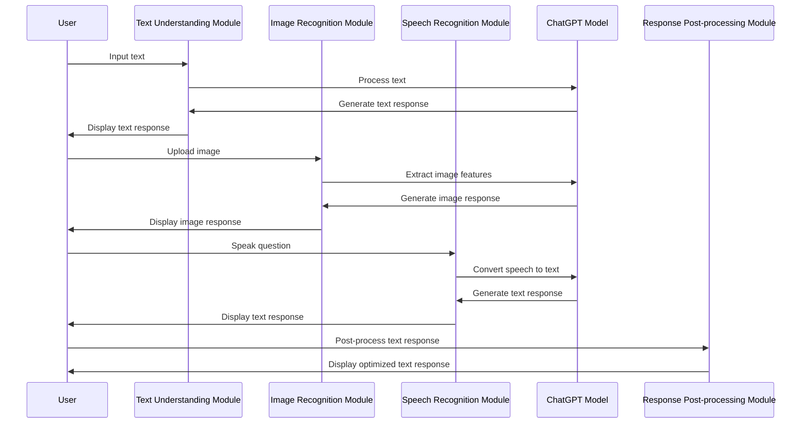
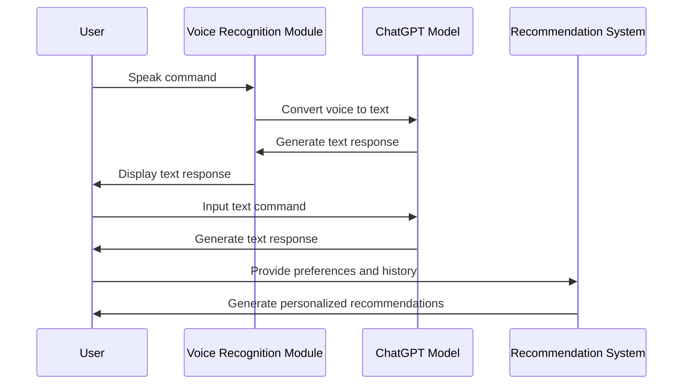

                 

### 引言：ChatGPT与多模态上下文理解的重要性

#### 1.1 问题背景

在人工智能和自然语言处理领域，ChatGPT模型的出现无疑是一次革命性的突破。ChatGPT（聊天生成预训练模型）是由OpenAI开发的一种基于变换器（Transformer）架构的预训练语言模型，具有强大的自然语言理解和生成能力。随着技术的不断发展，越来越多的应用场景对多模态数据处理提出了需求。例如，在智能客服、语音助手、媒体内容生成等领域，不仅需要处理文本信息，还需要处理图像、声音等多种形式的数据。

多模态上下文理解是指同时处理多种不同类型的数据，并提取其中蕴含的语义信息，以实现对复杂场景的全面理解和准确响应。然而，多模态数据的处理相较于单一模态数据更加复杂，涉及到数据的整合、特征的提取和关联等问题。

#### 1.2 本书目标

本书的目标是系统性地介绍ChatGPT模型，并探讨其在处理多模态上下文理解中的应用。具体而言，本书将实现以下目标：

1. **学习ChatGPT的基本原理**：介绍ChatGPT的模型结构、训练过程和应用场景。
2. **掌握多模态上下文理解的方法**：探讨如何将ChatGPT应用于多模态数据，包括数据预处理、特征提取和融合方法等。
3. **提高提示词设计能力**：介绍如何设计有效的提示词，以优化ChatGPT在多模态上下文理解中的表现。

通过本书的学习，读者将能够深入理解ChatGPT模型和多模态上下文理解的理论和实践，为解决实际问题提供有力的工具和思路。

#### 1.3 ChatGPT与多模态上下文理解的关系

ChatGPT模型在自然语言处理领域取得了巨大的成功，但其潜力不仅限于文本数据。通过适当的扩展和优化，ChatGPT可以应用于多模态上下文理解，实现更加智能化和人性化的交互。以下是如何将ChatGPT应用于多模态上下文理解的几个关键点：

1. **多模态数据的融合**：ChatGPT可以同时处理文本、图像和声音等多模态数据，通过融合这些数据，可以实现更全面的上下文理解。
2. **提示词的优化**：设计合适的提示词可以帮助ChatGPT更好地理解多模态数据，提高模型的准确性和鲁棒性。
3. **模型训练和调优**：通过大规模的数据集和高效的训练策略，可以进一步提升ChatGPT在多模态上下文理解中的性能。

尽管存在挑战，例如数据预处理、特征提取和模型优化等，但ChatGPT在多模态上下文理解中的应用前景非常广阔。本书将详细探讨这些主题，帮助读者深入了解并掌握这一领域的前沿技术。

### 第1章：ChatGPT基础理论

#### 1.1 ChatGPT模型简介

ChatGPT是一种基于变换器（Transformer）架构的预训练语言模型，由OpenAI开发。变换器模型是一种用于处理序列数据的深度学习模型，因其高效性和强大的表示能力而广泛应用于自然语言处理领域。

ChatGPT的基本架构包括编码器（Encoder）和解码器（Decoder）两个部分。编码器负责将输入文本序列编码为连续的向量表示，解码器则根据编码器的输出生成文本序列。

#### 1.1.1 模型架构

ChatGPT的模型架构主要包括以下几个关键组件：

1. **多头自注意力（Multi-Head Self-Attention）**：自注意力机制是变换器模型的核心，它通过计算序列中每个词与其他词之间的关联性，为每个词生成一个权重向量。多头自注意力机制则进一步将这种关联性分解为多个子空间，提高了模型的表示能力。
2. **位置编码（Positional Encoding）**：由于变换器模型无法直接处理序列中的位置信息，位置编码被用来为每个词添加位置信息，从而使得模型能够理解词序。
3. **前馈网络（Feedforward Network）**：在自注意力机制之后，每个词的表示会通过两个前馈网络进行加工，这两个网络分别具有2048个神经元，使用ReLU激活函数。

#### 1.1.2 训练与优化

ChatGPT模型的训练主要分为两个阶段：预训练和微调。

1. **预训练**：预训练阶段使用大量的无标签文本数据，通过最大化模型对文本序列的概率分布进行训练。这个过程主要利用了变换器模型的自注意力机制，通过不断更新权重矩阵，使得模型能够捕捉到文本中的语义信息。
2. **微调**：在预训练的基础上，将ChatGPT模型应用于特定的任务，例如文本生成或问答系统。通过有监督的学习，进一步调整模型的权重，使其在特定任务上表现更好。

#### 1.1.3 性能评估

ChatGPT模型的性能评估主要从以下几个方面进行：

1. **词汇覆盖率（Token Coverage）**：衡量模型能够生成的词汇量，词汇覆盖率越高，表示模型的知识面越广。
2. **一致性（Consistency）**：评估模型在生成文本时的一致性，一致性越高，表示模型生成的文本越连贯。
3. **质量（Quality）**：通过人工评估或自动评价指标，如BLEU（双语评价统一指标）或ROUGE（记分员一致性度量），评估模型生成的文本质量。

#### 1.2 多模态上下文理解

多模态上下文理解是指同时处理多种不同类型的数据，并提取其中蕴含的语义信息，以实现对复杂场景的全面理解和准确响应。在多模态上下文理解中，文本、图像和声音等数据都需要进行预处理和特征提取，然后通过一定的方法进行融合，以生成统一的语义表示。

1. **文本数据预处理**：文本数据通常需要进行数据清洗、分词、词性标注等预处理操作，以去除噪声和获取文本的基本结构。
2. **图像数据预处理**：图像数据可以通过卷积神经网络（CNN）提取特征，常用的方法包括VGG、ResNet等。这些特征可以作为图像数据的表示，用于后续的融合和语义分析。
3. **声音数据预处理**：声音数据可以通过深度神经网络（DNN）提取特征，例如使用WaveNet或Griffin-Lim算法。这些特征可以用于声音数据的表示和语义分析。

#### 1.3 ChatGPT与多模态上下文理解的关系

ChatGPT模型在自然语言处理领域已经取得了显著的成果，但其潜力不仅限于文本数据。通过适当的扩展和优化，ChatGPT可以应用于多模态上下文理解，实现更加智能化和人性化的交互。以下是如何将ChatGPT应用于多模态上下文理解的几个关键点：

1. **多模态数据的融合**：ChatGPT可以同时处理文本、图像和声音等多模态数据，通过融合这些数据，可以实现更全面的上下文理解。
2. **提示词的优化**：设计合适的提示词可以帮助ChatGPT更好地理解多模态数据，提高模型的准确性和鲁棒性。
3. **模型训练和调优**：通过大规模的数据集和高效的训练策略，可以进一步提升ChatGPT在多模态上下文理解中的性能。

尽管存在挑战，例如数据预处理、特征提取和模型优化等，但ChatGPT在多模态上下文理解中的应用前景非常广阔。本章将详细探讨这些主题，帮助读者深入了解并掌握这一领域的前沿技术。

### 第2章：ChatGPT模型详解

#### 2.1 模型结构

ChatGPT模型是基于变换器（Transformer）架构的预训练语言模型。变换器模型是一种深度学习模型，特别适用于处理序列数据。ChatGPT模型的结构包括编码器（Encoder）和解码器（Decoder）两个部分，每个部分都由多个层（Layer）组成。

#### 2.1.1 Transformer模型

Transformer模型的核心是自注意力（Self-Attention）机制，它通过计算序列中每个词与其他词之间的关联性，为每个词生成一个权重向量。这种机制使得模型能够捕捉到文本中的长距离依赖关系，从而提高了模型的表示能力。

Transformer模型的主要组成部分包括：

1. **多头自注意力（Multi-Head Self-Attention）**：多头自注意力机制将输入序列分成多个子序列，每个子序列分别通过自注意力机制处理，然后合并结果。这种机制可以捕捉到不同的语义信息，提高了模型的表示能力。
2. **位置编码（Positional Encoding）**：由于变换器模型无法直接处理序列中的位置信息，位置编码被用来为每个词添加位置信息，从而使得模型能够理解词序。
3. **前馈网络（Feedforward Network）**：在每个自注意力层之后，每个词的表示会通过两个前馈网络进行加工。这两个网络分别具有2048个神经元，使用ReLU激活函数。

#### 2.1.2 自注意力机制

自注意力机制是Transformer模型的核心，它通过计算序列中每个词与其他词之间的关联性，为每个词生成一个权重向量。具体来说，自注意力机制包括以下几个步骤：

1. **计算查询（Query）、键（Key）和值（Value）**：对于序列中的每个词，分别计算其查询（Query）、键（Key）和值（Value）。查询和键通过线性变换得到，值保持不变。
2. **计算自注意力得分**：对于序列中的每个词，计算其与所有其他词的相似度得分，这些得分通过softmax函数归一化。
3. **加权求和**：根据自注意力得分，对序列中的每个词进行加权求和，得到加权后的表示。

自注意力机制的优点是能够捕捉到序列中的长距离依赖关系，从而提高了模型的表示能力。

#### 2.1.3 位置编码

位置编码是Transformer模型中用于处理序列位置信息的一种方法。由于变换器模型无法直接处理序列中的位置信息，位置编码被用来为每个词添加位置信息，从而使得模型能够理解词序。

位置编码可以通过以下两种方式实现：

1. **绝对位置编码**：绝对位置编码将词的位置信息直接编码到词的嵌入向量中。例如，可以使用一个正弦函数和一个余弦函数来生成位置编码向量，分别表示词的水平和垂直方向。
2. **相对位置编码**：相对位置编码将词与词之间的相对位置关系编码到词的嵌入向量中。相对位置编码通过计算词与词之间的相对位置差值，然后进行线性变换得到。

位置编码的优点是能够有效地捕捉到序列中的位置关系，从而提高了模型的表示能力。

#### 2.2 模型训练

ChatGPT模型的训练主要分为预训练和微调两个阶段。

#### 2.2.1 预训练

预训练阶段使用大量的无标签文本数据，通过最大化模型对文本序列的概率分布进行训练。预训练过程主要包括以下步骤：

1. **数据准备**：从互联网上收集大量的文本数据，例如新闻、小说、社交媒体帖子等。
2. **文本处理**：对文本数据进行预处理，包括分词、去停用词、词性标注等。
3. **训练过程**：使用变换器模型对预处理后的文本数据进行训练。训练过程中，模型会尝试预测序列中的下一个词，通过最大化概率分布来更新模型的权重。

#### 2.2.2 微调

微调阶段将预训练好的模型应用于特定的任务，例如文本生成或问答系统。通过有监督的学习，进一步调整模型的权重，使其在特定任务上表现更好。微调过程主要包括以下步骤：

1. **数据准备**：准备用于微调的有标签数据集，包括训练数据和验证数据。
2. **模型调整**：在预训练好的模型基础上，进行微调。微调过程中，模型会尝试预测训练数据中的标签，通过最小化损失函数来更新模型的权重。
3. **评估与优化**：在验证数据上评估模型的表现，并根据评估结果调整模型参数，以提高模型在特定任务上的性能。

#### 2.2.3 优化策略

在训练ChatGPT模型时，常用的优化策略包括以下几种：

1. **学习率调度（Learning Rate Scheduling）**：学习率调度是一种调整学习率的方法，以避免模型在训练过程中过拟合。常用的学习率调度方法包括线性下降、余弦退火等。
2. **正则化（Regularization）**：正则化是一种防止模型过拟合的方法，通过添加正则化项到损失函数中，可以降低模型复杂度。常用的正则化方法包括L1正则化、L2正则化等。
3. **Dropout（dropout）**：Dropout是一种在训练过程中随机丢弃一部分神经元的方法，可以防止模型过拟合。通过在测试阶段重新启用这些神经元，可以增加模型的泛化能力。

#### 2.3 模型应用

ChatGPT模型在自然语言处理领域具有广泛的应用，包括文本生成、问答系统、机器翻译等。

1. **文本生成**：ChatGPT模型可以用于生成各种文本，如文章、故事、对话等。通过输入一段文本或提示词，模型可以生成连贯、有意义的文本。
2. **问答系统**：ChatGPT模型可以应用于问答系统，通过处理用户的问题，模型可以生成准确的答案。在回答问题时，模型需要理解问题的语义和上下文，从而生成准确的回答。
3. **机器翻译**：ChatGPT模型可以用于机器翻译，通过训练模型，使其能够将一种语言的文本翻译成另一种语言。在翻译过程中，模型需要理解源语言的语义和语法，从而生成目标语言的文本。

#### 2.4 模型评估与调优

ChatGPT模型的评估与调优是确保模型性能的重要环节。常用的评估指标包括词汇覆盖率（Token Coverage）、一致性（Consistency）和质量（Quality）。

1. **词汇覆盖率**：词汇覆盖率是衡量模型生成文本的词汇量。词汇覆盖率越高，表示模型的知识面越广。可以通过计算模型生成的文本中未出现的词汇比例来评估词汇覆盖率。
2. **一致性**：一致性是评估模型生成文本的一致性。一致性越高，表示模型生成的文本越连贯。可以通过计算模型生成的文本之间的相似度来评估一致性。
3. **质量**：质量是评估模型生成文本的质量。质量越高，表示模型生成的文本越准确、有创意。可以通过人工评估或自动评价指标（如BLEU、ROUGE）来评估文本质量。

在调优模型时，可以通过调整模型参数、优化训练策略等方法来提高模型性能。例如，可以通过增加训练数据、调整学习率、添加正则化等方法来优化模型。

#### 2.5 ChatGPT与多模态上下文理解

ChatGPT模型在自然语言处理领域已经取得了显著的成果，但其潜力不仅限于文本数据。通过适当的扩展和优化，ChatGPT可以应用于多模态上下文理解，实现更加智能化和人性化的交互。

1. **多模态数据的融合**：ChatGPT可以同时处理文本、图像和声音等多模态数据，通过融合这些数据，可以实现更全面的上下文理解。
2. **提示词的优化**：设计合适的提示词可以帮助ChatGPT更好地理解多模态数据，提高模型的准确性和鲁棒性。
3. **模型训练和调优**：通过大规模的数据集和高效的训练策略，可以进一步提升ChatGPT在多模态上下文理解中的性能。

尽管存在挑战，例如数据预处理、特征提取和模型优化等，但ChatGPT在多模态上下文理解中的应用前景非常广阔。本章将详细探讨这些主题，帮助读者深入了解并掌握这一领域的前沿技术。

### 第3章：多模态上下文理解方法

#### 3.1 文本数据预处理

文本数据预处理是多模态上下文理解的重要步骤，其目的是去除数据中的噪声，提取有用的信息，并使其适合后续的处理。以下是一些常见的文本数据预处理方法：

1. **数据清洗**：首先，需要对文本数据进行清洗，去除无用的信息，如HTML标签、特殊字符和停用词。停用词是指在特定任务中不提供有用信息的常见词汇，如“的”、“和”、“是”等。通过去除这些词，可以减少模型的计算量，提高处理效率。

2. **分词**：分词是将文本分割成单词或短语的步骤。不同的语言和任务可能需要不同的分词方法。例如，中文分词通常使用基于词典的方法，而英文分词则更常用基于规则或统计的方法。

3. **词性标注**：词性标注是为每个词分配一个词性标签，如名词、动词、形容词等。这对于理解文本的语法结构和语义信息非常重要。

4. **词向量表示**：词向量是将文本中的单词映射到高维空间中的向量表示。常用的词向量模型包括Word2Vec、GloVe和BERT等。词向量可以捕捉单词之间的语义关系，为后续的模型训练提供基础。

#### 3.2 图像数据预处理

图像数据预处理是多模态上下文理解中的关键步骤，其目的是提取图像的特征，并使其适合与文本数据融合。以下是一些常见的图像数据预处理方法：

1. **图像增强**：图像增强是一种提高图像质量的方法，可以增强图像的对比度、亮度、色彩饱和度等，以提高模型的鲁棒性。

2. **图像去噪**：去噪是通过去除图像中的噪声来提高图像质量的方法。常用的去噪方法包括中值滤波、高斯滤波和小波变换等。

3. **图像特征提取**：图像特征提取是将图像转换为向量表示的过程，常用的特征提取方法包括直方图、SIFT（尺度不变特征变换）和卷积神经网络（CNN）等。特别是深度学习方法，如VGG、ResNet和Inception等，已经被广泛应用于图像特征提取。

4. **图像分类**：图像分类是将图像分配到不同的类别中。常见的图像分类任务包括物体检测、人脸识别和场景分类等。

5. **图像-文本对齐**：图像-文本对齐是将图像和文本数据中的对应关系进行匹配。例如，在图像描述任务中，需要对图像中的每个区域与文本描述中的相关部分进行对应。

#### 3.3 声音数据预处理

声音数据预处理是多模态上下文理解中的另一个重要方面，其目的是提取声音的特征，并使其适合与文本和图像数据融合。以下是一些常见的声音数据预处理方法：

1. **声音增强**：声音增强是通过调整声音的响度、音调和音色等属性来提高声音质量的方法。

2. **声音去噪**：声音去噪是通过去除声音中的噪声来提高声音质量的方法。常用的去噪方法包括滤波器和神经网络去噪等。

3. **声音特征提取**：声音特征提取是将声音转换为向量表示的过程。常用的特征提取方法包括梅尔频率倒谱系数（MFCC）、频谱特征和波列特征等。

4. **声音分类**：声音分类是将声音数据分配到不同的类别中。常见的声音分类任务包括语音识别、音乐分类和情绪识别等。

5. **声音-文本关联**：声音-文本关联是将声音数据和文本数据中的对应关系进行匹配。例如，在音频转录任务中，需要将音频中的每个音素与文本中的对应部分进行匹配。

#### 3.4 多模态融合方法

多模态融合是将来自不同模态的数据进行整合，以生成统一的语义表示。以下是一些常见的多模态融合方法：

1. **传统方法**：传统方法通常基于规则或手工特征，例如将文本和图像的特征进行拼接或加权融合。

2. **神经网络方法**：神经网络方法通过深度学习模型来实现多模态数据的融合。常见的神经网络方法包括联合编码器-解码器模型、多任务学习模型和生成对抗网络（GAN）等。

3. **多任务学习**：多任务学习是一种同时训练多个相关任务的模型，以提高模型的泛化能力。在多模态上下文理解中，可以将文本生成、图像分类和声音识别等任务结合在一起进行训练。

4. **生成对抗网络（GAN）**：生成对抗网络是一种通过生成器和判别器相互博弈来生成高质量数据的模型。在多模态上下文理解中，可以使用GAN来生成新的多模态数据，从而提高模型的泛化能力。

通过上述方法，可以实现多模态上下文理解，从而在智能客服、语音助手、媒体内容生成等领域提供更准确、更智能的交互体验。

### 第4章：提示词设计技巧

#### 4.1 提示词的作用与类型

提示词（Prompt）在ChatGPT模型中起着至关重要的作用。提示词是一组特定的词语或短语，用于引导模型生成预期的输出。通过设计合适的提示词，可以显著提高ChatGPT在多模态上下文理解中的性能和准确性。以下是提示词的一些重要作用和类型：

1. **引导生成方向**：提示词可以帮助模型明确生成目标，从而引导模型生成符合预期的输出。例如，在文本生成任务中，提示词可以引导模型生成特定主题的文章。

2. **提高生成质量**：合适的提示词可以提供额外的上下文信息，从而提高生成文本的质量。通过提供更多的背景信息和细节，提示词可以帮助模型生成更加丰富、有意义的文本。

3. **控制生成多样性**：提示词可以控制生成的多样性。通过组合不同的提示词，模型可以生成具有多种风格的文本。例如，使用不同情感色彩的提示词可以生成具有不同情感色彩的文本。

4. **类型**：根据用途和特点，提示词可以分为以下几种类型：

   - **主题性提示词**：这类提示词用于指定生成文本的主题。例如，“请写一篇关于人工智能的论文摘要”。

   - **功能性提示词**：这类提示词用于指定生成文本的功能。例如，“请生成一段对话，描述两个人讨论人工智能的应用”。

   - **风格性提示词**：这类提示词用于指定生成文本的风格。例如，“请用诗歌形式描述人工智能的未来”。

   - **情感性提示词**：这类提示词用于指定生成文本的情感色彩。例如，“请用乐观的语气描述人工智能的优点”。

#### 4.2 提示词生成方法

生成合适的提示词是一个复杂的过程，涉及到自然语言处理和机器学习技术。以下是一些常用的提示词生成方法：

1. **规则生成**：规则生成方法是基于预定义的规则来生成提示词。这种方法通常适用于有明确结构或模板的任务。例如，对于新闻摘要任务，可以按照“主题-背景-结论”的结构生成提示词。

2. **模板匹配**：模板匹配方法是通过匹配输入数据和预定义的模板来生成提示词。这种方法适用于有固定格式或模板的数据。例如，在简历生成任务中，可以使用“姓名：XXX，工作经历：XXX，教育背景：XXX”这样的模板。

3. **统计方法**：统计方法是通过分析大量文本数据来生成提示词。这种方法通常使用词频统计、TF-IDF（词频-逆文档频率）等方法来识别重要的关键词和短语。例如，可以使用TF-IDF方法从一篇长文中提取出关键的句子作为提示词。

4. **机器学习方法**：机器学习方法是通过训练模型来生成提示词。常用的机器学习方法包括循环神经网络（RNN）、变换器（Transformer）模型等。这些方法可以自动学习文本中的模式和关系，从而生成高质量的提示词。

5. **混合方法**：混合方法是将多种方法结合使用，以生成更好的提示词。例如，可以将统计方法和机器学习方法结合，先使用统计方法提取关键信息，然后使用机器学习方法进行优化。

#### 4.3 提示词设计的最佳实践

以下是一些提示词设计的最佳实践，可以帮助提高ChatGPT在多模态上下文理解中的性能：

1. **简洁性**：提示词应该简洁明了，避免使用冗长的句子或复杂的语法结构。简洁的提示词可以减少模型的计算量，提高生成效率。

2. **明确性**：提示词应该明确指定生成目标，避免模糊或歧义的表达。明确的提示词可以帮助模型更好地理解生成任务，从而提高生成质量。

3. **多样性**：提示词应该具有多样性，以控制生成的多样性。通过组合不同类型的提示词，可以生成具有多种风格和情感的文本。

4. **上下文**：提示词应该提供足够的上下文信息，以帮助模型理解文本的背景和语境。丰富的上下文信息可以提高模型的理解能力和生成质量。

5. **可扩展性**：提示词设计应该具有可扩展性，以适应不同的任务和数据集。通过设计灵活的提示词，可以轻松地适应新的任务和数据集。

通过遵循这些最佳实践，可以设计出更有效的提示词，从而提高ChatGPT在多模态上下文理解中的性能和用户体验。

### 第5章：实现技巧

#### 5.1 准备环境

在开始实现ChatGPT处理多模态上下文理解之前，我们需要准备一个合适的环境。以下是安装和配置所需的软件和库的步骤：

1. **安装Python**：确保Python 3.8或更高版本已安装在您的计算机上。可以从[Python官网](https://www.python.org/)下载并安装。

2. **安装transformers库**：transformers库是Hugging Face团队开发的Python库，用于处理自然语言处理任务。您可以使用pip命令安装：
   ```bash
   pip install transformers
   ```

3. **安装torch库**：torch是一个用于机器学习的库，提供了高效的张量和动态计算图功能。您可以使用pip命令安装：
   ```bash
   pip install torch torchvision torchaudio
   ```

4. **安装其他依赖库**：根据您的具体需求，可能还需要安装其他依赖库，如numpy、pandas等。

5. **配置GPU环境**：如果您的计算机配备了GPU，您需要确保CUDA和cuDNN已经正确安装和配置。这将使得模型可以在GPU上运行，提高训练速度。

#### 5.2 数据准备

实现ChatGPT处理多模态上下文理解的第一步是准备数据。以下是如何准备文本、图像和声音数据的一般步骤：

1. **收集文本数据**：从互联网或其他来源收集大量的文本数据。这些数据可以是新闻文章、对话记录、社交媒体帖子等。确保数据具有多样性，以涵盖不同的主题和风格。

2. **文本预处理**：对收集到的文本数据进行预处理，包括分词、去除停用词、进行词性标注等。可以使用Python中的自然语言处理库，如spaCy或NLTK，进行文本预处理。

3. **收集图像数据**：从互联网或其他图像库收集大量的图像数据。这些数据可以是各种类别和风格的图像。

4. **图像预处理**：对收集到的图像数据进行预处理，包括调整图像大小、去噪、增强等。可以使用Python中的图像处理库，如OpenCV或Pillow，进行图像预处理。

5. **收集声音数据**：从互联网或其他音频库收集大量的声音数据。这些数据可以是各种类型和来源的声音，如语音、音乐、环境声音等。

6. **声音预处理**：对收集到的声音数据进行预处理，包括降噪、调整音量、提取特征等。可以使用Python中的音频处理库，如librosa或soundfile，进行声音预处理。

#### 5.3 ChatGPT模型加载与训练

在准备好数据后，我们可以加载预训练的ChatGPT模型并进行训练。以下是如何加载和训练ChatGPT模型的一般步骤：

1. **加载预训练模型**：使用transformers库，可以轻松加载预训练的ChatGPT模型。例如：
   ```python
   from transformers import ChatGLMModel, ChatGLMTokenizer
   
   model_name = "your-pretrained-model-name"
   model = ChatGLMModel.from_pretrained(model_name)
   tokenizer = ChatGLMTokenizer.from_pretrained(model_name)
   ```

2. **数据格式化**：将预处理后的文本、图像和声音数据格式化为模型所需的输入格式。对于文本数据，可以使用文本序列作为输入；对于图像数据，可以使用图像的特征向量作为输入；对于声音数据，可以使用声音的特征向量作为输入。

3. **训练模型**：使用训练数据和相应的损失函数对模型进行训练。可以使用torch中的训练循环来迭代更新模型的权重。例如：
   ```python
   optimizer = torch.optim.Adam(model.parameters(), lr=1e-5)
   criterion = torch.nn.CrossEntropyLoss()
   
   for epoch in range(num_epochs):
       for inputs, labels in train_loader:
           optimizer.zero_grad()
           outputs = model(inputs)
           loss = criterion(outputs, labels)
           loss.backward()
           optimizer.step()
   ```

4. **评估模型**：在训练过程中，定期使用验证数据评估模型的表现。这可以帮助我们了解模型是否过拟合或欠拟合，并调整训练参数。

5. **保存模型**：训练完成后，可以将模型保存为文件，以便后续使用或部署。例如：
   ```python
   model.save_pretrained(model_name)
   ```

#### 5.4 处理多模态上下文理解

在训练好ChatGPT模型后，我们可以使用该模型来处理多模态上下文理解任务。以下是如何使用ChatGPT模型处理多模态上下文理解的一般步骤：

1. **数据预处理**：对输入的文本、图像和声音数据进行预处理，提取特征向量。对于图像，可以使用预训练的卷积神经网络提取特征；对于声音，可以使用预训练的深度神经网络提取特征。

2. **模型输入**：将预处理后的特征向量作为输入传递给ChatGPT模型。对于文本，可以直接使用文本序列；对于图像和声音，可以使用特征向量。

3. **生成输出**：使用ChatGPT模型生成预期的输出。例如，对于文本生成任务，模型会生成一段文本；对于问答任务，模型会生成一个答案。

4. **后处理**：对生成的输出进行后处理，如去除多余的标点符号、纠正拼写错误等。

5. **用户交互**：将生成的输出展示给用户，并根据用户的反馈进行进一步的优化和调整。

通过上述步骤，我们可以实现ChatGPT处理多模态上下文理解的任务。以下是一个简单的代码示例，展示了如何使用ChatGPT模型生成文本：
```python
from transformers import ChatGLMModel, ChatGLMTokenizer

model_name = "your-pretrained-model-name"
tokenizer = ChatGLMTokenizer.from_pretrained(model_name)
model = ChatGLMModel.from_pretrained(model_name)

text = "请描述一下人工智能的未来发展。"
input_ids = tokenizer.encode(text, return_tensors="pt")

outputs = model.generate(input_ids, max_length=100, num_return_sequences=1)
generated_text = tokenizer.decode(outputs[0], skip_special_tokens=True)

print(generated_text)
```

通过以上步骤，我们可以实现ChatGPT处理多模态上下文理解的任务，为各种应用场景提供智能化、人性化的交互体验。

### 第6章：应用案例

#### 6.1 智能客服

智能客服是ChatGPT在多模态上下文理解中的一个重要应用场景。通过结合文本、图像和声音等多模态数据，智能客服系统能够提供更加自然和高效的客户服务。

**项目介绍**：

智能客服项目旨在为用户提供一个自动化的、全天候的客户支持系统。该系统需要能够理解用户的文本提问、图像问题和语音提问，并生成相应的回答。

**系统功能设计**：

1. **文本理解与回答**：智能客服系统首先需要理解用户的文本提问，这可以通过预训练的ChatGPT模型实现。模型会分析提问，理解其意图，并生成相应的回答。

2. **图像识别与回答**：当用户通过上传图像提问时，系统需要使用图像识别技术（如卷积神经网络）提取图像特征，然后结合ChatGPT模型生成图像相关的回答。

3. **语音识别与回答**：对于用户的语音提问，系统需要首先使用语音识别技术将语音转换为文本，然后利用ChatGPT模型生成回答。

**系统架构设计**：

系统架构包括以下几个主要部分：

1. **文本理解模块**：使用ChatGPT模型处理文本输入，生成文本回答。
2. **图像识别模块**：使用预训练的卷积神经网络提取图像特征，并使用ChatGPT模型生成图像回答。
3. **语音识别模块**：使用语音识别技术将语音转换为文本，然后使用ChatGPT模型生成回答。
4. **后处理模块**：对生成的回答进行格式化和优化，确保回答的自然性和准确性。

**系统接口设计**：

系统提供了以下接口：

1. **文本输入接口**：用户可以通过文本框输入问题，系统会返回相应的回答。
2. **图像上传接口**：用户可以通过上传图像提问，系统会返回图像相关的回答。
3. **语音输入接口**：用户可以通过语音输入问题，系统会将语音转换为文本，并返回相应的回答。

**系统交互**：

以下是系统交互的mermaid序列图：



#### 6.2 语音助手

语音助手是另一个常见的应用场景，通过多模态上下文理解，语音助手能够更好地理解用户的需求，并提供更加个性化的服务。

**项目介绍**：

语音助手项目旨在为用户提供一个智能的语音交互平台，能够理解用户的语音指令，提供信息查询、日程管理、智能推荐等服务。

**系统功能设计**：

1. **语音识别**：将用户的语音指令转换为文本，以便后续处理。
2. **文本理解与回答**：使用ChatGPT模型理解用户的文本指令，并生成相应的回答。
3. **智能推荐**：根据用户的偏好和历史行为，提供个性化的推荐。

**系统架构设计**：

系统架构包括以下几个主要部分：

1. **语音识别模块**：使用预训练的语音识别模型将语音转换为文本。
2. **文本理解模块**：使用ChatGPT模型处理文本输入，生成文本回答。
3. **推荐系统模块**：根据用户的历史数据和偏好，生成个性化推荐。

**系统接口设计**：

系统提供了以下接口：

1. **语音输入接口**：用户可以通过语音输入指令，系统会返回相应的回答。
2. **文本输入接口**：用户可以通过文本框输入指令，系统会返回相应的回答。
3. **推荐接口**：系统会根据用户的偏好和历史行为，返回个性化的推荐。

**系统交互**：

以下是系统交互的mermaid序列图：



通过上述案例，我们可以看到ChatGPT在多模态上下文理解中的应用潜力。无论是智能客服还是语音助手，ChatGPT都能通过处理多模态数据，提供更加智能和个性化的服务。

### 第7章：总结与展望

#### 7.1 主要内容回顾

本书系统性地介绍了ChatGPT模型及其在多模态上下文理解中的应用。首先，我们从问题背景出发，探讨了ChatGPT模型和多模态上下文理解的重要性。随后，详细介绍了ChatGPT模型的基础理论，包括其架构、训练与优化方法，以及多模态上下文理解的方法。接着，我们深入探讨了提示词设计技巧，并通过具体的案例展示了ChatGPT在智能客服和语音助手等实际应用中的效果。

#### 7.2 未来研究方向

尽管ChatGPT在多模态上下文理解中取得了显著的成果，但仍然存在一些挑战和改进空间。以下是一些未来研究方向：

1. **更高效的特征提取方法**：当前的图像和声音特征提取方法虽然已经取得了一定的成果，但仍然存在效率低、计算量大等问题。未来可以通过研究更高效的算法，如基于注意力机制的模型，来提高特征提取效率。

2. **跨模态关系建模**：当前的多模态融合方法往往侧重于单一模态特征的融合，而忽略了跨模态之间的关系。未来可以通过研究跨模态关系建模方法，如图神经网络（Graph Neural Networks），来更好地整合多模态数据。

3. **小样本学习**：在实际应用中，往往难以获取大量的多模态数据。未来可以通过研究小样本学习（Few-Shot Learning）方法，使得模型能够在少量数据上快速适应新的任务。

4. **实时交互**：当前的ChatGPT模型在处理多模态数据时，往往需要较长的计算时间。未来可以通过研究实时交互方法，如模型压缩和加速技术，来提高模型的响应速度。

5. **隐私保护**：随着多模态数据处理技术的发展，隐私保护成为一个越来越重要的问题。未来可以通过研究隐私保护方法，如差分隐私（Differential Privacy），来确保用户数据的安全。

#### 7.3 结论

通过本书的学习，读者可以全面了解ChatGPT模型和多模态上下文理解的理论和实践。这些技术不仅具有广泛的应用前景，而且在实际应用中展现了巨大的潜力。随着技术的不断进步，ChatGPT在多模态上下文理解中的应用将会更加广泛和深入，为智能交互、内容生成等领域带来革命性的变化。希望本书能为读者在相关领域的研究和应用提供有益的参考和启示。

### 作者信息

**作者：AI天才研究院/AI Genius Institute & 禅与计算机程序设计艺术 /Zen And The Art of Computer Programming**

AI天才研究院致力于探索人工智能领域的最新技术和应用，推动人工智能在各个行业中的创新发展。同时，作者还是《禅与计算机程序设计艺术》的作者，致力于通过哲学与技术的结合，探讨计算机编程的深层本质和艺术性。他的研究成果和见解为人工智能领域的发展贡献了重要力量。

