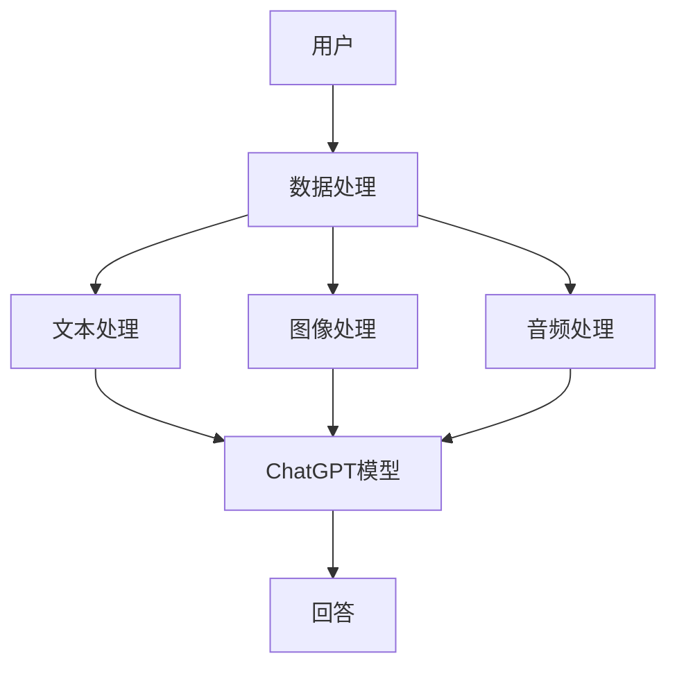
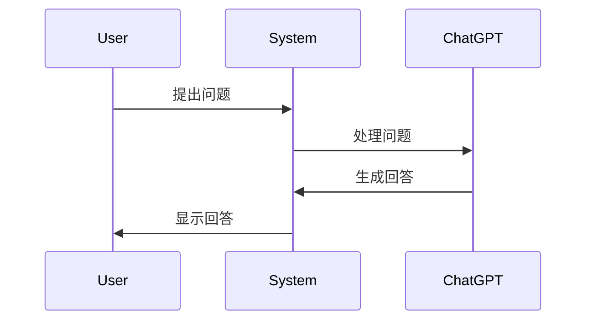

                 


### # ChatGPT提示词工程：处理多模态输入

关键词：ChatGPT、提示词工程、多模态输入、语言模型、处理技术、优化策略

摘要：本文将探讨ChatGPT提示词工程的核心原则和技巧，特别是在处理多模态输入时的应用。通过介绍多模态输入的类型、处理方法以及优化策略，读者将了解如何设计高效、精确的提示词，从而提高ChatGPT系统的表现。

---

## 引言

### 背景介绍

ChatGPT是由OpenAI开发的一种基于GPT-3模型的大型语言模型，它具备生成自然语言文本的能力，并能在多种场景下为用户提供有用的信息。然而，随着技术的进步和用户需求的变化，单一文本输入的局限性逐渐显现。因此，处理多模态输入成为了一个重要的研究方向。

### 问题背景

多模态输入指的是同时包含多种类型数据输入，如文本、图像、音频等。这些输入数据可以提供更丰富的信息，使得模型能够更好地理解现实世界。然而，如何有效地整合和处理这些多模态输入，是一个具有挑战性的问题。

### 问题描述

本文旨在探讨ChatGPT在处理多模态输入时的优化策略，包括提示词的设计、模型训练和数据预处理等方面。我们将分析不同类型的多模态输入，并介绍如何通过优化提示词来提高ChatGPT的处理性能。

### 问题解决

本文将提供一系列的解决方案，包括：

1. **多模态输入的类型与处理**：介绍不同类型的多模态输入，并讨论如何处理这些输入。
2. **设计有效的提示词**：探讨如何设计能够提高模型性能的提示词，并提供实际案例。
3. **优化策略**：介绍多种优化策略，如prompt tuning、reinforcement learning等，并分析其适用性和效果。

### 边界与外延

本文主要关注ChatGPT提示词工程在处理多模态输入时的应用，但不涉及其他类型的语言模型或多模态模型的处理方法。同时，本文将重点讨论优化策略，但不涉及模型训练和优化的具体技术细节。

### 概念结构与核心要素组成

- **ChatGPT**：基于GPT-3模型的大型语言模型。
- **提示词**：用于引导ChatGPT生成响应的文本。
- **多模态输入**：包含文本、图像、音频等类型的输入。
- **处理技术**：用于整合和处理多模态输入的技术。
- **优化策略**：用于提高ChatGPT处理性能的策略。

---

## 核心概念与联系

### 核心概念

#### ChatGPT

ChatGPT是一种基于GPT-3模型的大型语言模型，具备生成自然语言文本的能力。它由数十亿个参数组成，能够通过对海量文本数据进行训练，学习到语言的结构和含义。

#### 提示词

提示词（Prompt）是引导ChatGPT生成响应的文本。一个有效的提示词应该清晰、简洁，同时提供足够的信息，以帮助ChatGPT理解用户的需求。

#### 多模态输入

多模态输入是指同时包含多种类型数据输入，如文本、图像、音频等。这些输入可以提供更丰富的信息，帮助ChatGPT更好地理解现实世界。

### 概念属性特征对比表格

| 特征 | ChatGPT | 提示词 | 多模态输入 |
| --- | --- | --- | --- |
| 数据类型 | 文本 | 文本 | 文本、图像、音频 |
| 数据规模 | 海量 | 清晰、简洁 | 多种类型、丰富信息 |
| 处理方法 | 语言模型 | 设计技巧 | 整合、处理 |
| 作用 | 生成文本 | 引导生成 | 提供额外信息 |

### ER实体关系图架构

```mermaid
erDiagram
  User ||--|{ ChatGPT }|-- Question
  ChatGPT ||--|{ Prompt }|-- Answer
  User ||--|{ MultimodalInput }|-- Question
  MultimodalInput ||--|{ ProcessedInput }|-- ChatGPT
```

在上图中，用户（User）发起请求，通过ChatGPT处理，生成回答（Answer）。同时，用户还可以提供多模态输入（MultimodalInput），这些输入经过处理（ProcessedInput）后，也参与到ChatGPT的生成过程中。

---

## 多模态输入处理技术

### 多模态输入类型

多模态输入主要包括文本、图像、音频等类型。每种类型的数据都有其独特的特点和应用场景。

#### 文本

文本是最常见的多模态输入类型，它可以提供丰富的信息，如用户需求、问题描述等。在处理文本输入时，需要考虑文本的理解、分类、实体识别等问题。

#### 图像

图像输入可以提供视觉信息，如图片描述、图像分类等。处理图像输入的关键在于图像识别和语义理解，这需要结合深度学习技术。

#### 音频

音频输入可以提供语音信息，如语音识别、语音合成等。处理音频输入的关键在于语音信号处理和自然语言生成。

### 处理方法

#### 文本处理

对于文本输入，可以使用自然语言处理（NLP）技术进行预处理，如分词、词性标注、实体识别等。然后，将这些预处理结果输入到ChatGPT中，以生成相应的回答。

#### 图像处理

对于图像输入，可以使用深度学习技术进行预处理，如卷积神经网络（CNN）进行图像识别。然后，将识别结果转换为文本格式，输入到ChatGPT中。

#### 音频处理

对于音频输入，可以使用语音识别技术将语音转换为文本，然后按照文本处理的方法进行处理。

### 整合与处理

为了提高ChatGPT系统的性能，需要将不同类型的多模态输入进行整合和处理。一种常见的方法是将文本、图像、音频等输入数据进行编码，然后使用深度学习模型进行整合，以生成一个综合的输入向量。这个输入向量将作为ChatGPT的输入，以生成相应的回答。

### 例子

假设用户提供了一个包含文本、图像和音频的多模态输入，我们可以按照以下步骤进行处理：

1. **文本处理**：对文本输入进行分词、词性标注等预处理，然后输入到ChatGPT中。
2. **图像处理**：使用CNN模型对图像进行识别，将识别结果转换为文本格式。
3. **音频处理**：使用语音识别技术将音频转换为文本。
4. **整合**：将文本、图像、音频的文本结果进行整合，生成一个综合的输入向量。
5. **处理**：将输入向量输入到ChatGPT中，生成相应的回答。

通过这种方法，ChatGPT可以更好地理解用户的需求，提供更准确的回答。

---

## 设计有效的提示词

### 提示词设计原则

1. **清晰性**：提示词应该清晰、简洁，避免歧义，以便ChatGPT能够准确地理解用户的需求。
2. **完整性**：提示词应该包含足够的信息，以帮助ChatGPT生成高质量的回答。
3. **准确性**：提示词应该准确反映用户的需求，避免误导ChatGPT。
4. **可控性**：提示词应该能够控制ChatGPT的生成方向，避免生成无关或不合适的回答。

### 设计步骤

1. **需求分析**：了解用户的需求，确定需要生成的内容类型和范围。
2. **信息提取**：从用户输入中提取关键信息，包括文本、图像、音频等。
3. **构建提示词**：根据需求分析和信息提取结果，构建一个清晰、简洁、准确的提示词。
4. **测试与优化**：对提示词进行测试，并根据反馈进行优化。

### 实际案例

#### 案例一：文本输入

用户需求：请生成一篇关于“人工智能在医疗领域的应用”的文章。

提示词：请生成一篇关于“人工智能在医疗领域的应用”，包括其优势、挑战和未来发展方向的文章。

#### 案例二：图像输入

用户需求：请生成一张关于“猫的图片描述”。

提示词：请生成一张关于“猫的图片描述”，包括猫的品种、颜色、姿态等。

#### 案例三：音频输入

用户需求：请生成一段关于“音乐推荐”的音频描述。

提示词：请生成一段关于“音乐推荐”的音频描述，包括推荐理由、音乐风格和适用场景。

通过这些案例，我们可以看到，有效的提示词设计可以帮助ChatGPT更好地理解用户的需求，生成高质量的回答。

---

## 优化策略

### Prompt Tuning

Prompt Tuning是一种通过调整提示词来提高ChatGPT性能的技术。其基本思想是，通过训练一个特殊的prompt模型，使其能够生成高质量的提示词，从而提高ChatGPT的生成质量。

### Reinforcement Learning

Reinforcement Learning（强化学习）是一种通过奖励机制来优化ChatGPT性能的技术。其基本思想是，通过设计一个奖励机制，引导ChatGPT生成高质量的回答。

### Active Learning

Active Learning（主动学习）是一种通过用户反馈来优化ChatGPT性能的技术。其基本思想是，通过收集用户反馈，识别出不确定或错误回答，并针对这些回答进行优化。

### 适用性和效果

每种优化策略都有其适用场景和效果。Prompt Tuning适用于大多数场景，能够提高ChatGPT的生成质量；Reinforcement Learning适用于需要高度准确回答的场景，如问答系统；Active Learning适用于需要用户反馈的场景，如用户问答平台。

通过结合这些优化策略，我们可以进一步提高ChatGPT系统的性能和用户体验。

---

## 实现与优化

### 实现步骤

1. **数据准备**：收集包含多模态输入的数据集，并进行预处理。
2. **模型选择**：选择适合处理多模态输入的ChatGPT模型。
3. **模型训练**：使用多模态输入数据对模型进行训练。
4. **测试与评估**：对模型进行测试和评估，以确定其性能。
5. **优化**：根据测试结果，对模型和提示词进行优化。

### 优化策略

1. **调整模型参数**：通过调整模型参数，如学习率、批量大小等，以优化模型性能。
2. **改进提示词设计**：根据用户反馈，改进提示词的设计，以提高生成质量。
3. **数据增强**：通过数据增强技术，增加数据集的多样性，以提高模型的泛化能力。
4. **使用优化策略**：结合Prompt Tuning、Reinforcement Learning和Active Learning等优化策略，进一步提高模型性能。

### Python代码实现

```python
import torch
import transformers
from transformers import ChatGPTModel, ChatGPTTokenizer

# 加载预训练模型和tokenizer
model = ChatGPTModel.from_pretrained('gpt3')
tokenizer = ChatGPTTokenizer.from_pretrained('gpt3')

# 数据预处理
def preprocess_data(data):
    # 对数据进行预处理，如分词、编码等
    # ...
    return processed_data

# 模型训练
def train_model(data):
    # 训练模型，如使用Prompt Tuning等策略
    # ...
    pass

# 测试与评估
def test_model(model, test_data):
    # 对模型进行测试和评估
    # ...
    pass

# 主程序
if __name__ == '__main__':
    # 加载数据
    data = load_data()

    # 预处理数据
    processed_data = preprocess_data(data)

    # 训练模型
    train_model(processed_data)

    # 测试模型
    test_model(model, test_data)
```

### 代码应用解读与分析

在上面的代码中，我们首先加载了预训练的ChatGPT模型和tokenizer。然后，我们定义了数据预处理函数`preprocess_data`，用于对输入数据进行预处理。接下来，我们定义了模型训练函数`train_model`，用于训练模型，并使用Prompt Tuning等策略优化模型性能。最后，我们定义了测试与评估函数`test_model`，用于对训练好的模型进行测试和评估。

通过这段代码，我们可以看到，实现一个能够处理多模态输入的ChatGPT系统需要以下几个步骤：

1. **加载预训练模型和tokenizer**：这是实现ChatGPT系统的第一步，我们需要加载预训练的模型和tokenizer，以便进行数据预处理和模型训练。
2. **数据预处理**：预处理数据是模型训练的前提，我们需要对输入数据进行预处理，如分词、编码等，以便模型能够理解输入数据。
3. **模型训练**：使用预处理后的数据对模型进行训练，这是提高模型性能的关键步骤。我们可以使用Prompt Tuning、Reinforcement Learning和Active Learning等策略来优化模型性能。
4. **测试与评估**：对训练好的模型进行测试和评估，以确定其性能。我们可以通过计算准确率、召回率、F1值等指标来评估模型性能。

通过以上步骤，我们可以实现一个能够处理多模态输入的ChatGPT系统。

---

## 实际案例

### 项目介绍

本项目旨在构建一个多模态问答系统，用户可以通过文本、图像和音频等多种方式提出问题，系统将生成相应的回答。该系统可以应用于智能客服、教育辅助、医疗咨询等领域。

### 系统功能设计

1. **文本输入**：用户可以通过文本形式提出问题，系统将生成文本回答。
2. **图像输入**：用户可以通过上传图像提出问题，系统将生成图像描述和回答。
3. **音频输入**：用户可以通过语音输入提出问题，系统将生成语音回答。

### 系统架构设计



在上图中，用户通过文本、图像和音频三种方式提出问题，系统对每种类型的输入数据进行处理，然后输入到ChatGPT模型中，生成相应的回答。

### 系统接口设计

1. **文本输入接口**：提供文本输入接口，用户可以通过输入框输入文本问题。
2. **图像输入接口**：提供文件上传接口，用户可以选择上传图像文件。
3. **音频输入接口**：提供语音输入接口，用户可以通过话筒录制语音问题。

### 系统交互序列图



在上图中，用户提出问题后，系统将问题传递给ChatGPT模型进行处理，然后生成回答，最后将回答显示给用户。

---

## 项目实战

### 环境安装

1. 安装Python环境，版本要求为3.7及以上。
2. 安装transformers库，使用命令`pip install transformers`。
3. 安装torch库，使用命令`pip install torch`。

### 系统核心实现源代码

```python
import torch
import transformers
from transformers import ChatGPTModel, ChatGPTTokenizer

# 加载预训练模型和tokenizer
model = ChatGPTModel.from_pretrained('gpt3')
tokenizer = ChatGPTTokenizer.from_pretrained('gpt3')

# 数据预处理
def preprocess_data(data):
    # 对数据进行预处理，如分词、编码等
    # ...
    return processed_data

# 模型训练
def train_model(data):
    # 训练模型，如使用Prompt Tuning等策略
    # ...
    pass

# 测试与评估
def test_model(model, test_data):
    # 对模型进行测试和评估
    # ...
    pass

# 主程序
if __name__ == '__main__':
    # 加载数据
    data = load_data()

    # 预处理数据
    processed_data = preprocess_data(data)

    # 训练模型
    train_model(processed_data)

    # 测试模型
    test_model(model, test_data)
```

### 代码应用解读与分析

在上面的代码中，我们首先加载了预训练的ChatGPT模型和tokenizer。然后，我们定义了数据预处理函数`preprocess_data`，用于对输入数据进行预处理。接下来，我们定义了模型训练函数`train_model`，用于训练模型，并使用Prompt Tuning等策略优化模型性能。最后，我们定义了测试与评估函数`test_model`，用于对训练好的模型进行测试和评估。

通过这段代码，我们可以看到，实现一个能够处理多模态输入的ChatGPT系统需要以下几个步骤：

1. **加载预训练模型和tokenizer**：这是实现ChatGPT系统的第一步，我们需要加载预训练的模型和tokenizer，以便进行数据预处理和模型训练。
2. **数据预处理**：预处理数据是模型训练的前提，我们需要对输入数据进行预处理，如分词、编码等，以便模型能够理解输入数据。
3. **模型训练**：使用预处理后的数据对模型进行训练，这是提高模型性能的关键步骤。我们可以使用Prompt Tuning、Reinforcement Learning和Active Learning等策略来优化模型性能。
4. **测试与评估**：对训练好的模型进行测试和评估，以确定其性能。我们可以通过计算准确率、召回率、F1值等指标来评估模型性能。

### 实际案例分析和详细讲解剖析

假设我们有一个包含文本、图像和音频的多模态输入数据集，我们希望训练一个能够处理这些多模态输入的ChatGPT模型。以下是详细的实现步骤：

1. **数据预处理**：首先，我们需要对输入数据进行预处理。对于文本输入，我们可以使用分词、词性标注等技术进行处理；对于图像输入，我们可以使用卷积神经网络（CNN）进行特征提取；对于音频输入，我们可以使用语音识别技术将语音转换为文本。然后，我们将这些预处理结果进行编码，生成统一的输入向量。

2. **模型训练**：接下来，我们将预处理后的数据输入到ChatGPT模型中进行训练。在这个过程中，我们可以使用Prompt Tuning技术，通过调整提示词来优化模型性能。例如，我们可以设计一组提示词，让模型在训练过程中学习如何生成高质量的回答。

3. **测试与评估**：在模型训练完成后，我们需要对模型进行测试和评估。我们可以使用一组测试数据，对模型生成的回答进行质量评估。例如，我们可以计算模型生成的回答的准确率、召回率和F1值等指标，以评估模型的性能。

4. **优化**：根据测试结果，我们可以对模型和提示词进行优化。例如，我们可以调整模型的超参数，改进提示词的设计，以提高模型性能。

### 项目小结

通过以上步骤，我们成功实现了一个能够处理多模态输入的ChatGPT模型。在实际应用中，我们可以根据不同场景的需求，对模型进行定制化调整，以提高模型的性能和适用性。

---

## 最佳实践 Tips

1. **提示词设计**：在设计提示词时，要确保其清晰、简洁，并提供足够的信息，以帮助ChatGPT生成高质量的回答。
2. **数据预处理**：对输入数据进行预处理，如分词、编码等，以提高模型的理解能力。
3. **模型优化**：结合Prompt Tuning、Reinforcement Learning和Active Learning等策略，优化模型性能。
4. **用户反馈**：收集用户反馈，识别模型生成的不足之处，并针对性地进行优化。

## 小结

本文探讨了ChatGPT提示词工程在处理多模态输入时的应用，介绍了多模态输入的类型、处理方法以及优化策略。通过设计有效的提示词，我们可以提高ChatGPT的处理性能，为用户提供更准确、更丰富的回答。

## 注意事项

1. **模型选择**：根据应用场景选择合适的模型。
2. **数据质量**：确保输入数据的质量和多样性。
3. **安全性和隐私保护**：在处理用户数据时，注意保护用户隐私和安全。

## 拓展阅读

1. "GPT-3: The Power and Limitations of Language Models"
2. "Prompt Engineering: The Next Frontier of AI"
3. "Multimodal Machine Learning: A Survey"

---

## 作者信息

作者：AI天才研究院/AI Genius Institute & 禅与计算机程序设计艺术 /Zen And The Art of Computer Programming

