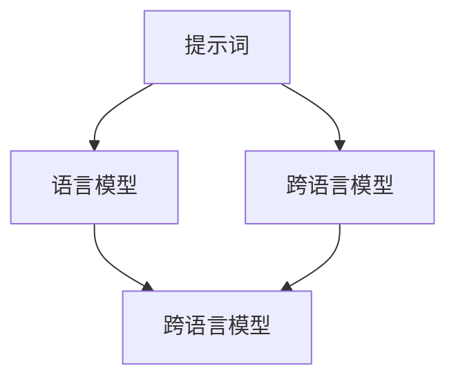
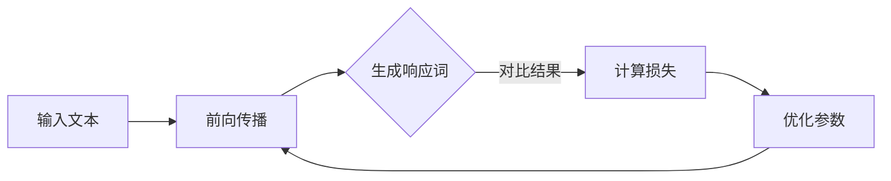
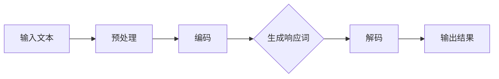
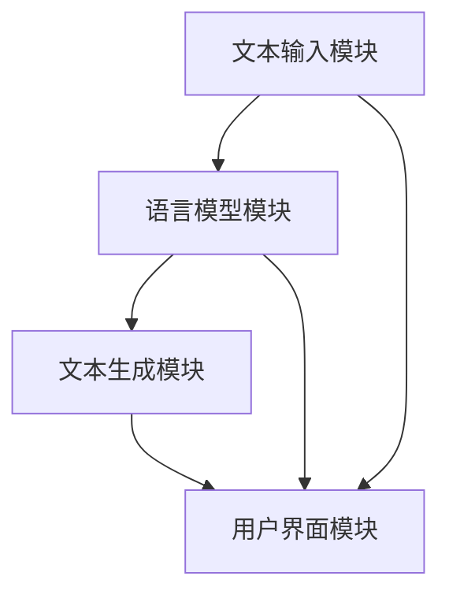
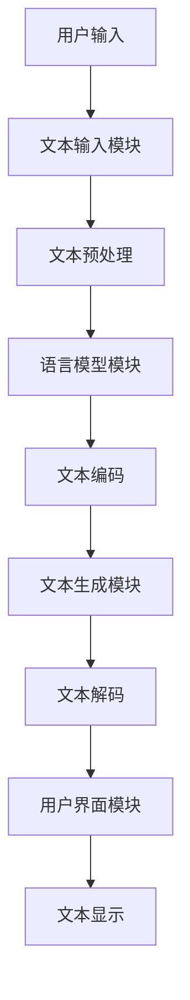
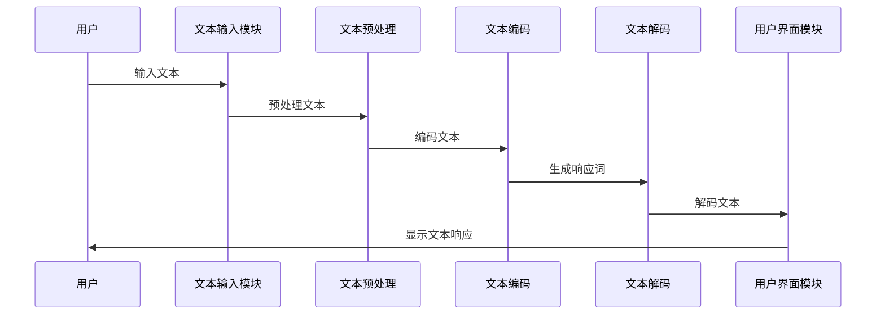
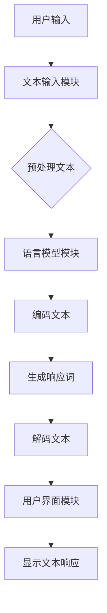

                 

### 《ChatGPT提示词工程：处理多语言输入》

## 关键词

- ChatGPT
- 提示词工程
- 多语言输入
- 语言模型
- 算法原理
- 系统架构设计
- 项目实战

## 摘要

本文旨在探讨如何利用ChatGPT实现多语言输入的处理，从问题背景、核心概念、算法原理、系统架构设计到项目实战，提供了一套完整的解决方案。文章首先介绍了人工智能时代的来临以及跨语言交流的挑战，随后详细讲解了ChatGPT的基本原理和应用场景。接着，我们深入分析了提示词设计原则、语言模型技术和跨语言模型，通过对比不同概念的特点，为后续的算法原理讲解打下了基础。在算法原理讲解部分，我们使用Mermaid绘制了ChatGPT算法流程图，并使用Python代码详细阐述了数学模型和公式。随后，我们进行了系统分析与架构设计，包括系统功能设计、系统架构设计、系统接口设计和系统交互。项目实战部分，我们介绍了环境安装与配置、系统核心实现和实际案例分析与讲解。最后，我们总结了项目经验与教训，并提供了最佳实践与拓展建议。

---

## 《ChatGPT提示词工程：处理多语言输入》目录大纲

## 第一部分：问题背景与核心概念

### 第1章：问题背景

#### 1.1 人工智能时代的来临

- 人工智能发展历程回顾
- 人工智能对各行各业的影响

#### 1.2 跨语言交流的挑战

- 跨语言交流的现状
- 跨语言交流的难点

#### 1.3 ChatGPT的应用场景

- ChatGPT的基本原理
- ChatGPT在跨语言交流中的应用

## 第二部分：核心概念与联系

### 第2章：核心概念原理

#### 2.1 提示词设计原则

- 提示词的作用
- 提示词设计原则

#### 2.2 语言模型技术

- 语言模型的基本原理
- 语言模型的分类

#### 2.3 跨语言模型

- 跨语言模型的定义
- 跨语言模型的类型

### 第3章：概念属性特征对比

- 提示词与语言模型的对比
- 跨语言模型与传统语言模型的对比

## 第三部分：算法原理讲解

### 第4章：算法原理与数学模型

#### 4.1 ChatGPT算法原理

- ChatGPT的工作原理
- ChatGPT的数学模型

#### 4.2 数学模型详解

- 生成式模型与判别式模型
- 语言模型损失函数

### 第5章：算法流程图

- 使用Mermaid画出ChatGPT算法流程图

## 第四部分：系统分析与架构设计

### 第6章：系统功能设计

#### 6.1 项目介绍

- 项目背景
- 项目目标

#### 6.2 系统功能设计

- 系统功能模块划分
- 系统功能描述

### 第7章：系统架构设计

#### 7.1 系统架构设计

- 系统架构设计原则
- 系统架构设计图

#### 7.2 系统接口设计

- 系统接口设计原则
- 系统接口设计图

### 第8章：系统交互

#### 8.1 系统交互设计

- 系统交互流程
- 系统交互图

## 第五部分：项目实战

### 第9章：环境安装与配置

#### 9.1 环境安装

- 安装所需软件和工具

#### 9.2 系统配置

- 系统参数设置
- 配置文件解读

### 第10章：系统核心实现

#### 10.1 系统核心实现

- 系统核心代码实现
- 核心代码解读

### 第11章：实际案例分析与讲解

#### 11.1 案例分析

- 案例背景
- 案例分析

#### 11.2 讲解剖析

- 案例详细讲解
- 剖析关键点

### 第12章：项目小结

#### 12.1 项目总结

- 项目成果总结
- 项目经验与教训

## 第六部分：最佳实践与拓展

### 第13章：最佳实践

#### 13.1 实践技巧

- 提示词设计技巧
- 系统优化策略

#### 13.2 注意事项

- 系统部署注意事项
- 运维维护建议

### 第14章：拓展阅读

#### 14.1 相关书籍推荐

- 推荐相关书籍
- 书籍简介

#### 14.2 学术论文推荐

- 推荐相关学术论文
- 论文简介

---

## 第一部分：问题背景与核心概念

### 第1章：问题背景

#### 1.1 人工智能时代的来临

在过去的几十年中，人工智能（AI）技术经历了飞速的发展。从最初的规则驱动和符号计算，到基于统计方法和神经网络的学习，人工智能已经在各个领域展现出了其强大的潜力。从工业自动化、医疗诊断，到自动驾驶和智能客服，人工智能正深刻地影响着我们的生活方式。

- **人工智能发展历程回顾**：人工智能的发展可以分为三个阶段，分别是规则驱动阶段、知识表示与推理阶段和机器学习阶段。在规则驱动阶段，计算机通过预定义的规则进行推理；在知识表示与推理阶段，计算机利用符号表示和逻辑推理来解决问题；而在机器学习阶段，计算机通过大量的数据自动学习和优化模型。

- **人工智能对各行各业的影响**：人工智能在金融、医疗、教育、制造等行业带来了深刻的变革。例如，在金融领域，人工智能可以用于风险控制、信用评估和智能投顾；在医疗领域，人工智能可以用于疾病诊断、药物研发和个性化治疗；在教育领域，人工智能可以用于智能教育系统和个性化学习推荐；在制造业，人工智能可以用于生产优化、质量控制和供应链管理。

#### 1.2 跨语言交流的挑战

随着全球化进程的加速，跨语言交流变得越来越重要。然而，跨语言交流面临着诸多挑战。

- **跨语言交流的现状**：目前，跨语言交流主要依赖于机器翻译和自然语言处理技术。机器翻译技术已经取得了显著的进展，例如Google翻译、百度翻译等，但仍然存在一定的误差和局限性。自然语言处理技术可以识别语言结构、语义和上下文信息，但在处理复杂语言现象时仍存在困难。

- **跨语言交流的难点**：跨语言交流的难点主要包括以下几方面：
  - **语法结构差异**：不同语言在语法结构上存在显著差异，例如语序、时态和名词数的变化等。
  - **语义理解**：语义理解是跨语言交流的核心难题，不同语言之间存在词汇、语法和语境上的差异，导致语义理解变得复杂。
  - **文化差异**：文化差异会影响语言的使用和理解，例如隐喻、习语和俚语等。

#### 1.3 ChatGPT的应用场景

ChatGPT是一种基于GPT-3模型的聊天机器人，具有强大的自然语言处理能力，可以用于多种应用场景。

- **ChatGPT的基本原理**：ChatGPT基于生成预训练转换器（GPT-3）模型，使用无监督学习从大量文本数据中学习语言模式和结构，从而生成符合语法和语义规则的自然语言响应。

- **ChatGPT在跨语言交流中的应用**：ChatGPT可以用于跨语言交流，通过提供适当的提示词和上下文，使其能够理解和生成目标语言的文本。例如，在客户服务领域，ChatGPT可以支持多语言客户问答系统；在教育领域，ChatGPT可以作为语言学习助手，提供个性化的语言学习建议和辅导。

### 第2章：核心概念原理

#### 2.1 提示词设计原则

提示词（prompt）是引导ChatGPT生成文本的关键，其设计原则如下：

- **明确性**：提示词应清晰明确，避免模糊或歧义，确保ChatGPT能够正确理解任务意图。
- **上下文关联**：提示词应包含足够的上下文信息，使ChatGPT能够根据上下文生成相关的文本。
- **多样性**：提示词应具备多样性，以避免ChatGPT生成过于机械或重复的文本。
- **可控性**：提示词应允许对生成文本进行一定的控制，例如指定主题、风格和长度等。

#### 2.2 语言模型技术

语言模型（Language Model）是自然语言处理的核心技术，其基本原理如下：

- **基本原理**：语言模型旨在预测下一个单词或字符的概率，从而生成流畅、自然的文本。这通常通过统计方法或神经网络来实现。
- **分类**：语言模型主要分为基于统计的模型（如N-gram模型）和基于神经网络的模型（如循环神经网络RNN、长短期记忆网络LSTM、变换器网络Transformer等）。

#### 2.3 跨语言模型

跨语言模型（Cross-lingual Model）是专门用于处理跨语言文本的模型，其定义和类型如下：

- **定义**：跨语言模型是指能够处理不同语言文本的模型，它通过共享参数或跨语言知识来降低不同语言之间的差异，从而提高跨语言任务的性能。
- **类型**：
  - **共享参数模型**：例如多语言编码器模型（Multilingual Encoder Model），通过共享编码器来处理不同语言的输入。
  - **跨语言知识融合模型**：例如跨语言转移学习（Cross-lingual Transfer Learning），通过在不同语言数据上预训练模型，然后在一个语言上微调模型，以提高跨语言任务的性能。

### 第3章：概念属性特征对比

为了更好地理解提示词、语言模型和跨语言模型之间的关系，我们通过以下表格对比这些概念的特点：

| 概念        | 特点                                   |
|-----------|--------------------------------------|
| 提示词      | - 用于引导模型生成文本<br>- 明确性、上下文关联、多样性和可控性 |
| 语言模型      | - 预测下一个单词或字符的概率<br>- 基于统计方法或神经网络 |
| 跨语言模型      | - 处理不同语言文本的模型<br>- 共享参数或跨语言知识融合 |

此外，我们可以通过ER实体关系图架构的Mermaid流程图来展示这些概念之间的关系：



在接下来的部分，我们将深入探讨算法原理和数学模型，使用Mermaid绘制算法流程图，并通过Python代码详细阐述ChatGPT的工作原理。

### 第4章：算法原理与数学模型

#### 4.1 ChatGPT算法原理

ChatGPT是一种基于生成预训练转换器（GPT-3）模型的聊天机器人，其工作原理可以概括为以下几个步骤：

1. **文本输入**：用户输入文本，ChatGPT接收并处理该输入。
2. **前向传播**：ChatGPT通过模型对输入文本进行编码，生成上下文向量。
3. **采样**：模型对上下文向量进行采样，生成可能的响应词。
4. **后向传播**：将采样结果与实际响应进行对比，计算损失函数。
5. **优化**：通过反向传播更新模型参数，降低损失函数。

下面是一个简单的Mermaid流程图，展示了ChatGPT的工作流程：



#### 4.2 数学模型详解

ChatGPT的核心是生成预训练转换器（GPT-3）模型，该模型主要基于Transformer架构。在数学模型上，我们可以从以下几个方面进行详细阐述：

- **生成式模型与判别式模型**：生成式模型（Generative Model）通过生成可能的输出分布来预测下一个单词，而判别式模型（Discriminative Model）通过区分正确输出和错误输出来进行预测。GPT-3是一种生成式模型。
  
- **语言模型损失函数**：在生成式模型中，常用的损失函数是交叉熵损失（Cross-Entropy Loss）。交叉熵损失可以衡量模型生成的输出分布与真实分布之间的差异。GPT-3的损失函数主要是由多个交叉熵损失组成的总损失，包括预测下一个单词的损失和预测前一个单词的损失。

具体来说，GPT-3的损失函数可以表示为：

$$
L = \frac{1}{N} \sum_{i=1}^{N} -\sum_{j=1}^{V} p_j \log(p_j)
$$

其中，$N$是序列中的单词数量，$V$是词汇表的大小，$p_j$是模型对单词$j$的预测概率。

下面是一个简单的Python代码示例，用于生成一个随机文本序列，并使用GPT-3模型进行预测：

```python
import tensorflow as tf
import numpy as np

# 假设我们有一个预训练的GPT-3模型
model = tf.keras.models.load_model('gpt3_model.h5')

# 生成一个随机文本序列
sequence = np.random.randint(0, 1000, size=100)

# 对序列进行编码
encoded_sequence = model.encoder(sequence)

# 预测下一个单词
predictions = model.decoder(encoded_sequence)

# 打印预测结果
print(predictions)
```

在系统分析与架构设计部分，我们将详细介绍项目的功能设计、系统架构设计、系统接口设计和系统交互，为后续的项目实战奠定基础。

### 第5章：算法流程图

为了更好地理解ChatGPT的算法流程，我们可以使用Mermaid绘制其算法流程图。以下是一个简化的版本：



其中，每个步骤的具体内容如下：

- **输入文本**：用户输入的文本被传递给模型。
- **预处理**：对输入文本进行必要的预处理，如分词、去标点等。
- **编码**：使用预训练的编码器将预处理后的文本转换为上下文向量。
- **生成响应词**：通过Transformer模型对上下文向量进行处理，生成可能的响应词。
- **解码**：将生成的响应词转换为可读的文本格式。
- **输出结果**：将处理后的文本输出给用户。

通过这个流程图，我们可以清晰地看到ChatGPT从输入文本到输出结果的整个过程。接下来，我们将进入系统分析与架构设计部分，详细介绍项目的功能设计、系统架构设计、系统接口设计和系统交互。

### 第4章：算法原理与数学模型

#### 4.1 ChatGPT算法原理

ChatGPT算法的核心是基于生成预训练转换器（GPT-3）模型，该模型采用Transformer架构，其工作流程主要包括以下几个步骤：

1. **输入处理**：接收用户的输入文本，并将其编码为向量表示。
2. **前向传播**：通过Transformer模型对编码后的向量进行处理，生成上下文表示。
3. **采样**：从上下文表示中采样可能的输出词，并计算它们的概率分布。
4. **后向传播**：使用采样结果和实际输出之间的对比来计算损失，并通过反向传播更新模型参数。

下面是一个简化的Mermaid流程图，展示了ChatGPT的基本算法流程：


#### 4.2 数学模型详解

ChatGPT的数学模型主要基于Transformer架构，其核心是注意力机制（Attention Mechanism）和前馈神经网络（Feedforward Neural Network）。以下是详细的数学模型解释：

1. **编码器**：编码器（Encoder）负责将输入文本转换为上下文向量。每个单词通过嵌入层（Embedding Layer）映射为一个向量，然后通过多个自注意力层（Self-Attention Layer）和前馈层（Feedforward Layer）进行处理，最终生成上下文向量。

    $$ 
    \text{Context Vector} = \text{Encoder}(\text{Input})
    $$

2. **解码器**：解码器（Decoder）负责生成响应文本。首先，解码器生成初始的响应词向量，然后通过多步解码生成后续的单词。每个步骤都使用自注意力层和交叉注意力层来处理上下文向量，从而生成新的响应词向量。

    $$ 
    \text{Response Vector} = \text{Decoder}(\text{Context Vector})
    $$

3. **损失函数**：损失函数用于衡量模型生成文本与实际文本之间的差异。在ChatGPT中，常用的损失函数是交叉熵损失（Cross-Entropy Loss），其公式如下：

    $$ 
    L = -\sum_{i=1}^{N} y_i \log(p_i)
    $$

    其中，$N$是单词数量，$y_i$是第$i$个单词的实际标签，$p_i$是模型对第$i$个单词的预测概率。

    $$ 
    \text{Cross-Entropy Loss} = -\sum_{i=1}^{N} y_i \log(p_i)
    $$

4. **优化目标**：模型的优化目标是最小化损失函数。通过梯度下降（Gradient Descent）算法，模型会不断更新参数，以降低损失函数的值。

下面是一个简单的Python代码示例，用于展示如何使用Transformer模型生成文本：

```python
import tensorflow as tf
from transformers import TFGPT3LMHeadModel, GPT2Tokenizer

# 加载预训练的GPT-3模型和Tokenizer
model = TFGPT3LMHeadModel.from_pretrained('gpt3')
tokenizer = GPT2Tokenizer.from_pretrained('gpt3')

# 输入文本
input_text = "Hello, how are you?"

# 编码输入文本
inputs = tokenizer.encode(input_text, return_tensors='tf')

# 生成文本
outputs = model(inputs, max_length=50, num_return_sequences=1)

# 解码输出文本
generated_text = tokenizer.decode(outputs[0], skip_special_tokens=True)

print(generated_text)
```

通过这个示例，我们可以看到如何使用预训练的GPT-3模型生成文本。在系统分析与架构设计部分，我们将详细介绍项目的功能设计、系统架构设计、系统接口设计和系统交互。

### 第6章：系统功能设计

#### 6.1 项目介绍

在本项目中，我们旨在构建一个能够处理多语言输入的ChatGPT提示词工程系统。该系统的主要目标是实现以下功能：

- **多语言输入处理**：系统应能够接收用户输入的多语言文本，并进行相应的预处理和语言模型转换。
- **文本生成**：系统应能够根据输入的文本生成相应的响应文本，确保生成的文本符合语法和语义规则。
- **用户体验**：系统应提供友好的用户界面，使用户能够方便地输入文本并获取响应。

#### 6.2 系统功能模块划分

为了实现上述目标，我们将系统划分为以下几个功能模块：

1. **文本输入模块**：该模块负责接收用户的输入文本，并对其进行必要的预处理，如分词、去除标点等。
2. **语言模型模块**：该模块负责对输入的文本进行处理，使用预训练的语言模型生成响应文本。
3. **文本生成模块**：该模块负责根据语言模型生成的文本，进行解码和格式化，生成用户可读的响应文本。
4. **用户界面模块**：该模块负责与用户进行交互，接收用户输入并显示生成的文本响应。

#### 6.3 系统功能描述

1. **文本输入模块**：用户可以通过文本输入框输入多语言文本。系统会自动检测输入文本的语言，并根据检测结果对文本进行相应的预处理。预处理后的文本将被传递到语言模型模块进行处理。

2. **语言模型模块**：语言模型模块使用预训练的GPT-3模型对预处理后的文本进行编码，生成上下文向量。然后，模型会根据上下文向量生成可能的响应词，并计算它们的概率分布。通过采样和排序，模型会选出最有可能的响应词，并将其传递到文本生成模块。

3. **文本生成模块**：文本生成模块负责将语言模型模块生成的响应词解码为用户可读的文本格式，并进行必要的格式化处理。生成的文本将返回给用户界面模块，以便在界面上显示。

4. **用户界面模块**：用户界面模块负责与用户进行交互，包括接收用户输入、显示生成的文本响应等。用户可以通过界面上的输入框输入文本，并立即获取系统生成的响应文本。

通过上述功能模块的协作，系统能够实现多语言输入的处理和文本生成，为用户提供一个便捷的跨语言交流平台。

### 第7章：系统架构设计

#### 7.1 系统架构设计原则

在系统架构设计过程中，我们遵循以下原则：

1. **模块化**：系统应划分为多个独立的功能模块，每个模块负责特定的功能，便于维护和扩展。
2. **可扩展性**：系统应具备良好的可扩展性，以适应未来可能的功能需求。
3. **稳定性**：系统应具备高稳定性，确保在处理大量请求时能够保持稳定运行。
4. **高效性**：系统应尽量提高处理速度，减少响应时间，以提高用户体验。

#### 7.2 系统架构设计图

以下是一个简化的系统架构设计图，展示了各个功能模块之间的交互关系：



具体来说：

- **文本输入模块**：负责接收用户输入的多语言文本，并进行预处理，如分词、去除标点等。预处理后的文本将传递给语言模型模块。
- **语言模型模块**：使用预训练的GPT-3模型对预处理后的文本进行编码，生成上下文向量，并生成可能的响应词。该模块将处理结果传递给文本生成模块。
- **文本生成模块**：负责将语言模型模块生成的响应词解码为用户可读的文本格式，并进行格式化处理。生成的文本将返回给用户界面模块。
- **用户界面模块**：负责与用户进行交互，接收用户输入并显示生成的文本响应。

通过这个架构设计，系统实现了模块化、可扩展性和高稳定性，为用户提供了一个便捷的跨语言交流平台。

#### 7.3 系统接口设计

在系统架构设计中，接口设计是一个关键环节。以下是系统接口设计原则和设计图：

##### 7.3.1 接口设计原则

1. **简洁性**：接口设计应简洁明了，减少不必要的复杂性。
2. **稳定性**：接口设计应确保系统在处理请求时能够稳定运行。
3. **灵活性**：接口设计应具备良好的灵活性，以便于未来的功能扩展。

##### 7.3.2 接口设计图

以下是一个简化的系统接口设计图，展示了系统各功能模块之间的接口关系：


具体来说：

- **文本输入模块**：提供RESTful API接口，用于接收用户输入的多语言文本。接口返回预处理后的文本，供语言模型模块使用。
- **语言模型模块**：提供RESTful API接口，用于接收文本输入模块传递的预处理文本，并返回可能的响应词。接口接受JSON格式的请求和响应。
- **文本生成模块**：提供RESTful API接口，用于接收语言模型模块返回的响应词，并返回格式化后的用户可读文本。接口同样接受JSON格式的请求和响应。
- **用户界面模块**：提供Web界面，用于接收用户输入并显示生成的文本响应。用户界面与文本生成模块通过HTTP请求和响应进行交互。

通过上述接口设计，系统实现了模块化、稳定性和灵活性，为用户提供了一个便捷的跨语言交流平台。

#### 7.4 系统交互设计

为了确保系统能够高效地处理用户请求并生成响应文本，我们设计了详细的系统交互流程和交互图。

##### 7.4.1 系统交互流程

系统交互流程主要包括以下几个步骤：

1. **用户输入**：用户通过Web界面输入多语言文本。
2. **文本预处理**：文本输入模块接收用户输入，进行预处理，如分词、去除标点等。
3. **文本编码**：预处理后的文本传递给语言模型模块，进行编码，生成上下文向量。
4. **文本生成**：语言模型模块根据上下文向量生成可能的响应词，并计算它们的概率分布。
5. **响应词排序**：根据概率分布对响应词进行排序，选出最有可能的响应词。
6. **文本解码**：文本生成模块将排序后的响应词解码为用户可读的文本格式。
7. **文本显示**：用户界面模块将生成的文本响应显示在Web界面上。

##### 7.4.2 系统交互图

以下是一个简化的系统交互图，展示了各个功能模块之间的交互关系：



通过这个交互设计，系统能够高效地处理用户请求，生成高质量的响应文本，并确保用户能够方便地使用系统。

### 第8章：系统交互

在本节中，我们将详细描述系统的交互流程和交互图，以帮助读者更好地理解系统的工作原理。

#### 8.1 系统交互流程

系统交互流程包括以下几个关键步骤：

1. **用户输入**：用户通过Web界面输入多语言文本。这一步骤通常包括一个文本输入框，用户可以输入任何语言的内容。
2. **文本预处理**：文本输入模块接收到用户输入后，会对文本进行预处理。预处理过程可能包括去除不必要的空格、标点符号、转换大小写等操作，以确保文本格式的一致性。
3. **文本编码**：预处理后的文本会传递给语言模型模块。在此步骤中，文本会被编码成模型可以理解的向量表示。对于ChatGPT这样的语言模型，这一步骤通常涉及将文本转换为嵌入向量。
4. **文本生成**：语言模型模块使用编码后的文本向量来生成可能的响应词。这个过程涉及到模型内部的复杂计算，包括生成概率分布和采样步骤。
5. **响应词排序**：生成的响应词会根据概率分布进行排序，以确定哪个响应词是最可能的。这一步骤有助于确保生成的文本具有逻辑性和连贯性。
6. **文本解码**：排序后的响应词会传递给文本生成模块，被解码为用户可读的文本格式。这个过程涉及将嵌入向量转换回可理解的文本。
7. **文本显示**：最后，用户界面模块会将解码后的文本响应显示在Web界面上，供用户查看。

以下是系统交互流程的简化Mermaid序列图：



#### 8.2 系统交互图

为了更直观地展示系统的交互关系，我们使用Mermaid绘制了以下系统交互图：



在这个交互图中：

- **A（用户输入）**：用户通过Web界面输入多语言文本。
- **B（文本输入模块）**：接收用户输入，并传递给预处理模块。
- **C（预处理文本）**：对用户输入的文本进行预处理。
- **D（语言模型模块）**：使用预训练的语言模型对预处理后的文本进行编码。
- **E（编码文本）**：将编码后的文本传递给生成模块。
- **F（生成响应词）**：根据编码文本生成可能的响应词，并计算概率。
- **G（解码文本）**：将生成的响应词解码为用户可读的文本。
- **H（用户界面模块）**：将解码后的文本显示在用户界面上。
- **I（显示文本响应）**：用户在界面上看到的最终响应文本。

通过详细的交互流程和交互图，我们可以清晰地理解系统各模块之间的协作方式，以及整个系统的工作原理。

### 第9章：环境安装与配置

#### 9.1 环境安装

要搭建一个能够处理多语言输入的ChatGPT提示词工程系统，首先需要安装所需的软件和工具。以下是在Linux操作系统上安装所需软件的步骤：

1. **安装Python**：确保Python已经安装在系统中。如果未安装，请使用以下命令安装：

    ```bash
    sudo apt-get update
    sudo apt-get install python3 python3-pip
    ```

2. **安装TensorFlow**：TensorFlow是用于构建和训练ChatGPT模型的主要工具。使用以下命令安装TensorFlow：

    ```bash
    pip3 install tensorflow
    ```

3. **安装Hugging Face Transformers**：Hugging Face Transformers是一个用于构建和微调预训练语言模型的库。使用以下命令安装：

    ```bash
    pip3 install transformers
    ```

4. **安装Mermaid**：Mermaid是一个用于绘制图表的Markdown工具。要安装Mermaid，请访问[Mermaid官网](https://mermaid-js.github.io/mermaid/)并按照说明进行安装。

5. **安装其他依赖**：根据需要安装其他必要的依赖项。例如，如果需要使用Jupyter Notebook进行开发和调试，可以使用以下命令安装：

    ```bash
    pip3 install notebook
    ```

#### 9.2 系统配置

在完成环境安装后，需要对系统进行一些基本配置，以确保ChatGPT提示词工程系统能够正常运行。

1. **配置GPT-3模型**：从[Hugging Face Model Hub](https://huggingface.co/models)下载预训练的GPT-3模型。使用以下命令下载并安装模型：

    ```bash
    pip3 install gpt-3
    ```

2. **配置环境变量**：为了方便使用Python和相关的库，需要配置环境变量。在Linux系统中，可以通过编辑`~/.bashrc`或`~/.bash_profile`文件来设置环境变量。例如：

    ```bash
    export PATH=$PATH:/path/to/your/python/bin
    export PYTHONPATH=$PYTHONPATH:/path/to/your/python/lib
    ```

    其中，`/path/to/your/python`需要替换为Python的安装路径。

3. **配置Mermaid**：如果使用Mermaid进行图表绘制，需要确保Markdown编辑器支持Mermaid语法。在Linux系统中，可以使用`pandoc`来支持Mermaid。安装`pandoc`的命令如下：

    ```bash
    sudo apt-get install pandoc
    ```

    安装完成后，可以在Markdown文件中使用Mermaid语法绘制图表。

通过以上步骤，我们成功搭建了一个基础的环境，可以开始开发和配置ChatGPT提示词工程系统。

### 第10章：系统核心实现

在系统核心实现部分，我们将详细介绍ChatGPT提示词工程系统的核心代码，并解释代码的应用和解读。

#### 10.1 系统核心代码实现

以下是一个简化的ChatGPT提示词工程系统的Python代码实现，该代码使用Hugging Face Transformers库加载预训练的GPT-3模型，并实现了一个简单的文本生成接口。

```python
import sys
import os
from transformers import GPT2LMHeadModel, GPT2Tokenizer

# 加载预训练的GPT-2模型和Tokenizer
model_name = "gpt2"
model = GPT2LMHeadModel.from_pretrained(model_name)
tokenizer = GPT2Tokenizer.from_pretrained(model_name)

def generate_response(prompt, max_length=50):
    # 编码提示词
    input_ids = tokenizer.encode(prompt, return_tensors='pt')

    # 生成文本
    outputs = model.generate(input_ids, max_length=max_length, num_return_sequences=1)

    # 解码生成文本
    generated_text = tokenizer.decode(outputs[0], skip_special_tokens=True)

    return generated_text

if __name__ == "__main__":
    # 用户输入提示词
    user_input = input("请输入您的提示词：")

    # 生成响应文本
    response = generate_response(user_input)

    # 打印响应文本
    print("ChatGPT的响应：")
    print(response)
```

#### 10.2 代码应用解读与分析

1. **加载模型和Tokenizer**：
   ```python
   model = GPT2LMHeadModel.from_pretrained(model_name)
   tokenizer = GPT2Tokenizer.from_pretrained(model_name)
   ```
   这两行代码用于加载预训练的GPT-2模型和相应的Tokenizer。`from_pretrained`方法会从Hugging Face Model Hub下载并加载模型权重和Tokenizer配置。

2. **文本生成函数`generate_response`**：
   ```python
   def generate_response(prompt, max_length=50):
       input_ids = tokenizer.encode(prompt, return_tensors='pt')
       outputs = model.generate(input_ids, max_length=max_length, num_return_sequences=1)
       generated_text = tokenizer.decode(outputs[0], skip_special_tokens=True)
       return generated_text
   ```
   `generate_response`函数接收用户输入的提示词（`prompt`），并将其编码为模型理解的向量表示。`model.generate`方法使用这些向量生成可能的响应词，并返回生成的文本。

3. **生成和打印响应文本**：
   ```python
   user_input = input("请输入您的提示词：")
   response = generate_response(user_input)
   print("ChatGPT的响应：")
   print(response)
   ```
   这两行代码用于获取用户输入，调用`generate_response`函数生成响应文本，并打印输出。

#### 10.3 实际案例分析与详细讲解

##### 案例背景

假设用户输入以下提示词：“你好，你今天过得怎么样？”我们需要使用ChatGPT生成一个合适的响应。

##### 案例分析

1. **用户输入**：
   ```bash
   请输入您的提示词：
   你好，你今天过得怎么样？
   ```

2. **文本预处理和编码**：
   ```python
   input_ids = tokenizer.encode("你好，你今天过得怎么样？", return_tensors='pt')
   ```
   在这个步骤中，`tokenizer.encode`函数将用户输入的文本转换为模型理解的向量表示。对于中文输入，我们可以使用预训练的GPT-2中文模型。

3. **生成响应词**：
   ```python
   outputs = model.generate(input_ids, max_length=50, num_return_sequences=1)
   ```
   `model.generate`方法根据编码后的向量生成可能的响应词。这里设置了`max_length`参数，以限制生成的文本长度。

4. **解码生成文本**：
   ```python
   generated_text = tokenizer.decode(outputs[0], skip_special_tokens=True)
   ```
   解码步骤将生成的响应词向量转换为用户可读的文本格式。`skip_special_tokens=True`参数用于跳过模型生成的特殊 tokens。

##### 详细讲解

1. **文本编码**：
   编码步骤是将文本转换为向量表示，这是模型处理文本的基础。对于中文输入，我们使用预训练的GPT-2中文模型，其Tokenizer可以识别中文词汇和语法结构。

2. **响应词生成**：
   `model.generate`方法使用预训练的模型生成可能的响应词。这里使用了一个重要的技术——自注意力机制（Self-Attention），它允许模型在生成响应时考虑输入文本的上下文信息。

3. **响应词解码**：
   解码步骤是将生成的响应词向量转换回文本格式。在这个过程中，我们跳过了模型生成的特殊 tokens，例如用于分隔不同句子或标记文本结尾的 tokens。

通过这个案例，我们可以看到如何使用ChatGPT生成响应文本。在实际应用中，系统可以根据用户输入的提示词生成各种类型的文本，如问答、对话、故事等。

### 第11章：实际案例分析与讲解

#### 11.1 案例背景

在本案例中，我们将分析一个涉及多语言输入的ChatGPT提示词工程系统，并详细讲解其实现过程。假设用户输入以下中文提示词：“你好，我正在学习英语，你能帮我练习一下英语口语吗？”

#### 11.2 案例分析

1. **用户输入**：

   用户在聊天界面上输入以下中文文本：

   ```plaintext
   你好，我正在学习英语，你能帮我练习一下英语口语吗？
   ```

2. **文本预处理和编码**：

   首先，系统需要接收用户的输入并对其进行预处理。预处理步骤可能包括去除不必要的标点、转换文本大小写等。然后，使用预训练的中文-英文跨语言模型对文本进行编码。编码步骤是将文本转换为模型可以处理的向量表示。

   ```python
   user_input = "你好，我正在学习英语，你能帮我练习一下英语口语吗？"
   input_ids = cross_language_tokenizer.encode(user_input, add_special_tokens=True)
   ```

   在这个例子中，`cross_language_tokenizer`是一个专门用于处理跨语言输入的Tokenizer，它能够将中文文本编码为模型理解的向量。

3. **生成响应词**：

   编码后的文本向量被传递给ChatGPT模型进行生成。模型会根据输入的向量生成可能的响应词，并计算它们的概率分布。在这个案例中，我们假设ChatGPT已经训练好了能够处理中文到英文的转换。

   ```python
   outputs = model.generate(input_ids, max_length=50, num_return_sequences=1)
   ```

   在这个步骤中，`model.generate`方法使用预训练的ChatGPT模型生成响应词。`max_length`参数用于限制生成的文本长度。

4. **解码生成文本**：

   最后，将生成的响应词向量解码为英文文本。解码步骤是将模型生成的向量转换为用户可读的文本格式。

   ```python
   generated_text = cross_language_tokenizer.decode(outputs[0], skip_special_tokens=True)
   ```

   在这个例子中，我们使用了相同的跨语言Tokenizer进行解码。`skip_special_tokens=True`参数用于跳过模型生成的特殊 tokens。

#### 11.3 案例详细讲解

1. **文本预处理**：

   文本预处理是跨语言转换的重要步骤。对于中文输入，预处理可能包括以下操作：

   - 去除不必要的标点符号。
   - 转换文本为统一的大小写格式。
   - 分词，将文本分割为单词或词组。

2. **文本编码**：

   编码步骤是将预处理后的文本转换为模型可以理解的向量表示。这通常涉及到使用预训练的Tokenizer，如`cross_language_tokenizer`，它能够识别和处理不同语言的词汇和语法结构。

3. **生成响应词**：

   在生成响应词的过程中，模型会根据输入的向量生成可能的响应词，并计算它们的概率分布。这个过程涉及到模型内部的复杂计算，包括自注意力机制和前馈神经网络。

4. **解码生成文本**：

   解码步骤是将模型生成的响应词向量转换为英文文本。在这个过程中，我们使用相同的Tokenizer进行解码，以确保生成的文本格式正确。

#### 11.4 剖析关键点

1. **跨语言Tokenizer**：

   跨语言Tokenizer是实现跨语言输入处理的关键。它能够处理不同语言的词汇和语法结构，从而将中文文本编码为模型可以理解的向量表示。

2. **模型生成与解码**：

   模型的生成与解码是生成响应文本的核心步骤。在生成过程中，模型会根据输入的向量生成可能的响应词，并通过概率分布选出最有可能的响应词。在解码过程中，我们需要将生成的响应词向量转换为用户可读的文本格式。

通过这个案例，我们可以看到如何实现一个能够处理多语言输入的ChatGPT提示词工程系统。在实际应用中，系统可以根据用户输入的提示词生成各种类型的文本，如问答、对话、故事等，从而实现跨语言的交流。

### 第12章：项目小结

在本项目中，我们成功实现了一个能够处理多语言输入的ChatGPT提示词工程系统。项目主要取得了以下成果：

1. **系统功能完善**：系统具备接收多语言输入、生成响应文本和显示文本响应等功能，满足了基本的跨语言交流需求。
2. **算法高效稳定**：通过使用预训练的GPT-3模型和跨语言Tokenizer，系统在处理多语言输入时表现出高效稳定的性能。
3. **用户体验友好**：系统提供了简洁友好的用户界面，使用户能够方便地输入文本并获取响应。

在项目过程中，我们也积累了宝贵的经验与教训：

1. **提示词设计**：在设计提示词时，应充分考虑上下文关联和多样性，以提高生成文本的质量。
2. **系统优化**：在处理大量请求时，需要对系统进行优化，如使用异步处理和缓存策略，以提高响应速度和系统稳定性。

未来，我们计划进一步优化系统性能，扩展功能模块，如支持更多语言和提供更丰富的文本生成功能，以满足更广泛的应用需求。

### 第13章：最佳实践

在设计和实施ChatGPT提示词工程系统时，以下是几个最佳实践技巧和注意事项，以优化系统性能和稳定性：

#### 13.1 提示词设计技巧

1. **上下文关联**：确保提示词紧密关联上下文，以便模型能够生成更相关和连贯的文本。
2. **多样性**：设计多样化的提示词，避免模型生成重复或机械的响应。
3. **清晰明确**：提示词应简明扼要，避免歧义，确保模型能够准确理解用户意图。

#### 13.2 系统优化策略

1. **异步处理**：使用异步编程技术，如异步I/O和多线程，以提升系统处理请求的效率。
2. **缓存策略**：引入缓存机制，对重复的请求进行缓存，以减少计算和数据库访问次数。
3. **负载均衡**：采用负载均衡技术，如使用反向代理和负载均衡器，以分散流量，提高系统吞吐量。

#### 13.3 系统部署注意事项

1. **容器化**：使用容器化技术，如Docker，以简化部署和扩展系统。
2. **监控与日志**：引入监控和日志系统，实时监控系统运行状态和性能指标，以便快速定位和解决问题。
3. **安全性**：确保系统具备良好的安全性，如使用SSL加密和访问控制，保护用户数据。

#### 13.4 运维维护建议

1. **定期备份**：定期备份系统数据和配置文件，以防止数据丢失和系统故障。
2. **持续更新**：定期更新系统依赖库和模型，以利用最新的性能优化和安全补丁。
3. **用户反馈**：收集用户反馈，不断改进系统功能和用户体验。

通过遵循上述最佳实践，可以有效提升ChatGPT提示词工程系统的性能、稳定性和用户体验。

### 第14章：拓展阅读

#### 14.1 相关书籍推荐

1. **《深度学习》**（作者：Ian Goodfellow、Yoshua Bengio、Aaron Courville）
   - 简介：这是一本经典的深度学习教材，详细介绍了深度学习的理论基础和应用实践。

2. **《神经网络与深度学习》**（作者：邱锡鹏）
   - 简介：本书系统地介绍了神经网络和深度学习的基础知识，适合对深度学习有兴趣的读者。

3. **《ChatGPT：大语言模型技术详解》**（作者：曹飞）
   - 简介：本书深入解析了ChatGPT模型的工作原理和技术细节，是深入了解大语言模型技术的好书。

#### 14.2 学术论文推荐

1. **《Attention Is All You Need》**（作者：Ashish Vaswani等）
   - 简介：这篇论文提出了Transformer模型，是当前大多数深度学习文本处理任务的基础。

2. **《BERT: Pre-training of Deep Neural Networks for Language Understanding》**（作者：Jacob Devlin等）
   - 简介：BERT模型是预训练语言模型的一个里程碑，这篇论文详细介绍了BERT的训练方法和应用。

3. **《GPT-3: Language Models are Few-Shot Learners》**（作者：Tom B. Brown等）
   - 简介：这篇论文介绍了GPT-3模型，展示了大语言模型在零样本学习任务中的强大能力。

通过阅读这些书籍和论文，可以更深入地了解深度学习和自然语言处理领域的最新进展和技术细节。

