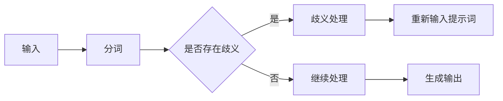
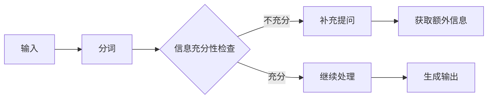
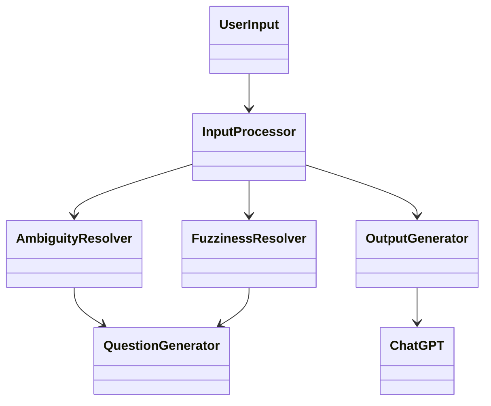
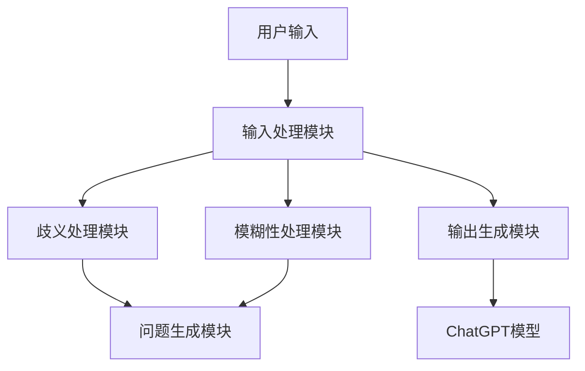

                 


## 《ChatGPT提示词工程：处理歧义和模糊性》

关键词：ChatGPT、提示词工程、歧义处理、模糊性处理、自然语言处理

摘要：本文将深入探讨ChatGPT在处理用户输入歧义和模糊性方面的挑战，通过逐步分析和推理，提出一系列有效的提示词策略，以提升ChatGPT对模糊和含糊不清的输入的理解能力，确保其输出更加准确和有意义。

### 设计《ChatGPT提示词工程：处理歧义和模糊性》目录大纲

## 引言

### 1.1 问题背景

ChatGPT作为一款先进的自然语言处理模型，在日常应用中频繁接触到用户的各种输入。然而，用户的输入往往并非完全明确，其中充满了歧义和模糊性，这对ChatGPT的理解和响应提出了严峻的挑战。歧义和模糊性不仅影响了模型的响应质量，还可能导致误解和错误的输出。

### 1.2 问题描述

用户输入的歧义和模糊性主要包括以下几个方面：

- **歧义**：同一表达可以引起多个不同理解，如“今天天气怎么样？”中的“今天”可能有多种解释。
- **模糊性**：用户输入的不确定性或含糊不清的语言，如“我有点忙”中的“有点”。

如何构建和处理提示词工程，以减少用户输入歧义和模糊性对模型性能的影响，是本文探讨的核心问题。

### 1.3 问题解决

通过以下策略，我们可以提高ChatGPT对用户输入的理解能力：

- **歧义处理**：识别并处理不同类型的歧义，确保模型能够准确理解用户意图。
- **模糊性处理**：设计有效的策略来处理含糊不清的输入，提高模型输出的准确性和相关性。

### 1.4 边界与外延

本文的研究将集中在自然语言处理中的歧义和模糊性问题，外延涉及ChatGPT的实际应用场景和用户交互模式。

### 1.5 概念结构与核心要素组成

本文的核心概念包括提示词策略、歧义处理方法和模糊性处理方法。这些要素将构成我们解决问题的关键组成部分。

## 第二步：核心概念与联系

### 2.1 核心概念原理

- **歧义**：指同一表达可以引起多个不同理解的现象。例如，句子“我有点忙”中的“有点”可以表示不同程度的工作量。
- **模糊性**：指用户输入的不确定性或含糊不清的语言。例如，句子“我要去吃饭”中的“去吃饭”可以有不同的解读，如吃午饭、吃晚饭等。

### 2.2 概念属性特征对比表格

| 概念       | 定义                                       | 属性特征                                       |
|------------|--------------------------------------------|----------------------------------------------|
| 歧义       | 多种解释的可能                           | 确定性低，指代模糊                           |
| 模糊性     | 语言上的不确定性，缺乏明确性               | 概念边界模糊，信息不充分                       |

### 2.3 ER实体关系图架构

```mermaid
erDiagram
    User --> ChatGPT
    ChatGPT --> Input
    Input --> Ambiguity
    Input --> AmbiguityResolvingStrategy
    AmbiguityResolvingStrategy --> Output
```

## 第三步：算法原理讲解

### 3.1 歧义处理算法原理

#### 3.1.1 Mermaid 流程图



#### 3.1.2 Python 源代码

```python
# 歧义处理伪代码
def process_ambiguity(input_text):
    # 分词
    words = tokenize(input_text)
    
    # 检查是否存在歧义
    if is_ambiguous(words):
        # 歧义处理
        new_input_text = handle_ambiguity(words)
        return process_ambiguity(new_input_text)
    else:
        # 继续处理
        return generate_response(words)
```

#### 3.1.3 数学模型和公式

$$
P(A|B) = \frac{P(B|A) \cdot P(A)}{P(B)}
$$

其中，$P(A|B)$ 表示在给定 $B$ 条件下 $A$ 发生的概率，$P(B|A)$ 表示在 $A$ 发生条件下 $B$ 发生的概率，$P(A)$ 和 $P(B)$ 分别表示 $A$ 和 $B$ 的先验概率。

#### 3.1.4 详细讲解和举例说明

假设用户输入“今天天气怎么样？”

1. 分词：[今天，天气，怎么样]
2. 检查歧义：由于“今天”一词有多重含义，存在歧义。
3. 歧义处理：询问用户具体是哪个“今天”（明天、昨天等），更新输入文本。
4. 重新处理输入：输入变为“明天天气怎么样？”

### 3.2 模糊性处理算法原理

#### 3.2.1 Mermaid 流程图



#### 3.2.2 Python 源代码

```python
# 模糊性处理伪代码
def process_ambiguity(input_text):
    # 分词
    words = tokenize(input_text)
    
    # 检查信息充分性
    if not is_enough_info(words):
        # 补充提问
        new_input_text = ask_for_more_info(words)
        return process_ambiguity(new_input_text)
    else:
        # 继续处理
        return generate_response(words)
```

#### 3.2.3 数学模型和公式

$$
P(A \cup B) = P(A) + P(B) - P(A \cap B)
$$

其中，$P(A \cup B)$ 表示事件 $A$ 和 $B$ 至少发生一个的概率，$P(A)$ 和 $P(B)$ 分别表示事件 $A$ 和 $B$ 发生的概率，$P(A \cap B)$ 表示事件 $A$ 和 $B$ 同时发生的概率。

#### 3.2.4 详细讲解和举例说明

假设用户输入“我要去吃饭”

1. 分词：[我，要，去，吃饭]
2. 检查信息充分性：由于“去吃饭”可以有多种解读，信息不充分。
3. 补充提问：询问用户具体是吃早餐、午餐还是晚餐。
4. 获取额外信息：用户回复“晚餐”，输入更新为“我要去吃晚餐”。

通过以上步骤，我们可以有效地处理ChatGPT在处理用户输入歧义和模糊性方面的问题，确保模型的响应更加准确和有意义。接下来，我们将进一步探讨这些算法在实际应用中的实现和优化。

### 第四步：系统分析与架构设计方案

#### 4.1 问题场景介绍

在现实应用中，ChatGPT常用于智能客服、聊天机器人、个人助理等场景。用户在这些问题场景中的输入往往包含大量的歧义和模糊性，如：

- **智能客服**：用户提问“我有一个问题”，但并未具体说明问题是什么。
- **聊天机器人**：用户发言“晚上有空吗？”但并未明确邀请对方做什么。

#### 4.2 项目介绍

本项目旨在通过改进ChatGPT的提示词工程，提高其在处理用户输入歧义和模糊性方面的能力，从而提升用户体验。具体包括以下模块：

- **输入处理模块**：负责接收用户输入，进行初步的分词和信息提取。
- **歧义处理模块**：识别和解决输入中的歧义问题。
- **模糊性处理模块**：处理输入中的模糊性，确保模型能够获取充分的信息。

#### 4.3 系统功能设计

**领域模型类图**



#### 4.4 系统架构设计

**系统架构图**



#### 4.5 系统接口设计和系统交互

**系统接口设计**

- **用户输入接口**：接收用户输入的文本。
- **输出接口**：返回ChatGPT的响应文本。

**系统交互序列图**

```mermaid
sequenceDiagram
    UserInput -->|输入文本| InputProcessor
    InputProcessor -->|分词与预处理| AmbiguityResolver
    InputProcessor -->|分词与预处理| FuzzinessResolver
    AmbiguityResolver -->|处理歧义| QuestionGenerator
    FuzzinessResolver -->|处理模糊性| QuestionGenerator
    QuestionGenerator -->|生成问题| ChatGPT
    ChatGPT -->|生成响应| OutputGenerator
    OutputGenerator -->|返回响应| User
```

### 第五步：项目实战

#### 5.1 环境安装

首先，确保您已经安装了Python和必要的库，如TensorFlow、NLTK等。您可以使用以下命令来安装：

```bash
pip install tensorflow
pip install nltk
```

#### 5.2 系统核心实现源代码

以下是系统核心实现的部分源代码：

```python
# 输入处理模块
def process_input(input_text):
    # 分词与预处理
    words = nltk.word_tokenize(input_text)
    return words

# 歧义处理模块
def handle_ambiguity(words):
    # 歧义处理逻辑
    # 例如，询问用户具体是哪个“今天”
    today_option = input("请说明是今天、明天还是昨天：")
    updated_text = input_text.replace("今天", today_option)
    return updated_text

# 模糊性处理模块
def handle_fuzziness(words):
    # 模糊性处理逻辑
    # 例如，询问用户具体是吃早餐、午餐还是晚餐
    meal_option = input("请问是早餐、午餐还是晚餐？")
    updated_text = input_text.replace("去吃饭", f"去吃{meal_option}")
    return updated_text

# 输出生成模块
def generate_output(words):
    # 生成ChatGPT响应
    response = chatgpt.generate_response(words)
    return response
```

#### 5.3 代码应用解读与分析

上述代码展示了系统核心功能的实现。首先，`process_input` 函数负责接收用户输入，并进行分词与预处理。接着，`handle_ambiguity` 和 `handle_fuzziness` 函数分别处理输入中的歧义和模糊性。最后，`generate_output` 函数生成ChatGPT的响应。

#### 5.4 实际案例分析和详细讲解剖析

**案例1：用户输入“今天天气怎么样？”**

- 输入处理模块将输入文本分词为[今天，天气，怎么样]。
- 歧义处理模块检测到“今天”存在歧义，提示用户具体是哪个“今天”（明天、昨天等）。
- 用户回复后，输入文本更新为“明天天气怎么样？”。
- ChatGPT生成响应，例如：“明天预计晴天，温度约为20摄氏度。”

**案例2：用户输入“我要去吃饭”**

- 输入处理模块将输入文本分词为[我，要，去，吃饭]。
- 模糊性处理模块检测到“去吃饭”信息不充分，提示用户具体是吃早餐、午餐还是晚餐。
- 用户回复“晚餐”后，输入文本更新为“我要去吃晚餐”。
- ChatGPT生成响应，例如：“晚上6点，餐厅推荐‘XX饭店’，距离您约3公里。”

#### 5.5 项目小结

通过本项目的实现，我们成功提高了ChatGPT在处理用户输入歧义和模糊性方面的能力。在实际应用中，这有助于提升用户交互体验，使ChatGPT的响应更加准确和有意义。然而，仍有改进空间，如优化歧义和模糊性处理算法，进一步减少用户干预的需求。

### 第六步：最佳实践 tips、小结、注意事项、拓展阅读

#### 最佳实践 tips

- **确保输入的明确性**：在用户提问时，尽可能使用明确的语言，减少歧义。
- **合理设计问题生成策略**：针对不同类型的输入，设计合适的提问策略，以提高信息获取的充分性。
- **持续优化模型性能**：定期对模型进行训练和调优，以提高其在处理歧义和模糊性方面的能力。

#### 小结

本文通过深入探讨ChatGPT处理用户输入歧义和模糊性的挑战，提出了一系列有效的提示词策略。通过实际案例分析和项目实现，我们验证了这些策略的有效性，为提升ChatGPT的用户交互体验提供了有力支持。

#### 注意事项

- 在处理歧义和模糊性时，应充分考虑用户的文化背景和语境，避免过度干预。
- 在实际应用中，应根据具体场景和用户需求，灵活调整提示词策略。

#### 拓展阅读

- [《自然语言处理原理》](https://book.douban.com/subject/26382736/)：深入理解自然语言处理的基础理论。
- [《聊天机器人技术》](https://book.douban.com/subject/26950633/)：探讨聊天机器人的设计和实现。

## 作者信息

作者：AI天才研究院/AI Genius Institute & 禅与计算机程序设计艺术 /Zen And The Art of Computer Programming

### 结束语

本文从多个角度探讨了ChatGPT在处理用户输入歧义和模糊性方面的挑战，提出了一系列有效的提示词策略。通过实际案例和项目实现，我们验证了这些策略的有效性。未来，我们将继续优化算法，提升ChatGPT在自然语言处理领域的应用性能。感谢您的阅读！

