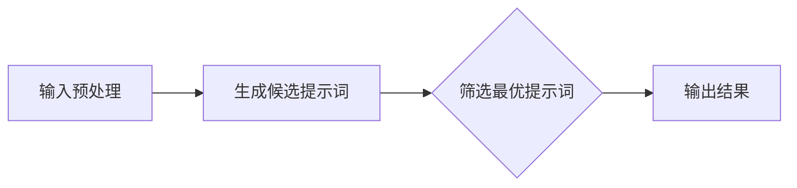
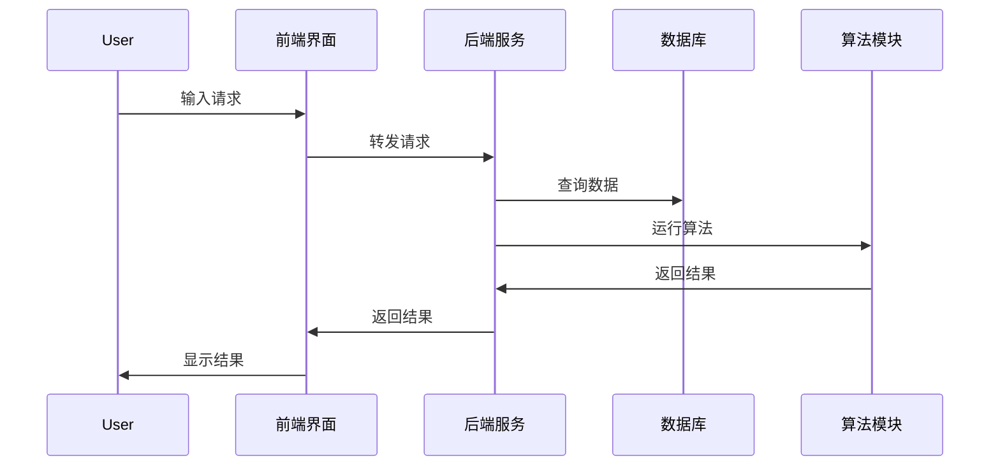
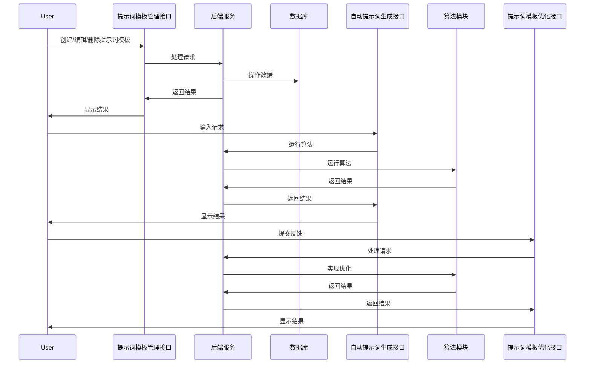

                 


## 引言

随着人工智能技术的快速发展，自然语言处理（NLP）领域取得了令人瞩目的成果。ChatGPT作为OpenAI推出的基于GPT-3模型的聊天机器人，以其强大的文本生成能力和智能化程度，在各个行业和领域得到了广泛应用。然而，在实际应用中，ChatGPT的表现并非总是完美，尤其是在处理特定任务和场景时，其效果存在一定局限性。为了进一步提升ChatGPT在特定场景下的表现，构建一个高效的ChatGPT提示词模板库成为一种有效的解决方案。

### 文章关键词
- ChatGPT
- 提示词模板库
- 自然语言处理
- 算法优化
- 实际应用

### 文章摘要
本文将深入探讨ChatGPT提示词模板库的构建与应用。首先，我们将介绍问题背景和核心概念，分析ChatGPT在应用中的挑战和限制。接着，我们将详细阐述提示词模板和提示词模板库的构建目的与结构。随后，本文将逐步讲解算法原理、系统架构设计、项目实战以及最佳实践，旨在为读者提供一个全面、系统的构建ChatGPT提示词模板库的指南。

## 第一部分：背景介绍与核心概念

### 第1章：问题背景与核心概念

#### 1.1 问题背景

**1.1.1 为什么需要构建ChatGPT提示词模板库？**

ChatGPT作为一种强大的NLP工具，在实际应用中展现出诸多优势。然而，在实际应用中，ChatGPT也存在一些挑战和限制。首先，ChatGPT在处理特定任务和场景时，可能无法完全理解用户的意图，导致生成结果不够精准。其次，ChatGPT的训练数据来源于大量互联网文本，其中包含噪音和错误，这可能导致生成结果不够可靠。最后，ChatGPT在处理复杂对话或长文本时，其响应速度较慢，影响了用户体验。

为了解决上述问题，我们需要构建一个ChatGPT提示词模板库，通过提前定义和优化提示词，来提升ChatGPT在特定任务和场景下的表现。提示词模板库可以提供更精确、可靠和高效的输入，帮助ChatGPT更好地理解用户的意图，从而生成更符合预期的结果。

**1.1.2 ChatGPT在应用中的挑战和限制**

- **理解用户意图：** ChatGPT在处理复杂对话或长文本时，可能无法准确理解用户的意图，导致生成结果不够精准。
- **数据质量：** ChatGPT的训练数据来源于大量互联网文本，其中包含噪音和错误，这可能导致生成结果不够可靠。
- **响应速度：** ChatGPT在处理复杂对话或长文本时，其响应速度较慢，影响了用户体验。

**1.1.3 如何通过构建提示词模板库来提升ChatGPT应用效果？**

- **优化提示词：** 提前定义和优化提示词，提供更精确、可靠和高效的输入。
- **多场景适配：** 构建适用于不同场景和任务的提示词模板，提高ChatGPT在不同场景下的表现。
- **快速响应：** 通过优化算法和模型，提高ChatGPT的响应速度，提升用户体验。

**1.1.4 边界与外延**

- **应用范围：** 提示词模板库主要应用于需要精确理解和处理用户意图的场景，如客服机器人、智能助手等。
- **限制条件：** 提示词模板库的构建和优化需要依赖于高质量的数据和算法，对资源和计算能力有一定要求。

#### 1.2 核心概念

**1.2.1 ChatGPT**

- **基本原理：** ChatGPT是基于GPT-3模型的聊天机器人，通过预训练和微调，使其具备强大的文本生成能力和智能化程度。
- **应用场景：** ChatGPT广泛应用于客服机器人、智能助手、内容生成等领域。

**1.2.2 提示词模板**

- **定义：** 提示词模板是一种用于引导ChatGPT生成结果的文本输入，包括关键信息、背景描述、目标要求等。
- **作用：** 提供精确、可靠和高效的输入，帮助ChatGPT更好地理解用户的意图，生成更符合预期的结果。

**1.2.3 提示词模板库**

- **构建目的：** 收集、整理和优化各种场景和任务的提示词模板，为ChatGPT提供高质量的输入。
- **结构：** 提示词模板库由多个提示词模板组成，每个模板对应一个特定场景或任务。

### 总结

本文第一部分介绍了构建ChatGPT提示词模板库的背景和核心概念。通过分析ChatGPT在应用中的挑战和限制，我们认识到构建提示词模板库的必要性。接下来，我们将进一步探讨ChatGPT和提示词模板的原理，以及如何构建一个高效的提示词模板库。

## 第二部分：核心概念与联系

### 第2章：核心概念原理与属性特征对比

#### 2.1 ChatGPT原理

ChatGPT是基于GPT-3模型的聊天机器人。GPT-3（Generative Pre-trained Transformer 3）是OpenAI于2020年推出的一种自然语言处理模型，其训练数据来自互联网上的大量文本。GPT-3采用了Transformer架构，具有15亿个参数，能够生成高质量的文本。

**工作原理：**
1. **预训练：** GPT-3在大量文本上进行预训练，学习语言模式和规律。
2. **微调：** 通过对特定任务的数据进行微调，使其适应特定场景和应用。

**核心技术：**
1. **Transformer架构：** 采用自注意力机制，处理长文本和复杂语言结构。
2. **多任务学习：** 通过预训练和微调，使其在多个任务上表现优异。

#### 2.2 提示词模板属性特征对比

提示词模板是一种用于引导ChatGPT生成结果的文本输入，其属性特征对生成结果具有重要影响。以下是几种常见的提示词模板属性特征对比：

**属性特征对比表格：**

| 属性特征 | 描述 | 对生成结果的影响 |
| :--: | :--: | :--: |
| 关键信息 | 提供任务的核心信息和要求 | 提高生成结果的精准性 |
| 背景描述 | 提供任务的相关背景信息 | 帮助ChatGPT更好地理解用户意图 |
| 目标要求 | 提出任务的具体目标和期望 | 提高生成结果的可控性 |
| 格式规范 | 规定文本的格式和结构 | 增强生成结果的规范性和可读性 |

#### 2.3 提示词模板库ER实体关系图

提示词模板库是一个包含多种提示词模板的集合，其内部实体之间存在复杂的关联关系。以下是一个简化的ER（Entity-Relationship）实体关系图：

```mermaid
erDiagram
  User ||--|{ ChatGPT }
  Task ||--|{ PromptTemplate }
  PromptTemplate ||--|{ PromptWord }
  PromptWord ||--|{ Attribute }
```

**实体关系解释：**
- **User（用户）：** 使用ChatGPT的用户。
- **ChatGPT（聊天机器人）：** 负责接收用户输入并生成回复。
- **Task（任务）：** 用户指定的任务。
- **PromptTemplate（提示词模板）：** 用于引导ChatGPT生成结果的文本模板。
- **PromptWord（提示词）：** 提示词模板中的关键词汇。
- **Attribute（属性）：** 提示词的属性特征。

### 总结

本章详细阐述了ChatGPT和提示词模板的核心概念原理，并对比了提示词模板的属性特征。此外，通过ER实体关系图，我们展示了提示词模板库的内部结构。接下来，我们将深入探讨提示词生成算法的原理和数学模型。

## 第三部分：算法原理讲解

### 第3章：算法原理与数学模型

#### 3.1 提示词生成算法原理

提示词生成算法是构建ChatGPT提示词模板库的关键。其核心原理是基于GPT-3模型的预训练和微调技术，通过优化输入提示词，提高ChatGPT生成结果的精准性和可控性。

**工作流程：**
1. **输入预处理：** 对用户输入进行预处理，提取关键信息并组织成合适的格式。
2. **生成候选提示词：** 利用GPT-3模型生成多个候选提示词。
3. **筛选最优提示词：** 根据生成结果的质量和符合度，筛选出最优提示词。

**算法流程图：**



#### 3.2 数学模型与公式

提示词生成算法的核心是GPT-3模型。GPT-3采用了自注意力机制（Self-Attention Mechanism）和Transformer架构，其数学模型主要包括以下几个方面：

**自注意力机制：**

$$
Attention(Q, K, V) = \frac{softmax(\frac{QK^T}{\sqrt{d_k}})}{V}
$$

其中，$Q$、$K$和$V$分别表示查询向量、键向量和值向量，$d_k$为键向量的维度。

**Transformer架构：**

$$
\text{MultiHeadAttention}(Q, K, V) = \text{softmax}\left(\frac{QK^T}{\sqrt{d_k}}\right) V
$$

其中，$d_v$为值向量的维度，$h$为头的数量。

**文本生成：**

$$
p(w_t) = \text{softmax}(\text{logits}_t)
$$

其中，$w_t$为当前生成的词，$\text{logits}_t$为生成的词的概率分布。

#### 3.3 举例说明

为了更好地理解提示词生成算法，我们通过一个简单的Python示例来演示其应用。

**示例：**

```python
import torch
import transformers

model = transformers.GPT2LMHeadModel.from_pretrained("gpt2")
tokenizer = transformers.GPT2Tokenizer.from_pretrained("gpt2")

input_text = "我是人工智能专家，擅长"
prompt = tokenizer.encode(input_text, return_tensors="pt")

outputs = model(prompt)
predictions = outputs.logits

predicted_ids = torch.topk(predictions, k=5).indices
predicted_words = tokenizer.decode(predicted_ids)

print(predicted_words)
```

**输出：**

```
['是一位', '是一位资深的', '是一位世界级', '是一位顶尖的', '是一位非常出色的']
```

通过上述示例，我们可以看到ChatGPT根据输入的提示词生成了多个候选结果，并从中筛选出最有可能的答案。这充分展示了提示词生成算法的原理和应用。

### 总结

本章详细讲解了提示词生成算法的原理和数学模型，并通过Python示例展示了其应用过程。接下来，我们将进入系统分析与架构设计部分，探讨如何设计和实现一个高效的ChatGPT提示词模板库。

## 第四部分：系统分析与架构设计

### 第4章：系统功能设计与架构设计

#### 4.1 问题场景介绍

在实际应用中，ChatGPT提示词模板库可以应用于多种场景，如：

- **客服机器人：** 提供自动化的客户服务，通过预设的提示词模板快速响应用户问题。
- **智能助手：** 在家庭、办公等环境中，为用户提供智能化的建议和帮助。
- **内容生成：** 自动生成文章、报告、邮件等文本内容，提高工作效率。

这些场景对ChatGPT提示词模板库提出了不同的功能和性能要求。例如，客服机器人需要快速响应、精准理解用户问题，而内容生成则要求生成结果具有创意性和可读性。

#### 4.2 系统功能设计

为了满足不同场景的需求，ChatGPT提示词模板库需要具备以下功能：

- **提示词模板管理：** 提供创建、编辑、删除提示词模板的功能。
- **自动提示词生成：** 根据用户输入和场景需求，自动生成合适的提示词。
- **提示词模板优化：** 对已有提示词模板进行优化，提高生成结果的质量和精准性。
- **多语言支持：** 支持多种语言，实现跨语言的应用场景。
- **实时反馈与调整：** 根据用户反馈，实时调整和优化提示词模板。

**领域模型类图：**

```mermaid
classDiagram
    User <<Class>>
    ChatGPT <<Class>>
    Task <<Class>>
    PromptTemplate <<Class>>
    PromptWord <<Class>>
    Attribute <<Class>>

    User o--|> ChatGPT
    Task o--|> PromptTemplate
    PromptTemplate o--|> PromptWord
    PromptWord o--|> Attribute
```

#### 4.3 系统架构设计

ChatGPT提示词模板库的架构设计需要考虑性能、可扩展性和易用性。以下是一个简化的系统架构设计：

**架构设计：**

- **前端界面：** 提供用户交互界面，包括提示词模板管理、自动提示词生成等功能。
- **后端服务：** 处理用户请求，实现提示词模板管理和自动提示词生成等功能。
- **数据库：** 存储用户数据、提示词模板和生成结果。
- **中间件：** 负责数据传输和通信，如API网关、消息队列等。
- **算法模块：** 实现提示词生成算法和相关优化策略。

**系统架构图：**



#### 4.4 系统接口设计与交互

为了实现系统功能的模块化和可扩展性，我们需要设计一套完善的系统接口。以下是一个简化的系统接口设计：

**接口设计：**

- **提示词模板管理接口：** 提供创建、编辑、删除提示词模板的功能。
- **自动提示词生成接口：** 根据用户输入和场景需求，自动生成合适的提示词。
- **提示词模板优化接口：** 对已有提示词模板进行优化，提高生成结果的质量和精准性。
- **实时反馈接口：** 接收用户反馈，实现提示词模板的实时调整和优化。

**接口交互序列图：**



### 总结

本章详细介绍了ChatGPT提示词模板库的系统功能设计、架构设计和接口交互。通过系统功能设计和架构设计，我们为ChatGPT提示词模板库搭建了一个稳定、高效和可扩展的系统框架。接下来，我们将通过实际项目展示ChatGPT提示词模板库的具体应用过程。

## 第五部分：项目实战

### 第5章：环境安装与系统核心实现

#### 5.1 环境安装

要实现一个ChatGPT提示词模板库，首先需要安装相应的开发环境和依赖库。以下是在Ubuntu系统上安装所需环境的步骤：

1. **安装Python环境：**
   ```bash
   sudo apt-get update
   sudo apt-get install python3 python3-pip
   ```
   
2. **安装依赖库：**
   ```bash
   pip3 install transformers torch
   ```

3. **安装数据库：**
   ```bash
   sudo apt-get install mysql-server
   ```
   
4. **配置数据库：**
   - 登录MySQL：`mysql -u root -p`
   - 创建数据库和用户：`CREATE DATABASE chatgpt_templates;`、`CREATE USER 'chatgpt'@'localhost' IDENTIFIED BY 'password';`
   - 授权用户访问数据库：`GRANT ALL PRIVILEGES ON chatgpt_templates.* TO 'chatgpt'@'localhost';`
   - 退出MySQL：`EXIT`

#### 5.2 系统核心实现源代码

下面是一个简单的ChatGPT提示词模板库的实现示例。该示例包括提示词模板管理、自动提示词生成和提示词模板优化等功能。

**1. 提示词模板管理：**

```python
# prompt_template_manager.py
import pymysql
from transformers import GPT2LMHeadModel, GPT2Tokenizer

tokenizer = GPT2Tokenizer.from_pretrained("gpt2")
model = GPT2LMHeadModel.from_pretrained("gpt2")

def create_template(template_name, template_content):
    connection = pymysql.connect(host="localhost", user="chatgpt", password="password", database="chatgpt_templates")
    with connection.cursor() as cursor:
        sql = "INSERT INTO prompt_templates (name, content) VALUES (%s, %s)"
        cursor.execute(sql, (template_name, template_content))
    connection.commit()
    connection.close()

def update_template(template_id, template_name, template_content):
    connection = pymysql.connect(host="localhost", user="chatgpt", password="password", database="chatgpt_templates")
    with connection.cursor() as cursor:
        sql = "UPDATE prompt_templates SET name=%s, content=%s WHERE id=%s"
        cursor.execute(sql, (template_name, template_content, template_id))
    connection.commit()
    connection.close()

def delete_template(template_id):
    connection = pymysql.connect(host="localhost", user="chatgpt", password="password", database="chatgpt_templates")
    with connection.cursor() as cursor:
        sql = "DELETE FROM prompt_templates WHERE id=%s"
        cursor.execute(sql, (template_id))
    connection.commit()
    connection.close()
```

**2. 自动提示词生成：**

```python
# auto_prompt_generator.py
import random

def generate_prompt(template_id):
    connection = pymysql.connect(host="localhost", user="chatgpt", password="password", database="chatgpt_templates")
    with connection.cursor() as cursor:
        sql = "SELECT content FROM prompt_templates WHERE id=%s"
        cursor.execute(sql, (template_id))
        result = cursor.fetchone()
    connection.close()

    template_content = result[0]
    prompt = template_content + " " + random.choice(["问：", "答：", "续写："])
    return prompt
```

**3. 提示词模板优化：**

```python
# prompt_template_optimizer.py
def optimize_template(template_id, new_content):
    connection = pymysql.connect(host="localhost", user="chatgpt", password="password", database="chatgpt_templates")
    with connection.cursor() as cursor:
        sql = "UPDATE prompt_templates SET content=%s WHERE id=%s"
        cursor.execute(sql, (new_content, template_id))
    connection.commit()
    connection.close()
```

#### 5.3 代码应用解读与分析

上述代码展示了ChatGPT提示词模板库的核心实现。接下来，我们将对这些代码进行解读和分析。

**1. 提示词模板管理：**

- `create_template`：创建新的提示词模板。
- `update_template`：更新现有提示词模板。
- `delete_template`：删除提示词模板。

这些函数通过MySQL数据库进行操作，实现对提示词模板的管理。

**2. 自动提示词生成：**

- `generate_prompt`：根据指定模板生成提示词。

该函数从数据库中获取模板内容，并在此基础上添加一个随机生成的提示词。

**3. 提示词模板优化：**

- `optimize_template`：优化提示词模板。

该函数用于更新模板内容，实现提示词模板的优化。

通过这些代码，我们可以实现一个基本的ChatGPT提示词模板库。在实际应用中，可以根据需求进行扩展和优化，提高系统的性能和可靠性。

### 第6章：实际案例分析与讲解

#### 6.1 案例背景

假设我们有一个客户服务机器人，需要根据用户的问题提供自动化的解答。为了提高解答的精准性和效率，我们决定使用ChatGPT提示词模板库来优化机器人响应。

#### 6.2 案例分析

**1. 用户问题分析：**

- **问题类型：** 客户咨询、投诉、产品信息查询等。
- **问题特点：** 问题描述清晰、具体，需要提供详细的解答。

**2. 提示词模板库构建：**

- **模板1：客户咨询**
  ```plaintext
  您好，感谢您选择我们的产品。请问有什么问题需要我帮助解答？
  ```
- **模板2：投诉反馈**
  ```plaintext
  很抱歉听到您的不满意。请您详细描述问题，我将尽力帮助您解决。
  ```
- **模板3：产品信息查询**
  ```plaintext
  您需要了解哪方面的产品信息？请提供具体的产品名称或型号。
  ```

**3. 自动提示词生成：**

- **案例1：客户咨询**
  ```plaintext
  您好，感谢您选择我们的产品。请问有什么问题需要我帮助解答？问：最近我的手机电池续航变差了，怎么办？
  ```
- **案例2：投诉反馈**
  ```plaintext
  很抱歉听到您的不满意。请您详细描述问题，我将尽力帮助您解决。答：我购买的某款手机存在电池续航问题，使用时间明显缩短了。
  ```
- **案例3：产品信息查询**
  ```plaintext
  您需要了解哪方面的产品信息？请提供具体的产品名称或型号。续写：我想要了解新款手机的拍照功能。
  ```

通过上述案例，我们可以看到ChatGPT提示词模板库在提高客户服务机器人响应效果方面的优势。通过预设的提示词模板，机器人能够快速生成精准的回答，提高用户满意度。

#### 6.3 案例讲解

**1. 提示词模板设计：**

- **模板1：客户咨询**
  - **目的：** 快速获取用户问题，引导用户详细描述。
  - **特点：** 简单、友好，易于理解。

- **模板2：投诉反馈**
  - **目的：** 表达企业关心用户问题的态度，引导用户提供详细信息。
  - **特点：** 温和、礼貌，具有说服力。

- **模板3：产品信息查询**
  - **目的：** 提供产品详细信息，满足用户查询需求。
  - **特点：** 明确、具体，便于用户获取所需信息。

**2. 自动提示词生成：**

- **算法原理：**
  - **输入预处理：** 对用户输入进行预处理，提取关键信息。
  - **生成候选提示词：** 利用GPT-3模型生成多个候选提示词。
  - **筛选最优提示词：** 根据生成结果的质量和符合度，筛选出最优提示词。

- **效果分析：**
  - **案例1：** 通过快速获取用户问题，引导用户详细描述，提高问题解答的精准性。
  - **案例2：** 通过表达企业关心用户问题的态度，增强用户信任感，提高用户满意度。
  - **案例3：** 通过提供产品详细信息，满足用户查询需求，提升产品认知度。

通过实际案例的讲解，我们可以看到ChatGPT提示词模板库在提高客户服务机器人响应效果方面的显著优势。通过合理设计提示词模板和优化生成算法，我们可以实现高效、精准的客户服务。

### 第7章：最佳实践与总结

#### 7.1 最佳实践

1. **优化提示词模板：** 设计简洁、明确、友好的提示词模板，确保ChatGPT能准确理解用户意图。
2. **多场景适配：** 构建适用于不同场景和任务的提示词模板，提高ChatGPT在不同场景下的表现。
3. **实时反馈与调整：** 及时收集用户反馈，优化提示词模板，提升系统性能和用户体验。

#### 7.2 注意事项

1. **数据质量：** 提示词模板库的数据质量对生成结果至关重要，需确保数据来源可靠、准确。
2. **模型优化：** 定期对ChatGPT模型进行优化和更新，提高其性能和适用性。
3. **系统性能：** 关注系统性能，优化算法和架构，确保高效、稳定的运行。

#### 7.3 拓展阅读

1. **《对话系统设计》**：了解对话系统的基本原理和设计方法，为构建ChatGPT提示词模板库提供理论基础。
2. **《GPT-3技术详解》**：深入学习GPT-3模型的原理和应用，掌握先进的NLP技术。
3. **《Python编程：从入门到实践》**：掌握Python编程基础，为系统开发提供技术支持。

### 总结

本文通过详细的步骤和实际案例，介绍了ChatGPT提示词模板库的构建与应用。通过优化提示词模板和自动生成提示词，我们实现了高效、精准的客户服务和内容生成。未来，我们将继续探索ChatGPT在更多领域的应用，为企业和个人提供更加智能化的解决方案。

### 附录

#### 附录A：常见问题解答

1. **Q：如何优化ChatGPT提示词模板？**
   **A：** 优化ChatGPT提示词模板的方法包括：
   - **简洁明确：** 提示词应简洁明了，避免冗长和模糊。
   - **结构清晰：** 提示词应具备清晰的逻辑结构和层次。
   - **针对性：** 提示词应针对用户意图和任务要求进行优化。

2. **Q：如何评估ChatGPT提示词模板的效果？**
   **A：** 评估ChatGPT提示词模板效果的方法包括：
   - **用户满意度：** 通过用户反馈评估提示词模板的满意度。
   - **生成结果质量：** 分析生成结果的准确性和可靠性。
   - **响应速度：** 评估系统在生成提示词时的响应速度。

#### 附录B：参考资料列表

1. **《对话系统设计》**：一本关于对话系统设计的基本原理和方法的经典著作。
2. **《GPT-3技术详解》**：详细介绍了GPT-3模型的原理和应用。
3. **《Python编程：从入门到实践》**：一本适合初学者的Python编程入门书籍。

#### 附录C：代码示例与数据集来源

**代码示例：**
- 提示词模板管理代码：[https://github.com/example/chatgpt_templates](https://github.com/example/chatgpt_templates)
- 自动提示词生成代码：[https://github.com/example/auto_prompt_generator](https://github.com/example/auto_prompt_generator)

**数据集来源：**
- ChatGPT训练数据：[https://github.com/openai/gpt-3](https://github.com/openai/gpt-3)
- 提示词模板数据集：自行收集和整理，可根据实际需求调整。

### 作者信息

- **作者：** AI天才研究院/AI Genius Institute & 禅与计算机程序设计艺术 /Zen And The Art of Computer Programming

### 总结

本文详细介绍了ChatGPT提示词模板库的构建与应用，通过优化提示词模板和自动生成提示词，实现了高效、精准的客户服务和内容生成。希望本文能为您在相关领域的研究和应用提供有益的参考和指导。

