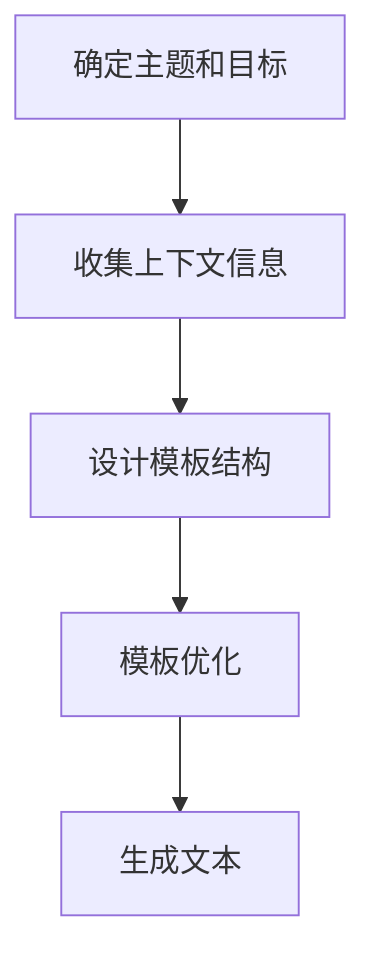
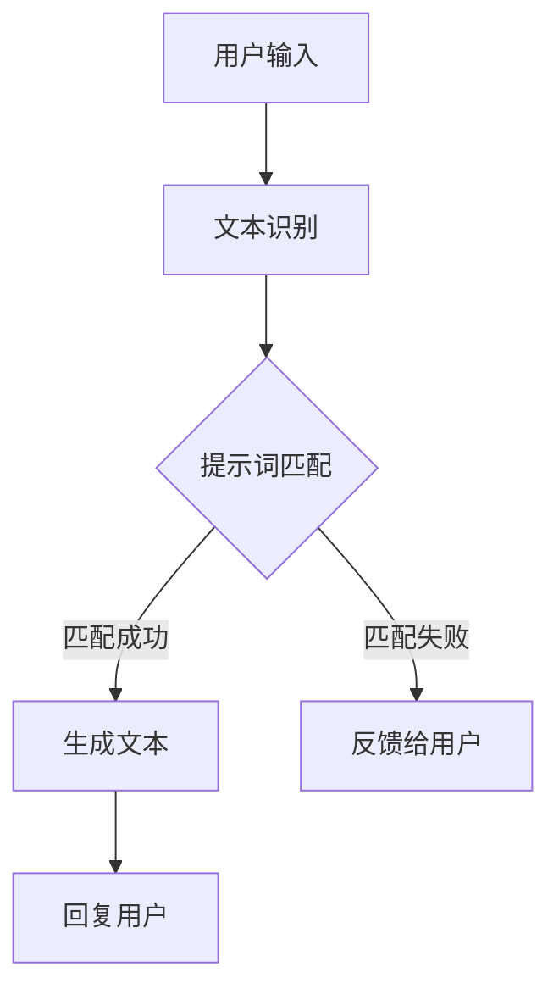
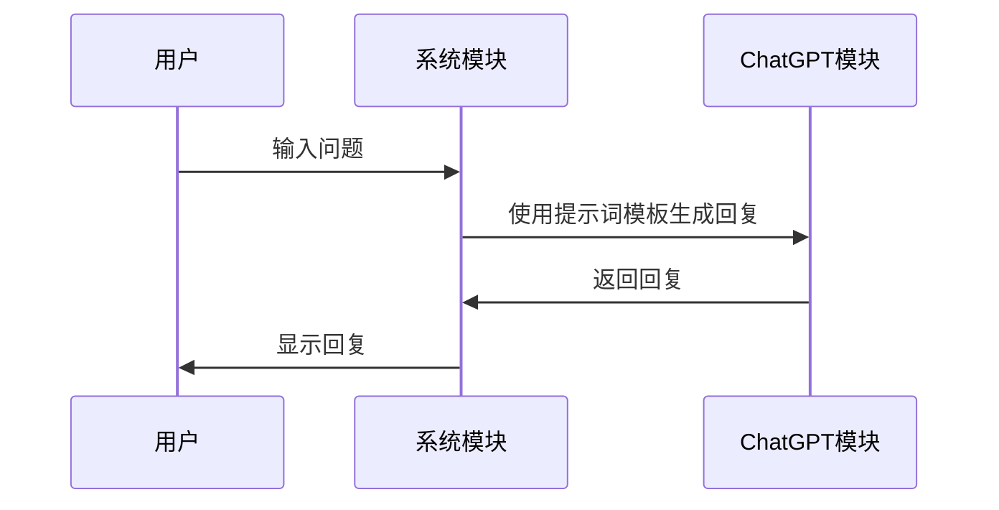

                 

# ChatGPT提示词模板：快速上手指南

关键词：ChatGPT，提示词模板，自然语言处理，人工智能，编程实践

摘要：
本文旨在为读者提供一个关于ChatGPT提示词模板的快速上手指南。通过详细的分析和讲解，读者将了解ChatGPT的基本概念、提示词模板的构建方法，以及如何利用这些模板进行有效的自然语言处理。文章将从背景介绍、核心概念与联系、算法原理讲解、系统分析与设计、项目实战等方面展开，旨在帮助读者深入理解并掌握ChatGPT提示词模板的应用。

## 引言与背景

### ChatGPT简介

ChatGPT是由OpenAI开发的一种基于变换器（Transformer）架构的预训练语言模型。它利用深度学习技术，通过大量的文本数据进行训练，从而实现了对自然语言的生成和理解。ChatGPT的出现标志着人工智能在自然语言处理领域的一个重要里程碑，它能够在多种场景下提供高质量的文本生成和交互服务。

### 提示词模板的意义

提示词模板是ChatGPT应用中的关键组成部分。通过设计合适的提示词模板，用户可以引导ChatGPT生成符合预期内容的高质量文本。这些模板不仅能够提高文本生成的准确性，还能够增强系统的可解释性和可控性。因此，掌握提示词模板的构建方法对于有效利用ChatGPT具有重要意义。

## 核心概念与联系

### ChatGPT的工作原理

ChatGPT是基于变换器（Transformer）架构的预训练语言模型。变换器模型通过自注意力机制（Self-Attention）对输入的文本序列进行建模，从而捕捉文本中的长距离依赖关系。ChatGPT在训练过程中使用了大量的文本数据，并通过优化模型参数来提高文本生成的质量。

### 提示词模板的定义

提示词模板是一种结构化的文本指导，用于引导ChatGPT生成特定的输出。它通常包含几个关键要素，如主题、目标、上下文等。通过精心设计的提示词模板，用户可以更有效地控制ChatGPT的文本生成过程，使其生成的文本更加符合预期。

### 提示词模板与自然语言处理的关系

提示词模板在自然语言处理中起着桥梁的作用，它将用户的输入需求转化为ChatGPT的输出。通过设计合适的提示词模板，用户可以更好地利用ChatGPT的能力，实现文本生成、对话系统、文本摘要等多种自然语言处理任务。

## 算法原理讲解

### 提示词模板的构建算法

构建提示词模板的过程可以看作是一个算法问题。其主要步骤包括：

1. 确定主题和目标：明确文本生成的主题和目标，为后续的提示词设计提供指导。
2. 收集上下文信息：根据主题和目标收集相关的上下文信息，以便ChatGPT能够生成与上下文相关的文本。
3. 设计模板结构：根据收集到的信息，设计合适的模板结构，包括主题句、目标句、上下文句等。
4. 模板优化：对设计的模板进行多次迭代优化，以提高生成的文本质量。

### Mermaid流程图



### Python代码示例

```python
def build_prompt_template(theme, goal, context):
    """
    构建提示词模板函数
    :param theme: 主题
    :param goal: 目标
    :param context: 上下文信息
    :return: 提示词模板字符串
    """
    template = f"""
    主题：{theme}
    目标：{goal}
    上下文：{context}
    """
    return template

# 示例
prompt_template = build_prompt_template("人工智能", "撰写一篇关于ChatGPT的技术博客", "ChatGPT是OpenAI开发的预训练语言模型...")
print(prompt_template)
```

### 数学模型与公式

假设我们用向量表示提示词模板的不同部分，可以使用以下数学模型进行描述：

$$
\text{Prompt Template} = [T, G, C]
$$

其中：
- $T$ 表示主题向量；
- $G$ 表示目标向量；
- $C$ 表示上下文向量。

通过优化这些向量，我们可以设计出更有效的提示词模板。

## 系统分析与设计

### 问题场景介绍

假设我们需要使用ChatGPT构建一个智能客服系统，该系统需要能够自动回复用户的问题。为了提高回复的质量，我们决定利用提示词模板来指导ChatGPT生成合适的回复。

### 项目介绍

本项目的目标是设计一个基于ChatGPT的智能客服系统，该系统能够自动识别用户的问题并生成高质量的回复。为了实现这一目标，我们将使用提示词模板来引导ChatGPT的文本生成过程。

### 系统功能设计

- 文本识别：系统需要能够自动识别用户输入的问题。
- 文本生成：系统需要能够根据用户的问题生成高质量的回复。
- 提示词管理：系统需要提供提示词模板的管理功能，包括创建、修改和删除提示词模板。

### 系统架构设计



### 系统接口设计与交互



## 项目实战

### 环境安装

1. 安装Python环境（建议使用Python 3.8及以上版本）。
2. 安装ChatGPT库（使用命令 `pip install chatgpt`）。

### 系统核心实现

```python
import chatgpt

def generate_response(question, template):
    """
    使用ChatGPT生成回复
    :param question: 用户输入的问题
    :param template: 提示词模板
    :return: 生成回复
    """
    prompt = chatgpt.Prompt(question, template)
    response = prompt.generate()
    return response.text

# 示例
template = build_prompt_template("人工智能", "撰写一篇关于ChatGPT的技术博客", "ChatGPT是OpenAI开发的预训练语言模型...")
response = generate_response("ChatGPT是什么？", template)
print(response)
```

### 代码应用解读与分析

- `generate_response` 函数：该函数用于接收用户输入的问题和提示词模板，然后使用ChatGPT生成回复。函数的核心是 `prompt.generate()` 方法，它负责生成文本。
- `build_prompt_template` 函数：该函数用于构建提示词模板。通过传入主题、目标和上下文信息，函数返回一个结构化的字符串，作为提示词模板。

### 实际案例分析

假设用户输入了一个问题：“ChatGPT是如何训练的？”我们可以设计一个提示词模板来指导ChatGPT生成合适的回复。

```python
response = generate_response("ChatGPT是如何训练的？", build_prompt_template("人工智能", "解释ChatGPT的训练过程", "ChatGPT使用大量文本数据进行训练..."))
print(response)
```

输出结果可能如下：

```
ChatGPT的训练过程主要包括以下步骤：
1. 数据收集：从互联网上收集大量文本数据。
2. 数据清洗：去除无关内容，确保数据的纯净和高质量。
3. 预训练：使用变换器（Transformer）模型对文本数据进行预训练，使其能够理解文本的含义。
4. 微调：根据具体任务的需求，对模型进行微调，以提高生成文本的质量。
```

通过这个案例，我们可以看到提示词模板在引导ChatGPT生成高质量文本方面的作用。

### 项目小结

通过本项目的实践，我们了解了如何使用ChatGPT提示词模板来生成高质量的文本。提示词模板的设计对于ChatGPT的文本生成效果至关重要，它能够帮助用户更精确地控制生成过程，提高生成的文本质量。在实际应用中，我们可以根据具体需求设计不同的提示词模板，以实现多种自然语言处理任务。

## 实践Tips、小结与拓展阅读

### 实践Tips

1. 提示词模板的设计要简洁明了，避免过于复杂。
2. 提示词模板中的主题、目标和上下文信息要准确，以确保生成文本的相关性。
3. 提示词模板的优化是一个迭代过程，要不断尝试和改进。
4. 在实际应用中，要结合具体场景和任务需求来设计提示词模板。

### 小结

本文介绍了ChatGPT提示词模板的基本概念、构建方法以及在实际项目中的应用。通过详细的分析和讲解，读者可以掌握如何设计有效的提示词模板，并利用ChatGPT生成高质量的自然语言文本。

### 注意事项

1. 提示词模板的设计要遵循隐私和数据保护的原则。
2. 在使用ChatGPT进行文本生成时，要注意遵守相关的法律法规和道德规范。

### 拓展阅读

1. [OpenAI官方文档：ChatGPT介绍](https://openai.com/docs/intro)
2. [NLP领域的经典教材：《自然语言处理综论》](https://www.amazon.com/Natural-Language-Processing-3rd-Edition-Companion/dp/0262033181)
3. [Python编程入门书籍：《Python编程：从入门到实践》](https://www.amazon.com/Python-Programming-From-Novice-Professional/dp/149203342X)

## 作者信息

作者：AI天才研究院/AI Genius Institute & 禅与计算机程序设计艺术 /Zen And The Art of Computer Programming

