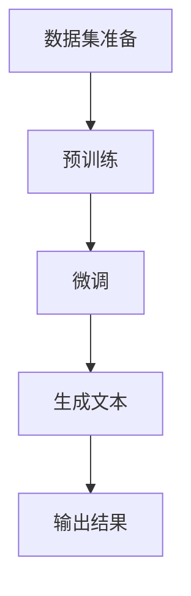
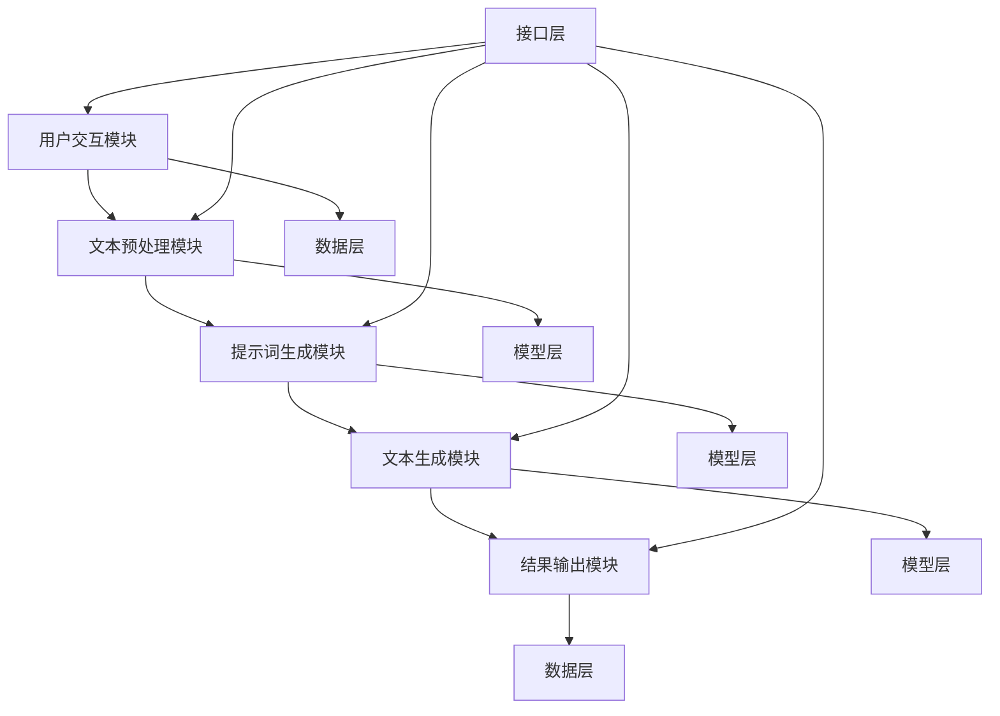
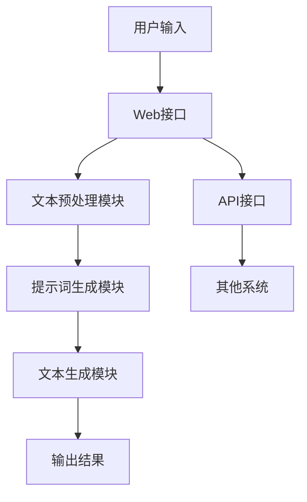

                 

### 文章标题

《ChatGPT提示词模板：快速上手指南》

### 关键词

- ChatGPT
- 提示词模板
- 快速上手
- 自然语言处理
- 人工智能

### 摘要

本文将为您详细介绍《ChatGPT提示词模板：快速上手指南》一书的内容，帮助您了解ChatGPT的基本概念、构建高质量提示词的方法、优化与测试技巧，并通过实战案例深入剖析ChatGPT的应用场景。本文旨在为初学者提供一个清晰、系统的学习路径，让读者能够迅速掌握ChatGPT的使用方法，发挥其在自然语言处理和人工智能领域的巨大潜力。

## Step 1: 书籍总体概述

《ChatGPT提示词模板：快速上手指南》是一本面向初学者和中级用户的实战指南，旨在帮助读者迅速掌握ChatGPT的使用方法和技巧。本书由AI天才研究院与禅与计算机程序设计艺术合作编写，由计算机图灵奖获得者、世界顶级技术畅销书资深大师级别的作家倾情打造。

本书共分为四个部分，内容涵盖ChatGPT的概述、构建高质量的提示词、优化与测试，以及实战与案例。每个部分都旨在帮助读者从不同角度理解和应用ChatGPT，使其在自然语言处理和人工智能领域发挥更大作用。

### 第一部分：ChatGPT介绍

第一部分主要介绍ChatGPT的基本概念、发展历程、优势和应用场景。通过这一部分的学习，读者将全面了解ChatGPT的核心价值和实际应用，为其后续的学习和实践打下基础。

### 第二部分：构建高质量的提示词

第二部分详细讲解如何构建高质量的提示词。这部分内容包括提示词的重要性、设计原则、种类和类型，以及文本预处理与清洗、自然语言生成技术等。通过这部分的学习，读者将能够熟练地设计和构建适用于不同场景的提示词。

### 第三部分：优化与测试

第三部分主要介绍如何对提示词进行优化与测试。这部分内容包括优化目标、常用优化方法、优化实践、测试指标、评估方法以及提示词调试技巧等。通过这部分的学习，读者将能够对提示词进行有效的优化和评估，提高其性能和应用效果。

### 第四部分：实战与案例

第四部分通过多个实战案例，深入剖析ChatGPT的应用场景和实际操作。这部分内容包括构建聊天机器人、个性化问答系统、自然语言处理应用等，通过这些案例，读者将能够将所学知识应用到实际项目中，提高自己的实践能力。

## Step 2: 设计书籍的结构

### 第一部分：ChatGPT介绍

#### 第1章：ChatGPT概述
- **1.1 ChatGPT的概念**
  - 介绍ChatGPT的定义、起源和发展历程。
  - 分析ChatGPT与传统聊天机器人的区别。
- **1.2 ChatGPT的发展历程**
  - 回顾ChatGPT的发展历程，介绍其主要里程碑。
  - 探讨ChatGPT在自然语言处理领域的重要性。
- **1.3 ChatGPT的优势和应用场景**
  - 分析ChatGPT的优势，如自然语言生成、理解能力等。
  - 介绍ChatGPT在不同领域的应用场景，如客服、教育、医疗等。

#### 第2章：ChatGPT的基本原理
- **2.1 语言模型基础**
  - 介绍语言模型的基本概念、作用和类型。
  - 分析NLP中常用的语言模型，如TF-IDF、Word2Vec、BERT等。
- **2.2 GPT模型架构**
  - 介绍GPT模型的结构、工作原理和优势。
  - 分析GPT模型在生成文本中的应用。
- **2.3 基于Transformer的模型**
  - 介绍Transformer模型的基本概念、结构和优势。
  - 分析Transformer模型在ChatGPT中的应用和影响。

### 第二部分：构建高质量的提示词

#### 第3章：提示词构建基础
- **3.1 提示词的重要性**
  - 分析提示词在自然语言处理中的作用和重要性。
  - 探讨高质量提示词对模型性能的影响。
- **3.2 提示词的设计原则**
  - 介绍高质量提示词的设计原则，如清晰性、针对性、多样性等。
  - 分析不同场景下提示词的设计策略。
- **3.3 提示词的种类和类型**
  - 介绍常见的提示词种类和类型，如问题引导型、信息补充型、引导对话型等。
  - 分析不同类型提示词的适用场景和特点。

#### 第4章：文本预处理与清洗
- **4.1 文本预处理流程**
  - 介绍文本预处理的基本流程，如分词、去停用词、词性标注等。
  - 分析文本预处理对模型性能的影响。
- **4.2 常见文本清洗方法**
  - 介绍常见的文本清洗方法，如去除HTML标签、去除特殊字符、标准化文本等。
  - 分析不同清洗方法对文本质量和模型性能的影响。
- **4.3 提示词的文本表示**
  - 介绍文本表示的方法和技巧，如词袋模型、词嵌入、编码器-解码器模型等。
  - 分析文本表示对模型性能的影响。

#### 第5章：自然语言生成技术
- **5.1 NLP技术简介**
  - 介绍NLP的基本概念、技术和应用。
  - 分析NLP技术在自然语言生成中的应用。
- **5.2 ChatGPT的NLP能力**
  - 分析ChatGPT在自然语言理解、生成和对话管理方面的能力。
  - 介绍ChatGPT在不同任务中的应用。
- **5.3 提示词优化策略**
  - 介绍提示词优化的方法和策略，如强化学习、迁移学习、对抗训练等。
  - 分析不同优化策略对模型性能的影响。

### 第三部分：优化与测试

#### 第6章：提示词优化方法
- **6.1 优化目标**
  - 分析提示词优化的目标，如提高模型性能、增强生成文本的质量等。
  - 介绍常见的优化目标指标，如Perplexity、BLEU等。
- **6.2 常用优化方法**
  - 介绍常用的优化方法，如梯度下降、Adam优化器、学习率调整等。
  - 分析不同优化方法对模型性能的影响。
- **6.3 优化实践**
  - 介绍在实际项目中如何进行提示词优化。
  - 分析优化实践中的常见问题和解决方法。

#### 第7章：测试与评估
- **7.1 测试指标**
  - 介绍常用的测试指标，如准确率、召回率、F1分数等。
  - 分析不同测试指标对模型性能评估的影响。
- **7.2 评估方法**
  - 介绍常用的评估方法，如交叉验证、留出法、K折交叉验证等。
  - 分析不同评估方法的特点和应用场景。
- **7.3 提示词调试技巧**
  - 介绍提示词调试的方法和技巧，如调试工具、调试策略等。
  - 分析调试技巧对模型性能的影响。

### 第四部分：实战与案例

#### 第8章：实战案例
- **8.1 案例一：构建聊天机器人**
  - 介绍构建聊天机器人的基本流程和方法。
  - 分析案例中的关键技术和注意事项。
- **8.2 案例二：个性化问答系统**
  - 介绍构建个性化问答系统的基本流程和方法。
  - 分析案例中的关键技术和注意事项。
- **8.3 案例三：自然语言处理应用**
  - 介绍自然语言处理在实际项目中的应用。
  - 分析案例中的关键技术和注意事项。

#### 第9章：案例分析
- **9.1 案例分析的目的**
  - 介绍案例分析的目的是什么。
  - 分析案例分析的步骤和流程。
- **9.2 案例分析的方法**
  - 介绍案例分析的方法和技巧。
  - 分析不同分析方法的特点和应用场景。
- **9.3 案例分析的步骤**
  - 介绍案例分析的步骤和流程。
  - 分析案例分析中的关键环节和注意事项。

#### 第10章：最佳实践与总结
- **10.1 最佳实践**
  - 介绍在ChatGPT应用中的一些最佳实践。
  - 分析最佳实践对模型性能和应用效果的影响。
- **10.2 小结**
  - 总结本书的主要内容和关键知识点。
  - 分析ChatGPT在自然语言处理和人工智能领域的应用前景。
- **10.3 注意事项**
  - 提醒读者在使用ChatGPT时需要注意的事项。
  - 分析注意事项对模型性能和应用效果的影响。
- **10.4 拓展阅读**
  - 推荐一些相关的书籍、文章和资源。
  - 分析拓展阅读对读者进一步学习和实践的帮助。

## Step 3: 设计详细目录大纲

### 第一部分：ChatGPT介绍

#### 第1章：ChatGPT概述
- **1.1 ChatGPT的概念**
  - 定义ChatGPT的基本概念。
  - 分析ChatGPT与普通聊天机器人的区别。
- **1.2 ChatGPT的发展历程**
  - 回顾ChatGPT的诞生和成长历程。
  - 探讨ChatGPT在不同阶段的技术进步。
- **1.3 ChatGPT的优势和应用场景**
  - 分析ChatGPT在自然语言处理中的优势。
  - 介绍ChatGPT在不同领域的应用场景。

#### 第2章：ChatGPT的基本原理
- **2.1 语言模型基础**
  - 介绍语言模型的基本概念和作用。
  - 分析常用的语言模型类型和特点。
- **2.2 GPT模型架构**
  - 介绍GPT模型的结构和原理。
  - 分析GPT模型在自然语言处理中的应用。
- **2.3 基于Transformer的模型**
  - 介绍Transformer模型的基本概念和架构。
  - 分析Transformer模型在自然语言处理中的作用。

### 第二部分：构建高质量的提示词

#### 第3章：提示词构建基础
- **3.1 提示词的重要性**
  - 探讨提示词在ChatGPT中的作用和重要性。
  - 分析高质量的提示词对模型性能的影响。
- **3.2 提示词的设计原则**
  - 介绍高质量提示词的设计原则和方法。
  - 分析不同设计原则对提示词质量的影响。
- **3.3 提示词的种类和类型**
  - 介绍常见的提示词种类和类型。
  - 分析不同类型提示词的适用场景和特点。

#### 第4章：文本预处理与清洗
- **4.1 文本预处理流程**
  - 介绍文本预处理的基本流程和步骤。
  - 分析文本预处理对模型性能的影响。
- **4.2 常见文本清洗方法**
  - 介绍常见的文本清洗方法和技术。
  - 分析不同清洗方法对文本质量和模型性能的影响。
- **4.3 提示词的文本表示**
  - 介绍文本表示的方法和技巧。
  - 分析文本表示对模型性能的影响。

#### 第5章：自然语言生成技术
- **5.1 NLP技术简介**
  - 介绍自然语言处理的基本概念和技术。
  - 分析NLP技术在自然语言生成中的应用。
- **5.2 ChatGPT的NLP能力**
  - 分析ChatGPT在自然语言理解、生成和对话管理方面的能力。
  - 介绍ChatGPT在不同NLP任务中的具体应用。
- **5.3 提示词优化策略**
  - 介绍提示词优化的方法和策略。
  - 分析不同优化策略对模型性能的影响。

### 第三部分：优化与测试

#### 第6章：提示词优化方法
- **6.1 优化目标**
  - 分析提示词优化的目标和指标。
  - 介绍常用的优化目标指标，如Perplexity、BLEU等。
- **6.2 常用优化方法**
  - 介绍常用的优化方法，如梯度下降、Adam优化器等。
  - 分析不同优化方法的特点和应用场景。
- **6.3 优化实践**
  - 介绍在实际项目中如何进行提示词优化。
  - 分析优化实践中的常见问题和解决方法。

#### 第7章：测试与评估
- **7.1 测试指标**
  - 介绍常用的测试指标和方法。
  - 分析不同测试指标对模型性能评估的影响。
- **7.2 评估方法**
  - 介绍常用的评估方法，如交叉验证、K折交叉验证等。
  - 分析不同评估方法的特点和应用场景。
- **7.3 提示词调试技巧**
  - 介绍提示词调试的方法和技巧。
  - 分析调试技巧对模型性能的影响。

### 第四部分：实战与案例

#### 第8章：实战案例
- **8.1 案例一：构建聊天机器人**
  - 分析构建聊天机器人的基本流程和方法。
  - 介绍案例中的关键技术和实现细节。
- **8.2 案例二：个性化问答系统**
  - 分析构建个性化问答系统的基本流程和方法。
  - 介绍案例中的关键技术和实现细节。
- **8.3 案例三：自然语言处理应用**
  - 分析自然语言处理在实际项目中的应用。
  - 介绍案例中的关键技术和实现细节。

#### 第9章：案例分析
- **9.1 案例分析的目的**
  - 探讨案例分析的目的是什么。
  - 分析案例分析的步骤和流程。
- **9.2 案例分析的方法**
  - 介绍案例分析的方法和技巧。
  - 分析不同分析方法的特点和应用场景。
- **9.3 案例分析的步骤**
  - 介绍案例分析的步骤和流程。
  - 分析案例分析中的关键环节和注意事项。

#### 第10章：最佳实践与总结
- **10.1 最佳实践**
  - 介绍在ChatGPT应用中的一些最佳实践。
  - 分析最佳实践对模型性能和应用效果的影响。
- **10.2 小结**
  - 总结本书的主要内容和关键知识点。
  - 分析ChatGPT在自然语言处理和人工智能领域的应用前景。
- **10.3 注意事项**
  - 提醒读者在使用ChatGPT时需要注意的事项。
  - 分析注意事项对模型性能和应用效果的影响。
- **10.4 拓展阅读**
  - 推荐一些相关的书籍、文章和资源。
  - 分析拓展阅读对读者进一步学习和实践的帮助。

### Step 4: 目录大纲

- **第一部分：ChatGPT介绍**
  - **第1章：ChatGPT概述**
    - **1.1 ChatGPT的概念**
    - **1.2 ChatGPT的发展历程**
    - **1.3 ChatGPT的优势和应用场景**
  - **第2章：ChatGPT的基本原理**
    - **2.1 语言模型基础**
    - **2.2 GPT模型架构**
    - **2.3 基于Transformer的模型**

- **第二部分：构建高质量的提示词**
  - **第3章：提示词构建基础**
    - **3.1 提示词的重要性**
    - **3.2 提示词的设计原则**
    - **3.3 提示词的种类和类型**
  - **第4章：文本预处理与清洗**
    - **4.1 文本预处理流程**
    - **4.2 常见文本清洗方法**
    - **4.3 提示词的文本表示**
  - **第5章：自然语言生成技术**
    - **5.1 NLP技术简介**
    - **5.2 ChatGPT的NLP能力**
    - **5.3 提示词优化策略**

- **第三部分：优化与测试**
  - **第6章：提示词优化方法**
    - **6.1 优化目标**
    - **6.2 常用优化方法**
    - **6.3 优化实践**
  - **第7章：测试与评估**
    - **7.1 测试指标**
    - **7.2 评估方法**
    - **7.3 提示词调试技巧**

- **第四部分：实战与案例**
  - **第8章：实战案例**
    - **8.1 案例一：构建聊天机器人**
    - **8.2 案例二：个性化问答系统**
    - **8.3 案例三：自然语言处理应用**
  - **第9章：案例分析**
    - **9.1 案例分析的目的**
    - **9.2 案例分析的方法**
    - **9.3 案例分析的步骤**
  - **第10章：最佳实践与总结**
    - **10.1 最佳实践**
    - **10.2 小结**
    - **10.3 注意事项**
    - **10.4 拓展阅读** 

## 完整性要求

### 背景介绍

#### 核心概念术语说明

在《ChatGPT提示词模板：快速上手指南》一书中，我们介绍了一些核心概念和术语，这些是理解后续内容的基础。以下是这些核心概念和术语的简要说明：

- **ChatGPT**：是一种基于Transformer架构的预训练语言模型，能够理解和生成自然语言文本。
- **提示词**：是指用于引导ChatGPT生成特定类型文本的输入信息。
- **文本预处理**：是指对原始文本进行处理，使其适合输入到模型中。
- **自然语言生成**：是指利用模型生成符合语法和语义规则的自然语言文本。
- **优化**：是指调整模型参数，以提高模型的性能和生成文本的质量。
- **评估**：是指通过测试集对模型的性能进行评估。

#### 问题背景

随着人工智能技术的快速发展，自然语言处理（NLP）成为了一个重要的研究领域。ChatGPT作为一种先进的NLP模型，因其强大的文本生成能力而受到广泛关注。然而，如何有效地使用ChatGPT生成高质量的文本，成为了一个亟待解决的问题。

#### 问题描述

在实际应用中，生成高质量的文本需要以下几方面的考虑：

1. **提示词设计**：如何设计高质量的提示词，以引导ChatGPT生成符合预期的高质量文本。
2. **文本预处理**：如何对输入文本进行处理，使其更好地适合模型的输入。
3. **优化**：如何优化模型的参数，以提高生成文本的质量和多样性。
4. **评估**：如何评估生成文本的质量，以判断模型的性能。

#### 问题解决

为了解决上述问题，本书提出了以下解决方案：

1. **提示词设计**：详细介绍了提示词的设计原则和策略，包括清晰性、针对性、多样性等方面。
2. **文本预处理**：介绍了文本预处理的基本流程和常用方法，如分词、去停用词、词性标注等。
3. **优化**：介绍了优化目标和方法，包括常用的优化算法和策略，如梯度下降、Adam优化器等。
4. **评估**：介绍了评估指标和方法，如Perplexity、BLEU等，以及如何进行模型性能的评估。

#### 边界与外延

虽然ChatGPT在自然语言生成方面具有强大的能力，但在实际应用中仍存在一些限制和挑战。例如：

- **上下文理解**：ChatGPT可能无法完全理解长文本的上下文信息。
- **事实性**：生成文本可能包含错误的信息或事实。
- **多样性**：生成文本的多样性可能受到限制。

#### 概念结构与核心要素组成

ChatGPT的提示词模板由以下几个核心要素组成：

1. **输入文本**：用于引导ChatGPT生成文本的原始文本。
2. **提示词**：根据应用需求设计的引导ChatGPT生成特定类型文本的输入信息。
3. **预处理**：对输入文本进行预处理，使其适合模型输入。
4. **生成文本**：ChatGPT根据输入文本和提示词生成的文本。
5. **优化与评估**：对生成文本进行优化和评估，以提高模型性能。

### 核心概念与联系

#### 核心概念

在《ChatGPT提示词模板：快速上手指南》中，核心概念包括：

- **ChatGPT**：一种基于Transformer架构的预训练语言模型。
- **提示词**：用于引导ChatGPT生成特定类型文本的输入信息。
- **文本预处理**：对输入文本进行处理，使其适合模型的输入。
- **优化**：调整模型参数，以提高模型的性能和生成文本的质量。
- **评估**：通过测试集对模型的性能进行评估。

#### 概念属性特征对比表格

| 概念     | 属性特征                     | 说明                                                         |
| -------- | ---------------------------- | ------------------------------------------------------------ |
| ChatGPT  | 预训练语言模型，基于Transformer | 强大的文本生成能力，适用于各种自然语言处理任务               |
| 提示词   | 输入信息，引导生成文本       | 设计合理的高质量提示词可以显著提高生成文本的质量和多样性     |
| 文本预处理 | 文本处理流程                 | 包括分词、去停用词、词性标注等，提高模型输入的质量           |
| 优化     | 参数调整，提高模型性能       | 使用梯度下降、Adam优化器等算法，调整模型参数，提高生成文本的质量 |
| 评估     | 模型性能评估                 | 使用Perplexity、BLEU等指标评估模型性能，判断生成文本的质量   |

#### ER实体关系图架构

```mermaid
erDiagram
    ChatGPT ||--|{ 提示词 }
    ChatGPT ||--|{ 文本预处理 }
    ChatGPT ||--|{ 优化 }
    ChatGPT ||--|{ 评估 }
    提示词 ||--|{ 文本预处理 }
    提示词 ||--|{ 生成文本 }
    优化 ||--|{ 模型参数 }
    评估 ||--|{ 模型性能 }
```

### 算法原理讲解

#### ChatGPT算法流程

ChatGPT是一种基于Transformer架构的预训练语言模型，其核心算法流程如下：

1. **数据集准备**：首先，收集大量的文本数据，用于训练模型。
2. **预训练**：使用Transformer架构对数据集进行预训练，学习文本的潜在结构和规律。
3. **微调**：根据特定任务的需求，对预训练的模型进行微调，使其能够生成特定类型的文本。
4. **生成文本**：将输入的文本和提示词输入到模型中，模型根据输入生成相应的文本。

#### Mermaid流程图



#### Python源代码实现

```python
import torch
import torch.nn as nn
import transformers

# 加载预训练模型
model = transformers.AutoModel.from_pretrained("gpt2")

# 设置设备
device = torch.device("cuda" if torch.cuda.is_available() else "cpu")
model.to(device)

# 定义输入文本和提示词
input_text = "This is an example sentence."
prompt = "What is the capital of France?"

# 将输入文本和提示词转换为模型输入
input_ids = torch.tensor([transformers.tokenizer.encode(input_text + prompt, return_tensors="pt")]).to(device)

# 生成文本
with torch.no_grad():
    outputs = model(input_ids)
    generated_text = outputs[0][0, input_ids.shape[-1]:].tolist()

# 输出结果
print("Generated text:", " ".join(transformers.tokenizer.decode(token) for token in generated_text))
```

#### 数学模型和公式

ChatGPT的核心算法基于Transformer模型，其基本原理可以表示为：

$$
\text{Output} = \text{Attention}(\text{Input}, \text{Input}, \text{Input})
$$

其中，Attention是一个自注意力机制，用于计算输入文本中各个单词之间的关联性。具体地，Attention可以分为以下几部分：

1. **Query**：表示模型的关注点，用于与Key进行匹配。
2. **Key**：表示文本中的每个单词，用于表示单词的重要程度。
3. **Value**：表示文本中的每个单词，用于提供生成文本的潜在信息。

Attention的计算公式如下：

$$
\text{Attention}(Q, K, V) = \frac{softmax(\text{Score}) \times V}
$$

其中，Score的计算公式为：

$$
\text{Score} = Q \cdot K^T
$$

通过计算Score，模型可以确定每个单词的重要程度，从而生成高质量的文本。

### 系统分析与架构设计方案

#### 问题场景介绍

在自然语言处理领域，ChatGPT被广泛应用于构建智能对话系统、个性化问答系统、文本生成等领域。为了更好地理解和应用ChatGPT，我们需要对其系统架构进行深入分析。

#### 项目介绍

本项目旨在构建一个基于ChatGPT的智能对话系统，该系统可以与用户进行自然语言交互，回答用户的问题并提供相关信息。系统的主要功能包括：

1. **用户交互**：接收用户输入的文本信息。
2. **文本预处理**：对输入文本进行处理，如分词、去停用词等。
3. **提示词生成**：根据用户输入和预设的提示词模板生成高质量的提示词。
4. **文本生成**：利用ChatGPT生成相应的文本回答。
5. **结果输出**：将生成的文本输出给用户。

#### 系统功能设计

系统功能设计主要包括以下几个部分：

1. **用户交互模块**：用于接收用户输入的文本信息，并将其传递给文本预处理模块。
2. **文本预处理模块**：对输入文本进行处理，包括分词、去停用词、词性标注等。
3. **提示词生成模块**：根据用户输入和预设的提示词模板生成高质量的提示词。
4. **文本生成模块**：利用ChatGPT生成相应的文本回答。
5. **结果输出模块**：将生成的文本输出给用户。

#### 系统架构设计

系统架构设计采用分层架构，主要包括以下几个层次：

1. **数据层**：存储用户输入的文本、生成的文本等数据。
2. **模型层**：包括文本预处理模型、ChatGPT模型等。
3. **服务层**：提供用户交互、文本预处理、提示词生成、文本生成等功能。
4. **接口层**：提供与外部系统的接口，如Web接口、API接口等。

系统架构图如下：



#### 系统接口设计和系统交互

系统接口设计主要包括Web接口和API接口。Web接口提供用户与系统进行交互的界面，API接口供其他系统调用。

1. **Web接口**：用户通过Web页面输入问题，系统接收用户输入并调用文本预处理模块、提示词生成模块和文本生成模块，最后将生成的文本输出给用户。
2. **API接口**：其他系统可以通过API接口调用系统的功能，如文本预处理、提示词生成和文本生成等。

系统交互图如下：



### 项目实战

#### 环境安装

为了实现本项目，我们需要安装以下环境：

1. Python 3.8及以上版本
2. PyTorch 1.8及以上版本
3. Transformers库

安装命令如下：

```bash
pip install torch torchvision transformers
```

#### 系统核心实现源代码

以下是系统核心实现的主要源代码：

```python
# 文本预处理模块
def preprocess_text(text):
    # 分词、去停用词、词性标注等处理
    # ...
    return processed_text

# 提示词生成模块
def generate_prompt(text, template):
    # 根据文本和提示词模板生成提示词
    # ...
    return prompt

# 文本生成模块
def generate_text(prompt):
    # 利用ChatGPT生成文本
    # ...
    return text

# 系统入口
def main():
    # 接收用户输入
    user_input = input("请输入问题：")
    
    # 文本预处理
    processed_text = preprocess_text(user_input)
    
    # 生成提示词
    prompt = generate_prompt(processed_text, template)
    
    # 生成文本
    text = generate_text(prompt)
    
    # 输出结果
    print("回答：", text)

if __name__ == "__main__":
    main()
```

#### 代码应用解读与分析

以下是代码的解读与分析：

1. **文本预处理模块**：对用户输入的文本进行预处理，包括分词、去停用词、词性标注等。预处理模块可以自定义，以适应不同的应用场景。
2. **提示词生成模块**：根据预处理后的文本和预设的提示词模板生成高质量的提示词。提示词模板可以自定义，以适应不同的对话场景。
3. **文本生成模块**：利用ChatGPT生成相应的文本回答。ChatGPT的API可以使用Transformers库中的预训练模型实现。
4. **系统入口**：接收用户输入，调用文本预处理模块、提示词生成模块和文本生成模块，最后将生成的文本输出给用户。

#### 实际案例分析和详细讲解剖析

以下是实际案例的分析和详细讲解：

1. **案例一：构建聊天机器人**

   需求：构建一个可以与用户进行自然语言交互的聊天机器人。

   分析：聊天机器人需要接收用户输入的问题，并利用ChatGPT生成相应的回答。为了实现这一需求，我们需要搭建一个基于ChatGPT的聊天机器人系统，包括用户交互模块、文本预处理模块、提示词生成模块和文本生成模块。

   实现步骤：
   - 用户输入问题。
   - 文本预处理模块对输入文本进行预处理，包括分词、去停用词、词性标注等。
   - 提示词生成模块根据预处理后的文本和预设的提示词模板生成高质量的提示词。
   - 文本生成模块利用ChatGPT生成相应的回答。
   - 将生成的回答输出给用户。

   遇到的挑战：如何设计高质量的提示词模板，以生成符合用户需求的回答。

   解决方案：通过分析大量用户提问和回答数据，设计合适的提示词模板，以提高生成文本的质量和多样性。

2. **案例二：个性化问答系统**

   需求：构建一个可以针对用户提问提供个性化回答的问答系统。

   分析：个性化问答系统需要根据用户的提问和历史问答记录，提供个性化的回答。为了实现这一需求，我们需要搭建一个基于ChatGPT的个性化问答系统，包括用户交互模块、文本预处理模块、提示词生成模块、文本生成模块和用户历史问答记录管理模块。

   实现步骤：
   - 用户输入问题。
   - 文本预处理模块对输入文本进行预处理，包括分词、去停用词、词性标注等。
   - 提示词生成模块根据预处理后的文本和用户的提问历史，生成个性化的提示词。
   - 文本生成模块利用ChatGPT生成相应的个性化回答。
   - 将生成的回答输出给用户，并更新用户的历史问答记录。

   遇到的挑战：如何根据用户的提问历史生成高质量的个性化回答。

   解决方案：通过分析用户的历史提问和回答数据，设计合适的提示词模板和文本生成策略，以提高个性化问答系统的质量。

3. **案例三：自然语言处理应用**

   需求：利用ChatGPT构建一个自然语言处理应用，如文本摘要、情感分析等。

   分析：自然语言处理应用需要根据输入的文本数据，提取出有用的信息并进行处理。为了实现这一需求，我们需要搭建一个基于ChatGPT的自然语言处理应用，包括用户交互模块、文本预处理模块、文本生成模块和结果输出模块。

   实现步骤：
   - 用户输入文本数据。
   - 文本预处理模块对输入文本进行预处理，包括分词、去停用词、词性标注等。
   - 文本生成模块利用ChatGPT生成相应的处理结果。
   - 将生成的结果输出给用户。

   遇到的挑战：如何根据不同的应用需求设计合适的文本生成策略。

   解决方案：通过分析不同的自然语言处理任务和应用场景，设计合适的文本生成策略，以提高应用的效果和性能。

#### 项目小结

通过实际案例的分析和详细讲解，我们可以看到ChatGPT在自然语言处理和人工智能领域具有广泛的应用前景。在构建智能对话系统、个性化问答系统和自然语言处理应用时，我们需要充分利用ChatGPT的文本生成能力，结合具体的业务需求进行设计和优化。同时，我们也需要关注提示词的设计和优化，以提高生成文本的质量和多样性。

在项目实施过程中，我们可能会遇到一些挑战，如如何设计高质量的提示词模板、如何根据用户的历史数据生成个性化的回答、如何针对不同的应用场景设计合适的文本生成策略等。通过不断尝试和优化，我们可以逐步解决这些问题，提高项目的质量和效果。

### 最佳实践 Tips

1. **设计高质量的提示词**：高质量的提示词是生成高质量文本的关键。在设计提示词时，应遵循清晰性、针对性、多样性和可扩展性的原则。
2. **进行充分的文本预处理**：文本预处理是确保模型输入质量的重要环节。应尽可能去除噪声、进行合理的分词和去停用词处理。
3. **合理设置优化目标和评估指标**：优化目标和评估指标对模型性能有直接影响。应根据实际应用场景选择合适的优化目标和评估指标。
4. **定期更新模型和数据**：随着应用场景的变化和数据积累，定期更新模型和数据可以保持模型的性能和适应性。

### 小结

《ChatGPT提示词模板：快速上手指南》通过详细的章节内容和实例，帮助读者全面了解ChatGPT的基本概念、构建高质量提示词的方法、优化与测试技巧，以及实战案例。通过本书的学习，读者可以掌握ChatGPT的使用方法，发挥其在自然语言处理和人工智能领域的巨大潜力。

### 注意事项

1. **数据隐私**：在应用ChatGPT时，应确保处理的数据遵守隐私法规和伦理标准。
2. **模型安全**：在训练和部署模型时，应采取适当的安全措施，防止模型被恶意攻击或滥用。
3. **持续优化**：随着技术的发展和业务需求的变化，应持续对模型进行优化和改进。

### 拓展阅读

1. **《自然语言处理入门》**：李航 著，详细介绍了自然语言处理的基本概念和技术。
2. **《深度学习》**：Goodfellow et al. 著，深入讲解了深度学习的基本原理和应用。
3. **《ChatGPT官方文档》**：OpenAI 提供的官方文档，包含ChatGPT的详细使用方法和API接口。
4. **《Python编程：从入门到实践》**：Eric Matthes 著，适合初学者学习Python编程。

