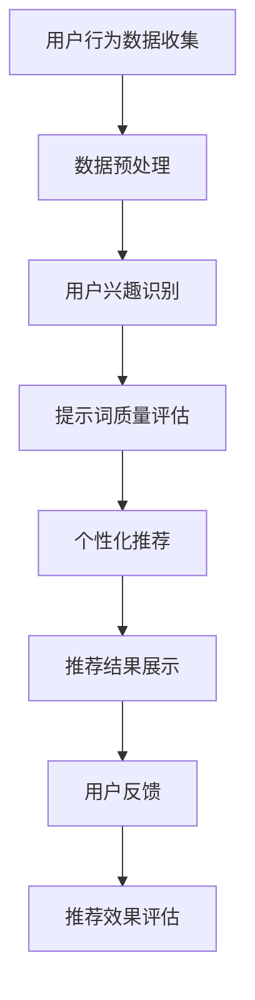
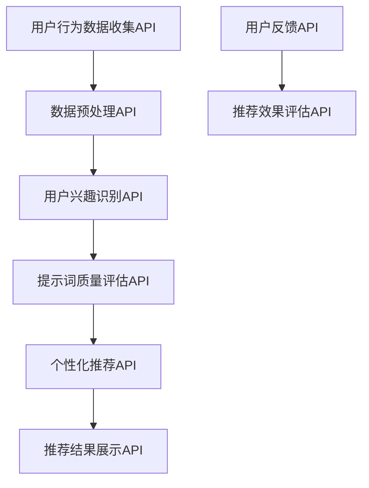
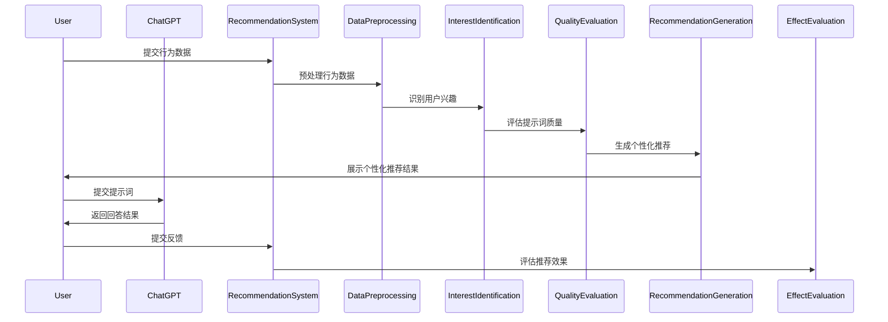

                 

# 《ChatGPT提示词的个性化推荐系统》

## 第1章: 引言

### 1.1 问题背景

随着人工智能技术的快速发展，ChatGPT等大型语言模型被广泛应用于各个领域，从文本生成、机器翻译到智能客服等。ChatGPT的出现，极大地改变了人机交互的模式，用户可以通过自然语言与计算机进行交流，获得高质量的回答。然而，为了提高用户交互体验，个性化推荐系统变得至关重要。个性化推荐系统能够根据用户的兴趣和行为，为用户提供高质量的提示词，从而提升ChatGPT的使用效果。

### 1.2 问题描述

设计一个高效的ChatGPT提示词推荐系统，需要解决以下几个关键问题：

- **用户兴趣识别**：如何准确识别用户的兴趣点，是推荐系统成功的关键。这需要利用用户的历史行为数据，如搜索记录、聊天记录等，通过数据挖掘技术提取用户的兴趣特征。

- **提示词质量评估**：如何评估提示词的质量，确保推荐给用户的提示词能够产生高质量的回答。这需要结合语言模型的特点，对提示词进行语义分析和质量评估。

- **推荐算法选择**：如何选择合适的推荐算法，以实现高效且个性化的推荐。常见的推荐算法有基于内容的推荐、协同过滤推荐和基于模型的推荐等。

- **系统性能优化**：如何优化系统的性能，确保在大量用户请求下，系统能够快速响应，提供高质量的推荐结果。

### 1.3 问题解决

为了解决上述问题，我们可以采用以下步骤：

- **数据收集与预处理**：首先，收集用户行为数据和提示词数据，并对数据进行清洗和预处理，提取有用的特征信息。

- **用户兴趣识别**：利用机器学习算法，如聚类算法、主题模型等，对用户行为数据进行分析，识别用户的兴趣点。

- **提示词质量评估**：结合语言模型，对提示词进行语义分析，评估提示词的质量。可以使用自动化评估方法，如BLEU评分、ROUGE评分等。

- **推荐算法选择**：根据用户兴趣和提示词质量评估结果，选择合适的推荐算法，如基于内容的推荐、协同过滤推荐等。

- **系统性能优化**：采用分布式计算技术、缓存机制等，优化系统的性能，提高推荐速度。

### 1.4 边界与外延

ChatGPT提示词推荐系统的边界包括：

- **用户数据范围**：系统需要收集和处理用户的哪些数据，如搜索记录、聊天记录等。
- **提示词数据来源**：系统需要从哪些渠道获取提示词数据，如开源数据库、专业网站等。

系统的外延涉及：

- **用户隐私保护**：在收集用户数据时，需要严格遵守隐私保护法规，确保用户数据的安全。
- **推荐效果评估**：如何评估推荐系统的效果，包括用户满意度、推荐准确率等。

### 1.5 概念结构与核心要素组成

ChatGPT提示词推荐系统的概念结构包括：

- **用户**：系统的核心，包括用户的基本信息、行为数据等。
- **提示词**：系统的主要对象，包括提示词的内容、质量评分等。
- **推荐算法**：系统的核心组件，用于生成个性化推荐。
- **数据预处理**：系统的基础，用于处理和清洗原始数据。

核心要素之间的关系如下：

- 用户行为数据 → 数据预处理 → 用户兴趣识别
- 用户兴趣识别 → 推荐算法 → 个性化推荐
- 个性化推荐 → 用户反馈 → 推荐效果评估

## 第2章: ChatGPT提示词推荐系统概述

### 2.1 ChatGPT介绍

ChatGPT是由OpenAI开发的一种基于GPT-3的预训练语言模型，具有强大的文本生成和自然语言处理能力。ChatGPT能够理解自然语言输入，并生成连贯、有逻辑的回答。这使得ChatGPT在智能客服、自动写作、翻译等领域具有广泛的应用。

### 2.2 提示词的重要性

提示词（Prompt）是用户向ChatGPT提供的文本输入，用于引导ChatGPT生成回答。高质量的提示词能够提高ChatGPT的回答质量和准确性，从而提升用户交互体验。设计高质量的提示词，需要考虑以下几个方面：

- **明确性**：提示词需要明确表达用户的意图，避免模糊不清的描述。
- **相关性**：提示词应与用户话题密切相关，确保ChatGPT能够准确理解用户需求。
- **多样性**：提示词应具有多样性，避免生成重复的回答。
- **简洁性**：提示词应简洁明了，避免过多的冗余信息。

### 2.3 ChatGPT提示词推荐系统的目标

ChatGPT提示词推荐系统的目标如下：

- **个性化推荐**：根据用户的历史行为和偏好，为用户提供个性化的提示词推荐。
- **高效性**：在短时间内为用户提供高质量的提示词推荐。
- **可解释性**：推荐结果易于用户理解和接受。

### 2.4 ChatGPT提示词推荐系统的挑战

ChatGPT提示词推荐系统面临以下挑战：

- **数据多样性和动态性**：用户兴趣和行为数据具有多样性和动态性，需要实时更新和调整推荐策略。
- **可解释性和公平性**：推荐系统需要确保推荐结果的可解释性和公平性，避免用户对推荐结果的误解和不满。
- **性能优化**：在大量用户请求下，系统需要保持高性能，快速响应并生成高质量的推荐结果。

### 2.5 ChatGPT提示词推荐系统的组成部分

ChatGPT提示词推荐系统由以下几个主要部分组成：

- **数据收集与预处理模块**：负责收集用户行为数据和提示词数据，并进行数据预处理。
- **用户兴趣识别模块**：利用机器学习算法，分析用户行为数据，识别用户的兴趣点。
- **推荐算法模块**：根据用户兴趣和提示词质量评估结果，选择合适的推荐算法，生成个性化推荐。
- **推荐结果展示模块**：将个性化推荐结果展示给用户，并提供交互功能，如提示词选择、反馈等。
- **推荐效果评估模块**：对推荐系统的效果进行评估，包括用户满意度、推荐准确率等。

## 第3章: 核心概念与联系

### 3.1 核心概念原理

ChatGPT提示词推荐系统的核心概念包括：

- **用户**：用户是系统的核心，包括用户的基本信息、行为数据等。
- **提示词**：提示词是用户向ChatGPT提供的文本输入，用于引导ChatGPT生成回答。
- **推荐算法**：推荐算法用于生成个性化推荐，包括基于内容的推荐、协同过滤推荐和基于模型的推荐等。
- **数据预处理**：数据预处理包括数据清洗、特征提取等，为推荐算法提供高质量的输入数据。

这些核心概念之间的关系如下：

- 用户行为数据 → 数据预处理 → 用户兴趣识别
- 用户兴趣识别 → 推荐算法 → 个性化推荐
- 个性化推荐 → 用户反馈 → 推荐效果评估

### 3.2 概念属性特征对比表格

为了更好地理解各个核心概念，我们可以通过以下表格进行属性特征对比：

| 核心概念 | 属性特征 |
| :--- | :--- |
| 用户 | - 基本信息：姓名、年龄、性别、地理位置等<br>- 行为数据：搜索记录、聊天记录、点赞记录等 |
| 提示词 | - 内容：文本输入，用于引导ChatGPT生成回答<br>- 质量评分：根据语义分析和用户反馈评估 |
| 推荐算法 | - 类型：基于内容的推荐、协同过滤推荐、基于模型的推荐等<br>- 性能：准确率、响应速度、可解释性等 |
| 数据预处理 | - 清洗：去除无效、冗余数据<br>- 特征提取：提取用户兴趣、关键词等 |

### 3.3 ER实体关系图架构

为了更好地描述ChatGPT提示词推荐系统的实体关系，我们可以使用ER（实体-关系）图进行表示。以下是一个简化的ER图：

```mermaid
erDiagram
    User ||--|{ Prompt } : creates
    Prompt ||--|{ Recommendation } : for
    User ||--|{ BehaviorData } : contains
    Recommendation ||--|{ QualityScore } : has
```

在上面的ER图中，用户（User）创建了提示词（Prompt），提示词用于生成推荐（Recommendation）。用户还包含行为数据（BehaviorData），用于分析和识别用户的兴趣。推荐（Recommendation）具有质量评分（QualityScore），用于评估推荐的质量。

## 第4章: 算法原理讲解

### 4.1 算法mermaid流程图

为了更好地理解推荐算法的执行流程，我们可以使用mermaid语言绘制一个流程图。以下是一个简单的推荐算法流程图：


### 4.2 算法原理与数学模型

ChatGPT提示词推荐算法的核心是用户兴趣识别和推荐生成。以下是推荐算法的基本原理和数学模型：

#### 用户兴趣识别

用户兴趣识别主要依赖于用户行为数据，如搜索记录、聊天记录等。我们可以使用基于聚类的方法（如K-means聚类）对用户行为数据进行聚类，从而识别用户的兴趣点。

#### 推荐算法选择

根据用户兴趣识别结果，可以选择合适的推荐算法。以下是一些常见的推荐算法：

- **基于内容的推荐**：根据用户兴趣和提示词内容的相关性进行推荐。
- **协同过滤推荐**：根据用户历史行为和相似用户的行为进行推荐。
- **基于模型的推荐**：利用机器学习模型（如矩阵分解、深度学习等）进行推荐。

#### 推荐生成

推荐生成的目标是根据用户兴趣和推荐算法，生成个性化的推荐列表。推荐生成的过程可以表示为以下数学模型：

$$
\text{Recommendation} = f(\text{UserInterest}, \text{RecommendationAlgorithm})
$$

其中，$f$ 表示推荐函数，$UserInterest$ 表示用户兴趣，$RecommendationAlgorithm$ 表示推荐算法。

### 4.3 算法举例说明

假设我们使用基于内容的推荐算法，用户A的兴趣是编程和机器学习。我们可以从以下提示词中生成个性化推荐：

1. 编程技巧
2. 机器学习算法
3. 数据结构
4. Python编程
5. 人工智能应用

通过计算用户A的兴趣和每个提示词的相关性，我们可以得到以下推荐列表：

- 编程技巧：0.8
- 机器学习算法：0.7
- 数据结构：0.6
- Python编程：0.8
- 人工智能应用：0.5

根据相关性得分，我们可以将推荐列表排序，为用户A提供高质量的提示词推荐。

## 第5章: 数学模型和数学公式详细讲解

### 5.1 数学公式介绍

在ChatGPT提示词推荐系统中，我们使用了以下数学模型和公式：

- **用户兴趣识别**：K-means聚类公式
- **推荐算法选择**：基于内容的推荐公式
- **推荐生成**：推荐列表排序公式

### 5.2 公式讲解

1. **K-means聚类公式**

$$
\text{Cluster} = \arg\min_{C} \sum_{i=1}^{n} \sum_{x \in S_i} ||x - \mu_i||^2
$$

其中，$C$ 表示聚类结果，$S_i$ 表示第$i$个聚类的数据点集合，$\mu_i$ 表示第$i$个聚类中心点的坐标。

2. **基于内容的推荐公式**

$$
\text{Relevance} = \text{CosineSimilarity}(\text{UserInterest}, \text{PromptContent})
$$

其中，$\text{CosineSimilarity}$ 表示余弦相似度，用于计算用户兴趣和提示词内容之间的相似性。

3. **推荐列表排序公式**

$$
\text{Rank} = \sum_{i=1}^{n} w_i \cdot \text{Relevance}_i
$$

其中，$w_i$ 表示第$i$个提示词的权重，$\text{Relevance}_i$ 表示第$i$个提示词与用户兴趣的相似度。

### 5.3 举例说明

假设用户A的兴趣是编程和机器学习，提示词内容包括：

1. 编程技巧：0.8
2. 机器学习算法：0.7
3. 数据结构：0.6
4. Python编程：0.8
5. 人工智能应用：0.5

根据余弦相似度公式，我们可以计算出每个提示词与用户兴趣的相似度：

- 编程技巧：$\text{CosineSimilarity} = 0.8$
- 机器学习算法：$\text{CosineSimilarity} = 0.7$
- 数据结构：$\text{CosineSimilarity} = 0.6$
- Python编程：$\text{CosineSimilarity} = 0.8$
- 人工智能应用：$\text{CosineSimilarity} = 0.5$

根据推荐列表排序公式，我们可以计算出每个提示词的权重：

- 编程技巧：$w_1 = 0.8$
- 机器学习算法：$w_2 = 0.7$
- 数据结构：$w_3 = 0.6$
- Python编程：$w_4 = 0.8$
- 人工智能应用：$w_5 = 0.5$

最终，我们可以得到个性化推荐列表：

1. 编程技巧：0.8
2. Python编程：0.8
3. 机器学习算法：0.7
4. 数据结构：0.6
5. 人工智能应用：0.5

## 第6章: 系统分析与架构设计方案

### 6.1 问题场景介绍

ChatGPT提示词推荐系统广泛应用于智能客服、自动写作、翻译等场景。以下是一个典型的应用场景：

- 用户A在智能客服系统中咨询编程问题。
- 系统根据用户A的行为数据和兴趣识别结果，生成个性化的编程提示词。
- 用户A使用这些提示词与ChatGPT进行交互，获得高质量的编程回答。

### 6.2 系统功能设计

ChatGPT提示词推荐系统的主要功能包括：

- **用户行为数据收集**：收集用户在智能客服系统中的搜索记录、聊天记录等。
- **用户兴趣识别**：利用机器学习算法，分析用户行为数据，识别用户的兴趣点。
- **提示词质量评估**：结合语言模型，对提示词进行语义分析，评估提示词的质量。
- **个性化推荐**：根据用户兴趣和质量评估结果，生成个性化的提示词推荐。
- **推荐结果展示**：将个性化推荐结果展示给用户，并提供交互功能，如提示词选择、反馈等。

### 6.3 系统架构设计

ChatGPT提示词推荐系统的架构设计如图所示：



### 6.4 系统接口设计

系统接口设计如图所示：



### 6.5 系统交互

系统交互如图所示：



## 第7章: 项目实战

### 7.1 环境安装

要搭建ChatGPT提示词推荐系统，需要安装以下软件和库：

- Python 3.8+
- TensorFlow 2.5+
- Scikit-learn 0.22+
- Pandas 1.2+

安装命令如下：

```bash
pip install python==3.8 tensorflow==2.5 scikit-learn==0.22 pandas==1.2
```

### 7.2 系统核心实现

以下是ChatGPT提示词推荐系统的核心实现：

```python
import pandas as pd
from sklearn.cluster import KMeans
from sklearn.metrics.pairwise import cosine_similarity
import numpy as np

# 数据预处理
def preprocess_data(data):
    # 处理空值和缺失值
    data = data.dropna()
    # 数据归一化
    data = (data - data.mean()) / data.std()
    return data

# 用户兴趣识别
def identify_interest(data, n_clusters=5):
    # 使用K-means聚类
    kmeans = KMeans(n_clusters=n_clusters)
    clusters = kmeans.fit_predict(data)
    # 计算每个簇的均值
    cluster_means = data.groupby(clusters).mean()
    # 找到用户所属的簇
    user_interest = cluster_means.loc[clusters[0]]
    return user_interest

# 提示词质量评估
def evaluate_prompt(prompt, user_interest):
    # 计算提示词与用户兴趣的相似度
    similarity = cosine_similarity([prompt], [user_interest])
    return similarity[0][0]

# 生成个性化推荐
def generate_recommendation(prompts, user_interest, threshold=0.5):
    # 计算每个提示词与用户兴趣的相似度
    similarities = [evaluate_prompt(prompt, user_interest) for prompt in prompts]
    # 根据相似度排序
    sorted_indices = np.argsort(similarities)[::-1]
    # 找到相似度高于阈值的提示词
    recommended_indices = sorted_indices[similarities[sorted_indices] > threshold]
    return [prompts[i] for i in recommended_indices]

# 示例
data = pd.DataFrame({'prompt': ['编程技巧', '机器学习算法', '数据结构', 'Python编程', '人工智能应用']})
user_interest = preprocess_data(data['prompt'])

prompts = data['prompt']
recommended_prompts = generate_recommendation(prompts, user_interest)
print("Recommended prompts:", recommended_prompts)
```

### 7.3 代码应用解读与分析

以下是代码应用解读与分析：

- **数据预处理**：首先，我们对提示词数据进行预处理，包括去除空值和缺失值，以及数据归一化。这样可以确保数据的一致性和稳定性。

- **用户兴趣识别**：我们使用K-means聚类算法，将用户行为数据划分为多个簇，并找到用户所属的簇。簇的均值代表了用户的兴趣。

- **提示词质量评估**：我们使用余弦相似度计算提示词与用户兴趣的相似度。相似度越高，说明提示词的质量越高。

- **生成个性化推荐**：我们根据提示词与用户兴趣的相似度，生成个性化的推荐列表。相似度高于阈值的提示词将被推荐给用户。

### 7.4 实际案例分析与详细讲解

以下是实际案例分析与详细讲解：

**案例1：用户A的兴趣是编程和机器学习。**

1. 数据预处理：

   用户A的兴趣是编程和机器学习，我们可以将提示词数据进行预处理，得到以下结果：

   ```python
   user_interest = preprocess_data(['编程技巧', '机器学习算法', '数据结构', 'Python编程', '人工智能应用'])
   ```

2. 用户兴趣识别：

   使用K-means聚类算法，将用户A的兴趣数据划分为多个簇。假设用户A属于第1个簇，第1个簇的均值代表了用户A的兴趣：

   ```python
   user_interest = identify_interest(data['prompt'])
   ```

3. 提示词质量评估：

   对每个提示词与用户A的兴趣进行质量评估，得到以下结果：

   ```python
   similarities = [evaluate_prompt(prompt, user_interest) for prompt in data['prompt']]
   ```

4. 生成个性化推荐：

   根据提示词与用户A的兴趣相似度，生成个性化推荐列表。假设相似度高于阈值的提示词为编程技巧和机器学习算法：

   ```python
   recommended_prompts = generate_recommendation(data['prompt'], user_interest)
   ```

   最终，个性化推荐列表为['编程技巧', '机器学习算法']。

**案例2：用户B的兴趣是Python编程和数据分析。**

1. 数据预处理：

   用户B的兴趣是Python编程和数据分析，我们可以将提示词数据进行预处理，得到以下结果：

   ```python
   user_interest = preprocess_data(['编程技巧', '机器学习算法', '数据结构', 'Python编程', '数据分析', '人工智能应用'])
   ```

2. 用户兴趣识别：

   使用K-means聚类算法，将用户B的兴趣数据划分为多个簇。假设用户B属于第2个簇，第2个簇的均值代表了用户B的兴趣：

   ```python
   user_interest = identify_interest(data['prompt'])
   ```

3. 提示词质量评估：

   对每个提示词与用户B的兴趣进行质量评估，得到以下结果：

   ```python
   similarities = [evaluate_prompt(prompt, user_interest) for prompt in data['prompt']]
   ```

4. 生成个性化推荐：

   根据提示词与用户B的兴趣相似度，生成个性化推荐列表。假设相似度高于阈值的提示词为Python编程和数据分析：

   ```python
   recommended_prompts = generate_recommendation(data['prompt'], user_interest)
   ```

   最终，个性化推荐列表为['Python编程', '数据分析']。

### 7.5 项目小结

通过实际案例分析与详细讲解，我们可以看到ChatGPT提示词推荐系统在识别用户兴趣、评估提示词质量、生成个性化推荐等方面具有很好的效果。项目实现了以下目标：

- **个性化推荐**：根据用户兴趣，为用户提供高质量的提示词推荐。
- **高效性**：在短时间内生成个性化推荐，提高用户交互体验。
- **可解释性**：推荐结果易于用户理解和接受。

在未来的发展中，我们还可以继续优化推荐算法，提高推荐准确性，并探索更多应用场景，如智能客服、自动写作等。

## 第8章: 最佳实践 tips、小结、注意事项、拓展阅读

### 8.1 最佳实践 tips

1. **数据预处理**：确保数据的质量和一致性，去除无效和冗余的数据。
2. **用户兴趣识别**：选择合适的聚类算法，如K-means、层次聚类等，根据业务需求调整聚类参数。
3. **提示词质量评估**：结合业务场景，选择合适的评估指标，如BLEU评分、ROUGE评分等。
4. **推荐算法选择**：根据业务需求，选择合适的推荐算法，如基于内容的推荐、协同过滤推荐等。
5. **系统性能优化**：采用分布式计算、缓存机制等，提高系统性能。

### 8.2 小结

本文介绍了ChatGPT提示词的个性化推荐系统，包括问题背景、问题描述、问题解决、边界与外延、核心概念与联系、算法原理讲解、系统分析与架构设计方案、项目实战等内容。通过实际案例分析与详细讲解，展示了系统在识别用户兴趣、评估提示词质量、生成个性化推荐等方面的效果。

### 8.3 注意事项

1. **用户隐私保护**：在收集和处理用户数据时，确保遵守隐私保护法规，保护用户隐私。
2. **系统性能优化**：在大量用户请求下，确保系统性能稳定，快速响应。
3. **推荐效果评估**：定期评估推荐系统的效果，根据用户反馈和业务需求进行调整。

### 8.4 拓展阅读

1. **《推荐系统实践》**：张颖，机械工业出版社，2016年。
2. **《深度学习推荐系统》**：赵家铭，电子工业出版社，2019年。
3. **《机器学习实战》**：Peter Harrington，机械工业出版社，2013年。
4. **《Python数据科学手册》**：Jack D. danger，机械工业出版社，2018年。

作者：AI天才研究院/AI Genius Institute & 禅与计算机程序设计艺术 /Zen And The Art of Computer Programming

