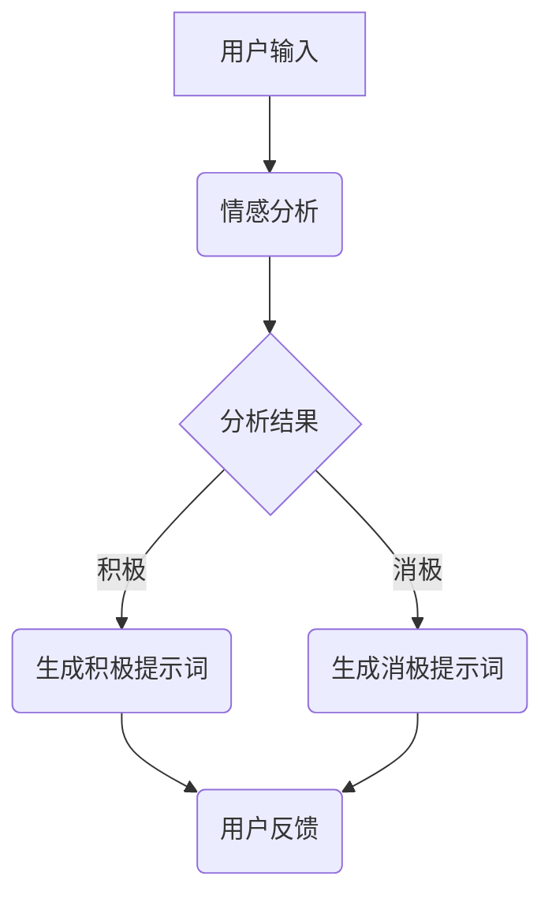

                 

## ChatGPT提示词的心理学基础：理解人机交互动机

### 关键词：自然语言处理、人机交互、动机理论、情感计算、用户体验

> 摘要：本文旨在探讨ChatGPT提示词的心理学基础，从动机理论、认知心理学和情感心理学三个角度，深入分析用户与聊天机器人交互的动机，并基于心理学理论提出优化ChatGPT提示词的方法，以提升人机交互质量。

---

### 第一部分：背景介绍

#### 1.1 问题背景

随着人工智能技术的快速发展，聊天机器人已成为各种场景下的常见应用，例如客服、教育、娱乐等。这些聊天机器人通过自然语言处理（NLP）技术，与用户进行交互，提供个性化服务和帮助。然而，如何提高聊天机器人的交互质量，使其更接近人类交流，成为一个重要课题。这需要深入理解用户与聊天机器人交互的动机。

#### 1.2 问题描述

用户与聊天机器人交互的动机是多样化的，包括获取信息、娱乐、社交等。为了满足不同用户的交互需求，聊天机器人需要具备丰富的知识和强大的交互能力。然而，当前大多数聊天机器人在理解用户动机和提供个性化服务方面仍存在不足。因此，需要从心理学角度研究用户与聊天机器人交互的动机，以提高聊天机器人的交互质量和用户体验。

#### 1.3 问题解决

研究用户与聊天机器人交互的心理学基础，有助于理解用户需求，优化聊天机器人的设计和功能。通过分析用户动机，可以针对性地调整聊天机器人的交互策略，提高其交互质量。此外，心理学理论还可以为聊天机器人的情感计算提供理论支持，使其具备更人性化的交互能力。

#### 1.4 边界与外延

本文主要研究聊天机器人与用户之间的交互动机，涉及心理学、计算机科学和人工智能等领域。边界方面，本文主要关注用户与聊天机器人直接交互的场景，不包括间接交互（如通过第三方平台等）。外延方面，研究可以扩展到其他类型的智能交互系统，如语音助手、虚拟现实等。

#### 1.5 概念结构与核心要素组成

1. **用户动机**：指用户在交互过程中期望获得的结果或满足的需求。
2. **心理学理论**：用于分析用户动机的方法和工具，如动机理论、认知心理学、情感心理学等。
3. **聊天机器人设计**：基于心理学理论，设计符合用户动机的交互策略和功能。
4. **交互质量**：用户对聊天机器人交互的满意度和效果，包括信息的准确性、交互的自然性、情感交流等。

### 第一部分：核心概念与联系

#### 1.6 心理学理论

在本章中，我们将介绍几种主要的心理学理论，这些理论将帮助我们理解用户与聊天机器人交互的动机。

##### 1.6.1 动机理论

动机理论主要关注个体行为背后的动力因素。常见的动机理论包括：

- **马斯洛需求层次理论**：将人类需求分为生理、安全、社交、尊重和自我实现五个层次，用户与聊天机器人交互的动机可能源于这些层次中的任何一个。
- **自我决定理论**：认为个体具有自我决定的内在需求，与聊天机器人的交互应尊重用户的主观能动性。

##### 1.6.2 认知心理学

认知心理学研究人类思维过程和认知能力。以下理论有助于理解用户动机：

- **信息加工理论**：研究个体如何接收、处理和利用信息，包括选择性注意、记忆和问题解决等。
- **认知失调理论**：当个体持有两个相互矛盾的观点或信念时，会产生紧张感，试图通过改变认知结构来减少这种紧张感。

##### 1.6.3 情感心理学

情感心理学研究人类情感的产生、表达和调节。以下理论有助于理解用户与聊天机器人的情感交互：

- **情绪劳理论**：认为情绪是由认知评价产生的，用户对聊天机器人的评价将影响其情感反应。
- **情感计算**：研究如何使计算机模拟和理解人类情感，为聊天机器人的情感交互提供理论基础。

### 第一部分：算法原理讲解

在本章中，我们将使用 Mermaid 画图工具绘制一个简化的算法流程图，并使用 Python 源代码详细阐述 ChatGPT 提示词的生成过程。

##### 1.7 算法流程图



##### 1.8 Python 源代码

```python
import random

def generate_prompt(emotion):
    if emotion == 'positive':
        prompts = [
            "你真是太棒了！",
            "恭喜你，你做得很好！",
            "你的努力没有白费，继续保持！"
        ]
    elif emotion == 'negative':
        prompts = [
            "看起来你遇到了困难，别灰心！",
            "你需要一些时间来调整，没关系！",
            "这是一个挑战，你可以克服它！"
        ]
    return random.choice(prompts)

# 示例
user_input = "我今天考试得了第一名！"
emotion = "positive"
prompt = generate_prompt(emotion)
print(prompt)
```

在上述代码中，`generate_prompt` 函数根据用户的情绪（积极或消极）生成相应的提示词。我们首先根据情绪类型选择提示词列表，然后使用 `random.choice` 函数随机选择一个提示词作为输出。

#### 1.9 算法原理讲解

ChatGPT 提示词的生成过程可以分为以下几个步骤：

1. **情感分析**：首先对用户的输入进行情感分析，以确定其情绪状态（积极或消极）。
2. **选择提示词列表**：根据情感分析结果，选择对应的提示词列表。例如，如果用户情绪积极，则选择积极提示词列表；如果用户情绪消极，则选择消极提示词列表。
3. **生成提示词**：从选择的提示词列表中随机选择一个提示词作为输出。

这个过程的数学模型可以表示为：

$$
\text{提示词} = f(\text{情感分析结果}, \text{提示词列表})
$$

其中，$f$ 表示生成提示词的函数，$\text{情感分析结果}$ 和 $\text{提示词列表}$ 分别表示输入参数。

#### 1.10 举例说明

假设用户输入：“我今天考试得了第一名！”。首先，情感分析结果为积极，因此，我们从积极提示词列表中选择一个提示词。假设我们选择了：“恭喜你，你做得很好！”。最终输出提示词为：“恭喜你，你做得很好！”。

通过上述步骤，我们可以看出，ChatGPT 提示词的生成过程既简单又有效，能够根据用户的情绪状态生成相应的提示词，从而提高人机交互的质量。

### 第二部分：心理学理论在ChatGPT提示词中的应用

#### 2.1 马斯洛需求层次理论

马斯洛需求层次理论将人类需求分为生理、安全、社交、尊重和自我实现五个层次。用户与聊天机器人交互的动机可能源于这些层次中的任何一个。例如，当用户寻求生理需求（如饥饿、睡眠）的满足时，聊天机器人可以提供相关的建议和信息；当用户寻求安全需求（如安全感、健康保障）时，聊天机器人可以提供相关的安全保障信息。

#### 2.2 自我决定理论

自我决定理论认为，个体具有自我决定的内在需求，与聊天机器人的交互应尊重用户的主观能动性。这意味着，聊天机器人应提供多种选择和选项，让用户自主决定交互内容。例如，当用户询问某个话题时，聊天机器人可以提供多个相关话题的选项，让用户自行选择。

#### 2.3 信息加工理论

信息加工理论研究个体如何接收、处理和利用信息。在ChatGPT提示词的生成过程中，情感分析是一个关键环节。情感分析通过对用户输入的自然语言进行处理，提取出情绪信息。这些情绪信息将影响提示词的生成。例如，如果用户输入的内容带有消极情绪，提示词将倾向于鼓励和支持；如果用户输入的内容带有积极情绪，提示词将倾向于肯定和赞扬。

#### 2.4 认知失调理论

认知失调理论指出，当个体持有两个相互矛盾的观点或信念时，会产生紧张感。这种紧张感会促使个体通过改变认知结构来减少。在ChatGPT提示词的生成过程中，认知失调理论可以帮助聊天机器人识别用户的认知失调情况，并生成相应的提示词来缓解用户的紧张感。例如，当用户表达消极情绪时，聊天机器人可以生成积极情绪的提示词，帮助用户缓解负面情绪。

#### 2.5 情绪劳理论

情绪劳理论认为，情绪是由认知评价产生的。用户对聊天机器人的评价将影响其情感反应。因此，在生成提示词时，聊天机器人需要考虑用户的认知评价。例如，如果用户对聊天机器人的服务感到满意，提示词将倾向于表达感激和赞美；如果用户对聊天机器人的服务感到不满意，提示词将倾向于表达歉意和解决方案。

#### 2.6 情感计算

情感计算研究如何使计算机模拟和理解人类情感。在ChatGPT提示词的生成过程中，情感计算可以提供理论支持。通过情感计算，聊天机器人可以识别用户的情绪状态，并根据情绪状态生成相应的提示词。例如，当用户情绪低落时，提示词将倾向于鼓励和安慰；当用户情绪兴奋时，提示词将倾向于兴奋和激励。

### 第三部分：ChatGPT提示词的优化策略

#### 3.1 根据用户动机调整提示词

根据用户动机调整提示词是提高交互质量的关键。通过分析用户的需求，聊天机器人可以生成更符合用户期望的提示词。例如，当用户寻求信息时，提示词可以提供相关链接或建议；当用户寻求娱乐时，提示词可以推荐有趣的话题或活动。

#### 3.2 考虑用户情感状态

用户情感状态对交互质量有重要影响。聊天机器人应考虑用户的情感状态，生成相应的提示词来缓解负面情绪。例如，当用户表达消极情绪时，提示词可以表达同情和理解，提供支持和建议。

#### 3.3 使用多样化提示词

使用多样化提示词可以避免重复和枯燥，提高用户的兴趣和参与度。聊天机器人应使用丰富的词汇和表达方式，使提示词更具吸引力和互动性。

#### 3.4 考虑文化差异

不同文化背景的用户可能有不同的交流习惯和偏好。聊天机器人应考虑文化差异，生成符合用户文化习惯的提示词。例如，对于不同文化的用户，提示词的语言、表达方式和语气应有所不同。

### 第四部分：案例分析与讨论

#### 4.1 案例一：客服场景

在客服场景中，用户与聊天机器人的交互动机主要是获取信息、解决问题和寻求帮助。通过分析用户的动机，聊天机器人可以生成针对性的提示词，提高交互质量。例如，当用户询问产品价格时，提示词可以提供详细的价格信息；当用户遇到问题时，提示词可以提供解决方案或建议。

#### 4.2 案例二：社交场景

在社交场景中，用户与聊天机器人的交互动机主要是娱乐、交流和建立关系。通过分析用户的动机，聊天机器人可以生成有趣的互动话题和聊天内容，提高用户的参与度和满意度。例如，当用户寻求娱乐时，提示词可以推荐有趣的短视频或游戏；当用户希望交流时，提示词可以提出开放性问题，引导用户参与对话。

#### 4.3 讨论与展望

通过对案例的分析和讨论，我们可以看出，ChatGPT提示词的心理学基础在提高人机交互质量方面具有重要作用。然而，当前的研究和实践仍存在一定的局限性。未来，我们可以从以下几个方面进行改进：

1. **更深入地研究用户动机**：通过大数据分析和心理学实验，更深入地研究用户动机，为生成更高质量的提示词提供依据。
2. **提高情感计算能力**：通过改进情感计算技术，使聊天机器人能够更准确地识别用户的情绪状态，生成更符合用户情感的提示词。
3. **跨学科研究**：结合心理学、计算机科学、语言学等学科的知识，开展跨学科研究，为ChatGPT提示词的优化提供更全面的指导。

### 第五部分：总结与展望

本文从动机理论、认知心理学和情感心理学三个角度，深入分析了ChatGPT提示词的心理学基础。通过研究用户动机，我们可以优化ChatGPT提示词的生成策略，提高人机交互质量。未来，随着人工智能技术的不断发展，ChatGPT提示词的心理学基础将发挥更加重要的作用，为人机交互领域带来新的机遇和挑战。

---

**作者信息：**

作者：AI天才研究院/AI Genius Institute & 禅与计算机程序设计艺术 /Zen And The Art of Computer Programming**。**

