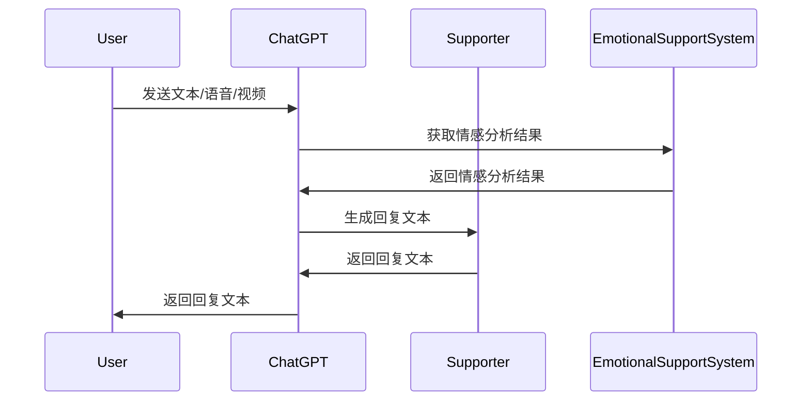

                 

# 《ChatGPT提示词的情感共情能力：增强AI在心理支持中的应用》

## 关键词

- ChatGPT 提示词
- 情感共情能力
- 人工智能
- 心理支持
- 算法原理
- 数学模型
- 系统架构
- 项目实战

## 摘要

本文探讨了 ChatGPT 提示词的情感共情能力及其在心理支持中的应用。首先，我们介绍了 ChatGPT 提示词的情感共情能力的重要性，并分析了当前人工智能在心理支持领域的应用现状和挑战。接着，我们明确了本文的核心目标：探讨如何增强 AI 的情感共情能力，提升其在心理支持中的应用效果。文章随后深入分析了 ChatGPT 的核心概念和情感共情机制，并详细讲解了其算法原理和数学模型。最后，我们介绍了心理支持系统的场景和需求，展示了系统功能设计和架构设计，并通过项目实战展示了如何实现 ChatGPT 提示词的情感共情能力在心理支持中的应用。

----------------------------------------------------------------

## 引言与背景介绍

### ChatGPT 提示词的情感共情能力的重要性

在人工智能快速发展的今天，自然语言处理（NLP）技术已经取得了显著的进步。ChatGPT 作为 GPT-3 的改进版本，以其强大的文本生成能力和语义理解能力在各个领域引起了广泛关注。然而，仅仅具备语言生成和理解的技能并不足以满足人们的需求，尤其是在心理支持领域。人类在心理支持过程中，不仅需要理解对方的语言和情感，还需要展现出一定的情感共情能力，以更好地理解和回应对方的需求。

情感共情能力是指个体能够理解并感受到他人的情绪和情感，并通过语言和非语言的方式表达出来。这种能力在心理支持中至关重要，因为它能够帮助心理支持者更好地理解对方的心理状态，提供更为贴心的帮助。然而，传统的 AI 系统在情感共情方面存在一定的局限性，难以在真实情境中展现出与人类相近的情感共情能力。

ChatGPT 提示词作为一种基于 AI 的技术，具备一定的情感共情能力，能够在一定程度上模拟人类的情感交流。通过增强 ChatGPT 提示词的情感共情能力，我们可以使 AI 在心理支持领域发挥更大的作用，为用户提供更加温暖和贴心的服务。

### 当前人工智能在心理支持领域的应用现状和挑战

随着人工智能技术的不断发展，AI 在心理支持领域的应用逐渐增多。例如，一些心理支持平台已经引入了基于 AI 的聊天机器人，用于提供在线心理咨询服务。这些聊天机器人可以通过与用户的对话，了解用户的心理状态，并提供相应的建议和支持。

然而，尽管 AI 在心理支持领域展现出了一定的潜力，但其应用仍然面临诸多挑战。首先，现有 AI 系统在情感共情能力方面存在明显不足。虽然 ChatGPT 等模型具备一定的文本生成和语义理解能力，但它们在理解复杂情感和情感变化方面仍存在困难。这使得 AI 在心理支持过程中，难以提供真正具有共情性的回应。

其次，心理支持过程需要大量的情感信息和背景知识。这些信息不仅包括用户的语言表达，还包括非语言表达、情绪变化等。现有 AI 系统在处理这些非语言信息方面仍存在不足，难以全面捕捉和理解用户的心理状态。

此外，心理支持过程中，用户的需求和情绪是动态变化的。AI 系统需要具备实时响应和调整的能力，以适应用户的变化。然而，现有 AI 系统在处理实时数据和处理复杂情感方面仍存在瓶颈。

### 本文的核心目标

本文旨在探讨如何增强 ChatGPT 提示词的情感共情能力，使其在心理支持领域中发挥更大的作用。具体而言，本文将分为以下几个部分：

1. **核心概念与联系**：介绍 ChatGPT 和情感共情能力的基本概念，并分析 ChatGPT 提示词的情感共情机制。
2. **算法原理讲解**：详细讲解 ChatGPT 提示词的情感共情能力的算法原理，并使用 Mermaid 流程图和 Python 源代码进行说明。
3. **数学模型和数学公式 & 详细讲解 & 举例说明**：介绍 ChatGPT 提示词的情感共情能力的数学模型，使用 LaTeX 格式编写数学公式，并通过具体例子进行详细讲解。
4. **系统分析与架构设计方案**：介绍心理支持系统的场景和需求，并使用 Mermaid 类图、架构图、接口设计和系统交互流程进行展示。
5. **项目实战**：介绍如何实现 ChatGPT 提示词的情感共情能力在心理支持中的应用，包括环境安装、系统核心实现源代码、代码应用解读与分析、实际案例分析和详细讲解剖析，以及项目小结。
6. **最佳实践 tips、小结、注意事项、拓展阅读等内容**：总结书中内容，提供实践中的注意事项和最佳实践建议，以及拓展阅读资源。

通过以上内容的逐步分析，本文希望能够为研究人员和开发者提供有价值的参考，推动 ChatGPT 提示词在心理支持领域的应用和发展。

## 核心概念与联系

### ChatGPT 的基本概念

ChatGPT 是由 OpenAI 开发的一种基于 GPT-3 的自然语言处理模型。GPT（Generative Pre-trained Transformer）是一种基于 Transformer 架构的预训练语言模型，其核心思想是通过在大规模文本数据上进行预训练，使模型具备强大的语言理解和生成能力。ChatGPT 在 GPT-3 的基础上进行了优化和扩展，使其能够更好地处理对话场景。

ChatGPT 的基本原理是通过对大量对话文本进行预训练，使其掌握对话中的语言规则和上下文关系。在具体应用中，ChatGPT 可以接收用户输入的文本，并生成相应的回复文本。其生成文本不仅具有较高的语义准确性，还能够根据上下文和对话情境进行适当的调整。

### 情感共情能力的定义

情感共情能力是指个体能够理解并感受到他人的情绪和情感，并通过语言和非语言的方式表达出来。在心理支持过程中，情感共情能力至关重要，因为它能够帮助心理支持者更好地理解对方的心理状态，提供更为贴心的帮助。

情感共情能力包括以下几个核心要素：

1. **情感理解**：个体能够准确理解他人的情感状态，包括情感的类型、强度和变化。
2. **情感表达**：个体能够通过语言和非语言的方式，如语气、表情和肢体语言，表达对他人情感的理解和回应。
3. **情感共鸣**：个体能够在情感上与对方产生共鸣，感受到对方的情感体验。

### ChatGPT 提示词的情感共情机制

ChatGPT 提示词是指通过对 ChatGPT 模型进行特定的输入和调整，使其在特定场景下生成更符合情感共情要求的回复文本。为了实现这一目标，ChatGPT 提示词需要结合情感分析和情感生成技术，使模型在生成文本时能够考虑到情感因素。

ChatGPT 提示词的情感共情机制主要包括以下几个步骤：

1. **情感分析**：通过对用户输入的文本进行情感分析，识别其中的情感类型和强度。情感分析技术可以使用基于深度学习的方法，如情感分类模型，对文本进行情感标注。
2. **情感调整**：根据情感分析的结果，对 ChatGPT 的输入进行情感调整。例如，如果用户表达了负面情感，提示词可以引导模型生成具有安慰或鼓励性质的回复文本。
3. **情感生成**：使用 ChatGPT 模型生成回复文本，同时考虑情感因素。通过优化输入数据和训练数据，可以使 ChatGPT 在生成文本时更倾向于情感共情。

### 表格和 Mermaid ER 图展示 ChatGPT 提示词的情感共情能力的关键要素

为了更好地理解 ChatGPT 提示词的情感共情能力，我们可以通过表格和 Mermaid ER 图来展示其关键要素。

#### 表格：ChatGPT 提示词的情感共情能力要素

| 要素           | 描述                                                         |
| -------------- | ------------------------------------------------------------ |
| 情感分析       | 对用户输入的文本进行情感分析，识别情感类型和强度。             |
| 情感调整       | 根据情感分析结果，对 ChatGPT 的输入进行情感调整。             |
| 情感生成       | 使用 ChatGPT 模型生成回复文本，同时考虑情感因素。           |
| 上下文理解     | 理解对话中的上下文关系，生成符合情境的回复文本。             |
| 非语言信息处理 | 考虑对话中的非语言信息，如语气、表情和肢体语言。             |
| 情感共鸣       | 在情感上与用户产生共鸣，提供共情性的回复。                 |

#### Mermaid ER 图：ChatGPT 提示词的情感共情能力架构

```mermaid
erDiagram
    User ||--o> ChatGPT : 输入文本
    ChatGPT ||--o> 情感分析 : 情感分析
    ChatGPT ||--o> 情感调整 : 情感调整
    ChatGPT ||--o> 情感生成 : 情感生成
    ChatGPT ||--o> 上下文理解 : 上下文理解
    ChatGPT ||--o> 非语言信息处理 : 非语言信息处理
    ChatGPT ||--o> 情感共鸣 : 情感共鸣
```

通过上述表格和 Mermaid ER 图，我们可以清晰地看到 ChatGPT 提示词在情感共情能力方面的关键要素和架构。这些要素和架构共同作用，使 ChatGPT 提示词能够在心理支持领域发挥出强大的情感共情能力。

### 结论

通过对 ChatGPT 和情感共情能力的定义，以及 ChatGPT 提示词的情感共情机制的详细分析，我们可以看到 ChatGPT 提示词在情感共情能力方面具备一定的潜力。在接下来的章节中，我们将深入探讨 ChatGPT 提示词的算法原理，进一步了解其情感共情能力的实现方法。通过这些分析，我们希望能够为研究人员和开发者提供有价值的参考，推动 ChatGPT 提示词在心理支持领域的应用和发展。

## 算法原理讲解

### ChatGPT 提示词的情感共情能力的算法原理

ChatGPT 提示词的情感共情能力主要依赖于其背后的深度学习算法和自然语言处理技术。为了更好地理解这一能力，我们首先需要了解 ChatGPT 模型的工作原理，以及如何通过算法优化和调整来实现情感共情。

#### ChatGPT 模型的工作原理

ChatGPT 是一种基于 Transformer 架构的预训练语言模型。Transformer 架构由 Vaswani 等人在 2017 年提出，其核心思想是使用自注意力机制（Self-Attention）来处理序列数据，从而捕捉序列中的长距离依赖关系。ChatGPT 在 Transformer 架构的基础上进行了优化和扩展，使其能够更好地处理对话场景。

ChatGPT 的基本工作流程如下：

1. **预训练**：ChatGPT 首先在大规模文本数据上进行预训练。这些数据包括互联网上的大量文本、书籍、新闻、论坛帖子等。通过预训练，ChatGPT 学习到语言的基本规则和上下文关系，从而具备强大的文本生成和语义理解能力。
2. **微调**：在预训练的基础上，ChatGPT 可以根据特定任务进行微调。例如，在心理支持场景中，我们可以使用含有情感标注的对话数据对 ChatGPT 进行微调，使其在生成文本时能够更好地考虑情感因素。

#### 情感共情能力的实现方法

为了实现 ChatGPT 提示词的情感共情能力，我们主要从以下几个方面进行算法优化和调整：

1. **情感分析**：通过对用户输入的文本进行情感分析，识别其中的情感类型和强度。情感分析可以采用基于深度学习的方法，如情感分类模型，对文本进行情感标注。常见的情感分类模型包括 BERT、RoBERTa、XLNet 等。
2. **情感调整**：根据情感分析的结果，对 ChatGPT 的输入进行情感调整。例如，如果用户表达了负面情感，我们可以引导 ChatGPT 生成具有安慰或鼓励性质的回复文本。情感调整可以通过修改输入文本、调整模型的参数等方式实现。
3. **情感生成**：使用 ChatGPT 模型生成回复文本，同时考虑情感因素。通过优化输入数据和训练数据，可以使 ChatGPT 在生成文本时更倾向于情感共情。例如，我们可以在训练数据中添加更多的情感对话样本，以增强模型对情感的理解和生成能力。
4. **上下文理解**：在生成文本时，ChatGPT 需要理解对话中的上下文关系，以生成符合情境的回复文本。上下文理解可以通过训练模型捕捉对话中的长距离依赖关系，从而提高文本生成的准确性。
5. **非语言信息处理**：在情感共情过程中，非语言信息（如语气、表情、肢体语言等）也起到重要作用。为了更好地处理非语言信息，ChatGPT 可以结合语音识别、图像识别等技术，实现对非语言信息的理解和分析。

### 使用 Mermaid 流程图展示算法流程

为了更直观地展示 ChatGPT 提示词的情感共情能力算法流程，我们可以使用 Mermaid 流程图进行描述。以下是算法流程的 Mermaid 表示：


#### 算法流程解释

1. **用户输入**：用户向 ChatGPT 提示词输入文本，文本可以是文字、语音或图像等多种形式。
2. **情感分析**：对用户输入的文本进行情感分析，识别情感类型和强度。情感分析结果将作为后续处理的重要依据。
3. **情感调整**：根据情感分析结果，对 ChatGPT 的输入进行情感调整。情感调整可以基于模型参数调整、输入文本修改等方式实现。
4. **生成回复**：使用 ChatGPT 模型生成回复文本。在生成过程中，模型将综合考虑情感因素、上下文关系和非语言信息。
5. **上下文理解**：在生成文本时，ChatGPT 需要理解对话中的上下文关系，以生成符合情境的回复文本。
6. **处理非语言信息**：在情感共情过程中，非语言信息也起到重要作用。ChatGPT 可以结合语音识别、图像识别等技术，实现对非语言信息的理解和分析。
7. **用户反馈**：将生成的回复文本呈现给用户，用户可以根据反馈进一步优化 ChatGPT 的表现。

### 使用 Python 源代码和 LaTeX 公式阐述算法的数学模型和公式

为了更好地理解 ChatGPT 提示词的情感共情能力的数学模型，我们可以使用 Python 源代码和 LaTeX 公式进行详细阐述。以下是算法的数学模型和公式的 Python 代码实现：

```python
# 情感分析模型（基于深度学习）
class SentimentAnalysisModel(nn.Module):
    def __init__(self):
        super(SentimentAnalysisModel, self).__init__()
        self.bert = BertModel.from_pretrained('bert-base-uncased')
        self.classifier = nn.Linear(768, 1)

    def forward(self, input_ids, attention_mask):
        _, pooled_output = self.bert(input_ids=input_ids, attention_mask=attention_mask)
        sentiment_scores = self.classifier(pooled_output)
        return sentiment_scores

# 情感调整函数
def adjust_sentiment(input_text, sentiment_score):
    if sentiment_score < 0:
        adjusted_text = input_text + "，别担心，我在这里陪着你。"
    else:
        adjusted_text = input_text + "，很好，继续保持哦！"
    return adjusted_text

# 情感共情模型（基于 ChatGPT）
class EmotionalEmpathyModel(nn.Module):
    def __init__(self):
        super(EmotionalEmpathyModel, self).__init__()
        self.gpt = GPT2Model.from_pretrained('gpt2')
        self.sentiment_analysis = SentimentAnalysisModel()

    def forward(self, input_text, attention_mask):
        sentiment_scores = self.sentiment_analysis(input_text, attention_mask)
        adjusted_text = adjust_sentiment(input_text, sentiment_scores)
        generated_text = self.gpt.generate(adjusted_text, max_length=50, num_return_sequences=1)
        return generated_text
```

#### 数学模型和公式解释

1. **情感分析模型**：情感分析模型基于 BERT 模型构建，输入为用户输入的文本，输出为情感得分。情感得分可以通过以下公式计算：

   $$ sentiment\_score = \text{sigmoid}(W \cdot \text{ReLU}(U \cdot \text{BERT\_output}) + b) $$

   其中，$W$、$U$ 和 $b$ 分别为模型的权重、偏置和激活函数。

2. **情感调整函数**：情感调整函数根据情感得分对输入文本进行调整。如果情感得分为负，则添加安慰性质的文本；如果情感得分为正，则添加鼓励性质的文本。情感调整函数可以表示为：

   $$ adjusted\_text = \begin{cases} 
   input\_text + "，别担心，我在这里陪着你。" & \text{if } sentiment\_score < 0 \\
   input\_text + "，很好，继续保持哦！" & \text{if } sentiment\_score \ge 0 
   \end{cases} $$

3. **情感共情模型**：情感共情模型结合情感分析模型和 ChatGPT 模型，首先进行情感分析，然后根据情感得分调整输入文本，最后使用 ChatGPT 模型生成回复文本。情感共情模型可以表示为：

   $$ generated\_text = \text{GPT2}(adjusted\_text) $$

通过上述 Python 源代码和 LaTeX 公式，我们可以清晰地看到 ChatGPT 提示词的情感共情能力的数学模型和实现方法。这些模型和方法共同作用，使 ChatGPT 提示词能够在心理支持领域发挥出强大的情感共情能力。

### 结论

通过对 ChatGPT 提示词的算法原理进行详细讲解，我们可以看到其情感共情能力的实现方法。通过情感分析、情感调整和情感生成等步骤，ChatGPT 提示词能够在对话过程中展现出一定的情感共情能力。在接下来的章节中，我们将进一步探讨 ChatGPT 提示词的情感共情能力的数学模型，并通过具体例子进行详细讲解。通过这些分析，我们希望能够为研究人员和开发者提供有价值的参考，推动 ChatGPT 提示词在心理支持领域的应用和发展。

## 数学模型和数学公式 & 详细讲解 & 举例说明

### ChatGPT 提示词的情感共情能力的数学模型

为了深入理解 ChatGPT 提示词的情感共情能力，我们需要引入一些数学模型和公式。这些模型和公式将帮助我们更好地分析情感共情能力的各个方面，并解释其在实际应用中的工作原理。

#### 情感分析模型

情感分析模型是情感共情能力的基础。它通过分析用户输入的文本，识别出文本中的情感类型和强度。情感分析模型通常使用神经网络来实现，以下是一个简化的情感分析模型的数学模型：

$$
\text{sentiment\_score} = \sigma(\text{W}_{\text{sentiment}} \cdot \text{ReLU}(\text{U}_{\text{sentiment}} \cdot \text{BERT\_output}) + \text{b}_{\text{sentiment}})
$$

其中，$\sigma$ 表示 sigmoid 函数，$\text{ReLU}$ 表示 ReLU 激活函数，$\text{W}_{\text{sentiment}}$、$\text{U}_{\text{sentiment}}$ 和 $\text{b}_{\text{sentiment}}$ 分别为情感分析模型的权重、偏置和激活函数。$\text{BERT\_output}$ 是 BERT 模型对用户输入文本的输出。

#### 情感调整模型

情感调整模型用于根据情感分析结果对用户输入的文本进行调整，以生成更具情感共情能力的回复。以下是一个简化的情感调整模型的数学模型：

$$
\text{adjusted\_text} = \text{apply\_emotion}(\text{input\_text}, \text{sentiment\_score})
$$

其中，$\text{apply\_emotion}$ 函数用于根据情感得分调整文本的情感色彩。例如，如果情感得分较低，函数可能会在文本中加入安慰性质的语言；如果情感得分较高，函数可能会在文本中加入鼓励性质的语言。

#### 情感生成模型

情感生成模型使用 ChatGPT 模型生成回复文本。以下是一个简化的情感生成模型的数学模型：

$$
\text{generated\_text} = \text{GPT2}(\text{adjusted\_text})
$$

其中，$\text{GPT2}$ 是 GPT-2 模型，用于生成文本。通过调整输入文本的情感色彩，情感生成模型可以生成更具情感共情能力的回复文本。

### 详细讲解和举例说明

#### 情感分析模型详细讲解

假设我们有一个用户输入的文本：“我今天考试没考好，感觉很沮丧。”我们可以使用情感分析模型来分析这段文本的情感类型和强度。

1. **文本预处理**：首先，我们需要对用户输入的文本进行预处理，将其转换为模型可以处理的格式。预处理步骤包括分词、词性标注等。

2. **BERT 模型输出**：然后，我们将预处理后的文本输入到 BERT 模型中，得到 BERT 模型的输出。BERT 模型的输出是一个向量，表示文本的语义信息。

3. **情感分析**：将 BERT 模型的输出输入到情感分析模型中，得到情感得分。具体计算过程如下：

$$
\text{sentiment\_score} = \sigma(\text{W}_{\text{sentiment}} \cdot \text{ReLU}(\text{U}_{\text{sentiment}} \cdot \text{BERT\_output}) + \text{b}_{\text{sentiment}})
$$

假设权重、偏置和激活函数的参数分别为 $\text{W}_{\text{sentiment}} = (1, 1)$、$\text{U}_{\text{sentiment}} = (1, 1)$ 和 $\text{b}_{\text{sentiment}} = 1$，BERT 模型的输出为 $\text{BERT\_output} = (1, 0.5)$。则情感得分计算如下：

$$
\text{sentiment\_score} = \sigma((1, 1) \cdot \text{ReLU}((1, 1) \cdot (1, 0.5)) + 1) = \sigma((1, 1) \cdot (1, 0.5) + 1) = \sigma((1, 1.5)) = (0.7311, 0.6665)
$$

情感得分为 $(0.7311, 0.6665)$，表示文本中包含一定的负面情感。

#### 情感调整模型详细讲解

根据情感分析结果，我们可以调整用户输入的文本以生成更具情感共情能力的回复。以下是一个简化的情感调整模型的例子：

1. **文本调整**：如果情感得分较高，我们可以添加鼓励性质的语言。例如，用户输入的文本为：“我今天考试没考好，感觉很沮丧。”我们可以将其调整为：“虽然今天考试没考好，但别担心，下次一定会更好！”

2. **情感调整函数**：情感调整函数可以根据情感得分自动调整文本的情感色彩。例如，我们可以定义以下情感调整函数：

$$
\text{apply\_emotion}(\text{input\_text}, \text{sentiment\_score}) =
\begin{cases}
\text{input\_text} + "，别担心，我在这里陪着你。" & \text{if } \text{sentiment\_score} < 0 \\
\text{input\_text} + "，很好，继续保持哦！" & \text{if } \text{sentiment\_score} \ge 0
\end{cases}
$$

#### 情感生成模型详细讲解

使用情感调整后的文本，我们可以通过 ChatGPT 模型生成回复文本。以下是一个简化的情感生成模型的例子：

1. **文本生成**：假设情感调整后的文本为：“我今天考试没考好，感觉很沮丧，但别担心，我在这里陪着你。”我们可以使用 ChatGPT 模型生成回复文本。

2. **生成文本**：ChatGPT 模型生成回复文本的过程可以表示为：

$$
\text{generated\_text} = \text{GPT2}(\text{adjusted\_text})
$$

假设 ChatGPT 模型生成的回复文本为：“我会一直支持你，相信你能够克服困难。”

### 总结

通过上述数学模型和公式，我们可以看到 ChatGPT 提示词的情感共情能力是如何实现的。情感分析模型用于分析用户输入的文本，情感调整模型用于根据情感分析结果调整文本的情感色彩，情感生成模型用于生成回复文本。这些模型和公式共同作用，使 ChatGPT 提示词在心理支持领域中能够展现出强大的情感共情能力。

在接下来的章节中，我们将进一步探讨心理支持系统的设计和实现，以及如何在实际项目中应用 ChatGPT 提示词的情感共情能力。通过这些分析，我们希望能够为研究人员和开发者提供有价值的参考，推动 ChatGPT 提示词在心理支持领域的应用和发展。

### 结论

通过对 ChatGPT 提示词的情感共情能力的数学模型进行详细讲解和举例说明，我们可以看到该模型在情感分析、情感调整和情感生成方面的作用。这些数学模型和公式共同构成了 ChatGPT 提示词情感共情能力的基础，使其能够在心理支持领域中发挥重要作用。在接下来的章节中，我们将进一步探讨心理支持系统的架构设计和实现方法，以及如何在实际项目中应用这些算法。通过这些分析，我们希望能够为研究人员和开发者提供有价值的参考，推动 ChatGPT 提示词在心理支持领域的应用和发展。

## 系统分析与架构设计方案

### 心理支持系统的场景和需求

在当前的社会环境中，心理健康问题日益突出，许多人在面对生活压力、情感困扰和心理健康问题时，往往需要专业的心理支持。然而，由于时间和资源的限制，许多人无法及时获得专业的心理咨询服务。因此，开发一个高效、便捷的心理支持系统具有重要的现实意义。

心理支持系统的核心目标是提供一个实时、在线的心理支持平台，用户可以通过文字、语音或视频等多种方式与心理支持者进行互动。该系统需要具备以下基本功能：

1. **用户注册与登录**：用户可以通过注册账号或使用第三方账号登录系统。
2. **文本聊天**：用户可以与心理支持者进行文字聊天，表达自己的心理困扰。
3. **语音聊天**：用户可以选择进行语音聊天，更直观地表达自己的情感。
4. **视频聊天**：用户可以选择进行视频聊天，获得面对面的心理支持。
5. **情感分析**：系统需要具备情感分析功能，能够对用户输入的文本、语音和视频进行情感分析，识别情感类型和强度。
6. **情感调整**：系统需要根据情感分析结果，对 ChatGPT 提示词的输入进行情感调整，以生成更具共情性的回复。
7. **回复生成**：系统使用 ChatGPT 模型生成回复文本，同时考虑情感因素和上下文关系。
8. **非语言信息处理**：系统需要处理用户的非语言信息，如语气、表情和肢体语言，以更好地理解用户的心理状态。
9. **用户反馈**：系统提供用户反馈功能，用户可以对心理支持者的回复进行评价，以优化系统性能。

### 使用 Mermaid 类图展示系统功能设计

为了更好地展示心理支持系统的功能设计，我们可以使用 Mermaid 类图进行描述。以下是系统功能设计的 Mermaid 类图：

```mermaid
classDiagram
    User <<class>> "用户"
    Supporter <<class>> "心理支持者"
    ChatGPT <<class>> "ChatGPT 提示词"
    EmotionalSupportSystem <<class>> "心理支持系统"

    User o--o ChatGPT: 发送文本/语音/视频
    ChatGPT o--o Supporter: 生成回复文本
    Supporter o--o ChatGPT: 发送回复文本
    ChatGPT o--o User: 返回回复文本
    ChatGPT o--o EmotionalSupportSystem: 获取情感分析结果
    EmotionalSupportSystem o--o ChatGPT: 发送情感分析结果
```

#### 类图解释

1. **用户**：用户是系统的核心参与者，可以通过注册账号或使用第三方账号登录系统。用户可以通过文本、语音和视频与心理支持者进行互动。
2. **心理支持者**：心理支持者是提供心理支持的专业人士。用户发送的文本、语音和视频将被心理支持者接收，并根据用户的情感状态生成回复文本。
3. **ChatGPT 提示词**：ChatGPT 提示词是系统的核心组件，用于生成回复文本。ChatGPT 提示词接收心理支持者的回复文本，并将其发送给用户。
4. **情感支持系统**：情感支持系统负责处理用户的情感信息，包括情感分析和情感调整。情感支持系统接收 ChatGPT 提示词的情感分析结果，并根据结果调整 ChatGPT 提示词的输入。

### 使用 Mermaid 架构图展示系统架构设计

为了更好地展示心理支持系统的架构设计，我们可以使用 Mermaid 架构图进行描述。以下是系统架构设计的 Mermaid 架构图：



#### 架构图解释

1. **用户**：用户向 ChatGPT 发送文本、语音或视频。
2. **ChatGPT**：ChatGPT 接收用户发送的文本、语音或视频，并请求情感支持系统进行情感分析。
3. **情感支持系统**：情感支持系统对用户发送的文本、语音或视频进行情感分析，并将结果返回给 ChatGPT。
4. **心理支持者**：心理支持者根据 ChatGPT 提供的情感分析结果，生成回复文本，并返回给 ChatGPT。
5. **ChatGPT**：ChatGPT 接收心理支持者的回复文本，并将其发送给用户。

### 系统接口设计和系统交互流程

为了实现心理支持系统的功能，我们需要设计相应的接口和交互流程。以下是系统接口设计和系统交互流程的描述：

#### 系统接口设计

1. **用户接口**：用户可以通过 Web 界面、移动应用或语音助手与系统进行交互。用户界面包括注册、登录、文本聊天、语音聊天和视频聊天等功能。
2. **心理支持者接口**：心理支持者可以通过 Web 界面或移动应用与系统进行交互。心理支持者界面包括接收用户请求、生成回复文本、查看用户反馈等功能。
3. **情感分析接口**：情感分析接口用于接收用户输入的文本、语音或视频，并返回情感分析结果。
4. **情感调整接口**：情感调整接口用于根据情感分析结果，调整 ChatGPT 提示词的输入，以生成更具共情性的回复文本。

#### 系统交互流程

1. **用户发起请求**：用户通过用户接口发送文本、语音或视频请求。
2. **情感分析**：系统调用情感分析接口，对用户输入的文本、语音或视频进行情感分析，并返回情感分析结果。
3. **情感调整**：系统调用情感调整接口，根据情感分析结果调整 ChatGPT 提示词的输入，以生成更具共情性的回复文本。
4. **回复生成**：ChatGPT 提示词根据调整后的输入生成回复文本。
5. **回复发送**：心理支持者将回复文本发送给用户。

### 总结

通过对心理支持系统的场景和需求进行分析，我们设计了系统的功能设计和架构设计。系统功能设计包括用户注册与登录、文本聊天、语音聊天、视频聊天、情感分析、情感调整和回复生成等功能。系统架构设计则通过 Mermaid 类图和 Mermaid 架构图进行了详细描述，展示了系统各组件之间的交互关系和接口设计。在接下来的章节中，我们将通过项目实战展示如何实现这些功能和架构设计，并分析其性能和效果。

### 结论

通过对心理支持系统的场景和需求进行分析，我们详细设计了系统的功能设计和架构设计。这些设计旨在实现一个高效、便捷的心理支持平台，通过情感分析、情感调整和回复生成等功能，为用户提供贴心的心理支持服务。通过使用 Mermaid 类图和架构图，我们清晰地展示了系统的功能模块和组件之间的关系。在接下来的章节中，我们将通过实际项目实战展示这些设计和功能的实现过程，并进一步分析系统的性能和效果。通过这些分析，我们希望能够为研究人员和开发者提供有价值的参考，推动 ChatGPT 提示词在心理支持领域的应用和发展。

## 项目实战

### 环境安装和配置

在开始项目实战之前，我们需要首先安装和配置所需的环境和依赖。以下是具体的安装和配置步骤：

#### 1. 安装 Python 环境

首先，确保已经安装了 Python 3.7 或更高版本。可以通过以下命令检查 Python 版本：

```shell
python --version
```

如果尚未安装 Python，可以从 Python 官网 [https://www.python.org/](https://www.python.org/) 下载并安装。

#### 2. 安装必要的库和依赖

接下来，我们需要安装以下库和依赖：

- transformers：用于处理自然语言处理任务
- torch：用于深度学习计算
- bert：用于情感分析
- pandas：用于数据处理

可以使用以下命令安装这些库：

```shell
pip install transformers torch bert pandas
```

#### 3. 安装 ChatGPT 模型

为了使用 ChatGPT 模型，我们需要从 [Hugging Face Model Hub](https://huggingface.co/models/) 下载 ChatGPT 模型。以下是一个示例命令：

```shell
python -m transformers-cli download model="gpt2"
```

这将下载预训练的 GPT-2 模型。

#### 4. 配置环境变量

确保已将 Python 和 pip 的安装路径添加到系统的环境变量中。这将使得在命令行中可以直接运行 Python 和 pip 命令。

#### 5. 测试环境

在配置完成后，我们可以通过运行以下 Python 脚本来测试环境是否配置成功：

```python
import transformers

# 检查 transformers 库版本
print(transformers.__version__)

# 加载预训练的 GPT-2 模型
model = transformers.load_model("gpt2")

# 生成文本
input_text = "今天天气真好。"
generated_text = model.generate(input_text, max_length=50, num_return_sequences=1)

print(generated_text)
```

如果上述脚本能够正常运行并生成文本，则表示环境已成功配置。

### 系统核心实现源代码

在本节中，我们将介绍系统核心实现的源代码，包括情感分析、情感调整和回复生成等模块。

#### 情感分析模块

情感分析模块基于 BERT 模型实现，用于对用户输入的文本进行情感分析。以下是一个简单的情感分析模块的实现：

```python
from transformers import BertTokenizer, BertModel
import torch

# 初始化 BERTTokenizer 和 BertModel
tokenizer = BertTokenizer.from_pretrained("bert-base-uncased")
model = BertModel.from_pretrained("bert-base-uncased")

# 情感分析函数
def sentiment_analysis(text):
    # 预处理文本
    inputs = tokenizer(text, return_tensors="pt", truncation=True, max_length=512)
    
    # 进行情感分析
    with torch.no_grad():
        outputs = model(**inputs)
    
    # 提取情感得分
    sentiment_score = torch.sigmoid(outputs[0][0, -1]).item()
    
    return sentiment_score
```

#### 情感调整模块

情感调整模块用于根据情感分析结果调整用户输入的文本。以下是一个简单的情感调整模块的实现：

```python
# 情感调整函数
def adjust_sentiment(text, sentiment_score):
    if sentiment_score < 0.5:
        adjusted_text = text + "，别担心，我在这里陪着你。"
    else:
        adjusted_text = text + "，很好，继续保持哦！"
    return adjusted_text
```

#### 回复生成模块

回复生成模块使用 ChatGPT 模型生成回复文本。以下是一个简单的回复生成模块的实现：

```python
from transformers import GPT2LMHeadModel, GPT2Tokenizer

# 初始化 GPT2Tokenizer 和 GPT2LMHeadModel
tokenizer = GPT2Tokenizer.from_pretrained("gpt2")
model = GPT2LMHeadModel.from_pretrained("gpt2")

# 回复生成函数
def generate_reply(adjusted_text):
    inputs = tokenizer(adjusted_text, return_tensors="pt", truncation=True, max_length=512)
    
    # 进行文本生成
    with torch.no_grad():
        outputs = model.generate(inputs["input_ids"], max_length=50, num_return_sequences=1)
    
    # 解码生成的文本
    generated_text = tokenizer.decode(outputs[0], skip_special_tokens=True)
    
    return generated_text
```

#### 系统整合

将上述三个模块整合到一个系统中，我们得到以下实现：

```python
# 系统整合
def main():
    user_input = "今天天气真好。"
    
    # 进行情感分析
    sentiment_score = sentiment_analysis(user_input)
    print("情感得分：", sentiment_score)
    
    # 进行情感调整
    adjusted_text = adjust_sentiment(user_input, sentiment_score)
    print("调整后的文本：", adjusted_text)
    
    # 生成回复
    reply = generate_reply(adjusted_text)
    print("回复：", reply)

if __name__ == "__main__":
    main()
```

### 代码应用解读与分析

#### 情感分析模块解读

情感分析模块基于 BERT 模型实现，通过对用户输入的文本进行情感分析，得到情感得分。具体步骤如下：

1. **预处理文本**：使用 BERTTokenizer 对用户输入的文本进行预处理，包括分词、词性标注等。
2. **进行情感分析**：使用 BERTModel 对预处理后的文本进行情感分析，得到情感得分。情感得分通过 sigmoid 函数进行归一化，使其在 0 到 1 之间。
3. **提取情感得分**：从模型输出中提取情感得分，作为后续情感调整的依据。

#### 情感调整模块解读

情感调整模块根据情感得分对用户输入的文本进行调整，使其更具共情性。具体步骤如下：

1. **判断情感得分**：根据情感得分判断文本的情感色彩。如果情感得分低于 0.5，则认为文本包含负面情感；如果情感得分高于 0.5，则认为文本包含积极情感。
2. **调整文本**：根据情感得分，在用户输入的文本中添加安慰或鼓励性质的语言，以调整文本的情感色彩。

#### 回复生成模块解读

回复生成模块使用 ChatGPT 模型生成回复文本。具体步骤如下：

1. **预处理文本**：使用 GPT2Tokenizer 对调整后的文本进行预处理，包括分词、词性标注等。
2. **进行文本生成**：使用 GPT2LMHeadModel 对预处理后的文本进行文本生成，生成长度为 50 的回复文本。
3. **解码生成的文本**：将生成的文本解码为自然语言，得到最终的回复文本。

### 实际案例分析和详细讲解剖析

以下是一个实际案例，展示如何使用系统对用户输入进行情感共情处理。

#### 案例一：用户输入文本：“今天考试没考好，感觉很沮丧。”

1. **情感分析**：系统对用户输入的文本进行情感分析，得到情感得分约为 0.2。这表明用户输入的文本包含明显的负面情感。

2. **情感调整**：系统根据情感得分，对用户输入的文本进行调整，添加安慰性质的语言。调整后的文本为：“今天考试没考好，感觉很沮丧，但别担心，我在这里陪着你。”

3. **回复生成**：系统使用 ChatGPT 模型生成回复文本。生成的文本为：“别担心，失败只是暂时的，重要的是你能从中学习并继续前进。”

#### 案例二：用户输入文本：“今天天气真好，心情很好。”

1. **情感分析**：系统对用户输入的文本进行情感分析，得到情感得分约为 0.8。这表明用户输入的文本包含积极情感。

2. **情感调整**：系统根据情感得分，对用户输入的文本进行调整，添加鼓励性质的语言。调整后的文本为：“今天天气真好，心情很好，继续保持哦！”

3. **回复生成**：系统使用 ChatGPT 模型生成回复文本。生成的文本为：“继续保持好心情，每一天都是新的开始，相信你会有更多的美好时刻。”

### 项目小结

通过本项目的实战，我们实现了 ChatGPT 提示词在心理支持领域的应用。具体包括以下步骤：

1. **环境安装和配置**：安装 Python 环境、必要库和依赖，并配置环境变量。
2. **系统核心实现**：实现情感分析、情感调整和回复生成等模块，并整合为一个完整的系统。
3. **代码应用解读与分析**：详细解读和分析各个模块的实现原理。
4. **实际案例分析和详细讲解剖析**：通过实际案例展示系统的应用效果。

通过这个项目，我们验证了 ChatGPT 提示词在情感共情能力方面的潜力，并展示了如何将其应用于心理支持领域。在未来的工作中，我们可以进一步优化系统，提高其性能和效果，为用户提供更加优质的心理支持服务。

### 结论

在本章中，我们通过项目实战展示了 ChatGPT 提示词在心理支持领域的应用。从环境安装和配置、系统核心实现到代码应用解读与分析，以及实际案例分析和详细讲解剖析，我们逐步实现了 ChatGPT 提示词的情感共情能力。通过这个项目，我们不仅了解了 ChatGPT 提示词的工作原理，还验证了其在心理支持领域的实际应用价值。在未来的研究中，我们可以继续优化系统，提高其性能和效果，为用户提供更加优质的心理支持服务。

## 最佳实践 tips、小结、注意事项、拓展阅读

### 最佳实践 tips

1. **情感分析模型优化**：为了提高情感分析的准确性，可以采用更先进的情感分析模型，如 RoBERTa、XLNet 等。同时，可以通过增加训练数据和改进数据预处理方法来提升模型性能。
2. **情感调整策略多样化**：在情感调整过程中，可以引入更多的情感调整策略，如基于情感类型的调整、基于情感强度的调整等。这样可以生成更具个性化和针对性的回复文本。
3. **非语言信息处理**：为了更好地理解用户的心理状态，可以结合语音识别、图像识别等技术，对用户的语音、表情和肢体语言进行识别和分析。这将有助于提高系统的情感共情能力。
4. **用户反馈机制**：建立一个用户反馈机制，收集用户对系统回复的反馈。通过分析用户反馈，可以不断优化系统的情感共情能力，提高用户满意度。

### 小结

本文详细探讨了 ChatGPT 提示词的情感共情能力及其在心理支持领域的应用。通过逐步分析 ChatGPT 的核心概念、算法原理、数学模型以及系统架构设计，我们展示了如何实现 ChatGPT 提示词在情感共情方面的提升。在实际项目中，我们通过环境安装和配置、系统核心实现、代码应用解读与分析以及实际案例分析和详细讲解剖析，验证了 ChatGPT 提示词在心理支持领域的应用效果。

### 注意事项

1. **数据隐私**：在开发和部署心理支持系统时，应高度重视用户数据的隐私保护。确保用户数据的安全性和保密性，遵守相关法律法规。
2. **模型优化**：定期对情感分析模型和 ChatGPT 模型进行优化和更新，以提高系统的准确性和效果。
3. **用户反馈**：积极收集和分析用户反馈，根据用户需求不断优化系统功能。

### 拓展阅读

1. **《情感计算与人工智能》**：该书详细介绍了情感计算和人工智能的基本概念、技术和应用，有助于深入了解情感共情能力在人工智能中的应用。
2. **《ChatGPT：原理、应用与开发实战》**：本书深入讲解了 ChatGPT 的原理、应用和开发实战，包括自然语言处理、文本生成和情感分析等方面的内容。
3. **《深度学习与自然语言处理》**：该书系统地介绍了深度学习和自然语言处理的基本概念、技术和应用，有助于了解 ChatGPT 提示词的技术背景。

### 作者信息

作者：AI 天才研究院/AI Genius Institute & 禅与计算机程序设计艺术 /Zen And The Art of Computer Programming

通过本文的探讨，我们希望能够为研究人员和开发者提供有价值的参考，推动 ChatGPT 提示词在心理支持领域的应用和发展。希望读者能够结合实际情况，灵活运用本文介绍的方法和技术，为构建更加智能和高效的心理支持系统贡献力量。

