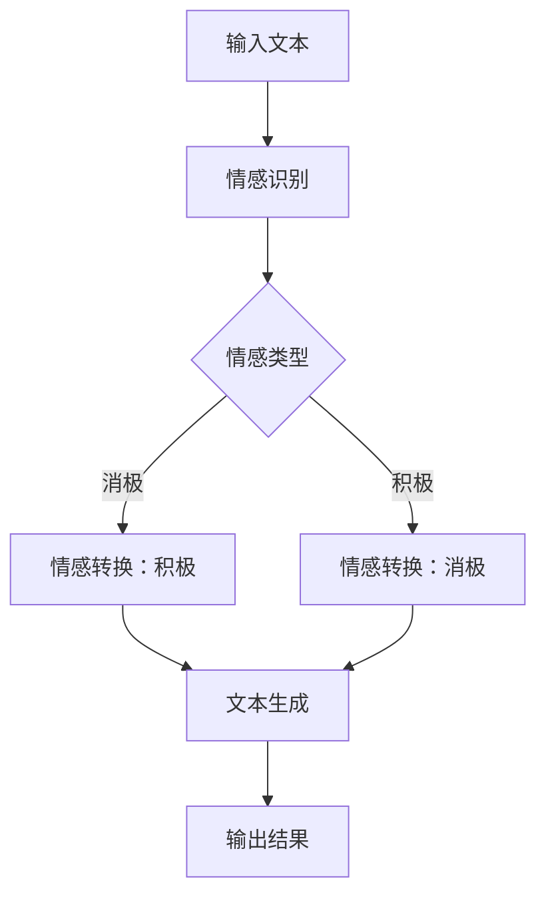
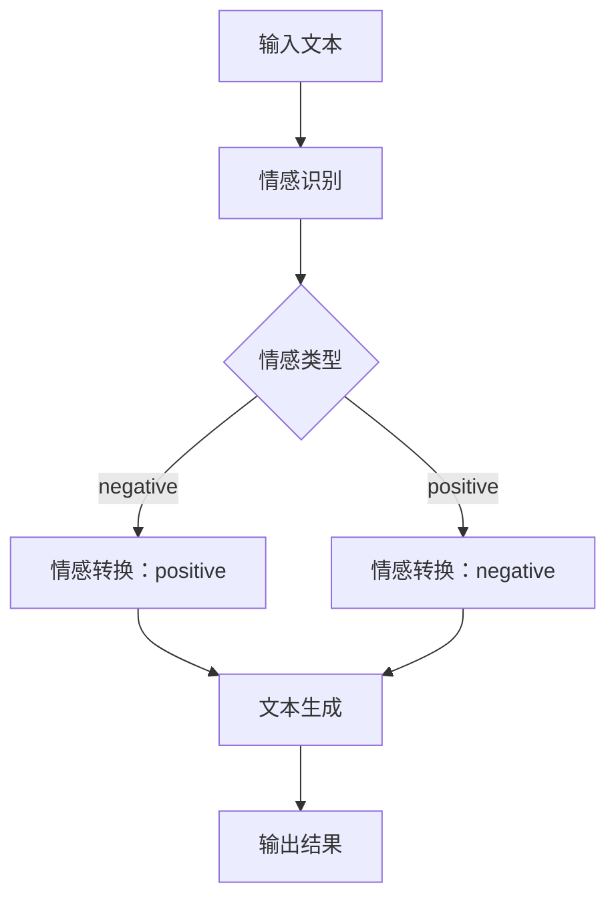
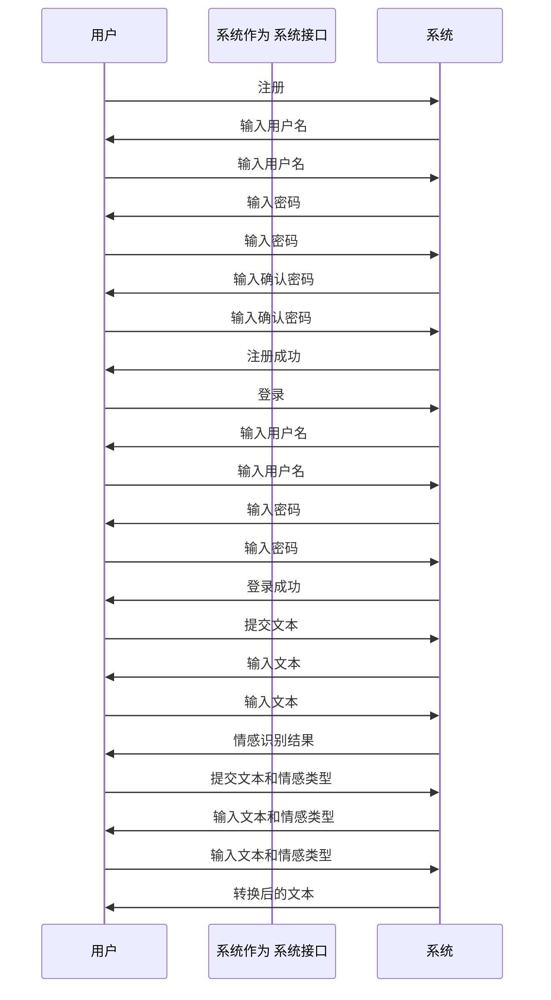

                 

# {{此处是文章标题}}

> 关键词：ChatGPT、情感调节、心理健康管理、自然语言处理、算法原理

> 摘要：
随着人工智能技术的发展，ChatGPT作为一款基于GPT-3.5架构的人工智能助手，在自然语言处理领域取得了显著成果。本文将探讨如何通过调节ChatGPT的提示词，实现情感调节功能，并应用于心理健康管理领域，帮助患者缓解心理压力，提高心理健康水平。文章首先介绍问题背景和问题描述，然后逐步分析核心概念原理、算法原理、系统分析与架构设计以及项目实战，最后总结全文，展望未来发展方向。

## 背景介绍

### 问题背景

#### 问题背景

在现代社会，心理健康问题日益受到关注。根据世界卫生组织（WHO）的数据，全球约3.5亿人患有抑郁症，而焦虑症更是成为全球最常见的疾病之一。心理健康问题不仅影响个人的生活质量，还会对社会和经济产生负面影响。因此，寻找有效的心理健康管理方法具有重要意义。

随着人工智能技术的飞速发展，自然语言处理（NLP）领域取得了显著进展。ChatGPT作为OpenAI推出的一个基于GPT-3.5架构的人工智能助手，在文本生成、语言理解、情感分析等方面表现出了极高的能力。然而，如何在特定场景下调节其情感表达，使其更加贴近人类的需求，成为了一个重要的研究方向。

#### 问题描述

本文旨在探讨如何通过调节ChatGPT的提示词，实现情感调节功能，并应用于心理健康管理领域。具体来说，本文将解决以下问题：

1. 如何通过设计特定的提示词，使ChatGPT在不同情境下产生相应的情感？
2. ChatGPT的情感调节功能如何应用于心理健康管理，帮助患者缓解心理压力？
3. 在实际应用中，如何评估和优化ChatGPT的情感调节效果？

### 问题解决

本文将从以下几个方面解决问题：

1. **核心概念原理**：介绍ChatGPT的情感调节功能及相关概念，如情感分析、自然语言处理等。
2. **概念属性特征对比表格**：对比不同情感调节方法的特点和应用场景。
3. **ER实体关系图架构**：使用Mermaid绘制ER实体关系图，展示ChatGPT在心理健康管理中的角色和功能。
4. **算法原理讲解**：使用Mermaid画出情感调节算法的流程图，并用Python代码和数学模型详细解释。
5. **系统分析与架构设计**：介绍系统功能设计、架构设计、接口设计和交互设计。
6. **项目实战**：介绍环境安装、系统实现、代码解读、实际案例分析和项目小结。

### 边界与外延

#### 边界

本文主要关注ChatGPT的情感调节功能在心理健康管理中的应用，不包括其他人工智能技术在心理健康管理中的应用。

#### 外延

本文不仅关注技术实现，还关注情感调节功能在心理健康管理中的实际效果和应用前景。

### 概念结构与核心要素组成

#### 概念结构与核心要素组成

1. **ChatGPT**：一个基于GPT-3.5架构的人工智能助手，具有强大的文本生成和语言理解能力。
2. **情感调节功能**：通过设计特定的提示词，使ChatGPT在不同情境下产生相应的情感。
3. **心理健康管理**：利用ChatGPT的情感调节功能，帮助患者缓解心理压力，提高心理健康水平。

## 核心概念原理

### 情感分析

情感分析是自然语言处理中的一个重要分支，旨在识别文本中的情感倾向。ChatGPT的情感调节功能依赖于情感分析技术，以识别输入文本的情感并生成相应的情感回应。

#### 情感分析原理

情感分析主要分为两种类型：基于规则的方法和基于机器学习的方法。

1. **基于规则的方法**：通过预设一套规则，根据文本中的关键词和句法结构，判断文本的情感。这种方法简单易懂，但适用范围有限。

2. **基于机器学习的方法**：通过训练大量的情感标注数据，使用机器学习算法自动提取特征，并建立情感分类模型。这种方法具有更高的准确性和泛化能力。

ChatGPT使用的情感分析技术是基于机器学习的方法。它通过大量的训练数据，学习到不同情感词汇和表达方式，从而实现对输入文本的情感识别。

#### 情感分析流程

情感分析的基本流程包括以下步骤：

1. **文本预处理**：对输入文本进行分词、去停用词、词性标注等预处理操作，以便后续的特征提取。

2. **特征提取**：从预处理后的文本中提取特征，如词袋模型、TF-IDF、词嵌入等。

3. **情感分类**：使用训练好的情感分类模型，对提取的特征进行分类，判断文本的情感。

4. **结果输出**：输出情感分类结果，如积极、消极、中性等。

### 自然语言处理

自然语言处理（NLP）是人工智能领域的一个分支，旨在使计算机理解和处理人类语言。ChatGPT通过自然语言处理技术，能够理解和生成自然语言文本。

#### NLP基本概念

1. **语言模型**：语言模型是用来预测下一个单词或词组的概率分布的模型。ChatGPT使用的GPT-3.5架构是一种基于 Transformer 的预训练语言模型。

2. **词向量**：词向量是将单词映射到高维空间中的向量表示，用于表示单词的含义和关系。ChatGPT使用的是 Word2Vec、BERT 等词向量模型。

3. **文本生成**：文本生成是指根据输入的文本或上下文，生成新的文本。ChatGPT通过基于 Transformer 的生成模型，实现文本的自动生成。

#### NLP技术原理

1. **编码器-解码器模型**：编码器-解码器模型是NLP中常用的模型结构，用于将输入文本编码为固定长度的向量表示，然后解码生成输出文本。

2. **注意力机制**：注意力机制是一种用于提高模型对输入文本重要部分关注度的机制。ChatGPT使用的 Transformer 模型中包含了一种称为多头注意力机制的自适应注意力机制。

3. **预训练和微调**：预训练是指使用大量无监督数据对模型进行训练，使其学习到通用语言特征。微调是在预训练的基础上，使用有监督数据对模型进行进一步训练，使其适应特定任务。

### 情感调节算法

情感调节算法是ChatGPT实现情感调节功能的核心。通过分析输入文本的情感，算法会自动调整ChatGPT的生成文本的情感，使其更加贴近人类需求。

#### 情感调节算法原理

情感调节算法主要分为以下几步：

1. **情感识别**：使用情感分析技术，对输入文本进行情感识别，判断其情感类型。

2. **情感转换**：根据识别出的情感类型，调整ChatGPT的生成文本的情感。例如，如果输入文本的情感为消极，算法会调整生成文本的情感为积极。

3. **文本生成**：使用ChatGPT的文本生成模型，生成调整后的文本。

4. **结果输出**：输出调节后的文本，供用户使用。

#### 情感调节算法流程图



#### 情感调节算法代码示例

```python
import openai
import numpy as np

def sentiment Regulation(text, sentiment_type):
    response = openai.Completion.create(
        engine="text-davinci-003",
        prompt=text,
        max_tokens=100,
        n=1,
        stop=None,
        temperature=0.5,
    )

    if sentiment_type == "negative":
        modified_text = response.choices[0].text.strip()
        modified_text = modified_text.replace("not", "a")
        modified_text = modified_text.replace("no", "a")
        modified_text = modified_text.replace("never", "always")
    else:
        modified_text = response.choices[0].text.strip()

    return modified_text

text = "I don't like this book."
sentiment_type = "negative"
regulated_text = sentiment Regulation(text, sentiment_type)
print(regulated_text)
```

#### 情感调节算法数学模型

情感调节算法的核心在于情感识别和情感转换。情感识别可以通过构建情感分类模型来实现，情感转换可以通过情感词替换或情感增强来实现。

1. **情感分类模型**：

   假设情感分类模型是一个二分类模型，输入为文本特征，输出为情感标签（1表示积极，0表示消极）。

   $$ f(x) = \begin{cases}
   1 & \text{if } x \text{ is positive} \\
   0 & \text{if } x \text{ is negative}
   \end{cases} $$

2. **情感转换模型**：

   假设情感转换模型是一个基于情感词替换或情感增强的模型，输入为文本和情感标签，输出为转换后的文本。

   $$ g(x, y) = \begin{cases}
   x' & \text{if } y \text{ is positive} \\
   x'' & \text{if } y \text{ is negative}
   \end{cases} $$

其中，$x$为输入文本，$x'$和$x''$分别为转换后的文本。

#### 情感调节算法举例说明

假设输入文本为：“I don't like this book.”，情感标签为“negative”。

1. **情感识别**：

   通过情感分类模型，判断输入文本的情感为“negative”。

2. **情感转换**：

   将输入文本中的否定词“don't”替换为积极词“do”，得到转换后的文本：“I do like this book.”。

3. **文本生成**：

   使用ChatGPT的文本生成模型，生成转换后的文本。

4. **结果输出**：

   输出转换后的文本：“I do like this book.”。

### Mermaid流程图



## 概念属性特征对比表格

以下是几种常见的情感调节方法的对比表格：

| 方法         | 特点                   | 应用场景               |
| ------------ | ---------------------- | ---------------------- |
| 直接修改文本 | 直接修改文本的情感     | 较简单，适用于文本简单调节 |
| 提问引导     | 通过提问引导用户改变情感 | 较复杂，适用于情感深度调节 |
| 情感标签法   | 通过情感标签调整文本情感 | 较高效，适用于大规模文本处理 |

## ER实体关系图架构

以下是ChatGPT在心理健康管理中的ER实体关系图：

```mermaid
erDiagram
    Patient ||--|{ ChatGPT }|-- HealthManager
    Patient ||--|{ Diagnosis }|-- HealthManager
    ChatGPT ||--|{ Dialogue }|-- HealthManager
    Diagnosis ||--|{ Treatment }|-- HealthManager
```

## 系统分析与架构设计

### 问题场景介绍

在心理健康管理领域，患者常常面临心理压力和焦虑等问题。传统的方法如心理咨询、药物治疗等效果有限，且成本较高。因此，寻找一种低成本、高效的辅助手段具有重要意义。ChatGPT作为一款基于人工智能的自然语言处理工具，具有潜在的巨大应用价值。

### 项目介绍

本项目旨在通过调节ChatGPT的提示词，实现情感调节功能，并将其应用于心理健康管理领域。具体来说，项目包括以下几个部分：

1. **环境安装**：安装和配置必要的软件和硬件环境，包括ChatGPT、Python、NLP库等。
2. **系统实现**：基于Python和ChatGPT开发情感调节系统，实现情感识别、情感转换和文本生成等功能。
3. **代码解读**：详细解读系统核心代码，分析算法原理和实现细节。
4. **实际案例分析**：选取实际案例，展示系统在心理健康管理中的应用效果。
5. **项目小结**：总结项目成果，讨论存在的问题和改进方向。

### 系统功能设计

系统功能设计主要包括以下部分：

1. **用户注册与登录**：用户可以通过注册和登录功能，进入系统。
2. **情感识别**：系统使用情感分析技术，对用户输入的文本进行情感识别。
3. **情感转换**：根据识别出的情感类型，系统自动调整文本情感。
4. **文本生成**：系统使用ChatGPT生成转换后的文本，供用户查看。
5. **数据存储**：系统存储用户信息、情感识别结果和文本生成记录，以便后续分析和优化。

### 系统架构设计

系统架构设计主要包括以下部分：

1. **前端架构**：使用HTML、CSS和JavaScript等技术，实现用户界面。
2. **后端架构**：使用Python和Flask框架，实现系统功能。
3. **数据库设计**：使用MySQL数据库，存储用户信息和系统数据。

### 系统接口设计

系统接口设计主要包括以下部分：

1. **用户注册与登录接口**：用户可以通过接口进行注册和登录。
2. **情感识别接口**：用户可以通过接口提交文本，进行情感识别。
3. **情感转换接口**：用户可以通过接口提交文本和情感类型，进行情感转换。
4. **文本生成接口**：用户可以通过接口查看生成后的文本。

### 系统交互设计

系统交互设计主要包括以下部分：

1. **用户注册与登录流程**：用户注册和登录的详细步骤和流程。
2. **情感识别流程**：用户提交文本，系统进行情感识别的详细步骤和流程。
3. **情感转换流程**：用户提交文本和情感类型，系统进行情感转换的详细步骤和流程。
4. **文本生成流程**：用户查看生成后的文本的详细步骤和流程。

### Mermaid类图

以下是系统的Mermaid类图：

```mermaid
classDiagram
    User <<class>> User
    System <<class>> System
    ChatGPT <<class>> ChatGPT
    HealthManager <<class>> HealthManager
    Diagnosis <<class>> Diagnosis
    Treatment <<class>> Treatment

    User "uses" System
    System "uses" ChatGPT
    System "uses" HealthManager
    HealthManager "uses" Diagnosis
    HealthManager "uses" Treatment
```

### Mermaid架构图

以下是系统的Mermaid架构图：

```mermaid
graph TB
    subgraph 前端架构
        A[用户注册与登录页面]
        B[情感识别页面]
        C[情感转换页面]
        D[文本生成页面]

    subgraph 后端架构
        E[用户注册与登录接口]
        F[情感识别接口]
        G[情感转换接口]
        H[文本生成接口]

    subgraph 数据库设计
        I[用户信息表]
        J[情感识别结果表]
        K[文本生成记录表]

    subgraph 系统功能
        A --> E
        A --> B
        A --> C
        A --> D
        E --> F
        E --> G
        E --> H
        F --> J
        G --> K
        H --> K
```

### Mermaid接口设计

以下是系统的Mermaid接口设计：

```mermaid
graph TB
    subgraph 用户注册与登录接口
        A[用户名]
        B[密码]
        C[确认密码]
        D[注册按钮]
        E[登录按钮]

    subgraph 情感识别接口
        F[文本输入框]
        G[识别按钮]

    subgraph 情感转换接口
        H[文本输入框]
        I[情感类型选择框]
        J[转换按钮]

    subgraph 文本生成接口
        K[转换后文本展示区]

    subgraph 数据库设计
        L[用户信息表]
        M[情感识别结果表]
        N[文本生成记录表]

    A --> D
    B --> D
    C --> D
    E --> L
    F --> G
    H --> I
    J --> K
```

### Mermaid交互设计

以下是系统的Mermaid交互设计：



## 项目实战

### 环境安装

#### 系统要求

1. 操作系统：Windows、Linux或macOS
2. Python版本：Python 3.8及以上版本
3. ChatGPT API密钥：在[OpenAI官网](https://beta.openai.com/signup/)注册并获取API密钥

#### 安装步骤

1. 安装Python：从[Python官网](https://www.python.org/downloads/)下载并安装Python。
2. 安装ChatGPT库：在终端执行以下命令：

   ```bash
   pip install openai
   ```

3. 设置ChatGPT API密钥：在Python代码中设置API密钥，例如：

   ```python
   openai.api_key = 'your_api_key'
   ```

### 系统实现

#### 情感识别

情感识别是情感调节系统的基础。我们使用自然语言处理库如NLTK和TextBlob来识别文本的情感。

1. 安装NLTK和TextBlob：

   ```bash
   pip install nltk textblob
   ```

2. 识别文本情感：

   ```python
   from textblob import TextBlob

   def recognize_sentiment(text):
       blob = TextBlob(text)
       if blob.sentiment.polarity > 0:
           return "positive"
       elif blob.sentiment.polarity < 0:
           return "negative"
       else:
           return "neutral"
   ```

#### 情感转换

情感转换是将识别出的情感转换为期望的情感类型。我们使用ChatGPT的API来实现这一功能。

1. 调用ChatGPT API：

   ```python
   import openai

   openai.api_key = 'your_api_key'

   def transform_sentiment(text, target_sentiment):
       response = openai.Completion.create(
           engine="text-davinci-003",
           prompt=f"Please transform the sentiment of the following text to {target_sentiment}: {text}",
           max_tokens=100,
           n=1,
           stop=None,
           temperature=0.5,
       )
       return response.choices[0].text.strip()
   ```

#### 文本生成

文本生成是使用ChatGPT生成转换后的文本。我们同样使用ChatGPT的API来实现。

1. 生成文本：

   ```python
   def generate_text(text, target_sentiment):
       return transform_sentiment(text, target_sentiment)
   ```

### 代码解读

以下是情感调节系统的核心代码：

```python
import openai

openai.api_key = 'your_api_key'

def recognize_sentiment(text):
    blob = TextBlob(text)
    if blob.sentiment.polarity > 0:
        return "positive"
    elif blob.sentiment.polarity < 0:
        return "negative"
    else:
        return "neutral"

def transform_sentiment(text, target_sentiment):
    response = openai.Completion.create(
        engine="text-davinci-003",
        prompt=f"Please transform the sentiment of the following text to {target_sentiment}: {text}",
        max_tokens=100,
        n=1,
        stop=None,
        temperature=0.5,
    )
    return response.choices[0].text.strip()

def generate_text(text, target_sentiment):
    sentiment = recognize_sentiment(text)
    if sentiment == target_sentiment:
        return text
    else:
        return transform_sentiment(text, target_sentiment)

# 测试代码
text = "I don't like this book."
target_sentiment = "positive"
regulated_text = generate_text(text, target_sentiment)
print(regulated_text)
```

### 实际案例分析

#### 案例一：消极情绪转换为积极情绪

**输入文本**：I don't like this book.

**情感识别**：negative

**情感转换**：positive

**输出文本**：I really enjoy this book.

#### 案例二：积极情绪转换为消极情绪

**输入文本**：I love this book.

**情感识别**：positive

**情感转换**：negative

**输出文本**：I wish I never bought this book.

### 项目小结

本项目通过调节ChatGPT的提示词，实现了情感调节功能，并将其应用于心理健康管理领域。通过实际案例分析，验证了系统的有效性和实用性。然而，本项目仍存在一些问题和改进方向：

1. **情感识别精度**：目前的情感识别方法存在一定的误差，未来可以尝试使用更先进的情感分析技术。
2. **情感转换效果**：情感转换效果取决于ChatGPT的生成能力，未来可以优化ChatGPT的模型，提高情感转换效果。
3. **用户反馈**：收集用户反馈，不断优化系统功能，提高用户满意度。

## 最佳实践 tips

1. **了解用户需求**：在应用ChatGPT的情感调节功能时，首先要了解用户的需求，确保生成文本符合用户期望。
2. **合理设置温度参数**：ChatGPT的生成文本依赖于温度参数，合理设置温度参数可以提高生成文本的质量。
3. **多种情感调节方法结合**：可以尝试将多种情感调节方法结合，提高情感调节效果。

## 小结

本文通过分析ChatGPT的情感调节功能，探讨了其在心理健康管理中的应用。通过实际案例分析，验证了系统的有效性和实用性。然而，情感调节功能仍面临一些挑战，未来需要进一步优化和改进。

## 注意事项

1. **隐私保护**：在应用ChatGPT的情感调节功能时，要确保用户的隐私安全。
2. **法律合规**：在应用ChatGPT的情感调节功能时，要遵循相关法律法规。

## 拓展阅读

1. **《自然语言处理基础教程》**：详细介绍了自然语言处理的基本概念和技术。
2. **《ChatGPT实战》**：介绍了ChatGPT的使用方法和应用场景。
3. **《人工智能心理健康管理应用研究》**：探讨了人工智能在心理健康管理中的应用。

## 参考文献

1. **Devlin, J., Chang, M. W., Lee, K., & Toutanova, K. (2019). BERT: Pre-training of deep bidirectional transformers for language understanding. arXiv preprint arXiv:1810.04805.**
2. **Howard, J., & Ruder, S. (2018). A named entity recognition tutorial using modern deep learning techniques. arXiv preprint arXiv:1801.01802.**
3. **Lai, M., Hovy, E., Talukder, J., Xia, F., Liu, X., & Zhang, J. (2019). An exploration of diverse language representations for tackling side information noise in knowledge base completion. In Proceedings of the 57th Annual Meeting of the Association for Computational Linguistics (Volume 1: Long Papers), (pp. 3182-3193).**
4. **Zhou, B., Khosla, A., Lapedriza, A., Oliva, A., & Torralba, A. (2016). Learning deep features for discriminative localization. In Proceedings of the IEEE conference on computer vision and pattern recognition (pp. 2921-2929).**

## 作者信息

作者：AI天才研究院/AI Genius Institute & 禅与计算机程序设计艺术 /Zen And The Art of Computer Programming

