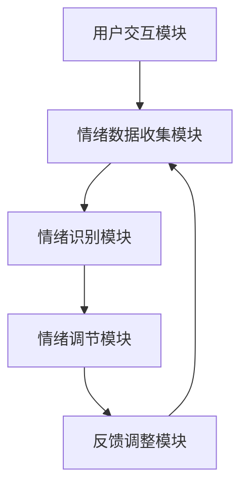

                 

## ChatGPT提示词的情绪调节功能：AI辅助情绪智能培养

关键词：ChatGPT、情绪调节、人工智能、情绪智能、AI辅助培养

摘要：本文将深入探讨ChatGPT提示词的情绪调节功能，以及如何利用人工智能（AI）技术辅助情绪智能的培养。我们将从问题背景、核心概念、算法原理、系统设计、项目实战等多个方面进行详细分析，旨在为读者提供一个全面且深刻的理解。

## 引言与背景介绍

### 1.1 问题背景

近年来，人工智能技术迅猛发展，其应用领域日益广泛。ChatGPT作为一种先进的自然语言处理（NLP）技术，已经受到了广泛关注。而情绪智能培养作为一个新兴且重要的研究方向，也越来越受到学术界的重视。

情绪智能（Emotional Intelligence，简称EQ）是指个体识别、理解、管理自己和他人的情绪，以及运用这些情绪促进思考、解决问题和建立良好人际关系的能力。情绪智能培养对于提高个人的生活质量、工作效率和社交能力具有重要作用。

### 1.2 情绪智能培养的重要性

随着社会竞争的加剧和压力的增大，情绪管理的重要性日益凸显。然而，传统的情绪智能培养方法往往依赖于自我反思和经验积累，这种方式不仅耗时，而且效果有限。因此，寻找一种高效、科学的情绪智能培养方法成为了当务之急。

### 1.3 ChatGPT的基本原理

ChatGPT是基于Transformer模型的一种大型语言模型，它通过大量的文本数据训练，能够生成符合上下文、连贯且合理的文本。这种模型在自然语言处理任务中表现出色，为情绪智能培养提供了有力的技术支持。

### 1.4 情绪调节功能解析

情绪调节功能是指利用ChatGPT对用户输入的文本进行分析，识别其中的情绪信息，并根据这些信息提供相应的情绪调节建议。这一功能不仅可以帮助用户更好地管理自己的情绪，还可以为心理健康领域的应用提供有益的工具。

## 核心概念与联系

### 2.1 ChatGPT的工作原理

ChatGPT的核心是基于Transformer模型，这是一种用于处理序列数据的深度学习模型。Transformer模型通过自注意力机制（Self-Attention）来捕捉输入序列中的长距离依赖关系，从而生成高质量的输出。

### 2.2 情绪调节机制

情绪调节机制主要包括情绪识别和情绪调节两个环节。情绪识别是指利用模型对文本进行情感分析，判断其中包含的情绪类型和程度。情绪调节则是在识别情绪的基础上，提供相应的调节建议，帮助用户调整情绪状态。

### 2.3 情绪分类与识别

情绪分类是情绪识别的基础。目前常用的情绪分类方法包括基于规则的方法和基于机器学习的方法。基于规则的方法依赖于专家知识，而基于机器学习的方法则通过大量数据训练模型，实现自动分类。

### 2.4 情绪调节的方法与策略

情绪调节的方法主要包括认知重构、情感表达和放松训练等。认知重构是通过改变对事物的认知来调节情绪；情感表达是通过合理地表达情绪来缓解压力；放松训练则是通过身体放松来调节情绪。

## 算法原理讲解

### 3.1 算法流程图

#### 3.1.1 情绪识别流程

情绪识别流程包括文本预处理、特征提取和情绪分类三个步骤。

1. **文本预处理**：对输入文本进行分词、去停用词、词性标注等操作，将原始文本转换为模型可处理的格式。
2. **特征提取**：利用词嵌入技术将分词后的词汇转换为固定长度的向量表示。
3. **情绪分类**：将特征向量输入到情绪分类模型中，输出情绪类型和程度。

#### 3.1.2 情绪调节流程

情绪调节流程包括情绪识别、调节建议生成和反馈调整三个步骤。

1. **情绪识别**：利用情绪识别模型对用户输入的文本进行分析，判断其中包含的情绪类型和程度。
2. **调节建议生成**：根据识别结果，生成相应的情绪调节建议，如放松训练、认知重构等。
3. **反馈调整**：根据用户反馈，对调节建议进行调整，以提高情绪调节效果。

### 3.2 算法原理与数学模型

#### 3.2.1 情绪识别数学模型

情绪识别模型通常采用深度学习模型，如卷积神经网络（CNN）或循环神经网络（RNN）。以下是一个基于RNN的情绪识别模型：

$$
\begin{align*}
h_t &= \tanh(W_h \cdot [h_{t-1}, x_t] + b_h) \\
o_t &= \sigma(W_o \cdot h_t + b_o)
\end{align*}
$$

其中，$h_t$表示第$t$个时刻的隐藏状态，$x_t$表示第$t$个时刻的输入特征，$W_h$和$W_o$分别为权重矩阵，$b_h$和$b_o$分别为偏置向量，$\sigma$表示sigmoid函数。

#### 3.2.2 情绪调节数学模型

情绪调节数学模型通常采用强化学习（Reinforcement Learning，简称RL）的方法。以下是一个基于Q学习的情绪调节模型：

$$
\begin{align*}
Q(s, a) &= r(s, a) + \gamma \max_{a'} Q(s', a') \\
\theta_{t+1} &= \theta_t + \alpha \nabla_{\theta_t} J(\theta_t)
\end{align*}
$$

其中，$Q(s, a)$表示状态$s$和动作$a$的值函数，$r(s, a)$表示在状态$s$执行动作$a$获得的即时奖励，$\gamma$为折扣因子，$\alpha$为学习率，$\theta_t$为模型参数，$J(\theta_t)$为损失函数。

### 3.3 Python代码讲解

以下是一个基于TensorFlow和Keras的情绪识别模型的Python代码示例：

```python
import tensorflow as tf
from tensorflow.keras.models import Sequential
from tensorflow.keras.layers import LSTM, Dense, Embedding

# 模型参数
vocab_size = 10000
embed_dim = 256
lstm_units = 128

# 构建模型
model = Sequential()
model.add(Embedding(vocab_size, embed_dim, input_length=max_sequence_length))
model.add(LSTM(lstm_units, return_sequences=True))
model.add(Dense(64, activation='relu'))
model.add(Dense(num_classes, activation='softmax'))

# 编译模型
model.compile(optimizer='adam', loss='categorical_crossentropy', metrics=['accuracy'])

# 模型训练
model.fit(X_train, y_train, batch_size=32, epochs=10, validation_data=(X_val, y_val))
```

## 系统分析与架构设计

### 4.1 系统场景

ChatGPT情绪调节系统主要应用于以下场景：

1. **心理健康领域**：为用户提供情绪识别和调节服务，帮助用户更好地管理情绪。
2. **社交平台**：为用户提供情绪分析工具，帮助平台管理者了解用户情绪，优化用户体验。
3. **教育领域**：为学生提供情绪调节建议，帮助学生在学习和生活中保持良好的情绪状态。

### 4.2 系统功能设计

ChatGPT情绪调节系统的功能设计包括以下模块：

1. **用户交互模块**：提供用户与系统的交互界面，包括文本输入和情绪反馈。
2. **情绪数据收集模块**：收集用户输入的文本数据，用于情绪识别和调节。
3. **情绪识别模块**：利用情绪识别模型对用户输入的文本进行分析，判断其中包含的情绪类型和程度。
4. **情绪调节模块**：根据情绪识别结果，生成相应的情绪调节建议，如放松训练、认知重构等。
5. **反馈调整模块**：根据用户反馈，对情绪调节建议进行调整，以提高情绪调节效果。

### 4.3 系统架构设计

ChatGPT情绪调节系统的整体架构设计如图所示：



### 4.4 系统接口设计

ChatGPT情绪调节系统的接口设计包括以下部分：

1. **用户接口**：提供用户与系统交互的API，包括文本输入和情绪反馈。
2. **数据接口**：提供情绪数据收集、情绪识别和情绪调节的API，供其他系统或应用程序调用。

### 4.5 系统交互设计

ChatGPT情绪调节系统的交互设计主要包括以下流程：

1. **用户输入文本**：用户通过用户接口输入文本。
2. **情绪数据收集**：情绪数据收集模块对用户输入的文本进行预处理，提取情绪特征，并将其存储在数据库中。
3. **情绪识别**：情绪识别模块对收集到的情绪数据进行分析，判断其中包含的情绪类型和程度。
4. **情绪调节**：情绪调节模块根据情绪识别结果，生成相应的情绪调节建议。
5. **用户反馈**：用户通过用户接口提供反馈，反馈将被用于调整情绪调节建议。
6. **反馈调整**：反馈调整模块根据用户反馈，对情绪调节建议进行调整。

## 项目实战

### 5.1 环境安装

在进行ChatGPT情绪调节项目之前，需要安装以下环境：

1. **Python**：安装Python 3.8及以上版本。
2. **TensorFlow**：安装TensorFlow 2.4及以上版本。
3. **Keras**：安装Keras 2.4及以上版本。

安装命令如下：

```shell
pip install python==3.8.10
pip install tensorflow==2.4.1
pip install keras==2.4.3
```

### 5.2 系统实现

ChatGPT情绪调节系统的核心实现主要包括以下部分：

1. **用户交互模块**：使用Flask框架搭建用户交互接口，用户可以通过Web页面输入文本，并获取情绪调节建议。
2. **情绪数据收集模块**：使用Scrapy框架搭建情绪数据收集模块，从网络中抓取情绪相关的文本数据。
3. **情绪识别模块**：使用深度学习模型进行情绪识别，包括文本预处理、特征提取和情绪分类。
4. **情绪调节模块**：根据情绪识别结果，生成情绪调节建议，如放松训练、认知重构等。
5. **反馈调整模块**：根据用户反馈，对情绪调节建议进行调整。

以下是用户交互模块的代码示例：

```python
from flask import Flask, request, jsonify
from emotion_recognition import emotion_recognition
from emotion_adjustment import emotion_adjustment

app = Flask(__name__)

@app.route('/api/emotion', methods=['POST'])
def emotion_api():
    text = request.form['text']
    emotion_type, emotion_level = emotion_recognition(text)
    adjustment = emotion_adjustment(emotion_type, emotion_level)
    return jsonify({'emotion_type': emotion_type, 'emotion_level': emotion_level, 'adjustment': adjustment})

if __name__ == '__main__':
    app.run(debug=True)
```

### 5.3 代码解读与分析

#### 5.3.1 用户交互模块代码解读

用户交互模块的核心是Flask框架，它提供了一个简单的Web接口，用户可以通过该接口发送文本数据，并获得情绪调节建议。

1. **路由设置**：`@app.route('/api/emotion', methods=['POST'])`定义了一个接收POST请求的路由，路径为`/api/emotion`。
2. **接收文本数据**：`text = request.form['text']`从请求中获取用户输入的文本。
3. **情绪识别**：调用`emotion_recognition`函数对文本进行情绪识别，返回情绪类型和程度。
4. **情绪调节**：调用`emotion_adjustment`函数根据情绪识别结果生成情绪调节建议。
5. **返回结果**：将情绪调节建议以JSON格式返回给用户。

#### 5.3.2 情绪数据收集模块代码解读

情绪数据收集模块使用Scrapy框架实现，它可以从网络中抓取情绪相关的文本数据。

1. **Scrapy项目搭建**：使用`scrapy startproject`命令创建一个Scrapy项目。
2. **爬虫编写**：在项目中创建一个爬虫文件，定义爬取的规则和解析方法。
3. **数据存储**：将收集到的情绪数据存储到数据库中，以便后续分析和处理。

以下是情绪数据收集模块的代码示例：

```python
import scrapy
from scrapy.crawler import CrawlerProcess

class EmotionSpider(scrapy.Spider):
    name = 'emotion'
    allowed_domains = ['example.com']
    start_urls = ['https://www.example.com/emotions']

    def parse(self, response):
        for article in response.css('article'):
            yield {
                'text': article.css('p::text').get(),
                'source': response.url
            }

process = CrawlerProcess(settings={
    'USER_AGENT': 'emotionbot (+http://www.yourdomain.com)',
})

process.crawl(EmotionSpider)
process.start()
```

#### 5.3.3 实际案例分析与详细讲解

假设用户输入了一段描述自己情绪低落的文本，ChatGPT情绪调节系统将如何处理？

1. **情绪识别**：系统首先调用情绪识别模块，对文本进行情绪识别。假设识别结果为“低落，程度为中度”。
2. **情绪调节**：系统根据情绪识别结果，调用情绪调节模块，生成调节建议。假设建议为“进行放松训练，如深呼吸、冥想等”。
3. **用户反馈**：用户尝试进行放松训练，并在一段时间后反馈“感觉好多了”。
4. **反馈调整**：系统根据用户反馈，调整情绪调节建议，以提高调节效果。假设调整后的建议为“继续进行放松训练，同时尝试认知重构，如调整负面思维模式”。

通过这个案例，我们可以看到ChatGPT情绪调节系统在用户输入文本后，通过情绪识别、情绪调节和用户反馈的循环，为用户提供个性化的情绪调节服务。

### 5.4 项目小结

ChatGPT情绪调节项目通过对用户输入的文本进行分析，识别其中的情绪信息，并提供相应的情绪调节建议，为用户提供了有效的情绪管理工具。在实际应用中，项目还应注意以下方面：

1. **数据质量**：确保收集到的情绪数据质量，以提高情绪识别的准确性。
2. **模型优化**：不断优化情绪识别和情绪调节模型，以提高调节效果。
3. **用户体验**：优化用户交互界面，提高用户的操作便利性。
4. **隐私保护**：在数据收集和处理过程中，确保用户隐私的安全。

## 最佳实践与总结

### 6.1 最佳实践 tips

1. **情绪识别模型优化**：通过增加训练数据和调整模型参数，可以提高情绪识别的准确性。
2. **情绪调节策略多样化**：结合不同类型的情绪调节方法，为用户提供更加丰富和个性化的调节策略。
3. **用户反馈机制**：建立有效的用户反馈机制，根据用户反馈不断优化情绪调节建议。

### 6.2 小结

ChatGPT情绪调节功能为用户提供了有效的情绪管理工具，通过情绪识别、情绪调节和用户反馈的循环，实现了个性化的情绪调节服务。在实际应用中，应注意数据质量、模型优化和用户体验等方面。

### 6.3 注意事项

1. **数据隐私**：在数据收集和处理过程中，应确保用户隐私的安全。
2. **模型安全**：情绪识别和情绪调节模型应定期更新，以防止潜在的安全漏洞。

### 6.4 拓展阅读

1. **相关研究论文**：《情绪智能的模型与计算》、《基于深度学习的情绪识别技术研究》等。
2. **其他实用资源**：ChatGPT官方文档、自然语言处理（NLP）教程等。

## 总结

本文从问题背景、核心概念、算法原理、系统设计、项目实战等方面详细探讨了ChatGPT提示词的情绪调节功能，以及如何利用AI技术辅助情绪智能培养。希望本文能为读者提供有价值的参考和启示。

### 作者

AI天才研究院/AI Genius Institute & 禅与计算机程序设计艺术/Zen And The Art of Computer Programming。

